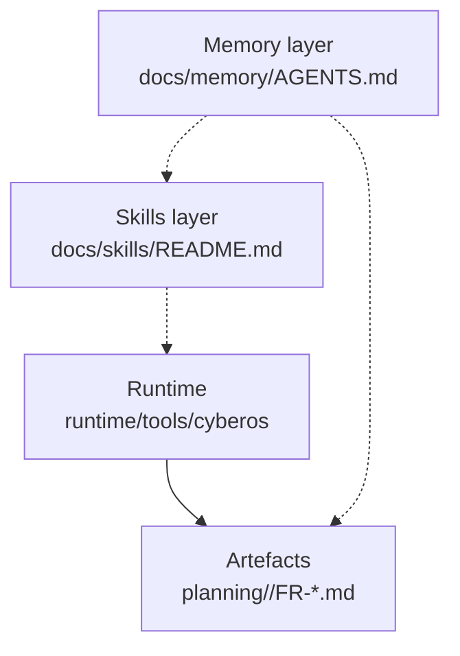

# CyberOS

AI-native internal operations platform for CyberSkill (Vietnam-based software consultancy). Memory layer + skills layer + an opinionated chain that turns natural-language pitches into addressable, assignable tasks.

> "Turn Your Will Into Real" — the CyberSkill slogan and the design principle for this codebase.

## Top-level layout

```text
cyberos/
├── README.md              ← you are here
├── AGENTS.md              ← symlink → docs/memory/AGENTS-CORE.md (per-session protocol)
├── CLAUDE.md              ← @-reference → docs/memory/AGENTS.md (full protocol for Claude Code)
├── CONTRIBUTING.md        ← how to land changes
├── docs/                  ← all design + protocol + skill + contract documentation
│   ├── memory/            ← AGENTS protocol (BRAIN/memory layer) — 32-part operator manual
│   ├── skills/            ← skills layer (CPO/CTO chain) — single-doc operator manual
│   ├── contracts/         ← versioned artefact schemas (feature_request@1, task@1, etc.)
│   ├── prd/               ← Product Requirements Doc (PRD.docx + CHANGELOG.md)
│   └── srs/               ← System Requirements Spec (SRS.docx + CHANGELOG.md)
├── runtime/               ← all executable code
│   ├── tools/             ← cyberos CLI + per-subcommand modules (63+ subcommands)
│   ├── skill_runners/     ← LLM-driven skill runners (BaseSkillRunner framework)
│   ├── mcp/               ← MCP server for the BRAIN (read-only by default)
│   ├── completions/       ← shell tab-completion
│   ├── hooks/             ← cyberos hooks (Aspect 5.1)
│   └── tests/             ← integration tests + skill fixtures
├── outputs/               ← generated artefacts + reference implementations (see outputs/README.md)
├── planning/              ← per-project FRs (one folder per project; auto-generated project-index.md inside)
├── migrations/            ← BRAIN schema migrations
├── tours/                 ← guided walkthroughs (.tour files) for common workflows
└── .cyberos-memory/       ← THE BRAIN (gitignored — local tenant state)
```

## Where to start

- **Reading the protocol** — start with [`docs/memory/README.md`](docs/memory/README.md) Parts 1–12 (32-part operator manual).
- **Running the chain** — `cyberos chain run --pitch "your idea here" --profile solo` (writes `planning/<slug>/FR-001-*.md`).
- **Authoring a new memory** — `cyberos add <TYPE>` (delegates to `outputs/brain_writer.py`).
- **Daily health check** — `cyberos verify` + `cyberos doctor`.
- **Browsing what's in the BRAIN** — `cyberos status --weekly`, or open the audit dashboard at `outputs/_audit-site/index.html`.

## The three layers



1. **Memory layer (`docs/memory/`)** — the AGENTS protocol. Defines what a memory is, how the BRAIN is structured, the §x.y rules every tool must respect, source-tier system, audit ledger, sync-class model.
2. **Skills layer (`docs/skills/`)** — single-doc operator manual covering the 11 chain skills (CPO/CTO personas), the `cyberos chain` umbrella, host adapters, and the chain orchestrator.
3. **Runtime (`runtime/`)** — Python tools that implement the protocols. The umbrella binary is [`runtime/tools/cyberos`](runtime/tools/cyberos) with 63+ subcommands.

## The chain in one diagram

```text
spec (pitch / --spec-file / --prd + --srs)
   ↓
cyberos chain run --profile solo --with-llm
   ↓
fr-with-tasks (collapsed FR + impl-plan)
   ↓
fr-audit (14 INVARIANT checks)
   ↓
planning/<slug>/
  ├── FR-001-*.md       (one user-story = one FR file)
  │   ├── frontmatter   (registry + task index — slim, 25 lines)
  │   └── body          (Problem / Users / Success metrics / Scope / Risks
  │                      / per-task H2 sections with task-meta YAML fences)
  ├── project-index.md  (auto-generated dashboard)
  └── chain-manifest.json  (state for resume / status)
```

Each task has `id` = `FR-NNN-T-MM`, optional subtasks `FR-NNN-T-MM-ST-XX`, sizing (S/M/L/XL), `assignable_to` (human / ai-agent / either), and a concrete `acceptance_test` (shell command OR assertion).

## Key commands

| Goal | Command |
| --- | --- |
| Start a new project from pitch | `cyberos chain run --pitch "..." --profile solo` |
| Start with separate PRD + SRS | `cyberos chain run --pitch "..." --prd p.md --srs s.md` |
| List all FRs | `cyberos fr list` |
| Render task DAG | `cyberos fr task-graph FR-001` |
| Migrate legacy FR to new shape | `cyberos fr-migrate path/to/FR.md --in-place` |
| Regenerate project dashboard | `cyberos project-index planning/<slug>/` |
| BRAIN health | `cyberos verify && cyberos doctor` |
| Find conflicts | `cyberos conflicts` |
| See recent activity | `cyberos status --weekly` |

## Recent shape changes (2026-05-12 sprint)

- **Batch A** — `feature_request@1` reshaped: slim frontmatter + body H2 task sections + fenced `task-meta` YAML. Much more readable than the legacy single-YAML form.
- **Batch B** — optional `subtasks` for `task@1`: `FR-NNN-T-MM-ST-XX` IDs, rendered as sub-nodes in `cyberos fr task-graph`.
- **Batch C** — `cyberos chain run` accepts `--prd` and `--srs` as separate inputs (alongside `--spec-file`).
- **Batch D** — chain auto-generates `project-index.md` (project dashboard) in each `planning/<slug>/` folder; preserves a `<!-- BEGIN human-edited -->` block across regenerations.

See [`docs/memory/CHANGELOG.md`](docs/memory/CHANGELOG.md) for the full batch history (24 batches, 2026-05-04 onward).

## Identifier conventions

| Pattern | Meaning |
| --- | --- |
| `FR-NNN` | Feature Request (user story) |
| `FR-NNN-T-MM` | Task within an FR (ticket) |
| `FR-NNN-T-MM-ST-XX` | Subtask within a task |
| `DEC-NNN` | Decision recorded in `memories/decisions/` |
| `FACT-NNN` | Locked fact recorded in `memories/facts/` |
| `PREF-NNN` | Operator preference in `memories/preferences/` |
| `PERSON-NNN` | Person profile in `memories/people/` |

## Cross-reference cheat sheet

- **Protocol authority:** `docs/memory/AGENTS.md` (full) or `AGENTS.md` symlink (compact, per-session).
- **Skill catalog:** `docs/skills/README.md` — Parts 1–30 cover authoring, runtime, host adapters, chain orchestrator, manual workflow.
- **Contracts:** `docs/contracts/<id>/CONTRACT.md` + `template.md` per contract.
- **CLI reference:** `docs/memory/README.md` Part 27.
- **Per-aspect manual:** `docs/memory/README.md` Part 26 (88 aspects + tier amplifiers).

## License + ownership

Internal to CyberSkill (CYBERSKILL SOFTWARE SOLUTIONS CONSULTANCY AND DEVELOPMENT JOINT STOCK COMPANY). Founder: Stephen Cheng (Trịnh Thái Anh, zintaen@gmail.com).
