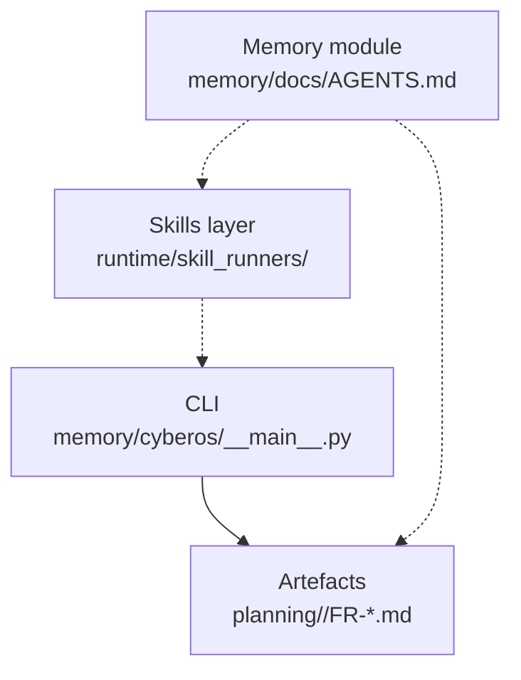

# CyberOS

AI-native internal operations platform for CyberSkill (Vietnam-based software consultancy). Memory layer + skills layer + an opinionated chain that turns natural-language pitches into addressable, assignable tasks.

> "Turn Your Will Into Real" — the CyberSkill slogan and the design principle for this codebase.

## Top-level layout

```text
cyberos/
├── README.md              ← you are here
├── AGENTS.md              ← symlink → memory/docs/AGENTS.md (single source of truth)
├── CLAUDE.md              ← symlink → memory/docs/AGENTS.md
├── CONTRIBUTING.md        ← how to land changes
├── memory/                ← MEMORY MODULE — append-only audit ledger + writer
│   ├── README.md          ← module quick start
│   ├── pyproject.toml     ← registers the `cyberos` console script
│   ├── cyberos/           ← Python package (core/, __main__.py, requirements.txt)
│   ├── docs/              ← AGENTS protocol, schema, invariants, CHANGELOG
│   ├── tools/             ← schema generator, voice linter, encrypt, benchmark
│   ├── tests/             ← pytest suite
│   ├── bench/             ← throughput / cold-CLI / determinism benchmarks
│   └── scripts/           ← install.sh, automation, pre-commit hook
├── docs/                  ← project-level docs (PRD + SRS only)
│   ├── prd/               ← Product Requirements Doc (PRD.md + .docx + CHANGELOG.md)
│   └── srs/               ← System Requirements Spec (SRS.md + .docx + CHANGELOG.md)
├── runtime/               ← non-memory runtime (skill_runners, hooks, mcp, …)
└── .cyberos-memory/       ← THE BRAIN (gitignored — local tenant state)
```

## Where to start

- **Reading the memory protocol** — start with [`memory/docs/AGENTS.md`](memory/docs/AGENTS.md) (the RFC) and [`memory/README.md`](memory/README.md) (module quick start).
- **Daily health check** — `cd memory && python -m cyberos --store ../.cyberos-memory doctor`.
- **Authoring a new memory** — `python -m cyberos --store ../.cyberos-memory --actor <name> put <path> -` (writes via the v2 audit-chained writer).
- **Browsing what's in the BRAIN** — `python -m cyberos --store ../.cyberos-memory state`.

## The three layers



1. **Memory module (`memory/`)** — the AGENTS protocol RFC + the `cyberos` writer. Defines what a memory is, how the audit chain is built, the six file ops, source tiers, sync classes, and exposes the `cyberos` CLI.
2. **Skills layer (`runtime/skill_runners/`)** — LLM-driven skills (CPO/CTO chain) — will move into its own module folder next.
3. **Runtime (`runtime/`)** — the non-memory remainder: skill runners, hooks, MCP server, completions, starter scaffolds.

## The chain in one diagram

```text
spec (pitch / --spec-file / --prd + --srs)
   ↓
cyberos chain run --profile solo --with-llm
   ↓
fr-with-tasks (collapsed FR + impl-plan)
   ↓
fr-audit (14 INVARIANT checks)
   ↓
planning/<slug>/
  ├── FR-001-*.md       (one user-story = one FR file)
  │   ├── frontmatter   (registry + task index — slim, 25 lines)
  │   └── body          (Problem / Users / Success metrics / Scope / Risks
  │                      / per-task H2 sections with task-meta YAML fences)
  ├── project-index.md  (auto-generated dashboard)
  └── chain-manifest.json  (state for resume / status)
```

Each task has `id` = `FR-NNN-T-MM`, optional subtasks `FR-NNN-T-MM-ST-XX`, sizing (S/M/L/XL), `assignable_to` (human / ai-agent / either), and a concrete `acceptance_test` (shell command OR assertion).

## Key commands

| Goal | Command |
| --- | --- |
| Start a new project from pitch | `cyberos chain run --pitch "..." --profile solo` |
| Start with separate PRD + SRS | `cyberos chain run --pitch "..." --prd p.md --srs s.md` |
| List all FRs | `cyberos fr list` |
| Render task DAG | `cyberos fr task-graph FR-001` |
| Migrate legacy FR to new shape | `cyberos fr-migrate path/to/FR.md --in-place` |
| Regenerate project dashboard | `cyberos project-index planning/<slug>/` |
| BRAIN health | `cyberos verify && cyberos doctor` |
| Find conflicts | `cyberos conflicts` |
| See recent activity | `cyberos status --weekly` |

## Recent shape changes (2026-05-12 sprint)

- **Batch A** — `feature_request@1` reshaped: slim frontmatter + body H2 task sections + fenced `task-meta` YAML. Much more readable than the legacy single-YAML form.
- **Batch B** — optional `subtasks` for `task@1`: `FR-NNN-T-MM-ST-XX` IDs, rendered as sub-nodes in `cyberos fr task-graph`.
- **Batch C** — `cyberos chain run` accepts `--prd` and `--srs` as separate inputs (alongside `--spec-file`).
- **Batch D** — chain auto-generates `project-index.md` (project dashboard) in each `planning/<slug>/` folder; preserves a `<!-- BEGIN human-edited -->` block across regenerations.

- **Batch 25** — folder cleanup, part 1: PRD/SRS docs into dedicated `docs/prd/` + `docs/srs/`; memory protocol consolidated under `docs/memory/`.
- **Batch 26** — folder cleanup, part 2: `outputs/` split into `runtime/lib/` + `runtime/starter/` + `var/`. `migrations/` → `runtime/migrations/`. `tours/` → `docs/tours/`.
- **Batch 27** — single-source-of-truth pass: `AGENTS-CORE.md` removed (one canonical `AGENTS.md`). `var/` removed (generated state moves into the BRAIN cache, gitignored). Every functional folder now has exactly one `README.md` entry point.

See [`memory/docs/CHANGELOG.md`](memory/docs/CHANGELOG.md) for the full memory-module history (27+ batches, 2026-05-04 onward).

## Identifier conventions

| Pattern | Meaning |
| --- | --- |
| `FR-NNN` | Feature Request (user story) |
| `FR-NNN-T-MM` | Task within an FR (ticket) |
| `FR-NNN-T-MM-ST-XX` | Subtask within a task |
| `DEC-NNN` | Decision recorded in `memories/decisions/` |
| `FACT-NNN` | Locked fact recorded in `memories/facts/` |
| `PREF-NNN` | Operator preference in `memories/preferences/` |
| `PERSON-NNN` | Person profile in `memories/people/` |

## Cross-reference cheat sheet

- **Protocol authority:** `memory/docs/AGENTS.md` (full RFC). Top-level `AGENTS.md` is a symlink to it.
- **Memory module README:** `memory/README.md` — quick start.
- **Schema + invariants:** `memory/docs/memory.schema.json`, `memory/docs/memory.invariants.yaml`.
- **PRD / SRS:** `docs/prd/PRD.md`, `docs/srs/SRS.md`.

## License + ownership

Internal to CyberSkill (CYBERSKILL SOFTWARE SOLUTIONS CONSULTANCY AND DEVELOPMENT JOINT STOCK COMPANY). Founder: Stephen Cheng (Trịnh Thái Anh, zintaen@gmail.com).
