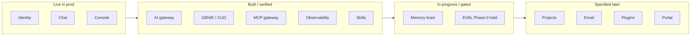

# Where we are on the CyberOS roadmap

**Verdict:** Past **1.0.0**, current release **v1.5.1** (2026-07-25). Production dogfood surface is live; long-horizon phase is still **P0 Foundations** toward a formal P0 exit. Task corpus is ~**50% done** with a thin active queue.

## Authoritative sources

| Lens | Path | Role |
|---|---|---|
| Pulse / backlog | [Status hub](../reference/status.html) (regenerated into `docs/status/`) | Task truth — from task frontmatter, CHANGELOG, VERSION |
| Public product NOW/NEXT/LATER | `apps/console/roadmap.html` → [os.cyberskill.world/roadmap](https://os.cyberskill.world/roadmap) | External product story |
| Phase model | [Milestones](milestones.md) | P0 → P4 sequencing and compliance gates |
| Release ledger | [`CHANGELOG.md`](../../CHANGELOG.md) / [`VERSION`](../../VERSION) | Shipped releases |

Regenerate the status hub after task or changelog moves; do not hand-edit `docs/status/`.

## Module maturity (product view)

## Product view (public roadmap)

| Horizon | Status |
|---|---|
| **Now — live** | Google Workspace sign-in; team chat / DMs / files; profiles; auto-deploy + in-app update prompt |
| **Next — in flight** | Desktop + mobile (release pipeline ready); organizational memory; GENIE assistant; self-hosted AI |
| **Later — planned** | Projects, email, calendar; plugin marketplace; public member portal |

Module pills on the public page: Identity / Chat / Console **live**; AI / GENIE / MCP / OBS / Skills **built**; Memory **in progress**; Projects / Email / Plugins **specified**.

## Delivery pulse (status hub as of 2026-07-26)

- **579** tasks · **253** done · **47** closed · **4** ready_to_implement · **269** draft · **1** on hold · **5** duplicate · **0** stuck WIP (>30d)
- Roughly half the corpus is done/closed; open effort remains concentrated in draft piles (especially chat and memory)
- Latest ship band: **v1.5.0** (17 tasks, 2026-07-25) then patch **v1.5.1**; recent work was batches 9–10 (MCP/OBS/app adopt, HITL verdicts, IMP stub grooming)

**Now shipping (`ready_to_implement`):**

1. `TASK-OBS-004` — LangSmith AI traces (P0) — last open OBS item on the P0 stack
2. `TASK-TEN-002` — plan tiers Starter / Team / Enterprise (P2-tagged)
3. `TASK-TEN-004` — 4-axis metering (seats · API · AI tokens · storage)
4. `TASK-INV-004` — Wise multi-currency webhook (P2)

**On hold:** `TASK-EVAL-001` — BRAIN Phase-0 governance/consent gate (blocks EVAL / personnel insight path).

## Architecture phase (milestones)

Still in **P0 Foundations** (exit target: AUTH, AI, MCP, OBS, CHAT, memory, GENIE/CUO ready; T1 Floor compliance). Specs and code have pushed deep into P0 and ahead into P1–P4 module drafts, but:

- Live operator surface remains P0-core (auth + chat + console)
- Memory is the active “brain” build; EVAL Phase-0 is held
- Large draft piles remain in chat and memory; P1 productivity modules (PROJ, TIME, CRM, EMAIL, …) are mostly specified, not shipping

P1 start still requires the P0→P1 descope gate in [milestones.md](milestones.md) after P0 exit is declared.

## How to read this

- Use the **status hub** for “what ships next” and task truth.
- Use the **console roadmap** for the external product story.
- Use **milestones** for phase/compliance sequencing — do not treat early TEN/INV ready tasks as “we are in P2”; those are pull-forward specs on a still-P0/1.x line.
