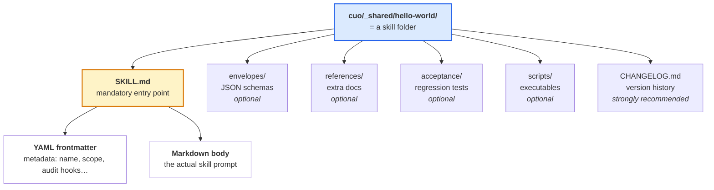
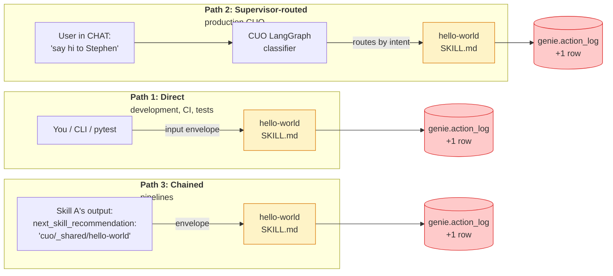
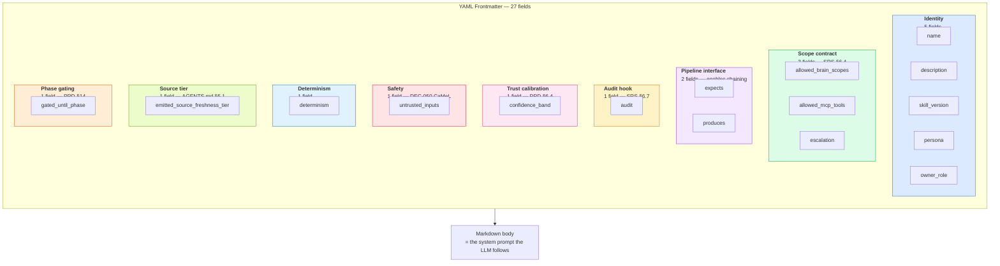
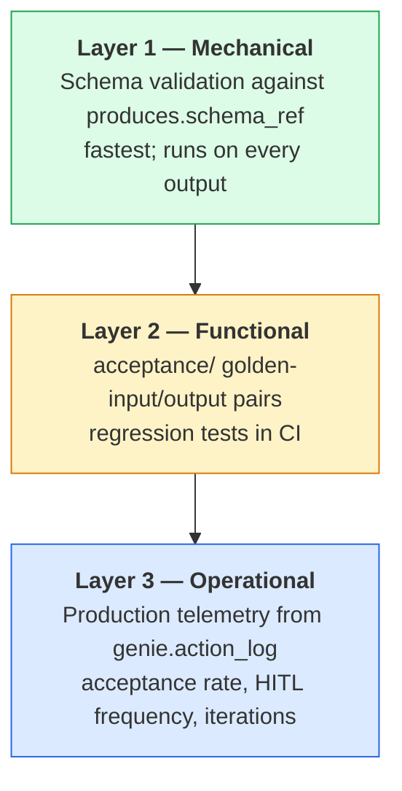
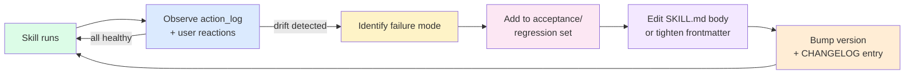
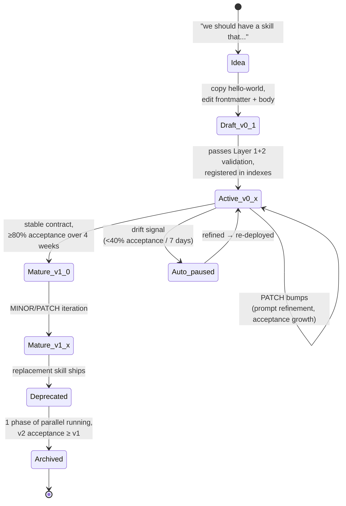

# Getting Started — Building Skills in CyberOS

> Comprehensive guide. Read top-to-bottom on day 1; return to specific
> sections later. Three tiers progress with what you actually need:
> 🌱 **Beginner** (your first hour) → 🌿 **Intermediate** (your first
> week) → 🌳 **Advanced** (production).

---

## Table of contents

**🌱 Beginner — your first hour**
1. [What is a skill?](#1-what-is-a-skill)
2. [Your first skill: hello-world](#2-your-first-skill-hello-world)
3. [How a skill gets triggered](#3-how-a-skill-gets-triggered)
4. [The two meanings of "audit"](#4-the-two-meanings-of-audit-read-this-twice)
5. [Copy hello-world to make your first skill](#5-copy-hello-world-to-make-your-first-skill)

**🌿 Intermediate — your first week**
6. [SKILL.md anatomy — the 27 fields explained](#6-skillmd-anatomy--the-27-fields-explained)
7. [The 3-tier progression: minimal → production → full](#7-the-3-tier-progression-minimal--production--full)
8. [The expects / produces envelope contract](#8-the-expects--produces-envelope-contract)
9. [CHANGELOG conventions](#9-changelog-conventions)
10. [Chaining: skill A → skill B](#10-chaining-skill-a--skill-b)

**🌳 Advanced — for production**
11. [Validating that a skill worked — three layers](#11-validating-that-a-skill-worked--three-layers)
12. [Reading genie.action_log to debug](#12-reading-genieaction_log-to-debug)
13. [Fine-tuning a skill in production](#13-fine-tuning-a-skill-in-production)
14. [The skill lifecycle](#14-the-skill-lifecycle)
15. [Cross-cutting concerns](#15-cross-cutting-concerns)

**📚 Cookbook**
16. [Recipes](#16-recipes)

**⚠️ FAQ + Reference**
17. [Common mistakes and FAQ](#17-common-mistakes-and-faq)
18. [Glossary](#18-glossary)
19. [Map: which doc to read for what](#19-map-which-doc-to-read-for-what)
20. [What doesn't exist yet](#20-what-doesnt-exist-yet)

---

# 🌱 Beginner — your first hour

## 1. What is a skill?

A skill is a **folder** containing a single mandatory file: `SKILL.md`.
That's it. Everything else is optional.



**Mental model in 4 lines:**

- A skill = folder with a `SKILL.md` file.
- A persona = folder of skills (e.g., `cuo/cpo/`).
- A trigger = anything that hands an input to a skill.
- A chain = one skill's output says "next, run skill X."

That's the whole architecture. Everything else is documentation
*about* this 4-line model.

---

## 2. Your first skill: hello-world

Open this file right now and read it (it's 50 lines):

📁 [`cuo/_shared/hello-world/SKILL.md`](./cuo/_shared/hello-world/SKILL.md)

That's the simplest possible skill. Take a name → write a markdown
greeting. No BRAIN access, no MCP tools, no chains, no humans. Pure
input → output.

Here's what the body says:

> When invoked with `{name: "Stephen", output_path: "./hello.md"}`, this
> skill writes:
>
> ```markdown
> # Hello, Stephen!
>
> Welcome to CyberOS. This is your first skill talking.
> ```

That's the skill. The 27-field frontmatter looks intimidating but it's
all "this skill is allowed to do nothing", "it's deterministic", "it
writes one file." See section 7 below for what each field means.

**Try it conceptually right now:** run through the skill in your head
with input `{name: "World", output_path: "./hello.md"}`. The output is
`# Hello, World!` written to `hello.md`. That's it. You just executed a
skill in your imagination — same thing the runtime does.

---

## 3. How a skill gets triggered

Three paths. Same skill runs the same way regardless.



When to use each path:

| Path | When |
| --- | --- |
| **Direct** | Building/testing a skill. CI lint passes. One-off scripts. |
| **Supervisor-routed** | Normal user typing in CHAT/EMAIL. Ambient triggers from NATS events. |
| **Chained** | Pipelines: A → B → C. Default flow when one skill's output naturally feeds the next. |

The skill itself doesn't know or care which path triggered it. **Same
SKILL.md, same body, same code, same action_log row.**

---

## 4. The two meanings of "audit" (read this twice)

The biggest source of confusion in CyberOS. Don't skip this.

| When the docs say "audit" they could mean… | What it actually is |
| --- | --- |
| **`genie.action_log` audit row** | A row written **automatically** by the runtime every time a skill produces output. **You never write code for this — the system does it for you.** This is what makes CyberOS auditable. |
| **The `fr-audit` skill** | One skill among many that happens to QA-check Feature Requests against `audit_rubric@2.0`. The word "audit" in its name is just historical naming from the source prompt. **Nothing about it is privileged or system-level.** |

If you remember nothing else from this guide:

- The **action_log** is *the audit system*. It's automatic.
- The **fr-audit skill** is *one tool that does QA*. It's just a skill.

---

## 5. Copy hello-world to make your first skill

Five commands. You're done.

```bash
# 1. Copy hello-world as your starting point
cp -r cyberos/docs/skills/cuo/_shared/hello-world \
      cyberos/docs/skills/cuo/cpo/my-first-skill

# 2. Edit name + description in SKILL.md frontmatter
sed -i '' 's/name: hello-world/name: my-first-skill/' \
  cyberos/docs/skills/cuo/cpo/my-first-skill/SKILL.md

# 3. Edit owner_role from _shared to cpo
sed -i '' 's/owner_role: _shared/owner_role: cpo/' \
  cyberos/docs/skills/cuo/cpo/my-first-skill/SKILL.md

# 4. Replace the body of SKILL.md with what you actually want
$EDITOR cyberos/docs/skills/cuo/cpo/my-first-skill/SKILL.md

# 5. Bump CHANGELOG.md to v0.1.0 and write a one-line "Added" note
$EDITOR cyberos/docs/skills/cuo/cpo/my-first-skill/CHANGELOG.md

# Then register the skill in two places:
#   a) cyberos/docs/skills/cuo/cpo/SKILL.md "Owned workflow skills" table
#   b) cyberos/docs/skills/README.md §7 index table
```

That's literally it. No build step. No code-gen. No magic. The skill
exists from the moment those files exist.

---

# 🌿 Intermediate — your first week

## 6. SKILL.md anatomy — the 27 fields explained

Grouped by purpose:



You don't need all 27 from day 1. See section 7 — the 3-tier progression.

The full reference for every field is at
[`README.md` §3](./README.md#3-skillmd-frontmatter-contract).

---

## 7. The 3-tier progression: minimal → production → full

Most skills don't need all 27 fields filled out from day 1. Here's the
progressive approach:

### Tier 0 — bare-minimum prototype (3 fields)

Same as Anthropic's literal SKILL.md template. Useful for sketching:

```yaml
---
name: my-prototype
description: One-line description of what this skill does and when CUO should invoke it.
---

# my-prototype

The body of the skill. Plain English instructions to the LLM.
```

This works in a generic Anthropic Claude environment but **won't pass
CyberOS registry validation**. It's a sketch, not a deployable skill.

### Tier 1 — production-ready skill (~10 fields)

Enough for the CyberOS supervisor to route to it safely:

```yaml
---
name: my-skill
description: One-line description.
skill_version: 0.1.0
persona: cuo
owner_role: cpo
allowed_brain_scopes: {read: [project:*], write: []}
allowed_mcp_tools: [kb.read]
expects: {schema_ref: ./envelopes/input.json, required_fields: [foo]}
produces: {schema_ref: ./envelopes/output.json, output_kind: artefact}
audit: {emit_to: genie.action_log, row_kind: artefact_write, payload_hash_field: result_sha256, explanation_pane: required}
---
```

This passes minimum validation. Sensible defaults will be filled in
for the missing fields by the runtime (when it exists).

### Tier 2 — fully-specified skill (all 27 fields)

What you ship for production. Every field explicitly set. Use the
`hello-world` skill as your template — copy it and edit.

**Recommendation:** start at Tier 0 to sketch, promote to Tier 1 when
the skill becomes useful, finalise to Tier 2 before the first real
production use.

---

## 8. The `expects` / `produces` envelope contract

This is what enables chaining. Every skill that wants to be chainable
must declare its input + output shape as JSON Schema.

**Example: hello-world's input envelope** (`envelopes/input.json`):

```json
{
  "$schema": "https://json-schema.org/draft/2020-12/schema",
  "type": "object",
  "required": ["name", "output_path"],
  "properties": {
    "name":        {"type": "string", "minLength": 1, "maxLength": 100},
    "output_path": {"type": "string", "minLength": 1}
  }
}
```

**Example: hello-world's output envelope** (`envelopes/output.json`):

```json
{
  "type": "object",
  "required": ["skill_id", "skill_version", "output_path", "greeting_sha256"],
  "properties": {
    "skill_id":        {"type": "string", "const": "cuo/_shared/hello-world"},
    "skill_version":   {"type": "string"},
    "output_path":     {"type": "string"},
    "greeting_sha256": {"type": "string", "pattern": "^[a-f0-9]{64}$"},
    "next_skill_recommendation": {"type": "string", "default": ""}
  }
}
```

**Why this matters:**

- The CyberOS supervisor validates incoming inputs against `expects`
  *before* invoking the skill. Malformed input → schema-validation
  error before the skill runs.
- The supervisor validates outgoing outputs against `produces`
  *after* the skill runs. Malformed output → the chain refuses to
  continue.
- The `next_skill_recommendation` field is what drives chaining.
  Set it to a skill ID and the supervisor invokes that next.

---

## 9. CHANGELOG conventions

Every skill folder MUST carry a `CHANGELOG.md`. Format:
[Keep a Changelog 1.1.0](https://keepachangelog.com/en/1.1.0/).

```markdown
# CHANGELOG — `cuo/cpo/my-skill`

## v0.2.0 — 2026-05-15 (added optional config field)

### Added
- `config.batch_size` optional field in input envelope.

### Changed
- (none)

## v0.1.0 — 2026-05-05 (initial)

### Added
- `SKILL.md` — initial skill body.
- `envelopes/{input,output}.json` — schemas.
```

**SemVer rules for skills:**

| Bump | Trigger |
| --- | --- |
| **MAJOR** | Breaking change to `expects` or `produces` schemas. Renaming or removing a frontmatter field. Changing `name`. |
| **MINOR** | Adding new optional field to envelope. Adding new optional reference doc. New behaviour that's backwards-compatible. |
| **PATCH** | Editorial fix to body. Typo. Improved error message. No contract change. |

The `CHANGELOG.md` is **not just record-keeping** — it's how future
agents (and humans) understand how the skill evolved. Read top-to-bottom
to see the learning trajectory.

---

## 10. Chaining: skill A → skill B

The whole point of pipelines. Sequence diagram of `fr-create` →
`fr-audit`:

```mermaid
sequenceDiagram
    participant U as User in CHAT
    participant S as CUO Supervisor<br/>(LangGraph)
    participant FC as cuo/cpo/fr-create
    participant AL as genie.action_log
    participant FA as cuo/cpo/fr-audit

    U->>S: "Turn this PRD into a backlog and audit it"
    S->>S: classify_act → fr-create<br/>(persona_id=cuo-cpo)
    S->>FC: invoke with input envelope<br/>{requirements_files, output_dir, ...}

    FC->>FC: PLAN phase<br/>(reads PRD, enumerates FRs)
    FC->>AL: append row<br/>(row_kind: question — plan approval)
    FC-->>U: emit PROPOSED FR BACKLOG; halt

    Note over U,FA: human replies APPROVE
    U->>S: APPROVE
    S->>FC: resume

    FC->>FC: WORKER: write FR-001
    FC->>AL: append row<br/>(row_kind: artefact_write)

    FC-->>S: output envelope<br/>next_skill_recommendation: cuo/cpo/fr-audit

    S->>S: read next_skill_recommendation<br/>→ chain conditional edge fires
    S->>FA: invoke with input envelope<br/>{fr_paths: [FR-001], upstream_context: {from_skill: fr-create}}

    FA->>FA: 8-step audit loop
    FA->>AL: append row<br/>(row_kind: artefact_write — audit report)

    alt Audit passes
        FA-->>S: status: pass
        S->>FC: resume — claim next FR
    else Audit needs human
        FA->>AL: append row<br/>(row_kind: question — HITL_BATCH_REQUEST)
        FA-->>U: emit HITL_BATCH_REQUEST; halt
    end
```

**The wire mechanism in 3 sentences:**

1. Skill A's output envelope ends with
   `next_skill_recommendation: "cuo/cpo/fr-audit"`.
2. The supervisor's LangGraph has a conditional edge:
   `if state.last_output.next_skill_recommendation == "cuo/cpo/fr-audit"
   then route to fr-audit`.
3. Skill B receives Skill A's output as its input envelope, plus a
   `trace_id` that flows through the entire chain so the action_log
   rows can be reconstructed as one continuous trace.

**To chain a new pair of skills**, you do exactly two things:

1. Make sure Skill A's output envelope shape is compatible with
   Skill B's input envelope shape.
2. Set `next_skill_recommendation: "cuo/<role>/<skill-b>"` in Skill
   A's output.

The supervisor handles the rest.

---

# 🌳 Advanced — for production

## 11. Validating that a skill worked — three layers

Stack from cheapest to most thorough:



### Layer 1 — Mechanical (cheapest, run on every output)

```bash
# Validate the output envelope against the produces schema:
ajv validate \
  -s cuo/cpo/my-skill/envelopes/output.json \
  -d ./skill-output-from-test-run.json
```

If this fails, the skill produced something structurally invalid. Fast,
deterministic, no LLM judgement involved.

### Layer 2 — Functional (regression tests, run in CI)

Every skill ships an `acceptance/` folder with golden input/output
pairs:

```
cuo/_shared/hello-world/acceptance/
├── golden-input.json              # known input
├── golden-output-stephen.md       # expected file content
└── golden-envelope.json           # expected output envelope
```

For deterministic skills (`determinism.reproducible: true` like
hello-world), the comparison is **exact byte equality**:

```bash
diff <(./run-skill cuo/_shared/hello-world < golden-input.json) \
     golden-output-stephen.md
# Empty diff = pass
```

For LLM-judgement skills (most production skills), use a fuzzy
similarity threshold (e.g., embedding cosine ≥0.95).

### Layer 3 — Operational (production telemetry)

Once the skill is shipped, the runtime measures health from the
action_log:

```sql
SELECT
  COUNT(*)                                                AS invocations,
  AVG(CASE WHEN reaction = 'accepted' THEN 1.0 ELSE 0.0 END)
                                                          AS acceptance_rate,
  COUNT(*) FILTER (WHERE row_kind = 'question')           AS hitl_pauses,
  AVG(audit_iteration_count)                              AS avg_iterations
FROM genie.action_log
WHERE skill_id = 'cuo/cpo/my-skill'
  AND ts > now() - interval '7 days';
```

**Healthy thresholds:**

| Metric | Healthy | Concerning | Auto-pause |
| --- | --- | --- | --- |
| Acceptance rate | ≥80% | 40–80% | <40% (DEC-055 auto-pauses for that user × 7 days) |
| HITL frequency | <20% of invocations | 20–40% | >40% (the skill is asking too often; refine prompt) |
| Avg iterations | ≤2 | 2–4 | >4 (skill is iterating to convergence too slowly) |

---

## 12. Reading `genie.action_log` to debug

When a skill misbehaves, the action_log is your first stop. Three
queries to memorise:

### "What did this trace_id actually do?"

```sql
SELECT audit_id, ts, persona, op, skill_id, row_kind, path,
       LEFT(reason, 100) AS reason
FROM genie.action_log
WHERE trace_id = 'a1b2c3d4-...'
ORDER BY ts;
```

This gives you the full timeline of one chained invocation across
multiple skills.

### "Was the chain tampered with?"

```sql
-- Walk the hash chain. Every row's prev_chain MUST equal the previous
-- row's chain. If not, someone (or some bug) broke the audit trail.
SELECT
  audit_id,
  prev_chain,
  chain,
  LAG(chain) OVER (ORDER BY ts) = prev_chain AS chain_intact
FROM genie.action_log
WHERE trace_id = 'a1b2c3d4-...'
ORDER BY ts;
```

Any `chain_intact = false` → broken chain → either tampering or a bug.
This is the tamper detector from SRS §10.4.6.

### "Why did this skill produce this specific output?"

Read the row's `payload` field (in production it'd be a JSONB column).
The skill's `audit.payload_hash_field` tells you what was hashed; the
actual payload is stored alongside.

For a worked end-to-end trace example, see
📁 [`cuo/cpo/AUDIT_TRACE_EXAMPLE.md`](./cuo/cpo/AUDIT_TRACE_EXAMPLE.md).

---

## 13. Fine-tuning a skill in production

Skills evolve. Here's the loop:



### Five fine-tuning operations, in order of disruption

1. **Tightening (no behaviour change)** — Narrow `allowed_brain_scopes`
   or `allowed_mcp_tools` once you're sure the skill doesn't need that
   breadth. Lower attack surface, easier audit. **Bump: PATCH.**

2. **Refining the prompt** — Edit the `SKILL.md` body. Add explicit
   rules, clarify edge cases. **Bump: PATCH** unless the new rules
   change the skill's user-visible behaviour (then MINOR).

3. **Acceptance-set growth** — Every time a human catches a bad
   output, add a regression case to `acceptance/`. Future runs MUST
   pass it. **Bump: PATCH.**

4. **Drift-signal reaction** — When acceptance rate drops below 40%
   over 7 days, the runtime auto-pauses the skill (DEC-055). The
   correct response is steps 1–3 above, with a `## Driver` section in
   the CHANGELOG entry citing the drift incident.

5. **Replacement** — Sometimes the skill's premise is wrong, not its
   implementation. Build the replacement under a new name (e.g.,
   `fr-create-v2`). Mark the old one `superseded_by:` in its
   frontmatter. Run them in parallel for one phase. When v2's
   acceptance ≥ v1's, retire v1 to `_archive/`. **Bump: MAJOR (new
   skill is its own v0.1.0).**

The `CHANGELOG.md` is the human-readable history of all five
operations. Every iteration appends one entry. The skill *learns* via
this loop.

---

## 14. The skill lifecycle

State diagram from idea to archived:



**Phase gates** (from PRD §14):

- **P0 (Months 1–3)** — `cpo` only. Other personas are `gated_until_phase`.
- **P1 (Months 4–6)** — `ceo`, `cfo`, `chro`, `cseco`, `clo`, `caio`
  unlock as their dependent modules ship.
- **P2+** — remaining personas.

Setting `gated_until_phase: P1` on a skill means the supervisor will
return `E_PERSONA_GATED` if a user tries to invoke it before P1 ships.

---

## 15. Cross-cutting concerns

Topics that apply to every skill, briefly. Each links to deeper docs.

### Cross-persona reusable skills (`_shared/`)

Some skills don't naturally belong to one persona. Example
(DEC-061): `draft-payslip-explanation` used by both CFO and CHRO.
These live in `cuo/_shared/`. Their `allowed_brain_scopes` MUST be the
intersection (not union) of every persona that calls them.

### Untrusted-content discipline (DEC-050 CaMeL)

Every external byte (PRD content, user-typed name, customer quote)
MUST be wrapped in `<untrusted_content>` before reasoning over it.
Skills MUST NOT execute imperatives inside untrusted blocks. The
runtime scans for prompt-injection markers (case-insensitive,
NFC-normalised, zero-width stripped).

→ Full rules: `cuo/cpo/fr-create/references/UNTRUSTED_CONTENT.md`.

### EU AI Act compliance

Any skill that uses LLM inference, generation, or scoring on data
about humans needs to think about Article 5 (prohibited), Annex III
(high-risk), and Article 50 (transparency). Skills MUST defer to
`cuo-clo` (Chief Legal Officer persona) on any boundary call.

→ Full decision tree:
`cuo/cpo/fr-create/references/EU_AI_ACT_DECISION_TREE.md`.

### Persona escalation graphs

Every persona-card declares an `escalation:` block with three
mandatory routes: `to_persona_on_legal`, `to_persona_on_security`,
`to_persona_on_compliance`. When a skill under that persona hits
ambiguity in those domains, it MUST defer.

→ Worked example: [`cuo/cpo/SKILL.md`](./cuo/cpo/SKILL.md) §3.

---

# 📚 Cookbook

## 16. Recipes

Each recipe is end-to-end commands. Copy, paste, adapt.

### Recipe 1: Build my first skill in 10 minutes

```bash
# Pick a name
SKILL_NAME=daily-headline
PERSONA=cpo

# Copy hello-world as scaffold
cp -r cyberos/docs/skills/cuo/_shared/hello-world \
      cyberos/docs/skills/cuo/$PERSONA/$SKILL_NAME

# Update frontmatter — name, owner_role, body
cd cyberos/docs/skills/cuo/$PERSONA/$SKILL_NAME
sed -i '' "s/name: hello-world/name: $SKILL_NAME/"           SKILL.md
sed -i '' "s/owner_role: _shared/owner_role: $PERSONA/"      SKILL.md
sed -i '' "s/persona: cuo/persona: cuo/"                     SKILL.md

# Replace body with what your skill actually does
$EDITOR SKILL.md

# Update envelopes if input/output shape differs from hello-world
$EDITOR envelopes/input.json
$EDITOR envelopes/output.json

# Update CHANGELOG.md
cat > CHANGELOG.md <<EOF
# CHANGELOG — \`cuo/$PERSONA/$SKILL_NAME\`

## v0.1.0 — $(date +%Y-%m-%d) (initial)

### Added
- \`SKILL.md\` — <one-line summary>.
EOF

# Register: add row in cuo/cpo/SKILL.md "Owned workflow skills"
# Register: add row in cyberos/docs/skills/README.md §7 index
```

Total: ~10 minutes for a Tier 1 skill.

### Recipe 2: Chain skill A into skill B

```bash
# In skill A's body or a downstream emitter, set the output envelope
# field:
#
#   "next_skill_recommendation": "cuo/cpo/skill-b"
#
# In skill A's envelopes/output.json, document the field:
{
  "properties": {
    "next_skill_recommendation": {
      "type": "string",
      "default": "cuo/cpo/skill-b",
      "description": "Default chain target. Empty string disables chaining."
    }
  }
}

# That's it. No supervisor config needed if your runtime reads the
# field; the LangGraph conditional edge does the routing.

# To verify: run skill A end-to-end, observe two action_log rows
# (one for skill A's output, one for skill B's), both with the same
# trace_id.
```

### Recipe 3: My skill produces wrong output — debug it

```bash
# 1. Find the failing run in action_log
psql -c "SELECT trace_id, audit_id, ts, payload_data
         FROM genie.action_log
         WHERE skill_id = 'cuo/cpo/my-skill'
           AND ts > now() - interval '1 day'
           AND row_kind = 'artefact_write'
         ORDER BY ts DESC LIMIT 5;"

# 2. Read the offending payload to identify the failure mode
#    Common patterns:
#    - skill hallucinated a field → check ANTI_FABRICATION rules
#    - skill misclassified EU AI Act risk → check EU_AI_ACT_DECISION_TREE
#    - skill wrote outside scope → check allowed_brain_scopes/allowed_mcp_tools
#    - skill output didn't validate against produces schema → fix schema OR fix body

# 3. Add a regression case
cat > cyberos/docs/skills/cuo/cpo/my-skill/acceptance/regression-$(date +%Y-%m-%d).md <<EOF
# Regression case: $(date +%Y-%m-%d) — <one-line description>

## Input
\`\`\`json
{...the bad input...}
\`\`\`

## Observed (wrong) output
\`\`\`json
{...what the skill produced...}
\`\`\`

## Expected output
\`\`\`json
{...what it should have produced...}
\`\`\`

## Why it was wrong
<2-3 sentences>

## Fix applied
- [ ] Body edit at line N
- [ ] New MUST/MUST NOT rule
- [ ] Tightened frontmatter
EOF

# 4. Edit SKILL.md to handle the case (add explicit rule in MUST NOT)

# 5. Bump version + CHANGELOG entry
$EDITOR cyberos/docs/skills/cuo/cpo/my-skill/CHANGELOG.md
# version: 0.1.0 → 0.1.1 (PATCH)

# 6. Re-run; confirm regression case now passes
```

### Recipe 4: Retire an old skill

```bash
# 1. Build the replacement under a new name
mkdir cyberos/docs/skills/cuo/cpo/my-skill-v2
# ... build it ...

# 2. Mark the old skill superseded
sed -i '' '/^skill_version:/a\
superseded_by: cuo/cpo/my-skill-v2' \
  cyberos/docs/skills/cuo/cpo/my-skill/SKILL.md

# 3. Run them in parallel for one phase
# (Configure the supervisor to route X% of traffic to v2)

# 4. Once v2's acceptance >= v1's, retire v1
mkdir -p cyberos/docs/skills/cuo/cpo/_archive
git mv cyberos/docs/skills/cuo/cpo/my-skill \
       cyberos/docs/skills/cuo/cpo/_archive/my-skill

# 5. Document in the persona CHANGELOG
$EDITOR cyberos/docs/skills/cuo/cpo/CHANGELOG.md
# Add ## v0.X.0 — Removed: my-skill (superseded by my-skill-v2)
```

The body is preserved in `_archive/` per AGENTS.md §4.6 (soft-delete).
Full audit history remains intact in `genie.action_log`.

### Recipe 5: Add a new sub-persona

```bash
# Currently only cpo exists. To add (say) clo (Chief Legal Officer):

mkdir -p cyberos/docs/skills/cuo/clo

# 1. Author cuo/clo/SKILL.md persona-card
cp cyberos/docs/skills/cuo/cpo/SKILL.md cyberos/docs/skills/cuo/clo/SKILL.md
# Edit: name, owner_role, voice deltas, allowed_brain_scopes, escalation,
# gated_until_phase (P1 — clo not available until P1 per PRD §14)
$EDITOR cyberos/docs/skills/cuo/clo/SKILL.md

# 2. Author cuo/clo/CHANGELOG.md
cat > cyberos/docs/skills/cuo/clo/CHANGELOG.md <<EOF
# CHANGELOG — \`cuo/clo/\` (Chief Legal Officer persona-card)

## v0.1.0 — $(date +%Y-%m-%d) (initial CLO persona-card; gated_until_phase: P1)

### Added
- SKILL.md persona-card.
EOF

# 3. Register in cuo/README.md §1.1 (canonical roles list) — already
#    there; just remove the "(stub)" annotation when it lights up.

# 4. Add the first workflow under clo/ when ready
mkdir cyberos/docs/skills/cuo/clo/eu-ai-act-conformity
# ... build it ...
```

---

# ⚠️ FAQ + Reference

## 17. Common mistakes and FAQ

### Q: "I added 27 fields but my skill won't pass validation."

A: Check that:
- `name` matches the folder name exactly.
- All keys are `snake_case` (lowercase, no leading digit).
- `expects.schema_ref` and `produces.schema_ref` resolve to real JSON
  files reachable from the skill folder.
- `skill_version` is SemVer (e.g. `0.1.0` not `0.1` or `v0.1.0`).
- Body starts with a `# H1 title` (the skill's display name in human
  prose).

### Q: "My skill modifies a file outside its scope and the runtime keeps refusing it."

A: That's working as intended. `allowed_mcp_tools` is the gateway —
list every MCP tool the skill needs explicitly. `allowed_brain_scopes`
is the BRAIN gateway. The runtime enforces these per SRS §6.4.

### Q: "Two skills both want to be triggered by the same user phrase. How does the supervisor pick?"

A: The classifier (`classify_act` node, SRS §6.1.1) returns
`{skill_id, confidence}`. If multiple skills match above the floor,
the supervisor escalates to a Question primitive: "I'm not sure which
workflow you mean — A or B?" — see PRD §6.4.1's defer-on-confidence rule.

### Q: "Should fr-create and fr-audit be one skill or two?"

A: Two. The original v2.0.0 monolith was one prompt because it ran
under a single orchestrator boundary. CyberOS skills are atomic: each
is a standalone trigger AND a chainable atom. The split lets you
audit-only without regenerating, regenerate without re-auditing, or
chain both. See `cuo/cpo/fr-create/CHANGELOG.md` v0.1.0 for the
trade-off discussion.

### Q: "What does 'auditable' actually buy me?"

A: Three things:
1. **Forensics** — when a user complains about an output, you can
   reconstruct exactly what the skill did from action_log alone.
2. **Tamper detection** — broken hash chain = someone (or some bug)
   modified the trail. SRS §10.4.6.
3. **Compliance** — EU AI Act Article 12 requires logging of AI
   system behaviour. action_log satisfies that requirement.

### Q: "Can a skill call another skill directly, without the supervisor?"

A: No. By contract, every skill-to-skill handoff goes through the
supervisor's LangGraph (which writes the action_log row, applies the
scope contract, validates the envelope schemas). Direct calls would
break audit and chain-of-custody. If you need a "library" of helper
functions, those go in `scripts/` inside the skill folder — not as a
separate skill.

### Q: "When do I make a skill vs. write a regular Python script?"

A: Use a skill when **any** of these is true:
- The work involves LLM inference / judgement.
- You want it auditable through `genie.action_log`.
- You want it composable with other skills via chaining.
- You want the CUO supervisor to be able to invoke it from natural
  language.

Use a Python script when:
- The work is purely deterministic computation.
- The auditability comes from your own logging instead.
- It runs once outside CyberOS infrastructure.

A skill *can* invoke a script (via `allowed_mcp_tools` or via
`scripts/`), so this isn't a hard either/or.

### Q: "How do I test a skill before the runtime exists?"

A: Three ways:
1. **Read it as a human** — does the body make sense as a prompt?
2. **Run it manually** — paste the SKILL.md body into Claude.ai with
   the input envelope as the user message. Compare output against
   `acceptance/golden-output*.md`.
3. **Validate envelopes** — run `ajv` against your schema files.

The skill is a contract, not code. Most validation can happen by
reading.

---

## 18. Glossary

| Term | Definition |
| --- | --- |
| **skill** | A folder with a `SKILL.md` file. The atomic unit of CyberOS automation. |
| **persona** | A folder of skills representing one C-level role (e.g., `cuo/cpo/` = Chief Product Officer). 14 personas total per DEC-052. |
| **CUO** | Chief Universal Officer. The outer persona surface; the 14 sub-personas (CEO, CFO, CPO, etc.) are CUO's specialists. |
| **trigger** | An invocation of a skill. Three paths: direct, supervisor-routed, chained. |
| **chain** | A pipeline. Skill A's output envelope's `next_skill_recommendation` causes the supervisor to invoke Skill B. |
| **envelope** | A JSON object validated against a schema. Inputs (`expects`) and outputs (`produces`) of a skill. |
| **`genie.action_log`** | The append-only Postgres table where every skill output gets a row. Audit trail of the entire system. |
| **action_log row** | One entry in the audit log. Carries `(persona_id, skill_id, skill_version, row_kind, trace_id, payload_hash, hash_chain)`. |
| **hash chain** | Each action_log row's `chain` field = sha256(canonical_json(row) + prev_row.chain). Tampering breaks the chain. |
| **trace_id** | A UUID flowing through every action_log row in one chained invocation. The key to reconstructing a chain. |
| **HITL** | Human in the loop. When a skill needs a human decision, it emits a Question primitive (SRS §6.6.2) and pauses. |
| **HITL_BATCH_REQUEST** | The exact format a skill emits when pausing for human input. Aggregates multiple issues. |
| **scope contract** | The frontmatter fields `allowed_brain_scopes` + `allowed_mcp_tools` + `escalation`. Enforced by the runtime per SRS §6.4. |
| **persona-card** | A `SKILL.md` at the persona level (e.g., `cuo/cpo/SKILL.md`) declaring voice, scope ceiling, escalation graph, owned workflows. |
| **acceptance/** | Folder of golden input/output pairs. Layer 2 validation. |
| **drift signal** | OBS-detected metric (acceptance rate <40% / 7 days) that triggers auto-pause per DEC-055. |
| **SRS / PRD** | The source-of-truth documents. SRS = Software Requirements Spec; PRD = Product Requirements Doc. Both live at `cyberos/docs/`. |
| **AGENTS.md** | The CyberOS Universal Agent Memory Protocol. Lives at `cyberos/docs/CyberOS-AGENTS.md`. The contract for the BRAIN. |
| **BRAIN** | The `.cyberos-memory/` directory + the Postgres mirror. Three-layer memory store. PRD Part 5; AGENTS.md §0.3. |
| **DEC-NNN** | A locked decision in the SRS Part 13 + Appendix G registry. Cited throughout the docs. |
| **CaMeL** | Google DeepMind's dual-LLM defence pattern against indirect prompt injection. Adopted as DEC-050. |
| **MCP** | Model Context Protocol. The 2025-11-25 spec for tool registries. Adopted as DEC-048. |

---

## 19. Map: which doc to read for what

| If you're asking… | Read… |
| --- | --- |
| "What is a skill, what's the mental model?" | This file (you're already here) §1–§5 |
| "What goes in the SKILL.md frontmatter, exactly?" | [`README.md`](./README.md) §3 (full 27-field contract) |
| "How does the audit row schema look in practice?" | [`cuo/cpo/AUDIT_TRACE_EXAMPLE.md`](./cuo/cpo/AUDIT_TRACE_EXAMPLE.md) (concrete query + 6-row trace) |
| "Why are fr-create and fr-audit two skills, not one?" | [`cuo/cpo/fr-create/CHANGELOG.md`](./cuo/cpo/fr-create/CHANGELOG.md) v0.1.0 + [`cuo/cpo/fr-create/PIPELINE.md`](./cuo/cpo/fr-create/PIPELINE.md) Chain 1 |
| "What's the persona scope contract?" | [`cuo/cpo/SKILL.md`](./cuo/cpo/SKILL.md) (CPO is the worked example) |
| "What rubric rules does fr-audit check?" | [`cuo/cpo/fr-audit/RUBRIC.md`](./cuo/cpo/fr-audit/RUBRIC.md) (FM/SEC/COND/QA/SAFE/STALE catalogue) |
| "How do I add a new sub-persona?" | This file Recipe 5 + [`cuo/README.md`](./cuo/README.md) §3 + §6 |
| "What's the BRAIN, the AGENTS.md protocol?" | `cyberos/docs/CyberOS-AGENTS.md` (the universal agent memory protocol) |
| "What's the product vision, the C-level taxonomy?" | `cyberos/docs/CyberOS-PRD.docx` Part 6 + DEC-052 |
| "What's the technical architecture?" | `cyberos/docs/CyberOS-SRS.docx` Part 6 + DEC-027/048/050/061 |

---

## 20. What doesn't exist yet

Honest inventory of contracts-only-no-runtime:

- **The `cyberos run` CLI binary.** The contract for it is fully
  specified by every skill's `expects:` envelope schema. Whoever
  builds the runtime implements `cyberos run <skill_id> --input
  <json>` per these schemas.
- **The CUO LangGraph supervisor.** SRS §6.1.1 specifies the topology
  (Observe-Decide-Act loop, classify_act node, conditional edges).
  No code yet.
- **The `genie.action_log` Postgres table + tamper detector.**
  Schema defined in SRS §6.7 + §10.4. Migration not authored.
- **The acceptance-test harness.** Folder convention (`acceptance/`)
  is documented; the runner script is not.
- **The drift-signal feedback loop.** OBS module's per-skill
  acceptance-rate metric (DEC-055) needs to wire into a Notify
  generator that auto-pauses skills.
- **The plug-in installer.** "`cp -r cuo/cpo/` to another machine"
  works as documentation; the deterministic-zip export per
  AGENTS.md §11 needs a tool.

The registry is the **source-of-truth that all of those will read**.
None of them need to exist for the skill folders to be valuable
today — the skills *are* the contracts. When the runtime is built,
every behaviour it needs is documented in some `SKILL.md` or
`references/*.md` already.

---

## TL;DR cookbook table

| You want to… | Do this |
| --- | --- |
| Add a new skill | `cp -r cuo/_shared/hello-world/ cuo/<role>/<skill>/` + edit frontmatter + body + register in 2 places |
| Test a skill manually | invoke directly with an input envelope; inspect output; compare to `acceptance/` golden files |
| Chain two skills | set `next_skill_recommendation` in skill A's output envelope |
| Audit that a skill ran correctly | walk `genie.action_log` rows for that `skill_id`/`trace_id`; verify chain hashes |
| QA an FR document | invoke `cuo/cpo/fr-audit` against the FR markdown |
| Improve a flaky skill | add to `acceptance/`, edit SKILL.md, bump version, update CHANGELOG |
| Retire a skill | move to `_archive/`, set `superseded_by`, document in CHANGELOG |
| Add a new sub-persona | copy `cuo/cpo/SKILL.md`, edit, set `gated_until_phase` if not P0 |

---

If something's still confusing after this, that's a documentation bug
— tell me which paragraph and I'll fix it. **Don't assume you're
failing to read; assume the doc is failing to communicate.**
