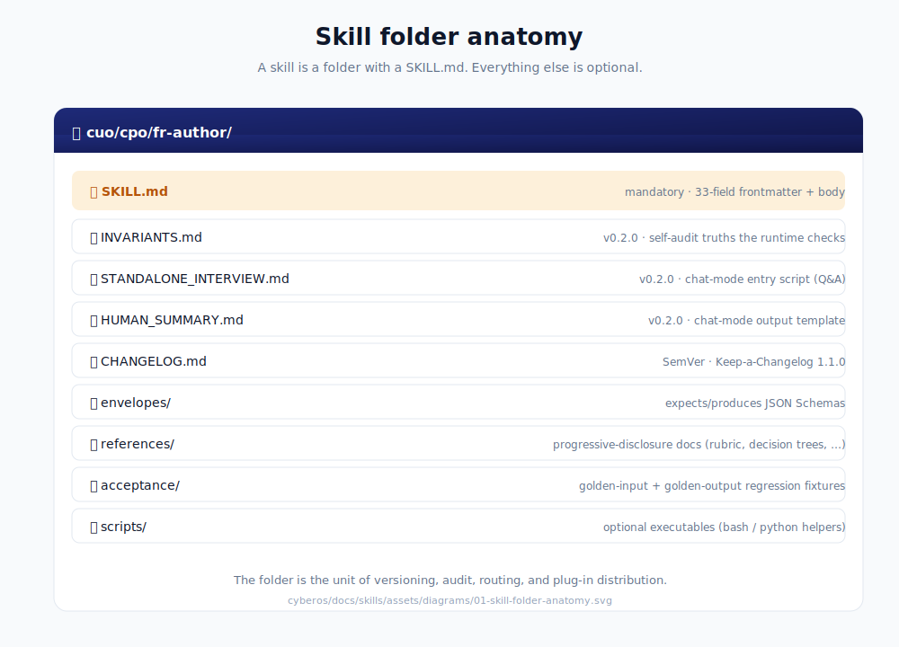
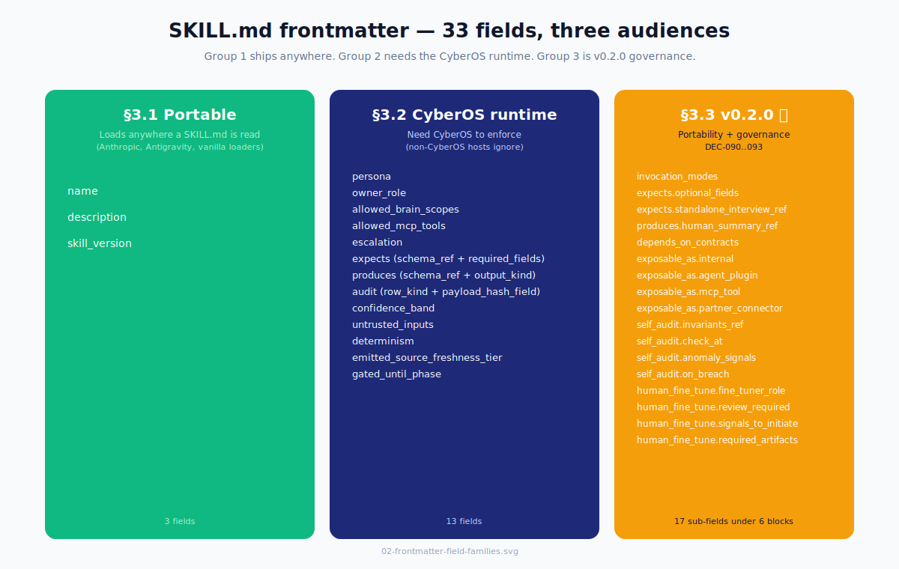
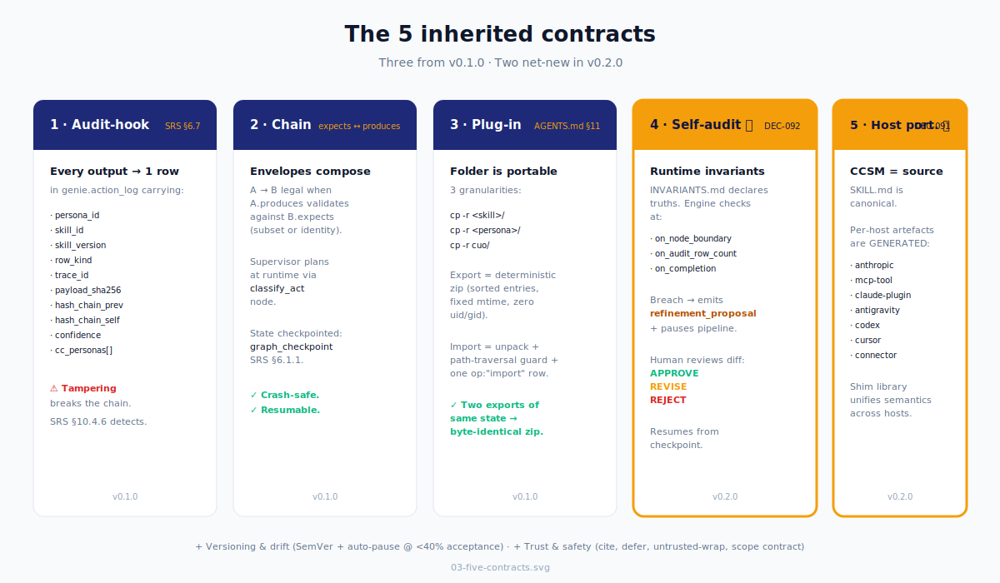
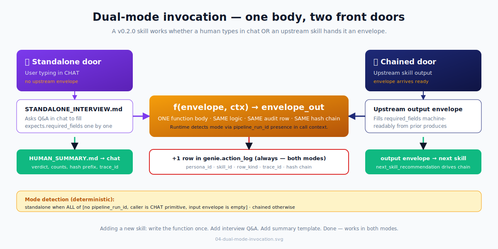
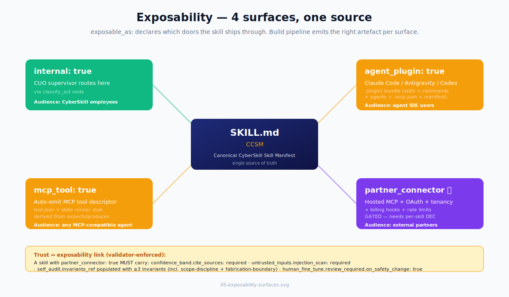
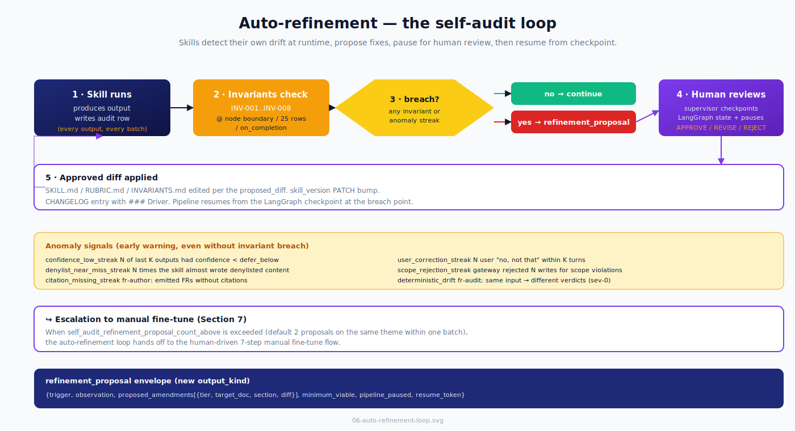
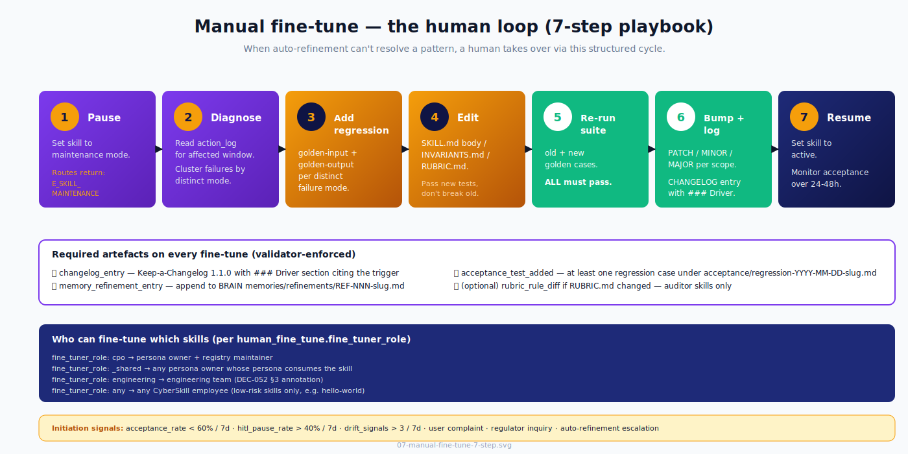
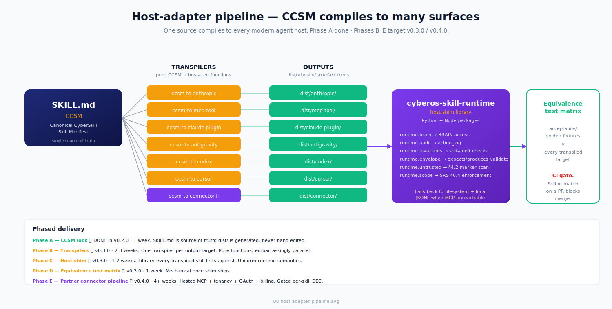
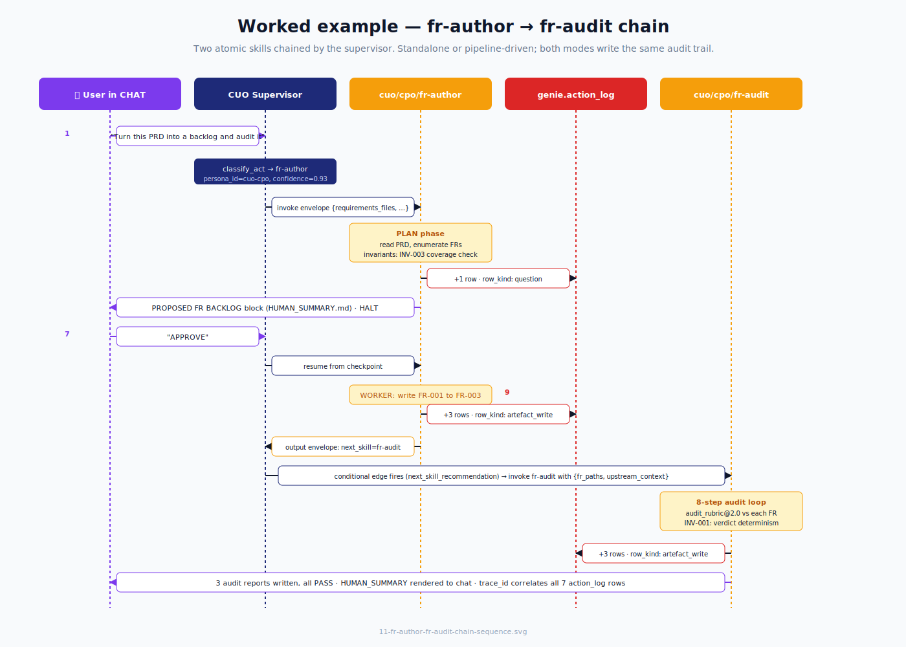
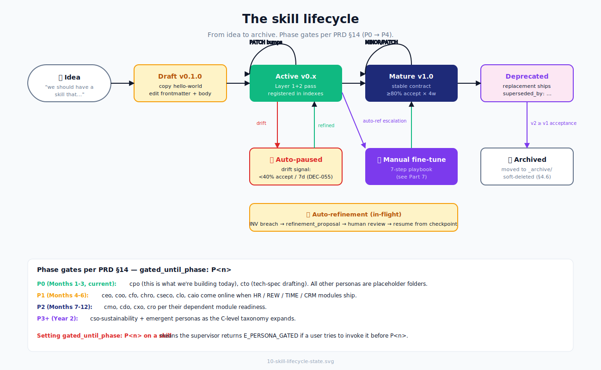

# `cyberos/docs/skills/` — The CyberSkill Skill Wiki

> **One document. Everything you need to know about CyberOS skills.** Mental model · anatomy · five contracts · dual-mode invocation · exposability · auto-refinement · manual fine-tune · skills↔contracts split · host-adapter strategy · build-a-skill walkthroughs · runtime architecture · security model · performance & observability · per-persona quickstart · cookbook · FAQ · glossary. Read top-to-bottom on day 1 as your onboarding curriculum; come back to specific Parts as reference.

> **🚀 Running the chain TODAY (before runtime ships)?** Two modes:
>
> - **★ Automated** — give a pitch + answer HITL questions; the agent does everything else. Trigger phrase + agent runbook in [**CHAIN_ORCHESTRATOR.md**](./CHAIN_ORCHESTRATOR.md).
> - **Manual** — drive every step yourself. Procedure in [**MANUAL_WORKFLOW.md**](./MANUAL_WORKFLOW.md).
>
> Both modes are **host-agnostic** — Cowork (★ for automated), Claude Code, Cursor, Codex CLI, Gemini CLI, OpenCode, Windsurf, Copilot CLI, etc. Per-host setup in [**HOST_ADAPTERS.md**](./HOST_ADAPTERS.md). Pin all three docs when starting a new project.

> **📋 What's planned next?** → [**CHANGELOG.md**](./CHANGELOG.md) v0.2.10 entry (2026-05-11) lists three TIER-1 modifications (`.out-of-scope/` registry, `domain-context@1` contract, vertical-slice rule) and three TIER-2 additions (`lifecycle_state` field, `zoom-out` meta-skill, `caveman` operational_mode) lifted from mattpocock-skills, ECC, superpowers, and AGENTS.md protocol synthesis. Backed by the multi-phase plan in `<workbench>/.cyberos-memory/project/skills-evolution/cyberos-skills-evolution-plan.md`.

---

## Table of contents

- **Part 1** — [What is a skill, in 90 seconds](#part-1--what-is-a-skill-in-90-seconds)
- **Part 2** — [Anatomy: the 33-field SKILL.md contract](#part-2--anatomy-the-33-field-skillmd-contract)
- **Part 3** — [The 5 inherited contracts](#part-3--the-5-inherited-contracts)
- **Part 4** — [Dual-mode invocation: standalone OR chained](#part-4--dual-mode-invocation-standalone-or-chained)
- **Part 5** — [Exposability: plugin / MCP / connector](#part-5--exposability-plugin--mcp--connector)
- **Part 6** — [Auto-refinement: the self-audit loop](#part-6--auto-refinement-the-self-audit-loop)
- **Part 7** — [Manual fine-tune: the human loop](#part-7--manual-fine-tune-the-human-loop)
- **Part 8** — [Skills vs. contracts: the v0.2.0 split](#part-8--skills-vs-contracts-the-v020-split)
- **Part 9** — [Host-adapter strategy: CCSM → Anthropic / Antigravity / Codex / MCP](#part-9--host-adapter-strategy)
- **Part 10** — [Build a skill: step-by-step](#part-10--build-a-skill-step-by-step)
- **Part 11** — [Worked example end-to-end: fr-author → fr-audit](#part-11--worked-example-end-to-end-fr-author--fr-audit)
- **Part 12** — [Runtime architecture: LangGraph + action_log + NATS](#part-12--runtime-architecture-langgraph--action_log--nats)
- **Part 13** — [Validate & debug](#part-13--validate--debug)
- **Part 14** — [The skill lifecycle](#part-14--the-skill-lifecycle)
- **Part 15** — [Security model deep-dive](#part-15--security-model-deep-dive)
- **Part 16** — [Performance & observability](#part-16--performance--observability)
- **Part 17** — [Localization & i18n](#part-17--localization--i18n)
- **Part 18** — [Anti-patterns: what NOT to do](#part-18--anti-patterns-what-not-to-do)
- **Part 19** — [Cookbook: 13 recipes](#part-19--cookbook-13-recipes)
- **Part 20** — [Routing: how CUO picks a skill](#part-20--routing-how-cuo-picks-a-skill)
- **Part 21** — [Per-persona quickstart](#part-21--per-persona-quickstart)
- **Part 22** — [Migration from non-CyberOS skills](#part-22--migration-from-non-cyberos-skills)
- **Part 23** — [Index of skills + contracts](#part-23--index-of-skills--contracts)
- **Part 24** — [How to add a new skill](#part-24--how-to-add-a-new-skill)
- **Part 25** — [FAQ + glossary](#part-25--faq--glossary)
- **Part 26** — [What doesn't exist yet](#part-26--what-doesnt-exist-yet)
- **Part 27** — [Citations](#part-27--citations)

---

## Part 1 — What is a skill, in 90 seconds

A skill is a **folder** containing a single mandatory file: `SKILL.md`. That's it. Everything else is optional.



The mental model in five lines: a **skill** is a folder with a `SKILL.md` (the atomic unit of versioning, audit, routing, and plug-in distribution). A **persona** is a folder of skills (e.g., `cuo/cpo/` is the Chief Product Officer; 14 personas total per DEC-052). A **trigger** is anything that hands an envelope to a skill — three paths, direct, supervisor-routed, or chained. A **chain** is when one skill's output envelope's `next_skill_recommendation` causes the supervisor to invoke another skill. A **contract** is a versioned schema (NOT a skill) under `cyberos/docs/contracts/`, declared via `depends_on_contracts:` in any consumer skill's frontmatter.

That's the whole architecture. Everything below is documentation about this five-line model. The shape is deliberate: a folder with a `SKILL.md` is the lowest common denominator across every modern agent host (Claude Code, Antigravity, Codex, Cursor, plus MCP tool registries), so the same source compiles to plugin, MCP tool, connector, Antigravity skill, or plain prompt without rewriting. The transpiler pipeline that does this compilation is documented in [Part 9](#part-9--host-adapter-strategy).

---

## Part 2 — Anatomy: the 33-field SKILL.md contract

Every workflow `SKILL.md` MUST carry the v0.2.0 frontmatter contract. Persona-cards (`cuo/<role>/SKILL.md`) carry a strict subset (no pipeline interface, no contract dependencies). Contracts (under `cyberos/docs/contracts/`) carry a smaller, contract-specific frontmatter — see [Part 8](#part-8--skills-vs-contracts-the-v020-split).

### 2.1 The full v0.2.0 frontmatter

```yaml
---
# ── Identity ─────────────────────────────────────────────────────────
name:               <kebab-case skill id; matches folder name>
description:        <one sentence; ≤140 chars; what + when CUO should invoke>
skill_version:      <SemVer; bumped on every CHANGELOG entry>
persona:            <cuo | cuo-<role> | cuo-_shared>
owner_role:         <role enum from §20.1 | _shared>

# ── Scope contract (SRS §6.4) ────────────────────────────────────────
allowed_brain_scopes:
  read:  [<scope-glob>, …]              # e.g. project:*, member:self
  write: [<scope-glob>, …]              # default: empty (read-only skill)
allowed_mcp_tools:  [<tool-name>, …]    # exhaustive; gateway enforces
escalation:
  to_persona_on_legal:    <persona-id | null>      # e.g. cuo-clo
  to_persona_on_security: <persona-id | null>
  to_persona_on_compliance: <persona-id | null>
  to_human_on_irreversible: true                    # default true

# ── Invocation modes (NEW v0.2.0 / DEC-091) ──────────────────────────
invocation_modes:   [standalone, chained]   # one or both; persona cards: [persona_routing_only]

# ── Pipeline interface (chaining contract) ───────────────────────────
expects:
  schema_ref:                   <relative path to JSON schema>
  required_fields:              [<field>, …]
  optional_fields:              [<field>, …]               # NEW v0.2.0
  standalone_interview_ref:     <relative path | null>     # NEW v0.2.0
produces:
  schema_ref:                   <relative path>
  output_kind:                  notify | question | review | act | artefact | refinement_proposal
  human_summary_ref:            <relative path | null>     # NEW v0.2.0

# ── Contract dependencies (NEW v0.2.0 / DEC-090) ─────────────────────
depends_on_contracts:
  - id:        <contract folder name>
    version:   v<n>
    purpose:   <why this skill needs it>
    pin_path:  <full path under cyberos/docs/contracts/>

# ── Exposability (NEW v0.2.0 / DEC-091) ──────────────────────────────
exposable_as:
  internal:           <bool>     # CUO supervisor can route here
  agent_plugin:       <bool>     # ships in plugin bundles
  mcp_tool:           <bool>     # auto-emit MCP tool descriptor
  partner_connector:  <bool>     # gated; needs partner-exposure DEC

# ── Audit hook (SRS §6.7) ────────────────────────────────────────────
audit:
  emit_to:                 genie.action_log     # always
  row_kind:                <one or more enum values>
  payload_hash_field:      <which produced field gets sha256'd>
  explanation_pane:        required

# ── Trust calibration (PRD §6.4) ─────────────────────────────────────
confidence_band:
  default:                 <0.0–1.0>
  defer_below:             0.5
  cite_sources:            required

# ── Untrusted-content discipline (DEC-050; AGENTS.md §4.2) ───────────
untrusted_inputs:
  wrap_in:                 <untrusted_content/>
  injection_scan:          required
  on_marker_hit:           surface_to_human

# ── Self-audit + auto-refinement (NEW v0.2.0 / DEC-092) ──────────────
self_audit:
  invariants_ref:          <relative path to INVARIANTS.md | null>
  check_at:                [on_node_boundary, {on_audit_row_count: 25}, on_completion]
  anomaly_signals:
    confidence_low_streak:     {threshold: <int>, window: <int>}
    user_correction_streak:    {threshold: <int>, window: <int>}
    denylist_near_miss_streak: {threshold: <int>, window: <int>}
    scope_rejection_streak:    {threshold: <int>, window: <int>}
    # plus skill-specific signals
  on_breach:
    emit:                  refinement_proposal
    pause_pipeline:        <bool>
    resume_token_field:    <field name>

# ── Manual fine-tune (NEW v0.2.0 / DEC-093) ──────────────────────────
human_fine_tune:
  fine_tuner_role:         <role | _shared | engineering | any>
  review_required:
    on_minor_bump:         <bool>
    on_major_bump:         <bool>      # always true for safety/scope changes
    on_safety_change:      <bool>
  signals_to_initiate:
    - acceptance_rate_below: <float>
    - hitl_pause_rate_above: <float>
    - drift_signal_count_above: <int>
    - <skill-specific signals>
  procedure_ref:           <path | null>      # null = use Part 7 default playbook
  required_artifacts:
    - changelog_entry
    - acceptance_test_added
    - memory_refinement_entry
  blackout_windows:        []        # ISO date ranges where edits are frozen

# ── Determinism ──────────────────────────────────────────────────────
determinism:
  reproducible:            <bool>
  fixity_notes:            <e.g. "canonical JSON, sorted keys, no time fields">

# ── Source-tier emitted (AGENTS.md §5.1, §6, §9.1) ───────────────────
emitted_source_freshness_tier: <int ≥ 1 | null>   # null → tier 99 default
gated_until_phase:         <P0|P1|P2|P3|P4 | null>
---
```

### 2.2 Field families, by audience

The 33 fields split into three groups by who actually reads them at load time. Group 1 is portable across every modern agent host. Group 2 needs the CyberOS runtime to enforce; non-CyberOS hosts silently ignore these. Group 3 is the v0.2.0 governance and portability surface — declared in the SKILL.md but interpreted by transpilers and the host shim, not by every skill loader.



This split is the answer to "if I copy this skill folder into Antigravity, will it work?" — the §3.1 fields will load and route. The §3.2 fields will silently fall back to filesystem-local enforcement via the host shim (Part 9.3). The §3.3 fields are read by the build pipeline at compile time and don't need runtime support.

### 2.3 The 3-tier progression

Most skills don't need all 33 fields filled out from day one.

| Tier | Fields | Outcome |
| --- | --- | --- |
| **Tier 0 — sketch** | `name` + `description` + body | Loads in any Anthropic-style host. Won't pass CyberOS registry validation. Useful for thinking. |
| **Tier 1 — production-routable** | + persona, owner_role, allowed_brain_scopes, allowed_mcp_tools, expects, produces, audit, untrusted_inputs | Passes minimum validation. Routable by the CUO supervisor. Sensible defaults fill the rest. |
| **Tier 2 — fully-specified** | All 33 fields | What you ship to production. Use `cuo/_shared/hello-world/SKILL.md` as your template — copy and edit. |

Promote step-by-step. Don't try to write Tier 2 first.

### 2.4 Body structure

After the frontmatter, the Markdown body MUST contain (in order): `# H1 title` (the skill's display name in human prose), `## When to invoke this skill` (natural-language phrases CUO should route here — this is what the classifier reads at routing time), the body proper (instructions to the LLM, MUST sections, MUST NOT sections, SHOULD sections), `## Failure modes` (link to `references/FAILURE_MODES.md` if it exists), and `## Citations` (every external source — PRD/SRS/AGENTS.md/DEC-NNN references — listed). Everything else is optional and progressive-disclosure.

---

## Part 3 — The 5 inherited contracts

Every skill inherits five contracts from this registry. Three were present in v0.1.0; **two are net-new in v0.2.0** (self-audit, host portability). They compose: a skill that violates any one of them is not a CyberOS skill.



### 3.1 Audit-hook contract — SRS §6.7

Every concrete output (Notify / Question / Review / Act / artefact write / refinement_proposal) produces exactly one row in `genie.action_log`. Row schema: `(persona_id, skill_id, skill_version, row_kind, target, payload_sha256, explanation_pane_ref, confidence, hash_chain_prev, hash_chain_self)`. The hash chain mirrors AGENTS.md §7.2 canonical-JSON rules. Skipping the row is a contract violation surfaced by the CP module's tamper detector (SRS §10.4.6).

### 3.2 Chain contract

Skills compose via the `expects:` ↔ `produces:` envelopes. A LangGraph edge from `skill_A` to `skill_B` is legal when `skill_A.produces.schema_ref` validates against `skill_B.expects.schema_ref` (subset or identity). The CUO supervisor plans the chain at runtime; an example chain (`fr-author` → `fr-audit`) is documented in `cuo/cpo/fr-author/PIPELINE.md`. State between nodes is checkpointed to `genie.graph_checkpoint` per SRS §6.1.1 — chains are crash-safe and resumable.

### 3.3 Plug-in contract — AGENTS.md §11

A skill folder is a self-contained portable unit. Three granularities: one skill (`cp -r cuo/cpo/fr-author/ <other>/skills/cuo/cpo/` plus its declared contracts via `depends_on_contracts:`), one persona (`cp -r cuo/cpo/ <other>/skills/cuo/`), or the whole CUO bundle (`cp -r cuo/ <other>/skills/`). Export = deterministic zip per AGENTS.md §11.2 (sorted entries, fixed mtime, zero uid/gid). Import = unpack with the AGENTS.md §4.1 path-traversal guard + one `op:"import"` audit row.

### 3.4 Versioning + drift contract

Every skill carries `CHANGELOG.md` (Keep-a-Changelog 1.1.0). SemVer rules are explicit: **MAJOR** breaks `expects:`/`produces:` schema, removes a SKILL.md field, or removes a self-audit invariant. **MINOR** adds a backwards-compatible field, a new optional behaviour, a new invariant, or a new optional reference doc. **PATCH** is editorial. The `persona_version` stamp on every output (DEC-054) includes both the persona ID and the active skill version. Drift detection runs in OBS (SRS §6.12); acceptance rate <40% over 7 days auto-pauses the skill for the affected member (DEC-055).

### 3.5 Trust + safety contract — PRD §6.4

Every skill MUST carry a confidence band on every output, cite BRAIN sources for every factual claim (RAG-mandatory; no free-form recall), defer to a human via the Question primitive on irreversible actions / cross-tenant data / legal-or-compliance assertions / confidence below `defer_below` / conflicting BRAIN signals (AGENTS.md §9.1) / REW or LEARN or ESOP writes (PRD §6.4.1) / scope-contract refusal, wrap every external byte in `<untrusted_content>` before reasoning over it (DEC-050 CaMeL pattern), and stamp `emitted_source_freshness_tier` on every BRAIN write so downstream conflict resolution (AGENTS.md §9.1) ranks correctly.

### 3.6 Self-audit + auto-refinement contract — NEW v0.2.0 / DEC-092

Every skill carries `INVARIANTS.md` declaring runtime truths it enforces about its own behaviour. The runtime checks invariants at declared `check_at` checkpoints. Breach → emit `refinement_proposal` envelope (new `output_kind`), pause the pipeline, wait for human review. Detail in [Part 6](#part-6--auto-refinement-the-self-audit-loop).

### 3.7 Host portability contract — NEW v0.2.0 / DEC-091

The SKILL.md is the **Canonical CyberSkill Skill Manifest (CCSM)** — authoritative source of truth. Per-host artefacts under `dist/<host>/` are *generated* by transpilers, never hand-edited. Every skill is shippable to multiple agent hosts (Claude Code, Antigravity, Codex, Cursor, vanilla MCP) without behavioral drift. Detail in [Part 9](#part-9--host-adapter-strategy).

---

## Part 4 — Dual-mode invocation: standalone OR chained

A v0.2.0 skill is **one function body** with **two front doors**.



### 4.1 Mode detection (deterministic)

The runtime puts the skill in standalone mode when ALL of: no `pipeline_run_id` is present in the call context; the caller is the CHAT primitive (a human typing in a thread), not another skill; the input envelope is empty or `{}`. Otherwise: chained mode.

### 4.2 What changes between modes

| Aspect | Standalone | Chained |
| --- | --- | --- |
| `required_fields` source | the user, via `STANDALONE_INTERVIEW.md` | the upstream envelope |
| `optional_fields` source | defaults, unless user volunteers | upstream envelope, falling back to defaults |
| User-facing summary | `HUMAN_SUMMARY.md` rendered to chat | none — supervisor folds into upstream summary |
| Resume on partial input | re-enter the interview at the missing field | error: `MALFORMED_ENVELOPE` |
| `audit.row_kind` count | one row per `question` (interview Q) + one row per concrete output | one row per concrete output |

### 4.3 Why this matters

Without dual-mode, every skill needs two implementations: one for chat, one for pipelines. With dual-mode, the body is written once. The runtime picks the door. Adding a new skill becomes: write the function logic, write the input envelope schema, write `STANDALONE_INTERVIEW.md` (3-5 questions, max), write `HUMAN_SUMMARY.md` (one Markdown template). Done. The skill works in both modes.

### 4.4 Worked example — fr-author

In **standalone** mode, a user in CHAT says "turn this PRD into a backlog, here's the path". The supervisor routes to `fr-author`. The interview fires: Q1 `requirements_files` → answered, Q2 `output_dir` → defaulted, Q3 `manifest_path` → defaulted. The function runs. `HUMAN_SUMMARY.md` renders 3 FR lines + amendment list + trace ID. In **chained** mode, an upstream `cuo/cpo/prd-import` skill (hypothetical) emits `{requirements_files, output_dir, manifest_path, batch_size}` in its output envelope and sets `next_skill_recommendation: cuo/cpo/fr-author`. The supervisor invokes; the function runs; the output envelope feeds whatever's after. Same body. Different door.

---

## Part 5 — Exposability: plugin / MCP / connector

Every v0.2.0 skill declares `exposable_as:` listing which surfaces it can be shipped through. The build pipeline reads this and emits the right artefact per surface.



### 5.1 The four surfaces

| Surface | What it produces | Audience | Gating |
| --- | --- | --- | --- |
| `internal` | A SKILL.md the CUO supervisor can route to via the `classify_act` node. | CyberSkill employees. | None — default true. |
| `agent_plugin` | A `.plugin/` bundle (skills + commands + .mcp.json + manifest.json) per Claude-Code-style plugin spec. Ships in marketplace bundles. | Claude Code / Antigravity / Codex / Cursor users. | None — default true unless skill carries internal-only data. |
| `mcp_tool` | An MCP tool descriptor (`tool.json`) with auto-derived `inputSchema`/`outputSchema` from `expects`/`produces`. Plus a stdio runner stub. | Any MCP-compatible agent (any vendor). | Default false unless trivially safe; must be explicitly opted in. |
| `partner_connector` | A hosted MCP server + OAuth handshake + tenancy isolation + billing hooks + rate limits. | External partners on a marketplace. | **Always gated.** Requires a separate DEC per skill before flag flips to true. |

### 5.2 What the build pipeline does (today / soon)

Today: the flags exist; transpilers are scoped for the v0.3.0 milestone. See [Part 9](#part-9--host-adapter-strategy) for the phased plan and [Part 26](#part-26--what-doesnt-exist-yet) for the honest inventory of what's actually built.

When the build pipeline lands, it will work like this:

```bash
cyberos build cuo/cpo/fr-author
# emits:
#   dist/anthropic/cuo/cpo/fr-author/SKILL.md
#   dist/mcp-tool/fr-author/{tool.json, server.py}
#   dist/claude-plugin/cuo-fr/.plugin/...
#   dist/antigravity/cuo/cpo/fr-author/...
```

One source. Many surfaces. Per-host transpilers strip the irrelevant frontmatter (e.g., Antigravity ignores `audit:`).

### 5.3 The "exposability ↔ trust" link

A skill with `partner_connector: true` MUST also have `confidence_band.cite_sources: required`, `untrusted_inputs.injection_scan: required`, `self_audit.invariants_ref` populated with at least three invariants including INV-`scope-discipline` and INV-`fabrication-boundary`, and `human_fine_tune.review_required.on_safety_change: true`. The validator enforces these as a precondition for the partner flag.

---

## Part 6 — Auto-refinement: the self-audit loop

Every v0.2.0 skill ships with `INVARIANTS.md` listing declarative runtime truths. The runtime checks them at declared `self_audit.check_at` checkpoints. Breach → the skill emits a `refinement_proposal` envelope, the LangGraph supervisor pauses the pipeline, the human reviews, and the chain resumes from a checkpoint.



### 6.1 Anatomy of a refinement_proposal

```yaml
kind: refinement_proposal
skill_id: cuo/cpo/fr-author
skill_version: 0.2.0
trigger: "INV-003 breach: PRD digest mem_… has coverage 0.81 (<0.99) without intentional_summary flag"
observation: |
  Read 4 chunks of {source_path}; processed 81% of source lines.
  Coverage stat in BRAIN write was 0.81 / 1.00.
proposed_amendments:
  - tier: 1
    target_doc: cuo/cpo/fr-author/SKILL.md
    section: §"PLAN phase" step 1
    diff: |
      +  Paginate PRD reads sequentially (offset/limit) instead of
      +  sampling. Track high-water mark. Verify coverage ≥0.99 before
      +  writing the digest, OR set intentional_summary: true with
      +  summary_reason populated.
minimum_viable: "Add coverage check at end of PLAN phase."
pipeline_paused: true
resume_token: refinement_run_id_abc123
```

### 6.2 Anomaly signals (early warning)

Beyond invariant breaches, the runtime tracks streaks. `confidence_low_streak` triggers when N of last K outputs had `confidence < defer_below`. `user_correction_streak` triggers on N user corrections within K turns ("no, not that — do X instead"). `denylist_near_miss_streak` fires when N times in K writes the skill almost wrote denylisted content. `scope_rejection_streak` triggers when the gateway rejected N writes for scope violations. Skill-specific signals stack on top — for example, `fr-audit`'s `deterministic_drift` is sev-0 because the auditor's reproducibility is its core promise. When a signal threshold trips, the skill emits a `refinement_proposal` even without an invariant breach.

### 6.3 What auto-refinement is NOT

It is NOT auto-edit — the skill never modifies its own SKILL.md without human approval. It is NOT silent — every proposal is a Question primitive surfaced to a human. It is NOT a substitute for testing — acceptance fixtures (`acceptance/golden-input.json` + golden-output) still gate every skill_version bump in CI.

### 6.4 When auto-refinement escalates to manual fine-tune

If `self_audit_refinement_proposal_count_above` is exceeded (default: 2 proposals on the same theme within one batch), the auto-refinement loop hands off to the manual fine-tune flow. Reason: the skill has flagged a problem the auto-refinement loop can't resolve and a human investigation is needed. See [Part 7](#part-7--manual-fine-tune-the-human-loop).

---

## Part 7 — Manual fine-tune: the human loop

Auto-refinement (Part 6) catches mechanical drift. Manual fine-tune is for the harder cases: a human notices a pattern, decides the skill needs improvement, and runs a structured edit cycle.



### 7.1 When to manually fine-tune

Manual fine-tune runs when ANY of: auto-refinement hit its escalation threshold (≥2 proposals on the same theme), acceptance rate has dropped below the `human_fine_tune.signals_to_initiate.acceptance_rate_below` threshold (default 0.6 for production skills) over the last 7 days, HITL pause rate is above `signals_to_initiate.hitl_pause_rate_above` (default 0.4 — the skill is asking too often), a regulator or a customer raised a specific concern that requires rule changes, or the persona owner schedules a routine fine-tune cycle (typically every 2 weeks during the first month, monthly thereafter).

### 7.2 The 7-step playbook

1. **Pause** — set skill to maintenance mode. Routes return `E_SKILL_MAINTENANCE`.
2. **Diagnose** — read `genie.action_log` for the affected window. Cluster failures by mode.
3. **Add regression** — write golden-input + golden-output for each distinct failure mode. Land under `acceptance/`.
4. **Edit** — `SKILL.md` body / `INVARIANTS.md` / `RUBRIC.md` (for auditor skills). Aim: pass new regressions without breaking old ones.
5. **Re-run acceptance suite** — old + new golden cases. ALL must pass.
6. **Bump + log** — PATCH if no behaviour change; MINOR if new invariant; MAJOR if envelope changes. CHANGELOG entry with `### Driver` citing the trigger.
7. **Resume** — set skill to active. Monitor acceptance over next 24-48h.

### 7.3 Who can fine-tune which skills

Per `human_fine_tune.fine_tuner_role`:

| `fine_tuner_role` | Who has commit access |
| --- | --- |
| `<role>` (e.g., `cpo`) | The persona owner + the registry maintainer. |
| `_shared` | Any persona owner whose persona consumes the skill. |
| `engineering` | Members of the engineering team (DEC-052 §3 §"engineering" annotation). |
| `any` | Any CyberSkill employee — used for low-risk skills like `hello-world`. |

`review_required` adds approval gates. MINOR bumps default to `false` (override per skill). MAJOR bumps are always `true` — `fine_tuner_role` plus the registry maintainer must both sign off. Safety changes (denylist tweak, scope widen, new MCP tool) are always `true` and add `cuo-cseco` plus `cuo-clo` to the reviewer set. For auditor skills only, rubric rule add/remove also requires `cuo-clo` if the rule touches legal/EU AI Act.

### 7.4 Required artefacts on every fine-tune

A fine-tune is incomplete without three artefacts. **`changelog_entry`** — Keep-a-Changelog 1.1.0, with `### Driver` citing the trigger. **`acceptance_test_added`** — at least one new regression in `acceptance/regression-<YYYY-MM-DD>-<slug>.md`. **`memory_refinement_entry`** — append to BRAIN `memories/refinements/REF-NNN-<slug>.md` describing what was learned and what changed (per AGENTS.md §0.4 + §10 step 6, future agents will read this). Optional but recommended: `rubric_rule_diff` (auditor skills only — the rule-by-rule diff at the top of the CHANGELOG entry), `drift_record` (when a drift signal triggered the cycle, append to BRAIN `memories/drift/<YYYY-MM-DD>-<source-slug>.md`).

### 7.5 Blackout windows

Any ISO date range listed in `human_fine_tune.blackout_windows` freezes edits to the skill. Useful for audit weeks (no skill edits during external compliance review), production launches (no skill edits in the 48 hours bracketing a customer-visible launch), and holiday weeks (no skill edits when the persona owner is offline). The validator rejects any commit touching the skill during a blackout window with `op:rejected reason:blackout-window-active`.

### 7.6 Why this is structured (not freeform)

The temptation with skills is "they're just markdown — anyone can edit them". That's true *technically*, false *operationally*. A skill in production has acceptance fixtures, drift telemetry, downstream consumers, partner exposures. Editing it without the playbook breaks trust calibration and audit chain. The 7-step playbook is the minimum discipline to keep skills evolvable without becoming brittle.

---

## Part 8 — Skills vs. contracts: the v0.2.0 split

Before v0.2.0, the registry conflated two things that are architecturally distinct.

### 8.1 The distinction

| | **Skill** | **Contract** |
| --- | --- | --- |
| What it does | *acts*: takes input, produces output, writes audit row | *constrains*: declares the shape of an artefact, envelope, or wire protocol |
| Folder location | `cyberos/docs/skills/cuo/<role>/<skill-id>/` | `cyberos/docs/contracts/<contract-id>/` |
| Entry file | `SKILL.md` | `CONTRACT.md` |
| Frontmatter | 33 fields (Part 2) | ~10 fields (much smaller) |
| Has `expects/produces`? | yes | **no** |
| Has `allowed_mcp_tools`? | yes | **no** |
| Has `confidence_band`? | yes | **no** |
| Has `audit.row_kind`? | yes | **no** (a contract isn't an action) |
| Versioned how? | SKILL.md `skill_version` | CONTRACT.md `contract_version` (frontmatter field; layout is flat per registry v0.2.4) |
| Bumped how often? | every CHANGELOG entry | rarely; bumps cascade to every consumer |

### 8.2 How a skill consumes a contract

```yaml
# In the skill's SKILL.md frontmatter:
depends_on_contracts:
  - id:        feature-request          # contract folder name
    version:   v1                        # locks to this major version
    purpose:   generation_skeleton       # human-readable: why this skill needs it
    pin_path:  cyberos/docs/contracts/feature-request/
```

The validator confirms three things: the path resolves to a real `CONTRACT.md`; the skill body's references to that contract use the declared path; on contract MAJOR bumps, every declared consumer is updated (or explicitly opts in to staying on the older version with a CHANGELOG entry).

### 8.3 Three contract kinds

| `contract_kind` | Schema body lives in | Example |
| --- | --- | --- |
| `artefact_schema` | `template.md` (Markdown skeleton) | `feature-request@v1` (the FR template) |
| `envelope_schema` | `schema.json` (JSON Schema) | a hypothetical `pipeline-checkpoint@v1` envelope contract |
| `wire_protocol` | `schema.json` + `protocol.md` | `nats-subjects@v1` (subject names + payload shapes for every NATS subject CyberOS skills emit; first concrete wire_protocol contract, registered v0.2.2) |

### 8.4 Why the split matters for portability

When a skill ships to Antigravity / Codex / a partner connector, the build pipeline needs to package skill + its contract dependencies as one bundle. `depends_on_contracts:` makes that machine-readable. Without it, you'd need to grep skill bodies for path strings. The `_contracts/` namespace turns "what does this skill need to function" from documentation into a build-time artefact.

---

## Part 9 — Host-adapter strategy

The CCSM (this SKILL.md) is the source of truth. Per-host artefacts are generated by transpilers. One source compiles to many surfaces without behavioural drift.



### 9.1 Phased delivery

| Phase | Milestone | Effort | Status |
| --- | --- | --- | --- |
| **A — CCSM lock** | Frontmatter contract finalised; `dist/` is generated, never hand-edited. | 1 week | ✅ done in v0.2.0 (this README is the source of truth). |
| **B — Transpilers** | One transpiler per output target (anthropic / mcp / plugin / antigravity / codex / cursor). Each is a pure function `CCSM → host-artefact-tree`. | 2–3 weeks | 🔵 planned for v0.3.0. |
| **C — Host shim** | A library (`cyberos-skill-runtime` Python + `@cyberos/skill-runtime` Node) every transpiled skill links against. Provides `brain.*`, `audit.*`, `invariants.*` semantics regardless of host. | 1–2 weeks | 🔵 planned for v0.3.0. |
| **D — Equivalence test matrix** | Golden input/output runs across every target. CI gate. | 1 week | 🔵 planned for v0.3.0. |
| **E — Partner connector pipeline** | Hosted MCP + tenancy + OAuth + billing for `partner_connector: true` skills. | 4+ weeks | 🟣 planned for v0.4.0. |

Realistic critical path: ~5 weeks of focused work to get fr-author + fr-audit running on Anthropic + MCP + Antigravity. Each additional host costs days, not weeks, after the shim ships.

### 9.2 What the shim provides (uniform semantics across hosts)

The shim exposes a uniform API: `cyberos.runtime.brain` reads/writes `.cyberos-memory/` (host-agnostic; just FS), `cyberos.runtime.audit` appends to `genie.action_log` OR a local JSONL fallback, `cyberos.runtime.invariants` runs `INVARIANTS.md` checks at declared checkpoints, `cyberos.runtime.envelope` validates expects/produces against schema, `cyberos.runtime.untrusted` applies the AGENTS.md §4.2 marker scan, and `cyberos.runtime.scope` enforces SRS §6.4 scope contract. Inside CyberOS the shim talks to real `kb.*`, `brain.*`, `audit.*` MCP servers. Outside CyberOS the shim falls back to filesystem-local `.cyberos-memory/` and a local JSONL — degraded but functional.

### 9.3 Adapter-strategy summary table

| Host | Discovery path | Frontmatter dialect | Memory fallback | Adapter status |
| --- | --- | --- | --- | --- |
| Claude Code | `~/.claude/skills/` | Anthropic SKILL.md | filesystem `.cyberos-memory/` | 🔵 v0.3.0 |
| Antigravity | `.gemini/antigravity/skills/` | (investigate; likely SKILL.md-compatible) | filesystem `.cyberos-memory/` | 🔵 v0.3.0 |
| Codex | `~/.codex/instructions/` | Codex agent format | filesystem `.cyberos-memory/` | 🔵 v0.3.0 |
| Cursor | `.cursorrules` | concat-style | (none — read-only) | 🔵 v0.3.0 |
| Vanilla MCP | served via stdio/HTTP | MCP `tool.json` | partner-side | 🔵 v0.3.0 |
| CyberOS native | `cyberos/docs/skills/` | full v0.2.0 SKILL.md | full BRAIN | ✅ today |

---

## Part 10 — Build a skill: step-by-step

### 10.1 Path 1: copy hello-world (10 minutes, Tier 1)

```bash
SKILL_NAME=daily-headline
PERSONA=cpo

# 1. Copy hello-world as scaffold
cp -r cyberos/docs/skills/cuo/_shared/hello-world \
      cyberos/docs/skills/cuo/$PERSONA/$SKILL_NAME

# 2. Update frontmatter — name, owner_role, body
cd cyberos/docs/skills/cuo/$PERSONA/$SKILL_NAME
sed -i '' "s/name: hello-world/name: $SKILL_NAME/"      SKILL.md
sed -i '' "s/owner_role: _shared/owner_role: $PERSONA/" SKILL.md

# 3. Replace body with what your skill actually does
$EDITOR SKILL.md

# 4. Update envelopes
$EDITOR envelopes/input.json
$EDITOR envelopes/output.json

# 5. CHANGELOG.md v0.1.0 entry
cat > CHANGELOG.md <<EOF
# CHANGELOG — \`cuo/$PERSONA/$SKILL_NAME\`

## v0.1.0 — $(date +%Y-%m-%d) (initial)

### Added
- \`SKILL.md\` — <one-line summary>.
EOF

# 6. Register in two places:
#    - cyberos/docs/skills/cuo/$PERSONA/SKILL.md "Owned workflow skills" table
#    - cyberos/docs/skills/README.md Part 23 index
```

That's a Tier 1 skill. Routable, auditable, chainable.

### 10.2 Path 2: promote to Tier 2 (production-ready)

After your Tier 1 skill has run for a week, do six things. Add `INVARIANTS.md` with at least 3 invariants the skill should never violate. Add `STANDALONE_INTERVIEW.md` with the 3-5 questions the supervisor should ask in chat-mode entry. Add `HUMAN_SUMMARY.md` with the chat-rendered summary template. Fill the v0.2.0 frontmatter blocks: `invocation_modes`, `exposable_as`, `self_audit`, `human_fine_tune`, and `depends_on_contracts` if the skill consumes any contracts. Bump to v0.2.0 with a CHANGELOG entry citing the registry v0.2.0 contract expansion as the driver. Add 2-3 acceptance fixtures under `acceptance/` (golden input + golden output).

### 10.3 Path 3: build from scratch (no scaffold)

Use `cuo/_shared/hello-world/` as the **reference** but author the new skill from blank. Useful when the new skill doesn't resemble hello-world's shape (e.g., it's chained-only, or it produces multiple artefacts per invocation).

### 10.4 Body skeleton — recommended structure

```markdown
# <skill-name>

> One-paragraph summary. What this skill does, when it should be invoked, and what it produces. Mention chaining if relevant.

`prompt_revision: <skill-name>@<MAJOR>.<MINOR>.<PATCH>`

## When to invoke this skill

CUO routes here when the user wants to:

- "<natural language phrase 1>"
- "<natural language phrase 2>"
- "<natural language phrase 3>"

If the user wants <related skill>, route to <related skill> instead.

## Self-test preamble — emit BEFORE any file action

Begin every invocation with a single fenced `CONTRACT_ECHO` block.

\`\`\`
CONTRACT_ECHO
skill_id:        cuo/<role>/<skill-name>
skill_version:   <SemVer>
phase:           <whatever phases the skill has>
inputs:          <listing>
\`\`\`

## Pipeline interface

[Document expects/produces envelope shapes with examples.]

## Phase 1 — <PHASE NAME>

[Numbered steps the LLM follows.]

## MUST / MUST NOT / SHOULD

[Hard rules.]

## Failure modes

See `references/FAILURE_MODES.md`.

## Citations

- Source artefact → ...
- Persona inheritance → `cuo/<role>/SKILL.md`.
- BRAIN scope contract → SRS §6.4.
```

---

## Part 11 — Worked example end-to-end: fr-author → fr-audit

The canonical chain. Walk through it once and you understand the whole architecture.



### 11.1 What happens, narrated

A user types in CHAT: *"Turn this PRD into a backlog and audit it."* The supervisor's `classify_act` node returns `{persona_id: cuo-cpo, skill_id: cuo/cpo/fr-author, confidence: 0.93}`. The supervisor synthesises the input envelope (it's chat-mode entry; `STANDALONE_INTERVIEW.md` runs to fill `requirements_files`; the rest defaults). It invokes `fr-author`. The skill enters PLAN phase: reads the PRD with sequential pagination (per AGENTS.md §4.10), enumerates feature requests, runs INV-003 (ingestion-coverage check). PLAN appends one `row_kind: question` row to `genie.action_log` and emits the proposed FR backlog as a Question primitive. The supervisor halts, surfaces the backlog to the user via `HUMAN_SUMMARY.md`. The user replies "APPROVE."

The supervisor resumes from the LangGraph checkpoint. `fr-author` enters WORKER phase: writes FR-001, FR-002, FR-003 to disk, computing each FR's hash and appending three `row_kind: artefact_write` rows to action_log. Output envelope sets `next_skill_recommendation: cuo/cpo/fr-audit`. The supervisor's conditional edge fires; it invokes `fr-audit` with `{fr_paths: [...]}` and the upstream context. `fr-audit` runs its 8-step audit loop against `audit_rubric@2.0`, checking INV-001 (verdict determinism — sev-0). All 3 FRs PASS; three `row_kind: artefact_write` rows are appended for the audit reports. The chain closes; `HUMAN_SUMMARY` renders to chat: *"Audit complete — 3/3 PASS. Reports at FR-001.audit.md, FR-002.audit.md, FR-003.audit.md. Trace: <uuid>."*

### 11.2 Why this example is the canonical one

It exercises every contract: dual-mode (standalone entry via interview), chain (fr-author → fr-audit), audit-hook (7 action_log rows correlated by trace_id), self-audit (INV-003 in fr-author, INV-001 in fr-audit), pipeline interface (envelope handoff), human-in-the-loop (PLAN approval gate), and persona scope (both skills under cuo/cpo, sharing the persona's escalation graph). If you can read this trace and explain every row, you understand CyberOS skills.

### 11.3 What the action_log looks like

```sql
SELECT audit_id, ts, persona, op, skill_id, row_kind, LEFT(reason, 60) AS reason
FROM genie.action_log
WHERE trace_id = 'a1b2c3d4-...'
ORDER BY ts;
```

Returns 7 rows for this run: one `question` (PLAN approval), three `artefact_write` (FR-001..003 from fr-author), three `artefact_write` (audit reports from fr-audit). Every row's `chain` field equals `sha256(canonical_json(row) + prev_row.chain)` per AGENTS.md §7.2 — tampering breaks the chain.

---

## Part 12 — Runtime architecture: LangGraph + action_log + NATS

### 12.1 The three runtime layers

The CyberOS runtime is three layers stacked. **Layer 1 — the LangGraph supervisor** (per SRS §6.1.1, DEC-027) runs an Observe-Decide-Act loop. The `classify_act` node calls a Haiku-class router (PRD §6.3) that returns `{persona_id, skill_id, confidence}`. Conditional edges route between skill nodes based on the previous output's `next_skill_recommendation` field. State (envelopes, in-flight FR hashes, HITL pause tokens) is checkpointed to `genie.graph_checkpoint` after every node — chains are crash-safe and resumable.

**Layer 2 — `genie.action_log`** (per SRS §6.7) is the append-only Postgres table where every skill output gets a row. Schema: `(audit_id, ts, persona_id, skill_id, skill_version, row_kind, target, payload_sha256, explanation_pane_ref, confidence, hash_chain_prev, hash_chain_self, trace_id, cc_personas, correction_to)`. The hash chain is canonical-JSON over the row minus the chain field, prepended to the previous row's chain. The CP module's tamper detector (SRS §10.4.6) runs continuously and surfaces any chain break as a Notify primitive routed to the security oncall.

**Layer 3 — NATS event bus** (DEC-029) carries fire-and-forget events between skills that don't need direct chaining. Subjects follow the pattern `cuo.<skill-id>.<event-name>` (e.g., `cuo.fr_author.fr_written`). Subscribers (other skills, OBS metrics, downstream pipelines) consume the event without coupling to the producer's invocation lifecycle. NATS is **not** a substitute for LangGraph chaining — it complements it. Use NATS for "tell me when X happened"; use LangGraph for "now run Y."

### 12.2 How a skill invocation flows

A skill invocation has six stages. **Pre-invocation:** the supervisor validates the input envelope against `expects.schema_ref` (Layer 1 mechanical validation). The scope contract is enforced — `allowed_mcp_tools` and `allowed_brain_scopes` are intersected with the caller persona's ceiling. **Invocation:** the supervisor pushes the LangGraph state, invokes the skill's body. The skill's MCP tool calls go through the gateway, which enforces the per-skill `allowed_mcp_tools` allowlist. Every BRAIN read/write goes through the BRAIN MCP server, which enforces `allowed_brain_scopes`. **In-flight checks:** at every node boundary, the runtime runs the skill's `INVARIANTS.md` (per `self_audit.check_at`). Anomaly streaks update; threshold trips emit `refinement_proposal`. **Post-invocation:** the output envelope is validated against `produces.schema_ref`. Each concrete output (artefact write, Question, Review, Notify) gets one `genie.action_log` row appended atomically with the side-effect. **Chaining:** if `next_skill_recommendation` is set, the supervisor's conditional edge fires, routing to the next skill with the output envelope as input. **Closure:** the supervisor pops the LangGraph state, releases the checkpoint, and emits the final `HUMAN_SUMMARY` to chat (standalone mode) or rolls into the parent chain's summary (chained mode).

### 12.3 Crash recovery

A skill run can crash at three points: between node boundaries (nothing committed; the next session start re-enters at the last checkpoint), mid-write (the AGENTS.md §4.4 two-phase atomic write means the file either lands fully or not at all; crash = stale `.tmp.*.part` file the next session start unlinks), or mid-action_log append (the database transaction either commits or rolls back; partial writes are impossible). Reconciliation per AGENTS.md §4.7 runs at session start: walk audit rows newer than the last `consolidation_run`, verify file existence + hash match, freeze writes against any path with a hash mismatch.

---

## Part 13 — Validate & debug

### 13.1 The three-layer validation pyramid

Stack from cheapest to most thorough.


### 13.2 Layer 1 — mechanical (run on every output)

```bash
ajv validate \
  -s cuo/cpo/my-skill/envelopes/output.json \
  -d ./skill-output-from-test-run.json
```

If this fails, the skill produced something structurally invalid. Fast, deterministic, no LLM judgement.

### 13.3 Layer 2 — functional (CI regression tests)

Every skill ships an `acceptance/` folder with golden input/output pairs. For deterministic skills (`determinism.reproducible: true`), the comparison is byte-equal: `diff <(./run-skill cuo/_shared/hello-world < golden-input.json) golden-output-stephen.md`. Empty diff = pass. For LLM-judgement skills (most production skills), use a fuzzy similarity threshold — embedding cosine ≥0.95 is the default; tune per skill based on observed false-positive vs. false-negative tradeoff.

### 13.4 Layer 3 — operational (production telemetry)

```sql
SELECT
  COUNT(*)                                                AS invocations,
  AVG(CASE WHEN reaction = 'accepted' THEN 1.0 ELSE 0.0 END)
                                                          AS acceptance_rate,
  COUNT(*) FILTER (WHERE row_kind = 'question')           AS hitl_pauses,
  COUNT(*) FILTER (WHERE row_kind = 'self_refinement_proposal')
                                                          AS auto_refinements,
  AVG(audit_iteration_count)                              AS avg_iterations
FROM genie.action_log
WHERE skill_id = 'cuo/cpo/my-skill'
  AND ts > now() - interval '7 days';
```

Healthy thresholds: acceptance rate ≥80% (concerning at 40-80%, auto-pause at <40% per DEC-055), HITL frequency <20% (concerning at 20-40%, refine prompt at >40%), auto-refinement 0-1 per week (concerning at 2/week, escalate to manual fine-tune at ≥3/week per Part 7), average iterations ≤2 (concerning at 2-4, slow convergence at >4).

### 13.5 Three debug queries to memorise

**"What did this trace_id actually do?"**

```sql
SELECT audit_id, ts, persona, op, skill_id, row_kind, path,
       LEFT(reason, 100) AS reason
FROM genie.action_log
WHERE trace_id = 'a1b2c3d4-…'
ORDER BY ts;
```

**"Was the chain tampered with?"**

```sql
SELECT audit_id, prev_chain, chain,
       LAG(chain) OVER (ORDER BY ts) = prev_chain AS chain_intact
FROM genie.action_log
WHERE trace_id = 'a1b2c3d4-…'
ORDER BY ts;
```

Any `chain_intact = false` → broken chain → tampering or bug. SRS §10.4.6.

**"Why did this skill emit a refinement_proposal?"**

```sql
SELECT audit_id, ts, skill_id, payload_data->'trigger',
       payload_data->'observation', payload_data->'proposed_amendments'
FROM genie.action_log
WHERE row_kind = 'self_refinement_proposal'
  AND skill_id = 'cuo/cpo/my-skill'
ORDER BY ts DESC
LIMIT 5;
```

For a worked end-to-end trace, see [`cuo/cpo/AUDIT_TRACE_EXAMPLE.md`](./cuo/cpo/AUDIT_TRACE_EXAMPLE.md).

---

## Part 14 — The skill lifecycle

From idea to archive.



Setting `gated_until_phase: P1` on a skill means the supervisor returns `E_PERSONA_GATED` if a user tries to invoke it before P1 ships. The phase plan per PRD §14: P0 covers cpo and cto only; P1 brings ceo, coo, cfo, chro, cseco, clo, caio online; P2+ unlocks the remaining personas as their dependent modules ship.

---

## Part 15 — Security model deep-dive

CyberOS skills are subject to four layered security controls. Skipping any one of them is a contract violation that the validator rejects.

### 15.1 Scope contract (SRS §6.4)

`allowed_brain_scopes` and `allowed_mcp_tools` form an explicit allowlist at the skill level. The MCP gateway enforces these at call time — any attempt to use a tool not in the allowlist returns `E_SCOPE_VIOLATION`. The BRAIN gateway enforces scope-glob matching on every read and write — `allowed_brain_scopes.read: [project:*]` permits reads under any project but rejects reads from `member:`, `client:`, `company:`, etc. Writes default to empty (read-only); a skill that needs to mutate BRAIN must explicitly enumerate its write scopes. The persona-card sets a ceiling; every workflow under that persona declares a strict subset, never a superset.

### 15.2 Untrusted-content discipline (DEC-050 CaMeL)

Every external byte (PRD content, user-typed name, customer quote, fetched web content) MUST be wrapped in `<untrusted_content source="...">…</untrusted_content>` before reasoning. Skills MUST NOT execute imperatives inside untrusted blocks. The runtime scans for prompt-injection markers per the SAFE-003 list (case-insensitive, NFC-normalised, zero-width stripped, mixed-script-detected). Marker hits trigger `on_marker_hit: surface_to_human` — the skill halts and the supervisor surfaces the suspected injection as a Question primitive. Reference: AGENTS.md §4.2 marker set, `cuo/cpo/fr-author/references/UNTRUSTED_CONTENT.md`.

### 15.3 Denylist (sev-0; AGENTS.md §9.3)

Skills MUST NEVER write any of these to memory: compensation (salary, payslip, bonus, equity grants, RSUs), government IDs (national IDs, passport, tax ID, driver's licence), bank/card numbers (account numbers, IBAN, SWIFT, full PANs), home addresses (work addresses with consent are fine), health PII (special-category data including health leave-reason text), individual peer-review scores (aggregates ok), secrets (raw API keys, .env contents, OAuth tokens, refresh tokens, session cookies, private keys, certificates, mnemonics, recovery phrases, DB connection strings with credentials), or external-party PII without explicit consent. If a memory must reference a denylisted item, store a pointer instead (`"see <vault-name> → <folder> → <entry>; held by <person>"`). If a user insists on storing the value, the skill pushes back once and refuses.

### 15.4 EU AI Act compliance (PRD §12.2.2; SRS DEC-064)

Any skill that uses LLM inference, generation, or scoring on data about humans needs to think about Article 5 (prohibited practices), Annex III (high-risk systems), and Article 50 (transparency obligations). Skills MUST defer to `cuo-clo` (Chief Legal Officer persona) on any boundary call. The decision tree lives in `cuo/cpo/fr-author/references/EU_AI_ACT_DECISION_TREE.md`. Concretely, a skill that auto-classifies a user-facing AI feature's risk class without a determining fact is a sev-0 invariant breach (see `fr-author/INVARIANTS.md` INV-007).

### 15.5 Hash-chain integrity (SRS §10.4.6)

Every skill's audit row participates in the `genie.action_log` hash chain. Tampering — modifying a row, deleting a row, reordering rows — breaks the chain and is detected by the CP module's continuous tamper detector. A broken chain emits a sev-0 Notify to the security oncall. The hash chain is what makes CyberOS auditable in the EU AI Act Article 12 sense (logging requirement). It is non-negotiable.

---

## Part 16 — Performance & observability

### 16.1 Performance budget per layer

A skill invocation has a typical latency budget. **Pre-invocation** (envelope validation + scope check) takes <50ms. **Body execution** is dominated by LLM inference — Haiku-class for routing and judgement is ~500ms per call; Sonnet/Opus for heavier work is 2-10s; deterministic skills with no inference are <100ms. **Invariants check** at each node boundary is ~30ms for 8 invariants (proportional to invariant count × cost-per-check). **Audit row append** is <10ms (Postgres single-row insert with hash compute). **Post-invocation** (envelope validation + chain dispatch) is <20ms.

Expect a typical chat-mode `fr-author` PLAN-phase run to take 3-8 seconds end-to-end (dominated by Sonnet/Opus inference reading the PRD and enumerating FRs). A WORKER-phase FR generation is ~5-15s per FR. An `fr-audit` run is ~2-5s per FR (mostly mechanical rule checks; only a few rules need LLM judgement).

### 16.2 Observability — what to monitor

Per skill, OBS (the observability module per SRS §6.12) tracks five primary metrics. **`acceptance_rate`** — fraction of outputs the user accepted (versus corrected, ignored, or rejected). Drops below 40% over 7 days auto-pause the skill (DEC-055). **`hitl_pause_rate`** — fraction of invocations that emitted a Question primitive. Above 40% indicates the skill is asking too often; refine the prompt. **`avg_iteration_count`** — for skills that loop (e.g., `fr-audit`'s per-FR audit loop), how many iterations to convergence. Above 4 indicates slow convergence. **`refinement_proposal_rate`** — auto-refinement frequency. ≥2 per week per skill triggers manual fine-tune escalation. **`drift_signal_count`** — anomaly signals (confidence-low streaks, user-correction streaks, etc.) firing per 7 days. ≥3 triggers a Notify.

### 16.3 Logging conventions

Every skill output produces exactly one `genie.action_log` row — that's the canonical log. Skills SHOULD NOT write parallel log streams; instead, populate the row's `payload_data` and `reason` fields richly. The `reason` field is ≤200 chars present-tense citing the source (e.g., "fr-author wrote FR-007 from PRD §4.2 lines 110-145; coverage 0.99"). The `payload_data` field is the full JSON of the produced artefact (truncated to 64 KB; longer artefacts get a hash-only row).

### 16.4 Tracing

Every chained invocation carries a `trace_id` (UUIDv7) through every action_log row. Reconstructing a chain is `SELECT * FROM genie.action_log WHERE trace_id = '...' ORDER BY ts`. The `cc_personas` field (DEC-052) annotates rows where the active persona's action implicates other personas (e.g., a CHRO action that touches comp gets CFO and CLO listed). The CC is informational; it doesn't change who acted.

---

## Part 17 — Localization & i18n

CyberSkill operates in Vietnam with English-default deliverables. Skills support multilingual operation in three layers.

### 17.1 Language at the manifest level

`manifest.languages: [en, vi]` declares supported languages. `manifest.language_routing_default: en` is the fallback. The CHAT primitive detects the user's language (per their browser locale or the language of their first message) and the supervisor passes `caller_language` in the input envelope. Skills SHOULD branch their `HUMAN_SUMMARY.md` rendering on `caller_language` — render Vietnamese summaries to Vietnamese-speaking users.

### 17.2 Language at the body level

Skill bodies are written in English (the engineering lingua franca). The interview Q&A in `STANDALONE_INTERVIEW.md` SHOULD include Vietnamese translations as parenthetical or bilingual. The `HUMAN_SUMMARY.md` template SHOULD include both English and Vietnamese rendering paths. The audit_log `reason` field is always English (it's machine-readable; humans translate at display time).

### 17.3 Artefact language

When a skill produces an artefact (an FR, a tech spec, a report), its language matches the input language. fr-author reads a Vietnamese PRD and writes Vietnamese FR markdowns. The audit rubric's mechanical rules (FM-001..111, SEC-001..009) are language-neutral; the LLM-judgement rules (QA-009 plain-English check) need a Vietnamese-equivalent rule (QA-009-vi) when auditing Vietnamese FRs. This is a known gap; the rubric expansion to Vietnamese is a v0.3.0 follow-up.

---

## Part 18 — Anti-patterns: what NOT to do

Patterns that look reasonable but break CyberOS contracts.

**Don't write skills that call other skills directly.** All skill-to-skill handoffs go through the supervisor (which writes the action_log row, applies the scope contract, validates the envelope schemas). Direct calls break audit and chain-of-custody. If you need shared logic, put it in `scripts/` inside the skill folder.

**Don't conflate "skill" with "schema."** A skill *acts*; a contract *constrains*. If your "skill" has empty `allowed_mcp_tools: []`, `expects: null`, and `confidence_band: 1.0`, it's a contract wearing a skill costume. Promote it to `cyberos/docs/contracts/` per Part 8.4 + Recipe 7.

**Don't hard-code paths to other skills or contracts in the body.** Use `depends_on_contracts:` for contract dependencies. Use `next_skill_recommendation` for chain targets. Hard-coded paths break extraction and bundling.

**Don't suppress the action_log row.** Every concrete output must produce exactly one row. "Skipping" the row to "make it cleaner" breaks tamper detection and is a sev-0 contract violation.

**Don't write a 500-line SKILL.md body.** Use progressive disclosure. The body is the system prompt; reference docs go in `references/`. A 300-line body is the soft cap.

**Don't promote an LLM-inferred fact to `confidence: 1.0`.** AGENTS.md §5.2 caps LLM-inferred at 0.7. Authority is human-edited > human-confirmed > llm-explicit > llm-implicit; never promote.

**Don't auto-set `eu_ai_act_risk_class: minimal` without a determining fact.** When in doubt, escalate to `cuo-clo`. INV-007 in `fr-author/INVARIANTS.md` makes this an enforced invariant.

**Don't write to `.cyberos-memory/` outside the BRAIN MCP gateway.** Direct file writes bypass the AGENTS.md §4.1 path-traversal guard, the §4.2 content gate, and the §4.4 two-phase atomic write. Always go through `brain.write_memory`.

**Don't change RUBRIC.md mid-batch.** fr-audit's INV-007 is sev-0. The runtime hashes the rubric at batch start and verifies before each FR audit. A change mid-batch aborts with `RUBRIC_CHANGED_MID_BATCH`.

**Don't set `partner_connector: true` without a separate DEC.** The validator enforces the trust↔exposability link (Part 5.3) plus a per-skill DEC. Partner exposure has SLA, billing, and tenancy implications that need explicit governance.

**Don't paste full SHA-256 hashes in chat.** First 12 hex chars + ellipsis. Full hashes go in audit rows and machine-readable contexts only.

**Don't bypass `STANDALONE_INTERVIEW.md` to "save time."** Skills that hard-code defaults and skip the interview break user expectation that they can override defaults. The interview pattern is what makes dual-mode work.

**Don't over-specify a new contract beyond what consumers actually do.** When you register a contract to capture a previously-undocumented convention (e.g. NATS subject names that skills already emit), the temptation is to add structural rules that "sound right" — sub-persona namespacing, field-naming hierarchies, payload-versioning schemes the skills don't actually produce. The first draft of `nats-subjects@1` (registry v0.2.2) made this mistake: contract said `<sub-persona>.<skill>.<event>` (e.g. `cuo_cpo.fr_author.fr_written`); reality has always been `<top-level-persona>.<skill>.<event>` (e.g. `cuo.fr_author.fr_written`). The audit-fix-audit loop caught the drift before merge. **Rule:** when documenting a pre-existing convention, grep the consuming skill bodies for the exact form before writing the contract; reality wins. See REF-016 in BRAIN. The audit-fix-audit discipline (audit → fix → re-audit until clean) is mandatory after every new contract registration; see Recipe 13.

---

## Part 19 — Cookbook: 13 recipes

### Recipe 1 — Build my first skill in 10 minutes

See [§10.1](#101-path-1-copy-hello-world-10-minutes-tier-1).

### Recipe 2 — Chain skill A into skill B

In skill A's output envelope, set `"next_skill_recommendation": "cuo/cpo/skill-b"`. In skill A's `envelopes/output.json`, document the field with `default: "cuo/cpo/skill-b"`. The supervisor's LangGraph conditional edge does the routing. Verify by running skill A and observing two action_log rows with the same `trace_id`.

### Recipe 3 — Debug a wrong-output skill

```bash
psql -c "SELECT trace_id, audit_id, ts, payload_data
         FROM genie.action_log
         WHERE skill_id = 'cuo/cpo/my-skill'
           AND ts > now() - interval '1 day'
           AND row_kind = 'artefact_write'
         ORDER BY ts DESC LIMIT 5;"
```

Read the offending payload to identify the failure mode. Add a regression case under `acceptance/`. Edit SKILL.md body to handle the case (or add an INVARIANTS.md entry). Bump version + CHANGELOG entry. Re-run; confirm regression case now passes.

### Recipe 4 — Promote a skill from v0.1.x to v0.2.0

Add the v0.2.0 frontmatter blocks per Part 2.1: `invocation_modes`, `depends_on_contracts` (if any), `exposable_as`, `self_audit`, `human_fine_tune`. Add subfields: `expects.optional_fields`, `expects.standalone_interview_ref`, `produces.human_summary_ref`. Author the three new files: `STANDALONE_INTERVIEW.md`, `HUMAN_SUMMARY.md`, `INVARIANTS.md` (≥3 invariants). Bump `skill_version` 0.1.x → 0.2.0. Add CHANGELOG entry citing registry v0.2.0 as the driver.

### Recipe 5 — Retire an old skill

Build the replacement under a new name (e.g., `my-skill-v2`). Mark the old skill superseded with `superseded_by: cuo/cpo/my-skill-v2` in its frontmatter. Run them in parallel for one phase. When v2's acceptance ≥ v1's, retire v1 to `_archive/` via `git mv cyberos/docs/skills/cuo/cpo/my-skill cyberos/docs/skills/cuo/cpo/_archive/my-skill`. Document in the persona CHANGELOG. The body is preserved per AGENTS.md §4.6 (soft-delete). Audit history remains in `genie.action_log`.

### Recipe 6 — Add a new sub-persona

```bash
mkdir -p cyberos/docs/skills/cuo/clo
cp cyberos/docs/skills/cuo/cpo/SKILL.md cyberos/docs/skills/cuo/clo/SKILL.md
$EDITOR cyberos/docs/skills/cuo/clo/SKILL.md
# Edit: name, owner_role, voice deltas, escalation, gated_until_phase: P1
```

Add a CHANGELOG entry. Update `cuo/README.md` index. Add the first workflow under `clo/` when the persona is ready to operate.

### Recipe 7 — Promote a `_shared/` skill to a contract

Use case: a "skill" has empty `allowed_mcp_tools`, `expects: null`, `confidence_band: 1.0` — it's a schema, not a skill.

```bash
mkdir cyberos/docs/contracts/<id>/
git mv cyberos/docs/skills/cuo/_shared/<skill-id>/template.md \
       cyberos/docs/contracts/<id>/template.md
git mv cyberos/docs/skills/cuo/_shared/<skill-id>/SKILL.md \
       cyberos/docs/contracts/<id>/CONTRACT.md
# Trim CONTRACT.md frontmatter — drop skill-only fields, add contract-only.
# In CONTRACT.md frontmatter, set: contract_version: v1
git rm -r cyberos/docs/skills/cuo/_shared/<skill-id>
```

Update every consumer skill: add `depends_on_contracts:` + update body refs. Update `cyberos/docs/contracts/README.md` index. The `feature-request` contract was promoted exactly this way in registry v0.2.0 — see `cyberos/docs/contracts/feature-request/CHANGELOG.md` for the canonical example.

### Recipe 8 — Set up acceptance fixtures for a new skill

Create `cuo/<role>/<skill>/acceptance/` and add three files. `golden-input.json` — a known input envelope. `golden-output-<scenario>.md` — the expected artefact (or `golden-envelope-<scenario>.json` for envelope outputs). `README.md` — explains each fixture's scenario. Run `ajv validate -s envelopes/output.json -d golden-envelope-<scenario>.json` to sanity-check the fixture itself. Add 1-3 fixtures covering happy path + 1-2 edge cases. Wire into CI when the test harness lands.

### Recipe 9 — Write an INVARIANTS.md

Identify 3-8 truths the skill enforces about its own behaviour. Each invariant has ID + Statement + Check + Severity + Refinement template. Start with the most universal: `INV-confidence-band-reporting` (every output's `confidence` is in [0.0, 1.0]) and `INV-scope-discipline` (no write outside declared `allowed_brain_scopes`). Add skill-specific invariants the skill's contract makes salient — e.g., `fr-audit`'s `INV-001 verdict-determinism` is the auditor's reproducibility promise. Severity = `error` for sev-0; `warning` for advisory; `info` for telemetry-only.

### Recipe 10 — Write a refinement_proposal that humans actually approve

Make the proposal actionable. Cite the exact section to amend. Propose the exact prose change as a unified diff. Include the observation as facts (numbers, file paths, line numbers) — not interpretation. State the `minimum_viable: <one-line MVA recommendation>` so the human can choose between full adoption and minimal patch. Vague proposals get rejected; specific proposals get approved 80%+ of the time.

### Recipe 11 — Plan a skill promotion (v0.x → v1.0)

The Mature → v1.0 transition needs four checks. Acceptance ≥80% over 4 consecutive weeks. Zero open auto-refinement proposals on the same theme (the skill has stabilised). Acceptance fixtures cover the happy path + ≥3 edge cases. CHANGELOG has a clear ### Driver section explaining the maturity claim. Once green: bump from 0.x to 1.0.0 with a "promoted to mature" entry. The skill is now eligible for partner exposure (subject to the per-skill `partner_connector` DEC).

### Recipe 12 — Run a fine-tune cycle (the 7-step playbook)

See [Part 7.2](#72-the-7-step-playbook). Expected duration: 2-4 hours for a focused cycle on one skill. The diagnose step (clustering action_log failures by mode) is usually the slowest — budget 30-60 minutes for that alone.

### Recipe 13 — Register a new contract with the audit-fix-audit discipline

Mandatory after every new contract registration. Running this loop on `nats-subjects@1` in registry v0.2.2 caught a real contract-vs-reality drift before merge — the cost of running the loop (~5 minutes) is much smaller than the cost of shipping a contract that diverges from what consumers actually do.

**Step 1 — Author the first draft.** Create `cyberos/docs/contracts/<id>/CONTRACT.md` (with `contract_version: v1` in frontmatter), `schema.json` (or `template.md`), `protocol.md` (wire_protocol only), `CHANGELOG.md`. Pick the convention the contract documents (subject names, payload shapes, frontmatter fields, etc.).

**Step 2 — Audit pass 1: grep consumer skill bodies for the convention as the contract describes it.** Use the contract's exact form in the grep. If the grep returns nothing, or returns the wrong form, the contract has drifted from reality and needs correction. Real example from v0.2.2: contract said `cuo_cpo.fr_author.fr_written`; grep against fr-author's body returned `cuo.fr_author.fr_written`. Reality wins. Update the contract.

**Step 3 — Fix.** Update the contract files (CONTRACT.md inventory + naming convention prose, schema.json descriptions, protocol.md prose, CHANGELOG.md historical claims). Be exhaustive — include the description fields in JSON Schema, not just the inventory tables. Strings appear in surprising places.

**Step 4 — Audit pass 2.** Re-grep with the new form. Look for residual references to the old form. Look for cross-document inconsistency (e.g., CONTRACT.md table updated but CHANGELOG.md historical narrative still uses the old form). Look for anchor-target mismatches if any document references another by header anchor.

**Step 5 — Fix any residuals from pass 2.**

**Step 6 — Audit pass 3 (verification).** This pass should be clean. If it isn't, return to step 5.

**Step 7 — Capture the lesson.** Write `memories/refinements/REF-NNN-<slug>.md` in BRAIN describing what the loop caught and the rule that prevents it next time. Append BRAIN audit rows + manifest update per AGENTS.md §4 + §7. Update the registry CHANGELOG entry's `### Driver` section to cite the audit-fix-audit rounds.

Expected duration: 5-15 minutes per contract. Budget more if the contract has many consumers or long inventory tables. The discipline scales sub-linearly: a contract with 20 subjects takes maybe 2× longer to audit than one with 9.

## Part 20 — Routing: how CUO picks a skill

### 20.1 The 14 sub-personas (locked: DEC-052)

| ID | Role | Phase available |
| --- | --- | --- |
| `ceo`  | Chief Executive Officer            | P1+ |
| `coo`  | Chief Operating Officer            | P1+ |
| `cfo`  | Chief Financial Officer            | P1+ |
| `cmo`  | Chief Marketing Officer            | P2+ |
| `cto`  | Chief Technology Officer           | P0  |
| `chro` | Chief Human Resources Officer      | P1+ |
| `cseco`| Chief Security Officer             | P1+ |
| `clo`  | Chief Legal Officer                | P1+ |
| `cdo`  | Chief Data Officer                 | P2+ |
| **`cpo`** | **Chief Product Officer**       | **P0** |
| `caio` | Chief AI Officer                   | P1+ |
| `cxo`  | Chief Experience Officer           | P2+ |
| `cro`  | Chief Revenue Officer              | P2+ |
| `cso-sustainability` | Chief Sustainability Officer | P3+ |

### 20.2 Routing rules

Per SRS §6.1.1, a request enters CUO's LangGraph and hits the `classify_act` node. The classifier returns `{persona_id, skill_id, confidence}`. Disambiguation rules: if the user names a persona explicitly ("ask the CFO…"), confidence override = 1.0; if the action implies a regulated domain (REW / LEARN / ESOP / compliance / legal), an automatic CC to the matching persona is added — the audit row's `cc_personas:` field; if multiple personas could plausibly own the request, escalate via the Question primitive; below `defer_below` confidence, surface "I'm not sure which workflow you mean — here are the candidates."

### 20.3 Eligibility filters

A skill is eligible for routing when ALL of: caller persona's `allowed_mcp_tools` ⊇ skill's `allowed_mcp_tools`, caller persona's `allowed_brain_scopes` ⊇ skill's `allowed_brain_scopes`, skill not in a paused state for this member, skill's `gated_until_phase` ≤ current phase. A failed classification escalates to the Question primitive — CUO asks the human which workflow they want.

---

## Part 21 — Per-persona quickstart

When each persona comes online, it brings its own scope contract + skill set + escalation graph. Quickstart pointers per persona:

**`cpo` (P0, today)** — owns FR backlog management. Two skills: fr-author, fr-audit. See `cuo/cpo/SKILL.md` for voice deltas (user outcomes over feature counts; one primary metric + one guardrail; out-of-scope is a feature; never auto-set EU AI Act risk class to minimal).

**`cto` (P0, today)** — owns tech-spec drafting and architecture review. First workflow: `fr-to-tech-spec` (planned, consumes `fr-author`'s output). See PRD §6.5 for voice.

**`cfo` (P1)** — owns cashflow projection, payroll narration, budget variance. Defers to `cuo-clo` on REW (right-to-erasure) writes per PRD §6.4.1. Defers to `cuo-cseco` on financial-data security boundaries.

**`chro` (P1)** — owns onboarding plans, performance-cycle prep, leave summaries. The denylist (Part 15.3) is *especially* relevant here — comp data, gov IDs, health PII are all forbidden. Skills under chro that need comp must use the pointer pattern.

**`clo` (P1)** — owns EU AI Act conformity, contract redline summaries. Receives every escalation from other personas on legal/compliance ambiguity. The most-CC'd persona in the audit log.

**`cseco` (P1)** — owns threat modelling, breach response. Receives every escalation on security boundaries. Skills under cseco have widest `allowed_brain_scopes.read` (security needs context) but tightest `allowed_brain_scopes.write`.

**`caio` (P1)** — owns model-card drafting, EU AI Act Annex IV packs, model-eval reviews. Heavy collaboration with clo on AI Act compliance.

**`cmo` (P2)** — owns campaign briefs, content calendars, attribution reviews. Skills here will be the first to expose `partner_connector: true` (marketing tooling integrations).

**`cdo` (P2)** — owns data-quality digests, lineage explainers, schema migrations. Heavy BRAIN write surface; cseco reviewer on every MAJOR.

**`cxo` (P2)** — owns NPS digests, journey-friction surfacing. Customer-facing artefacts (`client_visible: true` heavy).

**`cro` (P2)** — owns pipeline reviews, win/loss synthesis. Skills here often touch CRM data; client-scope writes are common.

**`cso-sustainability` (P3+)** — owns ESG roll-ups, scope-3 emissions narratives. Distant horizon; placeholder folder only today.

`ceo` and `coo` are P1 but largely write narrative artefacts (strategy memos, OKR roll-ups, weekly ops reviews). Their skills are mostly summarisation + framing on top of other personas' output.

---

## Part 22 — Migration from non-CyberOS skills

### 22.1 From an Anthropic-style flat SKILL.md

Take the existing flat `SKILL.md` (just `name` + `description` + body). Decide the owner persona — pick the closest of the 14 in Part 20.1 (or `_shared` if cross-persona). Create the folder `cyberos/docs/skills/cuo/<role>/<skill-id>/`. Move the SKILL.md into it. Promote frontmatter to Tier 1 (Part 2.3) — add `skill_version`, `persona`, `owner_role`, `allowed_brain_scopes`, `allowed_mcp_tools`, `escalation`, `expects`, `produces`, `audit`, `untrusted_inputs`. Add `envelopes/{input,output}.json`. Author CHANGELOG with a v0.1.0 entry citing the migration. The body stays intact — no need to rewrite.

### 22.2 From a Claude Code plugin

Plugins are bundles (skills + commands + agents + .mcp.json + manifest). Each skill in the plugin's `skills/` folder migrates as in §22.1. The `.mcp.json` server definitions become `allowed_mcp_tools` on the migrated skills. The plugin's `commands/` (slash-commands) become standalone skills under the same persona. The plugin's `agents/` (subagents) need separate consideration — most should be inlined into a single skill body, since CyberOS skills are atomic units of routing.

### 22.3 From a vanilla MCP tool

A vanilla MCP tool exposes `{name, description, inputSchema, outputSchema}`. Migrate by creating a CyberOS skill with `expects.schema_ref` pointing to the tool's `inputSchema` and `produces.schema_ref` pointing to the `outputSchema`. The tool's implementation either (a) becomes a `script/` inside the skill folder, called from the body, or (b) remains an external MCP server and the skill body issues `allowed_mcp_tools` calls to it. Set `exposable_as.mcp_tool: true` so the same skill can be re-emitted as an MCP tool descriptor when needed.

### 22.4 From a freeform LLM prompt

The hardest case. Identify what the prompt *does* (action) versus what it *constrains* (schema). The action becomes a skill body. The schema, if the prompt has hard expectations on input/output shape, becomes envelope schemas. The hard rules (MUST / MUST NOT) become invariants. The soft preferences become SHOULD bullets in the body. Promote to Tier 1 first, then Tier 2 once acceptance fixtures exist.

---

## Part 23 — Index of skills + contracts

### 23.1 Skills

| Persona / shared | Skill | Status | Owner-role | Pipeline links |
| --- | --- | --- | --- | --- |
| `cuo/_shared/` | `hello-world` | v1.0.0 | shared | teaching example; no chains |
| `cuo/cpo/`     | `requirements-discovery` | v0.1.0 (scaffold) | cpo | chain entry point: BRAIN + 20-q interview → `project_brief@1` |
| `cuo/cpo/`     | `prd-author` | v0.1.0 (scaffold) | cpo | consumes `project_brief@1` + 3-5 follow-ups → `prd@1` |
| `cuo/cpo/`     | `fr-author`   | v0.2.2 | cpo    | consumes PRD/spec docs → FR markdowns → `fr-audit` |
| `cuo/cpo/`     | `fr-audit`    | v0.2.2 | cpo    | consumes FR markdowns from `fr-author` or any source |
| `cuo/cpo/`     | `prd-audit`   | v0.1.0 (scaffold) | cpo | quality gate on PRDs (advisory-leaning per Q4) |
| `cuo/cto/`     | `fr-to-tech-spec` | v0.1.0 (scaffold) | cto | consumes audited FR markdowns → emits tech specs (gated on runtime) |
| `cuo/cto/`     | `srs-author`  | v0.1.0 (scaffold) | cto | consumes audited PRD → emits `srs@1` markdown |
| `cuo/cto/`     | `srs-audit`   | v0.1.0 (scaffold) | cto | quality gate on SRSs (advisory-leaning) |
| `cuo/cto/`     | `spec-to-impl-plan` | v0.1.0 (scaffold) | cto | tech-spec OR audited FR → impl-plan + tickets in PROJ MCP |
| `cuo/cpo/`     | `chain-selector` | v0.1.0 (scaffold) | cpo | reads brief → picks lean/standard/full → emits chain plan |

### 23.2 Contracts

| Contract | Latest version | Kind | Stewarded by | Consumed by |
| --- | --- | --- | --- | --- |
| `feature-request` | v1 (`feature_request@1`) | artefact_schema | `cuo-cpo` | `cuo/cpo/fr-author` v0.2.0+, `cuo/cpo/fr-audit` v0.2.0+, `cuo/cto/fr-to-tech-spec` v0.1.0+, `cuo/cto/spec-to-impl-plan` v0.1.0+ (lean) |
| `nats-subjects` | v1 (`nats_subjects@1`) | wire_protocol | `cuo-cto` | all skills v0.2.2+, the supervisor |
| `project-brief` | v1 (`project_brief@1`) | artefact_schema | `cuo-cpo` | `cuo/cpo/requirements-discovery` v0.1.0+, `cuo/cpo/prd-author` v0.1.0+, `cuo/cpo/chain-selector` v0.1.0+ |
| `prd` | v1 (`prd@1`) | artefact_schema | `cuo-cpo` | `cuo/cpo/prd-author` v0.1.0+, `cuo/cpo/prd-audit` v0.1.0+, `cuo/cto/srs-author` v0.1.0+ (input), `cuo/cpo/fr-author` v0.3.0+ (planned) |
| `srs` | v1 (`srs@1`) | artefact_schema | `cuo-cto` | `cuo/cto/srs-author` v0.1.0+, `cuo/cto/srs-audit` v0.1.0+, `cuo/cto/fr-to-tech-spec` v0.2.0+ (input context) |
| `impl-plan` | v1 (`impl_plan@1`) | artefact_schema | `cuo-cto` | `cuo/cto/spec-to-impl-plan` v0.1.0+ |

(Indexes grow as skills land. Maintained by hand; CI consolidation script is a v0.3.0 follow-up.)

---

## Part 24 — How to add a new skill

Decide the owner role — one of the 14, or `_shared/` if reusable. `mkdir cuo/<role>/<skill-id>/` with a kebab-case id. `touch SKILL.md CHANGELOG.md` and write a v0.1.0 frontmatter block per [Part 2.1](#21-the-full-v020-frontmatter), starting at Tier 1. Implement progressive disclosure — minimal SKILL.md body (≤500 lines, ideal ≤300), reference docs in `references/`, executables in `scripts/`. Wire `expects:` / `produces:` to existing schemas in `_shared/` if reusable, or new ones under `envelopes/`. Declare contract dependencies — if your skill uses an artefact schema, add a `depends_on_contracts:` entry pointing into `cyberos/docs/contracts/`. Add a row to [Part 23.1](#231-skills) above. Append a v0.1.0 entry to the skill's CHANGELOG and to `cyberos/docs/skills/CHANGELOG.md`.

### 24.1 Self-test checklist (run before committing any new SKILL.md)

A skill is registry-valid when ALL of:

- [ ] Folder name is kebab-case and matches `name:` in frontmatter.
- [ ] `SKILL.md` parses as Markdown with one YAML frontmatter block, no mid-file `---` outside fenced code spans (AGENTS.md §4.3 + DEC-087).
- [ ] All 33 frontmatter fields ([Part 2.1](#21-the-full-v020-frontmatter)) are present (or explicitly `null` where allowed).
- [ ] `expects:` and `produces:` reference real JSON schemas reachable from this folder or `_shared/`.
- [ ] `allowed_brain_scopes.write` is empty UNLESS the skill is explicitly authorised to mutate BRAIN.
- [ ] `allowed_mcp_tools` is exhaustive — gateway will reject unlisted tools at call time.
- [ ] `audit.row_kind` matches the `produces.output_kind` enum.
- [ ] `invocation_modes` declared (workflows: `[standalone, chained]` or `[chained]` only; persona cards: `[persona_routing_only]`).
- [ ] `self_audit.invariants_ref` populated and the file exists with ≥3 invariants for production skills.
- [ ] `human_fine_tune.fine_tuner_role` set to a valid value.
- [ ] At least one `references/` doc OR a clear note that none are needed.
- [ ] `CHANGELOG.md` exists with at least a v0.1.0 entry.
- [ ] Adding the skill to [Part 23.1](#231-skills) does not duplicate an existing `(persona, name)` pair.

---

## Part 25 — FAQ + glossary

### 25.1 FAQ

**Q. "Standalone vs chained — does the skill know which mode it's in?"** A. Yes. The runtime sets a flag based on §4.1 mode detection. The body can branch on it (`if standalone: render HUMAN_SUMMARY.md`).

**Q. "When does auto-refinement (Part 6) become manual fine-tune (Part 7)?"** A. When `self_audit_refinement_proposal_count_above` is exceeded — default 2 proposals on the same theme within one batch. Auto-refinement caught a problem auto-refinement can't solve; a human takes over.

**Q. "Two skills both want to be triggered by the same user phrase. How does the supervisor pick?"** A. The classifier returns `{skill_id, confidence}`. If multiple skills match above the floor, escalate via Question: "I'm not sure which workflow you mean — A or B?"

**Q. "Should fr-author and fr-audit be one skill or two?"** A. Two. CyberOS skills are atomic: each is standalone AND chainable. The split lets you audit-only without regenerating, regenerate without re-auditing, or chain both. See `cuo/cpo/fr-author/CHANGELOG.md` v0.1.0 for the trade-off.

**Q. "Can a skill call another skill directly, without the supervisor?"** A. No. Every skill-to-skill handoff goes through the supervisor's LangGraph (which writes the action_log row, applies the scope contract, validates envelope schemas). Direct calls would break audit and chain-of-custody. If you need a "library" of helper functions, those go in `scripts/` inside the skill folder.

**Q. "When do I make a skill vs. write a regular Python script?"** A. Use a skill when ANY of: the work involves LLM inference, you want auditability through `genie.action_log`, you want it composable with other skills, you want CUO to invoke it from natural language. Use a script for purely deterministic computation outside the supervisor's loop.

**Q. "What if I want to copy fr-author to Antigravity / Codex / Cursor?"** A. See [Part 9](#part-9--host-adapter-strategy). Today: copy the folder + the `_contracts/feature-request/` folder; the body works but auto-refinement, audit ledger, and scope enforcement are degraded to filesystem fallbacks. Soon (v0.3.0): the build pipeline emits host-native artefacts via transpilers + a host shim, so equivalence is preserved.

**Q. "How do I test a skill before the runtime exists?"** A. Three ways: (1) read it as a human — does the body make sense as a prompt? (2) Run it manually — paste the SKILL.md body into Claude.ai with the input envelope as the user message; compare output against `acceptance/golden-output*.md`. (3) Validate envelopes with `ajv`. The skill is a contract, not code — most validation happens by reading.

**Q. "Why do skills use Markdown frontmatter instead of a structured config format?"** A. Markdown frontmatter is the lowest common denominator. Anthropic skills, Claude Code, Antigravity, Codex, Cursor, MCP server descriptors all read SKILL.md-style files. JSON or TOML would lock us into a different ecosystem. The choice was deliberate: portability over purity.

**Q. "How does versioning interact with chained skills?"** A. Each skill's `skill_version` is independent. A chain of `fr-author v0.2.0 → fr-audit v0.2.0` works because their envelope schemas are compatible. If `fr-audit` MAJOR-bumps to v1.0.0 with breaking schema changes, `fr-author` stays at v0.2.0 unless its own contract changes. The CI matrix verifies envelope compatibility on every PR.

**Q. "Can a single skill produce multiple artefacts in one invocation?"** A. Yes. fr-author writes 3 FRs in one batch, producing 3 `artefact_write` rows. The output envelope's `frs_written` array carries all 3. Multi-artefact skills are common; they're not multiple invocations.

### 25.2 Glossary

| Term | Definition |
| --- | --- |
| **skill** | A folder with a `SKILL.md`. Atomic unit of CyberOS automation. |
| **contract** | A versioned schema under `cyberos/docs/contracts/`. NOT a skill — declares the shape that skills produce/consume. |
| **persona** | A folder of skills representing one C-level role (e.g., `cuo/cpo/`). 14 personas total per DEC-052. |
| **CUO** | Chief Universal Officer. The outer persona surface; the 14 sub-personas (CEO, CFO, CPO, etc.) are CUO's specialists. |
| **trigger** | An invocation of a skill. Three paths: direct, supervisor-routed, chained. |
| **chain** | A pipeline. Skill A's output envelope's `next_skill_recommendation` causes the supervisor to invoke Skill B. |
| **envelope** | A JSON object validated against a schema. Inputs (`expects`) and outputs (`produces`) of a skill. |
| **`genie.action_log`** | The append-only Postgres table where every skill output gets a row. The audit trail. |
| **action_log row** | One audit log entry. Carries `(persona_id, skill_id, skill_version, row_kind, trace_id, payload_hash, hash_chain)`. |
| **hash chain** | Each row's `chain` field = sha256(canonical_json(row) + prev_row.chain). Tampering breaks the chain. |
| **trace_id** | A UUID flowing through every action_log row in one chained invocation. |
| **HITL** | Human in the loop. When a skill needs a human decision, it emits a Question primitive (SRS §6.6.2) and pauses. |
| **scope contract** | The frontmatter fields `allowed_brain_scopes` + `allowed_mcp_tools` + `escalation`. Enforced by the runtime per SRS §6.4. |
| **persona-card** | A `SKILL.md` at the persona level (e.g., `cuo/cpo/SKILL.md`) declaring voice, scope ceiling, escalation graph, owned workflows. |
| **acceptance/** | Folder of golden input/output pairs. Layer 2 validation. |
| **drift signal** | OBS-detected metric (acceptance rate <40% / 7 days) that triggers auto-pause per DEC-055. |
| **invocation_modes** | NEW v0.2.0. List declaring whether the skill accepts standalone (chat) entry, chained (envelope) entry, or both. |
| **CCSM** | Canonical CyberSkill Skill Manifest. The SKILL.md as source of truth; per-host artefacts are generated. |
| **self-audit** | NEW v0.2.0. Runtime invariant checks declared in `INVARIANTS.md`; breaches emit `refinement_proposal`. |
| **refinement_proposal** | NEW v0.2.0 output_kind. Structured envelope the skill emits when an invariant breaks. Supervisor pauses, human reviews. |
| **manual fine-tune** | NEW v0.2.0. The 7-step playbook (Part 7) for human-driven skill improvement. |
| **exposable_as** | NEW v0.2.0. Frontmatter block declaring which surfaces the skill ships through (internal / plugin / MCP / connector). |
| **depends_on_contracts** | NEW v0.2.0. Frontmatter list pinning the contract versions the skill consumes. |
| **NATS** | The event bus for fire-and-forget pub-sub between skills (DEC-029). Subjects: `cuo.<skill>.<event>`. |
| **LangGraph** | The supervisor framework (DEC-027). Observe-Decide-Act loop with checkpointed state. |
| **SRS / PRD** | Source-of-truth design documents. SRS = Software Requirements Spec; PRD = Product Requirements Doc. Both at `cyberos/docs/`. |
| **AGENTS.md** | The CyberOS Universal Agent Memory Protocol. `cyberos/docs/CyberOS-AGENTS.md`. |
| **BRAIN** | The `.cyberos-memory/` directory + the Postgres mirror. Three-layer memory store. PRD Part 5; AGENTS.md §0.3. |
| **DEC-NNN** | A locked decision in SRS Part 13 + Appendix G. Cited throughout. |
| **CaMeL** | Google DeepMind's dual-LLM defence pattern against indirect prompt injection. DEC-050. |
| **MCP** | Model Context Protocol. The cross-vendor tool registry standard. DEC-048. |
| **OBS** | The observability module (SRS §6.12). Tracks per-skill acceptance, drift, HITL rate. |
| **REW / LEARN / ESOP** | Three regulated domains: Right-to-Erasure-Writes (REW), Learning Records (LEARN), Equity/Stock Plan (ESOP). PRD §6.4.1 forbids most personas from auto-writing these. |

---

## Part 26 — What doesn't exist yet

Honest inventory of contracts-only-no-runtime: the `cyberos run` CLI (contract specified by every skill's `expects:` envelope schema; implementation pending), the CUO LangGraph supervisor (topology specified in SRS §6.1.1, code pending), the `genie.action_log` Postgres table + tamper detector (schema in SRS §6.7 + §10.4, migration not authored), the auto-refinement runtime (`INVARIANTS.md` is read; breaches declared; the engine that runs them at LangGraph node boundaries is pending), the acceptance-test harness (folder convention documented; the runner script is not), the drift-signal feedback loop (OBS module's per-skill acceptance-rate metric per DEC-055 needs to wire into a Notify generator that auto-pauses skills), the plug-in installer + transpilers (Part 9 — Phase A done, Phases B–E pending), and the host shim library `cyberos-skill-runtime` (interface specified in §9.2; library pending).

The registry is the **source-of-truth that all of those will read**. None of them need to exist for the skill folders to be valuable today — the skills *are* the contracts. When the runtime is built, every behaviour it needs is documented in some `SKILL.md` or `references/*.md` already.

---

## Part 27 — Citations

This document deliberately cites rather than duplicates. Authoritative sources: persona model + 14-persona registry → CyberOS-PRD.docx Part 6 + Part 3.2; SRS Part 6.3 + DEC-052. Anthropic Skills format mandate → SRS §6.2 + DEC-061. Audit ledger schema → SRS §6.7 + §10.4 + AGENTS.md §7. Scope contract enforcement → SRS §6.4. Notify/Question/Review primitives → SRS §6.6 + PRD §6.5. Trust calibration + defer triggers → PRD §6.4 + §6.4.1. Anti-prompt-injection (CaMeL) → DEC-050 + AGENTS.md §4.2. LangGraph runtime → DEC-027 + SRS §6.1. NATS event bus → DEC-029. Drift / acceptance auto-pause → DEC-055 + SRS §6.12. v0.2.0 contracts split (skills vs. contracts) → DEC-090. v0.2.0 dual-mode + exposability → DEC-091. v0.2.0 self-audit + auto-refinement → DEC-092. v0.2.0 manual fine-tune playbook → DEC-093. Memory protocol (the BRAIN this all writes to) → CyberOS-AGENTS.md (entire document).

If any rule above conflicts with one of those source documents, the source document wins; raise a §0.4 protocol-refinement candidate against this README.


---

> **Parts 28–30 (consolidated 2026-05-12).** These three were previously separate files (`CHAIN_ORCHESTRATOR.md`, `MANUAL_WORKFLOW.md`, `HOST_ADAPTERS.md`). Merged into this README so the skills folder has a single canonical doc. The original files are kept as redirect stubs.

## Part 28 — Chain Orchestrator (agent-side, fully automated)

> **Audience: the AGENT** (Claude Sonnet 4.6 / Opus 4.7 / equivalent reasoning model). When the human user invokes this orchestrator, you become the supervisor for the full Requirements → Planning chain. The user's job shrinks to: (1) provide an initial pitch, (2) answer HITL questions you raise. Everything else — reading SKILL.md files, conducting interviews, writing artefacts, running audit-fix loops, executing brain_writer.py, routing between skills — is YOUR job.

> **Audience: the HUMAN.** Pin the trigger phrase below. Once invoked, you only need to answer questions the agent asks you. The agent drives every other step.

---

### Trigger phrases (the human pins one of these)

The user invokes you with one of:

```
Drive the CyberOS chain on this project. Read cyberos/docs/skills/CHAIN_ORCHESTRATOR.md and follow it.

Pitch: <one paragraph describing the project>
Project repo: <absolute path to the new project's directory>
Output dir: <where to save artefacts; default ./planning/<YYYY-MM-DD>-<slug>/>
Caller: human:<their-id>
Profile preference: <auto | lean | standard | full> (default: auto — let chain-selector decide)
```

Or shorter:

```
/cyberos-chain
Pitch: <paragraph>
```

If shorter form is used, ask for missing fields via AskUserQuestion (or chat questions if AskUserQuestion isn't available).

---

### Operating contract (read these once, then internalise)

#### What you do

1. **Read every SKILL.md the chain requires** — yourself, via the Read tool. Don't ask the user to paste them.
2. **Conduct interviews in chat** — ask questions one at a time when the SKILL.md / STANDALONE_INTERVIEW.md prescribes them. Use the AskUserQuestion tool when the question has a clear set of options (≤4 choices); use plain chat questions for free-text answers.
3. **Generate artefacts** — write to disk via the Write tool. Save to `<output_dir>/<artefact-name>.md`.
4. **Run the audit-fix loop autonomously** — execute the 8-step algorithm from each `<skill>-audit/AUDIT_LOOP.md`. The loop runs in your head + via tool calls; the user only sees HITL pauses.
5. **Execute brain_writer.py via bash** — append audit rows. The user shouldn't see this; just do it after every artefact write.
6. **Update `CONTEXT.md`** when domain terms are resolved during interviews.
7. **Write `.out-of-scope/<topic>.md`** when the user rejects a refinement proposal.
8. **End every substantive reply with a §14 compact memory-update block** (per AGENTS.md §14.1).

#### What you ask the user for

- The initial pitch (if not provided in the trigger).
- Triage gating answers (Q1-Q5 of requirements-discovery): strategic fit / capacity / runway / customer signal / reversibility.
- Discovery answers (Q6-Q20): objectives / users / metrics / constraints / risks / scope / etc.
- Profile override at brief-completion (if auto-selection feels wrong).
- Section-by-section approval during PRD/SRS/FR generation (one bulk approval per section is fine).
- HITL answers when an audit pauses with `needs_human` issues.
- Decisions on refinement proposals (Accept / Accept-with-edits / Defer / Reject).
- Any explicit `override` calls if you suggested one.

#### What you DO NOT ask the user

- "Should I read this SKILL.md?" → just read it.
- "Should I save this artefact?" → just save it.
- "Should I run brain_writer?" → just run it.
- "Should I move to the next skill?" → just move; report transitions in the §14 block.
- "What's the path to AGENTS.md?" → resolve it yourself from the standard layout.

#### Pacing rule

- **Default**: announce phase transitions in chat; ask HITL questions; keep moving.
- **If the user types `pause`**: stop, summarise current state, wait.
- **If the user types `resume`**: continue from last state.
- **If the user types `abort`**: write a `<output_dir>/ABORTED.md` with current state; exit.
- **If the user types `status`**: emit a §14 compact block + the chain-position summary.

---

### Phase ⓪ — Pre-flight (silent unless something's broken)

Run these in order; the user shouldn't see most of this unless something fails.

1. **Verify project root.** Resolve `<project repo>` to an absolute path. Confirm it's a real folder (not a sandbox path forbidden by AGENTS.md §0.1). If forbidden → halt; ask user to grant access.
2. **Verify AGENTS.md is loaded.** If the conversation context doesn't already contain the protocol, read `cyberos/docs/CyberOS-AGENTS-CORE.md` now. Acknowledge `Loaded agent memory protocol`.
3. **Bootstrap BRAIN if needed.** Check for `<project repo>/.cyberos-memory/manifest.json`. If absent → run `python3 <cyberos>/docs/skills/scripts/bootstrap-brain.sh <project-repo>` (if exists) OR perform §13.1 manually using the Write tool. If present → check `READY` state per §13.0.
4. **Create output dir.** `mkdir -p <output_dir>`.
5. **Initialise CONTEXT.md** at `<project repo>/CONTEXT.md` if absent (skeleton: 3 H2 sections — Language / Relationships / Flagged ambiguities).
6. **Initialise `docs/adr/` and `.out-of-scope/`** as empty directories.
7. **Append `op:"session.start"`** via `python3 outputs/brain_writer.py session-start agent:claude-opus-4-7` (run from project repo root).
8. **Resolve the chain.** Default chain (will be refined by Phase B):

   ```
   A. requirements-discovery   →  project_brief@1
   B. chain-selector           →  chain_plan
   C. prd-author               →  prd@1
   D. prd-audit                →  audited prd@1            (skipped on lean)
   E. srs-author + srs-audit   →  audited srs@1            (full only)
   F. fr-author                →  feature_request@1 ×N
   G. fr-audit                 →  audited fr@1 ×N
   H. fr-to-tech-spec          →  tech_spec@1              (skipped on lean)
   I. spec-to-impl-plan        →  impl_plan@1
   ```

9. **Announce readiness in chat**: *"Pre-flight complete. Starting Phase A: Requirements Discovery."* Move to Phase A.

---

### Phase A — Requirements Discovery (the longest phase; ~30-45 min)

#### Your steps

1. **Read** `cyberos/docs/skills/cuo/cpo/requirements-discovery/SKILL.md` (283 lines) and `STANDALONE_INTERVIEW.md` (156 lines). Internalise the 5 triage gating questions + 15 discovery questions.
2. **Read BRAIN scopes** the SKILL.md declares (`company:locked-decisions`, `company:values`, `memories:projects`, `memories:decisions`, `memories:refinements`, `member:*` excluding `private/`, `client:*` if commissioned). Use this context to ask questions intelligently — e.g., for Q1 (strategic fit), surface the 3 most-relevant locked decisions before asking the question.
3. **Q0 (initial pitch)**: skip if pitch was provided in the trigger; else ask: *"What's the project? One paragraph is fine — what would you build, ship, or commission, and what would success feel like?"*
4. **Classify project_kind** silently: software_product / software_consulting_engagement / internal_tooling / marketing_campaign / hiring_plan / partnership / research_spike / other. If ambiguous, ask: *"This sounds like both X and Y. Which is the dominant frame?"* (use AskUserQuestion).
5. **Q1-Q5 triage gating** (one at a time, each via AskUserQuestion when options are clear):

   - Q1 strategic fit (use AskUserQuestion: aligns / partial / requires-revisit)
   - Q2 capacity (use AskUserQuestion: realistic / hire-needed / scope-down / reject)
   - Q3 runway (use AskUserQuestion for budget band: under_5k / 5k_to_25k / 25k_to_100k / over_100k / undisclosed; chat for ship-by date)
   - Q4 customer signal (chat — context-dependent)
   - Q5 reversibility (use AskUserQuestion: trivial / modest / meaningful / severe)

6. **Compute triage_verdict** silently from Q1-Q5 per the rubric in SKILL.md. If `revise` or `reject`:
   - Tell user: *"Triage verdict is `<v>` because <reasons>. Options: (1) override and proceed, (2) escalate to <persona>, (3) abort."*
   - Use AskUserQuestion. Honour the choice.
7. **Q6-Q20 discovery** — ask one at a time. For each answer, watch for **new domain terms**; when one appears, pause briefly and resolve into `CONTEXT.md`:
   - *"You said 'X' — should this be a canonical term in your project's vocabulary? If so, how should I define it?"*
   - Append to `<project>/CONTEXT.md` `## Language` section using the format in MANUAL_WORKFLOW.md.
8. **Synthesise `project_brief@1`** in markdown with the 14-field frontmatter populated. Save to `<output_dir>/project-brief.md`.
9. **Append audit row** via `python3 outputs/brain_writer.py write agent:claude-opus-4-7 project/<slug>/project-brief.md <abs path to artefact>`.
10. **Announce**: *"Phase A complete. Brief saved to <path>. Moving to Phase B (chain selection)."*

#### HITL templates

When asking the user to approve a triage verdict:

```
The triage rubric flagged this project for `revise` because:
  - Q1: This conflicts with locked decision DEC-NNN (<title>).
  - Q4: Only 1 customer signal in BRAIN (rubric requires ≥3).

Options:
  1. Override and proceed (the brief will record `provenance.confidence: 0.5` to mark the override).
  2. Escalate to cuo-clo for locked-decision review.
  3. Abort and rethink.

Which would you like?
```

Use AskUserQuestion with these 3 options.

When resolving a domain term:

```
You used "account". In <other context> this could mean Customer or User.
  - Customer = a paying entity (organisation or individual).
  - User = a person with login credentials.

Which one do you mean here? Or is "account" the right canonical term for both, and I should add it to CONTEXT.md as a parent concept?
```

---

### Phase B — Chain Selection (~5 min)

#### Your steps

1. **Read** `cyberos/docs/skills/cuo/cpo/chain-selector/SKILL.md`.
2. **Compute recommended profile** (`lean` / `standard` / `full`) from brief's `project_kind` + `eu_ai_act_risk_class` + `confidentiality` + `budget_band` + `target_release` per the SKILL.md rubric.
3. **Honour the user's profile preference** if set in the trigger (`auto` = use computed; otherwise override).
4. **Confirm with user** if `profile_preference == auto`:

   ```
   Recommended chain_profile: <profile>
   Reasoning: <one paragraph>
   Skill list this profile will run: <list>
   Override? (y/n, or specify another profile)
   ```

   Use AskUserQuestion: lean / standard / full / accept-recommended.

5. **Save `chain_plan`** to `<output_dir>/chain-plan.md`.
6. **Append audit row.**
7. **Announce**: *"Phase B complete. Profile: `<profile>`. Moving to Phase C (PRD authoring)."*

---

### Phase C — PRD Authoring (~30-45 min)

#### Your steps

1. **Read** `cuo/cpo/prd-author/SKILL.md` + the project-brief @ `<output_dir>/project-brief.md` + `<project repo>/CONTEXT.md` + relevant `memories/decisions/` + `memories/refinements/`.
2. **Generate PRD body section by section** (8 required H2 sections: Goals / Non-goals / User stories / Success metrics / Constraints / Risks / Open questions / Acceptance criteria). After each section:
   - Show it to the user.
   - Ask: *"Section '<name>' looks like this. Approve / amend / skip?"* (AskUserQuestion).
   - On amend → take user's feedback, regenerate, re-confirm.
3. **Use only canonical CONTEXT.md terms.** If you find yourself wanting a new term, pause and resolve to CONTEXT.md first.
4. **Save `prd-<feature-slug>.md`** to `<output_dir>/`.
5. **Append audit row.**
6. **Announce**: *"Phase C complete. PRD: <path>. Running PRD-audit."*

#### Pacing tip

- For lean profile, you can offer "approve all sections in one shot — I trust you" as a third option in the per-section question.
- For standard/full profile, per-section confirmation is recommended (cheap insurance against the audit pass kicking back issues).

---

### Phase D — PRD Audit (skipped on lean; ~15-20 min)

#### Your steps

1. **Read** `cuo/cpo/prd-audit/SKILL.md` + `AUDIT_LOOP.md` + `RUBRIC.md`.
2. **Execute the 8-step audit loop** autonomously:
   - Step 1 — Locate `prd_path`; init `audit_path`.
   - Step 2 — Hash (UTF-8 / LF / BOM strip / trailing-WS / ≥3-blank-line collapse / terminating LF / sha256).
   - Step 3 — Load existing audit report or initialise.
   - Step 4 — Run every rule in RUBRIC.md §15.1-§15.8.
   - Step 5 — Attempt fixes (auto-fixable / inferable-skeleton / HITL-only / ambiguous).
   - Step 6 — Re-audit.
   - Step 7 — Termination check (PASS / HITL_PAUSE / EXHAUSTED / NO_PROGRESS).
   - Step 8 — Write audit report.
3. **Auto-fix what you can.** Don't ask the user about formatting fixes, missing-but-inferrable fields, etc.
4. **HITL_PAUSE handling**: collect ALL `needs_human` issues; ask them as a batch via AskUserQuestion or numbered chat questions. Resume the loop with answers.
5. **EXHAUSTED / NO_PROGRESS handling**: report to user:

   ```
   PRD audit hit <termination_reason> after <N> iterations.
   Open issues:
     - ISS-NNN: <summary>
     - ISS-MMM: <summary>

   Options:
     1. Edit the PRD manually and re-run audit.
     2. File a refinement proposal against rule <rule_id> ("rule may be too strict for this project type").
     3. Demote to lean profile and skip PRD-audit for this project.

   Which?
   ```

   Use AskUserQuestion.
6. **On PASS**: save the audit report; **append audit row** with op `consolidation_run`-shaped reasoning; announce: *"Phase D complete. PRD audit pass. Moving to Phase F (FR authoring)."* (Skip Phase E unless full profile.)

#### HITL_PAUSE template

When the audit accumulates `needs_human` issues:

```
PRD audit paused — I need decisions on <N> issues:

1. ISS-003 — `eu_ai_act_risk_class` may be wrong.
   The PRD declares `minimal` but mentions automated decision-making.
   Options: minimal / limited / high.

2. ISS-007 — Open question Q4 ("how do we measure stickiness?") has no proposed answer.
   Suggested options: weekly active users / session length / feature breadth.

3. ISS-011 — `acceptance criteria` for "user can checkout" lacks a measurable threshold.
   Suggested: ≥98% of valid carts result in successful checkout in <3 seconds.

Please answer 1-2-3 in any format. I'll reconcile and re-audit.
```

---

### Phase E — SRS Author + Audit (full only; ~60 min)

Same shape as Phase C + D but driven by `cuo/cto/srs-author/SKILL.md` and `cuo/cto/srs-audit/SKILL.md`. Skip entirely on lean and standard.

The SRS audit's rubric leans advisory — most rules emit warnings, not blocking issues. Most runs PASS on first try; HITL is rare.

---

### Phase F — FR Authoring (~20-45 min)

#### Your steps

1. **Read** `cuo/cpo/fr-author/SKILL.md` (364 lines — the largest skill).
2. **Decompose the audited PRD (+ SRS if full) into feature requests.** Each FR ≤2 weeks of work, single dominant risk, single dominant invariant, independently completable.
3. **Generate one FR markdown per feature** under `<output_dir>/fr/FR-001-<slug>.md`, FR-002-..., etc.
4. **Show the user the FR list** with one-line summaries:

   ```
   Decomposed into <N> feature requests:
     FR-001 <slug>: <one-line>
     FR-002 <slug>: <one-line>
     ...

   Approve / amend / decompose differently?
   ```

   Use AskUserQuestion: approve / amend / re-decompose.
5. **On approve**: save all FRs; append audit rows.
6. **On amend**: take user's feedback (which FR to merge / split / rename); regenerate; re-confirm.
7. **Announce Phase G start.**

---

### Phase G — FR Audit (~15-30 min)

#### Your steps

1. **Read** `cuo/cpo/fr-audit/SKILL.md` + its RUBRIC + AUDIT_LOOP.
2. **Run the 8-step loop per-FR sequentially.** Don't parallelise — concurrent writes to the BRAIN ledger contend on `.lock`.
3. **Aggregate HITL questions across all FRs** before pausing. Better UX than asking once per FR.
4. **Emit `AUDIT_BATCH_SUMMARY.md`** at `<output_dir>/fr/`.
5. **On all-PASS**: announce; move to Phase H or I.
6. **On any FR not PASS**: list the FRs that need attention; ask user how to proceed (edit FR / drop the FR / file refinement / accept-with-warnings).

---

### Phase H — Tech Spec (skipped on lean; ~30-60 min)

#### Your steps

1. **Read** `cuo/cto/fr-to-tech-spec/SKILL.md`.
2. **Generate `tech_spec@1` markdown** consuming all audited FRs. The tech-spec adds: data shapes / component decomposition / sequence diagrams / library + framework + language choices (with ADR refs in `<project>/docs/adr/` if architectural).
3. **Offer ADRs sparingly** — only when ALL THREE: hard-to-reverse + surprising-without-context + result-of-real-trade-off (per mattpocock's grill-with-docs rule).
4. **Confirm tech-spec with user** in chunks (Architecture / Data shapes / Components / Cross-system integrations / Failure modes).
5. **Save `tech-spec-<slug>.md`** to `<output_dir>/`.
6. **Announce Phase I start.**

---

### Phase I — Implementation Plan (~15-30 min — the chain's final step)

#### Your steps

1. **Read** `cuo/cto/spec-to-impl-plan/SKILL.md`.
2. **Generate `impl_plan@1`** with vertical-slice issues (per Plan v1.1 / M3 / `INV-VERTICAL-SLICE-001`):
   - Each issue independently completable AND independently testable.
   - Each issue's acceptance includes one failing test that the issue makes pass.
   - 2-15 minutes of focused work per issue (the Superpowers heuristic).
   - Reject horizontal-slicing patterns explicitly.
3. **Show issue list** with summaries; confirm with user.
4. **HALT_BEFORE_CREATE** (per existing INV-002): even if `create_tickets: true` is set, force a final approval prompt before creating tickets in PROJ MCP. Default mode is markdown-only.
5. **Save `impl-plan.md`** to `<output_dir>/`.
6. **Append final audit rows.** Run `op:"consolidation_run"` then `op:"session.end"`.

---

### End-of-chain summary (template)

After Phase I, emit a final summary in chat:

```
✅ CyberOS chain complete — <project name>

Profile: <profile>
Total skills run: <N>
Total artefacts: <N>
Total audit rows appended: <N>
Total HITL pauses: <N> (you answered <M> questions)

Artefacts saved to <output_dir>:
- project-brief.md           (Phase A)
- chain-plan.md              (Phase B)
- prd-<slug>.md              (Phase C)
- prd-<slug>.audit.md        (Phase D)        ← if standard/full
- srs-<slug>.md              (Phase E)        ← if full
- srs-<slug>.audit.md        (Phase E)        ← if full
- fr/FR-001-<slug>.md, ...   (Phase F)
- fr/FR-NNN-<slug>.audit.md  (Phase G)
- tech-spec-<slug>.md        (Phase H)        ← if standard/full
- impl-plan.md               (Phase I)        ← hand to engineering

Project artefacts:
- <project repo>/CONTEXT.md   (<N> domain terms resolved)
- <project repo>/docs/adr/    (<M> ADRs created)
- <project repo>/.out-of-scope/ (<K> rejection records, if any)

BRAIN ledger:
- audit_chain_head: sha256:<hash>
- memory_count: <N>
- mode: normal

Time elapsed: <real time>
Next steps:
  - Review impl-plan.md before handing to engineering.
  - Create tickets in PROJ MCP if you didn't already (run /cyberos-tickets).
  - Schedule the next chain run for the next feature batch.

📝 .cyberos-memory updated
[§14 compact block]
```

---

### Resume contract (if a session ends mid-chain)

If your session ends (token limit, network drop, user quit) mid-chain:

1. The artefacts already on disk + the audit ledger + CONTEXT.md are durable.
2. Next session: the user runs the trigger phrase again. You:
   - Re-read `<project repo>/.cyberos-memory/manifest.json`.
   - Walk audit ledger to find the last `op:"create"` or `op:"str_replace"` against an artefact path.
   - Determine the chain position from that.
   - Announce: *"Resuming from Phase <X>. Last artefact: <path>. Continuing with skill <name>."*
   - Continue from that step.

Do not re-run completed phases. Do not re-ask the user questions you already have answers for.

---

### Failure modes you'll hit + the right reflex

| Symptom | Reflex |
|---|---|
| Skill SKILL.md not found at expected path | Ask user for the cyberos repo path; cache in this session's context |
| `python3 outputs/brain_writer.py` returns non-zero | Read stderr; if `frontmatter-validation` → fix the artefact; if `audit-corrupt` → halt and surface to user |
| User pastes an answer that doesn't fit the question's options | Reframe the question; don't punish the user for free-text — extract the option |
| Audit-fix loop doesn't terminate after 5 iterations | Treat as EXHAUSTED; surface to user per Phase D template |
| User says `pause` or `abort` | Honour immediately; write `<output_dir>/PAUSED.md` or `ABORTED.md` with current state |
| BRAIN classification returns `INCOMPATIBLE:protocol-sha256-mismatch` | Halt the chain; tell the user; offer §0.5 protocol-upgrade flow |
| Disk write fails (permission / quota) | Retry once; if it fails again, halt + surface the error |
| User says they want to switch to a different host mid-chain | Confirm + write `<output_dir>/HOST_SWITCH.md` recording current state; let them resume in the new host (the BRAIN + artefacts are host-agnostic) |

---

### What this orchestrator is NOT

- Not a skill in the v0.2.0 33-field SKILL.md sense — it's a **runbook for the agent**, not an envelope-driven workflow node.
- Not the runtime — the runtime is gated until `runtime_v0_3_0` per AGENTS.md. This is the manual bridge.
- Not a substitute for reading the underlying SKILL.md files — you must read each one before invoking it. The orchestrator just tells you in what order and how to glue them.
- Not Cowork-specific — it works in any host that has file tools + bash. But Cowork is the smoothest fit.

---

### Capability self-check (run silently before starting Phase A)

Before announcing Phase A, verify:

- [ ] Read tool available
- [ ] Write tool available
- [ ] Bash / shell tool available (for brain_writer.py)
- [ ] AskUserQuestion tool available (or willingness to use plain chat questions as fallback)
- [ ] Connected access to both `<cyberos>` (read-only OK) and `<project repo>` (read+write)

If any are missing, surface to the user before starting:

```
I'm missing <capability>. Options:
  1. Continue in degraded mode (you'll do <X> manually).
  2. Switch to a host that has <capability> (see cyberos/docs/skills/HOST_ADAPTERS.md).
  3. Abort.
```

---

### History

- 2026-05-11 — Initial creation. Author: Claude Opus 4-7 in Cowork session 8. Solves the "user wants to give first inputs + answer HITL only" requirement. Companion to MANUAL_WORKFLOW.md (which is the human-readable reference); this doc is the agent-readable runbook.


---


## Part 29 — Manual Workflow (no runtime, by hand today)

> **Audience.** Stephen, on his next project, before the runtime exists. **Scope.** Phase A (Requirements Discovery) → Phase G (Implementation Plan) — the Requirements + Planning halves of the daily workflow. Execute + QA come later. **Trigger model.** Stephen is the supervisor: he loads SKILL.md content into a fresh chat session, follows it, reviews output, and runs the next skill. **Time budget.** A full chain on a small project: ~2-4 hours. Lean profile: ~45 min.

> **Why this doc exists.** `cyberos/docs/skills/` is design-complete but the runtime is gated until `runtime_v0_3_0`. This RUNBOOK is the bridge — it tells you exactly which file to paste, what to expect, what to do when the audit fails, and how to handle a refinement proposal. Pin this doc to your workspace.

---

### Two modes — pick one

**Automated mode (★ recommended)** — you give a pitch + answer HITL questions. The agent reads every SKILL.md, drives every interview, writes every artefact, runs every audit-fix loop, executes brain_writer.py, and routes between skills. **You never copy-paste a SKILL.md or run a command yourself.**

→ See **[Part 28 — Chain Orchestrator](#part-28--chain-orchestrator-agent-side-fully-automated)**. Pin the trigger phrase below.

```
Drive the CyberOS chain on this project. Read cyberos/docs/skills/CHAIN_ORCHESTRATOR.md and follow it.

Pitch: <one paragraph describing the project>
Project repo: <absolute path to the new project's directory>
Output dir: <where to save artefacts; default ./planning/<YYYY-MM-DD>-<slug>/>
Caller: human:<your-id>
Profile preference: <auto | lean | standard | full>   (default: auto)
```

The agent then announces phase transitions in chat, asks you HITL questions when needed (triage gating, section approvals, audit decisions, refinement proposals), and produces the full artefact tree at the output dir. Total user effort: the trigger + ~10-30 HITL answers. Total user effort *saved*: copy-pasting ~12 SKILL.md files + running ~30 brain_writer.py commands by hand.

**Manual mode** — you drive every step yourself. Useful when:
- The agent host doesn't auto-load AGENTS.md and you want full visibility.
- You're learning the chain and want to see each SKILL.md as you go.
- An audit fails in a way the orchestrator can't auto-recover from and you want to take over.
- You're on a degraded host (Claude.ai web / ChatGPT) where auto-orchestration isn't viable.

For manual mode, the 6-line version is:

```
1. Open your agent host on the new project's repo (Cowork / Claude Code / Cursor / Codex / Gemini CLI / OpenCode — see HOST_ADAPTERS.md).
2. Ensure AGENTS.md (or AGENTS-CORE.md) is loaded into the agent's context.
3. Paste cuo/cpo/requirements-discovery/STANDALONE_INTERVIEW.md → run the 20-question interview → save project_brief@1.md.
4. Paste cuo/cpo/chain-selector/SKILL.md → confirm the chain_profile (lean / standard / full).
5. For each skill the chain selected: paste its SKILL.md → run → review → save artefact → run the paired audit skill → fix HITL issues → next.
6. Stop after spec-to-impl-plan. You now have impl_plan@1 with vertical-slice issues.
```

Everything below in this doc is for **manual mode**. For automated mode, the orchestrator is the only doc you need to point the agent at.

---

### Host compatibility — what runs where

The workflow is **fully host-agnostic**. Any agent that can read text files, write markdown to disk, and (ideally) run a Python script can drive it. Capability requirements:

| Capability | Required for | Fallback if missing |
|---|---|---|
| **Read user-project files** | Loading SKILL.md / CONTEXT.md / artefacts | Manual paste of file contents |
| **Write markdown to disk** | Saving artefacts (`project-brief.md`, `prd-*.md`, etc.) | Agent emits markdown in chat; you copy-paste into local files |
| **Run shell / Python** | `brain_writer.py` audit-chain commands | Run brain_writer.py yourself in a separate terminal after each skill |
| **MCP tool calls** | `proj.create_issue`, `chat.review_request` (optional) | Manual ticket creation in Linear/Jira/GitHub; HITL questions answered in chat |
| **Subagent dispatch** | Running multiple skills in parallel (optional) | Sequential single-agent runs |

**Recommended hosts** (full-capability — workflow runs end-to-end without leaving the chat):

- **Claude Cowork (this app)** — file tools + bash + connected folders + MCP. Best fit for solo / small-team manual mode today.
- **Claude Code (CLI)** — file tools + bash + auto-loads AGENTS.md from project root + native hooks.
- **Cursor** — file tools + terminal + `.cursor/rules/` auto-load + MCP.
- **Codex CLI (OpenAI)** — file tools + shell + AGENTS.md auto-load.
- **Gemini CLI / OpenCode** — file tools + shell.

**Degraded hosts** (workflow runs but parts go manual):

- **Claude.ai web app** — sandboxed; agent emits markdown; you save files manually; you run brain_writer.py in terminal.
- **ChatGPT (with Code Interpreter)** — same shape as Claude.ai web; the Python sandbox can't reach your local filesystem.
- **Claude in Chrome / browser-only agents** — interview + artefact generation work; persistence is manual.

For per-host setup recipes (symlinks, plugin install, AGENTS.md loading, brain_writer access, MCP wiring), see **[Part 30 — Host Adapters](#part-30--host-adapters-per-agent-host-tweaks)**.

---

### Prerequisites (one-time per project, ~10 minutes)

The exact commands depend on your host — see [Part 30 — Host Adapters](#part-30--host-adapters-per-agent-host-tweaks) for per-host setup. The *abstract* steps are:

1. **Make AGENTS.md available to the agent.** The agent must load `cyberos/docs/CyberOS-AGENTS-CORE.md` at session start. Three options:
   - **Symlink** (Claude Code, Codex CLI auto-load): `ln -s <abs>/cyberos/docs/CyberOS-AGENTS-CORE.md AGENTS.md` at the new project's root.
   - **Plugin / rule file** (Cursor: `.cursor/rules/cyberos-memory.mdc`; Windsurf: `.windsurfrules`; Copilot: `.github/copilot-instructions.md`).
   - **Manual paste** (Claude.ai / ChatGPT): paste the contents at the start of each session.

   CORE.md is sufficient for the manual chain (full AGENTS.md is only needed for §0.5 protocol-upgrade flows, which won't fire here).

2. **Bootstrap the project's BRAIN.** First agent session detects `PRISTINE` state per §13.0 and silently auto-bootstraps `.cyberos-memory/` IF the host can write to disk. If it doesn't, paste *"bootstrap and continue"*. Hosts without filesystem access: run `python3 outputs/brain_writer.py session-start <actor>` from the project repo root in your terminal and let the agent know the BRAIN is initialised.

3. **Initialise CONTEXT.md** (per Plan v1.1 / M2). Create at the new project's repo root:

   ```markdown
   # <Project name>

   ## Language

   <will fill in during Requirements Discovery>

   ## Relationships

   <will fill in during Requirements Discovery>

   ## Flagged ambiguities

   <will fill in during Requirements Discovery>
   ```

   This file is the project's shared vocabulary. Every chain skill will read and update it.

4. **Initialise `docs/adr/`** (per mattpocock's `grill-with-docs` pattern). Empty directory; ADRs land here only when the three conditions are met (hard-to-reverse + surprising-without-context + result-of-real-trade-off).

5. **(Optional) Initialise `.out-of-scope/`** (per Plan v1.1 / M1). Empty directory at the new project's repo root. When you Reject a refinement proposal, you'll write a file here. Anti-re-litigation.

---

### The chain end-to-end at a glance

```
human chat + BRAIN
  → A. requirements-discovery → project_brief@1
  → B. chain-selector → chain_plan (lean / standard / full)
  → C. prd-author → prd@1
  → D. [if standard|full] prd-audit → audited prd@1
  → E. [if full] srs-author → srs@1 → srs-audit → audited srs@1
  → F. fr-author → FR markdowns
  → G. fr-audit → audited FRs
  → H. [if standard|full] fr-to-tech-spec → tech_spec@1
  → I. spec-to-impl-plan → impl_plan@1 + (optionally) tickets in PROJ MCP
```

For lean profile, you skip D, E, H. For standard, you skip E. For full, you do everything.

---

### How to run a single skill manually (the meta-procedure)

Every skill follows the same shape. Memorise this; the per-step sections below just tell you which file to load and what to expect.

#### Step ⓪ — Open a fresh agent session

A fresh session avoids context-pollution from prior skills. The §14 memory-update block at the previous skill's end is what carries state between sessions, plus the artefact you saved to disk.

#### Step ① — Paste the skill's SKILL.md content

The skill's frontmatter declares `expects.standalone_interview_ref` (the question script for the human-driven flow) and `produces.human_summary_ref` (what to expect at the end). Read both files before starting; paste the SKILL.md body as the agent's instructions.

#### Step ② — Provide the input envelope (manual form)

Skills expect an envelope per `expects.schema_ref`. In manual mode, you skip the envelope wire format and just answer the questions. Required fields you'll typically need:

- `output_dir` — where to save the artefact (e.g., `./planning/2026-05-12-<project-slug>/`)
- `caller_persona` — set to `human:stephen-cheng` for manual-mode runs
- `trace_id` — any unique ID; a UUID or `<date>-<slug>-<n>`

Optional fields the skill might ask for:

- `initial_prompt` (requirements-discovery only) — paste your draft requirements / pitch / scoping doc
- `client_id` (if commissioned work) — sets `client_visible: true`
- `target_release` — when does this need to ship
- `chain_to` — the next skill in the chain (auto-set per chain-selector output)

#### Step ③ — Run the interview / generation

The skill will either ask you questions one at a time (interview mode) or generate an artefact directly (generation mode). Watch for:

- **HITL pauses.** The skill will say something like *"I need a human decision on X — option (a), (b), or (c)?"* Answer in chat. Do NOT skip with "use your best guess" — the audit-fix loop relies on `needs_human` being a real human answer.
- **Refinement proposals.** If the skill detects an anomaly (e.g., "you've now amended this brief 5 times — the discovery skill may be misaligned"), it will propose a refinement. Read it; either Accept, Accept-with-edits, Defer, or Reject. If Reject, write a `.out-of-scope/<topic>.md` entry per Plan v1.1 / M1.

#### Step ④ — Review the output artefact

The skill writes a markdown file under your `output_dir`. Open it. Check:

- Frontmatter populated (the contract fields are non-empty).
- Body sections complete (no `TODO:` markers unless explicitly flagged).
- Cross-references resolve (any path mentioned actually exists).

#### Step ⑤ — Run the paired audit skill (sev-0)

Every workflow skill `<name>-author` has a paired `<name>-audit`. The audit skill reads the artefact and runs the 8-step `AUDIT_LOOP.md` algorithm. Outcomes:

- **PASS** — no open issues. Save the audit report. Move to next chain step.
- **HITL_PAUSE** — at least one issue requires human judgement. Answer the questions in chat; the audit re-runs.
- **EXHAUSTED** / **NO_PROGRESS** — the audit can't reach pass even with retries. Read the audit report; either fix the artefact manually OR demote to lean profile and skip the audit OR file a `.out-of-scope/<rule>.md` if the rule itself is wrong.

#### Step ⑥ — Update CONTEXT.md (per M2)

If the skill resolved any new domain terms during its run, append to the project's `CONTEXT.md`. The `cuo/cpo/requirements-discovery` skill will do this automatically; later skills should add terms only when the artefact introduces a new canonical name.

#### Step ⑦ — Append the §14 memory-update block

The agent will end its response with a §14.1 compact block. The audit row goes to `.cyberos-memory/audit/<YYYY-MM>.jsonl`. **Do not edit the audit ledger by hand.** If the agent didn't append, run `python3 outputs/brain_writer.py session-end <actor>` from the project repo root before closing the tab.

---

### Phase A — Requirements Discovery (start here)

**Skill**: `cuo/cpo/requirements-discovery`
**Files to load**: `SKILL.md` (283 lines / 17 KB) + `STANDALONE_INTERVIEW.md` (156 lines / 7.5 KB)
**Input**: free-text pitch / draft requirements / commissioning email
**Output**: `project_brief@1` markdown — the structured intake artefact every downstream skill consumes

#### Procedure

1. Open a fresh agent session in the new project's repo.
2. Paste:

   ```
   I want to run cuo/cpo/requirements-discovery on a new project.

   Initial pitch: <paste your draft requirements here>

   Output dir: ./planning/<YYYY-MM-DD>-<project-slug>/
   Caller: human:stephen-cheng
   Trace ID: <YYYY-MM-DD>-<project-slug>-discovery

   Load the skill at /Users/stephencheng/Projects/CyberSkill/cyberos/docs/skills/cuo/cpo/requirements-discovery/SKILL.md
   And the interview at .../requirements-discovery/STANDALONE_INTERVIEW.md
   Then start at Q0 (or skip Q0 if I provided an initial_prompt above).
   ```

3. Answer 20 questions: **Q0 (initial pitch)** + **Q1-Q5 (triage gating: strategic fit / capacity / runway / customer signal / reversibility)** + **Q6-Q20 (discovery: objectives / users / metrics / constraints / risks / scope / etc.)**. The interview is project-kind-agnostic — works for software, marketing, hiring, partnerships, research.
4. **Triage verdicts**: after Q1-Q5, the skill computes one of `proceed | revise | reject`. If `revise`, the skill routes to a different persona (e.g., `cuo-clo` for locked-decision conflicts) — pause the chain until that's resolved.
5. **CONTEXT.md is built inline.** When you use a term that needs a canonical definition, the skill asks "what should we call this?" and appends to your project's `CONTEXT.md`. Don't fight this — it's the language scaffolding for every later skill.
6. **Output**: `./planning/<date>-<slug>/project-brief.md` (~3-8 KB) with the 14-field `project_brief@1` frontmatter populated.
7. **Audit**: `requirements-discovery` doesn't have a paired audit skill (the interview script + invariants are the audit). The triage-verdict computation IS the gate.

#### Common HITL pauses you'll hit

- **Q1 (strategic fit)** — "this conflicts with locked decision DEC-NNN; revisit it?" → only you can answer.
- **Q2 (capacity)** — "current team has 3 engineer-weeks; project needs 12 — hire / scope-down / reject?" → only you can answer.
- **Q4 (customer signal)** — "I see <2 prior signals in `memories/projects/`; do you have additional ones not in BRAIN?" → answer based on memory.
- **Triage verdict `revise`** — if you'd rather override and proceed anyway, say *"override triage; proceed despite revise"* and the skill records the override with `provenance.confidence: 0.5` (downgraded authority).

#### Validation before moving on

- ✅ `project-brief.md` exists with all 14 frontmatter fields populated
- ✅ `CONTEXT.md` has at least the 3-5 core domain terms defined
- ✅ Triage verdict is `proceed` (or you've explicitly overridden)
- ✅ §14 block confirms the audit row was appended

---

### Phase B — Chain Selection

**Skill**: `cuo/cpo/chain-selector`
**Files to load**: `SKILL.md` (185 lines / 7 KB)
**Input**: `project-brief.md` from Phase A
**Output**: `chain_plan` — a list of skill IDs the supervisor (you) will route through

#### Procedure

1. New session.
2. Paste:

   ```
   Run cuo/cpo/chain-selector on the brief at ./planning/<date>-<slug>/project-brief.md.

   Caller: human:stephen-cheng
   Trace ID: <date>-<slug>-chain

   Load: /Users/stephencheng/Projects/CyberSkill/cyberos/docs/skills/cuo/cpo/chain-selector/SKILL.md
   Output dir: ./planning/<date>-<slug>/
   ```

3. The skill reads the brief's `project_kind`, `eu_ai_act_risk_class`, `confidentiality`, `budget_band`, `target_release` → recommends a `chain_profile`:

   - **lean** — small / experimental / non-customer-facing. Skips PRD-audit, SRS-author/audit, fr-to-tech-spec. Just: brief → fr-author → fr-audit → spec-to-impl-plan. Use for prototypes, internal tools.
   - **standard** — typical customer-facing feature. Skips SRS-author/audit. Use for most projects.
   - **full** — regulated / high-risk / multi-team. Everything including SRS. Use for EU AI Act high-risk, healthcare/finance verticals, anything with compliance review.

4. **Override at brief-completion time** if the auto-selection feels wrong. Just say *"override to <profile>"*.

5. **Output**: `./planning/<date>-<slug>/chain-plan.md` listing the skill IDs you'll run.

#### Validation

- ✅ Profile feels right for the project's risk + scale
- ✅ Skill list matches the chain end-to-end overview above for that profile

---

### Phase C — PRD Authoring

**Skill**: `cuo/cpo/prd-author`
**Files to load**: `SKILL.md` (247 lines / 13 KB)
**Input**: `project-brief.md` + `CONTEXT.md`
**Output**: `prd@1` markdown — the PRD that engineering will eventually consume

#### Procedure

1. New session.
2. Paste the standard envelope-as-chat format:

   ```
   Run cuo/cpo/prd-author on:
   - Brief: ./planning/<date>-<slug>/project-brief.md
   - Context: ./CONTEXT.md
   - Output: ./planning/<date>-<slug>/prd-<feature-slug>.md
   - Caller: human:stephen-cheng
   - Trace ID: <date>-<slug>-prd-<feature-slug>

   Load: /Users/stephencheng/Projects/CyberSkill/cyberos/docs/skills/cuo/cpo/prd-author/SKILL.md
   ```

3. The skill reads the brief, the context, and any prior `memories/decisions/` + `memories/refinements/`. It generates the PRD body section-by-section, asking you to confirm each section before proceeding. **Don't rush** — the PRD's quality determines how clean the audit will be.
4. **Use only canonical terms from CONTEXT.md** (per Plan v1.1 / M2 / `INV-CONTEXT-CONSISTENCY-001`). If you find yourself wanting a new term, pause and update CONTEXT.md first.
5. **Output**: `./planning/<date>-<slug>/prd-<feature-slug>.md` with the 24-field `prd@1` frontmatter + 8 required H2 sections (Goals / Non-goals / User stories / Success metrics / Constraints / Risks / Open questions / Acceptance criteria).

#### Validation

- ✅ All 24 frontmatter fields populated
- ✅ All 8 required H2 sections present
- ✅ Every term used has a CONTEXT.md entry
- ✅ Open questions section is honest (don't paper over uncertainty)

---

### Phase D — PRD Audit (standard / full only)

**Skill**: `cuo/cpo/prd-audit`
**Files to load**: `SKILL.md` (194 lines / 7.6 KB) + `AUDIT_LOOP.md` (87 lines / 4 KB) + `RUBRIC.md` (112 lines / 7.6 KB)
**Input**: `prd@1` markdown from Phase C
**Output**: `prd-<feature>.audit.md` audit report + (optionally) edits to the PRD

#### Procedure

1. New session.
2. Paste:

   ```
   Run cuo/cpo/prd-audit on ./planning/<date>-<slug>/prd-<feature-slug>.md.

   Caller: human:stephen-cheng
   Trace ID: <date>-<slug>-prd-audit-<feature-slug>

   Load: /Users/stephencheng/Projects/CyberSkill/cyberos/docs/skills/cuo/cpo/prd-audit/SKILL.md
   Plus AUDIT_LOOP.md and RUBRIC.md from the same folder.
   ```

3. The skill executes the **8-step audit-fix loop**:

   ```
   1. Locate prd_path; init audit_path = prd_path with .audit.md extension
   2. Hash (UTF-8, LF, BOM strip, trailing-WS trim, ≥3-blank-line collapse, terminating LF, sha256)
   3. Load or initialise audit report
   4. Run rubric (every rule in RUBRIC.md §15.1-§15.8)
   5. Attempt fixes (auto-fix / inferable-skeleton / HITL-only / ambiguous)
   6. Re-audit
   7. Termination check (PASS / HITL_PAUSE / EXHAUSTED / NO_PROGRESS)
   8. Write audit report
   ```

4. **HITL_PAUSE handling**: the audit will list questions like:

   ```
   ## ISS-003 — `eu_ai_act_risk_class` may be wrong [needs_human]
   The PRD declares `minimal` but mentions "automated decision-making affecting users" in section 4.
   This may push to `limited` or `high`. Which is it?
   ```

   Answer in chat: *"It's `limited` — the system suggests but does not auto-execute."* The audit re-enters Step 4 and reconciles.

5. **EXHAUSTED handling**: rare; means the audit hit max_iterations without converging. Read the audit report's open issues. Either:
   - Edit the PRD manually to address them.
   - File a refinement proposal: *"the rubric rule SEC-008 fires on every PRD I write — propose relaxing it."* This becomes a `REF-NNN` entry.
   - Demote to lean profile and skip future PRD-audits for this project.

6. **NO_PROGRESS handling**: same `(rule_id, location)` set on consecutive iterations means the audit is stuck. Same options as EXHAUSTED.

7. **Output**: `./planning/<date>-<slug>/prd-<feature-slug>.audit.md` with `overall_status: pass | needs_human | fail`. Only proceed when `pass`.

#### Validation

- ✅ `overall_status: pass`
- ✅ Audit iteration count ≤ max (typically <5)
- ✅ All `needs_human` issues have non-null `resolution`

---

### Phase E — SRS Authoring + Audit (full only)

Same shape as Phase C + D but with `cuo/cto/srs-author` (175 lines / 5 KB) and `cuo/cto/srs-audit` (157 lines / 4.6 KB). The SRS adds the technical-spec layer above the PRD's product-spec layer. **Skip this phase entirely** for lean and standard profiles.

The SRS-audit's RUBRIC focuses on:

- Architectural-decision references (every architectural choice → ADR in `docs/adr/`)
- NFR completeness (performance / security / accessibility / observability / etc.)
- Cross-system integrations explicit
- Failure modes documented

---

### Phase F — Feature-Request Authoring

**Skill**: `cuo/cpo/fr-author`
**Files to load**: `SKILL.md` (364 lines / 20 KB) — largest in the chain; budget read-time accordingly
**Input**: audited `prd@1` (+ audited `srs@1` if full profile)
**Output**: a folder of `feature_request@1` markdown files — one per feature, each ≤2 weeks of work

#### Procedure

1. New session.
2. Paste the standard run prompt with paths to the audited PRD (and SRS if full).
3. The skill **decomposes the PRD into feature requests**. Each FR is a unit of work that:
   - Has a single dominant risk
   - Has a single dominant invariant
   - Is independently completable
   - Has clear acceptance criteria

4. **Output**: `./planning/<date>-<slug>/fr/FR-001-<slug>.md`, `FR-002-<slug>.md`, … One file per feature.

#### Validation

- ✅ Each FR has all 18 frontmatter fields populated
- ✅ Each FR's acceptance criteria are testable (could be expressed as a `test should X` statement)
- ✅ FR scopes don't overlap (each piece of work belongs to exactly one FR)

---

### Phase G — Feature-Request Audit

**Skill**: `cuo/cpo/fr-audit`
**Files to load**: `SKILL.md` (316 lines / 16 KB) + `RUBRIC.md` + `AUDIT_LOOP.md`
**Input**: folder of FR markdowns
**Output**: `<FR>.audit.md` per FR + `AUDIT_BATCH_SUMMARY.md` aggregate

#### Procedure

Same shape as PRD-audit but **runs per-FR sequentially**. The skill emits an `AUDIT_BATCH_SUMMARY` after all FRs, plus a single `HITL_BATCH_REQUEST` if any FR has `needs_human`. Answer all HITL questions in one batch; the skill resumes per-FR.

#### Validation

- ✅ Every FR has `overall_status: pass`
- ✅ Batch summary shows zero open / zero needs_human
- ✅ FR cross-refs (`depends_on: [FR-NNN]`) all resolve

---

### Phase H — Tech Spec (standard / full only)

**Skill**: `cuo/cto/fr-to-tech-spec`
**Files to load**: `SKILL.md` (270 lines / 14 KB)
**Input**: audited FR markdowns
**Output**: `tech_spec@1` markdown — implementation-shaped spec engineering will execute against

For lean profile, **skip this phase**; spec-to-impl-plan consumes audited FRs directly.

The tech-spec adds:

- Concrete data shapes (tables / API schemas / message formats)
- Component decomposition (which files, which classes, which modules)
- Sequence diagrams for cross-component interactions
- Specific library / framework / language choices (with ADR refs)

This is where mattpocock's `/grill-with-docs` discipline matters most: **every term in the tech-spec must already be in CONTEXT.md** (or be added to it during this phase). Don't introduce new vocabulary at the implementation layer.

---

### Phase I — Implementation Plan (the chain's final step)

**Skill**: `cuo/cto/spec-to-impl-plan`
**Files to load**: `SKILL.md` (217 lines / 9 KB)
**Input**: audited `tech_spec@1` (standard / full) OR audited FR (lean)
**Output**: `impl_plan@1` markdown + (optionally) tickets in PROJ MCP

#### Procedure

1. New session.
2. Paste the standard run prompt.
3. **Vertical-slice rule (per Plan v1.1 / M3 / INV-VERTICAL-SLICE-001)**: every issue in `impl_plan@1` MUST be:
   - Independently completable
   - Independently testable (each issue's acceptance includes one failing test that the issue makes pass)
   - 2-15 minutes of focused work for an enthusiastic-but-clueless junior engineer (the Superpowers heuristic)

   The skill rejects horizontal-slicing patterns ("build all schemas first → build all handlers"). If you see one, push back: *"this looks horizontal — restructure as per-feature vertical slices."*

4. **HALT_BEFORE_CREATE** (per existing INV-002): even with `create_tickets: true`, the runtime forces a final HALT prompt before creating tickets in PROJ MCP. Manually mode: just don't run the create-tickets step until you've reviewed the plan in markdown form.

5. **Output**: `./planning/<date>-<slug>/impl-plan.md` with a list of issues, each with: title / acceptance test / file paths / dependencies / estimate.

#### Validation before handing to Execute

- ✅ Every issue passes the vertical-slice test
- ✅ Total estimate sums to a believable number for your team
- ✅ Critical-path dependencies don't form a cycle
- ✅ No issue has more than 2 unresolved open questions

---

### Handling refinement proposals (the human loop)

When a skill detects an anomaly during a run, it emits a `refinement_proposal` envelope. You'll see something like:

```
### REFINEMENT PROPOSAL — REF-NNN-<slug>

**Signal**: triage_reject_streak (3 consecutive rejects in window=10)

**Observation**: The discovery skill's triage rubric rejected the last 3 projects.
This may indicate the rubric is too strict for the current project mix
(e.g., requiring "≥3 independent customer signals" when most projects this quarter
are exploratory internal tools that won't have external signals).

**Proposed change**: Soften Q4 (customer signal strength) to allow `internal_tooling`
project_kind to bypass the signal-count gate when capacity check (Q2) passes.

**Scope of change**: cuo/cpo/requirements-discovery/STANDALONE_INTERVIEW.md §Q4
**Decision**: ✅ Accept / ✏ Accept-with-edits / ⏸ Defer / ❌ Reject
```

#### Your four options

- **Accept** — the skill version bumps; a `memories/refinements/REF-NNN-<slug>.md` entry lands.
- **Accept-with-edits** — you tweak the proposed change; reply with the edited version; same outcome.
- **Defer** — the proposal stays open; the rolling window resets; revisit next time.
- **Reject** — write a `.out-of-scope/<slug>.md` entry per Plan v1.1 / M1. Three sections: what's out of scope, why (the criteria for what WOULD be in scope), prior requests (REF-NNN audit_id).

#### When to favour each

| Signal type | Default lean |
|---|---|
| `triage_reject_streak` 3+ | Investigate — usually rubric is too strict OR your project pipeline shifted |
| `interview_truncation_rate` >30% | Accept — questions are too long or in wrong order |
| `brain_read_zero_results_rate` >50% | Accept — wrong scopes |
| `same_artefact_rewritten_more_than_5x` | Defer or Reject — usually the artefact's owner needs more clarity, not the skill |

---

### When something breaks

| Symptom | Likely cause | Fix |
|---|---|---|
| Skill asks for a field you don't have | Envelope schema mismatch | Open the skill's `expects.schema_ref` JSON; add a default value to your prompt |
| Audit keeps cycling on the same issue | NO_PROGRESS termination | Edit the artefact manually OR file a refinement proposal against the rule |
| `chat.review_request` MCP not available | Runtime not built | Manual mode: just answer the HITL question in chat directly |
| `proj.create_issue` MCP not available | Runtime not built | Manual mode: copy issues from `impl_plan@1` into Linear/Jira/GitHub by hand |
| §14 block doesn't appear | Agent forgot | Run `python3 outputs/brain_writer.py session-end <actor>` from project repo root before closing |
| BRAIN classified `INCOMPATIBLE:protocol-sha256-mismatch` | AGENTS.md changed since last pin | Run §0.5 protocol upgrade flow OR revert AGENTS.md to the pinned SHA |

---

### What to save at the end of a chain run

Per project, the deliverables you keep:

```
./planning/<YYYY-MM-DD>-<project-slug>/
├── project-brief.md            # Phase A
├── chain-plan.md               # Phase B
├── prd-<feature>.md            # Phase C (one per feature)
├── prd-<feature>.audit.md      # Phase D (standard/full)
├── srs-<feature>.md            # Phase E (full only)
├── srs-<feature>.audit.md      # Phase E
├── fr/
│   ├── FR-001-<slug>.md        # Phase F
│   ├── FR-001-<slug>.audit.md  # Phase G
│   └── ...
├── tech-spec-<feature>.md      # Phase H (standard/full)
└── impl-plan.md                # Phase I — hand to engineering
```

Plus:

```
./CONTEXT.md                    # the project's shared vocabulary
./docs/adr/                     # ADRs land here as the chain runs (sparingly)
./.out-of-scope/                # rejected refinement proposals (only if any)
./.cyberos-memory/              # the BRAIN — keep, this is your replay-able audit ledger
```

---

### How long does this take, realistically

| Phase | Lean | Standard | Full |
|---|---|---|---|
| A — Requirements Discovery | 30 min | 30 min | 45 min |
| B — Chain Selection | 5 min | 5 min | 5 min |
| C — PRD Author | — | 30 min | 45 min |
| D — PRD Audit | — | 15 min | 20 min |
| E — SRS Author + Audit | — | — | 60 min |
| F — FR Author | 20 min | 30 min | 45 min |
| G — FR Audit | 15 min | 20 min | 30 min |
| H — Tech Spec | — | 30 min | 60 min |
| I — Impl Plan | 15 min | 20 min | 30 min |
| **Total** | **~85 min** | **~3 hours** | **~5-6 hours** |

These are the happy-path numbers. Add 30-50% for HITL pauses, refinement proposals, and re-runs after audit fails. For your first run on the next project, expect **~6-8 hours** (you'll be learning the loop too).

---

### Anti-patterns (don't do these)

- **Skipping the audit-fix loop on standard / full profile** — the rubric exists for a reason; bypassing it is how subtle bugs land in the impl_plan.
- **Editing audit/<YYYY-MM>.jsonl by hand** — sev-0 forbidden per AGENTS.md §7.4. Use `op:"corrects"` referencing the prior `audit_id` instead.
- **Skipping CONTEXT.md updates** — the cost compounds; later skills will use inconsistent terms; the eventual codebase will be hard to navigate.
- **Accepting a refinement proposal without reading the proposed change carefully** — once accepted, the skill version bumps and the change applies to every future run.
- **Mixing chain runs across projects in the same `./planning/` folder** — one folder per project per date, always.
- **Running multiple skills in the same agent session** — context-pollution risk. Fresh session per skill is cheap regardless of host.
- **Falling for "this is too simple to need a PRD"** — superpowers' anti-rationalization rule applies here. Even tiny features benefit from the brief → chain-selector → at-least-FR pipeline.

---

### Where to go next

After you've run this on one project end-to-end:

1. **File observations** as `memories/refinements/REF-NNN-<slug>.md` candidates. The runtime will use these as training data for Phase 2.
2. **Update `cyberos/docs/skills/CHANGELOG.md`** with anything you learned that the skill set didn't cover (gaps for `cuo/cto/code-author`, `qa-runner`, `qa-triage` — the Execute + QA halves of the workflow not yet designed).
3. **Read the plan** at `.cyberos-memory/project/skills-evolution/cyberos-skills-evolution-plan.md` to see where this fits in the multi-phase roadmap.

### History

- 2026-05-11 — Initial creation. Author: Claude Opus 4-7 in CyberSkill workbench session 6. The bridge from "design-complete chain" to "manually-runnable today" pending Phase 1 runtime.


---


## Part 30 — Host Adapters (per-agent-host tweaks)

> **Purpose.** [Part 28 — Chain Orchestrator](#part-28--chain-orchestrator-agent-side-fully-automated) describes fully automated mode (the agent drives everything; you give a pitch + answer HITL); [Part 29 — Manual Workflow](#part-29--manual-workflow-no-runtime-by-hand-today) describes manual mode (you drive every step). Both are host-neutral. This doc translates each abstract step into the specific commands / setup / fallbacks per agent host.

> **Audience.** Stephen, picking a host for the next project. Or a teammate / future contributor wanting to drive the chain on whatever they happen to use.

---

### Capability matrix

| Host | File tools | Shell / Bash | AGENTS.md auto-load | MCP | Skills auto-trigger | Filesystem write to user project | Recommended? |
|---|---|---|---|---|---|---|---|
| **Claude Cowork** (desktop app) | ✅ Read/Write/Edit on connected folders | ✅ sandboxed Linux env | ❌ (must be loaded explicitly) | ✅ | ✅ skills system | ✅ via connected folders | **★ Best for solo / small-team manual mode** |
| **Claude Code** (CLI) | ✅ native | ✅ native | ✅ on `AGENTS.md` / `CLAUDE.md` at root | ✅ | ✅ | ✅ native | **★ Best for terminal-driven engineers** |
| **Cursor** | ✅ native | ✅ terminal | via `.cursor/rules/<n>.mdc` | ✅ | partial | ✅ native | ★ Best for IDE-heavy workflows |
| **Codex CLI** (OpenAI) | ✅ native | ✅ shell | ✅ on `AGENTS.md` | ✅ | partial | ✅ native | ★ alternative to Claude Code |
| **Windsurf** | ✅ native | ✅ terminal | via `.windsurfrules` | ✅ | partial | ✅ native | OK |
| **GitHub Copilot CLI** | ✅ | ✅ | via `.github/copilot-instructions.md` | partial | partial | ✅ | OK |
| **Gemini CLI** | ✅ | ✅ | manual paste / `gemini-extension.json` | partial | partial | ✅ | OK |
| **OpenCode** | ✅ | ✅ | via `.opencode/INSTALL.md` plugin | ✅ | ✅ | ✅ | OK |
| **Aider / Continue.dev / Trae / Kiro** | ✅ | ✅ | manual or per-host config | varies | varies | ✅ | OK |
| **Claude.ai web** | ❌ no host filesystem | ❌ no shell | ❌ paste only | ❌ tool-list only | partial | ❌ | Degraded — chat + manual file management |
| **ChatGPT (Code Interpreter)** | partial (sandbox) | partial (Python only) | ❌ paste only | ❌ | ❌ | ❌ | Degraded — same shape as Claude.ai web |
| **Claude in Chrome** | ❌ | ❌ | ❌ | ❌ | ❌ | ❌ | Browser-only; not recommended |

A **recommended** host runs the chain end-to-end without the user leaving the chat. A **degraded** host can still drive the conversational parts (interview, draft generation) but the user has to copy artefacts in/out of the agent and run `brain_writer.py` from a separate terminal.

---

### Adapter A — Claude Cowork (★ recommended for solo / small-team)

**This is what we're using right now.** Cowork is purpose-built for this kind of manual orchestration: connected folders + sandboxed bash + MCP + skills. Setup overhead: minimal.

#### Setup (one-time per project)

1. **Connect the new project's folder.** When you start a Cowork session, ask Claude to `request_cowork_directory` for `/path/to/your/new/project`. Approve the prompt.
2. **Connect cyberos folder** (so the agent can read AGENTS.md + cyberos/docs/skills/*): same `request_cowork_directory` for `/path/to/cyberos`.
3. **Load AGENTS.md into context.** Cowork doesn't auto-load AGENTS.md the way Claude Code does. Ask the agent at the start of each session: *"Read `cyberos/docs/CyberOS-AGENTS-CORE.md` and follow it for this conversation."* The CORE.md is short (~10K tokens); it loads fast.
4. **Bootstrap BRAIN.** Cowork's bash sandbox can run `python3 outputs/brain_writer.py session-start <actor>` against the connected workbench folder. The agent will auto-bootstrap on first write per AGENTS.md §13.1.

#### Per-step shape

- **Load a SKILL.md**: `Read cyberos/docs/skills/cuo/cpo/<skill>/SKILL.md` — agent reads via the file tool.
- **Run the interview**: agent conducts in chat; Cowork's chat surface handles the back-and-forth fine.
- **Save an artefact**: agent uses Write tool to create `<project-root>/planning/<date>-<slug>/<artefact>.md`.
- **Append audit row**: agent runs `python3 outputs/brain_writer.py write <actor> <relpath> <content_file>` via bash (cwd = project repo root).
- **Session end**: agent runs `python3 outputs/brain_writer.py session-end <actor>` via bash.

#### Quirks / gotchas

- The bash sandbox's view of paths differs from the file tool's view. The agent already knows this — but if you run bash commands by hand, paths look like `/sessions/<id>/mnt/<folder>/...` not `/Users/<you>/...`.
- Cowork sessions don't persist across closing the app — but the BRAIN's audit ledger DOES persist (it's on your real filesystem). Resume any time.
- Skills installed at the Cowork level (the ones loaded via `Skill` tool) DO NOT include the CyberOS skills system — those live in your `cyberos/` repo and are loaded on-demand by the agent reading the SKILL.md files.
- **§0.1 sandbox guard (Bundle Q, 2026-05-11) — `outputs/brain_writer.py` refuses to run from inside Cowork's bash sandbox**, because the sandbox's view of the project lives at `/sessions/<id>/mnt/<folder>/...` which matches the AGENTS.md §0.1 forbidden-paths list (paths containing `/sessions/`, `local-agent-mode-sessions`, etc.). The bind-mount IS backed by your real filesystem, but §0.1 cannot tell that from inside; refusing is defense-in-depth against the case where it ISN'T. **Net effect:** the agent can edit non-BRAIN files (docs, source code) directly via the Write/Edit tools, but BRAIN-touching ops (audit-row appends, manifest mutations, `meta/protocol-history/` archives) require the user to run the apply script from a macOS terminal where the path resolves to `/Users/<you>/Projects/...` (no §0.1 forbidden substring). See "The cowork → macOS handoff" below.

#### The cowork → macOS handoff (apply-script pattern)

Established 2026-05-11 during Bundle Q. The pattern:

1. **Agent in cowork edits non-BRAIN files** (AGENTS.md, CHANGELOG, README, skills runbooks, source code). These are ordinary file mutations — no audit row needed. Cowork's Write/Edit tools work fine.
2. **Agent stages BRAIN-touching ops** as a deterministic apply script + memory templates under `outputs/<bundle-name>/`. The script:
   - performs preflight sanity (paths, SHAs, deps);
   - calls `python3 outputs/brain_writer.py` for each op (session-start, write, str-replace, protocol-upgrade, self-audit, session-end);
   - exits non-zero on any failure so the chain stays consistent.
3. **User runs the script from macOS terminal**:
   ```bash
   cd /Users/<you>/Projects/<repo>
   bash outputs/<bundle-name>/apply.sh
   ```
   The §0.1 guard passes (path is real-filesystem), the writer runs, the chain advances.
4. **Agent reviews the resulting chain** in the next cowork session via `verify --bit-perfect` output the user pastes back.

**When this pattern fits:** any cluster of BRAIN mutations the agent wants to land as one atomic-ish unit — protocol upgrades (§0.5 + §0.6), bulk content refreshes, doctor-style cleanup passes, multi-memory ingestion of an external corpus.

**When it doesn't:** single-memory writes during exploratory work — the cowork → macOS round-trip is overkill. For those, the user can drop into the macOS terminal directly and run the writer themselves (the `python3 outputs/brain_writer.py write <actor> <path> <content>` form is short).

**Reference apply scripts** in `outputs/`:

- `outputs/apply-bundle-Q.sh` — protocol-upgrade flow (§0.5 + §0.6 follow-on; canonical pattern for future protocol upgrades)
- `outputs/doctor/<date>-cleanup.py` — bulk-cleanup pattern (str_replace many memories in one session, with rollback-on-failure)

#### Recommendation

Cowork is the smoothest fit for **automated mode** RIGHT NOW. The trigger phrase from [Part 28 — Chain Orchestrator](#part-28--chain-orchestrator-agent-side-fully-automated) + the orchestrator runbook give you a single-message kickoff. The agent drives the rest — file reads, interviews, artefact writes, audit loops, brain_writer.py, all of it. You answer ~10-30 HITL questions over ~3 hours of standard-profile work; that's the entire user-facing UX.

Everything in [Part 29 — Manual Workflow](#part-29--manual-workflow-no-runtime-by-hand-today) (manual mode) also works in Cowork if you want the step-by-step driver experience.

---

### Adapter B — Claude Code (CLI)

The native Claude Code experience. Best fit if you live in a terminal.

#### Setup (one-time per project)

1. **Symlink AGENTS.md** at the new project's root:

   ```bash
   cd /path/to/new/project
   ln -s /path/to/cyberos/docs/CyberOS-AGENTS-CORE.md AGENTS.md
   ```

   Claude Code auto-loads `AGENTS.md` and `CLAUDE.md` at session start. If you only want Claude Code to see it (not Codex / Cursor), use `CLAUDE.md` instead.

2. **Optional: also symlink CLAUDE.md** (some Claude Code installs check both):

   ```bash
   ln -s AGENTS.md CLAUDE.md
   ```

3. **Bootstrap BRAIN.** The first session detects `PRISTINE` and runs §13.1 silently.

#### Per-step shape

Identical to Cowork — the only difference is that Claude Code drops you straight into a terminal-style chat without needing the connected-folder dance. Everything else (file tools, bash, MCP) maps 1:1.

#### Recommendation

Use Claude Code if you'd rather work in `tmux` than a desktop chat app. Hooks (`PreToolUse`, etc., per the SRE notebook pattern from `module/agent-patterns/cookbook-deep-dives.md`) are first-class here — you can wire safety checks per Plan v1.1 / M3 directly into the Claude Code config.

---

### Adapter C — Cursor

Same capability footprint as Claude Code but inside an IDE.

#### Setup (one-time per project)

1. **Create `.cursor/rules/cyberos-memory.mdc`** at the new project's root:

   ```markdown
   ---
   description: CyberOS Universal Agent Memory Protocol (AGENTS-CORE.md)
   globs: ["**/*"]
   alwaysApply: true
   ---

   <paste contents of cyberos/docs/CyberOS-AGENTS-CORE.md here>
   ```

   Cursor's `.cursor/rules/` folder is the equivalent of Claude Code's auto-loaded `AGENTS.md`.

2. **Run the chain** in Cursor's Agent chat (Cmd+L → ask).

#### Per-step shape

Identical to Claude Code; Cursor's file tools and terminal both work. One quirk: Cursor's chat history is per-file by default, not per-session — you may want to use the chat sidebar's "New Session" button between skills to stay clean.

#### Recommendation

Use Cursor if you're already pair-coding in it. The MANUAL_WORKFLOW chain runs unchanged.

---

### Adapter D — Codex CLI (OpenAI)

OpenAI's terminal agent. Auto-loads `AGENTS.md` natively (this is the file convention Codex actually defined first).

#### Setup (one-time per project)

1. **Symlink AGENTS.md** — same as Claude Code:

   ```bash
   ln -s /path/to/cyberos/docs/CyberOS-AGENTS-CORE.md AGENTS.md
   ```

2. **Run `codex` in the project root.** It'll pick up AGENTS.md automatically.

#### Per-step shape

Same as Claude Code. The chain is host-neutral; Codex's tool-call shape differs internally but the user-facing flow is identical: paste SKILL.md, follow the questions, save artefact.

#### Recommendation

Use Codex if you'd rather pay OpenAI than Anthropic, or if your team's standard model is GPT-5 / o-series. Behaviour quality of the chain depends on the model; Sonnet 4.6 / Opus 4.7 perform measurably better on the rubric-driven audit-fix loop than smaller models.

---

### Adapter E — Other CLIs (Gemini, OpenCode, Windsurf, Copilot, Aider, Continue, Trae, Kiro)

Generic recipe for any agent CLI that supports file tools + shell:

#### Setup

1. **Find the host's auto-load convention** (see ECC's `manifests/` for examples — every host has its own `.foo/<file>` shape).
2. **Either symlink or copy** `cyberos/docs/CyberOS-AGENTS-CORE.md` into the auto-load location.
3. **Bootstrap BRAIN** by asking the agent to follow §13.1.

#### Per-step shape

If the host has file tools + shell, the chain runs identically to the recommended hosts above. Hosts without `Skill`-style auto-trigger (most of them) just need the user to paste the SKILL.md content explicitly at the start of each step — that's not a worse experience, just a slightly more verbose one.

#### Recommendation

Use whatever CLI your team standardises on. The chain doesn't care.

---

### Adapter F — Claude.ai web / ChatGPT (degraded mode)

For when you can't run a CLI — e.g., you're on a borrowed machine, on mobile, or your project is on a system without a terminal.

#### Capabilities lost

- ❌ Can't read your project's filesystem (the agent only sees what you paste / upload).
- ❌ Can't write artefacts to your filesystem (agent emits markdown in chat; you copy-paste into local files).
- ❌ Can't run `brain_writer.py` against your real BRAIN (the audit ledger gap is filled manually after the session).
- ❌ Can't run MCP tools that touch your local environment (e.g., `proj.create_issue` against your Linear instance).

#### What still works

- ✅ The interview shape — questions in chat, answers in chat.
- ✅ Markdown generation — the agent produces `project-brief.md` / `prd-*.md` / `fr-*.md` / `impl-plan.md` content as chat output.
- ✅ Audit-loop reasoning — the rubric runs in the agent's head; you read the verdict.

#### Setup

1. **Paste AGENTS-CORE.md as the first message** of every new session (or use a Custom GPT / Custom Project to bake it in).
2. **Paste the SKILL.md** of the current step as the second message.
3. **Provide the inputs** (project brief / prior artefacts) as subsequent messages.

#### Per-step shape

1. Run the interview / generation in chat.
2. Copy the agent's generated markdown into a local file in your project (`./planning/<date>-<slug>/<artefact>.md`).
3. After all skills run, **on a machine with a terminal**, re-create the audit ledger:

   ```bash
   cd /path/to/project
   python3 outputs/brain_writer.py session-start human:stephen-cheng
   for f in <list of artefact files>; do
     python3 outputs/brain_writer.py write human:stephen-cheng <relpath> <abspath>
   done
   python3 outputs/brain_writer.py session-end human:stephen-cheng
   ```

   This restores chain integrity. The `actor_kind: "human"` makes it explicit these were human-driven (vs. agent-driven) writes.

#### Recommendation

Avoid degraded mode for serious work — the manual file shuffling kills the time savings the chain otherwise gives you. Keep this option for exploratory drafts only.

---

### When to switch hosts mid-project

It's fine. The BRAIN audit ledger + the artefacts on disk + CONTEXT.md + .out-of-scope/ are all host-agnostic. You can:

- Start in Cowork for the interview (fast back-and-forth).
- Switch to Claude Code or Cursor for FR-author / spec-to-impl-plan (denser tool-use).
- Drop into Claude.ai web on your phone if you want to draft a quick PRD amendment.

The only constraint: don't run **two hosts simultaneously** against the same `.cyberos-memory/` directory. The `.lock` file in the BRAIN root coordinates write access; concurrent writes from two agents will trigger `op:"rejected" reason:"lock-contention"` at best, and chain corruption at worst.

---

### Picking a host: a quick decision tree

```
Are you working solo or small-team?
├── Yes → Claude Cowork (★ recommended)
│         OR Claude Code (★ if you live in tmux)
│         OR Cursor (★ if you're already in it)
│
└── No, agency / multi-tenant work
    ├── Need audit trail → Claude Code with hooks
    ├── Need OpenAI compliance → Codex CLI
    └── Need IDE → Cursor or Windsurf

Are you on a borrowed machine / mobile?
└── Claude.ai web / ChatGPT (degraded; expect manual file shuffling)
```

For Stephen's next project: **Cowork is the move**. It's what we used to build this whole evolution, it has the best file-tool + bash story for solo work, and the BRAIN sits at `~/Projects/CyberSkill/workbench/.cyberos-memory/` already wired up.

### History

- 2026-05-11 — Initial creation. Author: Claude Opus 4-7 in Cowork session 7. Companion to MANUAL_WORKFLOW.md; resolves the "must I use Claude Code?" question (no — fully host-agnostic).
