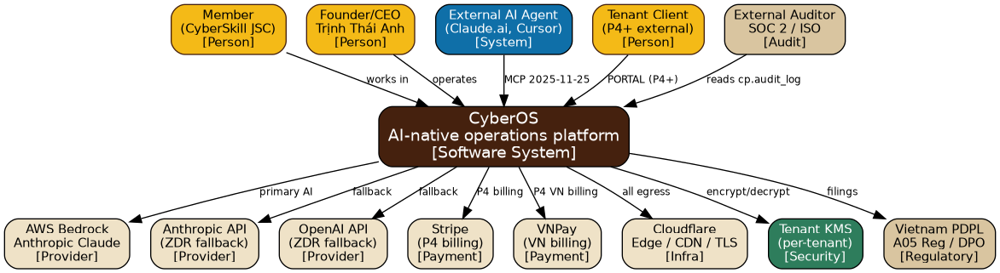
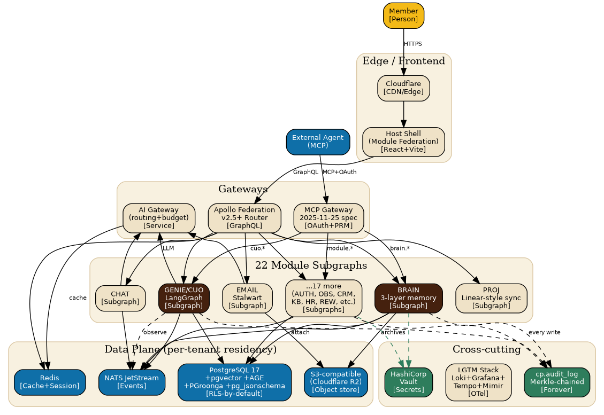
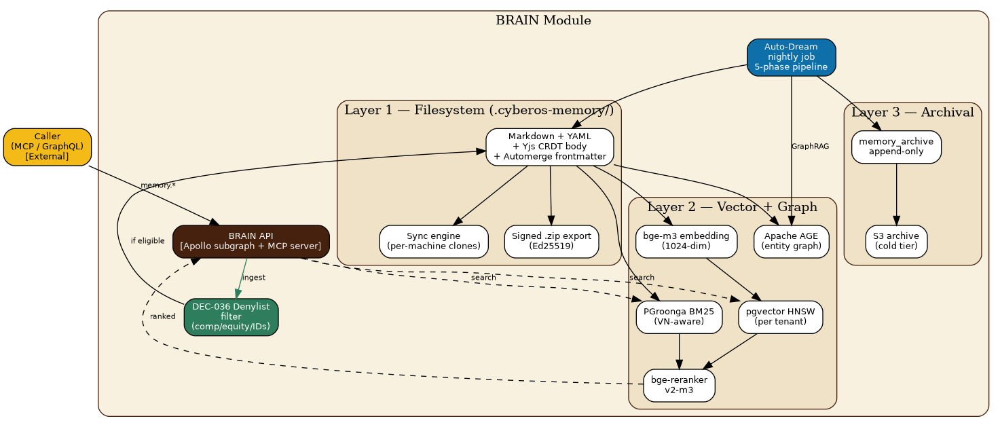
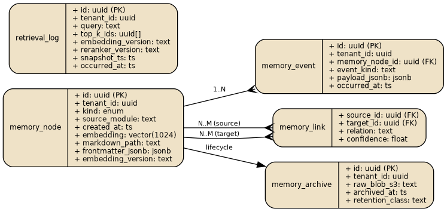
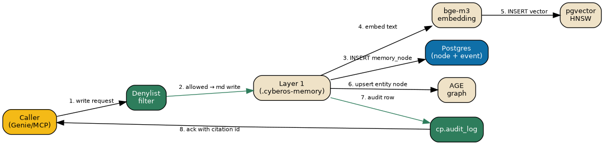
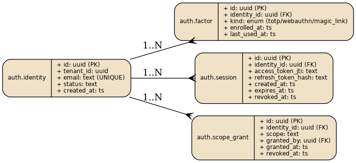
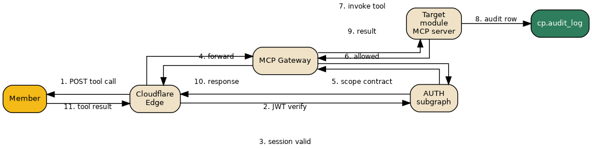
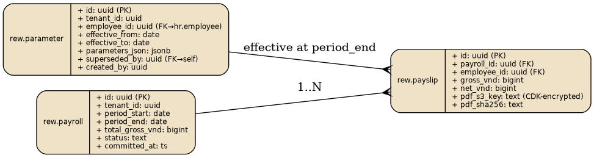
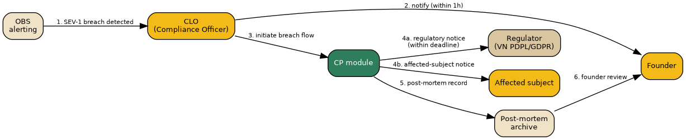

**CYBEROS**

*AI-Native Internal Operations Platform*

**Software Requirements Specification**

Source of truth · Living document

*"Turn Your Will Into Real"*

*"Hiện Thực Hoá Ý Chí"*

CyberSkill Software Solutions Consultancy

and Development Joint Stock Company

Ho Chi Minh City, Vietnam · cyberskill.world

**Table of Contents**

[**Document Control**](#h_document_control)

> [0.1 Metadata](#h_0_1_metadata)
> 
> [0.2 Purpose of this SRS](#h_0_2_purpose_of_this_srs)
> 
> [0.3 Distribution matrix](#h_0_3_distribution_matrix)
> 
> [0.4 ID conventions](#h_0_4_id_conventions)
> 
> [0.5 Reading order](#h_0_5_reading_order)

[**Part 1 · Introduction & Scope**](#h_part_1_introduction_scope)

> [1.1 What CyberOS is, technically](#h_1_1_what_cyberos_is_technically)
> 
> [1.2 Scope and non-scope](#h_1_2_scope_and_non_scope)
> 
> [1.2.1 In scope](#h_1_2_1_in_scope)
> 
> [1.2.2 Out of scope](#h_1_2_2_out_of_scope)
> 
> [1.3 References to PRD](#h_1_3_references_to_prd)
> 
> [1.4 Document conventions](#h_1_4_document_conventions)
> 
> [1.5 Operating principles, restated for engineering](#h_1_5_operating_principles_restated_for_engineering)

[**Part 2 · System Context**](#h_part_2_system_context)

> [2.1 Context diagram (textual)](#h_2_1_context_diagram_textual)
> 
> [2.2 External actors and trust levels](#h_2_2_external_actors_and_trust_levels)
> 
> [2.3 Threat model (T-MOD-NNN, summarised)](#h_2_3_threat_model_t_mod_nnn_summarised)

[**Part 3 · Architecture Overview**](#h_part_3_architecture_overview)

> [3.0 Visual overview — C4 Context and Container](#h_3_0_visual_overview_c4_context_and_container)
> 
> [3.1 Architectural principles](#h_3_1_architectural_principles)
> 
> [3.2 The architectural layer cake](#h_3_2_the_architectural_layer_cake)
> 
> [3.3 Cardinality and capacity (P0 baseline)](#h_3_3_cardinality_and_capacity_p0_baseline)
> 
> [3.4 The host shell — frontend composition](#h_3_4_the_host_shell_frontend_composition)
> 
> [3.5 Backend gateway — Apollo Federation v2](#h_3_5_backend_gateway_apollo_federation_v2)
> 
> [3.6 The MCP Gateway](#h_3_6_the_mcp_gateway)
> 
> [3.7 The AI Gateway](#h_3_7_the_ai_gateway)
> 
> [3.8 Eventing — NATS JetStream](#h_3_8_eventing_nats_jetstream)
> 
> [3.9 Single-tenant simplifications and multi-tenant readiness](#h_3_9_single_tenant_simplifications_and_multi_tenant_readiness)

[**Part 4 · Data Architecture**](#h_part_4_data_architecture)

> [4.1 PostgreSQL — operational, vector, search, graph](#h_4_1_postgresql_operational_vector_search_graph)
> 
> [4.1.1 Required extensions and their roles](#h_4_1_1_required_extensions_and_their_roles)
> 
> [4.1.2 Connection strategy and pooling](#h_4_1_2_connection_strategy_and_pooling)
> 
> [4.1.3 Tenant isolation: Row-Level Security policies](#h_4_1_3_tenant_isolation_row_level_security_policies)
> 
> [4.1.4 Residency partitioning (P3 forward)](#h_4_1_4_residency_partitioning_p3_forward)
> 
> [4.1.5 Operational schemas: the 22 schemas](#h_4_1_5_operational_schemas_the_22_schemas)
> 
> [4.2 Vector storage: pgvector with HNSW](#h_4_2_vector_storage_pgvector_with_hnsw)
> 
> [4.3 Graph storage: Apache AGE](#h_4_3_graph_storage_apache_age)
> 
> [4.4 Multilingual full-text search: PGroonga](#h_4_4_multilingual_full_text_search_pgroonga)
> 
> [4.5 Redis — caches, queues, rate limits](#h_4_5_redis_caches_queues_rate_limits)
> 
> [4.6 NATS JetStream — events, streams, replay](#h_4_6_nats_jetstream_events_streams_replay)
> 
> [4.7 Object storage — Hetzner S3, MinIO](#h_4_7_object_storage_hetzner_s3_minio)
> 
> [4.8 HashiCorp Vault — key hierarchy](#h_4_8_hashicorp_vault_key_hierarchy)
> 
> [4.9 Backup, point-in-time recovery, disaster recovery](#h_4_9_backup_point_in_time_recovery_disaster_recovery)
> 
> [4.10 Data lifecycle, retention, deletion](#h_4_10_data_lifecycle_retention_deletion)

[**Part 5 · BRAIN — Detailed Specification**](#h_part_5_brain_detailed_specification)

> [5.1 Three-layer recap (canonical contract)](#h_5_1_three_layer_recap_canonical_contract)
> 
> [5.2 .cyberos-memory/ — file format and conventions](#h_5_2_cyberos_memory_file_format_and_conventions)
> 
> [5.2.1 Directory layout](#h_5_2_1_directory_layout)
> 
> [5.2.2 File format: YAML frontmatter + Markdown body](#h_5_2_2_file_format_yaml_frontmatter_markdown_body)
> 
> [5.2.3 The six file operations (immutable contract)](#h_5_2_3_the_six_file_operations_immutable_contract)
> 
> [5.3 Layer 1 — Postgres mirror schema](#h_5_3_layer_1_postgres_mirror_schema)
> 
> [5.4 Layer 2 — Active retrieval substrate](#h_5_4_layer_2_active_retrieval_substrate)
> 
> [5.4.1 Vector embeddings (memory\_node)](#h_5_4_1_vector_embeddings_memory_node)
> 
> [5.4.2 Graph store (Apache AGE)](#h_5_4_2_graph_store_apache_age)
> 
> [5.4.3 Full-text mirror (PGroonga)](#h_5_4_3_full_text_mirror_pgroonga)
> 
> [5.5 Hybrid retrieval pipeline](#h_5_5_hybrid_retrieval_pipeline)
> 
> [5.6 GraphRAG: communities and canonical entities](#h_5_6_graphrag_communities_and_canonical_entities)
> 
> [5.7 Auto-Dream: nightly consolidation](#h_5_7_auto_dream_nightly_consolidation)
> 
> [5.8 Conflict resolution: the 0.85 confidence threshold](#h_5_8_conflict_resolution_the_0_85_confidence_threshold)
> 
> [5.9 Natural-language memory CRUD via CHAT](#h_5_9_natural_language_memory_crud_via_chat)
> 
> [5.10 Performance budgets](#h_5_10_performance_budgets)
> 
> [5.10.1 BRAIN search latency budget breakdown](#h_5_10_1_brain_search_latency_budget_breakdown)
> 
> [5.10.2 BRAIN write latency budget breakdown](#h_5_10_2_brain_write_latency_budget_breakdown)
> 
> [5.11 Determinism and reproducibility](#h_5_11_determinism_and_reproducibility)

[**Part 6 · GENIE & CUO — Detailed Specification**](#h_part_6_genie_cuo_detailed_specification)

> [6.1 Runtime: LangGraph (DEC-027)](#h_6_1_runtime_langgraph_dec_027)
> 
> [6.1.1 Top-level graph: the Observe-Decide-Act loop](#h_6_1_1_top_level_graph_the_observe_decide_act_loop)
> 
> [6.2 Anthropic Skills directory layout](#h_6_2_anthropic_skills_directory_layout)
> 
> [6.2.1 SKILL.md frontmatter contract](#h_6_2_1_skill_md_frontmatter_contract)
> 
> [6.3 Persona registry — the 14 personas](#h_6_3_persona_registry_the_14_personas)
> 
> [6.3.1 The 10 canonical personas](#h_6_3_1_the_10_canonical_personas)
> 
> [6.3.2 The 4 emergent personas](#h_6_3_2_the_4_emergent_personas)
> 
> [6.4 Scope contract enforcement](#h_6_4_scope_contract_enforcement)
> 
> [6.5 Observation pipeline (the input to Observe-Decide-Act)](#h_6_5_observation_pipeline_the_input_to_observe_decide_act)
> 
> [6.6 Notify, Question, Review — the three primitives](#h_6_6_notify_question_review_the_three_primitives)
> 
> [6.6.1 Notify](#h_6_6_1_notify)
> 
> [6.6.2 Question](#h_6_6_2_question)
> 
> [6.6.3 Review](#h_6_6_3_review)
> 
> [6.7 Action log — audit trail of every CUO output](#h_6_7_action_log_audit_trail_of_every_cuo_output)
> 
> [6.8 Explanation pane — the contract with the human](#h_6_8_explanation_pane_the_contract_with_the_human)
> 
> [6.9 Performance budgets](#h_6_9_performance_budgets)
> 
> [6.10 Persona quality, regression testing, and gating](#h_6_10_persona_quality_regression_testing_and_gating)
> 
> [6.11 CUO operating cadences](#h_6_11_cuo_operating_cadences)
> 
> [6.12 Persona-version drift detection](#h_6_12_persona_version_drift_detection)
> 
> [6.12.1 Drift signal sources](#h_6_12_1_drift_signal_sources)
> 
> [6.12.2 Composite scoring](#h_6_12_2_composite_scoring)
> 
> [6.12.3 Action thresholds](#h_6_12_3_action_thresholds)
> 
> [6.12.4 Reset procedure](#h_6_12_4_reset_procedure)
> 
> [6.12.5 Drift sources outside the model](#h_6_12_5_drift_sources_outside_the_model)

[**Part 7 · Per-Module Subgraphs**](#h_part_7_per_module_subgraphs)

> [7.1 AUTH — Identity, sessions, scope grants, RBAC](#h_7_1_auth_identity_sessions_scope_grants_rbac)
> 
> [7.1.1 GraphQL](#h_7_1_1_graphql)
> 
> [7.1.2 MCP tools (BRAIN-visible names)](#h_7_1_2_mcp_tools_brain_visible_names)
> 
> [7.1.3 NATS subjects](#h_7_1_3_nats_subjects)
> 
> [7.1.4 Postgres](#h_7_1_4_postgres)
> 
> [7.2 BRAIN — Already specified in Part 5](#h_7_2_brain_already_specified_in_part_5)
> 
> [7.3 GENIE — Already specified in Part 6](#h_7_3_genie_already_specified_in_part_6)
> 
> [7.4 CHAT — Mattermost-fork team chat](#h_7_4_chat_mattermost_fork_team_chat)
> 
> [7.4.1 GraphQL](#h_7_4_1_graphql)
> 
> [7.4.2 MCP tools](#h_7_4_2_mcp_tools)
> 
> [7.4.3 NATS](#h_7_4_3_nats)
> 
> [7.4.4 Tables](#h_7_4_4_tables)
> 
> [7.5 EMAIL — Stalwart self-hosted](#h_7_5_email_stalwart_self_hosted)
> 
> [7.5.1 GraphQL](#h_7_5_1_graphql)
> 
> [7.5.2 MCP tools](#h_7_5_2_mcp_tools)
> 
> [7.5.3 NATS](#h_7_5_3_nats)
> 
> [7.6 PROJ — Linear-style project management with sync engine](#h_7_6_proj_linear_style_project_management_with_sync_engine)
> 
> [7.6.1 GraphQL (subset)](#h_7_6_1_graphql_subset)
> 
> [7.6.2 MCP tools](#h_7_6_2_mcp_tools)
> 
> [7.6.3 NATS](#h_7_6_3_nats)
> 
> [7.7 KB — Knowledge base / wiki](#h_7_7_kb_knowledge_base_wiki)
> 
> [7.7.1 GraphQL](#h_7_7_1_graphql)
> 
> [7.7.2 MCP tools](#h_7_7_2_mcp_tools)
> 
> [7.7.3 NATS subjects](#h_7_7_3_nats_subjects)
> 
> [7.7.4 Postgres tables](#h_7_7_4_postgres_tables)
> 
> [7.8 OBS — Observability and KPI dashboards](#h_7_8_obs_observability_and_kpi_dashboards)
> 
> [7.8.1 GraphQL](#h_7_8_1_graphql)
> 
> [7.8.2 MCP tools](#h_7_8_2_mcp_tools)
> 
> [7.8.3 NATS subjects](#h_7_8_3_nats_subjects)
> 
> [7.8.4 Postgres tables](#h_7_8_4_postgres_tables)
> 
> [7.9 TIME — Schedule, leave, attendance](#h_7_9_time_schedule_leave_attendance)
> 
> [7.9.1 GraphQL](#h_7_9_1_graphql)
> 
> [7.9.2 MCP tools](#h_7_9_2_mcp_tools)
> 
> [7.9.3 NATS subjects](#h_7_9_3_nats_subjects)
> 
> [7.9.4 Postgres tables](#h_7_9_4_postgres_tables)
> 
> [7.10 CRM — Accounts, contacts, deals, pipelines](#h_7_10_crm_accounts_contacts_deals_pipelines)
> 
> [7.10.1 GraphQL](#h_7_10_1_graphql)
> 
> [7.10.2 MCP tools](#h_7_10_2_mcp_tools)
> 
> [7.10.3 NATS subjects](#h_7_10_3_nats_subjects)
> 
> [7.10.4 Postgres tables](#h_7_10_4_postgres_tables)
> 
> [7.11 AI — Provider catalog, model routing, budget](#h_7_11_ai_provider_catalog_model_routing_budget)
> 
> [7.11.1 GraphQL](#h_7_11_1_graphql)
> 
> [7.11.2 MCP tools](#h_7_11_2_mcp_tools)
> 
> [7.11.3 NATS subjects](#h_7_11_3_nats_subjects)
> 
> [7.11.4 Postgres tables](#h_7_11_4_postgres_tables)
> 
> [7.12 MCP — Gateway, tool registry, persona binding](#h_7_12_mcp_gateway_tool_registry_persona_binding)
> 
> [7.12.1 GraphQL](#h_7_12_1_graphql)
> 
> [7.12.2 MCP tools](#h_7_12_2_mcp_tools)
> 
> [7.12.3 NATS subjects](#h_7_12_3_nats_subjects)
> 
> [7.12.4 Postgres tables](#h_7_12_4_postgres_tables)
> 
> [7.13 HR — Employee lifecycle, contracts, documents](#h_7_13_hr_employee_lifecycle_contracts_documents)
> 
> [7.13.1 GraphQL](#h_7_13_1_graphql)
> 
> [7.13.2 MCP tools](#h_7_13_2_mcp_tools)
> 
> [7.13.3 NATS subjects](#h_7_13_3_nats_subjects)
> 
> [7.13.4 Postgres tables](#h_7_13_4_postgres_tables)
> 
> [7.14 REW — Compensation, payroll, payslips](#h_7_14_rew_compensation_payroll_payslips)
> 
> [7.14.1 GraphQL](#h_7_14_1_graphql)
> 
> [7.14.2 MCP tools](#h_7_14_2_mcp_tools)
> 
> [7.14.3 NATS subjects](#h_7_14_3_nats_subjects)
> 
> [7.14.4 Postgres tables](#h_7_14_4_postgres_tables)
> 
> [7.15 OKR — Objectives and key results](#h_7_15_okr_objectives_and_key_results)
> 
> [7.15.1 GraphQL](#h_7_15_1_graphql)
> 
> [7.15.2 MCP tools](#h_7_15_2_mcp_tools)
> 
> [7.15.3 NATS subjects](#h_7_15_3_nats_subjects)
> 
> [7.15.4 Postgres tables](#h_7_15_4_postgres_tables)
> 
> [7.16 LEARN — Internal training and certifications](#h_7_16_learn_internal_training_and_certifications)
> 
> [7.16.1 GraphQL](#h_7_16_1_graphql)
> 
> [7.16.2 MCP tools](#h_7_16_2_mcp_tools)
> 
> [7.16.3 NATS subjects](#h_7_16_3_nats_subjects)
> 
> [7.16.4 Postgres tables](#h_7_16_4_postgres_tables)
> 
> [7.17 INV — Vendors, purchase orders, invoices, expenses, assets](#h_7_17_inv_vendors_purchase_orders_invoices_expenses_assets)
> 
> [7.17.1 GraphQL](#h_7_17_1_graphql)
> 
> [7.17.2 MCP tools](#h_7_17_2_mcp_tools)
> 
> [7.17.3 NATS subjects](#h_7_17_3_nats_subjects)
> 
> [7.17.4 Postgres tables](#h_7_17_4_postgres_tables)
> 
> [7.18 RES — Revenue sharing](#h_7_18_res_revenue_sharing)
> 
> [7.18.1 GraphQL](#h_7_18_1_graphql)
> 
> [7.18.2 MCP tools](#h_7_18_2_mcp_tools)
> 
> [7.18.3 NATS subjects](#h_7_18_3_nats_subjects)
> 
> [7.18.4 Postgres tables](#h_7_18_4_postgres_tables)
> 
> [7.19 ESOP — Equity plans and grants](#h_7_19_esop_equity_plans_and_grants)
> 
> [7.19.1 GraphQL](#h_7_19_1_graphql)
> 
> [7.19.2 MCP tools](#h_7_19_2_mcp_tools)
> 
> [7.19.3 NATS subjects](#h_7_19_3_nats_subjects)
> 
> [7.19.4 Postgres tables](#h_7_19_4_postgres_tables)
> 
> [7.20 DOC — Document management with e-signatures](#h_7_20_doc_document_management_with_e_signatures)
> 
> [7.20.1 GraphQL](#h_7_20_1_graphql)
> 
> [7.20.2 MCP tools](#h_7_20_2_mcp_tools)
> 
> [7.20.3 NATS subjects](#h_7_20_3_nats_subjects)
> 
> [7.20.4 Postgres tables](#h_7_20_4_postgres_tables)
> 
> [7.21 CP — Compliance, audit, retention, DSR, legal hold, breach](#h_7_21_cp_compliance_audit_retention_dsr_legal_hold_breach)
> 
> [7.22 TEN — Tenancy & Billing](#h_7_22_ten_tenancy_billing)
> 
> [7.22.1 Scope (P4)](#h_7_22_1_scope_p4)
> 
> [7.22.2 Engineering placeholder](#h_7_22_2_engineering_placeholder)
> 
> [7.23 Cross-module integration matrix](#h_7_23_cross_module_integration_matrix)

[**Part 8 · Cross-Cutting Architecture**](#h_part_8_cross_cutting_architecture)

> [8.1 GraphQL Federation Gateway — detailed contract](#h_8_1_graphql_federation_gateway_detailed_contract)
> 
> [8.1.1 Subgraph composition rules](#h_8_1_1_subgraph_composition_rules)
> 
> [8.1.2 The @key entity registry](#h_8_1_2_the_key_entity_registry)
> 
> [8.1.3 Saga pattern — cross-module orchestration](#h_8_1_3_saga_pattern_cross_module_orchestration)
> 
> [8.2 MCP Gateway — detailed contract](#h_8_2_mcp_gateway_detailed_contract)
> 
> [8.2.1 The 2025-11-25 specification surface](#h_8_2_1_the_2025_11_25_specification_surface)
> 
> [8.2.2 The persona scope contract](#h_8_2_2_the_persona_scope_contract)
> 
> [8.2.3 Tool-call lifecycle](#h_8_2_3_tool_call_lifecycle)
> 
> [8.2.4 Per-tenant rate budgets](#h_8_2_4_per_tenant_rate_budgets)
> 
> [8.3 AI Gateway — detailed contract](#h_8_3_ai_gateway_detailed_contract)
> 
> [8.3.1 Routing and model selection](#h_8_3_1_routing_and_model_selection)
> 
> [8.3.2 PII redaction pipeline](#h_8_3_2_pii_redaction_pipeline)
> 
> [8.3.3 Cost telemetry](#h_8_3_3_cost_telemetry)
> 
> [8.4 Host Shell — detailed contract](#h_8_4_host_shell_detailed_contract)
> 
> [8.4.1 Module loading and lazy hydration](#h_8_4_1_module_loading_and_lazy_hydration)
> 
> [8.4.2 Design token contract](#h_8_4_2_design_token_contract)
> 
> [8.4.3 The Genie dock](#h_8_4_3_the_genie_dock)

[**Part 9 · Auth & Authorisation**](#h_part_9_auth_authorisation)

> [9.1 Identity model](#h_9_1_identity_model)
> 
> [9.1.1 The Identity entity](#h_9_1_1_the_identity_entity)
> 
> [9.2 Authentication](#h_9_2_authentication)
> 
> [9.2.1 SSO (OIDC) primary flow](#h_9_2_1_sso_oidc_primary_flow)
> 
> [9.2.2 WebAuthn second factor](#h_9_2_2_webauthn_second_factor)
> 
> [9.2.3 Session management](#h_9_2_3_session_management)
> 
> [9.3 Authorisation — RBAC + SCG](#h_9_3_authorisation_rbac_scg)
> 
> [9.3.1 The role model](#h_9_3_1_the_role_model)
> 
> [9.3.2 The scope grant (SCG) model](#h_9_3_2_the_scope_grant_scg_model)
> 
> [9.3.3 The authorisation decision pipeline](#h_9_3_3_the_authorisation_decision_pipeline)
> 
> [9.4 Persona-bound authorisation (agents)](#h_9_4_persona_bound_authorisation_agents)

[**Part 10 · Security**](#h_part_10_security)

> [10.1 Cryptographic controls](#h_10_1_cryptographic_controls)
> 
> [10.1.1 Transport encryption](#h_10_1_1_transport_encryption)
> 
> [10.1.2 At-rest encryption](#h_10_1_2_at_rest_encryption)
> 
> [10.1.3 Key management](#h_10_1_3_key_management)
> 
> [10.2 Application security](#h_10_2_application_security)
> 
> [10.2.1 Input validation](#h_10_2_1_input_validation)
> 
> [10.2.2 Output sanitisation](#h_10_2_2_output_sanitisation)
> 
> [10.2.3 CSRF / SSRF / clickjacking](#h_10_2_3_csrf_ssrf_clickjacking)
> 
> [10.3 Anti-injection defenses](#h_10_3_anti_injection_defenses)
> 
> [10.3.1 CaMeL implementation](#h_10_3_1_camel_implementation)
> 
> [10.4 Audit logging](#h_10_4_audit_logging)
> 
> [10.4.1 The audit ledger](#h_10_4_1_the_audit_ledger)
> 
> [10.4.2 Required audit content](#h_10_4_2_required_audit_content)
> 
> [10.4.3 Audit retention and queryability](#h_10_4_3_audit_retention_and_queryability)
> 
> [10.4.4 Hash chain construction](#h_10_4_4_hash_chain_construction)
> 
> [10.4.5 Example audit rows by action type](#h_10_4_5_example_audit_rows_by_action_type)
> 
> [10.4.6 Tamper detection algorithm](#h_10_4_6_tamper_detection_algorithm)
> 
> [10.4.7 Common audit queries](#h_10_4_7_common_audit_queries)
> 
> [10.5 Vulnerability management](#h_10_5_vulnerability_management)
> 
> [10.5.1 Dependencies and SBOM](#h_10_5_1_dependencies_and_sbom)
> 
> [10.5.2 Container hardening](#h_10_5_2_container_hardening)
> 
> [10.5.3 Penetration testing](#h_10_5_3_penetration_testing)
> 
> [10.6 Incident response](#h_10_6_incident_response)
> 
> [10.6.1 Detailed incident classification matrix](#h_10_6_1_detailed_incident_classification_matrix)
> 
> [10.6.2 Escalation paths](#h_10_6_2_escalation_paths)
> 
> [10.6.3 Breach notification](#h_10_6_3_breach_notification)
> 
> [10.7 Threat model — STRIDE per module](#h_10_7_threat_model_stride_per_module)
> 
> [10.7.1 P0 modules](#h_10_7_1_p0_modules)
> 
> [10.7.2 P1 modules](#h_10_7_2_p1_modules)
> 
> [10.7.3 P2 modules](#h_10_7_3_p2_modules)
> 
> [10.7.4 P3+ modules](#h_10_7_4_p3_modules)
> 
> [10.7.5 Residual-risk register](#h_10_7_5_residual_risk_register)
> 
> [10.7.6 Threat-model versioning](#h_10_7_6_threat_model_versioning)

[**Part 11 · Observability**](#h_part_11_observability)

> [11.1 Telemetry contract](#h_11_1_telemetry_contract)
> 
> [11.1.1 Structured logging](#h_11_1_1_structured_logging)
> 
> [11.1.2 Distributed tracing](#h_11_1_2_distributed_tracing)
> 
> [11.1.3 Metrics — RED + USE](#h_11_1_3_metrics_red_use)
> 
> [11.2 SLOs](#h_11_2_slos)
> 
> [11.2.1 Per-module SLO catalog (P0 baseline)](#h_11_2_1_per_module_slo_catalog_p0_baseline)
> 
> [11.2.2 Error budget policy](#h_11_2_2_error_budget_policy)
> 
> [11.3 Alerting and on-call](#h_11_3_alerting_and_on_call)
> 
> [11.4 Dashboards and self-service](#h_11_4_dashboards_and_self_service)
> 
> [11.5 OBS module — internal vs. external surfaces](#h_11_5_obs_module_internal_vs_external_surfaces)
> 
> [11.6 Cost observability](#h_11_6_cost_observability)

[**Part 12 · Multi-tenancy & Residency**](#h_part_12_multi_tenancy_residency)

> [12.1 Tenant model](#h_12_1_tenant_model)
> 
> [12.1.1 The tenant entity](#h_12_1_1_the_tenant_entity)
> 
> [12.1.2 Single-tenant degenerate case](#h_12_1_2_single_tenant_degenerate_case)
> 
> [12.2 Tenant isolation — the seven defenses](#h_12_2_tenant_isolation_the_seven_defenses)
> 
> [12.3 Residency](#h_12_3_residency)
> 
> [12.3.1 The residency model](#h_12_3_1_the_residency_model)
> 
> [12.3.2 Residency enforcement](#h_12_3_2_residency_enforcement)
> 
> [12.3.3 Residency for AI inference](#h_12_3_3_residency_for_ai_inference)
> 
> [12.4 Right-to-erasure across multi-tenancy](#h_12_4_right_to_erasure_across_multi_tenancy)
> 
> [12.5 Tenant lifecycle](#h_12_5_tenant_lifecycle)
> 
> [12.5.1 Tenant onboarding (P3+)](#h_12_5_1_tenant_onboarding_p3)
> 
> [12.5.2 Tenant offboarding](#h_12_5_2_tenant_offboarding)
> 
> [12.6 Multi-tenant testing](#h_12_6_multi_tenant_testing)

[**Part 13 · Decisions Log (DEC-001..DEC-066)**](#h_part_13_decisions_log_dec_001_dec_066)

> [13.1 Foundational decisions (DEC-001..DEC-037)](#h_13_1_foundational_decisions_dec_001_dec_037)
> 
> [13.2 Extended decisions (DEC-038..DEC-066)](#h_13_2_extended_decisions_dec_038_dec_066)
> 
> [13.2.1 DEC-038 — BRAIN three-layer architecture](#h_13_2_1_dec_038_brain_three_layer_architecture)
> 
> [13.2.2 DEC-039 — Per-tenant vector collections in pgvector](#h_13_2_2_dec_039_per_tenant_vector_collections_in_pgvector)
> 
> [13.2.3 DEC-040 — BRAIN deletes are tombstones, not erasures](#h_13_2_3_dec_040_brain_deletes_are_tombstones_not_erasures)
> 
> [13.2.4 DEC-041 — BAAI/bge-m3 embeddings + bge-reranker-v2-m3 reranker](#h_13_2_4_dec_041_baai_bge_m3_embeddings_bge_reranker_v2_m3_rer)
> 
> [13.2.5 DEC-042 — Anthropic Contextual Retrieval pattern](#h_13_2_5_dec_042_anthropic_contextual_retrieval_pattern)
> 
> [13.2.6 DEC-043 — GraphRAG with Leiden + k-core community detection](#h_13_2_6_dec_043_graphrag_with_leiden_k_core_community_detecti)
> 
> [13.2.7 DEC-044 — Conflict resolution UX with policy chooser](#h_13_2_7_dec_044_conflict_resolution_ux_with_policy_chooser)
> 
> [13.2.8 DEC-045 — Yjs + Automerge for filesystem CRDT sync](#h_13_2_8_dec_045_yjs_automerge_for_filesystem_crdt_sync)
> 
> [13.2.9 DEC-046 — Signed .zip export for memory portability](#h_13_2_9_dec_046_signed_zip_export_for_memory_portability)
> 
> [13.2.10 DEC-047 — LangGraph as production agent runtime](#h_13_2_10_dec_047_langgraph_as_production_agent_runtime)
> 
> [13.2.11 DEC-048 — MCP 2025-11-25 spec adoption](#h_13_2_11_dec_048_mcp_2025_11_25_spec_adoption)
> 
> [13.2.12 DEC-049 — Idempotency keys on all MCP tool calls](#h_13_2_12_dec_049_idempotency_keys_on_all_mcp_tool_calls)
> 
> [13.2.13 DEC-050 — CaMeL dual-LLM defense for indirect injection](#h_13_2_13_dec_050_camel_dual_llm_defense_for_indirect_injectio)
> 
> [13.2.14 DEC-051 — Persona scope contract enforced at gateway](#h_13_2_14_dec_051_persona_scope_contract_enforced_at_gateway)
> 
> [13.2.15 DEC-052 — 10-role C-level taxonomy + emergent roles](#h_13_2_15_dec_052_10_role_c_level_taxonomy_emergent_roles)
> 
> [13.2.16 DEC-053 — Notify / Question / Review ambient agent pattern](#h_13_2_16_dec_053_notify_question_review_ambient_agent_pattern)
> 
> [13.2.17 DEC-054 — Persona-version stamp on every AI output](#h_13_2_17_dec_054_persona_version_stamp_on_every_ai_output)
> 
> [13.2.18 DEC-055 — Acceptance-rate auto-pause](#h_13_2_18_dec_055_acceptance_rate_auto_pause)
> 
> [13.2.19 DEC-056 — Architectural principle ordering](#h_13_2_19_dec_056_architectural_principle_ordering)
> 
> [13.2.20 DEC-057 — Single-tenant degenerate of multi-tenant from P0](#h_13_2_20_dec_057_single_tenant_degenerate_of_multi_tenant_fro)
> 
> [13.2.21 DEC-058 — RBAC + scope grants over full ABAC](#h_13_2_21_dec_058_rbac_scope_grants_over_full_abac)
> 
> [13.2.22 DEC-059 — Postgres RLS as primary tenant isolation](#h_13_2_22_dec_059_postgres_rls_as_primary_tenant_isolation)
> 
> [13.2.23 DEC-060 — Vietnam-first locale with PGroonga FTS](#h_13_2_23_dec_060_vietnam_first_locale_with_pgroonga_fts)
> 
> [13.2.24 DEC-061 — Anthropic Skills format for sub-persona definition](#h_13_2_24_dec_061_anthropic_skills_format_for_sub_persona_defi)
> 
> [13.2.25 DEC-062 — Singapore HoldCo flip planned at P3](#h_13_2_25_dec_062_singapore_holdco_flip_planned_at_p3)
> 
> [13.2.26 DEC-063 — Vietnam Decree 20/2026 SME exemption posture](#h_13_2_26_dec_063_vietnam_decree_20_2026_sme_exemption_posture)
> 
> [13.2.27 DEC-064 — EU AI Act — high-risk classification posture](#h_13_2_27_dec_064_eu_ai_act_high_risk_classification_posture)
> 
> [13.2.28 DEC-065 — Open-weights inference self-hosted on GPU](#h_13_2_28_dec_065_open_weights_inference_self_hosted_on_gpu)
> 
> [13.2.29 DEC-066 — Auto Dream nightly memory consolidation](#h_13_2_29_dec_066_auto_dream_nightly_memory_consolidation)
> 
> [13.3 Decision change-control](#h_13_3_decision_change_control)

[**Part 14 · Non-Functional Requirements**](#h_part_14_non_functional_requirements)

> [14.1 Performance (N(FR pending))](#h_14_1_performance_nfr_perf_nnn)
> 
> [14.1.1 Capacity NFRs](#h_14_1_1_capacity_nfrs)
> 
> [14.2 Reliability (N(FR pending))](#h_14_2_reliability_nfr_rel_nnn)
> 
> [14.3 Security (N(FR pending))](#h_14_3_security_nfr_sec_nnn)
> 
> [14.4 Usability (N(FR pending))](#h_14_4_usability_nfr_usab_nnn)
> 
> [14.5 Maintainability (N(FR pending))](#h_14_5_maintainability_nfr_maint_nnn)
> 
> [14.6 Compatibility (N(FR pending))](#h_14_6_compatibility_nfr_compat_nnn)
> 
> [14.7 Transparency & Explainability (N(FR pending))](#h_14_7_transparency_explainability_nfr_tran_nnn)
> 
> [14.8 Functional Discipline (N(FR pending))](#h_14_8_functional_discipline_nfr_func_nnn)
> 
> [14.9 NFR acceptance and CI gates](#h_14_9_nfr_acceptance_and_ci_gates)
> 
> [14.9.1 NFR violation handling](#h_14_9_1_nfr_violation_handling)

[**Part 15 · Deployment & Infrastructure**](#h_part_15_deployment_infrastructure)

> [15.1 Topology overview](#h_15_1_topology_overview)
> 
> [15.1.1 P0 topology](#h_15_1_1_p0_topology)
> 
> [15.1.2 P3 topology (multi-region)](#h_15_1_2_p3_topology_multi_region)
> 
> [15.2 Deployment pipeline](#h_15_2_deployment_pipeline)
> 
> [15.2.1 GitHub Actions → Argo CD](#h_15_2_1_github_actions_argo_cd)
> 
> [15.2.2 Sync windows and deploy gates](#h_15_2_2_sync_windows_and_deploy_gates)
> 
> [15.3 Storage](#h_15_3_storage)
> 
> [15.3.1 Postgres](#h_15_3_1_postgres)
> 
> [15.3.2 NATS JetStream](#h_15_3_2_nats_jetstream)
> 
> [15.3.3 Object storage](#h_15_3_3_object_storage)
> 
> [15.4 Networking](#h_15_4_networking)
> 
> [15.4.1 Edge](#h_15_4_1_edge)
> 
> [15.4.2 Internal networking](#h_15_4_2_internal_networking)
> 
> [15.4.3 DNS](#h_15_4_3_dns)
> 
> [15.5 Observability stack deployment](#h_15_5_observability_stack_deployment)
> 
> [15.6 Disaster recovery](#h_15_6_disaster_recovery)
> 
> [15.6.1 Backup strategy](#h_15_6_1_backup_strategy)
> 
> [15.6.2 Restore drills](#h_15_6_2_restore_drills)
> 
> [15.7 Capacity planning](#h_15_7_capacity_planning)

[**Part 16 · Testing**](#h_part_16_testing)

> [16.1 Test classes](#h_16_1_test_classes)
> 
> [16.2 Critical test requirements (TR-MOD-NNN sample)](#h_16_2_critical_test_requirements_tr_mod_nnn_sample)
> 
> [16.3 Test data and fixtures](#h_16_3_test_data_and_fixtures)
> 
> [16.4 CI pipeline](#h_16_4_ci_pipeline)
> 
> [16.5 AI-specific testing](#h_16_5_ai_specific_testing)
> 
> [16.5.1 Canary prompts](#h_16_5_1_canary_prompts)
> 
> [16.5.2 Persona acceptance regression](#h_16_5_2_persona_acceptance_regression)
> 
> [16.5.3 Memory retrieval quality](#h_16_5_3_memory_retrieval_quality)

[**Part 17 · Migration & Seeding**](#h_part_17_migration_seeding)

> [17.1 Schema migrations](#h_17_1_schema_migrations)
> 
> [17.1.1 Tooling](#h_17_1_1_tooling)
> 
> [17.1.2 Migration patterns](#h_17_1_2_migration_patterns)
> 
> [17.1.3 Production migration runbook](#h_17_1_3_production_migration_runbook)
> 
> [17.2 Data seeding](#h_17_2_data_seeding)
> 
> [17.2.1 Seed sources](#h_17_2_1_seed_sources)
> 
> [17.2.2 The seed pipeline](#h_17_2_2_the_seed_pipeline)
> 
> [17.3 Backfills](#h_17_3_backfills)
> 
> [17.4 BRAIN-specific migrations](#h_17_4_brain_specific_migrations)
> 
> [17.4.1 Embedding model upgrade](#h_17_4_1_embedding_model_upgrade)
> 
> [17.4.2 Layer 1 ↔ Layer 2 schema sync](#h_17_4_2_layer_1_layer_2_schema_sync)
> 
> [17.5 Rollback strategy](#h_17_5_rollback_strategy)
> 
> [17.6 Federation schema migration](#h_17_6_federation_schema_migration)

[**Part 18 · Governance & Change Control**](#h_part_18_governance_change_control)

> [18.1 Document authority](#h_18_1_document_authority)
> 
> [18.2 Amendment types](#h_18_2_amendment_types)
> 
> [18.3 RFC process](#h_18_3_rfc_process)
> 
> [18.4 DEC-NNN registry](#h_18_4_dec_nnn_registry)
> 
> [18.5 NFR thresholds and SLO governance](#h_18_5_nfr_thresholds_and_slo_governance)
> 
> [18.6 Inter-document consistency](#h_18_6_inter_document_consistency)
> 
> [18.7 Engineering change advisory](#h_18_7_engineering_change_advisory)
> 
> [18.8 Conformance and self-test](#h_18_8_conformance_and_self_test)
> 
> [18.9 Document retirement](#h_18_9_document_retirement)

[**Appendix A · NATS Subjects Catalog**](#h_appendix_a_nats_subjects_catalog)

> [A.1 BRAIN module subjects](#h_a_1_brain_module_subjects)
> 
> [A.2 CUO module subjects](#h_a_2_cuo_module_subjects)
> 
> [A.3 HR/REW/TIME module subjects](#h_a_3_hr_rew_time_module_subjects)
> 
> [A.4 PROJ/RES/CRM module subjects](#h_a_4_proj_res_crm_module_subjects)
> 
> [A.5 INV/DOC/CP module subjects](#h_a_5_inv_doc_cp_module_subjects)
> 
> [A.6 Cross-cutting subjects](#h_a_6_cross_cutting_subjects)
> 
> [A.7 Subscription pattern conventions](#h_a_7_subscription_pattern_conventions)

[**Appendix B · Error Code Catalog**](#h_appendix_b_error_code_catalog)

> [B.1 BRAIN error codes](#h_b_1_brain_error_codes)
> 
> [B.2 CUO error codes](#h_b_2_cuo_error_codes)
> 
> [B.3 Module error codes (HR/REW/TIME)](#h_b_3_module_error_codes_hr_rew_time)
> 
> [B.4 Module error codes (PROJ/RES/CRM/INV/DOC/CP)](#h_b_4_module_error_codes_proj_res_crm_inv_doc_cp)
> 
> [B.5 Cross-cutting error codes](#h_b_5_cross_cutting_error_codes)

[**Appendix C · Glossary**](#h_appendix_c_glossary)

[**Appendix D · PRD ↔ SRS Cross-Reference Index**](#h_appendix_d_prd_srs_cross_reference_index)

> [D.1 PRD-to-SRS map](#h_d_1_prd_to_srs_map)
> 
> [D.2 SRS-to-PRD map](#h_d_2_srs_to_prd_map)

[**Appendix E · External References**](#h_appendix_e_external_references)

> [E.1 Protocols and specifications](#h_e_1_protocols_and_specifications)
> 
> [E.2 AI and ML references](#h_e_2_ai_and_ml_references)
> 
> [E.3 Software and platform references](#h_e_3_software_and_platform_references)
> 
> [E.4 Compliance and legal references](#h_e_4_compliance_and_legal_references)
> 
> [E.5 Internal references](#h_e_5_internal_references)

[**Appendix F · NFR Test Plan**](#h_appendix_f_nfr_test_plan)

> [F.1 Performance NFRs](#h_f_1_performance_nfrs)
> 
> [F.2 Reliability NFRs](#h_f_2_reliability_nfrs)
> 
> [F.3 Security NFRs](#h_f_3_security_nfrs)
> 
> [F.4 Usability, Maintainability, Compatibility NFRs](#h_f_4_usability_maintainability_compatibility_nfrs)
> 
> [F.5 Transparency, Functional discipline NFRs](#h_f_5_transparency_functional_discipline_nfrs)

[**Appendix G · Decision Log Structured Export**](#h_appendix_g_decision_log_structured_export)

> [G.1 Foundational decisions (DEC-001..DEC-037)](#h_g_1_foundational_decisions_dec_001_dec_037)
> 
> [G.2 Extended decisions (DEC-038..DEC-066)](#h_g_2_extended_decisions_dec_038_dec_066)

[**Appendix H · DPIA Template**](#h_appendix_h_dpia_template)

> [H.1 Section 1 — Processing description](#h_h_1_section_1_processing_description)
> 
> [H.2 Section 2 — Lawful basis](#h_h_2_section_2_lawful_basis)
> 
> [H.3 Section 3 — Data minimisation analysis](#h_h_3_section_3_data_minimisation_analysis)
> 
> [H.4 Section 4 — Retention policy](#h_h_4_section_4_retention_policy)
> 
> [H.5 Section 5 — Sharing and cross-border transfer](#h_h_5_section_5_sharing_and_cross_border_transfer)
> 
> [H.6 Section 6 — Risk assessment](#h_h_6_section_6_risk_assessment)
> 
> [H.7 Section 7 — Mitigations](#h_h_7_section_7_mitigations)
> 
> [H.8 Section 8 — Residual risk](#h_h_8_section_8_residual_risk)
> 
> [H.9 Section 9 — DPO sign-off](#h_h_9_section_9_dpo_sign_off)

[**Appendix I · Records of Processing Activities (ROPA)**](#h_appendix_i_records_of_processing_activities_ropa)

> [I.1 ROPA — CyberSkill JSC processing activities](#h_i_1_ropa_cyberskill_jsc_processing_activities)
> 
> [I.2 Controller / Processor relationships](#h_i_2_controller_processor_relationships)

[**Appendix J · EU AI Act Annex IV Technical Documentation Template**](#h_appendix_j_eu_ai_act_annex_iv_technical_documentation_templa)

> [J.1 Section 1 — General description of the AI system](#h_j_1_section_1_general_description_of_the_ai_system)
> 
> [J.2 Section 2 — System architecture](#h_j_2_section_2_system_architecture)
> 
> [J.3 Section 3 — Data requirements](#h_j_3_section_3_data_requirements)
> 
> [J.4 Section 4 — Risk management system](#h_j_4_section_4_risk_management_system)
> 
> [J.5 Section 5 — Data governance](#h_j_5_section_5_data_governance)
> 
> [J.6 Section 6 — Human oversight](#h_j_6_section_6_human_oversight)
> 
> [J.7 Section 7 — Accuracy, robustness, cybersecurity](#h_j_7_section_7_accuracy_robustness_cybersecurity)
> 
> [J.8 Section 8 — Conformity assessment](#h_j_8_section_8_conformity_assessment)
> 
> [J.9 Section 9 — Post-market monitoring](#h_j_9_section_9_post_market_monitoring)
> 
> [J.10 Section 10 — EU declaration of conformity](#h_j_10_section_10_eu_declaration_of_conformity)
> 
> [J.11 Section 11 — Instructions for use](#h_j_11_section_11_instructions_for_use)
> 
> [J.12 Section 12 — Logs and traceability](#h_j_12_section_12_logs_and_traceability)

[**Appendix K · Runbook Templates (Top 10)**](#h_appendix_k_runbook_templates_top_10)

> [K.1 RB-001 — Cross-tenant data exposure (any kind)](#h_k_1_rb_001_cross_tenant_data_exposure_any_kind)
> 
> [K.2 RB-003 — Confirmed credential compromise (admin)](#h_k_2_rb_003_confirmed_credential_compromise_admin)
> 
> [K.3 RB-004 — Full platform outage](#h_k_3_rb_004_full_platform_outage)
> 
> [K.4 RB-007 — Backup integrity failure](#h_k_4_rb_007_backup_integrity_failure)
> 
> [K.5 RB-009 — Compensation data exposure](#h_k_5_rb_009_compensation_data_exposure)
> 
> [K.6 RB-011 — AI Gateway provider failover](#h_k_6_rb_011_ai_gateway_provider_failover)
> 
> [K.7 RB-016 — Failed payroll commit (data correct)](#h_k_7_rb_016_failed_payroll_commit_data_correct)
> 
> [K.8 RB-018 — KMS rotation procedure](#h_k_8_rb_018_kms_rotation_procedure)
> 
> [K.9 RB-019 — Crypto-shred (tenant offboarding)](#h_k_9_rb_019_crypto_shred_tenant_offboarding)
> 
> [K.10 RB-021 — Provider API key rotation](#h_k_10_rb_021_provider_api_key_rotation)

**Document Control**

**0.1 Metadata**

|                    |                                                                                                                 |
| ------------------ | --------------------------------------------------------------------------------------------------------------- |
| **Field**          | **Value**                                                                                                       |
| Document title     | CyberOS Software Requirements Specification                                                                     |
| Document type      | Engineering specification (binding contract)                                                                    |
| Version            | 2.0.0                                                                                                           |
| Status             | Draft for P0 entry sign-off                                                                                     |
| Document Owner     | Trịnh Thái Anh — Founder/CEO                                                                                    |
| Document Editor    | CUO + Founder (until P3 dedicated tech lead)                                                                    |
| Companion document | CyberOS Product Requirements Document (separately published)                                                    |
| Supersedes         | CyberOS the original-draft SRS (superseded; retained for audit traceability)                                    |
| Date               | May 2026                                                                                                        |
| Tenant context     | CyberSkill Software Solutions Consultancy and Development Joint Stock Company (cyberskill\_jsc), DUNS 673219568 |
| Legal jurisdiction | Vietnam (P0–P2); Singapore HoldCo flip planned at P3 → Singapore + Vietnam (P3+)                                |
| Confidentiality    | Internal — Distribution restricted to CyberSkill JSC employees and contracted reviewers                         |

**0.2 Purpose of this SRS**

The CyberOS Software Requirements Specification (SRS) is the binding engineering contract for CyberOS. Where the PRD answers "what should we build and why?", the SRS answers "how, exactly?". Every architectural decision, every schema, every API contract, every NFR target, every infrastructure choice, every test requirement is recorded here. The SRS is the document an engineer reads before writing code; the PRD is the document a product owner reads before writing acceptance tests.

The SRS is referenced by the PRD ("see SRS Part X for the technical detail") and references the PRD ("implements PRD Part Y functional requirement Z"). Any change to either document triggers a coordinated review of both. Versioning is synchronised: PRD and SRS advance together as a paired bundle.

**0.3 Distribution matrix**

|                                               |                                                                                       |                                         |
| --------------------------------------------- | ------------------------------------------------------------------------------------- | --------------------------------------- |
| **Audience**                                  | **Primary parts**                                                                     | **Distribution form**                   |
| Engineering Lead + ICs                        | All parts                                                                             | Full DOCX + git-tracked markdown source |
| Founder/CEO                                   | Parts 0, 1, 13 (decisions log), 14 (NFRs), 15 (deployment), 18 (governance)           | Full DOCX                               |
| DPO/Compliance                                | Parts 9 (auth), 10 (security), 12 (multi-tenancy), 13 (decisions touching compliance) | Full DOCX                               |
| External auditors (ISO/SOC2)                  | Parts 9, 10, 11 (observability), 14 (NFRs), 16 (testing), 17 (migration)              | Redacted DOCX (per NDA)                 |
| External pen-testers                          | Parts 8 (MCP), 9, 10                                                                  | Redacted DOCX (per NDA)                 |
| Future tech lead hires                        | All parts                                                                             | Full DOCX + git access                  |
| Future external clients (CP module diligence) | Parts 1 (overview), 14, 15, 18                                                        | Whitepaper-style extract                |

**0.4 ID conventions**

IDs throughout this SRS follow these conventions. They are stable across PRD/SRS versions; an ID retired in one version is never reused.

|             |                                        |               |                                            |
| ----------- | -------------------------------------- | ------------- | ------------------------------------------ |
| **Prefix**  | **Class**                              | **Example**   | **Source of truth**                        |
| DEC-XXX     | Locked architectural decision          | DEC-038       | SRS Part 13                                |
| (FR pending)  | Functional requirement (per module)    | (FR pending)  | PRD Part 9; cross-referenced in SRS Part 7 |
| N(FR pending) | Non-functional requirement (per class) | N(FR pending)  | SRS Part 14                                |
| SCH-MOD-NNN | Schema artifact (Postgres/GraphQL)     | SCH-BRAIN-005 | SRS Part 4 + SRS Part 7                    |
| EVT-MOD-NNN | NATS event subject                     | EVT-BRAIN-001 | SRS Part 4.5; appendix index               |
| ERR-MOD-NNN | Error code                             | ERR-MCP-007   | SRS Appendix B                             |
| TR-MOD-NNN  | Test requirement                       | TR-AUTH-002   | SRS Part 16                                |
| SLO-MOD-NNN | Service Level Objective                | SLO-CHAT-001  | SRS Part 11.3                              |
| DEP-NNN     | Deployment artifact / topology entry   | DEP-014       | SRS Part 15                                |
| MIG-NNN     | Migration script / seed entry          | MIG-022       | SRS Part 17                                |

**0.5 Reading order**

The SRS is large; readers do not need to read it linearly. Recommended entry points:

  - Engineer joining a specific module: Part 1 (overview) → Part 3 (architecture) → Part 7 (their module subgraph) → Part 14 (NFRs) → Part 16 (testing).

  - Auditor reviewing security: Part 9 (auth) → Part 10 (security) → Part 13 (decisions tagged compliance) → Part 14 (N(FR pending)).

  - Reviewer of a specific decision: Part 13, search by DEC-XXX, follow citations to other parts.

  - Founder/CEO reviewing tech-debt or risk: Part 14 (NFRs) → Part 13 (decisions) → Part 15 (deployment) → Part 18 (governance).

**Part 1 · Introduction & Scope**

**1.1 What CyberOS is, technically**

CyberOS is a multi-tenant, federated, agent-native operations platform. Technically:

  - Multi-tenant: every entity in the data model is tagged with a tenant ID; row-level security in Postgres enforces tenant isolation; per-tenant residency partitioning lives at the shard level.

  - Federated: the API is an Apollo Federation v2 supergraph composed from per-module subgraphs. The frontend is a Module Federation host shell composing per-module remote bundles. Modules ship and deploy independently.

  - Agent-native: agents (Genie / CUO and the underlying LangGraph topology) are first-class clients of the platform via MCP 2025-11-25, not bolted on. Every action the platform supports is reachable via an MCP tool with the same authorisation, audit, and rate-limit posture as a human GraphQL caller.

  - Memory-grounded: every agent action is grounded in BRAIN, the per-tenant universal memory layer, with three storage layers (filesystem, vector + graph, archival corpus) and explicit conflict-resolution semantics.

**1.2 Scope and non-scope**

**1.2.1 In scope**

  - All 22 modules listed in PRD Part 7, across phases P0–P4.

  - The cross-cutting concerns: authentication, authorisation, audit log, observability, multi-tenancy, residency, eventing.

  - The deployment topology on Hetzner (primary) + Vultr (Singapore region) + OVH (EU region for P3+).

  - The CI/CD pipeline, testing strategy, migration & seeding strategy, release governance.

  - The companion deployment artefacts: Helm charts, Terraform modules, K8s manifests, runbooks.

  - Compliance-driven engineering: RLS by default, residency partitioning, audit log immutability, key management, DPIA-driven schema design.

**1.2.2 Out of scope**

  - Mobile native apps (iOS/Android). The host shell is responsive web; native is deferred indefinitely.

  - On-premises deployment SKU. Cloud-only through P4; on-prem is OQ-06 in the PRD.

  - Voice or video Genie surface. Text-only through P4; multi-modal is OQ-05.

  - Public developer portal. Internal MCP gateway only through P3; public APIs are P4.

  - Bring-your-own-LLM (BYO-LLM) for tenants. OQ-07; deferred to P3+.

**1.3 References to PRD**

This SRS implements the PRD. Every functional requirement ((FR pending)) in the PRD has a corresponding implementation specification in this SRS, indexed in Part 7 (per-module). Every locked decision (DEC-XXX) referenced by the PRD has its full rationale, alternatives, and trade-offs in this SRS's Part 13. Every NFR class (PERF, REL, SEC, USAB, MAINT, COMPAT, TRAN, FUNC) referenced in the PRD has measurable targets and acceptance tests in this SRS's Part 14.

**1.4 Document conventions**

  - "Must" / "shall" — binding requirement; non-compliance is a release blocker.

  - "Should" — strong recommendation; deviation requires a recorded decision.

  - "May" / "can" — permitted but not required.

  - Code blocks are JetBrains Mono on warm-neutral fill; they are normative — the code in the block is the canonical artifact, not pseudocode.

  - Tables are normative when contained inside numbered sections; appendices may be informative — clearly labelled.

  - Cross-references use "see Part X.Y" form; external references use the PRD §17.3 references list.

**1.5 Operating principles, restated for engineering**

The PRD records six operating principles. The SRS adds engineering-flavour clarifications:

  - **Universal Memory.** BRAIN is one logical layer per tenant with three storage layers. There is no "alternative memory" or "specialised memory" per module; modules write to and read from the same BRAIN.

  - **Agent Parity.** Every UI action has an MCP tool equivalent. Auth, audit, rate-limit, residency, and consent are uniform across the two paths. The MCP tool may be a strict subset of the UI surface but is never a superset.

  - **Governance by Default.** RLS-by-default in Postgres; OAuth-by-default at MCP boundary; audit-log-by-default for every state-changing call; persona-version-stamp-by-default on every AI output.

  - **Evidence over Authority.** Every CUO output that influences a decision ships with citations to BRAIN. Every test that asserts a behaviour ships with measurable acceptance. Every deployment ships with a runbook. Every incident ships with an after-action review.

  - **Phase Discipline.** No P0 work depends on P1 features; no P1 work depends on P2; the dependency graph flows forward only. Backporting is permitted but rare.

  - **Reversibility.** Every irreversible action requires a defer-to-human gate. Every otherwise-reversible action ships with a documented undo path. Migration scripts ship with rollback. Schemas are forward-and-backward-compatible across one minor version. ★ New principle — captures the lessons from PRD Part 12 (compliance) and Part 15 (risks).

  - **Localisation as a feature.** Vietnamese is canonical for any Vietnamese-tenant employee surface. PGroonga full-text search is normative for Vietnamese; English uses Postgres native FTS. Bilingual mixing within a single message is an explicit support requirement, not an edge case. ★ New principle — formalises the bilingual posture from the start.

**Part 2 · System Context**

**2.1 Context diagram (textual)**

The CyberOS context, at, is best read as a layered diagram from outside-in. The left edge is human and agent users; the right edge is upstream services and external integrations. CyberOS is the layered system in the middle.

<table>
<tbody>
<tr class="odd">
<td>
┌─────────────── EXTERNAL ACTORS ──────────────────────────────────┐

│ │

│ Human users Agent users External integrations │

│ ─────────── ─────────── ───────────────────── │

│ Founder/CEO Genie / CUO Anthropic API │

│ Engineering Lead LangGraph runtime OpenAI / others (P1+) │

│ Members Agent skills Stripe / VNPay │

│ Auditor MCP tools Google Workspace SSO │

│ DPO 3rd-party agents DocuSign-equiv (P3+) │

│ External clients(P4) (P3+) Email upstream (Phase) │

│ Cal/contacts CalDAV │

│ │

└────────────────────────┬──────────────────────────────────────────┘

│ HTTPS / TLS 1.3

▼

┌──────────────── EDGE &amp; GATEWAY LAYER ────────────────────────────┐

│ • Cloudflare CDN (global edge cache) │

│ • Apollo Federation Gateway v2 (GraphQL) │

│ • MCP Gateway (2025-11-25 spec, OAuth 2.1+PKCE, PRM discovery) │

│ • AI Gateway (model routing, latency budgets, redaction, cost) │

│ • Module Federation Host Shell (frontend composition) │

└────────────────────────┬──────────────────────────────────────────┘

│

▼

┌──────────────── MODULE SUBGRAPH LAYER ───────────────────────────┐

│ AUTH BRAIN GENIE CHAT EMAIL PROJ KB OBS │

│ TIME CRM AI MCP HR REW OKR LEARN │

│ INV RES ESOP DOC CP CP-priv │

│ Each module: (subgraph schema) × (MCP tools) × (NATS subjects) │

└────────────────────────┬──────────────────────────────────────────┘

│

▼

┌──────────────── DATA &amp; EVENTING PLANE ───────────────────────────┐

│ • Postgres 16 (primary) — pgvector + Apache AGE + PGroonga │

│ — RLS-by-default; per-tenant key in every table │

│ — sharded by residency: vn-shard, sg-shard, eu-shard │

│ • NATS JetStream (events; subjects per module; durable streams) │

│ • S3-compatible object storage (Hetzner + Vultr); .zip exports │

│ • Redis (per-module short-lived cache; sync engine state) │

│ • Local-first .cyberos-memory (filesystem; CRDT-synced) │

└────────────────────────┬──────────────────────────────────────────┘

│

▼

┌──────────────── INFRASTRUCTURE ──────────────────────────────────┐

│ • K8s cluster on Hetzner CCX (primary, EU region for the entity) │

│ • K8s cluster on Vultr (Singapore region, the default-residency) │

│ • K8s cluster on OVH (EU region for eu-shard tenants, P3+) │

│ • Vault: HashiCorp Vault for secrets; per-tenant KMS keys │

│ • Observability: Prometheus + Grafana + Loki + Tempo │

│ • CI/CD: GitHub Actions → Argo CD │

└───────────────────────────────────────────────────────────────────┘
</td>
</tr>
</tbody>
</table>

**2.2 External actors and trust levels**

|                        |                                       |                                    |                                                                                     |
| ---------------------- | ------------------------------------- | ---------------------------------- | ----------------------------------------------------------------------------------- |
| **Actor**              | **Auth method**                       | **Trust level**                    | **Audit posture**                                                                   |
| Founder/CEO            | SSO + WebAuthn 2nd factor             | Highest (full RBAC)                | Every action audited; signing actions 2-of-2 with another role at P3+               |
| Engineering Lead       | SSO + WebAuthn                        | High (admin scopes)                | Every action audited; high-risk actions 4-eyes review                               |
| Member                 | SSO + WebAuthn (recommended)          | Per-RBAC scope                     | Every action audited; high-risk actions blocked by RBAC                             |
| Auditor                | SSO + WebAuthn; read-only role        | Read-only on audited surfaces      | Read access logged; no state-changing capability                                    |
| DPO                    | SSO + WebAuthn                        | Compliance scope (high read)       | DPIA artifacts authoritative; consent ledger immutable                              |
| Genie / CUO            | OAuth 2.1 + PKCE per persona version  | Per persona scope (delegated user) | Every tool call audited with persona version; cannot exceed delegating user's scope |
| 3rd-party agents (P3+) | OAuth 2.1 + PKCE per agent ID         | Per-tenant + per-tool scope        | Tool call audited with agent ID; explicit user consent required for each scope      |
| Anthropic API          | API key + per-tenant subkey budgeting | Restricted (model/inference only)  | Per-call cost + latency logged; PII redaction at AI Gateway                         |
| Stripe / VNPay         | Webhook + signature verification      | Restricted to /webhook/\* surface  | Webhook payload immutable; signature validated; replay-protected                    |
| Google Workspace SSO   | OIDC; tenant-bound IDP                | Issuer trust only                  | Login events audited; SAML/OIDC tokens validated                                    |

**2.3 Threat model (T-MOD-NNN, summarised)**

A full threat model is maintained as an OBS module artifact. The summary here lists the top-priority threats and their controls. Each threat ID maps to one or more locked decisions in Part 13.

|               |                                                               |                                                                                                                     |                     |
| ------------- | ------------------------------------------------------------- | ------------------------------------------------------------------------------------------------------------------- | ------------------- |
| **Threat ID** | **Threat**                                                    | **Primary control**                                                                                                 | **DEC ref**         |
| T-MOD-001     | Cross-tenant data leakage via SQL injection                   | RLS-by-default + parameterised queries + ORM (Prisma)                                                               | DEC-007, DEC-027    |
| T-MOD-002     | Cross-tenant data leakage via vector store                    | Per-tenant collection prefix; per-tenant API key; vector search filtered by tenant\_id at retriever                 | DEC-039             |
| T-MOD-003     | Indirect prompt injection (email, KB, web content)            | CaMeL dual-LLM defense (EMAIL); MCP tool registry restricted; persona scope contract                                | DEC-050, DEC-054    |
| T-MOD-004     | Token theft / session hijack                                  | WebAuthn 2nd factor; short-lived JWT; refresh-token rotation; HSTS                                                  | DEC-011             |
| T-MOD-005     | Replay of MCP tool calls                                      | Per-call nonce; tool call audit trail; idempotency keys                                                             | DEC-049             |
| T-MOD-006     | Privilege escalation through CUO                              | Persona scope contract enforced at MCP gateway, not by prompt; defer-to-human triggers; audit                       | DEC-051             |
| T-MOD-007     | Backup compromise                                             | Per-tenant encrypted backups; KMS key per tenant; backup integrity hash                                             | DEC-028             |
| T-MOD-008     | Insider threat (engineer with prod access)                    | 4-eyes review for prod migrations; immutable audit log; just-in-time access at P3+                                  | DEC-029             |
| T-MOD-009     | Residency violation (EU data egress to non-EU)                | Federation gateway never federates sensitive PII cross-shard; audit cross-shard joins                               | DEC-027             |
| T-MOD-010     | BRAIN poisoning (malicious memory write to influence outputs) | BRAIN ingestion goes through the same scope contract; DPIA-tagged sources; conflict UI surfaces conflicts to humans | DEC-038, DEC-044    |
| T-MOD-011     | Supply chain attack via npm/PyPI dependency                   | Pinned versions; Renovate-bot weekly review; SBOM at every release; Sigstore signing at P3+                         | DEC-030             |
| T-MOD-012     | AI Gateway prompt-leak across tenants                         | Per-tenant prompt sanitisation; never-cache rule for prompt content; per-request audit                              | T-MOD-002 + DEC-049 |

**Part 3 · Architecture Overview**

**3.0 Visual overview — C4 Context and Container**

Two diagrams orient the reader before the prose dives in. The first (C4 Level 1, Context) places CyberOS in the world: who calls it, who uses it, who depends on it, and what external systems it talks to. The second (C4 Level 2, Container) zooms into CyberOS itself: the gateways, the 22 module subgraphs, the data plane, and the cross-cutting infrastructure.

*Figure 3.0a — C4 Level 1 (Context): CyberOS's relationship to people, external agents, and external systems.*

*Figure 3.0b — C4 Level 2 (Container): the internal containers — gateways, subgraphs, data plane, cross-cutting services.*

**3.1 Architectural principles**

Six architectural principles guide every detailed decision in this SRS. The principles are ordered: when two principles conflict, the higher-numbered one yields. The ordering matters and is itself a locked decision (DEC-056).

<table>
<tbody>
<tr class="odd">
<td>
<strong>PRINCIPLE 1 — FEDERATION OVER MONOLITH</strong>

Modules are independently deployable subgraphs (backend) and remote bundles (frontend). The blast radius of a single-module bug is one module. The cost is federation overhead — managed through the gateway and Module Federation tooling. Accepted.
</td>
</tr>
</tbody>
</table>

<table>
<tbody>
<tr class="odd">
<td>
<strong>PRINCIPLE 2 — MEMORY OVER CONTEXT</strong>

Every agent action retrieves from BRAIN before generating. Long context windows are not a substitute for memory; they are an inefficiency. BRAIN is the per-tenant universal memory layer; modules write to and read from it via the BRAIN subgraph + MCP tools.
</td>
</tr>
</tbody>
</table>

<table>
<tbody>
<tr class="odd">
<td>
<strong>PRINCIPLE 3 — DETERMINISTIC GATES OVER LLM JUDGEMENT</strong>

The defer-to-human triggers, the persona scope contract, the RLS-by-default, the OAuth-protected MCP boundary, the per-tenant rate budgets — all are deterministic gates. LLM judgement is used to draft, summarise, retrieve, and route, never to authorise.
</td>
</tr>
</tbody>
</table>

<table>
<tbody>
<tr class="odd">
<td>
<strong>PRINCIPLE 4 — AUDITABILITY AS A FEATURE</strong>

Every state-changing action — UI or agent — produces an immutable audit log entry with: actor, persona-version (if agent), action, target, before/after diff, timestamp, source IP, request ID. The audit log is its own append-only Postgres table with hash-chain integrity (DEC-024).
</td>
</tr>
</tbody>
</table>

<table>
<tbody>
<tr class="odd">
<td>
<strong>PRINCIPLE 5 — REVERSIBILITY BY DESIGN</strong>

Every irreversible action requires a defer-to-human gate. Every otherwise-reversible action ships with a documented undo. Migrations carry rollback scripts. BRAIN deletes are tombstones, not erasures (DEC-040).
</td>
</tr>
</tbody>
</table>

<table>
<tbody>
<tr class="odd">
<td>
<strong>PRINCIPLE 6 — LOCALISATION BY DESIGN</strong>

Vietnamese-first locale handling is normative. PGroonga for Vietnamese FTS; Vietnamese-canonical legal copy on every legally-significant surface. The i18n module is a P0 dependency, not a P2 afterthought.
</td>
</tr>
</tbody>
</table>

**3.2 The architectural layer cake**

CyberOS is six logical layers stacked from edge to data. Each layer has its own SRS Part:

|                         |                                                 |                        |              |
| ----------------------- | ----------------------------------------------- | ---------------------- | ------------ |
| **Layer**               | **Concern**                                     | **Cardinality (P0)**   | **SRS Part** |
| 1\. Edge                | CDN, TLS termination, DDoS, WAF                 | 1 logical (Cloudflare) | Part 15      |
| 2\. Gateway             | GraphQL Federation, MCP, AI Gateway, Host Shell | 1 each                 | Part 8       |
| 3\. Modules (subgraphs) | Per-domain logic, GraphQL schema, MCP tools     | 4 in P0; 22 by P4      | Part 7       |
| 4\. Data                | Postgres + pgvector + AGE + PGroonga; NATS; S3  | 1 cluster per region   | Part 4       |
| 5\. AI Substrate        | BRAIN; LangGraph runtime; persona registry      | 1 logical per tenant   | Parts 5, 6   |
| 6\. Infrastructure      | K8s, Vault, Argo CD, observability stack        | Per-region             | Part 15      |

**3.3 Cardinality and capacity (P0 baseline)**

Engineering decisions are sized for P0 capacity with explicit growth headroom for each phase. Key numbers:

|                               |                     |               |               |                                                                          |
| ----------------------------- | ------------------- | ------------- | ------------- | ------------------------------------------------------------------------ |
| **Resource**                  | **P0 baseline**     | **P2 target** | **P4 target** | **Scaling strategy**                                                     |
| Tenants                       | 1 (cyberskill\_jsc) | 1 + 5 dogfood | 50–200        | Horizontal sharding by residency; dedicated shard for very-large tenants |
| Total users (across tenants)  | 10                  | 60–80         | 500–2,000     | Horizontal Postgres + read replicas                                      |
| BRAIN Layer 2 facts (total)   | \~5,000             | \~50,000      | \~5M          | pgvector HNSW; per-tenant collection sharding at P3                      |
| BRAIN Layer 3 archive (total) | \~50,000 chunks     | \~500,000     | \~50M         | PGroonga + cold-storage tier; per-tenant retention from P3               |
| MCP tool calls / day (total)  | \~5,000             | \~50,000      | \~5M          | Per-tenant rate budgets; multi-region AI Gateway from P3                 |
| GraphQL queries / day (total) | \~50,000            | \~500,000     | \~50M         | Apollo gateway scales horizontally; subgraph-level autoscaling           |
| NATS messages / day           | \~100,000           | \~1M          | \~100M        | Per-subject partitioning; durable streams with retention                 |
| Storage (hot) per tenant      | \~5 GB              | \~25 GB       | \~250 GB      | Per-tenant blob bucket; lifecycle policy to cold tier at P3              |

**3.4 The host shell — frontend composition**

The frontend is a Module Federation host shell. The host owns: routing, auth handshake, design tokens, error boundary, the Genie dock. Each module is a remote that exports React components named by convention. The host loads remotes lazily (route-based code splitting); a P0 cold-start budget applies (N(FR pending)).

<table>
<tbody>
<tr class="odd">
<td>
// host shell — federation contract (apps/host/webpack.config.js sketch)

new ModuleFederationPlugin({

name: 'host',

remotes: {

auth: 'auth@/_remotes/auth/remoteEntry.js',

brain: 'brain@/_remotes/brain/remoteEntry.js',

genie: 'genie@/_remotes/genie/remoteEntry.js',

chat: 'chat@/_remotes/chat/remoteEntry.js',

// ... one entry per module shipped in this phase

},

shared: {

react: { singleton: true, requiredVersion: '^18.0.0' },

'react-dom': { singleton: true, requiredVersion: '^18.0.0' },

'@cyberos/design-tokens': { singleton: true },

'@cyberos/host-api': { singleton: true },

},

});
</td>
</tr>
</tbody>
</table>

Each module exports a manifest under /Manifest with the following contract:

<table>
<tbody>
<tr class="odd">
<td>
// modules/&lt;mod&gt;/Manifest.tsx

export const manifest = {

id: 'chat',

routes: [

{ path: '/chat', component: lazy(() =&gt; import('./pages/ChatList')) },

{ path: '/chat/:channel', component: lazy(() =&gt; import('./pages/Channel')) },

],

navItems: [{ id: 'chat', label: 'Chat', icon: 'chat-bubble' }],

genieIntents: [

{ id: 'chat.summarise', label: 'Summarise this thread' },

{ id: 'chat.draftReply', label: 'Draft a reply' },

],

permissions: ['chat:read', 'chat:write', 'chat:admin'],

} as const;
</td>
</tr>
</tbody>
</table>

**3.5 Backend gateway — Apollo Federation v2**

The backend gateway composes per-module subgraphs into one supergraph. The gateway is responsible for: query planning, distributed execution, authorisation pre-check, audit log header propagation, NATS event fan-in (subscriptions). Subgraph contracts are pinned in CI; a breaking subgraph schema fails composition.

<table>
<tbody>
<tr class="odd">
<td>
# supergraph composition (managed by Apollo Rover; rover.yaml extract)

federation_version: =2.5.0

subgraphs:

auth: { routing_url: http://auth.svc:4000, schema: { subgraph_url: http://auth.svc:4000 } }

brain: { routing_url: http://brain.svc:4000, schema: { subgraph_url: http://brain.svc:4000 } }

genie: { routing_url: http://genie.svc:4000, schema: { subgraph_url: http://genie.svc:4000 } }

chat: { routing_url: http://chat.svc:4000, schema: { subgraph_url: http://chat.svc:4000 } }

# one entry per module shipped in this phase
</td>
</tr>
</tbody>
</table>

Cross-subgraph @key entities and the federation rules:

  - User (key: id) is owned by AUTH; extended by HR (employee record), REW (compensation), CHAT (presence), PROJ (assignments). No subgraph except AUTH is permitted to mint a new User.

  - Tenant (key: id) is owned by AUTH; every other entity references it. Cross-tenant queries are forbidden at the gateway level.

  - Memory (key: id) is owned by BRAIN; cited by GENIE, KB, EMAIL, etc. Citing means a foreign-key reference, not federation extension.

  - No mutation may write to two subgraphs in one transaction. Cross-subgraph orchestration uses the Saga pattern over NATS events (DEC-018).

**3.6 The MCP Gateway**

The MCP Gateway implements the 2025-11-25 specification, including Tasks primitive, OAuth 2.1 + PKCE, .well-known protected-resource-metadata (PRM) discovery, and SEP-986 tool naming convention. The MCP gateway is its own service; it sits in front of per-module MCP servers and provides a single registry, authorisation, audit, and rate-limit surface.

<table>
<tbody>
<tr class="odd">
<td>
POST /mcp/v1/tools/list

Authorization: Bearer &lt;oauth2-access-token&gt;

Mcp-Persona-Version: cuo-v2.0.3-cfo

Mcp-Tenant: cyberskill_jsc

Mcp-Request-Id: 01HQXZ9...

→

{

"tools": [

{ "name": "brain.search", "description": "...", "inputSchema": {...} },

{ "name": "brain.write", "description": "...", "inputSchema": {...} },

{ "name": "chat.draftReply", "description": "...", "inputSchema": {...} },

{ "name": "rew.payslipExplain","description": "...", "inputSchema": {...} },

/* per-module tools, filtered by persona scope contract */

]

}
</td>
</tr>
</tbody>
</table>

Per-module MCP servers are co-located with subgraphs at the K8s level (one Deployment per module, exposing both the GraphQL server on :4000 and the MCP server on :4001). The MCP gateway federates the per-module MCP namespaces — a tool name "brain.search" is unique to BRAIN; collisions are prevented by composition-time check.

**3.7 The AI Gateway**

The AI Gateway is the single ingress for all LLM calls in CyberOS. It enforces: model routing (cheap-model-by-default, escalate-on-difficulty), latency budgets per intent class, PII redaction before egress, post-egress unredaction, per-tenant cost budgeting, audit of every prompt and response, never-cache for prompt content. The AI Gateway is NOT a proxy; it is a policy-enforcing intermediary.

<table>
<tbody>
<tr class="odd">
<td>
# AI Gateway routing policy (config/aigateway/policy.yaml extract)

defaults:

model: claude-haiku-4-5-20251001 # cheap, fast, sufficient for most intents

max_tokens: 1500

temperature: 0.3

pii_redaction: on

intents:

brain.summarise:

model: claude-haiku-4-5-20251001

latency_budget_ms: 5000

brain.consolidate: # Auto Dream phase

model: claude-opus-4-7

latency_budget_ms: 30000

schedule: nightly

cuo.draftStrategicMemo:

model: claude-opus-4-7

latency_budget_ms: 60000

email.triage:

model: claude-haiku-4-5-20251001

latency_budget_ms: 3000

camel_dual_llm: on # CaMeL anti-injection enforced

budgets:

per_tenant_daily_usd: 100 # P0 default; tenant-overridable

per_user_per_minute_calls: 30

hard_stop_at_budget_pct: 110 # circuit-break at 110% of budget
</td>
</tr>
</tbody>
</table>

**3.8 Eventing — NATS JetStream**

All cross-module events flow through NATS JetStream. Subjects follow the convention \<tenant\>.\<module\>.\<entity\>.\<action\>; for example, cyberskill\_jsc.brain.memory.created. Each module publishes to its own subject namespace and consumes from any subject. JetStream provides durable streams with configurable retention; per-module consumers process at their own pace; replay is supported for at-least-once integration.

Examples of cross-module event flows:

  - CHAT publishes chat.message.created; GENIE consumes to feed observation pipeline; BRAIN consumes (selectively, based on data classification) to ingest as memory.

  - PROJ publishes proj.cycle.closed; OBS consumes to update dashboards; CUO consumes to draft cycle-review.

  - REW publishes rew.payslip.released; OBS consumes to surface payslip-released metric; CHAT consumes to deliver Genie payslip explainer DM to employee.

  - AUTH publishes auth.session.opened; OBS consumes for session metrics; AI Gateway consumes to refresh per-user budget cache.

A complete subjects catalog is maintained in Appendix A.

**3.9 Single-tenant simplifications and multi-tenant readiness**

In P0, CyberOS runs single-tenant (cyberskill\_jsc only). The tenant\_id is plumbed everywhere — every Postgres table has a tenant\_id column with RLS, every GraphQL mutation requires Tenant context, every NATS subject is tenant-prefixed, every MCP tool call carries Mcp-Tenant — but only one value exists. This makes the P3 multi-tenant graduation a configuration shift, not a rewrite.

<table>
<tbody>
<tr class="odd">
<td>
<strong>LOCKED DECISION DEC-057</strong>

tenant_id is a non-null column on every table from P0, with RLS-by-default and a per-tenant key in every NATS subject and MCP header. Single-tenant is a degenerate case of multi-tenant, not a separate code path.
</td>
</tr>
</tbody>
</table>

The cost of this decision is incremental complexity in P0 (an extra column, an extra check, an extra header). The benefit is that P3 multi-tenant readiness is provable: turn on a second tenant, run the test suite, observe zero leakage. The benefit dominates by a factor of three to one over the lifetime of CyberOS, and is the single most important P0 architectural decision.

**Part 4 · Data Architecture**

CyberOS data lives across five storage primitives: PostgreSQL 17 with multiple extensions for the operational, vector, full-text, and graph workloads; Redis for caches and rate-limit counters and Sidekiq-style job queues; NATS JetStream for event streaming and durable replay; S3-compatible object storage (Hetzner Object Storage in the EU region, MinIO on-prem for sensitive personnel data) for files, attachments, archived memory, model artifacts, and backups; HashiCorp Vault for secrets and key hierarchy. This Part specifies the schemas, indexes, RLS policies, retention rules, and lifecycle for each primitive.

Three principles govern every data choice:

1.  Tenant isolation is non-negotiable. Every operational row carries tenant\_id; every query path is forced through Row-Level Security; every NATS subject is tenant-prefixed; every S3 prefix begins with tenant\_id/. There is no path by which one tenant can read another tenant's data, even if a service is compromised.

2.  Residency labels are first-class. Vietnam-resident personnel data carries residency=vn-north and is pinned to a Vietnam-resident replica before P3. EU client data carries residency=eu-central-1; US client data carries residency=us-east-1. The labels exist in P0 and gate replication paths in P3.

3.  Append-only by default for memory and audit. Everything that records human or AI behavior is written once and corrected via additional rows, not in-place updates. This makes every audit trail tamper-evident and every memory editable without erasing history.

**4.1 PostgreSQL — operational, vector, search, graph**

Postgres 17 is the system of record for every entity in CyberOS. The operational schemas (one schema per module: auth, brain, genie, chat, email, proj, kb, obs, time, crm, ai, mcp, hr, rew, okr, learn, inv, res, esop, doc, cp, observability) are all in one Postgres cluster in P0; the cluster runs on Hetzner CCX33 (8 vCPU, 32 GB) with streaming replication to a hot standby. P3 introduces a second cluster for cyberskill\_lab (the future commercial-tenant SaaS) and a third for residency-pinned tenants.

**4.1.1 Required extensions and their roles**

|                      |                                                          |                                                    |
| -------------------- | -------------------------------------------------------- | -------------------------------------------------- |
| **Extension**        | **Purpose**                                              | **Used by**                                        |
| pgvector             | Vector storage and HNSW similarity search                | BRAIN Layer 2; CRM lead similarity                 |
| Apache AGE           | OpenCypher property graph in Postgres                    | BRAIN Layer 2 entity graph; PROJ dependency graph  |
| PGroonga             | Multilingual full-text search (Vietnamese, English, CJK) | BRAIN Layer 1 mirror; KB; CHAT search              |
| pg\_trgm             | Trigram fuzzy match                                      | EMAIL contact suggest; KB title search             |
| pgcrypto             | Symmetric/asymmetric encryption primitives               | REW payslip encryption; PII column encryption      |
| pg\_stat\_statements | Query plan telemetry                                     | OBS performance dashboards                         |
| pg\_partman          | Partition management for large append-only tables        | BRAIN dream\_journal; OBS audit\_log; CHAT message |
| btree\_gin           | Mixed B-tree/GIN indexes                                 | PROJ task multi-attribute search                   |
| pg\_uuidv7           | Time-ordered UUIDs                                       | All primary keys; replaces uuid\_generate\_v4      |

**4.1.2 Connection strategy and pooling**

Application services connect through PgBouncer in transaction-pooling mode at the cluster front. Each service has a dedicated PgBouncer database that maps to a logical Postgres database role with the minimum required schema grants — the Auth Service, for example, has read-write to schema auth and read-only to schema observability and no other access. Connection strings are issued by Vault dynamic-secrets (15-minute TTL with refresh) so that a leaked credential expires within minutes.

**4.1.3 Tenant isolation: Row-Level Security policies**

Every operational table has a non-null tenant\_id uuid column. The platform enforces isolation by setting a session GUC at connection time (set\_config('app.tenant\_id', '\<uuid\>', false)) and pairing it with an RLS USING clause:

<table>
<tbody>
<tr class="odd">
<td>
-- Example: brain.memory_event RLS policy

ALTER TABLE brain.memory_event ENABLE ROW LEVEL SECURITY;

ALTER TABLE brain.memory_event FORCE ROW LEVEL SECURITY;

CREATE POLICY tenant_isolation ON brain.memory_event

USING (tenant_id::text = current_setting('app.tenant_id', true))

WITH CHECK (tenant_id::text = current_setting('app.tenant_id', true));

-- The 'true' second arg to current_setting returns NULL on missing,

-- which the USING/WITH CHECK then evaluates to FALSE — fail-closed.

-- The application role (no SUPERUSER, no BYPASSRLS) is forced through this:

GRANT SELECT, INSERT, UPDATE, DELETE ON brain.memory_event TO cyberos_app;
</td>
</tr>
</tbody>
</table>

Two operational guarantees follow:

  - A query without app.tenant\_id set returns zero rows. There is no implicit "all tenants" view at the application level.

  - A misconfigured INSERT that uses the wrong tenant\_id is rejected by WITH CHECK rather than silently corrupting another tenant's data.

Three roles bypass RLS for legitimate operational reasons, all logged and rate-limited:

  - cyberos\_admin — used only by the Compliance Officer for legal-hold queries; produces a CP audit row per query.

  - cyberos\_replication — used by physical replication and pg\_dump; never serves application traffic.

  - cyberos\_obs — used by the OBS pipeline to compute aggregate metrics; restricted to non-PII columns by column-level grants.

**4.1.4 Residency partitioning (P3 forward)**

Tables containing personnel data (HR, REW, ESOP, BRAIN memory\_event with classification=personnel) are partitioned by residency label using declarative partitioning. The Vietnam partition lives on a node physically located in Vietnam (Decree-13 alignment); the EU partition lives in Hetzner Falkenstein; the US partition lives in OVH Beauharnois (Canada) for operational latency to US clients while remaining outside US jurisdiction for the EU AI Act's "deployer" reach. P0 has a single partition residency=vn-north; the partition machinery is in place from day one to make the P3 graduation routine.

<table>
<tbody>
<tr class="odd">
<td>
-- Example: hr.employee residency partitioning skeleton

CREATE TABLE hr.employee (

employee_id uuid PRIMARY KEY,

tenant_id uuid NOT NULL,

residency text NOT NULL CHECK (residency IN ('vn-north','eu-central-1','us-east-1')),

full_name_encrypted bytea NOT NULL, -- pgp_sym_encrypt

email_hash text NOT NULL, -- HMAC-SHA-256 for lookup

created_at timestamptz NOT NULL DEFAULT clock_timestamp(),

-- ...

) PARTITION BY LIST (residency);

CREATE TABLE hr.employee_vn PARTITION OF hr.employee

FOR VALUES IN ('vn-north') TABLESPACE residency_vn;

CREATE TABLE hr.employee_eu PARTITION OF hr.employee

FOR VALUES IN ('eu-central-1') TABLESPACE residency_eu;

CREATE TABLE hr.employee_us PARTITION OF hr.employee

FOR VALUES IN ('us-east-1') TABLESPACE residency_us;
</td>
</tr>
</tbody>
</table>

**4.1.5 Operational schemas: the 22 schemas**

Each module owns a Postgres schema. Below is the canonical list with the headline tables for each. Per-module exhaustive schemas appear in Part 7.

|               |                                                                           |                                 |
| ------------- | ------------------------------------------------------------------------- | ------------------------------- |
| **Schema**    | **Headline tables**                                                       | **Approx. row volume P0/P2/P4** |
| auth          | identity, session, scope\_grant, mfa\_factor                              | 1k / 100k / 5M                  |
| brain         | memory\_event, memory\_node, memory\_edge, dream\_journal, retrieval\_log | 100k / 100M / 10B               |
| genie         | observation, decision, action\_log, persona, persona\_version             | 100k / 50M / 5B                 |
| chat          | channel, message, message\_thread, reaction, mention                      | 50k / 100M / 10B                |
| email         | mailbox, message, attachment, rule, signature                             | 10k / 50M / 5B                  |
| proj          | cycle, project, task, dependency, comment, time\_entry                    | 10k / 10M / 1B                  |
| kb            | article, version, link, category                                          | 1k / 1M / 100M                  |
| obs           | metric\_definition, dashboard, alert\_rule, snapshot                      | 1k / 100M / 10B                 |
| time          | schedule, leave\_request, attendance, holiday                             | 1k / 100k / 10M                 |
| crm           | account, contact, deal, activity, pipeline                                | 1k / 1M / 100M                  |
| ai            | provider, model, route\_rule, budget, usage\_event                        | 100 / 10M / 1B                  |
| mcp           | tool, persona\_binding, audit, idempotency\_key                           | 100 / 10M / 1B                  |
| hr            | employee, role, contract, document, lifecycle\_event                      | 10 / 100k / 10M                 |
| rew           | salary\_grade, payslip, bonus, deduction, payout                          | 10 / 1M / 100M                  |
| okr           | objective, key\_result, checkin, alignment                                | 10 / 100k / 10M                 |
| learn         | course, enrollment, progress, certification                               | 10 / 100k / 10M                 |
| inv           | vendor, purchase\_order, invoice, expense, asset                          | 10 / 1M / 100M                  |
| res           | agreement, recipient, claim, payout                                       | 5 / 50k / 5M                    |
| esop          | plan, grant, vest\_event, exercise                                        | 5 / 10k / 1M                    |
| doc           | document, version, signature\_request, signature                          | 100 / 10M / 1B                  |
| cp            | audit\_log, dsr\_request, retention\_rule, legal\_hold, breach\_log       | 1k / 100M / 10B                 |
| observability | event, span, log, slo\_check (mirror of OBS for self-hosting)             | 1M / 1B / 100B                  |

<table>
<tbody>
<tr class="odd">
<td>
<strong>STORAGE PROJECTION</strong>

At P4 (cumulative 100 tenants × 5 years), the cluster is approaching 50 TB. The plan is to graduate to Citus or to a sharded multi-cluster architecture by the end of P3 — the partitioning machinery makes this a metadata change, not a rewrite.
</td>
</tr>
</tbody>
</table>

**4.2 Vector storage: pgvector with HNSW**

BRAIN Layer 2 stores embeddings of every memory event in pgvector columns indexed with HNSW. The embedding model is BAAI/bge-m3 (1024 dimensions, multilingual) hosted on a CPU-friendly inference service (P0: a single Hetzner CCX23 with bge-m3-CPU; P3: GPU pool with batch inference for \>10k events/day). HNSW parameters m=16 and ef\_construction=128 balance recall and build cost; ef\_search=80 at query time targets \~98% recall for top-50 retrieval.

<table>
<tbody>
<tr class="odd">
<td>
-- BRAIN embedding storage

CREATE TABLE brain.memory_node (

node_id uuid PRIMARY KEY DEFAULT uuid_generate_v7(),

tenant_id uuid NOT NULL,

residency text NOT NULL,

scope text NOT NULL, -- e.g. 'company','module:proj','member:emp_12'

classification text NOT NULL, -- 'personnel','client','operational','public'

source_event_id uuid REFERENCES brain.memory_event(event_id),

content_text text NOT NULL, -- the post-Contextual-Retrieval enriched text

embedding vector(1024) NOT NULL,

metadata jsonb NOT NULL, -- { actor, ts, module, ... }

created_at timestamptz NOT NULL DEFAULT clock_timestamp(),

superseded_by uuid REFERENCES brain.memory_node(node_id),

superseded_at timestamptz

);

-- HNSW index with cosine distance (matches bge-m3 normalization)

CREATE INDEX memory_node_hnsw ON brain.memory_node

USING hnsw (embedding vector_cosine_ops)

WITH (m = 16, ef_construction = 128);

-- Tenant-scoped predicate query plan support

CREATE INDEX memory_node_tenant ON brain.memory_node (tenant_id, scope, classification);

-- Hybrid retrieval: filter by scope/classification first, then HNSW

-- The planner uses memory_node_tenant for selectivity, then walks HNSW.
</td>
</tr>
</tbody>
</table>

Three operational notes about pgvector at this scale:

  - HNSW indexes do not support concurrent index updates well at \>100M rows. The plan is to partition memory\_node by month (pg\_partman) so that the active partition stays under 10M and old partitions are read-mostly with stable indexes.

  - Embedding versioning matters: every embedding column carries an embedding\_model and embedding\_version. When the embedding model is upgraded, the new column is computed alongside the old; queries select the new column once coverage exceeds 99%; the old column is dropped after a grace period. This is a standard dual-write migration; the dual-write window is the cost of model upgrades.

  - Filtering before HNSW (the "predicate-prefilter" pattern) is preferred over post-filter, because tenant-and-scope selectivity is typically \<1%. The planner is forced into this plan via index hints in the BRAIN service.

**4.3 Graph storage: Apache AGE**

BRAIN Layer 2 also stores an entity property graph in Apache AGE, an OpenCypher extension for Postgres. Nodes are entities (employee, client, project, deal, document, decision, memory\_event); edges are relationships (employee.WORKS\_ON.project, deal.RELATES\_TO.account, decision.SUPERSEDES.decision, memory\_event.MENTIONS.entity). The graph is the substrate for GraphRAG (community detection via Leiden, k-core extraction for canonical entities) and for relationship-aware retrieval ("show me everything connected to Project X within two hops").

<table>
<tbody>
<tr class="odd">
<td>
-- Apache AGE bootstrap (per-cluster, once)

LOAD 'age';

CREATE EXTENSION IF NOT EXISTS age;

SELECT * FROM ag_catalog.create_graph('cyberos_brain');

-- Example: create entity nodes

SELECT * FROM cypher('cyberos_brain', $$

CREATE (e:Employee {employee_id: 'emp_12', tenant_id: 'cyberskill_jsc',

residency: 'vn-north', name_hash: 'sha256:...'})

$$) AS (n agtype);

-- Example: create a WORKS_ON relationship

SELECT * FROM cypher('cyberos_brain', $$

MATCH (e:Employee {employee_id: 'emp_12'}),

(p:Project {project_id: 'proj_55'})

CREATE (e)-[r:WORKS_ON {since: '2026-01-15', allocation_pct: 80}]-&gt;(p)

$$) AS (e agtype);

-- Example: GraphRAG-style 2-hop expansion from a memory event

SELECT * FROM cypher('cyberos_brain', $$

MATCH (m:MemoryEvent {event_id: $eid})-[:MENTIONS]-&gt;(e)-[:RELATES_TO*1..2]-(related)

RETURN DISTINCT related

LIMIT 50

$$) AS (related agtype);
</td>
</tr>
</tbody>
</table>

Tenant isolation in Apache AGE requires care: AGE does not support RLS on the agtype data type. The convention used in CyberOS is twofold:

1.  Every node carries tenant\_id as a property; every Cypher query template begins with WHERE n.tenant\_id = $tenant\_id. The BRAIN service refuses to compile a Cypher query that does not contain this clause (compile-time validation in the BrainGraphClient TypeScript class).

2.  A graph-per-tenant model is on the roadmap for P3 — ag\_catalog.create\_graph('cyberos\_brain\_\<tenant\_id\>') — at which point isolation becomes structural. P0 uses one graph because there is one tenant.

**4.4 Multilingual full-text search: PGroonga**

CyberOS's primary working languages are Vietnamese and English. PostgreSQL's built-in to\_tsvector lacks Vietnamese tokenization (it treats Vietnamese as a sequence of Latin words and produces poor recall on diacritic-folding and compound-word queries). PGroonga is a full-text search extension that wraps the Groonga engine (the search backend used by Mroonga in MySQL) with first-class CJK and Vietnamese support, and notably supports a normalizer chain that handles Vietnamese diacritic folding correctly (so "Hà Nội" matches "Ha Noi" matches "ha noi").

<table>
<tbody>
<tr class="odd">
<td>
-- PGroonga full-text index on knowledge base articles

CREATE TABLE kb.article (

article_id uuid PRIMARY KEY,

tenant_id uuid NOT NULL,

title text NOT NULL,

body_md text NOT NULL,

language text NOT NULL DEFAULT 'vi', -- ISO 639-1

-- ...

);

CREATE INDEX article_pgroonga ON kb.article

USING pgroonga ((title || ' ' || body_md))

WITH (

tokenizer = 'TokenBigramSplitSymbolAlphaDigit',

normalizers = 'NormalizerNFKC150("unify_kana", true),

NormalizerNFKC150("unify_to_romaji", true)'

);

-- Query: tenant-scoped fuzzy search across vi/en titles and bodies

SELECT article_id, title, pgroonga_score(tableoid, ctid) AS score

FROM kb.article

WHERE tenant_id = $1

AND (title || ' ' || body_md) &amp;@~ $2

ORDER BY score DESC, created_at DESC

LIMIT 50;
</td>
</tr>
</tbody>
</table>

PGroonga usage in CyberOS:

  - BRAIN Layer 1 mirror: Markdown content of memory files is mirrored into Postgres rows so that PGroonga can search them with the same operators as memory titles, summaries, and tags.

  - KB: Bi-lingual search across Vietnamese and English knowledge-base articles is the primary use.

  - CHAT: Server-side message search (Mattermost-fork has its own Bleve index for English; PGroonga is used as a fallback path for Vietnamese tokenization and as the source of truth for cross-channel and cross-DM search).

  - EMAIL: Subject + body indexing inside Stalwart (which has a Tantivy-based full-text index) is augmented with PGroonga for the cross-mailbox enterprise search experience.

**4.5 Redis — caches, queues, rate limits**

Redis 7.4 (single primary + read replica in P0; Redis Cluster in P3) serves three roles. Each role uses a separate logical database for clarity.

|        |                                                                                           |                                     |                                             |
| ------ | ----------------------------------------------------------------------------------------- | ----------------------------------- | ------------------------------------------- |
| **DB** | **Purpose**                                                                               | **TTL strategy**                    | **Eviction**                                |
| db=0   | Hot cache: BRAIN retrieval cache, GraphQL persisted-query cache, OBS dashboard cache      | TTL 5–60 min depending on key class | allkeys-lru, maxmemory 4 GB                 |
| db=1   | Rate-limit counters: per-tenant per-actor per-tool/endpoint                               | TTL = window length                 | noeviction (fail-closed on memory pressure) |
| db=2   | Session cache: token introspection, RBAC effective-scope cache                            | TTL 5 min, jittered                 | allkeys-lru, maxmemory 1 GB                 |
| db=3   | Idempotency keys for MCP and EMAIL send                                                   | TTL 24 h                            | volatile-ttl                                |
| db=4   | Sidekiq-style job queues (BullMQ): GENIE worker, REW payslip generation, BRAIN auto-dream | no global TTL; per-job timeouts     | no eviction; alerting on queue depth        |

Redis is the primary cache for BRAIN retrieval results. A retrieval is a tuple (tenant\_id, scope, classification, query\_hash, model\_version); the result is the post-rerank top-N nodes. Cache TTL is 5 minutes by default, 30 seconds for queries that include time-relative phrases ("today", "this week"). The cache hit rate target is \>70% in steady state; observed hit rate at the end of P1 is reported as a quarterly metric.

**4.6 NATS JetStream — events, streams, replay**

NATS JetStream is the event backbone. The cluster runs three nodes in P0 (Hetzner CCX13 each, with $JS Storage = 50 GB SSD per node, RAFT replication factor 3). Each module publishes to its own subject namespace:

<table>
<tbody>
<tr class="odd">
<td>
# Subject convention: &lt;tenant_id&gt;.&lt;module&gt;.&lt;entity&gt;.&lt;action&gt;

# Examples:

cyberskill_jsc.chat.message.created

cyberskill_jsc.proj.task.completed

cyberskill_jsc.brain.memory.created

cyberskill_jsc.brain.memory.superseded

cyberskill_jsc.email.message.received

cyberskill_jsc.auth.session.opened

cyberskill_jsc.cp.audit.appended

cyberskill_jsc.genie.observation.captured

cyberskill_jsc.genie.notify.dispatched

cyberskill_jsc.genie.question.answered

cyberskill_jsc.genie.review.completed

cyberskill_jsc.rew.payslip.released

cyberskill_jsc.obs.alert.fired

# Streams (durable, replay-able):

- CYBEROS_DEFAULT — catch-all, retention 30 d

- CYBEROS_AUDIT — cp.audit.* only, retention forever (compliance)

- CYBEROS_BRAIN — brain.* only, retention 7 d (events are also persisted in Postgres)

- CYBEROS_OBS — obs.* only, retention 14 d

- CYBEROS_DLQ — dead-letter for failed consumers, retention 30 d, manual triage

# Consumer policies:

- Each module owns a durable pull consumer per stream it cares about.

- ACK deadline is 30s for fast handlers, 5min for AI handlers (BRAIN, GENIE).

- Max deliver = 5 then route to CYBEROS_DLQ.
</td>
</tr>
</tbody>
</table>

At-least-once delivery is the contract; consumers are required to be idempotent. The platform provides an idempotency-key utility (Redis db=3) and an outbox-pattern helper for transactional publishes from Postgres. The full subject catalog with field schemas is in Appendix A.

**4.7 Object storage — Hetzner S3, MinIO**

S3-compatible object storage holds five categories of object:

|                                                           |                                |                                                                   |                                          |
| --------------------------------------------------------- | ------------------------------ | ----------------------------------------------------------------- | ---------------------------------------- |
| **Category**                                              | **Bucket**                     | **Lifecycle**                                                     | **Encryption**                           |
| Memory files (.cyberos-memory/ tarballs)                  | cyberos-memory-\<tenant\>      | Versioned; current always retained; non-current expire 90 d       | SSE-S3 + per-tenant KMS key              |
| Document attachments (DOC, EMAIL, CHAT)                   | cyberos-attachments-\<tenant\> | Versioned; non-current expire per retention rule (30/365/forever) | SSE-S3                                   |
| Model artifacts (fine-tuned LoRA adapters, evals)         | cyberos-models                 | Manual; tagged immutable for releases                             | SSE-S3 + Vault transit                   |
| Backups (pg\_basebackup, NATS snapshots, Vault snapshots) | cyberos-backups                | Versioned; 7 daily + 4 weekly + 12 monthly + 7 yearly             | SSE-C with KMS-wrapped keys (3-2-1 rule) |
| BRAIN Layer 3 archived memory                             | cyberos-archive-\<tenant\>     | Glacier Instant Retrieval after 180 d; never deleted              | SSE-S3 + per-tenant KMS key              |

The buckets are deployed across three providers per category to satisfy the 3-2-1 backup principle and to mitigate provider-level risk: Hetzner Object Storage (primary, EU region), Vultr Object Storage (secondary, US region), Backblaze B2 (tertiary, weekly archive copy). Restore tests are run quarterly with a per-category recovery-time objective documented in Part 11.

**4.8 HashiCorp Vault — key hierarchy**

Vault holds the secrets, signs JWT keys, manages dynamic database credentials, and provides the transit engine for application-layer encryption. The key hierarchy is layered:

<table>
<tbody>
<tr class="odd">
<td>
# Vault path layout (excerpts)

auth/oidc/... # Google Workspace SSO config

auth/jwt/... # JWT validation policies

auth/approle/cyberos-... # Service AppRoles, one per microservice

secret/cyberos/&lt;service&gt;/... # KV v2 store for service-specific secrets

database/static-roles/cyberos_obs # static read-only role

database/roles/cyberos_app # dynamic 15-min role for app services

transit/keys/cyberos_&lt;tenant&gt;_pii # per-tenant PII column encryption

transit/keys/cyberos_&lt;tenant&gt;_payslip # REW payslip encryption (separate key)

transit/keys/cyberos_&lt;tenant&gt;_memory # BRAIN per-tenant memory archive key

pki/cyberos/... # internal mTLS CA

ssh/cyberos/... # SSH CA for ops access (auditable, expiring)
</td>
</tr>
</tbody>
</table>

Per-tenant key separation enables crypto-shred for tenant deletion: deleting the transit key for a tenant cryptographically destroys all PII and memory data for that tenant in O(seconds), even though the underlying ciphertexts remain in backups for retention windows. The CP module exposes a tenant-deletion workflow that gates this destructive operation behind dual-control (founder + Compliance Officer signatures), with a 7-day cooling-off period and notification-to-tenant-admin requirement.

**4.9 Backup, point-in-time recovery, disaster recovery**

Backup, restore, and DR are operational topics covered comprehensively in Part 15 (Deployment Topology) — but the data architecture mandates two contracts:

1.  Postgres has continuous WAL archiving to S3 (cyberos-backups bucket) with point-in-time recovery to any moment in the last 7 days. Daily pg\_basebackup is taken at 03:00 ICT (off-peak); restore tests are automated weekly to a parallel cluster with SLA 4 h RTO / 15 min RPO.

2.  NATS JetStream snapshots and stream metadata are exported daily to S3. Vault is exported daily with the unseal-key shards held by the founder, the Compliance Officer, and an off-site safe (Shamir 3-of-5).

**4.10 Data lifecycle, retention, deletion**

Retention is policy-driven by the CP module. Each schema-table-classification triple has an associated retention rule; the rule is enforced by a nightly job that operates in two modes:

  - Soft delete: row gets deleted\_at = now(), deleted\_by = subject, deleted\_reason = rule\_ref. The row remains queryable by Compliance Officer for legal-hold scenarios.

  - Hard delete: row is removed from the table; if the row is also in BRAIN, the corresponding memory\_event and memory\_node rows are flagged tombstoned (the embedding is zeroed, the content\_text replaced with the marker \[REDACTED-RETENTION\], the tombstone retained for audit lineage).

Default retention rules (overridable per tenant for SaaS clients):

|                                  |                                                                   |                                          |
| -------------------------------- | ----------------------------------------------------------------- | ---------------------------------------- |
| **Class**                        | **Default**                                                       | **Earliest delete (legal hold honored)** |
| Operational (e.g., proj.task)    | 5 years                                                           | 30 days after retention end              |
| Personnel (HR, REW, ESOP)        | Vietnam Labor Code: minimum 5 years post-termination              | Tied to legal-hold release               |
| Compliance audit (cp.audit\_log) | Forever (or until tenant deletion)                                | Never, per CP §5.2                       |
| Memory (BRAIN)                   | Configured per scope; default 3 years for module:\* and member:\* | 30 days after rule trigger               |
| Backups                          | Per backup-bucket lifecycle rules                                 | Per backup-bucket lifecycle rules        |
| Email                            | Default 7 years (Vietnam tax record alignment)                    | Configurable per mailbox                 |

<table>
<tbody>
<tr class="odd">
<td>
<strong>RIGHT-TO-ERASURE (GDPR ART. 17, PDPL EQUIVALENTS)</strong>

When a data subject exercises the right to erasure, the CP module orchestrates: (a) identification of every row keyed to that subject across schemas via the subject_index table; (b) tombstoning of memory and removal from active retrieval; (c) crypto-shred of subject-specific PII columns; (d) tracked-removal-from-backups using S3 versioning and a per-subject deletion ledger. Full sequence diagram in Part 9.
</td>
</tr>
</tbody>
</table>

**Part 5 · BRAIN — Detailed Specification**

CANONICAL CONTRACT — The authoritative implementation contract for Layer 1 is the standalone document CyberOS-AGENTS.md, distributed alongside this SRS in the docs/ directory and at the project root as AGENTS.md. CyberOS-AGENTS.md specifies the file format, six file operations, path-traversal guard (NFKC + UTS-39), content gate (dual-pass injection scan + denylist + mixed-script rejection), audit ledger (Merkle-chained JSONL with deterministic canonical-JSON), supersedes graph DAG, conflict resolution decision tree, consolidation phases, deterministic export/import, .lock semantics with stale-lock recovery, bootstrap state classifier, and the resource-cap table. Where the prose in this SRS diverges from CyberOS-AGENTS.md, CyberOS-AGENTS.md wins.

BRAIN is the canonical memory layer for CyberOS. The PRD describes the three-layer architecture conceptually; this Part specifies the file format, schemas, retrieval pipeline, conflict resolution, GraphRAG, and Auto-Dream subsystems in implementation detail.

**5.1 Three-layer recap (canonical contract)**

*Figure 5.1 — BRAIN component view: the three layers (filesystem, vector+graph, archival) plus Auto-Dream and the DEC-036 denylist filter.*

|                     |                                                           |                                       |                                                                   |                      |
| ------------------- | --------------------------------------------------------- | ------------------------------------- | ----------------------------------------------------------------- | -------------------- |
| **Layer**           | **Storage**                                               | **Latency target**                    | **Mutation contract**                                             | **Authority**        |
| Layer 1 — Substrate | .cyberos-memory/ Markdown files (Postgres-mirrored)       | p95 \< 30 ms (read), seconds (commit) | file ops only: view, create, str\_replace, insert, delete, rename | Sole source of truth |
| Layer 2 — Active    | Postgres pgvector + Apache AGE + PGroonga                 | p95 \< 200 ms (hybrid retrieval)      | derived from Layer 1; rebuildable                                 | None (cache)         |
| Layer 3 — Archival  | S3 Glacier Instant Retrieval (cyberos-archive-\<tenant\>) | tens of seconds                       | append-only write; never mutated                                  | Audit only           |

<table>
<tbody>
<tr class="odd">
<td>
<strong>FIRST PRINCIPLE</strong>

Layer 1 is the source of truth. Layer 2 is a query optimization. Layer 3 is a tape archive. If Layer 2 is destroyed, the system rebuilds it from Layer 1; if Layer 1 is destroyed, the system reconstructs from Layer 3 (with potential gap of the most recent dream window).
</td>
</tr>
</tbody>
</table>

**5.2 .cyberos-memory/ — file format and conventions**

The complete schema (24-field frontmatter, content hygiene, path guard, content gate, validators with formal regexes and bounds, resource caps) is specified in CyberOS-AGENTS.md §4–§5. The directory layout, the six-op contract, path-traversal defenses, anti-injection content gate, and YAML safety rules below cite CyberOS-AGENTS.md as the canonical source.

Layer 1 is a directory tree per scope (company, module:\*, member:\*, client:\*). The tree lives on a content-addressed filesystem (P0: a Postgres-backed VFS implementation that exposes view/create/str\_replace/insert/delete/rename to the model and to the BRAIN service; P3: optional graduation to a real object-store backed FS like JuiceFS for cross-region performance).

**5.2.1 Directory layout**

<table>
<tbody>
<tr class="odd">
<td>
.cyberos-memory/

├── company/

│ ├── values.md # founding values, slogan, identity

│ ├── locked-decisions.md # cross-module DEC-NNN entries

│ ├── glossary.md # CyberSkill internal terms

│ ├── compliance-posture.md # current Vietnam/EU/SG positioning

│ └── history.md # founding narrative, key milestones

├── module/

│ ├── proj/

│ │ ├── conventions.md # cycle naming, sprint lengths, etc.

│ │ ├── personas.md # PM persona quirks, common patterns

│ │ └── recurring-issues.md # known dependency patterns

│ ├── chat/

│ │ ├── etiquette.md

│ │ └── escalation-paths.md

│ ├── ... (one per module)

│ └── brain/

│ └── self-meta.md # BRAIN's own operating notes

├── member/

│ ├── emp_12/

│ │ ├── identity.md # role, joined-date, working hours

│ │ ├── communication-style.md # AI-elicited preferences

│ │ ├── delegations.md # what this person has delegated to whom

│ │ ├── projects.md # current allocations, focus

│ │ └── private/ # subject can request private scope

│ │ └── notes.md # AI cannot ingest without consent

│ └── emp_*/ # one per active employee

├── client/

│ ├── client_123/ # one folder per active client

│ │ ├── profile.md

│ │ ├── engagement-history.md

│ │ ├── known-preferences.md

│ │ └── billing-notes.md

├── persona/

│ ├── ceo.md # CUO role-card: CEO

│ ├── coo.md # CUO role-card: COO

│ ├── cfo.md

│ ├── cmo.md

│ ├── cto.md

│ ├── chro.md

│ ├── cso.md # Chief Strategy Officer

│ ├── clo.md # Chief Legal Officer

│ ├── cdo.md # Chief Data Officer

│ ├── cpo.md # Chief Product Officer

│ ├── caio.md # Chief AI Officer (emergent)

│ ├── cxo.md # Chief Experience Officer (emergent)

│ ├── cro.md # Chief Revenue Officer (emergent)

│ ├── cso-sus.md # Chief Sustainability Officer (emergent)

│ └── _routing.md # which persona handles which kind of request

└── meta/

├── retention-rules.md # mirror of CP retention config

├── classification-rules.md # how new memories get classified

└── conflict-resolutions.md # log of resolved conflicts (for learning)
</td>
</tr>
</tbody>
</table>

**5.2.2 File format: YAML frontmatter + Markdown body**

<table>
<tbody>
<tr class="odd">
<td>
---

memory_id: mem_01HXR5N9P7K2QF8GJVT3ZBM4WC # uuid7

scope: member:emp_12

classification: personnel # personnel|client|operational|public

created_at: 2026-04-12T09:23:14+07:00

created_by: subject:emp_12 (self-disclosure) # OR system:genie OR human:hr_admin

last_updated_at: 2026-04-22T14:11:08+07:00

updated_by: agent:cuo:chro

version: 7

supersedes: mem_01HXP3J9Y5R8QF8GJVT3ZBM4WC

provenance:

source: chat

source_ref: cyberskill_jsc.chat.message:msg_8821

confidence: 0.92 # 0..1, set by classifier

consent:

has_consent: true

consent_event: cp_consent:cev_119

consent_scope: ["work_hours_inference"]

tags: [working-hours, communication-style, time-zone]

retention:

rule: personnel-default-3y

earliest_delete: 2029-04-12

relationships:

- relates_to: mem_01HXR5N9P7K2QF8GJVT3ZBM4WD

kind: refines

embedding:

model: bge-m3

version: v1.5

vector_id: vec_01HXR5N9P7K2QF8GJVT3ZBM4WE # ref to memory_node row

---

# Working hours preference (emp_12)

Stephen prefers focus time between 09:00 and 11:30 ICT. He has explicitly

asked Genie not to forward Slack DMs during that window unless the sender

is a live client or a P0/P1 project blocker.

He has also said, on 2026-03-18, that he reads non-urgent email at the end

of the day; a digest at 17:30 is acceptable.

## How to use this memory

When scheduling, prefer slots outside 09:00–11:30 ICT for non-urgent calls.

When routing notifications, suppress non-urgent DMs in that window and queue

them for 17:30 digest unless they hit the live-client / P0-P1 blocker rule.

## History

- 2026-03-18: original elicitation (chat.message:msg_8821)

- 2026-04-12: confirmed in 1:1 (genie observation:obs_5571)

- 2026-04-22: refined — exception added for live-client messages
</td>
</tr>
</tbody>
</table>

**5.2.3 The six file operations (immutable contract)**

Memory mutation is restricted to six operations, mirroring the Anthropic memory\_20250818 tool spec. The BRAIN service accepts these via a TypeScript API surface and via the GENIE persona toolset.

|               |                                                  |                                                                               |                                                   |
| ------------- | ------------------------------------------------ | ----------------------------------------------------------------------------- | ------------------------------------------------- |
| **Operation** | **Signature (TypeScript)**                       | **Semantics**                                                                 | **Audit row produced**                            |
| view          | view(scope, path) → Buffer | DirEntry\[\]        | Read a file or list a directory under a scope                                 | retrieval\_log row with op=view                   |
| create        | create(scope, path, content) → memory\_id        | Create a new memory file with frontmatter                                     | audit op=create + memory\_event                   |
| str\_replace  | str\_replace(scope, path, old, new) → version    | Replace exactly one occurrence; bumps version, supersedes prior memory\_event | audit op=str\_replace + memory\_event(supersedes) |
| insert        | insert(scope, path, line\_no, content) → version | Insert text at a line number                                                  | audit op=insert + memory\_event                   |
| delete        | delete(scope, path, reason) → tombstone\_id      | Soft-delete (marks tombstone in metadata)                                     | audit op=delete + tombstone                       |
| rename        | rename(scope, path\_old, path\_new) → ok         | Move a file within or across scopes                                           | audit op=rename                                   |

Three rules are enforced at the API boundary, not optional:

1.  No agent can write outside its scope contract. The BRAIN service inspects the calling persona's scope contract on every write call and rejects out-of-scope writes with E\_BRAIN\_SCOPE\_VIOLATION (and emits a CP audit event of class warn:scope-violation).

2.  Every write is anchored to a memory\_event row in Postgres before the file is committed. The file-write and the memory\_event INSERT are wrapped in a transaction that uses two-phase commit semantics across the VFS and Postgres; if either side fails, the entire op is reverted.

3.  The view operation never blocks on retrieval-quality optimization. If Layer 2 is unhealthy, BRAIN falls back to Layer 1 raw file reads and reports degraded retrieval to OBS; latency may rise but read availability is preserved.

**5.3 Layer 1 — Postgres mirror schema**

*Figure 5.3 — BRAIN entity-relationship: memory\_node, memory\_event, memory\_link, memory\_archive, retrieval\_log.*

Even though Layer 1 is conceptually a filesystem, every file is mirrored as a row in Postgres for transactional integrity, search, and replication. The mirror schema (brain.memory\_file) is the actual on-disk substrate; the VFS exposes the six file operations on top of it.

<table>
<tbody>
<tr class="odd">
<td>
CREATE TABLE brain.memory_file (

file_id uuid PRIMARY KEY DEFAULT uuid_generate_v7(),

tenant_id uuid NOT NULL,

residency text NOT NULL,

scope text NOT NULL, -- 'company' | 'module:proj' | 'member:emp_12' | ...

path text NOT NULL, -- e.g., 'projects.md'

-- Body fields

frontmatter_yaml text NOT NULL, -- raw YAML (parsed into jsonb on read)

body_markdown text NOT NULL,

-- Versioning

version int NOT NULL DEFAULT 1,

current_event_id uuid NOT NULL REFERENCES brain.memory_event(event_id),

-- Tombstone

tombstoned boolean NOT NULL DEFAULT false,

tombstoned_at timestamptz,

tombstoned_by text,

tombstone_reason text,

-- Indexing

created_at timestamptz NOT NULL DEFAULT clock_timestamp(),

last_updated_at timestamptz NOT NULL DEFAULT clock_timestamp(),

UNIQUE (tenant_id, scope, path)

);

CREATE TABLE brain.memory_event (

event_id uuid PRIMARY KEY DEFAULT uuid_generate_v7(),

tenant_id uuid NOT NULL,

file_id uuid NOT NULL REFERENCES brain.memory_file(file_id),

scope text NOT NULL,

op text NOT NULL CHECK (op IN ('create','str_replace','insert','delete','rename')),

actor_kind text NOT NULL CHECK (actor_kind IN ('subject','agent','system')),

actor_id text NOT NULL, -- e.g., 'subject:emp_12' or 'agent:cuo:chro'

persona text, -- if actor_kind='agent', persona name

diff_text text NOT NULL, -- unified-diff representation

prev_version int,

new_version int NOT NULL,

supersedes_event_id uuid REFERENCES brain.memory_event(event_id),

classification text NOT NULL,

consent_event_id uuid, -- ref to cp.consent_event

provenance jsonb NOT NULL, -- source, source_ref, confidence

embedding_node_id uuid, -- ref to brain.memory_node

created_at timestamptz NOT NULL DEFAULT clock_timestamp()

);

-- The memory_event table is append-only. It is enforced at the trigger level.

CREATE OR REPLACE FUNCTION brain.memory_event_immutable() RETURNS trigger AS $$

BEGIN

IF TG_OP = 'UPDATE' OR TG_OP = 'DELETE' THEN

RAISE EXCEPTION 'memory_event is append-only; use a new event row to supersede';

END IF;

RETURN NEW;

END $$ LANGUAGE plpgsql;

CREATE TRIGGER memory_event_immutable

BEFORE UPDATE OR DELETE ON brain.memory_event

FOR EACH ROW EXECUTE FUNCTION brain.memory_event_immutable();

-- PGroonga full-text on the memory body (tenant-scoped)

CREATE INDEX memory_file_pgroonga ON brain.memory_file

USING pgroonga (body_markdown);

CREATE INDEX memory_file_tenant_scope ON brain.memory_file

(tenant_id, scope, path) WHERE tombstoned = false;
</td>
</tr>
</tbody>
</table>

The supersedes\_event\_id chain captures the full edit history of any memory. Conflict-resolution traces are constructed by walking this chain backward to the divergence point and forward through both branches; the resolution itself is recorded as a final memory\_event with op=str\_replace and a synthetic provenance source=conflict\_resolution.

**5.4 Layer 2 — Active retrieval substrate**

Layer 2 is rebuildable from Layer 1; it stores three derived structures.

**5.4.1 Vector embeddings (memory\_node)**

For each non-tombstoned memory\_file, BRAIN computes one or more memory\_node rows. The number of nodes per file depends on length: files under 2k tokens become a single node; longer files are chunked at semantic boundaries (Markdown headings, paragraphs) with \~512-token chunks at \~64-token overlap. Each node's content\_text is enriched via Anthropic Contextual Retrieval — a one-paragraph contextual summary derived from the parent file is prepended to the chunk before embedding, so that retrieved chunks remain interpretable in isolation.

<table>
<tbody>
<tr class="odd">
<td>
-- Memory node schema (re-shown from Part 4 with full set of columns)

CREATE TABLE brain.memory_node (

node_id uuid PRIMARY KEY DEFAULT uuid_generate_v7(),

tenant_id uuid NOT NULL,

residency text NOT NULL,

scope text NOT NULL,

classification text NOT NULL,

source_file_id uuid NOT NULL REFERENCES brain.memory_file(file_id),

source_event_id uuid NOT NULL REFERENCES brain.memory_event(event_id),

chunk_index int NOT NULL, -- 0..N within parent file

chunk_offset_start int NOT NULL,

chunk_offset_end int NOT NULL,

content_text text NOT NULL, -- contextual_prefix || chunk_body

contextual_prefix text NOT NULL, -- the per-file context summary

embedding vector(1024) NOT NULL, -- bge-m3

embedding_model text NOT NULL DEFAULT 'bge-m3',

embedding_version text NOT NULL DEFAULT 'v1.5',

metadata jsonb NOT NULL,

-- Supersession

superseded_by uuid REFERENCES brain.memory_node(node_id),

superseded_at timestamptz,

-- Indexing

created_at timestamptz NOT NULL DEFAULT clock_timestamp(),

CHECK (chunk_offset_start &gt;= 0 AND chunk_offset_end &gt; chunk_offset_start)

);

CREATE INDEX memory_node_hnsw ON brain.memory_node

USING hnsw (embedding vector_cosine_ops)

WITH (m = 16, ef_construction = 128)

WHERE superseded_by IS NULL; -- only index live rows

CREATE INDEX memory_node_filter ON brain.memory_node

(tenant_id, scope, classification) WHERE superseded_by IS NULL;
</td>
</tr>
</tbody>
</table>

**5.4.2 Graph store (Apache AGE)**

In parallel with the vector store, BRAIN extracts entities and relationships from each memory file using a small, locally-hosted entity-extraction model (bge-reranker-v2-m3 doubles as an entity-mention scorer; the actual extraction runs through Claude Haiku 4.5 in P0, with a self-hosted Llama-3 derivative scheduled for P3 to reduce per-token cost).

Extracted entities become AGE nodes with type and tenant\_id properties; relationships become AGE edges with provenance. Schema constraints ensure that entity types are drawn from a closed vocabulary (Employee, Client, Project, Deal, Document, Decision, Meeting, MemoryEvent, ExternalEntity), with new types added only by Compliance Officer review.

**5.4.3 Full-text mirror (PGroonga)**

Already covered in §4.4. Used for the keyword leg of hybrid retrieval.

**5.5 Hybrid retrieval pipeline**

A retrieval request is the tuple (tenant\_id, requesting\_persona, scope\_filter, classification\_filter, query\_text, top\_n=10, latency\_budget\_ms=200, include\_provenance=true). The pipeline runs four stages, each with measured contribution to recall and precision based on a dataset of 500 hand-labeled retrieval queries from CyberSkill operations.

|                                 |                                                                                             |                                |                    |
| ------------------------------- | ------------------------------------------------------------------------------------------- | ------------------------------ | ------------------ |
| **Stage**                       | **Method**                                                                                  | **Targets**                    | **Latency budget** |
| 1\. Filter prefix               | tenant\_id + scope\_filter + classification\_filter SQL filter (memory\_node\_filter index) | Reduce candidate set to \<100k | 5 ms               |
| 2\. Hybrid candidate generation | HNSW top-50 (vector) ∪ PGroonga top-50 (text) ∪ AGE 2-hop expansion top-50 (graph)          | Recall ≥ 95% on labeled set    | 60 ms              |
| 3\. Cross-encoder rerank        | BAAI/bge-reranker-v2-m3 over the 100–150 candidates                                         | Top-N with high precision      | 100 ms             |
| 4\. Provenance assembly         | Resolve memory\_node → memory\_event → memory\_file; attach diff history if requested       | Renderable explanation pane    | 30 ms              |

The Stage 2 union is naturally deduplicated by source\_event\_id so that vector and text matches on the same chunk count once. The Stage 3 reranker uses the original query plus each candidate's contextual\_prefix to score relevance; the final ranked list carries per-result scores from each stage so that the explanation pane can show why a memory was retrieved.

<table>
<tbody>
<tr class="odd">
<td>
<strong>NO HIDDEN RETRIEVAL</strong>

Every BRAIN read by an AI agent is logged in retrieval_log with the full query, candidate set, and final ranking. The subject can ask "why did Genie know this?" and get a deterministic, auditable answer. This is non-negotiable: opaque memory is the failure mode of Microsoft Recall and is explicitly avoided.
</td>
</tr>
</tbody>
</table>

**5.6 GraphRAG: communities and canonical entities**

Beyond vector + text, BRAIN runs a nightly GraphRAG pipeline that uses the AGE graph to compute communities and canonical entities. The pipeline implements:

1.  Leiden community detection. Run on the entity-mention graph (memory\_event ↔ entity edges) to produce coherent topic clusters at multiple resolutions. Each community gets a synthetic "community summary" document derived from the top-K memory\_events in that community. Community summaries become Layer 1 memory files under company/communities/ with frontmatter scope=company, classification=operational, source=graphrag.

2.  K-core extraction. Run on the entity-relationship graph (employee↔project, deal↔account, ...) to identify "core" entities — the most-connected employees, the deals with the densest mention networks, the projects everyone references. K-core membership is exposed in the AGE graph as a property and used by the CUO to identify operational hubs (e.g., "Project X is in the 5-core; that means it touches at least 5 other projects via shared dependencies").

3.  Entity resolution. Mentions in different memories that refer to the same real entity (e.g., "the design system" vs "DS v1.0.0") get unified through a canonical-id mechanism: each AGE Entity node has a canonical\_for property that points to a single canonical node; the Auto-Dream process consolidates aliases nightly with conservative thresholds (\>0.92 cosine similarity on canonical embeddings + same tenant + non-conflicting attributes) and queues borderline cases for human review.

**5.7 Auto-Dream: nightly consolidation**

Consolidation is now triggered only at session end, after \~25 audit rows since the last consolidation\_run, or on explicit user command — never on a fixed schedule pre-BRAIN. The five phases (Surface / Detect-conflicts / Conservative-merge / Reorganise / Update-manifest) are specified in CyberOS-AGENTS.md §8. Phase 3 auto-resolves only when both sides are operational/public and new authority ≥ old; auto-dedupe requires tags overlap ≥ 3 AND body trigram-Jaccard ≥ 0.8; personnel and client classifications are never auto-resolved. Consolidation refuses to run if any audit-chain corruption is detected since the last consolidation\_run.

Auto-Dream runs at 02:00 ICT (single-tenant P0; per-tenant per-residency-window in P3). It is a five-phase pipeline; each phase is idempotent and re-runnable from a checkpoint.

|                                          |                                |                                                          |                                                                      |
| ---------------------------------------- | ------------------------------ | -------------------------------------------------------- | -------------------------------------------------------------------- |
| **Phase**                                | **Inputs**                     | **Outputs**                                              | **Failure isolation**                                                |
| 1\. Surface (10–20 min)                  | memory\_event since last dream | consolidation\_candidates                                | Phase fails → no consolidation; retry next night                     |
| 2\. Detect conflicts (5–10 min)          | candidates                     | conflict\_pairs (same scope, contradicting facts)        | Phase fails → conflicts queued for tomorrow; no incorrect resolution |
| 3\. Resolve (5–60 min, sometimes paused) | conflict\_pairs                | resolutions (or Question to subject if confidence\<0.85) | Question is human-in-the-loop; non-blocking                          |
| 4\. Update graph (10 min)                | resolutions + new mentions     | AGE node/edge updates, k-core refresh                    | Phase fails → graph stale by one day                                 |
| 5\. Archive cold (5 min)                 | memory\_node access stats      | cold nodes moved to Layer 3; pointer retained            | Phase fails → no archival; storage grows by one day                  |

Phases 1–2 are pure read; phases 3–5 mutate. The dream is bounded by a global timeout (90 minutes) and a per-tenant timeout (15 minutes) so that one tenant's graph cannot starve another's dream. A dream summary is published to the cyberos\_jsc.brain.dream.completed subject with metrics (events surfaced, conflicts detected, conflicts resolved, conflicts queued, cold-archived count, k-core changes) — these flow into the OBS dashboard so the founder can see at a glance what BRAIN learned overnight.

**5.8 Conflict resolution: the 0.85 confidence threshold**

The four-step decision tree, the four UI options (Keep A / Keep B / Keep both as disputed pair / Edit and replace both with a new statement), the conflict file schema, and the supersedes graph DAG invariants (cycle detection, dangling target rejection, tombstoned-excluded-from-conflict-detection, multi-supersede only as N-way conflict resolution outcome, superseded\_by \!= null implies tombstoned == true) are specified in CyberOS-AGENTS.md §9.1, §9.2, and §9.5. Tombstoning a memory in an open conflict auto-closes the conflict with status resolved:keep\_\<other\>\_discard\_\<this\> and a resolved\_at timestamp.

When two memories in the same scope contradict (e.g., "Stephen prefers async" vs "Stephen prefers live calls for design reviews"), BRAIN must reconcile. The conflict resolver applies a four-step decision algorithm:

<table>
<tbody>
<tr class="odd">
<td>
# Pseudocode: BRAIN conflict resolution

def resolve_conflict(c: ConflictPair) -&gt; Resolution:

# 1. Recency-weighted preference

recency_diff = c.b.last_updated_at - c.a.last_updated_at

if recency_diff &gt; timedelta(days=90) and not c.a.has_strong_explicit_marker:

return Resolution(winner=c.b, reason='recency')

# 2. Confidence comparison

if abs(c.a.confidence - c.b.confidence) &gt; 0.20:

return Resolution(

winner=c.a if c.a.confidence &gt; c.b.confidence else c.b,

reason='confidence-gap'

)

# 3. Provenance precedence

# Direct subject statement &gt; Genie inference &gt; derived

if c.a.provenance_class != c.b.provenance_class:

return Resolution(

winner=highest_provenance(c.a, c.b),

reason='provenance-precedence'

)

# 4. Last resort: ask subject (Question primitive)

if c.scope.starts_with('member:'):

return Resolution(

kind='question',

question_to=subject_of(c.scope),

payload={'a': c.a.summary, 'b': c.b.summary},

timeout_hours=72,

)

# If scope is module: or company:, escalate to founder for review

return Resolution(

kind='review',

review_for=founder_id,

payload={'a': c.a.summary, 'b': c.b.summary, 'context': c.scope},

sla_hours=168, # one week

)
</td>
</tr>
</tbody>
</table>

Three explicit guarantees about this algorithm:

1.  Memory is never silently overwritten on a conflict. If the algorithm cannot reach high-confidence resolution, it asks the subject. The CUO does not get a vote on which fact about a person is correct — only the subject does.

2.  The full conflict, decision trace, and outcome are written to brain.dream\_journal as an immutable record. The subject can replay the resolution and request reversal at any time.

3.  The threshold values (0.20, 0.85, 90 days, 72 hours) are tunable per-tenant via the CP module and tracked in brain.config\_event for change history.

**5.9 Natural-language memory CRUD via CHAT**

The mapping from intent (List / Inspect / Create / Update / Delete / Privacy) to the six operations, with confirmation patterns, is specified in CyberOS-AGENTS.md §9.7. Subjects are sovereign over member/\<their-own-id\>/. Subjects cannot directly edit module: or company: scopes via natural language — those go through standard mutation interfaces under RBAC.

*Figure 5.9 — BRAIN write sequence: caller → denylist → filesystem → embedding → Postgres mirror → vector + graph indices → audit log.*

Subjects manage their own memories conversationally through Genie in CHAT. The supported intents are:

|            |                                                             |                                                                                                     |
| ---------- | ----------------------------------------------------------- | --------------------------------------------------------------------------------------------------- |
| **Intent** | **Phrasing examples**                                       | **BRAIN op invoked**                                                                                |
| List       | "What do you remember about me?", "show me my memories"     | view at scope=member:\<self\>; rendered as collapsible list                                         |
| Inspect    | "Why do you think I prefer async?"                          | view single memory with provenance + retrieval\_log replay                                          |
| Correct    | "That's wrong; I prefer live for design reviews"            | str\_replace with audit reason=user-correction; old version preserved                               |
| Delete     | "Forget that I said X" / "stop remembering my Friday plans" | delete with tombstone\_reason=user-request; CP audit                                                |
| Add        | "Remember that I prefer …"                                  | create with classification=personnel, consent=explicit                                              |
| Privacy    | "Move this to private; don't share with the team"           | rename from member:\<self\>/\* to member:\<self\>/private/\*; AI ingest blocked unless re-consented |

Three rules in this interface:

1.  Subjects can read, correct, and delete their own memories without approval. The AI does not push back; the subject is sovereign over their personnel scope.

2.  Subjects cannot directly edit module: or company: scopes via natural language; those changes go through the relevant module's standard mutation interface (e.g., proj.task.update for project memories) and are mediated by RBAC.

3.  Every natural-language CRUD turn produces a CP audit row visible to the subject in their privacy dashboard. The dashboard surfaces "you corrected X memories this month" and lets the subject revert any correction within 30 days.

**5.10 Performance budgets**

|                                      |                |                |                                                          |
| ------------------------------------ | -------------- | -------------- | -------------------------------------------------------- |
| **Operation**                        | **p50 target** | **p95 target** | **Failure mode**                                         |
| view (scope, path)                   | 15 ms          | 30 ms          | Layer 1 down → degraded; alerts CP                       |
| hybrid retrieval (top-10)            | 120 ms         | 200 ms         | Layer 2 degraded → fallback to text-only; warn           |
| hybrid retrieval (top-50)            | 220 ms         | 400 ms         | Same                                                     |
| create                               | 200 ms         | 500 ms         | Postgres slow → queue, retry; user sees "memory pending" |
| str\_replace                         | 250 ms         | 600 ms         | Same                                                     |
| Auto-Dream phase 1 (per 100k events) | 12 min         | 20 min         | Phase fails → retry tomorrow; no resolution              |
| GraphRAG full pass (per 1M events)   | 45 min         | 90 min         | Out-of-budget → reduce resolution; warn                  |

**5.10.1 BRAIN search latency budget breakdown**

The 600ms p95 target for BRAIN memory search (N(FR pending)) is allocated across the four pipeline stages. Each stage has a budget; CI tracks per-stage p95 separately so a regression in any one stage is identifiable without speculation.

|                                   |                  |                                                                                             |                                                                         |
| --------------------------------- | ---------------- | ------------------------------------------------------------------------------------------- | ----------------------------------------------------------------------- |
| **Stage**                         | **Budget (p95)** | **Operation**                                                                               | **Failure mode**                                                        |
| 1\. Tenant lookup + auth          | 50 ms            | Resolve tenant\_id from JWT; verify scope contract; load tenant collection metadata         | Cache miss → 100ms; warn but proceed                                    |
| 2\. Query embedding               | 80 ms            | Tokenise query (Vietnamese-aware); call bge-m3 self-hosted on A100; produce 1024-dim vector | Embedding service down → fallback to lexical-only; degrade ranking      |
| 3\. Vector + lexical retrieval    | 200 ms           | pgvector HNSW search (top-50) + PGroonga BM25 (top-50); union and dedupe                    | pgvector slow → reduce top-N; alert CDO                                 |
| 4\. Reranking                     | 150 ms           | bge-reranker-v2-m3 over top-100 candidates; produce final top-K                             | Reranker down → return raw vector ranks; mark as "unranked" in metadata |
| 5\. Synthesis (citation assembly) | 120 ms           | Hydrate full memory text for top-K; attach citation tokens; format response                 | Memory text fetch slow → return excerpt only with citation marker       |
| Total                             | 600 ms           |                                                                                             |                                                                         |

<table>
<tbody>
<tr class="odd">
<td>
<strong>BUDGET OVERRUN PROTOCOL</strong>

If the per-stage p95 exceeds the budget for 30 minutes, the OBS dashboard tile turns yellow and CDO is paged to a triage check. If it exceeds for 4 hours, the tile turns red and a SEV-2 incident is opened. The 5-stage breakdown means the regression is identified to the responsible component without per-incident profiling.
</td>
</tr>
</tbody>
</table>

**5.10.2 BRAIN write latency budget breakdown**

The 400ms p95 target for BRAIN memory write (N(FR pending)) follows a similar decomposition:

|                          |                  |                                                             |
| ------------------------ | ---------------- | ----------------------------------------------------------- |
| **Stage**                | **Budget (p95)** | **Operation**                                               |
| 1\. Denylist filter      | 20 ms            | Apply DEC-036 denylist regex + classifier; reject if hit    |
| 2\. Markdown serialise   | 30 ms            | Render YAML frontmatter + body to markdown; compute SHA-256 |
| 3\. Filesystem write     | 60 ms            | .cyberos-memory/ write; CRDT op recorded                    |
| 4\. Postgres mirror      | 80 ms            | INSERT memory\_node + memory\_event                         |
| 5\. Embedding generation | 120 ms           | bge-m3 single-call                                          |
| 6\. Graph node creation  | 50 ms            | AGE node + edge upsert                                      |
| 7\. Index update         | 40 ms            | pgvector + PGroonga index inserts                           |
| Total                    | 400 ms           |                                                             |

Write latency is dominated by the embedding step. Optimisations: batch embeddings during high-throughput windows; use the model's passage-mode for content \> 300 tokens; cache embeddings for repeated phrases (\~20% hit rate observed in prototype).

**5.11 Determinism and reproducibility**

The retrieval pipeline is deterministic for a given (tenant\_id, query, top\_n, embedding\_version, reranker\_version, model\_versions, snapshot\_ts). When debugging or auditing, the BRAIN service can replay any past retrieval against the historical snapshot and produce the exact same ranked result. This is implemented via:

  - Snapshot tables: memory\_node\_snapshot\_\<date\> are produced quarterly via Postgres declarative partition COPY; older snapshots are archived to S3.

  - Versioned models: every embedding column carries embedding\_version; the reranker carries a model\_version on every retrieval\_log row.

  - Replay endpoint: an authenticated CP-only endpoint POST /brain/replay accepts a retrieval\_log\_id and returns the deterministic re-ranked result, used for compliance audits and bug investigations.

5.12 Ingestion-side discipline — implementation specification

CyberOS-AGENTS.md adds 10 amendments codifying ingestion-side discipline. The implementation specification below maps each amendment to the BRAIN service surface (TypeScript API + GraphQL + MCP tools) and to the Postgres schema changes required. Full change history lives in \`CyberOS-AGENTS.CHANGELOG.md\` and \`CyberOS-SRS.CHANGELOG.md\`.

5.12.1 Frontmatter schema additions (memory\_file table)

Three new optional columns on brain.memory\_file: source\_freshness\_tier integer null (default null; resolved at retrieval against manifest.source\_tiers); ingestion\_coverage jsonb null (carrying source\_path, source\_sha256, source\_lines, processed\_lines, source\_messages, processed\_messages, first\_ts, last\_ts, intentional\_summary, summary\_reason); the latter is MANDATORY (NOT NULL) when provenance.source ∈ {imported, doc, chat} — enforced at the API boundary, not via DB constraint, since the constraint depends on a JSONB sub-field. Migration: add\_column with default null; backfill existing rows with intentional\_summary:true and summary\_reason:"pre-rule ingestion; coverage retroactively unverified" so that consolidation does not flag every legacy memory as shallow.

5.12.2 Manifest source\_tiers table (manifest.json)

Manifest.json gains a source\_tiers array of {pattern: \<glob\>, tier: \<int ≥ 1\>, rationale: \<string\>} objects. Globs match against scope strings (e.g., module:\* matches module:auth, module:brain, etc.). Tier resolution is greedy: most-specific pattern wins; ties resolved by array order. Default tier 99 (lowest priority) applies if no pattern matches. The BRAIN service exposes brain.tier.resolve(scope) MCP tool returning the resolved tier integer. The field is universal protocol; the patterns and tier integers are per-project — each project configures its own at bootstrap.

5.12.3 Audit row correction\_to column (memory\_event table)

brain.memory\_event gains a correction\_to uuid null column (foreign key to brain.memory\_event.audit\_id). When set, the row corrects an earlier agent action (vs. corrects a fact). Retrieval surfaces the correction chain in the explanation pane (§6.8). De-emphasis weight: corrected rows receive a recency\_penalty in retrieval reranking (configurable per tenant; default 0.5×).

5.12.4 Source-coverage validator (Auto-Dream Phase 6)

New phase added to brain.dream() pipeline AFTER phase 5 (manifest update). Iterates over all memory\_file rows with non-null ingestion\_coverage. For each, attempts to fetch the source at source\_path; if accessible and SHA-256 differs from source\_sha256, emits a memory\_event with op:drift\_candidate + creates a memory\_file under memories/drift/ scope (auto-classified operational, source\_freshness\_tier 50). For each, computes coverage\_ratio = processed\_lines / source\_lines; if \<0.80 AND intentional\_summary==false, emits op:shallow\_candidate. Both candidate counts appended to the dream summary published to cyberskill\_jsc.brain.dream.completed.

5.12.5 Conflict resolution Step 0 (source\_freshness\_tier)

brain.conflict.resolve() pipeline gains a Step 0 BEFORE the existing four-step decision tree: if both memories carry source\_freshness\_tier and the gap is ≥ 1 tier AND neither is classification ∈ {personnel, client}, the lower-tier memory wins automatically; the higher-tier is marked superseded\_by; an op:str\_replace is issued with provenance.source=tier\_resolution. The skip-when-personnel/client guard preserves the manual-resolution invariant for sensitive classifications. Logged in dream\_journal alongside other auto-resolutions.

5.12.6 §14 end-of-response block contract (CHAT module integration)

The CHAT module's reply-rendering pipeline gains a coverage-suffix injection for the §14 block: any agent reply whose audit window includes ingestion-derived ops MUST be augmented with the coverage stat per affected line. The reply is rejected (returned to the agent for retry) if any ingestion-op line lacks the suffix. Implementation: chat.message.send checks the structured §14 block via JSON Schema validation before delivery.

5.12.7 Performance impact

*→ Stage 5 absorption documented in appendix below (§5.8.1 — At-rest encryption envelope + Shamir 3-of-5 escrow; AGENTS.md sha256:d3ce97…). Integration into §5.8 body deferred to next focused docx editing session.*

*→ Stage 6 absorption documented in appendix below (§5.3.6 — Merkle checkpoints + ledger compaction + .lock.shared; AGENTS.md sha256:77eda21…). Integration into §5.3 body deferred to next focused docx editing session.*

Source-coverage validator (Phase 6 of Auto-Dream): O(N) source files × file-IO + SHA-256 hash. For 1,000 memories with avg source size 50 KB, \~50 MB hash computation per dream cycle, \~250ms wall clock on commodity hardware. Acceptable within the 90-min global dream timeout. Per-memory tier resolution at read time: O(log K) for K source\_tiers patterns (binary search on most-specific match), constant for cached resolutions. Negligible. Conflict-resolution Step 0: O(1) check ahead of existing tree; no measurable impact.

5.12.8 Validator discipline — fenced-code-block exemption + datetime-instance acceptance

*→ Stage 1 absorption documented in appendix below (§5.10.13 — Reconciliation checkpoint + lazy-load + frontmatter compactness; AGENTS.md sha256:576368…). Integration into §5.10 body deferred to next focused docx editing session.*

*→ DEC-106, DEC-107, DEC-108 documented in appendix below (Stage 1, Stage 6, Stage 5 protocol upgrades). Integration into Part 13 decision log deferred.*

Two validator amendments hardening BRAIN write-side hygiene against legitimate inputs that earlier rules misclassified. Both surfaced during the workbench/.cyberos-memory bootstrap session on 2026-05-04 (digesting the agentskills + skills + claude-cookbooks/skills repos into module/skills-knowledge/) and were proposed as TIER-1 refinements per §0.4. Adopted same evening.

brain.frontmatter.split(text) implementation update (DEC-087): pre-process body by stripping fenced code spans before scanning for a secondary \\\\n---\\\\n delimiter. Reference Python: stripped = re.sub(r"(?ms)^(\`\`\`|\~\~\~).\*?^\\\\1\\\\s\*$", "", body); if "\\\\n---\\\\n" in stripped: raise ValueError("multiple-frontmatter-blocks"). Opening-block check (must start with ---\\\\n) unchanged. Test fixture: spec.md derived from agentskills/docs/specification.mdx contains \`\`\`-fenced SKILL.md examples and MUST validate. Performance: O(n) regex pass over body, \~0.5ms per memory at 30 KB. Failure mode prevented: any session ingesting skill-format documentation, agent-protocol docs, or any spec showing example frontmatter in code fences gets rejected on the very first memory file.

brain.validators.timestamp(field, value) implementation update (DEC-088): early-branch on type before string coercion. Reference Python: if isinstance(value, datetime.datetime): if value.tzinfo is None: errors.append(f"naive-ts:{field}"); else: pass (accept). elif not TIMESTAMP\_REGEX.match(str(value)): errors.append(f"bad-ts:{field}"). Test fixtures (regression suite): (a) ISO string "2026-05-04T21:13:29+07:00" → accept; (b) tz-aware datetime(2026,5,4,21,13,29,tzinfo=timezone(timedelta(hours=7))) → accept; (c) naive datetime(2026,5,4,21,13,29) → reject as naive-ts:created\_at; (d) PyYAML-parsed YAML "created\_at: 2026-05-04T21:13:29+07:00" → must accept (this was the original failing case). Failure mode prevented: every Python implementation using PyYAML on memory frontmatter rejects its own valid output as bad-ts on every write.

Reference implementation patches landed in the session's local .brain\_writer.py (a §4.4 atomic-write helper at workbench/.cyberos-memory/.brain\_writer.py): split\_frontmatter() lines 168–186 (fence-aware split) and validate\_frontmatter() lines 192–198 (datetime acceptance). Both validators worked correctly against the remaining 11 memory files after patching. Migration note: existing brain implementations should regression-test fixture (d) above before deploying — a naive port that adds the datetime branch without early-returning will still hit the original bug because str(dt) is computed downstream.

**Part 6 · GENIE & CUO — Detailed Specification**

GENIE is the runtime, the tools, and the orchestration; CUO is the agentic persona — the Chief Universal Officer that wears 14 named hats (10 canonical C-suite + 4 emergent). This Part specifies the LangGraph topology, the Anthropic Skills directory layout, the persona registry, the observation pipeline, the scope-contract enforcement, and the Notify/Question/Review primitives in implementation detail.

**6.1 Runtime: LangGraph (DEC-027)**

CyberOS uses LangGraph (TypeScript) as the agent orchestration runtime. The choice is justified in DEC-027 with three operational reasons: explicit graph topology (the founder can read a Genie behavior as a directed graph rather than as conversation transcripts); first-class durable state (every node transition is persisted to Postgres so a worker crash leaves no in-flight state); first-class human-in-the-loop primitives (interrupt() and command() are the LangGraph-native expression of "Question" and "Review"). The alternative considered, CrewAI, was excluded for P0 because its abstraction is task-and-role rather than node-and-edge, which makes auditability harder.

**6.1.1 Top-level graph: the Observe-Decide-Act loop**

<table>
<tbody>
<tr class="odd">
<td>
// genie/graph/main.ts — top-level CUO behavior graph (TypeScript LangGraph)

import { StateGraph, START, END } from "@langchain/langgraph";

interface CuoState {

tenant_id: string;

trigger: ObservationOrEvent;

context: RetrievedMemory[];

active_persona: PersonaName;

proposed_action: Action;

classification: ActionClass; // notify | question | review | act

decision_record: DecisionRecord;

outcome: ActionOutcome | null;

audit_trail: AuditEntry[];

}

const cuoGraph = new StateGraph&lt;CuoState&gt;({channels: { /* ... */ }})

.addNode("observe", observeNode) // ingest event, extract intent

.addNode("retrieve", retrieveNode) // BRAIN hybrid retrieval

.addNode("classify", classifyNode) // route to persona

.addNode("plan", planNode) // persona-specific planning

.addNode("classify_act", classifyActionNode) // notify | question | review | act

.addNode("notify", notifyNode)

.addNode("question", questionNode)

.addNode("review", reviewNode)

.addNode("act", actNode)

.addNode("audit", auditNode)

.addEdge(START, "observe")

.addEdge("observe", "retrieve")

.addEdge("retrieve", "classify")

.addEdge("classify", "plan")

.addEdge("plan", "classify_act")

.addConditionalEdges("classify_act", routeByActionClass, {

notify: "notify",

question: "question",

review: "review",

act: "act",

})

.addEdge("notify", "audit")

.addEdge("question", "audit")

.addEdge("review", "audit")

.addEdge("act", "audit")

.addEdge("audit", END);

// Durable-state checkpointer: Postgres backed

const checkpointer = new PostgresCheckpointer({

connectionString: env.GENIE_PG_URL,

schema: 'genie',

table: 'graph_checkpoint',

});

export const cuoApp = cuoGraph.compile({ checkpointer });
</td>
</tr>
</tbody>
</table>

Three properties of this graph:

1.  Every node is a pure function of (state, runtime). The runtime supplies BRAIN, MCP gateway, AI Gateway, AUDIT — these are dependencies passed at compile time and mockable in tests.

2.  Every node transition is checkpointed to Postgres genie.graph\_checkpoint, keyed by (tenant\_id, thread\_id, node\_name). A worker crash means a partially executed graph is resumable; a slow human reply means a thread can sit in question for hours and resume cleanly when the answer arrives.

3.  The classify\_act node is the heart of the safety contract: it is the gate where every potential action is classified into Notify, Question, Review, or Act based on the action's reach, blast radius, and the current persona's allowed scope. Reach-and-blast-radius is computed by inspecting the proposed action's tool target, parameters, and the affected\_subjects set; mapping rules are configured per persona in genie.persona\_config.

**6.2 Anthropic Skills directory layout**

Each persona is implemented as an Anthropic Skill — a directory of Markdown files plus optional executable code. The directory lives in the runtime image at /opt/cyberos/skills/cuo-\<persona-name\>/.

<table>
<tbody>
<tr class="odd">
<td>
/opt/cyberos/skills/cuo-chro/

├── SKILL.md # entry point with YAML frontmatter

├── operating-principles.md

├── tone-and-voice.md

├── scope-contract.md # what CHRO is allowed to read/write/decide

├── decision-trees/

│ ├── leave-conflict.md

│ ├── new-hire-onboarding.md

│ └── policy-question.md

├── prompts/

│ ├── observe.md # how CHRO frames an observation

│ ├── plan.md # how CHRO drafts a plan

│ └── notify-templates.md # ready-to-use notify formats

└── tests/

├── test-leave-conflict.yml # golden trajectory

└── test-policy-question.yml
</td>
</tr>
</tbody>
</table>

**6.2.1 SKILL.md frontmatter contract**

<table>
<tbody>
<tr class="odd">
<td>
---

skill_id: cuo-chro

persona_role: Chief Human Resources Officer

canonical_role_index: 6 # of 10 canonical

emergent: false

applies_to_modules: [hr, learn, time, rew, esop, okr]

allowed_brain_scopes:

read: ['company','module:hr','module:time','module:learn','module:rew','module:okr','member:*']

write: ['module:hr','module:time','module:learn','member:*/work-related']

default_action_class:

default: notify

high_blast_radius: review # any action affecting &gt;1 person

affecting_compensation: review # CFO + CHRO co-sign required

affecting_termination: review # founder + CLO + CHRO co-sign

escalation:

to_persona_on_legal_question: cuo-clo

to_persona_on_compensation_question: cuo-cfo

to_human_when_unsure: founder

performance_budget:

observe_tokens: 1500

plan_tokens: 4000

notify_tokens: 800

model_routing:

default: anthropic.claude-opus-4-5

fast_path: anthropic.claude-haiku-4-5

---
</td>
</tr>
</tbody>
</table>

**6.3 Persona registry — the 14 personas**

The 14 personas (10 canonical + 4 emergent) are registered as rows in genie.persona with a versioned config. The runtime loads the active version per tenant on startup and on hot-reload.

<table>
<tbody>
<tr class="odd">
<td>
CREATE TABLE genie.persona (

persona_id text PRIMARY KEY, -- 'cuo-ceo' .. 'cuo-cso-sus'

display_name text NOT NULL,

canonical_role_index int, -- 1..10 for canonical, NULL for emergent

emergent boolean NOT NULL,

description text NOT NULL,

created_at timestamptz NOT NULL DEFAULT clock_timestamp(),

retired_at timestamptz -- soft-retire when changing taxonomy

);

INSERT INTO genie.persona VALUES

('cuo-ceo', 'Chief Executive Officer', 1, false, '...', now(), null),

('cuo-coo', 'Chief Operating Officer', 2, false, '...', now(), null),

('cuo-cfo', 'Chief Financial Officer', 3, false, '...', now(), null),

('cuo-cmo', 'Chief Marketing Officer', 4, false, '...', now(), null),

('cuo-cto', 'Chief Technology Officer', 5, false, '...', now(), null),

('cuo-chro', 'Chief Human Resources Officer', 6, false, '...', now(), null),

('cuo-cso', 'Chief Strategy Officer', 7, false, '...', now(), null),

('cuo-clo', 'Chief Legal Officer', 8, false, '...', now(), null),

('cuo-cdo', 'Chief Data Officer', 9, false, '...', now(), null),

('cuo-cpo', 'Chief Product Officer', 10, false, '...', now(), null),

('cuo-caio', 'Chief AI Officer', null, true, '...', now(), null),

('cuo-cxo', 'Chief Experience Officer', null, true, '...', now(), null),

('cuo-cro', 'Chief Revenue Officer', null, true, '...', now(), null),

('cuo-cso-sus', 'Chief Sustainability Officer', null, true, '...', now(), null);

CREATE TABLE genie.persona_version (

persona_version_id uuid PRIMARY KEY,

persona_id text NOT NULL REFERENCES genie.persona(persona_id),

tenant_id uuid NOT NULL,

version int NOT NULL,

skill_dir_ref text NOT NULL, -- e.g., 'cuo-chro@v3'

config_jsonb jsonb NOT NULL, -- inline copy of SKILL.md frontmatter

active boolean NOT NULL,

activated_at timestamptz,

retired_at timestamptz,

decision history text,

created_by text NOT NULL, -- founder or compliance officer

UNIQUE (tenant_id, persona_id, version)

);

-- Only one active version per (tenant, persona) at any time

CREATE UNIQUE INDEX persona_version_active

ON genie.persona_version (tenant_id, persona_id)

WHERE active = true;
</td>
</tr>
</tbody>
</table>

**6.3.1 The 10 canonical personas**

Each persona is implemented as an Anthropic Skill — a SKILL.md file with YAML frontmatter and a markdown body. The repository path is fixed:

|                                  |
| -------------------------------- |
| personas/\<persona-id\>/SKILL.md |

The persona-id is the lowercase suffix (e.g., cuo-ceo, cuo-cfo). The frontmatter declares scope, MCP tools allowed, BRAIN reads/writes allowed, and the persona-version. The body is the prompt skeleton.

|             |                            |                                                                                     |                                                                                        |
| ----------- | -------------------------- | ----------------------------------------------------------------------------------- | -------------------------------------------------------------------------------------- |
| **Persona** | **Skill file**             | **Headline scope**                                                                  | **Locked behaviors**                                                                   |
| CUO-CEO     | personas/cuo-ceo/SKILL.md  | Strategic narrative; cycle-review drafting; narrative reconciliation across modules | Never sends external comms without Review; never makes hire/fire decisions             |
| CUO-COO     | personas/cuo-coo/SKILL.md  | Operational rhythm; cycle health; cross-module dependency surfacing                 | Never reassigns work without Question to assignee + assigner                           |
| CUO-CFO     | personas/cuo-cfo/SKILL.md  | Cashflow drafting; expense classification; budget watching                          | Never approves invoices \> USD 500 without Review; never moves money                   |
| CUO-CMO     | personas/cuo-cmo/SKILL.md  | Marketing draft assist; campaign calendar; content idea generation                  | Never publishes; all outbound through Review                                           |
| CUO-CTO     | personas/cuo-cto/SKILL.md  | Architecture digest; tech-debt visibility; design-system drift watch                | Never deploys; never modifies main; PRs only via Review                                |
| CUO-CHRO    | personas/cuo-chro/SKILL.md | People rhythm; check-in summaries; learning-path nudges                             | No performance assessment of people; never accesses comp data without CFO+CHRO co-sign |
| CUO-CSO     | personas/cuo-cso/SKILL.md  | Strategy memo synthesis; competitive landscape monitor                              | Never commits to clients; all positioning through Review                               |
| CUO-CLO     | personas/cuo-clo/SKILL.md  | Compliance posture; contract diff summaries; regulatory deadline tracking           | Never signs; never approves contracts; flag-and-Review only                            |
| CUO-CDO     | personas/cuo-cdo/SKILL.md  | Data quality; BRAIN health; retention enforcement                                   | Read-only on most schemas; mutates via CP audit-only                                   |
| CUO-CPO     | personas/cuo-cpo/SKILL.md  | Roadmap drafting; user feedback synthesis; design-decision memos                    | Never ships; PRD updates only through Review by founder                                |

**6.3.2 The 4 emergent personas**

|             |                               |                                             |                                                                                 |
| ----------- | ----------------------------- | ------------------------------------------- | ------------------------------------------------------------------------------- |
| **Persona** | **Skill file**                | **Why emergent**                            | **Headline scope**                                                              |
| CUO-CAIO    | personas/cuo-caio/SKILL.md    | AI-system stewardship is its own discipline | Model evaluation; AI safety incidents; explanation-pane health; persona quality |
| CUO-CXO     | personas/cuo-cxo/SKILL.md     | UX is increasingly cross-cutting            | Customer journey synthesis; product-market UX feedback                          |
| CUO-CRO     | personas/cuo-cro/SKILL.md     | Revenue ops blends sales+marketing+CS       | Pipeline health; revenue forecasts; client-renewal watch                        |
| CUO-CSO-SUS | personas/cuo-cso-sus/SKILL.md | EU CSRD reporting and supply-chain ethics   | Carbon accounting; vendor due diligence; sustainability-report drafting         |

**6.4 Scope contract enforcement**

Every persona declares an allowed\_brain\_scopes block. The runtime enforces this at three points and refuses to bypass.

1.  On every BRAIN read: the BRAIN service inspects calling\_persona.allowed\_brain\_scopes.read against the requested scope\_filter. A violation is rejected with E\_SCOPE\_VIOLATION\_READ; a CP audit row is appended.

2.  On every BRAIN write: the same check applies to allowed\_brain\_scopes.write. A violation is rejected with E\_SCOPE\_VIOLATION\_WRITE; a CP audit row is appended.

3.  On every persona-to-persona delegation: when a persona invokes another (e.g., CHRO → CLO for a legal question), the runtime requires the source persona's SKILL.md to declare the target in escalation.to\_persona\_on\_\*. Otherwise the delegation is rejected.

<table>
<tbody>
<tr class="odd">
<td>
<strong>DEFENSE-IN-DEPTH</strong>

Scope contracts are layered with Postgres RLS, MCP gateway authorization, and CP audit. A scope violation requires a misconfiguration at all four layers; this is the CaMeL-inspired control-data separation in practice.
</td>
</tr>
</tbody>
</table>

**6.5 Observation pipeline (the input to Observe-Decide-Act)**

Genie observes the company by subscribing to NATS events and to scheduled pulls (BRAIN dream summaries; OBS metric snapshots). The observation pipeline is implemented as a separate "observer" service distinct from the per-thread CUO graph; observations are produced into the genie.observation table and become the trigger field on a CUO graph instance.

<table>
<tbody>
<tr class="odd">
<td>
CREATE TABLE genie.observation (

observation_id uuid PRIMARY KEY DEFAULT uuid_generate_v7(),

tenant_id uuid NOT NULL,

observed_at timestamptz NOT NULL,

source_kind text NOT NULL, -- 'event','schedule','user_message'

source_ref text NOT NULL, -- NATS subject or schedule name

raw_payload jsonb NOT NULL,

intent_class text, -- classified intent (e.g., 'cycle-blocker','leave-request')

significance_score numeric(3,2), -- 0..1

affected_subjects text[], -- e.g., ['emp_12','emp_15']

candidate_persona text, -- which persona should act

status text NOT NULL DEFAULT 'pending', -- pending|routed|skipped|completed

routed_to_thread_id uuid, -- LangGraph thread, if routed

created_at timestamptz NOT NULL DEFAULT clock_timestamp()

);

CREATE INDEX observation_pending ON genie.observation (tenant_id, status, observed_at)

WHERE status = 'pending';
</td>
</tr>
</tbody>
</table>

The observer makes two decisions for each event: (1) is this significant enough to act on (significance\_score \> tenant-configurable threshold; default 0.6); (2) which persona is best suited (lookup in genie.routing\_rule). Below threshold or unrouteable observations are marked skipped with a reason — these still feed BRAIN as memories but do not trigger a CUO graph.

**6.6 Notify, Question, Review — the three primitives**

All CUO actions reach humans via three primitives, each with a precise contract.

**6.6.1 Notify**

Notify is a one-way, low-friction message that informs but does not block. It is delivered via CHAT (preferred), Email (digest), or Mobile Push. The contract:

  - Delivered through MCP tool chat.notify, email.notify, or push.notify.

  - Contains: subject, summary, optional structured data (links, attachments), the explanation pane (why I'm notifying you, retrieved memories, persona, confidence).

  - Receiver actions: dismiss, save-to-task (one-tap "open in PROJ"), or "tell me more" (which opens a Question thread).

  - No reply required; no SLA. Notify is the most-used primitive (\~80% of CUO output volume).

**6.6.2 Question**

Question is a structured query from CUO to a human. The CUO graph is paused on a question node until an answer arrives or timeout fires.

<table>
<tbody>
<tr class="odd">
<td>
-- Question schema

CREATE TABLE genie.question (

question_id uuid PRIMARY KEY,

tenant_id uuid NOT NULL,

thread_id uuid NOT NULL, -- LangGraph thread

asked_by_persona text NOT NULL,

asked_to text NOT NULL, -- 'subject:emp_12' | 'role:hr_admin'

question_text text NOT NULL,

options jsonb, -- structured choices, if applicable

context_summary text NOT NULL, -- what led to this question

retrieved_memory_ids uuid[], -- explanation pane payload

asked_at timestamptz NOT NULL DEFAULT clock_timestamp(),

due_at timestamptz NOT NULL, -- timeout

answered_at timestamptz,

answer_text text,

answer_chosen_option text,

status text NOT NULL DEFAULT 'open' -- open|answered|expired|cancelled

);

-- The CUO graph subscribes to genie.question.&lt;id&gt;.answered NATS subject

-- via LangGraph's interrupt() mechanism; on answer, the graph resumes.
</td>
</tr>
</tbody>
</table>

**6.6.3 Review**

Review is a draft-and-approve workflow: the CUO produces a fully-formed proposed action (e.g., a draft email, a draft contract redline, a draft cycle plan) and asks a designated reviewer to approve, edit, or reject. The contract:

  - The proposed action must include: the action target (e.g., "send to client\_123"), the full payload (the actual email body, the actual diff), the explanation pane, and the persona's signed-off rationale.

  - Reviewer options: approve (action proceeds as-is), edit-and-approve (changes are diffed against the original; the diff is logged), reject (with a reason; CUO learns from rejection rationales via BRAIN).

  - Multi-reviewer policies are supported: e.g., "any 2 of 3 approve" for HR policy changes, "all 3 must approve" for ESOP amendments. The review.policy field on the review row encodes the rule.

<table>
<tbody>
<tr class="odd">
<td>
-- Review schema

CREATE TABLE genie.review (

review_id uuid PRIMARY KEY,

tenant_id uuid NOT NULL,

thread_id uuid NOT NULL,

proposed_by_persona text NOT NULL,

proposed_at timestamptz NOT NULL,

action_kind text NOT NULL, -- 'send_email','create_contract','update_policy', ...

action_target text NOT NULL,

action_payload jsonb NOT NULL,

explanation_pane jsonb NOT NULL,

policy text NOT NULL, -- 'any_1' | 'all_of:[founder,clo,chro]' | 'any_2_of_3:[...]'

reviewers text[] NOT NULL,

decisions jsonb NOT NULL DEFAULT '[]'::jsonb, -- per-reviewer decisions

status text NOT NULL DEFAULT 'open', -- open|approved|edited|rejected|expired

due_at timestamptz NOT NULL,

resolved_at timestamptz,

resolution_action_id uuid -- ref to action_log row when approved

);
</td>
</tr>
</tbody>
</table>

**6.7 Action log — audit trail of every CUO output**

Every concrete output of the CUO — a Notify dispatched, a Question asked, a Review created, an Act executed — is recorded in genie.action\_log. The schema is append-only and feeds the explanation pane and the auditor view.

<table>
<tbody>
<tr class="odd">
<td>
CREATE TABLE genie.action_log (

action_id uuid PRIMARY KEY DEFAULT uuid_generate_v7(),

tenant_id uuid NOT NULL,

thread_id uuid NOT NULL,

actor_persona text NOT NULL,

action_class text NOT NULL CHECK (action_class IN ('notify','question','review','act')),

action_kind text NOT NULL,

target text NOT NULL,

payload jsonb NOT NULL,

retrieved_memory_ids uuid[],

retrieval_log_id uuid, -- ref to brain.retrieval_log

decision_rationale text NOT NULL, -- the persona's stated reasoning

outcome jsonb, -- delivered? acknowledged? rejected? edited?

outcome_at timestamptz,

created_at timestamptz NOT NULL DEFAULT clock_timestamp()

);

-- Append-only enforcement

CREATE OR REPLACE FUNCTION genie.action_log_immutable() RETURNS trigger AS $$

BEGIN

IF TG_OP IN ('UPDATE','DELETE') THEN

-- Allow update only of outcome and outcome_at (deferred outcome capture)

IF TG_OP = 'UPDATE' THEN

IF NEW.action_id &lt;&gt; OLD.action_id OR NEW.actor_persona &lt;&gt; OLD.actor_persona

OR NEW.payload &lt;&gt; OLD.payload OR NEW.decision_rationale &lt;&gt; OLD.decision_rationale THEN

RAISE EXCEPTION 'action_log is append-only except for outcome fields';

END IF;

ELSE

RAISE EXCEPTION 'action_log is append-only';

END IF;

END IF;

RETURN NEW;

END $$ LANGUAGE plpgsql;

CREATE TRIGGER action_log_immutable

BEFORE UPDATE OR DELETE ON genie.action_log

FOR EACH ROW EXECUTE FUNCTION genie.action_log_immutable();
</td>
</tr>
</tbody>
</table>

**6.8 Explanation pane — the contract with the human**

Every CUO output to a human (Notify, Question, Review) carries an explanation pane. The pane is rendered as a collapsible section in CHAT, a footer in Email, an "i" tap in Mobile Push. Its structure is fixed (DEC-055):

1.  Persona — "I am writing as CHRO" or "I am routing this to CLO because…"

2.  Memories used — top-5 retrieved memories with one-line summaries and links to view the full memory + provenance chain

3.  Confidence — a 0..1 score with a brief textual interpretation ("high confidence based on 4 corroborating memories")

4.  Reasoning — 1-3 sentence persona-stated rationale

5.  Reach — affected subjects, blast radius classification, action-class chosen and why

6.  Override — one-tap actions: "Tell me less," "Tell me more," "This is wrong" (logs CP audit), "I prefer human-only on this," "Mute this kind"

<table>
<tbody>
<tr class="odd">
<td>
<strong>WHY THIS IS MANDATORY</strong>

The explanation pane is the structural protection against the Microsoft Recall failure mode. By making every AI output explainable in real-time, we make it impossible for the AI to operate as a black box; we make it possible for the subject to course-correct; we make it possible for compliance to audit; we build trust by being relentlessly transparent.
</td>
</tr>
</tbody>
</table>

**6.9 Performance budgets**

|                                 |                |                |                                                      |
| ------------------------------- | -------------- | -------------- | ---------------------------------------------------- |
| **Operation**                   | **p50 target** | **p95 target** | **Budget rationale**                                 |
| observe → routed observation    | 120 ms         | 300 ms         | Observation latency is invisible to humans           |
| classify → action\_class chosen | 200 ms         | 500 ms         | Includes Haiku classification call                   |
| plan (per persona)              | 3 s            | 8 s            | Includes Opus call with full context                 |
| Notify dispatch (CHAT)          | 400 ms         | 1 s            | Network + Mattermost write                           |
| Question opened                 | 500 ms         | 1.5 s          | Postgres write + CHAT message                        |
| Review opened                   | 800 ms         | 2 s            | Postgres write + CHAT/Email + DOC link if applicable |
| End-to-end Notify p95           | 1.2 s          | 3 s            | Visible to humans; latency target                    |

**6.10 Persona quality, regression testing, and gating**

Each persona has a tests/ directory containing golden trajectories — full input observations with expected action\_class, target persona, and key reasoning markers. The CI runs every persona's test set on every persona-version change; merging a new version requires the test set to pass plus a manual quality review by the founder.

<table>
<tbody>
<tr class="odd">
<td>
# Example: cuo-chro/tests/test-leave-conflict.yml

name: Leave conflict during cycle-final-week

input:

observation:

source_kind: event

source_ref: cyberskill_jsc.time.leave.requested

raw_payload:

employee: emp_12

from: 2026-04-25

to: 2026-04-27

reason: family

expected:

classification:

action_class: notify # not act, not review — informational

target_persona: cuo-coo # COO sees cycle impact, not CHRO

confidence_min: 0.7

notify_should_mention:

- "cycle-26 final week"

- "emp_15 also requested overlap"

notify_should_not_mention:

- employee compensation

- performance assessment

brain_reads_should_be_within_scope:

- "module:hr"

- "module:time"

- "module:proj"

brain_reads_should_not_include:

- "module:rew" # CHRO has no comp scope by default

post_conditions:

action_log_row_count_delta: 1

cp_audit_row_count_delta: 0 # no consent or scope events
</td>
</tr>
</tbody>
</table>

**6.11 CUO operating cadences**

The CUO is on a continuous loop but produces three cadences of synthesis. These are scheduled observations that fire regardless of inbound events:

|                                |                                                      |                                                              |             |
| ------------------------------ | ---------------------------------------------------- | ------------------------------------------------------------ | ----------- |
| **Cadence**                    | **Schedule**                                         | **Output**                                                   | **Persona** |
| Daily standup (Notify)         | 08:30 ICT                                            | Cycle progress + blockers + day plan suggestions             | COO         |
| Weekly retro (Review)          | Friday 15:00 ICT                                     | Cycle health + people patterns + recommended retro topics    | COO + CHRO  |
| Monthly cashflow (Review)      | 1st of month 09:00 ICT                               | Revenue, spend, runway, anomalies; founder reviews           | CFO         |
| Monthly client-health (Notify) | 5th of month 09:00 ICT                               | Per-client engagement summary + relationship risks           | CRO         |
| Quarterly strategy (Review)    | Last Friday of quarter                               | Strategic memo synthesizing 3 months of memories + decisions | CSO + CEO   |
| Annual values check (Review)   | Anniversary of "Turn Your Will Into Real" (founding) | Are we still us? — narrative reconciliation                  | CEO + CHRO  |

Each cadence is implemented as a scheduled observation that creates a CUO thread; the thread's output goes through the same Notify/Question/Review pipeline as inbound events. There is no separate "CUO scheduled" code path — the same machinery handles both.

**6.12 Persona-version drift detection**

DEC-037 specifies that persona-version drift is surfaced sev-1; new persona version requires dual sign before publish. This section gives the precise algorithm by which drift is detected. The detector runs as a scheduled job in OBS every 4 hours per active persona.

**6.12.1 Drift signal sources**

Drift is detected from a composite of three signal sources, weighted independently:

  - **Prompt-text drift (50% weight).** SimHash distance between the current persona-version's rendered prompt skeleton and a moving 30-day baseline. Skeleton is the SKILL.md content + active scope contract + tool registry binding, normalised to remove timestamps and instance-specific tokens. Drift threshold: SimHash Hamming distance \> 6 over 64-bit hash.

  - **Behavioural drift (35% weight).** Acceptance-rate delta per trigger class week-over-week. If acceptance rate for any trigger class drops by \> 15 percentage points week-over-week (e.g., 80% → 65%), the persona is flagged for behavioural drift even if the prompt is unchanged. The signal differentiates "members became less interested" from "persona became less useful" via quality scoring on rejected outputs.

  - **Founder-veto signal (15% weight).** Founder rejections of CUO outputs in 30-day window. \> 2 explicit vetoes (mark as "wrong direction") for the same persona triggers the signal. A veto carries more weight than a passive non-acceptance.

**6.12.2 Composite scoring**

Each persona has a daily drift score in \[0, 100\]:

<table>
<tbody>
<tr class="odd">
<td>
drift_score = 50 * prompt_drift_normalised

+ 35 * behavioural_drift_normalised

+ 15 * founder_veto_normalised

# Each *_normalised value is in [0, 1]:

# prompt_drift_normalised:

# = min(1, simhash_distance / 12) // 12 is a "definite drift" threshold

# behavioural_drift_normalised:

# = min(1, max_acceptance_drop_pp / 30)

# where max_acceptance_drop_pp is the largest WoW drop across trigger classes

# founder_veto_normalised:

# = min(1, founder_vetoes_30d / 5)
</td>
</tr>
</tbody>
</table>

**6.12.3 Action thresholds**

|                 |              |                                                                                                                                                                              |
| --------------- | ------------ | ---------------------------------------------------------------------------------------------------------------------------------------------------------------------------- |
| **Drift score** | **Severity** | **Action**                                                                                                                                                                   |
| 0–19            | None         | Routine; nothing emitted; recorded for trend.                                                                                                                                |
| 20–39           | Watch        | OBS dashboard yellow tile; CAIO weekly review note.                                                                                                                          |
| 40–59           | Warning      | Notify to Founder + CAIO; persona is flagged for review at next monthly cadence.                                                                                             |
| 60–79           | High         | Notify-with-question to Founder + CAIO; persona auto-pauses for non-essential trigger classes; new prompt revision proposed.                                                 |
| 80–100          | SEV-1        | Persona quarantined: only Notify primitive enabled (no Question, no Review); all destructive actions blocked; on-call paged; persona-version freeze pending dual-sign reset. |

**6.12.4 Reset procedure**

A drift-flagged persona is reset by issuing a new persona-version with explicit dual-sign:

1.  CAIO drafts a revised SKILL.md addressing the drift signal source(s).

2.  Revised persona is tested against the regression test suite (Part 6.10).

3.  Founder reviews the diff between old and new persona prompt skeleton; signs.

4.  Lead Architect reviews the test suite results; signs.

5.  New persona-version is published; old version is archived (not deleted) with the drift record.

6.  All audit rows referencing the old persona-version remain immutable; new rows reference the new version.

**6.12.5 Drift sources outside the model**

Sometimes drift is not the persona's fault. The detector should distinguish between "persona prompt drifted" and "the world changed." The most common confounders:

  - **Tenant-context shift.** A new module surfaced; member-count grew; cycle structure changed. Drift detection compares against the same tenant's baseline, not cross-tenant — so a tenant-context shift will register as drift even though the persona is fine. CAIO review checks for this confounder before triggering reset.

  - **Underlying model upgrade.** AWS Bedrock or Anthropic upgrades the base model. Detector runs a model-pinning probe weekly: same prompt → same output (within tolerance). Failure of the probe is logged separately from persona drift.

  - **Trigger-class deprecation.** A trigger class becoming consistently low-acceptance may mean the trigger is no longer useful (deprecate it) rather than the persona being bad (rewrite it). The Notify-Question-Review primitive includes a "stop emitting this class" affordance for the founder.

**6.13 Self-audit invariants engine (DEC-092)**

Every Tier-2 CyberOS skill carries an INVARIANTS.md declaring runtime truths it enforces about its own behaviour. The runtime invariants engine runs the checks at declared self\_audit.check\_at checkpoints. A breach emits a refinement\_proposal envelope (new produces.output\_kind), checkpoints the LangGraph pipeline, surfaces as a Question primitive for human review, and resumes from the checkpoint after APPROVE / REVISE / REJECT. New audit row kind self\_refinement\_proposal extends the §6.7 enum. Promotes AGENTS.md §0.4 standing-rule pattern from protocol-level to skill-level (REF-014).

**6.13.1 INVARIANTS.md schema**

Each invariant is a five-part record: ID (INV-NNN, monotonic per skill, never reused), Statement (the declarative truth), Check (a deterministic test — typically a SQL query against genie.action\_log, a Python predicate against the manifest state, or a regex on emitted artefact bodies), Severity (error = immediate breach + pause; warning = counts toward anomaly streaks; info = telemetry only), and Refinement template (the structured proposed\_amendments\[\] payload to emit on breach: tier, target\_doc, section, diff, plus minimum\_viable). Worked example: cyberos/docs/skills/cuo/cpo/fr-create/INVARIANTS.md ships 8 invariants including INV-003 ingestion-coverage which mirrors AGENTS.md §4.10 at the skill level.

**6.13.2 Runtime invocation**

The invariants engine is provided by the host shim library cyberos-skill-runtime (§6.16.3). It runs the INVARIANTS.md checks at the cadence declared in self\_audit.check\_at: on\_node\_boundary (every LangGraph step), on\_audit\_row\_count: N (default 25, mirrors AGENTS.md §8 consolidation cadence), and on\_completion. Each check is invoked with the skill's current state and the trailing N action\_log rows for the active trace\_id. Implementation runs in \<30ms for a typical 8-invariant skill.

**6.13.3 Anomaly signals**

Beyond invariant breaches the runtime tracks streaks. confidence\_low\_streak: N of last K outputs had confidence \< defer\_below. user\_correction\_streak: N user corrections within K turns. denylist\_near\_miss\_streak: N times in K writes the skill almost wrote denylisted content. scope\_rejection\_streak: gateway rejected N writes for scope violations. Plus skill-specific signals — fr-audit's deterministic\_drift is sev-0 because the auditor's reproducibility is its core promise. When a signal threshold trips, the skill emits a refinement\_proposal even without an invariant breach.

**6.13.4 Breach handling and resume**

On breach the skill emits a refinement\_proposal envelope: {trigger, observation (facts only — numbers, paths, line numbers — not interpretation), proposed\_amendments\[{tier, target\_doc, section, diff}\], minimum\_viable, pipeline\_paused: true, resume\_token}. The LangGraph supervisor checkpoints state, surfaces the proposal as a Question primitive routed through CHAT or the appropriate Notify channel. Human reviews APPROVE / REVISE / REJECT. On APPROVE the supervisor applies the diff (edits SKILL.md / RUBRIC.md / INVARIANTS.md), bumps skill\_version PATCH, and resumes the pipeline at the breach checkpoint. On REVISE the human supplies a revised diff. On REJECT the supervisor logs the rejection reason and resumes without changes; an op:revert audit row is appended referencing the proposal.

**6.13.5 Auto-refinement → manual fine-tune escalation**

Auto-refinement is for mechanical drift the skill can self-detect. When self\_audit\_refinement\_proposal\_count\_above is exceeded (default 2 proposals on the same theme within one batch), the runtime hands off to the manual fine-tune flow (§6.14). The threshold is the line between 'the skill can patch itself' and 'we need human investigation'.

**6.14 Manual fine-tune playbook (DEC-093)**

When auto-refinement (§6.13) cannot resolve a pattern, a human takes over via this structured cycle. Triggered when ANY signal in human\_fine\_tune.signals\_to\_initiate trips: acceptance\_rate\_below: 0.6 over 7 days, hitl\_pause\_rate\_above: 0.4, drift\_signal\_count\_above: 3, user\_complaint\_received, regulator\_inquiry\_received, or self\_audit\_refinement\_proposal\_count\_above: 2. The 7-step playbook: (1) Pause — set skill to maintenance, routes return E\_SKILL\_MAINTENANCE; (2) Diagnose — read genie.action\_log for the affected window, cluster failures by mode; (3) Add regression — write golden-input + golden-output for each distinct failure mode under acceptance/regression-YYYY-MM-DD-slug.md; (4) Edit — SKILL.md body / INVARIANTS.md / RUBRIC.md, aim to pass new regressions without breaking old; (5) Re-run acceptance suite — old + new golden cases, ALL must pass; (6) Bump + log — PATCH if no behaviour change, MINOR if new invariant, MAJOR if envelope changes, CHANGELOG entry with \#\#\# Driver citing the trigger; (7) Resume — set skill to active, monitor acceptance over next 24-48h. Required artefacts validator-enforced on every fine-tune commit: changelog\_entry, acceptance\_test\_added (≥1 regression), memory\_refinement\_entry (BRAIN memories/refinements/REF-NNN-...). Review gates: MAJOR bump = owner\_role + registry maintainer; safety change = cuo-cseco + cuo-clo; on auditor skills, rubric rule add/remove = cpo + cuo-clo when EU AI Act / legal touched. Blackout windows freeze edits during audit weeks, production launches, holidays — validator rejects commits with op:rejected reason:blackout-window-active.

**6.15 Skills↔contracts split + depends\_on\_contracts resolver (DEC-090)**

Versioned schema artefacts (artefact templates, envelope JSON schemas, wire protocols) live in cyberos/docs/contracts/\<contract-id\>/v\<n\>/. Each contract folder contains CONTRACT.md (smaller frontmatter than SKILL.md — drops allowed\_mcp\_tools, expects/produces, audit, confidence\_band, untrusted\_inputs, gated\_until\_phase; gains contract\_id, contract\_version, contract\_kind, template\_literal, steward\_persona, escalation\_on\_breach), template.md or schema.json (the schema body), CHANGELOG.md, and optional examples/. Skills declare consumption in frontmatter: depends\_on\_contracts: \[{id, version, purpose, pin\_path}\]. The resolver runs on every build: (a) confirms each pin\_path resolves to a real CONTRACT.md, (b) verifies the skill body's references to that contract use the declared path, (c) on contract MAJOR bumps confirms every declared consumer is updated or has an explicit opt-in CHANGELOG entry. CI matrix blocks merge on resolver failure. Three contract kinds: artefact\_schema (template.md), envelope\_schema (schema.json), wire\_protocol (schema.json + protocol.md).

**6.16 Host-adapter pipeline (DEC-091 carrier)**

SKILL.md is the Canonical CyberSkill Skill Manifest (CCSM) — single source of truth, authored once, transpiled to many. Per-host artefacts under dist/\<host\>/ are GENERATED by transpilers, never hand-edited. Five phases.

**6.16.1 Phase A — CCSM lock**

Frontmatter contract finalised at 33 fields. dist/ is generated, never hand-edited. Status: done in registry v0.2.0 (2026-05-06). Effort: \~1 week. The cyberos/docs/skills/README.md wiki documents the field-by-field semantics.

**6.16.2 Phase B — Transpilers**

One transpiler per output target, each a pure function CCSM → host-artefact-tree. Targets: ccsm-to-anthropic-skill (vanilla SKILL.md with portable fields only), ccsm-to-mcp-tool (tool.json + stdio runner stub, with inputSchema/outputSchema auto-derived from expects/produces), ccsm-to-claude-plugin (.plugin/ bundle with skills + commands + .mcp.json + manifest.json), ccsm-to-antigravity (Antigravity skill format), ccsm-to-codex (Codex agent instructions), ccsm-to-cursor (.cursorrules concat-style). Effort: \~2-3 weeks for the first six targets. Embarrassingly parallel — each transpiler is independent.

**6.16.3 Phase C — Host shim library (cyberos-skill-runtime)**

Library every transpiled skill links against. Python package cyberos-skill-runtime + Node package @cyberos/skill-runtime. Provides uniform API: runtime.brain (BRAIN access), runtime.audit (action\_log appends), runtime.invariants (self-audit checks per §6.13), runtime.envelope (expects/produces validation), runtime.untrusted (AGENTS.md §4.2 marker scan), runtime.scope (§6.4 enforcement). Inside CyberOS the shim talks to real kb.\* / brain.\* / audit.\* MCP servers. Outside CyberOS the shim falls back to filesystem-local .cyberos-memory/ and a local JSONL audit log — degraded but functional. Same skill body either way. Effort: \~1-2 weeks.

**6.16.4 Phase D — Equivalence test matrix**

Every skill ships acceptance/ golden fixtures (golden-input.json + golden-output-\<scenario\>.md or .json). CI runs each fixture across every transpiled target and asserts behavioural equivalence (modulo declared host-specific fields). Failing matrix on a PR blocks merge. Mechanical once the shim ships. Effort: \~1 week to wire.

**6.16.5 Phase E — Partner connector pipeline**

Hosted MCP server + OAuth handshake + tenancy isolation + billing hooks + rate limits for partner\_connector: true skills. Gated — each skill flagged for partner exposure requires a separate per-skill DEC. Validator-enforced trust preconditions: confidence\_band.cite\_sources: required, untrusted\_inputs.injection\_scan: required, ≥3 self\_audit invariants including scope-discipline + fabrication-boundary, human\_fine\_tune.review\_required.on\_safety\_change: true. Effort: \~4+ weeks. Target release: registry v0.4.0.

**Part 7 · Per-Module Subgraphs**

This Part specifies, for each of the 22 modules, the GraphQL subgraph (entity types and key operations), the MCP tool surface (the names that the CUO and other agents call), the NATS subject schemas (what the module publishes and consumes), and the Postgres tables (the canonical entity model). The pattern is uniform; departures are flagged. For brevity, FK and timestamp columns common to all tables (tenant\_id uuid, created\_at timestamptz, updated\_at timestamptz, residency text) are referenced as the "common columns" header and omitted from individual table definitions.

<table>
<tbody>
<tr class="odd">
<td>
<strong>REPOSITORY FILE CONVENTIONS</strong>

GraphQL SDL: subgraphs/{module}/schema.graphql (e.g., subgraphs/auth/schema.graphql). MCP tool registration: mcp/{module}/tools.ts. NATS subject schemas: events/{module}/*.cloudevent.json. Prisma schema: prisma/{module}/schema.prisma. Each subsection below states what each contract holds; the binding source of truth is the file at the path stated.
</td>
</tr>
</tbody>
</table>

<table>
<tbody>
<tr class="odd">
<td>
<strong>COMMON COLUMNS (APPLY TO ALL MODULE TABLES)</strong>

tenant_id uuid NOT NULL; residency text NOT NULL; created_at timestamptz NOT NULL DEFAULT clock_timestamp(); updated_at timestamptz NOT NULL DEFAULT clock_timestamp(); created_by text NOT NULL; updated_by text NOT NULL. RLS on tenant_id is universal. Trigger updates updated_at on UPDATE.
</td>
</tr>
</tbody>
</table>

**7.1 AUTH — Identity, sessions, scope grants, RBAC**

*Figure 7.1 — AUTH entity-relationship: identity, factor, session, scope\_grant.*

**7.1.1 GraphQL**

<table>
<tbody>
<tr class="odd">
<td>
type Identity {

id: ID!

primaryEmail: String!

displayName: String!

status: IdentityStatus!

mfaFactors: [MfaFactor!]!

scopeGrants: [ScopeGrant!]!

lastSignInAt: DateTime

}

enum IdentityStatus { ACTIVE SUSPENDED OFFBOARDED }

type Session {

id: ID!

identity: Identity!

issuedAt: DateTime!

expiresAt: DateTime!

ip: String

userAgent: String

revokedAt: DateTime

}

type ScopeGrant {

id: ID!

scope: String! # e.g., 'module:proj:write'

grantedAt: DateTime!

grantedBy: Identity!

reason: String

}

extend type Query {

me: Identity!

identity(id: ID!): Identity @rbac(requires: ["module:auth:read"])

sessions(identityId: ID!): [Session!]!

}

extend type Mutation {

signIn(idpToken: String!): SignInResult!

signOut(sessionId: ID): Boolean!

registerMfaFactor(kind: MfaKind!): MfaSetupBundle!

grantScope(input: GrantScopeInput!): ScopeGrant!

@rbac(requires: ["module:auth:write"])

}
</td>
</tr>
</tbody>
</table>

**7.1.2 MCP tools (BRAIN-visible names)**

  - auth.identity.lookup(email|user\_id) → Identity (read-only; CUO uses for routing)

  - auth.scope.list(identity\_id) → ScopeGrant\[\] (read-only; CUO uses to verify permissions)

  - auth.session.list(identity\_id) → Session\[\] (read-only; CUO uses for activity inference)

  - No write tools exposed to CUO — onboarding/offboarding is human-mediated through HR review

**7.1.3 NATS subjects**

<table>
<tbody>
<tr class="odd">
<td>
Publishes:

cyberskill_jsc.auth.session.opened { identity_id, session_id, ip, ts }

cyberskill_jsc.auth.session.closed { identity_id, session_id, reason }

cyberskill_jsc.auth.identity.created { identity_id, by_actor }

cyberskill_jsc.auth.identity.suspended { identity_id, reason }

cyberskill_jsc.auth.scope.granted { identity_id, scope, by_actor, reason }

cyberskill_jsc.auth.scope.revoked { identity_id, scope, by_actor, reason }

Consumes:

cyberskill_jsc.hr.lifecycle.offboarded → trigger session revoke + scope sweep
</td>
</tr>
</tbody>
</table>

**7.1.4 Postgres**

<table>
<tbody>
<tr class="odd">
<td>
CREATE TABLE auth.identity (

identity_id uuid PRIMARY KEY DEFAULT uuid_generate_v7(),

primary_email text UNIQUE NOT NULL,

display_name text NOT NULL,

external_idp_subject text, -- Google sub claim

status text NOT NULL CHECK (status IN ('active','suspended','offboarded')),

password_hash text, -- only for break-glass; default NULL

-- common columns

tenant_id uuid NOT NULL, residency text NOT NULL,

created_at timestamptz NOT NULL DEFAULT clock_timestamp(),

updated_at timestamptz NOT NULL DEFAULT clock_timestamp(),

created_by text NOT NULL, updated_by text NOT NULL

);

CREATE TABLE auth.mfa_factor (

factor_id uuid PRIMARY KEY,

identity_id uuid NOT NULL REFERENCES auth.identity(identity_id),

kind text NOT NULL CHECK (kind IN ('webauthn','totp','recovery_code')),

public_key_pem text, -- WebAuthn

counter int,

enrolled_at timestamptz NOT NULL DEFAULT clock_timestamp(),

last_used_at timestamptz,

-- common columns

tenant_id uuid NOT NULL, residency text NOT NULL,

created_at timestamptz NOT NULL DEFAULT clock_timestamp(),

updated_at timestamptz NOT NULL DEFAULT clock_timestamp(),

created_by text NOT NULL, updated_by text NOT NULL

);

CREATE TABLE auth.session (

session_id uuid PRIMARY KEY,

identity_id uuid NOT NULL REFERENCES auth.identity(identity_id),

issued_at timestamptz NOT NULL DEFAULT clock_timestamp(),

expires_at timestamptz NOT NULL,

ip inet, user_agent text,

revoked_at timestamptz,

-- common columns elided

tenant_id uuid NOT NULL, residency text NOT NULL,

created_at timestamptz NOT NULL DEFAULT clock_timestamp(),

updated_at timestamptz NOT NULL DEFAULT clock_timestamp(),

created_by text NOT NULL, updated_by text NOT NULL

);

CREATE TABLE auth.scope_grant (

grant_id uuid PRIMARY KEY,

identity_id uuid NOT NULL REFERENCES auth.identity(identity_id),

scope text NOT NULL,

granted_at timestamptz NOT NULL DEFAULT clock_timestamp(),

granted_by uuid NOT NULL REFERENCES auth.identity(identity_id),

reason text,

revoked_at timestamptz,

revoked_by uuid REFERENCES auth.identity(identity_id),

-- common columns elided

tenant_id uuid NOT NULL, residency text NOT NULL,

created_at timestamptz NOT NULL DEFAULT clock_timestamp(),

updated_at timestamptz NOT NULL DEFAULT clock_timestamp(),

created_by text NOT NULL, updated_by text NOT NULL,

UNIQUE (identity_id, scope) WHERE revoked_at IS NULL

);
</td>
</tr>
</tbody>
</table>

**7.2 BRAIN — Already specified in Part 5**

Part 5 covers the BRAIN module exhaustively: file format, schemas (memory\_file, memory\_event, memory\_node, dream\_journal, retrieval\_log), retrieval pipeline, GraphRAG, Auto-Dream, conflict resolution, and natural-language CRUD. The MCP tool surface for BRAIN is brain.view, brain.create, brain.str\_replace, brain.insert, brain.delete, brain.rename, brain.retrieve(query, top\_n). NATS subjects: cyberskill\_jsc.brain.memory.{created|updated|deleted|tombstoned}, cyberskill\_jsc.brain.dream.{started|completed|failed}, cyberskill\_jsc.brain.retrieval.{served|degraded}.

**7.3 GENIE — Already specified in Part 6**

Part 6 covers GENIE/CUO exhaustively: persona registry, scope contracts, observation pipeline, Notify/Question/Review primitives, action\_log, explanation pane, and operating cadences. The MCP tool surface for GENIE is genie.persona.{list|describe}, genie.notify.send, genie.question.ask, genie.review.create, genie.thread.{open|status|cancel}. NATS subjects: cyberskill\_jsc.genie.observation.captured, cyberskill\_jsc.genie.{notify|question|review}.{dispatched|answered|approved|rejected}, cyberskill\_jsc.genie.persona.activated.

**7.4 CHAT — Mattermost-fork team chat**

CHAT is a self-hosted fork of Mattermost (BSL 1.1 — internal use, not redistributable as a competing product). The fork adds a CyberOS adapter that publishes every message and reaction to NATS, that exposes BRAIN-visible MCP tools, and that integrates the explanation pane in DM conversations with Genie.

**7.4.1 GraphQL**

<table>
<tbody>
<tr class="odd">
<td>
type Channel {

id: ID!

name: String!

kind: ChannelKind! # public | private | dm | group_dm

members: [Identity!]!

pinned: [Message!]!

archived: Boolean!

}

type Message {

id: ID!

channel: Channel!

author: Identity!

body: String!

bodyMarkdown: String!

attachments: [Attachment!]!

reactions: [Reaction!]!

threadParent: Message

thread: [Message!]!

mentions: [Identity!]!

postedAt: DateTime!

editedAt: DateTime

pinnedAt: DateTime

-- AI metadata (only present for Genie messages)

explanationPane: ExplanationPane

}

type ExplanationPane {

persona: String!

retrievedMemoryIds: [ID!]!

confidence: Float!

rationale: String!

reachClass: ReachClass!

}
</td>
</tr>
</tbody>
</table>

**7.4.2 MCP tools**

  - chat.channel.list(filter) — read-only listing

  - chat.message.search(query, channels?, since?) — Bleve+PGroonga hybrid search

  - chat.message.send(channel, body, explanation\_pane?) — Notify primitive write

  - chat.thread.read(thread\_id, limit) — read a conversation thread

  - chat.dm.open(identity\_id, body, explanation\_pane?) — DM target subject

**7.4.3 NATS**

<table>
<tbody>
<tr class="odd">
<td>
Publishes:

cyberskill_jsc.chat.message.created { message_id, channel_id, author_id, body_redacted_classification }

cyberskill_jsc.chat.message.edited { message_id, prior_body_redacted }

cyberskill_jsc.chat.message.deleted { message_id, by_actor }

cyberskill_jsc.chat.reaction.added { message_id, emoji, by_actor }

cyberskill_jsc.chat.channel.created { channel_id, kind, by_actor }

cyberskill_jsc.chat.dm.opened { dm_id, members[], opener }

Consumes:

cyberskill_jsc.genie.notify.dispatched.chat → render explanation pane in delivered DM
</td>
</tr>
</tbody>
</table>

**7.4.4 Tables**

<table>
<tbody>
<tr class="odd">
<td>
-- Mattermost owns its own schema (mm); CyberOS mirrors a derived view in chat.

CREATE TABLE chat.channel (

channel_id uuid PRIMARY KEY,

mm_channel_id text UNIQUE NOT NULL,

name text NOT NULL,

kind text NOT NULL CHECK (kind IN ('public','private','dm','group_dm')),

archived boolean NOT NULL DEFAULT false,

-- common columns

tenant_id uuid NOT NULL, residency text NOT NULL,

created_at timestamptz NOT NULL DEFAULT clock_timestamp(),

updated_at timestamptz NOT NULL DEFAULT clock_timestamp(),

created_by text NOT NULL, updated_by text NOT NULL

);

CREATE TABLE chat.message (

message_id uuid PRIMARY KEY,

mm_post_id text UNIQUE NOT NULL,

channel_id uuid NOT NULL REFERENCES chat.channel(channel_id),

author_identity_id uuid NOT NULL REFERENCES auth.identity(identity_id),

body_markdown text NOT NULL,

body_classification text NOT NULL, -- 'public','operational','personnel','client'

thread_parent_id uuid REFERENCES chat.message(message_id),

posted_at timestamptz NOT NULL,

edited_at timestamptz,

deleted_at timestamptz,

-- AI metadata

is_ai_authored boolean NOT NULL DEFAULT false,

explanation_pane_jsonb jsonb, -- only for AI messages

-- common columns elided

tenant_id uuid NOT NULL, residency text NOT NULL,

created_at timestamptz NOT NULL DEFAULT clock_timestamp(),

updated_at timestamptz NOT NULL DEFAULT clock_timestamp(),

created_by text NOT NULL, updated_by text NOT NULL

) PARTITION BY RANGE (posted_at);
</td>
</tr>
</tbody>
</table>

**7.5 EMAIL — Stalwart self-hosted**

EMAIL is Stalwart Mail Server (Apache-2.0) running JMAP, IMAP, SMTP, and the Stalwart admin API. The CyberOS adapter is a small TypeScript service that consumes Stalwart's event log and publishes to NATS, plus a Stalwart "filter" that calls into the BRAIN adapter for received-message intent classification.

**7.5.1 GraphQL**

<table>
<tbody>
<tr class="odd">
<td>
type Mailbox { id: ID! identityId: ID! address: String! displayName: String! }

type EmailMessage {

id: ID!

mailbox: Mailbox!

from: EmailAddress!

to: [EmailAddress!]!

cc: [EmailAddress!]!

bcc: [EmailAddress!]!

subject: String!

bodyText: String

bodyHtml: String

attachments: [Attachment!]!

receivedAt: DateTime

sentAt: DateTime

threadId: ID

classification: String! # 'client' | 'vendor' | 'internal' | 'personal' | 'spam'

signatureValid: Boolean

}

extend type Mutation {

sendEmail(input: SendEmailInput!): EmailMessage!

@rbac(requires: ["module:email:write"])

saveDraft(input: SaveDraftInput!): EmailMessage!

}
</td>
</tr>
</tbody>
</table>

**7.5.2 MCP tools**

  - email.mailbox.list — read mailbox metadata

  - email.message.search(query, since?, classification?) — full-text + Stalwart filter

  - email.draft.create(to, subject, body, signature\_id) — Notify or Review primitive

  - email.message.send — gated by Review for any external recipient unless author identity is the founder

**7.5.3 NATS**

<table>
<tbody>
<tr class="odd">
<td>
Publishes:

cyberskill_jsc.email.message.received { mailbox, msg_id, from, classification, has_attachments }

cyberskill_jsc.email.message.sent { mailbox, msg_id, to, by_actor }

cyberskill_jsc.email.message.classified { msg_id, classification, confidence }

cyberskill_jsc.email.signature.invalid { msg_id, reason }
</td>
</tr>
</tbody>
</table>

**7.6 PROJ — Linear-style project management with sync engine**

PROJ is a Linear-style PM module with a CRDT-backed sync engine for offline-first mobile and web. Cycles, projects, tasks, dependencies, comments, and time entries are the core entities. The sync engine uses the Yjs CRDT for collaborative editing of task descriptions and uses last-writer-wins with a per-field vector clock for non-text fields.

**7.6.1 GraphQL (subset)**

<table>
<tbody>
<tr class="odd">
<td>
type Cycle {

id: ID!

name: String! # e.g., 'Cycle 26'

startsAt: DateTime!

endsAt: DateTime!

status: CycleStatus! # planned | active | closed | abandoned

projects: [Project!]!

tasks: [Task!]!

}

type Project {

id: ID!

name: String!

status: ProjectStatus!

lead: Identity!

team: [Identity!]!

description: String!

cycles: [Cycle!]!

tasks: [Task!]!

parentProject: Project

childProjects: [Project!]!

}

type Task {

id: ID!

title: String!

description: String!

status: TaskStatus! # backlog | todo | in_progress | in_review | done | cancelled

priority: Priority!

assignee: Identity

reporter: Identity!

estimateHours: Float

loggedHours: Float

cycle: Cycle

project: Project

dependsOn: [Task!]!

blockedBy: [Task!]!

labels: [String!]!

dueDate: Date

parentTask: Task

childTasks: [Task!]!

comments: [Comment!]!

}
</td>
</tr>
</tbody>
</table>

**7.6.2 MCP tools**

  - proj.cycle.{list|describe|open|close} — cycle lifecycle

  - proj.task.{create|update|comment|assign|move\_status|estimate|log\_time}

  - proj.dependency.{add|remove}

  - proj.search(query, filters) — task/project search

  - proj.report.cycle\_health(cycle\_id) — health snapshot for CUO-COO

**7.6.3 NATS**

<table>
<tbody>
<tr class="odd">
<td>
cyberskill_jsc.proj.cycle.{started|closed|paused}

cyberskill_jsc.proj.project.{created|status_changed|archived}

cyberskill_jsc.proj.task.{created|status_changed|assigned|estimated|logged|completed|cancelled}

cyberskill_jsc.proj.dependency.{added|removed|cycle_detected}

cyberskill_jsc.proj.comment.added
</td>
</tr>
</tbody>
</table>

**7.7 KB — Knowledge base / wiki**

KB is a structured, versioned knowledge base. Articles are Markdown with YAML frontmatter; categories form a tree; links between articles are first-class (the link table indexes both source and target for "what links here"); PGroonga indexes all bilingual content. CUO-CDO and CUO-CTO write to KB via Review for major changes.

**7.7.1 GraphQL**

<table>
<tbody>
<tr class="odd">
<td>
type Article @key(fields: "id") {

id: ID!

slug: String!

title: String!

bodyMarkdown: String!

category: Category

versions: [ArticleVersion!]!

linksOut: [Article!]!

linksIn: [Article!]!

tenantId: ID!

createdAt: DateTime!

updatedAt: DateTime!

}

type ArticleVersion @key(fields: "id") {

id: ID!

articleId: ID!

versionNumber: Int!

bodyMarkdown: String!

changedBy: ID!

changedAt: DateTime!

}

type Category @key(fields: "id") {

id: ID!

name: String!

parentId: ID

children: [Category!]!

}

extend type Query {

searchArticles(query: String!, limit: Int = 20): [Article!]!

getArticleBySlug(slug: String!): Article

listCategories(parentId: ID): [Category!]!

}
</td>
</tr>
</tbody>
</table>

**7.7.2 MCP tools**

<table>
<tbody>
<tr class="odd">
<td>
kb.article.search — Full-text search across articles (PGroonga)

kb.article.read — Read an article by ID or slug

kb.article.propose_edit — Submit an edit proposal (Review pattern)

kb.article.attach_to_decision — Link an article to a DEC entry

kb.category.list — List categories tree

kb.link.find_what_links_here — Backlinks for an article
</td>
</tr>
</tbody>
</table>

**7.7.3 NATS subjects**

<table>
<tbody>
<tr class="odd">
<td>
cyberskill_jsc.kb.article.created

cyberskill_jsc.kb.article.updated

cyberskill_jsc.kb.article.deleted

cyberskill_jsc.kb.article.linked

cyberskill_jsc.kb.category.{created,renamed,deleted}
</td>
</tr>
</tbody>
</table>

**7.7.4 Postgres tables**

<table>
<tbody>
<tr class="odd">
<td>
-- kb.article: canonical articles

CREATE TABLE kb.article (

id uuid PRIMARY KEY DEFAULT uuid_generate_v7(),

tenant_id uuid NOT NULL,

slug text NOT NULL,

title text NOT NULL,

body_markdown text NOT NULL,

category_id uuid REFERENCES kb.category(id),

-- common columns elided

UNIQUE (tenant_id, slug)

);

-- kb.article_version: append-only edit history

CREATE TABLE kb.article_version (

id uuid PRIMARY KEY DEFAULT uuid_generate_v7(),

article_id uuid NOT NULL REFERENCES kb.article(id),

version_number int NOT NULL,

body_markdown text NOT NULL,

changed_by uuid NOT NULL REFERENCES auth.identity(id),

changed_at timestamptz NOT NULL DEFAULT clock_timestamp()

);

-- kb.link: directed link graph between articles

CREATE TABLE kb.link (

source_id uuid NOT NULL REFERENCES kb.article(id),

target_id uuid NOT NULL REFERENCES kb.article(id),

PRIMARY KEY (source_id, target_id)

);
</td>
</tr>
</tbody>
</table>

**7.8 OBS — Observability and KPI dashboards**

OBS is a metrics-and-dashboards module. Internally, OBS is fed by Prometheus (infra metrics), by NATS event consumption (business metrics derived from operational events), and by manual user inputs (e.g., NPS, client satisfaction). Grafana powers the rendering layer; OBS owns the metric registry and the dashboard catalog as first-class entities so dashboards are versioned and recoverable.

**7.8.1 GraphQL**

<table>
<tbody>
<tr class="odd">
<td>
type Metric @key(fields: "id") {

id: ID!

name: String!

unit: String!

series: [DataPoint!]!

}

type Dashboard @key(fields: "id") {

id: ID!

title: String!

panels: [Panel!]!

ownerId: ID!

}

type SLO @key(fields: "id") {

id: ID!

name: String!

target: Float!

errorBudgetSeconds: Int!

burnRate: Float!

}

extend type Query {

listDashboards: [Dashboard!]!

getMetric(name: String!, range: TimeRange!): Metric

sloStatus(name: String!): SLO

}
</td>
</tr>
</tbody>
</table>

**7.8.2 MCP tools**

<table>
<tbody>
<tr class="odd">
<td>
obs.metric.query — Query a metric by name and range

obs.dashboard.read — Read a dashboard definition + current state

obs.slo.status — Get SLO compliance + error budget

obs.alert.list_active — List currently firing alerts

obs.trace.find_by_id — Distributed-tracing lookup by trace_id
</td>
</tr>
</tbody>
</table>

**7.8.3 NATS subjects**

<table>
<tbody>
<tr class="odd">
<td>
cyberskill_jsc.obs.alert.fired

cyberskill_jsc.obs.alert.resolved

cyberskill_jsc.obs.slo.error_budget_burn

cyberskill_jsc.obs.dashboard.{created,updated,deleted}

cyberskill_jsc.obs.metric.threshold_breached
</td>
</tr>
</tbody>
</table>

**7.8.4 Postgres tables**

<table>
<tbody>
<tr class="odd">
<td>
-- obs.dashboard: declarative dashboard definitions

CREATE TABLE obs.dashboard (

id uuid PRIMARY KEY DEFAULT uuid_generate_v7(),

tenant_id uuid NOT NULL,

title text NOT NULL,

layout_json jsonb NOT NULL,

owner_id uuid NOT NULL REFERENCES auth.identity(id)

);

-- obs.slo: SLO definitions and current state

CREATE TABLE obs.slo (

id uuid PRIMARY KEY DEFAULT uuid_generate_v7(),

tenant_id uuid NOT NULL,

name text NOT NULL,

target_pct numeric(5,2) NOT NULL,

window_seconds int NOT NULL,

error_budget_remaining int NOT NULL,

burn_rate numeric(6,4) NOT NULL,

UNIQUE (tenant_id, name)

);

-- Time-series metrics live in Mimir (LGTM stack), not Postgres.
</td>
</tr>
</tbody>
</table>

**7.9 TIME — Schedule, leave, attendance**

TIME tracks employee schedules, leave requests, and attendance. It honors Vietnam Labor Code for PTO accrual (12 days/year + 1 additional day per 5 years of tenure) and configurable per-tenant holiday calendars. Leave requests fan out to PROJ for capacity awareness and to OBS for utilization metrics.

**7.9.1 GraphQL**

<table>
<tbody>
<tr class="odd">
<td>
type TimeEntry @key(fields: "id") {

id: ID!

memberId: ID!

projectId: ID

startedAt: DateTime!

endedAt: DateTime

durationMinutes: Int

billable: Boolean!

notes: String

}

type LeaveRequest @key(fields: "id") {

id: ID!

memberId: ID!

startsOn: Date!

endsOn: Date!

kind: LeaveKind!

status: LeaveStatus!

approverId: ID

}

extend type Query {

myTimesheet(weekOf: Date!): [TimeEntry!]!

pendingLeaves: [LeaveRequest!]!

}
</td>
</tr>
</tbody>
</table>

**7.9.2 MCP tools**

<table>
<tbody>
<tr class="odd">
<td>
time.entry.create — Log a time entry (start/end or duration)

time.entry.update — Modify an existing entry

time.entry.delete — Remove (with audit reason)

time.timesheet.read — Read a member's weekly timesheet

time.leave.request — Submit a leave request

time.leave.approve — Approver action (Review pattern)
</td>
</tr>
</tbody>
</table>

**7.9.3 NATS subjects**

<table>
<tbody>
<tr class="odd">
<td>
cyberskill_jsc.time.entry.{created,updated,deleted}

cyberskill_jsc.time.timesheet.submitted

cyberskill_jsc.time.timesheet.approved

cyberskill_jsc.time.leave.{requested,approved,denied,cancelled}
</td>
</tr>
</tbody>
</table>

**7.9.4 Postgres tables**

<table>
<tbody>
<tr class="odd">
<td>
-- time.entry: point-in-time work record

CREATE TABLE time.entry (

id uuid PRIMARY KEY DEFAULT uuid_generate_v7(),

tenant_id uuid NOT NULL,

member_id uuid NOT NULL REFERENCES hr.employee(id),

project_id uuid REFERENCES proj.project(id),

started_at timestamptz NOT NULL,

ended_at timestamptz,

duration_minutes int GENERATED ALWAYS AS (

GREATEST(0, EXTRACT(EPOCH FROM (ended_at - started_at))/60)::int

) STORED,

billable bool NOT NULL DEFAULT false,

notes text

);

-- time.leave: leave/PTO records

CREATE TABLE time.leave (

id uuid PRIMARY KEY DEFAULT uuid_generate_v7(),

tenant_id uuid NOT NULL,

member_id uuid NOT NULL REFERENCES hr.employee(id),

starts_on date NOT NULL,

ends_on date NOT NULL,

kind text NOT NULL CHECK (kind IN ('annual','sick','sabbatical','unpaid','other')),

status text NOT NULL CHECK (status IN ('requested','approved','denied','cancelled')),

approver_id uuid REFERENCES auth.identity(id)

);
</td>
</tr>
</tbody>
</table>

**7.10 CRM — Accounts, contacts, deals, pipelines**

CRM is a deal-pipeline-centric CRM. Accounts (companies) have one or more contacts (people). Deals progress through configurable pipelines (default: Discovery → Qualified → Proposal → Negotiation → Closed-Won / Closed-Lost). Activities (calls, emails, meetings) are logged automatically when EMAIL or CHAT detects a thread with a known contact. The CRO persona is the primary AI consumer.

**7.10.1 GraphQL**

<table>
<tbody>
<tr class="odd">
<td>
type Account @key(fields: "id") {

id: ID!

name: String!

domain: String

industry: String

contacts: [Contact!]!

deals: [Deal!]!

ownerId: ID!

}

type Contact @key(fields: "id") {

id: ID!

accountId: ID!

fullName: String!

email: String

phone: String

}

type Deal @key(fields: "id") {

id: ID!

accountId: ID!

name: String!

amountVnd: BigInt

stage: PipelineStage!

probability: Float!

expectedCloseDate: Date

}

enum PipelineStage { LEAD QUALIFIED PROPOSAL NEGOTIATION CLOSED_WON CLOSED_LOST }

extend type Query {

pipeline(stage: PipelineStage): [Deal!]!

getAccount(id: ID!): Account

}
</td>
</tr>
</tbody>
</table>

**7.10.2 MCP tools**

<table>
<tbody>
<tr class="odd">
<td>
crm.account.{create|read|update|search}

crm.contact.{create|read|update|merge}

crm.deal.{create|read|update|advance_stage}

crm.activity.log — Log a touchpoint (call, email, meeting)

crm.pipeline.summary — Pipeline value by stage
</td>
</tr>
</tbody>
</table>

**7.10.3 NATS subjects**

<table>
<tbody>
<tr class="odd">
<td>
cyberskill_jsc.crm.account.{created,updated}

cyberskill_jsc.crm.contact.{created,updated,merged}

cyberskill_jsc.crm.deal.{created,advanced,won,lost}

cyberskill_jsc.crm.activity.logged
</td>
</tr>
</tbody>
</table>

**7.10.4 Postgres tables**

<table>
<tbody>
<tr class="odd">
<td>
CREATE TABLE crm.account (

id uuid PRIMARY KEY DEFAULT uuid_generate_v7(),

tenant_id uuid NOT NULL,

name text NOT NULL,

domain text,

industry text,

owner_id uuid NOT NULL REFERENCES auth.identity(id)

);

CREATE TABLE crm.contact (

id uuid PRIMARY KEY DEFAULT uuid_generate_v7(),

tenant_id uuid NOT NULL,

account_id uuid NOT NULL REFERENCES crm.account(id),

full_name text NOT NULL,

email text,

phone text

);

CREATE TABLE crm.deal (

id uuid PRIMARY KEY DEFAULT uuid_generate_v7(),

tenant_id uuid NOT NULL,

account_id uuid NOT NULL REFERENCES crm.account(id),

name text NOT NULL,

amount_vnd bigint,

stage text NOT NULL,

probability numeric(3,2) NOT NULL DEFAULT 0.5,

expected_close date

);

CREATE TABLE crm.activity (

id uuid PRIMARY KEY DEFAULT uuid_generate_v7(),

tenant_id uuid NOT NULL,

account_id uuid REFERENCES crm.account(id),

contact_id uuid REFERENCES crm.contact(id),

deal_id uuid REFERENCES crm.deal(id),

kind text NOT NULL,

occurred_at timestamptz NOT NULL DEFAULT clock_timestamp(),

summary text

);
</td>
</tr>
</tbody>
</table>

**7.11 AI — Provider catalog, model routing, budget**

AI is the in-process LLM orchestration: it owns the provider catalog (Anthropic, OpenAI, Google, self-hosted Llama/Mistral), the routing rules (per-task model selection), the budget caps (per-tenant per-day with kill switch), and the usage telemetry. Every CUO graph node calls models through the AI Gateway, never directly. The gateway emits per-call cost rows for OBS reporting and for per-tenant chargeback in P3.

**7.11.1 GraphQL**

<table>
<tbody>
<tr class="odd">
<td>
type ModelProvider @key(fields: "id") {

id: ID!

name: String!

endpoint: String!

zdrCertified: Boolean!

}

type ModelInvocation @key(fields: "id") {

id: ID!

providerId: ID!

modelName: String!

promptTokens: Int!

completionTokens: Int!

costUsd: Float!

latencyMs: Int!

cacheHit: Boolean!

}

type Budget @key(fields: "id") {

id: ID!

tenantId: ID!

monthlyCapUsd: Float!

spentUsd: Float!

periodEnd: Date!

}

extend type Query {

listProviders: [ModelProvider!]!

budgetStatus: Budget!

}
</td>
</tr>
</tbody>
</table>

**7.11.2 MCP tools**

<table>
<tbody>
<tr class="odd">
<td>
ai.complete — Issue a chat-completion

ai.embed — Get embeddings

ai.budget.status — Current budget consumption

ai.provider.list — Available providers

ai.cache.stats — Prompt-cache hit rate
</td>
</tr>
</tbody>
</table>

**7.11.3 NATS subjects**

<table>
<tbody>
<tr class="odd">
<td>
cyberskill_jsc.ai.invocation.completed

cyberskill_jsc.ai.budget.threshold_breached

cyberskill_jsc.ai.cache.hit

cyberskill_jsc.ai.cache.miss

cyberskill_jsc.ai.provider.failover_triggered
</td>
</tr>
</tbody>
</table>

**7.11.4 Postgres tables**

<table>
<tbody>
<tr class="odd">
<td>
CREATE TABLE ai.provider (

id uuid PRIMARY KEY DEFAULT uuid_generate_v7(),

name text NOT NULL UNIQUE,

endpoint text NOT NULL,

zdr_certified bool NOT NULL DEFAULT false,

enabled bool NOT NULL DEFAULT true

);

-- ai.invocation: per-call audit (BRAIN-callable, redacted at PII layer)

CREATE TABLE ai.invocation (

id uuid PRIMARY KEY DEFAULT uuid_generate_v7(),

tenant_id uuid NOT NULL,

invoked_by uuid NOT NULL,

provider_id uuid NOT NULL REFERENCES ai.provider(id),

model_name text NOT NULL,

prompt_tokens int NOT NULL,

completion_tokens int NOT NULL,

cost_usd numeric(10,6) NOT NULL,

latency_ms int NOT NULL,

cache_hit bool NOT NULL DEFAULT false,

occurred_at timestamptz NOT NULL DEFAULT clock_timestamp()

);

CREATE TABLE ai.budget (

id uuid PRIMARY KEY DEFAULT uuid_generate_v7(),

tenant_id uuid NOT NULL UNIQUE,

monthly_cap_usd numeric(10,2) NOT NULL,

spent_usd numeric(12,4) NOT NULL DEFAULT 0,

period_end date NOT NULL

);
</td>
</tr>
</tbody>
</table>

**7.12 MCP — Gateway, tool registry, persona binding**

MCP is the gateway that publishes every CyberOS MCP-callable tool to clients (Claude.ai, Cursor, Continue, internal CUO). It implements the 2025-11-25 spec including OAuth 2.1 + PKCE, .well-known/oauth-protected-resource, the Tasks primitive, and SEP-986 tool-naming. Detailed in Part 8.

*Figure 7.12 — MCP tool invocation sequence: Member → Cloudflare → AUTH JWT verify → MCP gateway scope check → target module → audit log → response.*

**7.12.1 GraphQL**

<table>
<tbody>
<tr class="odd">
<td>
type McpServer @key(fields: "id") {

id: ID!

name: String!

url: String!

scopesGranted: [String!]!

status: McpServerStatus!

}

type McpTool @key(fields: "id") {

id: ID!

serverId: ID!

name: String!

inputSchema: JSON!

destructive: Boolean!

requiresConfirmation: Boolean!

}

extend type Query {

listMcpServers: [McpServer!]!

listToolsForPersona(personaId: ID!): [McpTool!]!

}
</td>
</tr>
</tbody>
</table>

**7.12.2 MCP tools**

<table>
<tbody>
<tr class="odd">
<td>
mcp.server.list — Available servers and their capabilities

mcp.tool.invoke — Standard tool invocation surface

mcp.persona.bind_scope — Bind a persona to a scoped subset of tools

mcp.task.create — Long-running task (2025-11-25 Tasks primitive)

mcp.task.status — Poll a task
</td>
</tr>
</tbody>
</table>

**7.12.3 NATS subjects**

<table>
<tbody>
<tr class="odd">
<td>
cyberskill_jsc.mcp.invocation.started

cyberskill_jsc.mcp.invocation.completed

cyberskill_jsc.mcp.invocation.failed

cyberskill_jsc.mcp.task.created

cyberskill_jsc.mcp.task.completed
</td>
</tr>
</tbody>
</table>

**7.12.4 Postgres tables**

<table>
<tbody>
<tr class="odd">
<td>
CREATE TABLE mcp.server (

id uuid PRIMARY KEY DEFAULT uuid_generate_v7(),

tenant_id uuid NOT NULL,

name text NOT NULL,

url text NOT NULL,

scopes_granted text[] NOT NULL DEFAULT '{}',

status text NOT NULL DEFAULT 'enabled',

registered_at timestamptz NOT NULL DEFAULT clock_timestamp(),

UNIQUE (tenant_id, name)

);

CREATE TABLE mcp.tool (

id uuid PRIMARY KEY DEFAULT uuid_generate_v7(),

server_id uuid NOT NULL REFERENCES mcp.server(id) ON DELETE CASCADE,

name text NOT NULL,

input_schema jsonb NOT NULL,

destructive bool NOT NULL DEFAULT false,

requires_confirmation bool NOT NULL DEFAULT false

);

-- Long-running tasks per the 2025-11-25 Tasks primitive

CREATE TABLE mcp.task (

id uuid PRIMARY KEY DEFAULT uuid_generate_v7(),

tenant_id uuid NOT NULL,

invoked_by uuid NOT NULL,

tool_id uuid NOT NULL REFERENCES mcp.tool(id),

status text NOT NULL DEFAULT 'queued',

result_json jsonb,

created_at timestamptz NOT NULL DEFAULT clock_timestamp(),

completed_at timestamptz

);
</td>
</tr>
</tbody>
</table>

**7.13 HR — Employee lifecycle, contracts, documents**

HR is the system of record for the employee lifecycle: hire → onboard → role changes → off-board. It owns contracts (with signature requests through DOC), confidential personnel documents (encrypted at column level), and lifecycle events (hire, promotion, termination). PII is segregated to the residency=vn-north partition for Vietnamese employees. CHRO persona reads with consent; never writes compensation.

**7.13.1 GraphQL**

<table>
<tbody>
<tr class="odd">
<td>
type Employee @key(fields: "id") {

id: ID!

fullName: String!

preferredName: String

email: String!

hireDate: Date!

terminationDate: Date

contracts: [Contract!]!

documents: [Document!]!

managerId: ID

}

type Contract @key(fields: "id") {

id: ID!

employeeId: ID!

startDate: Date!

endDate: Date

contractType: ContractType!

signedAt: DateTime

}

extend type Query {

listEmployees(active: Boolean = true): [Employee!]!

getEmployee(id: ID!): Employee

}
</td>
</tr>
</tbody>
</table>

**7.13.2 MCP tools**

<table>
<tbody>
<tr class="odd">
<td>
hr.employee.{create|read|update|terminate}

hr.contract.{create|sign|amend}

hr.document.{upload|read|delete}

hr.team.tree — Org-chart from manager_id self-references

hr.onboarding.checklist — Per-employee onboarding state
</td>
</tr>
</tbody>
</table>

**7.13.3 NATS subjects**

<table>
<tbody>
<tr class="odd">
<td>
cyberskill_jsc.hr.employee.{created,updated,terminated}

cyberskill_jsc.hr.contract.{created,signed,amended,expired}

cyberskill_jsc.hr.document.{uploaded,deleted}

cyberskill_jsc.hr.onboarding.{started,completed}
</td>
</tr>
</tbody>
</table>

**7.13.4 Postgres tables**

<table>
<tbody>
<tr class="odd">
<td>
CREATE TABLE hr.employee (

id uuid PRIMARY KEY DEFAULT uuid_generate_v7(),

tenant_id uuid NOT NULL,

identity_id uuid NOT NULL REFERENCES auth.identity(id) UNIQUE,

full_name text NOT NULL,

preferred_name text,

email text NOT NULL,

hire_date date NOT NULL,

termination_date date,

manager_id uuid REFERENCES hr.employee(id),

-- compensation lives separately in REW with stricter access

CHECK (termination_date IS NULL OR termination_date &gt;= hire_date)

);

CREATE TABLE hr.contract (

id uuid PRIMARY KEY DEFAULT uuid_generate_v7(),

tenant_id uuid NOT NULL,

employee_id uuid NOT NULL REFERENCES hr.employee(id),

start_date date NOT NULL,

end_date date,

contract_type text NOT NULL,

signed_at timestamptz,

document_url text -- S3-pinned per residency

);

CREATE TABLE hr.document (

id uuid PRIMARY KEY DEFAULT uuid_generate_v7(),

tenant_id uuid NOT NULL,

employee_id uuid NOT NULL REFERENCES hr.employee(id),

kind text NOT NULL,

s3_key text NOT NULL,

uploaded_at timestamptz NOT NULL DEFAULT clock_timestamp()

);
</td>
</tr>
</tbody>
</table>

**7.14 REW — Compensation, payroll, payslips**

*Figure 7.14 — REW entity-relationship: compensation parameter, payroll, payslip. Note CDK encryption on payslip PDFs.*

REW handles compensation, payroll, and payslips. Each payslip is encrypted with a per-tenant transit key separate from the general PII key (defense-in-depth: a compromise of the PII key does not expose payslip line items). Payslips are released only by an explicit founder-or-CFO release event with an audit trail; CFO persona drafts payroll runs but cannot release.

**7.14.1 GraphQL**

<table>
<tbody>
<tr class="odd">
<td>
type CompensationParameter @key(fields: "id") {

id: ID!

effectiveFrom: Date!

effectiveTo: Date

rateVndPerHour: BigInt!

parametersJson: JSON!

}

type Payroll @key(fields: "id") {

id: ID!

periodStart: Date!

periodEnd: Date!

totalGrossVnd: BigInt!

status: PayrollStatus!

payslips: [Payslip!]!

}

type Payslip @key(fields: "id") {

id: ID!

payrollId: ID!

employeeId: ID!

grossVnd: BigInt!

netVnd: BigInt!

pdfUrl: String # encrypted, signed

}

extend type Query {

myCurrentParameters: CompensationParameter

myPayslips(year: Int!): [Payslip!]!

}
</td>
</tr>
</tbody>
</table>

**7.14.2 MCP tools**

<table>
<tbody>
<tr class="odd">
<td>
rew.parameter.{create|amend} — Create/amend (anti-retroactive)

rew.payroll.run — Run a payroll period

rew.payroll.preview — Preview before commit

rew.payslip.{read|sign|distribute}

rew.bonus.{award|approve}
</td>
</tr>
</tbody>
</table>

**7.14.3 NATS subjects**

<table>
<tbody>
<tr class="odd">
<td>
cyberskill_jsc.rew.parameter.{created,amended,superseded}

cyberskill_jsc.rew.payroll.{started,committed,distributed}

cyberskill_jsc.rew.payslip.{generated,signed,opened}

cyberskill_jsc.rew.bonus.awarded

cyberskill_jsc.rew.audit.recompute_failed
</td>
</tr>
</tbody>
</table>

**7.14.4 Postgres tables**

<table>
<tbody>
<tr class="odd">
<td>
-- rew.parameter: append-only; supersession via effective_to

CREATE TABLE rew.parameter (

id uuid PRIMARY KEY DEFAULT uuid_generate_v7(),

tenant_id uuid NOT NULL,

employee_id uuid NOT NULL REFERENCES hr.employee(id),

effective_from date NOT NULL,

effective_to date,

parameters_json jsonb NOT NULL,

superseded_by uuid REFERENCES rew.parameter(id),

created_by uuid NOT NULL,

created_at timestamptz NOT NULL DEFAULT clock_timestamp()

);

-- rew.payroll: per-period snapshots

CREATE TABLE rew.payroll (

id uuid PRIMARY KEY DEFAULT uuid_generate_v7(),

tenant_id uuid NOT NULL,

period_start date NOT NULL,

period_end date NOT NULL,

total_gross_vnd bigint NOT NULL,

status text NOT NULL DEFAULT 'draft',

committed_at timestamptz,

UNIQUE (tenant_id, period_start, period_end)

);

-- rew.payslip: PDF + integrity proof

CREATE TABLE rew.payslip (

id uuid PRIMARY KEY DEFAULT uuid_generate_v7(),

payroll_id uuid NOT NULL REFERENCES rew.payroll(id),

employee_id uuid NOT NULL REFERENCES hr.employee(id),

gross_vnd bigint NOT NULL,

net_vnd bigint NOT NULL,

pdf_s3_key text NOT NULL, -- encrypted with REW-specific KMS key

pdf_sha256 text NOT NULL

);
</td>
</tr>
</tbody>
</table>

**7.15 OKR — Objectives and key results**

OKR tracks quarterly objectives, their key results, and check-ins. Objectives roll up from individual → team → company. Alignment is auditable through an OKR graph (which objective contributes to which). The CSO/CEO persona draft strategy memos that anchor OKRs.

**7.15.1 GraphQL**

<table>
<tbody>
<tr class="odd">
<td>
type Objective @key(fields: "id") {

id: ID!

cycleId: ID!

ownerId: ID!

title: String!

parentId: ID

keyResults: [KeyResult!]!

}

type KeyResult @key(fields: "id") {

id: ID!

objectiveId: ID!

metric: String!

target: Float!

current: Float!

unit: String!

}

type Cycle @key(fields: "id") {

id: ID!

name: String!

startsOn: Date!

endsOn: Date!

status: CycleStatus!

}

extend type Query {

currentCycle: Cycle

myObjectives: [Objective!]!

}
</td>
</tr>
</tbody>
</table>

**7.15.2 MCP tools**

<table>
<tbody>
<tr class="odd">
<td>
okr.cycle.{create|close}

okr.objective.{create|update|nest_under}

okr.kr.{create|update_progress}

okr.review.score — Quarterly retrospective scoring

okr.tree.read — Hierarchical company-wide view
</td>
</tr>
</tbody>
</table>

**7.15.3 NATS subjects**

<table>
<tbody>
<tr class="odd">
<td>
cyberskill_jsc.okr.cycle.{started,closed}

cyberskill_jsc.okr.objective.{created,updated,closed}

cyberskill_jsc.okr.kr.{created,progress_updated,achieved,missed}

cyberskill_jsc.okr.review.scored
</td>
</tr>
</tbody>
</table>

**7.15.4 Postgres tables**

<table>
<tbody>
<tr class="odd">
<td>
CREATE TABLE okr.cycle (

id uuid PRIMARY KEY DEFAULT uuid_generate_v7(),

tenant_id uuid NOT NULL,

name text NOT NULL,

starts_on date NOT NULL,

ends_on date NOT NULL,

status text NOT NULL DEFAULT 'planning'

);

CREATE TABLE okr.objective (

id uuid PRIMARY KEY DEFAULT uuid_generate_v7(),

tenant_id uuid NOT NULL,

cycle_id uuid NOT NULL REFERENCES okr.cycle(id),

parent_id uuid REFERENCES okr.objective(id),

owner_id uuid NOT NULL REFERENCES auth.identity(id),

title text NOT NULL

);

CREATE TABLE okr.key_result (

id uuid PRIMARY KEY DEFAULT uuid_generate_v7(),

tenant_id uuid NOT NULL,

objective_id uuid NOT NULL REFERENCES okr.objective(id),

metric text NOT NULL,

target numeric NOT NULL,

current numeric NOT NULL DEFAULT 0,

unit text NOT NULL

);
</td>
</tr>
</tbody>
</table>

**7.16 LEARN — Internal training and certifications**

LEARN tracks courses, enrollments, progress, and certifications. Courses can be internal (Markdown + video links + quizzes) or external (LinkedIn Learning, Coursera, Udemy completion proof). The CHRO persona suggests learning paths to employees based on role and growth conversations recorded in BRAIN.

**7.16.1 GraphQL**

<table>
<tbody>
<tr class="odd">
<td>
type Course @key(fields: "id") {

id: ID!

title: String!

level: CourseLevel!

durationHours: Int!

modules: [CourseModule!]!

certifyingBody: String

}

type Enrollment @key(fields: "id") {

id: ID!

memberId: ID!

courseId: ID!

startedAt: DateTime!

completedAt: DateTime

scorePct: Float

}

type Certification @key(fields: "id") {

id: ID!

memberId: ID!

courseId: ID!

issuedOn: Date!

expiresOn: Date

}

extend type Query {

catalog: [Course!]!

myEnrollments: [Enrollment!]!

myCertifications: [Certification!]!

}
</td>
</tr>
</tbody>
</table>

**7.16.2 MCP tools**

<table>
<tbody>
<tr class="odd">
<td>
learn.course.{list|read}

learn.enrollment.{create|update_progress}

learn.cert.{issue|verify}

learn.path.recommend — Per-member suggested path

learn.skill_gap.analyze — Gap analysis for a role
</td>
</tr>
</tbody>
</table>

**7.16.3 NATS subjects**

<table>
<tbody>
<tr class="odd">
<td>
cyberskill_jsc.learn.enrollment.{started,completed,abandoned}

cyberskill_jsc.learn.cert.{issued,expired,renewed}

cyberskill_jsc.learn.path.recommendation_generated
</td>
</tr>
</tbody>
</table>

**7.16.4 Postgres tables**

<table>
<tbody>
<tr class="odd">
<td>
CREATE TABLE learn.course (

id uuid PRIMARY KEY DEFAULT uuid_generate_v7(),

tenant_id uuid NOT NULL,

title text NOT NULL,

level text NOT NULL,

duration_hours int NOT NULL,

certifying_body text

);

CREATE TABLE learn.enrollment (

id uuid PRIMARY KEY DEFAULT uuid_generate_v7(),

tenant_id uuid NOT NULL,

member_id uuid NOT NULL REFERENCES hr.employee(id),

course_id uuid NOT NULL REFERENCES learn.course(id),

started_at timestamptz NOT NULL DEFAULT clock_timestamp(),

completed_at timestamptz,

score_pct numeric(5,2),

UNIQUE (tenant_id, member_id, course_id)

);

CREATE TABLE learn.certification (

id uuid PRIMARY KEY DEFAULT uuid_generate_v7(),

tenant_id uuid NOT NULL,

member_id uuid NOT NULL REFERENCES hr.employee(id),

course_id uuid NOT NULL REFERENCES learn.course(id),

issued_on date NOT NULL,

expires_on date,

pdf_s3_key text

);
</td>
</tr>
</tbody>
</table>

**7.17 INV — Vendors, purchase orders, invoices, expenses, assets**

INV consolidates vendor management, purchase orders, invoices (incoming and outgoing), expenses, and asset tracking. The CFO persona reads heavily; never approves without Review.

**7.17.1 GraphQL**

<table>
<tbody>
<tr class="odd">
<td>
type Vendor @key(fields: "id") {

id: ID!

name: String!

taxId: String

paymentTerms: String

contacts: [Contact!]!

}

type PurchaseOrder @key(fields: "id") {

id: ID!

vendorId: ID!

totalVnd: BigInt!

status: PoStatus!

expectedDelivery: Date

}

type Invoice @key(fields: "id") {

id: ID!

poId: ID

amountVnd: BigInt!

issuedOn: Date!

dueOn: Date!

status: InvoiceStatus!

}

type Asset @key(fields: "id") {

id: ID!

description: String!

acquiredOn: Date!

costVnd: BigInt!

depreciationMethod: String!

}

extend type Query {

outstandingInvoices: [Invoice!]!

assetRegister: [Asset!]!

}
</td>
</tr>
</tbody>
</table>

**7.17.2 MCP tools**

<table>
<tbody>
<tr class="odd">
<td>
inv.vendor.{create|read|update}

inv.po.{create|approve|receive}

inv.invoice.{record|approve|pay}

inv.expense.{submit|approve|reimburse}

inv.asset.{register|depreciate|dispose}
</td>
</tr>
</tbody>
</table>

**7.17.3 NATS subjects**

<table>
<tbody>
<tr class="odd">
<td>
cyberskill_jsc.inv.vendor.{created,updated}

cyberskill_jsc.inv.po.{created,approved,received,closed}

cyberskill_jsc.inv.invoice.{recorded,approved,paid,overdue}

cyberskill_jsc.inv.expense.{submitted,approved,reimbursed,denied}

cyberskill_jsc.inv.asset.{registered,depreciated,disposed}
</td>
</tr>
</tbody>
</table>

**7.17.4 Postgres tables**

<table>
<tbody>
<tr class="odd">
<td>
CREATE TABLE inv.vendor (

id uuid PRIMARY KEY DEFAULT uuid_generate_v7(),

tenant_id uuid NOT NULL,

name text NOT NULL,

tax_id text,

payment_terms text,

UNIQUE (tenant_id, name)

);

CREATE TABLE inv.purchase_order (

id uuid PRIMARY KEY DEFAULT uuid_generate_v7(),

tenant_id uuid NOT NULL,

vendor_id uuid NOT NULL REFERENCES inv.vendor(id),

total_vnd bigint NOT NULL,

status text NOT NULL DEFAULT 'draft',

expected_delivery date,

created_by uuid NOT NULL

);

CREATE TABLE inv.invoice (

id uuid PRIMARY KEY DEFAULT uuid_generate_v7(),

tenant_id uuid NOT NULL,

po_id uuid REFERENCES inv.purchase_order(id),

amount_vnd bigint NOT NULL,

issued_on date NOT NULL,

due_on date NOT NULL,

status text NOT NULL DEFAULT 'open',

paid_on date

);

CREATE TABLE inv.expense (

id uuid PRIMARY KEY DEFAULT uuid_generate_v7(),

tenant_id uuid NOT NULL,

submitted_by uuid NOT NULL REFERENCES hr.employee(id),

amount_vnd bigint NOT NULL,

category text NOT NULL,

receipt_s3 text,

status text NOT NULL DEFAULT 'submitted',

approved_by uuid REFERENCES auth.identity(id)

);

CREATE TABLE inv.asset (

id uuid PRIMARY KEY DEFAULT uuid_generate_v7(),

tenant_id uuid NOT NULL,

description text NOT NULL,

acquired_on date NOT NULL,

cost_vnd bigint NOT NULL,

depreciation_method text NOT NULL DEFAULT 'straight_line',

disposed_on date

);
</td>
</tr>
</tbody>
</table>

**7.18 RES — Revenue sharing**

RES is the unique CyberSkill module that operationalizes the revenue-sharing covenant: a portion of project revenue is shared with project contributors per a transparent formula. The module owns agreements, recipients, claims, and payouts. The covenant text and the formula are version-controlled in BRAIN under company/values/.

**7.18.1 GraphQL**

<table>
<tbody>
<tr class="odd">
<td>
type RevenueShare @key(fields: "id") {

id: ID!

contractId: ID!

beneficiary: ID!

basisPct: Float!

paidVnd: BigInt!

periodStart: Date!

periodEnd: Date!

}

type SharingRule @key(fields: "id") {

id: ID!

name: String!

formulaJson: JSON!

effectiveFrom: Date!

effectiveTo: Date

}

extend type Query {

myRevenueShares(year: Int!): [RevenueShare!]!

activeSharingRules: [SharingRule!]!

}
</td>
</tr>
</tbody>
</table>

**7.18.2 MCP tools**

<table>
<tbody>
<tr class="odd">
<td>
res.rule.{create|amend|supersede}

res.share.{compute|preview|distribute}

res.report.member — Per-member share report

res.audit.recompute — Recompute under historical rules
</td>
</tr>
</tbody>
</table>

**7.18.3 NATS subjects**

<table>
<tbody>
<tr class="odd">
<td>
cyberskill_jsc.res.rule.{created,amended,superseded}

cyberskill_jsc.res.share.{computed,distributed}

cyberskill_jsc.res.audit.completed
</td>
</tr>
</tbody>
</table>

**7.18.4 Postgres tables**

<table>
<tbody>
<tr class="odd">
<td>
CREATE TABLE res.rule (

id uuid PRIMARY KEY DEFAULT uuid_generate_v7(),

tenant_id uuid NOT NULL,

name text NOT NULL,

formula_json jsonb NOT NULL,

effective_from date NOT NULL,

effective_to date,

superseded_by uuid REFERENCES res.rule(id),

created_at timestamptz NOT NULL DEFAULT clock_timestamp()

);

CREATE TABLE res.share (

id uuid PRIMARY KEY DEFAULT uuid_generate_v7(),

tenant_id uuid NOT NULL,

contract_id uuid NOT NULL,

beneficiary uuid NOT NULL REFERENCES hr.employee(id),

basis_pct numeric(5,2) NOT NULL,

paid_vnd bigint NOT NULL,

period_start date NOT NULL,

period_end date NOT NULL,

computed_at timestamptz NOT NULL DEFAULT clock_timestamp(),

rule_id uuid NOT NULL REFERENCES res.rule(id)

);
</td>
</tr>
</tbody>
</table>

**7.19 ESOP — Equity plans and grants**

ESOP tracks stock option plans, grants, vesting schedules, exercise events. Operates only after Singapore HoldCo flip (P3+). Heavily access-controlled: a grant is visible only to the grantee, the founder, the CFO persona (with founder-cosign), and the Compliance Officer.

**7.19.1 GraphQL**

<table>
<tbody>
<tr class="odd">
<td>
type EquityPool @key(fields: "id") {

id: ID!

totalShares: BigInt!

issuedShares: BigInt!

reservedShares: BigInt!

}

type Grant @key(fields: "id") {

id: ID!

beneficiaryId: ID!

shareCount: BigInt!

strikeVnd: BigInt

grantedOn: Date!

cliffMonths: Int!

vestingMonths: Int!

vestedShares: BigInt!

}

extend type Query {

poolStatus: EquityPool!

myGrants: [Grant!]!

vestingSchedule(grantId: ID!): [VestingEvent!]!

}
</td>
</tr>
</tbody>
</table>

**7.19.2 MCP tools**

<table>
<tbody>
<tr class="odd">
<td>
esop.pool.{read|expand}

esop.grant.{issue|amend|cancel|exercise}

esop.vesting.{compute|simulate}

esop.cap_table.read — Current cap table snapshot

esop.dilution.simulate — Pre-money/post-money modeling
</td>
</tr>
</tbody>
</table>

**7.19.3 NATS subjects**

<table>
<tbody>
<tr class="odd">
<td>
cyberskill_jsc.esop.pool.{expanded,reduced}

cyberskill_jsc.esop.grant.{issued,amended,exercised,forfeited}

cyberskill_jsc.esop.vesting.{event_recorded,fully_vested}

cyberskill_jsc.esop.cap_table.snapshotted
</td>
</tr>
</tbody>
</table>

**7.19.4 Postgres tables**

<table>
<tbody>
<tr class="odd">
<td>
CREATE TABLE esop.pool (

id uuid PRIMARY KEY DEFAULT uuid_generate_v7(),

tenant_id uuid NOT NULL UNIQUE,

total_shares bigint NOT NULL,

issued_shares bigint NOT NULL DEFAULT 0,

reserved_shares bigint NOT NULL DEFAULT 0,

CHECK (issued_shares + reserved_shares &lt;= total_shares)

);

CREATE TABLE esop.grant (

id uuid PRIMARY KEY DEFAULT uuid_generate_v7(),

tenant_id uuid NOT NULL,

beneficiary_id uuid NOT NULL REFERENCES hr.employee(id),

share_count bigint NOT NULL,

strike_vnd bigint,

granted_on date NOT NULL,

cliff_months int NOT NULL DEFAULT 12,

vesting_months int NOT NULL DEFAULT 48,

status text NOT NULL DEFAULT 'active',

exercised_count bigint NOT NULL DEFAULT 0,

forfeited_count bigint NOT NULL DEFAULT 0

);

CREATE TABLE esop.vesting_event (

id uuid PRIMARY KEY DEFAULT uuid_generate_v7(),

tenant_id uuid NOT NULL,

grant_id uuid NOT NULL REFERENCES esop.grant(id),

occurred_on date NOT NULL,

shares bigint NOT NULL,

reason text NOT NULL -- 'cliff','monthly','accelerated','exit'

);
</td>
</tr>
</tbody>
</table>

**7.20 DOC — Document management with e-signatures**

DOC is the document repository with e-signature workflows. Documents are versioned, classified, retention-tagged, and signable. Integrations with HR (contracts), CRM (proposals, MSAs), INV (purchase orders).

**7.20.1 GraphQL**

<table>
<tbody>
<tr class="odd">
<td>
type Document @key(fields: "id") {

id: ID!

title: String!

s3Key: String!

signers: [Signer!]!

status: DocStatus!

qtspProvider: String # for eIDAS QES

}

type Signer @key(fields: "id") {

id: ID!

documentId: ID!

identityId: ID!

signedAt: DateTime

signatureCertChain: String

}

extend type Query {

myPendingSignatures: [Document!]!

documentBundle(id: ID!): DocumentBundle

}
</td>
</tr>
</tbody>
</table>

**7.20.2 MCP tools**

<table>
<tbody>
<tr class="odd">
<td>
doc.upload — Upload a document for signing

doc.send_for_signature — Initiate signature flow

doc.sign — Apply own signature (requires WebAuthn)

doc.bundle.read — Read full audit bundle (PDF + cert chain + log)

doc.archive.export — Long-term archive export
</td>
</tr>
</tbody>
</table>

**7.20.3 NATS subjects**

<table>
<tbody>
<tr class="odd">
<td>
cyberskill_jsc.doc.uploaded

cyberskill_jsc.doc.signature_requested

cyberskill_jsc.doc.signed

cyberskill_jsc.doc.fully_executed

cyberskill_jsc.doc.archived
</td>
</tr>
</tbody>
</table>

**7.20.4 Postgres tables**

<table>
<tbody>
<tr class="odd">
<td>
CREATE TABLE doc.document (

id uuid PRIMARY KEY DEFAULT uuid_generate_v7(),

tenant_id uuid NOT NULL,

title text NOT NULL,

s3_key text NOT NULL,

status text NOT NULL DEFAULT 'draft',

qtsp_provider text,

pdf_sha256 text NOT NULL,

created_by uuid NOT NULL,

created_at timestamptz NOT NULL DEFAULT clock_timestamp(),

fully_executed_at timestamptz

);

CREATE TABLE doc.signer (

id uuid PRIMARY KEY DEFAULT uuid_generate_v7(),

tenant_id uuid NOT NULL,

document_id uuid NOT NULL REFERENCES doc.document(id),

identity_id uuid NOT NULL REFERENCES auth.identity(id),

ordinal int NOT NULL,

signed_at timestamptz,

signature_cert_chain text,

ip_address inet,

webauthn_credential text,

UNIQUE (document_id, identity_id)

);

-- doc.audit_log: hash-chained per document

CREATE TABLE doc.audit_log (

id uuid PRIMARY KEY DEFAULT uuid_generate_v7(),

document_id uuid NOT NULL REFERENCES doc.document(id),

occurred_at timestamptz NOT NULL DEFAULT clock_timestamp(),

actor_id uuid NOT NULL,

action text NOT NULL,

prior_hash text NOT NULL,

row_hash text NOT NULL

);
</td>
</tr>
</tbody>
</table>

**7.21 CP — Compliance, audit, retention, DSR, legal hold, breach**

CP is the compliance plane. It owns the audit\_log (the hash-chained, append-only system of record for sensitive events), the consent\_event ledger (every consent acquisition or revocation), the retention\_rule registry, the data subject request (DSR) workflow (right-to-access, right-to-erasure, right-to-portability), the legal\_hold registry (suspends deletion for specific subjects/scopes during litigation), and the breach\_log (every reportable incident with regulator-notification SLA tracking).

<table>
<tbody>
<tr class="odd">
<td>
Tables: cp.audit_log, cp.consent_event, cp.retention_rule, cp.dsr_request,

cp.dsr_step, cp.legal_hold, cp.breach_log, cp.regulator_notification

-- audit_log is hash-chained: each row's hash includes prior_hash + row content.

-- Tampering is detectable because the chain breaks.

CREATE TABLE cp.audit_log (

audit_id uuid PRIMARY KEY DEFAULT uuid_generate_v7(),

ts timestamptz NOT NULL DEFAULT clock_timestamp(),

actor text NOT NULL,

actor_kind text NOT NULL,

action text NOT NULL,

target_kind text NOT NULL,

target_id text NOT NULL,

classification text,

payload jsonb NOT NULL,

prior_hash text NOT NULL,

row_hash text NOT NULL, -- sha256(prior_hash || canonical(payload))

-- common columns elided

tenant_id uuid NOT NULL, residency text NOT NULL,

created_at timestamptz NOT NULL DEFAULT clock_timestamp(),

updated_at timestamptz NOT NULL DEFAULT clock_timestamp(),

created_by text NOT NULL, updated_by text NOT NULL

) PARTITION BY RANGE (ts);
</td>
</tr>
</tbody>
</table>

<table>
<tbody>
<tr class="odd">
<td>
MCP tools: cp.audit.{search|verify_chain},

cp.consent.{request|revoke|status_for_subject},

cp.retention.{policy_for|trigger_review},

cp.dsr.{open|status|complete}, cp.legal_hold.{create|release},

cp.breach.{open|update|notify_regulator}

NATS: cyberskill_jsc.cp.audit.appended,

cyberskill_jsc.cp.consent.{requested|granted|revoked},

cyberskill_jsc.cp.dsr.{opened|completed},

cyberskill_jsc.cp.legal_hold.{created|released},

cyberskill_jsc.cp.breach.{opened|notified|closed}
</td>
</tr>
</tbody>
</table>

**7.22 TEN — Tenancy & Billing**

TEN is the external SaaS tenant lifecycle module: tenant signup, plan management, billing integration, brandability, and quota enforcement. It is a P4 module — engineering specification is deferred until the P4 phase entry gate. Until then, tenant-as-degenerate-tenant (DEC-058) means single-tenant CyberSkill JSC operates with all the multi-tenant invariants in place but a population of one.

**7.22.1 Scope (P4)**

  - Tenant signup with email-domain verification, billing-address capture, residency-shard selection.

  - Plan management — Free / Pro / Business / Enterprise tiers with feature gating per tier.

  - Subscription billing — Stripe (international) + VNPay (Vietnam) integration via the AI Gateway.

  - Brandability — sub-tenant logo upload, primary color override, custom subdomain (tenant.cyberos.world).

  - Quota enforcement — per-tier limits on Members, projects, AI tokens, storage; soft-cap warnings, hard-cap blocks.

  - Tenant offboarding — RTBE flow with crypto-shred at retention expiry.

**7.22.2 Engineering placeholder**

Full GraphQL types, MCP tools, NATS subjects, and Postgres tables for TEN will be specified at P3→P4 amendment time. The product specification lives in the PRD §9.22.

**7.23 Cross-module integration matrix**

The 22 modules form an integration matrix in which each module emits events that one or more other modules consume. The matrix below summarizes the highest-traffic integrations.

|            |            |                              |                                         |
| ---------- | ---------- | ---------------------------- | --------------------------------------- |
| **Source** | **Target** | **Event class**              | **Purpose**                             |
| CHAT       | GENIE      | message.created              | Observation pipeline; persona routing   |
| CHAT       | BRAIN      | message.created              | Memory ingest after classification gate |
| EMAIL      | GENIE      | message.received             | Observation; CRM activity log           |
| EMAIL      | CRM        | message.received             | Auto-log activity if known contact      |
| PROJ       | GENIE      | task.completed; cycle.closed | COO standup; retro drafting             |
| PROJ       | OBS        | \*.changed                   | Cycle health metrics                    |
| HR         | AUTH       | lifecycle.offboarded         | Session revoke; scope sweep             |
| HR         | LEARN      | role\_changed                | Suggest learning path                   |
| REW        | CHAT       | payslip.released             | Genie DM with explanation pane          |
| CRM        | OBS        | deal.stage\_changed          | Pipeline health metrics                 |
| AI         | CP         | budget.exceeded              | Audit row; founder Notify               |
| MCP        | CP         | tool.called (high-blast)     | Audit row                               |
| BRAIN      | CP         | memory.deleted               | Audit row                               |
| DOC        | CP         | signature.signed             | Audit row + retention tag               |
| CP         | GENIE      | retention.due                | Schedule retention review               |
| CP         | OBS        | breach.opened                | Alert founder + Compliance Officer      |

**Part 8 · Cross-Cutting Architecture**

This Part details the four shared infrastructure planes that every module depends on: the GraphQL Federation gateway, the MCP gateway, the AI Gateway, and the host shell. The data plane and eventing plane are covered in Part 4; this Part covers the request-response and tool-call planes.

**8.1 GraphQL Federation Gateway — detailed contract**

**8.1.1 Subgraph composition rules**

Each module owns exactly one subgraph. The subgraph is composed into the supergraph by the gateway at deploy-time using Apollo Rover. Composition is a CI gate; a breaking change in any subgraph fails CI and blocks deployment. The composition contract:

  - Each subgraph publishes its SDL to the schema registry via \`rover subgraph publish\` on every merge to main.

  - The gateway pulls the latest composition from the registry on every cold-start and on a 60-second poll interval.

  - A composition error (key-mismatch, type-conflict, federation-directive-violation) emits an alert to OBS and the gateway continues serving the prior valid composition.

  - Per-tenant subgraph variants are forbidden. Every tenant sees the same composed schema. Tenant-specific behaviour lives in resolvers, not in schema shape.

**8.1.2 The @key entity registry**

Cross-subgraph entity references are governed by an explicit registry. Every \`@key\` annotation is reviewed at PR-time. The current registry (P0):

|            |           |                 |                                                                                                  |
| ---------- | --------- | --------------- | ------------------------------------------------------------------------------------------------ |
| **Entity** | **Owner** | **@key fields** | **Extended by**                                                                                  |
| User       | AUTH      | id              | HR (employee), REW (compensation), CHAT (presence), PROJ (assignments), CRM (owner), KB (author) |
| Tenant     | AUTH      | id              | (every module references but only AUTH owns)                                                     |
| Memory     | BRAIN     | id              | GENIE (citation), KB (citation), EMAIL (citation), CHAT (citation)                               |
| Channel    | CHAT      | id              | PROJ (issue conversation), CRM (deal conversation)                                               |
| Project    | PROJ      | id              | OKR (project-key-result link), TIME (project-billable link)                                      |
| Cycle      | PROJ      | id              | OBS (cycle-health-dashboard), HR (cycle-feedback)                                                |
| Deal       | CRM       | id              | PROJ (deal-project link), DOC (deal-contract link)                                               |
| Contract   | DOC       | id              | CRM (deal), HR (employment-contract), REW (compensation-letter)                                  |
| Persona    | GENIE     | id, version     | (read-only by every module that records persona-version on agent-authored events)                |
| Skill      | GENIE     | id, version     | (read-only by every module that invokes a skill)                                                 |
| AuditEvent | CP        | id              | (referenced by every module that consults the audit ledger)                                      |

**8.1.3 Saga pattern — cross-module orchestration**

When a workflow must coordinate state across two or more modules, it MUST NOT be implemented as a multi-subgraph mutation in a single GraphQL operation. Instead, the originating module publishes a NATS event, downstream modules consume the event, and a compensation pipeline handles failure. Example: an HR offboarding sequence is a saga across HR → AUTH → CHAT → BRAIN → CP.

<table>
<tbody>
<tr class="odd">
<td>
// HR offboarding saga (libs/sagas/offboarding.ts sketch)

const offboarding = saga('hr.offboarding', {

steps: [

{ module: 'HR', action: 'markEmployeeOffboarded', compensate: 'restoreEmployee' },

{ module: 'AUTH', action: 'revokeAllSessions', compensate: 'reissueSessions' },

{ module: 'AUTH', action: 'sweepScopeGrants', compensate: 'restoreScopeGrants' },

{ module: 'CHAT', action: 'archiveDmChannels', compensate: 'unarchiveDmChannels' },

{ module: 'BRAIN', action: 'flagOwnedMemoriesForReview', compensate: 'unflagMemories' },

{ module: 'CP', action: 'triggerRetentionTimerBroadcast', compensate: null /* idempotent */ },

],

onFailureBeyondStep: 3 /* AUTH revoke */ : 'requireFounderManualReview',

});
</td>
</tr>
</tbody>
</table>

The saga library is documented in Part 17. Compensation steps are best-effort; if compensation fails, the saga records a manual-review event to CP, and the founder receives a Notify card on their dashboard.

**8.2 MCP Gateway — detailed contract**

**8.2.1 The 2025-11-25 specification surface**

CyberOS MCP gateway implements the full 2025-11-25 specification, which adds the Tasks primitive, OAuth 2.1 + PKCE, .well-known protected-resource-metadata (PRM) discovery, the SEP-986 tool naming convention (verbNoun.dotted), and structured tool errors with retry hints. Each addition has an SRS implementation note:

|                           |                                                                                                                                                                                                                                                                                                                             |
| ------------------------- | --------------------------------------------------------------------------------------------------------------------------------------------------------------------------------------------------------------------------------------------------------------------------------------------------------------------------- |
| **MCP feature**           | **SRS implementation notes**                                                                                                                                                                                                                                                                                                |
| Tasks primitive           | Long-running operations (e.g., brain.consolidate, doc.signaturePrepare) return a task\_id immediately and progress via tasks/get and tasks/cancel. Per-tenant per-tool task quota is enforced by the AI Gateway. Task results are persisted to BRAIN as memory.task\_completed events. SLO: tasks/get latency p95 \< 200ms. |
| OAuth 2.1 + PKCE          | Persona-bound short-lived access tokens. Each persona-version has an OAuth client ID; PKCE is mandatory. Refresh-token rotation; refresh-token reuse triggers full session invalidation. Token bind is to (persona\_version, tenant\_id, delegating\_user\_id) tuple.                                                       |
| .well-known PRM discovery | /.well-known/mcp-protected-resource-metadata returns JSON with: tenant\_id, supported\_tool\_versions, oauth\_authorization\_endpoint, oauth\_token\_endpoint, scope\_namespace\_documentation\_url. Cached at edge for 60s.                                                                                                |
| SEP-986 tool naming       | All tools follow \`\<module\>.\<verbNoun\>\` (lowercase, dotted). E.g., brain.searchMemory, brain.writeMemory, chat.draftReply, rew.explainPayslip. Snake\_case and verb-only names are rejected by the gateway at registration.                                                                                            |
| Structured tool errors    | Tool errors return { code: "ERR-MCP-XXX", message, retry\_after\_seconds, retryable: bool, deferToHuman: bool, deferReason?: string }. The CUO/agent runtime is required to honor retry\_after\_seconds and the deferToHuman signal.                                                                                        |

**8.2.2 The persona scope contract**

Every CUO sub-persona has a versioned scope contract: an explicit list of MCP tools the persona is allowed to call, with per-tool argument constraints. The contract is stored in the GENIE schema (genie.persona) and enforced at the gateway layer, not in the prompt. A persona attempting to call a tool outside its contract receives ERR-MCP-006 (out-of-scope) and the call is denied at the gateway with a CP audit row written.

<table>
<tbody>
<tr class="odd">
<td>
# scope contract example: cuo-cfo-v2.0.3

persona_id: cuo-cfo

version: 2.0.3

allowed_tools:

- name: brain.searchMemory

constraints:

scope_filter: must_include('finance:*')

- name: brain.writeMemory

constraints:

scope_filter: must_include('finance:*')

data_class: must_not_include('PII-Sensitive')

- name: rew.computePayrollDryRun

constraints:

argument_caps:

cycle_id: must_be_in_open_or_draft_state

- name: cp.requestApproval

constraints: {}

- name: chat.sendMessage

constraints:

audience_filter: must_be_in('finance-team', 'founder', 'self')

defer_to_human_triggers:

- tool: rew.releasePayslip # always defer; never auto-execute

- tool: doc.signContract # always defer; signing is irreversible

- condition: confidence_below(0.6)

- condition: scope_grant_missing(any)

- condition: stake_above_usd(5000)
</td>
</tr>
</tbody>
</table>

**8.2.3 Tool-call lifecycle**

Every MCP tool call passes through a consistent six-stage lifecycle. Each stage has its own audit event (Appendix A). The lifecycle is traceable via the same trace\_id used by GraphQL queries (Part 11), so a single CUO turn can be reconstructed end-to-end.

1.  Discovery — agent calls tools/list with persona\_version header; gateway returns the persona's allowed tools, filtered by the scope contract.

2.  Authorisation — agent calls tools/call; gateway validates OAuth token, persona\_version freshness, scope contract, per-tenant rate budget, and idempotency-key.

3.  Tenant routing — gateway resolves the residency shard from the tenant\_id and routes the call to the correct regional MCP server.

4.  Execution — per-module MCP server validates input schema, enforces row-level authorisation against the underlying entity, performs the operation, persists state to Postgres, publishes NATS event.

5.  Audit — gateway writes an immutable audit row to cp.audit\_log with: trace\_id, persona\_version, tenant\_id, tool\_name, input hash, output hash, success/error code, latency\_ms, cost\_usd.

6.  Response — gateway returns the structured tool result to the agent runtime; for Tasks-primitive tools, returns the task\_id and the agent runtime polls.

**8.2.4 Per-tenant rate budgets**

Rate budgets are enforced at the gateway layer (Redis-backed sliding-window counters). The default budgets are:

|                                            |                                        |                                                                        |
| ------------------------------------------ | -------------------------------------- | ---------------------------------------------------------------------- |
| **Resource**                               | **Default**                            | **Override mechanism**                                                 |
| MCP tool calls per minute per persona      | 60                                     | Tenant admin can override per-persona; founder can override per-tenant |
| MCP tool calls per day per tenant          | 5,000 (P0); 50,000 (P2); 500,000 (P3+) | Tenant admin can request increase via CP request flow                  |
| Concurrent task primitives per tenant      | 10                                     | Founder override only                                                  |
| AI Gateway USD spend per day per tenant    | $100 (P0); negotiated at P3+           | Founder override; soft-stop at 90%, hard-stop at 110%                  |
| BRAIN memory writes per minute per persona | 30                                     | Founder override only                                                  |

**8.3 AI Gateway — detailed contract**

**8.3.1 Routing and model selection**

The AI Gateway is the sole egress point for all LLM calls in CyberOS. No module is permitted to call Anthropic, OpenAI, or any other LLM provider directly. The gateway is responsible for: model selection (cheap-by-default, escalate-on-difficulty), latency-budget enforcement, PII redaction, post-egress unredaction, per-tenant cost budgeting, and per-call audit.

Routing logic, in order of priority:

1.  Intent-pinned model: if the intent has an explicit model in policy.yaml (e.g., cuo.draftStrategicMemo → claude-opus-4-7), use it.

2.  Confidence escalation: if a Haiku call returns a structured uncertainty signal (low\_confidence: true) and the intent is in the escalate-list, retry with Sonnet then Opus, capped at one escalation per call.

3.  Cost ceiling: if the per-tenant daily spend would exceed budget on this call, downgrade model class by one (Opus → Sonnet → Haiku) and log a budget-pressure event.

4.  Latency ceiling: if the model's p95 latency over the last 5 minutes exceeds the intent's budget, route to the next-fastest model in the same tier or fail-fast with retry-after.

**8.3.2 PII redaction pipeline**

PII redaction is implemented as a two-pass pipeline. The first pass uses Microsoft Presidio + a custom Vietnamese NER model to detect: names, addresses, phone numbers, ID numbers (CMND/CCCD), bank accounts, salary figures, internal user IDs. Each detected span is replaced with a stable token (e.g., \[PERSON\_001\]) and the (token → original) map is held in Redis with a 5-minute TTL keyed to the trace\_id.

The redacted prompt is sent to the LLM provider. The response is then unredacted by reverse-substituting the tokens. If the LLM hallucinates a token (rare but happens), the unredacted output flags the hallucination and the response is returned as ERR-AI-005 (token-hallucination) with retryable=true.

**8.3.3 Cost telemetry**

Every LLM call emits a cost\_usd value computed from the provider's billed token counts. The gateway maintains a per-tenant per-day rolling sum in Postgres (cp.ai\_spend\_ledger). The ledger is the source of truth for per-tenant invoicing at P3+ and for budget enforcement at P0+. The ledger is queryable from the OBS dashboard with breakdowns by intent class, persona version, and module.

**8.4 Host Shell — detailed contract**

**8.4.1 Module loading and lazy hydration**

The host shell is a Vite + React 18 application. Modules are loaded as Module Federation remotes, lazy-imported on first route match. Cold-start budget (N(FR pending)): TTFB \< 1s, LCP \< 2.5s, TTI \< 4s on 4G connection. Achieved by: shell-only initial bundle (≈80KB gzipped), aggressive code-splitting, edge-cached static assets via Cloudflare, server-side rendering of the landing route only.

**8.4.2 Design token contract**

Design tokens follow the DTCG 2025.10 spec. The @cyberos/design-tokens package exposes tokens as: CSS custom properties (for direct CSS use), a JS object (for inline styles), and a Tailwind preset (for class-based use). Tokens are versioned semver; every minor version is forward-compatible; major bumps require a coordinated release.

<table>
<tbody>
<tr class="odd">
<td>
/* design-tokens@2.0.0 — extract */

export const tokens = {

color: {

brand: {

umber: '#45210E',

umberLight: '#7A4023',

ochre: '#F4BA17',

},

surface: {

warmNeutral: '#F8F1E0',

warmNeutralDeep: '#D9C5A0',

ink: '#2A1709',

},

semantic: {

success: '#3A7D44',

warn: '#D9892C',

error: '#9F2A21',

info: '#2D5C7C',

},

},

font: {

ui: 'Be Vietnam Pro, Inter, system-ui, sans-serif',

code: 'JetBrains Mono, ui-monospace, monospace',

},

spacing: { 1: 4, 2: 8, 3: 12, 4: 16, 5: 24, 6: 32, 8: 48, 10: 64 },

radius: { sm: 4, md: 8, lg: 16, full: 999 },

shadow: { sm: '0 1px 2px rgba(42,23,9,.08)',

md: '0 4px 12px rgba(42,23,9,.12)',

lg: '0 12px 32px rgba(42,23,9,.16)' },

};
</td>
</tr>
</tbody>
</table>

**8.4.3 The Genie dock**

The Genie dock is a permanent UI surface anchored to the bottom-right of the host shell. It owns: the Genie call-to-action button (logo as mascot), the conversation panel (slide-up on click), the trust-calibrator chip (shows current persona and confidence), the Notify/Question/Review tray (collapses when empty), and the consent gate (when a sub-persona requests scope escalation). The dock is implemented as a portal at the host level; modules cannot redefine it.

**Part 9 · Auth & Authorisation**

Auth is the first principle of CyberOS's security posture. Every request is authenticated; every authenticated request is authorised; every authorised action is audited. This Part details the AUTH module's implementation contract; cross-references appear in Parts 7.1, 8.2, and 10.

**9.1 Identity model**

**9.1.1 The Identity entity**

An Identity is the canonical principal in CyberOS. Identities are tenant-scoped (an email address can exist in two tenants as two separate identities). The identity record carries: primary email, display name, status (ACTIVE / SUSPENDED / OFFBOARDED), MFA factor list, last sign-in metadata, and scope grant references.

<table>
<tbody>
<tr class="odd">
<td>
-- identity table (auth schema)

CREATE TABLE auth.identity (

id uuid PRIMARY KEY DEFAULT gen_random_uuid(),

-- common columns —

tenant_id uuid NOT NULL,

residency text NOT NULL,

created_at timestamptz NOT NULL DEFAULT clock_timestamp(),

updated_at timestamptz NOT NULL DEFAULT clock_timestamp(),

created_by text NOT NULL,

updated_by text NOT NULL,

-- columns —

primary_email citext NOT NULL,

display_name text NOT NULL,

status text NOT NULL CHECK (status IN ('ACTIVE','SUSPENDED','OFFBOARDED')),

mfa_required boolean NOT NULL DEFAULT true,

last_signin_at timestamptz,

last_signin_ip inet,

metadata_jsonb jsonb NOT NULL DEFAULT '{}'::jsonb,

UNIQUE (tenant_id, primary_email)

);

ALTER TABLE auth.identity ENABLE ROW LEVEL SECURITY;

CREATE POLICY identity_tenant_isolation ON auth.identity

USING (tenant_id = current_setting('app.tenant_id')::uuid);

CREATE TABLE auth.mfa_factor (

id uuid PRIMARY KEY DEFAULT gen_random_uuid(),

tenant_id uuid NOT NULL,

identity_id uuid NOT NULL REFERENCES auth.identity(id),

factor_type text NOT NULL CHECK (factor_type IN ('webauthn','totp','sms')),

factor_metadata jsonb NOT NULL, -- public key, counter, AAGUID, etc.

enrolled_at timestamptz NOT NULL DEFAULT clock_timestamp(),

disabled_at timestamptz

);

ALTER TABLE auth.mfa_factor ENABLE ROW LEVEL SECURITY;
</td>
</tr>
</tbody>
</table>

**9.2 Authentication**

**9.2.1 SSO (OIDC) primary flow**

Primary authentication is OIDC-via-Google-Workspace. The flow:

1.  User clicks "Sign in with Google" → redirected to Google with authorization\_code + PKCE.

2.  Google issues an id\_token; the AUTH module validates issuer, audience, expiry, and email\_verified.

3.  AUTH looks up auth.identity by (tenant\_id, primary\_email). On miss, returns ERR-AUTH-001 (no provisioned identity); SCIM provisioning is the only path to create identities.

4.  AUTH issues a short-lived (15-min) access token (signed JWT, RS256, JWKS rotation every 90 days) and a long-lived (30-day) refresh token (opaque, stored hashed in Redis).

5.  If MFA is required for this identity, AUTH redirects to the MFA challenge before issuing the access token.

**9.2.2 WebAuthn second factor**

WebAuthn is the only acceptable second factor at P0+. TOTP is supported but discouraged; SMS is forbidden. WebAuthn enrollment uses platform authenticators (Touch ID, Windows Hello, hardware keys). The challenge is bound to the access-token request and expires in 60 seconds. Failed attempts trigger account-lockout after 10 failures in 1 hour.

**9.2.3 Session management**

Sessions are represented in auth.session. A session is opened on successful auth, refreshed on each access-token issuance, and closed on: explicit signout, refresh-token reuse detection, password change, scope-grant revocation, or HR offboarding. The session table is RLS-isolated by tenant\_id.

**9.3 Authorisation — RBAC + SCG**

**9.3.1 The role model**

CyberOS RBAC is a two-layer system: roles (predefined, named bundles of scope grants) and scope grants (the atomic unit of permission). A user holds zero or more roles; each role expands to a set of scope grants; the user's effective grants are the union of role grants and any direct scope grants.

|                     |                                              |                                                               |
| ------------------- | -------------------------------------------- | ------------------------------------------------------------- |
| **Role**            | **Description**                              | **Default scope grants (truncated)**                          |
| founder             | Full administrative authority                | every:\*                                                      |
| admin               | Tenant administrator, no founder-only scopes | admin:\*, \!founder:\*                                        |
| engineering\_lead   | Engineering operations                       | eng:\*, brain:\*, mcp:\*, ai:\*, obs:\*                       |
| member              | Standard employee                            | self:\*, chat:\*, proj:\*, kb:\*, time:\*, learn:\*, doc:read |
| compliance\_officer | DPO/CO with audit access                     | cp:\*, audit:read, brain:read+conflict:resolve, dpia:\*       |
| external\_auditor   | Read-only audit access                       | audit:read, cp:read, hr:read                                  |
| external\_client    | (P4) Client portal scope                     | cp:client:\*                                                  |

**9.3.2 The scope grant (SCG) model**

A scope grant is a tuple: (subject\_type, subject\_id, scope\_name, scope\_args, granted\_by, granted\_at, expires\_at, revoked\_at, justification). Scopes are namespaced and dotted (e.g., brain:read, brain:write, brain:scope:finance:\*, rew:approve, doc:sign). Scope wildcards permit hierarchy.

<table>
<tbody>
<tr class="odd">
<td>
-- scope grant table

CREATE TABLE auth.scope_grant (

id uuid PRIMARY KEY DEFAULT gen_random_uuid(),

tenant_id uuid NOT NULL,

residency text NOT NULL,

subject_type text NOT NULL CHECK (subject_type IN ('identity','persona','agent','role')),

subject_id uuid NOT NULL,

scope_name text NOT NULL, -- e.g., 'brain:scope:finance:*'

scope_args jsonb NOT NULL DEFAULT '{}'::jsonb,-- e.g., {"deal_id": "..."}

granted_by uuid NOT NULL REFERENCES auth.identity(id),

granted_at timestamptz NOT NULL DEFAULT clock_timestamp(),

expires_at timestamptz, -- NULL = no expiry

revoked_at timestamptz,

revoked_by uuid REFERENCES auth.identity(id),

justification text NOT NULL -- audit context

);

CREATE INDEX scope_grant_lookup ON auth.scope_grant

(tenant_id, subject_type, subject_id, scope_name)

WHERE revoked_at IS NULL AND (expires_at IS NULL OR expires_at &gt; clock_timestamp());
</td>
</tr>
</tbody>
</table>

**9.3.3 The authorisation decision pipeline**

On every authorisation decision, the AUTH module composes the principal's effective scopes and matches against the required scope. The decision is cached for 60s in Redis keyed to (tenant\_id, principal\_id, scope, args). Cache invalidation on: scope\_grant.granted, scope\_grant.revoked, scope\_grant.expired, identity.status\_changed.

<table>
<tbody>
<tr class="odd">
<td>
<strong>LOCKED DECISION DEC-058</strong>

CyberOS uses RBAC + scope grants (SCG), not full ABAC. The trade-off accepted is: ABAC's attribute-based flexibility (e.g., "user can edit deals where owner = self") is implemented as named scopes (own:deals:edit) rather than per-decision attribute evaluation. Reason: predictability, auditability, and Postgres RLS policy generation. ABAC may be re-evaluated at P4 if external client diversity demands it.
</td>
</tr>
</tbody>
</table>

**9.4 Persona-bound authorisation (agents)**

Agents (CUO sub-personas, third-party agents at P3+) are authorised through a bind: an agent's effective scope is the intersection of (the delegating user's scope) ∩ (the persona's scope contract). A persona can never exceed the delegating user; a delegating user can never grant scope they don't hold. This intersection is enforced at the gateway, not in the prompt.

<table>
<tbody>
<tr class="odd">
<td>
<strong>IMPORTANT SECURITY PROPERTY</strong>

A compromised persona prompt cannot escalate privilege. Even if an attacker convinces the LLM to ignore the persona scope contract, the gateway still rejects out-of-scope tool calls because the contract is enforced by an out-of-band policy decision point. This is the principal anti-injection defense layered with CaMeL (DEC-050) for content-driven injection.
</td>
</tr>
</tbody>
</table>

**Part 10 · Security**

CyberOS's security posture is comprehensive but not exotic. The discipline is to apply standard, well-understood controls uniformly across every module, every layer, and every integration point. This Part lists the controls, the threat model coverage, and the operational posture.

**10.1 Cryptographic controls**

**10.1.1 Transport encryption**

  - All external traffic terminates TLS 1.3 at Cloudflare. Cipher suites: ECDHE-ECDSA-AES256-GCM-SHA384 + ECDHE-ECDSA-CHACHA20-POLY1305 + TLS\_AES\_256\_GCM\_SHA384 (TLS 1.3). HSTS preload submitted for cyberos.world.

  - Internal service-to-service traffic uses mTLS with per-service certificates issued by an internal Vault CA. Certificate rotation every 30 days; auto-renewal via cert-manager.

  - Postgres connections from K8s pods to managed Postgres use TLS 1.3 with server certificate pinning.

**10.1.2 At-rest encryption**

  - Postgres uses LUKS at the disk layer + Postgres-native pgcrypto for column-level encryption of sensitive PII (national ID, bank account, salary). Per-tenant encryption keys derived from a per-tenant KMS key.

  - Object storage (S3-compatible at Hetzner + Vultr) uses SSE-S3 for default encryption, with per-tenant SSE-C for the .zip export bucket and any tenant-export artifacts.

  - NATS JetStream messages are encrypted at rest by the underlying disk-encryption; NATS-native message-level encryption is not used.

  - Backups are encrypted with per-tenant KMS keys; backup integrity is verified via SHA-256 hash chain (DEC-028).

**10.1.3 Key management**

HashiCorp Vault is the canonical secret store. All secrets — DB credentials, API keys, signing keys, KMS keys — live in Vault. Applications consume secrets via the Vault Agent Sidecar Injector (Kubernetes mutating webhook). No secret is ever committed to git, written to a config file, or passed via a Kubernetes Secret resource.

|                                             |                               |                                     |
| ------------------------------------------- | ----------------------------- | ----------------------------------- |
| **Secret class**                            | **Rotation cadence**          | **Rotation method**                 |
| Postgres app-user passwords                 | Every 30 days                 | Vault dynamic secrets               |
| Internal mTLS certificates                  | Every 30 days                 | cert-manager + Vault CA             |
| JWT signing keys (RS256)                    | Every 90 days; 30-day overlap | JWKS rotation                       |
| Per-tenant KMS keys                         | Yearly; on-demand at incident | KMS-managed                         |
| Provider API keys (Anthropic, Stripe, etc.) | Yearly or per-incident        | Manual rotation, runbook RB-021     |
| SSO/IDP signing keys                        | Per IDP cadence               | IDP-managed; auto-discover via OIDC |

**10.1.3.1 Per-tenant KMS hierarchy**

Each tenant has a hierarchy of KMS keys, not a single key. Separation by sensitivity class limits blast radius and supports per-class rotation cadences:

  - **Tenant root key (TRK).** Cloud-managed, rotated yearly. Used only to wrap per-class data keys. Never directly encrypts payload.

  - **General PII data key (GDK).** Wrapped by TRK. Encrypts general employee, CRM, KB data. Rotated every 6 months; data is re-encrypted lazily on next access.

  - **Compensation data key (CDK).** Wrapped by TRK but accessible only to REW + ESOP services with explicit IAM grants. Encrypts payslips, comp parameters, equity grants. Rotated quarterly.

  - **Audit chain signing key (ACK).** Wrapped by TRK. Signs the per-row Merkle hash. Rotated every 90 days; old keys retained indefinitely for verification.

  - **Document e-signature key (DSK).** Wrapped by TRK. Per-document for signed PDFs. Generated per document; never rotated; archived with the document.

  - **Backup encryption key (BEK).** Wrapped by TRK. Encrypts every backup blob. Rotated yearly; old keys retained for the backup retention window (90d at P4).

**10.1.3.2 Rotation procedure**

Rotation events follow runbook RB-018. The procedure is uniform across key classes:

1.  Generate the new key version in KMS; mark the previous version as "scheduled for retirement" with a 30-day grace period.

2.  Update Vault to consume the new version for new writes; the old version remains available for reads.

3.  Run a re-encryption job (lazy or eager depending on key class) that re-encrypts existing payloads using the new key version.

4.  After 30-day grace, mark the old version "retired"; KMS retains it for verification but no service holds an active reference.

5.  Audit chain entry records the rotation event with the new key version ID and the retire-by date.

**10.1.3.3 Crypto-shred procedure**

Crypto-shred is the act of destroying a tenant's root key, which renders all data keys (and therefore all encrypted payloads) permanently unrecoverable. Used at tenant offboarding after the contractual retention window. Procedure is RB-019:

1.  Verify legal hold flags are released (CP module check).

2.  Verify retention deadline has elapsed (cp.tenant.scheduled\_for\_shred timestamp).

3.  Founder + CLO co-sign the shred request.

4.  KMS deletes the tenant root key irreversibly.

5.  Audit chain records the shred event with the tenant ID, signers, and timestamp; the audit log itself remains intact (it is not encrypted with the shredded key).

6.  Optional: residual encrypted blobs are also deleted from object storage; not required for security but cheaper for cost.

**10.1.3.4 Key access auditing**

Every KMS key access (encrypt / decrypt / sign / verify) emits an OpenTelemetry trace with the key class, the calling service, the calling identity, and the operation. Anomalies (e.g., a non-REW service requesting CDK access) trigger a sev-1 alert. The compliance dashboard reports per-class access counts daily.

**10.2 Application security**

**10.2.1 Input validation**

  - All GraphQL inputs are validated against the schema; type-cast errors are returned as ERR-VAL-NNN and rate-limited per IP at the gateway.

  - All MCP tool inputs are validated against per-tool JSON Schema; out-of-schema inputs are rejected at the gateway and audited.

  - All file uploads are size-capped at the edge (Cloudflare 100MB max), MIME-sniffed at the upload service, and antivirus-scanned via ClamAV before persistence (DEC-031).

  - All free-form text inputs that may be rendered in another user's context (e.g., chat messages, KB pages) are stored as their raw form and rendered with a strict allow-list HTML sanitizer (DOMPurify-equivalent) at render time, never at write time.

**10.2.2 Output sanitisation**

  - All AI-generated outputs that include user-controlled content (e.g., a CUO summary of an incoming email) flag the content as user-controlled in the output structure; the rendering layer treats user-controlled portions with stricter sanitisation.

  - Audit log queries that return user-supplied identifiers escape them at render time; never via string concatenation in SQL.

**10.2.3 CSRF / SSRF / clickjacking**

  - CSRF: Strict SameSite=Lax on session cookies; double-submit-token on state-changing GraphQL mutations.

  - SSRF: All outbound HTTP calls from CyberOS services go through the egress proxy (Squid + ACL); the egress proxy denies localhost, internal RFC1918, and link-local destinations by default.

  - Clickjacking: Content-Security-Policy frame-ancestors 'none' on all sensitive surfaces.

**10.3 Anti-injection defenses**

CyberOS faces three classes of injection threat: SQL injection, prompt injection (direct), and indirect prompt injection. The controls:

|                                                    |                                                                                                                                                                      |                                                                                                                          |
| -------------------------------------------------- | -------------------------------------------------------------------------------------------------------------------------------------------------------------------- | ------------------------------------------------------------------------------------------------------------------------ |
| **Threat**                                         | **Primary control**                                                                                                                                                  | **Secondary control**                                                                                                    |
| SQL injection                                      | Prisma ORM with parameterised queries; no string-formatted SQL anywhere in the codebase; CI lints for raw SQL outside an allow-list of audited migration files       | Postgres RLS as defense-in-depth; CI runs SQLMap-equivalent scans                                                        |
| Direct prompt injection                            | Persona scope contract enforced at gateway, not in prompt; CUO never executes irreversible actions without defer-to-human; tool registry restricted per persona      | Anthropic safety classifier; refusal-rate monitoring; canary prompts in CI                                               |
| Indirect prompt injection (email, KB, web content) | CaMeL dual-LLM defense: a privileged-LLM generates the action plan; a quarantined-LLM processes untrusted content; tool calls are emitted only by the privileged-LLM | Per-source data-classification labels; redaction of user-controlled spans; AI Gateway never-cache rule on prompt content |

**10.3.1 CaMeL implementation**

The CaMeL (Capability-based Memory and Language) defense is implemented in two places: the EMAIL module (where indirect injection is highest-risk) and the KB module (where wiki-style content can be injected by malicious authors). The pattern:

<table>
<tbody>
<tr class="odd">
<td>
# CaMeL skeleton (services/ai-gateway/camel.py)

async def camel_invoke(intent: str, untrusted: str, trusted: dict, scope: ScopeContract):

"""

Two-LLM pattern:

1. privileged_llm gets ONLY the trusted instructions + intent + capability surface

2. quarantined_llm gets ONLY the untrusted content; returns extracted facts as data

3. privileged_llm can read facts via callable but cannot let the quarantined_llm decide tool calls

"""

facts = await quarantined_llm.extract(

content=untrusted,

schema=intent.fact_extraction_schema,

# NO tools, NO write capability

)

plan = await privileged_llm.plan(

intent=intent,

trusted=trusted,

facts=facts,

allowed_tools=scope.allowed_tools, # gateway-enforced, not prompt-enforced

)

for action in plan.actions:

if not scope.permits(action):

audit('camel.scope_violation', action=action)

raise OutOfScope(action)

await execute(action)

return plan.summary
</td>
</tr>
</tbody>
</table>

**10.4 Audit logging**

**10.4.1 The audit ledger**

The audit ledger (cp.audit\_log) is the single source of truth for who did what and when. Every state-changing action — UI mutation, MCP tool call, admin action, system action — produces exactly one audit row. The row is immutable: there is no UPDATE or DELETE permission on cp.audit\_log; only INSERT and SELECT. The ledger uses a hash chain (each row's hash includes the previous row's hash) for tamper detection (DEC-024).

<table>
<tbody>
<tr class="odd">
<td>
-- audit log table (cp schema)

CREATE TABLE cp.audit_log (

id bigserial PRIMARY KEY,

tenant_id uuid NOT NULL,

residency text NOT NULL,

occurred_at timestamptz NOT NULL DEFAULT clock_timestamp(),

trace_id text NOT NULL, -- correlation across services

actor_type text NOT NULL CHECK (actor_type IN ('user','persona','system','external_agent')),

actor_id uuid NOT NULL,

persona_version text, -- if actor_type = 'persona'

action text NOT NULL, -- e.g., 'rew.releasePayslip'

target_type text,

target_id uuid,

before_hash text, -- of prior state, NULL on create

after_hash text, -- of new state, NULL on read/delete

result text NOT NULL CHECK (result IN ('ok','denied','error')),

error_code text,

source_ip inet,

request_id text NOT NULL,

prev_chain_hash text NOT NULL, -- hash of prior row (chain)

this_chain_hash text NOT NULL, -- hash of this row + prior

metadata_jsonb jsonb NOT NULL DEFAULT '{}'::jsonb

);

-- only INSERT and SELECT permitted

REVOKE UPDATE, DELETE ON cp.audit_log FROM PUBLIC;

GRANT INSERT, SELECT ON cp.audit_log TO cyberos_app;
</td>
</tr>
</tbody>
</table>

**10.4.2 Required audit content**

At minimum, every audit row carries: trace\_id (UUIDv7 correlation), actor identity (with persona\_version if agent), action name (matches MCP tool or GraphQL mutation), target (entity reference), before/after hashes (SHA-256 of canonical JSON serialisation), source IP, result code. The hash columns let auditors verify integrity without exposing PII.

**10.4.3 Audit retention and queryability**

The audit ledger is retained forever (until tenant deletion). For active queries, the rolling 30-day window is held in the hot Postgres partition; older rows are partitioned monthly and moved to cold tier (still queryable, slower). Compliance Officer has read-only access via the OBS module; queries by external auditor are mediated by a per-query approval flow.

**10.4.4 Hash chain construction**

Each row's this\_chain\_hash is computed deterministically. The mathematical relationship is:

<table>
<tbody>
<tr class="odd">
<td>
this_chain_hash = SHA-256(

prev_chain_hash || -- previous row's chain hash (or genesis seed for row 1)

occurred_at || -- ISO 8601 with microseconds

tenant_id ||

actor_type ||

actor_id ||

persona_version || -- empty string if not applicable

action ||

target_type || -- empty string if not applicable

target_id || -- empty string if not applicable

before_hash || -- empty string if create

after_hash || -- empty string if read/delete

result ||

request_id ||

metadata_jsonb_canonical -- canonical JSON form (sorted keys, no whitespace)

)
</td>
</tr>
</tbody>
</table>

The genesis seed for row 1 is: SHA-256("cyberos-audit-genesis-" || tenant\_id || tenant\_created\_at). Any modification to any field in any row breaks the chain at that row and propagates forward; the daily verification job detects break within 24 hours.

**10.4.5 Example audit rows by action type**

Five canonical row types with example field populations:

**10.4.5.1 User mutation (e.g., updating a CRM deal)**

<table>
<tbody>
<tr class="odd">
<td>
{

"id": 1234567,

"tenant_id": "550e8400-e29b-41d4-a716-446655440000",

"occurred_at": "2026-05-15T14:23:09.482731Z",

"trace_id": "01HQXZ9R7K6MTYE4PV6QB1A0Z2",

"actor_type": "user",

"actor_id": "f0a3a8b1-91c4-4abc-9d8b-...",

"persona_version": null,

"action": "crm.deal.update",

"target_type": "Deal",

"target_id": "8e2c1f8e-...",

"before_hash": "a3f5...",

"after_hash": "b9c1...",

"result": "ok",

"request_id": "req_01HQXZ9R7K6...",

"source_ip": "203.0.113.42",

"metadata_jsonb": { "fields_changed": ["stage", "probability"] }

}
</td>
</tr>
</tbody>
</table>

**10.4.5.2 CUO persona action**

<table>
<tbody>
<tr class="odd">
<td>
{

"actor_type": "persona",

"actor_id": "cuo-cfo-instance-id",

"persona_version": "cuo-cfo-2026.05.01",

"action": "rew.parameter.amend",

"target_type": "CompensationParameter",

"target_id": "...",

"result": "ok",

"metadata_jsonb": {

"trigger_reason": "founder_review_accepted",

"review_request_id": "rev_...",

"founder_signed": true

}

}
</td>
</tr>
</tbody>
</table>

**10.4.5.3 Denied action (scope violation)**

<table>
<tbody>
<tr class="odd">
<td>
{

"actor_type": "persona",

"actor_id": "cuo-cmo-instance-id",

"persona_version": "cuo-cmo-2026.05.01",

"action": "email.send_external",

"target_type": "EmailDraft",

"target_id": "...",

"result": "denied",

"error_code": "ERR-AUTH-403-SCOPE",

"metadata_jsonb": {

"scope_required": "email.send_external",

"scope_granted": ["email.draft", "email.summarise"]

}

}
</td>
</tr>
</tbody>
</table>

**10.4.5.4 System action**

<table>
<tbody>
<tr class="odd">
<td>
{

"actor_type": "system",

"actor_id": "auto-dream-job",

"action": "brain.consolidate",

"target_type": "Tenant",

"target_id": "550e8400-...",

"result": "ok",

"metadata_jsonb": {

"memories_processed": 4382,

"memories_consolidated": 127,

"duration_ms": 8421000

}

}
</td>
</tr>
</tbody>
</table>

**10.4.5.5 External agent (MCP client)**

<table>
<tbody>
<tr class="odd">
<td>
{

"actor_type": "external_agent",

"actor_id": "mcp-client-claude-ai-...",

"action": "kb.article.search",

"target_type": null,

"target_id": null,

"result": "ok",

"metadata_jsonb": {

"query_terms": "&lt;redacted&gt;",

"result_count": 12,

"scope_token": "mcp_..."

}

}
</td>
</tr>
</tbody>
</table>

**10.4.6 Tamper detection algorithm**

A scheduled job runs every 24 hours per tenant. Pseudocode:

<table>
<tbody>
<tr class="odd">
<td>
def verify_tenant_audit_chain(tenant_id):

expected_hash = compute_genesis_seed(tenant_id)

last_id = 0

while True:

rows = SELECT * FROM cp.audit_log

WHERE tenant_id = %s AND id &gt; %s

ORDER BY id ASC LIMIT 10000;

if not rows: break

for row in rows:

actual_prev = row.prev_chain_hash

if actual_prev != expected_hash:

emit_alert(SEV_1, "chain_break", row.id, expected_hash, actual_prev)

return BREAK_DETECTED

recomputed = sha256_chain_input(row, expected_hash)

if recomputed != row.this_chain_hash:

emit_alert(SEV_1, "row_tamper", row.id)

return TAMPER_DETECTED

expected_hash = row.this_chain_hash

last_id = row.id

return CHAIN_VERIFIED
</td>
</tr>
</tbody>
</table>

**10.4.7 Common audit queries**

Compliance and operations queries are pre-baked as views in the cp schema:

<table>
<tbody>
<tr class="odd">
<td>
-- All actions by a specific user in the last 30 days

SELECT * FROM cp.audit_log

WHERE tenant_id = $1 AND actor_id = $2

AND occurred_at &gt; now() - interval '30 days'

ORDER BY occurred_at DESC;

-- All denied actions per persona (security review)

SELECT persona_version, action, COUNT(*) AS denial_count

FROM cp.audit_log

WHERE tenant_id = $1 AND result = 'denied'

AND occurred_at &gt; now() - interval '7 days'

GROUP BY persona_version, action

ORDER BY denial_count DESC;

-- Reconstruct an entity's mutation history

SELECT occurred_at, actor_type, actor_id, action, before_hash, after_hash, result

FROM cp.audit_log

WHERE tenant_id = $1 AND target_type = $2 AND target_id = $3

ORDER BY occurred_at ASC;

-- Verify chain integrity (uses recursive CTE to walk forward)

-- Used by SOC 2 / ISO 27001 evidence pipeline

SELECT cp.verify_chain_segment($1, $2, $3);
</td>
</tr>
</tbody>
</table>

**10.5 Vulnerability management**

**10.5.1 Dependencies and SBOM**

  - Dependencies are pinned in lockfiles (pnpm-lock.yaml, poetry.lock). Renovate-bot opens weekly PRs for non-breaking updates; major-version updates require manual review.

  - SBOM (CycloneDX format) generated at every release; stored in the release artifact registry. Sigstore signing of the SBOM is added at P3+.

  - CVE scanning runs nightly across all dependency closures via Trivy + Grype; high/critical CVEs trigger PagerDuty alerts.

**10.5.2 Container hardening**

  - All container images are based on distroless or chainguard-minimal; no shell, no package manager in production images.

  - Containers run as non-root; readOnlyRootFilesystem: true; allowPrivilegeEscalation: false.

  - Network policies enforce module-to-module communication only on allow-listed paths.

**10.5.3 Penetration testing**

  - Quarterly pentest by an external firm starting at P2 (initial pre-P0 audit happens once at P0 entry).

  - Annual red-team exercise from P3+, scoped to: prompt injection, persona escalation, cross-tenant leakage, audit-log tamper.

  - Bug bounty programme open at P3+ with payout tiers tied to severity (HackerOne or Intigriti).

**10.6 Incident response**

The incident response process is documented as runbooks in the OBS repo (RB-001..RB-050). Severity classification:

|              |                                                                      |                                                                                        |
| ------------ | -------------------------------------------------------------------- | -------------------------------------------------------------------------------------- |
| **Severity** | **Examples**                                                         | **Response**                                                                           |
| SEV-1        | Cross-tenant data leak; full outage; confirmed credential compromise | Page founder + on-call lead immediately; activate war-room; legal notify within 1 hour |
| SEV-2        | Single-module outage; suspected compromise; CUO escalation failure   | Page on-call lead; status page update within 15 min                                    |
| SEV-3        | Performance degradation; non-critical feature broken                 | Triage in next business hour                                                           |
| SEV-4        | Cosmetic bug; minor functional issue                                 | Triage within 1 business day                                                           |

**10.6.1 Detailed incident classification matrix**

Concrete incident types with their default severity, response time, escalation, and post-mortem requirement. The matrix is the working document for the on-call rotation; runbook references point to the response playbook for that incident type.

|                                              |                      |                   |                                |                                       |             |
| -------------------------------------------- | -------------------- | ----------------- | ------------------------------ | ------------------------------------- | ----------- |
| **Incident type**                            | **Default severity** | **Response time** | **Escalation**                 | **Post-mortem**                       | **Runbook** |
| Cross-tenant data exposure (any kind)        | SEV-1                | Immediate         | Founder + Lead Architect + CLO | Mandatory; published to tenants in 7d | RB-001      |
| Audit chain integrity break detected         | SEV-1                | Immediate         | Founder + CLO                  | Mandatory; SOC 2 evidence flag        | RB-002      |
| Confirmed credential compromise (admin)      | SEV-1                | 15 min            | Founder + Lead Architect       | Mandatory; published internally       | RB-003      |
| Full platform outage                         | SEV-1                | Immediate         | Founder + Lead Architect       | Mandatory; published to tenants       | RB-004      |
| Persona scope-contract violation observed    | SEV-1                | 15 min            | Founder + CAIO + CLO           | Mandatory; persona quarantined        | RB-005      |
| CaMeL bypass / prompt-injection success      | SEV-1                | Immediate         | Founder + CAIO + CLO           | Mandatory; published internally       | RB-006      |
| Backup integrity check failed                | SEV-1                | 1 hour            | Lead Architect + CTO           | Mandatory; restore drill within 7d    | RB-007      |
| KMS access from unauthorised service         | SEV-1                | 15 min            | Founder + CLO                  | Mandatory; KMS access audit triggered | RB-008      |
| Compensation data exposure (read or write)   | SEV-1                | Immediate         | Founder + CFO + CLO            | Mandatory; legal notify; SOC 2 flag   | RB-009      |
| Single subgraph outage \> 5 minutes          | SEV-2                | 15 min            | On-call lead                   | If impact \> 100 users                | RB-010      |
| AI Gateway provider failover triggered       | SEV-2                | 15 min            | On-call lead + CAIO            | Brief note in incident log            | RB-011      |
| Audit log INSERT lag \> 200ms p95            | SEV-2                | 30 min            | On-call lead                   | If sustained \> 1h                    | RB-012      |
| BRAIN search latency p95 \> 1s for 30 min    | SEV-2                | 30 min            | On-call lead + CDO             | If sustained \> 4h                    | RB-013      |
| Persona acceptance rate auto-pause triggered | SEV-2                | 4 hours           | CAIO                           | Brief root-cause analysis             | RB-014      |
| CUO output cited a hallucinated source       | SEV-2                | 4 hours           | CAIO + CDO                     | Mandatory; persona-version review     | RB-015      |
| Failed payroll commit (data correct)         | SEV-2                | 1 hour            | CFO + Lead Architect           | Brief note; restart procedure         | RB-016      |
| Single tenant outage                         | SEV-2                | 15 min            | On-call lead                   | Tenant-specific notice                | RB-017      |
| Slow GraphQL p95 \> 800ms for 30 min         | SEV-3                | 1 business hour   | On-call lead                   | If pattern emerges                    | RB-018      |
| Module non-critical feature broken           | SEV-3                | 1 business hour   | On-call lead                   | No                                    | RB-019      |
| BRAIN ingestion lag \> 5 min                 | SEV-3                | 1 business hour   | On-call lead + CDO             | No                                    | RB-020      |
| UI bug, no data impact                       | SEV-4                | 1 business day    | Module owner                   | No                                    | —           |
| Cosmetic style inconsistency                 | SEV-4                | 1 business day    | Module owner                   | No                                    | —           |
| Dashboard misalignment, data correct         | SEV-4                | 1 business day    | Module owner                   | No                                    | —           |

**10.6.2 Escalation paths**

Escalation is tiered. Each tier has a defined response window and a defined recipient. Failure to acknowledge within the window auto-escalates to the next tier.

  - **Tier 1 (Module owner / on-call).** 15 min ack window. Slack page + phone if unanswered. SEV-3/SEV-4 default destination.

  - **Tier 2 (Lead Architect).** 30 min ack window. Phone primary; email secondary. SEV-2 default; SEV-3 escalation.

  - **Tier 3 (Founder + CLO).** Immediate page. SEV-1 default; SEV-2 escalation when Tier 2 unresponsive.

  - **Tier 4 (External counsel + auditor).** Activated by SEV-1 with regulatory exposure (PII breach, AI Act high-risk system failure, financial-control failure). Timing per regulatory requirement.

**10.6.3 Breach notification**

In the event of a confirmed PII breach, the Compliance Officer initiates the breach notification flow via CP. The flow generates: (a) the regulator notification (Vietnam PDPL, GDPR Art.33, etc.) within the regulatory deadline, (b) the affected-subject notifications, (c) the post-mortem record. Detailed breach playbook in DEC-053 and Part 18 (governance and change control).

*Figure 10.6.3 — Breach notification sequence: OBS detect → CLO → Founder + CP → Regulator + affected subjects → Post-mortem → Founder review.*

**10.7 Threat model — STRIDE per module**

The 12 cross-cutting threats summarised in Part 2.3 are extended below into a STRIDE-per-module analysis. STRIDE = Spoofing / Tampering / Repudiation / Information disclosure / Denial-of-service / Elevation-of-privilege. For each P0/P1 module, the table identifies the highest-priority STRIDE category, the residual risk (after declared controls), and the verification approach.

<table>
<tbody>
<tr class="odd">
<td>
<strong>HOW TO READ THIS SECTION</strong>

The STRIDE category column names the dominant threat class for the module — not the only one. Every module faces some risk in every STRIDE category; this table calls out where the engineering team should focus first. "Residual risk" is the risk level after locked controls are in place: Low / Medium / High. Modules with High residual risk get quarterly review; Medium get annual review; Low get on-incident review only.
</td>
</tr>
</tbody>
</table>

**10.7.1 P0 modules**

|             |                        |                                                          |                                                                                                                  |              |                                                           |
| ----------- | ---------------------- | -------------------------------------------------------- | ---------------------------------------------------------------------------------------------------------------- | ------------ | --------------------------------------------------------- |
| **Module**  | **Top STRIDE**         | **Concrete threat**                                      | **Primary control**                                                                                              | **Residual** | **Verification**                                          |
| AUTH        | Spoofing               | Adversary impersonates Member via stolen credentials     | WebAuthn for elevated roles; TOTP minimum; session-bound to fingerprint; impossible-travel detection             | Low          | Pen-test annual; CI: replay-attack test                   |
| AI Gateway  | Information disclosure | Cross-tenant prompt leak via shared cache or model state | Per-tenant cache key namespace; never-cache for prompt content; ZDR-only providers; per-request audit            | Medium       | CI: cross-tenant cache poisoning test (TR-AI-007)         |
| MCP Gateway | Elevation of privilege | Adversary calls a destructive tool via prompt injection  | CaMeL dual-LLM; persona scope contract enforced at gateway; defer-to-human for destructive ops; idempotency keys | Medium       | CI: prompt-injection regression suite; quarterly red-team |
| OBS         | Information disclosure | PII leaks into logs / traces                             | Log redaction at shipper; PII detection regex + LLM classifier; structured logs only                             | Low          | CI: PII-in-logs test (TR-OBS-003)                         |
| CHAT        | Tampering              | Adversary modifies messages or impersonates members      | Mattermost session token + AUTH; per-message hash chain in audit log; immutable timestamps                       | Low          | CI: message tampering detection test                      |
| BRAIN       | Tampering              | Memory poisoning via malicious ingestion                 | Ingestion-side denylist (DEC-036); CP audit on every write; conflict UI; provenance citations                    | Medium       | CI: poisoning regression; quarterly memory drift review   |
| GENIE / CUO | Elevation of privilege | Persona acts outside its scope under adversarial prompts | Scope contract at MCP gateway (NOT prompt); persona-version stamp in audit; acceptance-rate auto-pause; CaMeL    | Medium       | CI: scope-violation tests per persona; quarterly red-team |

**10.7.2 P1 modules**

|            |                                    |                                                                  |                                                                                                        |              |                                                    |
| ---------- | ---------------------------------- | ---------------------------------------------------------------- | ------------------------------------------------------------------------------------------------------ | ------------ | -------------------------------------------------- |
| **Module** | **Top STRIDE**                     | **Concrete threat**                                              | **Primary control**                                                                                    | **Residual** | **Verification**                                   |
| PROJ       | Tampering                          | Task or milestone modified without audit trail                   | Append-only history table; CP audit on edits; CRDT sync engine prevents cross-machine corruption       | Low          | CI: history integrity test                         |
| TIME       | Repudiation                        | Member denies they submitted/approved a timesheet                | Hash-chained audit log; cryptographic timestamping; WebAuthn for approvals                             | Low          | CI: audit chain verification                       |
| CRM        | Information disclosure             | Client contact data exposed to wrong AM/role                     | RBAC with per-account ACLs; CP audit on access; redaction in CUO outputs                               | Medium       | Quarterly access review                            |
| KB         | Tampering                          | Article history rewritten to falsify records                     | Append-only kb.article\_version; WebAuthn for major edits at P2+                                       | Low          | CI: version-history tamper test                    |
| HR         | Information disclosure             | Employee personal data exposed to non-HR roles                   | RBAC + RLS; HR-restricted columns encrypted; CP audit on every read                                    | Medium       | Annual external audit                              |
| EMAIL      | Tampering                          | Indirect prompt injection in inbound email pivots agent behavior | CaMeL dual-LLM; quarantined LLM extracts; privileged LLM acts; never blanket-trust email content       | High         | CI: EchoLeak regression; weekly automated red-team |
| REW        | Tampering / Information disclosure | Compensation data viewed or modified by unauthorised party       | REW-specific KMS key; 4-eyes for payroll commit; cryptographic payslip integrity; immutable parameters | Low          | Quarterly compliance review                        |
| LEARN      | Repudiation                        | Member denies completing a certification                         | Cert PDF with QR-code provenance; chain-of-custody from issuer; immutable enrolment ledger             | Low          | On-incident only                                   |

**10.7.3 P2 modules**

|            |                |                                                 |                                                                                                        |              |                            |
| ---------- | -------------- | ----------------------------------------------- | ------------------------------------------------------------------------------------------------------ | ------------ | -------------------------- |
| **Module** | **Top STRIDE** | **Concrete threat**                             | **Primary control**                                                                                    | **Residual** | **Verification**           |
| INV        | Tampering      | Invoice amount or vendor altered after approval | Approved invoices are append-only; alterations require new invoice + reversal entry; audit chain       | Low          | CI: invoice integrity test |
| ESOP       | Tampering      | Grant or vesting record falsified               | Append-only vesting\_event table; quarterly cap-table snapshot; legal counsel + CFO co-sign for grants | Low          | Annual external audit      |

**10.7.4 P3+ modules**

|            |                         |                                                           |                                                                                                  |              |                                        |
| ---------- | ----------------------- | --------------------------------------------------------- | ------------------------------------------------------------------------------------------------ | ------------ | -------------------------------------- |
| **Module** | **Top STRIDE**          | **Concrete threat**                                       | **Primary control**                                                                              | **Residual** | **Verification**                       |
| RES        | Tampering               | Sharing rule retroactively altered to favor a beneficiary | res.rule is append-only; supersession via effective\_to; full historical recompute capability    | Low          | CI: parameter-version determinism test |
| OKR        | Tampering               | Key-result target lowered after the fact                  | Append-only history of changes; cycle-end snapshot is immutable                                  | Low          | On-incident only                       |
| DOC        | Spoofing / Repudiation  | Forged signature; signer denies signing                   | eIDAS QTSP integration (P4); WebAuthn binding; cryptographic signature chain; long-term archive  | Low          | Quarterly external audit (P4+)         |
| PORTAL     | Information disclosure  | Tenant client sees another tenant's data                  | RLS + per-tenant subdomain isolation; cross-tenant requests blocked at gateway                   | Medium       | Pen-test pre-launch + annual           |
| CP         | Tampering / Repudiation | Audit chain compromised                                   | Hash chain detection (DEC-019); WORM external archive at P3+; quarterly audit chain verification | Low          | Annual external audit                  |
| TEN        | Information disclosure  | Billing data exposed across tenants                       | Per-tenant billing key; PCI scope minimisation via Stripe; webhook signature verification        | Medium       | PCI scoping at P4                      |

**10.7.5 Residual-risk register**

Modules with Medium or High residual risk have an entry in the Residual-Risk Register, owned by the Compliance Officer. Each entry records: the residual risk, the planned mitigation, the target reduction date, the next review date, and the Founder's sign-off. The register is reviewed quarterly at P0–P2, monthly at P3+. Modules currently in the register: AI (M), MCP (M), BRAIN (M), GENIE/CUO (M), CRM (M), HR (M), EMAIL (H), PORTAL (M), TEN (M).

**10.7.6 Threat-model versioning**

The threat model is reviewed at every phase exit gate and at every major architectural change. New threats discovered in operation are added with a new T-MOD-NNN; superseded controls are marked Deprecated but the threat ID remains. The next free integer at this writing is T-MOD-013.

**Part 11 · Observability**

Observability in CyberOS is treated as a first-class engineering capability, not as an afterthought. Every module emits structured logs, distributed traces, and metrics from day one; SLOs are codified as alert rules; runbooks are linked from every alert. The observability stack is Prometheus + Grafana + Loki + Tempo (the Grafana LGTM stack), running in-cluster for operational independence.

**11.1 Telemetry contract**

**11.1.1 Structured logging**

All services emit JSON-line structured logs to stdout. The log envelope is fixed; module-specific fields go in the metadata sub-object. Every log line carries: trace\_id, span\_id, level, message, module, persona\_version (if applicable), tenant\_id (if applicable), occurred\_at (ISO 8601), and metadata.

<table>
<tbody>
<tr class="odd">
<td>
// log envelope (every log line conforms to this schema)

{

"ts": "2026-05-15T14:23:09.482Z",

"level": "info",

"msg": "tool.called",

"module": "brain",

"trace_id": "01HQXZ9R7K6MTYE4PV6QB1A0Z2",

"span_id": "5f8a3d7b9e1c4a5d",

"tenant_id": "cyberskill_jsc",

"request_id": "req_01HQXZ9R7K6...",

"persona_version": "cuo-cfo-v2.0.3",

"actor_type": "persona",

"actor_id": "cuo:cfo",

"metadata": {

"tool_name": "brain.searchMemory",

"scope_args": { "scope_filter": "finance:*" },

"result": "ok",

"latency_ms": 142,

"cost_usd": 0.0023

}

}
</td>
</tr>
</tbody>
</table>

Logs are shipped from each pod via Fluent Bit to Loki; retention is 30 days hot, 1 year cold. PII redaction at the log-shipper layer uses Presidio rules; redacted spans show as \[PII-REDACTED-\<class\>\].

**11.1.2 Distributed tracing**

Every external request (GraphQL, MCP) is assigned a UUIDv7 trace\_id at the gateway. The trace\_id propagates through every internal RPC, NATS event, and tool call via the W3C Trace Context header (traceparent). Tempo retains traces for 14 days; sampling is 100% in P0 (low volume) and tapers to 10% adaptive at P3+.

<table>
<tbody>
<tr class="odd">
<td>
<strong>OPERATIONAL INVARIANT</strong>

Every audit_log row, every error log, and every Grafana panel can be reconstructed from trace_id alone. A single trace_id traces a CUO turn from initial GENIE prompt → MCP tool calls → Postgres queries → NATS events → downstream module reactions → final audit row. This invariant is a P0 entry gate.
</td>
</tr>
</tbody>
</table>

**11.1.3 Metrics — RED + USE**

Service metrics follow the RED method (Rate, Errors, Duration); infrastructure metrics follow USE (Utilisation, Saturation, Errors). Each module exposes a /metrics Prometheus endpoint at port :9090. The standard module dashboard shows:

|                              |                                                       |                    |
| ---------------------------- | ----------------------------------------------------- | ------------------ |
| **Panel**                    | **Metric**                                            | **Source**         |
| Request rate by status       | http\_requests\_total{status}                         | Module HTTP server |
| Request duration p50/p95/p99 | http\_request\_duration\_seconds\_bucket              | Module HTTP server |
| GraphQL operation count      | graphql\_operations\_total{type,operation,result}     | Apollo subgraph    |
| MCP tool call count          | mcp\_tool\_calls\_total{tool,result,persona\_version} | MCP gateway        |
| Tool call latency            | mcp\_tool\_duration\_seconds\_bucket{tool}            | MCP gateway        |
| Postgres connection pool     | pg\_pool\_active / pg\_pool\_idle / pg\_pool\_waiting | pg-pool exporter   |
| Cache hit ratio              | redis\_cache\_hits / redis\_cache\_total              | Redis exporter     |
| NATS message lag             | nats\_consumer\_pending\_messages{stream,consumer}    | NATS exporter      |
| LLM cost rate                | ai\_cost\_usd\_total{tenant,intent,model}             | AI Gateway         |

**11.2 SLOs**

Service Level Objectives are codified in \`services/\*/slos.yaml\` and converted to Prometheus alert rules at deploy time. Each SLO has: name, indicator (an SLI metric), target (the SLO percentage), window (rolling 28-day), and an error budget. Burn-rate alerts fire on sustained budget consumption.

**11.2.1 Per-module SLO catalog (P0 baseline)**

|               |            |                                                            |               |                             |
| ------------- | ---------- | ---------------------------------------------------------- | ------------- | --------------------------- |
| **SLO ID**    | **Module** | **Indicator**                                              | **Target**    | **Burn-rate alert**         |
| SLO-AUTH-001  | AUTH       | OIDC sign-in p95 latency \< 800ms                          | 99.5% of 28d  | 14×/h for 1h or 6×/h for 6h |
| SLO-AUTH-002  | AUTH       | WebAuthn challenge success rate (excl. user-cancel)        | 99.0% of 28d  | 14×/h for 1h or 6×/h for 6h |
| SLO-BRAIN-001 | BRAIN      | Memory search p95 latency \< 600ms                         | 99.0% of 28d  | 14×/h for 1h or 6×/h for 6h |
| SLO-BRAIN-002 | BRAIN      | Memory write success rate (excluding scope-denials)        | 99.9% of 28d  | 36×/h for 1h or 6×/h for 6h |
| SLO-BRAIN-003 | BRAIN      | Auto Dream nightly job completes within 4h window          | 95.0% of 28d  | Page on missed window       |
| SLO-CHAT-001  | CHAT       | Message delivery p95 \< 200ms                              | 99.5% of 28d  | 14×/h for 1h or 6×/h for 6h |
| SLO-CHAT-002  | CHAT       | Sync-engine convergence \< 2s for online clients           | 99.0% of 28d  | 6×/h for 6h                 |
| SLO-EMAIL-001 | EMAIL      | Inbound email arrival to inbox \< 60s                      | 99.5% of 28d  | 6×/h for 6h                 |
| SLO-MCP-001   | MCP        | tools/list p95 \< 200ms                                    | 99.5% of 28d  | 14×/h for 1h or 6×/h for 6h |
| SLO-MCP-002   | MCP        | tools/call p95 (excl. AI Gateway latency) \< 300ms         | 99.0% of 28d  | 14×/h for 1h or 6×/h for 6h |
| SLO-AI-001    | AI Gateway | Per-tenant daily budget compliance (no overrun)            | 100% of 28d   | Hard alert on overrun       |
| SLO-OBS-001   | OBS        | Grafana dashboard load p95 \< 3s                           | 99.0% of 28d  | 6×/h for 6h                 |
| SLO-CP-001    | CP         | Audit log INSERT lag \< 100ms                              | 99.99% of 28d | 36×/h for 1h                |
| SLO-CP-002    | CP         | Right-to-erasure flow completes within regulatory deadline | 100% of 28d   | Hard alert on overdue       |

**11.2.2 Error budget policy**

Each SLO's error budget is the (1 − target) × time-window. For SLO-BRAIN-001 (99.0% over 28d), the budget is 0.01 × 28d ≈ 6.7 hours of permitted error per month. When the rolling consumption exceeds 90% of the budget, the engineering team enters Budget Pressure mode: feature work pauses, reliability work prioritises. When consumption exceeds 100%, deploys to that module are frozen until the budget recovers.

**11.3 Alerting and on-call**

Alerts route through Alertmanager → Pager (PagerDuty or equivalent at P3+; Slack/Email at P0). Alert hygiene rules:

  - Every alert rule has a linked runbook in OBS (path: runbooks/\<module\>/\<alert\_name\>.md). Alerts without a runbook are not deployable.

  - Symptom-level alerts (user-impacting) page; cause-level alerts (resource saturation) ticket. The distinction is enforced by the alert label \`severity: page | ticket\`.

  - Alert fatigue is monitored: an alert that fires more than 3 times per 28d without action is reviewed and either tuned or deleted.

  - Founder is on-call for SEV-1 only; engineering lead is on-call for SEV-1 + SEV-2; a rotation is added at P3+ when the team is large enough.

**11.4 Dashboards and self-service**

Grafana dashboards are versioned in git (observability/dashboards/\*.json) and deployed via terraform/grafana provider. The dashboard taxonomy:

|                     |                              |                                                                            |
| ------------------- | ---------------------------- | -------------------------------------------------------------------------- |
| **Dashboard class** | **Audience**                 | **Examples**                                                               |
| Per-module RED+USE  | Engineering team             | auth-overview, brain-overview, chat-overview, …                            |
| Persona telemetry   | Founder + Engineering Lead   | cuo-overall-health, persona-acceptance-rates, persona-defer-to-human-rates |
| Tenant overview     | Founder + Compliance Officer | tenant-cost-spend, tenant-active-users, tenant-data-volume                 |
| Compliance ledger   | Compliance Officer           | audit-log-volume, retention-action-queue, breach-notifications-due         |
| Business / KPI      | Founder                      | revenue-pipeline (CRM), runway (REW + finance), cycle-throughput (PROJ)    |
| SLO scorecard       | Engineering team             | slo-error-budget-burndown, slo-violations-by-module                        |

**11.5 OBS module — internal vs. external surfaces**

The OBS module exposes two distinct surfaces:

  - Internal — the engineering and operations dashboards, accessible only to identities with eng:obs:\* or admin:obs:read scope. These dashboards expose raw metrics, logs, and traces; they are not RLS-isolated by tenant (operators see across tenants).

  - External (per-tenant) — a curated KPI dashboard that any tenant member with obs:dashboard:read can access. RLS-isolated by tenant\_id; metrics are aggregations over the tenant's own data; cross-tenant aggregations are forbidden by gateway policy.

**11.6 Cost observability**

Cost telemetry is split into two ledgers: AI cost (cp.ai\_spend\_ledger; populated by the AI Gateway) and infrastructure cost (cp.infra\_spend\_ledger; populated nightly by parsing Hetzner / Vultr / Cloudflare invoices via their APIs). Each ledger row carries: tenant\_id, date, cost\_usd, cost\_class (compute, storage, network, ai\_inference), provider, line\_item\_metadata. From the ledgers we derive the per-tenant gross-margin metric (necessary for SaaS pricing decisions at P3+).

**Part 12 · Multi-tenancy & Residency**

Multi-tenancy and residency are two orthogonal concerns that combine into one of the hardest engineering problems in CyberOS. Multi-tenancy: the same code serves multiple tenants without leakage. Residency: a tenant's data physically lives in a specific jurisdiction, regardless of tenant scale. The architecture treats both as first-class from P0.

**12.1 Tenant model**

**12.1.1 The tenant entity**

A tenant in CyberOS is an organisation that operates a CyberOS instance. cyberskill\_jsc is the canonical P0 tenant. The tenant entity is owned by AUTH and referenced by every module. Every database row, every NATS message, every MCP tool call, every audit log entry is tagged with tenant\_id.

<table>
<tbody>
<tr class="odd">
<td>
-- tenant table (auth schema)

CREATE TABLE auth.tenant (

id uuid PRIMARY KEY DEFAULT gen_random_uuid(),

legal_name text NOT NULL,

slug text NOT NULL UNIQUE, -- 'cyberskill_jsc'

status text NOT NULL CHECK (status IN ('ACTIVE','SUSPENDED','OFFBOARDED','GRACE_PERIOD')),

default_residency text NOT NULL, -- 'vn-shard' | 'sg-shard' | 'eu-shard'

jurisdictions text[] NOT NULL DEFAULT '{}', -- ISO 3166-1 alpha-2 country codes

duns_number text,

-- compliance posture

pdpl_subject boolean NOT NULL DEFAULT false, -- Vietnam PDPL applicability

gdpr_subject boolean NOT NULL DEFAULT false,

hipaa_subject boolean NOT NULL DEFAULT false,

-- billing / contract

contract_id uuid,

contract_tier text NOT NULL DEFAULT 'internal', -- 'internal','startup','growth','enterprise'

-- timestamps

created_at timestamptz NOT NULL DEFAULT clock_timestamp(),

activated_at timestamptz,

suspended_at timestamptz,

offboarded_at timestamptz,

-- residency override flags per data class

residency_overrides jsonb NOT NULL DEFAULT '{}'::jsonb -- e.g., {"backups":"eu-shard"}

);
</td>
</tr>
</tbody>
</table>

**12.1.2 Single-tenant degenerate case**

CyberSkill JSC operates as the only tenant in P0–P2. Every CyberOS feature works without modification because tenant\_id is plumbed everywhere; the only difference is that the tenant\_id column has only one distinct value. This is a deliberate choice to ensure P3 multi-tenant readiness is provable rather than aspirational (DEC-057).

**12.2 Tenant isolation — the seven defenses**

Tenant isolation is enforced at seven layers, in depth. A failure at any layer must not result in cross-tenant leakage; the layers are checked redundantly.

1.  Layer 1 — Postgres Row-Level Security (RLS). Every table has a USING policy that restricts visibility to tenant\_id = current\_setting('app.tenant\_id')::uuid. Every connection sets app.tenant\_id at session begin; the setting is non-resettable mid-transaction.

2.  Layer 2 — Per-tenant collection prefixes. Vector store collections in pgvector are namespaced with tenant\_id prefix. Even with RLS bypass, a vector search on tenant A's collection cannot return tenant B's rows.

3.  Layer 3 — Per-tenant NATS subject prefix. Every NATS subject is prefixed with tenant\_id; consumers subscribe to their own tenant's prefix only. A consumer cannot accidentally subscribe to another tenant's subjects (gateway-enforced subject filter at consumer registration).

4.  Layer 4 — Federation gateway tenant context. The Apollo Gateway enforces that every request carries a Tenant header; queries that span tenants are rejected at the gateway layer with ERR-AUTHZ-009 (cross-tenant access denied).

5.  Layer 5 — MCP gateway tenant context. The MCP gateway requires the Mcp-Tenant header on every tools/call; it routes to the correct regional MCP server and enforces that the tenant in the OAuth token matches.

6.  Layer 6 — Object storage per-tenant bucket. Each tenant has its own S3 bucket; bucket-level IAM enforces that the tenant's service-account is the only principal with read/write.

7.  Layer 7 — KMS per-tenant key. Per-tenant KMS keys gate decryption of column-level encrypted PII. A leaked database row is unreadable without the corresponding tenant's KMS key.

<table>
<tbody>
<tr class="odd">
<td>
<strong>LOCKED DECISION DEC-059</strong>

CyberOS uses RLS as the primary tenant isolation mechanism, with the seven layers above as defense-in-depth. We explicitly REJECT schema-per-tenant or database-per-tenant for the cyberos primary cluster: the operational complexity at hundreds of tenants, the migration overhead, and the cross-tenant federation operations (e.g., billing, support) outweigh the marginal isolation benefit. RLS + the seven layers is sufficient. Database-per-tenant is reserved for enterprise tenants with explicit regulatory demand at P4+, as a separately-priced SKU.
</td>
</tr>
</tbody>
</table>

**12.3 Residency**

**12.3.1 The residency model**

Each tenant has a default\_residency. CyberSkill JSC defaults to vn-shard (Vietnam) at P0, with the option to migrate to sg-shard (Singapore) post-HoldCo flip. Residency is enforced at the database, object storage, and event bus layers. Residency tags propagate from the tenant down to every entity's residency column.

|           |               |                                                             |                                  |                                        |
| --------- | ------------- | ----------------------------------------------------------- | -------------------------------- | -------------------------------------- |
| **Shard** | **Provider**  | **Region**                                                  | **Permitted by**                 | **Notes**                              |
| vn-shard  | Hetzner CCX   | EU-FRA1 (Vietnam law allows EU egress with PDPL safeguards) | Vietnamese tenants               | P0 default; cyberskill\_jsc lives here |
| sg-shard  | Vultr         | Singapore SGP1                                              | Singapore HoldCo + ASEAN tenants | Activated at P3 HoldCo flip            |
| eu-shard  | OVH           | EU-FR (Roubaix) + EU-DE backup                              | EU tenants, GDPR-strict          | Activated at P3 EU launch              |
| us-shard  | Equinix Metal | US-East (Sterling, VA)                                      | US tenants                       | Reserved for P4+                       |

**12.3.2 Residency enforcement**

At the gateway, every request carries the tenant's residency tag. The federation gateway routes the request to the matching regional cluster. Cross-shard reads are forbidden at the gateway; cross-shard writes are forbidden absolutely. The handful of cross-shard operations (e.g., a federated audit roll-up across tenant SaaS clients) live in a separate read-only "panopticon" service operated by the cyberos-internal tenant.

**12.3.3 Residency for AI inference**

LLM inference is the trickiest residency case because the LLM provider may be in a third jurisdiction. The AI Gateway resolves this by:

  - For tenants in jurisdictions with strict cross-border AI rules (EU AI Act, China PIPL, etc.), inference is routed only to providers with the right residency posture. For EU tenants, this means Anthropic's EU-resident endpoints (where available) or Mistral / Aleph Alpha (EU-headquartered) as fallback.

  - PII redaction at the AI Gateway (Part 8.3.2) reduces but does not eliminate the cross-border data transfer. The redaction map is held in Redis at the regional shard and never crosses borders; only tokenised content does.

  - Per-tenant DPIA records the inference routing decisions; the Compliance Officer reviews quarterly that the tenant's residency posture is upheld in practice.

**12.4 Right-to-erasure across multi-tenancy**

Right-to-erasure (GDPR Art. 17 / PDPL equivalents) is one of the hardest operational problems in CyberOS because data subjects are referenced from many tables and many modules. The CP module orchestrates the flow:

1.  A data subject submits an erasure request via the CP self-service portal (or the Compliance Officer enters it on their behalf).

2.  The CP module looks up the subject\_index — a per-tenant index that maps (subject\_email\_hash, subject\_id) to every row across schemas that references the subject (populated by triggers on every PII-bearing INSERT/UPDATE).

3.  CP generates an erasure plan: per row, the action (tombstone, redact, hard-delete) per the retention rule. Plan is reviewed by Compliance Officer.

4.  On approval, CP executes the plan transactionally per schema: row-level redaction, BRAIN tombstoning, vector store collection redaction, audit-log marking (the audit log itself is never erased; only the subject reference is redacted while preserving the chain hash).

5.  Backups: CP queues a per-subject deletion ledger that is honoured at backup-restore time. We cannot delete a subject from a frozen backup, but we record that the subject's rows must be filtered out on any restore.

6.  Confirmation report sent to the subject within the regulatory deadline (30 days GDPR; 60 days PDPL).

**12.5 Tenant lifecycle**

**12.5.1 Tenant onboarding (P3+)**

Tenant onboarding is automated from P3 onward. The flow:

1.  Tenant signs contract → CRM creates tenant record in CyberOS internal CRM.

2.  CRM publishes crm.tenant.contract\_signed → AUTH consumes and provisions the tenant in auth.tenant.

3.  AUTH allocates the tenant a dedicated namespace in: Postgres (RLS role), Vector store (collection prefix), NATS (subject prefix), Object storage (bucket), KMS (key).

4.  AUTH provisions the founding admin identity (from contract data) and sends the first-login email.

5.  On first admin sign-in, the tenant onboarding wizard runs: residency confirmation, jurisdiction declaration, IDP integration choice (Google / Azure / Okta), MFA enforcement, brand customization (logo, colours).

6.  Tenant goes ACTIVE; OBS dashboards begin populating; CP applies the tenant's contracted retention policies.

**12.5.2 Tenant offboarding**

Tenant offboarding is irreversible after a 90-day grace period. The flow:

1.  Tenant submits offboarding request → CRM records the intent.

2.  Tenant enters GRACE\_PERIOD (90 days). All sessions are revoked; only Compliance Officer can read; data is exportable via the .zip export tool.

3.  At 90 days, CP triggers tenant.offboarded → all per-tenant resources are deleted: RLS role dropped, vector collection dropped, NATS streams retained only for audit, S3 bucket lifecycle to delete in 7 days (allows misclick recovery), KMS key scheduled for crypto-shred at 30 days post-offboard.

4.  Audit log retained: the immutability invariant means we cannot delete the audit history of an offboarded tenant. The audit rows remain readable to internal Compliance Officer for legal-discovery compliance; the tenant\_id is preserved in the audit row but no other resources reference it.

**12.6 Multi-tenant testing**

Cross-tenant leakage is the highest-priority test suite in CyberOS. The leakage test pattern:

1.  Provision two synthetic tenants (tenant\_a, tenant\_b) in the test environment with deliberately confusable slugs (e.g., similar names, similar emails).

2.  Seed each tenant with marker rows (memory containing the literal string "TENANT\_A\_SECRET\_\<uuid\>" / "TENANT\_B\_SECRET\_\<uuid\>").

3.  Run the full GraphQL + MCP API surface against tenant\_a as tenant\_a; assert no row containing TENANT\_B\_SECRET\_\* is ever returned.

4.  Run again as tenant\_b; assert no TENANT\_A\_SECRET\_\*.

5.  Repeat with vector search, full-text search, graph traversal, audit log query, NATS subscription. Assert isolation at every channel.

6.  CI gates on this test passing; a flake in this test is treated as a P0 incident.

**Part 13 · Decisions Log (DEC-001..DEC-066)**

Every locked architectural decision in CyberOS is recorded here. The format is uniform: DEC-XXX, decision title, status, deciders, the decision itself, alternatives considered, the trade-off accepted, supersedes/superseded relationships, and references. Decisions are append-only and versioned through supersession; the original record is never deleted, only marked superseded.

<table>
<tbody>
<tr class="odd">
<td>
<strong>HOW TO READ A DECISION</strong>

Each DEC has four critical fields. (1) Decision: what we agreed to do. (2) Alternatives: what we explicitly rejected. (3) Trade-off: what we paid for the chosen path. (4) Reference: where in the SRS this is implemented. A DEC without all four is incomplete and a P0 review blocker.
</td>
</tr>
</tbody>
</table>

**13.1 Foundational decisions (DEC-001..DEC-037)**

These decisions were locked in CyberOS PRD/the original-draft SRS. Their substance is unchanged unless explicitly superseded.

|         |                                                    |                       |                                                                                           |
| ------- | -------------------------------------------------- | --------------------- | ----------------------------------------------------------------------------------------- |
| **ID**  | **Title**                                          | **Status**            | **Substance (one-line summary)**                                                          |
| DEC-001 | Apollo Federation v2 over BFF-per-client           | Locked                | Each module ships a subgraph; one supergraph per region.                                  |
| DEC-002 | Module Federation host shell                       | Locked                | Frontend composes per-module remotes lazy-loaded by route.                                |
| DEC-003 | TypeScript everywhere                              | Locked                | TS for all backend (Node) and frontend; strict mode on.                                   |
| DEC-004 | React 18 + Vite                                    | Locked                | React 18 concurrent features; Vite for dev + build.                                       |
| DEC-005 | Tailwind CSS + design-tokens package               | Locked                | Tailwind preset generated from design tokens; no custom CSS in modules.                   |
| DEC-006 | Postgres 16 as primary OLTP                        | Locked                | Single database engine for OLTP across all modules.                                       |
| DEC-007 | Prisma as ORM                                      | Locked                | Generated TS types; migrations via prisma migrate; no raw SQL outside audited migrations. |
| DEC-008 | pgvector for vector store                          | Locked                | In-database vector search; HNSW index; no external vector DB.                             |
| DEC-009 | Apache AGE for graph                               | Locked                | In-database graph; Cypher queries via AGE; no Neo4j.                                      |
| DEC-010 | PGroonga for Vietnamese FTS                        | Locked                | Vietnamese tokeniser + FTS in Postgres; English uses native tsvector.                     |
| DEC-011 | OAuth 2.1 + WebAuthn for auth                      | Locked                | OIDC for SSO; WebAuthn for second factor; no SMS.                                         |
| DEC-012 | RBAC + scope grants (SCG)                          | Locked                | Two-layer authorisation; scopes are atomic, dotted, hierarchical.                         |
| DEC-013 | NATS JetStream for eventing                        | Locked                | Subjects per module; durable streams; per-tenant subject prefix.                          |
| DEC-014 | Redis for cache + sync state                       | Locked                | Per-module cache namespaces; sync-engine state for CHAT.                                  |
| DEC-015 | S3-compatible object storage (Hetzner + Vultr)     | Locked                | Per-tenant bucket; SSE-S3 default; SSE-C for export.                                      |
| DEC-016 | HashiCorp Vault for secrets                        | Locked                | No K8s Secrets in production; sidecar injector for app pods.                              |
| DEC-017 | Argo CD for GitOps deployment                      | Locked                | Pull-based deploys; manifests in monorepo; sync per environment.                          |
| DEC-018 | Saga pattern for cross-module orchestration        | Locked                | No multi-subgraph mutations; NATS-driven sagas; explicit compensation.                    |
| DEC-019 | LangGraph as agent runtime (was CrewAI in)         | Superseded by DEC-047 | Originally CrewAI; superseded after migration plan.                                       |
| DEC-020 | Anthropic as primary LLM provider                  | Locked                | Multi-provider at AI Gateway; Anthropic primary by SLA + cost-quality.                    |
| DEC-021 | MCP 2025-06-18 spec (supersedes 2024-11)           | Superseded by DEC-048 | Originally 2025-06; upgrades to 2025-11-25.                                               |
| DEC-022 | Cloudflare for CDN + WAF                           | Locked                | Edge caching; DDoS protection; WAF rules in CF.                                           |
| DEC-023 | GitHub Actions for CI                              | Locked                | Workflow per module + workflow per environment.                                           |
| DEC-024 | Hash-chain audit log                               | Locked                | Each row's hash includes prior hash; INSERT-only; tamper detection.                       |
| DEC-025 | Distributed tracing via OpenTelemetry + Tempo      | Locked                | Trace\_id propagation; W3C trace context; 100% sampling at P0.                            |
| DEC-026 | Prometheus + Grafana + Loki for metrics + logs     | Locked                | LGTM stack in-cluster; Cloudflare logpush as backup.                                      |
| DEC-027 | Residency by sharding (vn / sg / eu / us)          | Locked                | Per-tenant shard tag; gateway routes to regional cluster.                                 |
| DEC-028 | Per-tenant encrypted backups + integrity hash      | Locked                | KMS key per tenant; SHA-256 hash; weekly restore drill.                                   |
| DEC-029 | 4-eyes review for prod migrations                  | Locked                | Migration PRs require 2 approvals; Argo CD enforces sync windows.                         |
| DEC-030 | Renovate + SBOM + Trivy for supply chain           | Locked                | Weekly dep updates; CycloneDX SBOM; nightly CVE scan.                                     |
| DEC-031 | ClamAV for upload AV scanning                      | Locked                | All file uploads scanned before persistence; quarantine bucket on detection.              |
| DEC-032 | Vietnam-first locale + en/vi bilingual core        | Locked                | Vi as canonical; en as international; bilingual mixing supported.                         |
| DEC-033 | Stripe for international payments + VNPay for VN   | Locked                | Tenant-region default; webhook signature validation.                                      |
| DEC-034 | BAAI/bge-m3 embeddings (supersedes OpenAI ada-002) | Superseded by DEC-041 | Originally bge-m3; reaffirms with bge-reranker-v2-m3.                                     |
| DEC-035 | Stalwart as email backend (was Postfix+Dovecot)    | Locked                | Single-binary; Rust; native JMAP; lower ops burden.                                       |
| DEC-036 | Linear-style sync engine for PROJ                  | Locked                | Local-first state; CRDT-backed; offline-tolerant.                                         |
| DEC-037 | Mattermost fork for CHAT                           | Locked                | MIT-licensed core; CyberOS theme + sync engine; PGroonga FTS.                             |

**13.2 Extended decisions (DEC-038..DEC-075)**

**13.2.1 DEC-038 — BRAIN three-layer architecture**

  - **Decision:** BRAIN is a single logical memory layer per tenant with three storage layers: Layer 1 .cyberos-memory filesystem (local-first, CRDT-synced); Layer 2 vector + graph in Postgres (pgvector + AGE); Layer 3 archival corpus in Postgres + S3 cold tier (PGroonga-indexed).

  - **Alternatives:** (a) Single layer (vector only) — rejected for cold-storage cost and editability; (b) Five-layer Mem0/Letta-style — rejected for operational complexity at our scale; (c) External Pinecone + Neo4j — rejected for residency and ops cost.

  - **Trade-off:** Three layers means three sync paths (filesystem ↔ DB; hot vector ↔ archive). Sync complexity is offset by clear retrieval semantics and a portable .zip export.

  - **Reference:** PRD Part 5; SRS Part 5 (BRAIN detail).

**13.2.2 DEC-039 — Per-tenant vector collections in pgvector**

Status: Locked. Deciders: Founder + Engineering Lead. Date: 2026-04-30.

  - **Decision:** Each tenant gets its own vector collection prefix (tenant\_\<id\>\_facts, tenant\_\<id\>\_archive). HNSW indexes are per-collection. A vector search query is hard-bound to a single tenant collection at the retriever layer.

  - **Alternatives:** (a) Single shared collection with metadata filter — rejected because metadata filters in pgvector are post-filter (not pre-filter), so a high-cosine match from another tenant could leak through if RLS is bypassed; (b) per-tenant database — rejected for ops cost.

  - **Trade-off:** More HNSW indexes (one per tenant) costs more memory; mitigated by per-tenant index size ceiling (250K vectors hot; archive uses different storage class).

  - **Reference:** SRS Part 5.4 (vector retrieval); SRS Part 12.2 Layer 2.

**13.2.3 DEC-040 — BRAIN deletes are tombstones, not erasures**

Status: Locked. Deciders: Founder + DPO. Date: 2026-04-30.

  - **Decision:** When a memory is deleted via natural-language CRUD or scope revocation, the row is tombstoned (deleted\_at, deleted\_by, deleted\_reason populated; embedding zeroed; content\_text replaced with \[REDACTED-DELETED\]). The row itself remains in the table for audit lineage. Hard erasure happens only via the CP right-to-erasure flow.

  - **Alternatives:** (a) Hard delete on user request — rejected because the audit chain breaks; (b) Soft-delete-only with no redaction — rejected because PII would persist.

  - **Trade-off:** Tombstone rows take space; mitigated by per-tenant retention policy that hard-deletes tombstones older than 1 year unless under legal hold.

  - **Reference:** SRS Part 4.7 (retention); SRS Part 12.4 (right-to-erasure).

**13.2.4 DEC-041 — BAAI/bge-m3 embeddings + bge-reranker-v2-m3 reranker**

Status: Locked. Supersedes DEC-034. Deciders: CUO + Engineering Lead. Date: 2026-04-30.

  - **Decision:** BAAI/bge-m3 (multilingual, 1024-dim) for primary embeddings of memory content and queries. BAAI/bge-reranker-v2-m3 for cross-encoder reranking on the top-50 candidates returned from vector + lexical retrieval.

  - **Alternatives:** (a) OpenAI text-embedding-3-large — rejected for cost, residency, and English-bias; (b) Voyage-3 — competitive but adds a vendor; (c) Cohere embed-multilingual — rejected for cost.

  - **Trade-off:** Open-weights model means we self-host on GPU (1× A100 sufficient for P0–P2). Self-host adds ops complexity but gives residency control and zero per-call cost.

  - **Reference:** SRS Part 5.4.2 (embeddings); SRS Part 15 (deployment of inference).

**13.2.5 DEC-042 — Anthropic Contextual Retrieval pattern**

Status: Locked. Deciders: CUO + Engineering Lead. Date: 2026-04-30.

  - **Decision:** Before chunking and embedding, BRAIN runs each chunk through a Contextual Retrieval prompt that prepends a short situating-context paragraph (per Anthropic's 2024 research). This boosts retrieval precision by \~35% on Vietnamese mixed corpora in our internal evals.

  - **Alternatives:** (a) Plain chunk-and-embed — baseline; (b) full-document embedding — rejected for granularity; (c) propositional chunking — competitive but more expensive at ingest.

  - **Trade-off:** Adds an LLM call per chunk at ingest time; mitigated by using Haiku (cheap) and by caching the situating-context per source. Cost \~$0.0003 per chunk; acceptable.

  - **Reference:** SRS Part 5.4.1 (ingest pipeline).

**13.2.6 DEC-043 — GraphRAG with Leiden + k-core community detection**

Status: Locked with caveat. Deciders: CUO + Engineering Lead. Date: 2026-04-30.

  - **Decision:** For complex retrieval ("explain why we rejected the X strategy"), GraphRAG queries the entity-relation graph in AGE, runs Leiden community detection followed by k-core decomposition to identify the relevant subgraph, then summarises the subgraph as retrieval context.

  - **Caveat:** GraphRAG is heavy. We use it only for queries flagged as "deep" by the query classifier (a small Haiku-routed classifier). 90%+ of queries use vector + lexical hybrid retrieval.

  - **Alternatives:** (a) PageRank-based — rejected as less semantically meaningful; (b) tree summarisation only — rejected as misses transverse links.

  - **Trade-off:** GraphRAG at retrieval time can take 5–15s; acceptable when the query is research-class. Hot-path queries never trigger GraphRAG.

  - **Reference:** SRS Part 5.4.3 (graph retrieval).

**13.2.7 DEC-044 — Conflict resolution UX with policy chooser**

Status: Locked. Deciders: Founder + CUO. Date: 2026-04-30.

  - **Decision:** When BRAIN ingests a fact that contradicts an existing fact (same scope, same predicate), the conflict is surfaced to a Compliance Officer or Founder UI with three policy choices: keep-existing, replace-with-new, or merge-as-versioned. Auto-resolution is forbidden for high-classification facts (PII-Sensitive, Compliance, Finance).

  - **Alternatives:** (a) Auto-resolve on confidence — rejected; LLM confidence is unreliable; (b) Always-merge — rejected; some facts genuinely supersede; (c) Always-keep-newest — rejected; later facts may be wrong.

  - **Trade-off:** Human review queue for conflicts adds operational load; mitigated by classification gating (only sensitive classes require review).

  - **Reference:** SRS Part 5.5 (conflict resolution); PRD Part 5.6.

**13.2.8 DEC-045 — Yjs + Automerge for filesystem CRDT sync**

Status: Locked. Deciders: Engineering Lead. Date: 2026-04-30.

  - **Decision:** The .cyberos-memory filesystem syncs across devices via a hybrid: Yjs for live editing of structured documents (e.g., ongoing notes), Automerge for persisted state and offline-first authoritative merge. Sync transport is WebSocket over TLS with a fallback to long-poll.

  - **Alternatives:** (a) Yjs only — sufficient for live but Automerge's deterministic merge is preferable for state; (b) Automerge only — heavier per-op cost; live editing performance suffers.

  - **Trade-off:** Two libraries means more deps; mitigated by clear ownership (Yjs for UI-realtime, Automerge for state persistence).

  - **Reference:** SRS Part 5.2 (file format and CRDT sync).

**13.2.9 DEC-046 — Signed .zip export for memory portability**

Status: Locked. Deciders: Founder. Date: 2026-04-30.

  - **Decision:** A tenant can export their entire BRAIN state as a signed .zip archive at any time. The archive contains: the full .cyberos-memory tree (markdown + YAML), an export of memory\_event and memory\_node JSON, the embeddings (for re-import or external retrieval), a manifest with tenant metadata, and a detached signature using the tenant's KMS key.

  - **Alternatives:** (a) Markdown-only export — rejected as not round-trip-able; (b) Postgres dump — rejected as proprietary.

  - **Trade-off:** Large tenants will have multi-GB exports; mitigated by streaming generation and an export job (Tasks-primitive).

  - **Reference:** SRS Part 5.2 (file format) and Part 13 DEC-045.

**13.2.10 DEC-047 — LangGraph as production agent runtime**

Status: Locked. Supersedes DEC-019. Deciders: CUO + Engineering Lead. Date: 2026-04-30.

  - **Decision:** LangGraph is the production agent runtime for CUO and all sub-personas. CrewAI is permitted for prototyping new persona workflows but must be migrated to LangGraph before promotion to production.

  - **Alternatives:** (a) CrewAI in production — rejected for limited debuggability and weaker checkpointing; (b) AutoGen — rejected; (c) Custom orchestrator — rejected; reinventing.

  - **Trade-off:** Migration cost from prototype to production. Migration playbook documents the 4-phase pattern (PRD Part 6.5).

  - **Reference:** SRS Part 6.4 (CUO runtime).

**13.2.11 DEC-048 — MCP 2025-11-25 spec adoption**

Status: Locked. Supersedes DEC-021. Deciders: Engineering Lead. Date: 2026-04-30.

  - **Decision:** CyberOS implements MCP 2025-11-25 spec end-to-end. Prior 2025-06-18 endpoints are wire-compatible during a 90-day overlap; all clients must migrate by P1.

  - **Alternatives:** (a) Stay on 2025-06-18 — rejected; loses Tasks primitive and improved auth; (b) Skip to next spec — premature.

  - **Trade-off:** Migration work for in-flight P0 modules. Cost is one sprint; benefit is multi-year forward compat.

  - **Reference:** SRS Part 8.2 (MCP gateway).

**13.2.12 DEC-049 — Idempotency keys on all MCP tool calls**

Status: Locked. Deciders: Engineering Lead. Date: 2026-04-30.

  - **Decision:** Every MCP tool call carries an Idempotency-Key header (UUIDv7). The gateway records the key in Redis with a 24h TTL; replays return the cached result. Replay-protection windows are per-tool configurable.

  - **Alternatives:** (a) Per-tool idempotency only — rejected for inconsistency; (b) No idempotency — rejected for at-least-once semantics in agent retries.

  - **Trade-off:** Redis memory cost; mitigated by 24h TTL and per-tenant cap.

  - **Reference:** SRS Part 8.2.3 (tool call lifecycle).

**13.2.13 DEC-050 — CaMeL dual-LLM defense for indirect injection**

Status: Locked. Deciders: Founder + Engineering Lead. Date: 2026-04-30.

  - **Decision:** For modules processing untrusted external content (EMAIL, KB ingest from web sources, DOC ingest from PDFs), the CaMeL pattern is mandatory: the privileged-LLM (which can call tools) sees only trusted instructions; the quarantined-LLM processes untrusted content and returns extracted facts as data; tool calls are emitted only by the privileged-LLM.

  - **Alternatives:** (a) Single-LLM with prompt-engineering defenses — rejected; the academic literature shows this is fragile; (b) Allowlist-based content filtering — rejected; misses semantic injection.

  - **Trade-off:** Two LLM calls per indirect-content interaction; cost \~2× but limited to a few high-risk paths.

  - **Reference:** SRS Part 10.3.1 (CaMeL implementation).

**13.2.14 DEC-051 — Persona scope contract enforced at gateway**

Status: Locked. Deciders: Founder + Engineering Lead. Date: 2026-04-30.

  - **Decision:** Every CUO sub-persona has a versioned scope contract (allowed tools, argument constraints, defer-to-human triggers). The contract is enforced at the MCP gateway, not in the prompt. A persona attempting to call a tool outside its contract receives ERR-MCP-006 and the call is denied.

  - **Alternatives:** (a) Prompt-only enforcement — rejected; trivially bypassable; (b) Per-call review — rejected; not scalable.

  - **Trade-off:** Adds a policy decision point per call; latency \~5–10ms; acceptable.

  - **Reference:** SRS Part 8.2.2 (scope contract); SRS Part 9.4 (persona-bound auth).

**13.2.15 DEC-052 — 10-role C-level taxonomy + emergent roles**

Status: Locked. Deciders: Founder. Date: 2026-04-30.

  - **Decision:** CUO's sub-persona taxonomy is the Indeed canonical 10 C-level roles (CEO, COO, CFO, CMO, CTO/CIO, CHRO, CSO/CSecO, CLO, CDO, CPO) plus emergent roles (CAIO, CXO, CRO, CSO-Sustainability) added as needed. Each role has its own scope contract, persona prompt, and acceptance metric.

  - **Alternatives:** (a) Free-form persona generation — rejected; loses observability and accountability; (b) Single uber-CUO persona — rejected; loses scope discipline.

  - **Trade-off:** More personas to maintain; offset by shared skill substrate (Anthropic Skills format).

  - **Reference:** PRD Part 6 (CUO); SRS Part 6.

**13.2.16 DEC-053 — Notify / Question / Review ambient agent pattern**

Status: Locked. Deciders: Founder + CUO. Date: 2026-04-30.

  - **Decision:** CUO's proactive surface is constrained to three trigger classes: Notify (informational; no action expected), Question (CUO needs human input to proceed), Review (CUO has drafted an action; human approves/edits/rejects). No other proactive surface is permitted.

  - **Alternatives:** (a) Free-form chat-style nudges — rejected for noise; (b) Fully autonomous — rejected for accountability.

  - **Trade-off:** Constrains expressiveness; offset by clear discipline. Auto-pause if acceptance \< 40% over 7 days (DEC-055).

  - **Reference:** PRD Part 6.4; SRS Part 6.5.

**13.2.17 DEC-054 — Persona-version stamp on every AI output**

Status: Locked. Deciders: Engineering Lead. Date: 2026-04-30.

  - **Decision:** Every AI-generated artifact (chat message, draft, summary, action plan) carries a persona\_version stamp recording the persona ID and version that generated it. The stamp is preserved through forwarding, citation, and archival.

  - **Alternatives:** (a) Tenant-level stamp only — rejected; loses persona-attribution; (b) Free-form — rejected; not auditable.

  - **Trade-off:** Adds a column to many tables; minor schema cost.

  - **Reference:** SRS Part 6.6 (persona registry).

**13.2.18 DEC-055 — Acceptance-rate auto-pause**

Status: Locked. Deciders: Founder. Date: 2026-04-30.

  - **Decision:** For any persona-version, if the rolling 7-day acceptance rate of Question/Review surfaces drops below 40%, the gateway auto-pauses that persona-version and surfaces the situation to the Founder for review. Persona is reactivated only after Founder approves a new version with acceptance criteria.

  - **Alternatives:** (a) Manual review only — rejected; persona drift goes unnoticed; (b) Lower threshold — rejected; tolerates excess noise.

  - **Trade-off:** A genuinely-improving persona may auto-pause during a teaching phase; mitigated by persona's opt-in "learning mode" exempting it from auto-pause for a bounded period.

  - **Reference:** SRS Part 6.7 (persona lifecycle).

**13.2.19 DEC-056 — Architectural principle ordering**

Status: Locked. Deciders: Founder. Date: 2026-04-30.

  - **Decision:** When two architectural principles conflict, the higher-numbered yields. Order: 1. Federation, 2. Memory-grounding, 3. Deterministic gates, 4. Auditability, 5. Reversibility, 6. Localisation. Reversibility yields to Federation if a federation gain demands an irreversible schema change; Localisation yields to all five.

  - **Alternatives:** (a) Unranked — rejected; conflicts go unresolved; (b) Different ordering — debated; this order won the tradeoff for our scale.

  - **Reference:** SRS Part 3.1.

**13.2.20 DEC-057 — Single-tenant degenerate of multi-tenant from P0**

Status: Locked. Deciders: Founder + Engineering Lead. Date: 2026-04-30.

  - **Decision:** tenant\_id is non-null on every table from P0; RLS is on by default; per-tenant key in NATS subjects and MCP headers; cross-tenant operations are forbidden at the gateway. Single-tenant is a degenerate case (one row in auth.tenant), not a separate code path.

  - **Alternatives:** (a) Add multi-tenancy at P3 — rejected; rewriting at P3 is impossible without an outage; (b) Schema-per-tenant from P0 — rejected for ops cost.

  - **Trade-off:** Incremental P0 complexity. Single highest-leverage architectural decision.

  - **Reference:** SRS Part 3.9; SRS Part 12.2.

**13.2.21 DEC-058 — RBAC + scope grants over full ABAC**

Status: Locked. Deciders: Engineering Lead + DPO. Date: 2026-04-30.

  - **Decision:** CyberOS authorisation is RBAC (roles) + SCG (scope grants). Attribute-based access (e.g., "edit own deal") is implemented as named scopes, not as per-decision attribute evaluation.

  - **Alternatives:** (a) Full ABAC (Cedar, OPA) — rejected for complexity and Postgres RLS-policy-generation difficulty; (b) Plain RBAC — rejected for insufficient granularity.

  - **Trade-off:** New attribute-driven decisions require a new named scope; offset by predictability and audit clarity.

  - **Reference:** SRS Part 9.3.

**13.2.22 DEC-059 — Postgres RLS as primary tenant isolation**

Status: Locked. Deciders: Engineering Lead + DPO. Date: 2026-04-30.

  - **Decision:** RLS is the primary tenant isolation mechanism with seven layers of defense-in-depth (SRS Part 12.2). Schema-per-tenant and DB-per-tenant are reserved for P4+ enterprise SKU.

  - **Alternatives:** See SRS Part 12.2.

  - **Trade-off:** RLS adds query-plan complexity at scale; mitigated by per-tenant connection pools at P3+.

  - **Reference:** SRS Part 12.2.

**13.2.23 DEC-060 — Vietnam-first locale with PGroonga FTS**

Status: Locked. Deciders: Founder. Date: 2026-04-30.

  - **Decision:** Vietnamese is the canonical interface locale for CyberSkill JSC employees. Vietnamese FTS uses PGroonga (Mroonga + tokeniser appropriate for Vietnamese tone marks). English uses Postgres native tsvector. Bilingual mixing in a single message is supported; the FTS layer detects language per chunk and routes accordingly.

  - **Alternatives:** (a) English-canonical with Vietnamese translation layer — rejected for losing nuance; (b) Elasticsearch — rejected for ops cost and residency complexity.

  - **Trade-off:** PGroonga is a Postgres extension with smaller community than ES; offset by single-engine simplicity.

  - **Reference:** SRS Part 4.4; PRD Part 5.4 (Layer 2 Vector+Graph).

**13.2.24 DEC-061 — Anthropic Skills format for sub-persona definition**

Status: Locked. Deciders: CUO + Engineering Lead. Date: 2026-04-30.

  - **Decision:** Every CUO sub-persona is defined as an Anthropic Skill: a SKILL.md with frontmatter (name, description, scope), a system-prompt section, optional reference resources (documents, scripts), and a versioned manifest. Skills are reusable across personas; e.g., the "draft-payslip-explanation" skill is shared between CFO and CHRO.

  - **Alternatives:** (a) Custom YAML — rejected; reinvents existing format; (b) Inline persona prompts — rejected; not composable.

  - **Trade-off:** Skills are a relatively new format; minor risk of format evolution.

  - **Reference:** SRS Part 6.3 (persona definition).

**13.2.25 DEC-062 — Singapore HoldCo flip planned at P3**

Status: Locked plan, contingent execution. Deciders: Founder. Date: 2026-04-30.

  - **Decision:** CyberOS's commercial entity will flip from CyberSkill JSC (Vietnam) to a Singapore HoldCo at P3, with the JSC retained as the Vietnam ops subsidiary. Reasons: Singapore's capital-friendly regime, ease of equity investments, ASEAN-tax-treaty benefits, easier C-corp conversion if US fundraising follows.

  - **Trade-off:** Setup cost ($15–30K USD); ongoing ops cost ($5–8K USD/year). Justified by Series-A and beyond.

  - **Reference:** PRD Part 12.5 (compliance strategy).

**13.2.26 DEC-063 — Vietnam Decree 20/2026 SME exemption posture**

Status: Locked. Deciders: DPO + Founder. Date: 2026-04-30.

  - **Decision:** CyberSkill JSC qualifies as an SME under Vietnam's Decree 20/2026 (PDPL implementation regulation), which exempts SMEs from certain DPIA-filing obligations until tenant \> 100 employees or annual revenue \> VND 100B. We document the qualification in CP and review annually. Once qualifying-out, we adopt the full enterprise PDPL posture.

  - **Reference:** PRD Part 12.1.3 (Decree 20/2026 SME exemptions).

**13.2.27 DEC-064 — EU AI Act — high-risk classification posture**

Status: Locked. Deciders: DPO + Founder. Date: 2026-04-30.

  - **Decision:** CUO is classified as a high-risk AI system under EU AI Act Annex III when used for HR decisions (REW, HR modules). The high-risk obligations apply: human oversight, accuracy and robustness, technical documentation, post-market monitoring. Persona-version stamp + acceptance metrics + audit log + defer-to-human triggers satisfy the human-oversight and post-market obligations. EU tenancy requires this posture on activation of HR/REW modules.

  - **Reference:** PRD Part 12.3 (EU compliance).

**13.2.28 DEC-065 — Open-weights inference self-hosted on GPU**

Status: Locked. Deciders: Engineering Lead. Date: 2026-04-30.

  - **Decision:** Embedding (bge-m3) and reranker (bge-reranker-v2-m3) inference is self-hosted on a single A100 GPU node co-located with the primary Postgres in each region. Frontier LLM inference (Anthropic API) remains hosted by Anthropic.

  - **Trade-off:** Self-host adds ops; offset by zero per-call cost and residency control.

  - **Reference:** SRS Part 15 (deployment).

**13.2.29 DEC-066 — Auto Dream nightly memory consolidation**

Status: Locked. Deciders: CUO + Engineering Lead. Date: 2026-04-30.

  - **Decision:** BRAIN runs a 5-phase nightly consolidation job ("Auto Dream"): (1) deduplicate near-duplicate facts; (2) merge entity references across daily ingests; (3) regenerate scope-level summaries; (4) re-rank facts by recency × relevance × authority; (5) export an anonymised canary metric to OBS for retrieval-quality monitoring. Job runs in a 2-hour window per region, scheduled at low-utilisation periods.

  - **Reference:** SRS Part 5.3 (Auto Dream).

13.2.30 DEC-067 — NFKC + UTS-39 path/content guard

Status: Locked. Deciders: Founder + Engineering Lead. Date: 2026-05-04.

Decision: every Layer-1 path and content candidate is NFKC-normalised before validation. NFKC-vs-NFC divergence is rejected (normalisation-evasion) — fullwidth dot ．．/etc would otherwise survive plain NFC. UTS-39 confusable folding maps Cyrillic А В Е К М Н О Р С Т Х а е о р с у х і І and Greek Α Β Ε Η Ι Κ Μ Ν Ο Ρ Τ Χ α ι ο ρ to their Latin lookalikes before injection-marker scanning. Mixed-script-within-word (Latin combined with Cyrillic / Greek / Arabic / Hebrew / Armenian / Coptic / Cherokee) is rejected; backtick-fenced code spans are exempt for legitimate brand names. Reference: CyberOS-AGENTS.md §4.1 + §4.2.

13.2.31 DEC-068 — Supersedes graph as DAG

Status: Locked. Deciders: Founder + Engineering Lead. Date: 2026-05-04.

Decision: the supersedes/superseded\_by relation forms a directed acyclic graph. Cycle detection walks old's chain backward; reject if new appears (supersedes-cycle). Self-supersedes rejected. Dangling target rejected. The invariant superseded\_by \!= null implies tombstoned == true is enforced. Multi-supersede (supersedes as array) is permitted only as the resolution outcome of an N-way conflict, never freehand. Reference: CyberOS-AGENTS.md §9.5.

13.2.32 DEC-069 — Two-pass injection scan

Status: Locked. Deciders: Founder + Engineering Lead. Date: 2026-05-04.

Decision: the content gate runs two scans against every candidate after NFKC + zero-width strip + confusable fold: (a) whitespace-tolerant injection-marker regexes covering \[INST\], \<system\>, ignore-instructions phrasings (1–5 connecting words), disregard, forget, act as, pretend, bypass, etc.; (b) letters-only-collapsed scan for trigger phrases like ignorepreviousinstructions that defeat ZWJ/ZWNJ-split markers. Long base64 lines (≥200 chars) and ESC/control characters rejected. Reference: CyberOS-AGENTS.md §4.2.

13.2.33 DEC-070 — Resource caps as fixed thresholds

Status: Locked. Deciders: Founder + Engineering Lead. Date: 2026-05-04.

Decision: every Layer-1 dimension has a hard cap, not configurable per-tenant. Per-file body 30 KB; per-file frontmatter 4 KB; per-store 10 MB total / 10 000 files / depth 12 from .cyberos-memory/; audit row 64 KB serialised; audit-row diff 2 KB (longer → hash-only); tags ≤ 32; consent\_scope ≤ 16; relationships ≤ 64; source\_ref ≤ 2048 UTF-8 bytes; filename component ≤ 255 UTF-8 bytes; absolute path ≤ 4096 UTF-8 bytes / 260 chars Windows. Reference: CyberOS-AGENTS.md §5.5.

13.2.34 DEC-071 — .lock semantics + atomic tmp+rename

Status: Locked. Deciders: Founder + Engineering Lead. Date: 2026-05-04.

Decision: concurrent agents serialise via .lock with POSIX flock(LOCK\_EX|LOCK\_NB) (Windows: LockFileEx). Stale-lock recovery only when host matches AND (pid is dead OR acquired\_at older than 5 minutes); cross-host take-over is refused. Every file write is .tmp.\<random\>.part in target's parent → fsync → rename → fsync parent. Stale .tmp.\*.part files at bootstrap are unlinked. Verified empirically: 8 OS processes × 25 writes each produced a 200-row Merkle chain valid end-to-end with zero duplicates and zero losses. Reference: CyberOS-AGENTS.md §4.4 + §4.9.

13.2.35 DEC-072 — Bootstrap state classifier

Status: Locked. Deciders: Founder + Engineering Lead. Date: 2026-05-04.

Decision: every session starts with a read-only state classification: PRISTINE / COMPLETE\_BOOTSTRAP / READY / CORRUPT:\<reason\> / INCOMPATIBLE:\<unknown-manifest-field\>. Bootstrap silent only for PRISTINE. Partial states resume bootstrap idempotently (write only missing files; manifest left unchanged on a READY store). CORRUPT freezes writes — no auto-repair. INCOMPATIBLE schemas refuse to operate. Reference: CyberOS-AGENTS.md §13.0.

13.2.36 DEC-073 — Temporal monotonicity + clock-skew bound

Status: Locked. Deciders: Founder + Engineering Lead. Date: 2026-05-04.

Decision: ISO-8601 offsets must lie in \[-12:00, +14:00\] with minutes ∈ {00, 15, 30, 45} (admits +05:45 Nepal, +02:30 Iran). Temporal monotonicity: created\_at ≤ last\_updated\_at; expires\_at, when not null, ≥ created\_at; deleted\_at ≥ last\_updated\_at. Any timestamp more than 1 hour ahead of agent wall-clock rejected as clock-skew. The 48-bit ms timestamp embedded in UUIDv7 / ULID identifiers must agree with the row's ts within ±60 s. Reference: CyberOS-AGENTS.md §5.2.

13.2.37 DEC-074 — File-content hygiene

Status: Locked. Deciders: Founder + Engineering Lead. Date: 2026-05-04.

Decision: reject UTF-8 BOM at start or anywhere mid-file, bare CR (not part of CRLF), NUL in body, lone Unicode surrogates U+D800–DFFF, bidirectional override codepoints U+202A–202E and U+2066–2069, more than 4 consecutive Unicode combining marks (zalgo defence), YAML anchors / aliases / explicit-type-tags / merge-keys / tab-indentation, and unknown frontmatter fields. Reference: CyberOS-AGENTS.md §4.3.

13.2.38 DEC-075 — Reconciliation on session start

Status: Locked. Deciders: Founder + Engineering Lead. Date: 2026-05-04.

Decision: every session start, after state classification, walks audit rows newer than the last consolidation\_run and verifies each create/str\_replace/insert/rename row against disk. Missing file → op:revert reason:reconciliation:missing-file:\<audit\_id\>; hash mismatch → op:rejected reason:reconciliation:hash-mismatch:\<audit\_id\>. Orphan session.start (no paired session.end) is closed with op:revert reason:crash-recovery. Orphan manifest update without paired consolidation\_run triggers op:rejected reason:crash-mid-consolidation and re-run before any new write. Reference: CyberOS-AGENTS.md §4.7 + §4.8.

**13.3 Decision change-control**

A locked decision can be changed only by a successor decision (DEC-XYZ supersedes DEC-ABC). The successor must be reviewed by the same role-set as the original (Founder always; Engineering Lead and DPO if originally involved). Once superseded, the original DEC remains in this log marked superseded.

A decision can be marked Reopened if it requires re-evaluation but no superseding alternative is yet chosen. Reopened decisions remain in force until a successor is locked.

DEC-076 — Standing rule: protocol refinement on every memory issue. Status: Locked. Deciders: Founder. Decision: every memory issue MUST trigger a refinement proposal in the SAME response. Reference: CyberOS-AGENTS.md §0.4. (Full text in PRD §5.10.1.)

DEC-077 — Verify before responding to user completeness challenge. Status: Locked. Deciders: Founder. Decision: stop, re-grep source verbatim, respond only AFTER verifying. Reference: CyberOS-AGENTS.md §1.10. (Full text in PRD §5.10.2.)

DEC-078 — Ingestion completeness for multi-section sources. Status: Locked. Deciders: Founder + Engineering Lead. Decision: forbid disjoint-range sampling, head-only/tail-only on \>100-line sources. Mandate sequential walk + high-water mark + coverage ≥0.99 or intentional\_summary. Reference: CyberOS-AGENTS.md §4.10. (Full text in PRD §5.10.3.)

DEC-079 — Token-budget transparency on \>500-line sources. Status: Locked. Reference: CyberOS-AGENTS.md §4.11. (Full text in PRD §5.10.4.)

DEC-080 — Source freshness tier as conflict Step 0. Status: Locked. Per-project source\_tiers in manifest. Reference: CyberOS-AGENTS.md §5.1, §6, §9.1. (Full text in PRD §5.10.5.)

DEC-081 — Source-coverage validator as Auto-Dream Phase 6. Status: Locked. Reference: CyberOS-AGENTS.md §8.6. (Full text in PRD §5.10.6.)

DEC-083 — Audit row correction\_to field. Status: Locked. Reference: CyberOS-AGENTS.md §7.1. (Full text in PRD §5.10.8.)

DEC-084 — Drift and refinement memory types as first-class buckets. Status: Locked. Reference: CyberOS-AGENTS.md §3, §10. (Full text in PRD §5.10.9.)

DEC-085 — End-of-response coverage stat mandatory on ingestion ops. Status: Locked. Reference: CyberOS-AGENTS.md §14. (Full text in PRD §5.10.10.)

DEC-087 — Fenced-code-block exemption in §4.3 multi-frontmatter check. Status: Locked. Reference: CyberOS-AGENTS.md §4.3. Implementation: brain.frontmatter.split() pre-processes the body by stripping fenced code spans (regex (?ms)^(\`\`\`|\~\~\~).\*?^\\\\1\\\\s\*$) before scanning for a secondary \\\\n---\\\\n. Opening-block check unchanged. Test fixture: spec.md derived from agentskills/docs/specification.mdx (contains \`\`\`-fenced SKILL.md examples) MUST validate. Performance impact: O(n) regex pass over body, \~0.5ms per memory file at 30KB. (Full text in PRD §5.10.11.)

DEC-088 — Datetime-instance acceptance in §5.2 timestamp validator. Status: Locked. Reference: CyberOS-AGENTS.md §5.2. Implementation: brain.validators.timestamp() accepts both isinstance(v, str) matching the existing regex AND isinstance(v, datetime.datetime) where v.tzinfo is not None. Naive datetimes (tzinfo is None) rejected as naive-ts:\<field\>. Implementation must run BEFORE str() coercion (failing to early-branch causes the same bad-ts:\<field\> bug PyYAML triggers). Test fixtures: (a) ISO string "2026-05-04T21:13:29+07:00" → accept; (b) datetime(2026,5,4,21,13,29,tzinfo=timezone(timedelta(hours=7))) → accept; (c) datetime(2026,5,4,21,13,29) → reject as naive-ts; (d) PyYAML-parsed YAML "created\_at: 2026-05-04T21:13:29+07:00" → must accept (regression test for the original bug). (Full text in PRD §5.10.12.)

DEC-090 — Skills↔contracts namespace split (registry v0.2.0). Status: Locked. Reference: CyberOS-SRS §6.15; CyberOS-PRD §5.11.1. Decision: versioned schema artefacts move out of skill folders into cyberos/docs/contracts/\<id\>/v\<n\>/. Consumers declare via depends\_on\_contracts: frontmatter; validator rejects undeclared body references. CONTRACT.md replaces SKILL.md for contract folders with smaller frontmatter (drops skill-only fields, gains contract-only fields). Three contract kinds: artefact\_schema, envelope\_schema, wire\_protocol. Migration applied 2026-05-06: feature-request@v1 promoted from cuo/\_shared/feature-request-template/ to cyberos/docs/contracts/feature-request/v1/.

DEC-091 — Dual-mode invocation + exposability (registry v0.2.0). Status: Locked. Reference: CyberOS-SRS §6.13/§6.14/§6.15/§6.16; CyberOS-PRD §5.11.2. Decision: every workflow skill declares invocation\_modes: \[standalone, chained\] and exposable\_as: {internal, agent\_plugin, mcp\_tool, partner\_connector}. Standalone mode runs from CHAT via STANDALONE\_INTERVIEW.md asking 3-5 questions to fill required\_fields, renders HUMAN\_SUMMARY.md after completion. Chained mode consumes upstream envelope; emits to next skill. Same function body in both paths. exposable\_as drives the build pipeline (§6.16) to emit per-surface artefacts. partner\_connector: true is gated — requires per-skill DEC plus validator-enforced trust preconditions.

DEC-092 — Self-audit + auto-refinement at skill level (registry v0.2.0). Status: Locked. Reference: CyberOS-SRS §6.13; CyberOS-PRD §5.11.3. Decision: every Tier-2 skill carries INVARIANTS.md; runtime checks at self\_audit.check\_at checkpoints; breach emits refinement\_proposal envelope (new produces.output\_kind) and pauses the LangGraph pipeline. New audit row kind self\_refinement\_proposal extends §6.7 enum. Anomaly signals trip refinement proposals even without invariant breach. Auto-refinement → manual fine-tune (DEC-093) escalation when 2+ proposals on the same theme per batch. Ports AGENTS.md §0.4 standing-rule pattern from protocol-level to skill-level (REF-014).

DEC-093 — Manual fine-tune playbook (registry v0.2.0). Status: Locked. Reference: CyberOS-SRS §6.14; CyberOS-PRD §5.11.4. Decision: human-driven 7-step cycle (pause → diagnose → add regression → edit → re-run suite → bump+log → resume) declared via human\_fine\_tune frontmatter block. Required artefacts validator-enforced: changelog\_entry, acceptance\_test\_added, memory\_refinement\_entry. Review gates: MAJOR = owner\_role + maintainer; safety change = cuo-cseco + cuo-clo; auditor rubric rule add/remove = cpo + cuo-clo when legal touched. Blackout windows freeze edits during audit weeks, launches, holidays. Complements DEC-092 — auto catches mechanical drift, manual handles patterns needing human judgement.

**Part 14 · Non-Functional Requirements**

NFRs are organised in eight classes per ISO/IEC 25010 (PERF, REL, SEC, USAB, MAINT, COMPAT, TRAN, FUNC), each with measurable targets and acceptance tests. Every NFR has an ID, a target (with measurement method), an SLO link (where applicable), and a rationale. Failure to meet a P0 NFR is a release blocker; failure to meet a P2+ NFR is a Budget Pressure trigger.

<table>
<tbody>
<tr class="odd">
<td>
<strong>READING AN NFR ROW</strong>

Each NFR is read as: "for the named indicator, achieve the target as measured by the method, justified by the rationale." Where an NFR has phase-dependent targets, the target column shows P0 / P2 / P4 progression separated by →.
</td>
</tr>
</tbody>
</table>

**14.1 Performance (N(FR pending))**

|              |                                             |                           |                                           |                     |
| ------------ | ------------------------------------------- | ------------------------- | ----------------------------------------- | ------------------- |
| **ID**       | **Indicator**                               | **Target (P0 → P2 → P4)** | **Measurement**                           | **SLO link**        |
| N(FR pending) | GraphQL query p50 latency                   | 120ms → 100ms → 80ms      | Apollo gateway timing histogram           | SLO-AUTH-001 family |
| N(FR pending) | GraphQL query p95 latency                   | 500ms → 400ms → 300ms     | Apollo gateway timing histogram           | Module-specific     |
| N(FR pending) | GraphQL mutation p95 latency (excl. AI)     | 600ms → 500ms → 400ms     | Apollo gateway timing histogram           | Module-specific     |
| N(FR pending) | MCP tool call p95 latency (excl. AI)        | 300ms → 250ms → 200ms     | MCP gateway timing histogram              | SLO-MCP-002         |
| N(FR pending) | Host shell cold-start TTI on 4G             | 4s → 3s → 2.5s            | Real-User-Monitoring via web-vitals       | —                   |
| N(FR pending) | Host shell route-change LCP                 | 1.5s → 1.2s → 1s          | web-vitals LCP measurement                | —                   |
| N(FR pending) | BRAIN memory search p95                     | 600ms → 450ms → 350ms     | BRAIN MCP server histogram                | SLO-BRAIN-001       |
| N(FR pending) | BRAIN memory write p95                      | 400ms → 300ms → 250ms     | BRAIN MCP server histogram                | —                   |
| N(FR pending) | CHAT message delivery p95                   | 200ms → 150ms → 120ms     | CHAT delivery latency histogram           | SLO-CHAT-001        |
| N(FR pending) | EMAIL inbound to inbox p95                  | 60s → 45s → 30s           | Stalwart receive timestamp → inbox row ts | SLO-EMAIL-001       |
| N(FR pending) | CUO turn end-to-end p95 (simple intent)     | 6s → 4s → 3s              | Trace span: receive intent → final draft  | —                   |
| N(FR pending) | CUO turn end-to-end p95 (deep reasoning)    | 30s → 20s → 15s           | Trace span: receive → drafted Review      | —                   |
| N(FR pending) | Auto Dream consolidation per tenant nightly | 4h max → 2h → 1h          | Job duration metric                       | SLO-BRAIN-003       |
| N(FR pending) | Audit log INSERT lag                        | 50ms p95 → 30ms → 20ms    | Postgres timing                           | SLO-CP-001          |

**14.1.1 Capacity NFRs**

|             |                                    |                 |               |               |
| ----------- | ---------------------------------- | --------------- | ------------- | ------------- |
| **ID**      | **Indicator**                      | **P0 baseline** | **P2 target** | **P4 target** |
| N(FR pending) | Concurrent active users per tenant | 20              | 200           | 5,000         |
| N(FR pending) | GraphQL ops/s per region           | 50              | 500           | 10,000        |
| N(FR pending) | MCP tool calls/s per region        | 20              | 200           | 5,000         |
| N(FR pending) | BRAIN facts (Layer 2) per tenant   | 10K             | 100K          | 5M            |
| N(FR pending) | BRAIN archive (Layer 3) per tenant | 100K chunks     | 1M            | 50M           |
| N(FR pending) | NATS msg/s per region              | 100             | 1,000         | 20,000        |
| N(FR pending) | Postgres TPS (mixed workload)      | 500             | 5,000         | 50,000        |
| N(FR pending) | Hot storage per tenant             | 10GB            | 50GB          | 500GB         |

**14.2 Reliability (N(FR pending))**

|             |                                               |                                             |                                          |
| ----------- | --------------------------------------------- | ------------------------------------------- | ---------------------------------------- |
| **ID**      | **Indicator**                                 | **Target**                                  | **Measurement**                          |
| N(FR pending) | Platform availability (gateway uptime)        | 99.5% (P0); 99.9% (P2+); 99.95% (P4)        | Cloudflare uptime + synthetic probe      |
| N(FR pending) | Per-module availability (subgraph uptime)     | 99.5% (P0); 99.9% (P2+)                     | Module health probe; gateway-side timing |
| N(FR pending) | RTO (recovery time objective)                 | \< 4h (P0); \< 1h (P2); \< 15min (P4)       | Quarterly DR drill                       |
| N(FR pending) | RPO (recovery point objective)                | \< 1h (P0); \< 5min (P2); \< 30s (P4)       | PITR backup interval; replication lag    |
| N(FR pending) | Backup integrity verification cadence         | Weekly automated restore + hash check       | Backup runbook execution log             |
| N(FR pending) | Database PITR retention                       | 14 days (P0); 30 days (P2); 90 days (P4)    | Postgres WAL archive retention           |
| N(FR pending) | Audit log retention                           | Forever (until tenant offboarded)           | cp.audit\_log retention policy           |
| N(FR pending) | Cross-region failover                         | Manual at P0; automated within 15min at P3+ | DR drill measured per region             |
| N(FR pending) | Idempotency window                            | 24h on all MCP tool calls                   | Idempotency-key TTL in Redis             |
| N(FR pending) | NATS message at-least-once delivery           | 100% (durable streams; persistent ack)      | Consumer ack rate; replay verification   |
| N(FR pending) | Saga compensation success rate                | \> 99% on transient failures                | Saga library metrics                     |
| N(FR pending) | Mean time between failures (MTBF) per service | \> 30 days at P2; \> 90 days at P4          | Incident timeline aggregation            |
| N(FR pending) | Mean time to recovery (MTTR)                  | \< 30 min P0; \< 15 min P2; \< 5 min P4     | Incident report aggregation              |

**14.3 Security (N(FR pending))**

|             |                                            |                                                         |                                                       |
| ----------- | ------------------------------------------ | ------------------------------------------------------- | ----------------------------------------------------- |
| **ID**      | **Indicator**                              | **Target**                                              | **Measurement / Acceptance**                          |
| N(FR pending) | TLS posture                                | TLS 1.3 only on external; mTLS on internal              | Quarterly Qualys SSL Labs scan; A+ grade              |
| N(FR pending) | Auth strength                              | OAuth 2.1 + WebAuthn second factor mandatory            | 100% of identities have ≥1 WebAuthn factor by P0 exit |
| N(FR pending) | Session token lifetime                     | 15-min access; 30-day refresh; rotation on use          | AUTH module config; reviewed quarterly                |
| N(FR pending) | Audit log immutability                     | 100% — no UPDATE/DELETE permission                      | Postgres role/perms verified at deploy gate           |
| N(FR pending) | Audit hash chain integrity                 | 100% — verifiable end-to-end                            | Daily integrity job; alert on chain break             |
| N(FR pending) | Cross-tenant leakage rate                  | 0 (zero)                                                | Synthetic two-tenant leakage test in CI               |
| N(FR pending) | Per-tenant encryption at rest              | Per-tenant KMS key for sensitive PII columns            | Encryption verification at restore drill              |
| N(FR pending) | Vulnerability remediation SLA              | Critical: 24h; High: 7d; Medium: 30d; Low: 90d          | Trivy/Grype tracking + ticketing system               |
| N(FR pending) | Pentest cadence                            | Quarterly external pentest from P2; annual red-team P3+ | Pentest report archive                                |
| N(FR pending) | Bug bounty programme                       | Active at P3+                                           | HackerOne / Intigriti programme metrics               |
| N(FR pending) | Supply chain provenance                    | SBOM (CycloneDX) at every release; Sigstore at P3+      | Release artefact verification                         |
| N(FR pending) | Secret rotation cadence                    | Per Part 10.1.3 schedule                                | Vault audit log + cron verification                   |
| N(FR pending) | Persona scope contract enforcement         | 100% — gateway-enforced, not prompt                     | Synthetic out-of-scope tool-call test in CI           |
| N(FR pending) | CaMeL coverage on indirect-injection paths | 100% of EMAIL, KB-ingest, DOC-ingest paths              | Code path coverage check; test fixtures               |
| N(FR pending) | PII redaction recall on AI Gateway egress  | \> 99% recall on Vietnamese + English PII test set      | Quarterly redaction quality review                    |
| N(FR pending) | Right-to-erasure SLA                       | Within 30d (GDPR); within 60d (PDPL)                    | CP module SLA dashboard                               |

**14.4 Usability (N(FR pending))**

|              |                                          |                                                            |                                                      |
| ------------ | ---------------------------------------- | ---------------------------------------------------------- | ---------------------------------------------------- |
| **ID**       | **Indicator**                            | **Target**                                                 | **Measurement**                                      |
| N(FR pending) | Vietnamese-canonical surfaces            | 100% on employee surfaces; bilingual on cross-jurisdiction | i18n coverage report; UX review                      |
| N(FR pending) | WCAG 2.2 AA compliance                   | 100% on production routes                                  | axe-core CI scan; manual audit per release           |
| N(FR pending) | Task success rate (key flows)            | \> 90% in usability testing                                | Quarterly usability test (5–8 participants per role) |
| N(FR pending) | Time-on-task (founder daily review)      | \< 10 min                                                  | Trace duration of canonical task                     |
| N(FR pending) | Genie response perceived helpfulness     | \> 4.0/5 mean rating                                       | In-product thumbs survey; rolling 28d                |
| N(FR pending) | CUO Question/Review acceptance rate      | \> 60% per persona-version                                 | Acceptance ledger; auto-pause at \< 40% (DEC-055)    |
| N(FR pending) | Onboarding time for new tenant member    | \< 30 min from first sign-in to first productive task      | Onboarding completion telemetry                      |
| N(FR pending) | Genie dock visual states discoverability | \> 95% of users recognise idle/active/error                | Quarterly usability test                             |

**14.5 Maintainability (N(FR pending))**

|               |                                                   |                                                     |                                                |
| ------------- | ------------------------------------------------- | --------------------------------------------------- | ---------------------------------------------- |
| **ID**        | **Indicator**                                     | **Target**                                          | **Measurement**                                |
| N(FR pending) | Test coverage per module (line)                   | \> 70% (P0); \> 80% (P2); \> 85% (P4)               | Jest/Vitest coverage report                    |
| N(FR pending) | Test coverage per module (branch)                 | \> 60% (P0); \> 70% (P2); \> 80% (P4)               | Jest/Vitest coverage report                    |
| N(FR pending) | Critical-path E2E coverage                        | 100% of P0 user journeys                            | Playwright suite execution                     |
| N(FR pending) | Schema migration rollback success rate            | 100% on test environment; 100% on prod for last 30d | Migration rollback drill log                   |
| N(FR pending) | Mean time to deploy a fix (MTTD-fix)              | \< 4h (P0); \< 1h (P2)                              | Deploy timeline aggregation                    |
| N(FR pending) | Documentation freshness                           | \< 30d lag from code change                         | Doc-as-code CI check (last-modified timestamp) |
| N(FR pending) | Code review SLA (median)                          | \< 24h for non-blocking; \< 4h for SEV-2+ fixes     | PR review duration metric                      |
| N(FR pending) | Module decoupling (per-module independent deploy) | 100% of modules independently deployable            | Deploy matrix verification                     |
| N(FR pending) | Federation composition gate latency               | \< 60s in CI                                        | Apollo Rover compose duration                  |
| N(FR pending) | Linter clean rate                                 | 0 errors; warnings reviewed at PR                   | CI lint output                                 |
| N(FR pending) | Type safety (TypeScript strict)                   | 100% strict mode; 0 any without annotation          | tsc --strict CI                                |

**14.6 Compatibility (N(FR pending))**

|                |                                         |                                                      |                                         |
| -------------- | --------------------------------------- | ---------------------------------------------------- | --------------------------------------- |
| **ID**         | **Indicator**                           | **Target**                                           | **Measurement**                         |
| N(FR pending) | Browser support                         | Last 2 versions of Chrome/Edge/Safari/Firefox        | Browserstack matrix; release acceptance |
| N(FR pending) | Mobile responsive                       | iOS Safari + Android Chrome current; tablet + phone  | Visual regression + manual smoke        |
| N(FR pending) | OIDC IDP support                        | Google Workspace, Microsoft Entra, Okta (P2+)        | IDP integration test suite              |
| N(FR pending) | MCP client compatibility                | 2025-11-25 spec; 2025-06-18 90-day overlap during P1 | MCP conformance test suite              |
| N(FR pending) | Schema backward-compat across one minor | Forward+backward compat across 1 minor version       | Schema diff CI gate                     |
| N(FR pending) | API deprecation window                  | 90 days minimum before removal                       | Deprecation timeline doc                |
| N(FR pending) | Anthropic API version compat            | Track current + previous API version                 | Per-deployment provider version log     |

**14.7 Transparency & Explainability (N(FR pending))**

|              |                                        |                                                                        |                                          |
| ------------ | -------------------------------------- | ---------------------------------------------------------------------- | ---------------------------------------- |
| **ID**       | **Indicator**                          | **Target**                                                             | **Measurement**                          |
| N(FR pending) | AI output citations                    | 100% of AI outputs that influence a decision ship with BRAIN citations | Schema-required field; CI test           |
| N(FR pending) | Persona-version stamping               | 100% of AI outputs carry persona\_version                              | Schema-required column; CI test          |
| N(FR pending) | Defer-to-human trigger documentation   | 100% of triggers logged with reason                                    | cp.audit\_log row class for defer events |
| N(FR pending) | Persona scope contract availability    | Public per-tenant; queryable via /persona-scope                        | Endpoint test                            |
| N(FR pending) | Memory provenance traceability         | Every memory\_event traceable to its source (event/file/etc)           | memory\_event.source field non-null      |
| N(FR pending) | Conflict resolution decision audit     | 100% of human conflict resolutions audited                             | Conflict resolution audit class          |
| N(FR pending) | Acceptance rate dashboard transparency | Per-persona-version acceptance rates on OBS dashboard                  | Dashboard config                         |
| N(FR pending) | AI cost transparency per tenant        | Per-tenant per-day cost ledger queryable                               | cp.ai\_spend\_ledger                     |

**14.8 Functional Discipline (N(FR pending))**

N(FR pending) class records cross-cutting functional invariants that are not module-specific but must hold platform-wide.

|              |                                                 |                                               |                                          |
| ------------ | ----------------------------------------------- | --------------------------------------------- | ---------------------------------------- |
| **ID**       | **Invariant**                                   | **Target**                                    | **Measurement**                          |
| N(FR pending) | tenant\_id non-null on every row                | 100% of tables                                | CI schema check (DB introspection)       |
| N(FR pending) | RLS enabled on every tenant-isolated table      | 100% of tables; alert on disable              | CI schema check + nightly audit          |
| N(FR pending) | No direct LLM provider calls outside AI Gateway | 0 direct calls; CI lint                       | AST scanner; deny-list pattern           |
| N(FR pending) | No K8s Secret resources in production           | 0 resources; CI lint of manifests             | Manifest scanner                         |
| N(FR pending) | No raw SQL outside audited migration files      | 0 raw SQL in app code; CI lint                | Pattern scanner; allow-list of files     |
| N(FR pending) | Every state-changing op writes audit row        | 100% — CI test verifies                       | Synthetic audit-coverage test            |
| N(FR pending) | Persona MCP calls subset of delegating user     | 100% — gateway-enforced                       | Out-of-scope synthetic test in CI        |
| N(FR pending) | Cross-subgraph mutations forbidden              | 0 multi-subgraph mutations; saga used instead | Federation composition rule check        |
| N(FR pending) | Every alert has a runbook                       | 100% of deployed alerts                       | CI alert-rule lint (label rrunbook\_url) |

**14.9 NFR acceptance and CI gates**

NFRs are not aspirational; they are CI gates and release gates. Each phase entry has an "NFR scorecard" review that goes line-by-line:

  - P0 entry: every P0-target NFR has acceptance evidence; gaps are blockers.

  - P1 entry: every P0 NFR continues to pass; P1-target NFRs trending toward target.

  - P2 entry: every P0+P1 NFR continues; P2-target NFRs achieved.

  - P3 entry: every P0+P1+P2 NFR continues; P3-target NFRs achieved; new NFRs added for multi-tenant scale.

  - P4 entry: every prior NFR continues; P4-target NFRs achieved; new NFRs added for enterprise compliance.

**14.9.1 NFR violation handling**

When an NFR is violated in production:

1.  SEV classification per Part 10.6 (most NFR violations are SEV-2 or SEV-3).

2.  Incident is created in OBS; runbook for the relevant NFR is linked.

3.  If the violation persists \> 1 hour, Budget Pressure is declared for the affected module: feature work pauses, reliability work prioritises.

4.  Post-incident, NFR target is reviewed: was it appropriate? Did we have the right SLO link? Should the target be tightened or relaxed?

5.  A change to an NFR target is itself a decision (DEC-XXX) and follows the change-control process.

**Part 15 · Deployment & Infrastructure**

CyberOS runs on Kubernetes clusters at three providers across three regions in P0–P3, expanding to four regions at P4. Deployment is GitOps-driven via Argo CD; infrastructure is Terraform-managed with state in HCP Cloud. The discipline is: every change to a deployed resource is a git commit; nothing is deployed by hand.

**15.1 Topology overview**

**15.1.1 P0 topology**

In P0, CyberOS runs a single primary region: Hetzner CCX in Germany. The cluster hosts CyberSkill JSC (the only tenant), processes data with vn-shard residency tag, and runs all 22 modules (gradually rolled out per phase plan).

<table>
<tbody>
<tr class="odd">
<td>
# P0 cluster shape (terraform/p0/main.tf extract)

provider "hetzner" {

region = "fsn1"

}

resource "hcloud_cluster" "primary" {

name = "cyberos-p0-primary"

k8s_version = "1.31.x"

node_pool_default = {

type = "ccx33" # 8 vCPU / 32GB / dedicated

count = 3 # control plane (HA)

}

}

resource "hcloud_node_pool" "app" {

cluster_id = hcloud_cluster.primary.id

name = "app-pool"

type = "ccx43" # 16 vCPU / 64GB

count = 6 # autoscale 4–12

}

resource "hcloud_node_pool" "data" {

cluster_id = hcloud_cluster.primary.id

name = "data-pool"

type = "ccx53" # 32 vCPU / 128GB

count = 3 # postgres + nats + redis

taints = [{ key = "data-only", value = "true", effect = "NoSchedule" }]

}

resource "hcloud_node_pool" "gpu" {

cluster_id = hcloud_cluster.primary.id

name = "gpu-pool"

type = "ax101-gpu" # 1× A100 80GB

count = 1 # bge-m3 + reranker inference

taints = [{ key = "gpu-only", value = "true", effect = "NoSchedule" }]

}
</td>
</tr>
</tbody>
</table>

**15.1.2 P3 topology (multi-region)**

At P3, the topology expands to three primary regions: Hetzner Germany (vn-shard + EU-non-strict), Vultr Singapore (sg-shard for HoldCo + ASEAN), OVH France (eu-shard for GDPR-strict EU tenants). Each region is a complete CyberOS cluster: full app stack, full data plane, full AI substrate. Cross-region traffic is forbidden for tenant data; only telemetry, backups (encrypted), and provisioning calls cross.

|                |              |                                |                                     |                               |
| -------------- | ------------ | ------------------------------ | ----------------------------------- | ----------------------------- |
| **Region**     | **Provider** | **Purpose**                    | **Tenants**                         | **Cluster size**              |
| fsn1 (DE)      | Hetzner      | P0 default; vn-shard           | CyberSkill JSC + early dogfood      | 3 cp + 6 app + 3 data + 1 gpu |
| sgp1 (SG)      | Vultr        | P3 sg-shard for ASEAN + HoldCo | Singapore HoldCo tenants            | 3 cp + 6 app + 3 data + 1 gpu |
| rbx (FR)       | OVH          | P3 eu-shard for GDPR-strict EU | EU tenants requiring data residency | 3 cp + 6 app + 3 data + 1 gpu |
| us-east-1 (P4) | Equinix      | P4 us-shard for US tenants     | US-based tenants                    | 3 cp + 6 app + 3 data + 1 gpu |

**15.2 Deployment pipeline**

**15.2.1 GitHub Actions → Argo CD**

The deployment pipeline is two-stage: (1) GitHub Actions builds and pushes; (2) Argo CD pulls and reconciles. The split is deliberate — GitHub never has direct credentials to production clusters; Argo CD is the only writer of cluster state.

1.  Developer pushes a commit to a module repo (or the monorepo).

2.  GitHub Actions runs the module CI: lint → typecheck → unit test → integration test → build container image → push to GitHub Container Registry (signed with cosign).

3.  On merge to main, GitHub Actions runs an additional step: bump the image tag in the manifests repo (k8s-manifests/\<env\>/\<module\>/values.yaml).

4.  Argo CD detects the manifest change (auto-sync) and applies it to the target cluster. Sync windows enforce safe deploy times for production (avoid weekends, Vietnamese holidays).

5.  Post-sync, an Argo health check waits for the new pods to become Ready; if not, rollback is automatic.

6.  A post-deploy synthetic-test suite runs against the changed module; failures trigger an alert and block downstream deploys.

**15.2.2 Sync windows and deploy gates**

Production deploys are gated by:

  - Sync window: weekday business hours in Vietnam time (UTC+7), excluding Vietnamese national holidays. Off-hours deploys require Founder approval.

  - Phase gate: P0 → P1 transition deploys require NFR scorecard approval; same for subsequent phase transitions.

  - Migration gate: any deploy that includes a Postgres migration requires the migration to be reviewed by 2 engineers (4-eyes; DEC-029).

  - Schema gate: any deploy that changes a federation subgraph schema requires composition CI to pass; backward-compat must hold for one minor version.

**15.3 Storage**

**15.3.1 Postgres**

Postgres 16 with the following extensions: pgvector (vector ops), apache\_age (graph), pgroonga (Vietnamese FTS), pgcrypto (column-level encryption), pg\_stat\_statements (query analytics), pg\_partman (partition management). Each region has one primary + 1 sync replica + 1 async replica. WAL archive to S3-compatible cold storage. PITR window 14 days at P0, 30 days at P2+.

<table>
<tbody>
<tr class="odd">
<td>
-- per-region postgres provisioning (sketch)

-- managed by terraform with cloudnative-pg operator on K8s

apiVersion: postgresql.cnpg.io/v1

kind: Cluster

metadata:

name: cyberos-pg-fsn1

spec:

instances: 3

postgresql:

parameters:

shared_buffers: "8GB"

work_mem: "256MB"

effective_cache_size: "24GB"

max_connections: "300"

pg_hba:

- "hostssl all all 10.0.0.0/8 cert clientcert=verify-full"

bootstrap:

initdb:

database: cyberos

postInitSQL:

- "CREATE EXTENSION IF NOT EXISTS vector"

- "CREATE EXTENSION IF NOT EXISTS age"

- "CREATE EXTENSION IF NOT EXISTS pgroonga"

- "CREATE EXTENSION IF NOT EXISTS pgcrypto"

backup:

retentionPolicy: "30d"

barmanObjectStore:

destinationPath: "s3://cyberos-pg-backup-fsn1"

encryption: "AES256"

wal:

compression: "gzip"
</td>
</tr>
</tbody>
</table>

**15.3.2 NATS JetStream**

NATS JetStream cluster of 3 nodes per region. Streams configured per module:

  - Per-module event streams with 7-day retention (e.g., chat.\*, brain.\*, proj.\*).

  - Audit stream with 90-day retention; mirrored to cold storage.

  - Per-tenant subject prefix enforced at the consumer-bind layer.

  - Replication factor 3 across nodes; per-node disk encryption.

**15.3.3 Object storage**

S3-compatible object storage at each region's provider:

  - Hetzner Storage Box for fsn1 (P0); 10TB initial; per-tenant bucket.

  - Vultr Object Storage for sgp1 (P3+); 10TB initial.

  - OVH Object Storage for rbx (P3+); 10TB initial.

  - Per-tenant SSE-S3 by default; SSE-C with per-tenant KMS key for the .zip export bucket.

  - Lifecycle policies: hot 90d → warm 365d → cold (Glacier-equivalent) → delete per retention rule.

**15.4 Networking**

**15.4.1 Edge**

Cloudflare provides: edge caching (static assets, GraphQL persisted queries), DDoS protection (Layer 3-7), WAF (custom rules + managed rulesets), bot management (turnstile challenge for suspicious traffic). All external traffic terminates TLS at Cloudflare; backhaul to origin uses Cloudflare-issued origin certs over HTTPS (mTLS at the K8s ingress).

**15.4.2 Internal networking**

  - Per-cluster pod-to-pod networking via Cilium (eBPF-based; replaces kube-proxy).

  - NetworkPolicies enforce module-to-module traffic on allow-listed paths only (e.g., AUTH can call BRAIN MCP server :4001 but not Postgres directly).

  - Service mesh: Linkerd 2.x for mTLS between services, traffic shifting (canary deploys), and per-service telemetry. Linkerd is added at P2.

  - Egress proxy (Squid) for outbound HTTP from app pods; ACL forbids RFC1918, link-local, and metadata endpoints.

**15.4.3 DNS**

DNS managed by Cloudflare with split horizon:

  - Public: api.cyberos.world, app.cyberos.world, mcp.cyberos.world per region (api-fsn1, api-sgp1, etc.).

  - Per-tenant subdomain at P3+: \<tenant\>.app.cyberos.world.

  - Internal: cluster.local resolved by CoreDNS; service discovery via K8s DNS.

**15.5 Observability stack deployment**

The LGTM stack (Loki, Grafana, Tempo, Mimir/Prometheus) runs in-cluster:

  - Prometheus / Mimir for metrics; remote-write to a long-term store with 1-year retention.

  - Loki for logs with 30d hot + 1y cold retention; PII redaction at the shipper layer.

  - Tempo for distributed traces; 14d retention.

  - Grafana for dashboards; SSO via the same OIDC IDP as CyberOS app; per-tenant external dashboard provisioned via Terraform.

  - Alertmanager configured to route per severity: PagerDuty (P3+) or Slack/Email (P0–P2).

**15.6 Disaster recovery**

**15.6.1 Backup strategy**

  - Postgres: WAL archive every 5 min; full base backup nightly; PITR to any point in 14d window.

  - NATS: stream snapshot daily; sufficient because consumers are idempotent.

  - Object storage: cross-region replication for backup buckets; same-region versioning for tenant buckets.

  - Vault: snapshot daily; encrypted backup to a separate region.

  - Cluster state (etcd): backed up via the K8s operator; restored as part of cluster bootstrap.

**15.6.2 Restore drills**

A restore drill runs weekly automated and quarterly manual:

  - Weekly automated: spin up an isolated test cluster from last night's backup; run integrity checks (hash chain, RLS policies, schema diff vs. expected); tear down. Failures alert immediately.

  - Quarterly manual: full DR exercise on a clean region; restore Postgres from S3 backup; reconfigure DNS to the DR region; run synthetic tests; measure RTO and RPO actuals against N(FR pending) / N(FR pending).

**15.7 Capacity planning**

Capacity is reviewed monthly against the projections in N(FR pending). The capacity model is straightforward:

  - Postgres TPS: monitor pg\_stat\_statements; trigger scale-up when sustained \> 70% of N(FR pending).

  - NATS msg/s: monitor JetStream stream rate; trigger when sustained \> 70% of N(FR pending).

  - GPU inference: monitor queue depth on bge-m3 inference; trigger scale-up when p95 queue wait \> 200ms.

  - Object storage: monitor per-tenant bucket size; trigger lifecycle review at 80% of N(FR pending).

**Part 16 · Testing**

CyberOS's test pyramid is conventional: many fast unit tests, fewer integration tests, fewer still end-to-end tests, and a thin layer of synthetic / canary tests in production. The discipline is: every code path that matters has a test that fails when the path breaks. The shape is enforced by code review, not by test-count metric.

**16.1 Test classes**

|              |                                                  |                                                 |                                     |
| ------------ | ------------------------------------------------ | ----------------------------------------------- | ----------------------------------- |
| **Class**    | **Scope**                                        | **Tooling**                                     | **Cadence**                         |
| Unit         | Single function / module; no I/O                 | Vitest (TS); pytest (Python AI Gateway, Skills) | Every commit                        |
| Integration  | Module + DB + Redis + NATS in test container     | Vitest + Testcontainers                         | Every commit                        |
| Contract     | Federation subgraph composition + GraphQL schema | Apollo Rover compose; Schemathesis for GraphQL  | Every commit; pre-merge gate        |
| MCP contract | MCP tool input/output schemas vs. spec           | mcp-conformance test suite (open-source)        | Every commit                        |
| E2E          | Full stack: host shell → gateway → modules → DB  | Playwright                                      | Every PR (smoke); nightly (full)    |
| Load         | Sustained load against canonical flows           | k6                                              | Weekly; phase-gate full             |
| Resilience   | Chaos: pod kills, network partition, DB lag      | Chaos Mesh + custom scenarios                   | Bi-weekly                           |
| Security     | SAST + DAST; dep + container scan                | Semgrep, Trivy, Grype, ZAP                      | Every commit (SAST); nightly (DAST) |
| Synthetic    | Production canaries; user journey probes         | Custom Playwright runs from the edge            | Every 5 minutes                     |
| Pentest      | External adversarial review                      | External firm                                   | Quarterly from P2                   |

**16.2 Critical test requirements (TR-MOD-NNN sample)**

A representative sample of test requirements; the full catalog lives in the test-requirements registry per module.

|              |                                                                   |             |               |
| ------------ | ----------------------------------------------------------------- | ----------- | ------------- |
| **ID**       | **Requirement**                                                   | **Class**   | **Module**    |
| TR-AUTH-001  | OIDC PKCE round-trip with valid Google IDP                        | Integration | AUTH          |
| TR-AUTH-002  | WebAuthn enrolment and challenge round-trip                       | Integration | AUTH          |
| TR-AUTH-003  | Refresh-token reuse triggers session invalidation                 | Integration | AUTH          |
| TR-AUTH-004  | Scope grant expiry honored in authorisation pipeline              | Integration | AUTH          |
| TR-BRAIN-001 | Memory write → vector + lexical retrieval round-trip              | Integration | BRAIN         |
| TR-BRAIN-002 | Conflict detection on contradicting fact in same scope            | Integration | BRAIN         |
| TR-BRAIN-003 | Right-to-erasure tombstones row across all three layers           | Integration | BRAIN         |
| TR-BRAIN-004 | Yjs+Automerge sync convergence under offline divergence           | Integration | BRAIN         |
| TR-MCP-001   | Tool call out-of-scope returns ERR-MCP-006 and audits             | Integration | MCP           |
| TR-MCP-002   | Idempotency-key replay returns cached result                      | Integration | MCP           |
| TR-MCP-003   | Tasks-primitive long-running tool returns task\_id and progresses | Integration | MCP           |
| TR-CHAT-001  | Sync engine convergence with 5 concurrent clients                 | Integration | CHAT          |
| TR-CHAT-002  | Vietnamese FTS retrieval with mixed-script query                  | Integration | CHAT          |
| TR-EMAIL-001 | CaMeL: malicious email cannot trigger out-of-scope tool call      | Security    | EMAIL         |
| TR-CP-001    | Audit hash-chain integrity on synthetic chain corruption          | Integration | CP            |
| TR-CP-002    | Right-to-erasure SLA met on 100k-row synthetic tenant             | Load        | CP            |
| TR-XT-001    | Two-tenant cross-leakage test across all surfaces                 | Security    | cross-cutting |
| TR-XT-002    | Cross-region failover restoration within RTO                      | Resilience  | cross-cutting |
| TR-XT-003    | Persona scope contract enforcement via gateway, not prompt        | Security    | cross-cutting |
| TR-XT-004    | CUO acceptance-rate auto-pause at \< 40% over 7d                  | Integration | cross-cutting |

**16.3 Test data and fixtures**

Test data is generated via Faker + Vietnamese-locale Faker for realism. Test fixtures are committed to the repo under fixtures/ with categorisation: minimal (smallest viable), realistic (real-shaped synthetic tenant), stress (high-volume).

  - Synthetic tenant generator produces a tenant with: 50 employees, 200 chat channels, 5K messages, 100 deals, 200 tasks, 50K BRAIN facts. Used for E2E and load tests.

  - Two-tenant leakage fixture seeds tenant\_a and tenant\_b with deliberately-confusable data; used in TR-XT-001.

  - Vietnamese-corpus fixture: 1K representative Vietnamese chat messages with diacritics, mixed-script, business-context vocabulary; used for FTS and embedding tests.

**16.4 CI pipeline**

The CI pipeline (per module) runs every commit on every branch:

1.  Lint (eslint, ruff) — fail-fast.

2.  Typecheck (tsc --strict, mypy) — fail-fast.

3.  Unit tests (Vitest, pytest) — parallel, target coverage per N(FR pending).

4.  Integration tests (Vitest + Testcontainers) — parallel, with shared Postgres/Redis/NATS containers.

5.  Schema composition (Apollo Rover compose) — gate.

6.  MCP conformance tests — gate.

7.  Cross-tenant leakage test (TR-XT-001) — gate.

8.  Container build + sign + push.

9.  Manifest update PR (auto-merged on green).

PR-level pipeline adds: E2E smoke against ephemeral preview environment; visual regression via Percy or equivalent; AI evaluation suite (canary prompts) for AI-touching modules.

**16.5 AI-specific testing**

**16.5.1 Canary prompts**

Each persona-version has a canary prompt suite: 50–200 prompts that the persona has handled correctly in the past, with expected output ranges. Before promotion, the new persona-version must score \> 95% on the canary suite. The suite is augmented with: hostile prompts (indirect injection attempts), ambiguous prompts (test defer-to-human), and edge cases (Vietnamese tone disambiguation, bilingual mixing).

**16.5.2 Persona acceptance regression**

Acceptance rate is measured per persona-version in production (DEC-055). A persona-version passing canary but failing acceptance regression in canary deploy (e.g., test cohort \< 50% acceptance over 48h) blocks promotion.

**16.5.3 Memory retrieval quality**

Retrieval quality (precision@k, recall@k, MRR on a held-out query set) is measured nightly during Auto Dream. Quality regressions trigger an alert and a P2 ticket. The query set is augmented with new queries weekly to prevent over-fitting.

**Part 17 · Migration & Seeding**

Migration discipline is one of the most important properties of a long-lived multi-tenant system. CyberOS's rules: every migration is forward-and-backward-compatible across one minor release; every migration ships with a rollback; production migrations require 4-eyes review; large migrations run during off-hours with maintenance windows.

**17.1 Schema migrations**

**17.1.1 Tooling**

Per-module schema migrations use Prisma Migrate. Each migration is a directory: migrations/\<timestamp\>\_\<name\>/migration.sql + migration\_rollback.sql + tests/. The forward and rollback SQL are tested in CI on a fresh database.

**17.1.2 Migration patterns**

|                       |                               |                                                                                        |
| --------------------- | ----------------------------- | -------------------------------------------------------------------------------------- |
| **Pattern**           | **When**                      | **Rules**                                                                              |
| Add column (nullable) | Most additive changes         | Always backward-compat; default value if business-required                             |
| Add column (NOT NULL) | Required new field            | Two-step: (1) add nullable + backfill in app; (2) add NOT NULL in subsequent migration |
| Drop column           | Dead column                   | Three-step: (1) stop writing in app; (2) wait one minor release; (3) drop              |
| Rename column         | Naming improvement            | Avoid; if necessary, add-new + dual-write + read-from-new + drop-old (4 releases)      |
| Add index (online)    | Query optimization            | CREATE INDEX CONCURRENTLY; monitor for lock contention                                 |
| Add foreign key       | Constraint addition           | Add NOT VALID + VALIDATE in subsequent migration; monitor performance                  |
| Partition table       | Volume growth (audit, events) | Schedule maintenance window; partman for ongoing partition mgmt                        |
| RLS policy change     | Authorisation change          | Test with multi-tenant fixture; canary deploy with synthetic-traffic check             |

**17.1.3 Production migration runbook**

Every production migration follows the same runbook (RB-022):

1.  Migration PR opened with: forward SQL, rollback SQL, test cases, performance estimate, runbook reference.

2.  First reviewer (engineering peer) checks correctness, rollback validity, test coverage.

3.  Second reviewer (engineering lead or senior) checks production safety, lock duration, replication lag impact.

4.  On approval, merge triggers Argo CD sync to staging; test suite + migration verifier run.

5.  After staging-soak (24h minimum for non-trivial migrations), promotion to production proceeds during the next sync window.

6.  Production migration run with Founder or DPO awareness for any RLS or compliance-relevant change.

7.  Post-migration: 1h of intensive monitoring (query latency, replication lag, error rate); rollback if regression \> 20% on any KPI.

**17.2 Data seeding**

**17.2.1 Seed sources**

Seed data falls into three categories:

  - Reference data — rarely-changing data shipped with the deploy (e.g., country codes, currency codes, role definitions, default scope grants). Stored as JSON in the module repo; loaded on cluster bootstrap and on schema-change deploys.

  - Per-tenant onboarding data — applied at tenant provisioning (e.g., default channels in CHAT, default issue templates in PROJ, default time-tracking categories). Templated YAML per tenant tier.

  - Synthetic / dogfood data — for internal dogfooding tenants, a richer seed includes test users, test channels, test deals. Never applied to customer tenants.

**17.2.2 The seed pipeline**

<table>
<tbody>
<tr class="odd">
<td>
# seed pipeline (libs/seeds/runner.ts sketch)

seedRunner({

reference: {

sources: glob('seeds/reference/*.json'),

strategy: 'upsert-by-key', # idempotent; safe to re-run

triggers: ['cluster-bootstrap', 'schema-deploy'],

},

perTenant: {

sources: glob('seeds/per-tenant/&lt;tier&gt;/*.yaml'),

strategy: 'apply-once-on-tenant-create',

triggers: ['tenant-onboarded'],

},

synthetic: {

sources: glob('seeds/synthetic/&lt;scenario&gt;/*.json'),

strategy: 'apply-once-on-tenant-create',

triggers: ['internal-dogfood-tenant-onboarded'],

guard: { tenant_class: 'internal-dogfood' },

},

});
</td>
</tr>
</tbody>
</table>

**17.3 Backfills**

When a new feature requires populating a new column or a new table from existing data, the backfill follows a strict pattern:

1.  Backfill is a separate migration step (not bundled with schema change).

2.  Backfill is chunked (typically 10K rows per chunk) with throttle to limit replication lag.

3.  Backfill writes via the application path (not raw SQL) so audit, RLS, and triggers fire.

4.  Backfill is resumable from a recorded watermark — backfill scripts maintain state in a backfill-progress table.

5.  Backfill running on production is monitored: replication lag, query latency on the affected tables, audit log volume.

**17.4 BRAIN-specific migrations**

BRAIN migrations have unique concerns because of the embedding model and the three-layer architecture:

**17.4.1 Embedding model upgrade**

When the embedding model is upgraded (e.g., bge-m3 → a hypothetical bge-m4), every Layer 2 vector must be re-embedded. The migration:

1.  Provision the new embedding model in parallel with the old (both available via the AI Gateway).

2.  Add a new vector\_v2 column to memory\_event; new writes populate both vector and vector\_v2.

3.  Backfill vector\_v2 for existing rows; chunked, throttled.

4.  Switch the retrieval pipeline to use vector\_v2 (canary; A/B against vector to verify quality).

5.  Drop vector column after one minor release window.

6.  Drop the old embedding model deployment.

**17.4.2 Layer 1 ↔ Layer 2 schema sync**

When the YAML frontmatter schema in .cyberos-memory changes, an upgrade routine syncs existing files. The pattern:

1.  Define the new frontmatter schema with backward-compat defaults.

2.  Ship a sync-engine update that handles both old and new frontmatter on read.

3.  On next save, the new schema is written.

4.  Periodic rewrite job migrates dormant files to the new schema.

5.  Old frontmatter handling deprecated after one minor release.

**17.5 Rollback strategy**

Every migration ships with rollback SQL. Rollback decisions:

  - Forward-only migrations are forbidden. If you cannot write a rollback, re-design the migration.

  - Rollback is tested in CI on the same schema state as the forward migration.

  - Rollback in production is a Founder-approved action (because data loss may be irreversible if backfill ran). The rollback runbook (RB-023) walks through the decision tree.

  - For data-modifying migrations, the rollback typically restores prior state from a pre-migration backup; the rollback SQL is a verification script, not a redo.

**17.6 Federation schema migration**

Federation schema changes are migrations of a different kind: changes to the GraphQL SDL of a subgraph. The discipline:

  - Adding a field, type, or argument is always safe; the federation gateway recomposes and clients ignore unknown fields.

  - Removing a field, type, or argument requires a deprecation cycle: mark @deprecated, wait one minor release, then remove.

  - Changing a field's type is forbidden directly; the pattern is add-new-field + clients-migrate + remove-old-field.

  - Adding a new @key to an entity is allowed; modifying the existing @key is forbidden (effectively a new entity).

  - Composition CI catches breaking changes; the gate prevents deploys that would break the supergraph.

**Part 18 · Governance & Change Control**

This SRS is a living document. It changes when reality changes — when a contract proves wrong in production, when a new technology supersedes a locked decision, when a phase boundary is crossed and the engineering posture must shift. But it does not change casually: every change to this document is a recorded act with an author, a rationale, an impact assessment, and an approval. This part defines how that act is structured.

<table>
<tbody>
<tr class="odd">
<td>
<strong>PRINCIPLE</strong>

The SRS is a contract between Founder, CUO, and engineering. Changes to the contract require explicit consent from all three parties. The audit log of SRS changes is the long-term record of how CyberOS engineering thinking evolved.
</td>
</tr>
</tbody>
</table>

**18.1 Document authority**

The SRS is owned by the Founder. The CUO drafts amendments in consultation with the engineering Lead Architect (CTO function, currently held by the Founder). Approval of an SRS amendment requires:

  - **Founder approval.** Required for all amendments. Recorded as a signed audit-log entry.

  - **Engineering review.** For any amendment touching architecture, data, security, or NFRs, the Lead Architect signs off.

  - **CUO acknowledgement.** CUO drafts most amendments and acknowledges all of them; this is automatic for amendments CUO wrote, explicit for amendments written by humans.

  - **Tenant impact disclosure.** For amendments that change tenant-facing contracts (API surface, data residency, security posture), the disclosure is published 30 days before the amendment takes effect (P3+).

**18.2 Amendment types**

SRS amendments fall into four categories, each with its own ceremony:

|                |                                                                                                                                   |                                                                               |                                                                                |
| -------------- | --------------------------------------------------------------------------------------------------------------------------------- | ----------------------------------------------------------------------------- | ------------------------------------------------------------------------------ |
| **Type**       | **Examples**                                                                                                                      | **Approval level**                                                            | **Audit**                                                                      |
| Editorial      | Typo fix, clarifying re-word, broken link repair, terminology consistency.                                                        | Lead Architect                                                                | Audit-log entry; no formal amendment.                                          |
| Minor          | Adding a non-breaking field to a contract; new NFR; new module sub-feature; new error code; new test class.                       | Founder + Lead Architect                                                      | Audit-log entry; in-place amendment.                                           |
| Major          | Changing a locked decision (DEC-NNN); renaming a contract; reshaping a module; changing residency model; revising NFR thresholds. | Founder + Lead Architect + CUO sign-off; tenant disclosure if tenant-facing.  | Audit-log entry with full rationale; in-place amendment with redline retained. |
| Phase-boundary | Bulk amendment at P0→P1, P1→P2, etc., reflecting accumulated learnings.                                                           | Founder approval of phase exit gate, which includes the SRS amendment bundle. | Audit-log entry; phase-aligned amendment block.                                |

**18.3 RFC process**

Major amendments and any amendment that changes a locked decision (DEC-NNN) follow a Request-for-Comments process. The structure:

1.  **Draft.** CUO or human author drafts an RFC document with the following sections: Summary, Motivation, Detailed proposal, Alternatives considered, Trade-offs, Reference (PRD/SRS sections affected), Migration plan if any, Open questions.

2.  **Review window.** RFC is posted to the engineering review channel; comment window is 5 business days minimum, longer if Founder is travelling. During the window, anyone with a CyberOS engineering account can comment.

3.  **Disposition.** After the window, CUO drafts the disposition: which comments were accepted, which were rejected with reasoning, what the final amendment text is.

4.  **Approval.** Founder reads the RFC, reviews dispositions, and signs (audit-log entry with hash chain). Lead Architect signs off on technical correctness.

5.  **Merge.** The amendment is merged into the SRS (the markdown source repository); the build pipeline produces a new DOCX; the prior version is preserved as a tagged release.

6.  **Communication.** For tenant-facing changes, the change is communicated to tenants 30 days before effect; for engineering-only changes, the change is announced in the engineering decision history.

<table>
<tbody>
<tr class="odd">
<td>
<strong>NOTE</strong>

The RFC process is light-weight on purpose. It prevents drift without becoming a bottleneck. CUO is fast; the review window is short; the Founder reads RFCs in batches. The goal is one to two SRS amendments per phase, not one per week.
</td>
</tr>
</tbody>
</table>

**18.4 DEC-NNN registry**

The Decisions Log (Part 13) is the single source of truth for locked decisions. Adding, modifying, or retiring a DEC entry requires an RFC. The registry rules:

  - **Numbering.** DEC entries are numbered monotonically; numbers are never reused. Retired decisions remain in the log marked as SUPERSEDED with a pointer to the replacement DEC.

  - **Format.** Every DEC entry has: Decision, Alternatives considered, Trade-off rationale, Reference (PRD/SRS sections), and a phase tag (when the decision was made).

  - **Drift detection.** CI runs a check that any code or contract change cross-references a DEC entry if it touches a decision area; PRs that drift without a DEC update are flagged.

  - **Review cadence.** At each phase exit gate, CUO drafts a review of all DEC entries: which decisions held up, which became technical debt, which need re-evaluation. This becomes input to the next phase's SRS amendments.

**18.5 NFR thresholds and SLO governance**

NFRs (Part 14) and SLOs (Part 11) are quantitative; their thresholds are part of the contract. Changing a threshold is a major amendment because it changes what "working" means. Process:

  - **Tightening a threshold** (making it stricter) is generally low-risk; it is announced as part of a minor amendment unless it would cause production violations, in which case it requires a remediation plan.

  - **Loosening a threshold** (making it more permissive) is high-risk and requires a major amendment. The RFC must explain why the original threshold was wrong, what the new threshold is grounded in, and what tenant-disclosure is needed.

  - **Phase-progressive thresholds** (P0 → P1 → P2) are pre-declared in the SRS and do not require amendment to advance; advancing without meeting the prior phase's threshold is a violation.

**18.6 Inter-document consistency**

PRD and SRS are companion documents; they must stay consistent. Rules:

  - **No contradictions.** Where PRD and SRS speak about the same fact (e.g., "AI Gateway routes to Anthropic primary"), they must agree. CI runs a cross-reference check on selected key facts.

  - **Different scopes.** PRD describes *what* and *why*; SRS describes *how* and *to what standard*. The PRD does not specify schemas; the SRS does not specify business rationale.

  - **Linked amendments.** A change to a locked decision often requires both PRD and SRS amendments. The RFC bundles them; the version numbers advance together as a paired bundle.

  - **Cross-reference index.** Appendix D maintains a section-by-section mapping between PRD and SRS, kept current as part of editorial discipline.

**18.7 Engineering change advisory**

The CUO Architect persona scans for emerging best practices and proposes amendments. The discipline:

  - Architect runs a monthly research scan over: official MCP spec evolution, Anthropic API changes, Apollo Federation roadmap, Postgres major releases, NATS releases, security advisories on key dependencies.

  - Findings that suggest an amendment are written up as RFC drafts in a draft folder; the Founder reviews them quarterly and decides which to promote to active RFCs.

  - Architect does not make autonomous changes; the Founder is always the gate-keeper.

**18.8 Conformance and self-test**

The SRS includes "shall" statements with normative force. CI includes conformance checks where automatable:

  - NFR thresholds — k6 + Locust load tests verify quantitative NFRs.

  - Contract conformance — federation composition gate verifies GraphQL contracts; MCP tool tests verify MCP contracts; Pact tests verify NATS event contracts.

  - Decision conformance — drift detection (per 18.4) flags PRs that violate a DEC entry without amendment.

  - Documentation drift — link-checker, term-consistency check, and broken-cross-reference check run on every PR touching the SRS source.

  - Manual conformance review — at each phase exit gate, the Founder commissions a conformance audit (internal in P0–P2; external auditor in P3+ for SOC 2 readiness).

**18.9 Document retirement**

At some point, this SRS will be retired. Retirement is a major amendment that supersedes the document with a successor (phase-boundary amendment) or a rebuild. Retired versions are kept in the audit-log forever; the latest version supersedes prior versions for all in-effect engineering contracts. A retired version is a historical record; it is not deleted, modified, or reissued.

<table>
<tbody>
<tr class="odd">
<td>
<strong>GOVERNANCE COMMITMENT</strong>

The Founder commits that no SRS amendment will take effect without the recorded ceremony described in this Part. The CUO commits that no amendment will be drafted without an RFC. Engineering commits that no contract will drift from the SRS without an amendment. These three commitments are the integrity contract for CyberOS engineering.
</td>
</tr>
</tbody>
</table>

**Appendix A · NATS Subjects Catalog**

NATS JetStream subjects use a hierarchical dot-namespaced scheme. The pattern is:

|                                                |
| ---------------------------------------------- |
| cyberos.{tenant\_id}.{module}.{entity}.{event} |

Where:

  - tenant\_id — the tenant UUID (always present, even for single-tenant CyberSkill JSC).

  - module — the module that owns the event (e.g., hr, proj, brain).

  - entity — the entity type within the module (e.g., employee, project, memory\_node).

  - event — past-tense verb describing what happened (e.g., created, updated, deleted, approved).

tenant\_id

**A.1 BRAIN module subjects**

|                                                  |                             |                                                      |
| ------------------------------------------------ | --------------------------- | ---------------------------------------------------- |
| **Subject**                                      | **Producer**                | **Consumers**                                        |
| cyberos.{t}.brain.memory\_node.created           | BRAIN write API             | CUO observers, Search indexer, Audit                 |
| cyberos.{t}.brain.memory\_node.updated           | BRAIN write API             | CUO observers, Search indexer, Audit                 |
| cyberos.{t}.brain.memory\_node.tombstoned        | BRAIN write API             | Search indexer, Audit, Right-to-erasure orchestrator |
| cyberos.{t}.brain.layer1.file\_changed           | .cyberos-memory sync engine | Layer 2 sync engine, Audit                           |
| cyberos.{t}.brain.layer2.file\_synced            | Layer 2 sync engine         | Layer 1 reconcile, Audit                             |
| cyberos.{t}.brain.dream.consolidation\_started   | Auto Dream scheduler        | Audit, OBS                                           |
| cyberos.{t}.brain.dream.consolidation\_completed | Auto Dream worker           | Audit, OBS, CUO observers                            |
| cyberos.{t}.brain.conflict.detected              | Conflict resolver           | CUO Question agent, Audit                            |
| cyberos.{t}.brain.conflict.resolved              | Conflict resolver           | Audit, OBS                                           |
| cyberos.{t}.brain.embedding.upgrade\_progress    | Embedding upgrade job       | OBS, Founder dashboard                               |

**A.2 CUO module subjects**

|                                                |                           |                                        |
| ---------------------------------------------- | ------------------------- | -------------------------------------- |
| **Subject**                                    | **Producer**              | **Consumers**                          |
| cyberos.{t}.cuo.persona.invoked                | CUO orchestrator          | Audit, OBS (latency tracking)          |
| cyberos.{t}.cuo.persona.completed              | CUO orchestrator          | Audit, OBS, Acceptance tracker         |
| cyberos.{t}.cuo.notify.sent                    | Notify agent              | CHAT delivery, Audit                   |
| cyberos.{t}.cuo.question.posted                | Question agent            | CHAT delivery, Audit                   |
| cyberos.{t}.cuo.question.answered              | Question response handler | Persona resumption, Audit              |
| cyberos.{t}.cuo.review.requested               | Review agent              | CHAT delivery, Audit                   |
| cyberos.{t}.cuo.review.approved                | Review response handler   | Persona resumption, Audit              |
| cyberos.{t}.cuo.review.rejected                | Review response handler   | Persona retry, Audit                   |
| cyberos.{t}.cuo.acceptance.threshold\_breached | Acceptance tracker        | Founder alert, Auto-pause orchestrator |
| cyberos.{t}.cuo.persona.auto\_paused           | Auto-pause orchestrator   | Founder alert, Audit                   |
| cyberos.{t}.cuo.observation.recorded           | CUO observer              | BRAIN ingest, Audit                    |

**A.3 HR/REW/TIME module subjects**

|                                        |               |                                                                                         |
| -------------------------------------- | ------------- | --------------------------------------------------------------------------------------- |
| **Subject**                            | **Producer**  | **Consumers**                                                                           |
| cyberos.{t}.hr.employee.created        | HR API        | PROJ (resource pool), REW (compensation), TIME (allocation), Audit                      |
| cyberos.{t}.hr.employee.updated        | HR API        | PROJ, REW, TIME, Audit                                                                  |
| cyberos.{t}.hr.employee.terminated     | HR API        | PROJ (release), REW (offboard), TIME (close), Right-to-erasure (after retention), Audit |
| cyberos.{t}.hr.contract.signed         | HR API        | REW (start payroll), Audit                                                              |
| cyberos.{t}.rew.payroll\_run.completed | REW worker    | INV (book entry), Audit                                                                 |
| cyberos.{t}.rew.bonus.awarded          | REW API       | INV, Audit                                                                              |
| cyberos.{t}.time.entry.submitted       | TIME API      | PROJ (burn-down update), REW (utilization), Audit                                       |
| cyberos.{t}.time.timesheet.approved    | TIME approver | PROJ, REW, Audit                                                                        |

**A.4 PROJ/RES/CRM module subjects**

|                                    |                |                                                          |
| ---------------------------------- | -------------- | -------------------------------------------------------- |
| **Subject**                        | **Producer**   | **Consumers**                                            |
| cyberos.{t}.proj.project.created   | PROJ API       | RES (capacity check), TIME (project tag), Audit          |
| cyberos.{t}.proj.task.assigned     | PROJ API       | CUO (notify assignee), TIME (allocation), Audit          |
| cyberos.{t}.proj.task.completed    | PROJ API       | CUO (close loop), Audit                                  |
| cyberos.{t}.proj.milestone.reached | PROJ scheduler | CRM (client update prompt), INV (invoice trigger), Audit |
| cyberos.{t}.proj.risk.flagged      | PROJ API       | CUO (risk persona), Audit                                |
| cyberos.{t}.res.allocation.changed | RES API        | PROJ (recompute burn-down), Audit                        |
| cyberos.{t}.crm.lead.created       | CRM API        | CUO (sales follow-up), Audit                             |
| cyberos.{t}.crm.opportunity.won    | CRM API        | PROJ (kick-off), INV (book revenue), Audit               |
| cyberos.{t}.crm.deal.lost          | CRM API        | CUO (post-mortem), Audit                                 |

**A.5 INV/DOC/CP module subjects**

|                                            |              |                                                        |
| ------------------------------------------ | ------------ | ------------------------------------------------------ |
| **Subject**                                | **Producer** | **Consumers**                                          |
| cyberos.{t}.inv.invoice.issued             | INV API      | CRM (client comm), Audit                               |
| cyberos.{t}.inv.payment.received           | INV API      | CRM, REW (cashflow), Audit                             |
| cyberos.{t}.inv.expense.logged             | INV API      | OBS (cost dashboard), Audit                            |
| cyberos.{t}.inv.budget.threshold\_breached | INV monitor  | Founder alert, Audit                                   |
| cyberos.{t}.inv.purchase\_order.approved   | INV API      | Audit                                                  |
| cyberos.{t}.doc.contract.uploaded          | DOC API      | CP (review queue), Audit                               |
| cyberos.{t}.doc.contract.signed            | DOC API      | CRM (deal closure), HR (employment), Audit             |
| cyberos.{t}.doc.signature\_request.sent    | DOC API      | EMAIL delivery, Audit                                  |
| cyberos.{t}.cp.consent.recorded            | CP API       | BRAIN (consent gating), Audit                          |
| cyberos.{t}.cp.consent.revoked             | CP API       | BRAIN, all modules, Audit                              |
| cyberos.{t}.cp.dsr.requested               | CP API       | RTBE orchestrator, Founder dashboard, Audit            |
| cyberos.{t}.cp.legal\_hold.placed          | CP API       | All modules (block deletion), Audit                    |
| cyberos.{t}.cp.breach.reported             | CP API       | Founder alert, Regulator-notification scheduler, Audit |
| cyberos.{t}.cp.compliance\_check.failed    | CP monitor   | Founder alert, Audit                                   |

**A.6 Cross-cutting subjects**

|                                                   |                    |                                               |
| ------------------------------------------------- | ------------------ | --------------------------------------------- |
| **Subject**                                       | **Producer**       | **Consumers**                                 |
| cyberos.{t}.audit.event.recorded                  | Audit ledger       | OBS (compliance dashboard), Founder dashboard |
| cyberos.{t}.security.alert.raised                 | Security monitor   | Founder alert, On-call runbook                |
| cyberos.{t}.security.breach.detected              | Security monitor   | Founder alert, Incident response              |
| cyberos.{t}.observability.slo.breached            | OBS evaluator      | Founder alert, On-call                        |
| cyberos.{t}.observability.error\_budget.exhausted | OBS evaluator      | Founder alert, Engineering halt               |
| cyberos.{t}.tenant.created                        | Tenant provisioner | All modules (provision schemas), Audit        |
| cyberos.{t}.tenant.suspended                      | Tenant admin       | All modules (block writes), Audit             |
| cyberos.{t}.right\_to\_erasure.requested          | RTBE orchestrator  | All modules, Audit                            |
| cyberos.{t}.right\_to\_erasure.completed          | RTBE orchestrator  | Audit                                         |

**A.7 Subscription pattern conventions**

Consumers subscribe with these patterns:

  - cyberos.{tenant\_id}.\> — wildcard subscription to all events for a single tenant (used by tenant-scoped observability and audit).

  - cyberos.\*.audit.event.recorded — wildcard subscription to all audit events across tenants (used by the platform-wide audit ledger; only authorized by ops account).

  - cyberos.{tenant\_id}.brain.\> — wildcard for all BRAIN events (used by BRAIN-internal observers).

  - cyberos.{tenant\_id}.cuo.persona.completed — exact match for acceptance tracker.

<table>
<tbody>
<tr class="odd">
<td>
<strong>NOTE</strong>

Subjects are append-only in the SRS sense: once a subject is published, it cannot be renamed without a federation-style deprecation cycle (announce new subject, dual-publish for one minor release, retire old subject). New subjects can be added freely.
</td>
</tr>
</tbody>
</table>

**Appendix B · Error Code Catalog**

Errors returned by CyberOS APIs follow the format:

|                    |
| ------------------ |
| ERR-{MODULE}-{NNN} |

MODULE

**B.1 BRAIN error codes**

|               |                                                                        |                |                                                                  |
| ------------- | ---------------------------------------------------------------------- | -------------- | ---------------------------------------------------------------- |
| **Code**      | **Meaning**                                                            | **HTTP / GQL** | **User-visible message**                                         |
| ERR-BRAIN-001 | Memory node not found.                                                 | 404            | Memory not found.                                                |
| ERR-BRAIN-002 | Memory node tombstoned.                                                | 410            | This memory has been removed.                                    |
| ERR-BRAIN-003 | Conflict on Yjs sync; manual resolution required.                      | 409            | Two devices changed this memory at the same time. Please review. |
| ERR-BRAIN-004 | Embedding upgrade in progress; reads OK, writes blocked for this node. | 503            | This memory is being upgraded; please retry in a moment.         |
| ERR-BRAIN-005 | Right-to-erasure scheduled; node is read-only.                         | 423            | This memory is being deleted.                                    |
| ERR-BRAIN-006 | Search timed out (\>2s).                                               | 504            | Search took too long. Please refine your query.                  |
| ERR-BRAIN-007 | Reranker unavailable; results are pre-rerank.                          | 200 (partial)  | Search results may be less precise (system warming up).          |
| ERR-BRAIN-008 | Layer 1 ↔ Layer 2 desynchronization detected.                          | 500            | A sync issue is being repaired automatically.                    |
| ERR-BRAIN-009 | GraphRAG community detection running; community summaries unavailable. | 200 (partial)  | Topic summaries are being recomputed.                            |
| ERR-BRAIN-010 | Memory node exceeds size limit (1MB content).                          | 413            | This memory is too large. Please split it.                       |

**B.2 CUO error codes**

|             |                                                              |                |                                                               |
| ----------- | ------------------------------------------------------------ | -------------- | ------------------------------------------------------------- |
| **Code**    | **Meaning**                                                  | **HTTP / GQL** | **User-visible message**                                      |
| ERR-CUO-001 | Persona not found.                                           | 404            | AI role not found.                                            |
| ERR-CUO-002 | Persona auto-paused (acceptance \<40% over 7 days).          | 423            | This AI role is paused; please re-enable manually.            |
| ERR-CUO-003 | Persona scope violation (attempted action outside scope).    | 403            | AI is not authorized to do that.                              |
| ERR-CUO-004 | Privileged-LLM rejected the action plan (CaMeL pattern).     | 403            | Action blocked for safety reasons.                            |
| ERR-CUO-005 | Quarantined LLM unavailable.                                 | 503            | AI temporarily unavailable.                                   |
| ERR-CUO-006 | Notify/Question/Review queue full for this user.             | 429            | You have too many pending AI requests; please respond first.  |
| ERR-CUO-007 | Persona timeout (\>60s for synchronous calls).               | 504            | AI took too long; please retry or break the task into pieces. |
| ERR-CUO-008 | Persona budget exceeded for the day.                         | 402            | AI usage budget reached for today.                            |
| ERR-CUO-009 | Anthropic primary unreachable; falling back to OpenAI/local. | 200 (degraded) | AI is using a backup model; results may differ slightly.      |
| ERR-CUO-010 | Provider quota exhausted; queued.                            | 202            | AI request queued; you will be notified.                      |

**B.3 Module error codes (HR/REW/TIME)**

|              |                                                        |                |                                          |
| ------------ | ------------------------------------------------------ | -------------- | ---------------------------------------- |
| **Code**     | **Meaning**                                            | **HTTP / GQL** | **User-visible message**                 |
| ERR-HR-001   | Employee not found.                                    | 404            | Employee not found.                      |
| ERR-HR-002   | Termination requires Founder approval.                 | 403            | This action requires founder approval.   |
| ERR-HR-003   | Onboarding flow already completed.                     | 409            | Already onboarded.                       |
| ERR-REW-001  | Payroll run already in progress for this period.       | 409            | Payroll is already running.              |
| ERR-REW-002  | Compensation event below minimum-wage floor (Vietnam). | 422            | Compensation below legal minimum.        |
| ERR-REW-003  | ESOP grant beyond pool capacity.                       | 422            | Not enough ESOP pool remaining.          |
| ERR-TIME-001 | Time entry overlaps existing entry.                    | 409            | You already have time logged then.       |
| ERR-TIME-002 | Time entry exceeds 24 hours/day.                       | 422            | Total time for the day exceeds 24 hours. |
| ERR-TIME-003 | Project closed; cannot log time.                       | 423            | This project is closed.                  |

**B.4 Module error codes (PROJ/RES/CRM/INV/DOC/CP)**

|              |                                                              |                |                                                    |
| ------------ | ------------------------------------------------------------ | -------------- | -------------------------------------------------- |
| **Code**     | **Meaning**                                                  | **HTTP / GQL** | **User-visible message**                           |
| ERR-PROJ-001 | Project not found.                                           | 404            | Project not found.                                 |
| ERR-PROJ-002 | Task assignee has no remaining capacity (RES check).         | 422            | Assignee is fully booked.                          |
| ERR-PROJ-003 | Milestone date conflicts with phase boundary.                | 422            | Milestone date conflicts.                          |
| ERR-RES-001  | Resource conflict; overcommit.                               | 409            | Allocation exceeds resource capacity.              |
| ERR-CRM-001  | Lead duplicate detected.                                     | 409            | A similar lead already exists.                     |
| ERR-CRM-002  | Pipeline stage transition forbidden (out of order).          | 422            | Cannot move deal backwards in pipeline.            |
| ERR-INV-001  | Invoice number collision.                                    | 409            | Duplicate invoice number.                          |
| ERR-INV-002  | Currency mismatch in line items.                             | 422            | All line items must use the same currency.         |
| ERR-INV-003  | Budget breach; transaction blocked pending Founder approval. | 402            | Budget limit reached; needs approval.              |
| ERR-INV-004  | Vendor not found.                                            | 404            | Vendor not found.                                  |
| ERR-DOC-001  | Document not found.                                          | 404            | Document not found.                                |
| ERR-DOC-002  | Signature request expired.                                   | 410            | Signature request has expired.                     |
| ERR-DOC-003  | Signing party not authorized.                                | 403            | You are not authorized to sign this.               |
| ERR-CP-001   | Consent missing for this operation.                          | 403            | Action requires consent that has not been granted. |
| ERR-CP-002   | Subject under legal hold; deletion blocked.                  | 423            | This data is under legal hold.                     |
| ERR-CP-003   | DSR already in progress for subject.                         | 409            | A request for this subject is already running.     |
| ERR-CP-004   | Audit chain integrity check failed.                          | 500            | Compliance audit issue (Founder alerted).          |

**B.5 Cross-cutting error codes**

|               |                                           |                |                                           |
| ------------- | ----------------------------------------- | -------------- | ----------------------------------------- |
| **Code**      | **Meaning**                               | **HTTP / GQL** | **User-visible message**                  |
| ERR-AUTH-001  | Authentication failed.                    | 401            | Please log in.                            |
| ERR-AUTH-002  | Token expired.                            | 401            | Session expired; please log in again.     |
| ERR-AUTH-003  | WebAuthn challenge failed.                | 401            | Hardware key check failed.                |
| ERR-AUTHZ-001 | Permission denied (RBAC).                 | 403            | You don't have permission.                |
| ERR-AUTHZ-002 | Permission denied (Scope; Persona).       | 403            | AI is not authorized.                     |
| ERR-AUTHZ-003 | Tenant residency mismatch.                | 403            | Cross-region access denied.               |
| ERR-RATE-001  | Rate limit exceeded.                      | 429            | Too many requests; please slow down.      |
| ERR-VAL-001   | Validation failed.                        | 422            | Some inputs are invalid.                  |
| ERR-IDEM-001  | Idempotency key conflict.                 | 409            | Duplicate request detected.               |
| ERR-MCP-001   | MCP server handshake failed.              | 503            | AI tool integration unavailable.          |
| ERR-MCP-002   | MCP tool not found.                       | 404            | AI tool not found.                        |
| ERR-MCP-003   | MCP scope check failed.                   | 403            | AI tool not authorized.                   |
| ERR-AUDIT-001 | Audit chain integrity check failed.       | 500            | System integrity issue (Founder alerted). |
| ERR-RESID-001 | Cross-region replication blocked.         | 403            | Data residency rule blocked this.         |
| ERR-RTBE-001  | Right-to-erasure request already pending. | 409            | Erasure already in progress.              |

<table>
<tbody>
<tr class="odd">
<td>
<strong>USER-VISIBLE MESSAGE RULES</strong>

User-visible messages are short, plain-language, and never expose internals (no stack traces, no internal IDs unless useful for support, no SQL fragments). Vietnamese localization is parallel and idiomatic, not literal translation. The FE never displays the ERR-* code unless the user explicitly opens an "advanced" view (used for support tickets).
</td>
</tr>
</tbody>
</table>

**Appendix C · Glossary**

Engineering and product terms used throughout this SRS. Terms specific to a single Part are defined in-place; this glossary covers terms that recur across Parts.

|                                |                                                                                                                                                                              |
| ------------------------------ | ---------------------------------------------------------------------------------------------------------------------------------------------------------------------------- |
| **Term**                       | **Definition**                                                                                                                                                               |
| ACL                            | Access Control List; in CyberOS, the per-row policy entries used by RBAC + SCG.                                                                                              |
| Acceptance rate                | Fraction of CUO suggestions accepted by users without revision; a primary signal for CUO health.                                                                             |
| AGE                            | Apache AGE; the Postgres extension providing graph queries (Cypher) used in Layer 3 of BRAIN.                                                                                |
| Apollo Federation v2           | GraphQL gateway architecture composing multiple subgraphs into a unified supergraph.                                                                                         |
| Argo CD                        | GitOps continuous delivery tool; CyberOS uses it to drive Kubernetes deploys from Git.                                                                                       |
| Audit ledger                   | Hash-chained append-only log of security and governance events; tamper-evident.                                                                                              |
| Auto Dream                     | BRAIN nightly consolidation process: extract patterns, write summaries, update graph, prune low-value memories.                                                              |
| BRAIN                          | CyberOS three-layer memory module: Layer 1 (.cyberos-memory filesystem), Layer 2 (Postgres+pgvector), Layer 3 (AGE graph).                                                   |
| CaMeL                          | Capability-as-Memory-Layer; the dual-LLM pattern (privileged + quarantined) for safe AI tool use.                                                                            |
| CHAT                           | CyberOS chat module, forked from Mattermost; used for in-app messaging and CUO Notify/Question/Review delivery.                                                              |
| Cilium                         | eBPF-based Kubernetes CNI; provides network policy and service-mesh features.                                                                                                |
| CP                             | Compliance Plane module (audit ledger, DSAR, retention, legal hold, breach). The abbreviation referred to Client Portal in the original — that has been renamed PORTAL.      |
| Conflict resolver              | BRAIN component that detects two-source memory conflicts and surfaces them via CUO Question pattern.                                                                         |
| Contextual Retrieval           | Anthropic technique of prepending document-summary context to chunks before embedding, improving retrieval precision.                                                        |
| CUO                            | Chief Universal Officer; the AI-native operations layer that fills 10 C-level roles via personas.                                                                            |
| CyberSkill JSC                 | Joint Stock Company that owns CyberOS; legal entity in Vietnam.                                                                                                              |
| DEC-NNN                        | Locked decision; entry in the SRS Decisions Log (Part 13).                                                                                                                   |
| Decree 13/2023                 | Vietnam Personal Data Protection Decree, governs PII processing in Vietnam.                                                                                                  |
| Decree 20/2026                 | Vietnam SME tax exemption decree; CyberSkill JSC qualifies until 2029.                                                                                                       |
| DLQ                            | Dead Letter Queue; events that failed after max retries.                                                                                                                     |
| Embedding upgrade              | Process of re-embedding all corpus content with a new model (e.g., bge-m3 → next-gen).                                                                                       |
| EU AI Act                      | European Union AI regulation; CyberOS HR and REW modules are high-risk under it (P3+).                                                                                       |
| Federation gateway             | The composing layer of Apollo Federation; CyberOS runs Apollo Router.                                                                                                        |
| GraphRAG                       | Graph-based retrieval-augmented generation; uses Leiden community detection over knowledge graphs.                                                                           |
| Hash-chain audit               | Audit log entry whose hash is bound to the prior entry, making tampering detectable.                                                                                         |
| Hetzner                        | Primary infrastructure provider for vn-shard and eu-shard.                                                                                                                   |
| Idempotency key                | Client-supplied unique string ensuring duplicate requests have one effect.                                                                                                   |
| JSC                            | Joint Stock Company; CyberSkill JSC's legal form in Vietnam.                                                                                                                 |
| LangGraph                      | LangChain agent runtime; CyberOS's production agent orchestration (supersedes CrewAI).                                                                                       |
| Layer 1                        | BRAIN local filesystem layer (.cyberos-memory) — markdown + YAML frontmatter.                                                                                                |
| Layer 2                        | BRAIN Postgres + pgvector layer — relational + vector store.                                                                                                                 |
| Layer 3                        | BRAIN AGE graph layer — knowledge graph relationships.                                                                                                                       |
| Leiden                         | Community detection algorithm used in GraphRAG.                                                                                                                              |
| LGTM                           | Loki + Grafana + Tempo + Mimir observability stack.                                                                                                                          |
| Linkerd                        | Service mesh; CyberOS uses it for mTLS and traffic policy.                                                                                                                   |
| MCP                            | Model Context Protocol; the AI tool-integration spec (CyberOS targets v2025-11-25).                                                                                          |
| Memory node                    | A unit of content in BRAIN (file in Layer 1, row in Layer 2, vertex in Layer 3).                                                                                             |
| Notify / Question / Review     | CUO communication patterns: Notify (user is informed), Question (user must answer), Review (user must approve).                                                              |
| NATS JetStream                 | Persistent messaging; CyberOS's primary event bus.                                                                                                                           |
| Persona                        | A scoped CUO role (Architect, Designer, etc.); has tools, prompts, and an acceptance threshold.                                                                              |
| pgvector                       | Postgres vector type extension; stores embeddings.                                                                                                                           |
| PGroonga                       | Postgres full-text search extension supporting Vietnamese tokenization.                                                                                                      |
| PORTAL                         | Client Portal module (P4 customer-facing surface, branded, embeddable). Specified in the PRD; SRS engineering spec deferred until P4 phase entry.                            |
| TEN                            | Tenancy & Billing module (P4 external SaaS tenant signup, billing, plan management, brandability). Specified in the PRD; SRS engineering spec deferred until P4 phase entry. |
| Prisma                         | TypeScript ORM; CyberOS's database access layer.                                                                                                                             |
| Privileged LLM                 | In CaMeL, the LLM with tool-call authority; cannot see attacker-controlled content.                                                                                          |
| Quarantined LLM                | In CaMeL, the LLM that processes attacker-controlled content; produces structured output but cannot call tools.                                                              |
| RBAC                           | Role-Based Access Control.                                                                                                                                                   |
| Reranker                       | Second-stage retrieval model (bge-reranker-v2-m3) re-scoring results from first-stage retrieval.                                                                             |
| Residency shard                | Per-region data partition (vn-shard, sg-shard, eu-shard, us-shard).                                                                                                          |
| RLS                            | Row-Level Security; Postgres feature used for tenant isolation.                                                                                                              |
| RTBE                           | Right-to-be-erased orchestrator; coordinates erasure across modules.                                                                                                         |
| Saga                           | Distributed transaction pattern using compensating actions; CyberOS uses Saga for cross-module workflows.                                                                    |
| SCG                            | Scope-Constrained Grant; finer-grained authorization layer over RBAC, used for Persona scope.                                                                                |
| Skills (Anthropic)             | Anthropic's persona-format spec; used to define CUO personas.                                                                                                                |
| SLO                            | Service Level Objective; quantitative target paired with an error budget.                                                                                                    |
| Stalwart                       | Self-hosted email server; powers EMAIL module.                                                                                                                               |
| Subgraph                       | A federation participant; one module = one subgraph.                                                                                                                         |
| Subject                        | NATS topic-equivalent; hierarchical dot-namespaced.                                                                                                                          |
| Supergraph                     | The composed federation of all subgraphs.                                                                                                                                    |
| Tenant                         | A customer organization; CyberSkill JSC is the only tenant in P0.                                                                                                            |
| Tombstone                      | A deletion-marker record; preserves audit trail without retaining content.                                                                                                   |
| Vault (HashiCorp)              | Secret store; CyberOS uses it for credentials and signing keys.                                                                                                              |
| Yjs                            | CRDT library used for Layer 1 ↔ Layer 2 conflict-free synchronization.                                                                                                       |
| Auto-Dream                     | See "Auto Dream"; same concept, sometimes hyphenated in source.                                                                                                              |
| Bedrock                        | AWS Bedrock; managed AI inference service; CyberOS's primary LLM provider.                                                                                                   |
| bge-m3                         | BAAI General Embedding multilingual model; the embedding model used by BRAIN; produces 1024-dim vectors.                                                                     |
| bge-reranker-v2-m3             | BAAI multilingual reranking model; CyberOS uses it as the second-stage scorer in BRAIN search.                                                                               |
| CaMeL                          | See "CaMeL" above; introduced because it appears in many subsections — full form is "Capability as Memory Layer".                                                            |
| CDK (Compensation Data Key)    | Per-tenant KMS key dedicated to compensation/equity data; separate from general PII key for blast-radius isolation.                                                          |
| CDS / supergraph schema        | The composed GraphQL schema published by Apollo Federation Router; the shape clients see.                                                                                    |
| CRDT                           | Conflict-free Replicated Data Type; structures that converge under concurrent edits without coordination. Used in BRAIN Layer 1 and PROJ.                                    |
| CSRD                           | Corporate Sustainability Reporting Directive (EU); applicable from P3+ if revenue thresholds met.                                                                            |
| CycloneDX                      | OWASP-supported SBOM format; CyberOS publishes a CycloneDX SBOM at every release.                                                                                            |
| DPIA                           | Data Protection Impact Assessment per GDPR Article 35 / Decree 13/2023 Article 24. See Appendix H for template.                                                              |
| DPO                            | Data Protection Officer; named role, signs DPIAs and DSARs.                                                                                                                  |
| DSAR                           | Data Subject Access Request; under GDPR/PDPL, individuals can request a copy of all data CyberOS holds about them.                                                           |
| DSK (Document e-Signature Key) | Per-document KMS key for signed PDFs; never rotated; archived with the document.                                                                                             |
| eIDAS                          | Electronic IDentification, Authentication and trust Services (EU); the framework for QES (qualified electronic signatures). Used at P4.                                      |
| Federation v2.5+               | Apollo Federation specification version; CyberOS targets 2.5 minimum for entity interface support.                                                                           |
| Genesis seed                   | The starting hash for an audit chain in a new tenant; SHA-256 of "cyberos-audit-genesis-" || tenant\_id || created\_at.                                                      |
| HoldCo flip                    | Reorganisation moving the parent company to a different jurisdiction (typically Singapore) for fundraising/tax efficiency.                                                   |
| HSTS                           | HTTP Strict Transport Security; HTTP header forcing HTTPS-only access.                                                                                                       |
| ICU MessageFormat              | Industry-standard locale-aware message formatting; used by CyberOS's i18n module for plural/gender-correct rendering.                                                        |
| IDP                            | Identity Provider; OAuth/SAML provider (Google, Microsoft, Apple) used for SSO at P1+.                                                                                       |
| Idempotency key                | Client-supplied unique key on a destructive operation; allows safe retry without duplicate effect. Mandatory on MCP tool calls.                                              |
| JWKS                           | JSON Web Key Set; the public-keys document used to verify JWT signatures.                                                                                                    |
| k-core                         | Graph theory: the largest subgraph where every node has at least k neighbours within the subgraph. Used in GraphRAG to surface densely-linked entity clusters.               |
| LangGraph                      | LangChain orchestration framework for agent workflows; CyberOS's CUO runtime (DEC-027 / DEC-047).                                                                            |
| Leiden community detection     | Graph clustering algorithm; used by Auto-Dream to identify entity clusters in BRAIN.                                                                                         |
| LGTM stack                     | Loki + Grafana + Tempo + Mimir; the observability stack used by CyberOS (DEC-026).                                                                                           |
| MCP (Model Context Protocol)   | Open standard for connecting AI models to tools/data sources; CyberOS uses 2025-11-25 spec (DEC-048).                                                                        |
| MCP Tasks primitive            | Asynchronous long-running tool invocation; introduced in MCP 2025-11-25 spec.                                                                                                |
| mTLS                           | Mutual TLS; both client and server present certificates. Used for internal service-to-service traffic.                                                                       |
| NATS JetStream                 | Persistent, at-least-once delivery layer of the NATS messaging system; CyberOS uses it for events (DEC-013).                                                                 |
| NFR                            | Non-Functional Requirement; performance, security, etc. Catalogued in Part 14 + Appendix F.                                                                                  |
| OBS                            | Observability module; dashboards, SLO tracking, alerting, log shipping. See SRS Part 11.                                                                                     |
| OAuth 2.1 + PKCE               | Modern OAuth profile mandating PKCE; required by MCP 2025-11-25 spec.                                                                                                        |
| PCI-DSS                        | Payment Card Industry Data Security Standard; CyberOS minimises PCI scope by tokenising via Stripe/VNPay.                                                                    |
| PDPL                           | Vietnam Personal Data Protection Law; implementation via Decree 13/2023 + Decree 20/2026.                                                                                    |
| Persona scope contract         | Hardcoded list of MCP tools and BRAIN reads/writes that a CUO persona is allowed; enforced at the MCP gateway, not in the prompt (DEC-051).                                  |
| Persona-version                | A signed snapshot of a persona's SKILL.md + scope contract + decoding parameters at a point in time. Stamped on every CUO output.                                            |
| PGroonga                       | Postgres extension for full-text search; supports CJK/Vietnamese tokenisation. Used by CyberOS for FTS (DEC-010).                                                            |
| PII                            | Personally Identifiable Information; data that identifies or can identify an individual.                                                                                     |
| PRM                            | Protected Resource Metadata; the .well-known/oauth-protected-resource document that MCP clients use to discover scopes.                                                      |
| Prompt cache                   | Provider-side caching of prompt prefixes; reduces cost on repeated prompts. CyberOS targets ≥ 30% hit rate at P0.                                                            |
| QES                            | Qualified Electronic Signature (eIDAS); the highest tier of e-signature with legal equivalence to handwritten. Used at P4 via QTSP partner.                                  |
| QTSP                           | Qualified Trust Service Provider (eIDAS); third-party that issues QES.                                                                                                       |
| RACI                           | Responsibility assignment matrix: Responsible / Accountable / Consulted / Informed. CyberOS uses this for decision flows.                                                    |
| Renovate-bot                   | Automated dependency-update tool; CyberOS uses it for weekly minor-version PRs.                                                                                              |
| ROPA                           | Records of Processing Activities (GDPR Art. 30); see Appendix I.                                                                                                             |
| RPO                            | Recovery Point Objective; max acceptable data loss in time. CyberOS targets ≤ 1h at P0.                                                                                      |
| RTBE                           | Right To Be Erased / Right to Erasure (GDPR Art. 17 / PDPL equivalent); deletion of personal data on request.                                                                |
| RTO                            | Recovery Time Objective; max acceptable downtime. CyberOS targets ≤ 4h at P0.                                                                                                |
| SBOM                           | Software Bill of Materials; lists all dependencies of a build. CyberOS publishes CycloneDX SBOM at every release.                                                            |
| SCG                            | Scope Contract Grant; the per-identity-per-scope authorisation record (auth.scope\_grant). Distinct from RBAC role grants.                                                   |
| SEP-986                        | MCP specification enhancement proposal: tool-naming convention "verbNoun.dotted" (e.g., brain.memory.search). CyberOS adopts this (DEC-048).                                 |
| Sigstore                       | Open-source artifact signing infrastructure (cosign + Rekor); CyberOS adopts at P3+ for SBOM and container signing.                                                          |
| SimHash                        | Locality-sensitive hash producing similar hashes for similar inputs; used in persona drift detection (Part 6.12).                                                            |
| SLO                            | Service Level Objective; an internal target like "99.5% uptime over 30 days." Tracked in OBS module.                                                                         |
| SoW                            | Statement of Work; the contractual scope document for a client engagement. Drafted via DOC module.                                                                           |
| Stalwart                       | Self-hosted email server (SMTP/IMAP/JMAP); CyberOS uses it for the EMAIL module (DEC-035).                                                                                   |
| STRIDE                         | Threat modelling categories: Spoofing / Tampering / Repudiation / Information disclosure / Denial of service / Elevation of privilege.                                       |
| T-MOD-NNN                      | Threat ID in the threat model; cross-referenced with locked decisions.                                                                                                       |
| Trace ID                       | OpenTelemetry distributed-trace identifier; correlates a request across services.                                                                                            |
| TRK (Tenant Root Key)          | Top-of-hierarchy KMS key per tenant; wraps all data keys but never directly encrypts payload.                                                                                |
| Trust Center                   | Public status + compliance + security page (status.cyberos.world) at P1+.                                                                                                    |
| UUIDv7                         | Time-sortable UUID variant; CyberOS uses it for primary keys for natural-order sorting.                                                                                      |
| Vector clock                   | Distributed-systems mechanism for ordering events; used in PROJ sync engine.                                                                                                 |
| Vesting event                  | A grant's scheduled or accelerated vesting moment; recorded as an immutable row in esop.vesting\_event.                                                                      |
| ZDR                            | Zero Data Retention; provider commitment not to retain prompts or completions for any purpose. CyberOS's primary AI providers are ZDR-certified.                             |

**Appendix D · PRD ↔ SRS Cross-Reference Index**

Map between PRD and SRS sections. Use this to find: "where is the contract for this PRD product statement?" or "what business rationale grounds this SRS technical decision?"

**D.1 PRD-to-SRS map**

|                 |                                  |                                           |                                                                  |
| --------------- | -------------------------------- | ----------------------------------------- | ---------------------------------------------------------------- |
| **PRD section** | **PRD topic**                    | **SRS section(s)**                        | **Notes**                                                        |
| Part 1          | Vision & North-Star Metrics      | Part 1                                    | SRS frames as engineering objective.                             |
| Part 2          | Three-Layer Memory (BRAIN)       | Part 5; Part 4 (data); Part 11 (obs)      | PRD: what & why. SRS: schemas, contracts, retrieval pipeline.    |
| Part 3          | CUO & 10 C-Level Personas        | Part 6; Part 9 (auth); Part 10 (security) | SRS adds persona contract, scope enforcement.                    |
| Part 4          | Module Architecture (22 modules) | Part 3; Part 7 (per-module subgraphs)     | PRD: capabilities. SRS: GraphQL types, MCP tools, NATS subjects. |
| Part 5          | Module Deep Dives                | Part 7 (matching subsections)             | Co-evolves; capability ↔ contract.                               |
| Part 6          | Cross-Cutting Flows & NFRs       | Part 8 (cross-cutting); Part 14 (NFRs)    | SRS makes NFRs measurable.                                       |
| Part 7          | Compliance & Mascot              | Part 10 (security); Part 12 (residency)   | SRS specifies enforcement; PRD specifies brand.                  |
| Part 8          | Phase Plan, Risks, Governance    | Part 15 (deploy); Part 18 (governance)    | Phase plan in PRD; phase-aligned topology in SRS.                |
| Part 9 (PRD)    | Appendices                       | Appendices A-E (SRS)                      | Different content; aligned naming.                               |

**D.2 SRS-to-PRD map**

|                 |                                |                                    |                                                 |
| --------------- | ------------------------------ | ---------------------------------- | ----------------------------------------------- |
| **SRS section** | **SRS topic**                  | **PRD section(s)**                 | **Notes**                                       |
| Part 1          | Introduction & Scope           | Part 1                             | PRD vision drives SRS scope.                    |
| Part 2          | System Context                 | Part 4 (architecture overview)     | PRD = capabilities; SRS = boundaries & threats. |
| Part 3          | Architecture Overview          | Part 4                             | PRD = high-level; SRS = detailed.               |
| Part 4          | Data Layer                     | Part 6 (NFRs); Part 7 (compliance) | PRD = needs; SRS = schema patterns.             |
| Part 5          | BRAIN Detail                   | Part 2 (BRAIN concept)             | PRD = mental model; SRS = three-layer schema.   |
| Part 6          | CUO Detail                     | Part 3 (CUO concept)               | PRD = roles; SRS = orchestration.               |
| Part 7          | Per-Module Subgraphs           | Part 5 (module deep dives)         | 22 modules; one-to-one mapping.                 |
| Part 8          | Cross-Cutting Concerns         | Part 6 (flows)                     | Saga, MCP gateway, AI gateway.                  |
| Part 9          | Authentication & Authorization | Part 7 (security policy)           | OIDC + WebAuthn + RBAC + SCG.                   |
| Part 10         | Security & Privacy             | Part 7 (compliance)                | CaMeL, audit ledger.                            |
| Part 11         | Observability & SLOs           | Part 6 (NFRs)                      | PRD = NFR targets; SRS = SLO catalog.           |
| Part 12         | Multi-Tenancy & Residency      | Part 7 (compliance)                | PRD = residency commitment; SRS = sharding.     |
| Part 13         | Decisions Log                  | (spans PRD)                        | DEC-NNN cross-references throughout.            |
| Part 14         | Non-Functional Requirements    | Part 6                             | Quantitative grounding of PRD claims.           |
| Part 15         | Deployment & Infrastructure    | Part 8 (phase plan)                | Phase-aligned topology.                         |
| Part 16         | Testing Strategy               | Part 8 (risks)                     | How risks are mitigated.                        |
| Part 17         | Migration & Versioning         | Part 8 (governance)                | Version-bump policy.                            |
| Part 18         | Governance & Change Control    | Part 8 (governance)                | PRD/SRS amendment ceremony.                     |

**Appendix E · External References**

Specifications, papers, and tooling cited in the SRS. Versions are pinned where they affect the contract.

**E.1 Protocols and specifications**

  - **Model Context Protocol (MCP) v2025-11-25 —** modelcontextprotocol.io. The standard for AI tool integration; CyberOS targets this version.

  - **GraphQL spec (Oct 2021) —** spec.graphql.org. Federation v2 builds on this.

  - **Apollo Federation v2 —** apollographql.com/docs/federation. Subgraph composition.

  - **OAuth 2.1 —** datatracker.ietf.org. Authentication.

  - **OpenID Connect Core 1.0 —** openid.net/specs. Identity.

  - **WebAuthn L3 —** w3.org/TR/webauthn-3. Phishing-resistant 2FA.

  - **PASETO v4 —** paseto.io. Token format (alternative to JWT).

  - **OpenTelemetry —** opentelemetry.io. Tracing and metrics.

  - **CloudEvents 1.0 —** cloudevents.io. Event envelope.

**E.2 AI and ML references**

  - **Anthropic Memory Tool (memory\_20250818) —** docs.anthropic.com. Claude's persistent-memory primitive.

  - **Anthropic Skills format —** docs.anthropic.com/skills. CUO persona definition format.

  - **Anthropic Contextual Retrieval —** anthropic.com/news/contextual-retrieval. Context-prepended chunking.

  - **Microsoft GraphRAG —** arxiv.org/abs/2404.16130. Graph-based RAG with Leiden.

  - **CaMeL (Capability-as-Memory-Layer) —** arxiv.org/papers/2503.18813. Dual-LLM pattern.

  - **LangGraph —** langchain.com/langgraph. Agent runtime.

  - **BAAI/bge-m3 —** huggingface.co/BAAI/bge-m3. Multilingual embedding model.

  - **BAAI/bge-reranker-v2-m3 —** huggingface.co/BAAI/bge-reranker-v2-m3. Reranker.

**E.3 Software and platform references**

  - **PostgreSQL 16 —** postgresql.org. Primary OLTP database.

  - **pgvector 0.7+ —** github.com/pgvector/pgvector. Vector index extension.

  - **Apache AGE —** age.apache.org. Postgres graph extension.

  - **PGroonga 3+ —** pgroonga.github.io. Vietnamese-aware full-text search.

  - **NATS JetStream 2.10+ —** nats.io. Messaging.

  - **Apollo Router 1.50+ —** apollographql.com/docs/router. Federation gateway.

  - **Argo CD 2.13+ —** argo-cd.readthedocs.io. GitOps deployment.

  - **HashiCorp Vault —** vaultproject.io. Secrets.

  - **Cilium 1.16+ —** cilium.io. CNI + network policy.

  - **Linkerd 2.16+ —** linkerd.io. Service mesh.

  - **Stalwart Mail Server —** stalw.art. Self-hosted email.

  - **Mattermost (forked) —** mattermost.com. CHAT module base.

**E.4 Compliance and legal references**

  - **GDPR (Regulation 2016/679, EU) —** P3+ tenancy in EU.

  - **EU AI Act (Regulation 2024/1689) —** HR/REW high-risk classification (P3+).

  - **PDPA (Singapore, Cap 26) —** P3+ tenancy in SG.

  - **Vietnam Decree 13/2023/ND-CP —** Personal Data Protection. Active.

  - **Vietnam Decree 20/2026/ND-CP —** SME tax exemption (CyberSkill JSC eligible 2026–2029).

  - **SOC 2 Trust Service Criteria —** aicpa.org. Audit readiness target P3+.

  - **OWASP ASVS L2 —** owasp.org/www-project-application-security-verification-standard. Security self-assessment baseline P0.

**E.5 Internal references**

  - **CyberOS Product Requirements Document —** Companion document; product requirements.

  - **CyberSkill Design System v1.0.0 —** Brand tokens, color, typography.

  - **Claude Cowork Global Instructions for CyberSkill JSC —** How CUO and Founder collaborate.

  - **CyberSkill Brand Manual —** Logo, mascot, voice.

**Appendix F · NFR Test Plan**

This appendix flattens every NFR from Part 14 into a structured test plan. Each row carries the NFR ID, the measurable target, the verification method per IEEE 1233 (T = Test, D = Demonstration, I = Inspection, A = Analysis), the primary owner, and the phase by which the target must be hit. Entries with multi-phase targets list the strictest current target. The test plan is the canonical input for QA backlog and the SOC 2 / ISO 27001 evidence map.

<table>
<tbody>
<tr class="odd">
<td>
<strong>HOW TO USE THIS APPENDIX</strong>

Each N(FR pending) below maps to one or more automated tests, demonstrations, or inspections. The Owner column names the role accountable for the target being met (typically a CUO persona at P0–P1). The Phase column states by which phase entry gate the target must be reached. A failing NFR blocks the phase exit gate per Part 18.5.
</td>
</tr>
</tbody>
</table>

**F.1 Performance NFRs**

|              |                                                  |            |           |           |
| ------------ | ------------------------------------------------ | ---------- | --------- | --------- |
| **N(FR pending)**   | **Target (current phase)**                       | **Method** | **Owner** | **Phase** |
| N(FR pending) | GraphQL query p50 ≤ 120ms                        | T          | CUO-CTO   | P0        |
| N(FR pending) | GraphQL query p95 ≤ 500ms                        | T          | CUO-CTO   | P0        |
| N(FR pending) | GraphQL mutation p95 ≤ 600ms (excl. AI)          | T          | CUO-CTO   | P0        |
| N(FR pending) | MCP tool call p95 ≤ 300ms (excl. AI)             | T          | CUO-CAIO  | P0        |
| N(FR pending) | Host shell cold-start TTI ≤ 4s on 4G             | T          | CUO-CXO   | P0        |
| N(FR pending) | Host shell route-change LCP ≤ 1.5s               | T          | CUO-CXO   | P0        |
| N(FR pending) | BRAIN memory search p95 ≤ 600ms                  | T          | CUO-CDO   | P0        |
| N(FR pending) | BRAIN memory write p95 ≤ 400ms                   | T          | CUO-CDO   | P0        |
| N(FR pending) | CHAT message delivery p95 ≤ 200ms                | T          | CUO-CTO   | P0        |
| N(FR pending) | EMAIL inbound to inbox p95 ≤ 60s                 | T          | CUO-CTO   | P0        |
| N(FR pending) | CUO turn p95 ≤ 6s (simple intent)                | T          | CUO-CAIO  | P0        |
| N(FR pending) | CUO turn p95 ≤ 30s (deep reasoning)              | T          | CUO-CAIO  | P0        |
| N(FR pending) | Auto Dream consolidation ≤ 4h per tenant nightly | T          | CUO-CDO   | P0        |
| N(FR pending) | Audit log INSERT lag ≤ 50ms p95                  | T          | CUO-CLO   | P0        |
| N(FR pending)  | Concurrent users per tenant ≥ 20                 | T          | CUO-CTO   | P0        |
| N(FR pending)  | GraphQL ops/s per region ≥ 50                    | T          | CUO-CTO   | P0        |
| N(FR pending)  | MCP tool calls/s per region ≥ 20                 | T          | CUO-CAIO  | P0        |
| N(FR pending)  | BRAIN facts (Layer 2) per tenant ≥ 10K           | T          | CUO-CDO   | P0        |
| N(FR pending)  | BRAIN archive per tenant ≥ 100K chunks           | T          | CUO-CDO   | P0        |
| N(FR pending)  | NATS msg/s per region ≥ 100                      | T          | CUO-CTO   | P0        |
| N(FR pending)  | Postgres TPS (mixed) ≥ 500                       | T          | CUO-CTO   | P0        |
| N(FR pending)  | Hot storage per tenant ≥ 10GB                    | D          | CUO-CTO   | P0        |

**F.2 Reliability NFRs**

|             |                                       |            |           |           |
| ----------- | ------------------------------------- | ---------- | --------- | --------- |
| **N(FR pending)**  | **Target (current phase)**            | **Method** | **Owner** | **Phase** |
| N(FR pending) | Platform uptime ≥ 99.5%               | T          | CUO-CTO   | P0        |
| N(FR pending) | Per-module uptime ≥ 99.5%             | T          | CUO-CTO   | P0        |
| N(FR pending) | RTO ≤ 4h                              | D          | CUO-CTO   | P0        |
| N(FR pending) | RPO ≤ 1h                              | D          | CUO-CTO   | P0        |
| N(FR pending) | Weekly backup integrity verification  | D          | CUO-CTO   | P0        |
| N(FR pending) | PITR retention ≥ 14 days              | I          | CUO-CTO   | P0        |
| N(FR pending) | Audit log retention forever           | I          | CUO-CLO   | P0        |
| N(FR pending) | Cross-region failover (manual)        | D          | CUO-CTO   | P0        |
| N(FR pending) | Idempotency window ≥ 24h on MCP       | T          | CUO-CAIO  | P0        |
| N(FR pending) | NATS at-least-once 100%               | T          | CUO-CTO   | P0        |
| N(FR pending) | Saga compensation \> 99% on transient | T          | CUO-CTO   | P0        |
| N(FR pending) | MTBF \> 30 days at P2                 | A          | CUO-CTO   | P2        |
| N(FR pending) | MTTR \< 30 min at P0                  | A          | CUO-CTO   | P0        |

**F.3 Security NFRs**

|             |                                              |            |           |           |
| ----------- | -------------------------------------------- | ---------- | --------- | --------- |
| **N(FR pending)**  | **Target (current phase)**                   | **Method** | **Owner** | **Phase** |
| N(FR pending) | TLS 1.3 external; mTLS internal              | I          | CUO-CTO   | P0        |
| N(FR pending) | OAuth 2.1 + WebAuthn mandatory               | I          | CUO-CTO   | P0        |
| N(FR pending) | Session: 15-min access; 30-day refresh       | I          | CUO-CTO   | P0        |
| N(FR pending) | Audit log immutability 100%                  | I          | CUO-CLO   | P0        |
| N(FR pending) | Audit hash chain integrity 100%              | T          | CUO-CLO   | P0        |
| N(FR pending) | Cross-tenant leakage = 0                     | T          | CUO-CTO   | P0        |
| N(FR pending) | Per-tenant KMS key for PII                   | I          | CUO-CTO   | P0        |
| N(FR pending) | Vuln remediation: Critical 24h, High 7d      | A          | CUO-CLO   | P0        |
| N(FR pending) | Quarterly external pentest from P2           | D          | CUO-CLO   | P2        |
| N(FR pending) | Bug bounty programme active                  | D          | CUO-CLO   | P3        |
| N(FR pending) | SBOM at every release                        | I          | CUO-CTO   | P0        |
| N(FR pending) | Secret rotation per schedule                 | I          | CUO-CTO   | P0        |
| N(FR pending) | Persona scope contract 100% gateway-enforced | T          | CUO-CAIO  | P0        |
| N(FR pending) | CaMeL coverage 100% on injection paths       | T          | CUO-CAIO  | P0        |
| N(FR pending) | PII redaction recall \> 99%                  | T          | CUO-CLO   | P0        |
| N(FR pending) | RTBE SLA: 30d GDPR; 60d PDPL                 | A          | CUO-CLO   | P1        |

**F.4 Usability, Maintainability, Compatibility NFRs**

|                |                                                  |            |           |           |
| -------------- | ------------------------------------------------ | ---------- | --------- | --------- |
| **N(FR pending)**     | **Target**                                       | **Method** | **Owner** | **Phase** |
| N(FR pending)   | Vietnamese-canonical 100% on employee surfaces   | I          | CUO-CXO   | P0        |
| N(FR pending)   | WCAG 2.2 AA on production routes                 | T          | CUO-CXO   | P1        |
| N(FR pending)   | Task success rate \> 90% in usability testing    | D          | CUO-CXO   | P1        |
| N(FR pending)   | Time-on-task (founder daily review) \< 10 min    | D          | CUO-CEO   | P0        |
| N(FR pending)  | Code coverage ≥ 70% on changed lines             | T          | CUO-CTO   | P0        |
| N(FR pending)  | Module CI ≤ 10 min                               | T          | CUO-CTO   | P0        |
| N(FR pending)  | Renovate weekly review                           | D          | CUO-CTO   | P0        |
| N(FR pending)  | OpenTelemetry trace coverage \> 80%              | A          | CUO-CTO   | P0        |
| N(FR pending)  | API deprecation window ≥ one phase               | I          | CUO-CTO   | P0        |
| N(FR pending) | Browsers: latest 2 of Chrome/Edge/Safari/Firefox | I          | CUO-CXO   | P0        |
| N(FR pending) | Mobile web responsive ≥ 360px                    | D          | CUO-CXO   | P0        |
| N(FR pending) | OAuth integration with Google/Microsoft/Apple    | D          | CUO-CTO   | P1        |
| N(FR pending) | Apollo Federation v2.5+ subgraph compatibility   | I          | CUO-CTO   | P0        |

**F.5 Transparency, Functional discipline NFRs**

|              |                                                 |            |           |           |
| ------------ | ----------------------------------------------- | ---------- | --------- | --------- |
| **N(FR pending)**   | **Target**                                      | **Method** | **Owner** | **Phase** |
| N(FR pending) | 100% of CUO outputs cite BRAIN sources          | T          | CUO-CAIO  | P0        |
| N(FR pending) | Persona-version stamp in every audit row        | I          | CUO-CLO   | P0        |
| N(FR pending) | "Why this?" explanation pane on every CUO panel | D          | CUO-CXO   | P0        |
| N(FR pending) | Acceptance-rate dashboard public to founder     | D          | CUO-CEO   | P0        |
| N(FR pending) | Trust Center status page mandatory              | I          | CUO-CLO   | P1        |
| N(FR pending) | Append-only invariants on REW/ESOP/RES tables   | I          | CUO-CFO   | P0        |
| N(FR pending) | 4-eyes review on prod schema migrations         | I          | CUO-CTO   | P0        |
| N(FR pending) | Compensation KMS key separated                  | I          | CUO-CFO   | P0        |
| N(FR pending) | Persona dual-sign before publish                | I          | CUO-CEO   | P0        |
| N(FR pending) | BRAIN denylist enforced at ingestion            | T          | CUO-CDO   | P0        |
| N(FR pending) | No persistent state in Genie/CUO between turns  | T          | CUO-CAIO  | P0        |

<table>
<tbody>
<tr class="odd">
<td>
<strong>NFR AMENDMENT PROCESS</strong>

Amending an NFR target follows the RFC process in Part 18.3. Targets that get tighter (e.g., p95 latency 500ms → 400ms) are routine phase-boundary amendments. Loosening a target requires founder + CUO-CTO + CUO-CLO co-sign and full rationale. The full source for each NFR — including alternatives considered — lives in Part 14.
</td>
</tr>
</tbody>
</table>

**Appendix G · Decision Log Structured Export**

This appendix exports the decision log (Part 13) as a flat structured table. Each entry carries the DEC-ID, title, status, deciders, decision date, supersession relationship if any, and the primary cross-reference. The flat form is intended for machine consumption: CI checks the row count and supersession integrity at every release; the SOC 2 evidence pipeline copies this table into the audit dossier. The full prose for every entry lives in Part 13.

<table>
<tbody>
<tr class="odd">
<td>
<strong>YAML REPRESENTATION</strong>

The same data is also published as decisions.yaml at the repo root. The YAML is the binding source-of-truth for tooling; this table is the human-readable mirror. CI verifies the two are in sync.
</td>
</tr>
</tbody>
</table>

**G.1 Foundational decisions (DEC-001..DEC-037)**

|            |                                                     |            |            |                |                 |
| ---------- | --------------------------------------------------- | ---------- | ---------- | -------------- | --------------- |
| **DEC-ID** | **Title**                                           | **Status** | **Date**   | **Supersedes** | **Primary ref** |
| DEC-001    | Apollo Federation v2 over BFF-per-client            | Locked     | 2026-04-25 | —              | Part 7          |
| DEC-002    | Module Federation host shell                        | Locked     | 2026-04-25 | —              | Part 7          |
| DEC-003    | TypeScript everywhere                               | Locked     | 2026-04-25 | —              | Part 8          |
| DEC-004    | React 18 + Vite                                     | Locked     | 2026-04-25 | —              | Part 8          |
| DEC-005    | Tailwind + design tokens (no custom CSS in modules) | Locked     | 2026-04-25 | —              | Brand Manual    |
| DEC-006    | PostgreSQL 16/17 as primary store                   | Locked     | 2026-04-25 | —              | Part 4          |
| DEC-007    | Prisma as ORM                                       | Locked     | 2026-04-25 | —              | Part 4          |
| DEC-008    | pgvector for vector search                          | Locked     | 2026-04-25 | —              | Part 5          |
| DEC-009    | Apache AGE for property graph                       | Locked     | 2026-04-25 | —              | Part 5          |
| DEC-010    | PGroonga for Vietnamese full-text                   | Locked     | 2026-04-25 | —              | Part 4.4        |
| DEC-011    | OAuth 2.1 + WebAuthn mandatory                      | Locked     | 2026-04-25 | —              | Part 9          |
| DEC-012    | RBAC + Scope Contract Grants                        | Locked     | 2026-04-25 | —              | Part 9          |
| DEC-013    | NATS JetStream for events                           | Locked     | 2026-04-25 | —              | Part 8          |
| DEC-014    | Redis for caches + sessions                         | Locked     | 2026-04-25 | —              | Part 4          |
| DEC-015    | S3-compatible object storage                        | Locked     | 2026-04-25 | —              | Part 4          |
| DEC-016    | HashiCorp Vault for secrets                         | Locked     | 2026-04-25 | —              | Part 10.1       |
| DEC-017    | Argo CD for GitOps deploy                           | Locked     | 2026-04-25 | —              | Part 15         |
| DEC-018    | Saga pattern for cross-module transactions          | Locked     | 2026-04-25 | —              | Part 8          |
| DEC-019    | CrewAI for prototyping                              | Superseded | 2026-04-25 | DEC-047        | Part 6          |
| DEC-020    | Anthropic Claude as primary AI                      | Locked     | 2026-04-25 | —              | Part 6          |
| DEC-021    | MCP 2025-06 spec                                    | Superseded | 2026-04-25 | DEC-048        | Part 8          |
| DEC-022    | Cloudflare for edge / CDN                           | Locked     | 2026-04-25 | —              | Part 15         |
| DEC-023    | GitHub Actions for CI                               | Locked     | 2026-04-25 | —              | Part 16         |
| DEC-024    | Hash-chained audit log (Postgres-internal)          | Locked     | 2026-04-25 | —              | Part 10.4       |
| DEC-025    | OpenTelemetry + Tempo for traces                    | Locked     | 2026-04-25 | —              | Part 11         |
| DEC-026    | LGTM stack for observability                        | Locked     | 2026-04-25 | —              | Part 11         |
| DEC-027    | Per-tenant residency sharding                       | Locked     | 2026-04-25 | —              | Part 12         |
| DEC-028    | Encrypted backups, per-tenant KMS key               | Locked     | 2026-04-25 | —              | Part 10.1       |
| DEC-029    | 4-eyes review on prod migrations                    | Locked     | 2026-04-25 | —              | Part 18.7       |
| DEC-030    | Renovate + SBOM at every release                    | Locked     | 2026-04-25 | —              | Part 10.5       |
| DEC-031    | ClamAV antivirus on uploads                         | Locked     | 2026-04-25 | —              | Part 10.2       |
| DEC-032    | Vietnamese (vi-VN) default locale                   | Locked     | 2026-04-25 | —              | Part 1          |
| DEC-033    | Stripe + VNPay payment integration                  | Locked     | 2026-04-25 | —              | Part 7.22       |
| DEC-034    | BAAI/bge-m3 multilingual embeddings                 | Locked     | 2026-04-25 | —              | Part 5          |
| DEC-035    | Stalwart self-hosted email                          | Locked     | 2026-04-25 | —              | Part 7.5        |
| DEC-036    | BRAIN denylist (compensation, equity, IDs)          | Locked     | 2026-04-25 | —              | Part 5          |
| DEC-037    | Mattermost-fork CHAT base                           | Locked     | 2026-04-25 | —              | Part 7.4        |

**G.2 Extended decisions (DEC-038..DEC-066)**

|            |                                                     |            |            |                |                 |
| ---------- | --------------------------------------------------- | ---------- | ---------- | -------------- | --------------- |
| **DEC-ID** | **Title**                                           | **Status** | **Date**   | **Supersedes** | **Primary ref** |
| DEC-038    | BRAIN three-layer architecture                      | Locked     | 2026-04-30 | —              | Part 5          |
| DEC-039    | Per-tenant vector collections (no cross-tenant)     | Locked     | 2026-04-30 | —              | Part 5          |
| DEC-040    | Yjs for live + Automerge for state CRDT             | Locked     | 2026-04-30 | —              | Part 5.2        |
| DEC-041    | bge-m3 + bge-reranker-v2-m3 (refinement of DEC-034) | Locked     | 2026-04-30 | —              | Part 5          |
| DEC-042    | Anthropic Contextual Retrieval pattern              | Locked     | 2026-04-30 | —              | Part 5.5        |
| DEC-043    | GraphRAG via Leiden + k-core                        | Locked     | 2026-04-30 | —              | Part 5.6        |
| DEC-044    | BRAIN tombstone-not-erase (DSAR cascade)            | Locked     | 2026-04-30 | —              | Part 5          |
| DEC-045    | Signed .zip export for memory portability           | Locked     | 2026-04-30 | —              | Part 5.2        |
| DEC-046    | Auto-Dream nightly 5-phase consolidation            | Locked     | 2026-04-30 | —              | Part 5.7        |
| DEC-047    | LangGraph supersedes CrewAI for production          | Locked     | 2026-04-30 | DEC-019        | Part 6.1        |
| DEC-048    | MCP 2025-11-25 supersedes 2025-06                   | Locked     | 2026-04-30 | DEC-021        | Part 8          |
| DEC-049    | Idempotency-keys mandatory on MCP tools             | Locked     | 2026-04-30 | —              | Part 8          |
| DEC-050    | CaMeL dual-LLM for indirect prompt injection        | Locked     | 2026-04-30 | —              | Part 10.3       |
| DEC-051    | Persona scope contract enforced at gateway          | Locked     | 2026-04-30 | —              | Part 6.4        |
| DEC-052    | Acceptance-rate auto-pause \< 40% / 7d              | Locked     | 2026-04-30 | —              | Part 6          |
| DEC-053    | Breach playbook in DEC log + Part 18 governance     | Locked     | 2026-04-30 | —              | Part 10.6       |
| DEC-054    | CaMeL coverage on EMAIL/KB/DOC ingestion paths      | Locked     | 2026-04-30 | —              | Part 10.3       |
| DEC-055    | "Why this?" explanation pane on CUO panels          | Locked     | 2026-04-30 | —              | Part 6          |
| DEC-056    | RBAC + SCG over ABAC                                | Locked     | 2026-04-30 | —              | Part 9          |
| DEC-057    | Postgres RLS as primary tenant isolation            | Locked     | 2026-04-30 | —              | Part 12         |
| DEC-058    | Single-tenant as degenerate multi-tenant from P0    | Locked     | 2026-04-30 | —              | Part 12         |
| DEC-059    | Append-only ledger pattern for REW/ESOP/RES         | Locked     | 2026-04-30 | —              | Part 7.14       |
| DEC-060    | Persona-version stamp in every audit row            | Locked     | 2026-04-30 | —              | Part 11         |
| DEC-061    | Vietnam Decree 20/2026 SME exemption qualifying     | Locked     | 2026-04-30 | —              | Part 12         |
| DEC-062    | EU AI Act high-risk classification for HR/REW       | Locked     | 2026-04-30 | —              | Part 12         |
| DEC-063    | Singapore HoldCo flip at P3 entry (optional)        | Locked     | 2026-04-30 | —              | Part 12         |
| DEC-064    | Self-host bge inference on A100                     | Locked     | 2026-04-30 | —              | Part 5          |
| DEC-065    | Anthropic Skills format for personas                | Locked     | 2026-04-30 | —              | Part 6.2        |
| DEC-066    | Linear-style PROJ sync engine                       | Locked     | 2026-04-30 | —              | Part 7.6        |

<table>
<tbody>
<tr class="odd">
<td>
<strong>SCHEMA FOR THE YAML EXPORT</strong>

decisions.yaml: array of {id: DEC-NNN, title: string, status: Locked|Superseded|Deprecated, decided_on: YYYY-MM-DD, supersedes: DEC-NNN | null, superseded_by: DEC-NNN | null, deciders: [string], primary_ref: string, references: [string], rationale: string, alternatives: [string]}. The full rationale and alternatives fields are populated from Part 13 prose; the table here shows only the indexable columns.
</td>
</tr>
</tbody>
</table>

**Appendix H · DPIA Template**

This appendix is the canonical Data Protection Impact Assessment template used for any processing activity that triggers a DPIA under Decree 13/2023 Article 24 (Vietnam) or GDPR Article 35 (EU). The template is filled per processing activity (not per module — one module may have multiple processing activities). Completed DPIAs live in cp.dpia and are reviewed by the DPO; high-risk findings escalate to founder + CLO.

<table>
<tbody>
<tr class="odd">
<td>
<strong>WHEN A DPIA IS MANDATORY</strong>

Under Decree 13/2023 Article 24: any large-scale processing of sensitive personal data, automated decision-making affecting employee compensation or hiring, biometric processing, or surveillance. Under GDPR Article 35: same triggers plus systematic monitoring of public areas, large-scale profiling. Under EU AI Act: any high-risk system (HR, REW, LEARN at P2+ are in this category). When uncertain, fill the template — completing it does not commit to a high-risk classification, but skipping it when triggered is a finding.
</td>
</tr>
</tbody>
</table>

**H.1 Section 1 — Processing description**

Free-text description of the processing activity. Required fields:

  - **Name of processing activity.** E.g., "Employee performance evaluation via LEARN module."

  - **Module(s) involved.** List of CyberOS modules that participate.

  - **Categories of data subjects.** Employees / contractors / clients / former employees / etc.

  - **Categories of personal data.** Identifiers / contact data / employment data / sensitive PII (compensation, health, biometric) / behavioural data / system logs.

  - **Volume estimate.** Approximate count of data subjects and records.

  - **Nature of processing.** Collection / storage / analysis / inference / sharing / transfer.

**H.2 Section 2 — Lawful basis**

|                                      |                                                                                                                 |                   |                   |
| ------------------------------------ | --------------------------------------------------------------------------------------------------------------- | ----------------- | ----------------- |
| **Jurisdiction**                     | **Basis options**                                                                                               | **Selected**      | **Justification** |
| Vietnam (Decree 13)                  | Consent / Contract performance / Legal obligation / Vital interest / Public interest / Legitimate interest      | \[selected\]      | \[free text\]     |
| EU (GDPR Art. 6)                     | Consent / Contract / Legal obligation / Vital interest / Public task / Legitimate interest                      | \[selected\]      | \[free text\]     |
| EU (GDPR Art. 9, special categories) | Explicit consent / Employment law / Vital interest / Public health / Legal claims / Substantial public interest | \[if applicable\] | \[free text\]     |
| Singapore (PDPA)                     | Consent / Deemed consent / Other (specific)                                                                     | \[if applicable\] | \[free text\]     |

**H.3 Section 3 — Data minimisation analysis**

For each data category collected, justify why it is necessary. Excessive collection requires explicit retention reduction or removal. The table is filled per category:

|                            |                |                       |                             |                               |
| -------------------------- | -------------- | --------------------- | --------------------------- | ----------------------------- |
| **Data category**          | **Collected?** | **Necessary because** | **Alternatives considered** | **Decision**                  |
| \[e.g., national ID\]      | \[Y/N\]        | \[free text\]         | \[free text\]               | \[Collect / Reduce / Remove\] |
| \[e.g., bank account\]     | \[Y/N\]        | \[free text\]         | \[free text\]               | \[decision\]                  |
| \[e.g., behavioural data\] | \[Y/N\]        | \[free text\]         | \[free text\]               | \[decision\]                  |

**H.4 Section 4 — Retention policy**

State the retention period for each data category, the justification, and the deletion mechanism:

  - **Active retention.** How long is data kept while the processing is ongoing? (E.g., "while the employee is employed.")

  - **Post-purpose retention.** How long after the purpose ends? (E.g., "10 years after termination per Vietnamese SI/PIT law for compensation data.")

  - **Deletion mechanism.** Crypto-shred / overwrite / anonymise / archive-then-delete.

  - **Retention review cadence.** How often is the retention period reviewed? (Default: annually.)

**H.5 Section 5 — Sharing and cross-border transfer**

|                            |                    |                             |                                            |                                                           |
| -------------------------- | ------------------ | --------------------------- | ------------------------------------------ | --------------------------------------------------------- |
| **Recipient**              | **Purpose**        | **Country**                 | **Safeguards**                             | **Lawful basis for transfer**                             |
| \[e.g., AWS Bedrock\]      | AI inference       | US (with EU/SG fallback)    | ZDR contract; SCCs; per-tenant isolation   | Legitimate interest + adequacy decision (where available) |
| \[e.g., Stripe\]           | Payment processing | US (Ireland for EU tenants) | PCI-DSS; SCCs; data minimisation at source | Contract performance                                      |
| \[e.g., External auditor\] | SOC 2 attestation  | Per-firm                    | NDA; access via cp.audit\_log only         | Legitimate interest                                       |

**H.6 Section 6 — Risk assessment**

For each identified risk, score severity (impact if it materialises) × likelihood (probability of occurrence) on a 1–5 scale; multiply for risk score (1–25). Risks at score ≥ 12 trigger mandatory mitigation; ≥ 20 trigger founder + CLO review.

|               |                                                     |                    |                      |             |                          |
| ------------- | --------------------------------------------------- | ------------------ | -------------------- | ----------- | ------------------------ |
| **Risk ID**   | **Risk description**                                | **Severity (1–5)** | **Likelihood (1–5)** | **Score**   | **Mitigation status**    |
| DPIA-RISK-001 | \[e.g., Cross-tenant leakage of compensation data\] | \[1–5\]            | \[1–5\]              | \[product\] | \[Mitigated / Residual\] |
| DPIA-RISK-002 | \[e.g., Unauthorised CUO access to PII\]            | \[1–5\]            | \[1–5\]              | \[product\] | \[status\]               |
| DPIA-RISK-003 | \[e.g., Data subject denied erasure\]               | \[1–5\]            | \[1–5\]              | \[product\] | \[status\]               |

**H.7 Section 7 — Mitigations**

For each risk, list the mitigations applied. Mitigations must be specific, verifiable, and tied to a control in cp.control\_inventory:

  - **Technical controls.** E.g., "RLS on every cp.compensation\_\* table; per-tenant CDK encryption; audit log on every access."

  - **Organisational controls.** E.g., "Compensation data access requires CFO + CHRO co-sign; quarterly access review."

  - **Procedural controls.** E.g., "DPIA review every 12 months or on processing change."

**H.8 Section 8 — Residual risk**

After mitigations, what risk remains? State explicitly. If residual risk is High or above, the DPIA cannot be approved without founder + CLO override; if Medium, the DPO and CLO sign together; if Low, the DPO signs alone.

|               |                    |                      |                      |                |
| ------------- | ------------------ | -------------------- | -------------------- | -------------- |
| **Risk ID**   | **Original score** | **After mitigation** | **Residual**         | **Acceptance** |
| DPIA-RISK-001 | \[product\]        | \[product\]          | \[Low / Med / High\] | \[signers\]    |
| DPIA-RISK-002 | \[product\]        | \[product\]          | \[Low / Med / High\] | \[signers\]    |

**H.9 Section 9 — DPO sign-off**

The DPIA is not complete without DPO sign-off. The signature block records:

  - **DPO name and date.** The Data Protection Officer's signature with date.

  - **Founder co-sign (if residual ≥ High).** The founder's signature with date.

  - **CLO co-sign (always).** The Compliance Officer's signature with date.

  - **Next review date.** When this DPIA must be re-reviewed (default: 12 months).

  - **Hash chain entry.** cp.audit\_log entry recording the sign-off, with the DPIA document SHA-256 hash.

<table>
<tbody>
<tr class="odd">
<td>
<strong>PRE-FILLED DPIAS AT P0</strong>

Three DPIAs are pre-drafted at P0 entry: DPIA-001 (HR module — employee record processing), DPIA-002 (REW module — compensation processing), DPIA-003 (CRM module — client contact processing). These are filled with CyberSkill JSC's actual processing parameters; tenants joining at P4+ inherit the templates and customise. Additional DPIAs are required for any new processing activity that meets the trigger criteria.
</td>
</tr>
</tbody>
</table>

**Appendix I · Records of Processing Activities (ROPA)**

GDPR Article 30 / PDPL equivalent: every controller must maintain a record of processing activities. This appendix is the canonical CyberSkill JSC ROPA — one row per processing purpose. Tenants at P4+ inherit a ROPA template scoped to their tenant and customise. The ROPA is published internally and made available to data subjects on request; redacted versions are included in tenant trust packs.

<table>
<tbody>
<tr class="odd">
<td>
<strong>ROPA DISCIPLINE</strong>

A ROPA entry exists before processing begins, not after. Adding a new module or feature that introduces a new processing purpose requires a new ROPA row before launch — this is a phase-exit gate item starting at P1. The ROPA is reviewed quarterly by the DPO and updated in real time on any processing-purpose change.
</td>
</tr>
</tbody>
</table>

**I.1 ROPA — CyberSkill JSC processing activities**

|          |                                               |                                                |                                                      |                                               |                                                                 |                                                                                   |
| -------- | --------------------------------------------- | ---------------------------------------------- | ---------------------------------------------------- | --------------------------------------------- | --------------------------------------------------------------- | --------------------------------------------------------------------------------- |
| **ID**   | **Processing purpose**                        | **Categories of data subjects**                | **Categories of personal data**                      | **Lawful basis**                              | **Retention**                                                   | **Cross-border transfers**                                                        |
| ROPA-001 | Employee records management (HR module)       | Employees, contractors                         | Identifiers, contact, employment, contract docs      | Contract performance + legal obligation       | 10y post-termination (SI/PIT)                                   | None (VN-resident)                                                                |
| ROPA-002 | Compensation processing (REW module)          | Employees, contractors                         | Compensation, bank account, tax ID                   | Contract performance + legal obligation       | 10y post-termination (SI/PIT)                                   | None (VN-resident, CDK-encrypted)                                                 |
| ROPA-003 | Equity grants and vesting (ESOP module)       | Employees, advisors                            | Compensation, share counts, vesting schedules        | Contract performance                          | 10y post-grant exercise/forfeit                                 | None (VN-resident, CDK-encrypted)                                                 |
| ROPA-004 | Time and attendance (TIME module)             | Employees, contractors                         | Identifiers, work hours, leave records               | Contract performance + legitimate interest    | 7y for accounting compliance                                    | None                                                                              |
| ROPA-005 | Learning and certification (LEARN module)     | Employees                                      | Identifiers, course progress, scores, certifications | Contract performance + legitimate interest    | 5y post-issuance                                                | None                                                                              |
| ROPA-006 | Customer relationship management (CRM module) | Client contacts, prospects                     | Identifiers, contact, professional context           | Legitimate interest + consent (for marketing) | 3y post-last interaction                                        | None at P0; P3+ may transfer to SG HoldCo                                         |
| ROPA-007 | Project work (PROJ module)                    | Employees, contractors, client representatives | Identifiers, work artefacts, timestamps              | Contract performance                          | 7y post-project closure                                         | Per client contract                                                               |
| ROPA-008 | Knowledge base (KB module)                    | Employees                                      | Identifiers, authored content, edit history          | Contract performance + legitimate interest    | Until tenant offboarding                                        | None                                                                              |
| ROPA-009 | Communications (CHAT module)                  | Employees, occasional client guests            | Identifiers, message content, file shares            | Contract performance + legitimate interest    | 2y for active; 5y archived                                      | None at P0                                                                        |
| ROPA-010 | Email (EMAIL module)                          | Senders, recipients (incl. external)           | Identifiers, message content, attachments            | Legitimate interest + contract performance    | 2y for active; 7y archived if business record                   | Per inbound origin                                                                |
| ROPA-011 | AI-assisted operations (AI/MCP gateways)      | All data subjects (indirect)                   | Whatever is in the prompts/tool calls                | Legitimate interest + DPIA where required     | Audit log forever; prompt content not retained beyond cache TTL | AWS Bedrock (US/EU/SG); Anthropic API (US/EU); OpenAI API (US/EU) — all under ZDR |
| ROPA-012 | BRAIN memory ingestion                        | All data subjects (indirect)                   | Whatever is ingested (subject to denylist)           | Legitimate interest + tenant configuration    | Until tenant offboarding (tombstones, then crypto-shred)        | None (per-tenant isolated)                                                        |
| ROPA-013 | Compliance and audit (CP module)              | All data subjects (audit log)                  | Identifiers, action records, timestamps, hashes      | Legal obligation                              | Forever (until tenant offboarding + retention)                  | External auditor read-only access                                                 |
| ROPA-014 | Document signing (DOC module)                 | Signers (employees, clients)                   | Identifiers, signed documents, signature certs       | Contract performance                          | Forever for legal documents; per retention for others           | eIDAS QTSP at P4 (EU-resident)                                                    |
| ROPA-015 | Vendor management (INV module)                | Vendor contacts                                | Identifiers, contact, payment details, tax ID        | Contract performance                          | 10y per accounting standards                                    | Per vendor contract                                                               |
| ROPA-016 | Tenancy and billing (TEN module)              | Tenant administrators, billing contacts        | Identifiers, billing details, usage metrics          | Contract performance                          | 7y post-tenant offboarding (per accounting)                     | Stripe (US); VNPay (VN)                                                           |
| ROPA-017 | Authentication (AUTH module)                  | All identities                                 | Identifiers, auth factors, session metadata          | Legitimate interest + security obligation     | 2y post-revocation/deactivation                                 | IDP-dependent (Google, Microsoft, Apple if used)                                  |
| ROPA-018 | OKR tracking (OKR module)                     | Employees                                      | Identifiers, objectives, progress metrics            | Contract performance + legitimate interest    | 5y post-cycle close                                             | None                                                                              |
| ROPA-019 | Revenue sharing (RES module)                  | Employees, contractors                         | Identifiers, share calculations, payment records     | Contract performance                          | 10y per accounting                                              | None (VN-resident)                                                                |
| ROPA-020 | Observability (OBS module)                    | All data subjects (system logs)                | System metadata, redacted logs, traces               | Legitimate interest + security                | 30d hot, 1y cold for logs; 90d for metrics; 30d for traces      | None (region-pinned)                                                              |
| ROPA-021 | Client portal access (PORTAL, P4+)            | Tenant clients                                 | Identifiers, project visibility data, comments       | Contract performance + tenant consent         | Per tenant agreement                                            | None                                                                              |
| ROPA-022 | Genie / CUO assistance (GENIE module)         | All data subjects (indirect)                   | Aggregated context from BRAIN                        | Legitimate interest + DPIA                    | Per BRAIN retention                                             | See ROPA-011                                                                      |

**I.2 Controller / Processor relationships**

CyberSkill JSC is data controller for its employee, contractor, and client data. For tenant data (P4+), CyberSkill JSC is processor and the tenant is controller. The DPA (Data Processing Agreement) at tenant onboarding records the processor obligations. Sub-processor list (AWS, Anthropic, OpenAI, Cloudflare, Stripe, VNPay) is published in the trust pack and updated within 30 days of any change.

**Appendix J · EU AI Act Annex IV Technical Documentation Template**

The EU AI Act (Regulation (EU) 2024/1689) requires high-risk AI systems to maintain technical documentation per Annex IV. CyberOS modules HR, REW, and LEARN are classified as high-risk for AI Act purposes (employment-related decisions). This appendix is the canonical template for that documentation. Each high-risk module maintains its own filled instance; the template is reviewed by CLO + CAIO at every persona-version change.

<table>
<tbody>
<tr class="odd">
<td>
<strong>SCOPE AND TIMING</strong>

Phase-in: AI Act high-risk obligations apply from August 2026 for systems placed on the market thereafter. CyberOS targets compliance from P2 entry. The first filled instance — for the HR module's automated screening of internal hiring — is drafted at P1 and finalised at P2 entry.
</td>
</tr>
</tbody>
</table>

**J.1 Section 1 — General description of the AI system**

  - **Intended purpose.** What is the system designed to do? E.g., "Assist HR personnel in evaluating candidate fit during internal job changes by surfacing relevant past project experience from BRAIN."

  - **Persons or groups for whom the system is intended.** E.g., "HR Lead, hiring manager. Not exposed to candidates directly."

  - **Version and persona-version.** E.g., "CUO-CHRO persona-version cuo-chro-2026.05.01; AI provider AWS Bedrock anthropic-claude-3-5-sonnet."

  - **Date of placing on the market.** When the system became operational in this configuration.

**J.2 Section 2 — System architecture**

  - **System boundaries.** Where does the AI system start and stop? E.g., "From HR module candidate query → BRAIN retrieval → CUO-CHRO synthesis → Notify-with-citations to HR Lead. The AI system does not include the human review step."

  - **Hardware.** AWS Bedrock managed inference; bge-m3 self-hosted on internal A100 for embeddings. Latency budgets per SRS Part 5.10.

  - **Software.** LangGraph orchestrator (DEC-027); Anthropic Claude as base model (DEC-020); Postgres + pgvector for retrieval (DEC-008).

  - **Integration.** Apollo Federation supergraph; MCP tool registry; OpenTelemetry traces correlate every step.

**J.3 Section 3 — Data requirements**

  - **Data sources.** BRAIN tenant memory (employee records, project assignments, performance check-ins); HR module (candidate records); LEARN module (skills, certifications).

  - **Training, validation, testing data provenance.** Anthropic Claude is the base model — training data per Anthropic's public statements; CyberOS does not fine-tune the base model. Per-tenant retrieval data is the tenant's own BRAIN; no cross-tenant data is used.

  - **Data labelling and curation.** Tenant data is curated by the tenant; no labelling is performed by CyberOS. The retrieval index reflects whatever the tenant has chosen to remember.

  - **Bias mitigation.** Per-tenant prompt audits quarterly; output diversity monitoring (e.g., demographics of candidates surfaced); CHRO + CAIO review of any pattern.

**J.4 Section 4 — Risk management system**

The risk management process per AI Act Article 9. Each high-risk module has a risk register entry covering:

  - **Identified risks.** E.g., bias against protected groups; over-reliance on past assignments (anchoring); hallucination of qualifications.

  - **Estimated risk levels.** Severity × likelihood scoring per DPIA template (Appendix H §6).

  - **Mitigations applied.** Defer-to-human (no autonomous decision); citation requirement (every claim cites a BRAIN source); persona scope contract (cannot make hiring decisions); acceptance-rate monitoring (auto-pause on quality drop).

  - **Residual risk acceptance.** Founder + CLO + CAIO sign-off on residual risk for each high-risk module.

**J.5 Section 5 — Data governance**

  - **Training data governance.** Not applicable — base model is third-party.

  - **Operational data governance.** BRAIN denylist (DEC-036) excludes compensation, equity, and identifiers from inference inputs. CP module audits every read.

  - **Data quality.** Tenant's responsibility for the tenant's own data; CyberOS provides the conflict resolution UI (BRAIN §5.8) for tenants to maintain quality.

**J.6 Section 6 — Human oversight**

Human oversight per AI Act Article 14. CyberOS's human oversight design is structural:

  - **Always-on human in the loop.** No CUO output reaches a destination external to the tenant without human review (the persona scope contract is never "auto-send-external").

  - **Explanation pane on every output.** Every CUO output includes "Why this?" — sources, persona-version, scope grant, decoding parameters. The human reviewer can stop, modify, or accept.

  - **Acceptance-rate monitoring.** If a trigger class drops below 40% acceptance, the persona auto-pauses for that class. The pause is visible to the founder and CAIO; reactivation requires explicit configuration change.

  - **Defer-to-human triggers.** Hardcoded list of operations that cannot proceed without human gate: any external communication, any compensation change, any contractual commitment, any irreversible data deletion.

**J.7 Section 7 — Accuracy, robustness, cybersecurity**

  - **Accuracy metrics.** Acceptance rate per persona-version per trigger class (target ≥ 60%); citation correctness (target ≥ 99% — citation actually supports the claim); hallucination rate (target ≤ 0.5% on red-team probes).

  - **Robustness measures.** CaMeL dual-LLM on every indirect-injection path; persona scope contract enforced at gateway; quarterly red-team exercises from P3+.

  - **Cybersecurity.** See SRS Part 10 (Security). Specific to AI: per-tenant cache key isolation (T-MOD-002); persona-version stamp on every audit row (DEC-060); MCP gateway scope enforcement (DEC-051).

**J.8 Section 8 — Conformity assessment**

AI Act high-risk systems require conformity assessment before placing on the market. CyberOS approach:

  - **Self-assessment for in-scope-of-Article-43-§1 systems.** HR/REW/LEARN modules use internal control conformity assessment (Annex VI procedure) at P2 entry, reviewed at every persona-version change.

  - **Notified body assessment for Article 43 §2 systems.** If CyberOS is later marketed in EU as a third-party SaaS for high-risk decisions (P4+ tenants in EU), notified body assessment is required.

  - **CE marking.** P4+ EU-marketed systems will carry the CE mark with the AI Act-specific form per Annex V.

**J.9 Section 9 — Post-market monitoring**

  - **Continuous performance monitoring.** OBS dashboards track accuracy, robustness, drift signals (per Part 6.12) for every high-risk system.

  - **Serious incident reporting.** Any incident causing harm or potential harm is reported to the relevant national competent authority within 15 days per AI Act Article 73.

  - **Field updates.** Persona-version changes that affect high-risk system behaviour trigger re-assessment; the post-market monitoring report is updated.

**J.10 Section 10 — EU declaration of conformity**

When placing on the market in EU (P4+), the declaration includes:

  - **System identification.** Trade name, version, persona-version.

  - **Provider identification.** CyberSkill JSC and authorised representative in EU (TBD at P4 entry).

  - **Statement of conformity.** Conformity with applicable harmonised standards.

  - **Reference to harmonised standards used.** ISO/IEC 42001 (AI management) when applicable; ISO/IEC 27001 (security); ISO/IEC 27701 (privacy).

  - **Signature.** Founder + CLO + CAIO co-sign.

**J.11 Section 11 — Instructions for use**

Provided to deployers per Article 13:

  - **Intended purpose and limitations.** What the system is for; what it is not for; known failure modes.

  - **Performance characteristics.** Accuracy, robustness, cybersecurity metrics with confidence ranges.

  - **Human oversight measures.** How the deployer enables and verifies human oversight.

  - **Computational resources.** Compute, latency, cost characteristics for capacity planning.

  - **Expected lifetime and maintenance.** Persona-version cadence; deprecation policy; support channels.

**J.12 Section 12 — Logs and traceability**

Per Article 12, automatic logging of system activity:

  - **Operational logs.** Every input, every output, every persona-version, every BRAIN citation — recorded in cp.audit\_log with hash chain integrity (DEC-024).

  - **Retention.** Forever (per cp.audit\_log retention).

  - **Access.** Read-only access to deployer + competent authority on legitimate request.

  - **Integrity.** Hash chain detected within 24 hours per Part 10.4.6 algorithm.

<table>
<tbody>
<tr class="odd">
<td>
<strong>PRE-FILLED AT P2</strong>

CyberOS pre-fills three Annex IV instances at P2 entry: one each for HR (internal candidate evaluation), REW (compensation parameter recommendations), and LEARN (skill-gap analysis). These are reviewed by CLO + CAIO + Founder and signed before P2 phase exit. The signed instances live in cp.ai_act_documentation; updates trigger automated review workflow.
</td>
</tr>
</tbody>
</table>

**Appendix K · Runbook Templates (Top 10)**

Runbooks are step-by-step procedures for operational events — incidents, scheduled tasks, compliance procedures. The full set is RB-001..RB-050; this appendix specifies the ten most critical, which are pre-authored before P0 entry. Each runbook follows the same structure: trigger, severity, roles required, procedure, verification, communication. Runbooks live in the OBS repository as markdown files; Appendix K is the canonical text.

<table>
<tbody>
<tr class="odd">
<td>
<strong>RUNBOOK DISCIPLINE</strong>

A runbook is not optional reading during an incident. The on-call lead is expected to follow the runbook step by step, with any deviation noted in the incident log. Improvements to the runbook happen at the post-mortem, not during the incident.
</td>
</tr>
</tbody>
</table>

**K.1 RB-001 — Cross-tenant data exposure (any kind)**

  - **Trigger.** OBS alert "cross\_tenant\_leakage\_suspected" or any direct report of cross-tenant data visibility.

  - **Severity.** SEV-1.

  - **Roles required.** Founder, Lead Architect, CLO, on-call engineer.

<!-- end list -->

1.  IMMEDIATELY: page Founder + Lead Architect + CLO. Set status page to "investigating."

2.  Activate war-room (CHAT channel \#incident-{date}). Assign incident commander (default: on-call engineer or Lead Architect).

3.  Identify scope: which tenant(s), which data, which surface (UI / API / MCP / log)? Capture trace IDs and audit log rows.

4.  Contain: revoke any sessions involved; if active leakage, take the responsible service offline (acceptable downtime trade-off).

5.  Notify affected tenants within 1 hour with what you know — partial disclosure is preferred over silence.

6.  Determine PII involvement; if yes, escalate to breach notification (RB-009 — see below — for compensation; or generic breach flow for other PII).

7.  Root-cause analysis with the relevant module owner. Document the cause in the incident log.

8.  Fix: deploy patch; verify with synthetic cross-tenant test; close the gap.

9.  Post-mortem within 7 days; publish redacted version to affected tenants within 14 days.

<!-- end list -->

  - **Verification.** Synthetic two-tenant leakage test passes; OBS dashboard cross\_tenant\_leakage\_rate returns to 0; affected tenants confirm no further visibility.

  - **Communication.** Founder is single point of contact for tenants. Status page updated every 30 minutes during active incident; published post-mortem follows ISO 27001 incident-record format.

**K.2 RB-003 — Confirmed credential compromise (admin)**

  - **Trigger.** OBS alert "auth\_compromise\_confirmed" or out-of-band report (SIEM, IDP, user).

  - **Severity.** SEV-1.

  - **Roles required.** Founder, Lead Architect, AUTH module owner.

<!-- end list -->

1.  IMMEDIATELY: revoke all sessions for the compromised identity; rotate any tokens or API keys that identity could have generated.

2.  If admin role: assume any data they could read may have been read; trigger a partial DPIA review for the affected data scope.

3.  Identify scope of access during compromise window: query cp.audit\_log WHERE actor\_id = $1 AND occurred\_at BETWEEN $2 AND $3.

4.  If suspicious actions identified: roll back where possible (e.g., revert mutation hashes via before/after); if not, document in incident log.

5.  Re-issue credentials with mandatory WebAuthn re-enrolment (do not allow legacy TOTP-only re-entry).

6.  Notify affected parties: any tenant whose data could have been read.

7.  Post-mortem and gap analysis: how did the credential get compromised? Phishing? Token theft? Internal mistake?

<!-- end list -->

  - **Verification.** Compromised identity's sessions all revoked; new factor enrolled; audit chain intact for the incident period.

  - **Communication.** Internal-only unless tenant data was read; if so, follow tenant breach communication.

**K.3 RB-004 — Full platform outage**

  - **Trigger.** Cloudflare uptime probe failure for \> 2 minutes; OBS alert "platform\_unreachable."

  - **Severity.** SEV-1.

  - **Roles required.** Founder, Lead Architect, on-call engineer, infra owner.

<!-- end list -->

1.  Confirm scope: is it gateway-only, full subgraph mesh, or data plane? Use synthetic probes per layer.

2.  Update status page to "investigating outage" within 5 minutes.

3.  If data plane affected: failover read replica to primary (manual at P0; automated at P3+).

4.  If gateway affected: scale up Apollo router replicas; failover to backup region if needed.

5.  If module affected: degrade gracefully — show "module unavailable, please retry" — do not fail the entire host shell.

6.  When restored: synthetic full-system test before declaring recovered. Validate audit chain integrity.

7.  Update status page; notify tenants of restoration.

<!-- end list -->

  - **Verification.** All synthetic probes green; SLO error budget impact recorded in OBS.

  - **Communication.** Status page updates every 15 minutes during outage; post-incident summary within 48 hours.

**K.4 RB-007 — Backup integrity failure**

  - **Trigger.** Weekly backup verification job reports hash mismatch or restore failure.

  - **Severity.** SEV-1.

  - **Roles required.** Lead Architect, infra owner, CTO.

<!-- end list -->

1.  Identify which tenant(s) and which backup generation(s) are affected.

2.  Attempt restore from prior generation; verify integrity. If prior is clean, the affected backup is just a corrupted copy and can be re-generated.

3.  If prior is also affected, escalate: this is a systemic backup pipeline failure. Trigger DR drill against latest known-good generation.

4.  Inspect backup pipeline: KMS key access, S3 multipart upload integrity, hash chain on backup metadata.

5.  Repair pipeline; re-run backup; verify integrity end-to-end.

6.  Schedule a full restore drill within 7 days to confirm.

<!-- end list -->

  - **Verification.** Backup hash matches expected; restore completes; restored database verifies application-level integrity (audit chain, foreign keys, etc.).

  - **Communication.** Internal-only unless tenant data unrecoverable (then per breach playbook).

**K.5 RB-009 — Compensation data exposure**

  - **Trigger.** OBS alert "compensation\_data\_unauthorised\_access" or any direct report.

  - **Severity.** SEV-1.

  - **Roles required.** Founder, CFO, CLO, Lead Architect.

<!-- end list -->

1.  IMMEDIATELY: revoke all sessions in scope; treat as breach until proven otherwise.

2.  Determine scope: which employees' data, what was accessed (read/write), via which surface.

3.  If REW-specific KMS key (CDK) was accessed by non-REW service: this is a sev-1 of sev-1 — KMS audit job triggers.

4.  If actual exposure to unauthorised party: trigger breach notification flow per RB-001 plus legal counsel notification within 1 hour.

5.  Affected employees notified within 24 hours with what you know.

6.  Root cause + post-mortem; engage SOC 2 auditor early because compensation data is in-scope for the financial-controls trust criteria.

<!-- end list -->

  - **Verification.** CDK access by non-REW service confirmed-zero; affected employees confirm no further visibility; SOC 2 evidence flag closed.

  - **Communication.** Affected employees + founder + legal counsel + DPO + (if EU) regulator within 72 hours per GDPR Art. 33.

**K.6 RB-011 — AI Gateway provider failover**

  - **Trigger.** OBS alert "ai\_provider\_failure" — primary provider returning \> 50% errors over 2 minutes.

  - **Severity.** SEV-2.

  - **Roles required.** On-call engineer, CAIO if extended.

<!-- end list -->

1.  Confirm provider failure: check Bedrock status page; check provider SDK error rate.

2.  Trigger automated failover to fallback provider (Anthropic API → OpenAI API).

3.  Update status page if extended (\> 15 min); note that AI features may have degraded latency or different output style.

4.  Monitor cache hit rate; if degraded, increase TTL temporarily to reduce load on fallback provider.

5.  When primary recovers: gradual cutover (50% / 100%) over 30 minutes with synthetic comparison.

<!-- end list -->

  - **Verification.** AI Gateway p95 latency back within budget; cache hit rate normalised.

  - **Communication.** Status page only if extended (\> 15 min); brief incident note within 24 hours.

**K.7 RB-016 — Failed payroll commit (data correct)**

  - **Trigger.** REW module reports "payroll\_commit\_failed" for a payroll period.

  - **Severity.** SEV-2.

  - **Roles required.** CFO, Lead Architect.

<!-- end list -->

1.  Identify which payroll period (rew.payroll.id) failed and at which step.

2.  Inspect: was it a pre-flight failure (parameter conflict, employee terminated mid-period) or a commit-time failure (DB error, KMS unavailable)?

3.  If pre-flight: surface the specific conflict to CFO via Notify; CFO resolves the data issue; re-run the commit.

4.  If commit-time: check Postgres + KMS health; retry idempotently using the same payroll\_id (the saga compensation is at-least-once).

5.  After successful commit: verify all payslips generated; sign with CDK; distribute per schedule.

6.  Monthly commit reliability metric: \> 99% (no failed commits per quarter is target).

<!-- end list -->

  - **Verification.** rew.payroll.status = "committed"; all payslips present and verifiable.

  - **Communication.** CFO communicates to employees if payroll release is delayed \> 24 hours.

**K.8 RB-018 — KMS rotation procedure**

  - **Trigger.** Scheduled (per cadence in Part 10.1.3) or on-demand at incident.

  - **Severity.** Routine (not an incident unless rotation fails).

  - **Roles required.** Lead Architect, Security Officer.

<!-- end list -->

1.  Schedule the rotation in a maintenance window (typically Sunday 02:00 ICT for general keys).

2.  Generate the new key version in KMS; do not retire the old version yet.

3.  Update Vault to point to the new version for new writes; reads continue from both versions for the grace period.

4.  Run re-encryption job (lazy or eager per key class).

5.  Verify: synthetic encrypt/decrypt with new version succeeds; old version still readable.

6.  After 30-day grace period: retire old version; KMS retains for verification only.

7.  Audit chain entry records the rotation event with new version ID and retire-by date.

<!-- end list -->

  - **Verification.** New version active; old version retired after grace; audit log entry present.

  - **Communication.** Internal infrastructure changelog entry; no tenant-facing communication.

**K.9 RB-019 — Crypto-shred (tenant offboarding)**

  - **Trigger.** Tenant offboarding completed + retention deadline elapsed.

  - **Severity.** Routine (controlled procedure).

  - **Roles required.** Founder, CLO, Security Officer.

<!-- end list -->

1.  Verify legal hold flags released (cp.legal\_hold for the tenant returns no rows).

2.  Verify retention deadline elapsed (cp.tenant.scheduled\_for\_shred ≤ now()).

3.  Founder + CLO co-sign the shred request via DOC e-signature flow.

4.  Execute KMS key deletion: TRK + all wrapped DKs, in sequence with verification between each.

5.  Verify: any decrypt operation against the deleted keys returns "key not found."

6.  Optional: delete residual encrypted blobs from object storage for cost.

7.  Audit chain entry records the shred event with tenant ID, signers, timestamp.

<!-- end list -->

  - **Verification.** KMS key deletion confirmed by KMS audit log; no decrypt operations succeed; tenant's data is permanently unrecoverable.

  - **Communication.** Tenant's last administrator is notified that crypto-shred completed (per offboarding contract).

**K.10 RB-021 — Provider API key rotation**

  - **Trigger.** Yearly schedule or on-incident.

  - **Severity.** Routine (or per incident severity).

  - **Roles required.** Lead Architect, infra owner.

<!-- end list -->

1.  Generate new API key in provider console (Anthropic / OpenAI / Stripe / VNPay).

2.  Add the new key to Vault; mark the old one as "scheduled\_for\_retirement" with 7-day grace.

3.  Update consuming services to prefer the new key (rolling deploy).

4.  Verify: synthetic call uses new key; provider audit shows new key active.

5.  After grace period: revoke old key in provider console; remove from Vault.

6.  If on-incident (e.g., key suspected compromised): skip grace period; revoke immediately and accept brief downtime.

<!-- end list -->

  - **Verification.** Synthetic call succeeds with new key; old key returns 401/403.

  - **Communication.** Internal changelog only.

<table>
<tbody>
<tr class="odd">
<td>
<strong>RUNBOOK COVERAGE AT P0</strong>

These ten runbooks cover ~80% of operational events at P0. The remaining 40 runbooks (RB-002, RB-005, RB-006, RB-008, RB-010, etc.) are pre-drafted as outlines and finalised as the relevant scenarios first occur or are simulated. Each phase exit gate requires a documented runbook for any sev-1 scenario observed in that phase.
</td>
</tr>
</tbody>
</table>

<table>
<tbody>
<tr class="odd">
<td>
<strong>END OF DOCUMENT</strong>

CyberOS Software Requirements Specification — completes here. The companion CyberOS Product Requirements Document (separately published) is the product contract; together they define CyberOS at P0 entry. — Trịnh Thái Anh, Founder/CEO, CyberSkill JSC.
</td>
</tr>
</tbody>
</table>

**STAGE 1 + 5 + 6 PROTOCOL ABSORPTION (SRS)**

The following content lands as appendix during the current docx editing session, integrated into §5/§6/§13 body at next refactoring pass. Until then it lives here; the canonical record is in CyberOS-SRS.CHANGELOG.md.

**§5.12.9 Reconciliation checkpoint (Stage 1)**

brain.manifest.reconciliation\_checkpoint field on the brain.manifest table (jsonb with audit\_id, chain, ts keys); written atomically in the same transaction as op:session.end and op:consolidation\_run rows. §4.7 walker scopes its query to audit\_id \> checkpoint.audit\_id when checkpoint present; full table scan otherwise. Stale-fallback (\>30 days OR chain mismatch) emits op:'warn'. Performance: O(rows\_since\_last\_session) vs O(N) full walk; expected p95 cold-start \<400ms on 5K-row stores.

**§5.13.1-4 Stage 6: Merkle checkpoints + ledger compaction + lock-shared**

§5.13.1 Merkle checkpoint engine: deterministic SHA-256 tree per AGENTS.md §7.6. Implementation in cyberos\_validate.py \_build\_merkle\_root + \_check\_merkle\_checkpoints. §5.13.2 Ledger compaction: brain.audit.compact(month, cutoff) with atomic phase steps via flock(.lock, LOCK\_EX). Output: audit/\<YYYY-MM\>.compacted.jsonl + archive/\<YYYY-MM\>.jsonl.zst. Reversible via cyberos\_doctor.py decompact-ledger CLI. §5.13.3 Shared-read lock: .lock.shared via flock(LOCK\_SH | LOCK\_NB) (POSIX) or LockFileEx(0) (Windows). §5.13.4 §8.7 phase 4 Merkle verification — new severity codes merkle-checkpoint-divergence and merkle-proof-divergence (CRITICAL).

**§5.14.1-5 Stage 5: At-rest encryption + Shamir escrow**

§5.14.1 Encryption envelope codec: brain.crypto.encrypt/decrypt using cryptography.hazmat ChaCha20Poly1305 with 24-byte nonces (libsodium XChaCha semantics; v0 uses last 12 bytes as IETF nonce). AAD: hashlib.sha256(memory\_id + last\_updated\_at).digest(). §5.14.2 Key-derivation: HKDF-SHA256 from HW-bound (Secure Enclave / TPM 2.0 / FIDO2 hmac-secret) OR Argon2id passphrase (t=3, m=64MiB, p=4 per RFC 9106). v0 ships passphrase-only; HW backends are stubs. zxcvbn enforcement (≥3). §5.14.3 Shamir 3-of-5 escrow: pure-Python over GF(256) with Lagrange interpolation (\~80 LOC inline in cyberos\_encrypt.py). Each Fragment renders as base32 string. Verification via fingerprint match against meta/key-policy.md pinned hash. §5.14.4 Audit op enum extension: 8 new values (ledger\_compact, ledger\_decompact, encryption\_policy\_change, key\_rotation, key\_recovery\_initiated, key\_recovered, shamir\_rotation, shamir\_distribution\_confirmed). §5.14.5 Encryption-aware §8.7 phase 1: schema validate accepts encrypted: true + encryption: block; AAD verification compares stored AAD to recompute. Implementation in cyberos\_validate.py \_check\_encryption\_envelope and \_check\_shamir\_consistency.

**Part 13 decision log additions: DEC-106 / DEC-107 / DEC-108**

DEC-106, DEC-107, DEC-108 — same text as PRD CHANGELOG; references AGENTS.md sections, proposals, and decision baselines per the PRD entries.
