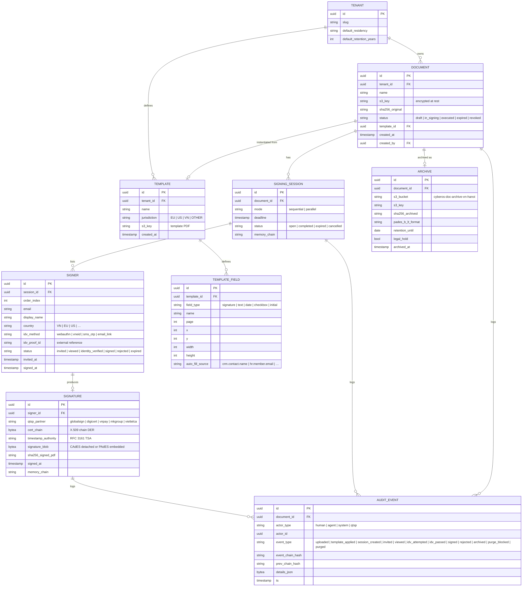
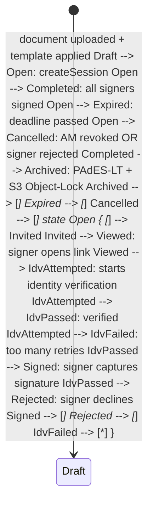

DOC is CyberOS's **e-signature workflow + immutable archival** service. The cryptographic signing act is delegated to an eIDAS-conformant QTSP (qualified trust-service provider) per jurisdiction; DOC owns everything else: document upload + SHA-256 integrity hashing, template definition + auto-fill from CRM data, multi-party workflow (signer order, parallel vs sequential), identity verification (WebAuthn for CyberOS-resident users; VNeID for Vietnamese citizens; SMS-OTP fallback), per-document hash-chained audit log, and S3 Object-Lock archival with residency-pinning. Three certificate chains are supported: **eIDAS QTSP** (qualified electronic signature, QES) for the EU; **Adobe AATL** for US/non-EU enterprise; **Vietnamese CA chain** (VnPay, MK Group, Viettel-CA) for VN per Decree 130/2018. Migration paths from DocuSign, Adobe Sign, and HelloSign preserve original audit trails without re-signing. The default retention is 10 years; longer per applicable law (e.g. employment contracts under VN labour law).

## At a glance

| Item | Detail |
|---|---|
| Status | Planned - P4 long-term |
| Cert chains | 3: eIDAS, AATL, VN CA |
| Identity proof | 4 methods: WebAuthn, VNeID, SMS-OTP, email-link |
| Retention | 10 years (eIDAS / ESIGN minimum) |
| Archive | S3 Object-Lock, Compliance mode + residency pin |
| Migration | 3 sources: DocuSign, Adobe Sign, HelloSign |
| i18n | vi + en, + regional certs |
| Depends on | AUTH, memory, QTSP partner; CRM, HR, INV consumers |

## The bigger picture - three strategic roles

DOC ships P4 because legally-binding e-signatures require regulated trust-service providers - and CyberOS will not pretend to be one. The architecture is partner-routed: DOC owns the workflow (upload, template, multi-party order, archival, lifecycle); QTSP partners (eIDAS/AATL/VN CA) provide the cryptographic signing. This separation makes DOC compliance-clean and provider-portable.

**Role 1 - Document repository.** Versioned, ACL'd, 10-year retention. Documents stored in S3 Object-Lock-Compliance bucket with residency pinning per tenant. Versioned at every modification; immutable post-archive. ACL aligns with module ownership (HR contracts -> HR scope; CRM contracts -> CRM scope; ESOP grants -> cap-table scope). 10-year retention satisfies eIDAS + ESIGN minimum.

**Role 2 - E-sign workflow.** Partner-routed cryptography, CyberOS-owned workflow. DOC owns the workflow: upload, template assembly, multi-party signing order, identity verification (WebAuthn / VNeID / SMS-OTP / email-link), audit chain. The cryptographic act delegates to eIDAS QTSP (EU), AATL CA (US), or Vietnamese CA (VN). DocuSign / Adobe Sign / HelloSign migration brings legacy signed docs in without re-signing.

**Role 3 - Contract lifecycle.** HR + CRM + ESOP integration, expiry + renewal. Every contract carries lifecycle metadata: type (employment / NDA / MSA / SOW / ESOP grant), parties, effective dates, renewal date, expiry, parent contract. Expiry alerts fire 90 days before; renewal proposals draft via CUO. Cross-module: HR contracts auto-link to Member onboarding; CRM contracts link to Engagement creation in PROJ; ESOP grants archive with cap-table audit trail.

### DOC partner-routed signing flow

Diagram source (Mermaid, flattened during migration):

```mermaid
flowchart LR SOURCE["Source  
HR · CRM · ESOP · LEGAL"] DOC["✍ DOC  
workflow · template · identity"] SIGN_EU["🇪🇺 eIDAS QTSP  
(EU residency)"] SIGN_US["🇺🇸 AATL CA  
(US residency)"] SIGN_VN["🇻🇳 VNeID + VN CA  
(VN residency)"] ARCHIVE["📦 S3 Object-Lock  
Compliance · 10yr"] memory["🧠 memory  
contract event audit"] LIFECYCLE["⏰ Lifecycle  
expiry · renewal · alerts"] SOURCE --> DOC DOC -- "EU tenant" --> SIGN_EU DOC -- "US tenant" --> SIGN_US DOC -- "VN tenant" --> SIGN_VN SIGN_EU --> ARCHIVE SIGN_US --> ARCHIVE SIGN_VN --> ARCHIVE ARCHIVE --> LIFECYCLE LIFECYCLE --> SOURCE DOC --> memory classDef hub fill:#fde68a,stroke:#451a03,stroke-width:3px,color:#451a03 classDef mod fill:#e0e7ff,stroke:#3730a3 classDef partner fill:#fef2f2,stroke:#b91c1c classDef memory fill:#fef6e0,stroke:#9c750a class DOC hub class SOURCE,ARCHIVE,LIFECYCLE mod class SIGN_EU,SIGN_US,SIGN_VN partner class memory memory
```

### Auto vs human-in-loop operations matrix

Operation| How it happens| Why this split
---|---|---
Document upload| **Manual** Member action| Intent; auto-upload from other modules also requires authoring trigger.
Template assembly| **Auto** from template engine| Templates parameterised; CUO drafts variable fields.
Identity verification| **Auto** via WebAuthn / VNeID / SMS-OTP / email-link| Multi-factor enforced per signer; never bypassed.
Cryptographic signing| **Auto** via QTSP partner API| The QTSP/CA is the trust anchor; CyberOS never holds the signing key.
High-value signing (>= tenant threshold)| **Manual** 2nd-factor + dual approval| Anti-fraud per Decree 130/2018; signer + counter-signer if applicable.
Expiry alert| **Auto** 90 / 30 / 7 days before| Renewal lead time; CUO drafts renewal proposal.
Renewal proposal| **Auto** draft; **Manual** review + send| CUO drafts terms; legal/AM reviews.
Archival| **Auto** at signing complete| Object-Lock + audit chain row.
DSAR export| **Auto** bundle per request| Per-subject signature events; chain-preserved.
Document deletion (purge)| **Blocked** until retention expires| 10-year retention is statutory; deletion not allowed prior.

## Why DOC exists

Consultancies sign documents all day: MSAs, SOWs, employment contracts, NDAs, change orders, supplier agreements, COIs, retention letters. They send them through DocuSign or Adobe Sign at $30-$50 per seat per month, and the resulting signed PDFs land in someone's email or shared drive - never in the same audit chain as the workflow that produced them, never re-discoverable by the AI surface, never bound to the CRM record. DOC fixes this by making "sign this document" a first-class CyberOS workflow: the template is defined in DOC, the signer field auto-pulls from CRM, the QTSP partner does the actual crypto, and the resulting PDF + cert chain + audit log lands back in DOC, citable from memory, and visible to the AM in CHAT. The cost saving (no per-seat DocuSign) is incidental; the integration is the value.

- **Partner-routed signing:** DOC owns the workflow; eIDAS QTSP / Adobe AATL / VN CA owns the crypto. CyberOS does not invent trust - it integrates regulated trust.
- **Identity proof matters:** VNeID for VN citizens, WebAuthn for repeat signers, SMS-OTP for one-time external signers. High-value docs require multi-factor.
- **Archive is immutable:** Signed PDFs land in S3 Object-Lock Compliance mode with 10-year retention. The "did they actually sign?" question is one cosign verification away.

The bet is that the dollars saved on DocuSign are nice but the real value is the binding: a signed MSA appears as a CRM activity, an employment contract appears in HR, a SOW appears under PROJ.engagement, an INV-issued purchase order links to the signed-doc record. Future-AI surfaces - "show me every signed agreement with Acme Corp" - become a single GraphQL query, not a Sharepoint hunt.

## What it does - 5W1H2C5M

A structured decomposition of DOC's scope.

Axis| Question| Answer
---|---|---
**5W - What**| What is DOC?| A document-management + e-signature workflow service. Owns: documents, templates, signing sessions, signature records, identity-verification events, audit log, archive. Delegates cryptographic signing to QTSP partners.
**5W - Who**| Who uses it?| **AMs:** initiate MSA / SOW signing. **HR:** contract signing. **Finance:** PO + invoice signing. **Counterparties:** external signers via email link. **CLO:** reviews high-value docs pre-send.
**5W - When**| When does it run?| On-demand for signing-session create. Continuous for archival jobs and certificate-chain validation. Nightly for retention-policy enforcement (purge after retention expiry per legal).
**5W - Where**| Where does it run?| P4: SG-1 primary + VN-hanoi-1 partition. S3 Object-Lock bucket per residency. QTSP API calls outbound to partner regions.
**5W - Why**| Why a separate module?| Because every other module needs to attach signed documents to its primitives (CRM.deal -> MSA, HR.employee -> contract, INV.invoice -> signed PO). Owning the surface once means every consumer reads the same signature audit chain.
**1H - How**| How does it work?| Document upload -> SHA-256 integrity hash -> template overlay (auto-fill from CRM/HR data) -> signing session created with ordered signer list -> identity verification per signer (WebAuthn/VNeID/SMS) -> QTSP signing call -> certificate + timestamp returned -> PDF stamped + AATL/CAdES-format embedded -> archive to S3 Object-Lock.
**2C - Cost**| Cost budget?| P4: QTSP partner cost ~$0.50-$2.00 per signature (passes through). Infra ~$80 / month (Fargate + S3 storage + Object-Lock + KMS).
**2C - Constraints**| Constraints?| (a) eIDAS conformity required for QES - partner-only. (b) VN Decree 130/2018 - signature must use VN-licenced CA for legal effect in VN. (c) 10-year minimum retention. (d) PDPL Art. 14 DSAR - export support for signers' own data. (e) GDPR Art. 17 - purge with archival exemption for legal docs.
**5M - Materials**| Stack?| Rust 1.81, axum, sqlx, PostgreSQL 16, S3 (Object-Lock Compliance), KMS, pdfium for PDF manipulation, CAdES + PAdES formats, OpenTelemetry. QTSP partners: GlobalSign (EU), DigiCert (US-AATL), VnPay (VN), MK Group (VN), Viettel-CA (VN).
**5M - Methods**| Method choices?| PAdES-B-LT (long-term) format for archived PDFs - includes cert chain + revocation info + LTV. Per-document hash-chained audit log mirrors memory chain semantics. Multi-signer workflows are state machines.
**5M - Machines**| Deployment?| Fargate tasks (workflow), separate task for archival jobs. S3 Object-Lock buckets per residency. KMS-wrapped encryption for at-rest documents.
**5M - Manpower**| Who maintains?| 0.3 FTE at P4; legal counsel reviews QTSP partner contracts annually; security review of cert-chain handling annually.
**5M - Measurement**| How measured?| (NFR pending) signature non-repudiation - cosign verifies any archive byte-for-byte; (NFR pending) zero archive loss over 10 years; KPI signature-time p95 (<= 5 min including human-confirm).

## Architecture

DOC is a Rust service split into three planes: workflow (document, template, session, signer state machine), partner-broker (QTSP routing per jurisdiction), and archive (S3 Object-Lock + LTV PAdES validation). The architecture is partner-routed: signature crypto never happens inside CyberOS; identity verification is normalised across WebAuthn / VNeID / SMS-OTP / email-link.

Diagram source (Mermaid, flattened during migration):

```mermaid
graph TB subgraph UI ["UI surfaces"] SPA["Signer SPA  
(React + pdf.js)"] TPL["Template designer"] INBOX["Counterparty link"] end subgraph DOC ["DOC service (Rust · axum)"] DCRUD["doc.rs  
document CRUD"] TPL_S["template.rs  
field overlay"] SESSION["session.rs  
signing-session state machine"] SIGNER["signer.rs  
per-signer flow"] IDV["idv.rs  
identity verification dispatcher"] BROKER["broker.rs  
QTSP routing"] ARCHIVE["archive.rs  
PAdES-LT + S3 Object-Lock"] MIGRATE["migrate.rs  
DocuSign / AdobeSign import"] PDF["pdf.rs  
pdfium wrapper"] end subgraph IDV_BACKENDS ["Identity-verification backends"] WA["AUTH WebAuthn"] VNEID["🇻🇳 VNeID API"] SMS["SMS-OTP provider"] EMAIL["Email-link"] end subgraph QTSP ["QTSP partners (delegated crypto)"] GS["GlobalSign QTSP (EU)"] DG["DigiCert AATL (US/non-EU)"] VNPAY["VnPay CA (VN)"] MKG["MK Group CA (VN)"] VTL["Viettel-CA (VN)"] end subgraph STORES ["Stores"] PG[("PostgreSQL 16  
doc.document · template  
session · signer · signature  
audit_event")] S3[("S3 Object-Lock Compliance  
10y retention  
residency-pinned")] KMS[("AWS KMS  
document encryption keys")] end subgraph SINKS ["Audit"] memory["🧠 memory  
doc.* rows"] OBS["👁 OBS"] end SPA --> DCRUD TPL --> TPL_S INBOX --> SIGNER DCRUD --> PDF DCRUD --> S3 DCRUD --> KMS TPL_S --> PG SESSION --> PG SESSION --> SIGNER SIGNER --> IDV IDV --> WA IDV --> VNEID IDV --> SMS IDV --> EMAIL SIGNER --> BROKER BROKER --> GS BROKER --> DG BROKER --> VNPAY BROKER --> MKG BROKER --> VTL BROKER --> ARCHIVE ARCHIVE --> S3 ARCHIVE --> memory SESSION --> memory DOC --> OBS MIGRATE --> S3 MIGRATE --> PG classDef planned fill:#fde68a,stroke:#78350f classDef store fill:#f5f3ff,stroke:#7c3aed classDef sink fill:#f5ede6,stroke:#45210e classDef partner fill:#fef2f2,stroke:#7f1d1d class SPA,TPL,INBOX,DCRUD,TPL_S,SESSION,SIGNER,IDV,BROKER,ARCHIVE,MIGRATE,PDF planned class PG,S3,KMS store class memory,OBS sink class GS,DG,VNPAY,MKG,VTL,WA,VNEID,SMS,EMAIL partner
```

### Internal components

Component| Path (planned)| Responsibility
---|---|---
`doc.rs`| services/doc/src/doc.rs| Document CRUD - upload, version, SHA-256 hash, encrypt-at-rest via KMS, store on S3.
`template.rs`| services/doc/src/template.rs| Template definition: signer fields, text fields, date fields, conditional fields. Auto-fill rules pulling from CRM/HR/INV.
`session.rs`| services/doc/src/session.rs| Signing session: ordered signer list, parallel/sequential mode, deadline, reminder schedule.
`signer.rs`| services/doc/src/signer.rs| Per-signer state machine: invited -> identity_verified -> signed / rejected / expired.
`idv.rs`| services/doc/src/idv.rs| Identity-verification dispatcher. Routes based on signer profile + document risk-tier. WebAuthn / VNeID / SMS-OTP / email-link.
`vneid.rs`| services/doc/src/vneid.rs| VNeID API client. CCCD (Citizen ID) validation; biometric assertion for high-value docs (Decision 06/2022/QĐ-TTg).
`broker.rs`| services/doc/src/broker.rs| QTSP routing. Picks partner per (jurisdiction x document_type x signer_country). Failover between partners on outage.
`pades.rs`| services/doc/src/pades.rs| PAdES-B-LT formatter. Embeds cert chain + OCSP revocation info + DSS dictionary for long-term validation.
`archive.rs`| services/doc/src/archive.rs| S3 Object-Lock Compliance archival. Residency-pinned bucket. 10-year retention by default; per-tenant override.
`audit_chain.rs`| services/doc/src/audit_chain.rs| Per-document hash-chained audit log. Each signature event chains to previous; export bundle for legal discovery.
`retention.rs`| services/doc/src/retention.rs| Retention policy enforcement. Nightly job: identifies docs past retention + legal hold lifted; purges with audit row.
`migrate.rs`| services/doc/src/migrate.rs| DocuSign / Adobe Sign / HelloSign import. Preserves original audit trail; flags imported docs as "external-trust".
`fraud.rs`| services/doc/src/fraud.rs| Notary-fraud detection: velocity check, impossible-travel for signers, device fingerprint, anomaly score.
`migrations/`| services/doc/migrations/| sqlx migrations. RLS by tenant_id. Indices on (doc_id), (session_id, signer_id), (status).

**DOC-INV-001 - Signed-document integrity is byte-for-byte verifiable.** Every archived PDF MUST cosign-verify against (a) its SHA-256 stored at archive time, (b) its cert chain stored with the document, and (c) its memory audit-chain leaf. The verification path is implemented in `cyberos-doc verify --archive-id ...` and is exercised quarterly by an automated chaos job that randomly picks 1% of archived docs and verifies them. Failure halts retention purges until investigation completes.

## Data model

Documents, templates, signing sessions, signers, signatures, audit events, archive records. PostgreSQL holds metadata; PDF content (encrypted) lives on S3 Object-Lock.

Diagram source (Mermaid, flattened during migration):



### Per-document audit chain (mirrors memory semantics)

```text
/ each audit_event row carries:
/ prev_chain_hash = previous event's chain hash for this doc
/ event_chain_hash = SHA-256(canonical(this_event_minus_chain) || prev_chain_hash)
/
/ `cyberos-doc verify --doc-id …` walks the chain end-to-end:
/ - validates SHA-256 of original at upload event
/ - validates each event's chain hash
/ - validates QTSP cert chain at signed event
/ - validates timestamp authority RFC 3161 token
/ - validates final archive SHA-256 against archive event
/
/ Tampering at any point fails verification with a precise diagnosis row.
```

## API surface

GraphQL subgraph for cross-module reads (CRM.deal -> contract list, HR.member -> contract history), REST for the signer SPA, MCP tools for natural-language workflow ("send the standard MSA to acme@...").

### GraphQL subgraph (federated)

```graphql
extend schema
 @link(url: "https://specs.apollo.dev/federation/v2.5", import: ["@key", "@external", "@shareable", "@requiresScopes"])

type Document @key(fields: "id") {
 id: ID!
 name: String!
 status: DocStatus!
 template: Template
 sessions: [SigningSession!]!
 auditEvents: [AuditEvent!]!
 archive: Archive
 createdAt: DateTime!
}

type Template @key(fields: "id") {
 id: ID!
 name: String!
 jurisdiction: Jurisdiction!
 fields: [TemplateField!]!
}

type TemplateField {
 fieldType: FieldType!
 name: String!
 autoFillSource: String
}

type SigningSession @key(fields: "id") {
 id: ID!
 document: Document!
 mode: SessionMode!
 status: SessionStatus!
 deadline: DateTime!
 signers: [Signer!]!
}

type Signer @key(fields: "id") {
 id: ID!
 orderIndex: Int!
 email: String!
 displayName: String!
 country: String!
 idvMethod: IdvMethod!
 status: SignerStatus!
 signature: Signature
}

type Signature {
 qtspPartner: QtspPartner!
 timestampAuthority: String!
 signedAt: DateTime!
}

type AuditEvent {
 eventType: AuditEventType!
 actorType: ActorType!
 ts: DateTime!
 eventChainHash: String!
}

type Archive {
 s3Bucket: String!
 retentionUntil: Date!
 legalHold: Boolean!
 padesFormat: String!
}

enum DocStatus { DRAFT IN_SIGNING EXECUTED EXPIRED REVOKED }
enum SessionMode { SEQUENTIAL PARALLEL }
enum SessionStatus { OPEN COMPLETED EXPIRED CANCELLED }
enum SignerStatus { INVITED VIEWED IDENTITY_VERIFIED SIGNED REJECTED EXPIRED }
enum IdvMethod { WEBAUTHN VNEID SMS_OTP EMAIL_LINK }
enum QtspPartner { GLOBALSIGN DIGICERT VNPAY MKGROUP VIETTELCA }
enum Jurisdiction { EU US VN OTHER }
enum FieldType { SIGNATURE TEXT DATE CHECKBOX INITIAL }
enum ActorType { HUMAN AGENT SYSTEM QTSP }
enum AuditEventType { UPLOADED TEMPLATE_APPLIED SESSION_CREATED INVITED VIEWED IDV_ATTEMPTED IDV_PASSED SIGNED REJECTED ARCHIVED PURGE_BLOCKED PURGED }

extend type Deal @key(fields: "id") {
 id: ID! @external
 documents: [Document!]! @requiresScopes(scopes: [["doc.read"]])
}

extend type Member @key(fields: "id") {
 id: ID! @external
 contracts: [Document!]! @requiresScopes(scopes: [["doc.read"]])
}

type Query {
 document(id: ID!): Document @requiresScopes(scopes: [["doc.read"]])
 myPendingSignatures: [Signer!]! @requiresScopes(scopes: [["doc.read"]])
 templates(jurisdiction: Jurisdiction): [Template!]! @requiresScopes(scopes: [["doc.read"]])
}

type Mutation {
 uploadDocument(name: String!, sha256: String!): UploadUrl! @requiresScopes(scopes: [["doc.write"]])
 createSession(input: SessionInput!): SigningSession! @requiresScopes(scopes: [["doc.write"]])
 cancelSession(id: ID!, reason: String!): SigningSession! @requiresScopes(scopes: [["doc.write"]])
 setLegalHold(documentId: ID!, hold: Boolean!): Document!
 @requiresScopes(scopes: [["doc.legal_hold"]])
}
```

### REST endpoints

Method| Path| Purpose
---|---|---
POST| `/doc/upload`| Multipart upload - returns doc_id + s3_key.
POST| `/doc/{id}/template/{tpl}`| Apply template overlay; resolve auto-fill from CRM/HR.
POST| `/doc/{id}/session`| Create signing session.
GET| `/doc/sign/{signer_token}`| External signer landing page (counterparty).
POST| `/doc/sign/{signer_token}/idv`| Identity-verification challenge response.
POST| `/doc/sign/{signer_token}/finalize`| Capture signature; trigger QTSP call.
GET| `/doc/{id}/audit-bundle.zip`| Legal-discovery bundle: PDF + cert chain + audit log.
POST| `/doc/migrate/docusign`| Import legacy DocuSign envelope (preserve original trail).
POST| `/doc/migrate/adobesign`| Import legacy Adobe Sign.
POST| `/doc/migrate/hellosign`| Import legacy HelloSign.
GET| `/doc/{id}/verify`| Cosign verify of archived PDF.
POST| `/doc/{id}/legal-hold`| Apply / lift legal hold.
POST| `/doc/admin/retention-sweep`| Run nightly retention sweep manually.

### MCP tool catalogue

Tool name| Inputs| Outputs| Annotations
---|---|---|---
`cyberos.doc.list`| filter, status?| Document| readonly, scope=doc.read
`cyberos.doc.start_signing`| template_id, deal_id, signers| {session_id, signer_links}| destructive, scope=doc.write, human-confirm
`cyberos.doc.status`| session_id| {session, signers}| readonly
`cyberos.doc.cancel_session`| session_id, reason| {ok}| destructive, scope=doc.write, human-confirm
`cyberos.doc.find_template`| name_match, jurisdiction| Template| readonly
`cyberos.doc.legal_discovery_bundle`| doc_id| {zip_url}| destructive, scope=doc.legal_export
`cyberos.doc.verify_archive`| doc_id| {ok, diagnostics}| readonly
`cyberos.doc.set_legal_hold`| doc_id, hold| {ok}| destructive, scope=doc.legal_hold, human-confirm

## Key flows

### Flow 1 - Document upload + template fill

```mermaid
sequenceDiagram autonumber participant AM as Account Manager participant SPA as DOC SPA participant D as doc.rs participant T as template.rs participant CRM as 🏢 CRM participant KMS as AWS KMS participant S3 as S3 (residency-pinned) participant B as 🧠 memory AM->>SPA: upload "Acme MSA.pdf" + select template "MSA-EU-v3" SPA->>D: POST /doc/upload (multipart, sha256) D->>KMS: encrypt at rest (envelope) D->>S3: PutObject (encrypted body) D->>B: append doc.uploaded row {sha256, by:AM} SPA->>T: POST /doc/{id}/template/MSA-EU-v3 T->>CRM: query Deal.contact for auto-fill (name, email, address) CRM-->>T: contact rows T->>T: overlay fields onto template canvas; SHA-256 final body T->>B: append template.applied row T-->>SPA: ready-to-send preview
```

### Flow 2 - Multi-party signing (sequential)

```mermaid
sequenceDiagram autonumber participant AM as Account Manager participant S as session.rs participant Sa as Signer A (CEO of Acme) participant Sb as Signer B (CyberSkill CEO) participant I as idv.rs participant BK as broker.rs participant QTSP as eIDAS QTSP (GlobalSign) participant B as 🧠 memory AM->>S: createSession(mode=sequential, signers=[A, B], deadline=14d) S->>B: append session.created row S->>Sa: email magic link (signer order_index=1) Sa->>I: opens link · IDV via email-link (T2 doc) I-->>Sa: identity verified Sa->>S: views + signs S->>BK: route signature(country=EU, doc_type=MSA) BK->>QTSP: sign call (cert chain, RFC 3161 timestamp) QTSP-->>BK: CAdES blob + cert chain + TSA token BK->>S: signature stored S->>B: append signer.signed row {A} S->>Sb: email magic link (order=2) Sb->>I: WebAuthn (CyberSkill member, AAL3) I-->>Sb: identity verified Sb->>S: views + signs S->>BK: route again BK->>QTSP: sign QTSP-->>BK: signature blob BK->>S: signature stored S->>S: all signers complete → session.complete S->>B: append session.completed row S->>S: trigger archive flow (Flow 5)
```

Sequential mode means signer B's magic link is not emitted until A signs. Parallel mode emits both at once; first-to-sign rule + reminder cadence still apply.

### Flow 3 - Identity verification + sign with VNeID

```mermaid
sequenceDiagram autonumber participant S as Signer (VN citizen) participant SPA as DOC SPA participant I as idv.rs participant V as vneid.rs participant VNEID as 🇻🇳 VNeID API participant BK as broker.rs participant VNCA as VN CA (e.g., VnPay) participant B as 🧠 memory S->>SPA: open signing page SPA->>I: getIdvChallenge(country=VN, risk=high) I->>V: prepare VNeID challenge (CCCD + biometric) V->>VNEID: createIdentityVerification VNEID-->>V: deeplink to VNeID app V-->>SPA: deeplink + QR S->>VNEID: open app, scan, biometric capture VNEID-->>V: idv_proof_id, attributes (full_name, CCCD, DOB) V->>I: pass idv I->>B: append idv.passed row {method:vneid, proof_id} I-->>SPA: ready to sign S->>SPA: confirm sign SPA->>BK: route signature (country=VN) BK->>VNCA: sign call (signer attrs from VNeID) VNCA-->>BK: CAdES blob + cert chain (VN root) BK->>B: append signed row
```

### Flow 4 - Long-term archival (PAdES-B-LT + S3 Object-Lock)

```mermaid
sequenceDiagram autonumber participant S as session.rs (all signed) participant P as pades.rs participant A as archive.rs participant KMS as AWS KMS participant S3 as S3 Object-Lock Compliance participant TSA as RFC 3161 TSA participant B as 🧠 memory S->>P: assemble PAdES-B-LT P->>P: embed cert chain (all signers) P->>P: embed OCSP responses (revocation info) P->>TSA: outer timestamp (long-term validation) TSA-->>P: TSA token P->>P: DSS dictionary + LTV P->>A: hand off PDF A->>KMS: encrypt at rest A->>S3: PutObject with Object-Lock retain-until = now + 10y; LegalHold=OFF S3-->>A: ETag + VersionId A->>B: append archive.completed row {s3_key, retention_until, sha256} A->>S: archive ready
```

Object-Lock Compliance mode means even the AWS account root cannot delete the object before retention expiry. Legal hold is a separate flag that can be applied later to extend protection.

### Flow 5 - DocuSign migration (preserve original trail)

```mermaid
sequenceDiagram autonumber participant CLO as CLO participant M as migrate.rs participant DS as DocuSign API participant A as archive.rs participant S3 as S3 Object-Lock participant B as 🧠 memory CLO->>M: cyberos-doc migrate-docusign --since 2020-01-01 M->>DS: list envelopes (paged) loop per envelope DS-->>M: envelope_id, signed PDF URL, audit log M->>DS: GET signed PDF + cert chain + audit JSON DS-->>M: bytes + metadata M->>M: validate DocuSign cert chain (AATL trust) M->>A: archive original PDF (no re-sign) A->>S3: PutObject (Object-Lock) M->>B: append migration.imported row {source:docusign, original_envelope_id, trust:external} end M->>CLO: report N migrated · 0 failures
```

Migration preserves the original DocuSign audit trail in `audit_event.details_json`. Documents are flagged `trust=external` so consumers know the signature was produced by another provider.

## Signing-session lifecycle

A session traverses six states; the per-signer state machine sits inside Open. Every transition writes an audit event.



### Per-state actions

State| Trigger| Side-effects
---|---|---
Draft| document + template ready| Audit row `template.applied`; preview rendered.
Open| createSession success| First signer notified (sequential) or all signers notified (parallel); reminders scheduled.
Invited| signer email sent| Magic-link token issued; expiry = session deadline.
Viewed| signer opens link| Audit row `signer.viewed` with IP + UA + device fingerprint.
IdvPassed| identity verified| Audit row `idv.passed` with method + proof_id.
Signed| QTSP signature returned| Audit row `signer.signed` with cert chain + TSA token.
Completed| all signers signed| Trigger archive flow; downstream consumers (CRM / HR / INV) notified.
Archived| PAdES-LT written to S3 Object-Lock| Audit row `archive.completed`; retention timer starts.
Expired| deadline reached without all signing| Audit row `session.expired`; AM notified; document remains in PG (no archive).
Cancelled| AM revoke OR signer reject| Audit row `session.cancelled` with reason; all signer tokens invalidated.

## Functional requirements

The CyberOS FR catalogue is being rebuilt one feature at a time via the open [feature-request-author](https://github.com/cyberskill/cyberos/tree/main/modules/skill/feature-request-author) Agent Skill.

Previous FR enumerations were archived 2026-05-14 and are no longer reflected on this page. Specific FRs land here as they are re-authored.

## Non-functional requirements

DOC NFRs centre on signature non-repudiation and long-term archival durability.

NFR ID| Concern| Target| Measurement
---|---|---|---
(NFR pending)| Signature non-repudiation (cosign verifies archive byte-for-byte)| 100% of archives| quarterly chaos audit (random 1%)
(NFR pending)| Cross-tenant document leak| = 0| RLS verification suite
(NFR pending)| Archive durability (no archive loss over 10 years)| 11x9s (S3 Object-Lock guarantee)| S3 SLA
(NFR pending)| Audit-chain integrity| = 0 broken chains| nightly walker job
(NFR pending)| uploadDocument server-canonical p95| <= 3 s (10 MB PDF)| k6
(NFR pending)| End-to-end sign (after IDV) p95| <= 8 s| RUM
(NFR pending)| QTSP partner round-trip p95| <= 5 s (network)| per-partner SLO
(NFR pending)| DOC availability| >= 99.9% (P4)| SLO monitor
(NFR pending)| QTSP partner failover RTO| <= 60 s on partner outage| chaos test
(NFR pending)| eIDAS QES conformity (annual audit)| passed| external auditor
(NFR pending)| VN Decree 130/2018 cert chain validity| 100%| VN CA SLA

## Dependencies

DOC depends on AUTH (WebAuthn), memory (audit), KMS + S3 (archival), and at least one QTSP partner per jurisdiction. Consumed by CRM (deal contracts), HR (employment contracts), INV (signed POs), and PORTAL (client signing).

Diagram source (Mermaid, flattened during migration):

```mermaid
graph LR subgraph upstream ["DOC depends on"] AUTH["🔐 AUTH  
WebAuthn + RBAC"] memory["🧠 memory  
audit chain"] OBS["👁 OBS"] KMS["🔑 AWS KMS"] S3["🗄 S3 Object-Lock"] VNEID["🇻🇳 VNeID API"] QTSP["🤝 QTSP partners  
GlobalSign · DigiCert · VnPay · MK · Viettel-CA"] TSA["RFC 3161 TSA"] CRM["🏢 CRM  
contact auto-fill"] HR_UP["👥 HR  
member auto-fill"] end DOC["✍️ DOC"] subgraph downstream ["Used by"] CRM_D["🏢 CRM  
deal contracts"] HR_D["👥 HR  
employment contracts"] INV_D["💰 INV  
signed POs"] PORTAL["🌐 PORTAL  
client signing"] MEMORY_D["🧠 memory  
doc citations"] end AUTH --> DOC memory --> DOC OBS --> DOC KMS --> DOC S3 --> DOC VNEID --> DOC QTSP --> DOC TSA --> DOC CRM --> DOC HR_UP --> DOC DOC --> CRM_D DOC --> HR_D DOC --> INV_D DOC --> PORTAL DOC --> MEMORY_D classDef planned fill:#fde68a,stroke:#78350f classDef partner fill:#fef2f2,stroke:#7f1d1d class AUTH,memory,OBS,KMS,S3,CRM,HR_UP,DOC,CRM_D,HR_D,INV_D,PORTAL,MEMORY_D planned class VNEID,QTSP,TSA partner
```

## Compliance scope

DOC is the most regulation-heavy module after AUTH. Signature legality across jurisdictions is its entire job.

Regulation / standard| Article / clause| DOC feature that satisfies it
---|---|---
eIDAS (EU Reg. 910/2014)| Art. 25 - Legal effects of e-signatures| QES via partner QTSP for EU; AdES default for non-QES use cases.
eIDAS| Art. 32 - Validation of QES| PAdES-B-LT embedded cert chain + OCSP + LTV timestamp.
eIDAS| Art. 34 - Long-term preservation| S3 Object-Lock Compliance 10y; LTV outer timestamp.
EU ESI standards| ETSI EN 319 142 - PAdES baseline| PAdES-B-LT format implemented.
US ESIGN Act (15 U.S.C. §7001)| Consent + intent + record retention| Explicit consent UI; intent captured at sign; 10-year retention.
US UETA| State e-signature recognition| AATL cert chain via DigiCert.
Vietnam Decree 130/2018/NĐ-CP| E-signature legal recognition| VN CA chain (VnPay / MK / Viettel-CA); compliant cert profile.
Vietnam Decision 06/2022/QĐ-TTg| National digital identity (VNeID)| VNeID integration via `vneid.rs` for VN citizens.
Vietnam Law 91/2025/QH15 (PDPL)| Art. 14 - DSAR| DSAR export bundles documents + audit chains.
GDPR (EU 2016/679)| Art. 15 - Right of access| Same surface as PDPL.
GDPR| Art. 17 - Right to erasure| Purge supported with legal-hold + retention-period exemptions; audit fact of erasure remains.
ISO/IEC 27001:2022| A.5.34 - Privacy in development| Documents encrypted at rest via KMS; access RLS-keyed.
ISO 14533-1 (PAdES)| Long-term archival profiles| PAdES-B-LT format.
SOC 2 Type II| CC6.1 - Logical access| RBAC + multi-factor for high-value signing.

## Risk entries

DOC-specific risks in the [risk register](../../reference/risk-register.html#doc).

ID| Risk| Likelihood| Impact| Owner| Mitigation
---|---|---|---|---|---
`R-DOC-001`| Spoofing / Repudiation - forged signature| Low| Catastrophic| CLO| eIDAS QTSP cert chain; WebAuthn binding; multi-factor for high-value docs; quarterly external audit.
`R-DOC-002`| Notary-fraud / impersonation via SMS-OTP only| Medium| High| CSO| SMS-OTP restricted to low-value docs; high-value requires WebAuthn or VNeID biometric.
`R-DOC-003`| QTSP partner outage during signing campaign| Medium| Medium| CTO| Multi-partner per jurisdiction; broker.rs failover; 60s RTO chaos-tested.
`R-DOC-004`| VNeID API breaking change| Medium| High| CTO| Adapter pattern in vneid.rs; integration tests on every release; VN CA fallback for non-biometric path.
`R-DOC-005`| S3 Object-Lock misconfiguration allows premature deletion| Low| Catastrophic| CSO| Compliance mode (not Governance); CI test verifies retention-until; account-root cannot override.
`R-DOC-006`| Legal-hold lift granted to non-CLO| Low| High| CSO| (FR pending) scope=doc.legal_hold limited to CLO + DPO; quarterly access review.
`R-DOC-007`| Cert chain expires; PAdES-LT cannot validate decades later| Medium| High| CTO| PAdES-B-LT includes LTV outer timestamp; periodic re-stamping job at year 9 (1y before retention end).
`R-DOC-008`| Cross-tenant document leak via shared S3 bucket| Low| Catastrophic| CSO| Per-tenant bucket prefix; IAM scoped per tenant; pre-signed-URL audience-bound.
`R-DOC-009`| Migration import accepts forged DocuSign trail| Low| High| CLO| Imports flagged trust=external; cert chain validated against AATL root; CLO approves import batches.
`R-DOC-010`| GDPR Art. 17 purge collides with retention obligation| Medium| Medium| DPO| Purge requires CLO sign-off + retention-exempt classification; rejection logged with reason.
`R-DOC-011`| CRM/HR/ESOP-triggered document creation fires without underlying lifecycle context| Medium| Medium| CTO| Each cross-module trigger validates source record state at submission; reject document creation if source record incomplete.
`R-DOC-012`| Renewal proposal CUO-drafted with stale terms (e.g. expired discount)| Medium| Low| CPO| Renewal proposal carries terms-version stamp; CUO reads from active rate-card / contract templates only; AM final review.
`R-DOC-013`| Expiry alert latency - 90-day notice misses a contract| Low| High| CTO| Nightly batch double-checks all active contracts; 90/30/7 day cascade; OBS alarm on any missed cascade step.
`R-DOC-014`| Multi-jurisdiction contract (VN tenant signs with EU customer) - which cert chain governs?| Medium| Medium| CLO| Per-contract cert-chain declaration; co-signer cert chains both attached; legal precedence rules per type documented in KB runbook.
`R-DOC-015`| Migrated DocuSign trail fails LTV after import - provenance breaks at archive| Medium| High| CLO| Imports flagged trust=external + cert-chain captured at import; LTV re-validation at year 9; failures escalate to CLO.

## KPIs

DOC KPIs cover signing speed, completion rate, audit integrity, and compliance posture.

KPI| Formula| Source| Target
---|---|---|---
**Session completion rate**| completed / opened (per 30d)| doc.signing_session| >= 75%
**Time-to-first-signature p95**| histogram| OBS| <= 24 h
**Time-to-completion p95**| histogram| OBS| <= 7 d
**QTSP partner success rate**| signed / attempted| broker.rs| >= 99.5%
**Identity-verification pass rate**| idv.passed / idv.attempted| idv.rs| >= 90%
**Archive verification success**| quarterly chaos audit| chaos job| = 100%
**Cosign chain validation success**| nightly walker| OBS| = 100%
**Fraud-detection alerts / month**| count| fraud.rs| tracked
**Migration trust-external flag rate**| external / total| doc.document| declining trend
**Cross-module trigger validation rate**| cross-module-triggered docs with source record validated / total| OBS| = 1.0 (hard floor)
**Renewal proposal terms-stamp coverage**| proposals with active terms-version stamped / total| memory audit| = 1.0
**Expiry cascade completeness**| contracts hit by all 3 cascade steps (90/30/7) / total expiring| nightly batch| = 1.0
**Multi-jurisdiction cert-chain declaration rate**| multi-juris contracts with explicit cert-chain declared / total| contract metadata| = 1.0
**LTV re-validation pass rate (year 9)**| migrated trails passing LTV at year 9 / total imports| quarterly audit| >= 0.95 (escalate failures)

## RACI matrix

DOC is owned by the CLO seat (legal effect) with CTO for engineering and DPO for data-subject rights.

Activity| CEO| CLO| CTO| CSO| DPO| CFO
---|---|---|---|---|---|---
Service design + spec| A| R| R| C| C| I
Implementation| I| C| A/R| C| I| I
QTSP partner selection + contracts| C| A/R| R| C| I| C
Legal-hold application / lift| C| A/R| I| C| R| I
Retention-policy review (10y default)| C| A/R| I| I| C| I
eIDAS / Decree 130 conformity audit| C| A/R| C| R| C| I
Notary-fraud incident response| C| R| R| A| C| I
DSAR fulfilment (DOC scope)| I| C| I| I| A/R| I
Migration import (DocuSign / Adobe Sign)| C| A| R| I| I| I

R = Responsible, A = Accountable, C = Consulted, I = Informed.

## Planned CLI surface

Admin CLI `cyberos-doc`. Every destructive action writes a chained memory audit row.

### 1. Upload + apply template

```
$ cyberos-doc upload "Acme MSA.pdf" --template MSA-EU-v3 --deal deal-2026-0912

[uploaded] doc_id=DOC-018824 sha256=… bytes=412_223
[template] MSA-EU-v3 applied; 4 fields auto-filled from CRM
[audit] memory seq=21884 chain=…
```

### 2. Create a multi-party signing session

```
$ cyberos-doc session create \
 --doc DOC-018824 --mode sequential --deadline 14d \
 --signer "ceo@acme.com:Alice Smith:US:webauthn" \
 --signer "stephen@cyberskill.com:Stephen:VN:webauthn"

[session created] S-009311 order: [1:alice, 2:stephen]
[invited] alice@acme.com (magic link sent)
[reminder] scheduled +3d, +7d, +13d
```

### 3. Check session status

```
$ cyberos-doc session status S-009311

[status] open
[signers]
 1. alice@acme.com [SIGNED · 2026-05-13 09:14 · WebAuthn AAL3 · GlobalSign QTSP]
 2. stephen@cyberskill.com [VIEWED · 2026-05-13 11:02 · awaiting WebAuthn]
[deadline] 2026-05-27 (+13d)
```

### 4. Verify a signed-document archive

```
$ cyberos-doc verify --doc DOC-018824

[archive] s3:/cyberos-doc-archive-vn-hanoi/2026/05/DOC-018824.pdf
[sha256] ✓ matches archive event
[chain] ✓ 7 events, all chain-hashes valid
[certs] ✓ GlobalSign QTSP root trusted
[ocsp] ✓ revocation info valid
[tsa] ✓ RFC 3161 token valid
[overall] PASS
```

### 5. Export legal-discovery bundle

```
$ cyberos-doc bundle --doc DOC-018824 --output discovery.zip

[bundle]
 doc-018824.pdf 412 KB (PAdES-B-LT)
 doc-018824-audit.json 18 KB (7 chained events)
 doc-018824-cert-chain.pem 6 KB (full chain to root)
 doc-018824-tsa-token.tsr 4 KB
 doc-018824-readme.md 2 KB (verification instructions)
[total] 442 KB
[written] discovery.zip
```

### 6. Migrate DocuSign envelopes

```
$ cyberos-doc migrate docusign --since 2020-01-01 --account "Acme Corp"

[connect] DocuSign OAuth ok
[scan] 324 envelopes since 2020-01-01
[import] 324 imported · 0 failures
[trust] all flagged trust=external
[audit] memory seq=21899 chain=…
```

### 7. Apply legal hold

```
$ cyberos-doc legal-hold --doc DOC-018824 --on --reason "Acme litigation 2026-104"

[hold applied] DOC-018824 protected beyond retention window
[next purge] blocked — legal_hold=true
[audit] memory seq=21902 chain=… (CLO co-sign required: stephen@cyberskill.com confirmed)
```

### 8. DSAR export for a signer

```
$ cyberos-doc dsar-export --subject alice@acme.com --output dsar.zip

[dsar] signed_documents: 12 (since 2024)
[dsar] audit_events: 96 rows
[dsar] cert_chains: 12 PEM files
[dsar] written: dsar.zip (4.8 MB)
```

## Phase status & estimates

| Item | Detail |
|---|---|
| Status | Planned - P4 long-term |
| Est. LoC (Rust) | ~9,500 (services/doc + PAdES + broker) |
| Est. LoC (TS) | ~3,200 (signer SPA + template designer) |
| Planned tests | 140+ (incl. eIDAS conformity suite) |
| External libs | ~20 (pdfium, cms, oid-registry, CAdES) |
| P4 budget | ~$80/mo + $0.50-$2 / signature (Fargate + S3 + KMS + QTSP pass-thru) |

Capability| Status
---|---
Document upload + SHA-256 + KMS encrypt| planned - P4
Template designer + auto-fill from CRM/HR| planned - P4
Multi-party signing (sequential + parallel)| planned - P4
eIDAS QTSP integration (GlobalSign / Cryptomathic)| planned - P4
Adobe AATL chain (DigiCert)| planned - P4
VN CA chain (VnPay / MK Group / Viettel-CA)| planned - P4
VNeID integration for VN citizens| planned - P4
WebAuthn / SMS-OTP / email-link IDV| planned - P4
PAdES-B-LT archival with LTV outer timestamp| planned - P4
S3 Object-Lock Compliance, residency-pinned| planned - P4
DocuSign / Adobe Sign / HelloSign migration| planned - P4
Notary-fraud detection (velocity + device)| planned - P4
Legal-hold + retention sweep| planned - P4
Cosign verification end-to-end| planned - P4
Quarterly external eIDAS audit| planned - P4+

## References

- **FR catalogue** - DOC - Document signing. FRs 001..005.
- **Module spec** - Document management with e-signatures.
- **Formal FR mapping** - (FR pending)..006 with verification methods.
- **eIDAS Regulation (EU 910/2014)** - qualified e-signatures and trust services.
- **ETSI EN 319 142-1** - PAdES baseline profile.
- **ETSI TS 119 312** - PAdES long-term validation profiles.
- **RFC 3161** - Time-Stamp Protocol (TSP).
- **RFC 5126 (CAdES)** - CMS Advanced Electronic Signatures.
- **US ESIGN Act (15 U.S.C. §7001)** - Electronic Signatures in Global and National Commerce.
- **US UETA** - Uniform Electronic Transactions Act.
- **Vietnam Decree 130/2018/NĐ-CP** - Detailed regulations on electronic signatures.
- **Vietnam Decision 06/2022/QĐ-TTg** - Project on developing the e-identification + e-authentication system (VNeID).
- **Vietnam Law 91/2025/QH15 (PDPL)** - Personal Data Protection Law.
- **GDPR (EU 2016/679)** - Art. 15, 17.
- **ISO 14533-1** - Long-term signature profile (PAdES).
- **Adobe AATL programme** - Approved Trust List for non-EU jurisdictions.
- **S3 Object-Lock** - AWS storage WORM compliance.
- **Architecture context:** [infrastructure.html#doc](../../architecture/infrastructure.html#doc).
- **CRM module** - [crm.html](../crm/index.html) - upstream for deal contract auto-fill.
- **HR module** - [hr.html](../hr/index.html) - upstream for employment-contract auto-fill.
- **AUTH module** - [auth.html](../auth/index.html) - WebAuthn for elevated-signer IDV.
- **Bigger picture (above):** 3 strategic roles + partner-routed signing diagram + 10-row auto-vs-human matrix.
- **memory auto-sync vision:** [MEMORY_AUTOSYNC_DESIGN.md §5](../../docs/MEMORY_AUTOSYNC_DESIGN.md) - every contract event (sign, expire, renew) becomes a memory audit row.
- **Build-readiness audit:** `archive/2026-05-14/AUDIT_AND_PLAN.md` (archived; see `cyberos/CHANGELOG.md`) - DOC at P4-early (P4) due to QTSP partner integration timeline.
- **FR authoring discipline:** [modules/skill/feature-request-audit/AUTHORING_DISCIPLINE.md](https://github.com/cyberskill/cyberos/blob/main/modules/skill/feature-request-audit/AUTHORING_DISCIPLINE.md).

## Changelog

History lives in the [changelog](./changelog.html); this page describes only the current state.
