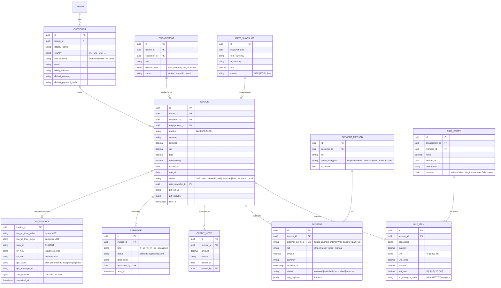
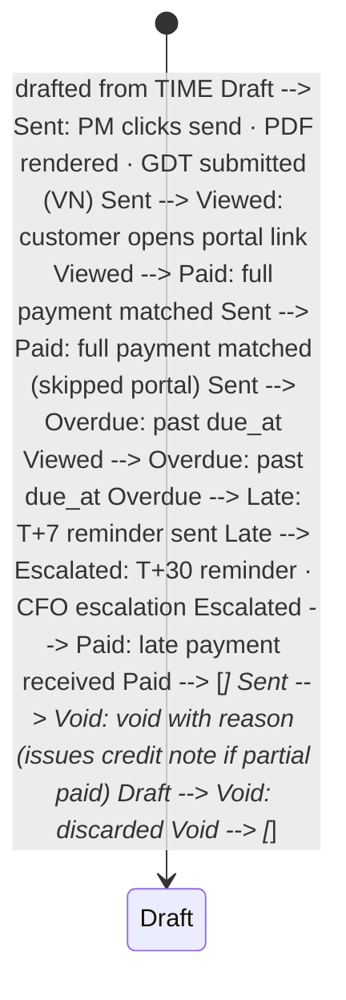

INV is the **AR plane**. Invoices begin life as a draft auto-populated from TIME entries against an engagement's billable rules; a human reviews + sends; the customer pays through one of four payment rails (Stripe, Wise, domestic VND PSP, manual bank transfer); the receipt matches back to the invoice (cash application); the GL takes the revenue. The Vietnamese-context specifics - Decree 123 e-invoice schema, Circular 78 GDT format, Mẫu 01/GTGT, MST validation, VietQR collection - are wrapped in three reusable CyberSkill skills (`vietnam-vat-invoice`, `vietnam-mst-validate`, `vietnam-bank-transfer`) so the same primitives serve INV here and any external SaaS that adopts the cyberskill-vn collection.

## At a glance

| Item | Detail |
|---|---|
| Status | Planned - P2, design phase |
| Est. LoC | ~5,800 (Rust (axum) + skill bridges) |
| Planned tests | 100+ (incl. webhook idempotency + currency rounding) |
| Currencies | VND, USD, SGD, EUR - SBV daily snapshot |
| Payment rails | Stripe, Wise, VietQR, manual + MoMo/ZaloPay/VNPay (P3) |
| VN e-invoice | Decree 123, via vietnam-vat-invoice skill |
| Depends on | TIME, CRM, AUTH + skills, S3, NATS |
| Feeds | CRM, GL, memory audit - payment status events |

## The bigger picture - three strategic roles

INV closes the PROJ-TIME-INV chain. The Engagement carries the rate card; TIME logs hours against it; INV invoices the rollup. For Vietnamese tenants, INV is also the regulator-facing surface - hóa đơn emission is not optional, and the GDT format is unforgiving about Mẫu / line items / MST validation. The naive read is "send invoices in Stripe." The real read: INV is the audit-grade pivot between billable activity and recognised revenue, with VN regulatory compliance baked in.

**Role 1 - Billable rollup -> invoice.** Consume TIME per-cycle rollup; preserve rate-card snapshots. At cycle close (or monthly for retainers), TIME emits the per-Member per-role per-Engagement billable rollup. INV consumes it, builds invoice line items using the rate-card snapshot stored on each TimeEntry (never retroactive), totals per currency, calculates VAT for VN line items, and creates a draft invoice. AM reviews the draft; client gets the bill.

**Role 2 - Hóa đơn emission (VN regulator).** Decree 123 + Circular 78 GDT format. For Vietnamese tenants, the `vietnam-vat-invoice` skill generates the GDT-compliant XML with Mẫu 01/GTGT line items; `vietnam-mst-validate` verifies both customer and tenant MSTs against the GDT registry before emission; emission writes to the GDT API and stores the signed receipt. Status flows back: pending -> emitted -> cancelled (if needed via Decree 123 Art. 19). Non-VN tenants skip this entirely; their invoices are Stripe/Wise PDFs.

**Role 3 - Dunning + cash application.** CUO drafts overdue chase; human sends. AR aging report rolls up nightly. CUO's `inv.dunning-draft@1` skill drafts polite-but-firm chase emails for invoices > 30 days overdue; never sent automatically. Cash application matches incoming Stripe/Wise/VietQR/bank-transfer receipts to outstanding invoices by amount + reference + tolerance window. Unmatched receipts queue for AM triage. CFO dashboard shows DSO + collection effectiveness.

### INV in the orchestration spine

Diagram source (Mermaid, flattened during migration):

```mermaid
flowchart LR PROJ["📋 PROJ Engagement  
rate card"] TIME["⏱ TIME  
per-cycle billable rollup"] INV["🧾 INV  
draft → AM review → sent"] GDT["🇻🇳 GDT API  
e-invoice receipt"] PSP["💳 Payment rails  
Stripe · Wise · VietQR · bank"] CUO["🎯 CUO  
inv.dunning-draft@1"] memory["🧠 memory audit"] CRM["🤝 CRM  
account context"] GL["📊 GL  
revenue recognition"] PROJ --> TIME TIME -- "billable rollup" --> INV CRM --> INV INV -- "VN tenants" --> GDT GDT --> INV INV --> PSP PSP -- "cash app webhook" --> INV INV -- "overdue ≥ 30d" --> CUO CUO -- "draft email" --> INV INV --> GL INV --> memory classDef hub fill:#a7f3d0,stroke:#064e3b,stroke-width:3px,color:#022c22 classDef mod fill:#e0e7ff,stroke:#3730a3 classDef memory fill:#fef6e0,stroke:#9c750a classDef ext fill:#fef2f2,stroke:#b91c1c class INV hub class PROJ,TIME,CUO,CRM,GL mod class GDT,PSP ext class memory memory
```

### Auto vs human-in-loop operations matrix

Operation| How it happens| Why this split
---|---|---
Invoice draft from TIME rollup| **Auto** at cycle close| Deterministic from rollup + rate-card snapshot; AM reviews.
AM review + edit before send| **Manual** AM action| Client invoice = revenue + relationship; AM is accountable.
Hóa đơn (VN e-invoice) emission| **Auto** after AM sends; **blocked** if MST invalid| MST validity is GDT requirement; cannot emit invalid invoice.
Cash application (receipt matching)| **Auto** by amount + reference| High-precision matching; unmatched fall to AM.
Unmatched receipt triage| **Manual** AM action| Ambiguous cases (partial pay, wrong reference) need human judgment.
Dunning chase email draft| **Auto** at 30/60/90 day thresholds| CUO drafts; tone calibrated per overdue band.
Dunning chase send| **Manual** AM/CFO action| Customer relationship + tone require human confirm; auto-send burns relationships.
Hóa đơn cancellation (Decree 123 Art. 19)| **Manual** + dual approval (AM + CFO)| Cancelling an emitted invoice triggers regulator notification; never auto.
FX rate snapshot (daily SBV)| **Auto**| Daily SBV publication; cached; per-invoice snapshot stored.
Revenue recognition to GL| **Auto** on invoice sent (accrual) or paid (cash basis)| Per-tenant policy chooses basis; both supported.

## Why INV exists

Without an invoicing module, the gap between "did the work" and "got paid" lives in a spreadsheet, a Stripe dashboard, and somebody's memory. Multi-currency makes that gap worse (which rate? when? rounded how?). Vietnamese e-invoice requirements make it worse still (which Mẫu? which line item code? was the MST validated?). INV closes that gap with a single source of truth - one invoice row per billable event, one payment row per receipt, one aging report per close, and one webhook handler per payment rail - and exposes the same primitives as reusable skills so the patterns generalise.

- **From TIME to invoice:** Engagements carry billable rules (rate, currency, cap). TIME entries per engagement aggregate into invoice line items. Invoice draft is a one-click read.
- **Vietnamese-grade compliance:** Decree 123 + Circular 78 GDT format. Mẫu 01/GTGT line items. MST validation on customer + tenant. VietQR collection. cyberskill-vn skills wrap the lot.
- **Cash application + dunning:** Webhooks from Stripe/Wise/banks match incoming receipts to outstanding invoices. CUO drafts dunning emails on overdue; human sends.

INV is also part of the CyberSkill margin story: faster collection compresses DSO; multi-rail payment options improve customer experience; e-invoice automation avoids the 3-day round trip via the old VN paper-stamp process. Each is a small win that compounds.

## What it does - 5W1H2C5M

A structured decomposition of INV's scope.

Axis| Question| Answer
---|---|---
**5W - What**| What is INV?| An AR + multi-currency invoicing + payment integration service. Drafts invoices from TIME entries; sends; tracks payments; ages receivables; reconciles cash to invoices; routes Vietnamese e-invoices to GDT via the vietnam-vat-invoice skill.
**5W - Who**| Who uses INV?| **CFO / Finance:** close, AR aging, dunning approval. **Project lead / Account Manager:** invoice draft preview + send. **Customer:** receives invoice + pays. **CUO/CFO-skill:** drafts dunning + payment-status narrative.
**5W - When**| When does INV act?| (a) Engagement milestone or month-end -> invoice draft. (b) Send invoice -> email/portal. (c) Payment webhook -> cash application. (d) Overdue tick -> dunning. (e) Quarter-end -> AR aging report. (f) Year-end -> 1099-style summaries.
**5W - Where**| Where does it run?| P2: single region (SG-1) backed by AWS RDS Postgres. Per-tenant data-residency for VN tenants (vn-hanoi-1) by P3.
**5W - Why**| Why a separate module?| Because AR-ledger drift and tax-compliance surprise are existential to small companies. INV is the one source of truth for "what did we bill, what did they pay, who owes what".
**1H - How**| How does it work?| Postgres for invoice + payment + reminder rows. Stripe / Wise webhooks -> cash_application engine matches receipts to invoices by metadata + amount. VietQR generated via `vietnam-bank-transfer` skill; bank confirms via screen-scrape OR open-banking API (Napas247 P3). Vietnamese e-invoice via `vietnam-vat-invoice` skill -> POST to GDT.
**2C - Cost**| Cost budget?| P2: ~$40/month (RDS + Fargate + Stripe/Wise pass-through fees). 50-tenant: ~$150/month. Per-invoice cost: ~$0.02 + payment processor fee.
**2C - Constraints**| Constraints?| (a) Vietnam Decree 123 + Circular 78 - e-invoice format. (b) Currency rounding policy (VND has no decimals; round to nearest 1,000 for display). (c) Per-engagement billable rules drive line items (FR pending). (d) Approved invoices are append-only (FR pending); corrections via credit note.
**5M - Materials**| Stack?| Rust 1.81, axum, sqlx, PostgreSQL 16, stripe-rust, wise sdk, typst / tectonic for PDF, async-graphql, cyberskill-vn skills, AWS S3 (immutable archive).
**5M - Methods**| Method choices?| Idempotent webhooks (Stripe idempotency-key + DB UNIQUE on external_event_id). VND rate snapshot daily from SBV REST endpoint. Multi-rail collection abstracted behind `PaymentRail` trait. Append-only invoice rows; credit-note for corrections.
**5M - Machines**| Deployment?| Fargate in SG-1. Multi-AZ Postgres RDS. S3 immutable bucket for PDFs.
**5M - Manpower**| Who maintains?| CFO (R for close + dunning approval) + 0.25 FTE eng.
**5M - Measurement**| How measured?| KPIs: DSO (days sales outstanding); cash-application match rate; e-invoice GDT acceptance rate; dunning effectiveness.

## Architecture

INV composes three external systems (Stripe, Wise, Vietnamese payment stack), one e-invoice issuer (GDT via the `vietnam-vat-invoice` skill), and one rate source (SBV daily snapshot) into a single AR ledger. The diagram below shows the canonical invoice -> payment lifecycle.

Diagram source (Mermaid, flattened during migration):

```mermaid
graph TB subgraph CLIENTS ["Clients"] PM["Project Lead / AM (SPA)"] CFO["CFO (close + dunning)"] CUST["Customer  
(invoice + payment portal)"] CUO["🤖 CUO/CFO-skill  
drafts + narrates"] end subgraph EDGE ["Edge"] AR["Apollo Router  
JWT + RBAC"] end subgraph INV ["INV service (Rust · axum)"] GQL["GraphQL subgraph  
Invoice · Payment"] REST["REST admin  
send · void · credit"] MCP["MCP tool catalogue"] DRAFT["draft.rs  
from TIME entries"] PDF["pdf_renderer.rs  
tectonic deterministic"] SEND["send.rs  
email + portal link"] WEBHOOK["webhook.rs  
Stripe · Wise · bank"] CASH["cash_application.rs  
match receipt → invoice"] AGING["aging.rs  
0-30 · 31-60 · 61-90 · 90+"] DUN["dunning.rs  
drafts only · human send"] FX["fx.rs  
SBV daily snapshot"] end subgraph SKILLS ["cyberskill-vn (skill bridges)"] VAT["vietnam-vat-invoice  
Mẫu 01/GTGT · GDT XML"] MST["vietnam-mst-validate  
customer + tenant MST"] BANK["vietnam-bank-transfer  
VietQR generator"] end subgraph STORES ["Stores"] PG[("PostgreSQL  
invoice · line_item  
payment · credit_note  
reminder · rate_snapshot")] S3[("AWS S3  
invoice PDFs · receipts  
immutable bucket")] end subgraph EXT ["External rails"] STR["Stripe (USD/EUR)"] WISE["Wise (multi-currency)"] VQR["VietQR / Napas247 (VND)"] GDT["🇻🇳 GDT e-invoice  
Tổng cục Thuế"] SBV["SBV daily rate API"] end subgraph SINKS ["Audit + events"] memory["🧠 memory  
inv.* lifecycle"] NATS["📡 NATS  
inv.invoice.sent · inv.payment.received"] CRM["🏢 CRM  
payment-status sync"] OBS["👁 OBS"] end PM --> AR CFO --> AR CUST --> AR CUO --> AR AR --> GQL AR --> REST AR --> MCP REST --> DRAFT DRAFT --> PDF PDF --> VAT VAT --> GDT REST --> MST REST --> BANK REST --> SEND WEBHOOK --> CASH CASH --> PG STR -.webhook.-> WEBHOOK WISE -.webhook.-> WEBHOOK VQR -.webhook.-> WEBHOOK FX -.daily.-> SBV REST --> PG GQL --> PG PDF --> S3 AGING --> PG DUN --> SEND REST --> memory REST --> NATS NATS --> CRM INV --> OBS classDef planned fill:#a7f3d0,stroke:#064e3b classDef store fill:#f5f3ff,stroke:#7c3aed classDef ext fill:#fef6e0,stroke:#9c750a classDef sink fill:#e8d4c2,stroke:#45210e class GQL,REST,MCP,DRAFT,PDF,SEND,WEBHOOK,CASH,AGING,DUN,FX,VAT,MST,BANK planned class PG,S3 store class STR,WISE,VQR,GDT,SBV ext class memory,NATS,CRM,OBS sink
```

### Internal components

Component| Path (planned)| Responsibility
---|---|---
`invoice.rs`| services/inv/src/invoice.rs| Invoice CRUD. Append-only after status="sent"; corrections via credit_note.
`draft.rs`| services/inv/src/draft.rs| Auto-populate draft from TIME entries per engagement + billable rules.
`line_item.rs`| services/inv/src/line_item.rs| Per-invoice line items; aggregates billable rules; supports VN VAT category codes.
`payment.rs`| services/inv/src/payment.rs| Payment row writer. Idempotent by external_event_id.
`credit_note.rs`| services/inv/src/credit_note.rs| Credit-note + refund. Always tied to an invoice; reduces outstanding balance.
`pdf_renderer.rs`| services/inv/src/pdf_renderer.rs| Deterministic PDF via tectonic. Tenant brand applied via per-tenant template.
`cash_application.rs`| services/inv/src/cash_application.rs| Match incoming receipt -> outstanding invoice by metadata + amount. Manual override UI for ambiguous cases.
`webhook.rs`| services/inv/src/webhook.rs| Stripe + Wise + bank webhook handlers. Signature verification; idempotency-key check.
`aging.rs`| services/inv/src/aging.rs| AR aging bucket report: 0-30 / 31-60 / 61-90 / 90+ days.
`dunning.rs`| services/inv/src/dunning.rs| Drafts dunning emails (T+1, T+7, T+30 of overdue). Sends ONLY after CFO/AM approval.
`fx.rs`| services/inv/src/fx.rs| Daily SBV rate snapshot. Cached per day; new invoices use today's snapshot.
`vn_vat_bridge.rs`| services/inv/src/vn_vat_bridge.rs| Bridge to `vietnam-vat-invoice` skill - Mẫu 01/GTGT generation + GDT submission.
`mst_bridge.rs`| services/inv/src/mst_bridge.rs| Bridge to `vietnam-mst-validate` skill - customer + tenant MST validation before send.
`bank_bridge.rs`| services/inv/src/bank_bridge.rs| Bridge to `vietnam-bank-transfer` skill - VietQR generator.
`audit_bridge.rs`| services/inv/src/audit_bridge.rs| Lifecycle rows to memory.
`nats_bridge.rs`| services/inv/src/nats_bridge.rs| Event publisher - sent/paid/overdue events for CRM + KPI dashboards.
`migrations/`| services/inv/migrations/| sqlx migrations. UNIQUE on external_event_id; append-only on invoice after status=sent.

## Data model

Invoice + line items + payment + credit note are the core rows. Reminders are a side-table. FX rate snapshots are daily. Webhook event IDs carry a UNIQUE constraint so duplicate webhooks are no-ops.

Diagram source (Mermaid, flattened during migration):



### Payment-rail comparison (P2 launch set)

Rail| Currencies| Typical fee| Settlement| Webhook| Use case
---|---|---|---|---|---
**Stripe**| USD, EUR (multi-currency intent supported)| 2.9% + $0.30| T+2| signed (HMAC)| Default for international customers; cards.
**Wise**| 40+ incl. VND, SGD, USD, EUR| 0.4-1% mid-market| T+0 to T+2| polling + webhook (P3)| Cross-border + local-rail collection.
**VietQR / Napas247**| VND| ~5,000 VND / txn| instant (24/7)| bank API (BIDV, MB, VCB)| Vietnamese B2B + B2C; preferred for VN customers.
**Manual bank transfer**| any| bank-dependent| T+1 to T+5| none (manual reconciliation)| Fallback when other rails unavailable.
MoMo / ZaloPay / VNPay (P3)| VND| 1.5-2.5%| instant| signed| VN consumer wallets - added at P3.

## API surface

Three surfaces: GraphQL subgraph for invoice/payment reads, REST admin for send/credit/void operations, MCP tool catalogue for the CUO/CFO-skill (draft dunning, narrate aging - never send without human approval).

### GraphQL subgraph

```graphql
extend schema
 @link(url: "https://specs.apollo.dev/federation/v2.5", import: ["@key", "@requiresScopes"])

type Invoice @key(fields: "id") {
 id: ID!
 number: String!
 customer: Customer!
 engagement: Engagement
 currency: String!
 subtotal: Money!
 vat: Money!
 total: Money!
 outstanding: Money!
 issuedAt: Date!
 dueAt: Date!
 status: InvoiceStatus!
 lineItems: [LineItem!]!
 payments: [Payment!]! @requiresScopes(scopes: [["inv.payment_read"]])
 pdfUrl: String! # pre-signed S3
}

type Payment @key(fields: "id") {
 id: ID!
 invoiceId: ID!
 rail: PaymentRail!
 amount: Money!
 receivedAt: DateTime!
 status: PaymentStatus!
}

type CreditNote @key(fields: "id") {
 id: ID!
 invoiceId: ID!
 amount: Money!
 reason: String!
 issuedAt: Date!
}

type AgingReport {
 bucket0_30: Money!
 bucket31_60: Money!
 bucket61_90: Money!
 bucket90Plus: Money!
 total: Money!
 byCustomer: [CustomerAging!]!
}

enum InvoiceStatus { DRAFT SENT VIEWED PAID OVERDUE LATE ESCALATED VOID }
enum PaymentStatus { RECEIVED MATCHED RECONCILED REVERSED }
enum PaymentRail { STRIPE WISE VIETQR MOMO ZALOPAY VNPAY MANUAL }

type Query {
 invoice(id: ID!): Invoice
 invoices(customerId: ID, status: InvoiceStatus, since: Date): [Invoice!]!
 agingReport(asOf: Date): AgingReport!
 @requiresScopes(scopes: [["inv.aging_read"]])
}

type Mutation {
 draftInvoice(input: DraftInvoiceInput!): Invoice!
 sendInvoice(id: ID!): Invoice!
 @requiresScopes(scopes: [["inv.send"]])
 voidInvoice(id: ID!, reason: String!): Invoice!
 @requiresScopes(scopes: [["inv.void"]])
 issueCreditNote(input: CreditNoteInput!): CreditNote!
 @requiresScopes(scopes: [["inv.credit"]])
 approveDunning(reminderId: ID!): Reminder!
 @requiresScopes(scopes: [["inv.dunning_approve"]])
}
```

### REST + webhook surface

Method| Path| Purpose
---|---|---
POST| `/admin/invoice/draft`| Draft from TIME entries against engagement billable rules.
POST| `/admin/invoice/{id}/send`| Send invoice - render PDF, validate MST (VN), submit e-invoice to GDT (VN), email customer.
POST| `/admin/invoice/{id}/void`| Void invoice. Append-only - sets status=void; does NOT delete.
POST| `/admin/invoice/{id}/credit-note`| Issue credit note (partial or full).
GET| `/admin/aging?as_of=YYYY-MM-DD`| AR aging report.
POST| `/admin/dunning/{reminder_id}/approve`| CFO/AM approves CUO-drafted dunning email; sends.
POST| `/webhook/stripe`| Stripe webhook - HMAC verified; cash_application triggered.
POST| `/webhook/wise`| Wise webhook (P3); polling fallback P2.
POST| `/webhook/bank/{bank_code}`| Bank API webhook (BIDV, MB, VCB) for VietQR receipts.
GET| `/portal/invoice/{token}`| Customer-facing invoice + payment options page.
POST| `/internal/fx/snapshot`| Daily SBV rate snapshot job.
POST| `/admin/cash-application/manual`| Manual override - link a payment to an invoice when auto-match fails.

### MCP tool catalogue (CUO/CFO-skill)

Tool name| Inputs| Outputs| Annotations
---|---|---|---
`cyberos.inv.draft_invoice`| engagement_id, period| draft Invoice (not sent)| readwrite (draft only), human-confirm
`cyberos.inv.list_overdue`| since?| Invoice| readonly, scope=inv.aging_read
`cyberos.inv.draft_dunning`| invoice_id| email draft| readwrite (draft only), human-confirm before send
`cyberos.inv.explain_aging`| as_of?| narrative AR report| readonly
`cyberos.inv.summarise_payment_status`| invoice_id| narrative| readonly
`cyberos.inv.validate_mst`| mst_string| {valid, taxpayer_info}| readonly, bridges vietnam-mst-validate skill
`cyberos.inv.generate_vietqr`| amount, bank, account| QR data + image| readonly, bridges vietnam-bank-transfer skill

## Key flows

### Flow 1 - Draft invoice from TIME entries

```mermaid
sequenceDiagram autonumber participant PM as Project Lead (SPA) participant I as INV /admin/invoice/draft participant T as ⏱ TIME (read entries) participant E as Engagement (billable rules) participant FX as fx.rs (rate snapshot) participant PG as PostgreSQL PM->>I: draftInvoice {engagement_id, period:"2026-04"} I->>E: read billable rules (rate, currency, cap) I->>T: read uninvoiced time entries for engagement+period T-->>I: 47 entries · 168 hrs I->>FX: read today's snapshot if cross-currency I->>I: aggregate into line items (per role / per project phase) I->>PG: INSERT invoice status="draft"  
\+ line_item rows PG-->>I: invoice_id I-->>PM: draft invoice ready for review Note over PM: PM previews PDF, may edit lines  
before "send".
```

### Flow 2 - Send (with VN e-invoice via vietnam-vat-invoice skill)

```mermaid
sequenceDiagram autonumber participant PM as PM participant I as INV /admin/invoice/{id}/send participant MST as 🛠 vietnam-mst-validate skill participant VAT as 🛠 vietnam-vat-invoice skill participant GDT as 🇻🇳 GDT (Tổng cục Thuế) participant PDF as pdf_renderer.rs participant S3 as AWS S3 (immutable) participant EM as Email service participant C as Customer participant B as 🧠 memory participant N as 📡 NATS PM->>I: sendInvoice {id} I->>MST: validate tenant + customer MST alt VN tenant I->>VAT: generate Mẫu 01/GTGT XML (Circular 78) VAT-->>I: signed XML + PDF I->>GDT: POST e-invoice GDT-->>I: gdt_message_id · status=accepted I->>I: persist vn_einvoice row else non-VN tenant I->>PDF: render PDF (tenant brand) PDF-->>I: pdf bytes end I->>S3: archive PDF (immutable bucket) I->>I: status="sent" · sent_at = now I->>EM: send invoice email (+ payment portal link) EM-->>C: email delivered I->>B: audit "inv.invoice.sent" I->>N: publish inv.invoice.sent Note over I,N: CRM subscribes to NATS for payment-status sync.
```

### Flow 3 - Stripe payment received + cash application

```mermaid
sequenceDiagram autonumber participant STR as Stripe participant W as INV /webhook/stripe participant CASH as cash_application.rs participant PG as PostgreSQL participant N as 📡 NATS participant CRM as 🏢 CRM (subscriber) STR->>W: POST webhook payment_intent.succeeded  
(HMAC signed) W->>W: verify signature W->>PG: INSERT payment (UNIQUE external_event_id) alt new event W->>CASH: match payment to invoice  
(by metadata.invoice_id OR amount + customer) alt single match CASH->>PG: invoice.outstanding -= amount  
set status="paid" if outstanding=0 CASH->>N: publish inv.payment.received CRM-->>N: subscriber → updates account record else ambiguous CASH->>PG: payment.status="received" (unmatched) CASH->>N: publish inv.payment.unmatched (alerts AM/CFO) end else duplicate event W->>W: idempotent no-op end
```

### Flow 4 - VietQR collection (VN customer paying via bank)

```mermaid
sequenceDiagram autonumber participant PM as PM participant I as INV send.rs participant BANK as 🛠 vietnam-bank-transfer skill participant C as Customer (VN) participant B247 as Napas247 bank (BIDV/MB/…) participant W as INV /webhook/bank/{code} participant CASH as cash_application.rs PM->>I: sendInvoice {id} (currency=VND) I->>BANK: generate VietQR  
{account, amount, addInfo: "INV-2026-04-001"} BANK-->>I: QR string + image I->>C: email with VietQR image + amount + addInfo C->>B247: scan QR · approve transfer B247-->>I: webhook "transfer received" I->>W: route to webhook handler W->>CASH: match by addInfo (invoice number) + amount CASH->>CASH: idempotent match · update invoice CASH->>I: status="paid" Note over CASH: matching strictness:   
(invoice_number in addInfo) AND (amount within ±1,000 VND tolerance)
```

### Flow 5 - Dunning automation (drafts only, human send)

```mermaid
sequenceDiagram autonumber participant CRON as Daily cron participant AGE as aging.rs participant DUN as dunning.rs participant CUO as 🤖 CUO/CFO-skill participant CFO as CFO participant EM as Email participant C as Customer CRON->>AGE: tick AGE->>AGE: identify invoices T+1, T+7, T+30 overdue AGE-->>DUN: 3 candidate reminders loop per reminder DUN->>CUO: cyberos.inv.draft_dunning {invoice_id} CUO-->>DUN: draft email (tone adapts to T+1/T+7/T+30) DUN->>DUN: INSERT reminder status="drafted" end DUN->>CFO: notify "3 reminders awaiting your review" CFO->>DUN: approveDunning {reminder_id} (per reminder) DUN->>EM: send email DUN->>DUN: reminder status="sent" EM-->>C: email delivered Note over CUO,CFO: CUO NEVER sends without human approval.  
OWASP LLM08 "excessive agency" mitigated.
```

## Invoice lifecycle

An invoice traverses up to eight states. Once sent, the invoice row is append-only - corrections happen via credit_note or by voiding and reissuing.



### AR aging buckets

Bucket| Days past due| Default action
---|---|---
**Current**| <= 0| None - not yet due
**0-30**| 1-30| T+1 friendly reminder, T+7 firmer reminder
**31-60**| 31-60| T+30 escalation; CFO sees in close report
**61-90**| 61-90| AM phone call; CFO weekly review
**90+**| 91+| Legal counsel consultation; write-off policy review

## Functional requirements

The CyberOS FR catalogue is being rebuilt one feature at a time via the open [feature-request-author](https://github.com/cyberskill/cyberos/tree/main/modules/skill/feature-request-author) Agent Skill.

Previous FR enumerations were archived 2026-05-14 and are no longer reflected on this page. Specific FRs land here as they are re-authored.

## Non-functional requirements

Performance and reliability NFRs (§11.2.4) bind on INV - especially payment reconciliation correctness.

NFR ID| Concern| Target| Measurement
---|---|---|---
(NFR pending)| Invoice generation p95| <= 2 s| bench/draft.rs, k6 load
(NFR pending)| PDF render p95 (deterministic)| <= 600 ms| bench/pdf.rs
(NFR pending)| VN e-invoice GDT submission p95| <= 5 s (network bound)| k6 against staging GDT
(NFR pending)| Payment-webhook idempotency| 100% (zero duplicate side-effects)| chaos test: replay webhook 100x
(NFR pending)| Cash-application auto-match rate| >= 90% (the rest manual)| OBS dashboard, monthly review
(NFR pending)| Webhook signature verification| 100% (zero unsigned acceptance)| integration test injects unsigned webhook
(NFR pending)| VND rounding correctness| 0 sub-1,000 drift / 1k invoices| property test
(NFR pending)| INV availability| >= 99.5%| SLO monitor
(NFR pending)| Invoice PDF durability (10-year)| 0 lost objects| S3 immutable + quarterly inventory
(NFR pending)| Customer payment method tokens encrypted| KMS-wrapped| schema inspection, CI gate
(NFR pending)| PCI scope minimisation (no card data stored)| = 0 raw PAN columns| schema audit; Stripe handles PCI

## Dependencies

INV reads from TIME, CRM, and AUTH; bridges to three skills (vietnam-vat-invoice, vietnam-mst-validate, vietnam-bank-transfer); integrates with four external rails (Stripe, Wise, VietQR/Napas247, GDT). Events flow to CRM via NATS.

Diagram source (Mermaid, flattened during migration):

```mermaid
graph LR subgraph upstream ["INV depends on"] AUTH["🔐 AUTH"] TIME["⏱ TIME  
entries · billable"] CRM["🏢 CRM  
customer records"] memory["🧠 memory"] OBS["👁 OBS"] NATS["📡 NATS"] S3["🗂 S3 (immutable)"] end subgraph skills ["Skill bridges"] VAT["🛠 vietnam-vat-invoice"] MST["🛠 vietnam-mst-validate"] BANK["🛠 vietnam-bank-transfer"] end subgraph external ["External rails"] STR["Stripe"] WISE["Wise"] VQR["VietQR / Napas247"] GDT["🇻🇳 GDT"] SBV["SBV rate API"] end INV["🧾 INV"] subgraph downstream ["INV feeds"] CRM2["🏢 CRM  
payment status"] GL["📊 GL  
revenue recognition"] MEMORY2["🧠 memory  
audit"] CUO["🤖 CUO/CFO-skill"] end AUTH --> INV TIME --> INV CRM --> INV memory --> INV OBS --> INV NATS --> INV S3 --> INV VAT --> INV MST --> INV BANK --> INV STR --> INV WISE --> INV VQR --> INV GDT --> INV SBV --> INV INV --> CRM2 INV --> GL INV --> MEMORY2 INV --> CUO classDef planned fill:#a7f3d0,stroke:#064e3b classDef shipped fill:#f5ede6,stroke:#45210e classDef ext fill:#fef6e0,stroke:#9c750a class INV planned class AUTH,TIME,CRM,CRM2,GL,CUO,OBS,NATS planned class memory,MEMORY2,S3,VAT,MST,BANK shipped class STR,WISE,VQR,GDT,SBV ext
```

## Compliance scope

INV is the tax-and-financial-records front door. Decree 123, Circular 78, and 10-year retention are non-negotiable for VN tenants.

Regulation / standard| Article / clause| INV feature that satisfies it
---|---|---
Decree 123/2020/NĐ-CP| Art. 7 - Electronic invoice mandate| vietnam-vat-invoice skill generates GDT-compliant e-invoice for every VN tenant invoice.
Circular 78/2021/TT-BTC| Schema - GDT XML format| Skill emits Circular 78 XML; submits to GDT via authenticated endpoint.
Decree 119/2018/NĐ-CP| Art. 4 - E-invoice retention| S3 immutable bucket; 10-year retention lock.
Vietnam VAT Law (Law 13/2008)| Art. 8 - VAT rate categories| Line items carry VAT category code: 0%, 5%, 8%, 10% (Vietnamese categories).
Vietnam Tax Administration Law (2019)| Art. 33 - MST| MST validated (tenant + customer) via vietnam-mst-validate before submission.
Vietnam PDPL (Law 91/2025)| Art. 14 - DSAR| Customer invoice history exportable as DSAR bundle.
GDPR (EU 2016/679)| Art. 6 - Lawful processing| Customer billing data processed on contractual basis.
PCI DSS| Cardholder data scope minimisation| No raw PAN stored; Stripe handles card data; INV stores only Stripe customer tokens.
ISO/IEC 27001:2022| A.8.10 - Information deletion| Invoice rows append-only; void via status flag, not delete.
ISO/IEC 27001:2022| A.5.13 - Information labelling| Customer + invoice records classified `confidential`; access scoped.
SOC 2 Type II| CC8.1 - Change management| Append-only ledger; credit notes audited.
VN Accounting Standards (VAS)| VAS 14 - Revenue| Revenue recognition triggered by invoice.status="sent"; GL bridge per accrual.
SBV Circular 35/2018| FX reporting| Daily rate snapshot from SBV; cross-border invoice carries snapshot reference.

## Risk entries

INV's risks are largely about reconciliation correctness and webhook spoofing. The cash-application false-match risk is the highest single-incident risk.

ID| Risk| Likelihood| Impact| Owner| Mitigation
---|---|---|---|---|---
`R-INV-001`| Webhook spoofing leads to false payment record| Low| High| CTO| HMAC signature verification on every webhook; unsigned events rejected; integration test injects unsigned payload.
`R-INV-002`| Duplicate webhook causes double cash-application| Medium| Medium| CTO| UNIQUE on external_event_id; idempotent INSERT; chaos test replays webhook 100x.
`R-INV-003`| Cash-application false match (wrong invoice)| Medium| Medium| CFO| Strict matching: metadata.invoice_id OR (amount + customer + +/-1k VND tolerance); ambiguous cases land in manual-override queue.
`R-INV-004`| GDT e-invoice submission rejected (Mẫu format drift)| Medium| Medium| CTO + CFO| vietnam-vat-invoice skill versioned; CI test against GDT sandbox; alert on rejected status.
`R-INV-005`| Currency rounding drift on cross-currency invoice| Medium| Low| CFO| Round-half-to-even at line-item level; VND no decimals; property test asserts deterministic.
`R-INV-006`| SBV rate API outage blocks new cross-currency invoices| Medium| Low| CTO| Last-known-good cached; on outage, use yesterday's rate + flag invoice for review.
`R-INV-007`| CUO sends dunning email without approval| Low| Medium| CSO| MCP tool annotated destructive=false; reminder.status="drafted" cannot transition to "sent" without approval_id; CI verifies.
`R-INV-008`| Stripe webhook secret leaked| Low| High| CSO| Secret in AWS Secrets Manager; rotation every 90 days; access audited.
`R-INV-009`| Invoice number gap (regulatory issue in VN)| Medium| Medium| CFO| Per-tenant sequence with gap-detection job; void invoices retain number; audit shows void/issued chain.
`R-INV-010`| 10-year retention violated by S3 lifecycle bug| Low| High| CTO| Immutable bucket; lifecycle policy review at deploy; quarterly inventory.
`R-INV-011`| TIME rollup arrives incomplete -> invoice missing billable hours| Medium| High| COO| Rollup waits for all submissions or 24h grace; INV flags missing-Member draft; AM reviews + can re-trigger after submissions land.
`R-INV-012`| Rate-card snapshot on TimeEntry diverges from invoiced rate| Low| High| CFO| Snapshot is immutable on TimeEntry; INV reads from snapshot; CI test asserts invoice line-amount = snapshot x hours.
`R-INV-013`| Hóa đơn cancellation (Decree 123 Art. 19) without dual approval| Low| Critical| CFO| Cancellation requires AM + CFO approval tokens both; CI verifies API rejects single-approval cancel; GDT API call audit-chained.
`R-INV-014`| Dunning email auto-send bug| Low| High| CSO| MCP tool annotation destructive=true on dunning send; AM/CFO approval token required; CI gate verifies; OBS alarm on send rate > 0 without approval ID.
`R-INV-015`| Vietnamese hóa đơn template drift after Decree 123 amendment| Medium| High| CLO| vietnam-vat-invoice skill version-pinned; legal monitor watches GDT bulletins; quarterly drill emit against staging GDT sandbox.

## KPIs

INV health rolls up into 9 KPIs across AR efficiency, reconciliation accuracy, and compliance.

KPI| Formula| Source| Target
---|---|---|---
**DSO (Days Sales Outstanding)**| (AR balance / sales) x period days| INV DB| <= 35 days
**Auto-match rate**| auto-matched payments / total| cash_application| >= 90%
**Invoice generation p95**| histogram| OBS| <= 2 s
**GDT e-invoice acceptance rate**| accepted / submitted| vn_einvoice| >= 99.5%
**Dunning effectiveness**| (invoices paid within 14d of dunning) / dunning sent| INV DB| >= 60%
**Aging 90+ as % of total**| aging_90_plus / total_outstanding| aging_report| <= 5%
**Manual cash-application queue depth**| unmatched payments > 24h| OBS| <= 2 at any time
**Webhook spoofing attempts blocked**| signature-failed count| OBS| tracked; alert on bursts
**Invoice number gap incidents**| detected gaps / period| cron gap-check| = 0 unexplained
**TIME rollup -> INV bridge p95**| histogram (cycle close -> draft ready)| OBS| <= 60 s
**Missing-Member draft rate**| drafts flagged missing-Member / total drafts| INV events| <= 5% (after 24h grace)
**Rate-card snapshot integrity**| line items where amount = snapshot x hours / total line items| memory audit replay| = 1.0 (hard floor)
**Dunning auto-send false-positive**| sends without approval token| OBS| = 0 (hard floor; CI gate)
**Hóa đơn dual-approval rate**| cancellations with both AM + CFO tokens / total cancellations| memory audit| = 1.0 (hard floor)

## RACI matrix

INV is operationally owned by CFO; AM drives per-engagement billing; CFO approves dunning; CTO owns reliability.

Activity| CEO| CFO| AM/PL| CTO| CSO| DPO
---|---|---|---|---|---|---
Engagement billable-rules setup| I| C| A/R| I| I| I
Invoice draft -> send| I| C| A/R| I| I| I
Cash application (manual override)| I| A/R| C| I| I| I
AR aging review| I| A/R| C| I| I| I
Dunning approval| I| A/R| C| I| I| I
VN e-invoice integration (GDT)| I| C| I| A/R| C| I
Webhook secret rotation| I| I| I| R| A| I
10-year retention audit| I| R| I| A| C| C
DSAR (customer scope)| I| C| R| I| C| A

R = Responsible, A = Accountable, C = Consulted, I = Informed.

## Planned CLI surface

Admin CLI `cyberos-inv` for CFO/AM.

### 1. Draft an invoice

```
$ cyberos-inv invoice draft \
 --engagement acme-q2-2026 \
 --period 2026-04

[draft] reading TIME entries for engagement acme-q2-2026 (2026-04)
[time] 47 entries · 168 hours
[engagement] rate=$150/hr · currency=USD · cap=N/A
[draft] subtotal: $25,200.00
[draft] vat: $0.00 (USD invoice · no VN VAT)
[draft] total: $25,200.00
[invoice] INV-2026-04-001 · status=draft
[audit] memory seq=16001
```

### 2. Send an invoice (VN tenant, e-invoice)

```
$ cyberos-inv invoice send --id INV-2026-04-005

[mst] validating tenant MST: 0301234567 ✓
[mst] validating customer MST: 0307654321 ✓
[vn-vat] generating Mẫu 01/GTGT XML (Circular 78)
[gdt] submitting to Tổng cục Thuế…
[gdt] accepted · message_id = GDT-2026-04-9F3E2A1B
[pdf] deterministic render via tectonic
[s3] archived to s3:/inv/2026/04/INV-2026-04-005.pdf (immutable 10y)
[email] sent to ke-toan@acme.vn
[nats] inv.invoice.sent published
[status] sent
[audit] memory seq=16011
```

### 3. Generate VietQR for an invoice

```
$ cyberos-inv vietqr --invoice INV-2026-04-005

[vietnam-bank-transfer skill]
 account: 0307654321 @ BIDV
 amount: 45,000,000 VND
 addInfo: INV-2026-04-005
 qr: 00020101021238…6304abcd
[image] vietqr-INV-2026-04-005.png (240×240)
[expected_settlement] instant via Napas247
```

### 4. AR aging report

```
$ cyberos-inv aging --as-of 2026-05-14

[AR aging report · 2026-05-14]

bucket amount (USD eq) invoices
 current $48,200 12
 0-30 overdue $12,400 3
 31-60 $ 4,800 1
 61-90 $ 800 1
 90+ $ 200 1
 ───────── ──────────── ───
 total $66,400 18

[top overdue]
 INV-2026-02-003 acme corp $4,800 45 days
 INV-2025-12-007 globex industries $800 71 days
 INV-2025-11-012 initech $200 120 days
```

### 5. Approve dunning emails

```
$ cyberos-inv dunning list --status drafted

[3 reminders awaiting approval]
 rem-id invoice kind amount age
 R-001 INV-2026-04-001 T+7 $25,200 8d
 R-002 INV-2026-03-007 T+30 $ 8,400 34d
 R-003 INV-2025-11-012 esc. $ 200 120d

$ cyberos-inv dunning approve --reminder R-001 --cfo-sign

[approved] cfo: hoa@cyberskill.com ✓
[sent] email delivered to ar@acme.com
[audit] memory seq=16031
```

### 6. Manual cash application

```
$ cyberos-inv cash-app match \
 --payment pay_01HZJ8… \
 --invoice INV-2026-04-005 \
 --reason "addInfo missing but bank ref matches"

[match] payment pay_01HZJ8… → INV-2026-04-005
[update] invoice.outstanding 45M VND → 0
[update] invoice.status sent → paid
[nats] inv.payment.received published
[audit] memory seq=16041
```

### 7. Issue credit note

```
$ cyberos-inv credit-note issue \
 --invoice INV-2026-04-001 \
 --amount 1200 \
 --currency USD \
 --reason "scope reduction agreed with customer"

[credit-note] CN-2026-04-001 issued
[invoice] INV-2026-04-001 outstanding: $25,200 → $24,000
[audit] memory seq=16051
```

## Phase status & estimates

| Item | Detail |
|---|---|
| Status | Planned - P2, design phase |
| Est. LoC (Rust) | ~5,800 (services/inv + skill bridges) |
| Planned tests | 100+ (incl. webhook idempotency + currency rounding) |
| External libs | ~14 (axum, sqlx, stripe, tectonic, async-graphql, cyberskill-vn) |
| CLI subcommands | ~20 planned (`cyberos-inv` entrypoint) |
| P2 budget | ~$40/mo + Stripe/Wise pass-through fees |

Capability| Status
---|---
Invoice draft from TIME entries| planned - P2
Multi-currency (VND/USD/SGD/EUR) + SBV snapshot| planned - P2
Stripe (USD/EUR) integration + webhook| planned - P2
Wise integration (multi-currency)| planned - P2
VietQR / Napas247 collection| planned - P2
Vietnamese e-invoice (Decree 123 + Circular 78)| planned - P2
MST validation (vietnam-mst-validate skill)| skill shipped
vietnam-vat-invoice + vietnam-bank-transfer skills| skills shipped
AR aging report| planned - P2
Dunning automation (drafts only, human send)| planned - P2
Cash application (auto-match + manual override)| planned - P2
Credit-note + void workflow| planned - P2
Webhook idempotency + signature verification| planned - P2
Customer payment portal (token-link)| planned - P2
Recurring invoice schedule (subscription)| planned - P3
MoMo / ZaloPay / VNPay rails| planned - P3
Open-banking integration (Napas247 real-time)| planned - P3

## References

- **Bigger picture (above):** 3 strategic roles + INV-in-orchestration-spine diagram + 10-row auto-vs-human matrix.
- **Cross-module page links:** [proj.html](../proj/index.html), [time.html](../time/index.html), [crm.html](../crm/index.html), [memory.html](../memory/index.html), [cuo.html](../cuo/index.html), [ten.html](../ten/index.html)
- **Billable cascade rules:** [PROJ §2.6](../proj/index.html#engagement-economics) - Engagement billing modes (T&M / fixed-fee / retainer) + rate-card YAML.
- **TIME rollup contract:** [TIME §0](../time/index.html#bigger-picture) - per-cycle billable rollup that INV consumes.
- **memory auto-sync vision:** [MEMORY_AUTOSYNC_DESIGN.md §5](../../docs/MEMORY_AUTOSYNC_DESIGN.md) - invoice sent + paid events become memory audit rows; revenue recognition traceable to chain hash.
- **Build-readiness audit:** `archive/2026-05-14/AUDIT_AND_PLAN.md` (archived; see `cyberos/CHANGELOG.md`) - INV at P2-start (P2, after TIME).
- **FR authoring discipline:** [modules/skill/feature-request-audit/AUTHORING_DISCIPLINE.md](https://github.com/cyberskill/cyberos/blob/main/modules/skill/feature-request-audit/AUTHORING_DISCIPLINE.md).
- **Decree 123/2020/NĐ-CP** - Vietnamese e-invoice mandate.
- **Circular 78/2021/TT-BTC** - GDT XML schema for e-invoices.
- **Decree 119/2018/NĐ-CP** - E-invoice retention (10 years).
- **Vietnam VAT Law (Law 13/2008/QH12)** - VAT category codes.
- **Vietnam Tax Administration Law (2019)** - MST regulations.
- **Vietnam PDPL (Law 91/2025)** - DSAR; customer billing data.
- **SBV Circular 35/2018** - Daily FX rate disclosure obligations.
- **VAS 14 - Revenue** - Vietnamese Accounting Standards revenue recognition.
- **PCI DSS 4.0** - Card data scope; INV stays out of scope by using Stripe.
- **cyberskill-vn collection** - vietnam-vat-invoice, vietnam-mst-validate, vietnam-bank-transfer skills.
- **Architecture context:** [infrastructure.html#inv](../../architecture/infrastructure.html#inv).

## Changelog

History lives in the [changelog](./changelog.html); this page describes only the current state.
