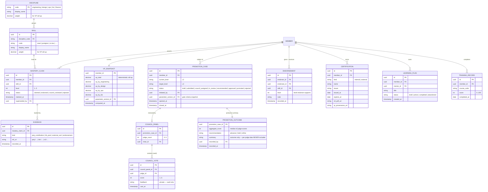
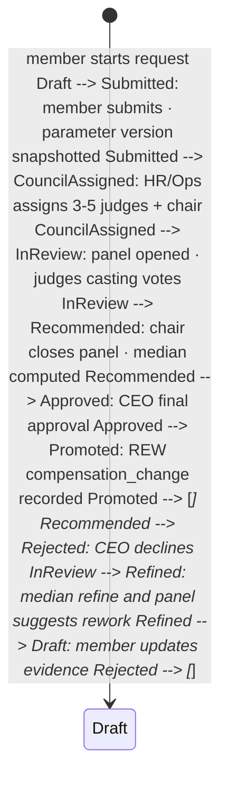

LEARN is the **capability ledger** - what each Member can do, how good they are at it, and how that grows into a promotion or sabbatical eligibility milestone. The skill tree is a closed catalogue per discipline (engineering, design, ops, biz, finance); each skill carries a 1-5 mastery scale; each mastery level requires evidence (a project artifact, a KB authorship, an external certification, or a peer endorsement). Voting Power (VP) rolls up from concrete contributions (PROJ, TIME, KB) into a single number per Member that REW uses to weight the annual bonus pool distribution. The Hội đồng Chuyên môn (Specialist Council) is the peer-review workflow that adjudicates promotion cases - 3 to 5 peers per case, multi-judge scoring, outcome-only summary lands at HR.

## At a glance

| Item | Detail |
|---|---|
| Status | Planned - P1, design phase |
| Est. LoC | ~5,500 (Rust (axum) + skill catalogue DSL) |
| Planned tests | 90+ (incl. VP determinism + multi-judge aggregation) |
| Mastery levels | 1-5 per skill, per Member |
| Council size | 3-5 judges per promotion case |
| Per-judge export | never - (task pending) enforced at boundary |
| Depends on | AUTH, HR, PROJ, TIME, KB - VP roll-up inputs |
| EU AI Act | Annex III §4 - promotion = employment decision |

## The bigger picture - three strategic roles

LEARN runs the people-development side of the spine. Reading it as "an LMS" misses the point: LEARN is the source of VP (Voting Power), the input feeding REW's BP fund distribution. It also runs the Specialist Council - the Vietnamese-academic-style "hội đồng" peer-review process that gates promotion. Per-judge scores stay inside LEARN; only aggregate summaries cross the boundary.

**Role 1 - Skills catalogue.** Skill tree, mastery 1-5, bằng cấp + chứng chỉ. Per-Member skill tree across disciplines (engineering, design, ops, biz). Each skill carries a 1-5 mastery level with evidence requirements at each tier. Vietnamese context: bằng cấp (degrees) and chứng chỉ (certifications) are first-class evidence types. Skill levels feed both HR (role-band fit) and REW (P2 allowance tier).

**Role 2 - VP roll-up engine.** PROJ + TIME + KB -> VP score -> REW BP distribution. VP (Voting Power) is computed quarterly from PROJ contributions (issues closed x complexity x peer rating), TIME presence (billable + non-billable mix), and KB authorship (docs created + cited). The VP score feeds REW's BP fund distribution at quarter close. Deterministic formula; parameter-versioned; replay-stable.

**Role 3 - Hội đồng Chuyên môn (Specialist Council).** 3-5 judges, multi-judge aggregation, per-judge scores never exit. Promotion case -> 3-5 peer-judge panel -> multi-judge scoring along 5 dimensions -> aggregate to outcome (recommend / hold / decline) + summary narrative. Per-judge individual scores are NEVER exported beyond LEARN - psychological-safety contract. HR receives only {summary, recommendation}. EU AI Act Art. 14 oversight: human council, not algorithm, makes the promotion call.

### LEARN signal flow

Diagram source (Mermaid, flattened during migration):

```mermaid
flowchart TB PROJ["📋 PROJ  
issues closed · complexity"] TIME["⏱ TIME  
presence · mix"] KB["📚 KB  
docs authored · cited"] LEARN["📈 LEARN  
skills · VP · Council"] BOUNDARY["🔒 LEARN boundary  
per-judge scores stay inside"] HR["👥 HR  
aggregate summary only"] REW["💰 REW  
VP → BP fund distribution"] PROJ --> LEARN TIME --> LEARN KB --> LEARN LEARN --> BOUNDARY BOUNDARY -- "aggregate + recommendation" --> HR BOUNDARY -- "VP score" --> REW classDef hub fill:#e9d5ff,stroke:#5b21b6,stroke-width:3px,color:#3b0764 classDef mod fill:#e0e7ff,stroke:#3730a3 classDef boundary fill:#fee2e2,stroke:#b91c1c,stroke-width:2px,color:#7f1d1d class LEARN hub class PROJ,TIME,KB,HR,REW mod class BOUNDARY boundary
```

### Auto vs human-in-loop operations matrix

Operation| How it happens| Why this split ---|---|--- Skill level proposal| **Auto** from evidence; **Manager confirm**| Evidence (KB doc count, PROJ contributions) proposes; manager decides. VP roll-up nightly| **Auto** deterministic| Formula + parameter version; CI replay. BP distribution (REW handoff)| **Auto** at quarter close| VP x BP-fund proportion; REW does final write. Promotion case open| **Manual** manager nomination| Promotion is intent; never auto-triggered. Council judge assignment| **Auto** with conflict-check; **CHRO confirm**| Conflicts (direct report, recent collab) filtered; CHRO confirms final panel. Per-judge scoring| **Manual** in private LEARN UI| Individual judgment; private workspace. Per-judge -> aggregate| **Auto** in LEARN; **never exported**| Aggregation deterministic; individual rows isolated to LEARN. Recommendation -> HR| **Auto** after council close| Summary + recommendation only; per-judge scores excluded. Career-path visualisation| **Auto** per Member view| Read-only; helps Member plan; never used as evaluation. Certification expiry alert| **Auto** 90 days pre-expiry| Vietnamese context: many chứng chỉ have validity periods.

## Why LEARN exists

Without a canonical skills ledger, every promotion conversation devolves into anecdote: "Mai is good at React, right?" - followed by selective memory. With a skills ledger that's evidence-backed (every mastery-level claim ties to a project artifact, a KB post, a cert, or a peer endorsement), the conversation is "Mai's React mastery is at level 4, evidenced by these 3 projects and these 2 KB posts - does the council agree?" The Hội đồng Chuyên môn institutionalises that question and writes the answer down. The VP roll-up turns "contribution" from a feeling into a number that REW can use to weight profit-share fairly. None of this is automatic - humans always decide promotions - but the data substrate makes the decisions explainable, defensible, and (per EU AI Act Art. 13) transparent.

- **Skill tree, evidence-backed:** Closed catalogue per discipline; each mastery-level claim ties to a concrete artifact (PROJ contribution, KB post, certificate, peer endorsement).
- **Hội đồng Chuyên môn:** 3-5 peers per promotion case; multi-judge scoring; outcome-only summary. Per-judge data NEVER crosses the LEARN boundary.
- **VP roll-up:** Deterministic function of PROJ contributions x TIME presence x KB authorship; feeds REW BP fund profit-share distribution.

LEARN is also a sabbatical-eligibility partner: the "every 5 continuous years" tick from HR is the time component; LEARN supplies the qualitative side (knowledge-share post, sabbatical readiness review). Together they decide whether a Member is ready to take their accrued sabbatical now or refine the plan.

## What it does - 5W1H2C5M

A structured decomposition of LEARN's scope.

Axis| Question| Answer ---|---|--- **5W - What**| What is LEARN?| A skill catalogue + mastery ledger + VP computation engine + Hội đồng Chuyên môn peer-review workflow + course/training records + career-path visualiser. **5W - Who**| Who is touched?| **Members:** own skill profile, learning plan, promotion cases. **Council judges:** 3-5 peers per case. **Owners:** HR/Ops operates; CHRO (P3 seat) accountable; CEO is final promotion approver. **5W - When**| When does LEARN act?| (a) Skill registration / mastery upgrade (continuous); (b) VP recompute (monthly, deterministic); (c) Promotion request (Member-initiated or HR-initiated, quarterly windows); (d) Performance review cycle (HR-initiated, quarterly); (e) Certification expiry tick (90/30/7 days). **5W - Where**| Where does it run?| P1: single region (SG-1) backed by AWS RDS Postgres. Per-tenant isolation via row-level security on `tenant_id`. **5W - Why**| Why a separate module?| Because promotion + skills is the most subjective decision in any company, and the only defence against bias is evidence and process. LEARN is the evidence layer. **1H - How**| How does it work?| Skill catalogue as Rust + sqlx-backed closed enum per discipline. Mastery claim = row with evidence FK (PROJ contribution id / KB post id / certificate id / endorsement id). VP = pure function of inputs; deterministic. Council workflow is a state-machine per case; per-judge rows stored in LEARN-private table with RLS that excludes HR's read role. **2C - Cost**| Cost budget?| P1: ~$20/month. 50-tenant: ~$70/month. **2C - Constraints**| Constraints?| (a) Per-judge scores never exported (task pending). (b) Promotion gate criteria immutable per parameter version (anti-retroactive, task pending). (c) EU AI Act Annex III §4 high-risk; P2 conformity pack. (d) Vietnamese bằng cấp / chứng chỉ fields supported. **5M - Materials**| Stack?| Rust 1.81, axum, sqlx, PostgreSQL 16, async-graphql, NATS for VP-recompute triggers, S3 for certificate PDFs with QR-provenance. **5M - Methods**| Method choices?| Closed-enum skill catalogue (no free-text skills). Multi-judge aggregation = median of N scores (resilient to one extreme). Anti-retroactive parameter versioning identical to REW pattern. **5M - Machines**| Deployment?| Fargate task in SG-1. Multi-AZ Postgres RDS. S3 for cert PDFs. **5M - Manpower**| Who maintains?| 0.25 FTE today (HR/Ops). By P3: CHRO seat + 1 engineer. **5M - Measurement**| How measured?| KPIs: promotion-case turnaround (open -> closed), per-judge score privacy (= 100%), VP determinism (replay-identical), certification expiry surface rate.

## Architecture

LEARN is one Rust service with four surfaces (GraphQL subgraph for skill/profile/VP reads, REST admin for council + parameter publishes, MCP narrator surface for the CUO/CHRO-skill, NATS event publisher for VP recompute triggers). The Council Vault is a separate Postgres schema with stricter row-level security - only the LEARN admin role can read per-judge rows; HR's role cannot.

Diagram source (Mermaid, flattened during migration):

```mermaid
graph TB subgraph CLIENTS ["Clients"] SPA["CyberOS SPA"] MEM["Member portal  
(own profile + plan)"] JUDGE["Council judge UX  
(per-case)"] CUO["🤖 CUO/CHRO-skill  
narrator + recommender"] end subgraph EDGE ["Edge"] AR["Apollo Router  
JWT + RBAC"] end subgraph LEARN ["LEARN service (Rust · axum)"] GQL["GraphQL subgraph  
Skill · Mastery · VP"] REST["REST admin  
council · params · review"] MCP["MCP narrator  
read-mostly"] SK["skill_catalogue.rs  
closed enum"] MAST["mastery.rs  
claim · evidence · review"] VP["vp.rs  
deterministic roll-up"] COUNCIL["council.rs  
Hội đồng workflow"] PROMO["promotion.rs  
case state machine"] CERT["cert.rs  
QR-signed PDF gen"] EXPIRY["expiry.rs  
90/30/7 day tick"] end subgraph STORES ["Stores"] PG_PUB[("PostgreSQL  
skill · mastery · vp_snapshot  
RLS by tenant_id")] PG_VAULT[("PostgreSQL  
council_vote rows  
stricter RLS — HR blocked")] S3[("AWS S3  
certificate PDFs  
QR-signed provenance")] end subgraph SINKS ["Audit & event"] memory["🧠 memory  
learn.lifecycle rows"] OBS["👁 OBS"] NATS["📡 NATS  
learn.vp.changed · learn.cert.expiring"] end subgraph DOWNSTREAM ["Consumers"] REW["💎 REW  
reads VP for P3 weighting"] HRMOD["👥 HR  
review_outcome summary"] KB["📚 KB  
course materials"] end SPA --> AR MEM --> AR JUDGE --> AR CUO --> AR AR --> GQL AR --> REST AR --> MCP REST --> SK REST --> MAST REST --> COUNCIL REST --> PROMO REST --> CERT GQL --> VP VP --> PG_PUB MAST --> PG_PUB SK --> PG_PUB COUNCIL --> PG_VAULT PROMO --> PG_VAULT PROMO --> PG_PUB CERT --> S3 EXPIRY --> NATS REST --> memory LEARN --> OBS VP --> REW PROMO --> HRMOD SK --> KB classDef planned fill:#e9d5ff,stroke:#5b21b6 classDef store fill:#f5f3ff,stroke:#7c3aed classDef vault fill:#fee2e2,stroke:#dc2626 classDef sink fill:#f5ede6,stroke:#45210e classDef down fill:#fef6e0,stroke:#9c750a class GQL,REST,MCP,SK,MAST,VP,COUNCIL,PROMO,CERT,EXPIRY planned class PG_PUB,S3 store class PG_VAULT vault class memory,OBS,NATS sink class REW,HRMOD,KB down
```

### Internal components

Component| Path (planned)| Responsibility ---|---|--- `skill_catalogue.rs`| services/learn/src/skill_catalogue.rs| Closed-enum catalogue. Disciplines: engineering, design, ops, biz, finance. ~150 skills total at P1. `mastery.rs`| services/learn/src/mastery.rs| Mastery claim + evidence FK. Levels 1-5; level upgrade requires (evidence + peer endorsement OR council review). `vp.rs`| services/learn/src/vp.rs| VP roll-up: deterministic pure function over (mastery x discipline weight + PROJ contribution x project weight + KB authorship x kb weight). Versioned parameters. `council.rs`| services/learn/src/council.rs| Hội đồng Chuyên môn workflow. 3-5 judges per case. Anonymous to other judges. Median aggregation. Per-judge rows in vault schema. `promotion.rs`| services/learn/src/promotion.rs| Promotion case state machine: `draft -> submitted -> council_assigned -> in_review -> recommended -> approved -> promoted` or `rejected`. `career_path.rs`| services/learn/src/career_path.rs| Career-path visualiser - Member's next-level requirements rendered as a checklist. `cert.rs`| services/learn/src/cert.rs| Internal certification PDF generator. QR-signed provenance; verify endpoint resolves to LEARN's signed claim. `expiry.rs`| services/learn/src/expiry.rs| Certification expiry tick - fires `learn.cert.expiring` at 90/30/7 days. CUO/CHRO-skill notifies Member. `endorsement.rs`| services/learn/src/endorsement.rs| Peer endorsement of a mastery claim. Cheap and asynchronous; many endorsements; each is a row. `plan.rs`| services/learn/src/plan.rs| Personal learning plan - Member-owned, optional council mentor. `training_record.rs`| services/learn/src/training_record.rs| Internal & external courses; external cert PDFs stored in S3 with member-uploaded metadata. `parameter_version.rs`| services/learn/src/parameter_version.rs| Anti-retroactive parameter store (mirrors REW pattern). Promotion gate criteria, VP weights, mastery thresholds - all versioned. `narrator.rs`| services/learn/src/narrator.rs| Read-only MCP narrator - explains promotion criteria, career-path gaps, certification readiness. NEVER reveals per-judge data. `audit_bridge.rs`| services/learn/src/audit_bridge.rs| Writes lifecycle rows to memory. Per-judge data is structurally absent. `migrations/`| services/learn/migrations/| sqlx migrations. Vault schema with stricter RLS - only LEARN admin can read per-judge.

## Data model

The schema splits into two zones: the **public zone** (skill, mastery, VP, promotion case header) readable by HR with appropriate scopes; and the **Council Vault** (per-judge votes, individual feedback) which only LEARN admin can read. The boundary is enforced at the Postgres role level - HR's read role lacks SELECT on vault tables.

Diagram source (Mermaid, flattened during migration):



### VP roll-up formula (versioned, deterministic)

Code sketch (as migrated; illustrative):

```rust
/ Pure function. Versioned via parameter_version_id.
/ Same inputs → same vp_total. Forever.

fn compute_vp(
 masteries: &[MasteryClaim],/ accepted only
 projects: &[ProjectContribution],
 kb_posts: &[KbAuthorship],
 params: &VpWeights;,/ versioned
) -> VpSnapshot {
 let mastery_score = masteries.iter.map(|m| m.level as f64 * params.discipline_weight(m.discipline) * params.skill_weight(m.skill)).sum::<f64>
 let project_score = projects.iter.map(|p| p.contribution_score * params.project_weight(p.project_kind)).sum::<f64>
 let kb_score = kb_posts.iter.map(|k| params.kb_weight(k.post_kind)).sum::<f64>
 let vp_total = mastery_score + project_score + kb_score;
 VpSnapshot {
 vp_total,
 vp_by_engineering: subscore(masteries, "engineering"),
 vp_by_design: subscore(masteries, "design"),/ …
 parameter_version_id: params.id,
 computed_at: input_clock,/ input, not wall clock
 }
}
```

## API surface

Three surfaces - GraphQL for skill / mastery / VP reads, REST admin for council + parameter writes, MCP narrator surface for the CUO/CHRO-skill. Per-judge data is never resolvable from any surface.

### GraphQL subgraph

```graphql
extend schema
 @link(url: "https://specs.apollo.dev/federation/v2.5", import: ["@key", "@requiresScopes"])

type MasteryClaim @key(fields: "id") {
 id: ID!
 memberId: ID!
 skill: Skill!
 level: Int!
 status: MasteryStatus!
 evidence: [Evidence!]!
 endorsements: [Endorsement!]!
 claimedAt: DateTime!
}

type Skill @key(fields: "code") {
 code: String!
 disciplineCode: String!
 displayName: String!
 weight: Float!
}

type VpSnapshot {
 memberId: ID!
 vpTotal: Float!
 vpByEngineering: Float!
 vpByDesign: Float!
 vpByOps: Float!
 vpByBiz: Float!
 parameterVersionId: ID!
 computedAt: DateTime!
}

type PromotionCase @key(fields: "id") {
 id: ID!
 memberId: ID!
 currentLevel: String!
 targetLevel: String!
 status: PromotionStatus!
 outcome: PromotionOutcome # summary-only
 openedAt: DateTime!
 closedAt: DateTime
}

type PromotionOutcome {
 aggregateScore: Int! # median
 recommendation: PromotionRecommendation!
 summary: String!
 # NOTE: no per-judge data exposed here
}

enum MasteryStatus { CLAIMED ENDORSED COUNCIL_REVIEWED REJECTED }
enum PromotionStatus { DRAFT SUBMITTED COUNCIL_ASSIGNED IN_REVIEW RECOMMENDED APPROVED PROMOTED REJECTED }
enum PromotionRecommendation { ADVANCE HOLD REFINE }

type Query {
 myMasteries: [MasteryClaim!]!
 memberMasteries(memberId: ID!): [MasteryClaim!]! @requiresScopes(scopes: [["learn.read"]])
 myVp: VpSnapshot!
 memberVp(memberId: ID!): VpSnapshot! @requiresScopes(scopes: [["learn.vp_read"]])
 myPromotionCases: [PromotionCase!]!
 promotionCase(id: ID!): PromotionCase # outcome only; per-judge inaccessible
 careerPath(memberId: ID!, targetLevel: String!): [CareerStep!]!
 skills(discipline: String): [Skill!]!
}

type Mutation {
 claimMastery(skillCode: String!, level: Int!, evidenceRef: String!): MasteryClaim!
 endorseMastery(claimId: ID!, supportLevel: Int!, note: String): Endorsement!
 submitPromotionCase(targetLevel: String!): PromotionCase!
 uploadCertificate(input: CertificateInput!): Certification!
}
```

### REST admin surface

Method| Path| Purpose ---|---|--- POST| `/admin/council/panel`| Assign judges to a promotion case (HR scope). POST| `/admin/council/{panel_id}/vote`| Judge submits score + private feedback (vault). POST| `/admin/council/{panel_id}/close`| Close the panel; compute median; emit outcome. POST| `/admin/promotion/{case_id}/recommend`| Council chair issues recommendation. POST| `/admin/promotion/{case_id}/approve`| CEO approves; HR receives outcome summary; REW notified for compensation_change. POST| `/admin/parameters`| Publish a new parameter version (gate criteria, VP weights). Anti-retroactive replay required. POST| `/admin/vp/recompute`| Trigger VP recompute for a Member or all Members. GET| `/admin/vault/{case_id}`| Per-judge votes (LEARN admin only; HR scope rejected). POST| `/admin/cert/issue`| Issue internal certification (QR-signed PDF). POST| `/admin/dsar/{member_id}/export`| DSAR export - own data + endorsements given/received; per-judge scores excluded.

### MCP tool catalogue (narrator + recommender, read-only)

Tool name| Inputs| Outputs| Annotations ---|---|---|--- `cyberos.learn.explain_career_path`| member_id (own), target_level| narrative checklist| readonly, scope=learn.read `cyberos.learn.recommend_learning_plan`| member_id (own)| plan suggestions| readonly, narrator-only `cyberos.learn.explain_vp`| member_id (own)| narrative VP breakdown| readonly, self-scope `cyberos.learn.explain_promotion_outcome`| case_id| narrative summary (outcome-only, NEVER per-judge)| readonly, scope=learn.read `cyberos.learn.list_skills`| discipline?| Skill| readonly `cyberos.learn.upcoming_cert_expiry`| member_id (own)| Certification expiring <90d| readonly, self-scope `cyberos.learn.draft_endorsement`| endorsee_id, skill_code, level| endorsement draft| destructive=false, requires human-confirm

## Key flows

### Flow 1 - Skill registration + mastery claim

```mermaid
sequenceDiagram autonumber participant M as Member participant L as LEARN GraphQL participant SK as skill_catalogue.rs participant MAST as mastery.rs participant PG as PostgreSQL participant B as 🧠 memory M->>L: claimMastery(skill="react", level=3, evidenceRef="proj:/e-commerce-app") L->>SK: verify skill="react" in catalogue SK-->>L: ✓ L->>MAST: create claim status="claimed" MAST->>PG: INSERT mastery_claim MAST->>PG: INSERT evidence (kind=proj_contribution) L->>B: audit "learn.mastery.claimed" L-->>M: claim created · awaiting endorsement Note over M,B: At least 1 peer endorsement OR a council review  
required before status moves to "endorsed".
```

### Flow 2 - Mastery-level upgrade with peer endorsement

```mermaid
sequenceDiagram autonumber participant M as Member (claim owner) participant P as Peer (endorser) participant L as LEARN participant MAST as mastery.rs participant B as 🧠 memory M->>L: claim level=4 for react (current=3) L-->>M: claim created · status="claimed" M->>P: invite to endorse (CHAT notification) P->>L: endorseMastery(claimId, supportLevel=4, note="led the redesign") L->>MAST: insert endorsement; check threshold alt endorsement count ≥ threshold (e.g. 2 peers at target level) MAST->>MAST: status="endorsed" L->>B: audit "learn.mastery.endorsed" else not yet enough endorsements MAST->>MAST: status stays "claimed" L->>B: audit "learn.endorsement.recorded" end Note over M,P: For level-4 → level-5 jumps, council review is mandatory  
(parameter-driven threshold).
```

### Flow 3 - Promotion request (full Hội đồng Chuyên môn workflow)

```mermaid
sequenceDiagram autonumber participant M as Member participant L as LEARN participant HR as HR/Ops participant CH as Council chair participant J as Judges 3-5 (anonymous to each other) participant V as Council Vault (private DB) participant CEO as CEO participant REW as 💎 REW participant B as 🧠 memory M->>L: submitPromotionCase(target="L3") L->>L: status="submitted"  
parameter_version snapshot taken L->>HR: notify for panel assignment HR->>L: POST /admin/council/panel  
{judges: [j1, j2, j3, j4, j5], chair: ch1} L->>L: status="council_assigned" loop each judge J->>L: POST /admin/council/{panel}/vote  
{score, private_feedback} L->>V: INSERT council_vote (vault schema) end CH->>L: POST /admin/council/{panel}/close L->>V: aggregate (median score) V-->>L: aggregate + recommendation L->>L: status="recommended"; write PromotionOutcome (summary only) L->>HR: outcome summary (no per-judge data) HR->>CEO: present case CEO-->>L: POST /admin/promotion/{case}/approve L->>L: status="approved" L->>REW: trigger compensation_change (L2 → L3); REW co-sign separately L->>B: audit "learn.promotion.approved" (outcome only) Note over L,B: vault schema rows NEVER cross the LEARN boundary.  
HR's DB role lacks SELECT on council_vote.  
per-judge data is structurally inaccessible.
```

### Flow 4 - VP recompute (deterministic, monthly)

```mermaid
sequenceDiagram autonumber participant CRON as Monthly cron participant L as LEARN vp.rs participant MAST as mastery store participant PROJ as 🗂 PROJ contributions participant T as ⏱ TIME presence participant KB as 📚 KB authorship participant PARAM as parameter_version store participant PG as vp_snapshot table participant NATS as NATS event bus participant REW as 💎 REW (consumer) CRON->>L: trigger recompute (all Members) L->>PARAM: read current VP weights loop per Member L->>MAST: read accepted masteries L->>PROJ: read contributions (last 12 mo) L->>T: read presence (last 12 mo) L->>KB: read authorship (last 12 mo) L->>L: compute_vp(...) (pure fn) L->>PG: INSERT vp_snapshot end L->>NATS: publish learn.vp.changed (batch) REW-->>NATS: subscriber updates BP fund weighting Note over L,REW: same inputs → same vp_total.  
Replay test asserts byte-identical phased output.
```

### Flow 5 - Certification expiry surface

```mermaid
sequenceDiagram autonumber participant CRON as Daily cron participant L as LEARN expiry.rs participant PG as PostgreSQL participant NATS as NATS participant CUO as 🤖 CUO/CHRO-skill participant M as Member (CHAT) CRON->>L: tick L->>PG: SELECT cert WHERE expires_at - today IN (90, 30, 7) PG-->>L: 4 rows L->>NATS: publish learn.cert.expiring (×4) CUO-->>NATS: subscriber CUO->>M: "Your AWS Solutions Architect cert expires in 30 days. Plan for renewal?" M->>CUO: "remind in 2 weeks" CUO->>L: schedule follow-up (idempotent)
```

## Promotion case lifecycle

A promotion case traverses seven states. Once the parameter_version is snapshotted at submission, the gate criteria for THIS case are immutable - even if the parameters are updated mid-review, this case is judged by the original criteria.



### Promotion gate criteria - example (L2 -> L3 engineering)

Criterion| Threshold| Source ---|---|--- VP total| >= 140 points| `vp_snapshot` At least 3 skills at mastery >= 4| 3 skills| `mastery_claim` Lead role on >= 1 project| 1 project| PROJ `contribution.role` At least 5 endorsements (peers >= L2)| 5 endorsements| `endorsement` Council median score| >= 4 / 5| `council_vote` (vault) Time in current level| >= 18 months| HR contract / level history Sabbatical knowledge-share post (if eligible)| >= 1| KB authorship

Criteria are versioned. Changing them does not retroactively re-judge open cases (anti-retroactive).

## Functional requirements

The CyberOS task catalogue is being rebuilt one feature at a time via the open [task-author](https://github.com/cyberskill/cyberos/tree/main/modules/skill/task-author) Agent Skill.

Previous task enumerations were archived 2026-05-14 and are no longer reflected on this page. Specific tasks land here as they are re-authored.

## Non-functional requirements

Usability / explainability and security NFRs bind on LEARN. Cross-referenced at [nfr-catalog.html#learn](../../reference/nfr-catalog.html#learn).

NFR ID| Concern| Target| Measurement ---|---|---|--- (NFR pending)| Per-judge data exposed beyond Council Vault| = 0 occurrences| integration test asserts GraphQL + REST never returns council_vote rows; HR DB role inspection (NFR pending)| Council Vault schema isolation| HR + Member roles lack SELECT| DB role test in CI (NFR pending)| VP deterministic replay (phased history)| 100% byte-identical| replay job runs nightly, asserts vp_total stable for last 12 snapshots (NFR pending)| Parameter version supersession (no UPDATE on published rows)| enforced at DB layer| migration grep + DB role inspection (NFR pending)| Career-path next-level checklist completeness| covers 100% of gate criteria| spec test; usability review (NFR pending)| Promotion-case explanation (EU AI Act Art. 13)| narrator covers outcome + recommendation + summary| narrator output review at P2 conformity (NFR pending)| VP single-Member compute p95| <= 150 ms| bench/vp.rs (NFR pending)| VP batch compute (50 Members)| <= 4 s| bench/vp_batch.rs (NFR pending)| LEARN availability| >= 99.5%| SLO monitor (NFR pending)| Cert expiry alert delivery (post NATS)| <= 60s end-to-end| chaos test (NFR pending)| EU AI Act Annex III §4 conformity at P2| full conformity pack| P2 release gate, DPO + CLO sign-off

## Dependencies

LEARN reads contribution data from PROJ + TIME + KB, identity from HR, and gates by AUTH. Its VP outputs feed REW; its promotion outcomes feed HR (and indirectly REW for the compensation_change).

Diagram source (Mermaid, flattened during migration):

```mermaid
graph LR subgraph upstream ["LEARN depends on"] AUTH["🔐 AUTH"] HRMOD["👥 HR  
Member directory"] PROJ["🗂 PROJ  
contributions (VP input)"] TIME["⏱ TIME  
presence (VP input)"] KB["📚 KB  
authorship (VP input)"] memory["🧠 memory  
audit"] OBS["👁 OBS"] end LEARN["📈 LEARN"] subgraph downstream ["LEARN feeds"] REW["💎 REW  
VP for P3 weighting"] HRMOD2["👥 HR  
review outcome summary"] ESOP["📊 ESOP  
milestone grants (optional)"] CUO["🤖 CUO/CHRO-skill"] end AUTH --> LEARN HRMOD --> LEARN PROJ --> LEARN TIME --> LEARN KB --> LEARN memory --> LEARN OBS --> LEARN LEARN --> REW LEARN --> HRMOD2 LEARN --> ESOP LEARN --> CUO classDef planned fill:#e9d5ff,stroke:#5b21b6 classDef shipped fill:#f5ede6,stroke:#45210e class LEARN planned class AUTH,HRMOD,HRMOD2,PROJ,TIME,KB,REW,ESOP,CUO,OBS planned class memory shipped
```

## Compliance scope

LEARN is in EU AI Act high-risk scope because promotion is employment-decision automation. Same Annex III §4 classification as REW.

Regulation / standard| Article / clause| LEARN feature that satisfies it ---|---|--- EU AI Act (Reg. 2024/1689)| Annex III §4 - Worker management| LEARN is in scope. P2 conformity pack covers risk mgmt, data governance, transparency, human oversight. EU AI Act| Art. 13 - Transparency| Career-path visualiser; narrator explains promotion criteria; outcome summary disclosed to candidate. EU AI Act| Art. 14 - Human oversight| (task pending): CEO can override council recommendation; council is advisory + Member can dispute. EU AI Act| Art. 9 - Risk management| Per-judge data segregation; anti-retroactive parameter versioning; multi-judge aggregation (no single-judge decision). Vietnam PDPL (Law 91/2025)| Art. 14 - DSAR| Member DSAR returns own claims/endorsements/cases; per-judge data excluded. Vietnam Labour Code| Art. 6 - Equal treatment| Council judges anonymised to each other; gate criteria identical per level; bias-audit annual. GDPR (EU 2016/679)| Art. 22 - Automated decision-making| Council is human-driven; CEO override; right to explanation via narrator. ISO/IEC 27001:2022| A.5.13 - Information labelling| Council vault classified `restricted`; per-judge rows tagged. ISO/IEC 27001:2022| A.6.3 - Information security awareness| Skill catalogue includes "security awareness" track at all levels. SOC 2 Type II| CC6.6 - Restricted access| Per-judge data isolated to Council Vault role. Vietnam Decree 71/2020/NĐ-CP| Art. 17 - Foreign degree recognition| External certification field with issuer + recognition status.

## Risk entries

Per-judge data leakage and council bias are the principal risks tracked in the [risk register](../../reference/risk-register.html#learn).

ID| Risk| Likelihood| Impact| Owner| Mitigation ---|---|---|---|---|--- `R-LEARN-001`| Per-judge score leaks via GraphQL or audit row| Low| Catastrophic| CSO| Vault schema, stricter RLS, HR + Member roles lack SELECT, integration test asserts no council_vote in any API response. `R-LEARN-002`| Council bias (judges from same team, same gender, ...)| Medium| High| CHRO| Panel-assignment diversity heuristic; annual bias audit; chair-selection rotates. `R-LEARN-003`| VP drift (kernel non-determinism)| Medium| High| CTO| vp.rs is a pure fn, no clock, no randomness; CI replay asserts byte-identical phased history. `R-LEARN-004`| Retroactive gate-criteria change mid-case| Low| High| CHRO| parameter_version snapshotted at submission; CASE judged against snapshot, not current parameters. `R-LEARN-005`| Free-text skill creep (catalogue drift)| Medium| Low| HR/Ops| Closed-enum at DB layer; new skills require parameter publish (3-way co-sign). `R-LEARN-006`| External certification fraud (faked PDF)| Medium| Medium| HR/Ops| Issuer field + verify URL; HR follow-up on randomly sampled 10%/year; QR-signed provenance for internal certs. `R-LEARN-007`| Council fatigue (same judges chosen repeatedly)| Medium| Low| CHRO| Judge-rotation heuristic; max N cases/judge/year; warning if any judge exceeds. `R-LEARN-008`| EU AI Act conformity gap discovered at audit| Medium| High| DPO + CLO| P2 conformity pack drafted at design; legal review annually. `R-LEARN-009`| Promotion approval bypasses council (CEO unilateral)| Low| Medium| CEO| EU AI Act Art. 14 permits override but requires logged rationale; audit row distinguishes "council-approved" vs "override". `R-LEARN-010`| VP weights tuned to favour incumbent leadership| Low| High| CEO + CHRO| Weight changes require 3-way co-sign (CEO + CFO + CHRO); anti-retroactive replay; annual fairness audit. `R-LEARN-011`| Per-judge score leaks to HR via misconfigured export| Low| Critical| CSO| Hard schema boundary at LEARN-HR export; CI gate on schema-diff bot; export fixture-test asserts per-judge fields absent. `R-LEARN-012`| VP signal weaponised - REW BP distribution skews to PROJ-dominant Members| Medium| Medium| CHRO| VP weights span 3 dimensions (PROJ + TIME + KB); cross-Member variance audited quarterly; annual fairness review across role/team/tenure. `R-LEARN-013`| Lumi-promoted skill catalogue update conflicts with tenant-specific role bands| Medium| Low| CHRO| Skill catalogue version pinned per tenant; Lumi pushes are candidate version; tenant opts in explicitly. `R-LEARN-014`| memory ingestion of Council deliberation transcripts violates psychological safety| Low| High| DPO| Council deliberations have sync_class=private (DEC-036 extension); never ingested to memory; transcripts retained 30 days post-decision then purged. `R-LEARN-015`| Skill self-claim spam (Member claims every skill to inflate VP)| Medium| Low| HR/Ops| Claim requires evidence ref (PROJ issue, KB doc, cert); unclaimed-evidence claims dropped from VP; manager endorsement required for level > 3.

## KPIs

LEARN health rolls up into 14 KPIs across throughput, integrity, and fairness.

KPI| Formula| Source| Target ---|---|---|--- **Promotion case turnaround (median)**| median(`closed_at - opened_at`)| LEARN DB| <= 6 weeks **Council judge diversity (gender + team)**| panels with >= 2 dimensions / total| LEARN DB| >= 90% **Per-judge data leak incidents**| integration-test failures| CI| = 0 **VP determinism replay pass**| replay passes / runs| CI| = 100% **Promotion approval rate**| approved / submitted| LEARN DB| tracked, benchmark vs industry **Cert-expiry surface latency**| median(notification - expiry_date_threshold)| OBS| <= 1 day **Mastery claim -> endorsement (median)**| median(`first_endorsed_at - claimed_at`)| LEARN DB| <= 14 days **Endorsement coverage**| endorsed claims / total claims| LEARN DB| >= 80% **EU AI Act conformity score**| items passed / total| P2 audit| = 100% **Per-judge score export attempts blocked**| schema-boundary CI rejections| CI| tracked; spike = active misconfig **VP fairness variance (cross-role)**| stddev(VP_role_X) / mean(VP_role_X)| quarterly audit| <= 0.40 per role-cohort **Skill claim evidence rate**| claims with evidence ref / total claims| LEARN DB| >= 0.95 **Council deliberation transcript purge p95**| retention compliance - deliberations purged <= 30 d| nightly batch| <= 30 d hard floor **HR-to-LEARN-to-REW signal latency p95**| histogram (Member active -> VP rolled -> REW BP credit)| OBS| <= 24 h

## RACI matrix

LEARN is operationally owned by HR/Ops; accountable to CHRO (P3 seat); CEO is the final promotion approver.

Activity| CEO| HR/Ops| CHRO| Council Chair| CSO| DPO| CLO ---|---|---|---|---|---|---|--- Skill catalogue maintenance| I| R| A| C| I| I| I Promotion case opening| I| R| C| I| I| I| I Panel assignment| I| R| A| I| I| I| I Council voting| I| I| C| A/R| I| I| I Promotion approval| A/R| C| R| C| I| I| I VP weights change| A| R| R| C| I| C| C EU AI Act conformity pack| C| I| C| I| C| R| A Bias audit (annual)| I| R| A| C| I| C| C DSAR (own data)| I| R| I| I| C| A| C

R = Responsible, A = Accountable, C = Consulted, I = Informed.

## Planned CLI surface

Admin CLI `cyberos-learn` for HR/Ops + members.

### 1. Claim a mastery level

```
$ cyberos-learn mastery claim --skill react --level 4 \
 --evidence "proj:/e-commerce-app"

[claim created]
 id: 01HZJ8…
 skill: react (engineering)
 level: 4 (current 3)
 status: claimed (awaiting endorsements ≥ 2)
[audit] memory seq=15201
```

### 2. Endorse a peer

```
$ cyberos-learn endorse \
 --member mai@cyberskill.com \
 --skill react \
 --support-level 4 \
 --note "led the e-commerce redesign; mentored 2 juniors"

[endorsement recorded]
 endorser: hoa@cyberskill.com
 endorsee: mai@cyberskill.com
 skill: react @ level 4
[claim] status moved: claimed → endorsed (2 endorsements at target level)
[audit] memory seq=15211
```

### 3. Read your career path

```
$ cyberos-learn career-path --target L3

[career path: L2 → L3 · engineering]

✓ VP total ≥ 140 (current: 152)
✓ 3 skills at mastery ≥ 4 (react ★4, postgres ★4, k8s ★4)
✓ Lead role on ≥ 1 project (e-commerce-app)
✓ 5 endorsements (current: 7)
✗ Council median ≥ 4 (not yet started)
✓ Time in level ≥ 18 mo (current: 21 mo)

[ready to submit promotion case]
```

### 4. Submit a promotion case

```
$ cyberos-learn promotion submit --target L3

[case created]
 id: 01HZJ9…
 target_level: L3
 parameter_version: 2026.04 (snapshotted)
 status: submitted
 HR notified for panel assignment.
[audit] memory seq=15221
```

### 5. Assign a council panel (HR/Ops)

```
$ cyberos-learn council assign \
 --case 01HZJ9… \
 --judges hoa@…,linh@…,thanh@…,nam@…,minh@… \
 --chair hoa@…

[panel assigned] 5 judges + chair
[diversity check] 3 teams, 2 genders, 2 levels — heuristic ✓
[audit] memory seq=15231
```

### 6. Read promotion outcome (outcome-only, no per-judge)

```
$ cyberos-learn promotion outcome --case 01HZJ9…

[case 01HZJ9… · mai@cyberskill.com · L2 → L3]
 status: recommended
 aggregate_score: 4 / 5 (median)
 recommendation: ADVANCE
 summary: "Strong evidence on React mastery, postgres, k8s.
 Two judges noted leadership growth across 2 quarters.
 All criteria met. Recommended for advance."

[per-judge data not exposed — vault-isolated]
```

### 7. VP recompute (admin)

```
$ cyberos-learn vp recompute --member mai@cyberskill.com

[recomputing VP for mai@cyberskill.com]
[inputs] mastery=12 claims · proj=4 contributions · kb=3 posts · time=180d
[kernel] pure fn · 0 I/O · 0 randomness
[result]
 vp_total: 152.4
 vp_by_engineering: 118.0
 vp_by_ops: 24.4
 vp_by_biz: 10.0
[params] version 2026.04
[snapshot] vp_snapshot row written
[audit] memory seq=15241
```

## Phase status & estimates

| Item | Detail |
|---|---|
| Status | Planned - P1, design phase |
| Est. LoC (Rust) | ~5,500 (services/learn + skill catalogue DSL) |
| Planned tests | 90+ (incl. determinism replay + vault isolation) |
| External libs | ~10 (axum, sqlx, qrcode, ring, async-graphql) |
| CLI subcommands | ~18 planned (`cyberos-learn` entrypoint) |
| P1 budget | ~$20/mo (RDS schema + Fargate share) |

Capability| Status ---|--- Skill catalogue (closed enum per discipline)| planned - P1 Mastery claim + endorsement| planned - P1 VP deterministic roll-up| planned - P1 Hội đồng Chuyên môn council workflow| planned - P1 Per-judge data vault isolation| planned - P1 Career-path visualiser| planned - P1 Promotion case state machine| planned - P1 Anti-retroactive parameter versioning| planned - P1 External certification + bằng cấp fields| planned - P1 Cert expiry tick (90/30/7)| planned - P1 Personal learning plans + mentor| planned - P1 Training records + course catalog| planned - P1 QR-signed internal certification PDFs| planned - P2 EU AI Act Annex III §4 conformity pack| planned - P2 Annual bias audit framework| planned - P2 External LMS content providers| planned - P4

## References

- **Bigger picture (above):** 3 strategic roles + LEARN-signal-flow diagram + 10-row auto-vs-human matrix.
- **Cross-module page links:** [hr.html](../hr/index.html), [rew.html](../rew/index.html), [proj.html](../proj/index.html), [time.html](../time/index.html), [kb.html](../kb/index.html), [memory.html](../memory/index.html)
- **memory auto-sync vision:** [MEMORY_AUTOSYNC_DESIGN.md §5](../../docs/MEMORY_AUTOSYNC_DESIGN.md) - LEARN deliberations sync_class=private; never ingested.
- **Build-readiness audit:** `archive/2026-05-14/AUDIT_AND_PLAN.md` (archived; see `cyberos/CHANGELOG.md`) - LEARN at P2-start (P1).
- **task authoring discipline:** [modules/skill/task-audit/AUTHORING_DISCIPLINE.md](https://github.com/cyberskill/cyberos/blob/main/modules/skill/task-audit/AUTHORING_DISCIPLINE.md).
- **task catalogue** - LEARN module tasks ((task pending) through (task pending)).
- **Architecture spec** - LEARN architecture posture, council workflow design.
- **NFR catalogue** - Usability NFRs (explainability of automated decisions).
- **task mapping** - Formal (task pending) through (task pending) with verification methods.
- **Total Rewards & Career Path Appendix** - Promotion gate criteria per level.
- **EU AI Act (Reg. 2024/1689)** - Annex III §4 high-risk; Art. 13 transparency; Art. 14 human oversight; Art. 9 risk management.
- **GDPR (EU 2016/679)** - Art. 22 automated decision-making safeguards.
- **Vietnam Labour Code (2019)** - Art. 6 equal treatment.
- **Vietnam PDPL (Law 91/2025)** - Art. 14 DSAR.
- **Decree 71/2020/NĐ-CP** - Foreign degree recognition (Vietnamese context for bằng cấp).
- **ISO/IEC 27001:2022** - A.5.13, A.6.3 mapped to LEARN security awareness skill track.
- **Hội đồng Chuyên môn institutional design** - Vietnamese academic council format adapted for engineering peer review.
- **Architecture context:** [infrastructure.html#learn](../../architecture/infrastructure.html#learn).

## Changelog

History lives in the [changelog](./changelog.html); this page describes only the current state.
