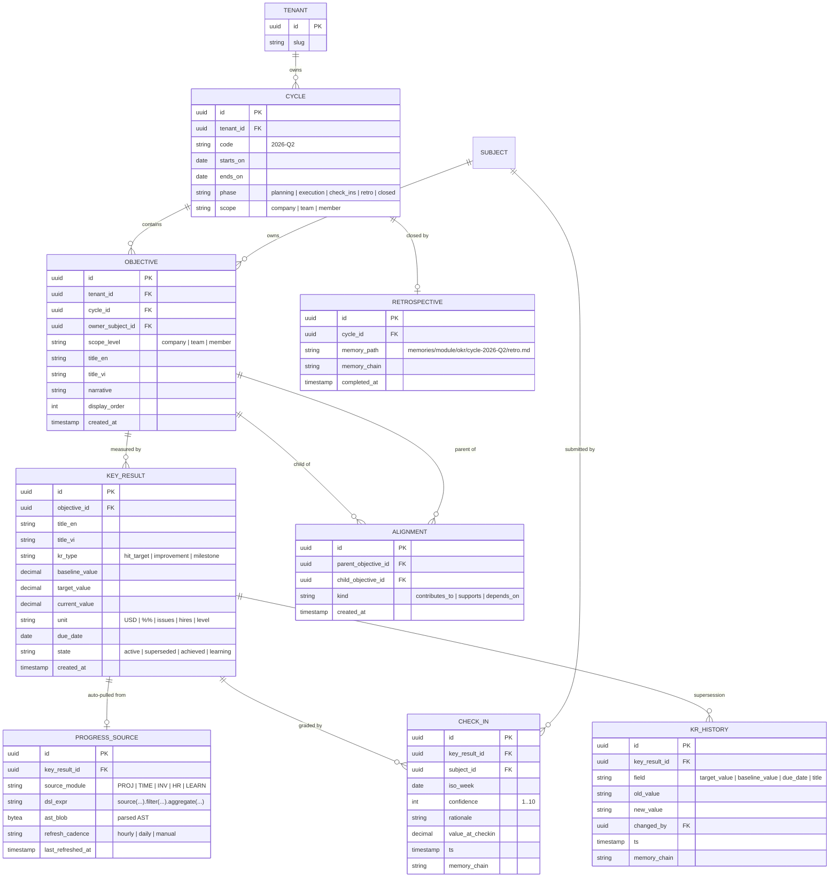
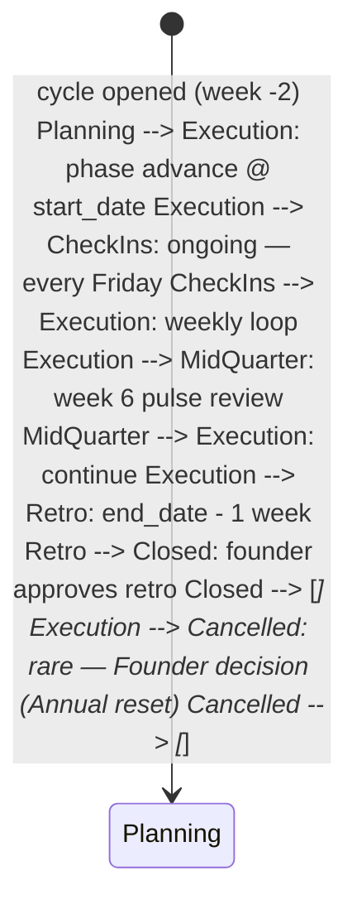

OKR is the **quarterly strategy operating loop**. Cycles, Objectives, Key Results, and Confidence Check-ins are first-class data primitives; alignments tie Member OKRs up through Team OKRs to a Company OKR; progress sources are queries that auto-update KRs from elsewhere in CyberOS, so the dashboard is read-canonical rather than self-reported. The CUO digest on Monday morning summarises confidence drops and surfaces blockers in CHAT. End-of-quarter retros are framed as "what would change our minds next quarter?" prompts; every retro entry is itself a memory entry under `module/okr/` for future cycle reference. Vietnamese cultural adaptation: failed KRs are described as "learning achieved" / "đã học được"; the term "miss" does not appear in any UI string. EU AI Act Art. 14 - OKR-driven employment decisions (promotion, performance review) always have an explicit human approval gate.

## At a glance

| Item | Detail |
|---|---|
| Status | Planned - P3, design phase |
| Cycle length | Quarterly, configurable (4-12 weeks) |
| KRs / Objective | 3-5 (Doerr canonical band) |
| KR types | 3: hit-target, improvement, milestone |
| Confidence scale | 1-10, weekly check-in |
| Progress sources | 5 modules: PROJ, TIME, INV, HR, LEARN |
| i18n | vi + en, face-saving language |
| Depends on | AUTH, memory, 5 sources + CUO, AI, OBS |

## The bigger picture - three strategic roles

OKR is the strategy spine. The Doerr/Grove model is canonical; what's CyberOS-specific is the _auto-progress engine_ (KRs read from PROJ/INV/HR/LEARN automatically) and the _face-saving retro framing_ (Vietnamese cultural adaptation: "what did we learn?" not "what did you miss?"). EU AI Act Art. 14 is the human-in-loop floor for any OKR-driven employment decision.

**Role 1 - Cascade orchestrator.** Company -> Team -> Member quarterly. Company sets 3-5 Objectives per quarter. Teams cascade Team OKRs aligning to Company. Members cascade Individual OKRs aligning to Team. Alignment is visible (every OKR shows its parent); not strict (Members may add Individual-only initiatives). Weekly confidence-band check-ins; quarterly retros.

**Role 2 - KR auto-progress engine.** Each KR declares a progress source query. "Ship feature X" -> PROJ Project status. "Land $400k Q3 revenue" -> INV invoice.paid sum. "Hire 2 seniors" -> HR new-hire events. "All Rust mastery >= 3" -> LEARN aggregate. The KR row carries a progress_source query; a nightly batch updates the current value. Members never enter progress manually - auto-pull eliminates the OKR-stale problem.

**Role 3 - Face-saving retro engine.** "What did we learn?" not "what did you miss?". Quarterly retros reframe failed KRs in Vietnamese cultural-fit language. Missed KR ("đạt 0.4 / 1.0") -> prompt = "Điều gì đã thay đổi giữa khi đặt mục tiêu và bây giờ?" (What changed between target-setting and now?). CUO drafts the retro narrative; Member edits; manager reviews. Output becomes a memory entry citable by future OKR cycles.

### OKR auto-progress data flow

Diagram source (Mermaid, flattened during migration):

```mermaid
flowchart LR CEO["🏢 CEO sets Company O"] OKR["🎯 OKR  
cascade · auto-progress · retros"] PROJ["📋 PROJ Issues"] INV["🧾 INV invoices"] HR["👥 HR events"] LEARN["📈 LEARN mastery"] CUO["🎯 CUO digest"] memory["🧠 memory  
retro memories"] CEO --> OKR PROJ -- "progress_source" --> OKR INV --> OKR HR --> OKR LEARN --> OKR OKR --> CUO CUO -- "Monday digest" --> CEO OKR --> memory memory -. "citable by next cycle" .-> OKR classDef hub fill:#e0e7ff,stroke:#4338ca,stroke-width:3px,color:#312e81 classDef mod fill:#e0e7ff,stroke:#3730a3 classDef memory fill:#fef6e0,stroke:#9c750a class OKR hub class CEO,PROJ,INV,HR,LEARN,CUO mod class memory memory
```

### Auto vs human-in-loop operations matrix

Operation| How it happens| Why this split ---|---|--- Objective creation| **Manual** Member / team lead| Strategic intent; never auto-generated. Cascade alignment proposal| **Auto** suggest parent O; **Member confirm**| Suggest reduces friction; Member owns alignment. KR progress update (auto-source)| **Auto** nightly| Deterministic from progress_source query. Weekly confidence check-in| **Manual** Member 1-10 + rationale| Confidence is signal that auto-progress alone can't capture. CUO Monday digest| **Auto** from check-ins + auto-progress| Founder reads consolidated summary; never replaces 1:1. Quarterly retro draft| **Auto** CUO; **manual** Member edit + manager review| Face-saving framing required; Member owns narrative. Failed-KR consequence (REW/promotion)| **Human-in-loop** per EU AI Act Art. 14| Employment decision; OKR is input, never algorithm. OKR archival| **Auto** at quarter close| Frozen + chained as a memory entry.

## Why OKR exists

Strategy operating-systems fail at three points: (1) the cascade is built once and goes stale; (2) progress is self-reported and therefore self-inflated; (3) the retrospective is performative because the team is graded on whether they hit, not on what they learned. OKR addresses all three. The cascade is a graph stored in the database; it is read every check-in and rebuilt every cycle. Progress is computed, not typed - every KR declares a progress source (a query against another module) and the value moves on its own. Retrospectives are framed in face-saving Vietnamese language and stored as memory entries, so the lesson outlives the quarter that produced it. The Founder gets a Monday-morning CUO digest of confidence-band drops; if four KRs in a row drop two points this week, that is a signal that surfaces automatically.

- **Cascade is a graph:** Company -> Team -> Member alignments are first-class edges. A Member OKR with no upward alignment is flagged in the dashboard - orphan OKRs are tracked, not hidden.
- **Progress is computed:** Auto-pull from PROJ (issue completion), TIME (hours), INV (revenue), HR (hires), LEARN (mastery). The dashboard reflects reality, not self-report.
- **Retros are memories:** Every retro entry lands in memory under `module/okr/retros/`. Next quarter's planning prompts read these aloud. The lesson persists.

The bet is that an OKR system that _cannot_ be gamed (because progress is computed) and that _actively learns_ from each quarter (because retros are persisted, citable memories) compounds over years. A 12-quarter-old company has 12 memory-archived retros; planning quarter 13 starts by reading them. That is a fundamentally different artefact than 12 forgotten Notion pages.

## What it does - 5W1H2C5M

A structured decomposition of OKR's scope.

Axis| Question| Answer ---|---|--- **5W - What**| What is OKR?| A strategy operating-loop service. Primitives: Cycle, Objective, KeyResult, CheckIn, Alignment, ProgressSource, Retrospective. Rust service with TS SPA dashboard. PostgreSQL store + materialised rollups. **5W - Who**| Who uses it?| **Founder / CEO:** owns Company-level Objectives; reads Monday-morning CUO digest. **Team leads:** author Team OKRs aligning up. **Members:** author their own OKRs aligned to a Team. **Agents:** CUO digest; CSO-skill for retro drafting; CEO-skill for cascade-coherence checks. **5W - When**| When does it run?| Quarterly cycle (default Q1 / Q2 / Q3 / Q4 anchored to Jan-1). Weekly confidence-band check-ins (every Friday 17:00 ICT). Mid-quarter pulse (week 6). Quarter-close retrospective. Continuous auto-progress refresh (hourly per progress source). **5W - Where**| Where does it run?| P3: SG-1 region with VN-residency partition. Read-heavy workload behind PgBouncer; OKR graph queried via federated GraphQL into PROJ/HR/INV. **5W - Why**| Why a separate module?| Because the cascade graph is referenced by REW (P3 performance pool depends on team-objective achievement), by HR (promotion review reads Member-OKR history), by CRM (revenue KRs feed pipeline forecast), and by the Founder daily flow. Owning it once means every consumer reads the same source-of-truth. **1H - How**| How does it work?| OKR primitives stored in `okr.*` tables. Alignments are FK edges in `okr.alignment` with type in {contributes_to, supports, depends_on}. Confidence check-ins append to `okr.check_in`. Auto-progress: each KR declares `progress_source` (a small DSL) and a refresh job materialises the current value. Retros land in memory under `module/okr/cycle-YYYY-Qn/`. **2C - Cost**| Cost budget?| P3: ~$25 / month (PG read replica + small Fargate + nightly refresh job). Low data volume - Cycle x Objective x KR cardinality is bounded. **2C - Constraints**| Constraints?| (a) EU AI Act Art. 14 - OKR-driven employment decisions require human approval. (b) GDPR Art. 22 - same. (c) Vietnamese cultural fit: face-saving language; no "missed" / "failed" without "learned". (d) Append-only history - modifications post-cycle-end create supersession entries, never overwrites (task pending). **5M - Materials**| Stack?| Rust 1.81, axum, sqlx, PostgreSQL 16, React + visx for cascade tree, DSL parser (nom) for progress-source expressions, OpenTelemetry. **5M - Methods**| Method choices?| Cycle is a calendar with explicit phases (planning, execution, check-ins, retro, close). KR is typed (hit-target / improvement / milestone) with type-specific computation. Confidence band is a 1-10 scalar plus rationale text; trend is computed over 4 weeks. Retros are CSV-prompt-driven (5 questions) and CUO-summarised. **5M - Machines**| Deployment?| Fargate task in SG-1 (P3). Standard PG read replica. Scheduled jobs for weekly check-in reminders and nightly auto-progress refresh. **5M - Manpower**| Who maintains?| 0.2 FTE at P3; CSO seat owns product direction; CEO-skill drives Founder digests. **5M - Measurement**| How measured?| (NFR pending) drag-drop cascade p95 <= 200 ms, (NFR pending) auto-progress refresh success >= 99.5%. KPIs: cascade-coverage %, weekly check-in participation %, end-of-quarter retro completion %, average final score.

## Architecture

OKR is a Rust service with a TS cascade-tree SPA. It owns the OKR graph + check-in history; reads auto-progress from five upstream modules through GraphQL federation; writes summaries to memory; emits Notify cards to CUO. The progress-source DSL is parsed at KR creation time and stored as an AST; refresh is a scheduled job that walks each KR's AST and executes the query against the appropriate module's federated subgraph.

Diagram source (Mermaid, flattened during migration):

```mermaid
graph TB subgraph UI ["UI surfaces"] SPA["Cascade SPA  
(React + visx tree)"] CHECKIN["Weekly check-in modal"] RETRO["Retro composer"] end subgraph OKR ["OKR service (Rust · axum)"] AUTHOR["author.rs  
Objective + KR CRUD"] CASCADE["cascade.rs  
Alignment graph"] PROGRESS["progress.rs  
auto-pull engine"] DSL["dsl.rs  
progress-source parser (nom)"] CHECKIN_S["checkin.rs  
confidence rollup"] RETRO_S["retro.rs  
retrospective composer"] DIGEST["digest.rs  
Monday CUO digest"] GQL["gql_subgraph.rs  
federated read API"] end subgraph SOURCES ["Auto-progress sources"] PROJ["📋 PROJ  
issue.completed"] TIME["⏱ TIME  
hours.logged"] INV["💰 INV  
invoice.paid"] HR["👥 HR  
hire.created"] LEARN["📚 LEARN  
mastery.attained"] end subgraph STORES ["Stores"] PG[("PostgreSQL 16  
okr.cycle · objective  
key_result · check_in  
alignment · progress_source")] end subgraph SINKS ["Audit + AI"] memory["🧠 memory  
okr.* rows  
retros under module/okr/"] CUO["🧠 CUO  
Monday digest"] OBS["👁 OBS  
traces + metrics"] end SPA --> AUTHOR CHECKIN --> CHECKIN_S RETRO --> RETRO_S AUTHOR --> CASCADE AUTHOR --> PG CASCADE --> PG AUTHOR --> DSL DSL --> PG PROGRESS --> PG PROGRESS --> PROJ PROGRESS --> TIME PROGRESS --> INV PROGRESS --> HR PROGRESS --> LEARN CHECKIN_S --> PG CHECKIN_S --> memory RETRO_S --> memory DIGEST --> CHECKIN_S DIGEST --> CUO GQL --> PG AUTHOR --> memory CASCADE --> memory OKR --> OBS classDef planned fill:#cba88a,stroke:#4338ca classDef store fill:#f5f3ff,stroke:#7c3aed classDef sink fill:#f5ede6,stroke:#45210e class SPA,CHECKIN,RETRO,AUTHOR,CASCADE,PROGRESS,DSL,CHECKIN_S,RETRO_S,DIGEST,GQL,PROJ,TIME,INV,HR,LEARN planned class PG store class memory,CUO,OBS sink
```

### Internal components

Component| Path (planned)| Responsibility ---|---|--- `author.rs`| services/okr/src/author.rs| Create / update Objective and KeyResult. KR-phrasing assistant via AI gateway (suggests measurable phrasing). `cascade.rs`| services/okr/src/cascade.rs| Manage Alignment edges: contributes_to, supports, depends_on. Detect orphan OKRs (no upward alignment). Cycle detection (no circular alignments). `dsl.rs`| services/okr/src/dsl.rs| Nom-based parser for progress-source expressions. Grammar: `source(query) [filter expr] [aggregate fn]`. `progress.rs`| services/okr/src/progress.rs| Scheduled auto-progress refresh. Walks each KR's AST, federates to source module, updates current_value with audit trail. `checkin.rs`| services/okr/src/checkin.rs| Weekly check-in collector. Confidence 1-10 + rationale per KR. Computes 4-week trend; flags 2+ point drops as risk. `retro.rs`| services/okr/src/retro.rs| End-of-cycle retrospective. CSV-prompt-driven. CUO drafts summary; human edits; final lands as a memory entry under `module/okr/cycle-YYYY-Qn/retro.md`. `digest.rs`| services/okr/src/digest.rs| Monday-morning CUO digest. Confidence drops, KRs off-track, suggested founder questions. `blocker.rs`| services/okr/src/blocker.rs| Blocker detection: monitors CHAT for KR-related "blocked by" mentions and surfaces to digest. `cascade_check.rs`| services/okr/src/cascade_check.rs| Cascade-coherence check: every Member OKR must align to a Team OKR; every Team OKR must align to a Company OKR (configurable strict / soft mode). `supersession.rs`| services/okr/src/supersession.rs| Append-only history. Mid-cycle KR target changes create supersession rows; originals remain visible (task pending). `i18n.rs`| services/okr/src/i18n.rs| Vietnamese face-saving language pack. Maps internal status codes to UI strings: "miss" -> "đã học được" / "learning achieved"; never "fail". `audit_bridge.rs`| services/okr/src/audit_bridge.rs| Writes every OKR + check-in event to the memory canonical writer. `migrations/`| services/okr/migrations/| sqlx migrations. RLS by `tenant_id`. Indices on (cycle_id, objective_id) and (subject_id, cycle_id).

**OKR-INV-001 - Post-cycle history is append-only.** After a Cycle reaches `execution` phase, KR target modifications are **supersession entries**, not overwrites. The original target value remains visible in the timeline; the new target carries `superseded_by` linkage. Verification: (task pending) - attempt to modify in-place is rejected with `code: "OKR-IMMUTABLE-POST-CYCLE"`; the supersession path produces a chained memory audit row.

## Data model

The OKR graph is six tables: Cycle (calendar), Objective (qualitative goal), KeyResult (quantitative outcome), Alignment (cascade edges), CheckIn (weekly confidence), ProgressSource (DSL-typed auto-pull config). Retrospective is a memory entry, not a Postgres row.

Diagram source (Mermaid, flattened during migration):



### Progress-source DSL grammar (planned)

```text
progress_expr = source_call, { '.', method_call };
source_call = source_name, '(', [ args ], ')';
source_name = 'proj' | 'time' | 'inv' | 'hr' | 'learn';
method_call = method_name, '(', [ args ], ')';
method_name = 'filter' | 'group_by' | 'count' | 'sum' | 'avg' | 'max' | 'min';
args = arg, { ',', arg };
arg = literal | identifier | range;/ Examples:
/ inv.invoices.filter(state="paid", paid_at >= cycle_start).sum(amount_usd)
/ proj.issues.filter(project_id="proj-atlas", state="done").count
/ hr.members.filter(hired_at >= cycle_start, role_tier="T3").count
/ learn.mastery.filter(skill="rust", level >= 3).count_distinct(member_id)
/ time.entries.filter(billable=true, period=cycle).sum(hours)
```

## API surface

Federated GraphQL subgraph for cascade reads and check-in writes, plus an MCP tool catalogue for natural-language OKR authorship through Genie.

### GraphQL subgraph (federated)

```graphql
extend schema
 @link(url: "https://specs.apollo.dev/federation/v2.5", import: ["@key", "@external", "@shareable", "@requiresScopes"])

type Cycle @key(fields: "id") {
 id: ID!
 code: String!
 startsOn: Date!
 endsOn: Date!
 phase: CyclePhase!
 scope: ScopeLevel!
 objectives: [Objective!]!
}

type Objective @key(fields: "id") {
 id: ID!
 cycle: Cycle!
 owner: Subject!
 scopeLevel: ScopeLevel!
 titleEn: String!
 titleVi: String!
 narrative: String
 keyResults: [KeyResult!]!
 alignmentsUp: [Alignment!]!
 alignmentsDown: [Alignment!]!
}

type KeyResult @key(fields: "id") {
 id: ID!
 objective: Objective!
 titleEn: String!
 titleVi: String!
 krType: KrType!
 baselineValue: Float!
 targetValue: Float!
 currentValue: Float!
 unit: String!
 dueDate: Date!
 state: KrState!
 progressSource: ProgressSource
 checkIns(last: Int): [CheckIn!]!
 confidenceTrend: [ConfidencePoint!]!
}

type ProgressSource {
 sourceModule: String!
 dslExpr: String!
 refreshCadence: RefreshCadence!
 lastRefreshedAt: DateTime
}

type Alignment @key(fields: "id") {
 id: ID!
 parent: Objective!
 child: Objective!
 kind: AlignmentKind!
}

type CheckIn @key(fields: "id") {
 id: ID!
 keyResult: KeyResult!
 subject: Subject!
 isoWeek: Date!
 confidence: Int!
 rationale: String!
 valueAtCheckin: Float!
 ts: DateTime!
}

type ConfidencePoint {
 isoWeek: Date!
 confidence: Int!
}

enum CyclePhase { PLANNING EXECUTION CHECK_INS RETRO CLOSED }
enum ScopeLevel { COMPANY TEAM MEMBER }
enum KrType { HIT_TARGET IMPROVEMENT MILESTONE }
enum KrState { ACTIVE SUPERSEDED ACHIEVED LEARNING }
enum AlignmentKind { CONTRIBUTES_TO SUPPORTS DEPENDS_ON }
enum RefreshCadence { HOURLY DAILY MANUAL }

type Query {
 cycle(code: String!): Cycle
 myObjectives(cycleCode: String!): [Objective!]!
 @requiresScopes(scopes: [["okr.read"]])
 cascade(cycleCode: String!, rootObjectiveId: ID): [Objective!]!
 @requiresScopes(scopes: [["okr.read"]])
 orphans(cycleCode: String!): [Objective!]!
 @requiresScopes(scopes: [["okr.read"]])
}

type Mutation {
 createObjective(input: ObjectiveInput!): Objective!
 @requiresScopes(scopes: [["okr.write"]])
 upsertKeyResult(input: KeyResultInput!): KeyResult!
 @requiresScopes(scopes: [["okr.write"]])
 alignObjectives(parentId: ID!, childId: ID!, kind: AlignmentKind!): Alignment!
 @requiresScopes(scopes: [["okr.write"]])
 submitCheckIn(input: CheckInInput!): CheckIn!
 @requiresScopes(scopes: [["okr.checkin"]])
 closeRetrospective(cycleCode: String!, memoryPath: String!): Cycle!
 @requiresScopes(scopes: [["okr.close_cycle"]])
}
```

### REST + scheduled endpoints

Method| Path| Purpose ---|---|--- GET| `/okr/cascade.svg?cycle=2026-Q2`| SVG export of cascade tree for board pack. POST| `/okr/refresh-progress?kr_id=...`| Force auto-progress refresh for a specific KR. POST| `/okr/cycles/{code}/advance`| Advance cycle phase. Admin scope. GET| `/okr/digest/weekly.md`| Monday digest in markdown. GET| `/okr/orphans?cycle=2026-Q2`| List orphan Member OKRs (no upward alignment). GET| `/okr/check-in-status?cycle=2026-Q2&iso_week=2026-W19`| Who has and has not submitted this week's check-in. POST| `/okr/retros/{cycle_code}/draft`| CUO drafts a retrospective summary from the cycle's data.

### MCP tool catalogue

Tool name| Inputs| Outputs| Annotations ---|---|---|--- `cyberos.okr.list_cycle`| cycle_code| Cycle + Objectives + KRs| readonly, scope=okr.read `cyberos.okr.create_objective`| title, narrative, scope| Objective| scope=okr.write `cyberos.okr.suggest_kr_phrasing`| objective_text, candidate_kr| 3 suggestions + measurability score| readonly, AI-call `cyberos.okr.submit_check_in`| kr_id, confidence, rationale| CheckIn| scope=okr.checkin `cyberos.okr.cascade_view`| cycle_code, root_id?| tree| readonly `cyberos.okr.find_orphans`| cycle_code| Objective| readonly `cyberos.okr.weekly_digest`| cycle_code| Markdown digest| readonly `cyberos.okr.draft_retro`| cycle_code| Retro draft| readonly, CSO-confirm before persist `cyberos.okr.close_cycle`| cycle_code, retro_memory_path| {cycle}| destructive, scope=okr.close_cycle, founder-confirm

## Key flows

### Flow 1 - Quarterly cycle (define -> execute -> review)

```mermaid
sequenceDiagram autonumber participant CEO as CEO participant TL as Team Leads participant M as Members participant O as OKR service participant AI as 🧠 AI gateway participant B as 🧠 memory participant CUO as 🧠 CUO Note over CEO: Phase 1 · Planning (week -2 to 0) CEO->>O: createObjective(scope=COMPANY, "Land $1.2M ARR Q3") O->>AI: suggest_kr_phrasing("Land $1.2M ARR") AI-->>O: 3 candidates with measurability scores CEO->>O: upsertKeyResult(target=1_200_000, unit=USD, source=inv.invoice.paid) O->>B: append okr.objective.created + key_result.created Note over TL: TL author Team OKRs aligning up TL->>O: createObjective(scope=TEAM) + align(parent=company-obj) Note over M: Members author Member OKRs aligning up M->>O: createObjective(scope=MEMBER) + align(parent=team-obj) O->>O: cascade_check — every member-obj has team alignment O->>B: append cascade.coherent row Note over O: Phase 2 · Execution (weeks 1-12) loop weekly O->>M: ping check-in modal Friday 17:00 ICT M->>O: submitCheckIn(confidence=7, rationale="...") O->>B: append check_in.submitted row end Note over O: Phase 3 · Retrospective (week 13) O->>CUO: draft_retro(cycle_code) CUO->>AI: summarise cycle data + face-saving framing AI-->>CUO: draft CUO->>CEO: present draft for review CEO->>O: closeRetrospective with edited content O->>B: write retro to memories/module/okr/cycle-2026-Q2/retro.md O->>B: append cycle.closed row
```

### Flow 2 - Weekly confidence check-in

```mermaid
sequenceDiagram autonumber participant CR as cron (Fri 17:00 ICT) participant O as OKR digest participant M as Member participant SPA as Check-in modal participant C as checkin.rs participant PG as PostgreSQL participant B as 🧠 memory participant CUO as 🧠 CUO CR->>O: notify all Members with active KRs O->>M: push notification (CHAT + email) M->>SPA: open modal SPA-->>M: render KR cards with last 4-week confidence trend loop per KR M->>SPA: confidence 1-10 + rationale end SPA->>C: submit batch C->>PG: INSERT check_in rows C->>C: compute 4-week trend per KR alt 2+ point drop C->>CUO: flag risk(kr_id) CUO->>CUO: queue for Monday digest end C->>B: append check_in.submitted (per KR)
```

### Flow 3 - Cascade alignment (Company -> Team -> Member)

```mermaid
sequenceDiagram autonumber participant TL as Team Lead participant SPA as Cascade SPA (tree) participant AR as Apollo Router participant C as cascade.rs participant CK as cascade_check.rs participant PG as PostgreSQL participant B as 🧠 memory TL->>SPA: drag Team OKR onto Company OKR SPA->>AR: mutation alignObjectives(parent=co-obj, child=team-obj, kind=CONTRIBUTES_TO) AR->>C: forward with JWT C->>PG: INSERT alignment row C->>CK: validate (no cycles, scope-level rule honoured) alt valid alignment CK-->>C: ok C->>B: append alignment.created row C-->>SPA: success; tree re-render else cycle detected CK-->>C: deny ALIGNMENT-CYCLE C->>PG: ROLLBACK C-->>SPA: 422 error end
```

Cascade rules: COMPANY can only be parent of TEAM; TEAM can only be parent of MEMBER. Cross-scope-level alignments (e.g., Member -> Company directly) are rejected with `code: "OKR-SCOPE-MISMATCH"`.

### Flow 4 - Auto-progress sync (PROJ / TIME / INV / HR / LEARN)

```mermaid
sequenceDiagram autonumber participant CR as cron (hourly) participant P as progress.rs participant D as dsl.rs (parsed AST) participant INV as 💰 INV federated subgraph participant PROJ as 📋 PROJ federated subgraph participant LRN as 📚 LEARN federated subgraph participant PG as PostgreSQL participant B as 🧠 memory CR->>P: enumerate KRs with refresh_cadence in (hourly, daily-due) loop per KR P->>D: load AST from progress_source alt source = inv P->>INV: federated query (e.g., paid invoices Σ amount) INV-->>P: scalar value else source = proj P->>PROJ: federated query (e.g., done-issues count) PROJ-->>P: scalar value else source = learn P->>LRN: federated query (e.g., mastery_level>=3 count) LRN-->>P: scalar value end P->>PG: UPDATE key_result SET current_value=…, last_refreshed_at=now alt value changed P->>B: append progress.refreshed row {kr_id, from, to} end end
```

### Flow 5 - Monday CUO digest to Founder

```mermaid
sequenceDiagram autonumber participant CR as cron (Mon 07:00 ICT) participant D as digest.rs participant CH as checkin.rs (trend reader) participant BL as blocker.rs participant AI as 🧠 AI gateway participant CUO as 🧠 CUO participant CEO as CEO (CHAT) participant B as 🧠 memory CR->>D: assemble weekly digest D->>CH: pull confidence drops (≥ 2 pts over 2 wks) D->>BL: pull "blocked by" mentions in CHAT D->>D: rank by impact × risk D->>AI: summarise to ~250 words; face-saving framing AI-->>D: draft D->>CUO: route to founder CUO->>CEO: post in Founder DM with citations CEO-->>CUO: optional reply ("dig into KR-042") CUO->>B: append digest.delivered + digest.engaged rows
```

The digest never says "X failed"; it says "X is below confidence band - what would help?" The Vietnamese version uses "đang gặp khó khăn" (encountering difficulty) rather than "hỏng" (broken).

## Cycle lifecycle

A Cycle traverses five phases. Each transition is gated; modifying KRs in `execution` phase requires supersession.



### Per-phase rules

Phase| Duration| Rules ---|---|--- Planning| 2 weeks| Objectives + KRs editable freely. Alignments built. Cascade coherence must pass before transition. Execution| 10 weeks (quarter)| KR target modifications require supersession (task pending). Auto-progress refresh hourly. Weekly check-ins enforced. CheckIns (sub-state)| weekly Fri 17:00| All Members with active KRs receive prompts; missing check-ins flagged in next-week digest. MidQuarter (sub-state)| week 6| Mandatory CEO + Team Lead review. Confidence-band review; off-track KRs get rationale entry. Retro| 1 week| CUO drafts retro summary; team reviews; final lands in memory under `module/okr/cycle-YYYY-Qn/retro.md`. Closed| terminal| All KRs reach final state (achieved / learning). Read-only. Audit chain preserved. Cancelled| terminal| Cycle invalidated. Audit chain preserved with reason.

## Functional requirements

The CyberOS task catalogue is being rebuilt one feature at a time via the open [task-author](https://github.com/cyberskill/cyberos/tree/main/modules/skill/task-author) Agent Skill.

Previous task enumerations were archived 2026-05-14 and are no longer reflected on this page. Specific tasks land here as they are re-authored.

## Non-functional requirements

OKR NFRs cover cascade-tree UX latency, auto-progress reliability, and append-only data-integrity.

NFR ID| Concern| Target| Measurement ---|---|---|--- (NFR pending)| Cascade-tree drag-drop p95| <= 200 ms| RUM + Lighthouse (NFR pending)| Check-in modal open-to-submit p95| <= 60 s end-to-end| RUM (NFR pending)| cascade(cycleCode) query p95| <= 350 ms (100-objective cascade)| k6 (NFR pending)| submitCheckIn server-canonical p95| <= 250 ms| k6 + Apollo Router metrics (NFR pending)| Auto-progress refresh success rate| >= 99.5% / day| OBS daily report (NFR pending)| Federated query timeout fallback| <= 2 s; on timeout, retain last value + flag| chaos test (NFR pending)| Append-only history under modification attempt| = 0 in-place updates after Execution phase| property test + DB audit (NFR pending)| Cascade cycle-detection accuracy| = 100% (zero false negatives)| property-based test (NFR pending)| OKR availability (28-day)| >= 99.9%| SLO monitor (NFR pending)| Cross-tenant cascade leak| = 0| RLS verification harness (NFR pending)| Cascade tree keyboard-navigable (WCAG 2.1 AA)| full coverage| axe-core audit

## Dependencies

OKR depends on AUTH for RBAC, memory for retros + audit, AI for phrasing + summarisation, and federated subgraphs from five progress-source modules. It is consumed by REW (performance pool reads team-objective achievement), HR (promotion review reads Member OKR history), and the CUO daily flow.

Diagram source (Mermaid, flattened during migration):

```mermaid
graph LR subgraph upstream ["OKR depends on"] AUTH["🔐 AUTH  
RBAC + scope"] memory["🧠 memory  
audit + retros"] AI["🧠 AI Gateway  
phrasing + summarisation"] OBS["👁 OBS"] PROJ["📋 PROJ  
auto-progress"] TIME["⏱ TIME  
auto-progress"] INV["💰 INV  
auto-progress"] HR["👥 HR  
auto-progress"] LEARN["📚 LEARN  
auto-progress"] CRM["🏢 CRM  
pipeline KRs"] end OKR["🎯 OKR"] subgraph downstream ["Used by"] REW["💎 REW  
P3 perf pool"] HR_D["👥 HR  
promotion review"] CUO["🧠 CUO  
daily digest"] RES["📅 RES  
hiring objective"] DASH["📊 OBS dashboards"] end AUTH --> OKR memory --> OKR AI --> OKR OBS --> OKR PROJ --> OKR TIME --> OKR INV --> OKR HR --> OKR LEARN --> OKR CRM --> OKR OKR --> REW OKR --> HR_D OKR --> CUO OKR --> RES OKR --> DASH classDef planned fill:#cba88a,stroke:#4338ca classDef shipped fill:#f5ede6,stroke:#45210e class AUTH,memory,AI,OBS,PROJ,TIME,INV,HR,LEARN,CRM,OKR,REW,HR_D,CUO,RES,DASH planned
```

## Compliance scope

OKR touches employment-context data (performance, promotion inputs). EU AI Act Art. 14 and GDPR Art. 22 apply because OKRs feed REW (compensation) and HR (promotion).

Regulation / standard| Article / clause| OKR feature that satisfies it ---|---|--- EU AI Act (Reg. 2024/1689)| Annex III §4 - Employment| OKR outputs that feed REW or HR are gated by human approval (task pending). EU AI Act| Art. 14 - Human oversight| CUO digest is advisory; no automated promotion / compensation action. GDPR (EU 2016/679)| Art. 22 - Automated decision-making| Same as Art. 14; explicit human approval predicate. GDPR| Art. 15 - Right of access| `cyberos-okr dsar-export` returns full Objective + KR + CheckIn history for a Subject. GDPR| Art. 17 - Right to erasure| Tombstone supported on CheckIn; aggregate retro memory retains tenant-level summary. Vietnam PDPL (Law 91/2025)| Art. 14 - DSAR| Same as GDPR Art. 15 surface. Vietnam cultural fit| - Face-saving| i18n.rs maps internal "miss" -> "đã học được" UI string; retro framing is "what would change our minds?" ISO/IEC 27001:2022| A.5.34 - Privacy in development| Per-Member OKR visible only to Member + Team Lead + CEO by default; broader visibility opt-in. SOC 2 Type II| CC7.2 - System monitoring| Auto-progress refresh metrics; confidence-trend monitoring; KPI dashboard.

## Risk entries

OKR-specific risks in the [risk register](../../reference/risk-register.html#okr).

ID| Risk| Likelihood| Impact| Owner| Mitigation ---|---|---|---|---|--- `R-OKR-001`| Tampering - KR target lowered post-cycle to inflate achievement| Low| High| CSO| Append-only history (task pending); supersession-only modification; CI test verifies in-place blocked. `R-OKR-002`| Auto-progress source returns stale value silently| Medium| Medium| CTO| last_refreshed_at exposed in UI; freshness alert at > 24 h; manual force-refresh endpoint. `R-OKR-003`| OKR-driven employment decision automated without human gate| Low| High| CLO| (task pending) enforced; REW boundary requires human approval; audit alarm on any direct write. `R-OKR-004`| Cascade cycle causes infinite-loop in tree render| Low| Medium| CTO| Cycle-detection at alignment-write boundary; rejects with OKR-CYCLE error; integration test. `R-OKR-005`| Cross-tenant cascade leak via federated query| Low| Catastrophic| CSO| RLS at Postgres + @requiresScopes on every GraphQL field; cross-tenant test gate. `R-OKR-006`| Face-saving language pack drift (English "miss" leaks through)| Medium| Low| CPO| i18n.rs central mapping; lint rule on all UI strings; manual QA per release. `R-OKR-007`| Check-in burnout (Members ignore Friday prompts)| High| Medium| CHRO| Friction-minimal modal (<= 60s typical); skip-this-week available; participation tracked as KPI. `R-OKR-008`| DSL injection via progress_source field| Low| High| CSO| DSL parser is nom-based with whitelisted source names; no eval / no SQL passthrough. `R-OKR-009`| Retro memory tampering post-close| Low| High| CSO| memory canonical write; tombstone-only modification; chain integrity verified on read. `R-OKR-010`| Auto-progress source drift - KR queries return stale data after schema change in PROJ/INV/HR| Medium| Medium| CDO| progress_source query carries schema version; nightly batch alerts on version mismatch; KR flagged "data stale" until query rebuilt. `R-OKR-011`| Face-saving framing weaponised - frames hide consistent under-performance| Medium| Medium| CHRO| Retro narratives are inputs to manager review; aggregated patterns (3+ "we learned" framings on same KR class) surface for explicit discussion. `R-OKR-012`| CUO Monday digest hallucinates progress from incomplete data| Medium| Low| CPO| Digest grounded in auto-progress + check-in rows only; missing data shown explicitly as "no data"; never extrapolated. `R-OKR-013`| OKR weight tuning skews REW BP distribution towards strategy-aligned Members at expense of operational excellence| Medium| Medium| CFO + CHRO| VP weights (LEARN) blend OKR alignment + operational signals; OKR alone never > 30% of VP score; quarterly fairness audit. `R-OKR-014`| Quarterly retro Lumi-shared as best-practice exposes confidential strategy| Low| High| DPO| Retros default to sync_class=team-public (within tenant); Lumi cross-tenant share requires CDO + CEO sign-off + sync_class=shareable explicit.

## KPIs

OKR health rolls up into 14 KPIs covering cascade coverage, check-in participation, end-cycle scoring, and digest engagement.

KPI| Formula| Source| Target ---|---|---|--- **Cascade coverage %**| `aligned_member_okrs / total_member_okrs`| okr.alignment| >= 95% **Weekly check-in participation**| `checkins_submitted / expected`| okr.check_in| >= 80% **Cycle close-rate**| `cycles_closed_with_retro / cycles_ended`| okr.cycle| = 100% **Average final score**| `AVG(achieved + 0.5 x learning) / total_krs`| okr.key_result| 0.70 (Doerr-band) **Confidence-drop alerts / cycle**| count| OBS| tracked **Auto-progress refresh success rate**| `successful / attempted`| OBS| >= 99.5% **Orphan-OKR count**| `count(no upward alignment)`| okr.objective| <= 5% of total **Founder digest engagement rate**| `digests_with_reply / total`| OBS| >= 50% **Retro-memory citation rate next cycle**| `citations / total_retros`| memory| >= 1 / retro / next-cycle planning **Progress source schema drift**| flagged KRs / total KRs after upstream schema change| nightly batch| <= 0.05 (rebuild within 7 days) **Face-saving pattern detection signal**| recurring same-class "we learned" framings / total retros| quarterly CHRO review| flagged; not auto-acted **Digest hallucination rate**| digests with unsupported claims / total| weekly red-team sample| <= 0.01 **OKR-share-of-VP correctness**| VP computations where OKR signal <= 30%| LEARN audit| = 1.0 (hard floor) **Retro sync_class default compliance**| retros with sync_class=team-public default / total| memory audit| = 1.0 (cross-tenant share is explicit)

## RACI matrix

OKR is owned by CEO (strategy) with CSO seat for cycle operations and CLO for AI-Act compliance.

Activity| CEO| CSO| CTO| CHRO| CLO| CPO ---|---|---|---|---|---|--- Service design + spec| A| R| C| I| C| C Implementation| I| C| A/R| I| I| I Company-OKR authorship| A/R| C| I| I| I| C Cycle phase advance (Planning -> Execution etc.)| A| R| I| I| I| I Retrospective draft + close| A| R| I| C| I| C Face-saving language QA| I| C| I| R| I| A EU AI Act / GDPR Art. 22 conformity| C| C| I| I| A/R| I Founder digest review (Mon)| A/R| C| I| I| I| I

R = Responsible, A = Accountable, C = Consulted, I = Informed.

## Planned CLI surface

Admin CLI `cyberos-okr`. Every destructive action writes a chained memory audit row before exit.

### 1. Open a new quarterly cycle

```
$ cyberos-okr cycle open --code 2026-Q3 --starts 2026-07-01 --ends 2026-09-30

[cycle opened]
 code: 2026-Q3
 phase: planning
 ends: 2026-09-30
 audit: memory seq=11204 chain=…
```

### 2. Create an Objective with progress source

```
$ cyberos-okr objective create \
 --cycle 2026-Q3 \
 --scope company \
 --title-en "Land $1.2M ARR Q3" \
 --title-vi "Đạt 1.2M USD ARR Q3"

[objective created] id=O-009211

$ cyberos-okr kr add \
 --objective O-009211 \
 --title-en "Closed-won invoices >= $1.2M" \
 --type hit_target \
 --target 1200000 --unit USD --due 2026-09-30 \
 --source 'inv.invoices.filter(state="paid", paid_at >= cycle_start).sum(amount_usd)'

[kr created] id=KR-018432 baseline=0 target=$1,200,000
[progress] auto-pull configured · cadence=hourly
```

### 3. Submit weekly check-in

```
$ cyberos-okr checkin submit \
 --kr KR-018432 --confidence 7 \
 --rationale "MRR run-rate $89k; need 3 deals to close in Aug"

[check-in submitted] iso_week=2026-W30 confidence=7 (trend ↓1 from W29)
[audit] memory seq=11283 chain=…
```

### 4. View cascade

```
$ cyberos-okr cascade --cycle 2026-Q3

[COMPANY]
 O-009211 Land $1.2M ARR Q3 score 0.74
 ├─ KR-018432 Closed-won invoices >= $1.2M cur=$890k conf=7
 ├─ KR-018433 Logo count: 22 → 32 cur=24 conf=8
 └─ KR-018434 Pipeline >= $4.8M cur=$5.1M conf=9

 [TEAM · Sales]
 O-009220 Source 60 SQLs score 0.62
 ├─ KR-018440 SQLs: 60 cur=37 conf=5
 └─ KR-018441 Outbound emails / wk: 600 cur=420 conf=6
 [MEMBER · Linh]
 O-009245 Convert 10 SQLs to closed-won score —
 ├─ KR-018470 Closed-won: 10 cur=4 conf=7

[orphans] 0
[avg confidence] 7.1
```

### 5. Run Monday digest

```
$ cyberos-okr digest --cycle 2026-Q3

[Founder digest · 2026-W30]
 3 KRs dropped 2+ confidence points this week:
 · KR-018432 Closed-won ARR — conf 9→7 — "August deals stalled"
 · KR-018440 SQLs — conf 7→5 — "Outbound capacity short"
 · KR-018470 Linh closed-won — conf 8→7 — "lost 2 deals in proposal"

 Suggested founder questions:
 1. "What would help unblock the 3 stalled August deals?"
 2. "Should we move someone temporarily to outbound?"

 [audit] memory seq=11401 chain=…
```

### 6. Close cycle with retrospective

```
$ cyberos-okr cycle close --code 2026-Q3 --retro-from retro-draft.md

[retro accepted]
 cycle: 2026-Q3
 memory path: memories/module/okr/cycle-2026-Q3/retro.md
 final scores: achieved=14 learning=8 superseded=2
 duration: 90d
 audit: memory seq=11502 chain=…
```

### 7. DSAR export for a Member

```
$ cyberos-okr dsar-export --subject linh@cyberskill.com --output dsar.zip

[dsar] objectives: 12 rows (4 cycles)
[dsar] key_results: 38 rows
[dsar] check_ins: 148 rows
[dsar] retros: 4 memory entries
[dsar] written: dsar.zip (88 KB)
```

## Phase status & estimates

| Item | Detail |
|---|---|
| Status | Planned - P3, design phase |
| Est. LoC (Rust) | ~4,200 (services/okr + sqlx migrations) |
| Est. LoC (TS) | ~2,200 (cascade SPA + check-in modal) |
| Planned tests | 75+ (incl. DSL + cycle-detect + i18n) |
| External libs | ~10 (nom, visx, rrule, OpenTelemetry) |
| P3 budget | ~$25/mo (PG replica + Fargate + scheduler) |

Capability| Status ---|--- Cycle / Objective / KeyResult primitives| planned - P3 Company -> Team -> Member cascade| planned - P3 Confidence-band weekly check-ins| planned - P3 Auto-progress DSL + scheduled refresh| planned - P3 KR phrasing assistant (AI gateway)| planned - P3 Monday CUO digest| planned - P3 Retrospective composer + memory persistence| planned - P3 Append-only supersession (task pending)| planned - P3 Vietnamese face-saving language pack| planned - P3 Cascade cycle-detection| planned - P3 OKR-driven REW pool integration| planned - P4 Public OKR view per workspace| planned - P3

## References

- **task catalogue** - OKR / Strategy tasks 001..004.
- **Cultural design** - Vietnamese cultural fit (face-saving framing).
- **NFR inheritance** - Performance / usability NFRs.
- **Module spec** - OKR - Objectives and Key Results subjects + cascade.
- **Formal task mapping** - (task pending)..006 with verification methods.
- **John Doerr, "Measure What Matters" (2018)** - Canonical OKR methodology reference.
- **EU AI Act (Reg. 2024/1689)** - Annex III §4 (employment), Art. 14 (human oversight).
- **GDPR (EU 2016/679)** - Art. 15 (DSAR), Art. 22 (automated decision-making).
- **Vietnam PDPL (Law 91/2025)** - Art. 14 (DSAR).
- **Architecture context:** [infrastructure.html#okr](../../architecture/infrastructure.html#okr).
- **PROJ module** - [proj.html](../proj/index.html) - auto-progress source for milestone KRs.
- **INV module** - [inv.html](../inv/index.html) - auto-progress source for revenue KRs.
- **HR module** - [hr.html](../hr/index.html) - auto-progress source for hiring KRs.
- **LEARN module** - [learn.html](../learn/index.html) - auto-progress source for skill-mastery KRs.
- **REW module** - [rew.html](../rew/index.html) - downstream consumer for P3 performance pool computation.
- **Bigger picture (above):** 3 strategic roles + auto-progress data-flow diagram + 8-row auto-vs-human matrix.
- **memory auto-sync vision:** [MEMORY_AUTOSYNC_DESIGN.md §5](../../docs/MEMORY_AUTOSYNC_DESIGN.md) - quarterly retros are citable memory entries for next-cycle planning.
- **Build-readiness audit:** `archive/2026-05-14/AUDIT_AND_PLAN.md` (archived; see `cyberos/CHANGELOG.md`) - OKR at P3-exit (P3, after the spine modules ship).
- **task authoring discipline:** [modules/skill/task-audit/AUTHORING_DISCIPLINE.md](https://github.com/cyberskill/cyberos/blob/main/modules/skill/task-audit/AUTHORING_DISCIPLINE.md).

## Changelog

History lives in the [changelog](./changelog.html); this page describes only the current state.
