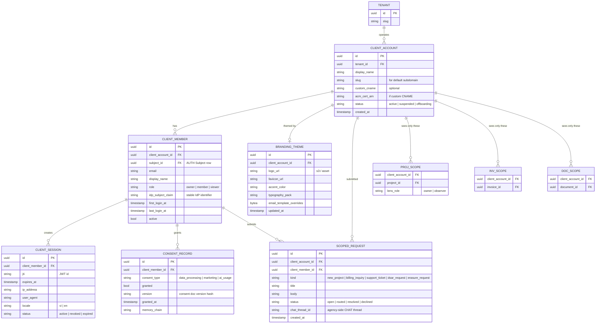
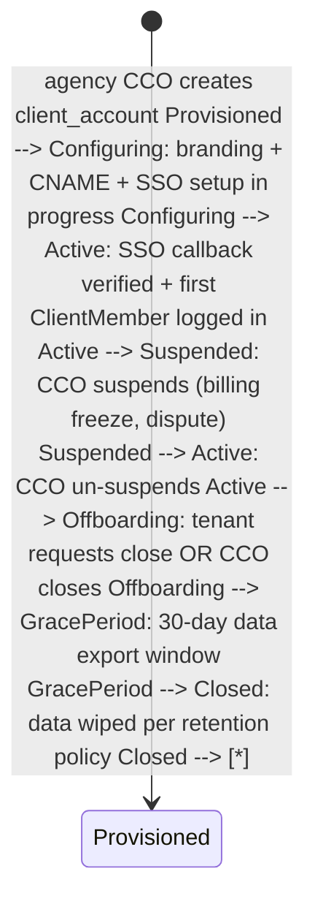

PORTAL is CyberOS's **white-labelled client-facing surface**. A tenant's customers log in at `clients.<tenant>.cyberos.world` or at their own CNAME (e.g. `portal.acmecorp.com`) and see a portal that looks like the agency's brand: logo, colours, typography, sub-brand accents per (task pending). The data plane is a permission-narrowed lens on the underlying agency data: PROJ projects scoped to `this client`, INV invoices scoped to `this client`, DOC signed-docs scoped to `this client`, CHAT threads scoped to `this client`. Cross-tenant isolation in the shared infrastructure is enforced at three layers: Postgres RLS, Apollo Router scope checks, and per-bucket S3 prefix ACLs. Authentication is via SSO from the client's IdP (SAML 2.0 or OIDC); ClientMembers are mapped to internal Subject rows via JIT provisioning at first login. A branded client AI assistant - a CUO variant - has the client's project history pre-loaded and answers grounded questions with citations. Client-initiated workflows (new project request, billing inquiry, support ticket) materialise as CHAT threads on the agency side, automatically routed to the right AM. Vietnamese + English UI; multi-currency rendering for international clients.

## At a glance

| Item | Detail |
|---|---|
| Status | Planned - P4 long-term |
| Subdomain | clients.{t}.cyberos.world + CNAME white-label |
| SSO | SAML 2.0 + OIDC; JIT provisioning |
| Data lens | PROJ, INV, DOC, CHAT - scoped read-only |
| AI assistant | branded CUO with project history context |
| i18n | vi + en; multi-currency display |
| PWA | install supported; mobile-first |
| Depends on | AUTH, memory, 4 modules + CDN, TLS, S3 |

## The bigger picture - three strategic roles

PORTAL is the second front-door. The agency uses CyberOS; their clients use PORTAL. The architectural challenge is multi-tenant-within-multi-tenant: PORTAL must isolate each client's view from sibling clients, share data with the agency's CyberOS surface where appropriate, and never accidentally leak. Sync_class=client-visible is the per-row filter that gates every read.

**Role 1 - Scoped read-only views.** PROJ + INV + DOC + CHAT filtered per Engagement membership. Client sees: PROJ Projects where their Engagement(s) is the parent + sync_class=client-visible; INV invoices for their Engagement; DOC contracts they're party to; CHAT threads they're a member of. RLS at Postgres + sync_class filter at retrieval enforces isolation. The branded CUO grounds answers in only the scope above (KB ACL-aware retrieval pattern).

**Role 2 - Per-tenant brand pack.** White-label theme + custom CNAME. Each agency tenant ships a brand pack: logo, primary/accent colours, font family, custom CNAME, email template overrides. The PORTAL frontend reads the brand pack at session init and themes the entire UI. Clients see the agency's brand, not "Powered by CyberOS" (unless the agency opts in). Brand pack versioned per tenant; CDN cache busts on update.

**Role 3 - External IdP integration.** Client logs in via own SAML/OIDC; JIT provisioning. Clients use their own IdP (Okta, Azure AD, Google Workspace, Auth0). PORTAL accepts SAML 2.0 + OIDC; JIT-provisions ClientMember on first login with attribute-mapped role; never stores password. Per-agency tenant config maps IdP claims to PORTAL roles. Removing a user at the client's IdP transitively removes their PORTAL access (no orphan accounts).

### PORTAL multi-tenant-within-multi-tenant data flow

Diagram source (Mermaid, flattened during migration):

```mermaid
flowchart LR CLIENT["👤 ClientMember  
(at customer's IdP)"] IDP["🔐 Customer SAML/OIDC IdP"] PORTAL["🌐 PORTAL  
scoped view · brand pack · CUO"] AGENCY["🏢 Agency CyberOS tenant"] PROJ["📋 PROJ (filtered)"] INV["🧾 INV (filtered)"] DOC["✍ DOC (filtered)"] CHAT["💬 CHAT (filtered)"] memory["🧠 memory  
sync_class=client-visible only"] CLIENT --> IDP IDP --> PORTAL PORTAL --> PROJ PORTAL --> INV PORTAL --> DOC PORTAL --> CHAT PROJ --> AGENCY INV --> AGENCY DOC --> AGENCY CHAT --> AGENCY PORTAL -. "client-visible only" .-> memory classDef hub fill:#ffe4e6,stroke:#9f1239,stroke-width:3px,color:#500724 classDef mod fill:#e0e7ff,stroke:#3730a3 classDef ext fill:#fee2e2,stroke:#b91c1c classDef memory fill:#fef6e0,stroke:#9c750a class PORTAL hub class AGENCY,PROJ,INV,DOC,CHAT mod class CLIENT,IDP ext class memory memory
```

### Auto vs human-in-loop operations matrix

Operation| How it happens| Why this split
---|---|---
Client login (SSO)| **Auto** via external IdP| Customer manages own identity lifecycle.
JIT user provisioning| **Auto** at first login| Attribute-mapped role; new ClientMember created.
Scoped view query| **Auto** with RLS + sync_class filter| Protocol-level guarantee of isolation.
Brand-pack apply| **Auto** at session init| Cached CDN; pack version stamped.
Client AI assistant query| **Auto** CUO grounded in scoped data| Same KB/CUO infrastructure; ACL-aware retrieval.
Pay invoice (PSP redirect)| **Manual** client click -> external PSP| Payment flow exits PORTAL to Stripe/VietQR.
File new project request| **Manual** client form -> creates CHAT thread on agency side| Request becomes work for the agency.
DSAR export request| **Auto** bundle on client request| Per-client subject; chained audit; PDPL/GDPR compliant.
Brand-pack update| **Manual** agency admin action| Brand changes intentional; CDN cache bust auto-triggered.
Client user removal| **Auto** on IdP removal (deprovision flow)| SCIM 2.0 sync if customer supports; otherwise next-login deny.

## Why PORTAL exists

Consultancies maintain an awkward parallel reality: project status lives in Linear (which the client can't see), invoices live in Xero / QuickBooks (also closed), signed contracts live in DocuSign (separate login per agreement), and the client gets emailed PDFs and Loom links. The client wants one place to log in and see "what is going on with our account?" - and the agency wants that place to feel like the agency's brand, not a generic SaaS dashboard. PORTAL is that place. It is the same data the agency operates from, viewed through a permission-narrowed and brand-tinted lens.

- **White-label by default:** Logo, colour accents, custom CNAME, branded email templates. The portal looks like an extension of the agency, not a third-party tool.
- **Tenant isolation by construction:** Postgres RLS by tenant_id x client_account_id; Apollo Router scope-required directive on every field; S3 bucket prefix scoped per client. Three layers of fail-safe.
- **Branded AI assistant:** A client variant of CUO with the project history loaded. "What's our SOW spend so far?" returns a grounded answer with INV citations.

The bet is that a portal that surfaces the same data the agency operates from - rather than a Notion page someone has to remember to keep updated - increases client retention because trust is built in transparency, and reduces inbound "what's the status of X" emails because the answer is one click and one branded AI prompt away.

## What it does - 5W1H2C5M

A structured decomposition of PORTAL's scope.

Axis| Question| Answer
---|---|---
**5W - What**| What is PORTAL?| A second front-door for clients. Branded read-narrowed views of PROJ + INV + DOC + CHAT; client-initiated workflow channels; branded CUO AI assistant; SSO from client IdP; custom-domain CNAME.
**5W - Who**| Who uses it?| **ClientMembers:** the customer's people (CEO, project sponsor, billing contact). **Agency CCO:** owns portal configuration per client. **Agents:** branded CUO answers grounded questions with citations; CCO-skill summarises client signals across portals.
**5W - When**| When does it run?| Continuous. Real-time WebSocket for project status updates and signing-notification deeplinks. Branded email digests on a per-client schedule.
**5W - Where**| Where does it run?| P4: multi-region edge (CloudFront / Vercel) for the static SPA; SG-1 + VN-hanoi-1 for the API. Custom CNAMEs terminate at edge with per-tenant ACM certs.
**5W - Why**| Why a separate module?| Because the auth surface, the brand-theme system, the data-lens narrowing, and the client AI assistant differ enough from internal CyberOS that compositing them into the main app would muddy both. PORTAL is a focused product for a focused audience.
**1H - How**| How does it work?| SSO at edge resolves ClientMember -> Subject row -> scope contract grants narrowed to `client_account_id`. Federated GraphQL queries are predicate-narrowed by Apollo Router at request time. Branded SPA reads a tenant.branding config; custom CNAME terminates at edge.
**2C - Cost**| Cost budget?| P4: edge-served static SPA ($5/mo CloudFront); per-tenant ACM cert ($0). API: ~$20 / month per active client account at low traffic. Branded email templates pass through SES.
**2C - Constraints**| Constraints?| (a) zero cross-tenant data leakage - three-layer enforcement. (b) ClientMember access is read-only on tenant data; write only on their own consents / requests (task pending). (c) Every portal action audited to memory (task pending). (d) PDPL Art. 14 + GDPR Art. 15 DSAR for ClientMembers. (e) Vietnamese-localised UI.
**5M - Materials**| Stack?| Rust 1.81, axum (API), Next.js + React + Tailwind (SPA), CloudFront / Vercel edge, ACM for per-tenant TLS, S3 for theme assets, SAML / OIDC libraries, OpenTelemetry.
**5M - Methods**| Method choices?| Predicate-narrowing at Apollo Router (every field has @requiresScopes + tenant + client_account predicate). JIT user provisioning at SSO callback. Branded CUO is a thin wrapper on the main CUO with persona-stamped scope.
**5M - Machines**| Deployment?| Edge SPA + multi-region API. Per-tenant ACM cert auto-issued and renewed on CNAME claim. PWA service worker for offline-tolerant read views.
**5M - Manpower**| Who maintains?| 0.5 FTE at P4. CCO seat owns product surface; CTO owns brand-theming engine; CSO owns isolation invariants.
**5M - Measurement**| How measured?| (NFR pending) zero tenant data leakage, (NFR pending) TTFB p95 <= 500 ms at edge, KPI client-login MAU per tenant.

## Architecture

PORTAL is two surfaces: an edge-served Next.js SPA per tenant brand, and a Rust API that materialises the data-lens at request time. SSO callback creates / refreshes a ClientMember -> Subject mapping and issues a scoped JWT. Federated GraphQL queries are scope-narrowed by Apollo Router.

Diagram source (Mermaid, flattened during migration):

```mermaid
graph TB subgraph CLIENT ["Client environment"] BROWSER["Client browser  
portal.acmecorp.com"] PWA["PWA install"] IDP["Client IdP  
(Okta / Azure AD / GSuite)"] end subgraph EDGE ["Edge"] CDN["CloudFront / Vercel  
edge SPA delivery"] ACM["Per-tenant ACM cert"] ROUTER["Apollo Router  
scope predicate"] end subgraph PORTAL ["PORTAL service (Rust · axum)"] SSO_S["sso.rs  
SAML + OIDC callback"] PROVISION["provision.rs  
JIT ClientMember"] LENS["lens.rs  
data-narrowing layer"] BRAND["brand.rs  
theme config + CNAME issuance"] AI_PROXY["ai_proxy.rs  
branded CUO wrapper"] WF["workflow.rs  
client-initiated requests"] AUDIT["audit_bridge.rs"] end subgraph SCOPED_VIEWS ["Scoped read-only lenses"] PROJ_L["📋 PROJ lens  
client_account_id filter"] INV_L["💰 INV lens"] DOC_L["✍️ DOC lens"] CHAT_L["💬 CHAT lens"] end subgraph STORES ["Stores"] PG[("PostgreSQL 16  
client_account · client_member  
branding · session  
scoped_request")] S3[("S3  
theme assets (logo / favicon)")] KMS[("KMS")] end subgraph AGENCY ["Agency side"] CHAT_A["💬 CHAT  
incoming thread"] CUO_A["🧠 CUO  
route to AM"] memory["🧠 memory  
portal.* rows"] OBS["👁 OBS"] end BROWSER --> CDN PWA --> CDN CDN --> ACM CDN --> ROUTER BROWSER --> IDP IDP --> SSO_S SSO_S --> PROVISION PROVISION --> PG ROUTER --> LENS LENS --> PROJ_L LENS --> INV_L LENS --> DOC_L LENS --> CHAT_L BRAND --> S3 BRAND --> ACM BROWSER --> AI_PROXY AI_PROXY --> CUO_A WF --> CHAT_A CHAT_A --> CUO_A CUO_A --> memory PORTAL --> AUDIT AUDIT --> memory PORTAL --> OBS classDef planned fill:#ffe4e6,stroke:#9f1239 classDef store fill:#f5f3ff,stroke:#7c3aed classDef sink fill:#f5ede6,stroke:#45210e class CDN,ACM,ROUTER,SSO_S,PROVISION,LENS,BRAND,AI_PROXY,WF,AUDIT,PROJ_L,INV_L,DOC_L,CHAT_L,CHAT_A,CUO_A planned class PG,S3,KMS store class memory,OBS sink
```

### Internal components

Component| Path (planned)| Responsibility
---|---|---
`sso.rs`| services/portal/src/sso.rs| SAML 2.0 + OIDC callback endpoints. Parses assertion, validates issuer, extracts attributes.
`provision.rs`| services/portal/src/provision.rs| Just-in-Time ClientMember provisioning. Creates Subject + ClientMember + ScopeContractGrant on first login.
`lens.rs`| services/portal/src/lens.rs| Data-lens narrowing layer. Wraps every federated query with a (tenant_id, client_account_id) predicate; rejects queries that try to escape.
`brand.rs`| services/portal/src/brand.rs| Branding config CRUD: logo URL, favicon, colour anchors, custom email-template overrides, CNAME claim + ACM cert issuance.
`cname.rs`| services/portal/src/cname.rs| CNAME validation. DNS TXT challenge for ownership verification; ACM cert request via AWS API; automatic renewal.
`theme.rs`| services/portal/src/theme.rs| Theme runtime: resolves brand config per request hostname; emits CSS variable bundle in HTML head.
`ai_proxy.rs`| services/portal/src/ai_proxy.rs| Branded CUO wrapper. Sets persona to `client-cuo` with scope narrowed to ClientMember context.
`workflow.rs`| services/portal/src/workflow.rs| Client-initiated workflow handlers. New-project request, billing inquiry, support ticket. Materialises CHAT thread on agency side.
`i18n.rs`| services/portal/src/i18n.rs| UI-string resolution. Default tenant locale + per-ClientMember override; currency localisation.
`email.rs`| services/portal/src/email.rs| Branded transactional email. Per-tenant template overrides; SES via tenant FROM with SPF/DKIM.
`consent.rs`| services/portal/src/consent.rs| Client consents (data-processing, marketing, AI usage). Write-allowed for the ClientMember on their own row only.
`dsar.rs`| services/portal/src/dsar.rs| DSAR / right-to-erasure surface for the ClientMember's own data; 30-day grace before destructive delete.
`audit_bridge.rs`| services/portal/src/audit_bridge.rs| memory canonical writer. Every portal action: login, view, request, consent, dsar.
`migrations/`| services/portal/migrations/| sqlx migrations. RLS by (tenant_id, client_account_id). Per-tenant brand config schema.

**PORTAL-INV-001 - Cross-tenant data leakage MUST be zero.** Three-layer fail-safe: (1) PostgreSQL RLS keyed by (tenant_id, client_account_id) on every relevant table; (2) Apollo Router @requiresScopes + predicate-narrowing on every GraphQL field; (3) S3 prefix-scoped IAM for asset access. CI gate: cross-tenant + cross-client-account read attempts via property-based fuzz. Production gate: SOC 2 CC6.1 + annual pen-test cover this explicitly. Verification: `services/portal/tests/isolation_invariant.rs`.

## Data model

PORTAL owns six primitives: ClientAccount (the customer organisation), ClientMember (the customer's people), BrandingTheme (per-client visual config), ClientSession (active session), ScopedData (cached lens output), ConsentRecord (data-processing consents), ScopedRequest (client-initiated workflow).

Diagram source (Mermaid, flattened during migration):



### Predicate-narrowing in Apollo Router

```yaml
# router-portal.yaml
authorization:
 require_authentication: true
 preview_directives:
 enabled: true

# Every read of an upstream resource is rewritten:
# query Project(id: ID!)
# becomes (via plugin):
# query Project(id: ID!) {
# project(id: $id, _portal_scope: { tenant_id: $jwt.tenant, client_account_id: $jwt.client_account })
# }
# The subgraph SDL declares _portal_scope as a required argument when invoked with `aud: portal`.

# Three-layer fail-safe:
# 1. Predicate-narrowing here at the Router
# 2. RLS at Postgres (tenant_id × client_account_id)
# 3. Field-level @requiresScopes(scopes: [["portal.read"]])
```

## API surface

Federated GraphQL subgraph for the SPA, REST endpoints for SSO + CNAME ops, MCP tools for the branded AI assistant.

### GraphQL subgraph (federated, audience=portal)

```graphql
extend schema
 @link(url: "https://specs.apollo.dev/federation/v2.5", import: ["@key", "@external", "@shareable", "@requiresScopes"])

type ClientAccount @key(fields: "id") {
 id: ID!
 displayName: String!
 customCname: String
 branding: BrandingTheme
 members: [ClientMember!]! @requiresScopes(scopes: [["portal.admin"]])
}

type ClientMember @key(fields: "id") {
 id: ID!
 email: String!
 displayName: String!
 role: ClientMemberRole!
 lastLoginAt: DateTime
}

type BrandingTheme {
 logoUrl: String
 faviconUrl: String
 accentColor: String!
 typographyPack: String!
}

type ScopedRequest @key(fields: "id") {
 id: ID!
 kind: RequestKind!
 title: String!
 body: String!
 status: RequestStatus!
 createdAt: DateTime!
 chatThreadId: ID
}

type ConsentRecord {
 consentType: ConsentType!
 granted: Boolean!
 version: String!
 grantedAt: DateTime!
}

enum ClientMemberRole { OWNER MEMBER VIEWER }
enum RequestKind { NEW_PROJECT BILLING_INQUIRY SUPPORT_TICKET DSAR_REQUEST ERASURE_REQUEST }
enum RequestStatus { OPEN ROUTED RESOLVED DECLINED }
enum ConsentType { DATA_PROCESSING MARKETING AI_USAGE }

# Federated lenses (read-only, scope-narrowed automatically):
extend type Project @key(fields: "id") {
 id: ID! @external
 # only fields visible from portal:
 name: String! @external
 status: String! @external
 milestones: [Milestone!]! @external
 # comments restricted: client can read AM-posted comments, post their own
}

extend type Invoice @key(fields: "id") {
 id: ID! @external
 amount: Float! @external
 currency: String! @external
 status: String! @external
 payLink: String @external
}

extend type Document @key(fields: "id") {
 id: ID! @external
 name: String! @external
 status: String! @external
 signerLink: String # personalised for the ClientMember
}

type Query {
 me: ClientMember! @requiresScopes(scopes: [["portal.read"]])
 myAccount: ClientAccount! @requiresScopes(scopes: [["portal.read"]])
 myProjects: [Project!]! @requiresScopes(scopes: [["portal.read"]])
 myInvoices: [Invoice!]! @requiresScopes(scopes: [["portal.read"]])
 myDocuments: [Document!]! @requiresScopes(scopes: [["portal.read"]])
 myRequests: [ScopedRequest!]! @requiresScopes(scopes: [["portal.read"]])
}

type Mutation {
 submitRequest(input: ScopedRequestInput!): ScopedRequest!
 @requiresScopes(scopes: [["portal.write_request"]])
 grantConsent(consentType: ConsentType!, version: String!): ConsentRecord!
 @requiresScopes(scopes: [["portal.write_consent"]])
 revokeConsent(consentType: ConsentType!): ConsentRecord!
 @requiresScopes(scopes: [["portal.write_consent"]])
 requestDsarExport: ScopedRequest! @requiresScopes(scopes: [["portal.dsar"]])
 requestErasure: ScopedRequest! @requiresScopes(scopes: [["portal.erasure"]])
 updateLocale(locale: String!): ClientMember! @requiresScopes(scopes: [["portal.read"]])
}
```

### REST endpoints

Method| Path| Purpose
---|---|---
GET| `/portal/.well-known/saml-metadata`| SAML 2.0 metadata for the client's IdP.
POST| `/portal/sso/saml/acs`| SAML assertion consumer URL.
GET| `/portal/sso/oidc/callback`| OIDC callback.
POST| `/portal/branding`| Update branding theme. CCO scope.
POST| `/portal/branding/cname`| Claim custom CNAME (TXT challenge issued).
GET| `/portal/branding/cname/{id}/verify`| Verify CNAME TXT + request ACM cert.
GET| `/portal/assets/{theme_id}/logo`| Serve logo (CDN-cached).
POST| `/portal/dsar/export`| Generate DSAR bundle.
POST| `/portal/erasure/confirm`| Confirm erasure after 30-day grace.

### MCP tool catalogue (branded CUO)

Tool name| Inputs| Outputs| Annotations
---|---|---|---
`cyberos.portal.my_projects`| -| Project| readonly, scope=portal.read
`cyberos.portal.project_status`| project_id| {milestones, comments}| readonly
`cyberos.portal.invoice_summary`| year?| {outstanding, paid, ...}| readonly
`cyberos.portal.submit_request`| kind, title, body| {ok, request_id}| scope=portal.write_request, human-confirm
`cyberos.portal.grant_consent`| consent_type, version| {ok}| scope=portal.write_consent
`cyberos.portal.dsar_request`| -| {request_id}| scope=portal.dsar, email-confirm
`cyberos.portal.find_doc`| name_match| Document| readonly

## Key flows

### Flow 1 - Client SSO login (Okta SAML)

```mermaid
sequenceDiagram autonumber participant U as Acme PM (browser) participant CDN as edge CDN (portal.acmecorp.com) participant IDP as Acme Okta IdP participant S as sso.rs participant P as provision.rs participant AUTH as 🔐 AUTH participant PG as PostgreSQL participant B as 🧠 memory U->>CDN: GET portal.acmecorp.com CDN-->>U: branded SPA (theme: acme) U->>S: GET /portal/login → redirect to Acme Okta S-->>IDP: SAML AuthnRequest IDP-->>U: Acme SSO form U->>IDP: authenticate IDP-->>S: SAML assertion (POST /portal/sso/saml/acs) S->>S: validate issuer, signature, audience S->>P: provision_if_needed(idp_subject_claim, attributes) P->>PG: SELECT client_member WHERE idp_subject_claim alt new ClientMember P->>AUTH: createSubject(kind=human, tenant=acme) P->>PG: INSERT client_member, scope_contract_grant P->>B: append client_member.provisioned row else returning ClientMember P->>PG: UPDATE last_login_at end S->>AUTH: token_exchange → portal-scoped JWT AUTH-->>S: access_token (aud=portal, scope=portal.read..., tenant, client_account) S->>B: append portal.login row {ip, ua, method:saml} S-->>U: 302 to / with JWT in cookie U->>CDN: GraphQL queries with predicate-narrowing
```

### Flow 2 - View project (permission-scoped)

```mermaid
sequenceDiagram autonumber participant U as Acme PM participant SPA as portal SPA participant AR as Apollo Router (audience=portal) participant L as lens.rs (predicate-narrow) participant PROJ as 📋 PROJ subgraph participant PG as PostgreSQL (RLS) U->>SPA: open /projects SPA->>AR: query myProjects AR->>AR: verify JWT aud=portal, scope=portal.read AR->>L: inject (tenant_id, client_account_id) predicate L->>PROJ: query projects(_portal_scope: {…}) PROJ->>PG: SELECT … FROM project  
WHERE tenant_id=$t AND client_account_id=$c (RLS additionally enforces this) PG-->>PROJ: rows (scoped) PROJ-->>L: results L-->>AR: scoped result AR-->>SPA: data SPA-->>U: rendered "My projects" — only Acme work
```

Three-layer fail-safe: Apollo Router scope check, Router predicate-narrowing, Postgres RLS. A single misconfigured layer is caught by the other two.

### Flow 3 - Client submits a support ticket

```mermaid
sequenceDiagram autonumber participant U as Acme PM participant SPA as portal SPA participant W as workflow.rs participant CHAT as 💬 CHAT (agency) participant CUO as 🧠 CUO router participant AM as Account Manager participant B as 🧠 memory U->>SPA: "New support ticket → My SOW is missing milestone 3" SPA->>W: submitRequest(kind=support_ticket, title, body) W->>CHAT: create thread in agency CHAT, channel = #acme-portal CHAT-->>W: thread_id W->>PG: INSERT scoped_request {kind, chat_thread_id, status=routed} W->>CUO: route the new thread CUO->>CUO: identify owning AM (CRM.account.am_owner) CUO->>AM: notify "New portal request from Acme PM (Jane Doe)" W->>B: append portal.request_submitted row W-->>SPA: "Ticket #SR-001234 opened" SPA-->>U: confirmation + ETA
```

### Flow 4 - Branded client AI assistant (CUO with context)

```mermaid
sequenceDiagram autonumber participant U as Acme PM participant SPA as portal SPA "Ask" participant A as ai_proxy.rs participant CUO as 🧠 CUO (persona=client-cuo) participant AI as 🧠 AI gateway participant LENS as lens.rs (read context only Acme data) participant PROJ as 📋 PROJ participant INV as 💰 INV participant B as 🧠 memory U->>SPA: "What's our SOW spend so far this quarter?" SPA->>A: prompt + ClientMember context A->>CUO: invoke with persona=client-cuo, scope=portal.read CUO->>LENS: pull context (scoped to Acme client_account) LENS->>PROJ: scoped query: active projects, milestones LENS->>INV: scoped query: paid + outstanding YTD PROJ-->>LENS: rows INV-->>LENS: rows CUO->>AI: generate answer with citations to INV-2026-0421, INV-2026-0488 AI-->>CUO: grounded paragraph + citations CUO->>B: append portal.ai_answer row {answer, citations} CUO-->>SPA: answer rendered with branded UI SPA-->>U: "You've spent $84,200 of the $120k SOW this quarter…"
```

The branded CUO is the same CUO process with persona=client-cuo and scope narrowed. It can only see this client's data; queries that try to escape the lens return zero results without surfacing the existence of other tenants.

### Flow 5 - White-label CNAME claim + ACM cert

```mermaid
sequenceDiagram autonumber participant CCO as Agency CCO participant SPA as agency admin participant B_S as brand.rs participant C as cname.rs participant DNS as customer DNS participant ACM as AWS ACM participant CDN as CloudFront / Vercel participant BR as 🧠 memory CCO->>SPA: enter desired CNAME "portal.acmecorp.com" SPA->>B_S: claim CNAME for client_account=acme B_S->>C: issue TXT challenge nonce C-->>SPA: "Add TXT _cyberos-challenge.portal.acmecorp.com = $nonce" CCO->>DNS: configure TXT record at Acme DNS CCO->>SPA: click "Verify" SPA->>C: verify TXT C->>DNS: DNS-over-HTTPS lookup DNS-->>C: nonce found ✓ C->>ACM: request cert for portal.acmecorp.com (DNS-validated) ACM-->>DNS: ACM challenge TXT CCO->>DNS: add ACM challenge TXT ACM-->>C: cert issued (cert_arn) C->>CDN: attach cert to distribution C->>BR: append branding.cname_activated row C-->>SPA: "portal.acmecorp.com is live"
```

## Client-account lifecycle

A ClientAccount traverses four states from provisioning to closed. ClientMember provisioning is JIT on first SSO callback.



### Per-state actions

State| Trigger| Side-effects
---|---|---
Provisioned| CCO creates ClientAccount| Default subdomain assigned; default branding applied; audit row.
Configuring| SSO setup + branding upload| SAML metadata exposed; ACM cert requested (if CNAME).
Active| First successful ClientMember SSO callback| Portal usable; data-lens active; AI assistant enabled.
Suspended| CCO action| ClientMember login refused; existing JWTs revoked; SSO returns soft "account paused" UI.
Offboarding| Tenant or CCO close| ClientMember can still log in for 30 days; banner "account closing on YYYY-MM-DD"; DSAR export tooling surfaced.
GracePeriod| Day 1 of 30-day window| Read-only; export bundle pre-generated; emails sent to all ClientMembers.
Closed| Day 30 of grace| Data wiped per retention policy; audit row retained; CNAME / ACM cert released.

## Functional requirements

The CyberOS task catalogue is being rebuilt one feature at a time via the open [task-author](https://github.com/cyberskill/cyberos/tree/main/modules/skill/task-author) Agent Skill.

Previous task enumerations were archived 2026-05-14 and are no longer reflected on this page. Specific tasks land here as they are re-authored.

## Non-functional requirements

PORTAL NFRs focus on tenant isolation and edge-served performance.

NFR ID| Concern| Target| Measurement
---|---|---|---
(NFR pending)| Cross-tenant data leakage incidents| = 0| property fuzz + annual pen-test
(NFR pending)| Cross-client-account leakage (within same tenant)| = 0| RLS verification harness + CI gate
(NFR pending)| SAML assertion replay| = 0| NotOnOrAfter + InResponseTo enforced
(NFR pending)| TTFB p95 (edge) for branded SPA| <= 500 ms (global)| RUM + Lighthouse
(NFR pending)| myProjects GraphQL p95| <= 350 ms| k6 + Apollo Router
(NFR pending)| CNAME claim -> first served request (cold)| <= 5 min (ACM cert issuance)| end-to-end test
(NFR pending)| Portal availability (28-day)| >= 99.95%| SLO monitor
(NFR pending)| Mobile Lighthouse score| >= 90 (perf)| nightly Lighthouse run
(NFR pending)| PWA install rate| tracked KPI| OBS
(NFR pending)| WCAG 2.1 AA compliance| full coverage| axe-core audit
(NFR pending)| Per-client infra cost| <= $20 / mo at typical load| monthly billing

## Dependencies

PORTAL depends on AUTH, memory, and federated subgraphs from PROJ, INV, DOC, CHAT, CRM. AWS ACM + CloudFront for edge TLS + CNAME.

Diagram source (Mermaid, flattened during migration):

```mermaid
graph LR subgraph upstream ["PORTAL depends on"] AUTH["🔐 AUTH  
SSO + scope"] memory["🧠 memory  
audit chain"] OBS["👁 OBS"] PROJ["📋 PROJ subgraph"] INV["💰 INV subgraph"] DOC["✍️ DOC subgraph"] CHAT["💬 CHAT subgraph"] CRM["🏢 CRM  
account ownership"] AI["🧠 AI Gateway  
branded CUO"] ACM["AWS ACM"] CDN["CloudFront / Vercel"] S3_T["S3 (theme assets)"] end PORTAL["🌐 PORTAL"] subgraph downstream ["Used by"] CM["Client Members  
(end users)"] AM["Agency AMs  
(receive requests)"] DASH["📊 OBS dashboards"] end AUTH --> PORTAL memory --> PORTAL OBS --> PORTAL PROJ --> PORTAL INV --> PORTAL DOC --> PORTAL CHAT --> PORTAL CRM --> PORTAL AI --> PORTAL ACM --> PORTAL CDN --> PORTAL S3_T --> PORTAL PORTAL --> CM PORTAL --> AM PORTAL --> DASH classDef planned fill:#ffe4e6,stroke:#9f1239 class AUTH,memory,OBS,PROJ,INV,DOC,CHAT,CRM,AI,PORTAL,CM,AM,DASH,ACM,CDN,S3_T planned
```

## Compliance scope

PORTAL is in the SOC 2 / ISO 27001 isolation hotspot and inherits client-data DSAR obligations.

Regulation / standard| Article / clause| PORTAL feature that satisfies it
---|---|---
Vietnam PDPL (Law 91/2025)| Art. 14 - DSAR| Client-side DSAR export (task pending).
Vietnam PDPL| Art. 13 - Consent| ConsentRecord per ClientMember per consent_type.
GDPR (EU 2016/679)| Art. 15 - Right of access| Same surface as PDPL.
GDPR| Art. 17 - Right to erasure| Self-service erasure with 30-day grace (task pending).
GDPR| Art. 7 - Conditions for consent| Versioned consent doc hash; ConsentRecord captures version.
SOC 2 Type II| CC6.1 - Logical access| SAML / OIDC SSO; RBAC; ClientMember role tiers.
SOC 2 Type II| CC6.6 - Restricted access| Three-layer predicate-narrowing + RLS + scope check.
ISO/IEC 27001:2022| A.5.30 - ICT readiness for business continuity| Edge CDN failover; multi-region API.
ISO/IEC 27018| Privacy for PII in public cloud| Tenant isolation invariants + per-tenant ACM cert.
WCAG 2.1 AA| Accessibility standard| Branded SPA meets AA per axe-core audit.
OWASP ASVS L2| Application Security Verification Standard| SAML/OIDC verification checklist; XSS protection in branded content.

## Risk entries

PORTAL-specific risks in the [risk register](../../reference/risk-register.html#portal).

ID| Risk| Likelihood| Impact| Owner| Mitigation
---|---|---|---|---|---
`R-PORTAL-001`| Information disclosure - tenant client sees another tenant's data| Medium| Catastrophic| CSO| Three-layer fail-safe: predicate-narrowing + RLS + scope; CI cross-tenant gate; pen-test pre-launch + annual.
`R-PORTAL-002`| Cross-client-account leak within same tenant| Low| High| CSO| RLS by (tenant_id, client_account_id); GraphQL predicate enforced.
`R-PORTAL-003`| SAML assertion forgery / replay| Low| High| CSO| InResponseTo + NotOnOrAfter; assertion signature validated; relay-state CSRF token.
`R-PORTAL-004`| XSS via branded content (logo URL, accent color)| Medium| Medium| CTO| Strict CSP; logo URL allow-list (s3:/ only); colour values validated as hex.
`R-PORTAL-005`| Custom CNAME hijack (subdomain takeover after CNAME drop)| Medium| High| CSO| Active CNAME verification every 24h; alert on TXT drop; auto-suspend on hijack signal.
`R-PORTAL-006`| ClientMember provisioning explosion via SSO attribute spam| Low| Medium| CSO| Rate-limit per (tenant, idp_subject); auto-suspend tenant on abuse threshold; CCO notification.
`R-PORTAL-007`| Branded CUO leaks cross-tenant context via prompt injection| Medium| High| CSO| CaMeL enforcement; persona-stamped JWT cannot escalate; scope-narrowing at AI gateway.
`R-PORTAL-008`| DSAR / erasure abuse - automated bot triggers mass-erasure| Low| Medium| DPO| Email-confirmation step; 30-day grace; tenant CCO can pause if abuse detected.
`R-PORTAL-009`| ACM cert expiry / renewal failure| Low| Medium| CTO| Auto-renewal monitored; OBS alert 14d before expiry; manual override path.
`R-PORTAL-010`| Customer-MCP external-agent over-scope| Medium| Medium| CSO| Per-tool consent gate; scope explicit per tool; revocable; audit trail.
`R-PORTAL-011`| Sync_class filter misconfiguration -> sibling-client data leaks| Low| Critical| CSO| Sync_class=client-visible enforced at retrieval pre-LLM; CI property test verifies cross-Engagement isolation; quarterly red-team.
`R-PORTAL-012`| JIT-provisioned ClientMember inherits wrong role from IdP claim mapping| Medium| Medium| CSO| Claim-mapping config audited by CSO per tenant; default role = lowest-privilege if mapping ambiguous; quarterly review.
`R-PORTAL-013`| Brand-pack accepts user-uploaded SVG -> XSS| Medium| High| CSO| SVG sanitiser strips scripts + event handlers; logo upload to dedicated S3 bucket with CDN no-exec policy.
`R-PORTAL-014`| Client AI assistant cites memory from a different client's project| Low| Critical| CSO| CUO scope-narrowed at AI Gateway by JWT scope_grants; cross-Engagement retrieval = 403; integration test asserts.
`R-PORTAL-015`| SCIM deprovision delay leaves removed-customer-user logged-in| Medium| Medium| CSO| Session invalidation on SCIM removal; max session lifetime 8h regardless; OBS alert if mismatch detected.

## KPIs

PORTAL health rolls up into 15 KPIs covering activation, isolation, AI usage, and DSAR fulfilment.

KPI| Formula| Source| Target
---|---|---|---
**Client-account activation rate**| `active / provisioned (within 14d)`| client_account| >= 80%
**Per-account MAU**| monthly active ClientMembers| OBS| tracked / tenant
**PWA install rate**| `installs / first-time visitors`| RUM| >= 15%
**Branded CUO answer rate**| `queries / MAU`| OBS| >= 3 / MAU / mo
**Branded CUO citation rate**| `cited_answers / total`| OBS| = 100%
**Scoped requests opened / mo**| count| scoped_request| tracked
**Scoped request resolution time p95**| histogram| OBS| <= 48 h
**Isolation probes failed**| cross-tenant CI gate| CI| = 0
**DSAR fulfilment p95**| request -> bundle delivery| OBS| <= 30 d (PDPL/GDPR)
**Custom-CNAME adoption**| `client_account.custom_cname IS NOT NULL count`| client_account| tracked / tenant
**Sync_class filter pass rate**| queries with sync_class filter applied / total queries| retrieval audit| = 1.0 (hard floor)
**JIT-provisioned ClientMember role accuracy**| JIT-mapped roles correctly matching intent / total provisioned| quarterly CSO audit| >= 0.99
**SVG-upload XSS attempts blocked**| sanitiser rejections / total uploads| OBS| tracked; spike = active probing
**Cross-Engagement retrieval rejection rate**| 403 cross-Engagement responses / total CUO queries| AI Gateway audit| tracked; sustained > 0 = misconfig
**SCIM deprovision session-invalidation p95**| histogram (SCIM remove -> session killed)| OBS| <= 30 s

## RACI matrix

PORTAL is owned by the CCO seat (customer-facing surface) with CPO for product, CTO for engineering, CSO for isolation.

Activity| CEO| CCO| CPO| CTO| CSO| DPO
---|---|---|---|---|---|---
Service design + spec| A| R| R| C| C| C
Implementation| I| C| C| A/R| C| I
Branding policy per client| C| A/R| C| I| I| I
CNAME + ACM cert ops| I| C| I| A/R| C| I
SSO setup per client| I| R| I| R| A| I
Isolation invariant validation| I| I| I| R| A/R| C
DSAR / erasure fulfilment (portal)| I| C| I| C| C| A/R
Client-MCP consent policy| I| C| R| C| A| C

R = Responsible, A = Accountable, C = Consulted, I = Informed.

## Planned CLI surface

Admin CLI `cyberos-portal` for tenant CCO operators.

### 1. Provision a Client Account

```
$ cyberos-portal account create \
 --name "Acme Corp" --slug acme \
 --owner-email pm@acmecorp.com

[account created] client_account_id=CA-002104
[default subdomain] clients.cyberskill.cyberos.world/acme
[next steps] configure SSO + (optional) custom CNAME
```

### 2. Apply branding

```
$ cyberos-portal brand set \
 --account CA-002104 \
 --logo s3:/cyberos-tenant-assets/cyberskill/acme-logo.svg \
 --accent "#00A37C" \
 --typography "Inter"

[branding applied] theme_id=BT-009488
[preview] clients.cyberskill.cyberos.world/acme (refresh hard-reload)
```

### 3. Claim a custom CNAME

```
$ cyberos-portal cname claim --account CA-002104 --domain portal.acmecorp.com

[challenge issued]
 Add TXT record:
 name: _cyberos-challenge.portal.acmecorp.com
 value: 9f3a-7b2e-cc14-…
 Wait 5 min then verify:
 cyberos-portal cname verify --account CA-002104

$ cyberos-portal cname verify --account CA-002104
[txt found] ok
[acm request] cert_arn=arn:aws:acm:…:cert/…
[live in] ~ 3 min
```

### 4. Configure SSO (SAML)

```
$ cyberos-portal sso configure-saml \
 --account CA-002104 \
 --idp-metadata-url https://acme.okta.com/.well-known/saml-metadata

[saml configured]
 acs URL: https://portal.acmecorp.com/portal/sso/saml/acs
 audience: cyberos-portal-CA-002104
 attribute mapping: email, displayName, role
```

### 5. Invite ClientMember (no-SSO fallback)

```
$ cyberos-portal member invite \
 --account CA-002104 \
 --email cfo@acmecorp.com --role member

[invite sent] magic link → cfo@acmecorp.com (expires 14d)
```

### 6. List scoped requests

```
$ cyberos-portal requests list --account CA-002104 --status open

SR-009431 2026-05-12 support_ticket "SOW missing milestone 3" routed → AM=linh
SR-009447 2026-05-13 billing_inquiry "Q1 invoice variance" open
```

### 7. Offboard a Client Account

```
$ cyberos-portal account offboard --account CA-002104 --reason "engagement ended"

[grace period started] 30 days
[exports pre-generated] dsar bundle queued
[members notified] 5 emails sent
[scheduled wipe] 2026-06-14
```

### 8. Verify isolation invariant (CI)

```
$ cyberos-portal verify-isolation --tenant cyberskill --probes 1000

[probes] 1,000 cross-tenant + 1,000 cross-client-account
[leaks] 0
[passed] all three layers (router predicate + RLS + scope)
```

## Phase status & estimates

| Item | Detail |
|---|---|
| Status | Planned - P4 long-term |
| Est. LoC (Rust) | ~6,500 (services/portal) |
| Est. LoC (TS) | ~5,500 (branded Next.js SPA + PWA) |
| Planned tests | 110+ (incl. isolation property fuzz) |
| External libs | ~15 (saml-rs, openidconnect, acm sdk) |
| P4 budget | ~$120/mo (CDN + edge + multi-region API) |

Capability| Status
---|---
Subdomain-based branded portal| planned - P4
Custom CNAME + ACM cert auto-issuance| planned - P4
SAML 2.0 SSO| planned - P4
OIDC SSO| planned - P4
JIT ClientMember provisioning| planned - P4
Scoped read-only lenses (PROJ / INV / DOC / CHAT)| planned - P4
Branded CUO AI assistant| planned - P4
Client-initiated workflows -> CHAT thread| planned - P4
PWA + mobile-first responsive| planned - P4
Vietnamese + English i18n| planned - P4
Multi-currency display| planned - P4
Self-service DSAR export| planned - P4
Self-service right-to-erasure (30d grace)| planned - P4
External-customer MCP integration| planned - P4+
Isolation property fuzz in CI| planned - P4

## References

- **task catalogue** - PORTAL - Client portal. tasks 001..005.
- **Module spec** - Client portal subjects + isolation invariants.
- **Formal task mapping** - (task pending)..005 with verification methods.
- **Vietnam PDPL (Law 91/2025)** - Art. 13 (consent), 14 (DSAR).
- **GDPR (EU 2016/679)** - Art. 7 (consent), 15 (access), 17 (erasure).
- **SAML 2.0 Core (OASIS)** - assertion + protocol bindings.
- **OpenID Connect Core 1.0** - OIDC SSO surface.
- **OWASP ASVS L2** - Application Security Verification Standard.
- **WCAG 2.1 AA** - Web Content Accessibility Guidelines.
- **ISO/IEC 27018** - privacy for PII in public cloud.
- **SOC 2 Type II CC6.x** - Logical access & restriction controls.
- **Architecture context:** [infrastructure.html#portal](../../architecture/infrastructure.html#portal).
- **AUTH module** - [auth.html](../auth/index.html) - SSO + scope foundation.
- **PROJ module** - [proj.html](../proj/index.html) - scoped project view.
- **INV module** - [inv.html](../inv/index.html) - scoped invoice view.
- **DOC module** - [doc.html](../doc/index.html) - scoped signing surface.
- **CHAT module** - [chat.html](../chat/index.html) - request routing target.
- **TEN module** - [ten.html](../ten/index.html) - the SaaS-tenant layer above PORTAL.
- **Bigger picture (above):** 3 strategic roles + multi-tenant-within-multi-tenant diagram + 10-row auto-vs-human matrix.
- **memory auto-sync vision:** [MEMORY_AUTOSYNC_DESIGN.md §5](../../docs/MEMORY_AUTOSYNC_DESIGN.md) - PORTAL retrievals strictly filtered to sync_class=client-visible.
- **Build-readiness audit:** `archive/2026-05-14/AUDIT_AND_PLAN.md` (archived; see `cyberos/CHANGELOG.md`) - PORTAL at P3-start (current status P4 long-term).
- **task authoring discipline:** [modules/skill/task-audit/AUTHORING_DISCIPLINE.md](https://github.com/cyberskill/cyberos/blob/main/modules/skill/task-audit/AUTHORING_DISCIPLINE.md).

## Changelog

History lives in the [changelog](./changelog.html); this page describes only the current state.
