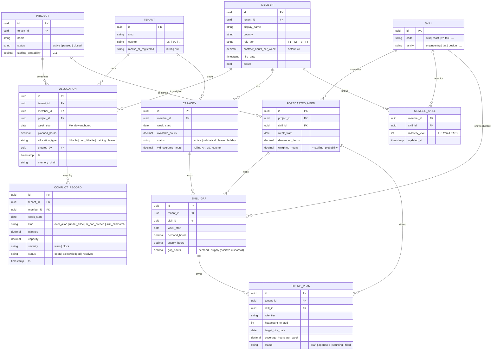
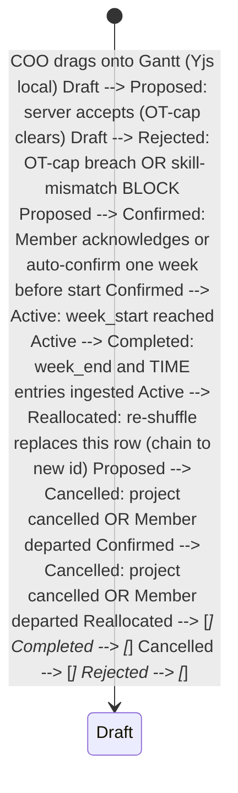

RES is CyberOS's **resource-planning surface** for a services org. It composes four data streams - HR's Member roster + contracts, PROJ's project timelines + estimates, TIME's actual hours logged, LEARN's per-Member skill mastery - into one read-canonical view: an Allocation matrix indexed by (Member, week). On top of that matrix sits four AI-assisted lenses: capacity-vs-forecast (where are we over- or under-booked?), allocation Gantt (drag-drop reshuffle with conflict feedback), hiring forecast (when do we need to add headcount of which level / skill?), and skills-gap heatmap (which skills are demanded vs supplied for the next 6 months?). The CSO/COO-skill emits Notify cards into Genie when an allocation crosses 110% (over-allocation) or drops below 60% (under-allocation for > 2 weeks). Vietnamese Labor Code 2019 Art. 107 overtime caps are enforced at the allocation-write boundary - a plan that would breach the cap is refused, not warned.

## At a glance

| Item | Detail |
|---|---|
| Status | Planned - P3, design phase |
| Data sources | 4 modules: HR, PROJ, TIME, LEARN |
| Default capacity | 40h / week, configurable per Member |
| OT cap (VN) | 200h / year; 300h with MoLISA registration |
| Over-alloc flag | > 110% (FR pending) |
| Under-alloc flag | < 60% (FR pending) |
| Depends on | HR, PROJ, TIME, LEARN + AUTH, memory, OKR (P3), OBS |
| Est. LoC | ~8,500 (Rust + TS Gantt SPA) |

## The bigger picture - three strategic roles

RES is the join module. It owns no primary data - every column on its Gantt comes from HR / PROJ / TIME / LEARN. What RES owns is the forecasting model, the rebalance recommendation engine, and the VN-labour-law cap enforcement. The COO checks RES at 09:00 ICT every Monday; the answer to "where are we over-booked, where are we under-utilised, what do we need to hire?" should be visible without clicking.

**Role 1 - Capacity-vs-forecast integrator.** Joins 4 modules on Member-id x week. HR contractual capacity (40h x Member x week, sabbatical-aware) joined to PROJ per-issue effort x Cycle (forecast demand), TIME actual hours (calibration), LEARN mastery (skill staffability). The Gantt shows the join; allocation bars compress when forecast exceeds capacity. RES is the integrator, not the source of truth - every cell traces back to its source module.

**Role 2 - Hiring forecast.** Skill-gap -> hire trigger before deliverables drop. LEARN mastery x PROJ pipeline demand x CRM deal probability -> forecasts senior-X gap N weeks out. A hiring memo draft (CUO/CHRO skill) triggers when the gap window < recruiting cycle time. HR receives the memo; CEO approves headcount. Senior shortage is the leading indicator that auditors of resource planning use; RES surfaces it before the deliverables miss.

**Role 3 - Allocation engine.** Rebalance recommendations, VN OT-cap hard-floor. CUO/COO drafts "move Linh from Project A to Project B for 2 weeks"; AM/COO confirms. The solver respects: VN Labour Code Art. 107 OT caps (200/300 h/year), skill mastery (cannot staff a senior task with junior), Engagement priority, and Member preference flags. Recommendations are proposals, never auto-executed; the audit row records why a plan was chosen.

### RES integration model

Diagram source (Mermaid, flattened during migration):

```mermaid
flowchart LR HR["👥 HR  
capacity · contract"] PROJ["📋 PROJ  
effort × cycles"] TIME["⏱ TIME  
actuals (calibration)"] LEARN["📈 LEARN  
mastery (staffability)"] CRM["🤝 CRM  
pipeline (deal × probability)"] RES["📅 RES  
Gantt · forecast · solver"] CUO["🎯 CUO  
cso/coo skill"] HRPLAN["📝 Hiring memo  
(when gap detected)"] ALLOC["📋 Rebalance proposal  
(AM/COO confirms)"] memory["🧠 memory audit"] HR --> RES PROJ --> RES TIME --> RES LEARN --> RES CRM --> RES RES --> CUO CUO --> HRPLAN CUO --> ALLOC RES --> memory classDef hub fill:#cffafe,stroke:#155e75,stroke-width:3px,color:#083344 classDef mod fill:#e0e7ff,stroke:#3730a3 classDef memory fill:#fef6e0,stroke:#9c750a class RES hub class HR,PROJ,TIME,LEARN,CRM,CUO,HRPLAN,ALLOC mod class memory memory
```

### Auto vs human-in-loop operations matrix

Operation| How it happens| Why this split
---|---|---
Capacity / demand join| **Auto** nightly| Deterministic; OBS shows freshness.
Over/under-allocation flag| **Auto** at 110% / 60% thresholds| Surface; never auto-acts.
VN Labour Code OT cap check| **Auto-block** at allocation propose| Hard floor; cannot propose plan that violates.
Rebalance proposal| **Auto** CUO draft; **manual** AM/COO confirm| Member workload changes; never algorithmic alone.
Hiring memo draft| **Auto** on gap-window detection| Draft is signal; CEO + CHRO decide headcount.
Member preference update| **Manual** Member sets| Member owns workload preferences (e.g. opt-out of OT, deep-work hours).
Forecast model retune| **Auto** on TIME calibration drift| Effort x actuals updates weighted moving average.
Skill-mastery filter| **Auto** from LEARN read| Cannot staff senior task with junior; deterministic.
Cross-Engagement reallocation| **Manual** AM x AM coordination| Each Engagement has its own AM; reallocation = inter-AM negotiation.
Monday COO summary| **Auto** generated; **read** by COO 09:00| The morning ritual; auto-prep so COO time goes to decisions.

## Why RES exists

Consultancies live and die on staffing decisions. Over-allocate Linh by 20% and she ships late on two projects; under-allocate Minh by 50% and you are paying for capacity that is not generating revenue. The traditional toolchain is a spreadsheet that goes stale within a week, a Gantt tool that does not know about timesheets, and a hiring plan that exists only in the CEO's head. RES collapses the three into one - an allocation matrix that is always sourced from current data, a Gantt that respects timesheets and skill mastery, and a hiring forecast that is generated, not narrated.

- **Capacity is computed, not typed:** Per-Member weekly capacity is read from HR (contract + sabbatical state + public-holiday calendar), not a spreadsheet column anyone can edit.
- **Allocation is bound to skills:** "Staff this project with someone who can do X" is a query, not a Slack ping. LEARN mastery levels filter the candidate list.
- **Overtime cap is enforced:** Labor Code 2019 Art. 107 - 200 h / year (300 with MoLISA registration). The engine refuses a plan that would breach the cap; the violation row is auditable.

The bet is that a services org with a clean allocation matrix can answer staffing questions in seconds rather than days - and that the same matrix, augmented with forecast curves from CRM (pipeline win-rate x project size) and OKR (Q3 hiring objective), becomes the substrate of a hiring forecast that is concrete, dated, and signable. RES turns "we should probably hire a senior Rust person at some point" into "we will be capacity-short by 60 h / week starting 2026-08-12 on backend skills; backfilling requires hire by 2026-06-25 given 90-day average ramp."

## What it does - 5W1H2C5M

A structured decomposition of RES's scope.

Axis| Question| Answer
---|---|---
**5W - What**| What is RES?| A resource-planning service. Inputs: HR Member roster, PROJ project timelines + estimates, TIME logged hours, LEARN skill mastery. Outputs: Allocation matrix, capacity-vs-forecast view, allocation Gantt, hiring forecast, skills-gap heatmap. Rust service with a TS SPA Gantt frontend.
**5W - Who**| Who uses it?| **COO / CHRO:** primary user - owns staffing decisions. **Account Manager:** reads the per-Engagement allocation; flags when a project is at risk of being under-staffed. **Members:** read their own per-week Allocation timeline. **Agents:** COO-skill (allocation recommendations, hiring forecast); CHRO-skill (over-allocation Notify).
**5W - When**| When does it run?| Continuous read-path. Allocation matrix recomputed on every upstream-data change (event-driven). Hiring forecast batch-refreshed nightly. Skills-gap heatmap refreshed weekly. Notify cards fire at the moment an allocation is written.
**5W - Where**| Where does it run?| P3: SG-1 region with VN-residency partition for VN tenants. Read replica behind PgBouncer; allocation matrix materialised view refreshed via Postgres LISTEN/NOTIFY.
**5W - Why**| Why a separate module?| Because the same allocation matrix is read by PROJ (project staffing dashboard), CRM (pipeline-vs-capacity), OKR (hiring objective progress), and the COO daily flow. Owning it once lets every consumer trust the same source-of-truth.
**1H - How**| How does it work?| Materialised view `res.allocation_matrix` indexed by (member_id, week_start). Backfill rule: capacity = HR contract minus PTO minus public holidays minus sabbatical. Forecast = sum(PROJ issue.estimated_hours over the week x probability) per assigned Member. Actual = sum(TIME entry.hours over the week). Over/under flags computed from forecast / capacity.
**2C - Cost**| Cost budget?| P3: ~$45 / month (Postgres read replica + small Fargate + materialised-view refresh). Per-tenant: ~$8 / month at 50-Member scale.
**2C - Constraints**| Constraints?| (a) Vietnamese Labor Code 2019 Art. 107 overtime caps - 200 h / year ordinary, 300 h / year with prior MoLISA registration. (b) EU AI Act Art. 22 - staffing recommendations are advisory, never auto-applied. (c) Members can read their own row but not others' compensation context. (d) Forecast probability inputs come from CRM win-rate, not from gut feel.
**5M - Materials**| Stack?| Rust 1.81, axum, sqlx, PostgreSQL 16 (materialised views + LISTEN/NOTIFY), DuckDB embedded for ad-hoc analytics, TypeScript + React + visx for Gantt, Yjs CRDT for collaborative Gantt edits, OpenTelemetry.
**5M - Methods**| Method choices?| Event-driven matrix refresh (PROJ + TIME + HR + LEARN emit NATS events; RES subscribes). Materialised view rebuilds incrementally. Hiring forecast: simple convex optimisation (LP via Gurobi or HiGHS) - minimise hiring cost subject to forecast coverage. Skills gap: bipartite matching scored by mastery x demand.
**5M - Machines**| Deployment?| Fargate task in SG-1 (P3). Read replica for the materialised-view-heavy read path. DuckDB embedded for the dashboards.
**5M - Manpower**| Who maintains?| 0.25 FTE at P3; data-platform engineer for the matrix-refresh pipeline. COO seat owns product direction.
**5M - Measurement**| How measured?| (NFR pending) Gantt drag-drop p95 <= 200 ms, (NFR pending) matrix freshness <= 5 s after upstream event, (NFR pending) zero plans accepted that breach Art. 107. KPIs: allocation utilisation, hiring-forecast accuracy, skills-gap remediation time.

## Architecture

RES is a Rust service that consumes events from four upstream modules, maintains a materialised-view-backed allocation matrix, and exposes both a federated GraphQL subgraph and a thin gRPC API for the COO-skill. The Gantt UI is a TypeScript SPA with Yjs CRDT for multi-user drag-drop. Every write to `res.allocation` emits an audit row to memory and triggers downstream materialised-view refresh.

Diagram source (Mermaid, flattened during migration):

```mermaid
graph TB subgraph UPSTREAM ["Upstream data sources"] HR["👥 HR  
member · contract · PTO · sabbatical"] PROJ["📋 PROJ  
project · issue · estimated_hours"] TIME["⏱ TIME  
actual hours logged"] LEARN["📚 LEARN  
skill · mastery_level"] CRM["🏢 CRM  
pipeline · win_probability"] end subgraph RES ["RES service (Rust · axum)"] INGEST["event_ingest.rs  
NATS subscriber"] MATRIX["matrix.rs  
allocation matrix builder"] FORECAST["forecast.rs  
demand projection"] HIRING["hiring_forecast.rs  
LP-solver wrapper"] GAP["skills_gap.rs  
bipartite matching"] OT["overtime_guard.rs  
VN Art. 107 enforcer"] GQL["gql_subgraph.rs  
federated read API"] AGENT["agent_bridge.rs  
COO/CHRO-skill RPC"] end subgraph STORES ["Stores"] PG[("PostgreSQL 16  
res.allocation · res.forecast  
materialised views  
RLS by tenant_id")] DUCK[("DuckDB embedded  
ad-hoc analytics")] NATS[("NATS JetStream  
upstream events")] end subgraph CONSUMERS ["Consumers"] SPA["Gantt SPA  
(React + visx + Yjs)"] COO_SK["🤖 COO-skill  
allocation recommendations"] CHRO_SK["🤖 CHRO-skill  
over-allocation Notify"] OKR_M["🎯 OKR  
hiring objective progress"] DASH["📊 OBS dashboard"] end subgraph SINKS ["Audit"] memory["🧠 memory  
allocation.* rows"] OBS["👁 OBS  
traces + metrics"] end HR --> NATS PROJ --> NATS TIME --> NATS LEARN --> NATS CRM --> NATS NATS --> INGEST INGEST --> MATRIX MATRIX --> PG MATRIX --> FORECAST FORECAST --> HIRING FORECAST --> GAP MATRIX --> OT OT --> PG PG --> GQL PG --> DUCK DUCK --> AGENT GQL --> SPA AGENT --> COO_SK AGENT --> CHRO_SK GQL --> OKR_M GQL --> DASH MATRIX --> memory RES --> OBS classDef planned fill:#cffafe,stroke:#155e75 classDef store fill:#f5f3ff,stroke:#7c3aed classDef sink fill:#f5ede6,stroke:#45210e class INGEST,MATRIX,FORECAST,HIRING,GAP,OT,GQL,AGENT,SPA,COO_SK,CHRO_SK,OKR_M,DASH planned class PG,DUCK,NATS store class memory,OBS sink
```

### Internal components

Component| Path (planned)| Responsibility
---|---|---
`event_ingest.rs`| services/res/src/event_ingest.rs| Subscribe to NATS subjects `hr.member.*`, `proj.issue.*`, `time.entry.*`, `learn.mastery.*`, `crm.deal.*`. Normalise to internal `UpstreamEvent` enum.
`matrix.rs`| services/res/src/matrix.rs| Incremental rebuild of `res.allocation_matrix` materialised view on event. Window: rolling 26-week horizon. Idempotent under replay.
`forecast.rs`| services/res/src/forecast.rs| Project demand forecast = sum(PROJ.issue.estimated_hours x project.staffing_probability) per (week, skill). Joined with CRM pipeline for committed-but-unsigned demand.
`hiring_forecast.rs`| services/res/src/hiring_forecast.rs| Linear-program solver (HiGHS via rust binding). Inputs: forecast curve, ramp time per role, hiring cost. Output: dated hire requisitions.
`skills_gap.rs`| services/res/src/skills_gap.rs| Bipartite-matching: demand-side (PROJ skills x hours) vs supply-side (LEARN mastery x Member capacity). Output: gap heatmap by skill x week.
`overtime_guard.rs`| services/res/src/overtime_guard.rs| Hard predicate on every allocation write. Rejects writes that would push a Member past the Labor Code 2019 Art. 107 OT cap. Reads HR Member.country to apply the correct cap.
`gantt_ws.rs`| services/res/src/gantt_ws.rs| WebSocket fan-out for collaborative Gantt drag-drop. Yjs Y-doc per (project, quarter).
`conflict.rs`| services/res/src/conflict.rs| Detect over-allocation (> 110% per (FR pending)) and under-allocation (< 60% sustained > 2 weeks). Emits ConflictRecord rows.
`gql_subgraph.rs`| services/res/src/gql_subgraph.rs| Apollo federation subgraph. Types: Allocation, Capacity, ForecastedNeed, SkillGap, HiringPlan, ConflictRecord.
`agent_bridge.rs`| services/res/src/agent_bridge.rs| RPC surface for COO-skill / CHRO-skill - returns ranked recommendations with deterministic ordering for replay.
`audit_bridge.rs`| services/res/src/audit_bridge.rs| Write every allocation / conflict / reallocation event to the memory canonical writer.
`migrations/`| services/res/migrations/| sqlx migrations. RLS by `tenant_id` on every table. Composite indexes on (member_id, week_start) and (project_id, week_start).

**RES-INV-001 - Overtime cap is non-negotiable.** Allocation writes that would breach Vietnamese Labor Code 2019 Art. 107 (200 h / year ordinary; 300 h with prior MoLISA registration) are **rejected at the predicate boundary**, not warned. The COO has no override path - the cap is parameterised per-Member from the HR contract, which records both the country and the MoLISA-registration state. A failing write returns HTTP 422 with `code: "RES-OT-CAP"` and the projected annual OT total at the point of breach. Verification: property-based test in `services/res/tests/overtime_invariant.rs`.

## Data model

The core RES table is `res.allocation` - an append-only record of "Member X is allocated H hours to Project P during week W." A materialised view `res.allocation_matrix` rolls these up by (member, week) for the hot-path read. Capacity, forecast, skill-gap, hiring-plan, and conflict are derived tables driven by event-time refresh.

Diagram source (Mermaid, flattened during migration):



### Allocation matrix view (materialised)

```sql
CREATE MATERIALIZED VIEW res.allocation_matrix AS
SELECT
 m.tenant_id,
 m.id AS member_id,
 m.display_name,
 c.week_start,
 c.available_hours,
 COALESCE(SUM(a.planned_hours) FILTER (WHERE a.allocation_type = 'billable'), 0) AS billable_h,
 COALESCE(SUM(a.planned_hours) FILTER (WHERE a.allocation_type = 'non_billable'), 0) AS non_billable_h,
 COALESCE(SUM(a.planned_hours), 0) AS total_planned_h,
 CASE
 WHEN c.available_hours = 0 THEN NULL
 ELSE COALESCE(SUM(a.planned_hours), 0) / c.available_hours
 END AS utilisation
FROM res.member m
JOIN res.capacity c ON c.member_id = m.id
LEFT JOIN res.allocation a ON a.member_id = m.id AND a.week_start = c.week_start
WHERE m.active
 AND c.week_start BETWEEN now::date - interval '4 weeks'
 AND now::date + interval '26 weeks'
GROUP BY m.tenant_id, m.id, m.display_name, c.week_start, c.available_hours;

CREATE UNIQUE INDEX ON res.allocation_matrix (tenant_id, member_id, week_start);

-- Refresh trigger: LISTEN/NOTIFY from event_ingest.rs
-- Each upstream event narrows the refresh window to affected (member, week) keys.
```

## API surface

Three surfaces: a federated GraphQL subgraph for the Gantt SPA + cross-module reads, a thin gRPC API for agent-skill recommendations, and an MCP tool catalogue for natural-language allocation editing through Genie.

### GraphQL subgraph (federated)

```graphql
extend schema
 @link(url: "https://specs.apollo.dev/federation/v2.5", import: ["@key", "@external", "@shareable", "@requiresScopes"])

type Allocation @key(fields: "id") {
 id: ID!
 tenantId: ID!
 member: Member!
 project: Project!
 weekStart: Date!
 plannedHours: Float!
 allocationType: AllocationType!
 createdAt: DateTime!
}

type Capacity @key(fields: "memberId weekStart") {
 memberId: ID!
 weekStart: Date!
 availableHours: Float!
 status: CapacityStatus!
 ytdOvertimeHours: Float!
}

type ForecastedNeed {
 projectId: ID!
 skillId: ID!
 weekStart: Date!
 demandedHours: Float!
 weightedHours: Float!
}

type SkillGap {
 skillId: ID!
 weekStart: Date!
 demandHours: Float!
 supplyHours: Float!
 gapHours: Float!
}

type HiringPlan @key(fields: "id") {
 id: ID!
 skill: Skill!
 roleTier: String!
 headcountToAdd: Int!
 targetHireDate: Date!
 coverageHoursPerWeek: Float!
 status: HiringPlanStatus!
}

type ConflictRecord @key(fields: "id") {
 id: ID!
 memberId: ID!
 weekStart: Date!
 kind: ConflictKind!
 severity: Severity!
 status: ConflictStatus!
 detectedAt: DateTime!
}

enum AllocationType { BILLABLE NON_BILLABLE TRAINING LEAVE }
enum CapacityStatus { ACTIVE SABBATICAL LEAVE HOLIDAY }
enum ConflictKind { OVER_ALLOC UNDER_ALLOC OT_CAP_BREACH SKILL_MISMATCH }
enum Severity { WARN BLOCK }
enum ConflictStatus { OPEN ACKNOWLEDGED RESOLVED }
enum HiringPlanStatus { DRAFT APPROVED SOURCING FILLED }

extend type Member @key(fields: "id") {
 id: ID! @external
 allocations(from: Date, to: Date): [Allocation!]! @requiresScopes(scopes: [["res.read"]])
 capacityByWeek(weekStart: Date!): Capacity @requiresScopes(scopes: [["res.read"]])
}

extend type Project @key(fields: "id") {
 id: ID! @external
 allocations(from: Date, to: Date): [Allocation!]! @requiresScopes(scopes: [["res.read"]])
 forecastedNeeds(from: Date, to: Date): [ForecastedNeed!]! @requiresScopes(scopes: [["res.read"]])
}

type Query {
 allocationMatrix(memberIds: [ID!], from: Date!, to: Date!): [Allocation!]!
 @requiresScopes(scopes: [["res.read"]])
 conflicts(memberId: ID, status: ConflictStatus, kind: ConflictKind): [ConflictRecord!]!
 @requiresScopes(scopes: [["res.read"]])
 skillsGap(from: Date!, to: Date!, family: String): [SkillGap!]!
 @requiresScopes(scopes: [["res.read"]])
 hiringPlans(status: HiringPlanStatus): [HiringPlan!]!
 @requiresScopes(scopes: [["res.read"]])
}

type Mutation {
 upsertAllocation(input: AllocationInput!): Allocation!
 @requiresScopes(scopes: [["res.write_allocation"]])
 deleteAllocation(id: ID!): Boolean!
 @requiresScopes(scopes: [["res.write_allocation"]])
 approveHiringPlan(id: ID!): HiringPlan!
 @requiresScopes(scopes: [["res.approve_hiring"]])
 acknowledgeConflict(id: ID!, note: String): ConflictRecord!
 @requiresScopes(scopes: [["res.write_allocation"]])
}

input AllocationInput {
 memberId: ID!
 projectId: ID!
 weekStart: Date!
 plannedHours: Float!
 allocationType: AllocationType!
}
```

### REST endpoints (admin + report)

Method| Path| Purpose
---|---|---
GET| `/res/matrix?from=YYYY-MM-DD&to=YYYY-MM-DD`| Pull the allocation matrix for a date range. CSV / JSON.
GET| `/res/conflicts?status=open`| List unresolved over/under/OT-cap conflicts.
POST| `/res/allocations/bulk`| Bulk allocation upsert (CSV import).
POST| `/res/recompute?week=YYYY-MM-DD`| Force-refresh the materialised view for a week. Admin scope.
GET| `/res/forecast.csv?weeks=26`| 26-week capacity-vs-forecast spreadsheet export.
POST| `/res/hiring-plans/draft`| Generate a new draft hiring plan from current forecast.
GET| `/res/skills-gap.csv?family=engineering`| Skills-gap heatmap export for a skill family.
GET| `/res/member/{id}/timeline`| Per-Member 26-week allocation timeline.
POST| `/res/reallocate`| Apply COO-skill suggested reallocation in batch.

### MCP tool catalogue

Tool name| Inputs| Outputs| Annotations
---|---|---|---
`cyberos.res.matrix`| from, to, member_ids?| AllocationRow| readonly, scope=res.read
`cyberos.res.forecast`| weeks=26, skill_family?| ForecastRow| readonly, scope=res.read
`cyberos.res.find_staffable`| project_id, skills, weeks| RankedMember| readonly, scope=res.read
`cyberos.res.upsert_allocation`| AllocationInput| {allocation, conflicts}| destructive, scope=res.write_allocation, human-confirm
`cyberos.res.suggest_reallocation`| conflict_id| RankedSuggestion| readonly
`cyberos.res.draft_hiring_plan`| horizon_weeks=26| HiringPlanDraft| readonly, COO-confirm before persist
`cyberos.res.skills_gap`| family?, from, to| SkillGap| readonly, scope=res.read
`cyberos.res.acknowledge_conflict`| conflict_id, note| {ok}| scope=res.write_allocation

## Key flows

### Flow 1 - Allocate a Member to a project (drag-drop)

```mermaid
sequenceDiagram autonumber participant U as COO (browser) participant SPA as Gantt SPA participant AR as Apollo Router participant R as RES upsertAllocation participant OT as overtime_guard.rs participant PG as PostgreSQL participant NATS as NATS JetStream participant B as 🧠 memory U->>SPA: drag Linh's row to "Project Atlas · week 2026-W23 · 18h" SPA->>SPA: optimistic local mutation; Yjs broadcast SPA->>AR: mutation upsertAllocation(input) AR->>R: forward with JWT R->>PG: SELECT capacity + ytd_overtime for (linh, 2026) PG-->>R: capacity=40h/wk, ytd_ot=178h, country=VN R->>OT: check (planned=18, existing=22, capacity=40, ytd_ot=178, cap=200) alt within OT cap OT-->>R: allow R->>PG: INSERT res.allocation (...) R->>B: append allocation.created row R->>NATS: publish res.allocation.created R-->>AR: Allocation AR-->>SPA: success; subscribers receive WS update SPA-->>U: drop confirmed (green flash) else would breach Art. 107 cap OT-->>R: deny (RES-OT-CAP, projected_ot=210) R-->>AR: 422 RES-OT-CAP AR-->>SPA: error SPA-->>U: drop rejected (red flash + cap explanation) R->>B: append allocation.rejected row {reason:"ot_cap"} end
```

The Gantt SPA shows a red shaded zone for any week where the next allocation would push the Member past the cap. The drag-drop refuses to land there; pinch-to-zoom and keyboard nudge are similarly bounded.

### Flow 2 - Detect over-allocation (background)

```mermaid
sequenceDiagram autonumber participant E as event_ingest.rs participant M as matrix.rs (incremental refresh) participant C as conflict.rs participant CH as 🤖 CHRO-skill participant G as 💬 Genie / Notify participant B as 🧠 memory Note over E: PROJ emits issue.estimated_hours changed E->>M: refresh matrix window (member_id, week_start..week_end) M->>M: recompute utilisation = total_planned / available alt utilisation > 1.10 OR utilisation < 0.60 (sustained 2+ wks) M->>C: create ConflictRecord{kind, severity} C->>B: append conflict.detected row C->>CH: notify(conflict_id) CH->>CH: rank with COO-skill recommendation CH->>G: post Notify card "Linh is at 124% for 2026-W23 — reassign 8h?" G-->>CHRO: card visible; one-click "open suggestion" else within bounds M-->>E: no action end
```

### Flow 3 - Generate hiring forecast (nightly)

```mermaid
sequenceDiagram autonumber participant CR as cron (02:00 ICT) participant F as forecast.rs participant H as hiring_forecast.rs participant LP as HiGHS LP solver participant PG as PostgreSQL participant CO as 🤖 COO-skill participant B as 🧠 memory CR->>F: refresh 26-week forecast F->>PG: pull PROJ.issue × CRM.deal_probability × LEARN.mastery PG-->>F: rows F->>F: compute weighted demand per (skill, week) F->>H: solve LP — minimise hire_cost subject to coverage_constraint H->>LP: model + constraints LP-->>H: optimal hire schedule H->>PG: INSERT res.hiring_plan (status='draft') H->>B: append hiring_plan.drafted row H->>CO: notify("draft plan ready for review") CO->>CO: produce ranked Notify card with rationale CO->>B: append agent.suggestion row {scope='res.hiring'}
```

The LP minimises (hiring + idle-capacity) cost subject to (sum supply >= sum demand x coverage_target) per skill family per quarter. Output is a list of dated hire requisitions; COO can approve, edit, or discard.

### Flow 4 - Skills-gap analysis

```mermaid
sequenceDiagram autonumber participant U as COO participant SPA as RES skills-gap heatmap participant AR as Apollo Router participant G as gql_subgraph.rs (skillsGap) participant S as skills_gap.rs participant L as 📚 LEARN participant P as 📋 PROJ participant PG as PostgreSQL U->>SPA: open Skills Gap · "engineering" family · next 12 weeks SPA->>AR: query skillsGap(from, to, family) AR->>G: forward G->>S: compute bipartite matching S->>L: pull MemberSkill mastery × capacity hours L-->>S: supply rows S->>P: pull forecast (skill × weeks) P-->>S: demand rows S->>S: matching = solve maximum-weighted bipartite S->>PG: write derived res.skill_gap rows S-->>G: result G-->>SPA: heatmap data SPA-->>U: render — red cells where gap > 8h/week sustained
```

### Flow 5 - Reallocation (project priorities shift)

```mermaid
sequenceDiagram autonumber participant CEO as CEO participant CHAT as 💬 CHAT participant CUO as 🧠 CUO participant COS as 🤖 COO-skill participant R as RES suggest_reallocation participant LP as HiGHS LP solver participant U as COO participant SPA as Gantt SPA participant B as 🧠 memory CEO->>CHAT: "Project Atlas became P0 — reshuffle to ship in 4 wks" CHAT->>CUO: route CUO->>COS: invoke COO-skill with new priority COS->>R: suggest_reallocation(project=atlas, target_done=2026-06-30) R->>LP: re-solve allocation LP with atlas weight=10x LP-->>R: candidate plan (pull 12h/wk from Project Cygnus for 4 wks) R->>COS: ranked suggestion COS->>CUO: draft "Reshuffle plan: move Linh +12h, Minh +8h, pause Cygnus M2" CUO->>U: present Notify card to COO U->>SPA: review diff overlay on Gantt U->>R: approve (writes via upsertAllocation batch) R->>B: append reallocation.applied row R-->>SPA: WS broadcast updates
```

The reallocation is never auto-applied. The LP produces a candidate plan, the COO-skill drafts a one-paragraph rationale, the human approves. EU AI Act Art. 22 - no automated employment decision without human in the loop.

## Allocation lifecycle

An allocation row traverses six states from draft to completed; conflict states branch off at any point. Every transition writes a chained audit row to memory.



### Per-state actions

State| Trigger| Side-effects
---|---|---
Draft| Yjs local-write on Gantt| Optimistic UI; no audit yet.
Proposed| Server upsert succeeds; OT-cap clears| memory `allocation.proposed`; Member notified.
Confirmed| Member acknowledges, OR week_start - 7d auto-confirm| memory `allocation.confirmed`; TIME pre-fills the timesheet template.
Active| week_start reached| Materialised view shows in "current week" column.
Completed| week_end reached + TIME entries posted| Variance computed; estimate-calibration feedback to PROJ.
Reallocated| COO approves reshuffle| New row created with link to old (audit chain preserves history).
Cancelled| Project closed OR Member departed| memory `allocation.cancelled`; downstream invoices recalculated.
Rejected| OT-cap breach OR skill-mismatch (severity=block)| memory `allocation.rejected` with reason; UI red-flash.

## Functional requirements

The CyberOS FR catalogue is being rebuilt one feature at a time via the open [feature-request-author](https://github.com/cyberskill/cyberos/tree/main/modules/skill/feature-request-author) Agent Skill.

Previous FR enumerations were archived 2026-05-14 and are no longer reflected on this page. Specific FRs land here as they are re-authored.

## Non-functional requirements

RES NFRs cover Gantt interaction latency, matrix freshness, OT-cap correctness, and reallocation-suggestion accuracy.

NFR ID| Concern| Target| Measurement
---|---|---|---
(NFR pending)| Gantt drag-drop optimistic-write p95| <= 200 ms| k6 load + browser instrumentation
(NFR pending)| upsertAllocation server-canonical p95| <= 400 ms| k6 + Apollo Router latency histogram
(NFR pending)| allocationMatrix query p95 (4-week x 50 members)| <= 250 ms| k6
(NFR pending)| Materialised-view freshness after upstream event| <= 5 s p99| NATS event -> matrix-row diff probe
(NFR pending)| Allocation plans accepted that breach Art. 107 cap| = 0| property-based test + chaos replay
(NFR pending)| Hiring-forecast accuracy (drift between forecast and actual hire date)| <= 14 d MAE| monthly backtest
(NFR pending)| RES availability (28-day)| >= 99.9%| SLO monitor
(NFR pending)| Time to first Gantt-paint, 26 weeks x 50 members| <= 1.5 s p95| Lighthouse + RUM
(NFR pending)| Yjs CRDT merge correctness under offline-edit conflict| = 0 lost updates / 10k| fuzz test in CI
(NFR pending)| Cross-tenant matrix read| = 0 leaks| RLS verification harness
(NFR pending)| Per-tenant infra cost at 50 Members| <= $10 / mo| monthly billing review

## Dependencies

RES is downstream of four data-producing modules (HR, PROJ, TIME, LEARN) plus CRM for pipeline probabilities, and is consumed by OKR (hiring objective) and the COO daily flow.

Diagram source (Mermaid, flattened during migration):

```mermaid
graph LR subgraph upstream ["RES depends on"] AUTH["🔐 AUTH  
RBAC + scope"] memory["🧠 memory  
audit rows"] OBS["👁 OBS  
traces + metrics"] HR["👥 HR  
Member roster + contract"] PROJ["📋 PROJ  
project + issue estimates"] TIME["⏱ TIME  
actual hours"] LEARN["📚 LEARN  
skill mastery"] CRM["🏢 CRM  
pipeline + win prob"] NATS["📡 NATS JetStream"] end RES["📅 RES"] subgraph downstream ["Used by"] OKR["🎯 OKR  
hiring objective"] COO["🤖 COO-skill"] CHRO["🤖 CHRO-skill"] PROJ_D["📋 PROJ staffing dash"] CUO["🧠 CUO daily"] DASH["📊 OBS dashboards"] end AUTH --> RES memory --> RES OBS --> RES HR --> NATS PROJ --> NATS TIME --> NATS LEARN --> NATS CRM --> NATS NATS --> RES RES --> OKR RES --> COO RES --> CHRO RES --> PROJ_D RES --> CUO RES --> DASH classDef planned fill:#cffafe,stroke:#155e75 classDef shipped fill:#f5ede6,stroke:#45210e class AUTH,memory,OBS,HR,PROJ,TIME,LEARN,CRM,NATS,RES,OKR,COO,CHRO,PROJ_D,CUO,DASH planned
```

## Compliance scope

RES touches employment data - staffing decisions, overtime computation, hiring forecasts - placing it in Annex III §4 (employment) territory under the EU AI Act and squarely inside Vietnamese Labor Code compliance.

Regulation / standard| Article / clause| RES feature that satisfies it
---|---|---
Vietnam Labor Code 2019| Art. 107 - overtime caps (200h / yr ordinary; 300h with MoLISA)| `overtime_guard.rs` rejects allocations that would breach the cap; HR Member.molisa_ot_registered drives which cap applies.
Vietnam Labor Code 2019| Art. 105 - daily / weekly working hours| Capacity model defaults to 40h / week x 8h / day; allocations cannot exceed daily cap.
Vietnam Labor Code 2019| Art. 111 - weekly rest| Capacity respects weekly rest day; allocations cannot land on rest days.
Vietnam PDPL (Law 91/2025)| Art. 14 - DSAR| Per-Member allocation timeline exportable via `cyberos-res dsar-export`.
EU AI Act (Reg. 2024/1689)| Annex III §4 - Employment-related AI| Hiring-forecast LP is a decision-support tool, not auto-act; (FR pending) mandates human-in-the-loop.
EU AI Act| Art. 14 - Human oversight| COO-skill suggestions are Notify cards; mutation requires explicit COO action.
EU AI Act| Art. 22 - No automated decision-making| Reallocation never auto-applied; explicit approval predicate.
GDPR (EU 2016/679)| Art. 22 - Automated decision-making| Same as EU AI Act; explicit human approval before any allocation write.
ISO/IEC 27001:2022| A.8.24 - Use of cryptography| Allocation chain hashed in memory; tamper detection on replay.
SOC 2 Type II| CC7.2 - System monitoring| Conflict-detection events emit OBS metrics; over-alloc rate is a dashboard KPI.

## Risk entries

RES-specific risks tracked in the [risk register](../../reference/risk-register.html#res).

ID| Risk| Likelihood| Impact| Owner| Mitigation
---|---|---|---|---|---
`R-RES-001`| OT-cap predicate bypass (allocation written directly via SQL)| Low| High| CSO| RLS plus row-level CHECK constraints; CI test verifies cap; admin SQL access requires CSO + CTO co-sign.
`R-RES-002`| Materialised view drift (stale matrix after event-bus outage)| Medium| Medium| CTO| Idempotent full-rebuild job every 6h; freshness probe alerts at p99 > 60s.
`R-RES-003`| Hiring forecast over/under-shoots due to bad CRM probability inputs| Medium| Medium| COO| Forecast is advisory; monthly backtest publishes MAE; COO approves before procurement.
`R-RES-004`| Yjs CRDT merge produces inconsistent state under network partition| Low| Medium| CTO| Server-canonical rebase; conflict resolution returns deterministic order; fuzz harness.
`R-RES-005`| EU AI Act Annex III interpretation drift (hiring tool reclassified high-risk)| Medium| High| CLO| Conservative classification today (high-risk); annual legal review post-AI-Act enforcement-act publication.
`R-RES-006`| Cross-tenant allocation leak via predicate-elision in GraphQL| Low| Catastrophic| CSO| RLS at Postgres + scope-required directive on every field; test gate on cross-tenant.
`R-RES-007`| LP solver returns infeasible plan when demand > supply over horizon| Medium| Low| CTO| Infeasibility detected and surfaced as Notify card "demand unbookable through 2026-Q4"; never silent.
`R-RES-008`| Member privacy: peer allocation visibility leak| Low| Medium| CSO| (FR pending) enforced - Member can only read own row; cross-Member read requires res.read_all scope.
`R-RES-009`| Sabbatical / parental leave miscount inflates capacity| Medium| Medium| CHRO| HR sabbatical event drives capacity event; integration test on each HR schema change.
`R-RES-010`| RES forecast becomes single point of CEO-decision dependency - bad forecast drives bad hiring or layoffs| Medium| High| CEO| RES forecasts are inputs, not decisions; CEO + COO + CFO triangulate against pipeline + cash runway; monthly backtest published.
`R-RES-011`| Member-preference flags ignored when high-priority Engagement demands| Medium| Low| CHRO| Member preferences are soft constraints; override requires AM + Member acknowledgment; preference violations audited quarterly.
`R-RES-012`| VN OT-cap version drift - Labour Code 2026 amendment changes cap| Low| High| CLO| Cap rules version-pinned per HR; legal monitor on labour-law amendments; pro-rated transition handled at HR layer.
`R-RES-013`| Allocation solver suggests reallocation across Engagements without rate-card alignment| Medium| Medium| CFO| Solver considers PROJ rate-card per Engagement; reallocation flagged if Member rate differs > 20% from target Engagement's matching role; AM confirms.
`R-RES-014`| Lumi cross-tenant RES synthesis shares Engagement headcount intel| Low| Medium| DPO| RES data sync_class=team-public by default; cross-tenant share never auto; sensitive Engagement names redacted before Lumi synthesis.

## KPIs

RES health rolls up into 10 KPIs covering utilisation, conflict rate, forecast accuracy, and OT-cap compliance.

KPI| Formula| Source| Target
---|---|---|---
**Average utilisation (org-wide)**| `sum planned / sum capacity`| allocation_matrix| 70-85% (sweet-spot band)
**Over-allocation incidents / week**| `count(util > 110%)`| conflict_record| <= 3 / 50 Members
**Under-allocation incidents / week**| `count(util < 60% for 2+ wks)`| conflict_record| <= 2 / 50 Members
**OT-cap-rejected writes / week**| `count(allocation.rejected reason=ot_cap)`| memory| tracked; expect < 1 / week
**Hiring-forecast MAE (days)**| monthly backtest| res.hiring_plan| <= 14 d
**Skills-gap remediation lead time**| `median(filled - opened)`| hiring_plan| <= 90 d
**Forecast accuracy (estimated vs actual hrs)**| `1 - MAPE`| matrix vs TIME| >= 80%
**Matrix freshness p99**| histogram| OBS| <= 5 s
**Gantt drag-drop p95**| histogram| OBS| <= 200 ms
**Member self-service usage rate**| `members reading own timeline / total`| OBS| >= 70% / month
**Hiring memo CEO acceptance rate**| memos approved within 14d / total drafted| HR + RES audit| tracked; >= 0.60 indicates good signal-to-noise
**Member-preference override rate**| overrides with Member acknowledgment / total overrides| RES audit| = 1.0 (hard floor)
**Cross-Engagement rate-card alignment**| reallocations flagged for rate variance > 20%| RES + PROJ| tracked; flag = AM confirms
**Cap version stamp coverage**| allocations stamped with cap_version / total| RES audit| = 1.0
**Lumi cross-tenant RES sync requests**| requests with explicit DPO sign-off / total| memory audit| = 1.0 (cross-tenant share always explicit)

## RACI matrix

RES is owned by the COO seat with CHRO consulted on allocation policy. Today (COO vacant), CEO is interim accountable.

Activity| CEO| COO| CHRO| CTO| CFO| CLO
---|---|---|---|---|---|---
Service design + spec| A| R| C| C| I| C
Implementation| I| C| I| A/R| I| I
Allocation policy (utilisation bands)| A| R| R| I| C| I
OT-cap configuration + MoLISA reg| I| C| A/R| I| I| R
Hiring-forecast review| A| R| C| I| R| I
Reallocation approval (P0 priority shift)| A| R| C| I| I| I
Conflict-card triage daily| I| R| R| I| I| I
EU AI Act / Annex III conformity| C| I| C| I| I| A/R

R = Responsible, A = Accountable, C = Consulted, I = Informed.

## Planned CLI surface

Admin CLI `cyberos-res` for COO / CHRO seat operators. Every destructive command writes a chained memory audit row before exit.

### 1. Show capacity vs forecast for the next 12 weeks

```
$ cyberos-res matrix --from 2026-W21 --weeks 12 --format table

WEEK MEMBER CAP PLANNED BILLABLE ACTUAL UTIL
W21 Linh 40h 44h 36h — 110% ⚠
W21 Minh 40h 18h 18h — 45% ⚠
W21 Khanh 40h 32h 28h — 80%
W22 Linh 40h 38h 30h — 95%
…
```

### 2. Find staffable Members for a project

```
$ cyberos-res find-staffable \
 --project proj-atlas \
 --skills rust,postgres,react \
 --weeks 2026-W23..2026-W30 \
 --hours-per-week 16

[ranked candidates]
 1. Linh mastery: rust=4 postgres=4 react=3 slack=22h/wk avg score=92
 2. Khanh mastery: rust=3 postgres=5 react=4 slack=18h/wk avg score=86
 3. Anh mastery: rust=2 postgres=3 react=5 slack=24h/wk avg score=74
```

### 3. Generate a hiring forecast

```
$ cyberos-res hiring-forecast --horizon 26w --output draft

[hiring plan · draft]
 skill=rust tier=T3 need=1 target_hire=2026-08-25 coverage=24h/wk
 skill=design tier=T2 need=1 target_hire=2026-09-15 coverage=18h/wk

[rationale]
 rust: forecast 96h/wk by 2026-W36; supply 60h/wk after Linh's parental leave
 gap opens 2026-W34; with 8wk ramp + 4wk hire cycle → target 2026-08-25
 design: forecast 36h/wk by 2026-W39; supply 18h/wk; gap opens 2026-W37
 → target 2026-09-15

[audit] memory seq=88412 chain=a3f2…9d8e
```

### 4. Suggest reallocation for a conflict

```
$ cyberos-res reallocate --conflict CR-001834

[conflict] Linh @ W23: planned=44h capacity=40h util=110%

[suggestion 1] move 4h "atlas-api-12" → Khanh (mastery=4, slack=12h)
[suggestion 2] defer 4h "cygnus-m2" → W24 (project allows; PM approved)
[suggestion 3] trim 4h "atlas-api-12" (issue overestimated; TIME calibration says -25%)

→ apply [1] [2] [3] or [n]one ? _
```

### 5. List unresolved conflicts

```
$ cyberos-res conflicts list --status open --severity block

CR-001834 2026-05-13 Linh W23 over_alloc util=110% severity=warn
CR-001841 2026-05-14 Khanh W24 ot_cap_breach proj_ot=212h cap=200h severity=block ⛔
```

### 6. Per-Member timeline (DSAR-style)

```
$ cyberos-res member-timeline --subject linh@cyberskill.com --weeks 13

WEEK PLANNED ACTUAL PROJECTS STATUS
2026-W23 44h — atlas(28) · cygnus(16) proposed
2026-W22 38h 36h atlas(24) · cygnus(14) completed
2026-W21 40h 41h atlas(20) · cygnus(16) · L(4) completed
…
```

### 7. DSAR export for a Member

```
$ cyberos-res dsar-export --subject linh@cyberskill.com --output dsar.zip

[dsar] allocations: 624 rows (104 weeks)
[dsar] capacity: 104 rows
[dsar] conflicts: 18 rows
[dsar] member_skill: 24 rows
[dsar] written: dsar.zip (188 KB)
```

## Phase status & estimates

| Item | Detail |
|---|---|
| Status | Planned - P3, design phase |
| Est. LoC (Rust) | ~5,800 (services/res + sqlx migrations) |
| Est. LoC (TS) | ~2,700 (Gantt SPA + Yjs binding) |
| Planned tests | 95+ (incl. OT-cap property tests) |
| External libs | ~14 (HiGHS, DuckDB, visx, Yjs) |
| P3 budget | ~$45/mo (PG replica + Fargate + DuckDB) |

Capability| Status
---|---
Capacity model + Member roster ingest from HR| planned - P3
Allocation matrix materialised view| planned - P3
Gantt SPA with drag-drop + Yjs| planned - P3
Over/under-allocation conflict detection| planned - P3
Vietnamese OT-cap enforcement (Art. 107)| planned - P3
Skills-gap bipartite matching| planned - P3
Hiring-forecast LP solver| planned - P3
COO-skill / CHRO-skill recommendation bridge| planned - P3
Mobile-friendly capacity view| planned - P3
OKR integration: hiring-objective auto-progress| planned - P3
Multi-region active-active| planned - P4+
External client visibility (PORTAL surface)| planned - P4+

## References

- **FR catalogue** - RES module FRs 001..005.
- **NFR inheritance** - Performance / availability / usability NFRs that RES inherits.
- **Module spec** - RES - Revenue sharing & resource planning subjects, allocation primitive, OT-cap policy.
- **Vietnam Labor Code 2019 (Law 45/2019/QH14)** - Art. 105 (working hours), Art. 107 (overtime caps), Art. 111 (weekly rest).
- **MoLISA Decree 145/2020/NĐ-CP** - Detailed regulations on labour standards.
- **EU AI Act (Reg. 2024/1689)** - Annex III §4 (employment), Art. 14 (human oversight), Art. 22 (automated decision-making).
- **GDPR (EU 2016/679)** - Art. 22 (automated decision-making with significant effects).
- **HiGHS (High Performance Optimization Software)** - open-source LP / MIP solver used for the hiring-forecast LP.
- **Yjs CRDT** - collaborative-editing data structure for the Gantt.
- **Architecture context:** [infrastructure.html#res](../../architecture/infrastructure.html#res).
- **HR module** - [hr.html](../hr/index.html) - supplies the Member roster + sabbatical events.
- **PROJ module** - [proj.html](../proj/index.html) - supplies project timelines + estimated_hours.
- **TIME module** - [time.html](../time/index.html) - supplies actual hours for calibration.
- **LEARN module** - [learn.html](../learn/index.html) - supplies skill mastery levels.
- **OKR module** - [okr.html](../okr/index.html) - consumes hiring-plan progress for the hiring objective.
- **Bigger picture (above):** 3 strategic roles + integration-model diagram + 10-row auto-vs-human matrix.
- **memory auto-sync vision:** [MEMORY_AUTOSYNC_DESIGN.md §5](../../docs/MEMORY_AUTOSYNC_DESIGN.md) - RES allocation decisions become memory audit rows; capacity-vs-forecast is integrator, not source.
- **Build-readiness audit:** `archive/2026-05-14/AUDIT_AND_PLAN.md` (archived; see `cyberos/CHANGELOG.md`) - RES at P3-mid (P3, after the upstream modules ship).
- **FR authoring discipline:** [modules/skill/feature-request-audit/AUTHORING_DISCIPLINE.md](https://github.com/cyberskill/cyberos/blob/main/modules/skill/feature-request-audit/AUTHORING_DISCIPLINE.md).

## Changelog

History lives in the [changelog](./changelog.html); this page describes only the current state.
