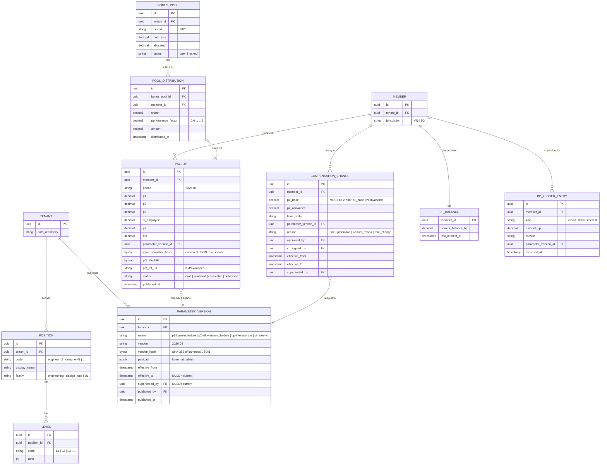
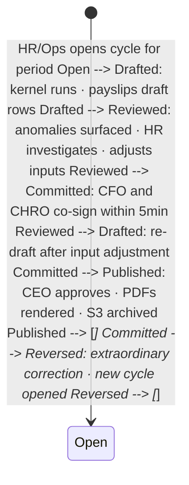

REW is the **compensation computation and ledger plane** - the place where Total Rewards parameters become payslips, and where every payslip is reproducible byte-for-byte from the parameters that were effective at its period_end. The cash side is split into P1 (Base), P2 (Allowance), and P3 (Performance overflow from the BP fund). The non-cash side - BP (Bonus Points), an inflation-indexed unit of account - runs as an append-only ledger. The hard rule across the board: **append-only, no mutations**. Amendments are supersession rows; corrections are reversal rows. The 10-year statutory retention is enforced at the storage layer (S3 object-lock) so even a malicious admin cannot back-date a payslip.

**Invariant - P1 protection.** The system MUST NOT propose a reduction to P1 base salary in cash as the output of any evaluation. Performance review outcomes can withhold P3 (Performance) and adjust P2 (Allowance) tiers, but P1 in cash terms is contractually protected. **Violation = sev-0.** Hard system property; enforced as a constraint check on every `compensation_change` row.

**Invariant - anti-retroactive parameter versioning.** Published parameter versions are immutable. A recompute of any old payslip - say, January 2024 - against the parameters effective at 2024-01-31 23:59:59 UTC must produce a byte-identical PDF. Parameter rows have `effective_to + superseded_by`; never UPDATE. **Violation = sev-0.** Verified by a CI replay job that recomputes the full retained payslip history at every parameter change.

## At a glance

| Item | Detail |
|---|---|
| Status | Planned - P1, design phase |
| Est. LoC | ~6,800 (Rust (axum) + computation kernel) |
| Planned tests | 140+ (incl. determinism replay suite) |
| 3P split | P1 + P2 + P3: Base, Allowance, Performance |
| BP interest | ACB rate, VND inflation-pegged |
| memory ingestion | = 0 (structural exclusion, DEC-036) |
| Co-sign | CFO + CHRO commit gate |
| EU AI Act | Annex III §4 high-risk; conformity pack at P2 |

## The bigger picture - three strategic roles

REW is "Bet 5" in the strategy - the moat. The point is that compensation is not a HR feature: it's a sovereign, legally-sensitive computation plane that must be architecturally separated from everything else. HR holds identity; REW holds the numbers. The P1-protection invariant + anti-retroactive parameter versioning + structural memory exclusion (DEC-036) are non-negotiable hard rules.

**Role 1 - Compensation record owner.** Encrypted, HR-isolated, structurally excluded from memory. Per-Member compensation lives in REW's separate encrypted keyspace. HR never sees the number; REW never sees CCCD photos. CI gate (DEC-036) rejects any schema PR that lets compensation fields exist in HR tables or memory files. EU AI Act Annex III §4 high-risk because payroll = employment decision.

**Role 2 - Payroll bridge.** Monthly cycle with BHXH/BHYT/BHTN + immutable parameters. Monthly close: pull TIME approved hours, apply 3P decomposition (P1 base + P2 allowance + P3 performance), compute statutory deductions (BHXH 10.5%, BHYT 1.5%, BHTN 1%, PIT), generate payslip PDF, write to ledger. Every parameter version is immutable; replay any old payslip produces byte-identical output. CFO + CHRO co-sign commits the cycle.

**Role 3 - Bonus orchestrator.** BP fund, calibration-driven, CEO+CFO sign-off. The BP (Bonus Points) ledger accrues monthly with ACB-rate inflation interest. Quarterly bonus orchestrator: HR forwards aggregated PROJ calibration signals; REW proposes P3 distribution from the BP fund; CEO + CFO sign-off committed before payout. P3 can be withheld (bad performance review) but the P1 protection invariant means P1 cash cannot be cut.

### REW in the platform - isolated by design

Diagram source (Mermaid, flattened during migration):

```mermaid
flowchart TB HR["👥 HR  
Member-id · contract type · pay band ref"] TIME["⏱ TIME  
approved hours · overtime"] PROJ["📋 PROJ  
calibration signals"] REW["💎 REW  
3P engine · BP ledger · payroll"] SIGNATURE["✍ CFO + CHRO co-sign gate"] PAYSLIPS["📄 Payslips · immutable PDFs"] LEDGER["📒 BP ledger · append-only"] BHXH["🏛 BHXH/BHYT/BHTN  
VN social insurance"] BANKS["🏦 VN banks  
VietQR payroll batch"] memory["🚫 memory  
NEVER INGESTED · DEC-036"] HR --> REW TIME --> REW PROJ -- "aggregate signals via HR" --> REW REW --> SIGNATURE SIGNATURE --> PAYSLIPS REW --> LEDGER PAYSLIPS --> BANKS PAYSLIPS --> BHXH REW -. "structural exclusion" .x memory classDef hub fill:#fef3c7,stroke:#92400e,stroke-width:3px,color:#451a03 classDef mod fill:#e0e7ff,stroke:#3730a3 classDef forbidden fill:#fee2e2,stroke:#b91c1c,stroke-width:3px,color:#7f1d1d class REW hub class HR,TIME,PROJ,SIGNATURE,PAYSLIPS,LEDGER,BHXH,BANKS mod class memory forbidden
```

### Auto vs human-in-loop operations matrix

Operation| How it happens| Why this split ---|---|--- Monthly payroll compute| **Auto** at close; **CFO+CHRO co-sign** to commit| Determinism + dual approval; never one-person commit. Parameter version publish| **Manual** CFO + CHRO + CEO sign-off| Effective-period parameters are gravely consequential; tri-sign. P1 floor enforcement| **Auto** reject at constraint check| Hard invariant; sev-0 if bypassed. P2 tier change| **Manual** AM proposal -> CHRO approve| Role-tier change is policy decision. P3 quarterly distribution| **Auto** draft from BP + calibration; **CEO+CFO sign-off**| Variable comp; needs dual approval. BP accrual + interest| **Auto** nightly| Deterministic formula; ACB rate snapshot. Statutory deduction (BHXH etc.)| **Auto** per Decree 152/2020 rates| VN law specifies rates; version-pinned. Payroll bank batch send| **Manual** CFO confirm + VietQR batch| Money movement; human final. Old payslip replay (audit)| **Auto** deterministic| Byte-identical reproduction required; CI test. memory ingestion of comp data| **BLOCKED** by schema| DEC-036 structural exclusion; CI rejects comp fields in any memory-ingested path.

## Why REW exists

Compensation is the most legally-sensitive data a company holds and the most reputation-sensitive computation a company runs. When a payslip arrives wrong, the recipient never trusts the system again. When a parameter changes retroactively, the company has produced two contradictory truths about the same period - a phenomenon that auditors call a fraud signal and members call "you cheated me". REW exists to make these failure modes structurally impossible: append-only ledger, deterministic compute, dual sign-off, structural exclusion from memory, and a P1 floor that even a buggy evaluation cannot violate.

- **Deterministic compute:** Payslips are pure functions of (parameters, timesheet, leave, bonus pool). Same inputs -> same bytes. Forever. A 2024 payslip recomputed in 2030 produces the same PDF SHA-256.
- **P1 floor invariant:** No evaluation, no performance review, no agent, no buggy code path can propose a cut to P1 in cash. The constraint is enforced at the DB layer with a CHECK + at the application layer with a policy gate.
- **Zero memory leakage:** DEC-036: compensation numbers never enter the memory audit ledger. Audit rows reference an `opaque_payslip_id`; the body is in REW's encrypted keyspace, not in memory. Even a full memory export reveals no comp.

The bet (Bet 5 in the strategy) is that _treating Total Rewards as a moat_ is itself the moat. Companies that get comp wrong lose people; companies that get comp _verifiable and explainable_ earn trust that compounds. REW's invariants - append-only, deterministic, P1-protected, parameter-versioned - make the comp system itself a trust-producing artifact, not just a payroll engine.

## What it does - 5W1H2C5M

A structured decomposition of REW's scope.

Axis| Question| Answer ---|---|--- **5W - What**| What is REW?| An append-only compensation ledger + deterministic payroll compute + BP (Bonus Points) ledger with anti-inflation interest. Encrypted PDF payslip output with cryptographic SHA-256 integrity. Read-only narrator surface (`payslip_explain`) for the CUO/CFO-skill agent. **5W - Who**| Who is touched?| **Members:** every employee gets a monthly payslip. **Owners:** HR/Ops Lead initiates close; CFO + CHRO co-sign commit; CEO approves final publication. **Forbidden:** agents never write to REW; agents read only the `payslip_explain` narrative. **5W - When**| When does REW act?| (a) Monthly close cycle (D-3 to D+2 around month-end); (b) per-grant bonus award (Founder approval gate); (c) anti-retroactive replay job at every parameter change (CI); (d) annual SI/PIT remittance prep; (e) Member termination -> final-pay compute. **5W - Where**| Where does it run?| P1: single region (Singapore SG-1) backed by AWS RDS Postgres with REW-specific KMS key (separate from HR's CCCD key, separate from memory's signing key). PDFs at rest with retention lock = 10 years. **5W - Why**| Why a separate, isolated module?| Because comp data leaking into memory is the worst privacy outcome possible. Because retroactive parameter changes are an audit-failure / fraud signal. Because P1-cut bugs are existential to trust. **1H - How**| How does it work?| (1) Parameter table append-only, every row carries `effective_from + effective_to + superseded_by + version_hash`. (2) Compute kernel is a pure function with a serde-stable input snapshot. (3) PDF generation is deterministic (LaTeX with frozen fonts, fixed timestamp metadata). (4) PDF SHA-256 stored alongside row; integrity verifiable forever. (5) Co-sign predicate at AUTH (CFO + CHRO scopes both required for commit). **2C - Cost**| Cost budget?| P1: ~$30/month (RDS schema + Fargate task + S3 with object-lock). 50-tenant: ~$100/month. Per-payslip cost: ~$0.01 amortised (LaTeX rendering dominates). **2C - Constraints**| Constraints?| (a) P1 invariant - sev-0 if violated. (b) Anti-retroactive - sev-0 if violated. (c) memory exclusion (DEC-036) - CI gate. (d) Vietnamese SI/PIT line-items per Decree 152/2020 + Circular 111/2013. (e) 10-year retention. (f) EU AI Act high-risk - conformity pack at P2. **5M - Materials**| Stack?| Rust 1.81, axum 0.7, sqlx, PostgreSQL 16, LaTeX (tectonic) for deterministic PDF, ring for SHA-256, serde for canonical-JSON input snapshots, AWS KMS for per-payslip encryption, S3 with object-lock for archival. **5M - Methods**| Method choices?| Append-only with supersession (no UPDATE). Pure-function compute kernel with property tests for determinism. Tectonic for deterministic LaTeX. Co-sign predicate at AUTH gateway. CI replay job that recomputes the full retained payslip history on every parameter change. **5M - Machines**| Deployment?| Fargate task in SG-1 (P1). Multi-AZ Postgres RDS. S3 retention lock = 10 years. SG HoldCo branch: SGD payroll mode (P2 stretch). **5M - Manpower**| Who maintains?| HR/Ops Lead (R for operations) + CEO (A for sign-off) + CFO (R for commit co-sign) + CHRO (R for co-sign, P3+ seat). **5M - Measurement**| How measured?| (task pending)..010. KPIs: close-cycle completion days, recompute-determinism CI pass rate, memory-leak incident count, P1-cut-attempt blocked count.

## Architecture

REW is an isolated service with four surfaces (REST admin for the close cycle, GraphQL read-mostly for the Member payslip portal, MCP narrator-only tools for agents, internal gRPC for HR roster sync), three stores (Postgres with REW-specific KMS key for ledger rows, S3 with object-lock for PDFs, KMS for column-level encryption), and a deliberately constrained audit path that emits _opaque event references_ to memory - never numbers.

Diagram source (Mermaid, flattened during migration):

```mermaid
graph TB subgraph CLIENTS ["Clients"] HR["HR/Ops (SPA)"] CFO["CFO co-sign UX"] CHRO["CHRO co-sign UX"] MEMBER["Member portal  
(own payslip only)"] CUO["🤖 CUO/CFO-skill  
narrator · read-only"] end subgraph EDGE ["Edge"] AR["Apollo Router  
JWT + RBAC + co-sign predicate"] end subgraph REW ["REW service (Rust · axum)"] GQL["GraphQL subgraph  
read-mostly"] REST["REST admin  
close · commit · publish"] KERNEL["compute_kernel.rs  
pure deterministic fn"] PARAM["parameters.rs  
append-only versioned"] BP["bp_ledger.rs  
BP unit-of-account + interest"] PDF["pdf_renderer.rs  
tectonic deterministic"] NARR["narrator.rs  
payslip_explain (read-only)"] COSIGN["cosign_guard.rs  
CFO + CHRO predicate"] REPLAY["replay_check.rs  
determinism CI"] end subgraph STORES ["Stores (isolated)"] PG[("PostgreSQL  
compensation_change · payslip  
parameters · bp_ledger  
REW-specific KMS key")] S3[("AWS S3  
payslip PDFs · object-lock 10y  
REW-specific KMS")] KMS[("AWS KMS  
rew-comp-key  
distinct from HR + memory")] end subgraph BOUNDARIES ["Compliance boundaries"] memory["🧠 memory  
opaque event refs ONLY  
(no comp numbers)"] OBS["👁 OBS  
timing only  
(no comp in traces)"] HRMOD["👥 HR  
Member roster (read)"] AUTH["🔐 AUTH  
co-sign predicate"] end HR --> AR CFO --> AR CHRO --> AR MEMBER --> AR CUO --> AR AR --> GQL AR --> REST AR --> NARR REST --> COSIGN COSIGN --> AUTH REST --> KERNEL KERNEL --> PARAM KERNEL --> BP KERNEL --> HRMOD KERNEL --> PDF PDF --> S3 REST --> PG GQL --> PG BP --> PG PARAM --> PG PG --> KMS S3 --> KMS REST -.opaque ref.-> memory REW --> OBS REPLAY --> KERNEL classDef planned fill:#fef6e0,stroke:#92400e classDef store fill:#f5f3ff,stroke:#7c3aed classDef boundary fill:#fee2e2,stroke:#dc2626 classDef extern fill:#f5ede6,stroke:#45210e class GQL,REST,KERNEL,PARAM,BP,PDF,NARR,COSIGN,REPLAY planned class PG,S3,KMS store class memory,OBS boundary class HRMOD,AUTH extern
```

### Internal components

Component| Path (planned)| Responsibility ---|---|--- `compute_kernel.rs`| services/rew/src/compute_kernel.rs| Pure deterministic function. Input: `(parameters_version, member_snapshot, timesheet, leave, bp_balance)`. Output: `(P1, P2, P3, SI, PIT, net)`. No I/O. No clock. No randomness. `parameters.rs`| services/rew/src/parameters.rs| Append-only parameter store. Every row carries `effective_from + effective_to + superseded_by + version_hash`. Rejects UPDATE at DB layer. `bp_ledger.rs`| services/rew/src/bp_ledger.rs| BP (Bonus Points) ledger. Append-only credits + debits + monthly interest accrual at ACB savings rate (versioned parameter). `payslip.rs`| services/rew/src/payslip.rs| Payslip row writer. Calls kernel, persists computed values + parameter version hash + SHA-256 of PDF. `pdf_renderer.rs`| services/rew/src/pdf_renderer.rs| Deterministic PDF via tectonic. Frozen fonts (Inter, Vietnamese Pro), fixed timestamp metadata, no creator field, no PRODUCER drift. `cosign_guard.rs`| services/rew/src/cosign_guard.rs| Predicate check at commit boundary: requires both `rew.commit_co_sign:cfo` and `rew.commit_co_sign:chro` within a 5-minute window. Single-signer commits rejected. `narrator.rs`| services/rew/src/narrator.rs| Read-only MCP surface for the CUO/CFO-skill: explains a payslip in prose. Never proposes changes. Never writes. `anomaly_surface.rs`| services/rew/src/anomaly_surface.rs| Surfaces deltas vs prior month - flags +/-20% swings for HR review during close. Narrative-only output. `replay_check.rs`| services/rew/src/replay_check.rs| CI replay job. On every parameter change, recomputes the full retained payslip history; asserts byte-identical SHA-256. `p1_guard.rs`| services/rew/src/p1_guard.rs| P1-protection invariant enforcer. Rejects any `compensation_change` row that would result in a smaller P1 cash value than the prior period. `si_pit.rs`| services/rew/src/si_pit.rs| Vietnamese SI (BHXH + BHYT + BHTN) and PIT line-item computation per Decree 152/2020 + Circular 111/2013. Versioned along with other parameters. `sg_branch.rs`| services/rew/src/sg_branch.rs| SGD payroll branch for Singapore HoldCo. Activated only when tenant's `data_residency = "sg-1"` and member's `jurisdiction = "SG"`. (P2 stretch.) `memory_bridge.rs`| services/rew/src/memory_bridge.rs| Writes opaque event refs to memory (e.g. `rew.payslip.published:opaque_id_01HZJ...`). Never writes comp numbers. CI gate inspects emitted-row JSON for blocklist keys. `migrations/`| services/rew/migrations/| sqlx migrations. Append-only constraints (no DELETE / UPDATE on ledger tables). Separate KMS key from HR + memory.

## Data model

The schema is built around **append-only with supersession**. There is no UPDATE on a published row; there is a new row that supersedes the old one. Parameters, compensation changes, BP ledger entries, and published payslips all follow this discipline. The DB role used by the application has no DELETE or UPDATE grant on these tables, only INSERT.

Diagram source (Mermaid, flattened during migration):



### 3P income structure - schedule example

Component| What it is| Source of value| Variability| Tax treatment (VN) ---|---|---|---|--- `P1 Base`| Contractual base salary in cash, paid monthly. **Floor invariant - never reduced by evaluation.**| Position x Level schedule (parameter)| Only raised; never lowered| PIT progressive; SI bases on capped portion (Decree 152) `P2 Allowance`| Cash allowance - tied to role tier (e.g. mentorship allowance for L3+, leadership allowance for managers). Can move up or down with tier changes.| Position-tier schedule (parameter)| Tier-up = raise; tier-down (rare) = adjust| PIT progressive; SI excluded for designated allowance kinds `P3 Performance`| Cash overflow from the annual bonus pool, distributed via `POOL_DISTRIBUTION` with a performance factor.| BP fund x Voting Power x performance factor| Variable; can be 0 in any period| PIT progressive at the time of payout `BP (Bonus Points)`| Unit-of-account ledger, monthly interest at ACB savings rate. Members can convert BP -> cash (P3) at specified windows.| Awarded via founder approval; accumulates interest| BP balance grows over time even idle| PIT due on conversion to cash, not on accrual

## API surface

Three surfaces. GraphQL read-mostly for the Member payslip portal (with strict self-scope). REST admin for the close cycle, with the CFO + CHRO co-sign predicate. MCP narrator-only tools for the CUO/CFO-skill - no write tools, no parameter change tools, no commit tools.

### GraphQL subgraph (read-mostly, self-scope)

```graphql
extend schema
 @link(url: "https://specs.apollo.dev/federation/v2.5", import: ["@key", "@requiresScopes"])

type Payslip @key(fields: "id") {
 id: ID!
 memberId: ID!
 period: String!
 p1: Money!
 p2: Money!
 p3: Money!
 siEmployee: Money!
 pit: Money!
 net: Money!
 parameterVersionId: ID!
 pdfSha256: String!
 pdfUrl: String! # pre-signed S3, 60s TTL
 status: PayslipStatus!
 publishedAt: DateTime
}

type Money {
 amount: String! # string to avoid float drift
 currency: String! # VND | SGD
}

type BpBalance {
 memberId: ID!
 currentBalanceBp: String!
 lastInterestAt: DateTime!
}

enum PayslipStatus { DRAFT REVIEWED COMMITTED PUBLISHED }

type Query {
 myPayslips(since: Date): [Payslip!]! # only own payslips
 payslip(id: ID!): Payslip
 @requiresScopes(scopes: [["rew.payslip_read"]])
 myBpBalance: BpBalance!
}

# NO mutations on GraphQL. All writes go through REST admin
# with the cosign_guard.
```

### REST admin surface (planned, co-sign required)

Method| Path| Purpose| Co-sign? ---|---|---|--- POST| `/admin/cycles`| Open a monthly close cycle.| HR/Ops POST| `/admin/cycles/{period}/draft`| Compute draft payslips (kernel, no commit).| HR/Ops GET| `/admin/cycles/{period}/anomalies`| Surface +/-20% deltas vs prior month.| readonly POST| `/admin/cycles/{period}/commit`| Commit cycle: locks payslip rows.| **CFO + CHRO** POST| `/admin/cycles/{period}/publish`| Publish payslips: emit opaque memory refs + notify Members.| CEO (final) POST| `/admin/parameters`| Publish a new parameter version (e.g. annual review).| **CFO + CHRO + CEO** POST| `/admin/compensation/{member_id}/change`| Append a compensation change (hire, promotion, annual review). P1-guard checked.| **CFO + CHRO** POST| `/admin/bonus-pool/{year}`| Allocate the annual bonus pool.| **CEO + CFO** POST| `/admin/bp/award`| Award BP to a Member. Founder approval gate.| **Founder** POST| `/admin/bp/convert`| Convert BP -> P3 cash (member-initiated, windowed).| Member self POST| `/admin/replay-check`| Run the phased replay; CI hook.| internal, CI POST| `/admin/dsar/{member_id}/export`| DSAR comp bundle (own only; managers blocked).| DPO

### MCP tool catalogue (narrator-only, no write tools)

Tool name| Inputs| Outputs| Annotations ---|---|---|--- `cyberos.rew.payslip_explain`| payslip_id| narrative text (no numbers in raw response - uses opaque tokens like "your P1 component")| readonly, scope=rew.narrator `cyberos.rew.anomalies_summary`| period| narrative deltas| readonly, for HR/Ops during close `cyberos.rew.bp_balance_explain`| member_id (own only)| narrative BP growth explanation| readonly, self-scope `cyberos.rew.policy_lookup`| policy_topic| quoted Total Rewards Appendix paragraph| readonly, scope=rew.policy_read

**Forbidden:** no `cyberos.rew.compute_payslip`, no `cyberos.rew.commit_cycle`, no `cyberos.rew.change_compensation`. Compute is owned by HR/Ops via the REST admin path with co-sign. Agents narrate; humans decide.

## Key flows

### Flow 1 - Monthly close cycle (input -> compute -> review -> commit -> publish)

```mermaid
sequenceDiagram autonumber participant HR as HR/Ops (SPA) participant R as REW REST /admin/cycles participant K as compute_kernel.rs participant HRM as 👥 HR (roster + leave) participant T as ⏱ TIME (timesheet) participant CUO as 🤖 CUO/CFO-skill participant CFO as CFO participant CHRO as CHRO participant CEO as CEO participant S3 as AWS S3 (object-lock) participant B as 🧠 memory (opaque ref only) HR->>R: POST /admin/cycles {period:"2026-04"} R->>R: open cycle status="open" HR->>R: POST /admin/cycles/2026-04/draft R->>HRM: read roster + leave snapshot R->>T: read timesheet snapshot R->>K: compute(parameters_v, members, timesheet, leave, bp) K-->>R: payslip rows (draft) R->>CUO: anomalies_summary (read-only narrative) CUO-->>HR: "3 members have ±20% delta vs Mar; flagged" HR->>HR: investigate + adjust if needed R->>R: status="reviewed" HR->>R: POST /admin/cycles/2026-04/commit R->>CFO: request co-sign R->>CHRO: request co-sign CFO-->>R: WebAuthn assertion (cosign:cfo) CHRO-->>R: WebAuthn assertion (cosign:chro) R->>R: cosign_guard ✓ (both within 5min window) R->>R: lock payslip rows + status="committed" HR->>R: POST /admin/cycles/2026-04/publish R->>CEO: request final approval CEO-->>R: approve R->>K: render PDFs (deterministic tectonic) R->>S3: archive PDFs (KMS, object-lock 10y) R->>R: payslip.status="published", record pdf_sha256 R->>B: opaque ref "rew.payslip.published:<opaque_id>" Note over R,B: memory row contains NO comp numbers,  
just an opaque pointer.
```

CFO + CHRO assertions must both arrive within 5 minutes; otherwise `cosign_guard` resets and both must re-submit. This prevents accidental long-pending half-signed commits.

### Flow 2 - Anti-retroactive parameter change (with replay check)

```mermaid
sequenceDiagram autonumber participant CEO as CEO participant CFO as CFO participant CHRO as CHRO participant R as REW /admin/parameters participant K as compute_kernel.rs participant RPC as replay_check.rs (CI) participant B as 🧠 memory CEO->>R: POST /admin/parameters  
{name:"p1-base-schedule", version:"2026.05", payload:…} R->>R: 3-way co-sign (CEO + CFO + CHRO) R->>R: INSERT parameter_version row  
(prior version effective_to = now) R->>RPC: trigger replay of last P0 → P4 horizon RPC->>K: replay april-2024 with parameters effective at april-2024-end K-->>RPC: SHA-256 of payslip PDF RPC->>RPC: compare with stored sha alt all P0 → P4 horizon identical RPC-->>R: ✓ determinism preserved R->>R: parameter_version.status = "published" R->>B: opaque ref "rew.params.published:2026.05" else any drift RPC-->>R: ✗ FAIL — determinism broken R->>R: ROLLBACK parameter change R->>B: opaque ref "rew.params.rejected:replay_drift" Note over R,B: New parameters NEVER affect old periods.  
If replay drifts, parameters are rejected. end
```

This is the anti-retroactive invariant in action: _publishing_ a new parameter version is only allowed if recomputing the full retained payslip history against the historical effective parameters still yields byte-identical PDFs. If the kernel itself changed in a way that breaks determinism, the change is rejected.

### Flow 3 - Promotion -> compensation change (P1-guard in action)

```mermaid
sequenceDiagram autonumber participant L as 📈 LEARN (promotion outcome) participant HR as HR/Ops participant R as REW /admin/compensation/{member}/change participant P1G as p1_guard.rs participant CFO as CFO participant CHRO as CHRO participant B as 🧠 memory L-->>HR: promotion outcome "L2 → L3 for mai@…" HR->>R: POST /admin/compensation/<mai>/change  
{level:"L3", p1_base:<new>, reason:"promotion"} R->>P1G: check new_p1 ≥ prior_p1 ? alt p1 raised (or equal) P1G-->>R: ✓ P1-invariant preserved R->>CFO: request co-sign R->>CHRO: request co-sign CFO-->>R: WebAuthn (cosign:cfo) CHRO-->>R: WebAuthn (cosign:chro) R->>R: INSERT compensation_change row R->>B: opaque ref "rew.comp.changed:<opaque>" else p1 reduced — REJECT P1G-->>R: ✗ sev-0 P1 cut attempted R-->>HR: 422 "P1 protection invariant" R->>B: opaque ref "rew.p1_cut_attempted:blocked" Note over R,B: A bug — or a malicious actor — cannot reduce P1 in cash;  
only a multi-party amendment to the Total Rewards Appendix could. end
```

### Flow 4 - BP fund allocation + P3 distribution

```mermaid
sequenceDiagram autonumber participant CEO as CEO participant CFO as CFO participant R as REW /admin/bonus-pool/2026 participant K as compute_kernel.rs participant L as 📈 LEARN (VP roll-up) participant M as Member portal participant B as 🧠 memory CEO->>R: POST /admin/bonus-pool/2026  
{pool_size: <X> VND} R->>R: co-sign (CEO + CFO) R->>L: read VP per Member L-->>R: VP map R->>K: allocate(pool, VP, performance_factor) K-->>R: pool_distribution rows R->>R: INSERT pool_distribution R->>R: per-Member: append P3 to current period payslip R->>B: opaque ref "rew.pool.distributed:2026" Note over M: at next published payslip,  
Member sees P3 line item with narrative explanation.
```

### Flow 5 - Payslip narrator (read-only, CUO/CFO-skill)

```mermaid
sequenceDiagram autonumber participant U as Member (asks CUO) participant CUO as 🤖 CUO router participant NARR as REW narrator.rs participant PG as REW DB (read-only) U->>CUO: "explain my April payslip" CUO->>NARR: cyberos.rew.payslip_explain {payslip_id} NARR->>PG: read payslip + parameter_version (self-scope) PG-->>NARR: payslip + params NARR->>NARR: synthesise prose narrative  
(refers to "P1 component" "P2 component" — not numeric) NARR-->>CUO: narrative text CUO-->>U: "Your April payslip reflects the P1 schedule for L2 engineer,  
plus a P2 allowance for mentorship, plus a P3 distribution  
from the 2026 bonus pool of 0.4× pool share. See your portal  
for the numeric breakdown." Note over NARR,CUO: numeric values stay in REW's keyspace;  
only the Member portal renders them to the Member directly.
```

## Close-cycle lifecycle

A monthly close cycle traverses five states. Each transition writes an opaque audit row (never a number) to memory.



### Cycle calendar (default, configurable)

Day| Activity| Owner ---|---|--- D-3 (month-end - 3)| Open cycle. Timesheet freeze warning to Members.| HR/Ops D-1| Timesheet hard freeze. Leave reconciliation.| HR/Ops D (month-end)| Draft compute. Anomaly surface to HR. CUO/CFO-skill narrative.| HR/Ops + Agent (read-only) D+1| HR adjustments. Anomaly resolution.| HR/Ops D+2| Commit: CFO + CHRO co-sign. CEO approves publish.| CFO, CHRO, CEO D+3| Publish: PDFs render -> S3 -> Member notified.| REW (auto) D+5 (VN)| BHXH remittance schedule (P3 stretch).| HR/Ops

## Functional requirements

The CyberOS task catalogue is being rebuilt one feature at a time via the open [task-author](https://github.com/cyberskill/cyberos/tree/main/modules/skill/task-author) Agent Skill.

Previous task enumerations were archived 2026-05-14 and are no longer reflected on this page. Specific tasks land here as they are re-authored.

## Non-functional requirements

Security and usability / explainability NFRs (§11.2.5) bind on REW. Cross-referenced at [nfr-catalog.html#rew](../../reference/nfr-catalog.html#rew).

NFR ID| Concern| Target| Measurement ---|---|---|--- (NFR pending)| Comp number in memory ledger row| = 0 - sev-0| CI: memory_bridge emit JSON inspected against blocklist of keys + numeric value patterns (NFR pending)| P1 reduction attempts blocked| = 100% (zero leak)| p1_guard property test; chaos test injects p1 cut and asserts rejection (NFR pending)| Single-signer commit attempts blocked| = 100%| cosign_guard integration test (NFR pending)| KMS-key isolation (REW key distinct from HR + memory)| 3 distinct key handles| KMS policy inspection; cross-key access blocked (NFR pending)| Determinism - same inputs -> same PDF SHA-256| 100% (phased replay)| replay_check.rs CI on every parameter change (NFR pending)| Append-only at DB layer (no UPDATE / DELETE grant on ledger tables)| enforced| DB role inspection, CI gate on migrations (NFR pending)| Cycle draft compute p95 (50 members)| <= 8 s| bench/cycle.rs (NFR pending)| PDF render p95 (per payslip)| <= 600 ms| bench/pdf.rs (NFR pending)| Cycle-day availability| >= 99.9% during D-3..D+5| SLO monitor (NFR pending)| Payslip durability (10-year retention)| 0 lost PDFs| S3 object-lock + quarterly inventory (NFR pending)| Payslip explainability (EU AI Act Art. 14)| narrator covers all line items| policy review + member usability test (NFR pending)| Member dispute path SLO| <= 5 working days to CEO adjudication| dispute queue dashboard (NFR pending)| EU AI Act Annex III §4 conformity at P2| full conformity pack signed by DPO + CLO| P2 release gate

## Dependencies

REW is deliberately constrained. It reads from HR (roster + leave) and TIME (timesheet). It writes opaque references to memory - never numbers. Agents read the narrator surface only.

Diagram source (Mermaid, flattened during migration):

```mermaid
graph LR subgraph upstream ["REW depends on"] AUTH["🔐 AUTH  
JWT + co-sign predicate"] HRMOD["👥 HR  
roster + leave (read)"] TIME["⏱ TIME  
timesheet (read)"] LEARN["📈 LEARN  
VP for P3 distribution"] KMS["🔑 AWS KMS  
rew-comp-key (distinct)"] S3["🗂 AWS S3  
PDFs · object-lock 10y"] memory["🧠 memory  
opaque refs only"] end REW["💎 REW"] subgraph downstream ["REW is read by"] CUO["🤖 CUO/CFO-skill  
narrator only"] MEM["Member portal  
self-payslip only"] INV["🧾 INV  
(not used; INV is AR side)"] DPO["DPO  
DSAR exports"] end AUTH --> REW HRMOD --> REW TIME --> REW LEARN --> REW KMS --> REW S3 --> REW REW -.opaque ref.-> memory REW --> CUO REW --> MEM REW --> DPO classDef planned fill:#fef6e0,stroke:#92400e classDef shipped fill:#f5ede6,stroke:#45210e classDef forbidden fill:#fee2e2,stroke:#dc2626 class REW planned class AUTH,HRMOD,TIME,LEARN,CUO,MEM,DPO planned class memory,KMS,S3 shipped class INV forbidden
```

## Compliance scope

REW is the EU AI Act Annex III §4 high-risk module (employment-decision automation). It has to defend against Vietnamese labour-law audits, PDPL DSAR requests, and EU AI Act conformity assessments simultaneously.

Regulation / standard| Article / clause| REW feature that satisfies it ---|---|--- EU AI Act (Reg. 2024/1689)| Annex III §4 - Employment & worker management| REW is the high-risk system. P2 conformity pack: risk management, data governance, technical docs, transparency, human oversight (task pending), accuracy/robustness ((task pending) determinism). EU AI Act| Art. 14 - Human oversight| Member can dispute -> CEO adjudicates within 5 working days; CEO can override any automated computation. EU AI Act| Art. 13 - Transparency| `cyberos.rew.payslip_explain` narrator; user-facing PDF includes parameter version + computation explanation. Vietnam Labour Code (2019)| Art. 90 - Wage / salary| P1 floor is the contractual base; P1-guard invariant enforces. Vietnam Labour Code| Art. 96 - Pay period| Monthly cycle by default; per-tenant override (weekly / bi-weekly) supported. Decree 152/2020/NĐ-CP| Art. 5 - SI contribution rates| BHXH 8%/17.5%, BHYT 1.5%/3%, BHTN 1%/1% encoded as versioned parameter `si-rates-vn`. Circular 111/2013/TT-BTC| Art. 7 - Personal income tax| PIT progressive schedule encoded as versioned parameter `pit-schedule-vn`. VN Tax Law| 10-year retention| S3 object-lock 10-year + DB row append-only. Vietnam PDPL (Law 91/2025)| Art. 14 - DSAR| Member-self DSAR (task pending); managers structurally blocked from cross-member comp views. Vietnam PDPL| Art. 7 - Sensitive data| Comp classified `restricted`; separate KMS; access requires `rew.payslip_read` scope. GDPR (EU 2016/679)| Art. 22 - Automated individual decision-making| EU AI Act conformity pack + Art. 14 human override (task pending). GDPR| Art. 32 - Security of processing| KMS-wrapped at rest, co-sign at commit, append-only ledger. ISO/IEC 27001:2022| A.5.13 - Information labelling| Comp fields classified; cross-module exfiltration blocked at gateway. SOC 2 Type II| CC6.1, CC8.1| RBAC + co-sign + audit chain + deterministic replay.

## Risk entries

REW's risks are largely about integrity (determinism, append-only) and privacy (memory leakage). The P1-cut and memory-leak risks are both rated catastrophic.

ID| Risk| Likelihood| Impact| Owner| Mitigation ---|---|---|---|---|--- `R-REW-001`| Comp number leaks into memory audit row| Low| Catastrophic| CSO| memory_bridge.rs emit JSON inspected by CI gate against numeric blocklist; integration test asserts opaque ref pattern only. `R-REW-002`| P1 cut proposed by buggy evaluation| Low| Catastrophic (legal)| CEO| p1_guard at app layer + DB CHECK constraint; property test attempts P1 cut and asserts rejection. `R-REW-003`| Retroactive parameter change breaks old payslip recomputation| Medium| High| CTO| replay_check.rs CI on every parameter change; rejects publish if any retained payslip drifts. `R-REW-004`| Single-signer commit slips through| Low| High| CFO| cosign_guard with 5-min window; both signatures required; integration test asserts blockage. `R-REW-005`| Deterministic PDF render breaks (font/timestamp drift)| Medium| High| CTO| Tectonic with pinned font versions; PDF metadata stripped to {producer:none, creation_date:fixed}; CI byte-identical assertion. `R-REW-006`| Cross-tenant comp leakage via manager scope| Low| Catastrophic| CSO| Manager role has NO `rew.payslip_read` scope; can only see HR data; DSAR queries reject if subject != self. `R-REW-007`| BP interest accrual drift (compounding bug)| Medium| Medium| CFO| BP interest is a deterministic function of (period, rate version); replay_check covers BP too. `R-REW-008`| EU AI Act conformity gap discovered at audit| Medium| High| CLO + DPO| P2 conformity pack drafted at design time; gap analysis annually; legal-counsel sign-off. `R-REW-009`| Agent attempts compute via narrator surface (excessive agency)| Low| Medium| CSO| MCP catalogue has ZERO write tools; narrator is read-only; CI gate verifies tool catalogue surface. `R-REW-010`| 10-year retention violated by S3 lifecycle bug| Low| High| CTO| Object-lock governance mode; lifecycle policy review at every deploy; quarterly inventory audit. `R-REW-011`| HR-aggregated calibration signal weaponised as sole basis for P3 cut| Medium| High| CHRO| P3 distribution requires CEO + CFO sign-off + per-Member manager narrative; calibration is one input, never the only input. `R-REW-012`| BHXH/BHYT rate change mid-month (Decree amendment) creates partial-month inconsistency| Medium| Medium| CLO| Parameter version effective-from supports mid-month boundary; pro-rated computation per partial period; CI replay verifies. `R-REW-013`| Lumi cross-tenant synthesis attempts to read REW data (impossible by design, but CI must verify)| Low| Catastrophic| CSO| REW has zero MCP tools exposed; CI gate verifies absence of comp data path to memory/Lumi; quarterly red-team. `R-REW-014`| Member self-service payslip view leaks Member-Y data via cache| Low| High| CSO| Per-Member subject-bound cache keys; CI test asserts cross-Member cache miss; pen-test quarterly. `R-REW-015`| Co-signers (CFO + CHRO) collude -> P1 cut slips through| Low| Critical| CEO| P1 protection is enforced at DB CHECK constraint, NOT at app layer alone; even both co-signers cannot commit a P1-cutting row. Hard structural floor.

## KPIs

REW health rolls up into 15 KPIs across throughput, integrity, and compliance.

KPI| Formula| Source| Target ---|---|---|--- **Close-cycle completion (days)**| `published_at - cycle.opened_at`| REW DB| <= 5 working days **Determinism replay pass rate**| replay_check pass / runs| CI| = 100% **P1-cut attempts blocked**| p1_guard rejections / period| OBS| tracked; alert on any > 0 in prod **Single-signer commit attempts blocked**| cosign_guard rejections| OBS| tracked; alert on prod attempts **Comp-in-memory incidents**| CI gate failures| CI| = 0 **Member disputes resolved (5 working days)**| disputes resolved within SLO / total| REW DB| >= 95% **PDF render p95**| histogram| OBS| <= 600 ms **Anomaly false-positive rate**| flagged but unchanged / flagged| REW DB| <= 30% **BP interest precision (drift)**| computed - expected (basis points)| property test| = 0 bps **EU AI Act conformity score**| conformity items passed / total| P2 audit| = 100% at P2 release **P3 distribution sign-off completeness**| quarterly P3 distributions with CEO + CFO + manager narrative / total| memory audit| = 1.0 (hard floor) **Parameter version mid-month transition correctness**| pro-rated periods passing replay / total| CI replay| = 100% **Lumi-attempted REW reads**| count| OBS| = 0 (hard floor; CI verifies) **Cross-Member cache leak attempts**| count| OBS + CI| = 0 **P1 DB-CHECK constraint violations attempted**| count of CHECK rejections| Postgres logs| tracked; any > 0 in prod = sev-0 incident

## RACI matrix

REW is operationally owned by HR/Ops Lead; legally accountable to the CEO; compute-co-signed by CFO + CHRO. DPO owns DSAR; CLO owns EU AI Act conformity.

Activity| CEO| HR/Ops| CFO| CHRO| CSO| DPO| CLO ---|---|---|---|---|---|---|--- Monthly close cycle| A| R| R| R| I| I| I Compensation change (hire/promo)| C| R| R| R| I| I| I Parameter version publish| A| R| R| R| C| C| C Bonus pool allocation| A/R| I| R| C| I| I| I BP award (founder approval)| A/R| R| C| C| I| I| I Member dispute adjudication| A/R| R| R| R| I| C| C EU AI Act conformity pack| C| I| I| C| C| R| A DSAR fulfilment (comp scope)| I| C| I| I| C| A/R| C Determinism CI gate maintenance| I| I| I| I| A/R| I| I

R = Responsible, A = Accountable, C = Consulted, I = Informed.

## Planned CLI surface

Admin CLI `cyberos-rew` for HR/Ops. Destructive commands print numeric output only on stdout, never to logs.

### 1. Open a close cycle

```
$ cyberos-rew cycle open --period 2026-04

[cycle opened]
 period: 2026-04
 status: open
 freeze: 2026-04-28 23:59:59 (timesheet hard freeze)
[audit] memory seq=15001 (opaque ref only)
```

### 2. Draft compute

```
$ cyberos-rew cycle draft --period 2026-04

[draft] computing payslips for 12 members…
[kernel] pure function · 0 I/O · 0 randomness
[anomaly] 2 members flagged (±20% delta vs March):
 mai@… (P3 spike — bonus pool distribution)
 linh@… (P1 raise — promotion L1→L2)
[status] drafted
[audit] memory seq=15002 (opaque)
```

### 3. Commit (CFO + CHRO co-sign)

```
$ cyberos-rew cycle commit --period 2026-04 \
 --cosign-cfo --cosign-chro

[cosign] cfo: hoa@cyberskill.com (WebAuthn) ✓
[cosign] chro: thanh@cyberskill.com (WebAuthn) ✓
[guard] cosign_guard: both signatures within 5min window ✓
[commit] 12 payslip rows locked
[status] committed
[audit] memory seq=15011 (opaque)
```

### 4. Publish

```
$ cyberos-rew cycle publish --period 2026-04 --ceo-approve

[ceo] stephen@cyberskill.com (WebAuthn) ✓
[render] 12 PDFs via tectonic (deterministic)
[render] all SHA-256 stable vs draft
[s3] archived to s3:/rew/payslips//2026-04.pdf (object-lock 10y)
[notify] 12 members notified (CHAT + email)
[status] published
[audit] memory seq=15021 (opaque "rew.payslip.published" × 12)
```

### 5. Publish a new parameter version

```
$ cyberos-rew parameters publish \
 --name p1-base-schedule \
 --version 2026.05 \
 --payload p1-2026.05.json \
 --cosign-ceo --cosign-cfo --cosign-chro

[3-way cosign] ceo ✓ cfo ✓ chro ✓
[replay-check] replaying full retained history against historical params…
[replay-check] apr-2024 ✓ may-2024 ✓ … mar-2026 ✓
[replay-check] all retained payslips: SHA-256 byte-identical ✓
[publish] p1-base-schedule v2026.05 published
[supersede] prior version v2026.04 effective_to = now
[audit] memory seq=15045 (opaque "rew.params.published:2026.05")
```

### 6. Award BP

```
$ cyberos-rew bp award \
 --member hoa@cyberskill.com \
 --amount 500 \
 --reason "Q1 contribution to ESOP migration" \
 --founder-approve

[founder] stephen@cyberskill.com (WebAuthn) ✓
[bp] +500 BP awarded to hoa@cyberskill.com
[balance] new balance: 2,840 BP (interest 2.5%/yr at ACB rate)
[audit] memory seq=15052 (opaque "rew.bp.awarded")
```

### 7. DSAR comp export (member-self)

```
$ cyberos-rew dsar-export --self --output mycomp.zip

[dsar] subject: mai@cyberskill.com (self)
[dsar] payslips: 24 (last 2 years)
[dsar] parameters: 12 versions referenced
[dsar] bp ledger: 47 entries
[dsar] compensation_changes: 3
[dsar] written: mycomp.zip (3.4 MB, KMS-encrypted)
[audit] memory seq=15061 (opaque "rew.dsar.exported")
```

## Phase status & estimates

| Item | Detail |
|---|---|
| Status | Planned - P1, design phase |
| Est. LoC (Rust) | ~6,800 (services/rew + sqlx migrations) |
| Planned tests | 140+ (incl. determinism replay suite) |
| External libs | ~12 (axum, sqlx, tectonic, ring, serde, aws-sdk-kms) |
| CLI subcommands | ~22 planned (`cyberos-rew` entrypoint) |
| P1 budget | ~$30/mo (RDS schema + Fargate + S3 obj-lock) |

Capability| Status ---|--- 3P income compute kernel (deterministic)| planned - P1 Append-only parameter store + supersession| planned - P1 P1-protection invariant (p1_guard)| planned - P1 CFO + CHRO co-sign predicate| planned - P1 Monthly close cycle UX| planned - P1 Anomaly surface (+/-20% delta)| planned - P1 Deterministic PDF render (tectonic)| planned - P1 Phased replay CI gate| planned - P1 BP ledger + ACB interest accrual| planned - P1 Payslip narrator MCP (read-only)| planned - P1 Vietnamese SI/PIT line-items| planned - P1 Member self-DSAR comp export| planned - P1 BP -> P3 conversion windows| planned - P2 Singapore HoldCo SGD branch| planned - P2 EU AI Act Annex III §4 conformity pack| planned - P2 BHXH remittance integration| planned - P3 Member-dispute -> CEO adjudication flow| planned - P2

## References

- **Bigger picture (above):** 3 strategic roles + REW-isolated-by-design diagram + 10-row auto-vs-human matrix.
- **Cross-module page links:** [hr.html](../hr/index.html), [time.html](../time/index.html), [esop.html](../esop/index.html), [proj.html](../proj/index.html), [memory.html](../memory/index.html), [auth.html](../auth/index.html)
- **memory auto-sync vision:** [MEMORY_AUTOSYNC_DESIGN.md §5](../../docs/MEMORY_AUTOSYNC_DESIGN.md) + DEC-036 - comp data structurally excluded from memory; Lumi cross-tenant synthesis cannot read REW.
- **Build-readiness audit:** `archive/2026-05-14/AUDIT_AND_PLAN.md` (archived; see `cyberos/CHANGELOG.md`) - REW at P1-exit (P1, after HR).
- **task authoring discipline:** [modules/skill/task-audit/AUTHORING_DISCIPLINE.md](https://github.com/cyberskill/cyberos/blob/main/modules/skill/task-audit/AUTHORING_DISCIPLINE.md).
- **REW module tasks** - ((task pending) through (task pending)).
- **REW architecture posture** - Bet 5 framing.
- **Strategy Bet 5** - "The Total Rewards Appendix is a moat too" (DEC-036 memory exclusion).
- **Security NFRs** - SEC-002: zero P1 reduction.
- **Formal task mapping** - (task pending) through (task pending) with verification methods.
- **Total Rewards & Career Path Appendix** - Legal source of truth; 3P decomposition; P1 protection.
- **EU AI Act (Reg. 2024/1689)** - Annex III §4 employment-decision automation high-risk classification; Art. 13 transparency; Art. 14 human oversight.
- **GDPR (EU 2016/679)** - Art. 22 automated decision-making safeguards.
- **Vietnam Labour Code (2019)** - Art. 90 wage, Art. 96 pay period.
- **Decree 152/2020/NĐ-CP** - SI contribution rates and base computation.
- **Circular 111/2013/TT-BTC** - Personal income tax progressive schedule.
- **Vietnam PDPL (Law 91/2025)** - Art. 7 sensitive data; Art. 14 DSAR.
- **ISO/IEC 27001:2022** - A.5.13 information labelling; A.5.16 identity management.
- **Architecture context:** [infrastructure.html#rew](../../architecture/infrastructure.html#rew).

## Changelog

History lives in the [changelog](./changelog.html); this page describes only the current state.
