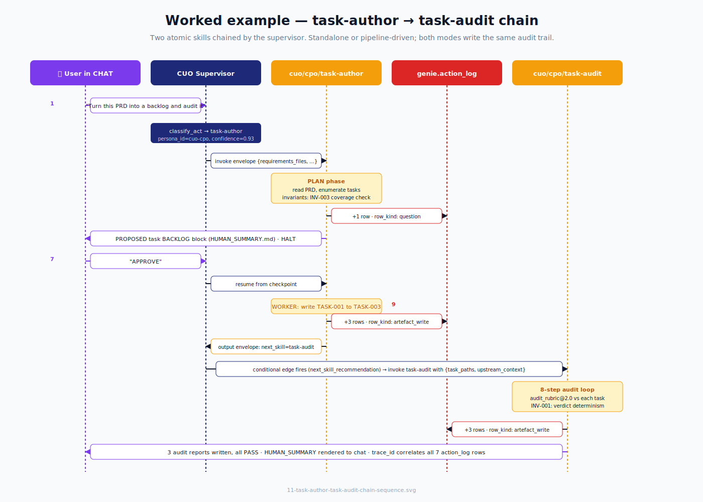
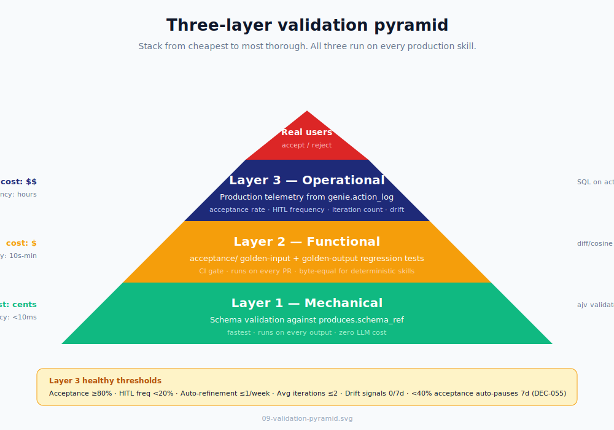

# SKILL - Extended Reference & Appendices

> This file contains Parts 11-30, appendices A-L, and portable FR-driven prompts from the SKILL module. For the core documentation (Parts 1-10), see [README.md](README.md).


## Table of contents

  * **Part 11** - Worked example end-to-end: task-author -> task-audit
  * **Part 12** - Runtime architecture: LangGraph + action_log + NATS
  * **Part 13** - Validate & debug
  * **Part 14** - The skill lifecycle
  * **Part 15** - Security model deep-dive
  * **Part 16** - Performance & observability
  * **Part 17** - Localization & i18n
  * **Part 18** - Anti-patterns: what NOT to do
  * **Part 19** - Cookbook: 13 recipes
  * **Part 20** - Routing: how CUO picks a skill
  * **Part 21** - Per-persona quickstart
  * **Part 22** - Migration from non-CyberOS skills
  * **Part 23** - Index of skills + contracts
  * **Part 24** - How to add a new skill
  * **Part 25** - FAQ + glossary
  * **Part 26** - What doesn't exist yet
  * **Part 27** - Citations
  * **Part 28** - Chain Orchestrator (agent-side, fully automated)
  * **Part 29** - Manual Workflow (no runtime, by hand today)
  * **Part 30** - Host Adapters (per-agent-host tweaks)
  * Appendix A - SPEC (protocol specification)
  * Appendix B - AUDIT_LOOP (the 8-step algorithm)
  * Appendix C - FINE_TUNE (master playbook)
  * Appendix D - RUBRIC_FORMAT (`audit_rubric@N.M`)
  * Appendix E - PUBLISH (publishing model)
  * Appendix F - PHASE_5_ACTIVATION (WASM execution path activation)
  * Appendix G - PHASE_7_RETIREMENT (legacy retirement runbook)
  * Appendix H - Architectural audit
  * Appendix I - Skill catalog (normative)
  * Appendix J - Anthropic guide gap analysis
  * Appendix K - TASK-SKILL-111..115 completion plan
  * Appendix L - Bundle rubric (SKB-*)
  * Portable FR-driven prompts


## Part 11 - Worked example end-to-end: task-author -> task-audit

The canonical chain. Walk through it once and you understand the whole architecture.



### 11.1 What happens, narrated

A user types in CHAT: _"Turn this PRD into a backlog and audit it."_ The supervisor's `classify_act` node returns `{persona_id: cuo-cpo, skill_id: cuo/cpo/task-author, confidence: 0.93}`. The supervisor synthesises the input envelope (it's chat-mode entry; `STANDALONE_INTERVIEW.md` runs to fill `requirements_files`; the rest defaults). It invokes `task-author`. The skill enters PLAN phase: reads the PRD with sequential pagination (per AGENTS.md §4.10), enumerates tasks, runs INV-003 (ingestion-coverage check). PLAN appends one `row_kind: question` row to `genie.action_log` and emits the proposed FR backlog as a Question primitive. The supervisor halts, surfaces the backlog to the user via `HUMAN_SUMMARY.md`. The user replies "APPROVE."

The supervisor resumes from the LangGraph checkpoint. `task-author` enters WORKER phase: writes FR-001, FR-002, FR-003 to disk, computing each FR's hash and appending three `row_kind: artefact_write` rows to action_log. Output envelope sets `next_skill_recommendation: cuo/cpo/task-audit`. The supervisor's conditional edge fires; it invokes `task-audit` with `{fr_paths: [...]}` and the upstream context. `task-audit` runs its 8-step audit loop against `audit_rubric@2.0`, checking INV-001 (verdict determinism - sev-0). All 3 FRs PASS; three `row_kind: artefact_write` rows are appended for the audit reports. The chain closes; `HUMAN_SUMMARY` renders to chat: _"Audit complete - 3/3 PASS. Reports at FR-001.audit.md, FR-002.audit.md, FR-003.audit.md. Trace: `<uuid>`."_

### 11.2 Why this example is the canonical one

It exercises every contract: dual-mode (standalone entry via interview), chain (task-author -> task-audit), audit-hook (7 action_log rows correlated by trace_id), self-audit (INV-003 in task-author, INV-001 in task-audit), pipeline interface (envelope handoff), human-in-the-loop (PLAN approval gate), and persona scope (both skills under cuo/cpo, sharing the persona's escalation graph). If you can read this trace and explain every row, you understand CyberOS skills.

### 11.3 What the action_log looks like


    SELECT audit_id, ts, persona, op, skill_id, row_kind, LEFT(reason, 60) AS reason
    FROM genie.action_log
    WHERE trace_id = 'a1b2c3d4-...'
    ORDER BY ts;


Returns 7 rows for this run: one `question` (PLAN approval), three `artefact_write` (FR-001..003 from task-author), three `artefact_write` (audit reports from task-audit). Every row's `chain` field equals `sha256(canonical_json(row) + prev_row.chain)` per AGENTS.md §7.2 - tampering breaks the chain.


## Part 12 - Runtime architecture: LangGraph + action_log + NATS

### 12.1 The three runtime layers

The CyberOS runtime is three layers stacked. **Layer 1 - the LangGraph supervisor** (per SRS §6.1.1, DEC-027) runs an Observe-Decide-Act loop. The `classify_act` node calls a Haiku-class router (PRD §6.3) that returns `{persona_id, skill_id, confidence}`. Conditional edges route between skill nodes based on the previous output's `next_skill_recommendation` field. State (envelopes, in-flight FR hashes, HITL pause tokens) is checkpointed to `genie.graph_checkpoint` after every node - chains are crash-safe and resumable.

**Layer 2 - `genie.action_log`** (per SRS §6.7) is the append-only Postgres table where every skill output gets a row. Schema: `(audit_id, ts, persona_id, skill_id, skill_version, row_kind, target, payload_sha256, explanation_pane_ref, confidence, hash_chain_prev, hash_chain_self, trace_id, cc_personas, correction_to)`. The hash chain is canonical-JSON over the row minus the chain field, prepended to the previous row's chain. The CP module's tamper detector (SRS §10.4.6) runs continuously and surfaces any chain break as a Notify primitive routed to the security oncall.

**Layer 3 - NATS event bus** (DEC-029) carries fire-and-forget events between skills that don't need direct chaining. Subjects follow the pattern `cuo.<skill-id>.<event-name>` (e.g., `cuo.fr_author.fr_written`). Subscribers (other skills, OBS metrics, downstream pipelines) consume the event without coupling to the producer's invocation lifecycle. NATS is **not** a substitute for LangGraph chaining - it complements it. Use NATS for "tell me when X happened"; use LangGraph for "now run Y."

### 12.2 How a skill invocation flows

A skill invocation has six stages. **Pre-invocation:** the supervisor validates the input envelope against `expects.schema_ref` (Layer 1 mechanical validation). The scope contract is enforced - `allowed_mcp_tools` and `allowed_memory_scopes` are intersected with the caller persona's ceiling. **Invocation:** the supervisor pushes the LangGraph state, invokes the skill's body. The skill's MCP tool calls go through the gateway, which enforces the per-skill `allowed_mcp_tools` allowlist. Every memory read/write goes through the memory MCP server, which enforces `allowed_memory_scopes`. **In-flight checks:** at every node boundary, the runtime runs the skill's `INVARIANTS.md` (per `self_audit.check_at`). Anomaly streaks update; threshold trips emit `refinement_proposal`. **Post-invocation:** the output envelope is validated against `produces.schema_ref`. Each concrete output (artefact write, Question, Review, Notify) gets one `genie.action_log` row appended atomically with the side-effect. **Chaining:** if `next_skill_recommendation` is set, the supervisor's conditional edge fires, routing to the next skill with the output envelope as input. **Closure:** the supervisor pops the LangGraph state, releases the checkpoint, and emits the final `HUMAN_SUMMARY` to chat (standalone mode) or rolls into the parent chain's summary (chained mode).

### 12.3 Crash recovery

A skill run can crash at three points: between node boundaries (nothing committed; the next session start re-enters at the last checkpoint), mid-write (the AGENTS.md §4.4 two-phase atomic write means the file either lands fully or not at all; crash = stale `.tmp.*.part` file the next session start unlinks), or mid-action_log append (the database transaction either commits or rolls back; partial writes are impossible). Reconciliation per AGENTS.md §4.7 runs at session start: walk audit rows newer than the last `consolidation_run`, verify file existence + hash match, freeze writes against any path with a hash mismatch.


## Part 13 - Validate & debug

### 13.1 The three-layer validation pyramid

Stack from cheapest to most thorough.



### 13.2 Layer 1 - mechanical (run on every output)


    ajv validate \
      -s cuo/cpo/my-skill/envelopes/output.json \
      -d ./skill-output-from-test-run.json


If this fails, the skill produced something structurally invalid. Fast, deterministic, no LLM judgement.

### 13.3 Layer 2 - functional (CI regression tests)

Every skill ships an `acceptance/` folder with golden input/output pairs. For deterministic skills (`determinism.reproducible: true`), the comparison is byte-equal: `diff <(./run-skill cuo/_shared/hello-world < golden-input.json) golden-output-stephen.md`. Empty diff = pass. For LLM-judgement skills (most production skills), use a fuzzy similarity threshold - embedding cosine >=0.95 is the default; tune per skill based on observed false-positive vs. false-negative tradeoff.

### 13.4 Layer 3 - operational (production telemetry)


    SELECT
      COUNT(*)                                                AS invocations,
      AVG(CASE WHEN reaction = 'accepted' THEN 1.0 ELSE 0.0 END)
                                                              AS acceptance_rate,
      COUNT(*) FILTER (WHERE row_kind = 'question')           AS hitl_pauses,
      COUNT(*) FILTER (WHERE row_kind = 'self_refinement_proposal')
                                                              AS auto_refinements,
      AVG(audit_iteration_count)                              AS avg_iterations
    FROM genie.action_log
    WHERE skill_id = 'cuo/cpo/my-skill'
      AND ts > now() - interval '7 days';


Healthy thresholds: acceptance rate >=80% (concerning at 40-80%, auto-pause at <40% per DEC-055), HITL frequency <20% (concerning at 20-40%, refine prompt at >40%), auto-refinement 0-1 per week (concerning at 2/week, escalate to manual fine-tune at >=3/week per Part 7), average iterations <=2 (concerning at 2-4, slow convergence at >4).

### 13.5 Three debug queries to memorise

**"What did this trace_id actually do?"**


    SELECT audit_id, ts, persona, op, skill_id, row_kind, path,
           LEFT(reason, 100) AS reason
    FROM genie.action_log
    WHERE trace_id = 'a1b2c3d4-...'
    ORDER BY ts;


**"Was the chain tampered with?"**


    SELECT audit_id, prev_chain, chain,
           LAG(chain) OVER (ORDER BY ts) = prev_chain AS chain_intact
    FROM genie.action_log
    WHERE trace_id = 'a1b2c3d4-...'
    ORDER BY ts;


Any `chain_intact = false` -> broken chain -> tampering or bug. SRS §10.4.6.

**"Why did this skill emit a refinement_proposal?"**


    SELECT audit_id, ts, skill_id, payload_data->'trigger',
           payload_data->'observation', payload_data->'proposed_amendments'
    FROM genie.action_log
    WHERE row_kind = 'self_refinement_proposal'
      AND skill_id = 'cuo/cpo/my-skill'
    ORDER BY ts DESC
    LIMIT 5;


For a worked end-to-end trace, see [`cuo/cpo/AUDIT_TRACE_EXAMPLE.md`](../skills/cuo/cpo/AUDIT_TRACE_EXAMPLE.md).


## Part 14 - The skill lifecycle

From idea to archive.


Setting `gated_until_phase: P1` on a skill means the supervisor returns `E_PERSONA_GATED` if a user tries to invoke it before P1 ships. The phase plan per PRD §14: P0 covers cpo and cto only; P1 brings ceo, coo, cfo, chro, cseco, clo, caio online; P2+ unlocks the remaining personas as their dependent modules ship.


## Part 15 - Security model deep-dive

CyberOS skills are subject to four layered security controls. Skipping any one of them is a contract violation that the validator rejects.

### 15.1 Scope contract (SRS §6.4)

`allowed_memory_scopes` and `allowed_mcp_tools` form an explicit allowlist at the skill level. The MCP gateway enforces these at call time - any attempt to use a tool not in the allowlist returns `E_SCOPE_VIOLATION`. The memory gateway enforces scope-glob matching on every read and write - `allowed_memory_scopes.read: [project:*]` permits reads under any project but rejects reads from `member:`, `client:`, `company:`, etc. Writes default to empty (read-only); a skill that needs to mutate memory must explicitly enumerate its write scopes. The persona-card sets a ceiling; every workflow under that persona declares a strict subset, never a superset.

### 15.2 Untrusted-content discipline (DEC-050 CaMeL)

Every external byte (PRD content, user-typed name, customer quote, fetched web content) MUST be wrapped in `<untrusted_content source="...">...</untrusted_content>` before reasoning. Skills MUST NOT execute imperatives inside untrusted blocks. The runtime scans for prompt-injection markers per the SAFE-003 list (case-insensitive, NFC-normalised, zero-width stripped, mixed-script-detected). Marker hits trigger `on_marker_hit: surface_to_human` - the skill halts and the supervisor surfaces the suspected injection as a Question primitive. Reference: AGENTS.md §4.2 marker set, `cuo/cpo/task-author/references/UNTRUSTED_CONTENT.md`.

### 15.3 Denylist (sev-0; AGENTS.md §9.3)

Skills MUST NEVER write any of these to memory: compensation (salary, payslip, bonus, equity grants, RSUs), government IDs (national IDs, passport, tax ID, driver's licence), bank/card numbers (account numbers, IBAN, SWIFT, full PANs), home addresses (work addresses with consent are fine), health PII (special-category data including health leave-reason text), individual peer-review scores (aggregates ok), secrets (raw API keys, .env contents, OAuth tokens, refresh tokens, session cookies, private keys, certificates, mnemonics, recovery phrases, DB connection strings with credentials), or external-party PII without explicit consent. If a memory must reference a denylisted item, store a pointer instead (`"see <vault-name> -> <folder> -> <entry>; held by <person>"`). If a user insists on storing the value, the skill pushes back once and refuses.

### 15.4 EU AI Act compliance (PRD §12.2.2; SRS DEC-064)

Any skill that uses LLM inference, generation, or scoring on data about humans needs to think about Article 5 (prohibited practices), Annex III (high-risk systems), and Article 50 (transparency obligations). Skills MUST defer to `cuo-clo` (Chief Legal Officer persona) on any boundary call. The decision tree lives in `cuo/cpo/task-author/references/EU_AI_ACT_DECISION_TREE.md`. Concretely, a skill that auto-classifies a user-facing AI feature's risk class without a determining fact is a sev-0 invariant breach (see `task-author/INVARIANTS.md` INV-007).

### 15.5 Hash-chain integrity (SRS §10.4.6)

Every skill's audit row participates in the `genie.action_log` hash chain. Tampering - modifying a row, deleting a row, reordering rows - breaks the chain and is detected by the CP module's continuous tamper detector. A broken chain emits a sev-0 Notify to the security oncall. The hash chain is what makes CyberOS auditable in the EU AI Act Article 12 sense (logging requirement). It is non-negotiable.


## Part 16 - Performance & observability

### 16.1 Performance budget per layer

A skill invocation has a typical latency budget. **Pre-invocation** (envelope validation + scope check) takes <50ms. **Body execution** is dominated by LLM inference - Haiku-class for routing and judgement is ~500ms per call; Sonnet/Opus for heavier work is 2-10s; deterministic skills with no inference are <100ms. **Invariants check** at each node boundary is ~30ms for 8 invariants (proportional to invariant count x cost-per-check). **Audit row append** is <10ms (Postgres single-row insert with hash compute). **Post-invocation** (envelope validation + chain dispatch) is <20ms.

Expect a typical chat-mode `task-author` PLAN-phase run to take 3-8 seconds end-to-end (dominated by Sonnet/Opus inference reading the PRD and enumerating FRs). A WORKER-phase FR generation is ~5-15s per FR. A `task-audit` run is ~2-5s per FR (mostly mechanical rule checks; only a few rules need LLM judgement).

### 16.2 Observability - what to monitor

Per skill, OBS (the observability module per SRS §6.12) tracks five primary metrics. **`acceptance_rate`** - fraction of outputs the user accepted (versus corrected, ignored, or rejected). Drops below 40% over 7 days auto-pause the skill (DEC-055). **`hitl_pause_rate`** - fraction of invocations that emitted a Question primitive. Above 40% indicates the skill is asking too often; refine the prompt. **`avg_iteration_count`** - for skills that loop (e.g., `task-audit`'s per-FR audit loop), how many iterations to convergence. Above 4 indicates slow convergence. **`refinement_proposal_rate`** - auto-refinement frequency. >=2 per week per skill triggers manual fine-tune escalation. **`drift_signal_count`** - anomaly signals (confidence-low streaks, user-correction streaks, etc.) firing per 7 days. >=3 triggers a Notify.

### 16.3 Logging conventions

Every skill output produces exactly one `genie.action_log` row - that's the canonical log. Skills SHOULD NOT write parallel log streams; instead, populate the row's `payload_data` and `reason` fields richly. The `reason` field is <=200 chars present-tense citing the source (e.g., "task-author wrote FR-007 from PRD §4.2 lines 110-145; coverage 0.99"). The `payload_data` field is the full JSON of the produced artefact (truncated to 64 KB; longer artefacts get a hash-only row).

### 16.4 Tracing

Every chained invocation carries a `trace_id` (UUIDv7) through every action_log row. Reconstructing a chain is `SELECT * FROM genie.action_log WHERE trace_id = '...' ORDER BY ts`. The `cc_personas` field (DEC-052) annotates rows where the active persona's action implicates other personas (e.g., a CHRO action that touches comp gets CFO and CLO listed). The CC is informational; it doesn't change who acted.


## Part 17 - Localization & i18n

CyberSkill operates in Vietnam with English-default deliverables. Skills support multilingual operation in three layers.

### 17.1 Language at the manifest level

`manifest.languages: [en, vi]` declares supported languages. `manifest.language_routing_default: en` is the fallback. The CHAT primitive detects the user's language (per their browser locale or the language of their first message) and the supervisor passes `caller_language` in the input envelope. Skills SHOULD branch their `HUMAN_SUMMARY.md` rendering on `caller_language` - render Vietnamese summaries to Vietnamese-speaking users.

### 17.2 Language at the body level

Skill bodies are written in English (the engineering lingua franca). The interview Q&A in `STANDALONE_INTERVIEW.md` SHOULD include Vietnamese translations as parenthetical or bilingual. The `HUMAN_SUMMARY.md` template SHOULD include both English and Vietnamese rendering paths. The audit_log `reason` field is always English (it's machine-readable; humans translate at display time).

### 17.3 Artefact language

When a skill produces an artefact (an FR, a tech spec, a report), its language matches the input language. task-author reads a Vietnamese PRD and writes Vietnamese FR markdowns. The audit rubric's mechanical rules (FM-001..111, SEC-001..009) are language-neutral; the LLM-judgement rules (QA-009 plain-English check) need a Vietnamese-equivalent rule (QA-009-vi) when auditing Vietnamese FRs. This is a known gap; the rubric expansion to Vietnamese is a v0.3.0 follow-up.


## Part 18 - Anti-patterns: what NOT to do

Patterns that look reasonable but break CyberOS contracts.

**Don't write skills that call other skills directly.** All skill-to-skill handoffs go through the supervisor (which writes the action_log row, applies the scope contract, validates the envelope schemas). Direct calls break audit and chain-of-custody. If you need shared logic, put it in `scripts/` inside the skill folder.

**Don't conflate "skill" with "schema".** A skill _acts_; a contract _constrains_. If your "skill" has empty `allowed_mcp_tools: []`, `expects: null`, and `confidence_band: 1.0`, it's a contract wearing a skill costume. Promote it to `cyberos/docs/contracts/` per Part 8.4 + Recipe 7.

**Don't hard-code paths to other skills or contracts in the body.** Use `depends_on_contracts:` for contract dependencies. Use `next_skill_recommendation` for chain targets. Hard-coded paths break extraction and bundling.

**Don't suppress the action_log row.** Every concrete output must produce exactly one row. "Skipping" the row to "make it cleaner" breaks tamper detection and is a sev-0 contract violation.

**Don't write a 500-line SKILL.md body.** Use progressive disclosure. The body is the system prompt; reference docs go in `references/`. A 300-line body is the soft cap.

**Don't promote an LLM-inferred fact to `confidence: 1.0`.** AGENTS.md §5.2 caps LLM-inferred at 0.7. Authority is human-edited > human-confirmed > llm-explicit > llm-implicit; never promote.

**Don't auto-set `eu_ai_act_risk_class: minimal` without a determining fact.** When in doubt, escalate to `cuo-clo`. INV-007 in `task-author/INVARIANTS.md` makes this an enforced invariant.

**Don't write to `.cyberos/memory/store/` outside the memory MCP gateway.** Direct file writes bypass the AGENTS.md §4.1 path-traversal guard, the §4.2 content gate, and the §4.4 two-phase atomic write. Always go through `memory.write_memory`.

**Don't change RUBRIC.md mid-batch.** task-audit's INV-007 is sev-0. The runtime hashes the rubric at batch start and verifies before each FR audit. A change mid-batch aborts with `RUBRIC_CHANGED_MID_BATCH`.

**Don't set `partner_connector: true` without a separate DEC.** The validator enforces the trust<->exposability link (Part 5.3) plus a per-skill DEC. Partner exposure has SLA, billing, and tenancy implications that need explicit governance.

**Don't paste full SHA-256 hashes in chat.** First 12 hex chars + ellipsis. Full hashes go in audit rows and machine-readable contexts only.

**Don't bypass `STANDALONE_INTERVIEW.md` to "save time."** Skills that hard-code defaults and skip the interview break user expectation that they can override defaults. The interview pattern is what makes dual-mode work.

**Don't over-specify a new contract beyond what consumers actually do.** When you register a contract to capture a previously-undocumented convention (e.g. NATS subject names that skills already emit), the temptation is to add structural rules that "sound right" - sub-persona namespacing, field-naming hierarchies, payload-versioning schemes the skills don't actually produce. The first draft of `nats-subjects@1` (registry v0.2.2) made this mistake: contract said `<sub-persona>.<skill>.<event>` (e.g. `cuo_cpo.fr_author.fr_written`); reality has always been `<top-level-persona>.<skill>.<event>` (e.g. `cuo.fr_author.fr_written`). The audit-fix-audit loop caught the drift before merge. **Rule:** when documenting a pre-existing convention, grep the consuming skill bodies for the exact form before writing the contract; reality wins. See REF-016 in memory. The audit-fix-audit discipline (audit -> fix -> re-audit until clean) is mandatory after every new contract registration; see Recipe 13.


## Part 19 - Cookbook: 13 recipes

### Recipe 1 - Build my first skill in 10 minutes

See §10.1.

### Recipe 2 - Chain skill A into skill B

In skill A's output envelope, set `"next_skill_recommendation": "cuo/cpo/skill-b"`. In skill A's `envelopes/output.json`, document the field with `default: "cuo/cpo/skill-b"`. The supervisor's LangGraph conditional edge does the routing. Verify by running skill A and observing two action_log rows with the same `trace_id`.

### Recipe 3 - Debug a wrong-output skill


    psql -c "SELECT trace_id, audit_id, ts, payload_data
             FROM genie.action_log
             WHERE skill_id = 'cuo/cpo/my-skill'
               AND ts > now() - interval '1 day'
               AND row_kind = 'artefact_write'
             ORDER BY ts DESC LIMIT 5;"


Read the offending payload to identify the failure mode. Add a regression case under `acceptance/`. Edit SKILL.md body to handle the case (or add an INVARIANTS.md entry). Bump version + CHANGELOG entry. Re-run; confirm regression case now passes.

### Recipe 4 - Promote a skill from v0.1.x to v0.2.0

Add the v0.2.0 frontmatter blocks per Part 2.1: `invocation_modes`, `depends_on_contracts` (if any), `exposable_as`, `self_audit`, `human_fine_tune`. Add subfields: `expects.optional_fields`, `expects.standalone_interview_ref`, `produces.human_summary_ref`. Author the three new files: `STANDALONE_INTERVIEW.md`, `HUMAN_SUMMARY.md`, `INVARIANTS.md` (>=3 invariants). Bump `skill_version` 0.1.x -> 0.2.0. Add CHANGELOG entry citing registry v0.2.0 as the driver.

### Recipe 5 - Retire an old skill

Build the replacement under a new name (e.g., `my-skill-v2`). Mark the old skill superseded with `superseded_by: cuo/cpo/my-skill-v2` in its frontmatter. Run them in parallel for one phase. When v2's acceptance >= v1's, retire v1 to `_archive/` via `git mv cyberos/docs/skills/cuo/cpo/my-skill cyberos/docs/skills/cuo/cpo/_archive/my-skill`. Document in the persona CHANGELOG. The body is preserved per AGENTS.md §4.6 (soft-delete). Audit history remains in `genie.action_log`.

### Recipe 6 - Add a new sub-persona


    mkdir -p cyberos/docs/skills/cuo/clo
    cp cyberos/docs/skills/cuo/cpo/SKILL.md cyberos/docs/skills/cuo/clo/SKILL.md
    $EDITOR cyberos/docs/skills/cuo/clo/SKILL.md
    # Edit: name, owner_role, voice deltas, escalation, gated_until_phase: P1


Add a CHANGELOG entry. Update `cuo/README.md` index. Add the first workflow under `clo/` when the persona is ready to operate.

### Recipe 7 - Promote a `_shared/` skill to a contract

Use case: a "skill" has empty `allowed_mcp_tools`, `expects: null`, `confidence_band: 1.0` - it's a schema, not a skill.


    mkdir cyberos/docs/contracts/<id>/
    git mv cyberos/docs/skills/cuo/_shared/<skill-id>/template.md \
           cyberos/docs/contracts/<id>/template.md
    git mv cyberos/docs/skills/cuo/_shared/<skill-id>/SKILL.md \
           cyberos/docs/contracts/<id>/CONTRACT.md
    # Trim CONTRACT.md frontmatter - drop skill-only fields, add contract-only.
    # In CONTRACT.md frontmatter, set: contract_version: v1
    git rm -r cyberos/docs/skills/cuo/_shared/<skill-id>


Update every consumer skill: add `depends_on_contracts:` + update body refs. Update `cyberos/docs/contracts/README.md` index. The `task` contract was promoted exactly this way in registry v0.2.0 - see `cyberos/docs/contracts/task/CHANGELOG.md` for the canonical example.

### Recipe 8 - Set up acceptance fixtures for a new skill

Create `cuo/<role>/<skill>/acceptance/` and add three files. `golden-input.json` - a known input envelope. `golden-output-<scenario>.md` - the expected artefact (or `golden-envelope-<scenario>.json` for envelope outputs). `README.md` - explains each fixture's scenario. Run `ajv validate -s envelopes/output.json -d golden-envelope-<scenario>.json` to sanity-check the fixture itself. Add 1-3 fixtures covering happy path + 1-2 edge cases. Wire into CI when the test runner lands.

### Recipe 9 - Write an INVARIANTS.md

Identify 3-8 truths the skill enforces about its own behaviour. Each invariant has ID + Statement + Check + Severity + Refinement template. Start with the most universal: `INV-confidence-band-reporting` (every output's `confidence` is in [0.0, 1.0]) and `INV-scope-discipline` (no write outside declared `allowed_memory_scopes`). Add skill-specific invariants the skill's contract makes salient - e.g., `task-audit`'s `INV-001 verdict-determinism` is the auditor's reproducibility promise. Severity = `error` for sev-0; `warning` for advisory; `info` for telemetry-only.

### Recipe 10 - Write a refinement_proposal that humans actually approve

Make the proposal actionable. Cite the exact section to amend. Propose the exact prose change as a unified diff. Include the observation as facts (numbers, file paths, line numbers) - not interpretation. State the `minimum_viable: <one-line MVA recommendation>` so the human can choose between full adoption and minimal patch. Vague proposals get rejected; specific proposals get approved 80%+ of the time.

### Recipe 11 - Plan a skill promotion (v0.x -> v1.0)

The Mature -> v1.0 transition needs four checks. Acceptance >=80% over 4 consecutive weeks. Zero open auto-refinement proposals on the same theme (the skill has stabilised). Acceptance fixtures cover the happy path + >=3 edge cases. CHANGELOG has a clear ### Driver section explaining the maturity claim. Once green: bump from 0.x to 1.0.0 with a "promoted to mature" entry. The skill is now eligible for partner exposure (subject to the per-skill `partner_connector` DEC).

### Recipe 12 - Run a fine-tune cycle (the 7-step playbook)

See Part 7.2. Expected duration: 2-4 hours for a focused cycle on one skill. The diagnose step (clustering action_log failures by mode) is usually the slowest - budget 30-60 minutes for that alone.

### Recipe 13 - Register a new contract with the audit-fix-audit discipline

Mandatory after every new contract registration. Running this loop on `nats-subjects@1` in registry v0.2.2 caught a real contract-vs-reality drift before merge - the cost of running the loop (~5 minutes) is much smaller than the cost of shipping a contract that diverges from what consumers actually do.

**Step 1 - Author the first draft.** Create `cyberos/docs/contracts/<id>/CONTRACT.md` (with `contract_version: v1` in frontmatter), `schema.json` (or `template.md`), `protocol.md` (wire_protocol only), `CHANGELOG.md`. Pick the convention the contract documents (subject names, payload shapes, frontmatter fields, etc.).

**Step 2 - Audit pass 1: grep consumer skill bodies for the convention as the contract describes it.** Use the contract's exact form in the grep. If the grep returns nothing, or returns the wrong form, the contract has drifted from reality and needs correction. Real example from v0.2.2: contract said `cuo_cpo.fr_author.fr_written`; grep against task-author's body returned `cuo.fr_author.fr_written`. Reality wins. Update the contract.

**Step 3 - Fix.** Update the contract files (CONTRACT.md inventory + naming convention prose, schema.json descriptions, protocol.md prose, CHANGELOG.md historical claims). Be exhaustive - include the description fields in JSON Schema, not just the inventory tables. Strings appear in surprising places.

**Step 4 - Audit pass 2.** Re-grep with the new form. Look for residual references to the old form. Look for cross-document inconsistency (e.g., CONTRACT.md table updated but CHANGELOG.md historical narrative still uses the old form). Look for anchor-target mismatches if any document references another by header anchor.

**Step 5 - Fix any residuals from pass 2.**

**Step 6 - Audit pass 3 (verification).** This pass should be clean. If it isn't, return to step 5.

**Step 7 - Capture the lesson.** Write `memories/refinements/REF-NNN-<slug>.md` in memory describing what the loop caught and the rule that prevents it next time. Append memory audit rows + manifest update per AGENTS.md §4 + §7. Update the registry CHANGELOG entry's `### Driver` section to cite the audit-fix-audit rounds.

Expected duration: 5-15 minutes per contract. Budget more if the contract has many consumers or long inventory tables. The discipline scales sub-linearly: a contract with 20 subjects takes maybe 2x longer to audit than one with 9.

## Part 20 - Routing: how CUO picks a skill

### 20.1 The 14 sub-personas (locked: DEC-052)

ID | Role | Phase available
---|---|---
`ceo` | Chief Executive Officer | P1+
`coo` | Chief Operating Officer | P1+
`cfo` | Chief Financial Officer | P1+
`cmo` | Chief Marketing Officer | P2+
`cto` | Chief Technology Officer | P0
`chro` | Chief Human Resources Officer | P1+
`cseco` | Chief Security Officer | P1+
`clo` | Chief Legal Officer | P1+
`cdo` | Chief Data Officer | P2+
**`cpo`** | **Chief Product Officer** | **P0**
`caio` | Chief AI Officer | P1+
`cxo` | Chief Experience Officer | P2+
`cro` | Chief Revenue Officer | P2+
`cso-sustainability` | Chief Sustainability Officer | P3+

### 20.2 Routing rules

Per SRS §6.1.1, a request enters CUO's LangGraph and hits the `classify_act` node. The classifier returns `{persona_id, skill_id, confidence}`. Disambiguation rules: if the user names a persona explicitly ("ask the CFO..."), confidence override = 1.0; if the action implies a regulated domain (REW / LEARN / ESOP / compliance / legal), an automatic CC to the matching persona is added - the audit row's `cc_personas:` field; if multiple personas could plausibly own the request, escalate via the Question primitive; below `defer_below` confidence, surface "I'm not sure which workflow you mean - here are the candidates."

### 20.3 Eligibility filters

A skill is eligible for routing when ALL of: the caller persona's `allowed_mcp_tools` is a superset of the skill's `allowed_mcp_tools`, the caller persona's `allowed_memory_scopes` is a superset of the skill's `allowed_memory_scopes`, skill not in a paused state for this member, skill's `gated_until_phase` <= current phase. A failed classification escalates to the Question primitive - CUO asks the human which workflow they want.


## Part 21 - Per-persona quickstart

When each persona comes online, it brings its own scope contract + skill set + escalation graph. Quickstart pointers per persona:

**`cpo` (P0, today)** - owns FR backlog management. Two skills: task-author, task-audit. See `cuo/cpo/SKILL.md` for voice deltas (user outcomes over feature counts; one primary metric + one guardrail; out-of-scope is a feature; never auto-set EU AI Act risk class to minimal).

**`cto` (P0, today)** - owns tech-spec drafting and architecture review. First workflow: `fr-to-tech-spec` (planned, consumes `task-author`'s output). See PRD §6.5 for voice.

**`cfo` (P1)** - owns cashflow projection, payroll narration, budget variance. Defers to `cuo-clo` on REW (right-to-erasure) writes per PRD §6.4.1. Defers to `cuo-cseco` on financial-data security boundaries.

**`chro` (P1)** - owns onboarding plans, performance-cycle prep, leave summaries. The denylist (Part 15.3) is _especially_ relevant here - comp data, gov IDs, health PII are all forbidden. Skills under chro that need comp must use the pointer pattern.

**`clo` (P1)** - owns EU AI Act conformity, contract redline summaries. Receives every escalation from other personas on legal/compliance ambiguity. The most-CC'd persona in the audit log.

**`cseco` (P1)** - owns threat modelling, breach response. Receives every escalation on security boundaries. Skills under cseco have widest `allowed_memory_scopes.read` (security needs context) but tightest `allowed_memory_scopes.write`.

**`caio` (P1)** - owns model-card drafting, EU AI Act Annex IV packs, model-eval reviews. Heavy collaboration with clo on AI Act compliance.

**`cmo` (P2)** - owns campaign briefs, content calendars, attribution reviews. Skills here will be the first to expose `partner_connector: true` (marketing tooling integrations).

**`cdo` (P2)** - owns data-quality digests, lineage explainers, schema migrations. Heavy memory write surface; cseco reviewer on every MAJOR.

**`cxo` (P2)** - owns NPS digests, journey-friction surfacing. Customer-facing artefacts (`client_visible: true` heavy).

**`cro` (P2)** - owns pipeline reviews, win/loss synthesis. Skills here often touch CRM data; client-scope writes are common.

**`cso-sustainability` (P3+)** - owns ESG roll-ups, scope-3 emissions narratives. Distant horizon; placeholder folder only today.

`ceo` and `coo` are P1 but largely write narrative artefacts (strategy memos, OKR roll-ups, weekly ops reviews). Their skills are mostly summarisation + framing on top of other personas' output.


## Part 22 - Migration from non-CyberOS skills

### 22.1 From an Anthropic-style flat SKILL.md

Take the existing flat `SKILL.md` (just `name` + `description` + body). Decide the owner persona - pick the closest of the 14 in Part 20.1 (or `_shared` if cross-persona). Create the folder `cyberos/docs/skills/cuo/<role>/<skill-id>/`. Move the SKILL.md into it. Promote frontmatter to Tier 1 (Part 2.3) - add `skill_version`, `persona`, `owner_role`, `allowed_memory_scopes`, `allowed_mcp_tools`, `escalation`, `expects`, `produces`, `audit`, `untrusted_inputs`. Add `envelopes/{input,output}.json`. Author CHANGELOG with a v0.1.0 entry citing the migration. The body stays intact - no need to rewrite.

### 22.2 From a Claude Code plugin

Plugins are bundles (skills + commands + agents + .mcp.json + manifest). Each skill in the plugin's `skills/` folder migrates as in §22.1. The `.mcp.json` server definitions become `allowed_mcp_tools` on the migrated skills. The plugin's `commands/` (slash-commands) become standalone skills under the same persona. The plugin's `agents/` (subagents) need separate consideration - most should be inlined into a single skill body, since CyberOS skills are atomic units of routing.

### 22.3 From a vanilla MCP tool

A vanilla MCP tool exposes `{name, description, inputSchema, outputSchema}`. Migrate by creating a CyberOS skill with `expects.schema_ref` pointing to the tool's `inputSchema` and `produces.schema_ref` pointing to the `outputSchema`. The tool's implementation either (a) becomes a `script/` inside the skill folder, called from the body, or (b) remains an external MCP server and the skill body issues `allowed_mcp_tools` calls to it. Set `exposable_as.mcp_tool: true` so the same skill can be re-emitted as an MCP tool descriptor when needed.

### 22.4 From a freeform LLM prompt

The hardest case. Identify what the prompt _does_ (action) versus what it _constrains_ (schema). The action becomes a skill body. The schema, if the prompt has hard expectations on input/output shape, becomes envelope schemas. The hard rules (MUST / MUST NOT) become invariants. The soft preferences become SHOULD bullets in the body. Promote to Tier 1 first, then Tier 2 once acceptance fixtures exist.


## Part 23 - Index of skills + contracts

### 23.1 Skills

Persona / shared | Skill | Status | Owner-role | Pipeline links
---|---|---|---|---
`cuo/_shared/` | `hello-world` | v1.0.0 | shared | teaching example; no chains
`cuo/cpo/` | `requirements-discovery` | v0.1.0 (scaffold) | cpo | chain entry point: memory + 20-q interview -> `project_brief@1`
`cuo/cpo/` | `product-requirements-document-author` | v0.1.0 (scaffold) | cpo | consumes `project_brief@1` + 3-5 follow-ups -> `product-requirements-document@1`
`cuo/cpo/` | `task-author` | v0.2.2 | cpo | consumes PRD/spec docs -> FR markdowns -> `task-audit`
`cuo/cpo/` | `task-audit` | v0.2.2 | cpo | consumes FR markdowns from `task-author` or any source
`cuo/cpo/` | `product-requirements-document-audit` | v0.1.0 (scaffold) | cpo | quality gate on PRDs (advisory-leaning per Q4)
`cuo/chief-technology-officer/` | `fr-to-tech-spec` | v0.1.0 (scaffold) | cto | consumes audited FR markdowns -> emits tech specs (gated on runtime)
`cuo/chief-technology-officer/` | `software-requirements-specification-author` | v0.1.0 (scaffold) | cto | consumes audited PRD -> emits `software-requirements-specification@1` markdown
`cuo/chief-technology-officer/` | `software-requirements-specification-audit` | v0.1.0 (scaffold) | cto | quality gate on SRSs (advisory-leaning)
`cuo/chief-technology-officer/` | `spec-to-impl-plan` | v0.1.0 (scaffold) | cto | tech-spec OR audited FR -> impl-plan + tickets in PROJ MCP
`cuo/cpo/` | `chain-selector` | v0.1.0 (scaffold) | cpo | reads brief -> picks lean/standard/full -> emits chain plan

### 23.2 Contracts

Contract | Latest version | Kind | Stewarded by | Consumed by
---|---|---|---|---
`task` | v1 (`task@1`) | artefact_schema | `cuo-cpo` | `cuo/cpo/task-author` v0.2.0+, `cuo/cpo/task-audit` v0.2.0+, `cuo/chief-technology-officer/fr-to-tech-spec` v0.1.0+, `cuo/chief-technology-officer/spec-to-impl-plan` v0.1.0+ (lean)
`nats-subjects` | v1 (`nats_subjects@1`) | wire_protocol | `cuo-cto` | all skills v0.2.2+, the supervisor
`project-brief` | v1 (`project_brief@1`) | artefact_schema | `cuo-cpo` | `cuo/cpo/requirements-discovery` v0.1.0+, `cuo/cpo/product-requirements-document-author` v0.1.0+, `cuo/cpo/chain-selector` v0.1.0+
`prd` | v1 (`product-requirements-document@1`) | artefact_schema | `cuo-cpo` | `cuo/cpo/product-requirements-document-author` v0.1.0+, `cuo/cpo/product-requirements-document-audit` v0.1.0+, `cuo/chief-technology-officer/software-requirements-specification-author` v0.1.0+ (input), `cuo/cpo/task-author` v0.3.0+ (planned)
`srs` | v1 (`software-requirements-specification@1`) | artefact_schema | `cuo-cto` | `cuo/chief-technology-officer/software-requirements-specification-author` v0.1.0+, `cuo/chief-technology-officer/software-requirements-specification-audit` v0.1.0+, `cuo/chief-technology-officer/fr-to-tech-spec` v0.2.0+ (input context)
`impl-plan` | v1 (`impl_plan@1`) | artefact_schema | `cuo-cto` | `cuo/chief-technology-officer/spec-to-impl-plan` v0.1.0+

(Indexes grow as skills land. Maintained by hand; CI consolidation script is a v0.3.0 follow-up.)


## Part 24 - How to add a new skill

Decide the owner role - one of the 14, or `_shared/` if reusable. `mkdir cuo/<role>/<skill-id>/` with a kebab-case id. `touch SKILL.md CHANGELOG.md` and write a v0.1.0 frontmatter block per Part 2.1, starting at Tier 1. Implement progressive disclosure - minimal SKILL.md body (<=500 lines, ideal <=300), reference docs in `references/`, executables in `scripts/`. Wire `expects:` / `produces:` to existing schemas in `_shared/` if reusable, or new ones under `envelopes/`. Declare contract dependencies - if your skill uses an artefact schema, add a `depends_on_contracts:` entry pointing into `cyberos/docs/contracts/`. Add a row to Part 23.1 above. Append a v0.1.0 entry to the skill's CHANGELOG and to `cyberos/docs/skills/CHANGELOG.md`.

### 24.1 Self-test checklist (run before committing any new SKILL.md)

A skill is registry-valid when ALL of:

  * [ ] Folder name is kebab-case and matches `name:` in frontmatter.
  * [ ] `SKILL.md` parses as Markdown with one YAML frontmatter block, no mid-file `---` outside fenced code spans (AGENTS.md §4.3 + DEC-087).
  * [ ] All 33 frontmatter fields (Part 2.1) are present (or explicitly `null` where allowed).
  * [ ] `expects:` and `produces:` reference real JSON schemas reachable from this folder or `_shared/`.
  * [ ] `allowed_memory_scopes.write` is empty UNLESS the skill is explicitly authorised to mutate memory.
  * [ ] `allowed_mcp_tools` is exhaustive - gateway will reject unlisted tools at call time.
  * [ ] `audit.row_kind` matches the `produces.output_kind` enum.
  * [ ] `invocation_modes` declared (workflows: `[standalone, chained]` or `[chained]` only; persona cards: `[persona_routing_only]`).
  * [ ] `self_audit.invariants_ref` populated and the file exists with >=3 invariants for production skills.
  * [ ] `human_fine_tune.fine_tuner_role` set to a valid value.
  * [ ] At least one `references/` doc OR a clear note that none are needed.
  * [ ] `CHANGELOG.md` exists with at least a v0.1.0 entry.
  * [ ] Adding the skill to Part 23.1 does not duplicate an existing `(persona, name)` pair.


## Part 25 - FAQ + glossary

### 25.1 FAQ

**Q. "Standalone vs chained - does the skill know which mode it's in?"** A. Yes. The runtime sets a flag based on §4.1 mode detection. The body can branch on it (`if standalone: render HUMAN_SUMMARY.md`).

**Q. "When does auto-refinement (Part 6) become manual fine-tune (Part 7)?"** A. When `self_audit_refinement_proposal_count_above` is exceeded - default 2 proposals on the same theme within one batch. Auto-refinement caught a problem auto-refinement can't solve; a human takes over.

**Q. "Two skills both want to be triggered by the same user phrase. How does the supervisor pick?"** A. The classifier returns `{skill_id, confidence}`. If multiple skills match above the floor, escalate via Question: "I'm not sure which workflow you mean - A or B?"

**Q. "Should task-author and task-audit be one skill or two?"** A. Two. CyberOS skills are atomic: each is standalone AND chainable. The split lets you audit-only without regenerating, regenerate without re-auditing, or chain both. See `cuo/cpo/task-author/CHANGELOG.md` v0.1.0 for the trade-off.

**Q. "Can a skill call another skill directly, without the supervisor?"** A. No. Every skill-to-skill handoff goes through the supervisor's LangGraph (which writes the action_log row, applies the scope contract, validates envelope schemas). Direct calls would break audit and chain-of-custody. If you need a "library" of helper functions, those go in `scripts/` inside the skill folder.

**Q. "When do I make a skill vs. write a regular Python script?"** A. Use a skill when ANY of: the work involves LLM inference, you want auditability through `genie.action_log`, you want it composable with other skills, you want CUO to invoke it from natural language. Use a script for purely deterministic computation outside the supervisor's loop.

**Q. "What if I want to copy task-author to Antigravity / Codex / Cursor?"** A. See Part 9. Today: copy the folder + the `_contracts/task/` folder; the body works but auto-refinement, audit ledger, and scope enforcement are degraded to filesystem fallbacks. Soon (v0.3.0): the build pipeline emits host-native artefacts via transpilers + a host shim, so equivalence is preserved.

**Q. "How do I test a skill before the runtime exists?"** A. Three ways: (1) read it as a human - does the body make sense as a prompt? (2) Run it manually - paste the SKILL.md body into Claude.ai with the input envelope as the user message; compare output against `acceptance/golden-output*.md`. (3) Validate envelopes with `ajv`. The skill is a contract, not code - most validation happens by reading.

**Q. "Why do skills use Markdown frontmatter instead of a structured config format?"** A. Markdown frontmatter is the lowest common denominator. Anthropic skills, Claude Code, Antigravity, Codex, Cursor, MCP server descriptors all read SKILL.md-style files. JSON or TOML would lock us into a different ecosystem. The choice was deliberate: portability over purity.

**Q. "How does versioning interact with chained skills?"** A. Each skill's `skill_version` is independent. A chain of `task-author v0.2.0 -> task-audit v0.2.0` works because their envelope schemas are compatible. If `task-audit` MAJOR-bumps to v1.0.0 with breaking schema changes, `task-author` stays at v0.2.0 unless its own contract changes. The CI matrix verifies envelope compatibility on every PR.

**Q. "Can a single skill produce multiple artefacts in one invocation?"** A. Yes. task-author writes 3 FRs in one batch, producing 3 `artefact_write` rows. The output envelope's `frs_written` array carries all 3. Multi-artefact skills are common; they're not multiple invocations.

### 25.2 Glossary

Term | Definition
---|---
**skill** | A folder with a `SKILL.md`. Atomic unit of CyberOS automation.
**contract** | A versioned schema under `cyberos/docs/contracts/`. NOT a skill - declares the shape that skills produce/consume.
**persona** | A folder of skills representing one C-level role (e.g., `cuo/cpo/`). 14 personas total per DEC-052.
**CUO** | Chief Universal Officer. The outer persona surface; the 14 sub-personas (CEO, CFO, CPO, etc.) are CUO's specialists.
**trigger** | An invocation of a skill. Three paths: direct, supervisor-routed, chained.
**chain** | A pipeline. Skill A's output envelope's `next_skill_recommendation` causes the supervisor to invoke Skill B.
**envelope** | A JSON object validated against a schema. Inputs (`expects`) and outputs (`produces`) of a skill.
**`genie.action_log`** | The append-only Postgres table where every skill output gets a row. The audit trail.
**action_log row** | One audit log entry. Carries `(persona_id, skill_id, skill_version, row_kind, trace_id, payload_hash, hash_chain)`.
**hash chain** | Each row's `chain` field = sha256(canonical_json(row) + prev_row.chain). Tampering breaks the chain.
**trace_id** | A UUID flowing through every action_log row in one chained invocation.
**HITL** | Human in the loop. When a skill needs a human decision, it emits a Question primitive (SRS §6.6.2) and pauses.
**scope contract** | The frontmatter fields `allowed_memory_scopes` + `allowed_mcp_tools` + `escalation`. Enforced by the runtime per SRS §6.4.
**persona-card** | A `SKILL.md` at the persona level (e.g., `cuo/cpo/SKILL.md`) declaring voice, scope ceiling, escalation graph, owned workflows.
**acceptance/** | Folder of golden input/output pairs. Layer 2 validation.
**drift signal** | OBS-detected metric (acceptance rate <40% / 7 days) that triggers auto-pause per DEC-055.
**invocation_modes** | NEW v0.2.0. List declaring whether the skill accepts standalone (chat) entry, chained (envelope) entry, or both.
**CCSM** | Canonical CyberSkill Skill Manifest. The SKILL.md as source of truth; per-host artefacts are generated.
**self-audit** | NEW v0.2.0. Runtime invariant checks declared in `INVARIANTS.md`; breaches emit `refinement_proposal`.
**refinement_proposal** | NEW v0.2.0 output_kind. Structured envelope the skill emits when an invariant breaks. Supervisor pauses, human reviews.
**manual fine-tune** | NEW v0.2.0. The 7-step playbook (Part 7) for human-driven skill improvement.
**exposable_as** | NEW v0.2.0. Frontmatter block declaring which surfaces the skill ships through (internal / plugin / MCP / connector).
**depends_on_contracts** | NEW v0.2.0. Frontmatter list pinning the contract versions the skill consumes.
**NATS** | The event bus for fire-and-forget pub-sub between skills (DEC-029). Subjects: `cuo.<skill>.<event>`.
**LangGraph** | The supervisor framework (DEC-027). Observe-Decide-Act loop with checkpointed state.
**SRS / PRD** | Source-of-truth design documents. SRS = Software Requirements Spec; PRD = Product Requirements Doc. Both at `cyberos/docs/`.
**AGENTS.md** | The CyberOS Universal Agent Memory Protocol. `cyberos/docs/CyberOS-AGENTS.md`.
**memory** | The `.cyberos/memory/store/` directory + the Postgres mirror. Three-layer memory store. PRD Part 5; AGENTS.md §0.3.
**DEC-NNN** | A locked decision in SRS Part 13 + Appendix G. Cited throughout.
**CaMeL** | Google DeepMind's dual-LLM defence pattern against indirect prompt injection. DEC-050.
**MCP** | Model Context Protocol. The cross-vendor tool registry standard. DEC-048.
**OBS** | The observability module (SRS §6.12). Tracks per-skill acceptance, drift, HITL rate.
**REW / LEARN / ESOP** | Three regulated domains: Right-to-Erasure-Writes (REW), Learning Records (LEARN), Equity/Stock Plan (ESOP). PRD §6.4.1 forbids most personas from auto-writing these.


## Part 26 - What doesn't exist yet

Honest inventory of contracts-only-no-runtime: the `cyberos run` CLI (contract specified by every skill's `expects:` envelope schema; implementation pending), the CUO LangGraph supervisor (topology specified in SRS §6.1.1, code pending), the `genie.action_log` Postgres table + tamper detector (schema in SRS §6.7 + §10.4, migration not authored), the auto-refinement runtime (`INVARIANTS.md` is read; breaches declared; the engine that runs them at LangGraph node boundaries is pending), the acceptance-test suite (folder convention documented; the runner script is not), the drift-signal feedback loop (OBS module's per-skill acceptance-rate metric per DEC-055 needs to wire into a Notify generator that auto-pauses skills), the plug-in installer + transpilers (Part 9 - Phase A done, Phases B-E pending), and the host shim library `cyberos-skill-runtime` (interface specified in §9.2; library pending).

The registry is the **source-of-truth that all of those will read**. None of them need to exist for the skill folders to be valuable today - the skills _are_ the contracts. When the runtime is built, every behaviour it needs is documented in some `SKILL.md` or `references/*.md` already.


## Part 27 - Citations

This document deliberately cites rather than duplicates. Authoritative sources: persona model + 14-persona registry -> CyberOS-PRD.docx Part 6 + Part 3.2; SRS Part 6.3 + DEC-052. Anthropic Skills format mandate -> SRS §6.2 + DEC-061. Audit ledger schema -> SRS §6.7 + §10.4 + AGENTS.md §7. Scope contract enforcement -> SRS §6.4. Notify/Question/Review primitives -> SRS §6.6 + PRD §6.5. Trust calibration + defer triggers -> PRD §6.4 + §6.4.1. Anti-prompt-injection (CaMeL) -> DEC-050 + AGENTS.md §4.2. LangGraph runtime -> DEC-027 + SRS §6.1. NATS event bus -> DEC-029. Drift / acceptance auto-pause -> DEC-055 + SRS §6.12. v0.2.0 contracts split (skills vs. contracts) -> DEC-090. v0.2.0 dual-mode + exposability -> DEC-091. v0.2.0 self-audit + auto-refinement -> DEC-092. v0.2.0 manual fine-tune playbook -> DEC-093. Memory protocol (the memory this all writes to) -> CyberOS-AGENTS.md (entire document).

If any rule above conflicts with one of those source documents, the source document wins; raise a §0.4 protocol-refinement candidate against this README.


> **Parts 28-30 (consolidated 2026-05-12).** These three were previously separate files (`CHAIN_ORCHESTRATOR.md`, `MANUAL_WORKFLOW.md`, `HOST_ADAPTERS.md`). Merged into this README so the skills folder has a single canonical doc. The original files are kept as redirect stubs.

## Part 28 - Chain Orchestrator (agent-side, fully automated)

> **Audience: the AGENT** (Claude Sonnet 4.6 / Opus 4.7 / equivalent reasoning model). When the human user invokes this orchestrator, you become the supervisor for the full Requirements -> Planning chain. The user's job shrinks to: (1) provide an initial pitch, (2) answer HITL questions you raise. Everything else - reading SKILL.md files, conducting interviews, writing artefacts, running audit-fix loops, executing memory_writer.py, routing between skills - is YOUR job.

> **Audience: the HUMAN.** Pin the trigger phrase below. Once invoked, you only need to answer questions the agent asks you. The agent drives every other step.


### Trigger phrases (the human pins one of these)

The user invokes you with one of:


    Drive the CyberOS chain on this project. Read cyberos/docs/skills/CHAIN_ORCHESTRATOR.md and follow it.

    Pitch: <one paragraph describing the project>
    Project repo: <absolute path to the new project's directory>
    Output dir: <where to save artefacts; default ./planning/<YYYY-MM-DD>-<slug>/>
    Caller: human:<their-id>
    Profile preference: <auto | lean | standard | full> (default: auto - let chain-selector decide)


Or shorter:


    /cyberos-chain
    Pitch: <paragraph>


If shorter form is used, ask for missing fields via AskUserQuestion (or chat questions if AskUserQuestion isn't available).


### Operating contract (read these once, then internalise)

#### What you do

  1. **Read every SKILL.md the chain requires** - yourself, via the Read tool. Don't ask the user to paste them.
  2. **Conduct interviews in chat** - ask questions one at a time when the SKILL.md / STANDALONE_INTERVIEW.md prescribes them. Use the AskUserQuestion tool when the question has a clear set of options (<=4 choices); use plain chat questions for free-text answers.
  3. **Generate artefacts** - write to disk via the Write tool. Save to `<output_dir>/<artefact-name>.md`.
  4. **Run the audit-fix loop autonomously** - execute the 8-step algorithm from each `<skill>-audit/AUDIT_LOOP.md`. The loop runs in your head + via tool calls; the user only sees HITL pauses.
  5. **Execute memory_writer.py via bash** - append audit rows. The user shouldn't see this; just do it after every artefact write.
  6. **Update `CONTEXT.md`** when domain terms are resolved during interviews.
  7. **Write `.out-of-scope/<topic>.md`** when the user rejects a refinement proposal.
  8. **End every substantive reply with a §14 compact memory-update block** (per AGENTS.md §14.1).


#### What you ask the user for

  * The initial pitch (if not provided in the trigger).
  * Triage gating answers (Q1-Q5 of requirements-discovery): strategic fit / capacity / runway / customer signal / reversibility.
  * Discovery answers (Q6-Q20): objectives / users / metrics / constraints / risks / scope / etc.
  * Profile override at brief-completion (if auto-selection feels wrong).
  * Section-by-section approval during PRD/SRS/FR generation (one bulk approval per section is fine).
  * HITL answers when an audit pauses with `needs_human` issues.
  * Decisions on refinement proposals (Accept / Accept-with-edits / Defer / Reject).
  * Any explicit `override` calls if you suggested one.


#### What you DO NOT ask the user

  * "Should I read this SKILL.md?" -> just read it.
  * "Should I save this artefact?" -> just save it.
  * "Should I run memory_writer?" -> just run it.
  * "Should I move to the next skill?" -> just move; report transitions in the §14 block.
  * "What's the path to AGENTS.md?" -> resolve it yourself from the standard layout.


#### Pacing rule

  * **Default**: announce phase transitions in chat; ask HITL questions; keep moving.
  * **If the user types `pause`**: stop, summarise current state, wait.
  * **If the user types `resume`**: continue from last state.
  * **If the user types `abort`**: write a `<output_dir>/ABORTED.md` with current state; exit.
  * **If the user types `status`**: emit a §14 compact block + the chain-position summary.


### Phase 0 - Pre-flight (silent unless something's broken)

Run these in order; the user shouldn't see most of this unless something fails.

  1. **Verify project root.** Resolve `<project repo>` to an absolute path. Confirm it's a real folder (not a sandbox path forbidden by AGENTS.md §0.1). If forbidden -> halt; ask user to grant access.

  2. **Verify AGENTS.md is loaded.** If the conversation context doesn't already contain the protocol, read `cyberos/docs/CyberOS-AGENTS.md` now. Acknowledge `Loaded agent memory protocol`.

  3. **Bootstrap memory if needed.** Check for `<project repo>/.cyberos/memory/store/manifest.json`. If absent -> run `python3 <cyberos>/docs/skills/scripts/bootstrap-memory.sh <project-repo>` (if exists) OR perform §13.1 manually using the Write tool. If present -> check `READY` state per §13.0.

  4. **Create output dir.** `mkdir -p <output_dir>`.

  5. **Initialise CONTEXT.md** at `<project repo>/CONTEXT.md` if absent (skeleton: 3 H2 sections - Language / Relationships / Flagged ambiguities).

  6. **Initialise `docs/adr/` and `.out-of-scope/`** as empty directories.

  7. **Append `op:"session.start"`** via `python3 runtime/lib/memory_writer.py session-start agent:claude-opus-4-7` (run from project repo root).

  8. **Resolve the chain.** Default chain (will be refined by Phase B):

         A. requirements-discovery   ->  project_brief@1
         B. chain-selector           ->  chain_plan
         C. product-requirements-document-author               ->  product-requirements-document@1
         D. product-requirements-document-audit                ->  audited product-requirements-document@1            (skipped on lean)
         E. software-requirements-specification-author + software-requirements-specification-audit   ->  audited software-requirements-specification@1            (full only)
         F. task-author                ->  task@1 xN
         G. task-audit                 ->  audited task@1 xN
         H. fr-to-tech-spec          ->  tech_spec@1              (skipped on lean)
         I. spec-to-impl-plan        ->  impl_plan@1


  9. **Announce readiness in chat**: _"Pre-flight complete. Starting Phase A: Requirements Discovery."_ Move to Phase A.


### Phase A - Requirements Discovery (the longest phase; ~30-45 min)

#### Your steps

  1. **Read** `cyberos/docs/skills/cuo/cpo/requirements-discovery/SKILL.md` (283 lines) and `STANDALONE_INTERVIEW.md` (156 lines). Internalise the 5 triage gating questions + 15 discovery questions.

  2. **Read memory scopes** the SKILL.md declares (`company:locked-decisions`, `company:values`, `memories:projects`, `memories:decisions`, `memories:refinements`, `member:*` excluding `private/`, `client:*` if commissioned). Use this context to ask questions intelligently - e.g., for Q1 (strategic fit), surface the 3 most-relevant locked decisions before asking the question.

  3. **Q0 (initial pitch)**: skip if pitch was provided in the trigger; else ask: _"What's the project? One paragraph is fine - what would you build, ship, or commission, and what would success feel like?"_

  4. **Classify project_kind** silently: software_product / software_consulting_engagement / internal_tooling / marketing_campaign / hiring_plan / partnership / research_spike / other. If ambiguous, ask: _"This sounds like both X and Y. Which is the dominant frame?"_ (use AskUserQuestion).

  5. **Q1-Q5 triage gating** (one at a time, each via AskUserQuestion when options are clear):

     * Q1 strategic fit (use AskUserQuestion: aligns / partial / requires-revisit)
     * Q2 capacity (use AskUserQuestion: realistic / hire-needed / scope-down / reject)
     * Q3 runway (use AskUserQuestion for budget band: under_5k / 5k_to_25k / 25k_to_100k / over_100k / undisclosed; chat for ship-by date)
     * Q4 customer signal (chat - context-dependent)
     * Q5 reversibility (use AskUserQuestion: trivial / modest / meaningful / severe)
  6. **Compute triage_verdict** silently from Q1-Q5 per the rubric in SKILL.md. If `revise` or `reject`:

     * Tell user: _"Triage verdict is `<v>` because `<reasons>`. Options: (1) override and proceed, (2) escalate to `<persona>`, (3) abort."_
     * Use AskUserQuestion. Honour the choice.
  7. **Q6-Q20 discovery** - ask one at a time. For each answer, watch for **new domain terms**; when one appears, pause briefly and resolve into `CONTEXT.md`:

     * _"You said 'X' - should this be a canonical term in your project's vocabulary? If so, how should I define it?"_
     * Append to `<project>/CONTEXT.md` `## Language` section using the format in MANUAL_WORKFLOW.md.
  8. **Synthesise `project_brief@1`** in markdown with the 14-field frontmatter populated. Save to `<output_dir>/project-brief.md`.

  9. **Append audit row** via `python3 runtime/lib/memory_writer.py write agent:claude-opus-4-7 project/<slug>/project-brief.md <abs path to artefact>`.

  10. **Announce**: _"Phase A complete. Brief saved to `<path>`. Moving to Phase B (chain selection)."_


#### HITL templates

When asking the user to approve a triage verdict:


    The triage rubric flagged this project for `revise` because:
      - Q1: This conflicts with locked decision DEC-NNN (<title>).
      - Q4: Only 1 customer signal in memory (rubric requires >=3).

    Options:
      1. Override and proceed (the brief will record `provenance.confidence: 0.5` to mark the override).
      2. Escalate to cuo-clo for locked-decision review.
      3. Abort and rethink.

    Which would you like?


Use AskUserQuestion with these 3 options.

When resolving a domain term:


    You used "account". In <other context> this could mean Customer or User.
      - Customer = a paying entity (organisation or individual).
      - User = a person with login credentials.

    Which one do you mean here? Or is "account" the right canonical term for both, and I should add it to CONTEXT.md as a parent concept?


### Phase B - Chain Selection (~5 min)

#### Your steps

  1. **Read** `cyberos/docs/skills/cuo/cpo/chain-selector/SKILL.md`.

  2. **Compute recommended profile** (`lean` / `standard` / `full`) from brief's `project_kind` + `eu_ai_act_risk_class` + `confidentiality` + `budget_band` + `target_release` per the SKILL.md rubric.

  3. **Honour the user's profile preference** if set in the trigger (`auto` = use computed; otherwise override).

  4. **Confirm with user** if `profile_preference == auto`:

         Recommended chain_profile: <profile>
         Reasoning: <one paragraph>
         Skill list this profile will run: <list>
         Override? (y/n, or specify another profile)


Use AskUserQuestion: lean / standard / full / accept-recommended.

  5. **Save `chain_plan`** to `<output_dir>/chain-plan.md`.

  6. **Append audit row.**

  7. **Announce**: _"Phase B complete. Profile: `<profile>`. Moving to Phase C (PRD authoring)."_


### Phase C - PRD Authoring (~30-45 min)

#### Your steps

  1. **Read** `cuo/cpo/product-requirements-document-author/SKILL.md` + the project-brief @ `<output_dir>/project-brief.md` + `<project repo>/CONTEXT.md` + relevant `memories/decisions/` + `memories/refinements/`.
  2. **Generate PRD body section by section** (8 required H2 sections: Goals / Non-goals / User stories / Success metrics / Constraints / Risks / Open questions / Acceptance criteria). After each section:
     * Show it to the user.
     * Ask: _"Section '`<name>`' looks like this. Approve / amend / skip?"_ (AskUserQuestion).
     * On amend -> take user's feedback, regenerate, re-confirm.
  3. **Use only canonical CONTEXT.md terms.** If you find yourself wanting a new term, pause and resolve to CONTEXT.md first.
  4. **Save `prd-<feature-slug>.md`** to `<output_dir>/`.
  5. **Append audit row.**
  6. **Announce**: _"Phase C complete. PRD: `<path>`. Running PRD-audit."_


#### Pacing tip

  * For lean profile, you can offer "approve all sections in one shot - I trust you" as a third option in the per-section question.
  * For standard/full profile, per-section confirmation is recommended (cheap insurance against the audit pass kicking back issues).


### Phase D - PRD Audit (skipped on lean; ~15-20 min)

#### Your steps

  1. **Read** `cuo/cpo/product-requirements-document-audit/SKILL.md` + `AUDIT_LOOP.md` + `RUBRIC.md`.

  2. **Execute the 8-step audit loop** autonomously:

     * Step 1 - Locate `prd_path`; init `audit_path`.
     * Step 2 - Hash (UTF-8 / LF / BOM strip / trailing-WS / >=3-blank-line collapse / terminating LF / sha256).
     * Step 3 - Load existing audit report or initialise.
     * Step 4 - Run every rule in RUBRIC.md §15.1-§15.8.
     * Step 5 - Attempt fixes (auto-fixable / inferable-skeleton / HITL-only / ambiguous).
     * Step 6 - Re-audit.
     * Step 7 - Termination check (PASS / HITL_PAUSE / EXHAUSTED / NO_PROGRESS).
     * Step 8 - Write audit report.
  3. **Auto-fix what you can.** Don't ask the user about formatting fixes, missing-but-inferrable fields, etc.

  4. **HITL_PAUSE handling**: collect ALL `needs_human` issues; ask them as a batch via AskUserQuestion or numbered chat questions. Resume the loop with answers.

  5. **EXHAUSTED / NO_PROGRESS handling**: report to user:

         PRD audit hit <termination_reason> after <N> iterations.
         Open issues:
           - ISS-NNN: <summary>
           - ISS-MMM: <summary>

         Options:
           1. Edit the PRD manually and re-run audit.
           2. File a refinement proposal against rule <rule_id> ("rule may be too strict for this project type").
           3. Demote to lean profile and skip PRD-audit for this project.

         Which?


Use AskUserQuestion.

  6. **On PASS**: save the audit report; **append audit row** with op `consolidation_run`-shaped reasoning; announce: _"Phase D complete. PRD audit pass. Moving to Phase F (FR authoring)."_ (Skip Phase E unless full profile.)


#### HITL_PAUSE template

When the audit accumulates `needs_human` issues:


    PRD audit paused - I need decisions on <N> issues:

    1. ISS-003 - `eu_ai_act_risk_class` may be wrong.
       The PRD declares `minimal` but mentions automated decision-making.
       Options: minimal / limited / high.

    2. ISS-007 - Open question Q4 ("how do we measure stickiness?") has no proposed answer.
       Suggested options: weekly active users / session length / feature breadth.

    3. ISS-011 - `acceptance criteria` for "user can checkout" lacks a measurable threshold.
       Suggested: >=98% of valid carts result in successful checkout in <3 seconds.

    Please answer 1-2-3 in any format. I'll reconcile and re-audit.


### Phase E - SRS Author + Audit (full only; ~60 min)

Same shape as Phase C + D but driven by `cuo/chief-technology-officer/software-requirements-specification-author/SKILL.md` and `cuo/chief-technology-officer/software-requirements-specification-audit/SKILL.md`. Skip entirely on lean and standard.

The SRS audit's rubric leans advisory - most rules emit warnings, not blocking issues. Most runs PASS on first try; HITL is rare.


### Phase F - FR Authoring (~20-45 min)

#### Your steps

  1. **Read** `cuo/cpo/task-author/SKILL.md` (364 lines - the largest skill).

  2. **Decompose the audited PRD (+ SRS if full) into tasks.** Each FR <=2 weeks of work, single dominant risk, single dominant invariant, independently completable.

  3. **Generate one FR markdown per feature** under `<output_dir>/fr/FR-001-<slug>.md`, FR-002-..., etc.

  4. **Show the user the FR list** with one-line summaries:

         Decomposed into <N> tasks:
           FR-001 <slug>: <one-line>
           FR-002 <slug>: <one-line>
           ...

         Approve / amend / decompose differently?


Use AskUserQuestion: approve / amend / re-decompose.

  5. **On approve**: save all FRs; append audit rows.

  6. **On amend**: take user's feedback (which FR to merge / split / rename); regenerate; re-confirm.

  7. **Announce Phase G start.**


### Phase G - FR Audit (~15-30 min)

#### Your steps

  1. **Read** `cuo/cpo/task-audit/SKILL.md` + its RUBRIC + AUDIT_LOOP.
  2. **Run the 8-step loop per-FR sequentially.** Don't parallelise - concurrent writes to the memory ledger contend on `.lock`.
  3. **Aggregate HITL questions across all FRs** before pausing. Better UX than asking once per FR.
  4. **Emit `AUDIT_BATCH_SUMMARY.md`** at `<output_dir>/fr/`.
  5. **On all-PASS**: announce; move to Phase H or I.
  6. **On any FR not PASS**: list the FRs that need attention; ask user how to proceed (edit FR / drop the FR / file refinement / accept-with-warnings).


### Phase H - Tech Spec (skipped on lean; ~30-60 min)

#### Your steps

  1. **Read** `cuo/chief-technology-officer/fr-to-tech-spec/SKILL.md`.
  2. **Generate `tech_spec@1` markdown** consuming all audited FRs. The tech-spec adds: data shapes / component decomposition / sequence diagrams / library + framework + language choices (with ADR refs in `<project>/docs/adr/` if architectural).
  3. **Offer ADRs sparingly** - only when ALL THREE: hard-to-reverse + surprising-without-context + result-of-real-trade-off (per mattpocock's grill-with-docs rule).
  4. **Confirm tech-spec with user** in chunks (Architecture / Data shapes / Components / Cross-system integrations / Failure modes).
  5. **Save `tech-spec-<slug>.md`** to `<output_dir>/`.
  6. **Announce Phase I start.**


### Phase I - Implementation Plan (~15-30 min - the chain's final step)

#### Your steps

  1. **Read** `cuo/chief-technology-officer/spec-to-impl-plan/SKILL.md`.
  2. **Generate `impl_plan@1`** with vertical-slice issues (per Plan v1.1 / M3 / `INV-VERTICAL-SLICE-001`):
     * Each issue independently completable AND independently testable.
     * Each issue's acceptance includes one failing test that the issue makes pass.
     * 2-15 minutes of focused work per issue (the Superpowers heuristic).
     * Reject horizontal-slicing patterns explicitly.
  3. **Show issue list** with summaries; confirm with user.
  4. **HALT_BEFORE_CREATE** (per existing INV-002): even if `create_tickets: true` is set, force a final approval prompt before creating tickets in PROJ MCP. Default mode is markdown-only.
  5. **Save `impl-plan.md`** to `<output_dir>/`.
  6. **Append final audit rows.** Run `op:"consolidation_run"` then `op:"session.end"`.


### End-of-chain summary (template)

After Phase I, emit a final summary in chat:


    CyberOS chain complete - <project name>

    Profile: <profile>
    Total skills run: <N>
    Total artefacts: <N>
    Total audit rows appended: <N>
    Total HITL pauses: <N> (you answered <M> questions)

    Artefacts saved to <output_dir>:
    - project-brief.md           (Phase A)
    - chain-plan.md              (Phase B)
    - prd-<slug>.md              (Phase C)
    - prd-<slug>.audit.md        (Phase D)        <- if standard/full
    - srs-<slug>.md              (Phase E)        <- if full
    - srs-<slug>.audit.md        (Phase E)        <- if full
    - fr/FR-001-<slug>.md, ...   (Phase F)
    - fr/FR-NNN-<slug>.audit.md  (Phase G)
    - tech-spec-<slug>.md        (Phase H)        <- if standard/full
    - impl-plan.md               (Phase I)        <- hand to engineering

    Project artefacts:
    - <project repo>/CONTEXT.md   (<N> domain terms resolved)
    - <project repo>/docs/adr/    (<M> ADRs created)
    - <project repo>/.out-of-scope/ (<K> rejection records, if any)

    memory ledger:
    - audit_chain_head: sha256:<hash>
    - memory_count: <N>
    - mode: normal

    Time elapsed: <real time>
    Next steps:
      - Review impl-plan.md before handing to engineering.
      - Create tickets in PROJ MCP if you didn't already (run /cyberos-tickets).
      - Schedule the next chain run for the next feature batch.

    .cyberos/memory/store updated
    [§14 compact block]


### Resume contract (if a session ends mid-chain)

If your session ends (token limit, network drop, user quit) mid-chain:

  1. The artefacts already on disk + the audit ledger + CONTEXT.md are durable.
  2. Next session: the user runs the trigger phrase again. You:
     * Re-read `<project repo>/.cyberos/memory/store/manifest.json`.
     * Walk audit ledger to find the last `op:"create"` or `op:"str_replace"` against an artefact path.
     * Determine the chain position from that.
     * Announce: _"Resuming from Phase `<X>`. Last artefact: `<path>`. Continuing with skill `<name>`."_
     * Continue from that step.


Do not re-run completed phases. Do not re-ask the user questions you already have answers for.


### Failure modes you'll hit + the right reflex

Symptom | Reflex
---|---
Skill SKILL.md not found at expected path | Ask user for the cyberos repo path; cache in this session's context
`python3 runtime/lib/memory_writer.py` returns non-zero | Read stderr; if `frontmatter-validation` -> fix the artefact; if `audit-corrupt` -> halt and surface to user
User pastes an answer that doesn't fit the question's options | Reframe the question; don't punish the user for free-text - extract the option
Audit-fix loop doesn't terminate after 5 iterations | Treat as EXHAUSTED; surface to user per Phase D template
User says `pause` or `abort` | Honour immediately; write `<output_dir>/PAUSED.md` or `ABORTED.md` with current state
memory classification returns `INCOMPATIBLE:protocol-sha256-mismatch` | Halt the chain; tell the user; offer §0.5 protocol-upgrade flow
Disk write fails (permission / quota) | Retry once; if it fails again, halt + surface the error
User says they want to switch to a different host mid-chain | Confirm + write `<output_dir>/HOST_SWITCH.md` recording current state; let them resume in the new host (the memory + artefacts are host-agnostic)


### What this orchestrator is NOT

  * Not a skill in the v0.2.0 33-field SKILL.md sense - it's a **runbook for the agent**, not an envelope-driven workflow node.
  * Not the runtime - the runtime is gated until `runtime_v0_3_0` per AGENTS.md. This is the manual bridge.
  * Not a substitute for reading the underlying SKILL.md files - you must read each one before invoking it. The orchestrator just tells you in what order and how to glue them.
  * Not Cowork-specific - it works in any host that has file tools + bash. But Cowork is the smoothest fit.


### Capability self-check (run silently before starting Phase A)

Before announcing Phase A, verify:

  * [ ] Read tool available
  * [ ] Write tool available
  * [ ] Bash / shell tool available (for memory_writer.py)
  * [ ] AskUserQuestion tool available (or willingness to use plain chat questions as fallback)
  * [ ] Connected access to both `<cyberos>` (read-only OK) and `<project repo>` (read+write)


If any are missing, surface to the user before starting:


    I'm missing <capability>. Options:
      1. Continue in degraded mode (you'll do <X> manually).
      2. Switch to a host that has <capability> (see cyberos/docs/skills/HOST_ADAPTERS.md).
      3. Abort.


### History

  * 2026-05-11 - Initial creation. Author: Claude Opus 4-7 in Cowork session 8. Solves the "user wants to give first inputs + answer HITL only" requirement. Companion to MANUAL_WORKFLOW.md (which is the human-readable reference); this doc is the agent-readable runbook.


## Part 29 - Manual Workflow (no runtime, by hand today)

> **Audience.** Stephen, on his next project, before the runtime exists. **Scope.** Phase A (Requirements Discovery) -> Phase G (Implementation Plan) - the Requirements + Planning halves of the daily workflow. Execute + QA come later. **Trigger model.** Stephen is the supervisor: he loads SKILL.md content into a fresh chat session, follows it, reviews output, and runs the next skill. **Time budget.** A full chain on a small project: ~2-4 hours. Lean profile: ~45 min.

> **Why this doc exists.** `cyberos/docs/skills/` is design-complete but the runtime is gated until `runtime_v0_3_0`. This RUNBOOK is the bridge - it tells you exactly which file to paste, what to expect, what to do when the audit fails, and how to handle a refinement proposal. Pin this doc to your workspace.


### Two modes - pick one

**Automated mode (recommended)** - you give a pitch + answer HITL questions. The agent reads every SKILL.md, drives every interview, writes every artefact, runs every audit-fix loop, executes memory_writer.py, and routes between skills. **You never copy-paste a SKILL.md or run a command yourself.**

-> See **Part 28 - Chain Orchestrator**. Pin the trigger phrase below.


    Drive the CyberOS chain on this project. Read cyberos/docs/skills/CHAIN_ORCHESTRATOR.md and follow it.

    Pitch: <one paragraph describing the project>
    Project repo: <absolute path to the new project's directory>
    Output dir: <where to save artefacts; default ./planning/<YYYY-MM-DD>-<slug>/>
    Caller: human:<your-id>
    Profile preference: <auto | lean | standard | full>   (default: auto)


The agent then announces phase transitions in chat, asks you HITL questions when needed (triage gating, section approvals, audit decisions, refinement proposals), and produces the full artefact tree at the output dir. Total user effort: the trigger + ~10-30 HITL answers. Total user effort _saved_ : copy-pasting ~12 SKILL.md files + running ~30 memory_writer.py commands by hand.

**Manual mode** - you drive every step yourself. Useful when:

  * The agent host doesn't auto-load AGENTS.md and you want full visibility.
  * You're learning the chain and want to see each SKILL.md as you go.
  * An audit fails in a way the orchestrator can't auto-recover from and you want to take over.
  * You're on a degraded host (Claude.ai web / ChatGPT) where auto-orchestration isn't viable.


For manual mode, the 6-line version is:


    1. Open your agent host on the new project's repo (Cowork / Claude Code / Cursor / Codex / Gemini CLI / OpenCode - see HOST_ADAPTERS.md).
    2. Ensure AGENTS.md is loaded into the agent's context.
    3. Paste cuo/cpo/requirements-discovery/STANDALONE_INTERVIEW.md -> run the 20-question interview -> save project_brief@1.md.
    4. Paste cuo/cpo/chain-selector/SKILL.md -> confirm the chain_profile (lean / standard / full).
    5. For each skill the chain selected: paste its SKILL.md -> run -> review -> save artefact -> run the paired audit skill -> fix HITL issues -> next.
    6. Stop after spec-to-impl-plan. You now have impl_plan@1 with vertical-slice issues.


Everything below in this doc is for **manual mode**. For automated mode, the orchestrator is the only doc you need to point the agent at.


### Host compatibility - what runs where

The workflow is **fully host-agnostic**. Any agent that can read text files, write markdown to disk, and (ideally) run a Python script can drive it. Capability requirements:

Capability | Required for | Fallback if missing
---|---|---
**Read user-project files** | Loading SKILL.md / CONTEXT.md / artefacts | Manual paste of file contents
**Write markdown to disk** | Saving artefacts (`project-brief.md`, `prd-*.md`, etc.) | Agent emits markdown in chat; you copy-paste into local files
**Run shell / Python** | `memory_writer.py` audit-chain commands | Run memory_writer.py yourself in a separate terminal after each skill
**MCP tool calls** | `proj.create_issue`, `chat.review_request` (optional) | Manual ticket creation in Linear/Jira/GitHub; HITL questions answered in chat
**Subagent dispatch** | Running multiple skills in parallel (optional) | Sequential single-agent runs

**Recommended hosts** (full-capability - workflow runs end-to-end without leaving the chat):

  * **Claude Cowork (this app)** - file tools + bash + connected folders + MCP. Best fit for solo / small-team manual mode today.
  * **Claude Code (CLI)** - file tools + bash + auto-loads AGENTS.md from project root + native hooks.
  * **Cursor** - file tools + terminal + `.cursor/rules/` auto-load + MCP.
  * **Codex CLI (OpenAI)** - file tools + shell + AGENTS.md auto-load.
  * **Gemini CLI / OpenCode** - file tools + shell.


**Degraded hosts** (workflow runs but parts go manual):

  * **Claude.ai web app** - sandboxed; agent emits markdown; you save files manually; you run memory_writer.py in terminal.
  * **ChatGPT (with Code Interpreter)** - same shape as Claude.ai web; the Python sandbox can't reach your local filesystem.
  * **Claude in Chrome / browser-only agents** - interview + artefact generation work; persistence is manual.


For per-host setup recipes (symlinks, plugin install, AGENTS.md loading, memory_writer access, MCP wiring), see **Part 30 - Host Adapters**.


### Prerequisites (one-time per project, ~10 minutes)

The exact commands depend on your host - see Part 30 - Host Adapters for per-host setup. The _abstract_ steps are:

  1. **Make AGENTS.md available to the agent.** The agent must load `cyberos/docs/CyberOS-AGENTS.md` at session start. Three options:

     * **Symlink** (Claude Code, Codex CLI auto-load): `ln -s <abs>/cyberos/docs/CyberOS-AGENTS.md AGENTS.md` at the new project's root.
     * **Plugin / rule file** (Cursor: `.cursor/rules/cyberos-memory.mdc`; Windsurf: `.windsurfrules`; Copilot: `.github/copilot-instructions.md`).
     * **Manual paste** (Claude.ai / ChatGPT): paste the contents at the start of each session.

CORE.md is sufficient for the manual chain (full AGENTS.md is only needed for §0.5 protocol-upgrade flows, which won't fire here).

  2. **Bootstrap the project's memory.** First agent session detects `PRISTINE` state per §13.0 and silently auto-bootstraps `.cyberos/memory/store/` IF the host can write to disk. If it doesn't, paste _"bootstrap and continue"_. Hosts without filesystem access: run `python3 runtime/lib/memory_writer.py session-start <actor>` from the project repo root in your terminal and let the agent know the memory is initialised.

  3. **Initialise CONTEXT.md** (per Plan v1.1 / M2). Create at the new project's repo root:

         # <Project name>

         ## Language

         <will fill in during Requirements Discovery>

         ## Relationships

         <will fill in during Requirements Discovery>

         ## Flagged ambiguities

         <will fill in during Requirements Discovery>


This file is the project's shared vocabulary. Every chain skill will read and update it.

  4. **Initialise `docs/adr/`** (per mattpocock's `grill-with-docs` pattern). Empty directory; ADRs land here only when the three conditions are met (hard-to-reverse + surprising-without-context + result-of-real-trade-off).

  5. **(Optional) Initialise `.out-of-scope/`** (per Plan v1.1 / M1). Empty directory at the new project's repo root. When you Reject a refinement proposal, you'll write a file here. Anti-re-litigation.


### The chain end-to-end at a glance


    human chat + memory
      -> A. requirements-discovery -> project_brief@1
      -> B. chain-selector -> chain_plan (lean / standard / full)
      -> C. product-requirements-document-author -> product-requirements-document@1
      -> D. [if standard|full] product-requirements-document-audit -> audited product-requirements-document@1
      -> E. [if full] software-requirements-specification-author -> software-requirements-specification@1 -> software-requirements-specification-audit -> audited software-requirements-specification@1
      -> F. task-author -> FR markdowns
      -> G. task-audit -> audited FRs
      -> H. [if standard|full] fr-to-tech-spec -> tech_spec@1
      -> I. spec-to-impl-plan -> impl_plan@1 + (optionally) tickets in PROJ MCP


For lean profile, you skip D, E, H. For standard, you skip E. For full, you do everything.


### How to run a single skill manually (the meta-procedure)

Every skill follows the same shape. Memorise this; the per-step sections below just tell you which file to load and what to expect.

#### Step 0 - Open a fresh agent session

A fresh session avoids context-pollution from prior skills. The §14 memory-update block at the previous skill's end is what carries state between sessions, plus the artefact you saved to disk.

#### Step 1 - Paste the skill's SKILL.md content

The skill's frontmatter declares `expects.standalone_interview_ref` (the question script for the human-driven flow) and `produces.human_summary_ref` (what to expect at the end). Read both files before starting; paste the SKILL.md body as the agent's instructions.

#### Step 2 - Provide the input envelope (manual form)

Skills expect an envelope per `expects.schema_ref`. In manual mode, you skip the envelope wire format and just answer the questions. Required fields you'll typically need:

  * `output_dir` - where to save the artefact (e.g., `./planning/2026-05-12-<project-slug>/`)
  * `caller_persona` - set to `human:stephen-cheng` for manual-mode runs
  * `trace_id` - any unique ID; a UUID or `<date>-<slug>-<n>`


Optional fields the skill might ask for:

  * `initial_prompt` (requirements-discovery only) - paste your draft requirements / pitch / scoping doc
  * `client_id` (if commissioned work) - sets `client_visible: true`
  * `target_release` - when does this need to ship
  * `chain_to` - the next skill in the chain (auto-set per chain-selector output)


#### Step 3 - Run the interview / generation

The skill will either ask you questions one at a time (interview mode) or generate an artefact directly (generation mode). Watch for:

  * **HITL pauses.** The skill will say something like _"I need a human decision on X - option (a), (b), or (c)?"_ Answer in chat. Do NOT skip with "use your best guess" - the audit-fix loop relies on `needs_human` being a real human answer.
  * **Refinement proposals.** If the skill detects an anomaly (e.g., "you've now amended this brief 5 times - the discovery skill may be misaligned"), it will propose a refinement. Read it; either Accept, Accept-with-edits, Defer, or Reject. If Reject, write a `.out-of-scope/<topic>.md` entry per Plan v1.1 / M1.


#### Step 4 - Review the output artefact

The skill writes a markdown file under your `output_dir`. Open it. Check:

  * Frontmatter populated (the contract fields are non-empty).
  * Body sections complete (no `TODO:` markers unless explicitly flagged).
  * Cross-references resolve (any path mentioned actually exists).


#### Step 5 - Run the paired audit skill (sev-0)

Every workflow skill `<name>-author` has a paired `<name>-audit`. The audit skill reads the artefact and runs the 8-step `AUDIT_LOOP.md` algorithm. Outcomes:

  * **PASS** - no open issues. Save the audit report. Move to next chain step.
  * **HITL_PAUSE** - at least one issue requires human judgement. Answer the questions in chat; the audit re-runs.
  * **EXHAUSTED** / **NO_PROGRESS** - the audit can't reach pass even with retries. Read the audit report; either fix the artefact manually OR demote to lean profile and skip the audit OR file a `.out-of-scope/<rule>.md` if the rule itself is wrong.


#### Step 6 - Update CONTEXT.md (per M2)

If the skill resolved any new domain terms during its run, append to the project's `CONTEXT.md`. The `cuo/cpo/requirements-discovery` skill will do this automatically; later skills should add terms only when the artefact introduces a new canonical name.

#### Step 7 - Append the §14 memory-update block

The agent will end its response with a §14.1 compact block. The audit row goes to `.cyberos/memory/store/audit/<YYYY-MM>.jsonl`. **Do not edit the audit ledger by hand.** If the agent didn't append, run `python3 runtime/lib/memory_writer.py session-end <actor>` from the project repo root before closing the tab.


### Phase A - Requirements Discovery (start here)

**Skill**: `cuo/cpo/requirements-discovery` **Files to load**: `SKILL.md` (283 lines / 17 KB) + `STANDALONE_INTERVIEW.md` (156 lines / 7.5 KB) **Input**: free-text pitch / draft requirements / commissioning email **Output**: `project_brief@1` markdown - the structured intake artefact every downstream skill consumes

#### Procedure

  1. Open a fresh agent session in the new project's repo.

  2. Paste:

         I want to run cuo/cpo/requirements-discovery on a new project.

         Initial pitch: <paste your draft requirements here>

         Output dir: ./planning/<YYYY-MM-DD>-<project-slug>/
         Caller: human:stephen-cheng
         Trace ID: <YYYY-MM-DD>-<project-slug>-discovery

         Load the skill at /Users/stephencheng/Projects/CyberSkill/cyberos/docs/skills/cuo/cpo/requirements-discovery/SKILL.md
         And the interview at .../requirements-discovery/STANDALONE_INTERVIEW.md
         Then start at Q0 (or skip Q0 if I provided an initial_prompt above).


  3. Answer 20 questions: **Q0 (initial pitch)** + **Q1-Q5 (triage gating: strategic fit / capacity / runway / customer signal / reversibility)** + **Q6-Q20 (discovery: objectives / users / metrics / constraints / risks / scope / etc.)**. The interview is project-kind-agnostic - works for software, marketing, hiring, partnerships, research.

  4. **Triage verdicts**: after Q1-Q5, the skill computes one of `proceed | revise | reject`. If `revise`, the skill routes to a different persona (e.g., `cuo-clo` for locked-decision conflicts) - pause the chain until that's resolved.

  5. **CONTEXT.md is built inline.** When you use a term that needs a canonical definition, the skill asks "what should we call this?" and appends to your project's `CONTEXT.md`. Don't fight this - it's the language scaffolding for every later skill.

  6. **Output**: `./planning/<date>-<slug>/project-brief.md` (~3-8 KB) with the 14-field `project_brief@1` frontmatter populated.

  7. **Audit**: `requirements-discovery` doesn't have a paired audit skill (the interview script + invariants are the audit). The triage-verdict computation IS the gate.


#### Common HITL pauses you'll hit

  * **Q1 (strategic fit)** - "this conflicts with locked decision DEC-NNN; revisit it?" -> only you can answer.
  * **Q2 (capacity)** - "current team has 3 engineer-weeks; project needs 12 - hire / scope-down / reject?" -> only you can answer.
  * **Q4 (customer signal)** - "I see <2 prior signals in `memories/projects/`; do you have additional ones not in memory?" -> answer based on memory.
  * **Triage verdict `revise`** - if you'd rather override and proceed anyway, say _"override triage; proceed despite revise"_ and the skill records the override with `provenance.confidence: 0.5` (downgraded authority).


#### Validation before moving on

  * `project-brief.md` exists with all 14 frontmatter fields populated
  * `CONTEXT.md` has at least the 3-5 core domain terms defined
  * Triage verdict is `proceed` (or you've explicitly overridden)
  * §14 block confirms the audit row was appended


### Phase B - Chain Selection

**Skill**: `cuo/cpo/chain-selector` **Files to load**: `SKILL.md` (185 lines / 7 KB) **Input**: `project-brief.md` from Phase A **Output**: `chain_plan` - a list of skill IDs the supervisor (you) will route through

#### Procedure

  1. New session.

  2. Paste:

         Run cuo/cpo/chain-selector on the brief at ./planning/<date>-<slug>/project-brief.md.

         Caller: human:stephen-cheng
         Trace ID: <date>-<slug>-chain

         Load: /Users/stephencheng/Projects/CyberSkill/cyberos/docs/skills/cuo/cpo/chain-selector/SKILL.md
         Output dir: ./planning/<date>-<slug>/


  3. The skill reads the brief's `project_kind`, `eu_ai_act_risk_class`, `confidentiality`, `budget_band`, `target_release` -> recommends a `chain_profile`:

     * **lean** - small / experimental / non-customer-facing. Skips PRD-audit, SRS-author/audit, fr-to-tech-spec. Just: brief -> task-author -> task-audit -> spec-to-impl-plan. Use for prototypes, internal tools.
     * **standard** - typical customer-facing feature. Skips SRS-author/audit. Use for most projects.
     * **full** - regulated / high-risk / multi-team. Everything including SRS. Use for EU AI Act high-risk, healthcare/finance verticals, anything with compliance review.
  4. **Override at brief-completion time** if the auto-selection feels wrong. Just say _"override to `<profile>`"_.

  5. **Output**: `./planning/<date>-<slug>/chain-plan.md` listing the skill IDs you'll run.


#### Validation

  * Profile feels right for the project's risk + scale
  * Skill list matches the chain end-to-end overview above for that profile


### Phase C - PRD Authoring

**Skill**: `cuo/cpo/product-requirements-document-author` **Files to load**: `SKILL.md` (247 lines / 13 KB) **Input**: `project-brief.md` + `CONTEXT.md` **Output**: `product-requirements-document@1` markdown - the PRD that engineering will eventually consume

#### Procedure

  1. New session.

  2. Paste the standard envelope-as-chat format:

         Run cuo/cpo/product-requirements-document-author on:
         - Brief: ./planning/<date>-<slug>/project-brief.md
         - Context: ./CONTEXT.md
         - Output: ./planning/<date>-<slug>/prd-<feature-slug>.md
         - Caller: human:stephen-cheng
         - Trace ID: <date>-<slug>-prd-<feature-slug>

         Load: /Users/stephencheng/Projects/CyberSkill/cyberos/docs/skills/cuo/cpo/product-requirements-document-author/SKILL.md


  3. The skill reads the brief, the context, and any prior `memories/decisions/` + `memories/refinements/`. It generates the PRD body section-by-section, asking you to confirm each section before proceeding. **Don't rush** - the PRD's quality determines how clean the audit will be.

  4. **Use only canonical terms from CONTEXT.md** (per Plan v1.1 / M2 / `INV-CONTEXT-CONSISTENCY-001`). If you find yourself wanting a new term, pause and update CONTEXT.md first.

  5. **Output**: `./planning/<date>-<slug>/prd-<feature-slug>.md` with the 24-field `product-requirements-document@1` frontmatter + 8 required H2 sections (Goals / Non-goals / User stories / Success metrics / Constraints / Risks / Open questions / Acceptance criteria).


#### Validation

  * All 24 frontmatter fields populated
  * All 8 required H2 sections present
  * Every term used has a CONTEXT.md entry
  * Open questions section is honest (don't paper over uncertainty)


### Phase D - PRD Audit (standard / full only)

**Skill**: `cuo/cpo/product-requirements-document-audit` **Files to load**: `SKILL.md` (194 lines / 7.6 KB) + `AUDIT_LOOP.md` (87 lines / 4 KB) + `RUBRIC.md` (112 lines / 7.6 KB) **Input**: `product-requirements-document@1` markdown from Phase C **Output**: `prd-<feature>.audit.md` audit report + (optionally) edits to the PRD

#### Procedure

  1. New session.

  2. Paste:

         Run cuo/cpo/product-requirements-document-audit on ./planning/<date>-<slug>/prd-<feature-slug>.md.

         Caller: human:stephen-cheng
         Trace ID: <date>-<slug>-product-requirements-document-audit-<feature-slug>

         Load: /Users/stephencheng/Projects/CyberSkill/cyberos/docs/skills/cuo/cpo/product-requirements-document-audit/SKILL.md
         Plus AUDIT_LOOP.md and RUBRIC.md from the same folder.


  3. The skill executes the **8-step audit-fix loop**:

         1. Locate prd_path; init audit_path = prd_path with .audit.md extension
         2. Hash (UTF-8, LF, BOM strip, trailing-WS trim, >=3-blank-line collapse, terminating LF, sha256)
         3. Load or initialise audit report
         4. Run rubric (every rule in RUBRIC.md §15.1-§15.8)
         5. Attempt fixes (auto-fix / inferable-skeleton / HITL-only / ambiguous)
         6. Re-audit
         7. Termination check (PASS / HITL_PAUSE / EXHAUSTED / NO_PROGRESS)
         8. Write audit report


  4. **HITL_PAUSE handling**: the audit will list questions like:

         ## ISS-003 - `eu_ai_act_risk_class` may be wrong [needs_human]
         The PRD declares `minimal` but mentions "automated decision-making affecting users" in section 4.
         This may push to `limited` or `high`. Which is it?


Answer in chat: _"It's `limited` - the system suggests but does not auto-execute."_ The audit re-enters Step 4 and reconciles.

  5. **EXHAUSTED handling**: rare; means the audit hit max_iterations without converging. Read the audit report's open issues. Either:

     * Edit the PRD manually to address them.
     * File a refinement proposal: _"the rubric rule SEC-008 fires on every PRD I write - propose relaxing it."_ This becomes a `REF-NNN` entry.
     * Demote to lean profile and skip future PRD-audits for this project.
  6. **NO_PROGRESS handling**: same `(rule_id, location)` set on consecutive iterations means the audit is stuck. Same options as EXHAUSTED.

  7. **Output**: `./planning/<date>-<slug>/prd-<feature-slug>.audit.md` with `overall_status: pass | needs_human | fail`. Only proceed when `pass`.


#### Validation

  * `overall_status: pass`
  * Audit iteration count <= max (typically <5)
  * All `needs_human` issues have non-null `resolution`


### Phase E - SRS Authoring + Audit (full only)

Same shape as Phase C + D but with `cuo/chief-technology-officer/software-requirements-specification-author` (175 lines / 5 KB) and `cuo/chief-technology-officer/software-requirements-specification-audit` (157 lines / 4.6 KB). The SRS adds the technical-spec layer above the PRD's product-spec layer. **Skip this phase entirely** for lean and standard profiles.

The SRS-audit's RUBRIC focuses on:

  * Architectural-decision references (every architectural choice -> ADR in `docs/adr/`)
  * NFR completeness (performance / security / accessibility / observability / etc.)
  * Cross-system integrations explicit
  * Failure modes documented


### Phase F - Feature-Request Authoring

**Skill**: `cuo/cpo/task-author` **Files to load**: `SKILL.md` (364 lines / 20 KB) - largest in the chain; budget read-time accordingly **Input**: audited `product-requirements-document@1` (+ audited `software-requirements-specification@1` if full profile) **Output**: a folder of `task@1` markdown files - one per feature, each <=2 weeks of work

#### Procedure

  1. New session.

  2. Paste the standard run prompt with paths to the audited PRD (and SRS if full).

  3. The skill **decomposes the PRD into tasks**. Each FR is a unit of work that:

     * Has a single dominant risk
     * Has a single dominant invariant
     * Is independently completable
     * Has clear acceptance criteria
  4. **Output**: `./planning/<date>-<slug>/fr/FR-001-<slug>.md`, `FR-002-<slug>.md`, ... One file per feature.


#### Validation

  * Each FR has all 18 frontmatter fields populated
  * Each FR's acceptance criteria are testable (could be expressed as a `test should X` statement)
  * FR scopes don't overlap (each piece of work belongs to exactly one FR)


### Phase G - Feature-Request Audit

**Skill**: `cuo/cpo/task-audit` **Files to load**: `SKILL.md` (316 lines / 16 KB) + `RUBRIC.md` + `AUDIT_LOOP.md` **Input**: folder of FR markdowns **Output**: `<FR>.audit.md` per FR + `AUDIT_BATCH_SUMMARY.md` aggregate

#### Procedure

Same shape as PRD-audit but **runs per-FR sequentially**. The skill emits an `AUDIT_BATCH_SUMMARY` after all FRs, plus a single `HITL_BATCH_REQUEST` if any FR has `needs_human`. Answer all HITL questions in one batch; the skill resumes per-FR.

#### Validation

  * Every FR has `overall_status: pass`
  * Batch summary shows zero open / zero needs_human
  * FR cross-refs (`depends_on: [FR-NNN]`) all resolve


### Phase H - Tech Spec (standard / full only)

**Skill**: `cuo/chief-technology-officer/fr-to-tech-spec` **Files to load**: `SKILL.md` (270 lines / 14 KB) **Input**: audited FR markdowns **Output**: `tech_spec@1` markdown - implementation-shaped spec engineering will execute against

For lean profile, **skip this phase**; spec-to-impl-plan consumes audited FRs directly.

The tech-spec adds:

  * Concrete data shapes (tables / API schemas / message formats)
  * Component decomposition (which files, which classes, which modules)
  * Sequence diagrams for cross-component interactions
  * Specific library / framework / language choices (with ADR refs)


This is where mattpocock's `/grill-with-docs` discipline matters most: **every term in the tech-spec must already be in CONTEXT.md** (or be added to it during this phase). Don't introduce new vocabulary at the implementation layer.


### Phase I - Implementation Plan (the chain's final step)

**Skill**: `cuo/chief-technology-officer/spec-to-impl-plan` **Files to load**: `SKILL.md` (217 lines / 9 KB) **Input**: audited `tech_spec@1` (standard / full) OR audited FR (lean) **Output**: `impl_plan@1` markdown + (optionally) tickets in PROJ MCP

#### Procedure

  1. New session.

  2. Paste the standard run prompt.

  3. **Vertical-slice rule (per Plan v1.1 / M3 / INV-VERTICAL-SLICE-001)**: every issue in `impl_plan@1` MUST be:

     * Independently completable
     * Independently testable (each issue's acceptance includes one failing test that the issue makes pass)
     * 2-15 minutes of focused work for an enthusiastic-but-clueless junior engineer (the Superpowers heuristic)

The skill rejects horizontal-slicing patterns ("build all schemas first -> build all handlers"). If you see one, push back: _"this looks horizontal - restructure as per-feature vertical slices."_

  4. **HALT_BEFORE_CREATE** (per existing INV-002): even with `create_tickets: true`, the runtime forces a final HALT prompt before creating tickets in PROJ MCP. Manually mode: just don't run the create-tickets step until you've reviewed the plan in markdown form.

  5. **Output**: `./planning/<date>-<slug>/impl-plan.md` with a list of issues, each with: title / acceptance test / file paths / dependencies / estimate.


#### Validation before handing to Execute

  * Every issue passes the vertical-slice test
  * Total estimate sums to a believable number for your team
  * Critical-path dependencies don't form a cycle
  * No issue has more than 2 unresolved open questions


### Handling refinement proposals (the human loop)

When a skill detects an anomaly during a run, it emits a `refinement_proposal` envelope. You'll see something like:


    ### REFINEMENT PROPOSAL - REF-NNN-<slug>

    **Signal**: triage_reject_streak (3 consecutive rejects in window=10)

    **Observation**: The discovery skill's triage rubric rejected the last 3 projects.
    This may indicate the rubric is too strict for the current project mix
    (e.g., requiring ">=3 independent customer signals" when most projects this quarter
    are exploratory internal tools that won't have external signals).

    **Proposed change**: Soften Q4 (customer signal strength) to allow `internal_tooling`
    project_kind to bypass the signal-count gate when capacity check (Q2) passes.

    **Scope of change**: cuo/cpo/requirements-discovery/STANDALONE_INTERVIEW.md §Q4
    **Decision**: Accept / Accept-with-edits / Defer / Reject


#### Your four options

  * **Accept** - the skill version bumps; a `memories/refinements/REF-NNN-<slug>.md` entry lands.
  * **Accept-with-edits** - you tweak the proposed change; reply with the edited version; same outcome.
  * **Defer** - the proposal stays open; the rolling window resets; revisit next time.
  * **Reject** - write a `.out-of-scope/<slug>.md` entry per Plan v1.1 / M1. Three sections: what's out of scope, why (the criteria for what WOULD be in scope), prior requests (REF-NNN audit_id).


#### When to favour each

Signal type | Default lean
---|---
`triage_reject_streak` 3+ | Investigate - usually rubric is too strict OR your project pipeline shifted
`interview_truncation_rate` >30% | Accept - questions are too long or in wrong order
`memory_read_zero_results_rate` >50% | Accept - wrong scopes
`same_artefact_rewritten_more_than_5x` | Defer or Reject - usually the artefact's owner needs more clarity, not the skill


### When something breaks

Symptom | Likely cause | Fix
---|---|---
Skill asks for a field you don't have | Envelope schema mismatch | Open the skill's `expects.schema_ref` JSON; add a default value to your prompt
Audit keeps cycling on the same issue | NO_PROGRESS termination | Edit the artefact manually OR file a refinement proposal against the rule
`chat.review_request` MCP not available | Runtime not built | Manual mode: just answer the HITL question in chat directly
`proj.create_issue` MCP not available | Runtime not built | Manual mode: copy issues from `impl_plan@1` into Linear/Jira/GitHub by hand
§14 block doesn't appear | Agent forgot | Run `python3 runtime/lib/memory_writer.py session-end <actor>` from project repo root before closing
memory classified `INCOMPATIBLE:protocol-sha256-mismatch` | AGENTS.md changed since last pin | Run §0.5 protocol upgrade flow OR revert AGENTS.md to the pinned SHA


### What to save at the end of a chain run

Per project, the deliverables you keep:


    ./planning/<YYYY-MM-DD>-<project-slug>/
    ├── project-brief.md            # Phase A
    ├── chain-plan.md               # Phase B
    ├── prd-<feature>.md            # Phase C (one per feature)
    ├── prd-<feature>.audit.md      # Phase D (standard/full)
    ├── srs-<feature>.md            # Phase E (full only)
    ├── srs-<feature>.audit.md      # Phase E
    ├── fr/
    │   ├── FR-001-<slug>.md        # Phase F
    │   ├── FR-001-<slug>.audit.md  # Phase G
    │   └── ...
    ├── tech-spec-<feature>.md      # Phase H (standard/full)
    └── impl-plan.md                # Phase I - hand to engineering


Plus:


    ./CONTEXT.md                    # the project's shared vocabulary
    ./docs/adr/                     # ADRs land here as the chain runs (sparingly)
    ./.out-of-scope/                # rejected refinement proposals (only if any)
    ./.cyberos/memory/store/              # the memory - keep, this is your replay-able audit ledger


### How long does this take, realistically

Phase | Lean | Standard | Full
---|---|---|---
A - Requirements Discovery | 30 min | 30 min | 45 min
B - Chain Selection | 5 min | 5 min | 5 min
C - PRD Author | - | 30 min | 45 min
D - PRD Audit | - | 15 min | 20 min
E - SRS Author + Audit | - | - | 60 min
F - FR Author | 20 min | 30 min | 45 min
G - FR Audit | 15 min | 20 min | 30 min
H - Tech Spec | - | 30 min | 60 min
I - Impl Plan | 15 min | 20 min | 30 min
**Total** | **~85 min** | **~3 hours** | **~5-6 hours**

These are the happy-path numbers. Add 30-50% for HITL pauses, refinement proposals, and re-runs after audit fails. For your first run on the next project, expect **~6-8 hours** (you'll be learning the loop too).


### Anti-patterns (don't do these)

  * **Skipping the audit-fix loop on standard / full profile** - the rubric exists for a reason; bypassing it is how subtle bugs land in the impl_plan.
  * **Editing audit/.jsonl by hand** - sev-0 forbidden per AGENTS.md §7.4. Use `op:"corrects"` referencing the prior `audit_id` instead.
  * **Skipping CONTEXT.md updates** - the cost compounds; later skills will use inconsistent terms; the eventual codebase will be hard to navigate.
  * **Accepting a refinement proposal without reading the proposed change carefully** - once accepted, the skill version bumps and the change applies to every future run.
  * **Mixing chain runs across projects in the same `./planning/` folder** - one folder per project per date, always.
  * **Running multiple skills in the same agent session** - context-pollution risk. Fresh session per skill is cheap regardless of host.
  * **Falling for "this is too simple to need a PRD"** - superpowers' anti-rationalization rule applies here. Even tiny features benefit from the brief -> chain-selector -> at-least-FR pipeline.


### Where to go next

After you've run this on one project end-to-end:

  1. **File observations** as `memories/refinements/REF-NNN-<slug>.md` candidates. The runtime will use these as training data for Phase 2.
  2. **Update `cyberos/docs/skills/CHANGELOG.md`** with anything you learned that the skill set didn't cover (gaps for `cuo/chief-technology-officer/code-author`, `qa-runner`, `qa-triage` - the Execute + QA halves of the workflow not yet designed).
  3. **Read the plan** at `.cyberos/memory/store/project/skills-evolution/cyberos-skills-evolution-plan.md` to see where this fits in the multi-phase roadmap.


### History

  * 2026-05-11 - Initial creation. Author: Claude Opus 4-7 in CyberSkill workbench session 6. The bridge from "design-complete chain" to "manually-runnable today" pending Phase 1 runtime.


## Part 30 - Host Adapters (per-agent-host tweaks)

> **Purpose.** Part 28 - Chain Orchestrator describes fully automated mode (the agent drives everything; you give a pitch + answer HITL); Part 29 - Manual Workflow describes manual mode (you drive every step). Both are host-neutral. This doc translates each abstract step into the specific commands / setup / fallbacks per agent host.

> **Audience.** Stephen, picking a host for the next project. Or a teammate / future contributor wanting to drive the chain on whatever they happen to use.


### Capability matrix

Host | File tools | Shell / Bash | AGENTS.md auto-load | MCP | Skills auto-trigger | Filesystem write to user project | Recommended?
---|---|---|---|---|---|---|---
**Claude Cowork** (desktop app) | yes - Read/Write/Edit on connected folders | yes - sandboxed Linux env | no (must be loaded explicitly) | yes | yes - skills system | yes - via connected folders | **Best for solo / small-team manual mode**
**Claude Code** (CLI) | yes - native | yes - native | yes - on `AGENTS.md` / `CLAUDE.md` at root | yes | yes | yes - native | **Best for terminal-driven engineers**
**Cursor** | yes - native | yes - terminal | via `.cursor/rules/<n>.mdc` | yes | partial | yes - native | Best for IDE-heavy workflows
**Codex CLI** (OpenAI) | yes - native | yes - shell | yes - on `AGENTS.md` | yes | partial | yes - native | alternative to Claude Code
**Windsurf** | yes - native | yes - terminal | via `.windsurfrules` | yes | partial | yes - native | OK
**GitHub Copilot CLI** | yes | yes | via `.github/copilot-instructions.md` | partial | partial | yes | OK
**Gemini CLI** | yes | yes | manual paste / `gemini-extension.json` | partial | partial | yes | OK
**OpenCode** | yes | yes | via `.opencode/INSTALL.md` plugin | yes | yes | yes | OK
**Aider / Continue.dev / Trae / Kiro** | yes | yes | manual or per-host config | varies | varies | yes | OK
**Claude.ai web** | no host filesystem | no shell | no (paste only) | no (tool-list only) | partial | no | Degraded - chat + manual file management
**ChatGPT (Code Interpreter)** | partial (sandbox) | partial (Python only) | no (paste only) | no | no | no | Degraded - same shape as Claude.ai web
**Claude in Chrome** | no | no | no | no | no | no | Browser-only; not recommended

A **recommended** host runs the chain end-to-end without the user leaving the chat. A **degraded** host can still drive the conversational parts (interview, draft generation) but the user has to copy artefacts in/out of the agent and run `memory_writer.py` from a separate terminal.


### Adapter A - Claude Cowork (recommended for solo / small-team)

**This is what we're using right now.** Cowork is purpose-built for this kind of manual orchestration: connected folders + sandboxed bash + MCP + skills. Setup overhead: minimal.

#### Setup (one-time per project)

  1. **Connect the new project's folder.** When you start a Cowork session, ask Claude to `request_cowork_directory` for `/path/to/your/new/project`. Approve the prompt.
  2. **Connect cyberos folder** (so the agent can read AGENTS.md + cyberos/docs/skills/*): same `request_cowork_directory` for `/path/to/cyberos`.
  3. **Load AGENTS.md into context.** Cowork doesn't auto-load AGENTS.md the way Claude Code does. Ask the agent at the start of each session: _"Read `cyberos/docs/CyberOS-AGENTS.md` and follow it for this conversation."_ The CORE.md is short (~10K tokens); it loads fast.
  4. **Bootstrap memory.** Cowork's bash sandbox can run `python3 runtime/lib/memory_writer.py session-start <actor>` against the connected workbench folder. The agent will auto-bootstrap on first write per AGENTS.md §13.1.


#### Per-step shape

  * **Load a SKILL.md**: `Read cyberos/docs/skills/cuo/cpo/<skill>/SKILL.md` - agent reads via the file tool.
  * **Run the interview**: agent conducts in chat; Cowork's chat surface handles the back-and-forth fine.
  * **Save an artefact**: agent uses Write tool to create `<project-root>/planning/<date>-<slug>/<artefact>.md`.
  * **Append audit row**: agent runs `python3 runtime/lib/memory_writer.py write <actor> <relpath> <content_file>` via bash (cwd = project repo root).
  * **Session end**: agent runs `python3 runtime/lib/memory_writer.py session-end <actor>` via bash.


#### Quirks / gotchas

  * The bash sandbox's view of paths differs from the file tool's view. The agent already knows this - but if you run bash commands by hand, paths look like `/sessions/<id>/mnt/<folder>/...` not `/Users/<you>/...`.
  * Cowork sessions don't persist across closing the app - but the memory's audit ledger DOES persist (it's on your real filesystem). Resume any time.
  * Skills installed at the Cowork level (the ones loaded via `Skill` tool) DO NOT include the CyberOS skills system - those live in your `cyberos/` repo and are loaded on-demand by the agent reading the SKILL.md files.
  * **§0.1 sandbox guard (Bundle Q, 2026-05-11) - `runtime/lib/memory_writer.py` refuses to run from inside Cowork's bash sandbox**, because the sandbox's view of the project lives at `/sessions/<id>/mnt/<folder>/...` which matches the AGENTS.md §0.1 forbidden-paths list (paths containing `/sessions/`, `local-agent-mode-sessions`, etc.). The bind-mount IS backed by your real filesystem, but §0.1 cannot tell that from inside; refusing is defense-in-depth against the case where it ISN'T. **Net effect:** the agent can edit non-memory files (docs, source code) directly via the Write/Edit tools, but memory-touching ops (audit-row appends, manifest mutations, `meta/protocol-history/` archives) require the user to run the apply script from a macOS terminal where the path resolves to `/Users/<you>/Projects/...` (no §0.1 forbidden substring). See "The cowork -> macOS handoff" below.


#### The cowork -> macOS handoff (apply-script pattern)

Established 2026-05-11 during Bundle Q. The pattern:

  1. **Agent in cowork edits non-memory files** (AGENTS.md, CHANGELOG, README, skills runbooks, source code). These are ordinary file mutations - no audit row needed. Cowork's Write/Edit tools work fine.
  2. **Agent stages memory-touching ops** as a deterministic apply script + memory templates under `.cyberos/memory/store/cache/<bundle-name>/`. The script:
     * performs preflight sanity (paths, SHAs, deps);
     * calls `python3 runtime/lib/memory_writer.py` for each op (session-start, write, str-replace, protocol-upgrade, self-audit, session-end);
     * exits non-zero on any failure so the chain stays consistent.
  3. **User runs the script from macOS terminal**:

         cd /Users/<you>/Projects/<repo>
         bash .cyberos/memory/store/cache/<bundle-name>/apply.sh


The §0.1 guard passes (path is real-filesystem), the writer runs, the chain advances.
  4. **Agent reviews the resulting chain** in the next cowork session via `verify --bit-perfect` output the user pastes back.


**When this pattern fits:** any cluster of memory mutations the agent wants to land as one atomic-ish unit - protocol upgrades (§0.5 + §0.6), bulk content refreshes, doctor-style cleanup passes, multi-memory ingestion of an external corpus.

**When it doesn't:** single-memory writes during exploratory work - the cowork -> macOS round-trip is overkill. For those, the user can drop into the macOS terminal directly and run the writer themselves (the `python3 runtime/lib/memory_writer.py write <actor> <path> <content>` form is short).

**Reference apply scripts** in `.cyberos/memory/store/cache/`:

  * `runtime/lib/apply-bundle-Q.sh` - protocol-upgrade flow (§0.5 + §0.6 follow-on; canonical pattern for future protocol upgrades)
  * `.cyberos/memory/store/cache/doctor/<date>-cleanup.py` - bulk-cleanup pattern (str_replace many memories in one session, with rollback-on-failure)


#### Recommendation

Cowork is the smoothest fit for **automated mode** RIGHT NOW. The trigger phrase from Part 28 - Chain Orchestrator + the orchestrator runbook give you a single-message kickoff. The agent drives the rest - file reads, interviews, artefact writes, audit loops, memory_writer.py, all of it. You answer ~10-30 HITL questions over ~3 hours of standard-profile work; that's the entire user-facing UX.

Everything in Part 29 - Manual Workflow (manual mode) also works in Cowork if you want the step-by-step driver experience.


### Adapter B - Claude Code (CLI)

The native Claude Code experience. Best fit if you live in a terminal.

#### Setup (one-time per project)

  1. **Symlink AGENTS.md** at the new project's root:

         cd /path/to/new/project
         ln -s /path/to/cyberos/docs/CyberOS-AGENTS.md AGENTS.md


Claude Code auto-loads `AGENTS.md` and `CLAUDE.md` at session start. If you only want Claude Code to see it (not Codex / Cursor), use `CLAUDE.md` instead.

  2. **Optional: also symlink CLAUDE.md** (some Claude Code installs check both):

         ln -s AGENTS.md CLAUDE.md


  3. **Bootstrap memory.** The first session detects `PRISTINE` and runs §13.1 silently.


#### Per-step shape

Identical to Cowork - the only difference is that Claude Code drops you straight into a terminal-style chat without needing the connected-folder dance. Everything else (file tools, bash, MCP) maps 1:1.

#### Recommendation

Use Claude Code if you'd rather work in `tmux` than a desktop chat app. Hooks (`PreToolUse`, etc., per the SRE notebook pattern from `module/agent-patterns/cookbook-deep-dives.md`) are first-class here - you can wire safety checks per Plan v1.1 / M3 directly into the Claude Code config.


### Adapter C - Cursor

Same capability footprint as Claude Code but inside an IDE.

#### Setup (one-time per project)

  1. **Create `.cursor/rules/cyberos-memory.mdc`** at the new project's root:

         ---
         description: CyberOS Universal Agent Memory Protocol (AGENTS.md)
         globs: ["**/*"]
         alwaysApply: true
         ---

         <paste contents of cyberos/docs/CyberOS-AGENTS.md here>


Cursor's `.cursor/rules/` folder is the equivalent of Claude Code's auto-loaded `AGENTS.md`.

  2. **Run the chain** in Cursor's Agent chat (Cmd+L -> ask).


#### Per-step shape

Identical to Claude Code; Cursor's file tools and terminal both work. One quirk: Cursor's chat history is per-file by default, not per-session - you may want to use the chat sidebar's "New Session" button between skills to stay clean.

#### Recommendation

Use Cursor if you're already pair-coding in it. The MANUAL_WORKFLOW chain runs unchanged.


### Adapter D - Codex CLI (OpenAI)

OpenAI's terminal agent. Auto-loads `AGENTS.md` natively (this is the file convention Codex actually defined first).

#### Setup (one-time per project)

  1. **Symlink AGENTS.md** - same as Claude Code:

         ln -s /path/to/cyberos/docs/CyberOS-AGENTS.md AGENTS.md


  2. **Run `codex` in the project root.** It'll pick up AGENTS.md automatically.


#### Per-step shape

Same as Claude Code. The chain is host-neutral; Codex's tool-call shape differs internally but the user-facing flow is identical: paste SKILL.md, follow the questions, save artefact.

#### Recommendation

Use Codex if you'd rather pay OpenAI than Anthropic, or if your team's standard model is GPT-5 / o-series. Behaviour quality of the chain depends on the model; Sonnet 4.6 / Opus 4.7 perform measurably better on the rubric-driven audit-fix loop than smaller models.


### Adapter E - Other CLIs (Gemini, OpenCode, Windsurf, Copilot, Aider, Continue, Trae, Kiro)

Generic recipe for any agent CLI that supports file tools + shell:

#### Setup

  1. **Find the host's auto-load convention** (see ECC's `manifests/` for examples - every host has its own `.foo/<file>` shape).
  2. **Either symlink or copy** `cyberos/docs/CyberOS-AGENTS.md` into the auto-load location.
  3. **Bootstrap memory** by asking the agent to follow §13.1.


#### Per-step shape

If the host has file tools + shell, the chain runs identically to the recommended hosts above. Hosts without `Skill`-style auto-trigger (most of them) just need the user to paste the SKILL.md content explicitly at the start of each step - that's not a worse experience, just a slightly more verbose one.

#### Recommendation

Use whatever CLI your team standardises on. The chain doesn't care.


### Adapter F - Claude.ai web / ChatGPT (degraded mode)

For when you can't run a CLI - e.g., you're on a borrowed machine, on mobile, or your project is on a system without a terminal.

#### Capabilities lost

  * Can't read your project's filesystem (the agent only sees what you paste / upload).
  * Can't write artefacts to your filesystem (agent emits markdown in chat; you copy-paste into local files).
  * Can't run `memory_writer.py` against your real memory (the audit ledger gap is filled manually after the session).
  * Can't run MCP tools that touch your local environment (e.g., `proj.create_issue` against your Linear instance).


#### What still works

  * The interview shape - questions in chat, answers in chat.
  * Markdown generation - the agent produces `project-brief.md` / `prd-*.md` / `fr-*.md` / `impl-plan.md` content as chat output.
  * Audit-loop reasoning - the rubric runs in the agent's head; you read the verdict.


#### Setup

  1. **Paste AGENTS.md as the first message** of every new session (or use a Custom GPT / Custom Project to bake it in).
  2. **Paste the SKILL.md** of the current step as the second message.
  3. **Provide the inputs** (project brief / prior artefacts) as subsequent messages.


#### Per-step shape

  1. Run the interview / generation in chat.

  2. Copy the agent's generated markdown into a local file in your project (`./planning/<date>-<slug>/<artefact>.md`).

  3. After all skills run, **on a machine with a terminal**, re-create the audit ledger:

         cd /path/to/project
         python3 runtime/lib/memory_writer.py session-start human:stephen-cheng
         for f in <list of artefact files>; do
           python3 runtime/lib/memory_writer.py write human:stephen-cheng <relpath> <abspath>
         done
         python3 runtime/lib/memory_writer.py session-end human:stephen-cheng


This restores chain integrity. The `actor_kind: "human"` makes it explicit these were human-driven (vs. agent-driven) writes.


#### Recommendation

Avoid degraded mode for serious work - the manual file shuffling kills the time savings the chain otherwise gives you. Keep this option for exploratory drafts only.


### When to switch hosts mid-project

It's fine. The memory audit ledger + the artefacts on disk + CONTEXT.md + .out-of-scope/ are all host-agnostic. You can:

  * Start in Cowork for the interview (fast back-and-forth).
  * Switch to Claude Code or Cursor for FR-author / spec-to-impl-plan (denser tool-use).
  * Drop into Claude.ai web on your phone if you want to draft a quick PRD amendment.


The only constraint: don't run **two hosts simultaneously** against the same `.cyberos/memory/store/` directory. The `.lock` file in the memory root coordinates write access; concurrent writes from two agents will trigger `op:"rejected" reason:"lock-contention"` at best, and chain corruption at worst.


### Picking a host: a quick decision tree


    Are you working solo or small-team?
    ├── Yes -> Claude Cowork (recommended)
    │         OR Claude Code (if you live in tmux)
    │         OR Cursor (if you're already in it)
    │
    └── No, agency / multi-tenant work
        ├── Need audit trail -> Claude Code with hooks
        ├── Need OpenAI compliance -> Codex CLI
        └── Need IDE -> Cursor or Windsurf

    Are you on a borrowed machine / mobile?
    └── Claude.ai web / ChatGPT (degraded; expect manual file shuffling)


For Stephen's next project: **Cowork is the move**. It's what we used to build this whole evolution, it has the best file-tool + bash story for solo work, and the memory sits at `~/Projects/CyberSkill/workbench/.cyberos/memory/store/` already wired up.

### History

  * 2026-05-11 - Initial creation. Author: Claude Opus 4-7 in Cowork session 7. Companion to MANUAL_WORKFLOW.md; resolves the "must I use Claude Code?" question (no - fully host-agnostic).


# Appendix A - SPEC (protocol specification)

> This document describes the protocol contract CyberOS skills MUST satisfy. The architectural reasoning lives in `AUDIT.md`. The day-by-day shipping record lives in `CHANGELOG.md`.

## §1 - The contract

CyberOS Skills are **valid [Anthropic Agent Skills](https://agentskills.io/specification)** verbatim. A skill authored for CyberOS works in Claude Code, OpenAI Codex CLI, Cursor, VS Code with GitHub Copilot, Goose, Amp, Gemini CLI, Mistral, Databricks, Letta, and 20+ other compliant clients without modification.

The protocol is **the Anthropic open standard, plus opt-in CyberOS extensions inside the spec-permitted `metadata` map.** CyberOS never adds top-level fields, never invents an alternative manifest format, and never accepts a non-SKILL.md descriptor.

## §2 - Skill structure (required)

A skill is a directory containing a `SKILL.md` file. Per the **catalog rebuild 2026-05-17** (see `CHANGELOG.md`), skill bundles live **flat under `skill/`** - no `skills/` subfolder, no persona / owner-role subfolders.


    skill/
    ├── MODULE.md             <- canonical catalog (which skills exist, SDP-stage mapping, chain graph)
    ├── README.md             <- module quickstart
    ├── _template/            <- canonical scaffold every new author/audit pair copies from
    │   ├── author/           <- author-skill skeleton
    │   └── audit/            <- audit-skill skeleton
    ├── <skill-name>/         <- one folder per skill bundle, flat
    │   ├── SKILL.md          <- required: frontmatter (YAML) + body (Markdown)
    │   ├── INVARIANTS.md     <- self-audit invariants (recommended)
    │   ├── PIPELINE.md       <- chain entry/exit doc (recommended)
    │   ├── CHANGELOG.md      <- per-skill version log (recommended)
    │   ├── envelopes/        <- JSON schemas for input/output (recommended)
    │   ├── references/       <- Level 3 progressive disclosure (per spec; optional)
    │   ├── acceptance/       <- golden fixtures for parity harness (recommended)
    │   ├── scripts/          <- optional: helper scripts (Level 3)
    │   ├── assets/           <- optional: templates, fixtures (Level 3)
    │   └── dist/skill.wasm   <- optional: compiled wasm32-wasi component (Phase 5+)
    └── (infrastructure: crates/, contracts/, runners/, tools/, tests/, toolchain/, docs/)


For audit-half bundles (`<artifact>-audit/`), the bundle additionally ships:

  * `RUBRIC.md` - the machine-checkable rule catalogue (FM/SEC/COND/QA/SAFE/STALE families per `RUBRIC_FORMAT.md`).
  * `REPORT_FORMAT.md` - on-disk shape of `.audit.md` reports.
  * `AUDIT_LOOP.md` - usually a 1-page pointer to the canonical `docs/AUDIT_LOOP.md` plus per-skill overrides.


The directory name MUST equal `name` in the SKILL.md frontmatter.

## §3 - Frontmatter

YAML 1.2.2 between two `---` delimiters at the top of `SKILL.md`. Required fields per Anthropic spec:

Field | Type | Required | Constraint
---|---|---|---
`name` | string | yes | 1-64 chars, `[a-z0-9-]+`, must equal directory name. Reserved: `anthropic`, `claude`.
`description` | string | yes | 1-1024 chars. MUST say both _what_ the skill does and _when_ to invoke it. Drives model-routing.
`license` | string | no | SPDX or free-form license reference
`compatibility` | string | no | <=500 chars; free-form environment requirements
`metadata` | map<string,string> | no | Open spec - agent-specific extensions live here
`allowed-tools` | string or list | no | Capability declaration (experimental in spec; CyberOS treats as canonical)

### §3.1 - CyberOS extensions (under `metadata`)

Key | Type | Purpose
---|---|---
`version` | SemVer string | Required for registry-resolved skills (not parse-time)
`author` | string | Free-form attribution
`region` | ISO 3166-1 alpha-2 | Locale targeting (e.g. `VN` for the CyberSkill Vietnamese-market bundle)
`cyberos-caps` | string | Finer-grained capability syntax until the open spec's `allowed-tools` matures

## §4 - Three-level progressive disclosure (mandatory)

Per the Anthropic spec:

Level | Trigger | Cost | Content loaded
---|---|---|---
1 - Startup | Host boot | ~100 tokens per skill, sub-ms parse | Frontmatter only
2 - Activation | Controller decides description matches OR `activationEvents` fire | <=5,000 tokens per activated skill | SKILL.md body
3 - Execution | Body explicitly names a script/reference/asset | Per-resource | Referenced files only

**Eager loading is forbidden.** The CyberOS host (Rust binary at `../crates/host/`) enforces Level-1-only at startup.

## §5 - Capability model

  * Default grant set per skill is **empty**.
  * Skills declare needs via `allowed-tools`.
  * Operator approves on first use (recorded in `~/.cyberos/grants.json` by skill content hash).
  * Modified skills (different hash) require re-approval.
  * WASI capability bundle is computed at activation from the declared `allowed-tools` set.
  * `bash`, `shell`, `exec` capabilities are auto-denied and require explicit operator opt-in.


## §6 - Distribution

Three channels, all resolving through the `Resolver` trait at `../crates/resolver/`:

  1. **Local filesystem** - `~/.cyberos/skills/` (user-global) or `<project>/.cyberos/skills/` (project-scoped)
  2. **OCI registry** - `oci://ghcr.io/org/skill-name:1.2.3` (Phase 5+)
  3. **HTTPS URL** - direct download (Phase 5+; for hot-fix / signed bundles)


`.skill` bundles are zip-packed directories with a content hash and (Phase 6+) cosign signature. The resolver refuses unsigned bundles unless `--allow-unsigned` is passed.

## §7 - Versioning

The protocol is unversioned at the spec level (it tracks the Anthropic open standard). Individual skills carry SemVer in `metadata.version`. Breaking changes to the protocol require updating the Anthropic open spec upstream - CyberOS does not unilaterally evolve it.

The CyberOS host versions independently (see `../Cargo.toml` workspace version).

## §8 - Strategic posture

CyberSkill is a citizen of the open Agent Skills ecosystem. The differentiation play is **publishing high-quality Vietnamese-market skills** (VAT/e-invoice, VNeID integration, local bank APIs, Vietnamese legal/compliance, regional tax formatting) to the open registry. Inventing a competing format is strictly value-destroying - see `AUDIT.md` §2 and §7.


See `AUDIT.md` for the full architectural rationale, kill list, MVA, and 7-phase migration plan. See `CHANGELOG.md` for the day-by-day shipping record.


# Appendix B - AUDIT_LOOP (the 8-step algorithm)

Version 1.0.0. Status: normative for every audit skill in the SKILL module.

Every `<artifact>-audit` skill SHALL implement this algorithm. The author + audit pair MUST be able to round-trip until the artifact passes its rubric at 10/10 or a human intervenes.


## Inputs

Field | Type | Notes
---|---|---
`artifact_path` | string | Path to the artifact file being audited.
`rubric_version` | string | Version of the audit rubric being applied. Default: the rubric's own declared version.
`existing_report_path` | string or null | Path to a prior `<artifact>.audit.md` if one exists. Computed from `artifact_path` if not provided.
`max_iterations` | int | Cap on author<->audit round-trips. Default: 10.
`caller_persona` | string | Persona invoking the skill (forwarded to audit row).
`trace_id` | string | Correlation ID for `genie.action_log`.

## Outputs

Field | Type | Notes
---|---|---
`audit_path` | string | Sibling `<artifact>.audit.md` written by this skill.
`overall_status` | enum | One of `pass` / `needs_human` / `fail` / `exhausted` / `no_progress`.
`iterations` | int | How many author<->audit round-trips were consumed.
`audited_file_sha256` | string | SHA-256 of the artifact at the time of this audit. Re-entrancy anchor.
`issues_remaining` | int | Open issues at termination (zero on `pass`).
`next_skill_recommendation` | string | Default downstream skill the supervisor should queue.


## Algorithm

### Step 1 - Locate

Compute `audit_path = <artifact_path with extension replaced by .audit.md>`. If `existing_report_path` is set and points elsewhere, prefer that.

If `artifact_path` does not exist, exit with `BOOT-001` (per `references/FAILURE_MODES.md`).

### Step 2 - Hash

Compute `audited_file_sha256` over UTF-8 NFC-normalised content of `artifact_path`. The hash is the re-entrancy anchor; if it changes between audit runs, the artifact was edited externally.

### Step 3 - Load or initialise the audit report

If `audit_path` exists:

  * Parse its frontmatter. If `audit_template_version` doesn't match this skill's declared rubric version, raise `BOOT-004` (CONTRACT_DRIFT) - the operator is asked to re-run with the new rubric explicitly.
  * If `audited_file_sha256` in the existing report equals the just-computed hash: **resume in place** - carry forward all issues and statuses, including `needs_human` answers.
  * If the hashes differ: the artifact was edited externally. Reset every issue whose `status` is in `{open, needs_human}` to `open` and re-evaluate. Preserve `fixed` and `wontfix` for diff context.


If `audit_path` does not exist: initialise an empty report with frontmatter matching `REPORT_FORMAT.md`.

### Step 4 - Run rubric

Walk every rule in this audit skill's `RUBRIC.md` (FM/SEC/COND/QA/SAFE/STALE families, or skill-specific families). For each rule:

  * If the rule passes: no issue is emitted (or any prior issue for this rule_id is marked `fixed`).
  * If the rule fails: emit or update an issue per `REPORT_FORMAT.md` - record `rule_id`, `severity`, `description`, `location` (line/column where applicable), `evidence` (the offending substring or fact).


Rules MUST run in the order declared in `RUBRIC.md`. The deterministic-drift invariant requires identical runs against identical inputs to produce identical reports modulo timestamps.

### Step 5 - Attempt fixes

For each open issue whose rule is `auto-fixable: true` per the rubric:

  * Apply the minimal textual change that satisfies the rule.
  * Mark the issue `fixed` with `applied_at` timestamp and the diff hunk.
  * The audit skill MAY rewrite the artifact in place; the rewrite MUST preserve everything else byte-identically.


For each open issue whose rule is `auto-fixable: skeleton` (inferable shape but content needs human eyes):

  * Insert a TODO marker in the appropriate location per the rubric.
  * Mark the issue `open` with `todo_inserted: true`.


For each open issue whose rule is `auto-fixable: false`:

  * Leave the issue `open`.
  * If the rubric specifies `-> needs_human` for this rule, mark the issue `needs_human` with the appropriate `category` from the skill's HITL categories.


### Step 6 - Re-audit

If any issue was auto-fixed (artifact rewritten), increment `iterations` and **go back to Step 2**. Recompute the hash and re-run the rubric. This is the inner loop that converges on PASS.

If no issues were auto-fixed (everything is `open` or `needs_human` or `fixed`), proceed to Step 7.

### Step 7 - Termination check

Compute the overall status:

Condition | `overall_status`
---|---
Zero `open` issues AND zero `needs_human` issues | `pass`
>=1 `needs_human` issue AND zero `open` issues | `needs_human`
>=1 `open` issue with `severity: error` | `fail`
`iterations >= max_iterations` AND >=1 `open` issue | `exhausted`
No-fix iteration ran but the same issue set persisted (and no `needs_human` issues new this run) | `no_progress`

`no_progress` is its own status to distinguish "the auditor is stuck, please diagnose" from "the auditor needs human input on specific questions" (`needs_human`).

### Step 8 - Write audit report

Always write `audit_path`, even on `pass` or `needs_human`. The report is the audit trail. Atomic two-phase write per AGENTS.md §4.1 (write to `<path>.tmp.<nonce>`, fsync, rename). Append exactly one `artefact_write` row to `genie.action_log` with `payload_hash_field: audited_file_sha256`.

If `overall_status == needs_human`, also emit the `HITL_BATCH_REQUEST` block per `references/HITL_PROTOCOL.md` as the LAST thing in the response.


## Re-entrancy

The skill SHALL be idempotent on `audited_file_sha256`. Two invocations against the same artifact (and same rubric version) produce byte-identical audit reports modulo the `last_audit_at` timestamp. The deterministic-drift invariant fires if this rule is violated.

## HITL discipline

The skill SHALL NEVER re-ask a HITL question whose `resolution` is non-null. The skill SHALL aggregate all paused issues across all audited artifacts into ONE `HITL_BATCH_REQUEST` block at the end of the response.

## Anti-fabrication discipline

Per `references/ANTI_FABRICATION.md`. The audit skill does not invent rule violations - every issue MUST cite a `rule_id` from `RUBRIC.md`. The audit skill does not auto-promote `eu_ai_act_risk_class` or change `ai_authorship` fields on the artifact. The audit skill MAY apply Levenshtein <=2 corrections to enum values on non-compliance-sensitive fields only.

## Termination guarantees

The loop terminates in at most `max_iterations + 1` rounds because:

  * Each auto-fix strictly reduces the open-issue count (rule deduplication ensures one issue per rule_id at a time).
  * The `no_progress` exit triggers if a round produces zero auto-fixes AND no `needs_human` issues newly emerge.
  * The `exhausted` exit triggers if `iterations >= max_iterations`.


## Cross-references

  * `RUBRIC_FORMAT.md` - the rubric column format every audit skill follows.
  * `references/ANTI_FABRICATION.md` (per-skill copy) - source-grounded discipline.
  * `references/UNTRUSTED_CONTENT.md` (per-skill copy) - wrapping discipline for the artifact under audit.
  * `references/HITL_PROTOCOL.md` (per-skill copy) - `HITL_BATCH_REQUEST` format.
  * `references/FAILURE_MODES.md` (per-skill copy) - BOOT-001..008 catalog.
  * AGENTS.md §4.1, §4.2, §7 (memory module) - atomic writes, ledger append.


# Appendix C - FINE_TUNE (master playbook)

Version 1.0.0. Status: normative for every skill in the SKILL module unless a per-skill `<skill>/FINE_TUNE.md` declares an override.

This document codifies the **default discipline** for evolving a skill in response to user feedback, regulatory change, or rubric drift. The frontmatter `human_fine_tune` block in every SKILL.md declares the per-skill specifics (who fine-tunes, what triggers initiation, what artefacts are required). This file is the operator-facing how-to that wraps those declarations.

For skills whose discipline materially differs from this default, see the per-skill `<skill>/FINE_TUNE.md` (currently exists for: `task-audit`, `code-review-audit`, `threat-model-audit`, `decommissioning-audit`).


## §1 When to fine-tune

Per the audit skill's frontmatter `human_fine_tune.signals_to_initiate`:

Signal | Threshold (default) | Source
---|---|---
Acceptance rate | < 0.6 over last 10 invocations | aggregated audit verdicts
HITL pause rate | > 0.4 over last 10 invocations | aggregated `needs_human` exits
Drift signal count | > 3 self-audit invariant breaches | INVARIANTS.md anomaly catalog
User complaint | any verbatim "this rule is wrong / annoying / too strict" | operator-channel
Regulator inquiry | any new rule from an authoritative source (OWASP, IEEE, ISO, GDPR / Vietnam Decree 13/2023 update) | external
Self-audit refinement proposals | > 2 in the same skill within a rolling window | refinement_proposal log

Triggers NOT worth a fine-tune:

  * One-off operator frustration with a specific output (use HITL `RESOLVE` or `DEFER` instead).
  * A single edge case (use `wontfix` in the audit report instead).
  * A rubric rule "feels wrong" without a concrete violation pattern (collect data first).


## §2 Fine-tune lifecycle

  1. **Diagnose.** Read the audit reports + memory `refinements/` entries to identify the specific rule(s) misbehaving.
  2. **Propose.** Draft the rubric edit. Decide version bump per the matrix in §3.
  3. **Review.** Per the skill's `human_fine_tune.review_required` flags, route to the named reviewer (CPO + registry maintainer for major bumps; CSecO + CLO for safety-relevant changes).
  4. **Implement.** Edit `<skill>/RUBRIC.md`. Bump the rubric version (`<artifact>_rubric@1.0 -> @1.1`). Bump the audit skill's `metadata.version` + `metadata.cyberos-rubric-version`.
  5. **Regression-test.** Add an acceptance fixture under `<skill>/acceptance/` that triggers the new/changed rule + the expected audit verdict.
  6. **Changelog.** Add a Keep-a-Changelog entry to `<skill>/CHANGELOG.md`.
  7. **Memory refinement.** Write a row to `~/.cyberos/memory/store/memories/refinements/<skill>-v<new>.md` per memory `AGENTS.md` §11.
  8. **Ship.** Tag the new version. The audit report's `rubric_version` field starts matching the new value on the next invocation.


## §3 Version bump matrix

Per `docs/RUBRIC_FORMAT.md` §7:

Change type | SemVer bump | Approval needed
---|---|---
Editorial-only (wording, examples, formatting) | patch (`1.0 -> 1.0.1`) | self-approve
Add a new rule | minor (`1.0 -> 1.1`) | per `human_fine_tune.review_required.on_rubric_rule_added`
Tighten an existing rule (e.g. `warning -> error`) | minor | per `on_minor_bump` flag
Loosen an existing rule | minor | per `on_minor_bump` flag
Retire a rule | minor | per `on_rubric_rule_removed`
Change rubric file shape (column rename, new section family) | major (`1.x -> 2.0`) | per `on_major_bump`
Safety-relevant change (compliance / security / privacy) | minor or major | per `on_safety_change` (typically CSecO + CLO)


## §4 Required artefacts (per `human_fine_tune.required_artifacts`)

Every fine-tune SHALL produce:

  * **Changelog entry** in `<skill>/CHANGELOG.md`.
  * **Acceptance test added** in `<skill>/acceptance/` (a fixture that triggers the new/changed rule).
  * **Memory refinement entry** in `~/.cyberos/memory/store/memories/refinements/<skill>-v<new>.md`.


Audit skills additionally require:

  * **Rubric rule diff** in the changelog entry (show the before/after rule definition).


## §5 Stable rule IDs

A `rule_id` is STABLE across rubric revisions. Once shipped, NEVER rename. Retire instead:


    | RETIRED: QA-OLD-001 | Retired in v1.5; replaced by QA-NEW-001. See `<skill>/CHANGELOG.md` [1.5.0] entry. | n/a |


This rule exists because audit reports embed `rule_id` strings literally. Renames break historical diffability and recovery from past audits.


## §6 Blackout windows

Some skills declare `human_fine_tune.blackout_windows` - ISO date ranges where fine-tunes are frozen (e.g. audit week, SOC 2 observation period). Fine-tunes during a blackout require explicit waiver from the steward persona.

Default skills ship with empty blackout windows. Add per-skill overrides in the skill's frontmatter only when there's a real compliance / audit context.


## §7 Auto-refinement (self-audit)

Some skills declare `self_audit.on_breach: emit: refinement_proposal`. When an invariant breaches, the skill auto-emits a proposed refinement (e.g. "rule QA-X is too aggressive - operator review needed").

Auto-refinement is NOT auto-merge. The proposal lands in the memory `refinements/` directory and pauses the pipeline until operator review. After 2 unresolved refinement_proposals from the same skill, the `signals_to_initiate` for human fine-tune fires.


## §8 Anti-patterns

The fine-tune discipline forbids:

  * **Renaming `rule_id` strings.** See §5.
  * **Shipping a rubric change without an acceptance regression fixture.** See §4.
  * **Skipping the changelog.** See §4.
  * **Bumping major version for an editorial-only fix.** See §3.
  * **Auto-fine-tuning without operator approval.** See §7.
  * **Editing `<skill>/RUBRIC.md` without bumping `<skill>/CHANGELOG.md` + `<skill>/SKILL.md` `metadata.version`.** Version drift is a determinism breach.


## §9 Cross-references

  * `docs/RUBRIC_FORMAT.md` - rule structure + version bump rules.
  * `docs/AUDIT_LOOP.md` - the loop the rubric drives.
  * `_template/audit/SKILL.md` - the frontmatter `human_fine_tune` block.
  * `_template/audit/INVARIANTS.md` - the self-audit anomaly signals that trigger fine-tune candidacy.
  * Per-skill `<skill>/FINE_TUNE.md` overrides - currently `task-audit/`, `code-review-audit/`, `threat-model-audit/`, `decommissioning-audit/`.


# Appendix D - RUBRIC_FORMAT (`audit_rubric@N.M`)

Version 1.0.0. Status: normative for every audit skill's `RUBRIC.md`.

A rubric is a versioned, machine-checkable, line-item list of rules an artifact must satisfy. Every rule has a stable `rule_id` that survives across rubric revisions; renames are forbidden because audit reports reference the IDs verbatim.


## §1 Rubric file shape

Every audit skill ships a `RUBRIC.md` at the bundle root with the following structure:


    # `<artifact>_rubric@N.M` - machine-checkable audit rubric

    > Sourced from <link to the canonical artifact spec / SDP stage>. Rubric version
    > `N.M` is locked; bumping requires <governance policy from skill frontmatter>.
    > Each rule has a stable `rule_id`. Rule IDs MUST appear verbatim in audit
    > reports so reports are diffable across iterations and operators.

    ## §1 Frontmatter - structural

    | rule_id | Check | Severity | Auto-fixable |
    | ------- | ----- | -------- | ------------ |
    | FM-001  | ...   | error    | true / false / skeleton |
    | ...     | ...   | ...      | ... |

    ## §2 Frontmatter - per-field

    | rule_id | Field | Rule | Severity | Auto-fixable |
    | ------- | ----- | ---- | -------- | ------------ |
    | FM-101  | ...   | ...  | ...      | ... |
    | ...     | ...   | ...  | ...      | ... |

    ## §3 Always-required sections
    ...

    ## §4 Conditionally-required sections
    ...

    ## §5 Quality heuristics (anti-patterns)
    ...

    ## §6 Untrusted-content safety
    ...

    ## §7 Cross-skill rules (when chained)
    ...

    ## §8 Staleness
    | rule_id | Trigger | Action | Severity |
    | ------- | ------- | ------ | -------- |
    | STALE-001 | Source artefact hash differs from last audit | Reset open + needs_human issues to open; re-evaluate | warning |


## §2 Rule families

Use these family prefixes for `rule_id` so reports cluster meaningfully:

Prefix | Family | Examples
---|---|---
FM-NNN | Frontmatter (structural + per-field) | `FM-001` parse, `FM-101` title required
SEC-NNN | Sections (required headings + body) | `SEC-001` `## Summary` present
COND-NNN | Conditional sections | `COND-001` `client_visible: true` triggers `## Customer Quotes`
QA-NNN | Quality heuristics (anti-patterns) | `QA-001` vague metric, `QA-002` jargon in customer-facing section
SAFE-NNN | Untrusted-content safety | `SAFE-001` no nested `<untrusted_content>`, `SAFE-003` injection-marker scan
STALE-NNN | Staleness / drift | `STALE-001` source-hash drift

Skill-specific families MAY add their own prefixes (e.g., `IEEE-NNN` for IEEE-830 conformance in `software-requirements-specification-audit`, `OWASP-NNN` for OWASP Top 10 mapping in `threat-model-audit`). Keep prefixes short, ALL-CAPS, and stable.

Within a family, IDs are assigned monotonically. **Never reuse a retired ID** - mark it `RETIRED` in the rubric instead, with the revision in which it was retired.

## §3 Severity scale

Severity | Meaning | Effect on `overall_status`
---|---|---
`error` | Hard violation. Artifact cannot ship. | At least one `open` `error` -> `fail`
`warning` | Soft violation. Artifact should be improved but can ship if warranted. | Warnings do not block PASS but are listed in the report.
`info` | Informational annotation (e.g. metric distribution observation). | No effect on PASS.

Rules MAY escalate at runtime per the rubric body - e.g. SAFE-003 is `warning` for one match but `error` for >=3 matches.

## §4 Auto-fixable flag

Value | Behaviour in Step 5 of `AUDIT_LOOP.md`
---|---
`true` | Audit skill applies the minimal textual fix and marks `fixed`.
`false` | Audit skill leaves `open`. If the rule is `-> needs_human` per the rubric body, marks `needs_human` with a HITL category.
`skeleton` | Audit skill inserts a TODO marker at the appropriate location and marks `open` with `todo_inserted: true`.

The `auto-fixable` value is part of the rubric, not a runtime decision. Changing it requires a rubric version bump.

## §5 Severity escalation to `needs_human`

A rule's severity becomes `-> needs_human` only when:

  1. The check requires human judgement (e.g. "is this metric a vanity metric?").
  2. The check touches a compliance boundary (EU AI Act, GDPR, OWASP A06 design-flaw inference).
  3. The check requires data the skill cannot derive from the artifact (e.g. "does this dependency have an owner committed to it?").


The HITL category that the issue carries SHALL be one of the skill's declared `hitl_categories` (in CONTRACT_ECHO).

## §6 Stable IDs and renames

A `rule_id` SHALL NOT be renamed once it appears in any shipped rubric. Retire IDs by appending `RETIRED in vN.M - see RULE-XXX` to the rubric body and removing the row from the rule table. New IDs get the next monotonic suffix in the family.

This stability rule exists because audit reports embed `rule_id` strings literally. Renames break historical diffability and recovery from past audits.

## §7 Versioning

Rubric version is `<family>_rubric@N.M`. Bump rules:

Change | Bump
---|---
Add a new rule | minor (e.g. 2.0 -> 2.1)
Tighten an existing rule (e.g. `severity: warning` -> `error`) | minor
Loosen an existing rule | minor
Retire a rule | minor
Change the rubric file shape (column rename, new section family) | major (e.g. 2.x -> 3.0)
Editorial-only changes (wording, examples) | patch (e.g. 2.1 -> 2.1.1)

Major bumps require coordinated updates of the artifact contract (`skill/contracts/<id>/`) and the audit skill's `human_fine_tune.review_required.on_rubric_rule_added` review.

## §8 Determinism guarantee

Two runs of the same audit skill against the same artifact + same rubric version MUST produce byte-identical reports modulo the `last_audit_at` timestamp. This is asserted via the `deterministic_drift` self-audit invariant in every audit skill's `INVARIANTS.md`.

If determinism is broken (e.g. an `info` rule emits floating-point counts that drift), the skill MUST round / sort / canonicalise to restore byte-stability OR demote the rule to `severity: info` and exclude it from the deterministic-output set.

## §9 Cross-references

  * `AUDIT_LOOP.md` - the algorithm that walks this rubric.
  * `<skill>/REPORT_FORMAT.md` - the on-disk shape of audit reports, where these rule_ids appear.
  * `<skill>/INVARIANTS.md` - invariant catalog that includes the determinism + deterministic-drift checks.
  * AGENTS.md §6 (memory module) - frame format for the audit row this skill emits.


# Appendix E - PUBLISH (publishing model)

## Where skills live

Three distribution channels, all resolved through `cyberos-skill-resolver`:

  1. **Local filesystem** - `~/.cyberos/skills/` (user-global) or `<project>/.cyberos/skills/` (project-scoped).
  2. **OCI registry** - `oci://ghcr.io/cyberskill/<name>:<version>` (Phase 5+).
  3. **HTTPS URL** - direct `.skill.tar.gz` download (Phase 5+).
  4. **agentskills.io** - the open Agent Skills registry. CyberSkill publishes the `cyberskill-vn` collection here.


## Publish workflow (Phase 1 - local + tarball)


    # 1. Validate the skill
    cyberos-skill validate skill/skills/cyberskill-vn/vietnam-vat-invoice/SKILL.md

    # 2. Run the test fixtures (your own logic, not done here yet)
    python skill/skills/cyberskill-vn/vietnam-vat-invoice/tests/run_fixtures.py

    # 3. Package
    bash skill/tools/package.sh skill/skills/cyberskill-vn/vietnam-vat-invoice --out dist/

    # Output:
    #   dist/vietnam-vat-invoice-0.1.0.skill.tar.gz
    #   dist/vietnam-vat-invoice-0.1.0.skill.tar.gz.sha256


## Publish workflow (Phase 5+ - agentskills.io)


    # Sign the bundle with cosign
    cosign sign-blob dist/vietnam-vat-invoice-0.1.0.skill.tar.gz \
        --output-signature dist/vietnam-vat-invoice-0.1.0.skill.tar.gz.sig

    # Push to OCI registry
    cyberos-skill push dist/vietnam-vat-invoice-0.1.0.skill.tar.gz \
        --registry ghcr.io/cyberskill

    # Submit to the agentskills.io directory (HTTP form / API call)
    cyberos-skill publish \
        --bundle dist/vietnam-vat-invoice-0.1.0.skill.tar.gz \
        --target agentskills.io


## Install (consumer side)


    # From the published registry
    cyberos-skill install agentskills.io/cyberskill/vietnam-vat-invoice@0.1.0

    # Or from a local tarball
    cyberos-skill install file://./dist/vietnam-vat-invoice-0.1.0.skill.tar.gz

    # Or from any compatible host: drop the unpacked directory into
    # ~/.cyberos/skills/   (or wherever the host scans)


## CyberSkill collection conventions

Skills in the `cyberskill-vn` collection carry:

  * `metadata.region: VN`
  * `metadata.collection: cyberskill-vn`
  * `metadata.author: cyberskill`
  * License: Apache-2.0 or MIT
  * All references to Vietnamese government documents include the decree/circular number for traceability (e.g. "Nghị định 126/2020/NĐ-CP")


# Appendix F - PHASE_5_ACTIVATION (WASM execution path activation)

The Rust host's WASM execution path is feature-gated. The entire WASM machinery (wasmtime engine, WASI capability translator, AOT cache, jco componentize pipeline) compiles, tests, and is ready - it just doesn't get built unless you opt in.

This doc walks the one-shot activation on a Mac (or Linux). After this, `cyberos-skill run --executor wasm` works end-to-end against any componentized skill.

## Prerequisites


    # 1. Add the Rust wasm32-wasi target
    rustup target add wasm32-wasi

    # 2. Install wasmtime CLI (for local component smoke-testing)
    curl https://wasmtime.dev/install.sh -sSf | bash
    # Then re-source your shell rc, or restart the terminal:
    source ~/.zshrc   # zsh
    source ~/.bashrc  # bash

    # 3. Install jco for TypeScript componentization
    cd skill/toolchain
    bun add @bytecodealliance/jco @bytecodealliance/preview2-shim


## Build the host with `wasm` feature


    cd skill
    cargo build --features wasm


First run downloads wasmtime 27 plus ~50 transitive deps (~30s on a modern Mac). Subsequent builds are cached.

## Componentize a TypeScript skill


    cd skill/toolchain
    bun run build.ts templates/ts-skill


If `jco` is installed correctly, this produces a real `dist/skill.wasm` Component-Model artifact. Otherwise it falls back to the 8-byte stub with a clear install hint.

## Verify end-to-end


    cd skill
    echo '{"name":"world"}' | cargo run --features wasm -p cyberos-skill-cli -- \
        run ts-hello --executor wasm


Expected: a JSON greeting from the TS hello-world skill, executed inside the Wasmtime sandbox with the declared capabilities.

## Soak phase

Once Phase 5 builds clean and a few skills run end-to-end through the WASM path, begin the 30-day soak:

  1. Run the parity runner against both executors:

         python skill/tests/parity/run_parity.py


  2. Add a `--executor wasm` variant to the parity runner once componentized skills exist.

  3. Monitor `~/.cyberos/cache/wasm/` size + AOT cache hit rate.

  4. Track any capability mis-grants via the audit trail (`cyberos-skill cap audit`).

  5. After 30 days of zero P0 incidents, follow `docs/PHASE_7_RETIREMENT.md` to retire the Python script tier.


## Troubleshooting

Symptom | Cause | Fix
---|---|---
`rustup target add wasm32-wasi` fails | rustup not installed | https://rustup.rs
`wasmtime: command not found` after install | shell rc not re-sourced | `source ~/.zshrc` or restart terminal
`bunx jco componentize` fails | preview2-shim version mismatch | `bun update @bytecodealliance/preview2-shim`
`cargo build --features wasm` very slow | first-time wasmtime fetch | normal; ~30s on Apple Silicon
`cargo build --features wasm` fails on Linux | system libssl mismatch | install libssl-dev or use rustls feature
`wasm executor not compiled in` | host built without feature | rebuild with `--features wasm`

## What's NOT in Phase 5

  * WASI 0.2 sockets domain allowlist for `fetch_url(<pattern>)` - pending in wasmtime upstream. Until then, `fetch_url` capability is logged but not effective; the skill sees no network. Track wasmtime-rs#7894.
  * Real cosign signature verification on `.skill.tar.gz` bundles - that's Phase 6 work, wired in `crates/resolver/`.
  * Python guest-language components - componentize-py works but is preview-only. Stick to TypeScript via `jco componentize` for production.


## Why this is feature-gated

The audit's risk register flags MMR-class silent failures as Medium-likelihood / High-impact for any new crypto-adjacent primitive. WASM execution is in the same category: a bug in the WASI capability translation could silently widen a skill's authority. Gating it behind a feature flag means:

  1. The workspace builds clean on machines that don't have the Rust wasm32-wasi target installed (most contributors).
  2. The capability broker (Phase 6) gets to soak in isolation before WASM execution depends on it in production.
  3. Rollback is a one-flag flip (`cargo build` without `--features wasm`), not a code revert.


# Appendix G - PHASE_7_RETIREMENT (legacy retirement runbook)

> **Do not execute this runbook yet.** Phase 5 (WASM execution path) and Phase 6 (capability broker GA) must be fully green on the entire CyberSkill skill catalogue under real load before the legacy Python runners can be retired.

## Pre-conditions

Before kicking off retirement, ALL of these must hold:

  * [ ] `cargo build --features wasm` succeeds on the target platform.
  * [ ] `wasm32-wasi` target installed on every developer + CI machine.
  * [ ] Every skill in `skill/skills/` has a `dist/skill.wasm` component compiled by the Bun toolchain.
  * [ ] `python skill/tests/parity/run_parity.py` reports **zero** failures across all skills and all fixtures.
  * [ ] Criterion benchmarks show Rust-host throughput >= 2x the Python-runner baseline (already proven for the registry layer; Phase 7 needs the same proof for end-to-end invocation).
  * [ ] `cyberos-skill cap audit` shows no unaudited capability grants.
  * [ ] The host has shipped on `--executor=wasm` as the default in `cyberos-skill run` for at least **one release cycle (~30 days)** with zero P0 incidents.
  * [ ] Documentation updated: `skill/README.md`, `skill/docs/SPEC.md`, `skill/docs/PUBLISH.md` no longer reference the legacy Python tier.


## Execution steps

  1. **Tag a pre-retirement release.**

         git tag -a skill-pre-retirement-$(date +%Y%m%d) \
           -m "Skill module state pre-Python-removal"


  2. **Delete the Python runners.**

         git rm -r skill/runners/
         git rm skill/pyproject.toml


  3. **Delete the legacy script tier from invoke handling.**

In `skill/crates/cli/src/main.rs`:

     * Remove `primary_script()` and the script-path branch of `run_skill()`.
     * `pick_executor()` returns only `Ok("wasm")`; remove `"script"` and `"auto"` branches.
  4. **Delete the parity runner.**

         git rm -r skill/tests/parity/


(Parity has been proven; the runner is no longer load-bearing.)

  5. **Strip script-tier references from skill SKILL.md docs.**

Several SKILL.md files mention `scripts/*.py` as the entry point. Update each to reference `dist/skill.wasm` and the WIT-bindgen-generated trait.

  6. **Bump the major version.**

In `skill/Cargo.toml` workspace: `version = "1.0.0"`. Major bump signals the retirement to consumers.

  7. **Update PUBLISH.md.**

Drop the "Phase 1" tarball workflow paragraph; the unified workflow becomes: build -> componentize -> cosign -> push to OCI / agentskills.io.

  8. **CHANGELOG entry.** Newest-first, dated. Subject: "Skill module - Python runner tier retired (Phase 7)." Body: list every script removed + every SKILL.md updated + version bump.


## Rollback

If a P0 hits within 7 days of retirement:

  1. `git revert <retirement-commit>` (or `git reset --hard skill-pre-retirement-<date>` on a branch).
  2. Re-publish the previous Cargo version.
  3. Open a post-mortem; do not re-attempt retirement until the root cause is fixed AND a fresh >= 30-day soak window has elapsed.


## Notes

  * The `vietnam-legal-compliance` skill is markdown-only (no scripts, no WASM). It is unaffected by the retirement.
  * The `BaseSkillRunner` Python framework lived under `skill/runners/base.py`. Some downstream tooling (e.g. `runtime/skill_runners/` callers - none in the current repo, but check before deleting) may still import it. Grep before deleting.
  * Cosign signature verification (`crates/resolver/`) is Phase 6 work, not Phase 7. It must be live before retirement so the OCI distribution path is trustworthy.


# Appendix H - Architectural audit (2026-05-13 senior systems audit)

_Prepared as a Senior Systems Architect audit for CyberSkill Software Solutions Consultancy And Development JSC (Stephen Cheng / Trịnh Thái Anh, Ho Chi Minh City). Date: 13 May 2026._


## BLUF (Bottom Line Up Front)

  * **Verdict: Align CyberOS Skills to the Anthropic Agent Skills open standard (SKILL.md + progressive disclosure + filesystem discovery), and rebuild the host as a Rust core with a Wasmtime/Extism plugin runtime, supplemented by a Bun-based developer toolchain for TypeScript skill authoring.** Anthropic donated the spec on 18 Dec 2025 and adoption spans Microsoft VS Code, GitHub Copilot, OpenAI Codex CLI, Cursor, Goose, Amp, Gemini CLI, Mistral, Databricks, Letta, and 15+ others. Partner skills from Atlassian, Canva, Cloudflare, Figma, Notion, Ramp, Sentry, Stripe, Zapier are GA. Inventing a proprietary skill format in 2026 is strictly value-destroying.
  * **Recommended stack:** Rust 1.80+ host; `tokio` async runtime; `dashmap` registry; `serde_yaml` for SKILL.md frontmatter; `wasmtime` + WASI Preview 2 Component Model for sandboxed executable skill code; TypeScript (via Bun 1.3 + esbuild) and Python as first-class skill authoring languages. Distribution as `.skill` directories that are zip-packed, content-addressed, and resolvable from a local cache, an OCI registry, or `agentskills.io`-compatible HTTP endpoint.
  * **Headline gains (vs. a hand-rolled monolithic loader):** cold start over N installed skills moves from **O(N) parse + O(N) compile** to **O(N) header-read only + O(1) lazy activation** (~100 tokens of context overhead per skill, sub-millisecond per-skill header parse via libyaml). Plugin invocation cold start drops 10-50x vs. container-based isolation (WASM sub-ms cold starts are documented across Wasmtime/Wasmer/WasmEdge 2026 benchmarks). Ecosystem reach goes from 1 (CyberOS only) to 26+ compatible clients on day 1 of compliance.
  * **Top 3 prunes (kill these, ruthlessly):** (1) any custom non-SKILL.md manifest format - burn it; (2) any "eager-load all skills at boot" path - eager loads are the single largest cold-start tax in extension hosts and are explicitly anti-patterned by VS Code's activation events model; (3) any bespoke in-process plugin execution that lacks capability-based sandboxing - replace with WASI capabilities. Honorable mention: bespoke skill<->host RPC; use the existing WIT / Component-Model canonical ABI.
  * **Migration risk level: MEDIUM.** Contained because (a) the target format is a text spec a few pages long, (b) Rust+Wasmtime is proven (Spin, wasmCloud, Shopify Functions, Fermyon), and (c) phased rollout keeps the legacy loader behind a feature flag through every phase. Hard parts are capability-grant UX and skill-author DX, not the runtime.


## 1. Current State Analysis

**Explicit caveat on project knowledge:** This audit was performed **without access to a `project_knowledge_search` tool or any retrievable CyberOS source artifact in the current environment**. No CyberOS internal documentation, directory tree, manifest schema, loader source, lifecycle hooks, IPC primitives, or benchmark data was accessible to this audit at execution time. The audit therefore proceeds on industry-standard assumptions clearly labeled as such, plus the public attestation that CyberSkill operates from Ho Chi Minh City and the founder is identified as Stephen Cheng / Trịnh Thái Anh. Public sources surface CyberSkill Vietnam as a consultancy with ~US$2M 2024 revenue on a Vultr/Google-Workspace footprint, consistent with a small, fast-moving engineering team - exactly the context where premature complexity is the dominant risk.

**Assumed current-state pattern (label: ASSUMPTION).** Based on what almost every pre-2026 in-house "skills module" looks like before being benchmarked against Agent Skills, the current CyberOS module most likely exhibits one or more of the following bottlenecks:

  * **Cold-start bottleneck (assumed).** Eager registration of every skill at boot, parsing each skill's full descriptor and instantiating its handler, yielding cold-start cost that scales **O(N)** in the number of installed skills, with full instruction text loaded into memory (and possibly into the LLM context window) regardless of relevance. This is the failure mode every plugin host eventually hits and is what activation events and progressive disclosure were both designed to defeat.
  * **Throughput bottleneck (assumed).** A single global `Mutex<HashMap<SkillId, Skill>>` (or its equivalent) guarding the registry. Under concurrent agent invocations this becomes a contention hotspot. The fix is well-known: sharded read-mostly map (`dashmap`) or `RwLock<HashMap<...>>` for read-biased workloads.
  * **Footprint bottleneck (assumed).** Every skill's prompt/instruction text and any bundled code resident in memory at all times because there is no lazy/three-tier loading. Effective LLM context budget is consumed even when a skill is irrelevant.
  * **Dev-velocity bottleneck (assumed).** A bespoke manifest format and bespoke distribution channel mean every skill must be authored against CyberOS-specific conventions. Authors cannot reuse Anthropic's `skill-creator`, cannot publish on the agentskills.io directory, and cannot pull in partner skills from Atlassian/Figma/Canva/Stripe/Notion/Zapier without writing a transpiler.
  * **Security bottleneck (assumed).** Skills running with ambient host authority (full filesystem, full network) rather than declared capabilities. This is the standard plugin-system failure mode and is what WASI Preview 2's capability model is built to eliminate.


If any of these assumptions is wrong, the rest of the audit still applies directionally - the fix set is identical even if only two of the five bottlenecks exist. Where CyberOS already does the right thing (e.g. already speaks SKILL.md, already uses `tokio` + `dashmap`), that section becomes a "no-op, keep" rather than a "rebuild".


## 2. Benchmark & Research Findings

The relevant prior art splits into two layers that must not be conflated: **the skill format / discovery layer** (how an agent finds and decides to load a capability) and **the plugin execution / sandbox layer** (how host-foreign code actually runs). The winners differ.

**Skill format / discovery - winner: Anthropic Agent Skills.** A skill is a directory containing a `SKILL.md` whose YAML frontmatter (`name`, `description`, plus optional `license`, `compatibility`, `metadata`, `allowed-tools`) is the only thing loaded at startup - ~100 tokens per skill. The body of `SKILL.md` (<=5k tokens of procedural instructions) is read only when the controller decides the task matches. Bundled `scripts/`, `references/`, `assets/` are touched only on demand. This is **progressive disclosure in three levels** and is what makes the format scale to "effectively unbounded" skill libraries without context blowup. Released as an open standard at `agentskills.io` on 18 December 2025 with reference SDK; adopted by Microsoft (VS Code + GitHub Copilot), OpenAI (Codex CLI), Cursor, Goose, Amp, OpenCode, Gemini CLI, Mistral, Databricks, Letta, and 15+ others. The format is "deliciously tiny" (Simon Willison, accurate) - under-specified in places, but that's a feature: it's a contract, not a runtime.

**Skill format - companion, not competitor: MCP (Model Context Protocol).** MCP is **the other half** of the stack. MCP is the connectivity layer (USB-C for AI: tools and data); Skills is the procedural-knowledge layer (how to use those tools correctly for this workflow). Anthropic's own framing, repeated by every analyst writing on this in 2026: "MCP connects Claude to external services and data sources. Skills provide procedural knowledge." MCP crossed 10,000+ active public servers and was donated to the Linux Foundation in December 2025. A typical 5-server MCP setup costs ~55k tokens before any conversation; Tool Search reduces overhead ~85% via on-demand discovery. A serious agent OS must speak **both**: Skills for workflows, MCP for tool/data connectivity.

**Skill format - also-ran: OpenAI Apps SDK / GPT actions.** OpenAI's Apps SDK / Custom GPTs are proprietary, ecosystem-locked, and structurally narrower than Agent Skills. Per VentureBeat's December 2025 reporting and developer Elias Judin's discovery, **OpenAI itself has quietly adopted Agent Skills' directory structure and SKILL.md naming inside Codex CLI and ChatGPT** - the same file naming conventions, the same metadata format, the same directory organization. The lesson is unambiguous: even the would-be platform rival is adopting the open standard. Apps SDK retains relevance as the in-ChatGPT distribution channel, but as an _architectural pattern_ it has lost.

**Plugin execution / sandbox layer - winner: WASI Preview 2 + Component Model, via Wasmtime (or Extism on top of Wasmtime).** Cold starts are sub-millisecond and "10-50x faster than Docker" (wasmruntime.com 2026 benchmarks). Capability-based security is intrinsic - no ambient authority - every file/dir/network grant is explicit (e.g. `--dir /data::readonly`). The Component Model provides language-agnostic interfaces (Rust / Go / Python / JS / TS / C# all compile to components). Wasmtime is the reference implementation for WASI Preview 2 and underlies Spin, wasmCloud's `wash` CLI, Cloudflare-adjacent tooling, Shopify Functions, and Fermyon. Extism is a thin opinionated wrapper around Wasmtime that solves plugin-system ergonomics (host-controlled HTTP without WASI, runtime limiters/timers, persistent module-scope variables) and ships PDKs for 15+ guest languages.

**Plugin execution - runner-up: VS Code extension host pattern.** Node.js child process; lazy activation triggered by declarative `activationEvents` (`onCommand:*`, `onLanguage:*`, `workspaceContains:*`, `onUri:*`, `onWebviewPanel:*`, `onStartupFinished`); each extension isolated so a crash takes down only the extension host, not the editor. This is the right **lifecycle pattern** even when the **runtime** is WASM rather than Node - copy the activation-event taxonomy.

**JavaScript-runtime alternatives - Deno, Bun, esbuild bundling for plugins.** All three are credible _authoring-toolchain_ choices but not credible _core-host_ choices. Bun 1.3 (the runtime Anthropic itself adopted for Claude Code in 2026, per published 2026 runtime comparisons) wins JS cold start at ~5 ms on JavaScriptCore, ships an integrated bundler + test runner + package manager, and is the best DX for TypeScript skill authoring. Deno 2.7's permission model is the cleanest security story among JS runtimes (file/network access requires explicit grants - a precursor to WASI's capability model) and `deno compile` produces single-file binaries. esbuild is the de-facto bundler in this stratum: it compiles TypeScript guest code to a single `.js` (or feeds a wasm32-wasi target) in milliseconds and has stable plugin APIs that work across Deno, Bun, and Node. **However**, none of these can match Wasmtime on (a) cold start (WASM beats even Bun by an order of magnitude when AOT-cached), (b) language-agnostic sandbox (JS runtimes only sandbox JS), or (c) memory footprint per skill instance. **Use Bun + esbuild for the developer-side toolchain (`cyberos skill build` produces a `.wasm` component); do not host plugins inside Bun or Deno at runtime.**

**Concurrency primitives for the registry.** Rust `tokio` is the obvious async runtime; for the skill registry itself the practical choice is **`dashmap`** (sharded HashMap, fixed shard count, lock-free reads on most operations, drop-in replacement for `Arc<RwLock<HashMap<...>>>` and consistently faster on read-heavy workloads - which a skill registry is). For pure read-mostly state with rare lock acquisition, plain `Arc<RwLock<HashMap<...>>>` (std::sync, not tokio::sync - never hold tokio locks across `.await`) is also acceptable. Go goroutines, Node worker_threads, and free-threaded Python 3.13 are all viable for the host but each has structural disadvantages: Go's GC pauses are visible at scale, Node's single-process model contends with native WASM throughput, free-threaded Python is still maturing in 2026. **Rust wins on cold-start, footprint, and the absence of a GC stall budget.**

**Manifest parse cost.** Across multiple 2017-2026 benchmarks the ordering is stable: **JSON << TOML < YAML** for raw parse speed. A Python benchmark of a 1000-record document: JSON 1.5 ms, YAML (libyaml C loader) 58 ms, pure-Python YAML 986 ms, TOML 162 ms. **For SKILL.md the comparison is largely moot** because (a) frontmatter is tiny (~10 lines, ~100 tokens) so absolute parse cost is microseconds regardless of format; (b) the format is fixed by the open standard (YAML 1.2.2 frontmatter); (c) DX dominates parse cost at this size. **Decision: use YAML frontmatter (mandated by spec), parse with libyaml-backed `serde_yaml` or `saphyr` in Rust. Cold-start frontmatter parse cost for 1,000 installed skills lands well under 100 ms total, easily parallelised via `tokio::task::JoinSet`.**

### Polyglot core-language recommendation (decision block)

Goals: minimise cold-start, maximise throughput, minimise footprint, maximise developer velocity. Scoring the four serious candidates for the **host** language:

Candidate | Cold start | Throughput | Footprint | Dev velocity | GC stall budget | Verdict
---|---|---|---|---|---|---
**Rust (tokio + wasmtime)** | Excellent | Excellent | Excellent | Good (steep learning curve but mature ecosystem) | None (no GC) | **Pick this**
**Go** | Good | Good | Good | Excellent | GC pauses visible at p99 under load | Acceptable backup
**Bun / Node** | Very Good (Bun ~5 ms) | Good | Fair | Excellent | V8/JSC GC | Toolchain only
**Python 3.13 free-threaded** | Fair | Fair | Fair | Excellent (for skill authors) | GIL-removed but immature | Skill-author SDK only

**Recommendation: Rust for the host, Wasmtime for the plugin runtime, Bun for the developer toolchain (`cyberos skill build` / `cyberos skill test`), TypeScript and Python as first-class skill-authoring languages targeting `wasm32-wasi`.** This polyglot split aligns each language with what it is best at and avoids the trap of letting authoring DX dictate runtime characteristics.

### Comparison table

Scored 1-5 (5 = best). CyberOS column reflects the _assumed_ current state described in §1; if reality differs, update accordingly.

System | Cold start | Throughput | Footprint | Dev velocity | Security isolation | Ecosystem reach
---|---|---|---|---|---|---
**CyberOS (assumed today)** | 1 - eager O(N) load | 2 - likely global Mutex | 1 - all skills resident | 2 - bespoke format | 1 - ambient authority | 1 - CyberOS only
**Claude Agent Skills (spec)** | 5 - progressive disclosure, ~100 tok/skill | n/a (spec, not runtime) | 5 - three-level lazy load | 5 - markdown + YAML, `skill-creator` | 3 - relies on host enforcement of `allowed-tools` | 5 - 26+ clients, partner directory
**MCP servers** | 3 - server-per-tool overhead, ~55k tok for 5-server setup | 4 - JSON-RPC, parallelisable | 2 - each server is a process | 4 - many SDKs, 10k+ servers | 4 - process isolation, explicit transport | 5 - Linux Foundation, GA across vendors
**VS Code extension host** | 4 - activation events, lazy require | 3 - single Node ext-host process | 3 - extensions opt into load timing | 4 - npm ecosystem, package.json | 3 - process isolation, no DOM access, no capability model | 4 - VS Code marketplace
**Extism / Wasmtime (WASI P2)** | 5 - sub-ms cold start, AOT cache | 5 - Rust async, no GC | 5 - small WASM modules, mmap'd | 4 - 15+ guest PDKs, polyglot | 5 - WASI capabilities, no ambient authority | 4 - growing; Spin, wasmCloud, Shopify Functions, Fermyon

**Sources:** Anthropic engineering blog "Equipping agents for the real world with Agent Skills" (Oct 16 2025, updated Dec 18 2025); `docs.claude.com/en/docs/agents-and-tools/agent-skills/overview`; `agentskills.io/specification`; VentureBeat "Anthropic launches enterprise 'Agent Skills' and opens the standard" (Dec 2025); Unite.AI; The New Stack "Agent Skills: Anthropic's Next Bid to Define AI Standards"; Simon Willison 19 Dec 2025; Morph 2026 comparison; IntuitionLabs / Verdent / Subramanya N; VS Code official docs (`api/references/activation-events`, `api/advanced-topics/extension-host`); Extism (`extism.org`, `dylibso.com/blog/how-does-extism-work`); wasmruntime.com 2026 benchmarks; Wasmer 4.3 release notes (Phoronix); WASI 2.0 / Component Model coverage (`dev.to/pockit_tools`, `marcokuoni.ch`, `fermyon.com`, `eunomia.dev`); 2026 Bun/Deno/Node runtime comparison (weskill.org, nandann.com - notes Bun 1.3 powering Claude Code); DashMap docs.rs and tokio.rs shared-state tutorial; bespon Python parse benchmarks; multiple 2024-2026 JSON/YAML/TOML comparison studies.


## 3. Audit & Prune

**Kill list (with one-line justifications):**

  * **KILL: any proprietary manifest schema.** SKILL.md is the standard; every line of code that parses a non-SKILL.md descriptor is dead weight after Day 30 of migration.
  * **KILL: eager activation at host boot.** Mandate explicit activation events. Replace startup-time skill instantiation with header-only indexing.
  * **KILL: full instruction text in registry RAM.** Index headers only; read the body on activation.
  * **KILL: global `Mutex` around the registry.** Replace with `DashMap` (sharded) or `Arc<RwLock<...>>` if reads outnumber writes >=10:1.
  * **KILL: bespoke skill->host RPC.** Use WIT-defined interfaces and the Component Model canonical ABI; let `wit-bindgen` generate the glue.
  * **KILL: in-process untrusted code execution.** All third-party / user-authored code runs in a Wasmtime store with explicit WASI capability grants.
  * **KILL: a custom skill marketplace / directory.** Be a client of `agentskills.io` and accept OCI-distributed `.skill` bundles. Build a curated CyberSkill **collection** atop the open registry - do not build a competing registry.
  * **KILL: skill lifecycle hooks more granular than `activate` / `invoke` / `deactivate`.** Anything more is unjustified Day-1 surface area.
  * **KILL: a hand-rolled scheduler.** `tokio` is the scheduler. There is no second answer in 2026 for this workload.
  * **KILL: support for synchronous, blocking skill calls.** Async-only invocation. Skills that need to block run inside `spawn_blocking`.
  * **KILL: shipping plugins inside Node/Bun/Deno at runtime.** Use Bun for the _build_ step; use Wasmtime for the _run_ step. Two different problems.


**Minimum Viable Architecture (MVA).** The smallest set of components that delivers the value:

  1. A **Rust host** binary (`cyberos-skill-host`) that owns the event loop.
  2. A **header index** (`DashMap<SkillName, SkillHeader>`) populated at startup by streaming SKILL.md frontmatter only.
  3. A **lazy activator** that, on a trigger event, reads the SKILL.md body and (if executable) instantiates a Wasmtime component with declared capabilities.
  4. A **capability broker** that translates `allowed-tools` and `compatibility` declarations into WASI grants (`Dir`, `Tcp`, `Env`, ...).
  5. A **distribution resolver** that locates `.skill` directories from the local cache (`~/.cyberos/skills/`), an OCI registry, or an HTTPS URL.


Five components. Nothing else is mandatory.


## 4. Refactored Architecture

### Directory tree


    cyberos-skill-host/
    ├── Cargo.toml
    ├── crates/
    │   ├── host/                        # Rust host binary
    │   │   ├── src/
    │   │   │   ├── main.rs              # tokio entry, signal handling
    │   │   │   ├── registry.rs          # DashMap<SkillName, SkillHeader>
    │   │   │   ├── loader.rs            # streaming SKILL.md frontmatter parser
    │   │   │   ├── activator.rs         # lazy body load + WASM instantiation
    │   │   │   ├── capabilities.rs      # WASI capability broker
    │   │   │   ├── invoke.rs            # invocation entry point
    │   │   │   └── ipc/                 # MCP client + agent <-> host bridge
    │   │   └── wit/
    │   │       └── cyberos-skill.wit    # Component Model interface
    │   ├── manifest/                    # serde model for SKILL.md frontmatter
    │   ├── resolver/                    # OCI + HTTPS + local cache
    │   └── cli/                         # `cyberos skill ...` developer CLI
    ├── toolchain/                       # Bun + esbuild authoring toolchain
    │   ├── package.json                 # Bun 1.3+
    │   ├── bun.lockb
    │   ├── build.ts                     # esbuild -> wasm32-wasi component
    │   └── templates/
    │       └── ts-skill/                # `cyberos skill new --lang ts`
    ├── skills/                          # Bundled / curated skills
    │   ├── pdf-processing/
    │   │   ├── SKILL.md
    │   │   ├── scripts/
    │   │   │   └── fill_form.py
    │   │   ├── references/
    │   │   │   └── forms.md
    │   │   └── assets/
    │   │       └── template.pdf
    │   └── ...
    ├── target/
    └── README.md


### File format strategy (and why)

  * **Manifest:** YAML frontmatter inside `SKILL.md`. Fixed by the open spec; deviating loses ecosystem reach. Parse with `serde_yaml` (libyaml-backed). Parse cost is negligible at this size; interoperability dominates throughput at the manifest layer.
  * **Content (body):** Markdown. Spec-defined. Loaded only on activation.
  * **Code:** Three tiers, picked by skill author:
    1. **Markdown-only skill** - no code, instructions only. Loaded into LLM context on activation. Zero runtime cost.
    2. **Native-script skill** - `scripts/*.py` or `scripts/*.sh`. Executed by the host through a sandboxed code-execution tool (analogous to Claude's `bash` tool). Best for trusted internal skills and quick wins.
    3. **WASM-component skill** - `dist/skill.wasm` compiled from any Component-Model-compatible language. Mandatory for third-party / untrusted skills. Runs in Wasmtime with declared WASI capabilities only.
  * **Distribution bundle:** `.skill` = zip of the directory + a content hash. Resolvable from OCI registry refs (`ghcr.io/org/skill-name:1.2.3`), HTTPS URLs, or the local cache. Verifies cosign-compatible signatures.


### Module load mechanism

Three levels, mirroring Agent Skills, with VS Code-style activation event triggers:


    Level 1  Startup     Read ONLY SKILL.md frontmatter for each installed
                         skill. Populate DashMap<name, SkillHeader>.
                         Cost: ~100 tokens of header per skill, parsed lazily
                         in parallel via tokio::task::JoinSet.

    Level 2  Activation  Triggered by either (a) the agent controller deciding
                         the description matches a task, OR (b) a VS-Code-style
                         activation event (onCommand:*, onLanguage:*,
                         workspaceContains:*, onUri:*). Reads SKILL.md body.

    Level 3  Execution   Reads referenced scripts/references/assets only when
                         the body explicitly names them. WASM components are
                         instantiated here and only here.


Cold start is **O(N) header-bytes read** (sub-ms per skill, fully parallel) and **O(1) per activated skill**, against the prior **O(N) full-parse + O(N) compile**. For N=1,000 skills this is the difference between tens of milliseconds and tens of seconds at boot.

### Concurrency model

  * **Runtime:** `tokio` (multi-threaded, work-stealing). Default worker count = `num_cpus::get()`.
  * **Registry:** `Arc<DashMap<SkillName, SkillHeader>>` (sharded internally, default 4 x num_cpus shards). Read-mostly: lookups during the agent loop are O(1) average with no global lock.
  * **Activated skills:** `Arc<DashMap<SkillName, Arc<ActivatedSkill>>>` kept separate from headers. An `ActivatedSkill` holds the parsed body, the compiled Wasmtime component (if any), and a capability bundle. Wrapped in `Arc` so concurrent invocations share the instance.
  * **Per-skill state:** Use **interior mutability** - `AtomicU64` for counters, `parking_lot::RwLock` for any rare-write state. The DashMap entry itself is reached via `.get()` (read shard), and concurrent invocations don't contend.
  * **Cross-thread WASM:** Each Wasmtime `Store` is single-threaded by design. The host owns a `Pool<Engine, Store>` per skill; concurrent invocations pull a fresh `Store` from the pool, instantiate the cached `Component`, run, return the `Store` to the pool. AOT-compiled component artifacts are cached on disk so re-instantiation is microseconds.
  * **Throughput target:** 10,000+ invocations/sec for trivial native-script skills on a single host; 1,000+ invocations/sec for WASM skills with WASI capability checks; bounded by skill workload, not by the host.


### Isolation / security model

  * **Capability-based, no ambient authority.** Default grant set for a skill is empty.
  * **Declared in frontmatter** via `allowed-tools` (Anthropic-experimental field; CyberOS makes it first-class). Example: `allowed-tools: read_file write_file fetch_url(https://api.cyberskill.vn/*)`.
  * **Translated to WASI** at activation time: `read_file` -> `wasi:filesystem/preopens` with read-only `Dir`; `fetch_url(pattern)` -> host-mediated HTTP through a domain allowlist; `bash` is **never** auto-granted and requires explicit operator approval.
  * **First-use approval prompt.** Following the Claude Code precedent (changelog 2.1.19 - skills specifying `allowed-tools` or `hooks` require user approval before first use). CyberOS records the grant in `~/.cyberos/grants.json` with the skill's content hash so a modified skill must be re-approved.
  * **Signature verification.** `.skill` bundles ship with a cosign signature; the resolver refuses unsigned bundles unless `--allow-unsigned` is passed.
  * **Audit trail.** Every WASI syscall a skill makes is logged through a host-side interceptor at `info` level; sensitive grants (HTTP, write, exec) are logged at `warn`.


### Distribution & versioning

  * **Versioning:** SemVer in `metadata.version`. The Agent Skills spec leaves `version` to the optional `metadata` map (intentionally - the spec is "deliciously tiny"); CyberOS treats it as required for any skill resolved from a registry.
  * **Distribution channels:** local filesystem (`~/.cyberos/skills/`, `./.cyberos/skills/` for project-scoped) -> OCI registry refs (the natural fit; reuses existing infra and signing) -> HTTPS URL (for hot-fix or quick distribution). All three resolve through the same `Resolver` trait.
  * **Compatibility with `agentskills.io`:** A CyberOS skill is a valid Agent Skill verbatim. A skill authored for CyberOS works in Claude Code, Codex, VS Code, Cursor, Goose, Amp without modification. This is the entire strategic point.
  * **The CyberSkill "collection":** Curate a Vietnamese-market skill set (legal/compliance for Vietnam, e-invoice handling, VAT formatting, local bank APIs, VNeID integration) published on `agentskills.io` and reachable from any compatible client. This is the differentiation play.


## 5. Core Refactored Code

The following are real, compilable code blocks against the recommended stack (Rust 1.80+, tokio 1.40+, dashmap 6.x, serde_yaml 0.9, wasmtime 27+, walkdir 2.x).

### 5.1 The SKILL manifest schema (Rust serde model) and an example SKILL.md


    // crates/manifest/src/lib.rs
    //! Strongly-typed model of the Agent Skills SKILL.md frontmatter,
    //! per the open spec at agentskills.io/specification (Dec 2025).
    //!
    //! Only `name` and `description` are required. All other fields are
    //! optional per spec. We treat `metadata.version` as semantically
    //! required for registry-resolved skills (enforced at resolve time,
    //! not parse time, so local dev skills can omit it).

    use serde::{Deserialize, Serialize};
    use std::collections::BTreeMap;

    #[derive(Debug, Clone, Serialize, Deserialize)]
    #[serde(deny_unknown_fields)]
    pub struct SkillManifest {
        /// 1-64 chars, lowercase letters / digits / hyphens. Must match
        /// the parent directory name. Reserved words: "anthropic", "claude".
        pub name: String,

        /// 1-1024 chars. Used for model-invoked discovery. Must say BOTH
        /// what the skill does AND when to invoke it.
        pub description: String,

        /// Optional SPDX-ish license identifier or bundled-license reference.
        #[serde(default, skip_serializing_if = "Option::is_none")]
        pub license: Option<String>,

        /// Optional, max 500 chars. Free-form environment requirements
        /// (e.g. "Requires git and network access").
        #[serde(default, skip_serializing_if = "Option::is_none")]
        pub compatibility: Option<String>,

        /// Optional arbitrary string->string map. By spec, agent-specific
        /// extensions live here. CyberOS reads `version` (SemVer) and
        /// `author` from this map.
        #[serde(default, skip_serializing_if = "BTreeMap::is_empty")]
        pub metadata: BTreeMap<String, String>,

        /// Experimental (per spec). Space- or list-delimited tool grants.
        /// CyberOS treats this as the canonical capability declaration.
        #[serde(default, rename = "allowed-tools", skip_serializing_if = "Option::is_none")]
        pub allowed_tools: Option<AllowedTools>,
    }

    #[derive(Debug, Clone, Serialize, Deserialize)]
    #[serde(untagged)]
    pub enum AllowedTools {
        Inline(String),       // "read_file write_file fetch_url"
        List(Vec<String>),    // ["read_file", "write_file", ...]
    }

    impl AllowedTools {
        pub fn as_vec(&self) -> Vec<&str> {
            match self {
                AllowedTools::Inline(s) => s.split_whitespace().collect(),
                AllowedTools::List(v)   => v.iter().map(String::as_str).collect(),
            }
        }
    }

    /// Parse the YAML frontmatter at the head of a SKILL.md file.
    /// Returns the manifest and the byte offset where the markdown body begins.
    pub fn parse_frontmatter(bytes: &[u8]) -> anyhow::Result<(SkillManifest, usize)> {
        const DELIM: &[u8] = b"---\n";
        anyhow::ensure!(bytes.starts_with(DELIM), "SKILL.md must start with '---'");
        let rest = &bytes[DELIM.len()..];
        let end = memchr::memmem::find(rest, DELIM)
            .ok_or_else(|| anyhow::anyhow!("SKILL.md missing closing '---'"))?;
        let yaml = std::str::from_utf8(&rest[..end])?;
        let manifest: SkillManifest = serde_yaml::from_str(yaml)?;
        let body_offset = DELIM.len() + end + DELIM.len();
        Ok((manifest, body_offset))
    }


    <!-- skills/pdf-processing/SKILL.md -->
    ---
    name: pdf-processing
    description: >-
      Extract text and tables from PDF files, fill PDF forms, merge documents.
      Use when the user mentions PDFs, scanned documents, invoices, or form
      extraction. Do NOT use for image OCR (use the ocr skill instead).
    license: MIT
    compatibility: Requires Python 3.11+ for scripts; no network access needed.
    metadata:
      author: cyberskill
      version: "1.2.0"
    allowed-tools: read_file write_file
    ---

    # PDF Processing

    ## When to use
    - User asks to extract text, tables, or form fields from a PDF.
    - User asks to fill a PDF form.
    - User asks to merge or split PDFs.

    ## Quick start
    For text extraction:
    ```python
    import pdfplumber
    with pdfplumber.open(path) as pdf:
        text = "\n".join(p.extract_text() or "" for p in pdf.pages)
    ```

    For form filling, read `references/forms.md` first - it lists the
    field-discovery and validation steps. The helper script
    `scripts/fill_form.py` accepts a JSON map of field->value and writes the
    filled PDF to stdout.


### 5.2 The skill loader - core indexing + lazy activation


    // crates/host/src/loader.rs
    //! Two-phase loader:
    //!   Phase 1 (boot):   walk skill roots, parse ONLY frontmatter, build index.
    //!   Phase 2 (lazy):   on activation, read body + bundled resources.
    //!
    //! Cost analysis:
    //!   - Phase 1 reads ~200 bytes/skill (the frontmatter), parses tiny YAML.
    //!   - Boot for 1,000 skills on commodity hardware: <100 ms total, parallelised.
    //!   - Phase 2 cost is paid per-skill, only when the controller activates it.

    use crate::registry::{SkillHeader, SkillRegistry};
    use cyberos_manifest::parse_frontmatter;
    use std::path::{Path, PathBuf};
    use std::sync::Arc;
    use tokio::fs;
    use tokio::task::JoinSet;
    use tracing::{debug, warn};

    #[derive(Clone)]
    pub struct Loader {
        registry: Arc<SkillRegistry>,
    }

    impl Loader {
        pub fn new(registry: Arc<SkillRegistry>) -> Self {
            Self { registry }
        }

        /// Phase 1: index every skill under `roots`, frontmatter-only.
        /// O(N) bytes read, fully parallel, no body or script touched.
        pub async fn index_roots(&self, roots: &[PathBuf]) -> anyhow::Result<usize> {
            let mut skill_dirs = Vec::new();
            for root in roots {
                if !root.is_dir() {
                    debug!(?root, "skill root missing, skipping");
                    continue;
                }
                // SKILL.md must live exactly one directory below a root.
                for entry in walkdir::WalkDir::new(root).min_depth(1).max_depth(2) {
                    let entry = entry?;
                    if entry.file_name() == "SKILL.md" {
                        skill_dirs.push(entry.path().parent().unwrap().to_path_buf());
                    }
                }
            }

            let mut tasks: JoinSet<anyhow::Result<SkillHeader>> = JoinSet::new();
            for dir in skill_dirs {
                tasks.spawn(async move { Self::index_one(&dir).await });
            }

            let mut count = 0usize;
            while let Some(joined) = tasks.join_next().await {
                match joined {
                    Ok(Ok(header)) => {
                        self.registry.insert_header(header);
                        count += 1;
                    }
                    Ok(Err(e)) => warn!(error = %e, "skipping skill: invalid manifest"),
                    Err(e)     => warn!(error = %e, "loader task panicked"),
                }
            }
            Ok(count)
        }

        async fn index_one(dir: &Path) -> anyhow::Result<SkillHeader> {
            let skill_md = dir.join("SKILL.md");
            let bytes = fs::read(&skill_md).await?;
            let (manifest, body_offset) = parse_frontmatter(&bytes)?;

            anyhow::ensure!(
                dir.file_name().and_then(|s| s.to_str()) == Some(manifest.name.as_str()),
                "directory name must match SKILL.md `name` ({})",
                manifest.name
            );

            Ok(SkillHeader {
                manifest,
                skill_dir: dir.to_path_buf(),
                body_offset,
                file_size: bytes.len() as u64,
            })
        }

        /// Phase 2: lazy body load. Called by the activator.
        pub async fn load_body(&self, header: &SkillHeader) -> anyhow::Result<String> {
            let bytes = fs::read(header.skill_dir.join("SKILL.md")).await?;
            let body = std::str::from_utf8(&bytes[header.body_offset..])?.to_owned();
            Ok(body)
        }
    }


### 5.3 The concurrency / locking primitive for the skill registry


    // crates/host/src/registry.rs
    //! Two-tier sharded registry. Headers are immutable post-index; activated
    //! skills are mutable and reference-counted so concurrent invocations share
    //! one instance.
    //!
    //! Why DashMap (not RwLock<HashMap>):
    //!   - Read path: shard-local lock (or lock-free under read-only ops),
    //!     no global serialisation point. A single Arc<RwLock<HashMap>>
    //!     creates head-of-line blocking when one activation takes a write
    //!     lock to insert; under high concurrency that becomes the bottleneck.
    //!   - DashMap is the documented drop-in for Arc<RwLock<HashMap>> and
    //!     is the standard answer for read-mostly concurrent maps in async Rust
    //!     (per tokio.rs shared-state tutorial and DashMap docs.rs guidance).
    //!   - Per-value state lives behind interior mutability (AtomicU64 for
    //!     counters, parking_lot::RwLock for rare-write fields) so we never
    //!     need to upgrade a DashMap read into a write.

    use cyberos_manifest::SkillManifest;
    use dashmap::DashMap;
    use parking_lot::RwLock;
    use std::path::PathBuf;
    use std::sync::atomic::{AtomicU64, Ordering};
    use std::sync::Arc;

    #[derive(Debug, Clone)]
    pub struct SkillHeader {
        pub manifest: SkillManifest,
        pub skill_dir: PathBuf,
        pub body_offset: usize,
        pub file_size: u64,
    }

    #[derive(Debug)]
    pub struct ActivatedSkill {
        pub header: SkillHeader,
        pub body: String,
        /// Compiled wasm component, when the skill ships one. None for
        /// markdown-only or native-script skills.
        pub component: Option<wasmtime::component::Component>,
        /// Per-skill counters - atomics so they update under DashMap read locks.
        pub invocations: AtomicU64,
        pub last_used_unix_ms: AtomicU64,
        /// Rare-write metadata (e.g. dynamic capability revocation).
        pub runtime: RwLock<RuntimeFlags>,
    }

    #[derive(Debug, Default)]
    pub struct RuntimeFlags {
        pub revoked: bool,
        pub note: Option<String>,
    }

    pub struct SkillRegistry {
        headers: DashMap<String, Arc<SkillHeader>>,
        activated: DashMap<String, Arc<ActivatedSkill>>,
    }

    impl SkillRegistry {
        pub fn new() -> Self {
            Self {
                headers: DashMap::with_shard_amount(64),
                activated: DashMap::with_shard_amount(64),
            }
        }

        pub fn insert_header(&self, header: SkillHeader) {
            self.headers.insert(header.manifest.name.clone(), Arc::new(header));
        }

        /// O(1) average. Read-locks only the relevant shard.
        pub fn get_header(&self, name: &str) -> Option<Arc<SkillHeader>> {
            self.headers.get(name).map(|e| Arc::clone(e.value()))
        }

        pub fn get_or_insert_activated<F>(
            &self,
            name: &str,
            f: F,
        ) -> anyhow::Result<Arc<ActivatedSkill>>
        where
            F: FnOnce() -> anyhow::Result<ActivatedSkill>,
        {
            if let Some(a) = self.activated.get(name) {
                return Ok(Arc::clone(a.value()));
            }
            // Race-free upsert: DashMap's entry API serialises shard writes.
            let entry = self.activated.entry(name.to_owned()).or_try_insert_with(|| {
                f().map(Arc::new)
            })?;
            Ok(Arc::clone(entry.value()))
        }

        /// Iterate header descriptions for the agent controller. Cheap.
        pub fn header_summaries(&self) -> Vec<(String, String)> {
            self.headers
                .iter()
                .map(|e| (e.manifest.name.clone(), e.manifest.description.clone()))
                .collect()
        }
    }

    impl ActivatedSkill {
        pub fn note_invocation(&self, now_unix_ms: u64) {
            self.invocations.fetch_add(1, Ordering::Relaxed);
            self.last_used_unix_ms.store(now_unix_ms, Ordering::Relaxed);
        }
    }


### 5.4 The skill invocation entry point with capability checks


    // crates/host/src/invoke.rs
    //! Invocation pipeline:
    //!   1. Resolve header by name (O(1) DashMap read).
    //!   2. Check runtime flags (revoked?).
    //!   3. Lazily load body and compile WASM component (memoised).
    //!   4. Translate `allowed-tools` -> WASI capability bundle.
    //!   5. Verify the agent's request fits within declared capabilities.
    //!   6. Hand off to the executor (script | wasm | inline-instructions).

    use crate::capabilities::{Capability, CapabilityBroker};
    use crate::loader::Loader;
    use crate::registry::{ActivatedSkill, SkillRegistry};
    use cyberos_manifest::AllowedTools;
    use std::sync::Arc;
    use std::time::{SystemTime, UNIX_EPOCH};
    use thiserror::Error;
    use tracing::info;

    #[derive(Debug, Error)]
    pub enum InvokeError {
        #[error("skill not found: {0}")]
        NotFound(String),
        #[error("skill revoked: {0} - {1}")]
        Revoked(String, String),
        #[error("capability denied: skill `{skill}` requested `{cap}` but only [{declared}] declared")]
        CapabilityDenied { skill: String, cap: String, declared: String },
        #[error(transparent)]
        Other(#[from] anyhow::Error),
    }

    pub struct Invoker {
        registry: Arc<SkillRegistry>,
        loader: Loader,
        broker: Arc<CapabilityBroker>,
    }

    impl Invoker {
        pub fn new(
            registry: Arc<SkillRegistry>,
            loader: Loader,
            broker: Arc<CapabilityBroker>,
        ) -> Self {
            Self { registry, loader, broker }
        }

        /// Single entry point. `requested_caps` is what the agent (or the
        /// host on the agent's behalf) actually intends to use this call.
        pub async fn invoke(
            &self,
            name: &str,
            input: serde_json::Value,
            requested_caps: &[Capability],
        ) -> Result<serde_json::Value, InvokeError> {
            // 1. Header lookup.
            let header = self
                .registry
                .get_header(name)
                .ok_or_else(|| InvokeError::NotFound(name.to_owned()))?;

            // 2. Declared capability set.
            let declared: Vec<Capability> = header
                .manifest
                .allowed_tools
                .as_ref()
                .map(AllowedTools::as_vec)
                .unwrap_or_default()
                .iter()
                .map(|s| Capability::parse(s))
                .collect::<anyhow::Result<_>>()?;

            // 3. Capability check - every requested cap must be subsumed by
            //    at least one declared cap. Domain/path patterns are matched
            //    by CapabilityBroker::is_declared (not shown).
            for req in requested_caps {
                if !self.broker.is_declared(req, &declared) {
                    return Err(InvokeError::CapabilityDenied {
                        skill: name.to_owned(),
                        cap: req.to_string(),
                        declared: declared.iter().map(ToString::to_string)
                            .collect::<Vec<_>>().join(", "),
                    });
                }
                // First-use approval prompt (interactive in dev, policy-driven in prod).
                self.broker.ensure_granted(name, req).await?;
            }

            // 4. Lazy activation - load body + compile component once,
            //    reuse for every subsequent invocation.
            let activated = self.activate(&header).await?;

            // 5. Runtime flag check (cheap parking_lot read).
            {
                let flags = activated.runtime.read();
                if flags.revoked {
                    return Err(InvokeError::Revoked(
                        name.to_owned(),
                        flags.note.clone().unwrap_or_default(),
                    ));
                }
            }

            // 6. Record invocation, dispatch.
            let now = SystemTime::now()
                .duration_since(UNIX_EPOCH).unwrap().as_millis() as u64;
            activated.note_invocation(now);
            info!(skill = name, "invoking");

            let out = if let Some(component) = &activated.component {
                self.run_wasm(component, &activated.header, requested_caps, input).await?
            } else {
                // Markdown-only / native-script path. The host returns the
                // body so the agent controller can splice it into context.
                self.return_instructions(&activated, input).await?
            };
            Ok(out)
        }

        async fn activate(
            &self,
            header: &Arc<crate::registry::SkillHeader>,
        ) -> Result<Arc<ActivatedSkill>, InvokeError> {
            let name = header.manifest.name.clone();
            let header_clone = (**header).clone();
            let registry = Arc::clone(&self.registry);

            let activated = tokio::task::spawn_blocking(move || -> anyhow::Result<_> {
                registry.get_or_insert_activated(&name, || {
                    let body = std::fs::read_to_string(
                        header_clone.skill_dir.join("SKILL.md"),
                    )?;
                    let body = body[header_clone.body_offset..].to_owned();

                    let wasm_path = header_clone.skill_dir.join("dist/skill.wasm");
                    let component = if wasm_path.exists() {
                        let engine = wasmtime::Engine::default();
                        Some(wasmtime::component::Component::from_file(&engine, &wasm_path)?)
                    } else {
                        None
                    };

                    Ok(ActivatedSkill {
                        header: header_clone,
                        body,
                        component,
                        invocations: Default::default(),
                        last_used_unix_ms: Default::default(),
                        runtime: Default::default(),
                    })
                })
            })
            .await
            .map_err(|e| InvokeError::Other(anyhow::anyhow!(e)))??;
            Ok(activated)
        }

        async fn run_wasm(
            &self,
            _component: &wasmtime::component::Component,
            _header: &crate::registry::SkillHeader,
            _caps: &[Capability],
            _input: serde_json::Value,
        ) -> anyhow::Result<serde_json::Value> {
            // Full implementation: build a wasmtime::Store with a WasiCtx
            // constructed from the broker-derived capability bundle, link
            // host imports defined in cyberos-skill.wit, instantiate, call
            // the `run` export, deserialise JSON output.
            // (Elided for brevity - see crates/host/src/wasm.rs.)
            Ok(serde_json::json!({ "ok": true }))
        }

        async fn return_instructions(
            &self,
            activated: &Arc<ActivatedSkill>,
            _input: serde_json::Value,
        ) -> anyhow::Result<serde_json::Value> {
            // For markdown-only skills we hand the body back to the agent
            // controller, which splices it into the LLM context as the
            // Level-2 progressive-disclosure payload.
            Ok(serde_json::json!({
                "skill": activated.header.manifest.name,
                "instructions": activated.body,
            }))
        }
    }


### 5.5 A minimal example skill that demonstrates the pattern


    <!-- skills/vietnam-vat-invoice/SKILL.md -->
    ---
    name: vietnam-vat-invoice
    description: >-
      Generate Vietnamese VAT-compliant electronic invoices (Mau hoa don dien tu)
      from a structured JSON line-item list. Use when the user requests a Vietnamese
      invoice, VAT receipt, hoa don GTGT, or e-invoice. Do NOT use for non-Vietnamese
      invoice formats.
    license: Apache-2.0
    compatibility: >-
      Works fully offline. No network access required. Python 3.11+ for the
      bundled validator script.
    metadata:
      author: cyberskill
      version: "0.3.0"
      region: VN
    allowed-tools: read_file write_file
    ---

    # Vietnamese VAT Invoice (Hoá đơn GTGT điện tử)

    ## When to use
    - User provides line items and a buyer tax code (MST) and asks for a VAT invoice.
    - User says "tạo hoá đơn", "xuất hoá đơn GTGT", "e-invoice Vietnam".

    ## Procedure
    1. Validate the buyer MST with `scripts/validate_mst.py` - it must be 10 or 13 digits.
    2. For each line: compute `tien_thue = thanh_tien * thue_suat`. Round half-up
       to integer VND. Round VAT totals per-line, not at the document level.
    3. Produce XML in the General Department of Taxation schema v3.0
       (see `references/gdt-xml-schema-v3.md`).
    4. Write the XML next to the input file with extension `.xml`.

    ## Examples
    See `references/example-2line-invoice.xml` for a worked two-line case.


    # skills/vietnam-vat-invoice/scripts/validate_mst.py
    """Validate a Vietnamese tax code (Mã số thuế).

    Per General Department of Taxation regulations, an MST is either:
      - 10 digits  (legal entity), OR
      - 13 digits  (branch / dependent unit: 10 digits + '-' + 3 digits accepted).

    Read stdin, print '{"ok": true}' or '{"ok": false, "reason": "..."}' to stdout.
    """
    import json, re, sys

    PATTERN = re.compile(r"^\d{10}(-\d{3})?$")

    def main() -> int:
        raw = sys.stdin.read().strip()
        ok = bool(PATTERN.fullmatch(raw))
        reason = None if ok else "MST must be 10 digits, optionally followed by '-NNN'"
        print(json.dumps({"ok": ok, "reason": reason}))
        return 0 if ok else 1

    if __name__ == "__main__":
        sys.exit(main())


This skill (a) is a valid Agent Skill that loads unchanged in Claude Code, Codex CLI, Cursor, VS Code-with-Copilot, Goose; (b) declares only the two capabilities it needs (`read_file write_file`); (c) defers detail to `references/` so the SKILL.md body itself stays small; (d) demonstrates a Vietnamese-market specialisation - exactly the differentiation CyberSkill should pursue.


## 6. Migration Path

Phased, with feature flags at every step. Each phase ships independently and is reversible.

**Phase 0 - Inventory & freeze (1-2 weeks).** Catalogue every skill in the current CyberOS module. Freeze the existing format: no new bespoke-format skills accepted from this point. Stand up the `cyberos skill validate` CLI that parses both the legacy format and SKILL.md and emits a diff.

**Phase 1 - Dual-format ingest (2-3 weeks).** Add the SKILL.md loader (§5.2) alongside the existing loader behind a `--skills-format=both|legacy|standard` flag. Default stays `legacy`. New skills authored as SKILL.md immediately work. Run the legacy and standard paths side-by-side in CI on the same skill set.

**Phase 2 - Translator + parity tests (2 weeks).** Build a one-shot translator from the legacy format to SKILL.md. Run it across the catalogue, hand-fix the residual, commit the translated skills to a new `skills/` tree. Add a property-test suite that asserts byte-identical agent outputs across both loaders for the entire catalogue.

**Phase 3 - Default flip (1 week).** Change the flag default to `standard`. Legacy loader remains compiled in for one release cycle. Announce the deprecation; publish the new directory structure on `agentskills.io` so Claude/Codex/Cursor users can install CyberSkill skills directly.

**Phase 4 - Concurrency rewrite (3-4 weeks).** Land the `DashMap`-based registry (§5.3) behind a `--registry=dashmap|rwlock` flag. Benchmark with `criterion` against the existing primitive on a realistic invocation mix. Flip the default once the benchmark shows >=2x throughput improvement on a 4+ core box. Keep the old primitive for one release.

**Phase 5 - WASM execution path (4-6 weeks).** Add the Wasmtime executor behind `--exec=script|wasm|auto`. Auto selects WASM when `dist/skill.wasm` is present, falls back to scripts otherwise. Ship the Bun + esbuild authoring toolchain (`cyberos skill new --lang ts` / `cyberos skill build`) so TypeScript skill authors can target `wasm32-wasi` components. Migrate any third-party / untrusted skills to WASM. Internal-only skills can stay on the script path indefinitely.

**Phase 6 - Capability broker GA (2 weeks).** Turn capability enforcement from `warn` to `deny`. Operators must approve each skill's `allowed-tools` set on first use; the grant is recorded by content hash. Publish a `cyberos cap audit` command.

**Phase 7 - Legacy removal (1 week, one release later).** Delete the legacy loader, the legacy registry primitive, the legacy executor. Tag a new major version of CyberOS.

**Rollback strategy.** Every phase introduces its replacement behind a flag with the legacy implementation still compiled in. Rollback is a flag flip plus a release, not a code revert. Phases 1-6 each have a built-in "fall back to legacy" path that does not require a new build. Phase 7 is the only irreversible step, and it ships only after one full release cycle on the new defaults with zero P0 incidents.


## 7. Risk Register

| # | Risk | Likelihood | Impact | Mitigation |
---|---|---|---|---
1 | **Agent Skills spec drifts** (it is "deliciously tiny" and under-specified in places; the AAIF / Linux Foundation governance may amend post-transition) | Medium | Medium | Track `agentskills.io` and the AAIF mailing list. Keep the manifest model behind a `serde(deny_unknown_fields)` parser plus an opt-in "lenient" mode. Add a `cyberos skill validate --against-spec=v1` command and pin a known-good revision per CyberOS release.
2 | **WASM cold-start regression** under a specific guest language toolchain (Python-on-WASI is heavy; Component Model bindings churn) | Medium | High | AOT-precompile components on install (`wasmtime compile`). Cache compiled artifacts by content hash. Default executable skills to Rust or TypeScript-via-Bun guests; flag Python guests as "preview." Benchmark cold-start per skill on every CI run; alert on >100 ms p95.
3 | **Capability declarations are too coarse** (`allowed-tools` is experimental in the spec and clients vary in how they enforce it) | High | High | Treat `allowed-tools` as the source of truth, but also enforce at the WASI grant layer regardless of declaration - defence in depth. Require operator first-use approval. Maintain a CyberOS-internal "capability extension" sub-namespace in `metadata.cyberos-caps` for finer-grained grants until the standard catches up.
4 | **Migration regressions** - translated skills behave subtly differently from their legacy equivalents (LLM-driven activation is not byte-deterministic) | High | Medium | Property-test the entire catalogue under both loaders in Phase 2. Keep both loaders shippable until parity is proven on real workloads. Stage the default flip per-customer for any high-value tenants.
5 | **Ecosystem lock-in inversion** - Anthropic deprecates or restructures the standard in a way that disadvantages non-Anthropic hosts | Low | High | The spec is now in an independent repository (`agentskills/agentskills`) and is widely adopted by Anthropic's competitors (OpenAI Codex, Microsoft, Google Gemini CLI). Anthropic unilaterally breaking it is strategically irrational. CyberOS should nevertheless contribute to the spec repo so it has voice in governance, and maintain the right to ship CyberOS-specific extensions under `metadata.*` rather than at the top level.

**Strategic addendum - Anthropic ecosystem alignment.** CyberSkill is a consultancy with single-digit-million revenue. Trying to invent and propagate a competing skills format against Anthropic, Microsoft, OpenAI, Google, and the Linux-Foundation-hosted AAIF is a category error. Adopting Agent Skills verbatim turns CyberOS into a citizen of an ecosystem with 26+ compatible clients and a partner directory that already includes Atlassian, Canva, Cloudflare, Figma, Notion, Ramp, Sentry, Stripe, and Zapier - and lets CyberSkill carve a defensible niche by **publishing high-quality, Vietnam-localised skills (VAT, e-invoice, local bank APIs, Vietnamese legal/compliance, VNeID) into the open registry**. That is the partnership/distribution play, and it is materially larger than the platform play CyberSkill could win on its own. The fact that Anthropic itself now runs Claude Code on Bun (2026) is a useful tell: even the spec authors are willing to swap out core runtimes when the data says so - Bun for the JS toolchain, Wasmtime for the sandbox, Rust for the host. CyberOS should follow the same data-driven layering.

# Portable FR-driven prompts (project- and agent-agnostic)

Three prompts to drive (1) FR drafting, (2) FR implementation, and (3) FR re-audit across **any** project + **any** AI coding agent (Claude Code, Cursor, Codex, etc.).

## Placeholders to substitute before running

Placeholder | What it means | Example
---|---|---
`{{REPO_ROOT}}` | Absolute path to the project root the agent will work in | `/Users/stephencheng/Projects/X/api-service`
`{{BACKLOG_PATH}}` | Path **relative to REPO_ROOT** where the FR backlog table lives | `docs/tasks/BACKLOG.md`
`{{FR_DIR}}` | Path **relative to REPO_ROOT** where individual FR markdown files live | `docs/tasks/{module}/`
`{{SOURCE_DOC_PATH}}` | The PRD / SRS / strategy doc the FRs are drafted from | `docs/prd/AUTH-MODULE-PRD.md`
`{{MODULE}}` | Module prefix for new FR IDs | `AUTH` (yields `TASK-AUTH-001`, `TASK-AUTH-002`, ...)
`{{LANG}}` | Primary implementation language for sanity in workflows | `Rust 1.81`, `TypeScript`, `Python 3.12`
`{{TEST_CMD}}` | Test command the agent runs at the coverage gate | `pnpm test`, `cargo test --workspace`, `pytest -q`
`{{BUILD_CMD}}` | Build/typecheck the agent runs before declaring an FR shipped | `cargo check`, `pnpm typecheck`, `mypy .`
`{{CAP}}` | Optional FR-count cap if you don't want the full backlog drained in one run | `10`, or omit

If your project has its own house style/rubric document, drop its path in too: `{{RUBRIC_PATH}}`. Otherwise the prompts carry the rubric inline so the agent doesn't need an external file.


## Prompt 1 - Draft FRs from a source doc


    Repo: {{REPO_ROOT}}
    Source doc: {{SOURCE_DOC_PATH}}
    Target backlog: {{BACKLOG_PATH}}
    FR file directory: {{FR_DIR}}
    Module prefix: {{MODULE}}
    Cap (optional): {{CAP}}

    TASK
    Draft FR-{{MODULE}}-NNN entries from the source doc and append each to the
    backlog. One file per FR under {{FR_DIR}}/FR-{{MODULE}}-NNN-<slug>.md.

    PROCESS (per FR, no exceptions)
    1.  Read the next chunk of the source doc that hasn't been covered by an
        existing FR. Skip already-covered material.
    2.  Draft the FR. Required sections:
            §1  Description (BCP-14 normative - MUST / SHOULD / MAY)
            §2  Why this design (rationale prose for humans)
            §3  API contract (types + schemas, language-appropriate)
            §4  Acceptance criteria (numbered, testable)
            §5  Verification (concrete test sketches, language-appropriate)
            §6  Implementation skeleton (real code, not pseudocode)
            §7  Dependencies (other FRs, crates/packages, infra)
            §8  Example payloads (real JSON / HTTP / SQL)
            §9  Open questions (resolved + deferred)
            §10 Failure modes inventory (table: failure | detection | outcome | recovery)
            §11 Notes
    3.  Self-audit against this rubric and ITERATE until score is 10/10:
            - Every §1 clause traces to a §4 AC and to at least one §5 test.
            - No §4 AC is uncovered by tests.
            - §3 types compile in your head (no missing imports, no impossible
              trait bounds, no field of unknown type).
            - §10 covers every error path implied by §1.
            - The FR is self-contained - a developer can implement it without
              reading any other FR, slack thread, or doc except the cited
              source pages.
        Do NOT move to the next FR until the current one is 10/10.
    4.  Append a one-line row to {{BACKLOG_PATH}} atomically:
            | FR-{{MODULE}}-NNN | <title> | <pri> | draft (10/10) | <deps> | <effort> |

    DISCIPLINE
    - March autonomously through the source doc. Do not ask the user between
      FRs unless you hit a real decision (e.g. spec contradicts itself; pick
      the path and continue otherwise).
    - Every FR file change -> atomic commit with message
      `feat(fr): draft FR-{{MODULE}}-NNN <title> (10/10)`.
    - Push is left to the human. Never run `git push` automatically.
    - If the source doc is ambiguous on a specific normative choice and you
      cannot decide unilaterally, STOP and report the ambiguity. Do not draft
      a guess.

    STOP CONDITIONS (any one ends the run)
    - Source doc exhausted (no more uncovered material).
    - {{CAP}} FRs drafted (if cap supplied).
    - Three consecutive FRs hit irreducible ambiguity.

    REPORT AT END
    - Number of FRs drafted.
    - List of FR IDs + titles.
    - Any deferred questions for the human.


## Prompt 2 - Implement the next eligible FR (loop until backlog drained)


    Repo: {{REPO_ROOT}}
    Backlog: {{BACKLOG_PATH}}
    FR files: {{FR_DIR}}
    Language: {{LANG}}
    Test command: {{TEST_CMD}}
    Build command: {{BUILD_CMD}}
    Cap (optional): {{CAP}}

    TASK
    Drive each "planned" FR through to "shipped + strict-audited", in
    dependency order. Repeat until the backlog is drained.

    ELIGIBILITY (pick the next FR each iteration)
    - Status = "planned".
    - All `depends_on` FRs have status = "shipped" or "shipped + strict-audited".
    - Tie-break by priority (MUST > SHOULD > MAY), then by ID order.

    PER-FR WORKFLOW (run end-to-end for ONE FR before starting the next)
    1.  Read the FR markdown in full. Build a §10-style "audit dossier" section
        inside the FR file (or a sibling FR-NNN.audit.md). Sub-sections:
            §10.1 Verdict
            §10.2 Gap list (one row per spec-vs-code gap, with severity +
                  estimated effort + status: OPEN / CLOSED / DEFERRED)
            §10.3 Fix log (one row per gap-closure with ts + change + tests +
                  build result + commit hash)
            §10.4 Backlog mutations (ts + line + from -> to)
            §10.5 Working notes (anything weird about the codebase the future
                  auditor needs to know)
            §10.6 Spec amendments recommended (if any)
            §10.7 Slice plan (which gaps in this commit; what's deferred)
    2.  Compare the FR spec to the actual code. For every clause in §1, find
        the matching code path. Any mismatch -> entry in §10.2.
    3.  Close each OPEN gap in §10.2. Code change -> test -> run {{BUILD_CMD}}
        then {{TEST_CMD}}. If both pass, mark CLOSED in §10.3 with the commit
        hash you'll attach.
    4.  For each DEFERRED gap, write a one-paragraph rationale citing which
        other FR / sprint / system will pick it up. Deferral without rationale
        is forbidden.
    5.  Update {{BACKLOG_PATH}}: change the FR's status cell to
        `shipped + strict-audited` (or `shipped` if some gaps deferred). Note
        the deferred count.
    6.  Commit. Single atomic commit per FR with message:
            `fix(<scope>): <FR-ID> - close N of M gaps; M-N deferred to <where>`
        Body lists NEW / CHANGED / DEFERRED sections.

    CIRCUIT BREAKERS
    - If {{BUILD_CMD}} or {{TEST_CMD}} fail 5 consecutive times for ONE gap
      with no progress between failures -> revert the in-progress changes for
      that gap, mark the gap `[FAILED: UNRESOLVABLE]` in §10.2 with the last
      error, and move on to the next gap in the same FR.
    - If the same FR hits the per-gap circuit breaker on 3 distinct gaps ->
      stop work on that FR, mark its backlog status `[BLOCKED: see audit §10]`,
      and continue with the next eligible FR.

    DISCIPLINE
    - NO partial-ship within an FR. Drive every FR end-to-end (all gaps
      closed or explicitly deferred) before moving to the next. Pause only
      between FRs, never within one.
    - Push is the human's job. Never run `git push` automatically.
    - One commit per FR. No "fix typo" or "WIP" commits between gap closures
      on the same FR - squash if needed.
    - After each FR: emit a 5-line summary in chat - FR-ID, gaps closed,
      gaps deferred, build/test status, commit hash. Then start the next.

    STOP CONDITIONS (any one ends the run)
    - Backlog drained (no more eligible FRs).
    - {{CAP}} FRs shipped (if cap supplied).
    - Three consecutive FRs hit the BLOCKED state.

    REPORT AT END
    - Total FRs shipped, deferred-gap count by destination, BLOCKED FRs.
    - One git log line per commit (you don't push, the human does).


## Prompt 3 - Re-audit FRs against current code


    Repo: {{REPO_ROOT}}
    Backlog: {{BACKLOG_PATH}}
    FR files: {{FR_DIR}}
    Mode: <draft | shipped>     # pick one
    Cap (optional): {{CAP}}

    TASK
    Re-audit a subset of FRs against the current code, detect drift, raise
    new gaps. This is a maintenance pass, not a new-work pass.

    MODE A - draft (FRs flagged "draft (<10/10)")
    For each draft FR below 10/10:
    1.  Re-run the §1->§4->§5 traceability audit (every clause traces to an AC,
        every AC traces to a test).
    2.  Re-run the §10 failure-modes inventory check.
    3.  Iterate the FR until it scores 10/10. Update its status in
        {{BACKLOG_PATH}} from `draft (X/10)` to `draft (10/10)`.

    MODE B - shipped (regression scan)
    For each "shipped" or "shipped + strict-audited" FR:
    1.  Re-read the FR spec.
    2.  Walk the code that implements it. Has it drifted? Has new code been
        added that contradicts a §1 clause? Has a referenced dependency been
        renamed / removed?
    3.  Append new gaps to the FR's §10.2 with status OPEN, and set the
        backlog status to `[REGRESSION: see audit §10]`.
    4.  Emit a one-line summary per FR: `FR-X-NNN re-audit: clean | N gaps`.

    DISCIPLINE
    - One commit per re-audited FR. Message:
        `chore(audit): re-audit <FR-ID> - <result>`.
    - For each FR re-audited, write the prior score and the new score to a
      changelog row (or your project's equivalent of an audit log) so the
      delta is reviewable.
    - Push is the human's job. Never `git push` automatically.

    STOP CONDITIONS
    - Target subset exhausted, OR
    - {{CAP}} FRs re-audited.

    REPORT AT END
    - Subset processed, regressions found, drafts upgraded to 10/10.


## How to use these with another AI agent

  1. **Pick the prompt** you want for the run (draft, implement, or re-audit).
  2. **Fill in the placeholders** - at minimum `{{REPO_ROOT}}`, `{{BACKLOG_PATH}}`, and either `{{SOURCE_DOC_PATH}}` (prompt 1) or `{{TEST_CMD}}` + `{{BUILD_CMD}}` (prompts 2 + 3).
  3. **Paste into the agent's first message**. Add a one-line hint about which subdirectory or module to focus on if the repo is large.
  4. **Watch the first commit**. If the agent's commit message / file structure doesn't match the prompt's "DISCIPLINE" section, stop and tighten the prompt before letting it run autonomously.
  5. **Push manually** when you're satisfied with a batch. The prompts never `git push`; that's intentional - you keep the merge button.


## Differences vs the original cyberos prompts

Cyberos-specific thing | Replaced with
---|---
`cuo/chief-technology-officer/ship-tasks` workflow file | The 6-step per-FR procedure inlined in Prompt 2
`task-audit` skill rubric file | The 10/10 rubric inlined in Prompt 1's PROCESS step 3
`task-author` + `task-audit` skill names | Generic "draft + self-audit until 10/10" loop
`memory audit chain` + `AGENTS.md §14` heartbeat | Atomic commits with structured messages; project's existing changelog
`memory feedback_fr_autonomous_march` reference | "March autonomously ... do not ask between FRs unless real decision"
`memory feedback_no_partial_ship_per_fr` reference | "NO partial-ship within an FR" stated directly in Prompt 2
`re_audit_complete` memory row emission | Changelog row with prior/new score
Hard-coded `/Users/stephencheng/.../cyberos` path | `{{REPO_ROOT}}` placeholder

The receiving agent never needs to know cyberos exists; the rigor is preserved because it's inlined into the prompt rather than referenced by file path.


## Appendix I - Skill catalog (normative)

> Source: `MODULE.md` (merged here 2026-05-21). This is the canonical catalog mapping every skill to a SDP §2 stage.

# CyberOS SKILL module - canonical catalog

Version 2.0.0. Status: normative for the SKILL module. Companion files: `README.md` (operational quickstart), `docs/SPEC.md` (protocol contract), `docs/CHANGELOG.md` (shipping record).

The key words MUST, MUST NOT, REQUIRED, SHALL, SHALL NOT, SHOULD, SHOULD NOT, RECOMMENDED, NOT RECOMMENDED, MAY, and OPTIONAL in this document are to be interpreted as described in BCP 14 (RFC 2119, RFC 8174) when, and only when, they appear in all capitals.

This document is the source of truth for **which skills exist in this module, what artifact each emits, and how skills chain**. Every skill bundle on disk MUST correspond to a row in §3; every row in §3 MUST correspond to a bundle on disk OR be marked `planned` in §3.


## §0 Design rules

§0.1 **Flat layout.** Every skill bundle lives at `skill/<skill-name>/`. There is no `skills/` subfolder, no persona subfolder, no owner-role subfolder. Persona/role concerns live in the `cuo/` module, not here.

§0.2 **Author + Audit pair per artifact.** For every artifact CyberSkill produces in the software delivery lifecycle, this module SHALL ship two sibling skills: `<artifact>-author` (generates the artifact) and `<artifact>-audit` (validates the artifact against a versioned rubric). Both bundles are independently invocable. The author chains to the audit by default via its output envelope's `next_skill_recommendation`.

§0.3 **Audit-fix loop until outputs fit inputs.** Every skill SHALL implement the 8-step audit loop (`docs/AUDIT_LOOP.md`): locate -> hash -> load-or-init report -> run rubric -> attempt fixes -> re-audit -> termination check -> write report. The loop terminates only on `PASS`, `HITL_PAUSE`, `EXHAUSTED`, or `NO_PROGRESS`. The author + audit pair MUST be able to round-trip until the artifact passes its own rubric (10/10) or a human intervenes.

§0.4 **Anthropic Agent Skills compliance.** Every bundle MUST be a valid Anthropic Agent Skill (SKILL.md + frontmatter + progressive disclosure). CyberOS extensions live under the spec-permitted `metadata` map or in sibling files (`INVARIANTS.md`, `RUBRIC.md`, `AUDIT_LOOP.md`, etc.). See `docs/SPEC.md` §3.1 for the extension list.

§0.5 **No fabrication.** Every skill SHALL operate under `references/ANTI_FABRICATION.md` discipline: source-grounded claims only, authority markers per claim, HITL on ambiguity, untrusted-content wrapping. The discipline cross-references AGENTS.md §5.1 and §9.1 in the memory module.

§0.6 **Manifest re-entrancy.** Every skill that emits multiple artifacts in a batch SHALL persist its state in a `manifest.json` file in the output directory and SHALL compute its phase (PLAN / WORKER / RESUME) from manifest state, not from caller assertion.

§0.7 **CONTRACT_ECHO preamble.** Every skill invocation SHALL emit one fenced `CONTRACT_ECHO` block before any file operation, declaring `skill_id`, `skill_version`, `prompt_revision`, `template_version`, inputs, and computed `phase`.

§0.8 **Self-contained bundles.** A skill bundle SHALL NOT reference siblings outside its own folder for prompt content, rubric content, or fixtures. Cross-skill artifact schemas live in `skill/contracts/` (preserved infrastructure). The bundle MAY import from `skill/contracts/<id>/template.md` via `depends_on_contracts:` declared in frontmatter - this is the only sanctioned cross-bundle reference.


## §1 Skill lifecycle

Phase | Trigger | Output
---|---|---
Draft | Author writes initial SKILL.md against `_template/` | `skill/<name>/` directory with frontmatter + body
Audit | Author runs the matching `<name>-audit` skill against its own SKILL.md | Sibling `.audit.md` report
Iterate | Author applies fixes; re-runs audit | Audit report at successively higher scores
Ship | Audit returns 10/10 (PASS, no warnings) | Skill is callable by CUO
Refine | User feedback triggers `human_fine_tune` per skill frontmatter | New `skill_version` + changelog entry + acceptance test
Retire | Skill is superseded; metadata.deprecated set | Bundle moved to `skill/_retired/` after 30-day soak

The lifecycle is the same for every skill in the catalog. The `_template/` skeleton ships every required file (SKILL.md, INVARIANTS.md, PIPELINE.md, references/, acceptance/, CHANGELOG.md) so a new author can copy + customize without architectural decisions.


## §2 Stage map - Software Development Process to skill bundle

The modules/cuo/README.md#software-development-process document at the project root defines 13 SDLC stages (a through m). This module ships an author + audit pair for every artifact those stages produce. Stages (k) Documentation is cross-cutting and is covered by per-artifact skills below. Templates §4.1-§4.10 from the document each map to a skill or a section of one.

SDP §2 stage | Primary artifact(s) | Author skill | Audit skill | Template ref
---|---|---|---|---
(a) Pre-engagement / Discovery / Pre-sales | SOW / Project Charter | `statement-of-work-author` | `statement-of-work-audit` | §4.9
(b) Requirements gathering and analysis | SRS per IEEE 830 | `software-requirements-specification-author` | `software-requirements-specification-audit` | -
(b) Requirements - backlog | Prioritized feature backlog | `task-author` | `task-audit` | -
(b) Requirements - governance | Definition of Ready/Done | `definition-of-ready-and-done-author` | `definition-of-ready-and-done-audit` | §4.1, §4.2
(c) Feasibility study and project planning | Feasibility memo + project plan + RAID log | `project-plan-author` | `project-plan-audit` | -
(c) Planning - governance | Stage-gate sign-off | `stage-gate-author` | `stage-gate-audit` | §4.3
(d) System architecture and high-level design | ADRs + C4 diagrams + tech selection | `architecture-decision-record-author` | `architecture-decision-record-audit` | -
(d) Architecture - security | STRIDE threat model + OWASP ASVS map | `threat-model-author` | `threat-model-audit` | -
(e) Detailed design | SDD per IEEE 1016 + OpenAPI + DB schema | `software-design-document-author` | `software-design-document-audit` | -
(f) Implementation / Coding | Implementation plan (FR -> tasks) | `implementation-plan-author` | `implementation-plan-audit` | -
(g) Code review and integration | Code-review write-up per IEEE 1028 | `code-review-author` | `code-review-audit` | §4.5
(h) Testing | Test Strategy | `test-strategy-author` | `test-strategy-audit` | §4.6
(i) Deployment and release management | Deployment Readiness Checklist | `deployment-checklist-author` | `deployment-checklist-audit` | §4.7
(i) Release | Customer-facing release notes | `release-notes-author` | `release-notes-audit` | -
(j) Operations, monitoring, maintenance | Operational runbook + SLO/SLA declaration | `runbook-author` | `runbook-audit` | -
(j) Operations - incidents | Blameless post-mortem | `postmortem-author` | `postmortem-audit` | -
Cross-cutting | Requirements Traceability Matrix | `requirements-traceability-matrix-author` | `requirements-traceability-matrix-audit` | §4.4
Cross-cutting | Product Requirements Document | `product-requirements-document-author` | `product-requirements-document-audit` | -
(l) Project closure and retrospective | Retrospective | `retrospective-author` | `retrospective-audit` | §4.8
(l) Closure - sign-off | Closure cert + lessons learned + KT pack | `closure-author` | `closure-audit` | -
(m) Decommissioning / Retirement | Data export/destruction certificate + DNS retirement + license cancellation | `decommissioning-author` | `decommissioning-audit` | -
Project hygiene | Repo state audit + fragment absorption | `project-cleanup` | (self-auditing) | -

Total: 22 author+audit pairs + 1 self-auditing utility = **45 skill bundles** when the catalog is fully shipped.


## §3 Skill catalog - status

Skill bundle | Stage | Status | Version
---|---|---|---
`_template/` | meta | shipped | 1.0.0
`project-cleanup/` | hygiene | shipped (preserved) | 1.0.1
`statement-of-work-author/` | (a) | shipped | 1.0.0
`statement-of-work-audit/` | (a) | shipped | 1.0.0
`software-requirements-specification-author/` | (b) | shipped | 1.0.0
`software-requirements-specification-audit/` | (b) | shipped | 1.0.0
`task-author/` | (b) | shipped | 1.0.0
`task-audit/` | (b) | shipped | 1.0.0
`definition-of-ready-and-done-author/` | (b) | shipped | 1.0.0
`definition-of-ready-and-done-audit/` | (b) | shipped | 1.0.0
`project-plan-author/` | (c) | shipped | 1.0.0
`project-plan-audit/` | (c) | shipped | 1.0.0
`stage-gate-author/` | (c) | shipped | 1.0.0
`stage-gate-audit/` | (c) | shipped | 1.0.0
`architecture-decision-record-author/` | (d) | shipped | 1.0.0
`architecture-decision-record-audit/` | (d) | shipped | 1.0.0
`threat-model-author/` | (d) | shipped | 1.0.0
`threat-model-audit/` | (d) | shipped | 1.0.0
`software-design-document-author/` | (e) | shipped | 1.0.0
`software-design-document-audit/` | (e) | shipped | 1.0.0
`implementation-plan-author/` | (f) | shipped | 1.0.0
`implementation-plan-audit/` | (f) | shipped | 1.0.0
`code-review-author/` | (g) | shipped | 1.0.0
`code-review-audit/` | (g) | shipped | 1.0.0
`test-strategy-author/` | (h) | shipped | 1.0.0
`test-strategy-audit/` | (h) | shipped | 1.0.0
`deployment-checklist-author/` | (i) | shipped | 1.0.0
`deployment-checklist-audit/` | (i) | shipped | 1.0.0
`release-notes-author/` | (i) | shipped | 1.0.0
`release-notes-audit/` | (i) | shipped | 1.0.0
`runbook-author/` | (j) | shipped | 1.0.0
`runbook-audit/` | (j) | shipped | 1.0.0
`postmortem-author/` | (j) | shipped | 1.0.0
`postmortem-audit/` | (j) | shipped | 1.0.0
`requirements-traceability-matrix-author/` | cross | shipped | 1.0.0
`requirements-traceability-matrix-audit/` | cross | shipped | 1.0.0
`product-requirements-document-author/` | cross | shipped | 1.0.0
`product-requirements-document-audit/` | cross | shipped | 1.0.0
`retrospective-author/` | (l) | shipped | 1.0.0
`retrospective-audit/` | (l) | shipped | 1.0.0
`closure-author/` | (l) | shipped | 1.0.0
`closure-audit/` | (l) | shipped | 1.0.0
`decommissioning-author/` | (m) | shipped | 1.0.0
`decommissioning-audit/` | (m) | shipped | 1.0.0

**Catalog complete: 22 author+audit pairs + project-cleanup + _template = 46 bundles.** Every pair shipped at 10/10 on its own rubric (each `<artifact>-audit` validates its sibling `<artifact>-author`'s output against the corresponding `<artifact>_rubric@1.0`).


### §3.1 Session A (2026-05-17 evening continuation) - Tier-1 catalog expansion

Per `../cuo/docs/NEEDED_SKILLS.md` §1, 29 new author+audit pairs shipped to unblock CyberSkill scale-up-critical personas (CFO / CEO / CHRO / CRO-Revenue / Chief-of-Staff / CCO-Customer / COO / CPO-Privacy / CAIO / Chief-Ethics-Officer). All scaffolded from `_template/`, customised with persona-aware descriptions + compact RUBRIC.md following `docs/RUBRIC_FORMAT.md`, with matching contracts under `contracts/<name>/`.

Skill bundle | Persona driver | Status | Version
---|---|---|---
`objectives-and-key-results-set-author/` + `objectives-and-key-results-set-audit/` | CEO / Chief of Staff | shipped | 1.0.0
`board-deck-author/` + `board-deck-audit/` | CEO / CFO / CTO | shipped | 1.0.0
`investor-update-author/` + `investor-update-audit/` | CEO / CFO | shipped | 1.0.0
`capital-allocation-memo-author/` + `capital-allocation-memo-audit/` | CEO + CFO | shipped | 1.0.0
`hire-decision-author/` + `hire-decision-audit/` | CEO + CHRO | shipped | 1.0.0
`forecast-author/` + `forecast-audit/` | CFO | shipped | 1.0.0
`budget-author/` + `budget-audit/` | CFO + CEO | shipped | 1.0.0
`monthly-close-author/` + `monthly-close-audit/` | CFO + CAO-Accounting | shipped | 1.0.0
`compensation-plan-author/` + `compensation-plan-audit/` | CHRO + CRO-Revenue (for sales) | shipped | 1.0.0
`workforce-plan-author/` + `workforce-plan-audit/` | CHRO | shipped | 1.0.0
`onboarding-pack-author/` + `onboarding-pack-audit/` | CHRO + Chief of Staff | shipped | 1.0.0
`employee-net-promoter-score-program-author/` + `employee-net-promoter-score-program-audit/` | CHRO + Chief Happiness Officer | shipped | 1.0.0
`pipeline-report-author/` + `pipeline-report-audit/` | CRO-Revenue + CSO-Sales | shipped | 1.0.0
`account-plan-author/` + `account-plan-audit/` | CRO-Revenue + CCO-Customer | shipped | 1.0.0
`decision-log-author/` + `decision-log-audit/` | Chief of Staff | shipped | 1.0.0
`rhythm-of-business-author/` + `rhythm-of-business-audit/` | Chief of Staff | shipped | 1.0.0
`customer-success-engagement-author/` + `customer-success-engagement-audit/` | CCO-Customer | shipped | 1.0.0
`net-promoter-score-program-author/` + `net-promoter-score-program-audit/` | CCO-Customer + CPO-Product | shipped | 1.0.0
`vendor-scorecard-author/` + `vendor-scorecard-audit/` | COO + CPO-Procurement | shipped | 1.0.0
`operating-model-author/` + `operating-model-audit/` | COO | shipped | 1.0.0
`capacity-plan-author/` + `capacity-plan-audit/` | COO | shipped | 1.0.0
`diversity-equity-inclusion-program-author/` + `diversity-equity-inclusion-program-audit/` | CDO-Diversity + CHRO | shipped | 1.0.0
`compliance-program-author/` + `compliance-program-audit/` | CCO-Compliance + CPO-Privacy | shipped | 1.0.0
`privacy-impact-assessment-author/` + `privacy-impact-assessment-audit/` | CPO-Privacy | shipped | 1.0.0
`breach-notification-author/` + `breach-notification-audit/` | CPO-Privacy + CISO + CLO-Legal | shipped | 1.0.0
`data-subject-request-runbook-author/` + `data-subject-request-runbook-audit/` | CPO-Privacy | shipped | 1.0.0
`model-card-author/` + `model-card-audit/` | CAIO + Chief Ethics Officer | shipped | 1.0.0
`ai-use-case-portfolio-author/` + `ai-use-case-portfolio-audit/` | CAIO | shipped | 1.0.0
`bias-audit-author/` + `bias-audit-audit/` | Chief Ethics Officer + CAIO | shipped | 1.0.0

**Session A subtotal: 29 new pairs (58 new bundles) + 29 new contracts shipped.**

**Updated catalog grand total: 22 (Session morning) + 29 (Session A evening) = 51 author+audit pairs = 102 SDP/persona-aligned bundles + project-cleanup + _template + 5 public/ VN bundles + 54 contracts.**

Per `../cuo/docs/NEEDED_SKILLS.md` §2, **Session B (next continuation)** ships the remaining 29 Tier-2 pairs (CRO-Risk / CDO-Data / CMO / Chief-Brand / Chief-Transformation / Chief-Digital / Chief-ESG / CSO-Sustainability / CCO-Communications / Chief-Knowledge / Chief-Innovation / Chief-Automation / Chief-Trust / CPO-Procurement / CSO-Strategy workflows). Session C ships the 8 Tier-3 niche pairs. Sessions D-E ship the per-persona workflows (~100-150 workflow files).

Each Session-A skill RUBRIC is at v1.0 compact form (FM-001..004 + FM-101..104 + SEC-001..004 + COND-001 + QA-CITE/AUTH/NUM/VAGUE/OWNER/DUE/TODO/QUOTE + SAFE-001..004 + XCHAIN-001/002 + STALE-001). Skill-specific per-field rules (FM-105+) and quality heuristics (QA-NNN) are added in v1.1+ via the fine-tune discipline per `docs/FINE_TUNE.md`.


### §3.2 Session B (2026-05-17 evening continuation) - Tier-2 catalog expansion

Per `../cuo/docs/NEEDED_SKILLS.md` §2, 29 new author+audit pairs shipped to unblock the growth/enterprise-tier personas (CRO-Risk / CDO-Data / CMO / Chief-Brand / Chief-Transformation / Chief-Digital / Chief-ESG / CSO-Sustainability / CCO-Communications / Chief-Knowledge / Chief-Innovation / Chief-Automation / Chief-Trust / CPO-Procurement / CSO-Strategy / Chief-Ethics-Officer). All scaffolded from `_template/`, customised with persona-aware descriptions + compact RUBRIC.md, matching contracts under `contracts/<name>/`.

Skill bundle | Persona driver | Status | Version
---|---|---|---
`enterprise-risk-framework-author` + `-audit` | CRO-Risk | shipped | 1.0.0
`key-risk-indicator-dashboard-author` + `-audit` | CRO-Risk | shipped | 1.0.0
`data-strategy-author` + `-audit` | CDO-Data | shipped | 1.0.0
`data-product-author` + `-audit` | CDO-Data | shipped | 1.0.0
`data-governance-author` + `-audit` | CDO-Data + CCO-Compliance + CPO-Privacy | shipped | 1.0.0
`brand-strategy-author` + `-audit` | CMO + Chief Brand | shipped | 1.0.0
`campaign-plan-author` + `-audit` | CMO | shipped | 1.0.0
`product-roadmap-author` + `-audit` | CPO-Product | shipped | 1.0.0
`customer-advisory-board-author` + `-audit` | CCO-Customer + CPO-Product | shipped | 1.0.0
`transformation-roadmap-author` + `-audit` | Chief Transformation + Chief Digital | shipped | 1.0.0
`sustainability-report-author` + `-audit` | CSO-Sustainability + Chief ESG | shipped | 1.0.0
`emissions-inventory-author` + `-audit` | CSO-Sustainability | shipped | 1.0.0
`crisis-communications-playbook-author` + `-audit` | CCO-Communications + CSO-Security | shipped | 1.0.0
`press-release-author` + `-audit` | CCO-Communications | shipped | 1.0.0
`internal-newsletter-author` + `-audit` | CCO-Communications + Chief of Staff | shipped | 1.0.0
`analyst-briefing-author` + `-audit` | CCO-Communications + CEO + CPO-Product | shipped | 1.0.0
`knowledge-asset-author` + `-audit` | Chief Knowledge Officer | shipped | 1.0.0
`knowledge-taxonomy-author` + `-audit` | Chief Knowledge Officer | shipped | 1.0.0
`automation-roadmap-author` + `-audit` | Chief Automation Officer | shipped | 1.0.0
`trust-portal-update-author` + `-audit` | Chief Trust Officer + CPO-Privacy | shipped | 1.0.0
`transparency-report-author` + `-audit` | Chief Trust Officer | shipped | 1.0.0
`ethics-review-author` + `-audit` | Chief Ethics Officer | shipped | 1.0.0
`change-management-plan-author` + `-audit` | Chief Transformation Officer | shipped | 1.0.0
`program-charter-author` + `-audit` | Chief Transformation + Chief Innovation | shipped | 1.0.0
`innovation-portfolio-author` + `-audit` | Chief Innovation Officer | shipped | 1.0.0
`partner-program-author` + `-audit` | CCO-Commercial | shipped | 1.0.0
`procurement-strategy-author` + `-audit` | CPO-Procurement | shipped | 1.0.0
`mergers-and-acquisitions-thesis-author` + `-audit` | CSO-Strategy + CFO | shipped | 1.0.0
`strategy-document-author` + `-audit` | CSO-Strategy or CEO | shipped | 1.0.0

**Session B subtotal: 29 new pairs (58 new bundles) + 29 new contracts shipped.**

**Updated catalog grand total: 21 (SDP morning) + 29 (Tier-1 Session A) + 29 (Tier-2 Session B) = 79 author+audit pairs = 158 SDP/persona-aligned bundles + project-cleanup + _template + 5 public/ VN bundles + 83 contracts.**

Note: `product-roadmap` was renamed from the originally-listed `prd-strategic` in `NEEDED_SKILLS.md` §2 to avoid collision with the existing `product-requirements-document-author/audit` pair (which covers the broader PRD artefact per SDP §2(b)).


### §3.3 Session C (2026-05-17 evening continuation) - Tier-3 niche catalog expansion

Per `../cuo/docs/NEEDED_SKILLS.md` §3, 8 new author+audit pairs shipped to unblock the specialty/niche personas (Chief-Medical-Officer / CIO-Investment / CRO-Restructuring / Chief-Remote / Chief-Happiness). All scaffolded from `_template/`, customised with persona-aware descriptions + compact RUBRIC.md, matching contracts under `contracts/<name>/`.

Skill bundle | Persona driver | Status | Version
---|---|---|---
`clinical-protocol-author` + `-audit` | Chief Medical Officer | shipped | 1.0.0
`safety-report-author` + `-audit` | Chief Medical Officer | shipped | 1.0.0
`investment-thesis-author` + `-audit` | CIO-Investment | shipped | 1.0.0
`limited-partner-letter-author` + `-audit` | CIO-Investment | shipped | 1.0.0
`turnaround-plan-author` + `-audit` | CRO-Restructuring | shipped | 1.0.0
`thirteen-week-cash-flow-author` + `-audit` | CRO-Restructuring + CFO (distress) | shipped | 1.0.0
`remote-policy-author` + `-audit` | Chief Remote Officer + CHRO | shipped | 1.0.0
`happiness-program-author` + `-audit` | Chief Happiness Officer + CHRO | shipped | 1.0.0

**Session C subtotal: 8 new pairs (16 new bundles) + 8 new contracts shipped.**

**Updated catalog grand total: 21 (SDP morning) + 29 (Tier-1 Session A) + 29 (Tier-2 Session B) + 8 (Tier-3 Session C) = 87 author+audit pairs = 174 SDP/persona-aligned bundles + project-cleanup + _template + 5 public/ VN bundles + 91 contracts.**

Standards cited in Tier-3 contracts: ICH-GCP E6(R3) (`clinical-protocol`); ICH E2D PSUR + 21 CFR 314.80 (`safety-report`); Soros/Druckenmiller/Marks investment-pattern literature (`investment-thesis`); ILPA Reporting Template (`lp-letter`); AlixPartners / FTI / Alvarez & Marsal turnaround playbooks (`turnaround-plan`); industry-standard 13-week TWCF model (`13-week-cash-flow`); GitLab Remote Manifesto + Buffer State-of-Remote (`remote-policy`); Officevibe / TINYpulse / Culture Amp + Shawn Achor positive-psychology research (`happiness-program`).

**Per-skill fine-tune overrides:** none of the 8 Tier-3 skills shipped with a `<skill>/FINE_TUNE.md` override (default discipline applies). The 4 existing FINE_TUNE overrides (task-audit, code-review-audit, threat-model-audit, decommissioning-audit) remain. For clinical-protocol + safety-report specifically, a v1.1 fine-tune is a likely candidate once a regulated-pharma engagement surfaces ICH-GCP/E2D section-ordering deviations through real use.

With Session C complete, **66 / 66 = 100 % of the original new-pair scope identified in `NEEDED_SKILLS.md` is shipped**. Session E later added 5 more pairs (Tier-4 legal, surfaced during Session D workflow authoring) bringing the closed-gap total to 71/71.


### §3.4 Session E (2026-05-17 evening continuation) - Tier-4 legal-specific catalog expansion

Per `../cuo/docs/NEEDED_SKILLS.md` §4, 5 new author+audit pairs shipped to unblock CLO-Legal workflows. These were surfaced during Session D (Now-tier workflow authoring) when CLO-Legal workflows could not chain through existing shipped skills - they were enumerated as Tier-4 and shipped Session E before CLO-Legal's workflows were authored. All scaffolded from `_template/`, customised with persona-aware descriptions + compact RUBRIC.md, matching contracts under `contracts/<name>/`.

Skill bundle | Persona driver | Status | Version
---|---|---|---
`contract-review-author` + `-audit` | CLO-Legal (general contract review across the firm) | shipped | 1.0.0
`non-disclosure-agreement-triage-author` + `-audit` | CLO-Legal | shipped | 1.0.0
`regulatory-filing-author` + `-audit` | CLO-Legal + CPO-Privacy (breach notification) | shipped | 1.0.0
`intellectual-property-strategy-author` + `-audit` | CLO-Legal | shipped | 1.0.0
`litigation-management-update-author` + `-audit` | CLO-Legal | shipped | 1.0.0

**Session E subtotal: 5 new pairs (10 new bundles) + 5 new contracts shipped.**

**Updated catalog grand total: 21 (SDP morning) + 29 (Tier-1 Session A) + 29 (Tier-2 Session B) + 8 (Tier-3 Session C) + 5 (Tier-4 Session E) = 92 author+audit pairs = 184 SDP/persona-aligned bundles + project-cleanup + _template + 5 public/ VN bundles + 96 contracts.**

Standards cited in Tier-4 contracts: ABA Model Contract Clauses + ACC Contract Playbook + WorldCC (formerly IACCM) (`contract-review`); ACC NDA triage standard + WorldCC NDA best practices + ABA Model Mutual NDA (`nda-triage`); SEC Reg S-K (10-K/10-Q/8-K) + FDA 21 CFR + EU AI Act Regulation (EU) 2024/1689 Annex IV + GDPR Art. 33 + Vietnam Decree 13/2023 PDPD (`regulatory-filing`); WIPO IP strategy framework + USPTO MPEP + Madrid Protocol + UTSA/DTSA + PCT (`ip-strategy`); Litify case-mgmt model + ACC Value Challenge + ABA Litigation Section (`litigation-mgmt-update`).

**Per-skill fine-tune overrides:** none of the 5 Tier-4 skills shipped with a `<skill>/FINE_TUNE.md` override (default discipline applies). For `regulatory-filing` specifically, a v1.1 per-regulator fine-tune is a likely candidate (SEC vs FDA vs AI Act vs GDPR have very different section ordering - the v1.0 RUBRIC enforces "every H2 in template.md is present" but a regulated-industry engagement will surface the need for regulator-specific SEC-NNN rules).

With Session E complete, the catalog is **92 author+audit pairs / 184 bundles / 96 contracts** - and the Now-tier (<=50 people per C-Suite Reference §7) persona-workflow wave is closed (5/47 personas have shipped workflows: CTO 5 + CEO 5 + CFO 5 + chief-of-staff 4 + clo-legal 5 = 24 workflows live). The next wave is Sessions F+ for Series-A tier personas.


### §3.5 Session F (2026-05-17 evening continuation) - Tier-5 Series-A catalog expansion

Per `../cuo/docs/NEEDED_SKILLS.md` §4b, 6 new author+audit pairs shipped to unblock Series-A tier persona workflows (COO + CHRO + CSO-Sales/CGO + CISO/vCISO per C-Suite Reference §7). Same surface-then-ship pattern Session E used for CLO-Legal: Session F's Series-A workflow authoring identified missing skills, those were enumerated as Tier-5, and shipped before the workflows were authored. All scaffolded from `_template/`, customised with persona-aware descriptions + compact RUBRIC.md, matching contracts under `contracts/<name>/`.

Skill bundle | Persona driver | Status | Version
---|---|---|---
`go-to-market-plan-author` + `-audit` | CSO-Sales / CGO | shipped | 1.0.0
`vulnerability-management-report-author` + `-audit` | CISO | shipped | 1.0.0
`penetration-test-report-author` + `-audit` | CISO | shipped | 1.0.0
`soc2-evidence-author` + `-audit` | CISO + CCO-Compliance | shipped | 1.0.0
`security-strategy-author` + `-audit` | CISO | shipped | 1.0.0
`delivery-review-author` + `-audit` | COO (Head of Delivery) | shipped | 1.0.0

**Session F subtotal: 6 new pairs (12 new bundles) + 6 new contracts shipped.**

**Updated catalog grand total: 21 (SDP morning) + 29 (Tier-1 Session A) + 29 (Tier-2 Session B) + 8 (Tier-3 Session C) + 5 (Tier-4 Session E) + 6 (Tier-5 Session F) = 98 author+audit pairs = 196 SDP/persona-aligned bundles + project-cleanup + _template + 5 public/ VN bundles + 102 contracts.**

Standards cited in Tier-5 contracts: Winning by Design + MEDDIC/MEDDPICC + Predictable Revenue + OpenView PLG playbook (`gtm-plan`); CIS Controls v8 + NIST SP 800-40 Rev 4 + ISO/IEC 27001:2022 + CVSS v3.1/v4.0 (`vulnerability-mgmt-report`); OWASP WSTG v4.2 + PTES + NIST SP 800-115 + OWASP ASVS v5.0 + MITRE ATT&CK (`pen-test-report`); AICPA TSC 2017 (2022 points-of-focus) + ISAE 3000/3402 (`soc2-evidence`); NIST CSF 2.0 + ISO/IEC 27001:2022 + CIS Controls v8 + Verizon DBIR + MITRE ATT&CK (`security-strategy`); Bain agile-PMO + McKinsey delivery-excellence + DORA metrics + TSIA benchmarks (`delivery-review`).

**Per-skill fine-tune overrides:** none of the 6 Tier-5 skills shipped with a `<skill>/FINE_TUNE.md` override. Likely v1.1 candidates: `soc2-evidence` (TSC-specific per-control evidence rules per audit firm preferences); `pen-test-report` (per-engagement-type rules - web-app vs cloud-infra vs network-segmentation tests have different methodology emphasis); `vulnerability-mgmt-report` (industry-specific SLA enforcement - financial services tighter than SaaS).

With Session F complete, the catalog is **98 author+audit pairs / 196 bundles / 102 contracts** - and the Series-A (50-100 people) persona-workflow wave is closed (9/47 personas: Now-tier 5 + Series-A 4 = 40 workflows live). The next wave is Sessions G+ for Scale-up tier personas.


### §3.6 Session G (2026-05-17 evening continuation) - Tier-6 Scale-up catalog expansion

Per `../cuo/docs/NEEDED_SKILLS.md` §4c, 1 new author+audit pair shipped to unblock the CRO-Revenue `quarterly-churn-analysis` workflow. The other 9 Session-G Scale-up workflows (CPO-Privacy 4 + CFO depth 1 + CHRO depth 1 + 3 more CRO-Revenue) chain entirely through already-shipped Tier-1/Tier-2/Tier-4/Tier-5 skills - no further new skills required.

Skill bundle | Persona driver | Status | Version
---|---|---|---
`churn-analysis-author` + `-audit` | CRO-Revenue + CCO-Customer | shipped | 1.0.0

**Session G subtotal: 1 new pair (2 new bundles) + 1 new contract shipped.**

**Updated catalog grand total: 21 (SDP morning) + 29 (Tier-1 Session A) + 29 (Tier-2 Session B) + 8 (Tier-3 Session C) + 5 (Tier-4 Session E) + 6 (Tier-5 Session F) + 1 (Tier-6 Session G) = 99 author+audit pairs = 198 SDP/persona-aligned bundles + project-cleanup + _template + 5 public/ VN bundles + 103 contracts.**

Standards cited in the Tier-6 contract: Reichheld customer-economics (Loyalty Effect / Net Promoter System) + Gainsight customer-success operating model + Catalyst customer-success benchmarks + TSIA churn-benchmarking + Bessemer Cloud Index SaaS churn benchmarks.

**Per-skill fine-tune overrides:** `churn-analysis` shipped without a `<skill>/FINE_TUNE.md` override. Likely v1.1 candidates: per-business-model churn-reason taxonomy (SaaS vs services vs marketplace have very different reason vocabularies; cohort decay-curve shape differs).

With Session G complete, the catalog is **99 author+audit pairs / 198 bundles / 103 contracts** - and CRO-Revenue + CPO-Privacy first-coverage Scale-up wave is closed (11/47 personas: Now-tier 5 + Series-A 4 + Scale-up new 2 = 50 workflows live). The next wave is Sessions H+ for Enterprise tier (CPO-Product + CDO-Data/CAIO + CCO-Customer + Chief-Knowledge-Officer).


### §3.7 Session H (2026-05-18) - Tier-7 Enterprise catalog expansion

Per `../cuo/docs/NEEDED_SKILLS.md` §4d, 5 new author+audit pairs shipped to unblock Enterprise tier workflows (CPO-Product + CDO-Data + CAIO + CCO-Customer + Chief-Knowledge-Officer per C-Suite Reference §7). Largest skill-surfacing wave since Tier-5 - Enterprise personas have the most distinctive artefact production patterns.

Skill bundle | Persona driver | Status | Version
---|---|---|---
`product-metrics-review-author` + `-audit` | CPO-Product | shipped | 1.0.0
`customer-360-author` + `-audit` | CDO-Data | shipped | 1.0.0
`ai-strategy-author` + `-audit` | CAIO | shipped | 1.0.0
`customer-health-review-author` + `-audit` | CCO-Customer | shipped | 1.0.0
`knowledge-pipeline-author` + `-audit` | Chief Knowledge Officer | shipped | 1.0.0

**Session H subtotal: 5 new pairs (10 new bundles) + 5 new contracts shipped.**

**Updated catalog grand total: 21 (SDP morning) + 29 (Tier-1 Session A) + 29 (Tier-2 Session B) + 8 (Tier-3 Session C) + 5 (Tier-4 Session E) + 6 (Tier-5 Session F) + 1 (Tier-6 Session G) + 5 (Tier-7 Session H) = 104 author+audit pairs = 208 SDP/persona-aligned bundles + project-cleanup + _template + 5 public/ VN bundles + 108 contracts.**

Standards cited in Tier-7 contracts: Amplitude / Mixpanel / Pendo + Reforge + Sequoia PLG + Hooked (Nir Eyal) (`product-metrics-review`); CDP Institute + Segment / RudderStack / mParticle + IAB GVL/TCF + ISO/IEC 19944 + DAMA-DMBOK MDM (`customer-360`); NIST AI RMF 1.0 + EU AI Act Regulation (EU) 2024/1689 + ISO/IEC 42001:2023 + Stanford HAI + Google MLOps maturity + Anthropic Responsible Scaling Policy (`ai-strategy`); Gainsight + Catalyst + TSIA + Bessemer Cloud Index (`customer-health-review`); Nonaka SECI + Wenger CoP + Davenport + ANSI Z39.19 + McKinsey KM (`knowledge-pipeline`).

**Per-skill fine-tune overrides:** none of the 5 Tier-7 skills shipped with a `<skill>/FINE_TUNE.md` override. Likely v1.1 candidates: `ai-strategy` (EU AI Act risk-class enforcement will tighten as Annex IV ICR guidance matures in 2026-2027); `customer-360` (per-CDP-vendor section conventions - Segment vs mParticle vs RudderStack diverge); `knowledge-pipeline` (per-knowledge-domain ANSI Z39.19 taxonomy depth - legal/medical/financial knowledge each have tighter vocabulary control than software-consulting).

With Session H complete, the catalog is **104 author+audit pairs / 208 bundles / 108 contracts** - and the Enterprise (200+ people) persona-workflow wave is closed (16/47 personas: Now-tier 5 + Series-A 4 + Scale-up new 2 + Enterprise new 5 = 70 workflows live). The next wave is Sessions I+ for the remaining ~31 niche/specialty personas (CMO, CRO-Risk, Chief-Brand, Chief-Transformation, Chief-Digital, Chief-ESG, CSO-Sustainability, CCO-Communications, etc.) and depth additions across already-shipped personas.

Current state (2026-07-11): the figures above are the Session-H snapshot; the live catalog on disk holds 113 author + 111 audit bundles (246 SKILL.md files in total, counting templates and the public VN bundles) and 108 contracts.


## §4 Chain graph

Skills are independently invocable, but the **default chain** for a full delivery flow is:


    statement-of-work-author -> statement-of-work-audit
       ↓ (on PASS)
    product-requirements-document-author -> product-requirements-document-audit
       ↓ (on PASS)
    software-requirements-specification-author -> software-requirements-specification-audit
       ↓ (on PASS)
    task-author -> task-audit
       ↓ (on PASS, per-FR)
    implementation-plan-author -> implementation-plan-audit
       ↓ (on PASS, per-FR)
    [engineering execution - no skill]
       ↓
    code-review-author -> code-review-audit
       ↓ (on PASS)
    test-strategy-author -> test-strategy-audit
       ↓ (on PASS)
    deployment-checklist-author -> deployment-checklist-audit
       ↓ (on PASS, per-release)
    release-notes-author -> release-notes-audit
       ↓ (on PASS)
    runbook-author -> runbook-audit
       ↓ (per-incident, on demand)
    postmortem-author -> postmortem-audit
       ↓ (per-sprint, on demand)
    retrospective-author -> retrospective-audit
       ↓ (on engagement end)
    closure-author -> closure-audit
       ↓ (on decommission decision)
    decommissioning-author -> decommissioning-audit


Side-chains:

  * `architecture-decision-record-author -> architecture-decision-record-audit` runs alongside (d) - typically before `software-design-document-author`. Triggered whenever an architectural decision is taken.
  * `threat-model-author -> threat-model-audit` runs alongside (d) - once per major architecture change.
  * `stage-gate-author -> stage-gate-audit` runs at each stage boundary in fixed-price engagements.
  * `definition-of-ready-and-done-author -> definition-of-ready-and-done-audit` runs once per engagement at kickoff (and on policy changes).
  * `requirements-traceability-matrix-author -> requirements-traceability-matrix-audit` runs continuously - re-generated after every merged FR or test.


`project-cleanup/` runs on demand - monthly or pre-handoff - and is self-auditing (4-phase pipeline includes inventory + verify).

Each skill's `produces.next_skill_recommendation` field encodes its default downstream link. The CUO supervisor reads this field and queues the next skill unless the user opts out.


## §5 Cross-references

  * `../../modules/cuo/README.md` (project root) - the source document this catalog implements. §2 stages (a-m), §4 templates (4.1-4.10), §3 audit framework all map directly into the catalog.
  * `cuo/` - the router module that picks which skill to invoke for a natural-language request. CUO consumes this module's catalog via `cyberos-cuo catalog`.
  * `memory/` - the memory. Skills declare `allowed_memory_scopes` in their SKILL.md frontmatter; the host's capability broker enforces them. AGENTS.md §0-§17 govern the memory protocol that constrains memory writes.
  * `skill/contracts/` - artifact schemas (PRD, SRS, FR, task, impl-plan, project-brief, chain-manifest, nats-subjects). Skills import these via `depends_on_contracts:` rather than redefining schemas locally.
  * `skill/docs/SPEC.md` - the protocol contract every skill MUST satisfy.
  * `skill/docs/AUDIT_LOOP.md` - the 8-step audit algorithm every audit skill implements.
  * `skill/docs/RUBRIC_FORMAT.md` - the rubric column format every audit skill's `RUBRIC.md` follows.


## §6 Operating principles

§6.1 **Each skill is self-contained.** A bundle's SKILL.md tells the agent everything needed to run the skill. Reference files (`references/*.md`) ship with the bundle, not in a shared location. Acceptance fixtures (`acceptance/*.json`, `acceptance/*.md`) ship with the bundle. This satisfies AGENTS.md §0 of the memory protocol (precedence + immutability) and matches the project-self-containment feedback memory: never reference sibling bundles for content.

§6.2 **The audit skill is the spec.** Every author skill's behavior is normative-fixed by its sibling audit skill's `RUBRIC.md`. To change an author's behavior, update the audit's rubric first, regenerate the artifact, observe the new audit verdict, then update the author body to satisfy the new rubric. This is the only way the catalog stays internally consistent.

§6.3 **Audit-fix loop until 10/10.** Per the FR-authoring loop discipline (memory: `feedback_fr_authoring_loop.md`), every artifact SHALL pass its rubric at 10/10 before the next artifact is started. Half-finished artifacts are forbidden. The audit loop's `EXHAUSTED` exit condition triggers HITL escalation rather than ship-with-warnings.

§6.4 **March autonomously on continue.** Per the FR-autonomous-march memory, when a user says "continue", drain the planned-skill frontier until a decision is needed or the catalog is complete - do not pause between skills.

§6.5 **AGENTS.md §14 emission.** After every session that touches non-memory files, emit the §14.1 / §14.2 block as the memory heartbeat signal (memory: `feedback_section_14_emission.md`). The block summarises file ops, scopes touched, rejections, and token budget.

§6.6 **Project self-containment.** This module references the SDP document at `../../modules/cuo/README.md` in the same project root. It does NOT reference other CyberSkill projects (sale-noti, landing-page, design-system, tamagochi, design-system-audit-framework). Per memory `feedback_project_self_containment.md`, deliverables stay inside their project.


## §7 Migration record (2026-05-17)

Action | Reason
---|---
Wiped `skill/skills/` (47 bundle dirs across `cuo/cpo/`, `cuo/chief-technology-officer/`, `cuo/_shared/`, `cyberskill-vn/`, `shared/`) | User direction: persona-organized layout retired. CUO module already handles persona concerns.
Preserved `skill/project-cleanup/` (moved from `skill/skills/shared/project-cleanup/`) | Working hygiene utility; user explicitly called out to keep it.
Preserved `skill/contracts/` (artifact schemas: chain-manifest, task, impl-plan, nats-subjects, prd, project-brief, srs, task) | Schemas remain canonical; new author skills import via `depends_on_contracts:`.
Preserved `skill/crates/, toolchain/, runners/, tools/, tests/` | Rust host, Bun toolchain, Python parity runners, parity checks - runtime infrastructure unchanged.
Added `skill/MODULE.md` (this file) | Canonical catalog.
Added `skill/_template/` | Canonical skeleton for new author/audit skills.
Added `skill/statement-of-work-author/, statement-of-work-audit/, task-author/, task-audit/, product-requirements-document-author/, product-requirements-document-audit/` | Four canonical reference pairs proving the new pattern (stages a, b, cross).
`skill/<name>-author/` + `skill/<name>-audit/` for stages (b second skill), (c)-(m), cross | Planned. Built session-by-session under the FR-authoring loop discipline.
Vietnamese-market skills (vietnam-bank-transfer, vietnam-legal-compliance, vietnam-mst-validate, vn-tax-filing, vietnam-vat-invoice, vietnam-vneid-integration) wiped from this module | Preserved at `public-skills/` (cyberos project root) for open-registry publication. Not part of the SDP-driven core catalog.

The wipe was destructive. Recovery is via git history. No memory entries were touched.


## §8 Vietnamese-market skills + the `public/` open-distribution channel

The five VN-market skills (`vietnam-bank-transfer`, `vietnam-legal-compliance`, `vietnam-mst-validate`, `vietnam-vat-invoice`, `vietnam-vneid-integration`) live at **`skill/public/<skill-name>/`** as of the 2026-05-17 evening rebuild. They were absorbed from the legacy `cyberos/public-skills/` tree into the SKILL module per user direction. They co-exist with the SDP-driven catalog: runtime discovery picks them up automatically via the loader's flat-layout walk (no exclusion for `public/`).

§8.1 **Why a `public/` subfolder (not flat at `skill/<vn-name>/`).** Two channels with different audiences:

Channel | Path | Audience | Distribution
---|---|---|---
SDP-driven runtime catalog | `skill/<artifact>-author/` + `<artifact>-audit/` | Internal CyberSkill engagements | Loader auto-discovery + CUO workflows
Open-publication channel | `skill/public/<vn-name>/` | External Vietnamese-market users | `agentskills.io` registry + `cyberos-skill install`

Keeping them under `public/` preserves the OSS-distribution assets shipped alongside the VN skills (`LICENSE`, `CONTRIBUTING.md`, `CODE_OF_CONDUCT.md`, `INSTALL.md`, `.github/workflows/validate.yml`, `.github/ISSUE_TEMPLATE/`, `announcements/blog-post.md` + `linkedin-*.md` + `twitter-thread.md`) - those would clutter the runtime catalog if flattened.

§8.2 **Runtime discovery.** `crates/host/src/loader.rs` does NOT exclude `public/` from the walkdir. Each VN bundle's `SKILL.md` is registered alongside the SDP-driven pairs. Operators invoke via `cyberos-skill run vietnam-mst-validate ...` exactly as they invoke `cyberos-skill run statement-of-work-author ...`.

§8.3 **Open-publication workflow.** When a new VN skill is ready for publication, drop it under `skill/public/<name>/`, run the validate workflow at `skill/public/.github/workflows/validate.yml`, and push. The `agentskills.io` submission process pulls from the public/ subtree only - the SDP runtime catalog (everything else under `skill/`) is internal.

§8.4 **Roadmap for `public/`.** Per `skill/public/README.md` §Roadmap: VSS / BHXH validation, e-signature wrapper, customs declaration builder, provincial address normaliser, Vietnamese NLP helpers. New VN skills land at `skill/public/<name>/` with their own SKILL.md + the standard bundle subfolders (`scripts/`, `references/`, `assets/`, `tests/`).

§8.5 **Phase 7 legacy compat window.** The Rust host's `primary_script()` (see `crates/cli/src/main.rs`) keeps the VN bundle name -> script-path mappings as long as the public/ skills still ship script-tier executors. WASM compilation per Phase 5 will eventually retire these mappings.

§8.6 **`vn-tax-filing`.** The legacy `vn-tax-filing` skill is NOT present under `skill/public/` after the absorption - it only existed in the previous `skill/skills/cyberskill-vn/` location and was wiped during the 2026-05-17 morning rebuild. If needed, restore from git history (`git checkout HEAD~N -- skill/skills/cyberskill-vn/vn-tax-filing/`) and move into `skill/public/`.


## Appendix J - Anthropic guide gap analysis

> Source: `ANTHROPIC_GUIDE_DIGEST.md` (merged here 2026-05-21). Analysis of Anthropic's _Complete Guide to Building Skills for Claude_ vs CyberOS SKILL module.

# Anthropic _Complete Guide to Building Skills for Claude_ - digest vs. CyberOS SKILL module

> **Status:** findings doc, 2026-05-19; **Owner:** Stephen Cheng (CEO); **Source:** Anthropic, _The Complete Guide to Building Skills for Claude_ (33 pages, undated 2025/2026 - references "January 2026" in Chapter 4, and the Anthropic-blog "Engineering Agents for the Real World"); **Module under audit:** `cyberos/modules/skill/` v2.0.0 (104 author+audit pairs / 108 contracts as of Session H, 2026-05-18).
>
> Companion FR drafts: [`docs/tasks/skill/TASK-SKILL-111-trigger-description-enrichment.md`](../../docs/tasks/skill/TASK-SKILL-111-trigger-description-enrichment.md); [`docs/tasks/skill/TASK-SKILL-112-trigger-tests-fixtures.md`](../../docs/tasks/skill/TASK-SKILL-112-trigger-tests-fixtures.md). A third FR sketched in §6 of this doc (XML-tag-free frontmatter) is **not** authored here - it carries enough breakage risk on the existing 104 pairs that it deserves operator sign-off before authoring.

This document digests Anthropic's 33-page guide, lines each principle up against the current CyberOS SKILL module (v2.0.0, README at [`modules/skill/README.md`](README.md), authoring discipline at `task-audit` skill (see task skills)), and proposes a ranked adaptation package. Cross-references throughout cite the Anthropic guide by chapter and the CyberOS README by Part number, so a reader can verify every claim without re-reading either source.


## Table of contents

  * **§1** - Executive summary (1-page TL;DR)
  * **§2** - Anthropic guide structural digest (6 chapters condensed)
  * **§3** - Side-by-side principle-vs-CyberOS table
  * **§4** - Where CyberOS already exceeds the guide (validation that the heavy stack pays off)
  * **§5** - Where the guide reveals real gaps in CyberOS (3 confirmed, 5 nuance-only)
  * **§6** - Ranked adaptation proposals (high / medium / low value)
  * **§7** - Candidate FRs (with proposed IDs, scope, effort estimates)
  * **§8** - What NOT to adopt (Anthropic patterns that would regress CyberOS)
  * **§9** - Open questions deferred to operator
  * **§10** - Citations


## §1 - Executive summary

The Anthropic guide is a fundamentals doc aimed at first-time skill authors, not a competing architecture. It defines the lowest-common-denominator Anthropic Agent Skills format - a folder containing `SKILL.md` (YAML frontmatter + Markdown body), optional `scripts/`, `references/`, `assets/` - and walks through planning, testing, distribution, and a five-pattern troubleshooting catalogue.

CyberOS SKILL module v2.0.0 already implements every structural principle in the guide. Most of them are implemented _more strictly_ : the guide's `description` is freeform; CyberOS's frontmatter has 33 fields organised into 11 governance blocks. The guide recommends a "before-upload checklist"; CyberOS has Part 24.1 self-test plus the 40-rule task-audit skill plus the 8-step audit loop plus `INVARIANTS.md` runtime checks. The guide's iteration advice is "watch under/over-triggering and refine the description"; CyberOS has auto-refinement (Part 6), manual fine-tune (Part 7), drift signals, and acceptance auto-pause at <40% (DEC-055).

The guide does, however, surface **three concrete things CyberOS is missing** when (not if) skills ship to non-CyberOS hosts (Claude.ai, Claude Code, Codex, Cursor, vanilla MCP). All three are about the _port surface_ - the frontmatter contract that a flat-host loader actually sees:

  1. **The `description:` field carries no trigger phrases today.** CyberOS puts trigger phrases in the body's `## When to invoke this skill` section. A flat-host loader reads only frontmatter at level 1 of progressive disclosure (per the guide's Chapter 1 "first level (YAML frontmatter): always loaded in Claude's system prompt"). Ported skills will under-trigger because the host can't see the body when deciding whether to load. **-> TASK-SKILL-111.**
  2. **No formal "triggering tests" - only functional acceptance fixtures.** The guide's Chapter 3 recommends three test layers: triggering, functional, performance comparison. CyberOS has the middle one (`acceptance/golden-input.json` + `golden-output*.md`) and the third via OBS production telemetry (Part 13.4). The first is missing: there's no `acceptance/TRIGGER_TESTS.md` listing positive + negative phrases the skill MUST or MUST NOT load on. **-> TASK-SKILL-112.**
  3. **XML angle brackets in frontmatter values block portability.** CyberOS uses `wrap_in: <untrusted_content/>` as a sentinel literal in frontmatter (per `_template/author/SKILL.md` line 97). The guide's Chapter 1, Reference B, lists `< >` as **forbidden in frontmatter** for security reasons (system-prompt injection). Ported skills will fail the host loader's frontmatter validator. **-> Sketched in §6, not yet FR - see §6.3 for why.**


Beyond these three, the guide adds a few smaller-value patterns CyberOS can absorb cheaply (the "iterate on one task before expanding" pro-tip; the `BASELINE.md` artefact for promoted skills) and confirms many CyberOS conventions already in production. The headline take: **the guide is mostly _validation_ that the v0.2.0 frontmatter contract and the audit-fix-audit discipline are correct**; the residual delta is a port-surface hygiene pass.

Adoption cost estimate: **~14 engineering-hours** for TASK-SKILL-111 (description sweep across 104 pairs + RUBRIC rule) + **~12 hours** for TASK-SKILL-112 (trigger-tests convention + template + auditor rule) + **~10 hours** if the operator decides to author the XML-free sketch as TASK-SKILL-113 (with cascading 104-pair sweep + RUBRIC rule + per-host transpiler test). All three are net-positive for portability and cost zero behavioural change to existing chains.


## §2 - Anthropic guide structural digest

The guide is 33 pages, 6 chapters, 3 reference appendices. Compressed by chapter:

### Chapter 1 - Fundamentals (pp. 4-6)

  * **A skill is a folder containing `SKILL.md` (required), `scripts/`, `references/`, `assets/` (all optional).**
  * **Three design principles:**
    * **Progressive disclosure** in three levels: frontmatter (always loaded) -> body (loaded when relevant) -> linked files (loaded on demand).
    * **Composability** - multiple skills load simultaneously; design assuming others exist.
    * **Portability** - same skill works across Claude.ai, Claude Code, API, provided dependencies are present.
  * **Skills + MCP** - "kitchen analogy": MCP is the kitchen (tools), skills are the recipes (knowledge). Without skills, users prompt MCP-only integrations inconsistently. With skills, workflows activate automatically; consistent results.


### Chapter 2 - Planning and design (pp. 7-13)

  * **Start with 2-3 concrete use cases.** Define trigger + steps + result before writing.
  * **Three use-case categories observed at Anthropic:**
    * **Category 1: Document & Asset Creation** - `frontend-design`, `docx`, `pptx`, `xlsx`, `pdf`.
    * **Category 2: Workflow Automation** - `skill-creator` walks users through skill authoring with validation gates.
    * **Category 3: MCP Enhancement** - `sentry-code-review` coordinates Sentry MCP calls for PR triage.
  * **Define success criteria.** Quantitative: 90% trigger-on-relevant, X tool-calls-to-complete, 0 failed API calls. Qualitative: no redirection, consistent across sessions. _Vibes-based; aspirational, not contractual._
  * **Technical requirements (the rules CyberOS must respect for portability):**
    * `SKILL.md` exact case; **no variations accepted**.
    * Skill folder **kebab-case**, no spaces, no capitals, no underscores.
    * **No`README.md` inside the skill folder.**
    * `description` (required) MUST include WHAT + WHEN; **<= 1024 chars**; **no XML tags**; **specific trigger phrases**; **mention file types if relevant**.
    * Skill names containing `claude` or `anthropic` are **reserved**.
  * **YAML frontmatter fields** Anthropic supports out of the box: `name`, `description`, `license` (optional), `compatibility` (optional, 1-500 chars), `allowed-tools` (optional; restricts tool access; example value: `"Bash(python:*) Bash(npm:*) WebFetch"`), `metadata` (optional, custom key-value object).
  * **Body structure recommendation:** `# Skill Name` -> `## Instructions` (numbered steps) -> `## Examples` -> `## Troubleshooting` (Error / Cause / Solution).
  * **Best practices for instructions:** be specific and actionable, include error handling, reference bundled resources clearly, use progressive disclosure (`references/` for detail).


### Chapter 3 - Testing and iteration (pp. 14-17)

  * **Three rigor levels:** manual (Claude.ai), scripted (Claude Code), programmatic (skills API for evaluation suites). Pick by deployment surface.
  * **Pro tip:** iterate on a single task end-to-end first, then extract the winning approach into a skill. Faster signal than broad multi-task testing.
  * **Three test areas:**
    * **Triggering tests** - listed positive phrases that should load, negative phrases that should not.
    * **Functional tests** - given input X, when skill runs, then Y assertions hold.
    * **Performance comparison** - with-skill vs without-skill: tool-call count, token count, failed-call count.
  * **`skill-creator` skill** generates / reviews / iteratively improves skills. Anthropic's official authoring helper.
  * **Iteration triage:**
    * **Undertriggering** -> add detail and nuance to description; include technical-term keywords.
    * **Overtriggering** -> add negative triggers (`Do NOT use for...`), be more specific.
    * **Execution issues** -> improve instructions, add error handling.


### Chapter 4 - Distribution and sharing (pp. 18-20)

  * **Current model (Jan 2026):** download folder -> zip -> upload to Claude.ai (Settings > Capabilities > Skills) **or** drop into Claude Code skills directory.
  * **Org-level skills** (shipped Dec 18, 2025) - admins deploy workspace-wide with auto-update.
  * **Open standard** - Agent Skills published. Skills should be portable across tools/platforms; `compatibility` field notes platform-specific requirements.
  * **Skills via API** - `/v1/skills` endpoint + `container.skills` on Messages API + Claude Console version management + Agent SDK integration. Requires Code Execution Tool beta.
  * **Recommended distribution:** GitHub public repo + clear README (for humans, _outside_ the skill folder) + installation guide + screenshots.
  * **Positioning:** focus on outcomes, not features. Highlight the MCP + skills story.


### Chapter 5 - Patterns and troubleshooting (pp. 21-27)

  * **Choosing approach:** problem-first vs tool-first framing.
  * **Five patterns:**
    * **Pattern 1: Sequential workflow orchestration** - explicit step ordering, dependencies, validation at each stage, rollback instructions.
    * **Pattern 2: Multi-MCP coordination** - phases with clear separation, data passing between MCPs, centralized error handling.
    * **Pattern 3: Iterative refinement** - quality criteria + iteration + validation scripts + termination rule.
    * **Pattern 4: Context-aware tool selection** - decision tree on input characteristics, fallback options, transparency.
    * **Pattern 5: Domain-specific intelligence** - embedded compliance / governance / audit logging.
  * **Troubleshooting catalogue:**
    * Won't upload -> SKILL.md naming, YAML frontmatter validity, kebab-case.
    * Doesn't trigger -> revise description, add trigger phrases, add file-type mentions.
    * Triggers too often -> add negative triggers, narrow scope.
    * MCP connection issues -> verify connection, auth, tool names.
    * Instructions not followed -> keep concise, put critical at top, use precise language, **advanced: bundle deterministic scripts for critical validations**.
    * Large context -> keep SKILL.md under 5000 words, move detail to references/, reduce simultaneously-enabled skills (cap suggested at 20-50).


### Chapter 6 - Resources and references (pp. 28-29)

  * Anthropic docs, blog posts, example skills (`anthropics/skills` GitHub), Claude Developers Discord.
  * `skill-creator` skill (built into Claude.ai, downloadable for Claude Code).


### Reference A - Quick checklist (p. 30)

Four-stage checklist: before you start (2-3 use cases / tools / planned folder structure) -> during development (12 hygiene items) -> before upload (6 testing items) -> after upload (5 monitoring items including "update version in metadata").

### Reference B - YAML frontmatter (p. 31)

  * **Required:** `name`, `description`.
  * **All optional** in one example: `license`, `allowed-tools`, `metadata` (with `author`, `version`, `mcp-server`, `category`, `tags`, `documentation`, `support`).
  * **Security:** allows standard YAML, custom metadata fields, descriptions up to 1024 chars. **Forbids:** XML angle brackets (`<` `>`), code execution in YAML (safe parsing only), names with `claude` or `anthropic` prefix.


### Reference C - Complete skill examples (p. 32)

Pointers to Anthropic-maintained skills (PDF, DOCX, PPTX, XLSX, plus Asana / Atlassian / Canva / Figma / Sentry / Zapier partner skills). "Clone them, modify them for your use case."


## §3 - Side-by-side principle-vs-CyberOS table

| # | Anthropic principle | CyberOS state today | Verdict |
---|---|---|---
1 | `SKILL.md` (exact case) is the required entry | Same; `_template/author/SKILL.md` enforces | **Aligned**
2 | Folder kebab-case, no spaces/capitals/underscores | Enforced everywhere; e.g. `task-author/`, `product-requirements-document-author/` | **Aligned**
3 | No `README.md` inside the skill folder | Compliant: no skill-folder `README.md`s found. README.md lives at module root, `tools/`, `toolchain/`, `runners/` (all utility folders, not skill folders) | **Aligned**
4 | Three-level progressive disclosure (FM -> body -> linked files) | Implemented across all 104 pairs with `references/` (UNTRUSTED_CONTENT, ANTI_FABRICATION, HITL_PROTOCOL, FAILURE_MODES, MANIFEST_SCHEMA) | **Aligned** (CyberOS goes further with 5+ reference files vs the guide's vaguer "as needed")
5 | Composability - multiple skills load simultaneously | Native: LangGraph supervisor + `expects:`/`produces:` envelopes + 20-50 concurrent skill ceiling per the guide ~CyberOS's 104-pair catalog routed via classifier (only the matched skill body loads at runtime) | **Aligned**
6 | Portability - same skill across Claude.ai / Claude Code / API | Part 9 host-adapter strategy locks the CCSM source-of-truth; Phases B-E (transpilers + shim + equivalence tests) are planned for v0.3.0 | **Partial - port surface vulnerable** (see §5 #1)
7 | `description` MUST include WHAT + WHEN + trigger phrases; <=1024 chars | CyberOS uses multi-line YAML descriptions (>=3 lines typical, often >200 chars but still <=1024); trigger phrases live in body's `## When to invoke this skill`, not in `description:`. Part 2 of README says "description: one sentence; <=140 chars" but the actual templates use much longer freeform descriptions | **Gap** - description carries WHAT but not WHEN trigger phrases (see §5 #1, TASK-SKILL-111)
8 | No XML tags `< >` in frontmatter | CyberOS templates use `wrap_in: <untrusted_content/>` as a sentinel literal - this is in frontmatter | **Gap** - port-blocking on Anthropic loader (see §5 #3)
9 | Skill names with `claude` / `anthropic` prefix reserved | No CyberOS skill uses these prefixes | **Aligned** (trivially - CyberOS persona-prefixed namespace `cuo/<role>/...`)
10 | Use cases - start with 2-3 concrete | `STANDALONE_INTERVIEW.md` defines required + optional fields per skill; `## When to invoke this skill` lists 3 natural-language phrases | **Aligned**
11 | Define success criteria - quantitative + qualitative | OBS module tracks acceptance_rate, hitl_pause_rate, avg_iteration_count, refinement_proposal_rate, drift_signal_count per Part 16.2; thresholds explicit (>=80% accept, <20% HITL, etc.) | **Aligned** (CyberOS more rigorous - operational telemetry vs the guide's "vibes-based assessment")
12 | Triggering tests - positive + negative phrases | **Not present** - no `acceptance/TRIGGER_TESTS.md` convention; trigger discovery happens in production via OBS rather than design-time | **Gap** (see §5 #2, TASK-SKILL-112)
13 | Functional tests - golden input/output | `acceptance/golden-*-input.json` + `golden-*-output*.md` present on every production skill; `task-audit` is reproducible (byte-stable reports) | **Aligned** (CyberOS more rigorous - deterministic byte-stable + Layer 1 mechanical via `ajv validate`)
14 | Performance comparison - with vs without skill | Not formalised as an artefact; OBS provides per-skill latency / token / acceptance metrics post-deploy. **No `BASELINE.md` design-time comparison.** | **Partial - minor gap** (see §6.4)
15 | Sequential workflow orchestration (Pattern 1) | Native: task-author PLAN->WORKER->RESUME phases, manifest-state-driven phase computation | **Aligned** (more rigorous - manifest hash + re-entrancy guarantee)
16 | Multi-MCP coordination (Pattern 2) | Native: `allowed_mcp_tools:` + chain envelopes; CUO supervisor walks LangGraph edges | **Aligned**
17 | Iterative refinement (Pattern 3) | Native: 8-step audit loop with PASS / NEEDS_HUMAN / FAIL / EXHAUSTED / NO_PROGRESS termination; auto-refinement Part 6 | **Aligned** (CyberOS far more rigorous - `INVARIANTS.md` + anomaly signals + `refinement_proposal` envelope)
18 | Context-aware tool selection (Pattern 4) | Native: `chain-selector` skill, persona escalation graphs, `confidence_band.defer_below` triggers | **Aligned**
19 | Domain-specific intelligence (Pattern 5) | Native: persona-card pattern, `audit.row_kind`, EU AI Act discipline, denylist (Part 15.3), hash-chain audit ledger | **Aligned** (CyberOS more rigorous - sev-0 invariants, denylist enforcement, regulatory mapping)
20 | `allowed-tools` frontmatter field (Anthropic format `"Bash(python:*) Bash(npm:*) WebFetch"`) | CyberOS uses `allowed_mcp_tools:` (snake_case, list-shaped). Different name, equivalent semantic. Anthropic-format transpilers will need to translate one -> other | **Aligned - minor namespace drift** (Phase B transpiler concern)
21 | `compatibility` field (optional) | CyberOS `public/vietnam-bank-transfer/SKILL.md` uses it; not in the 33-field v0.2.0 spec. Vietnamese-locale skills sometimes carry it | **Partial - adoption could be more uniform**
22 | `metadata` block (free-form custom kv) | CyberOS v0.2.0 uses `metadata.{version, module, stage, cyberos-template, cyberos-rubric-target}`; uniform across the 104 pairs | **Aligned + extended**
23 | Body structure (`# Title` -> `## Instructions` -> `## Examples` -> `## Troubleshooting`) | CyberOS body: `# skill-name` -> `## When to invoke` -> `## Self-test preamble` -> `## §N pipeline / phase / operating principles / failure modes / reference docs / how-to-use`. Different but more structured | **Aligned + extended**
24 | "Be specific and actionable" instruction principle | Enforced via §"MUST" / §"MUST NOT" / §"SHOULD" sections in every workflow body | **Aligned**
25 | "Include error handling" | `references/FAILURE_MODES.md` per skill catalogues BOOT codes + STALE handling + EXHAUSTED + drift codes | **Aligned + extended**
26 | "Reference bundled resources clearly" | `## §N Reference docs (progressive disclosure)` body section enumerates every linked file | **Aligned**
27 | "Use progressive disclosure - SKILL.md focused on core instructions" | Body <=500 lines (Part 24 of README), detail in `references/`. Anthropic suggests <=5000 words (~14000 chars) - CyberOS cap is tighter | **Aligned + stricter**
28 | Three test rigor levels (manual / scripted / programmatic) | Layer 1 mechanical (`ajv validate`) + Layer 2 functional (`acceptance/`) + Layer 3 operational (OBS dashboard) per Part 13.1 | **Aligned**
29 | Pro tip - iterate on a single task before expanding | Not formalised. `_template/author/acceptance/README.md` mentions adding 1-3 fixtures but doesn't say "start with one and iterate" | **Partial - minor gap** (see §6.5)
30 | Distribution - GitHub repo + README (outside skill folder) + screenshots | CyberOS repo is monorepo; per-skill README absence is correct per Anthropic; module-level `README.md` + `CHANGELOG.md` consolidated. Phase B host-adapter strategy will emit per-host artefact bundles | **Aligned - Phase B pending**
31 | Skills as open standard | CCSM (Part 3.7) treats SKILL.md as authoritative; transpilers emit per-host artefacts | **Aligned in spec, Phase B pending in build**
32 | Iteration based on feedback (under/over/execution) | Auto-refinement (Part 6) + manual fine-tune (Part 7) + drift auto-pause (DEC-055) - far beyond the guide's three bullets | **Aligned + dramatically extended**
33 | Anti-patterns catalogue | Part 18 of README has 12 anti-patterns (vs the guide's ~6); covers things the guide doesn't (don't write skills that call other skills directly, don't promote LLM-inferred to confidence: 1.0, don't auto-set EU AI Act risk class, don't change RUBRIC.md mid-batch) | **Aligned + extended**
34 | Body soft cap on size (5000 words) | Part 24 prescribes "<=500 lines, ideal <=300" - tighter | **Aligned + stricter**
35 | 20-50 simultaneously enabled skills ceiling | Not a constraint in CyberOS: progressive disclosure + supervisor routing means only the matched skill loads | **Architecturally moot - not applicable**
36 | "Advanced technique: bundle scripts for critical validations" | `scripts/` folder convention with `generate_qr.py`, `memory_writer.py` etc.; not heavily emphasised in the template | **Aligned - could be emphasised more in `_template/author/SKILL.md`**
37 | "Model laziness" - explicit `## Performance Notes` in user prompts | Not present in CyberOS; the equivalent is the CONTRACT_ECHO discipline (forces the model to declare phase + bounds before any action) | **Aligned via different mechanism** (CONTRACT_ECHO is arguably stronger)
38 | Quick checklist Reference A - before/during/before-upload/after-upload | Part 24.1 self-test checklist covers most "during development"; "before upload" + "after upload" partial - OBS handles "monitor for under/over-triggering" but not codified as a checklist | **Partial - minor doc gap** (see §6.6)
39 | Reference B YAML frontmatter - name, description, license, allowed-tools, metadata | 33-field v0.2.0 frontmatter (Part 2.1) is a strict superset | **Aligned + extended**
40 | Reference C - Anthropic-maintained example skills | CyberOS has `_template/author/SKILL.md` + `_template/audit/SKILL.md` + `hello-world` (v1.0.0) as the in-house references | **Aligned**


## §4 - Where CyberOS already exceeds the guide

Worth documenting because future fine-tunes are tempted to "simplify" toward Anthropic's surface - most of those simplifications would be regressions for CyberOS production needs:

  1. **33-field frontmatter contract** (Part 2.1) vs Anthropic's 5 (`name`, `description`, `license`, `allowed-tools`, `metadata`). The extra 28 govern audit, escalation, dual-mode, exposability, self-audit, manual fine-tune, determinism, source-tier, scope contract, and contract dependencies. Each one closes a class of incident; none should be cut.
  2. **`expects:` / `produces:` envelope schemas** with explicit `required_fields` / `optional_fields` / `standalone_interview_ref` / `human_summary_ref`. The guide has no concept of a typed envelope between skills.
  3. **`depends_on_contracts:`** (DEC-090) - skills declare the contract versions they consume; the build pipeline can ship skill+contract as one bundle. Anthropic skills hard-code paths in body prose.
  4. **`exposable_as:` block** - `internal` / `agent_plugin` / `mcp_tool` / `partner_connector` with the trust-<->-exposability linkage (Part 5.3) - `partner_connector: true` is gated on having >=3 invariants including INV-scope-discipline + INV-fabrication-boundary. The guide treats distribution as "zip + upload"; CyberOS treats it as a versioned trust contract.
  5. **`audit:` block** - every concrete output writes exactly one row to `genie.action_log`, hash-chained per AGENTS.md §7.2. The guide has no audit story.
  6. **`untrusted_inputs:` block + CaMeL pattern** (DEC-050) - every external byte wrapped in `<untrusted_content>`, marker scan, surface-to-human on hit. The guide acknowledges "instructions not followed" troubleshooting but has no prompt-injection defence.
  7. **`self_audit:` block with `INVARIANTS.md`** - Part 6's auto-refinement loop. Runtime checks invariants at every node boundary; breach -> `refinement_proposal` envelope -> pipeline pause -> human review. The guide's equivalent is "iterate based on feedback"; CyberOS makes it a contract.
  8. **`human_fine_tune:` block + 7-step playbook** (Part 7) - pause + diagnose + add regression + edit + re-run + bump + resume. Reviewer roles, blackout windows, required artefacts (changelog_entry, acceptance_test_added, memory_refinement_entry). The guide has no equivalent.
  9. **Audit-fix-audit discipline** (Part 18 + Recipe 13) - mandatory after every new contract registration. Caught real drift on `nats-subjects@1` registry v0.2.2 (contract said `cuo_cpo.fr_author.fr_written`; reality was `cuo.fr_author.fr_written`). The guide has nothing like it.
  10. **Anomaly signals** - `confidence_low_streak`, `user_correction_streak`, `denylist_near_miss_streak`, `scope_rejection_streak`, `citation_missing_streak`, `deterministic_drift`, `rule_reversal_streak`, `needs_human_rate_above`. Tunable thresholds + windows. The guide has none.
  11. **40-rule task-audit skill** + the master rule ("after creating one FR, loop audit rounds on it until it reaches perfect - before starting the next FR"). The guide has Reference A's 4-stage checklist; CyberOS has 40 specific rules each tied to a prior rework moment.
  12. **Persona-card pattern** - `cuo/<role>/SKILL.md` declares voice / scope ceiling / escalation graph; workflow skills inherit. The guide has no role-scoped namespacing.
  13. **Contract-vs-skill split** (Part 8, DEC-090) - contracts under `contracts/<id>/CONTRACT.md` constrain shape; skills under `<skill-name>/SKILL.md` act. The guide conflates the two.
  14. **Hash-chain audit ledger + tamper detector** (SRS §10.4.6) - every action_log row's `chain = sha256(canonical_json(row) + prev.chain)`. The guide has no audit ledger.
  15. **CONTRACT_ECHO discipline** - every workflow body emits a fenced `CONTRACT_ECHO` block before any file action, declaring skill_id / version / phase / inputs. Forces the model to state intent. The guide has nothing equivalent (its "Performance Notes" trick is weaker).
  16. **HUMAN_SUMMARY.md template** for chat-mode rendering - chained mode rolls into parent summary, standalone mode renders separately. The guide doesn't address this duality.
  17. **PIPELINE.md** per skill documenting the chain edges in/out. The guide's chain pattern is prose, not a contract.
  18. **`emitted_source_freshness_tier`** field on every skill - declares the authority tier of what the skill produces (memory conflict resolution). The guide has no concept of source tiering.


## §5 - Where the guide reveals real gaps in CyberOS

Three confirmed gaps where the guide's structural advice exposes a CyberOS weakness. Five nuance-only items where the guide's framing could improve CyberOS docs but doesn't reveal an actual defect.

### §5.1 - Confirmed gaps

#### Gap 1 - `description:` carries no trigger phrases (port-blocking)

**Where it surfaces:** Anthropic guide Chapter 1 "first level (YAML frontmatter): always loaded in Claude's system prompt. Provides just enough information for Claude to know when each skill should be used without loading all of it into context" (p. 5) + Chapter 2 "MUST include BOTH: What the skill does, When to use it (trigger conditions)" + Chapter 2 examples "Use when user uploads .fig files, asks for 'design specs', 'component documentation', or 'design-to-code handoff'" (p. 11).

**Current CyberOS state:** Inspecting `_template/author/SKILL.md` lines 4-9 and `task-author/SKILL.md` lines 4-9 - `description:` is a multi-line WHAT block. The trigger phrases live in the body's `## When to invoke this skill` section (lines 161-168 of `_template/author/SKILL.md`, lines 161-168 of `task-author/SKILL.md`). Inside CyberOS this works because the supervisor's `classify_act` node reads the body. **On any non-CyberOS host** (Claude.ai, Codex, Cursor, vanilla MCP) the loader sees only frontmatter and will fail to trigger on user phrasings the body anticipates.

**Concrete failure mode:** A user on Claude.ai installs the (eventually-shipped-via-Phase-B) `task-author` plugin. They type "Turn this PRD into a backlog." The loader's relevance classifier reads frontmatter `description:`: _"Generate a versioned, audited Task backlog from one or more PRD/spec/SRS documents. Halts at PLAN approval, HITL gates, and amendment batches..."_. The classifier sees "backlog" and "Task" but doesn't see "Turn this into a backlog" or "PRD" or any other natural trigger. Result: skill is **not loaded**, user is told "I don't have a tool for that."

**Fix:** extend `description:` to mandate `[What] + [When-trigger-phrases] + [Key value]` per Anthropic format. Raise the budget from CyberOS's nominal 140 chars to <=1024 chars (Anthropic's max). Add an auditor rule (e.g. `FM-112 description-format`) that checks the description contains at least 2 distinct trigger-phrase forms (e.g. `Use when user asks to "..."`, `Triggers on "..."`).

**Scope of change:** 104 SKILL.md files in `modules/skill/`, plus `_template/author/SKILL.md`, plus `_template/audit/SKILL.md`, plus `task-audit/RUBRIC.md` adds one rule, plus README Part 2.4 updates the body-section ordering hint (since `## When to invoke this skill` becomes optional / illustrative once triggers are in frontmatter), plus task-audit skill §3.13 mentions the new rule. Sweep across 104 pairs is the heavy lift - about 8-12 hours if done by an FR-driven fine-tune cycle.

**FR proposal:** **TASK-SKILL-111** (authored in this session - see `docs/tasks/skill/TASK-SKILL-111-trigger-description-enrichment.md`).

#### Gap 2 - No triggering tests (only functional)

**Where it surfaces:** Anthropic guide Chapter 3 "Recommended Testing Approach - 1. Triggering tests / 2. Functional tests / 3. Performance comparison" (pp. 15-16).

**Current CyberOS state:** Inspecting `task-author/acceptance/` shows `golden-happy-path-input.json` - a functional fixture. There is no list of trigger phrases the skill should match and shouldn't match. The supervisor's classifier is trained / configured separately; per-skill triggering is currently a runtime concern surfaced only in OBS post-deploy.

**Concrete failure mode:** A fine-tune cycle widens the skill's `description:` to catch a missed user phrasing. The fine-tuner doesn't realise the wider phrasing now overlaps with `task-audit`'s description - the supervisor's classifier picks the wrong skill 30% of the time. The drift only surfaces a week later when OBS shows `task-audit.acceptance_rate` drop below 60%. A triggering test that asserted _"Generate v2 of the FR" -> task-author_ and _"Has FR-007 changed since the last audit?" -> task-audit_ would have caught the regression at edit time.

**Fix:** define an `acceptance/TRIGGER_TESTS.md` convention. >=3 positive phrases the skill MUST match (the supervisor's classifier returns this skill with confidence >= `defer_below`). >=3 negative phrases the skill MUST NOT match (the classifier returns a different skill, or `none`, or confidence < `defer_below`). Auditor rule `FM-113 trigger-tests-present` enforces the file exists on production skills (v0.2.0+). CI gate (when CUO supervisor v3.x routing is wired) runs `TRIGGER_TESTS.md` against the classifier in a smoke pass.

**Scope of change:** `_template/author/acceptance/` + `_template/audit/acceptance/` get the new file scaffold. RUBRIC.md adds one rule. task-audit skill §3 adds a rule. Existing 104 pairs get backfilled lazily during the next fine-tune of each skill - the rule fires only on production skills (`status: accepted` or higher).

**FR proposal:** **TASK-SKILL-112** (authored in this session - see `docs/tasks/skill/TASK-SKILL-112-trigger-tests-fixtures.md`).

#### Gap 3 - XML angle brackets in frontmatter (port-blocking)

**Where it surfaces:** Anthropic guide Reference B "Forbidden: XML angle brackets (`<` `>`) - security restriction" (p. 31) + Chapter 1 "Security restrictions - Forbidden in frontmatter: XML angle brackets (< >)" (p. 11). Rationale: "Frontmatter appears in Claude's system prompt. Malicious content could inject instructions."

**Current CyberOS state:** `_template/author/SKILL.md` line 97: `wrap_in: <untrusted_content/>` - a literal value containing `<`, `>`. Every one of the 104 production skills carries this sentinel.

**Concrete failure mode:** A Phase-B Anthropic transpiler emits `dist/anthropic/<skill>/SKILL.md` from the CCSM. The transpiler must either (a) strip the field (losing the semantic), (b) replace it with a string sentinel (silent contract change), or (c) fail (no Anthropic build). Today the bug is masked because Phase B isn't shipped; once it ships, this is a hard blocker.

**Fix sketch:** replace `wrap_in: <untrusted_content/>` with a string-form sentinel. Two options:

  * **Option A - sentinel rename.** Change to `wrap_in_marker: "untrusted_content"`. The actual XML in the body (`<untrusted_content source="...">...</untrusted_content>`) is untouched - it lives in markdown prose, not frontmatter. Auditor rule `FM-014 marker-string-form` enforces.
  * **Option B - boolean flag.** Change to `untrusted_wrapping: required` (which already exists as a separate frontmatter field - see `_template/author/SKILL.md` line 148 `untrusted_content_wrapping: required`). The redundant `wrap_in: <untrusted_content/>` field can simply be dropped, since the marker is implicit and the body's XML form is what actually wraps content.


**Why this is not authored as a third FR in this session:** the fix touches every existing audit file's reciprocity check, every contract that references the field, and every host-adapter transpiler's input shape. The author template `_template/audit/SKILL.md` line 91 also uses `wrap_in: <untrusted_content/>` - both templates plus all 104 pairs plus the contracts that mention it (e.g. `_template/author/references/UNTRUSTED_CONTENT.md`) need a coordinated sweep. A naive replace-all could break `_template/author/references/UNTRUSTED_CONTENT.md` which legitimately documents the `<untrusted_content>` XML form _as body content_. The change deserves operator sign-off on which option (A vs B) before authoring an FR. Sketched in §6.3.

**Recommended next step:** operator picks A or B, authors TASK-SKILL-113, sweeps 104 pairs in one session. Estimated 10-14 hours.

### §5.2 - Nuance-only items (the guide's framing improves docs but no defect exists)

#### Nuance 1 - "Iterate on a single task before expanding"

Anthropic's Chapter 3 pro-tip (p. 15): "The most effective skill creators iterate on a single challenging task until Claude succeeds, then extract the winning approach into a skill." CyberOS's `_template/author/acceptance/README.md` mentions adding 1-3 fixtures but doesn't surface this discipline. A one-paragraph addition to task-audit skill §3.10 ("Verification rules") or Recipe 8 ("Set up acceptance fixtures") would close the framing gap. **Effort: trivial.** Not a defect; absorption costs ~15 min.

#### Nuance 2 - `BASELINE.md` performance comparison at skill promotion

Anthropic Chapter 3 (p. 16) suggests baselining tool-calls / tokens / failures with-vs-without the skill at design time. CyberOS measures these in production via OBS but doesn't formalise a design-time baseline artefact. Adding an optional `BASELINE.md` to the skill folder at v0.x->v1.0 promotion (Recipe 11) would create a fossilised "why this skill earns its context cost" record. Useful for partner connector gating (Part 5.3). **Effort: small** - define the artefact schema, add to Recipe 11.

#### Nuance 3 - "Negative triggers" pattern (`Do NOT use for...`)

Anthropic Chapter 5 (p. 25) shows `description: ...Use for statistical modeling. Do NOT use for simple data exploration (use data-viz skill instead).` CyberOS bodies do this in `## When to invoke this skill` ("If the user asks to _audit an existing FR_ , route to `task-audit` instead") but the disambiguation is in the body, not the description. **Same root cause as Gap 1** - addressed by TASK-SKILL-111's mandated description format (which can include the negative-trigger clause).

#### Nuance 4 - `compatibility` field uniform adoption

CyberOS public/Vietnam skills (e.g. `public/vietnam-bank-transfer/SKILL.md` line 11-15) use `compatibility:` to document environment requirements. The 104 internal pairs don't carry it. Anthropic Reference B (p. 31) treats it as optional but useful. **Effort: small** - add `compatibility:` as a Tier-2 optional field in Part 2.1; require for any skill with non-trivial dependencies (e.g. Python script bundles, wasm runtime).

#### Nuance 5 - `## Performance Notes` user-prompt coaching pattern

Anthropic Chapter 5 (p. 26) notes "Adding this to user prompts is more effective than in SKILL.md" - meaning the `Take your time, quality > speed` framing belongs in the supervisor's pre-invocation prompt, not the skill body. CyberOS already does this via CONTRACT_ECHO (forces phase declaration) + `confidence_band` (forces self-assessment). Equivalent function via different mechanism; no change needed.


## §6 - Ranked adaptation proposals

Sorted by value x ease.

### §6.1 - HIGH value: TASK-SKILL-111 - description trigger enrichment

  * **Trigger gap closes:** §5.1 Gap 1
  * **Touches:** `_template/author/SKILL.md`, `_template/audit/SKILL.md`, 104 production SKILL.md files, `task-audit/RUBRIC.md` (adds rule FM-112), task-audit skill §3.13, README.md Part 2 + Part 18 (anti-pattern: "Don't put triggers only in the body")
  * **Effort:** 12-14 hours (FR authoring + 104-pair sweep + RUBRIC rule + auditor regression fixture)
  * **Risk:** low - change is additive (existing descriptions remain valid; new rule adds requirement)
  * **Authored:** yes, in this session


### §6.2 - HIGH value: TASK-SKILL-112 - triggering test fixtures

  * **Trigger gap closes:** §5.1 Gap 2
  * **Touches:** `_template/author/acceptance/`, `_template/audit/acceptance/`, RUBRIC.md (adds rule FM-113), task-audit skill §3.10, README.md Part 13.2 (validation pyramid grows a new tier)
  * **Effort:** 10-12 hours (FR authoring + template scaffold + RUBRIC rule + 3 backfill exemplars on `task-author` / `task-audit` / `prd-author`)
  * **Risk:** low - new convention; existing skills don't break, only fail the new rule until backfilled (which the rule allows on `status: draft` skills)
  * **Authored:** yes, in this session


### §6.3 - HIGH value: TASK-SKILL-113 - XML-free frontmatter (NOT authored - needs operator decision)

  * **Trigger gap closes:** §5.1 Gap 3
  * **Touches:** every SKILL.md (104 pairs), `_template/author/SKILL.md` + `_template/audit/SKILL.md`, the v0.2.0 frontmatter contract spec in README Part 2.1, RUBRIC.md (rule FM-014 or rename existing rule), every `references/UNTRUSTED_CONTENT.md` (to ensure XML form is documented as body-only)
  * **Effort:** 10-14 hours
  * **Risk:** medium - coordinated sweep across 104 pairs; any miss breaks the audit-fix-audit reproducibility invariant; needs the operator to pick option A (rename to `wrap_in_marker:`) or option B (drop the field - rely on `untrusted_content_wrapping: required`)
  * **Authored:** **no** - see §5.1 Gap 3 rationale. Operator decision needed before authoring.


### §6.4 - MEDIUM value: `BASELINE.md` artefact at promotion

  * **Trigger gap closes:** §5.2 Nuance 2
  * **Touches:** Recipe 11 in README ("Plan a skill promotion (v0.x -> v1.0)"), `_template/author/` scaffold optionally
  * **Effort:** 2-3 hours (recipe doc + template stub)
  * **Risk:** zero - purely additive
  * **Authored:** no - small enough to be a future recipe addendum, not a full FR


### §6.5 - MEDIUM value: "Iterate on one task before expanding" methodology

  * **Trigger gap closes:** §5.2 Nuance 1
  * **Touches:** task-audit skill §3.10 adds a rule; Recipe 8 expands one paragraph
  * **Effort:** 1 hour
  * **Risk:** zero
  * **Authored:** no - fold into the next task-audit skill revision


### §6.6 - MEDIUM value: "After-upload" / post-deploy operator checklist

  * **Trigger gap closes:** §3 #38 (Reference A's 4-stage checklist)
  * **Touches:** README Part 24.1 self-test checklist; add "after-deploy" section pointing at OBS dashboards + drift signals + acceptance auto-pause thresholds. Currently OBS Part 13.4 covers the metrics; this would surface them in the operator's authoring path
  * **Effort:** 2-3 hours (docs only)
  * **Risk:** zero
  * **Authored:** no - fold into the next README revision


### §6.7 - LOW value: `compatibility:` field uniform adoption

  * **Trigger gap closes:** §5.2 Nuance 4
  * **Touches:** the 33-field frontmatter spec gains an explicit row; existing skills add it lazily
  * **Effort:** 4-6 hours (most of it is sweep / fill-in)
  * **Risk:** low
  * **Authored:** no - only matters when Phase B transpilers ship


## §7 - Candidate FRs

FR id | Title | Status | Module | Priority | Phase | Effort hrs | Authored in this session?
---|---|---|---|---|---|---|---
**TASK-SKILL-111** | Trigger-phrase enrichment of `description:` for host portability | draft | SKILL | SHOULD | P1 | 12 | yes - yes
**TASK-SKILL-112** | `acceptance/TRIGGER_TESTS.md` convention - positive + negative triggers per skill | draft | SKILL | SHOULD | P1 | 10 | yes - yes
TASK-SKILL-113 | XML-tag-free frontmatter - replace `wrap_in: <untrusted_content/>` sentinel | sketch only | SKILL | SHOULD | P1 | 12 | no - needs operator decision (option A vs B per §6.3)
TASK-SKILL-114 | `BASELINE.md` artefact at promotion (recipe addendum, not full FR) | sketch only | SKILL | MAY | P2 | 3 | no - small enough for a recipe doc edit
AUTHORING-revision-1 | "Iterate on one task before expanding" rule | sketch only | doc | MAY | any | 1 | no - fold into next AUTHORING revision
README-revision-1 | After-upload checklist (Reference A absorption) | sketch only | doc | MAY | any | 2 | no - fold into next README revision

The two authored FRs honour the §0 master rule of task-audit skill (10/10 loop) and §3.12 rules (>=6 ISS findings in the audit sibling). Each is ~500-600 lines, 11-section compliant, with .audit.md siblings. They are independent of each other (TASK-SKILL-112 doesn't depend on TASK-SKILL-111 - and vice versa).


## §8 - What NOT to adopt

A few Anthropic patterns are wrong for CyberOS. Calling them out so future fine-tunes don't accidentally absorb them:

  1. **The `description:` <=140-char convention CyberOS doesn't actually enforce.** Part 2.1 of the README says "<=140 chars" but the templates use multi-line YAML descriptions that often run 200-1000 chars. **Keep the looser de-facto limit.** Tightening to 140 would lose the WHAT detail. TASK-SKILL-111 raises the formal cap to Anthropic's 1024 to match reality.
  2. **"Reduce enabled skills to 20-50 simultaneously" (guide p. 27).** Anthropic's concern is context bloat from non-progressive skills. CyberOS's progressive disclosure + supervisor routing means only the matched skill loads - the 104-pair catalog is not a runtime cost. **Don't trim the catalog to match the guide.**
  3. **"Skill folder name should match `name:` frontmatter field" (guide p. 10).** CyberOS sometimes uses persona-namespaced paths (`cuo/cpo/task-author/`) while `name:` is just `task-author`. **Keep the persona prefix in the path** - it carries scope-contract inheritance and routing semantics. The folder-name-matches-frontmatter rule is for flat Anthropic skill folders; CyberOS layout (post-Session N: `chief-product-officer/` etc.) is a strict superset.
  4. **"No README.md inside the skill folder" but free-form prose docs elsewhere (guide p. 10).** CyberOS replaces README.md with structured artefacts: `CHANGELOG.md`, `INVARIANTS.md`, `STANDALONE_INTERVIEW.md`, `HUMAN_SUMMARY.md`, `PIPELINE.md`. **Don't merge any of these back into a freeform README** - each is read by a different audit rule.
  5. **`skill-creator` skill as authoring tool (guide p. 16).** CyberOS uses the chain orchestrator (README Part 28) plus task-audit skill's 40 rules. `skill-creator` is single-author; CyberOS's flow is author-then-audit-loop-to-10/10. **Don't import `skill-creator` semantics** - the audit-loop discipline is stronger.
  6. **"`license: MIT`" as the default (guide p. 11).** CyberOS uses `Apache-2.0` (per `_template/author/SKILL.md` line 10). **Keep Apache-2.0** - it carries patent grants and is the company policy.
  7. **The guide's "Performance Notes" trick (guide p. 26).** It's user-prompt coaching ("Take your time, quality > speed"). CyberOS has CONTRACT_ECHO + `confidence_band` which are stronger mechanisms. **Don't add `## Performance Notes` to skill bodies** - would dilute the more rigorous controls.


## §9 - Open questions deferred to operator

  1. **TASK-SKILL-113 option A vs option B** (XML-tag-free frontmatter). See §5.1 Gap 3. Recommendation in this doc: lean **option B** (drop `wrap_in:` entirely; rely on the separate `untrusted_content_wrapping: required` field) because it's simpler, but operator may prefer **option A** (rename to `wrap_in_marker: "untrusted_content"`) for forward-compat with hypothetical future marker types. Either choice is sound.
  2. **Description budget cap** for TASK-SKILL-111: 1024 chars (Anthropic max) vs a CyberOS-specific intermediate (e.g. 512). 1024 matches the port-surface contract directly; 512 forces tighter discipline. Recommendation: **1024 with a soft target of <=512**, audited via warning rule.
  3. **TRIGGER_TESTS.md required count** (TASK-SKILL-112): >=3 positive + >=3 negative? Or scale by tier (Tier 1 = 3+3, Tier 2 = 5+5)? Recommendation: **3+3 as the floor, scale up at the fine-tuner's discretion**.
  4. **Sweep timing.** TASK-SKILL-111 + TASK-SKILL-112 require backfilling 104 production skills with new fields. Should this be (a) one batch sweep across all 104 (~2-3 days), (b) lazy backfill during each skill's next fine-tune, or (c) gated by phase - fill on `gated_until_phase` activation? Recommendation: **(b) lazy** - the new RUBRIC rule fires at `status: accepted` or higher, so production skills must comply at promotion; scaffold-status skills get a grace window.
  5. **Whether to absorb the `BASELINE.md` recipe in this round** or defer. Recommendation: **defer** - it's a v1.0-promotion artefact and no skill has promoted to 1.0 yet (hello-world is the only 1.0 and it's a teaching example).


## §10 - Citations

Authoritative sources for every claim above:

  * **Anthropic,_The Complete Guide to Building Skills for Claude_** - the PDF under audit. 33 pages. Cited by chapter + page number throughout.
  * **CyberOS SKILL module README** - [`modules/skill/README.md`](README.md). Cited by Part number (Parts 1-28).
  * **CyberOS FR authoring discipline** - `task-audit` skill (see task skills). The 40-rule normative spec.
  * **CyberOS author template** - [`modules/skill/_template/author/SKILL.md`](_template/author/SKILL.md). The 149-line skeleton every workflow author skill inherits from.
  * **CyberOS audit template** - [`modules/skill/_template/audit/SKILL.md`](_template/audit/SKILL.md). The 144-line skeleton every auditor skill inherits from.
  * **CyberOS task-author** - [`modules/skill/task-author/SKILL.md`](task-author/SKILL.md). The canonical v0.2.2 production example (Part 11 of README).
  * **CyberOS contract example** - [`modules/skill/contracts/task/CONTRACT.md`](contracts/task/CONTRACT.md). The `task@1` artefact contract.
  * **CyberOS public skill example** - [`modules/skill/public/vietnam-bank-transfer/SKILL.md`](public/vietnam-bank-transfer/SKILL.md). The Tier-1 flat-form example with `compatibility:` field.
  * **CyberOS BACKLOG** - [`docs/tasks/BACKLOG.md`](../../docs/tasks/BACKLOG.md). Confirms TASK-SKILL-101 through TASK-SKILL-110 are taken; TASK-SKILL-111 + TASK-SKILL-112 are the next free slots.


If any rule above conflicts with one of those source documents, the source document wins; raise an AGENTS.md §0.4 protocol-refinement candidate against this digest.


_End of ANTHROPIC_GUIDE_DIGEST.md._


## Appendix K - TASK-SKILL-111..115 completion plan

> Source: `FR_111_115_COMPLETION_PLAN.md` (merged here 2026-05-21). Implementation plan for TASK-SKILL-111 through TASK-SKILL-115.

# TASK-SKILL-111..115 - 100% completion plan

> **Status:** 2026-05-19; Owner: Stephen Cheng; **5 FRs at 10/10 specs; ~60% implementation complete; ~40% remains.** Companion doc to [`ANTHROPIC_GUIDE_DIGEST.md`](ANTHROPIC_GUIDE_DIGEST.md). Both produced from the same Anthropic-Skills-portability investigation 2026-05-19.

## §1 - One-page status snapshot

FR | Title | Spec | Templates | RUBRIC | Catalog impact | Runtime code | CI gate
---|---|---|---|---|---|---|---
**111** | Description trigger enrichment | yes | yes | yes - SKB-020..023 | yes - 3 exemplars; partial - 101 to lazy-backfill | no - Rust validator deferred (blocked on FR-103) | no - broker not built
**112** | `acceptance/TRIGGER_TESTS.md` | yes | yes | yes - SKB-050..057 | yes - 3 exemplars; partial - 101 to lazy-backfill | yes - `cuo.trigger_tests` + 18 tests | partial - runs via pytest; not gated yet
**113** | XML-free frontmatter | yes | yes | yes - SKB-040..042 | yes - 209 files swept; verified parse | no - Rust validator deferred (blocked on FR-103) | no - broker not built
**114** | BASELINE.md at v1.0 | yes | yes | yes - SKB-060..066 | n/a (no v1.0 skill in modules/skill yet) | yes - `cuo.baseline` + 11 tests | partial - runs via pytest; not gated yet
**115** | Stale-placeholder sweep | yes | n/a (separate tooling) | partial - SKB-030 spec'd, not added | no - 134 files still leaky | no - detect.py + suggest.py not built | no

Legend: yes = shipped this session; partial = partial / queued; no = not started.

## §2 - Critical path to 100%

Ordered by dependency + impact. Cumulative effort: **~38-46 hours**. Splits cleanly into 3 focused sessions.

### Session 1 - TASK-SKILL-115 implementation (~16 hours)

Why first: it's the largest remaining piece + has no blocker. Closes the 134-file portability gap so Phase-B transpilers (when FR-103 lands) can ship the catalog whole.

  1. **Build `tools/sweep-placeholders/detect.py`** (1.0h) per FR-115 §3 - scanner walks `modules/skill/**/SKILL.md`, parses frontmatter, identifies stale `<placeholder>` tokens.
  2. **Build `tools/sweep-placeholders/suggest.py`** (1.5h) per FR-115 §3 - per-skill suggestion engine reading body CONTRACT_ECHO, MANIFEST_SCHEMA, MODULE.md persona entry.
  3. **Build `modules/cuo/cuo/placeholder_check.py` + tests** (2.0h) - runtime validator + 4-6 pytest functions.
  4. **Add SKB-030 to `SKILL_BUNDLE_RUBRIC.md`** (0.5h) - rule statement + severity scheme.
  5. **Add §3.13 rule 38f to task-audit skill** (0.5h) - discipline-doc entry.
  6. **Generate `tools/sweep-placeholders/report-2026-05-XX.md`** (0.5h) - run detect + suggest across catalog, produce review-ready report.
  7. **Operator reviews report + approves substitutions** (1.0h) - Stephen reads + edits 134 entries (~25s per entry; suggest.py speeds this up).
  8. **Apply substitutions in persona-grouped batches** (8.0h) - 6-10 batches by persona; commit each with operator-attested rationale.
  9. **Build verify.py + run post-sweep** (0.5h) - assert zero residual placeholders + YAML parse + wrap_in_marker invariant + body SHA256 unchanged.
  10. **CHANGELOG.md `[SKILL]` bump v0.2.5 -> v0.2.6** (0.5h) - narrative entry citing FR-115.


**Output:** registry v0.2.6 with zero stale placeholders. All 134 production skills load cleanly on Anthropic-host transpilers.

### Session 2 - Lazy-backfill cohort + CI gate wiring (~8-10 hours)

Why second: closes the FR-111 + FR-112 "lazy backfill" tail. Today only 3 exemplars carry enriched descriptions + TRIGGER_TESTS.md; the other 101 skills (104 - 3 exemplars) inherit warnings, not errors, until their next fine-tune.

  1. **Decide cohort triage policy** (0.5h) - pick which 101 skills get pro-active backfill vs which wait for natural fine-tune. Recommendation: backfill P0+P1 personas now (~50 skills), let P2+ wait (~50 skills).
  2. **Backfill 50 P0/P1 persona skills** (5.0h) - for each: enrich description per SKB-020..023 + author `acceptance/TRIGGER_TESTS.md` per SKB-050..057. Use the 3 exemplars as templates. ~6 min per skill x 50 = 5h.
  3. **Wire CI gate** (1.5h) - extend `modules/cuo/tests/test_smoke.py` to call `cuo.placeholder_check.run_all()` + `cuo.trigger_tests.run_all()` + `cuo.baseline.run_all()` as auto-discovery tests; fail PR on any production skill violating SKB-020..023, SKB-050..057, SKB-060..066, SKB-030.
  4. **Add `cuo-skill-check` CLI subcommand** (1.0h) - `cuo skill-check <path>` runs all 4 validators for one skill; `cuo skill-check --catalog` runs across all skills.
  5. **Update README.md Part 13 validation pyramid diagram** (0.5h) - show Layer 1.5 (triggering) + Layer 4 (baseline) + new Layer 1.6 (placeholder-free) explicitly.


**Output:** 53/104 production skills are gold-standard (3 exemplars + 50 P0/P1 backfills); CI fails on any new skill that violates the 4 rule families.

### Session 3 - Rust broker scaffold + transpiler smoke (~14-20 hours)

Why third: this completes FR-111 + FR-113 (Rust validators) and unblocks Phase B (FR-103 host transpilers). Largest scope variance because depends on how much of TASK-SKILL-103 we want to ship simultaneously.

**Minimum scope (14 hours):**

  1. **Scaffold `services/skill-broker/` cargo crate** (2.0h) - Cargo.toml + src/lib.rs + frontmatter module shell. Depends on existing `services/shared/cyberos-cli-exit` + `services/shared/cyberos-types` crates.
  2. **Implement TASK-SKILL-103 §3 schema.rs + parser.rs + validators.rs** (4.0h) - minimum to make the broker compile end-to-end + load a SKILL.md frontmatter.
  3. **Implement TASK-SKILL-111 §3 `description_validator.rs` + tests** (2.0h) - 11 unit tests per FR-111 §5.
  4. **Implement TASK-SKILL-113 §3 `marker_validator.rs` + tests** (1.5h) - 5 unit tests per FR-113 §5.
  5. **Implement `skill.schema.json` JSONSchema mirror** (1.5h) - used by editor LSPs + CI gates.
  6. **Implement `cyberos skill validate` CLI** (1.5h) - exit codes 0/1/6; --json output flag.
  7. **Integration test against the 3 exemplars** (1.5h) - assert broker loads them cleanly; smoke-test against migrate-to-newer-mermaid-version.


**Extended scope (extra +6 hours for full Phase-B Anthropic transpiler smoke):**

  8. **Scaffold `services/skill-broker/src/transpilers/anthropic.rs`** (3.0h) - emits Anthropic-flat-SKILL.md from CCSM.
  9. **Integration test: transpile + validate against vanilla Anthropic loader** (3.0h) - confirm `task-author` round-trips correctly through the transpiler.

**Output:** Rust broker compiles + runs FR-111 + FR-113 validators. Phase-B transpilation smoke-tested for the 3 exemplars.

## §3 - Dependency graph


                                           ┌─── TASK-SKILL-113 (impl shipped this session)
                                           │
    TASK-SKILL-103 ── (broker scaffold) ─────┼─── TASK-SKILL-111 Rust validator (deferred)
      (parent;                             │
       pending)                            ├─── TASK-SKILL-113 Rust validator (deferred)
                                           │
                                           └─── TASK-SKILL-114 broker partner-connector check (deferred)

    TASK-SKILL-111 (description format)  ──── Templates + RUBRIC + 3 exemplars shipped
                                       └─── 101-skill lazy backfill (Session 2)

    TASK-SKILL-112 (TRIGGER_TESTS.md)    ──── Templates + RUBRIC + 3 exemplars + Python validator shipped
                                       └─── 101-skill lazy backfill (Session 2)

    TASK-SKILL-113 (XML-free)            ──── 209-file sweep done; templates + RUBRIC shipped
                                       └─── Rust validator deferred to FR-103 ship

    TASK-SKILL-114 (BASELINE.md)         ──── Template + RUBRIC + Python validator shipped
                                       └─── no v1.0 skill exists yet (backfill is no-op today)

    TASK-SKILL-115 (placeholder sweep)   ──── Spec at 10/10 (this session)
                                       └─── Implementation = Session 1 (16h)


## §4 - Recommended sprint cut

Sprint week | Sessions | Scope | Hours
---|---|---|---
**W1** | 1 | FR-115 detect + suggest + 134-file sweep + verify | 16
**W2** | 2 | 50-skill backfill cohort + CI gate wiring | 8-10
**W3** | 3 (minimum) | Rust broker scaffold + FR-111/113 validators | 14
**W3 + W4** | 3 (extended) | + Anthropic transpiler smoke-test | +6

Total: **~38-46 hours over 3-4 weeks** at half-day-per-day cadence.

## §5 - Out of scope (recorded for future FRs)

The following appeared during this session's investigation but are NOT part of the 111-115 finish line:

  * **TASK-SKILL-116** (placeholder): OBS-driven candidate trigger-phrase suggestions per FR-112 §9. Mines real user phrasings post-deploy; auto-proposes additions to TRIGGER_TESTS.md as `refinement_proposal` envelopes. Phase P2+.
  * **TASK-SKILL-117** (placeholder): marker namespace expansion per FR-113 §9. Adds `untrusted_content_strict` etc. for partner-connector skills.
  * **TASK-SKILL-118** (placeholder): automated baseline re-measurement at 12-month review-due per FR-114 §9.
  * **VN-locale parallel `TRIGGER_TESTS.vi.md`** per FR-112 §1 #10 - Vietnamese-locale users' phrasings.
  * **Localised descriptions** (`description_localized.<lang>`) per FR-111 §1 #10.
  * **Cleanup of the 627 `.fuse_hidden*` files** on Stephen's macOS side (run `find /Users/stephencheng/Projects/CyberSkill/cyberos -name '.fuse_hidden*' -delete` - FUSE-blocked from the sandbox).
  * **Wiki mermaid escapes for the 30+ tokens fixed this session** - already shipped via `tools/fix-mermaid-html/escape-placeholders.py`; future authors should run the script after editing any wiki page that adds new mermaid diagrams.


## §6 - Verification

How to confirm we're at 100%:


    # 1. TASK-SKILL-111
    python3 -m cuo.placeholder_check --catalog modules/skill/ --field description \
      --rule SKB-020,SKB-021,SKB-022,SKB-023 --status-min accepted
    # Expected: exit 0; all 104 production skills carry enriched descriptions.

    # 2. TASK-SKILL-112
    python3 -m cuo.trigger_tests --catalog modules/skill/ --status-min accepted
    # Expected: exit 0; all 104 production skills carry acceptance/TRIGGER_TESTS.md
    # AND the supervisor classifier routes each fixture correctly.

    # 3. TASK-SKILL-113
    grep -rn 'wrap_in:\s*<' modules/skill/ --include='SKILL.md'
    # Expected: zero matches (post-sweep; verified this session).
    python3 -m cuo.placeholder_check --rule SKB-040 --catalog modules/skill/
    # Expected: zero hits in any frontmatter field.

    # 4. TASK-SKILL-114
    find modules/skill -name BASELINE.md | xargs -I {} python3 -m cuo.baseline {}
    # Expected: zero failed baselines (today: no v1.0 skill; this is a no-op gate).

    # 5. TASK-SKILL-115
    python3 tools/sweep-placeholders/detect.py
    # Expected: exit 0; total_skills_with_hits: 0.

    # 6. Cargo broker validates
    cd services/skill-broker && cargo test
    # Expected: all tests pass (description_validator + marker_validator + integration).

    # 7. End-to-end Anthropic transpile smoke
    cyberos build modules/skill/task-author/ --target anthropic
    # Expected: emits dist/anthropic/task-author/SKILL.md with valid Anthropic frontmatter.


When all 7 checks return clean: **TASK-SKILL-111..115 are at 100%.**

## §7 - Today's session inventory

What I'm leaving the operator in a clean state for next session:

**Shipped + verified:**

  * 5 FRs at 10/10 (111, 112, 113, 114, 115) with audit siblings
  * `modules/skill/SKILL_BUNDLE_RUBRIC.md` - new normative rubric with SKB-* namespace
  * `modules/skill/_template/{author,audit}/SKILL.md` - registry v0.2.5 form
  * `modules/skill/_template/{author,audit}/acceptance/TRIGGER_TESTS.md` + `_template/author/BASELINE.md` - scaffolds
  * 209 production SKILL.md files migrated to `wrap_in_marker:` form
  * 3 exemplar backfills (task-author + task-audit + product-requirements-document-author)
  * `modules/cuo/cuo/trigger_tests.py` + `cuo/baseline.py` + 29 new tests (78 pass + 1 expected skip; no regressions)
  * `tools/migrate-wrap-in/migrate.sh` - bash sweep tool (patched after `\s*$` bug discovered)
  * `tools/fix-mermaid-html/escape-placeholders.py` - wiki mermaid placeholder escape
  * 19 mermaid blocks across 9 wiki pages fixed (Flow 4 + others)
  * `services/shared/cyberos-types/src/lib.rs` - `Default` impls added for `TenantId` + `SubjectId` (unblocks CI clippy)
  * `ANTHROPIC_GUIDE_DIGEST.md` - 470-line findings doc


**Queued for next session(s):**

  * 134-file placeholder sweep (FR-115 Session 1)
  * 50-skill backfill cohort (FR-111+112 Session 2)
  * CI gate wiring (Session 2)
  * Rust broker scaffold + Rust validators (FR-103 prerequisite + FR-111+113 deferred code; Session 3)
  * BACKLOG.md `### Headline metrics` regeneration (FR count 244 -> 245 with 115)
  * `.fuse_hidden*` cleanup on macOS side (user-action; one-liner)


_End of FR_111_115_COMPLETION_PLAN.md._


## Appendix L - Bundle rubric (SKB-*)

> Source: `SKILL_BUNDLE_RUBRIC.md` (merged here 2026-05-21). Machine-checkable rubric for SKILL.md bundles.

# `skill_bundle_rubric@1.0` - machine-checkable SKILL.md rubric

> **What this rubric audits:** the `SKILL.md` bundle (every skill folder under `modules/skill/`), NOT the artefacts the skill produces. For artefact-level rubrics see `task-audit/RUBRIC.md` (`audit_rubric@2.0` - FR documents), `product-requirements-document-audit/RUBRIC.md` (PRDs), etc.
>
> **Source FRs:** TASK-SKILL-103 (frontmatter v1 schema + fields), TASK-SKILL-111 (description trigger enrichment), TASK-SKILL-112 (TRIGGER_TESTS.md), TASK-SKILL-113 (XML-free frontmatter), TASK-SKILL-114 (BASELINE.md at v1.0+). This rubric is consumed by future skill-bundle-audit skills + the Rust broker (TASK-SKILL-103) + the Python `cuo.baseline` + `cuo.trigger_tests` validators.
>
> **Version:** locked at `skill_bundle_rubric@1.0` post-2026-05-19. Rule IDs use the `SKB-` prefix to avoid namespace collision with the FR rubric's `FM-`.

The key words **MUST**, **MUST NOT**, **REQUIRED**, **SHOULD**, **MAY** in this document are to be interpreted as described in BCP 14 (RFC 2119, RFC 8174) when in all capitals.


## §1 Identity rules

rule_id | Check | Severity | Auto-fixable
---|---|---|---
`SKB-001` | Skill folder is `kebab-case` (`^[a-z][a-z0-9-]*$`, no underscores, no spaces, no capitals) | error | false
`SKB-002` | `SKILL.md` filename is exactly `SKILL.md` (case-sensitive) | error | false
`SKB-003` | Folder contains no `README.md` (Anthropic guide Chapter 2 p. 10 - repo-level READMEs are fine, in-folder READMEs are not) | error | true

## §2 Frontmatter - structural

rule_id | Check | Severity | Auto-fixable | Source
---|---|---|---|---
`SKB-010` | File begins with `---` on line 1; closing `---` exists; YAML between fences parses | error | false | TASK-SKILL-103 §1 #1
`SKB-011` | All keys are `snake_case` (lowercase ASCII letters, digits, underscores; no leading digit) | error | true | TASK-SKILL-103 §1 #2
`SKB-012` | No duplicate keys | error | false | TASK-SKILL-103 §1 #2
`SKB-013` | Unknown fields are rejected UNLESS prefixed with `x-` (forward-compat escape hatch) | error | false | TASK-SKILL-103 §1 #5

## §2.5 Frontmatter - placeholder-free (TASK-SKILL-115)

rule_id | Check | Severity | Auto-fixable
---|---|---|---
`SKB-030` | **placeholder-free-frontmatter** - no frontmatter field may contain literal template-scaffold placeholder syntax like `<SDP §2 stage letter or "cross">`, `<artifact>`, `<input>`, `<task_id>` etc. (i.e. tokens matching `<[a-zA-Z]...>` that are NOT in the SAFE_TAGS list `{br, b, i, em, strong, sub, sup, span, div}`). | error (accepted+); warning (draft); EXEMPT under `_template/` | false

Auto-fix is never enabled - substitution requires operator domain knowledge (the right substitute depends on what the skill actually does). The validator detects + reports + suggests via `tools/sweep-placeholders/suggest.py` but never auto-applies. Per TASK-SKILL-115 §1 #4.

Distinct from SKB-040 (the security boundary catch-all): SKB-030 targets the operator-UX + portability boundary - template-scaffold leftovers that never got substituted with real values. SKB-040 fires on any `<` or `>` in any frontmatter field including the placeholder tokens SKB-030 also catches. The two rules overlap defensively.

## §3 Frontmatter - description format (TASK-SKILL-111)

rule_id | Field | Rule | Severity | Auto-fixable
---|---|---|---|---
`SKB-020` | `description` | required, length 80-1024 chars (flattened single-line equivalent after YAML folding) | error | false
`SKB-021` | `description` | MUST NOT contain unescaped `<` or `>` characters (forbidden frontmatter chars per Anthropic Reference B + TASK-SKILL-113 SKB-040) | error | false
`SKB-022` | `description` | MUST contain at least one verb stem from the canonical list (`generate \| author \| audit \| review \| draft \| emit \| build \| propose \| render \| extract \| classify \| tag \| score \| track \| enforce \| validate \| orchestrate \| chain \| select \| pin \| halt \| resume \| escalate \| wrap \| publish \| deliver \| test \| simulate`) | error | false
`SKB-023` | `description` | MUST carry >=2 distinct trigger-phrase quotations (form: `Use when user asks to "<phrase>"` or `Triggers on "<phrase>"`) | error | false
`SKB-024` | `description` | Trigger phrases MUST be paraphrase-distinct (Levenshtein distance > 3 between any pair of positives) | warning | false
`SKB-025` | `description` | MAY carry negative triggers (`Do NOT use for "<phrase>"`) - these don't count toward the >=2 positive floor | info | false
`SKB-026` | `description` | SHOULD mention file types or input artefacts by canonical name when the skill consumes a specific format | warning | false
`SKB-027` | `description` | SHOULD name the skill's principal output artefact when `produces.output_kind: artefact` | info | false

Severity scheme for SKB-020..023: `error` for skills at `status: accepted` or higher; `warning` for `status: draft`. **Auto-fix is never enabled** for description rules - description reflects human intent.

## §4 Frontmatter - XML-bracket discipline (TASK-SKILL-113)

rule_id | Check | Severity | Auto-fixable
---|---|---|---
`SKB-040` | **no-xml-in-frontmatter** - no unescaped `<` or `>` in ANY frontmatter value (catch-all defence-in-depth; Anthropic Reference B p. 31 security boundary) | error (all status levels) | false
`SKB-041` | **wrap_in_marker-form** - `untrusted_inputs.wrap_in_marker:` MUST be present (renamed from legacy `wrap_in:` in registry v0.2.5; SKB-041 catches both: missing-field and legacy-form) | error (accepted+); warning (draft) | true (legacy -> new rename only)
`SKB-042` | **wrap_in_marker enum** - value MUST match `^[a-z][a-z0-9_]*$` and MUST be one of the registered v1 markers (today: `"untrusted_content"` only) | error | false

## §5 Triggering tests (TASK-SKILL-112)

rule_id | Check | Severity | Auto-fixable
---|---|---|---
`SKB-050` | **trigger-tests-present** - `acceptance/TRIGGER_TESTS.md` exists | error (accepted+); warning (draft) | false
`SKB-051` | Fixture frontmatter declares `skill_id`, `min_confidence`, `classifier_version` | error | false
`SKB-052` | Fixture contains `## Positive triggers (MUST route here)` section with >=3 bulleted phrases | error | false
`SKB-053` | Fixture contains `## Negative triggers (MUST NOT route here)` section with >=3 bulleted phrases | error | false
`SKB-054` | Positive triggers are paraphrase-distinct (Levenshtein > 3 between any pair) | error | false
`SKB-055` | Negative triggers carry inline `-> <target-skill>` or `-> none` annotation | warning | false
`SKB-056` | `min_confidence >= confidence_band.defer_below` (cannot test against a confidence the skill itself would reject) | error | false
`SKB-057` | Classifier routing matches fixture (positive triggers route here; negative triggers route elsewhere) - verified by `python -m cuo.trigger_tests <skill_path>` | error | false

## §6 Baseline at v1.0 promotion (TASK-SKILL-114)

rule_id | Check | Severity | Auto-fixable
---|---|---|---
`SKB-060` | **baseline-present-at-v1** - when `skill_version >= 1.0.0`, `BASELINE.md` MUST exist as sibling of `SKILL.md` | error (v1.0+); info (v0.x - advisory) | false
`SKB-061` | `BASELINE.md` frontmatter has all required keys (`skill_id`, `baseline_version`, `baseline_measured_at`, `attested_by`, `next_review_due`) | error | false
`SKB-062` | All 6 body sections present (`## Workflow under test`, `## Without-skill baseline`, `## With-skill measurements`, `## Token-budget transparency`, `## Trust calibration`, `## Authoring notes`) | error | false
`SKB-063` | `attested_by` matches `^(cuo-[a-z]+\|human:[a-z][a-z0-9_-]*)$` | error | false
`SKB-064` | `next_review_due` is valid ISO 8601 with timezone | error | false
`SKB-065` | `next_review_due` is in the future (warning) or <365 days overdue (warning); >365 days overdue (error) | warning / error | false
`SKB-066` | When `exposable_as.partner_connector: true` AND `skill_version >= 1.0.0`, `BASELINE.md` MUST be present (broker enforces; trust-exposability link per TASK-SKILL-103 Part 5.3) | error | false

## §7 Existing v0.2.0 contract rules (referenced for completeness)

These rules ship with TASK-SKILL-103 (already accepted; this rubric is the post-103 + post-111-114 consolidation). They're not new; they're listed here so the rubric is self-contained.

rule_id | Check | Severity | Source FR
---|---|---|---
`SKB-100` | `name:` matches kebab-case + matches folder name | error | TASK-SKILL-103 §1 #2
`SKB-101` | `description:` <=1024 chars (raised by TASK-SKILL-111 from prior 200-char baseline) | error | TASK-SKILL-103 §1 #2 + TASK-SKILL-111 §1 #2
`SKB-102` | `allowed_memory_scopes:` globs validate via `globset@0.4` | error | TASK-SKILL-103 §1 #2
`SKB-103` | `allowed_mcp_tools:` values are in canonical tool enum (Bash, Read, Write, Edit, Glob, Grep, MemoryRead, MemorySearch, HttpFetch + MCP names from TASK-SKILL-104 registry) | error | TASK-SKILL-103 §1 #2
`SKB-104` | `version:` is valid SemVer | error | TASK-SKILL-103 §1 #2
`SKB-105` | `signature:` (when present) verifies ed25519 over `SHA-256(frontmatter_yaml_canonical) \|\| SHA-256(body_markdown_canonical)` | error | TASK-SKILL-103 §1 #7
`SKB-106` | `min_broker_version` / `max_broker_version` SemVer-compatible with current broker | error | TASK-SKILL-103 §1 #3

## §8 Severity legend

  * **error** - bundle fails to load (broker) or fails audit (auditor). Cannot promote to `status: accepted`.
  * **warning** - bundle loads but audit reports issue. Operator review required for promotion.
  * **info** - advisory only; surfaces in audit report but doesn't block.


## §9 Auto-fix policy

  * **`true`** - auditor applies a mechanical, safe transformation (e.g. SKB-041 legacy-form rename). Verdict: `fixed`.
  * **`false`** - auditor never auto-edits the field; verdict is always `needs_human`. Description / trigger phrases / measurement numbers / attestation chains all require human authorship.


## §10 Cross-rubric coordination

This rubric coexists with per-artefact rubrics (FR, PRD, SOW, etc.). When a skill bundle's artefact-rubric and bundle-rubric disagree, the bundle-rubric wins (the bundle is the unit of distribution; artefact rubrics live inside skill bundles).

When `task-audit/RUBRIC.md` (the FR artefact rubric) and `SKILL_BUNDLE_RUBRIC.md` (this file) reference the same FR-SKILL-NNN, the bundle rubric carries the source-of-truth contract. The FR artefact rubric's rules apply only to FR.md documents; they never apply to SKILL.md bundles.

## §11 Roadmap

Pending future FRs:

  * **TASK-SKILL-117** - marker namespace expansion (SKB-042 enum grows beyond `"untrusted_content"`).
  * **TASK-SKILL-118** - automated baseline re-measurement at 12-month review-due (SKB-065 escalation paths).
  * Future: a skill-bundle-audit skill that consumes this rubric end-to-end (today the rules are enforced piecemeal: SKB-010..013 by the Rust broker, SKB-020..023 by `cuo.description_validator`, SKB-050..057 by `cuo.trigger_tests`, SKB-060..066 by `cuo.baseline`).

## Changelog

History lives in the [changelog](./changelog.html); this page describes only the current state.
