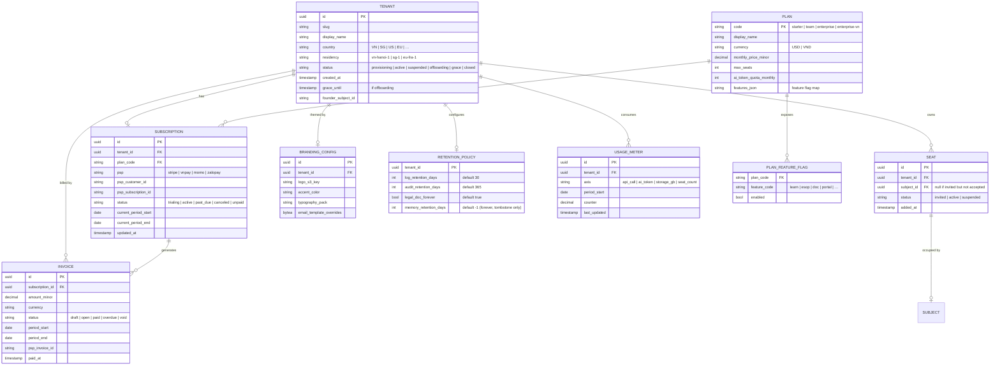

TEN is CyberOS's **tenant lifecycle + billing + isolation control plane**. It is the module without which CyberOS cannot exist as a paying-customer SaaS. The architecture is conventional: a Rust service for tenant CRUD + plan management + usage metering; Stripe for international card billing + invoicing; Vietnamese PSP integration (VnPay, Momo, ZaloPay) for VND domestic transactions; a tenant-admin SPA for seat management, audit-log review, residency / retention overrides; a signed-bundle exporter for portability + GDPR Art. 20. What is distinctive is the isolation invariant: TEN owns the per-tenant resource manifest (Postgres schema layout, NATS subject namespace, S3 bucket prefix, AI-gateway token quotas) and the verification harness that proves cross-tenant zero-leakage on every release. ARR / NDR / churn metrics roll up to a CFO dashboard. The 90-day offboarding grace is mandatory - even a hostile termination has 30 days of read-only access for export plus 60 days of dead-letter recoverability before irreversible wipe.

## At a glance

| Item | Detail |
|---|---|
| Strategic role | SaaS-ification spine: tenant lifecycle + billing + isolation |
| Status | P2 slice / P4 full (P2-exit billing slice; P4-mid+ full) |
| P2 slice scope | Plans + Stripe - enables vertical-pack pricing |
| P4 full scope | Self-serve + VN PSP + offboarding (<= 30s signup + 90d grace) |
| Plan tiers | 3: Starter, Team, Enterprise |
| Billing rails | Stripe + VN-PSP; USD + VND multi-currency |
| Metering axes | 4: seats, API, AI tokens, storage |
| Isolation layers | 3: PG RLS, NATS subject, S3 prefix |
| Residency options | 4: sg-1, eu-1, us-1, vn-1 |
| Offboarding | 90 d grace: 30d read-only + 60d recover |
| Cross-leak target | 0 - hard floor, CI gate |
| Depends on | AUTH, memory, OBS + Stripe, VnPay, Momo |

## The bigger picture - three strategic roles

TEN is the module that turns CyberOS from "Stephen's internal OS" into "a thing you can buy." But the naive plan - full multi-tenant SaaS at P4 - leaves money on the table for two years. Research review §7.3 caught this: the vertical-pack moat (cyberskill-vn at $X/year, sg + id + th + eu + us at $Y/year) requires billing infrastructure at P2, not P4. So TEN ships in two passes: a thin slice at P2-exit (plans + Stripe + per-tenant cost cap) just enough to charge for vertical packs; full SaaS at P4 (P4-mid+) with self-serve signup + VN-PSP + offboarding.

**Role 1 - Tenant lifecycle owner.** Provision, upgrade, suspend, offboard. The state machine: trial -> active -> suspended -> terminating -> terminated. Every transition emits an audit row + triggers downstream effects (seat limit changes propagate to AUTH; storage caps adjust in S3 lifecycle; residency pinning flows through to AI Gateway). At P2 the lifecycle is admin-driven (CyberSkill ops creates tenants); at P4 it's self-serve. Hostile termination - including non-payment - still gets 90 days of grace before irreversible delete.

**Role 2 - Billing slice (P2 thin, P4 full).** Stripe at P2, VN-PSP at P4, vertical-pack rails. P2 ships the minimum viable billing: Stripe for international cards (USD + EUR + SGD), 3-plan structure (Starter / Team / Enterprise), per-tenant cost cap enforced via AI Gateway. This is enough to charge for vertical packs (cyberskill-vn + sg + id + ...) which are the compounding margin. P4 adds VnPay/Momo/ZaloPay for VND domestic, self-serve signup, in-app billing UI, automated dunning. The 4-axis metering (seats, API, AI tokens, storage) feeds invoice line items.

**Role 3 - Residency enforcement.** Data lives where law says, zero cross-leak. Tenant residency is pinned at signup (sg-1 / eu-1 / us-1 / vn-1) and propagates through every layer: Postgres shard, S3 region, AI Gateway model-alias resolution, OBS retention region. PDPL Art. 38 (cross-border) + EU AI Act + GDPR Data Boundary all enforce at TEN. The cross-leak target is 0 - a property-based CI test rejects any release where a tenant in residency X could read data of residency Y.

### TEN in the runtime - what depends on what

Diagram source (Mermaid, flattened during migration):

```mermaid
flowchart TB EXT_CUST["External Customer  
self-serve signup (P4) /  
ops-created (P2)"] TEN["🏢 TEN  
lifecycle · billing · residency · metering"] subgraph billing["Billing rails"] STRIPE["💳 Stripe (international)"] VNPAY["🇻🇳 VnPay (domestic)"] MOMO["📱 Momo / ZaloPay"] end subgraph internal["Modules that obey TEN policy"] AUTH["🔐 AUTH  
tenant_id JWT claim · seat limit"] AI["⚡ AI Gateway  
cost cap · residency × provider"] memory["🧠 memory  
per-tenant store · sync_class"] OBS["👁 OBS  
retention tier · regulator views"] PROJ["📋 PROJ + 17 modules  
per-tenant RLS"] end subgraph audit["Audit + compliance"] BRAUDIT["🧠 memory audit chain"] CFO["📊 CFO dashboard  
ARR · NDR · churn"] end EXT_CUST --> TEN TEN --> STRIPE TEN --> VNPAY TEN --> MOMO TEN -->|"plan + seat policy"| AUTH TEN -->|"cost cap + residency"| AI TEN -->|"per-tenant store provisioning"| memory TEN -->|"retention tier"| OBS TEN -->|"tenant_id + RLS init"| PROJ TEN --> BRAUDIT TEN --> CFO classDef hub fill:#fef6e0,stroke:#9c750a,stroke-width:3px,color:#45210e classDef billing fill:#dcfce7,stroke:#15803d classDef mod fill:#e0e7ff,stroke:#3730a3 classDef audit fill:#f5ede6,stroke:#45210e class TEN hub class STRIPE,VNPAY,MOMO billing class AUTH,AI,memory,OBS,PROJ mod class BRAUDIT,CFO audit
```

### Auto vs human-in-loop operations matrix

Operation| How it happens| Why this split
---|---|---
Tenant provisioning (P4 self-serve)| **Auto** <= 30 s from signup form| The 30s budget includes Postgres schema init + S3 prefix + NATS subjects + tenant_admin invite email; degraded mode falls back to async with progress page.
Tenant provisioning (P2 ops-driven)| **Manual** CLI: `cyberos-ten provision <tenant>`| P2 doesn't have self-serve UI; CyberSkill ops creates tenants for vertical-pack customers.
Plan upgrade| **Auto** via in-app + Stripe portal| Pro-rata + invoice update; effective immediately for seat increases; takes effect next billing cycle for plan-tier change.
Plan downgrade with quota violation| **Human-confirm** - show data overage + 30-day grace before suspension| Forcing immediate data deletion violates user trust; grace period gives time to clean up.
Suspension (non-payment)| **Auto** after 14 d past-due + 3 notices| Standard SaaS dunning; suspension = read-only, not deletion.
Termination (suspension > 90 d)| **Auto-trigger**, **human-confirm** attestation| The trigger is automatic; the actual irreversible delete requires CSO + CLO sign-off + memory audit row.
Residency change request| **Human-driven** migration job| Cross-region data move is a multi-day operation; never auto-triggered.
Cross-leak detection (CI gate)| **Auto-block** at PR merge| Property-based test runs on every PR touching tenant code paths; cross-leak = release blocked.
DSAR export request| **Auto** bundle generation; **human delivery** to subject| Bundle is auto; DPO confirms delivery method per the subject's preference.

## P2 thin slice scope - minimum billing for vertical packs

The TEN-billing thin slice at P2 (P2-exit) is the minimum infrastructure to charge tenants for vertical packs without building the full P4 SaaS. This section locks the scope; anything not in the table is explicitly deferred to P4.

### P2 thin slice - what ships vs what defers

Capability| P2 thin slice (P2-exit)| P4 full (P4-mid+)
---|---|---
**Tenant provisioning**| CLI: `cyberos-ten provision` (ops-driven)| Self-serve signup form <= 30 s
**Plan tiers**| 3 hardcoded (Starter / Team / Enterprise)| Dynamic + per-tenant custom
**Payment rails**| Stripe only (USD / EUR / SGD)| + VnPay / Momo / ZaloPay for VND
**Metering**| All 4 axes (seats, API, AI tokens, storage)| Same (no change at P4)
**Invoicing**| Monthly Stripe-generated invoice| + in-app billing portal + dunning automation
**Cost cap enforcement**| AI Gateway integration only| + storage cap + API rate cap
**Tenant-admin UI**| -| Full SPA (seats / audit / residency / retention)
**Residency pinning**| 4 options at provision time (no change after)| + residency migration job (multi-day operation)
**Offboarding**| CLI: `cyberos-ten terminate` + 30-day grace| Full 90-day grace + attestation
**DSAR / signed bundle export**| CLI: `cyberos-ten export`| + in-app export request UI
**Compliance views (regulator-scoped)**| Via OBS §2.7| Same (no change at P4)
**Cross-leak CI gate**| Required at P2| Same (locked invariant)

The P2 slice is "enough infrastructure to charge for vertical packs without building UI." UI comes at P4. The cross-leak CI gate, however, ships at P2 - it's a protocol invariant, not a feature.

### Plan-tier x usage budget

Tier| Seats| AI tokens / month| Storage| API / month| Price (USD/month base)| Vertical pack add-on
---|---|---|---|---|---|---
**Starter**| <= 10| 500k| 20 GB| 500k| $49 / seat| + $99 / pack / month
**Team**| <= 50| 5M| 200 GB| 5M| $39 / seat| + $79 / pack / month
**Enterprise**| Unlimited| Custom (negotiated)| Custom| Custom| Custom| + negotiated

Vertical packs (cyberskill-vn, cyberskill-sg, etc. per SKILL §3.6) are priced as a per-tenant monthly add-on, not per-seat. This is the compounding margin - packs scale with tenant count, not seat count.

## Residency x jurisdiction matrix - data lives where law says

Residency is pinned at signup. Once chosen, it propagates to every layer (Postgres shard, S3 region, AI Gateway provider, OBS retention region). A residency change is a multi-day migration job - never automatic. This is the protocol-level guarantee that PDPL Art. 38, EU AI Act, and GDPR Data Boundary are enforced architecturally, not by policy.

### Residency option x infra mapping

Residency| Postgres shard| S3 region| AI Gateway providers| OBS retention region| Compliance regime
---|---|---|---|---|---
**sg-1** (Singapore)| RDS ap-southeast-1| S3 ap-southeast-1| Bedrock AP-SE-1, Anthropic, OpenAI| S3 ap-southeast-1| PDPA-SG + PDPL-VN cross-border under DPA
**eu-1** (Frankfurt)| RDS eu-central-1| S3 eu-central-1| Bedrock EU-CENTRAL, Vertex EU, Anthropic EU| S3 eu-central-1| GDPR + EU AI Act + EU Data Boundary
**us-1**| RDS us-east-1| S3 us-east-1| Bedrock US-EAST, Anthropic, OpenAI, Vertex US| S3 us-east-1| CCPA + state-level privacy laws
**vn-1** (Vietnam)| VN-hosted (P3+) / RDS ap-southeast-1 + PDPL DPA (P2)| VN-hosted + bilateral DPA| Bedrock AP-SE-1 + PDPL DPA, Anthropic with VN DPA| VN-hosted| PDPL (Law 91/2025) + Decree 13/2023

### Cross-leak CI gate (the protocol invariant)

Every PR touching code under `services/ten/` or any module's tenant-aware path runs a property-based test:

- Generate a tenant A in residency X and tenant B in residency Y.
- Insert data for both tenants.
- Authenticated as tenant A, attempt 200+ random queries that try to reach tenant B's data (via SQL injection, label manipulation, ID enumeration, JWT crafting, etc.).
- All 200 queries must return either empty results or `403_TENANT_SCOPE_VIOLATION` - never tenant B's data.
- Repeat for every layer: Postgres, S3, NATS, AI Gateway cache, OBS query proxy.

Any test failure blocks merge. Cross-leak rate = 0 is the hard floor.

## 90-day offboarding contract - irreversible delete with grace

The biggest trust signal in B2B SaaS is "how do you handle me leaving?" TEN's answer: 90 days of grace, signed-bundle export, attestation of delete, with cryptographic proof. Even a hostile termination - non-payment, ToS violation, customer fraud - gets the full 90 days. This is GDPR Art. 17 + PDPL Art. 7 + customer trust as one contract.

### The 90-day timeline

Phase| Days| Capabilities| Audit events emitted
---|---|---|---
**Active**| -| Full read/write across all modules| -
**Terminating-A**| Days 1-30| Read-only access for tenant admin; export bundle download available; no new writes| `ten.terminate_initiated`, `ten.export_generated`
**Terminating-B**| Days 31-90| No login; dead-letter recovery only (CSO can restore on tenant request)| `ten.recovery_window_entered`
**Terminated**| Day 91+| Irreversible delete, cryptographic attestation, only audit-chain anchors remain| `ten.permanent_delete` with signed attestation

### Signed bundle export - the portability contract

The export bundle contains:

- **memory snapshot**: every memory file + audit chain segments, deterministic zip per memory §10.
- **Module data dumps**: per-module Postgres pg_dump SQL files (PROJ, CRM, KB, etc.).
- **S3 attachments**: zip of all binary attachments referenced by module data.
- **Tenant config**: plan history, residency pinning, persona overrides, billing history.
- **Audit log slice**: full memory audit chain for the tenant + chain-of-custody manifest.
- **Manifest with Ed25519 signature**: proves the bundle is unmodified since export.

The bundle is portable - another deployment of CyberOS could import it as a new tenant. This is GDPR Art. 20 (data portability) satisfied architecturally.

### Permanent-delete attestation

```json
// Day 91: TEN executes permanent delete + emits this attestation
{
  "op": "put",
  "path": "meta/ten-terminations/2026-08-15_acme-corp.md",
  "extra": {
    "tenant_id": "org:acme-corp",
    "tenant_residency": "sg-1",
    "terminate_initiated_at": "2026-05-15T00:00:00Z",
    "permanent_delete_at": "2026-08-15T00:00:00Z",
    "rows_deleted": { "memory_memories": 14820, "proj_issues": 4217, "crm_contacts": 942, "s3_objects": 1024, "...": "..." },
    "delete_method": "crypto_shred_at_storage_layer + 7_pass_overwrite",
    "attested_by": ["cso@cyberskill.world", "clo@cyberskill.world"],
    "audit_chain_anchor_before": "8d2c…5a91",
    "audit_chain_anchor_after": "9f8e…1d2c",
    "ed25519_signature": "…"
  },
  "chain": "…"
}
```

The attestation row is itself _not_ deletable - it's an anchor in the audit chain that proves the tenant was terminated correctly. PDPL Art. 7 + GDPR Art. 17 satisfied: the right to erasure is exercised, but the _fact_ of erasure is itself preserved.

## Why TEN exists

CyberOS is multi-tenant by construction from day one - every table has `tenant_id`, every NATS subject is namespaced, every S3 bucket key is prefixed. But until TEN lands, the system runs as a single-tenant instance (DEC-058 - _tenant-as-degenerate-tenant_). TEN is the module that activates the second tenant, then the hundredth, then the thousandth. It owns three things: (1) tenant lifecycle - signup, plan change, suspension, offboarding; (2) billing - international (Stripe) + domestic VN (VnPay / Momo / ZaloPay); (3) the verification harness that proves tenant isolation has not regressed. Without TEN, CyberOS remains an internal tool. With TEN, CyberOS is a product.

- **Self-serve signup <= 30s:** Org name, residency choice, plan, payment -> tenant provisioned, first founder logged in. No "contact us" friction at Starter / Team tiers.
- **Dual billing rails:** Stripe for international + USD invoices; VnPay / Momo / ZaloPay for VND domestic. PCI scope is Stripe / PSP, never CyberOS.
- **Isolation is verifiable:** The isolation harness in `tests/ten/isolation/` runs 100k cross-tenant probes against PG / NATS / S3 on every release. Zero leaks is a release gate.

The bet is that the value of CyberOS unlocks at N>1 tenants - the memory compounding, the audit chain, the agent surface - and TEN is the on-ramp. Pricing is plan-tier-anchored at Starter / Team / Enterprise; usage metering is informational at P4 (no per-API overage) but feeds future revenue-ops at P4+. The 90-day offboarding grace is partly a customer-experience commitment and partly a GDPR Art. 20 (portability) + Art. 17 (erasure) compliance posture.

## What it does - 5W1H2C5M

A structured decomposition of TEN's scope.

Axis| Question| Answer
---|---|---
**5W - What**| What is TEN?| A tenant lifecycle + billing + isolation control-plane service. Owns Tenant, Plan, Subscription, Seat, BrandingConfig, UsageMeter, RetentionPolicy. Integrates Stripe + Vietnamese PSPs. Operates the cross-tenant isolation verification harness.
**5W - Who**| Who uses it?| **Prospective customers:** self-serve signup. **Tenant admins:** seat / billing / audit / retention via tenant-admin SPA. **CFO (CyberSkill):** ARR / NDR / churn dashboards. **CCO (CyberSkill):** upgrade routing. **Agents:** usage-metering scheduled jobs.
**5W - When**| When does it run?| On-demand for signup, plan change, offboarding. Continuous for usage metering (per-NATS-event aggregation). Daily for billing-reconciliation. Monthly for ARR snapshot + churn calculation.
**5W - Where**| Where does it run?| P4: SG-1 control plane; per-tenant data partition lives in the residency chosen at signup (vn-hanoi-1 for VN, sg-1 for SG, eu-fra-1 for EU at P4+). Stripe API in stripe.com regions; VN PSPs in VN.
**5W - Why**| Why a separate module?| Because the multi-tenant control plane is its own primary concern - distinct from any one feature module. SOC 2 / ISO 27017 expect this control plane to be auditable and isolated from the application layer.
**1H - How**| How does it work?| Signup flow: account create -> residency pick -> plan pick -> payment method capture -> tenant provision (schema namespace + S3 prefix + NATS subject + AUTH tenant row + first founder Subject + default RBAC seed) -> SSO + first-login redirect. Usage metering: per-tenant NATS subject aggregator; nightly rollup; monthly invoice generation.
**2C - Cost**| Cost budget?| P4: control plane ~$60 / month (Fargate + Postgres for control state + Redis). Stripe pass-through fee 2.9% + 30c; VN PSPs ~1.5% + 1,000 VND. Per-tenant ongoing infra: ~$5-$80 / month depending on plan.
**2C - Constraints**| Constraints?| (a) Zero cross-tenant data leakage (SOC 2 CC6.6 + (NFR pending)). (b) PCI scope minimisation - CyberOS never touches PAN. (c) Vietnamese PSP regulations (Circular 18/2018/TT-NHNN). (d) GDPR Art. 20 portability + Art. 17 erasure. (e) Tenant signup <= 30s p95.
**5M - Materials**| Stack?| Rust 1.81, axum, sqlx, PostgreSQL 16, Redis 7, Stripe Rust SDK, VnPay / Momo / ZaloPay HTTP clients, NATS JetStream, AWS Fargate, OpenTelemetry.
**5M - Methods**| Method choices?| Tenant provisioning is idempotent + atomic across modules (saga pattern). Usage metering is event-sourced (NATS aggregates -> cumulative counters). Offboarding is two-phase: read-only-30d -> recoverable-60d -> wipe. Billing reconciliation is a per-PSP scheduled job.
**5M - Machines**| Deployment?| Fargate control-plane task + scheduled-job task. Per-tenant data partition keyed by residency-region.
**5M - Manpower**| Who maintains?| 0.6 FTE at P4 + revenue-ops part-time. CFO seat owns billing + revenue dashboards. CSO seat owns isolation verification.
**5M - Measurement**| How measured?| (NFR pending) = 0 cross-tenant leaks, (NFR pending) signup <= 30s p95. KPIs: ARR, NDR, churn, CAC, seat-utilisation per tenant, isolation-probe pass rate.

## Architecture

TEN is a Rust control-plane service plus a tenant-admin SPA, integrated with Stripe + VN PSPs and a per-tenant usage-metering pipeline. Tenant provisioning is implemented as a saga across AUTH (create tenant + first Subject), memory (initialise audit chain), all module DBs (create schema-scoped rows), and S3 (create bucket prefix). Offboarding is the inverse saga with a 90-day grace window.

Diagram source (Mermaid, flattened during migration):

```mermaid
graph TB subgraph PUBLIC ["Public surfaces"] SIGN["Signup SPA  
(unauth)"] ADMIN["Tenant-admin SPA  
(post-signup)"] BILL["Billing UI"] end subgraph TEN ["TEN service (Rust · axum)"] SU["signup.rs  
signup flow"] PROV["provisioner.rs  
tenant saga"] PLAN["plan.rs  
plan / subscription CRUD"] SEAT["seat.rs  
seat add/remove"] BRAND_S["branding.rs  
brand pack"] METER["meter.rs  
usage aggregation"] ISO["isolation.rs  
verification harness"] OFFBOARD["offboard.rs  
90d grace + wipe"] EXPORT["export.rs  
signed bundle"] ARR["arr.rs  
revenue rollup"] end subgraph PSP ["Payment partners"] STRIPE["💳 Stripe  
international + USD"] VNPAY["🇻🇳 VnPay"] MOMO["🇻🇳 Momo"] ZALO["🇻🇳 ZaloPay"] end subgraph DOWNSTREAM ["Module orchestration"] AUTH_M["🔐 AUTH  
tenant + founder Subject"] MEMORY_M["🧠 memory  
chain init"] ALL_M["all 21 modules  
schema namespace"] S3_M["S3 prefix"] NATS_M["NATS subject"] AI_M["🧠 AI gateway  
per-tenant quota"] end subgraph STORES ["Control-plane stores"] PG[("PostgreSQL  
ten.tenant · plan  
subscription · seat  
branding · usage_meter  
retention_policy")] REDIS[("Redis 7  
signup-flow state")] NATS_USAGE[("NATS JetStream  
tenant.*.usage.*")] end subgraph SINKS ["Audit + ops"] memory["🧠 memory  
tenant.* rows"] OBS["👁 OBS"] CFO["💰 CFO dashboard  
ARR / NDR / churn"] end SIGN --> SU ADMIN --> PLAN ADMIN --> SEAT ADMIN --> BRAND_S BILL --> PLAN SU --> PROV PROV --> AUTH_M PROV --> MEMORY_M PROV --> ALL_M PROV --> S3_M PROV --> NATS_M PROV --> AI_M PLAN --> STRIPE PLAN --> VNPAY PLAN --> MOMO PLAN --> ZALO NATS_USAGE --> METER METER --> PG ISO --> PG ISO --> NATS_M ISO --> S3_M OFFBOARD --> ALL_M EXPORT --> S3_M ARR --> CFO TEN --> memory TEN --> OBS classDef planned fill:#e2e8f0,stroke:#1e293b classDef store fill:#f5f3ff,stroke:#7c3aed classDef sink fill:#f5ede6,stroke:#45210e classDef partner fill:#fef2f2,stroke:#7f1d1d class SIGN,ADMIN,BILL,SU,PROV,PLAN,SEAT,BRAND_S,METER,ISO,OFFBOARD,EXPORT,ARR,AUTH_M,MEMORY_M,ALL_M,S3_M,NATS_M,AI_M planned class PG,REDIS,NATS_USAGE store class memory,OBS,CFO sink class STRIPE,VNPAY,MOMO,ZALO partner
```

### Internal components

Component| Path (planned)| Responsibility
---|---|---
`signup.rs`| services/ten/src/signup.rs| Self-serve signup flow. Captures org name, residency choice, plan tier, founder email, payment method.
`provisioner.rs`| services/ten/src/provisioner.rs| Tenant provisioning saga. Idempotent + atomic across AUTH / memory / module DBs / S3 / NATS / AI. Compensating actions on partial failure.
`plan.rs`| services/ten/src/plan.rs| Plan CRUD. Subscription lifecycle. Feature flags per tier (e.g., LEARN locked at Starter, available at Team+).
`seat.rs`| services/ten/src/seat.rs| Seat add / remove / invite. Enforces plan-tier seat caps.
`branding.rs`| services/ten/src/branding.rs| Per-tenant brand pack - @cyberskill/tokens override layer. Logo, colour anchors, email templates, custom-domain integration with PORTAL.
`meter.rs`| services/ten/src/meter.rs| Usage metering. NATS aggregator subscribes to `tenant.{id}.usage.{kind}` subjects; nightly rollup; monthly snapshot.
`billing.rs`| services/ten/src/billing.rs| Stripe integration: customer + subscription + invoice + webhook handling.
`vnpsp.rs`| services/ten/src/vnpsp.rs| VnPay / Momo / ZaloPay adapters. Single trait, multiple impls. VND-denominated.
`isolation.rs`| services/ten/src/isolation.rs| Cross-tenant verification harness. 100k probes against PG RLS, NATS subject ACL, S3 prefix IAM on every release.
`offboard.rs`| services/ten/src/offboard.rs| 90-day offboarding flow: 30d read-only -> 60d recoverable -> wipe. Pre-generates export bundle.
`export.rs`| services/ten/src/export.rs| Signed-bundle exporter. Full tenant data dump: memory deterministic zip + per-module data + manifest with SHA-256 + Ed25519 signature.
`retention.rs`| services/ten/src/retention.rs| Per-tenant retention policy override. Defaults: 30 days (logs), 365 days (audit), forever (legal docs).
`arr.rs`| services/ten/src/arr.rs| Revenue rollup: ARR / MRR / NDR / GRR / churn / CAC. Daily snapshot, monthly review.
`migrations/`| services/ten/migrations/| sqlx migrations. Tenant rows in control plane; RLS on every row by tenant_id.

**TEN-INV-001 - Zero cross-tenant data leakage.** Three-layer enforcement: (1) PostgreSQL RLS keyed by `tenant_id` on every row in every module's database; (2) NATS subject ACL keyed by `tenant.{id}.*` namespace; (3) S3 bucket-prefix IAM scoped per tenant. The isolation harness runs 100k randomised cross-tenant probes against all three layers on every release; any leak halts deploys. SOC 2 CC6.6 + ISO 27017 control objective. Verification: `tests/ten/isolation/` + nightly chaos in staging.

**TEN-INV-002 - Tenant provisioning is atomic + idempotent.** The provisioner saga has explicit compensating actions for partial failure at any of the ~8 steps (AUTH tenant, AUTH Subject, memory init, module DB schemas, S3 prefix, NATS subject, AI quota, billing customer). Idempotent on replay via deterministic tenant slug. Property-tested with crash injection at every step.

## Data model

Seven primitives: Tenant (the org), Plan (catalogue), Subscription (the active plan + billing state), Seat (paid headcount slot), BrandingConfig, UsageMeter (per-axis counter), RetentionPolicy. Audit lives in memory.

Diagram source (Mermaid, flattened during migration):



### Plan-tier matrix (planned)

Plan| Currency| Price| Seats| AI tokens/mo| Modules locked
---|---|---|---|---|---
`starter`| USD| $49 / mo| 10| 500k| OKR, REW, ESOP, DOC, PORTAL
`team`| USD| $249 / mo| 50| 3M| ESOP, DOC, PORTAL
`enterprise`| USD| custom| custom| custom| none (all enabled)
`starter-vn`| VND| 1,190,000 VND / mo| 10| 500k| OKR, REW, ESOP, DOC, PORTAL
`team-vn`| VND| 5,990,000 VND / mo| 50| 3M| ESOP, DOC, PORTAL
`enterprise-vn`| VND| custom| custom| custom| none

## API surface

Public REST for signup (unauth), federated GraphQL for tenant admin (post-signup), PSP webhook endpoints, and MCP tools for the tenant admin AI assistant.

### GraphQL subgraph (federated, tenant-admin scope)

```graphql
extend schema
 @link(url: "https://specs.apollo.dev/federation/v2.5", import: ["@key", "@external", "@shareable", "@requiresScopes"])

type Tenant @key(fields: "id") {
 id: ID!
 slug: String!
 displayName: String!
 country: String!
 residency: String!
 status: TenantStatus!
 subscription: Subscription
 seats: [Seat!]!
 branding: BrandingConfig
 usage: [UsageMeter!]!
 retentionPolicy: RetentionPolicy!
 createdAt: DateTime!
 graceUntil: DateTime
}

type Plan @key(fields: "code") {
 code: String!
 displayName: String!
 currency: String!
 monthlyPriceMinor: Int!
 maxSeats: Int!
 aiTokenQuotaMonthly: Int!
 features: [PlanFeatureFlag!]!
}

type PlanFeatureFlag {
 featureCode: String!
 enabled: Boolean!
}

type Subscription @key(fields: "id") {
 id: ID!
 plan: Plan!
 status: SubscriptionStatus!
 currentPeriodStart: Date!
 currentPeriodEnd: Date!
 psp: PspProvider!
}

type Seat @key(fields: "id") {
 id: ID!
 subjectId: ID
 email: String
 status: SeatStatus!
 addedAt: DateTime!
}

type BrandingConfig {
 logoUrl: String
 accentColor: String!
 typographyPack: String!
}

type UsageMeter {
 axis: UsageAxis!
 periodStart: Date!
 counter: Float!
}

type RetentionPolicy {
 logRetentionDays: Int!
 auditRetentionDays: Int!
 legalDocForever: Boolean!
 memoryRetentionDays: Int!
}

type Invoice {
 id: ID!
 amountMinor: Int!
 currency: String!
 status: InvoiceStatus!
 periodStart: Date!
 periodEnd: Date!
 paidAt: DateTime
}

enum TenantStatus { PROVISIONING ACTIVE SUSPENDED OFFBOARDING GRACE CLOSED }
enum SubscriptionStatus { TRIALING ACTIVE PAST_DUE CANCELED UNPAID }
enum SeatStatus { INVITED ACTIVE SUSPENDED }
enum PspProvider { STRIPE VNPAY MOMO ZALOPAY }
enum UsageAxis { API_CALL AI_TOKEN STORAGE_GB SEAT_COUNT }
enum InvoiceStatus { DRAFT OPEN PAID OVERDUE VOID }

type Query {
 myTenant: Tenant! @requiresScopes(scopes: [["ten.admin"]])
 myInvoices(year: Int): [Invoice!]! @requiresScopes(scopes: [["ten.admin"]])
 availablePlans(country: String): [Plan!]!
}

type Mutation {
 changePlan(planCode: String!): Subscription! @requiresScopes(scopes: [["ten.admin"]])
 inviteSeat(email: String!): Seat! @requiresScopes(scopes: [["ten.admin"]])
 revokeSeat(seatId: ID!): Seat! @requiresScopes(scopes: [["ten.admin"]])
 updateBranding(input: BrandingInput!): BrandingConfig! @requiresScopes(scopes: [["ten.admin"]])
 setRetentionOverride(input: RetentionInput!): RetentionPolicy!
 @requiresScopes(scopes: [["ten.admin"]])
 initiateOffboarding(reason: String!): Tenant! @requiresScopes(scopes: [["ten.founder"]])
 cancelOffboarding: Tenant! @requiresScopes(scopes: [["ten.founder"]])
}
```

### REST endpoints

Method| Path| Purpose
---|---|---
GET| `/signup/plans?country=VN`| List available plans for a country.
POST| `/signup/start`| Begin signup; returns signup_token.
POST| `/signup/payment`| Attach payment method (Stripe SetupIntent or VnPay vault).
POST| `/signup/finalize`| Provision tenant; returns first-login redirect.
POST| `/billing/stripe/webhook`| Stripe webhook (signature-verified).
POST| `/billing/vnpay/webhook`| VnPay IPN handler.
POST| `/billing/momo/webhook`| Momo IPN handler.
POST| `/billing/zalopay/webhook`| ZaloPay IPN handler.
GET| `/tenants/{id}/export-bundle`| Generate or fetch signed export bundle.
GET| `/tenants/{id}/usage.csv?period=YYYY-MM`| Monthly usage roll-up CSV.
POST| `/admin/isolation/probe`| Trigger isolation-harness run.
GET| `/admin/arr.json`| ARR / NDR / churn snapshot (CFO scope).

### MCP tool catalogue

Tool name| Inputs| Outputs| Annotations
---|---|---|---
`cyberos.ten.tenant_status`| -| Tenant| readonly, scope=ten.admin
`cyberos.ten.invite_seat`| email| {seat_id, invite_link}| scope=ten.admin, human-confirm
`cyberos.ten.revoke_seat`| seat_id| {ok}| destructive, scope=ten.admin, human-confirm
`cyberos.ten.change_plan`| plan_code| {subscription}| destructive, scope=ten.admin, founder-confirm
`cyberos.ten.usage_report`| period| UsageReport| readonly
`cyberos.ten.export_bundle`| -| {bundle_url, sha256}| destructive, scope=ten.founder
`cyberos.ten.initiate_offboard`| reason| {grace_until}| destructive, scope=ten.founder, human-confirm-twice
`cyberos.ten.cancel_offboard`| -| {ok}| destructive, scope=ten.founder
`cyberos.ten.set_retention`| RetentionInput| RetentionPolicy| scope=ten.admin, CLO-confirm if reducing

## Key flows

### Flow 1 - Self-serve tenant signup

```mermaid
sequenceDiagram autonumber participant U as Prospective customer participant SPA as signup SPA participant S as signup.rs participant ST as Stripe (or VnPay) participant P as provisioner.rs (saga) participant AUTH as 🔐 AUTH participant memory as 🧠 memory participant ALL as all 21 modules (schema init) participant S3 as S3 prefix participant NATS as NATS subject ACL participant AI as 🧠 AI gateway U->>SPA: choose plan, residency, org name, founder email SPA->>S: POST /signup/start S->>ST: create customer + setup intent ST-->>S: client_secret S-->>SPA: payment form U->>SPA: enter card (or VnPay redirect) SPA->>ST: confirm payment method ST-->>SPA: ok SPA->>S: POST /signup/finalize S->>P: run provisioning saga par tenant saga (atomic) P->>AUTH: createTenant + founder Subject + roles P->>memory: init audit chain for tenant P->>ALL: provision schema for each module P->>S3: create bucket prefix s3:/…/{tenant_id}/ P->>NATS: create subject ACL tenant.{id}.* P->>AI: register tenant + AI-token quota end P->>memory: append tenant.provisioned root row P-->>S: ready S->>U: 302 redirect to first-login (magic link emailed to founder) Note over P: total elapsed ≤ 30s p95
```

The saga has compensating actions at every step. If any step fails after partial commit, the saga unwinds the prior steps and surfaces the failure to the user with a refund / retry path.

### Flow 2 - Plan upgrade (Team -> Enterprise)

```mermaid
sequenceDiagram autonumber participant F as Founder participant ADMIN as tenant-admin SPA participant PL as plan.rs participant ST as Stripe participant FF as feature_flag service participant B as 🧠 memory F->>ADMIN: choose Enterprise → confirm ADMIN->>PL: changePlan(plan=enterprise) PL->>ST: update_subscription(items=[…enterprise…]) ST-->>PL: prorated invoice generated PL->>FF: refresh feature flags (DOC + PORTAL + ESOP unlock) FF->>FF: invalidate per-tenant cache PL->>B: append subscription.upgraded row {from:team, to:enterprise} PL-->>ADMIN: success ADMIN-->>F: "Upgrade complete — modules unlocked"
```

### Flow 3 - Tenant offboarding (90-day grace)

```mermaid
sequenceDiagram autonumber participant F as Founder participant ADMIN as tenant-admin SPA participant O as offboard.rs participant E as export.rs participant PL as plan.rs participant CR as cron (daily sweep) participant ALL as all module DBs participant B as 🧠 memory F->>ADMIN: initiateOffboarding(reason) ADMIN->>O: confirm-twice flow (typed slug) O->>PL: cancel subscription at period_end O->>E: pre-generate export bundle E->>ALL: dump per-tenant data (RLS-scoped) E->>memory: memory deterministic zip E->>O: bundle ready (s3:/…/exports/{tenant}/bundle.zip + sig) O->>memory: append tenant.offboarding_started row O-->>ADMIN: grace_until = now + 30d Note over CR: day 1–30: read-only access; export downloadable Note over CR: day 31–90: tenant suspended; bundle still downloadable CR->>O: day 91 sweep O->>ALL: wipe tenant_id rows (cascading delete) O->>S3: wipe prefix O->>NATS: revoke subject ACL O->>memory: append tenant.wiped row (audit fact survives) O->>F: email "Attestation: tenant X fully erased on YYYY-MM-DD"
```

### Flow 4 - Brand customization (CNAME + theme)

```mermaid
sequenceDiagram autonumber participant F as Founder participant ADMIN as tenant-admin SPA participant BR as branding.rs participant PORTAL as 🌐 PORTAL service participant S3 as S3 (logo asset) participant ACM as AWS ACM participant B as 🧠 memory F->>ADMIN: upload logo + pick accent color ADMIN->>S3: upload logo asset ADMIN->>BR: updateBranding(logo_s3_key, accent, typography) BR->>BR: validate (CSP-safe, hex colour, supported typography pack) BR->>PORTAL: notify branding refresh PORTAL->>PORTAL: invalidate edge cache alt custom CNAME requested F->>ADMIN: claim portal.tenantname.com ADMIN->>PORTAL: forward to cname.rs (PORTAL module) PORTAL->>ACM: request cert end BR->>B: append branding.updated row BR-->>ADMIN: success
```

### Flow 5 - Usage metering rollup (per-tenant)

```mermaid
sequenceDiagram autonumber participant MODS as 21 module services participant NATS as NATS JetStream  
tenant.{id}.usage.* participant M as meter.rs participant PG as PostgreSQL (usage_meter) participant CR as cron (nightly) participant ARR as arr.rs participant CFO as CFO dashboard participant B as 🧠 memory loop continuous MODS->>NATS: publish tenant.{id}.usage.api_call (or.ai_token,.storage_gb) NATS->>M: deliver M->>PG: UPSERT usage_meter SET counter = counter + delta end Note over CR: nightly 02:00 ICT CR->>M: rollup snapshot for previous day M->>PG: write daily usage rows; flush per-event detail Note over CR: monthly 1st 03:00 ICT CR->>ARR: compute MRR / ARR / NDR / churn per tenant ARR->>PG: snapshot ARR->>CFO: push dashboard update ARR->>B: append revenue_snapshot.created row
```

## Tenant lifecycle

A tenant traverses six states across its lifetime. Offboarding has a mandatory two-phase grace period (read-only 30 days + recoverable 60 days) before irreversible wipe.

```mermaid
stateDiagram-v2 [*] --> Provisioning: signup saga running Provisioning --> Active: saga completes successfully Provisioning --> Failed: saga compensation; refund Active --> Suspended: billing past_due > 14d OR admin action Suspended --> Active: payment recovered or admin reactivate Active --> Offboarding: founder initiates close (confirm-twice) Suspended --> Offboarding: 60d past_due then auto-cancel Offboarding --> Grace: day 1 of 90d window Grace --> Active: founder cancels offboard (within 30d read-only window) Grace --> Closed: day 91 — sweep + wipe Closed --> [*] Failed --> [*]
```



### Per-state actions

State| Trigger| Side-effects
---|---|---
Provisioning| signup payment captured| Saga runs across 8 steps; idempotent; compensation on failure.
Active| Saga complete| Tenant usable; first-login email sent; AI quota armed; usage metering live.
Suspended| Past-due >= 14d OR admin| Login refused (soft "account paused"); data preserved; export still available.
Offboarding| Founder confirm-twice OR auto from suspended| Subscription cancelled at period_end; export bundle pre-generated; emails sent.
Grace (day 1-30 read-only)| Day 1 of grace| Read-only access; banner; founder can cancel offboard.
Grace (day 31-90 recoverable)| Day 31| Login refused; bundle still downloadable; admin can re-instate via support.
Closed| Day 91| Per-tenant rows wiped across modules; S3 prefix wiped; NATS ACL revoked; attestation emailed; `tenant.wiped` audit row remains in memory (forever).

## Functional requirements

The CyberOS FR catalogue is being rebuilt one feature at a time via the open [feature-request-author](https://github.com/cyberskill/cyberos/tree/main/modules/skill/feature-request-author) Agent Skill.

Previous FR enumerations were archived 2026-05-14 and are no longer reflected on this page. Specific FRs land here as they are re-authored.

## Non-functional requirements

TEN's NFRs are dominated by tenant isolation and signup-flow performance - the two metrics that determine whether CyberOS can run as a SaaS at scale.

NFR ID| Concern| Target| Measurement
---|---|---|---
(NFR pending)| Cross-tenant data leakage incidents| = 0 (sev-0)| 100k-probe isolation harness on every release + quarterly pen-test
(NFR pending)| PSP webhook signature verification| = 100% rejected unsigned| integration test
(NFR pending)| PCI scope| SAQ-A (Stripe / PSP handles PAN)| annual PCI attestation
(NFR pending)| Tenant signup end-to-end p95| <= 30 s| k6 + RUM
(NFR pending)| Plan upgrade p95| <= 5 s| k6
(NFR pending)| Tenant-admin SPA TTFB| <= 500 ms| RUM
(NFR pending)| TEN control-plane availability| >= 99.95%| SLO monitor
(NFR pending)| Tenant export bundle integrity| = 100% sha256-verified| cosign verification on every export
(NFR pending)| Provisioning saga atomicity under crash injection| 0 inconsistent tenants| chaos test (1000 runs)
(NFR pending)| Usage-meter accuracy vs ground truth (NATS replay)| <= 0.5% drift / 24h| weekly reconciliation
(NFR pending)| SOC 2 CC6.6 control objective| passed (annual)| external audit
(NFR pending)| ISO 27017 cloud-services controls| passed| external audit

## Dependencies

TEN depends on AUTH (tenant Subject), memory (audit chain), Stripe + VN PSPs, and all 21 other modules (for schema provisioning + offboarding wipe). It is consumed by every CyberOS user-facing surface - every API call traverses TEN's plan / feature-flag / quota check.

Diagram source (Mermaid, flattened during migration):

```mermaid
graph LR subgraph upstream ["TEN depends on"] AUTH["🔐 AUTH"] memory["🧠 memory"] OBS["👁 OBS"] AI["🧠 AI gateway"] NATS["📡 NATS JetStream"] S3["🗄 S3"] STRIPE["💳 Stripe"] VNPSP["🇻🇳 VnPay / Momo / ZaloPay"] end TEN["🏢 TEN"] subgraph downstream ["TEN orchestrates"] PROV["module provisioning  
(all 21 modules)"] BILL["billing flows"] METER["usage metering"] ISO["isolation harness"] OFF["offboarding"] end subgraph CONSUMERS ["Used by"] CFO_D["💰 CFO dashboard"] ADMIN["tenant-admin SPA"] EDGE["Apollo Router  
plan / quota gate"] PORTAL["🌐 PORTAL"] end AUTH --> TEN memory --> TEN OBS --> TEN AI --> TEN NATS --> TEN S3 --> TEN STRIPE --> TEN VNPSP --> TEN TEN --> PROV TEN --> BILL TEN --> METER TEN --> ISO TEN --> OFF TEN --> CFO_D TEN --> ADMIN TEN --> EDGE TEN --> PORTAL classDef planned fill:#e2e8f0,stroke:#1e293b classDef partner fill:#fef2f2,stroke:#7f1d1d class AUTH,memory,OBS,AI,NATS,S3,TEN,PROV,BILL,METER,ISO,OFF,CFO_D,ADMIN,EDGE,PORTAL planned class STRIPE,VNPSP partner
```

## Compliance scope

TEN is the SaaS-compliance hotspot. SOC 2, ISO 27001 multi-tenant controls, PCI SAQ-A, and Vietnamese PSP regulation all live here.

Regulation / standard| Article / clause| TEN feature that satisfies it
---|---|---
SOC 2 Type II| CC6.1 - Logical access| AUTH + plan/feature-flag gating; per-tenant scope.
SOC 2 Type II| CC6.6 - Restricted access| Three-layer isolation (PG RLS + NATS subject + S3 prefix); 100k-probe harness.
SOC 2 Type II| CC7.2 - System monitoring| Per-tenant usage telemetry; isolation-harness alerts.
ISO/IEC 27001:2022| A.5.30 - ICT readiness| Multi-region residency + offboarding grace.
ISO/IEC 27017| Cloud services controls| Tenant separation + signed-bundle portability.
ISO/IEC 27018| Privacy for PII| Per-tenant residency choice + retention-policy override.
PCI DSS| SAQ-A - Card-not-present| PAN never touches CyberOS; Stripe / PSP own PCI scope.
Vietnam Decree 53/2022| Art. 26 - Data localisation for VN tenants| Residency choice = vn-hanoi-1 for VN tenants.
Vietnam Circular 18/2018/TT-NHNN| Payment intermediary rules| VnPay / Momo / ZaloPay are SBV-licenced PSPs.
Vietnam Decree 13/2023| Personal data processing| Per-tenant retention policy + 90d offboarding grace.
Vietnam PDPL (Law 91/2025)| Art. 14 - DSAR| Signed-bundle export covers all tenant data.
GDPR (EU 2016/679)| Art. 20 - Right to portability| Signed-bundle export covers (FR pending).
GDPR| Art. 17 - Right to erasure| Offboarding wipe with audit attestation.
GDPR| Art. 28 - Processor obligations| DPA per tenant; sub-processor list on Trust Center.

## Risk entries

TEN risks tracked in the [risk register](../../reference/risk-register.html#ten).

ID| Risk| Likelihood| Impact| Owner| Mitigation
---|---|---|---|---|---
`R-TEN-001`| Information disclosure - billing data exposed across tenants| Medium| Catastrophic| CSO| Per-tenant billing key; PCI scope minimisation via Stripe; webhook signature verification.
`R-TEN-002`| Cross-tenant data leakage via RLS bypass| Low| Catastrophic| CSO| 100k isolation harness; RLS at PG + NATS subject + S3 prefix; release-gate enforcement.
`R-TEN-003`| Provisioning saga half-applied; tenant in inconsistent state| Medium| High| CTO| Compensating actions; chaos test with crash injection; idempotent replay.
`R-TEN-004`| Stripe webhook spoofing| Low| High| CSO| HMAC signature verification mandatory; replay-window enforcement; OBS alert on signature failure.
`R-TEN-005`| Premature wipe (offboarding bug deletes too early)| Low| Catastrophic| CTO| Two-phase grace (read-only 30d, recoverable 60d); cron job double-checks date + status; audit alarm.
`R-TEN-006`| VN PSP integration outage blocks domestic signup| Medium| Medium| CTO| Multi-PSP support (VnPay + Momo + ZaloPay); failover at signup.rs; degraded-mode banner.
`R-TEN-007`| Usage-meter drift causes revenue under/over-charge| Medium| Medium| CFO| NATS replay reconciliation weekly; <= 0.5% drift target; finance audit quarterly.
`R-TEN-008`| Plan-tier feature flag bypassed (tenant accesses locked module)| Low| Medium| CSO| Feature flag check at Apollo Router + module GraphQL; CI test gate.
`R-TEN-009`| Retention-override allows compliance breach| Low| High| DPO| Override bounded by DPO-configured min/max; CLO approves below-default values.
`R-TEN-010`| Export-bundle leaks via mis-scoped pre-signed URL| Low| High| CSO| Pre-signed URL audience-bound + 24h TTL; tenant-scope verified in URL signer.
`R-TEN-011`| Cancellation-saga compensation fails partially| Medium| Medium| CTO| Idempotent compensation; backup wipe-cron picks up partial state nightly.
`R-TEN-012`| SBV compliance change affecting VN PSP onboarding| Medium| Medium| CLO| Quarterly review of Circular 18/2018; PSP partner notification subscription.
`R-TEN-013`| P2 thin slice slips -> vertical-pack pricing has no billing rail -> margin moat delayed| Medium| High| CEO| Hard P2-exit ship gate per research review §7.3; thin-slice scope locked above; any P2-slice scope addition requires CEO ADR sign-off.
`R-TEN-014`| Residency change request mid-engagement (tenant moves SG -> EU)| Medium| High| CTO| Multi-day migration job with read-only window; never automatic; CSO + DPO sign-off; tested via quarterly drill on staging.
`R-TEN-015`| Hostile termination (customer fraud) requires premature wipe - but 90d grace blocks it| Low| Medium| CLO| Hostile-termination override exists for legal compliance (fraud, court order); requires CEO + CLO + CSO sign-off + court order or equivalent; emits enhanced audit chain.
`R-TEN-016`| Stripe DPA insufficient for EU residency -> customer rejection| Medium| Medium| CLO| EU tenants use Stripe Europe entity + EU-DPA; reviewed quarterly; backup plan: Mollie for EU-only customers if Stripe insufficient.
`R-TEN-017`| Plan downgrade with usage above new tier creates invoice surprise| Medium| Medium| CFO| Downgrade enforces 30-day grace + overage visible in admin UI; final pro-rated invoice shows overage; never silent surprise.
`R-TEN-018`| Cross-leak CI gate has gap (new cross-tenant code path lands without harness coverage)| Low| Critical| CSO| PR template requires "tenant-aware" check; static analyzer flags new tenant_id-using code paths; manual review by CSO before merge.
`R-TEN-019`| Vertical-pack revenue attribution leaks via per-pack metering bug| Medium| Medium| CFO| Per-pack invocation rows in memory audit; nightly reconciliation against Stripe line items; alarm on > 1% drift.
`R-TEN-020`| Lumi-pushed update for a vertical pack changes pricing without tenant consent| Low| High| CFO| Pack pricing pinned per tenant at subscription start; Lumi updates ship as candidate version; tenant must opt-in to new pricing; default-stay on old version.

## KPIs

TEN rolls up into 11 KPIs spanning revenue health, isolation hygiene, signup conversion, and offboarding compliance.

KPI| Formula| Source| Target
---|---|---|---
**ARR**| sum monthly subscription x 12| subscription| per-quarter board target
**MRR growth**| (MRR_now - MRR_30d_ago) / MRR_30d_ago| subscription| tracked
**NDR (Net Dollar Retention)**| (starting + expansion - contraction - churn) / starting| subscription| >= 110%
**GRR (Gross Revenue Retention)**| (starting - contraction - churn) / starting| subscription| >= 92%
**Logo churn rate**| cancelled / total active (per month)| tenant| <= 2% / mo
**Signup completion rate**| active / signup_started| signup| >= 60%
**Signup p95 latency**| histogram| OBS| <= 30 s
**Isolation probe pass rate**| passed / probed| isolation.rs| = 100%
**Provisioning saga success rate**| complete / started| provisioner.rs| >= 99.9%
**Offboarding compliance**| wiped_on_or_after_day_91 / offboarded| tenant| = 100%
**Export-bundle integrity rate**| verified / generated| export.rs| = 100%
**P2 slice ship date adherence**| scope-locked at P2-exit| roadmap tracker| = P2-exit (no slip)
**Vertical-pack revenue share**| pack_revenue / total_revenue| Stripe + audit cross-check| >= 30% of ARR by P4-mid (the moat target)
**Cross-leak rate (production)**| cross-tenant access events / total queries| OBS query proxy + audit| = 0 (hard floor)
**Residency-change drill MTTR**| migration job duration| quarterly drill| <= 72 h end-to-end
**Plan-downgrade overage handling**| downgrades with explicit grace acceptance / total downgrades| plan-change events| = 1.0 (never surprise)
**Hostile-termination cycle time**| (legal trigger -> permanent delete) days| termination audit| tracked; legal-min < case < 90 d
**VN-PSP coverage rate**| VND transactions via PSP / total VND attempts| billing logs| >= 0.95 (P4)
**PCI-SAQ-A scope items count**| card-data systems in scope| annual audit| = 0 (Stripe handles all PCI scope)
**Tenant attestation completeness**| terminations with full attestation row / total terminations| memory audit chain| = 1.0 (hard floor)

## RACI matrix

TEN spans CEO (strategy), CFO (revenue), CTO (engineering), CSO (isolation), CLO (compliance), DPO (data-subject rights).

Activity| CEO| CFO| CTO| CSO| CLO| DPO
---|---|---|---|---|---|---
Service design + spec| A| C| R| C| C| C
Implementation| I| I| A/R| C| I| I
Pricing policy + plan design| A| R| I| I| I| I
Stripe / PSP integration| I| A| R| C| I| I
Isolation verification| I| I| R| A/R| I| I
Offboarding attestation| C| I| R| C| A| R
ARR / NDR / churn review (monthly)| A| R| I| I| I| I
SOC 2 / ISO 27017 audit prep| C| C| R| A/R| R| C
PCI SAQ-A attestation (annual)| I| A| R| R| C| I

R = Responsible, A = Accountable, C = Consulted, I = Informed.

## Planned CLI surface

Admin CLI `cyberos-ten` for CyberSkill operators. Every destructive action writes a chained memory audit row.

### 1. Provision a tenant (admin force-create)

```
$ cyberos-ten tenant create \
 --slug acme-corp --display "Acme Corp" \
 --country VN --residency vn-hanoi-1 \
 --plan team-vn \
 --founder pm@acmecorp.com

[saga running]
 step 1/8 auth.tenant + founder Subject ✓
 step 2/8 memory init chain ✓
 step 3/8 module schemas (21) ✓
 step 4/8 s3 prefix ✓
 step 5/8 nats subject ACL ✓
 step 6/8 ai gateway quota ✓
 step 7/8 branding default theme ✓
 step 8/8 billing customer (VnPay) ✓
[provisioned] tenant_id=01HZ8K9N7… elapsed=21s
[audit] memory seq=42118 chain=…
```

### 2. Change a plan

```
$ cyberos-ten plan change --tenant 01HZ8K9N7… --to enterprise

[plan change]
 from: team-vn (5,990,000₫/mo)
 to: enterprise-vn (custom)
 proration: 12,400,000₫ debited at period end
 features: DOC + PORTAL + ESOP unlocked
[audit] memory seq=42127 chain=…
```

### 3. Initiate offboarding

```
$ cyberos-ten tenant offboard --tenant 01HZ8K9N7… --reason "engagement ended"
Type the tenant slug to confirm: acme-corp
Type the tenant slug AGAIN to confirm: acme-corp

[offboarding initiated]
 grace_until: 2026-08-13 (90 days)
 read_only_until: 2026-06-14 (day 30)
 recover_until: 2026-08-13 (day 90)
 export ready: s3:/…/exports/01HZ8K9N7…/bundle.zip
[founders notified] 2 founders emailed
[audit] memory seq=42148 chain=…
```

### 4. Run isolation harness

```
$ cyberos-ten isolation probe --probes 100_000

[probes] PG RLS 100k cross-tenant queries · 0 leaks
[probes] NATS subject 100k cross-tenant subs · 0 deliveries
[probes] S3 prefix 100k cross-tenant gets · 0 successes
[passed] release gate green
```

### 5. View ARR / NDR snapshot

```
$ cyberos-ten arr

[period 2026-05]
 ARR: $4,420,800
 MRR: $368,400 (+8.2% mom)
 NDR (3-mo trail): 118%
 GRR: 94%
 Logos: 208 active (+12 this month, −2 churned)
 ARR by plan: starter 8% · team 41% · enterprise 51%
 ARR by region: VN 23% · SG 19% · EU 31% · US 27%
```

### 6. Export tenant bundle

```
$ cyberos-ten export --tenant 01HZ8K9N7… --output bundle.zip

[exporting] memory · auth · proj · time · crm · … (21 modules)
[bundle] bundle.zip (62 MB)
[sha256] 9f3a2c1b…
[signature] Ed25519 ok (signer cyberos-ten-prod-2026-q2)
[audit] memory seq=42163 chain=…
```

### 7. Usage report

```
$ cyberos-ten usage --tenant 01HZ8K9N7… --period 2026-05

[period 2026-05]
 api_call: 1,284,012 / unlimited (team plan)
 ai_token: 2,184,000 / 3,000,000 quota (73%)
 storage_gb: 18.4 / unlimited
 seat_count: 32 / 50
```

### 8. Set retention override

```
$ cyberos-ten retention set --tenant 01HZ8K9N7… \
 --log-days 60 --audit-days 730 --reason "EU regulator compliance"

[override applied]
 log_retention_days: 30 → 60
 audit_retention_days: 365 → 730
 legal_doc_forever: true
[clo approval required] if reducing — current change is INCREASE: auto-approved
[audit] memory seq=42199 chain=…
```

## Phase status & estimates

| Item | Detail |
|---|---|
| Status | Planned - P4 long-term |
| Est. LoC (Rust) | ~11,500 (services/ten + isolation harness) |
| Est. LoC (TS) | ~4,800 (signup SPA + tenant-admin SPA) |
| Planned tests | 220+ (incl. isolation property fuzz + saga chaos) |
| External libs | ~18 (stripe-rs, momo / vnpay / zalopay clients) |
| P4 budget | ~$60/mo + 2.9% pass-thru (Fargate + PG + Redis + Stripe fees) |

Capability| Status
---|---
Self-serve signup with residency choice| planned - P4
Stripe integration (USD + EUR + ...)| planned - P4
VnPay / Momo / ZaloPay integration (VND)| planned - P4
Plan tiers + feature flags| planned - P4
Tenant-admin SPA (seats / billing / audit / retention)| planned - P4
Per-tenant brand pack| planned - P4
Usage metering (4 axes)| planned - P4
Provisioning saga with compensation| planned - P4
Three-layer isolation enforcement| planned - P4
Isolation verification harness (100k probes)| planned - P4
Signed export bundle (FR pending)| planned - P4
90-day offboarding grace + wipe attestation| planned - P4
ARR / NDR / churn dashboard| planned - P4
SOC 2 Type II audit| planned - P4+
ISO 27017 cloud-services audit| planned - P4+

## References

- **Bigger picture (above):** 3 strategic roles + tenant lifecycle dependency diagram + auto-vs-human matrix.
- **P2 thin slice scope (above):** ships-vs-defers contrast table + plan-tier x usage-budget pricing.
- **Residency x jurisdiction (above):** 4-row residency x infra mapping + cross-leak CI gate spec.
- **90-day offboarding contract (above):** 4-phase timeline + 6-item signed-bundle export + permanent-delete attestation JSON.
- **Cross-module page links:** [auth.html](../auth/index.html), [memory.html](../memory/index.html), [ai.html](../ai/index.html), [obs.html](../obs/index.html), [skill.html](../skill/index.html), [portal.html](../portal/index.html)
- **Build-readiness audit:** `archive/2026-05-14/AUDIT_AND_PLAN.md` (archived; see `cyberos/CHANGELOG.md`) - TEN-billing thin slice at P2-exit; full SaaS at P4-mid+.
- **Research review:** `archive/2026-05-14/RESEARCH_REVIEW.md` (archived; see `cyberos/CHANGELOG.md`) - explicit recommendation: TEN-billing thin slice at P2 (not P4) to enable vertical-pack pricing.
- **memory auto-sync vision:** [MEMORY_AUTOSYNC_DESIGN.md §6](../../docs/MEMORY_AUTOSYNC_DESIGN.md) - Lumi cross-tenant synthesis depends on TEN's tenant identity + residency pinning.
- **SOC 2 Type II** - Trust Service Criteria CC6.1, CC6.6, CC7.2.
- **ISO/IEC 27017:2015** - Cloud-services security controls.
- **ISO/IEC 27018:2019** - Public-cloud PII processor controls.
- **PCI DSS v4.0** - SAQ-A self-assessment questionnaire (Stripe handles full PCI scope; TEN scope is = 0).
- **Vietnam Circular 18/2018/TT-NHNN** - Payment intermediary services rules.
- **Vietnam Decree 53/2022** - Cybersecurity Law implementing decree; data localisation.
- **Vietnam Decree 13/2023** - Personal data processing.
- **Vietnam Law 91/2025/QH15 (PDPL)** - Art. 7 erasure, Art. 14 DSAR, Art. 20 security, Art. 38 cross-border.
- **GDPR (EU 2016/679)** - Art. 17 erasure, Art. 20 portability, Art. 28 processor.
- **EU AI Act** - Art. 26 deployer obligations (tenant-level).
- **Stripe Billing API** - subscription + invoice + webhook docs.
- **VnPay / Momo / ZaloPay merchant docs** - Vietnamese PSP integration (P4).
- **FR authoring discipline:** [modules/skill/feature-request-audit/AUTHORING_DISCIPLINE.md](https://github.com/cyberskill/cyberos/blob/main/modules/skill/feature-request-audit/AUTHORING_DISCIPLINE.md).
- **Architecture context:** [infrastructure.html#ten](../../architecture/infrastructure.html#ten).

## Changelog

History lives in the [changelog](./changelog.html); this page describes only the current state.
