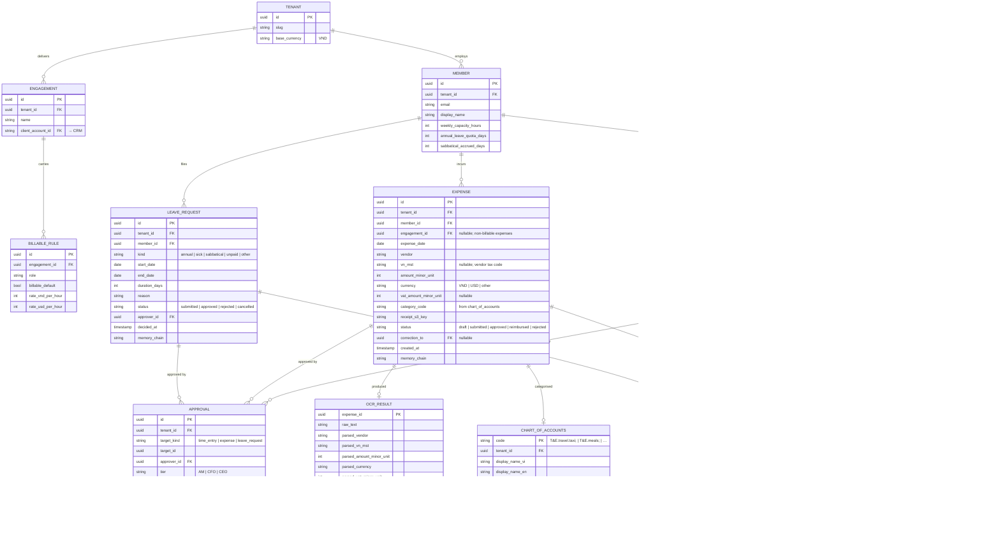
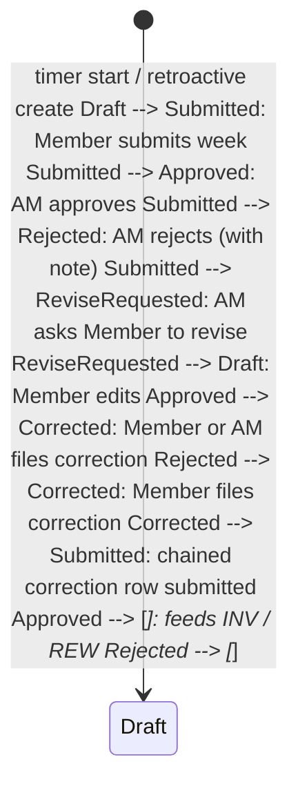

TIME is CyberOS's **time-entry, leave-management, and expense-capture spine**. The basic primitives are simple: a `TimeEntry` records minutes worked against an Engagement / Project / Issue with a billable flag; an `Expense` records VND or USD spent with vendor, VAT, and receipt image; a `LeaveRequest` records absence with a kind and approver flow. What is hard is the integrity model: entries are append-only at the audit layer, every mutation writes a fresh row with a `correction_to` link, the weekly approval flow goes Member -> Account Manager -> CFO/CEO visibility, and Vietnamese labour-law caps (40 h regular / week; 200 h overtime / year standard, up to 300 h with employee consent and MoLISA notification) are enforced as hard rules. Expense receipts run through a Vietnamese-hóa-đơn-aware OCR pipeline (MST extraction, line-item parsing, VAT split). Multi-currency at every layer. Feeds INV (weekly billable summary), feeds REW (members' total hours fold into compensation context), feeds OBS (audit replay).

## At a glance

| Item | Detail |
|---|---|
| Strategic role | Billable-hours engine: PROJ -> TIME -> INV spine |
| Status | Planned - P1, design phase (P1-exit) |
| Primitives | 3: TimeEntry, Expense, LeaveRequest |
| Audit | Append-only; `correction_to` for mutation |
| Billable cascade | 4 steps: override -> class -> role -> fallback |
| Labour caps | VN Code Art. 107: 40h regular; 200h OT/yr, up to 300h with consent + MoLISA notice |
| Currency | VND + USD, multi-currency at every layer |
| Approval | 3 tiers: Member -> AM -> CFO |
| Receipt OCR | VN hóa đơn: MST + VAT split |
| Depends on | AUTH, memory, PROJ + AI, OBS, INV |
| Est. LoC | ~7,500 (Rust + TS + OCR pipeline) |

## The bigger picture - three strategic roles

TIME is invoice-grade infrastructure. One missed entry breaks a client bill; one wrong billable flag breaks an Engagement's margin; one weekly hours misreport breaches the Labour Code. The data model is paranoid by design: append-only, chained audit, mandatory approval chain. TIME is not a feature of PROJ - it's the integrity-grade ledger that converts PROJ activity into INV invoices.

**Role 1 - Hours entry (3 modes).** Timer, manual, auto-detect from PROJ. Timer for in-flight work; manual entry for retroactive logging; auto-detect proposes entries from PROJ activity (issue status changes, comment patterns). Auto-detect is always a proposal, never a save - the Member confirms. Approval flow: Member submits weekly -> AM reviews -> CFO has visibility. Each step is a memory audit row.

**Role 2 - Billable rules engine.** 4-step cascade per PROJ §2.6. The billable flag is computed at entry time via the 4-step cascade locked in PROJ §2.6: Member override (if set) -> task class (non_billable_categories on Engagement) -> role default (rate card billable_default for the Member's role) -> fallback = billable. The decision is snapshotted on the TimeEntry row - retroactive rate-card changes never shift past entries.

**Role 3 - PROJ-INV bridge.** Per-cycle billable rollup -> invoice line. At cycle close (or monthly for retainers), TIME rolls billable hours per Member per role per Engagement and emits the rollup event INV consumes. The rollup includes rate-card snapshots, member overrides, and any approval-flow flags. INV draws the invoice; AM reviews; the client gets the bill. The full chain is auditable - every invoice line traces back to a chained TimeEntry row.

### TIME in the orchestration spine

Diagram source (Mermaid, flattened during migration):

```mermaid
flowchart LR PROJ["📋 PROJ Issue"] MEMBER["👤 Member  
(timer / manual / accept auto-proposal)"] TIME["⏱ TIME  
TimeEntry · Expense · LeaveRequest"] BR["💰 Billable cascade  
Member override → class → role → fallback"] AM["👤 AM  
weekly approval"] CFO["📊 CFO  
visibility + audit"] INV["🧾 INV  
invoice line"] REW["💰 REW  
compensation context"] memory["🧠 memory  
chained audit · correction_to"] PROJ --> MEMBER MEMBER --> TIME TIME --> BR BR --> TIME TIME --> AM AM --> CFO TIME -- "per-cycle rollup" --> INV TIME --> REW TIME --> memory classDef hub fill:#ccfbf1,stroke:#115e59,stroke-width:3px,color:#134e4a classDef mod fill:#e0e7ff,stroke:#3730a3 classDef memory fill:#fef6e0,stroke:#9c750a class TIME hub class PROJ,MEMBER,BR,AM,CFO,INV,REW mod class memory memory
```

### Auto vs human-in-loop operations matrix

Operation| How it happens| Why this split
---|---|---
Timer start/stop| **Manual** Member action| Trust the Member; over-tracking is not better data.
Auto-detect proposal| **Auto** proposal, **manual confirm**| Read-only suggestion from PROJ activity; Member always confirms before save.
Billable flag computation| **Auto** via 4-step cascade| Cascade is deterministic; outcome is snapshotted on the row.
Labour-law cap enforcement| **Auto-block** at entry write| VN Labour Code Art. 107 - non-negotiable; CHRO paged on attempt.
Receipt OCR + categorise| **Auto**, **Member confirm**| OCR is high-recall but fallible; Member is the source of truth.
Weekly approval flow| **Manual** Member -> AM| Approval is accountability; auto-approval defeats the purpose.
CFO visibility| **Auto** aggregation; **manual** override on exceptions| CFO sees rolled-up data; only intervenes on flagged anomalies.
Per-cycle rollup to INV| **Auto** at cycle close| Trigger is calendar-driven; AM reviews resulting draft invoice.
Correction (mutation)| **Manual** with new row + correction_to| Append-only; never edit-in-place; full audit trail preserved.

## Why TIME exists

Three reasons TIME is its own module rather than a feature in PROJ: (1) **audit integrity** - time entries drive Client invoices and Member compensation, so the storage model has to be append-only with chained audit rows, not the optimistic-mutation pattern PROJ uses for issues; (2) **regulator obligations** - Vietnamese Labour Code Art. 105 caps weekly hours and overtime, requires written approval flows, and demands a per-Member time record auditable on inspection; (3) **expense capture** is a different UX (camera + OCR) than time entry (timer + form) and warrants a separate workflow. Folding all of this into PROJ would corrupt PROJ's data model and bury the regulator-visible flows.

- **Append-only audit:** Every entry write produces a chained memory row. Corrections write a new row with `correction_to`; the original is never edited. Invoice-grade integrity.
- **Receipt-first expense:** Snap a hóa đơn; the OCR pipeline pulls MST, line items, VAT split, and queues for Member confirm. No form-filling for the 80% case.
- **VN labour-law caps:** Hard rules enforce 40 h regular / week and the overtime ceiling (Labour Code 2019 Art. 107): 200 h / year standard, up to 300 h / year with employee consent and MoLISA notification. Violations block save and page CHRO.

The bet is that the integrity properties travel best when they live next to the timer; the labour-law caps travel best when they sit between the timer and the database; and the expense flow travels best when it shares the integrity model. Putting all three in one module keeps the audit chain coherent and lets INV pull from a single source of truth.

## What it does - 5W1H2C5M

A structured decomposition of TIME's scope. Every cell traces back to §19.5.

Axis| Question| Answer
---|---|---
**5W - What**| What is TIME?| Three sub-modules: time tracking (start/stop, retroactive, billable flag), leave management (annual, sick, sabbatical, unpaid, other), and expense capture (camera + OCR + categorise). All three share a Postgres canonical store, an append-only audit chain into memory, and a weekly approval workflow.
**5W - Who**| Who uses it?| **Members:** log time + expense + leave daily; submit weekly. **Account Managers:** approve weekly per Engagement. **CFO:** view consolidated dashboards, approve overtime exceptions, sign off on reimbursement batches. **CHRO:** own leave policy + labour-law cap enforcement. **Agents:** CUO/COO-skill nudges Members who haven't logged time in 2 days (FR pending).
**5W - When**| When does it run?| Continuous: SPA timer, mobile capture. Weekly: batch approval cycle (Sunday 23:59 -> Monday 09:00 AM review). Nightly: leave accrual recompute, overtime cap check, expense reimbursement batch. Monthly: hours summary to REW.
**5W - Where**| Where does it run?| P1: single region (SG-1) with VN-residency S3 for receipt images. P3+: multi-region. The OCR pipeline runs as a Fargate task per OCR job; bursty workloads scale to 50 parallel tasks via SQS.
**5W - Why**| Why a separate module?| Audit integrity, labour-law caps, and receipt OCR are three concerns that do not belong in PROJ. Splitting them out keeps PROJ's sync-engine simple and gives the regulator a single place to look.
**1H - How**| How does it work?| Timer: SPA writes start_time; on stop, end_time + duration computed server-side as a generated column. Retroactive: Member enters duration + date; same path. Expense: camera capture -> S3 -> OCR Lambda -> categoriser -> Member confirm -> entry. Leave: form submit -> approver Notify -> decision -> calendar sync.
**2C - Cost**| Cost budget?| P1: ~$70 / month for SG-1 single-tenant pilot. OCR cost averages $0.002 per receipt (AWS Textract); ~$50 / month for 25k receipts at 50 Members. 50-tenant: ~$280 / month.
**2C - Constraints**| Constraints?| (a) Audit append-only - non-negotiable. (b) Labour-law caps enforced as hard rules. (c) Multi-currency at every layer. (d) Member time-log annotations are private namespace (FR pending) - not visible to AM. (e) Receipt OCR must handle hóa đơn (Vietnamese VAT invoice) format.
**5M - Materials**| Stack?| Rust 1.81, axum 0.7, sqlx, PostgreSQL 16, Redis 7, S3 + KMS, AWS Textract (or PaddleOCR self-hosted at P2+), vietnam-mst-validate skill, OpenTelemetry SDK, React + Zustand SPA, React Native (P3+).
**5M - Methods**| Method choices?| Append-only with `correction_to` (not in-place edit). Generated column for `duration_minutes`. Per-Engagement billable_default + per-entry override. Weekly batch approval (not per-entry). Camera-first expense capture. Multi-currency stored as canonical-VND + spot-FX-rate snapshot.
**5M - Machines**| Deployment?| Fargate axum service. RDS Postgres Multi-AZ. Redis hot cache. S3 + KMS for receipt images. SQS-driven OCR pool. Calendar sync via OAuth (Google / Outlook).
**5M - Manpower**| Who maintains?| 0.5 FTE (CFO seat) at P1 launch + 0.25 FTE (CHRO for leave policy). CTO owns the engine.
**5M - Measurement**| How measured?| Mobile capture p95 <= 250 ms (start/stop button). OCR turn-around p95 <= 8 s. Weekly approval completion >= 95% by Friday EOB. Labour-law cap violations = 0. INV billable-hours feed durability = 100%.

## Architecture

TIME is a single axum service exposing four surfaces (GraphQL subgraph, REST admin, mobile-friendly REST, MCP). It writes to PostgreSQL canonical, drives an OCR pipeline via SQS + Fargate workers, and writes chained audit rows to memory. Outputs flow downstream to INV (billable summary), REW (hours context), and Calendar (leave events).

Diagram source (Mermaid, flattened during migration):

```mermaid
graph TB subgraph CLIENT ["Clients"] SPA["SPA  
timer + form"] MOB["Mobile capture (P3)"] AGENT["🎯 CUO  
via MCP"] end subgraph EDGE ["Edge"] GQL["GraphQL subgraph"] REST["REST admin"] MCP["MCP tools"] end subgraph CORE ["TIME service (Rust)"] TE["TimeEntry handler"] EX["Expense handler"] LR["Leave handler"] LAW["VN labour-law  
cap enforcer"] APPR["Approval workflow"] FX["FX rate snapshotter"] CAL_SYNC["Calendar sync  
(Google / Outlook)"] AUDIT["memory audit bridge"] end subgraph OCR ["OCR pipeline"] SQS["SQS queue"] OW["Fargate OCR worker"] TX["AWS Textract  
(or PaddleOCR)"] VN["vietnam-mst-validate  
skill"] CAT["Categoriser"] end subgraph STORES ["Stores"] PG[("PostgreSQL  
time_entry · expense  
leave_request  
append-only audit-side")] RED[("Redis 7  
active timers · FX cache")] S3[("S3 + KMS  
receipt images")] end subgraph SINKS ["Sinks"] memory["🧠 memory  
audit + summary"] INV["🧾 INV  
billable summary"] REW["💎 REW  
hours context"] OBS["👁 OBS"] end SPA --> GQL MOB --> REST AGENT --> MCP GQL --> TE GQL --> EX GQL --> LR REST --> TE REST --> EX REST --> LR MCP --> TE TE --> LAW EX --> SQS SQS --> OW OW --> TX TX --> VN VN --> CAT CAT --> EX TE --> FX EX --> FX LR --> APPR LR --> CAL_SYNC TE --> APPR EX --> APPR APPR --> AUDIT TE --> PG EX --> PG LR --> PG TE --> RED EX --> S3 AUDIT --> memory TE --> INV TE --> REW TE --> OBS classDef planned fill:#ccfbf1,stroke:#115e59 classDef store fill:#f5f3ff,stroke:#7c3aed classDef sink fill:#f5ede6,stroke:#45210e class SPA,MOB,AGENT,GQL,REST,MCP,TE,EX,LR,LAW,APPR,FX,CAL_SYNC,AUDIT,SQS,OW,TX,VN,CAT planned class PG,RED,S3 store class memory,INV,REW,OBS sink
```

### Internal components

Component| Path (planned)| Responsibility
---|---|---
`time_entry.rs`| services/time/src/time_entry.rs| TimeEntry CRUD. Generated column for `duration_minutes`. Per-entry billable override defaults from Engagement.
`expense.rs`| services/time/src/expense.rs| Expense CRUD. Camera-capture -> S3 -> OCR queue. Categorisation via per-tenant chart of accounts.
`leave_request.rs`| services/time/src/leave_request.rs| LeaveRequest CRUD. Kinds: annual, sick, sabbatical, unpaid, other. Approver flow via Notify.
`law_caps.rs`| services/time/src/law_caps.rs| Vietnamese Labour Code Art. 105 / 107 enforcement. 40 h regular / week; overtime 200 h / year standard, up to 300 h / year with employee consent and MoLISA notification. Hard-blocks save above the ceiling; pages CHRO.
`approval.rs`| services/time/src/approval.rs| Weekly approval workflow. Member submit -> AM approve -> CFO visibility. Self-approval rejected (FR pending).
`fx.rs`| services/time/src/fx.rs| FX rate snapshotter. Pulls Vietcombank rate daily; stores snapshot per entry for invoice-time fidelity.
`ocr_pipeline.rs`| services/time/src/ocr_pipeline.rs| SQS-driven OCR worker. Calls AWS Textract (P1) or PaddleOCR self-hosted (P2+). Parses Vietnamese hóa đơn format.
`categoriser.rs`| services/time/src/categoriser.rs| Expense categoriser via AI Gateway. Picks from per-tenant chart of accounts; confidence threshold for auto-apply.
`calendar_sync.rs`| services/time/src/calendar_sync.rs| Two-way Google / Outlook sync for leave events (FR pending).
`nudge.rs`| services/time/src/nudge.rs| CUO/COO-skill nudge for Members who haven't logged time in 2 days (FR pending).
`inconsistency.rs`| services/time/src/inconsistency.rs| Detect overlapping entries, > 12 h continuous, and other anomalies (FR pending).
`inv_export.rs`| services/time/src/inv_export.rs| Weekly batched billable summary export to INV.
`dsar_export.rs`| services/time/src/dsar_export.rs| DSAR bundle for a Member.
`migrations/`| services/time/migrations/| sqlx migrations. All tables RLS by `tenant_id`; `time_entry.member_id` additionally enforced.

## Data model

Three primitives (TimeEntry, Expense, LeaveRequest) plus supporting tables for approvals, FX snapshots, and OCR results. Mutations are encoded as a fresh row with `correction_to` pointing at the superseded row.

Diagram source (Mermaid, flattened during migration):



### Append-only audit pattern

A mutation never edits an existing row. The mutator inserts a new row with the new values and sets `correction_to` to the prior row's id. The prior row's `status` transitions to `corrected`. INV and downstream consumers read the latest row in a correction chain via `WHERE correction_to IS NULL` or by walking the chain forward from the original.

Step| Action| DB effect| memory row
---|---|---|---
1| Original entry| INSERT row A (status=submitted)| `time.entry_create`
2| Member discovers error, corrects duration| INSERT row B (correction_to=A); UPDATE A status=corrected| `time.entry_correct`
3| AM approves| UPDATE B status=approved + APPROVAL row| `time.entry_approved`
4| INV reads| SELECT * FROM time_entry WHERE correction_to IS NULL AND status='approved'| -

## API surface

Four surfaces: a federated GraphQL subgraph, a mobile-friendly REST surface for the timer / receipt-capture, an admin REST for OCR pipeline introspection, and an MCP tool catalogue for CUO.

### GraphQL subgraph (federated)

```graphql
extend schema
 @link(url: "https://specs.apollo.dev/federation/v2.5", import: ["@key", "@requiresScopes"])

type TimeEntry @key(fields: "id") {
 id: ID!
 member: Subject!
 engagement: Engagement!
 project: Project
 issue: Issue
 entryDate: Date!
 durationMinutes: Int!
 billable: Boolean!
 description: String!
 status: TimeEntryStatus!
 correctionTo: ID
 approvals: [Approval!]!
}

type Expense @key(fields: "id") {
 id: ID!
 member: Subject!
 engagement: Engagement
 expenseDate: Date!
 vendor: String!
 vnMst: String
 amountMinor: Int!
 currency: String!
 vatAmountMinor: Int
 categoryCode: String!
 receiptUrl: String! # presigned 5-min
 status: ExpenseStatus!
 ocr: OcrResult
}

type LeaveRequest @key(fields: "id") {
 id: ID!
 member: Subject!
 kind: LeaveKind!
 startDate: Date!
 endDate: Date!
 durationDays: Int!
 status: LeaveStatus!
 approver: Subject
}

enum TimeEntryStatus { DRAFT SUBMITTED APPROVED REJECTED CORRECTED }
enum ExpenseStatus { DRAFT SUBMITTED APPROVED REIMBURSED REJECTED CORRECTED }
enum LeaveStatus { SUBMITTED APPROVED REJECTED CANCELLED }
enum LeaveKind { ANNUAL SICK SABBATICAL UNPAID OTHER }

type Mutation {
 startTimer(engagementId: ID!, projectId: ID, issueId: ID, billable: Boolean): TimeEntry!
 stopTimer(entryId: ID!, description: String!): TimeEntry!
 logRetroactive(input: LogRetroactiveInput!): TimeEntry!
 correctTimeEntry(id: ID!, patch: TimeEntryPatch!): TimeEntry!
 submitWeek(weekOf: Date!): SubmitWeekResult!
 @requiresScopes(scopes: [["time.submit"]])
 approveTimeEntry(id: ID!): TimeEntry!
 @requiresScopes(scopes: [["time.approve"]])
 captureExpense(receiptBase64: String!, hint: ExpenseHint): Expense!
 fileLeave(input: LeaveInput!): LeaveRequest!
 approveLeave(id: ID!): LeaveRequest!
 @requiresScopes(scopes: [["time.leave.approve"]])
}
```

### Mobile-friendly REST

Method| Path| Purpose
---|---|---
POST| `/time/timer/start`| Start timer with engagement / project / issue context.
POST| `/time/timer/stop`| Stop active timer.
GET| `/time/timer/active`| Return active timer for the caller, if any.
POST| `/time/expense/capture`| Multipart upload of receipt; returns expense id + OCR job handle.
GET| `/time/expense/{id}/ocr`| Poll OCR result.
POST| `/time/leave`| File leave request.
GET| `/time/week/{week_of}`| Get weekly summary for caller.
POST| `/time/week/submit`| Submit week.
GET| `/admin/approvals/pending`| List pending approvals for AM / CFO.
POST| `/admin/approvals/{id}/decide`| Approve or reject.
GET| `/admin/inv/billable-summary?week_of=...`| Billable summary export for INV.

### MCP tool catalogue

Tool name| Inputs| Outputs| Annotations
---|---|---|---
`cyberos.time.start_timer`| engagement_id, project_id?, issue_id?| TimeEntry| scope=time.write
`cyberos.time.stop_timer`| description| TimeEntry| scope=time.write
`cyberos.time.log_retroactive`| date, minutes, description| TimeEntry| scope=time.write
`cyberos.time.weekly_summary`| member_id?, week_of| WeeklySummary| readonly, scope=time.read
`cyberos.time.capture_expense`| receipt_image_url| Expense + OcrResult| scope=time.write
`cyberos.time.file_leave`| kind, start, end, reason| LeaveRequest| scope=time.leave.file
`cyberos.time.approve`| target_id, tier| Approval| destructive, human-confirm, scope=time.approve
`cyberos.time.nudge_member`| member_id| {ok}| scope=time.nudge

## Key flows

### Flow 1 - Log a time entry (timer)

```mermaid
sequenceDiagram autonumber participant U as Member SPA participant API as TIME REST / GraphQL participant LAW as VN labour-law cap enforcer participant FX as FX snapshotter participant PG as PostgreSQL participant R as Redis (active timers) participant B as memory audit U->>API: POST /time/timer/start {engagement, project, issue} API->>LAW: check weekly cap (current + projected) alt within cap LAW-->>API: ok else over 40h regular LAW-->>API: overtime warning (still saves) else over 300h annual overtime LAW-->>API: 422 hard-block · pages CHRO end API->>R: SET active_timer:<member> = {entry_id, start_time} API->>FX: snapshot rate for date FX-->>API: rate API->>PG: INSERT time_entry (status=draft, start_time, …) API->>B: time.entry_start (chain audit row) API-->>U: 200 {entry_id, started_at} Note over U:... work happens... U->>API: POST /time/timer/stop {description} API->>R: GET active_timer:<member> R-->>API: {entry_id, start_time} API->>PG: UPDATE time_entry SET end_time=now, status=draft, description=… API->>B: time.entry_stop {duration_minutes} API-->>U: 200 {entry, duration_minutes}
```

### Flow 2 - Weekly approval workflow

```mermaid
sequenceDiagram autonumber participant M as Member participant API as TIME participant AM as Account Manager participant CFO as CFO dashboard participant N as Notify participant B as memory audit M->>API: submit week (Sunday 23:59 or earlier) API->>API: validate no overlapping entries · no above 12h continuous API->>API: lock entries · status=submitted API->>N: ping AM "Member X submitted week N" API->>B: time.week_submitted AM->>API: review entries · approve / revise / reject per entry alt approved API->>API: status=approved API->>B: time.entry_approved else revise API->>N: ping Member "AM requested revision" API->>B: time.entry_revise_requested else rejected API->>API: status=rejected API->>B: time.entry_rejected end API->>CFO: visibility on dashboard (no decision needed at AM-approved tier) Note over CFO: CFO may flag for personal review  
overtime exceptions require explicit CFO sign-off
```

(FR pending) - a Member MUST NOT be able to approve their own entries; self-approval attempts rejected at the API.

### Flow 3 - Expense capture with OCR

```mermaid
sequenceDiagram autonumber participant U as Member (camera) participant API as TIME REST participant S3 as S3 + KMS participant SQS as SQS participant OW as OCR worker participant TX as AWS Textract participant VN as vietnam-mst-validate skill participant CAT as Categoriser (AI Gateway) participant PG as PostgreSQL participant B as memory audit U->>API: POST /time/expense/capture (image) API->>S3: PUT receipt.jpg (KMS-encrypted) API->>PG: INSERT expense (status=draft, receipt_s3_key) API->>SQS: enqueue OCR job {expense_id, s3_key} API-->>U: 202 {expense_id, ocr_status:"pending"} SQS->>OW: deliver job OW->>TX: detect_document_text(s3_key) TX-->>OW: lines + words OW->>OW: parse hóa đơn structure (header, MST, line items, VAT) OW->>VN: validate MST (vietnam-mst-validate skill) VN-->>OW: {valid:true, vendor_name_canonical:…} OW->>CAT: classify category (chart_of_accounts) CAT-->>OW: {category_code, confidence} OW->>PG: UPDATE expense + INSERT ocr_result OW->>B: time.expense_ocr_complete Note over OW,U: SPA polls /time/expense/{id}/ocr  
or receives push via WebSocket U->>API: confirm / correct + submit API->>PG: status=submitted API->>B: time.expense_submit
```

### Flow 4 - Sync to INV (weekly billable summary)

```mermaid
sequenceDiagram autonumber participant CR as Weekly cron (Mon 10:00) participant API as TIME participant PG as PostgreSQL participant FX as FX rate participant INV as 🧾 INV participant B as memory audit CR->>API: build billable summary for week N API->>PG: SELECT time_entry WHERE billable AND status='approved' AND correction_to IS NULL PG-->>API: rows API->>FX: pull snapshot rates per row FX-->>API: rates API->>API: aggregate per Engagement: hours × rate API->>INV: POST /inv/billable-summary {week_of, items:[…]} INV-->>API: 200 {batch_id} API->>B: time.inv_summary_pushed {batch_id, rows:N, vnd_total:…}
```

### Flow 5 - Leave request with calendar sync

```mermaid
sequenceDiagram autonumber participant M as Member participant API as TIME participant CHRO as CHRO leave-policy check participant APPR as Approver (manager) participant CAL as Google / Outlook participant N as Notify participant B as memory audit M->>API: POST /time/leave {kind:annual, start, end, reason} API->>CHRO: check quota + blackout dates alt within quota + valid CHRO-->>API: ok else quota exceeded CHRO-->>API: 422 + remaining quota end API->>N: ping manager "Member X requested leave" API->>B: time.leave_requested APPR->>API: approve API->>API: status=approved · decided_at=now API->>CAL: create event (two-way sync, (FR pending)) CAL-->>API: provider_event_id API->>B: time.leave_approved API->>N: ping Member "approved"
```

## Entry lifecycle

A time entry traverses six states. Correction is encoded as a new row with `correction_to` pointing at the superseded row; the original is never edited in place.



### Expense lifecycle (variant)

Status| Trigger| memory row
---|---|---
`draft`| capture (image uploaded)| `time.expense_capture`
`ocr_pending`| queued to OCR worker| -
`ocr_complete`| OCR done; Member to confirm| `time.expense_ocr_complete`
`submitted`| Member confirms + submits| `time.expense_submit`
`approved`| AM approves| `time.expense_approved`
`reimbursed`| CFO marks batch paid| `time.expense_reimbursed`
`rejected`| AM rejects| `time.expense_rejected`
`corrected`| superseded by correction row| `time.expense_correct`

## Functional requirements

The CyberOS FR catalogue is being rebuilt one feature at a time via the open [feature-request-author](https://github.com/cyberskill/cyberos/tree/main/modules/skill/feature-request-author) Agent Skill.

Previous FR enumerations were archived 2026-05-14 and are no longer reflected on this page. Specific FRs land here as they are re-authored.

## Non-functional requirements

NFRs TIME must satisfy.

NFR ID| Concern| Target| Measurement
---|---|---|---
(NFR pending)| Timer start / stop API| p95 <= 250 ms| k6 + RUM
(NFR pending)| Weekly summary view (5 weeks)| p95 <= 400 ms| SPA RUM
(NFR pending)| OCR turn-around (receipt -> result)| p95 <= 8 s| SQS + worker histogram
(NFR pending)| Mobile capture viable on 3G| <= 3 s upload at 150 KB receipt| simulated network test
(NFR pending)| OCR accuracy on hóa đơn corpus| >= 90% field-level| quarterly eval on 200-receipt corpus
(NFR pending)| Append-only audit integrity| 0 in-place edits| schema constraint + CI gate
(NFR pending)| Receipt image at rest| KMS-encrypted, RLS by tenant| policy audit
(NFR pending)| Service availability| >= 99.9% (28-day)| OBS SLO
(NFR pending)| VN Labour Code cap violations| = 0 (hard rule)| law_caps.rs runtime + CI test
(NFR pending)| INV billable summary durability| 100% delivered| retry + dead-letter monitor
(NFR pending)| Approval decisions persisted| 0 lost under crash| chaos test
(NFR pending)| Correction-chain integrity| cycles forbidden; max depth 50| migration constraint + CI

## Dependencies

TIME depends on AUTH, memory, PROJ (for Engagement / Project / Issue references), AI (categoriser + OCR pipeline), MCP (CUO tools), and OBS. It is depended on by INV (billable summary), REW (hours context), HR (leave accruals), and PORTAL (Client-visible billable view at P2+).

Diagram source (Mermaid, flattened during migration):

```mermaid
graph LR subgraph upstream ["TIME depends on"] AUTH["🔐 AUTH"] memory["🧠 memory"] PROJ["📋 PROJ"] AI["⚡ AI Gateway"] OCR["AWS Textract  
(or PaddleOCR)"] MCP["🔌 MCP"] OBS["👁 OBS"] VN["vietnam-mst-validate skill"] end TIME["⏱ TIME"] subgraph downstream ["TIME is depended on by"] INV["🧾 INV"] REW["💎 REW"] HR["👥 HR"] PORTAL["Portal · P2"] end AUTH --> TIME memory --> TIME PROJ --> TIME AI --> TIME OCR --> TIME MCP --> TIME OBS --> TIME VN --> TIME TIME --> INV TIME --> REW TIME --> HR TIME --> PORTAL classDef shipped fill:#f5ede6,stroke:#45210e classDef planned fill:#fef6e0,stroke:#9c750a class memory,VN shipped class TIME,AUTH,PROJ,AI,OCR,MCP,OBS,INV,REW,HR,PORTAL planned
```

## Compliance scope

Time records drive payroll and tax exposures; TIME must satisfy Vietnamese labour law, tax obligations, and the standard PDPL / GDPR set.

Regulation / standard| Article / clause| TIME feature that satisfies it
---|---|---
Vietnam Labour Code 2019 (Law 45/2019)| Art. 105 - Normal working hours (<= 48 h/week, <= 10 h/day)| `law_caps.rs` enforces 40 h regular / 48 h with OT cap.
Vietnam Labour Code 2019| Art. 107 - Overtime caps (200 h/yr standard; 300 h/yr with employee consent + MoLISA notification)| Hard-block above 300 h annual; 200-300 h band gated on consent + notification; CHRO override required.
Vietnam Labour Code 2019| Art. 113 - Annual leave entitlement| LEAVE_REQUEST + quota tracking + auto-accrual.
Vietnam Decree 13/2023| Art. 17 - Personal data processing log| Every time entry -> audit row.
Vietnam Decree 53/2022| Art. 26 - Data residency| VN-tenant receipt images on hanoi-1 S3.
Vietnam Circular 88/2020 (Ministry of Finance)| Hóa đơn electronic invoice format| OCR pipeline parses canonical hóa đơn fields (MST, line items, VAT).
Vietnam PDPL (Law 91/2025)| Art. 14 - DSAR| DSAR export includes time entries, expenses, leave.
GDPR (EU 2016/679)| Art. 32 - Security of processing| KMS-encrypted receipt images, RLS, audit chain.
ISO/IEC 27001:2022| A.5.36 - Compliance with policies| Approval workflow enforces policy on every entry.
SOC 2 Type II| CC6.1 - Logical access| RBAC + per-Member private namespace (FR pending).
SOC 2 Type II| CC7.1 - Detection / monitoring| Inconsistency detection (overlap / > 12 h).

## Risk entries

TIME-specific risks tracked in the [risk register](../../reference/risk-register.html#time).

ID| Risk| Likelihood| Impact| Owner| Mitigation
---|---|---|---|---|---
`R-TIME-001`| Audit chain breakage via direct DB edit| Low| Catastrophic| CSO| schema constraint forbids UPDATE on canonical columns; in-place change rejected at trigger.
`R-TIME-002`| Overtime cap bypass via timer-then-retroactive trick| Medium| High| CHRO| Cap enforcer evaluates total per ISO-week regardless of entry mode.
`R-TIME-003`| OCR mis-parse of MST -> wrong vendor on invoice| Medium| Medium| CFO| vietnam-mst-validate skill checks; Member confirm step required before submit.
`R-TIME-004`| Self-approval via direct API call| Low| High| CFO| API rejects approver_id == member_id; CI test on every PR.
`R-TIME-005`| INV pulls double after correction| Low| High| CFO| INV reads `WHERE correction_to IS NULL`; chain walk asserted in test.
`R-TIME-006`| Receipt image leaks via presigned URL replay| Low| Medium| CSO| 5-min presign TTL; one-time use; audit row on every presign.
`R-TIME-007`| FX rate snapshot stale -> wrong invoice value| Medium| Medium| CFO| Snapshot per entry; weekly Vietcombank fetch; INV uses entry-time snapshot.
`R-TIME-008`| Calendar sync clobbers user-created events| Low| Medium| CTO| Sync only events created by TIME; mark with `X-CYBEROS-SOURCE` property.
`R-TIME-009`| OCR cost spike from receipt spam| Low| Low| CTO| Per-Member rate limit (50 captures / day); CFO dashboard alert at 80%.
`R-TIME-010`| Member time-log private annotations leaked in DSAR| Low| Medium| DPO| DSAR for the Member themselves includes private namespace; cross-Member DSAR excludes.
`R-TIME-011`| Billable cascade snapshot diverges from PROJ rate-card history| Medium| High| CFO| Snapshot is stored on TimeEntry row (immutable); PROJ Engagement rate-card changes never retroactively apply; CI test asserts snapshot-vs-Engagement consistency at write time.
`R-TIME-012`| Auto-detect proposes hours for the wrong PROJ Issue -> wrong invoice line| Medium| Medium| CTO| Auto-detect is proposal-only; Member confirms issue_id; confidence threshold >= 0.80 to even show; quarterly review of acceptance/rejection rates.
`R-TIME-013`| VN Labour Code 2026 amendment changes weekly cap -> enforcement misfires| Low| High| CLO| Cap rules in versioned config; legal monitor on Labour Code amendments; cap version stamped on every TimeEntry for retroactive interpretation.
`R-TIME-014`| Cycle-close rollup runs before all Members submitted hours -> invoice short| Medium| Medium| COO| Rollup waits for all expected submissions OR after 24 h grace; missing-Member flag on resulting INV draft; AM reviews before send.
`R-TIME-015`| Multi-currency drift - FX rate snapshot from billing date applied to entry from previous month| Low| Medium| CFO| FX snapshot per entry (not per invoice); INV uses entry-time snapshot; cross-check at invoice generation.

## KPIs

TIME health rolls up into 14 KPIs covering usage, integrity, and OCR quality.

KPI| Formula| Source| Target
---|---|---|---
**Weekly submission rate**| submitted / expected| memory| >= 95% by Friday EOB
**Days-since-last-entry distribution**| histogram| memory| median <= 1 day
**OCR field-level accuracy**| fields_correct / fields_total| quarterly eval| >= 90%
**OCR turn-around p95**| histogram| SQS + worker| <= 8 s
**Approval cycle time p50**| submit -> approve, business hours| memory| <= 24 h
**Self-approval attempts blocked**| count / month| memory| tracked; expect 0
**Overtime cap violations**| count / month| law_caps| = 0
**INV summary delivery**| delivered / weeks| memory| 100%
**Correction-rate per Member**| corrections / entries| memory| tracked; alert > 10%
**Billable cascade snapshot integrity**| cascade decisions on TimeEntry matching computed result at audit time| memory audit replay| = 1.0 (hard floor)
**Auto-detect proposal acceptance**| accepted / proposed| SPA telemetry| tracked; expect 0.50-0.80
**PROJ-TIME issue match rate**| entries with valid issue_id / total entries| cross-check PROJ| >= 0.95 (unallocated should be rare)
**Cycle-rollup completeness**| rollups with all expected Members submitted / total rollups| cycle-close events| >= 0.95
**VN Labour Code version coverage**| all TimeEntries with cap_version stamp / total entries| memory audit| = 1.0 (hard floor)

## RACI matrix

TIME is owned by CFO seat with CHRO co-ownership on the leave / labour-law facets.

Activity| CEO| CFO| CHRO| CTO| CSO| AM
---|---|---|---|---|---|---
Service design + spec| A| R| C| C| C| I
Implementation| I| C| I| A/R| C| I
Approval-flow policy| C| A/R| C| I| I| R
VN labour-law cap policy| I| C| A/R| R| I| I
OCR engine procurement| I| C| I| A/R| C| I
INV billable summary review| I| A/R| I| C| I| C
Audit-chain integrity review| C| C| I| R| A| I
DSAR fulfilment| I| C| C| C| I| I
Incident response| A| R| C| R| R| I

R = Responsible, A = Accountable, C = Consulted, I = Informed.

## Planned CLI surface

A single admin CLI `cyberos-time`. Member-facing actions live in the SPA and mobile clients; the CLI is for tenant operators and CFO reporting.

### 1. Bulk-import historical entries (CSV)

```
$ cyberos-time import --csv historical-2026-q1.csv --tenant cyberskill

[import] parsed 4,217 rows · 6 errors
[import] creating entries (status=approved, source=migration)
[import] ✓ 4,211 created · ✗ 6 in errors.csv
[audit] memory seq=15203 chain=…
```

### 2. Weekly billable summary preview

```
$ cyberos-time billable-summary --week-of 2026-08-04 --tenant cyberskill

week of 2026-08-04 (5 working days)
engagement hours billable_vnd rate_card
ACME Q3 platform 142.5 285,000,000 senior-mix
BetaCo retainer 40.0 72,000,000 retainer-flat
GamaCorp T&M; 12.0 24,000,000 senior
─────────────────────────────────────────────────────────────
total 194.5 381,000,000

→ push to INV? [y/N]
```

### 3. Push to INV

```
$ cyberos-time inv push --week-of 2026-08-04

[push] 194.5 hours · 381 mil VND · 3 engagements
[inv] batch_id: 01HZK5… created (status=draft on INV)
[audit] memory seq=15211 chain=…
```

### 4. Overtime cap report

```
$ cyberos-time overtime-report --year 2026

member ot_hours cap pct_used risk
linh@cyberskill.world 142 300 47.3% ▬ ok
tu@cyberskill.world 203 300 67.7% ▲ approaching
hai@cyberskill.world 287 300 95.7% ▼ critical → CHRO sign-off required
```

### 5. Replay OCR for a receipt

```
$ cyberos-time ocr replay --expense 01HZK6…

[replay] re-running OCR pipeline (engine=textract)
[replay] parsed: vendor=Highlands Coffee, MST=0304556677, amount=178,000 VND, VAT=16,182 VND
[replay] vietnam-mst-validate: ✓ matches GDT registry
[replay] categoriser: T&E.meals; (confidence=0.93)
[audit] memory seq=15218 chain=…
```

### 6. DSAR export for a Member

```
$ cyberos-time dsar-export --subject linh@cyberskill.world --output linh-time.zip

[dsar] subject: linh@cyberskill.world
[dsar] time_entries: 1,247 (including 18 corrected chains)
[dsar] expenses: 287 (with receipts)
[dsar] leave_requests: 12
[dsar] approvals: 842
[dsar] written: linh-time.zip (62 MB)
[audit] memory seq=15221 chain=…
```

### 7. Calendar reconcile (re-sync drift)

```
$ cyberos-time calendar reconcile --provider google --member linh@cyberskill.world

[reconcile] fetching Google calendar events created by CyberOS …
[reconcile] 3 leave requests · 3 calendar events found · 0 drift
[reconcile] done
```

## Phase status & estimates

| Item | Detail |
|---|---|
| Status | Planned - P1, design phase |
| Est. LoC | ~7,500 (Rust + TS + OCR worker) |
| Planned tests | 90+ (incl. OCR golden corpus) |
| External libs | ~10 (axum, sqlx, Textract SDK) |
| CLI subcommands | ~18 planned (`cyberos-time`) |
| P1 budget | ~$70/mo (Fargate + RDS + S3 + OCR) |

Capability| Status
---|---
Timer start/stop + retroactive entry| planned - P1
Per-Engagement billable rules| planned - P1
Append-only audit + `correction_to`| planned - P1
Weekly approval workflow| planned - P1
VN Labour Code cap enforcement| planned - P1
Multi-currency + FX snapshot| planned - P1
Camera receipt capture| planned - P1
Vietnamese hóa đơn OCR + MST validate| planned - P1
Expense categoriser (chart of accounts)| planned - P1
Leave request + approver flow| planned - P1
Calendar two-way sync| planned - P1
INV weekly billable summary push| planned - P1
CUO nudge for missing entries| planned - P1
Inconsistency detection| planned - P1
Self-hosted PaddleOCR (cost optimisation)| planned - P2+
Native mobile (offline-first capture)| planned - P3+

## References

- **Bigger picture (above):** 3 strategic roles + spine diagram + 9-row auto-vs-human matrix.
- **Cross-module page links:** [proj.html](../proj/index.html), [inv.html](../inv/index.html), [memory.html](../memory/index.html), [rew.html](../rew/index.html), [hr.html](../hr/index.html), [obs.html](../obs/index.html)
- **Billable cascade rules:** [PROJ §2.6](../proj/index.html#engagement-economics) - 4-step cascade definition.
- **memory auto-sync vision:** [MEMORY_AUTOSYNC_DESIGN.md §5](../../docs/MEMORY_AUTOSYNC_DESIGN.md) - TimeEntry rows are memory audit events.
- **Build-readiness audit:** `archive/2026-05-14/AUDIT_AND_PLAN.md` (archived; see `cyberos/CHANGELOG.md`) - TIME at P1-exit (P1, after PROJ + CRM).
- **FR authoring discipline:** [modules/skill/feature-request-audit/AUTHORING_DISCIPLINE.md](https://github.com/cyberskill/cyberos/blob/main/modules/skill/feature-request-audit/AUTHORING_DISCIPLINE.md).
- **Vietnam Labour Code (Law 45/2019/QH14)** - Art. 105 (working hours), Art. 107 (overtime), Art. 113 (annual leave).
- **Vietnam Decree 13/2023/NĐ-CP** - Personal data processing.
- **Vietnam Decree 53/2022/NĐ-CP** - Data residency.
- **Vietnam Law 91/2025/QH15 (PDPL)** - Personal Data Protection Law.
- **Circular 88/2020/TT-BTC** - Hóa đơn (Vietnamese VAT e-invoice) format.
- **AWS Textract** - OCR engine (P1).
- **PaddleOCR** - open-source alternative for P2+ self-hosting.
- **vietnam-mst-validate** - CyberOS skill for MST validation against GDT.
- **Architecture context:** [infrastructure.html#time](../../architecture/infrastructure.html#time).

## Changelog

History lives in the [changelog](./changelog.html); this page describes only the current state.
