MCP Gateway is the **tool federation layer** that turns CyberOS's 22 modules into a single, coherent MCP server. Each module publishes a per-module server (named `cyberos.memory`, `cyberos.skill`, `cyberos.crm`, ...) that exposes its verbs as tools (`memory.put_memory`, `skill.invoke_skill`, `crm.update_account`, ...); the gateway aggregates these into a federated surface that Claude / Codex / Cursor / Cline / any 2025-11-25-spec client sees as one server. OAuth 2.1 + PKCE (RFC 7636) gates every tool call; the audience claim pins the call to a specific module; the RBAC predicate from AUTH enforces who can do what; the persona-version stamp captures which agent authored the call. Tool annotations (destructive / readOnly / idempotent / openWorld) drive human-confirm gating. The Tasks primitive handles long-running work; Elicitation reverses control mid-execution to ask the user a question.

- **Strategic role:** external-agent door - 22 modules -> one MCP server
- **Status:** planned - P0, design phase; P0 slice 3
- **Spec compliance:** MCP 2025-11-25 - Streamable HTTP, Tasks, Elicitation
- **External clients (target):** Claude, Cursor, Codex, Cline - all 2025-11-25-compliant clients
- **Transports:** Streamable HTTP, SSE - RFC 9112 chunked + EventSource
- **Auth:** OAuth 2.1 PKCE - RFC 7636, audience-bound, PRM
- **Tools at P0 (est.):** ~80 - memory, Skill, AUTH, AI
- **Tools at P3 (est.):** ~300+ - 22 modules x ~15 verbs each
- **Destructive-op gating:** human-confirm - via Elicitation or explicit token
- **Persona stamp coverage:** 100% - on every audit row
- **Depends on:** AUTH, memory, OBS, plus AI Gateway (P0 slice 1)
- **Naming convention:** SEP-986 - cyberos.{module}.{verb}_{noun}

## The bigger picture - three strategic roles

MCP Gateway is "the external-agent door." That sentence does a lot of work. Without this module, every external agent (Claude Code on a Member's laptop, Cursor on an engineer's IDE, Codex in CI) would need 22 separate OAuth flows + 22 separate discovery loops + 22 separate audit emissions. The naive design - "one MCP server per module, agents figure it out" - is intractable past 3 modules. MCP Gateway collapses 22 to 1 at the edge while keeping per-module ownership intact behind the federation.

### Role 1 - external-client federation

**22 modules -> one MCP server.** Claude Code, Cursor, Codex, Cline, and any 2025-11-25-spec client hit a single discovery endpoint at `https://mcp.cyberos.com/.well-known/mcp`. The gateway aggregates per-module tool catalogues via SEP-986 naming (`cyberos.memory.put_memory`, `cyberos.proj.create_issue`, etc.) so external agents see one server. Per-module servers stay separate behind the edge; federation only happens at the surface. This means Members can use the AI tools they already trust without learning a new orchestrator.

### Role 2 - capability broker

**Every external invocation gated.** Audience-bound OAuth 2.1 + PKCE tokens carry tenant_id + agent_persona + scope_grants per AUTH §2.7. Tool annotations (`destructive` / `readOnly` / `idempotent` / `openWorld`) drive gating: destructive ops require either an explicit confirmation token in the request or an Elicitation flow that asks the user. The persona stamp on every audit row makes "external agent X did Y" replayable down to which Claude/Cursor session authored it.

### Role 3 - tool-discovery surface

**The registry external agents introspect.** `tools/list` returns ~80 tools at P0 (~300+ at P3); `prompts/list` exposes module-specific prompt templates; `resources/list` exposes memory paths the agent can read. Long-running work (KB ingestion, big migrations, bulk imports) is tracked via the Tasks primitive - the agent can start a task, poll status, get a streaming progress update, and resume on reconnect. Elicitation reverses control mid-execution to ask "should I proceed with the destructive step?".

### MCP Gateway in the runtime - federation map

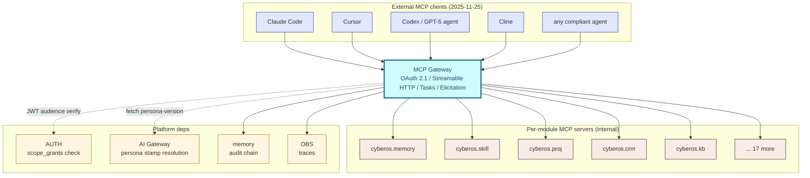

External clients never reach per-module servers directly. The gateway is the only external surface; this is the protocol-level guarantee that auth + audit + persona-stamp are uniformly applied.

### Auto vs human-in-loop operations matrix

| Operation | How it happens | Why this split |
|---|---|---|
| Tool discovery (`tools/list`) | **Auto** - filtered by the client's scope_grants | Agent only sees tools it could invoke; reduces the surface area shown. |
| Read-only tool call (`annotation: readOnly`) | **Auto** when scope_grants permit | Read is low-risk; latency-sensitive; the agent flow shouldn't break. |
| Idempotent write (`annotation: idempotent`) | **Auto** with idempotency-key | Retry-safe; the idempotency-key prevents double-write on transport retry. |
| Non-idempotent write (default) | **Auto** with scope check + audit emit | Standard write path; the broker checks scope + writes pre/post audit rows. |
| Destructive op (`annotation: destructive`) | **Human-confirm always** - explicit token or Elicitation | EU AI Act Art. 14 + safety policy; cannot be auto-invoked regardless of confidence. |
| Long-running work (Tasks primitive) | **Auto-start**, **polled** by agent, **resumable** on reconnect | Big ingests, migrations, bulk imports - must survive network blips. |
| Mid-execution question (Elicitation) | **Server-initiated**; agent forwards to user | Reverses control: the server asks "should I proceed?" mid-call. |
| Tool catalogue update (`list_changed` notification) | **Auto**; pushed to subscribed clients | New tools appear without a client re-poll; old tools removed live. |
| OAuth token refresh | **Auto** via the standard refresh-token flow | Session continuity for long-lived agent sessions. |

## Why MCP Gateway exists

Per-module MCP servers create N integration points where every AI agent has to negotiate auth, discover tools, and handle errors. As N grows to 22, the agent's job becomes intractable. The gateway pattern collapses N into 1: agents see a single MCP server with one OAuth flow, one tool catalogue, one discovery endpoint. The 22 modules continue to publish their per-module tools; the gateway federates them. Naming (`cyberos.memory.put_memory`) preserves the module origin so audit + revocation remain per-module.

- **One discovery, all tools.** Agents hit `/.well-known/mcp` once and discover every module's tools. Per-module servers stay separate; federation is at the edge.
- **OAuth-protected, RBAC-evaluated.** PKCE-only OAuth 2.1; every tool call audience-bound; every call evaluated by AUTH RBAC; destructive calls human-gated.
- **Long-running work, first-class.** The Tasks primitive supports operations that exceed the request timeout - the gateway polls the underlying server and reports progress to the caller.

The bet: pay the cost of one good federation once. Without MCP Gateway, every agent client (Claude Desktop, Cursor, Cline, custom) has to maintain its own list of N module URLs, N OAuth registrations, N rate-limit handlings. With MCP Gateway, that list collapses to one URL - and replacing a module is a federation-registry update, not a client release.

## What it does - 5W1H2C5M

This table is the working summary.

| Axis | Question | Answer |
|---|---|---|
| **5W - What** | What is MCP Gateway? | A Rust-axum service that implements the MCP 2025-11-25 spec on the edge, federates tool calls to per-module backends, enforces OAuth 2.1 PRM, applies tool annotations, manages Tasks for long-running work, proxies Elicitation prompts, and emits one audit row per call. |
| **5W - Who** | Who calls it? | External agents (Claude Desktop / Cursor / Cline / Codex) and internal agents (CUO when invoking Skill, scheduled tasks). **Owner:** CTO seat (interim CEO). |
| **5W - When** | When is it hit? | (a) at agent session start (discovery + auth); (b) on every tool call. P0 expected RPS: ~20/s peak; P3+: ~200/s peak. |
| **5W - Where** | Where does it run? | Fargate task in SG-1 (P0); multi-region active-active at P3+. TLS terminated at the ALB; mTLS to per-module backends. |
| **5W - Why** | Why a gateway? | Because N agent clients x N modules = N^2 OAuth registrations otherwise. Federation collapses to N+1. |
| **1H - How** | How does it work? | Agent does OAuth 2.1 PKCE -> gateway issues an audience-bound token -> agent calls `tools/list` -> gateway aggregates from federated servers -> agent calls a tool -> gateway validates audience + scope + annotation -> forwards via mTLS gRPC to the module -> streams the response back -> audit row written. |
| **2C - Cost** | Cost? | Negligible - Fargate task ~$30/month at P0. The gateway adds ~3 ms per tool call; the audit write is the main cost. |
| **2C - Constraints** | Constraints? | (a) MCP 2025-11-25 spec compliance. (b) PKCE-only (no implicit grant). (c) Destructive tools MUST require human-confirm. (d) Persona-version MUST be stamped in audit (FR pending). (e) Tool names MUST follow SEP-986 verbNoun.dotted. |
| **5M - Materials** | Stack? | Rust 1.81, axum 0.7, rmcp (Rust MCP SDK), tonic (gRPC to per-module servers), OAuth via the AUTH service, OpenTelemetry, serde_json for spec serialisation. |
| **5M - Methods** | Method choices? | Streamable HTTP transport (chunked transfer). SSE for server-to-client events. Tasks primitive over a polling endpoint. Elicitation as an inline request/response interrupt. Tool registry as a DB-backed catalogue + in-memory cache. |
| **5M - Machines** | Deployment? | Fargate (2 CPU, 4 GB); behind an ALB with WAF. Per-module backends are also Fargate, addressed by Cloud Map service-discovery. |
| **5M - Manpower** | Who maintains? | 0.3 FTE CTO + 0.2 FTE CSO at P0. Each module owner extends the tool catalogue for their module. |
| **5M - Measurement** | How measured? | N(FR pending) (read tool p95 <= 500 ms) + N(FR pending) (write tool p95 <= 1 s). Spec compliance via the MCP conformance test suite. Audit completeness at 100%. |

## External-client federation - 22 modules behind one surface

An external agent never knows it's talking to 22 modules. From the agent's perspective, `https://mcp.cyberos.com` is one MCP server with ~80 tools at P0 (~300+ at P3). The federation is at the edge - per-module servers (`cyberos.memory`, `cyberos.skill`, etc.) stay separate inside the cluster, but the gateway is the only thing external clients reach. This section locks the federation contract.

### SEP-986 naming convention (per-module ownership preserved)

Tool names follow the `cyberos.{module}.{verb}_{noun}` SEP-986 convention. The module prefix preserves ownership for audit + revocation; the verb_noun form aligns with MCP convention.

| Pattern | Example | What it does | Owning module |
|---|---|---|---|
| `cyberos.{module}.put_*` | `cyberos.memory.put_memory` | Create or replace a resource | memory |
| `cyberos.{module}.get_*` | `cyberos.memory.get_memory` | Read a resource | memory |
| `cyberos.{module}.list_*` | `cyberos.proj.list_issues` | List resources (paginated) | PROJ |
| `cyberos.{module}.create_*` | `cyberos.proj.create_issue` | Create a new entity | PROJ |
| `cyberos.{module}.update_*` | `cyberos.crm.update_account` | Mutate an existing entity | CRM |
| `cyberos.{module}.invoke_*` | `cyberos.skill.invoke_skill` | Trigger a skill / action | Skill |
| `cyberos.{module}.delete_*` | `cyberos.proj.delete_issue` | Tombstone an entity (destructive) | PROJ |
| `cyberos.{module}.export_*` | `cyberos.memory.export_dsar` | Export bulk data (destructive sensitivity) | memory |

### Per-module server registration flow

Each module's MCP server registers itself with the gateway at startup. Registration carries its tool catalogue (with annotations), prompt templates, and resource paths. The gateway maintains a versioned catalogue and pushes `list_changed` notifications to subscribed clients when modules deploy.

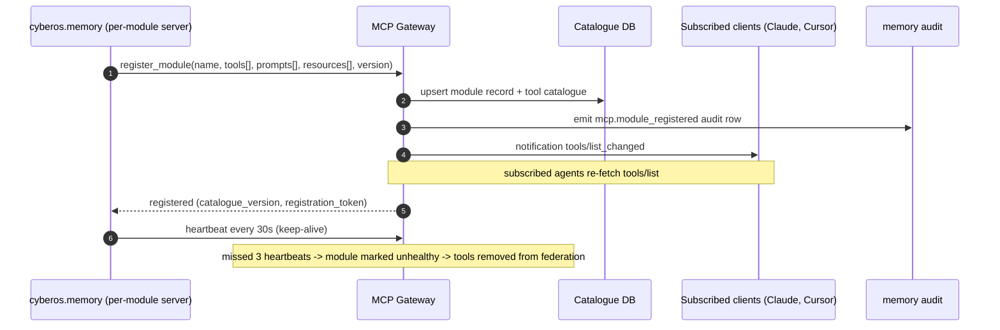

### External client compatibility matrix

| Client | MCP spec version | OAuth 2.1 | Streamable HTTP | Tasks | Elicitation |
|---|---|---|---|---|---|
| **Claude Code** | 2025-11-25 | yes | yes | yes | yes |
| **Claude Desktop** | 2025-11-25 | yes | yes | yes | yes |
| **Cursor** | 2025-11-25 | yes | yes | yes | yes |
| **Codex / GPT-5 agent** | 2025-11-25 | yes | yes | partial | yes |
| **Cline** | 2025-11-25 | yes | yes | yes | partial |
| **Older 2024-11-05 clients** | 2024-11-05 | partial | SSE-only | no | no |

The gateway negotiates the highest mutual version at session init. Older clients fall back to SSE transport + bearer-token auth (no PKCE). The older-client tool surface excludes the Tasks and Elicitation features.

## Capability broker - every external invocation gated

The threat model is precise: an external agent (running in Claude Code on a Member's laptop) carries an OAuth token; the agent is fundamentally untrusted (the user might have approved a malicious tool, the agent process might be compromised, the prompt might be injected). The capability broker is the protocol-level guarantee that even a fully-compromised agent cannot escape the bounds of the user's authorised scope.

### Tool annotations - what drives gating

| Annotation | Meaning | Gating behaviour | Example tools |
|---|---|---|---|
| `readOnly: true` | No state mutation. Idempotent always. | Auto-invoke if scope permits; no confirm needed | `cyberos.memory.get_memory`, `cyberos.proj.list_issues`, `cyberos.kb.search` |
| `idempotent: true` | Write that can be safely retried with the same args + idempotency-key | Auto-invoke if scope permits; idempotency-key required | `cyberos.proj.update_issue`, `cyberos.crm.upsert_account` |
| `destructive: true` | Irreversible: purge / delete / send-money / public-post | **Human confirmation required** - explicit confirmation_token in args OR an Elicitation flow | `cyberos.memory.delete_memory{mode: purge}`, `cyberos.proj.delete_engagement`, `cyberos.email.send` |
| `openWorld: true` | Reaches external systems (third-party APIs, web fetch) | Auto-invoke with an additional rate limit + content filter | `cyberos.web.fetch_url`, `cyberos.zoominfo.enrich_contact` |
| `longRunning: true` | Returns a task_id; agent polls for completion | Auto-start as Task; agent polls; timeout default 1 h | `cyberos.kb.ingest_corpus`, `cyberos.memory.export_dsar` |
| `elicits: true` | Server may ask the agent for additional input mid-call | Agent must support Elicitation; falls back to a user prompt | `cyberos.cuo.route_with_clarification`, `cyberos.crm.create_deal_interactive` |

### Audience-bound OAuth - the broker's auth contract

```
{
  "iss": "https://auth.cyberos.io/<tenant>",
  "sub": "user:stephen@cyberskill.world",
  "aud": "mcp.cyberos.com",          // audience-bound: this token is ONLY valid at MCP Gateway
  "iat": 1763112131,
  "exp": 1763115731,
  "tenant_id": "org:cyberskill",
  "agent_persona": "claude-code@user-stephen",  // which external agent is calling
  "scope_grants": [
    {"resource": "memory", "actions": ["read", "write"], "sync_class_max": "shareable"},
    {"resource": "proj",  "actions": ["read", "write"], "engagements": ["acme-q3"]},
    {"resource": "kb",    "actions": ["read"]}
  ],
  "client_id": "claude-code-vsce-extension",   // which MCP client requested the token
  "code_challenge": "sha256:...",              // PKCE binding
  "jti": "01HZK..."
}
```

The `aud` claim is the protocol-level guarantee: a token issued for `mcp.cyberos.com` cannot be replayed against `api.cyberos.com`. PKCE binding prevents code interception during the auth flow. The `scope_grants` are checked per tool call against the tool's required resource + action.

### Destructive-op confirmation flow (Elicitation example)

```
// Agent calls a destructive tool
-> {"method": "tools/call", "params": {"name": "cyberos.memory.delete_memory", "arguments": {"path": ".../draft.md", "mode": "purge"}}}

// Gateway intercepts: annotation destructive=true, no confirmation_token in args
<- {"method": "elicitation/create", "params": {
    "message": "Are you sure you want to PURGE this memory? This is irreversible.",
    "schema": {"type": "object", "properties": {"confirm": {"type": "boolean"}, "reason": {"type": "string"}}, "required": ["confirm", "reason"]}
  }}

// Agent forwards to user; user responds in the client UI
-> {"method": "elicitation/response", "params": {"confirm": true, "reason": "Outdated draft superseded by v2"}}

// Gateway forwards the original call with confirmation context
// The audit row records BOTH the elicitation prompt AND the user's response
{"op": "put", "path": "meta/mcp-invocations/...", "extra": {"tool": "cyberos.memory.delete_memory", "elicitation": {"prompt": "...", "user_confirmed": true, "reason": "Outdated draft superseded by v2"}}}
```

## Tool-discovery surface - the registry agents introspect

An agent's effectiveness is bounded by what it can discover. MCP Gateway is the registry external agents use to introspect what CyberOS can do: `tools/list` (verbs), `prompts/list` (templated workflows), `resources/list` (readable data paths), and `capabilities` (which MCP features are supported). This section locks the discovery surface contracts.

### Discovery endpoints

| Endpoint | What it returns | Filter / scoping | Cadence |
|---|---|---|---|
| `/.well-known/mcp` | Discovery doc, OAuth Protected Resource Metadata (PRM), transport endpoints | public | static (cached 1 h) |
| `capabilities` | Supported MCP features (Tasks, Elicitation, sampling, etc.) | none | per-session init |
| `tools/list` | Tools available to the calling token's scope_grants | filtered by JWT scope_grants | per-call + `list_changed` push |
| `prompts/list` | Prompt templates for common workflows ("Find the right CUO persona", "Draft a cycle review") | filtered by scope | per-call |
| `resources/list` | Memory paths / KB documents the calling token can read | filtered by sync_class + scope | per-call |
| `resources/templates/list` | URI templates for resource lookup (e.g. `memory://memories/decisions/{slug}`) | filtered by scope | per-call |

### Tasks primitive - long-running work

For operations that take > 30 s (KB corpus ingestion, memory export, bulk migrations), MCP Gateway returns a Task immediately and lets the agent poll for status. The agent can disconnect and reconnect; the Task persists in Postgres.

| Task field | Type | Purpose |
|---|---|---|
| `task_id` | UUID | Stable handle; agent polls `tasks/get?id=...` |
| `status` | pending / running / waiting_for_input / completed / failed / cancelled | Drives the agent's polling cadence + UI |
| `progress` | 0.0 - 1.0 OR null | If determinate, the agent can render a progress bar |
| `message` | string (streamed) | Latest human-readable status; SSE-streamed if the agent subscribes |
| `result` | JSON, null until completed | Final response; matches the tool's result schema |
| `error` | {code, message, retriable} | If failed; the agent decides retry behaviour |
| `created_at / updated_at / expires_at` | timestamps | Tasks expire after 24 h by default; per-tool override |
| `memory_chain` | hash | References the audit row that recorded task start |

### Prompt templates - pre-canned workflows

Prompts are MCP-defined templated workflows the agent can use. They reduce hallucination by giving the agent a known-good way to invoke a multi-step CyberOS operation.

| Prompt name | Purpose | Bound tools |
|---|---|---|
| `cyberos.weekly_brief` | Generate the user's weekly brief from memory + PROJ + CAL | memory.list_recent, proj.list_my_issues, cal.list_events |
| `cyberos.decision_to_issues` | Convert a decision memory into parent + child issues | memory.get_memory, cuo.invoke_skill (cuo.cpo.decision-to-issues@1), proj.create_issue |
| `cyberos.draft_cycle_review` | Generate a cycle review from issues + comments + history | proj.get_cycle, proj.list_cycle_issues, ai.chat_complete (with CUO/COO persona) |
| `cyberos.deal_to_engagement` | Convert a won CRM deal to a PROJ Engagement with rate card | crm.get_deal, proj.create_engagement, memory.put_memory (audit decision) |
| `cyberos.find_memory_citations` | Given an Issue, suggest memories to cite | proj.get_issue, memory.semantic_search, proj.create_memory_link |

Each prompt is a versioned, audit-anchored workflow; the agent receives the prompt and the bound tool names; the gateway audits prompt invocations separately from individual tool calls.

## Architecture

Three layers: an edge that speaks the MCP spec to agents, a federation router that fans tool calls out to per-module gRPC backends, and an audit + observability bridge. The 22 modules each run a per-module server (e.g. `cyberos.memory`) that registers itself with the gateway at startup.

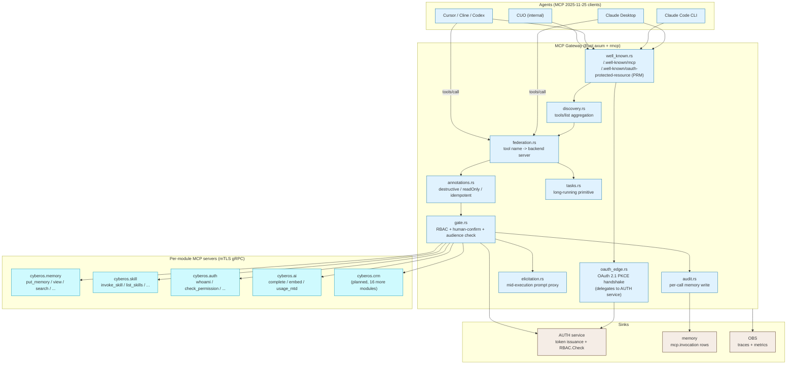

### Internal components

| Component | Path (planned) | Responsibility |
|---|---|---|
| `well_known.rs` | services/mcp-gateway/src/well_known.rs | Serves the `/.well-known/mcp` discovery document + `/.well-known/oauth-protected-resource` (PRM, RFC 9728). |
| `oauth_edge.rs` | services/mcp-gateway/src/oauth_edge.rs | Handles the OAuth 2.1 + PKCE handshake with the agent client. Delegates issuance to the AUTH service over gRPC. |
| `discovery.rs` | services/mcp-gateway/src/discovery.rs | Aggregates `tools/list` across federated backends. Caches the catalogue with a 60 s TTL; invalidated on backend register. |
| `federation.rs` | services/mcp-gateway/src/federation.rs | Routes a tool call (`cyberos.memory.put_memory`) to the right backend server via mTLS gRPC. Caches resolved endpoints in-memory. |
| `annotations.rs` | services/mcp-gateway/src/annotations.rs | Parses tool annotations from the backend manifest. Enforces destructive -> human-confirm; readOnly -> fast-path RBAC; idempotent -> safe-retry; openWorld -> strict scope check. |
| `gate.rs` | services/mcp-gateway/src/gate.rs | Composite gate - verifies the audience claim, calls AUTH RBAC.Check, validates the idempotency-key, applies the rate-limit token bucket. |
| `tasks.rs` | services/mcp-gateway/src/tasks.rs | Tasks primitive (FR pending) - long-running tool invocations get a task_id; clients poll for status / result; results streamed via SSE. |
| `elicitation.rs` | services/mcp-gateway/src/elicitation.rs | Elicitation (FR pending) - mid-execution, a backend can request user input; the gateway proxies that back to the agent client with a content-safety filter. |
| `tool_registry.rs` | services/mcp-gateway/src/tool_registry.rs | Postgres-backed registry. Each backend registers its tools with annotations; collisions rejected at register time (FR pending). |
| `rate_limit.rs` | services/mcp-gateway/src/rate_limit.rs | Per-tool + per-tenant token-bucket rate limit; circuit-breaker on backend errors. |
| `idempotency.rs` | services/mcp-gateway/src/idempotency.rs | Replay safety via the Idempotency-Key header (FR pending). |
| `audit.rs` | services/mcp-gateway/src/audit.rs | Emits one `mcp.invocation` row per call: agent, tool, args_hash, RBAC decision, latency, outcome, persona-version. |
| `streamable_http.rs` | services/mcp-gateway/src/streamable_http.rs | RFC 9112 chunked-transfer HTTP transport per MCP 2025-11-25. |
| `conformance.rs` | services/mcp-gateway/tests/conformance.rs | MCP conformance test suite runner. Gating CI test (FR pending). |

## Data model

The gateway is mostly stateless. Postgres holds the tool registry, Redis caches tool catalogues and Tasks status, memory absorbs the audit rows.

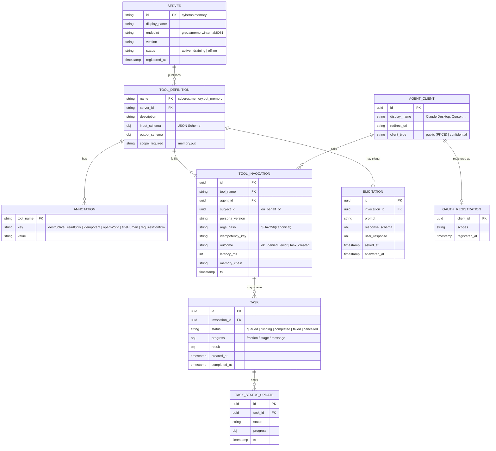

### Tool naming convention (SEP-986)

All tool names follow `cyberos.{module}.{verb}_{noun}`. Verbs match the canonical six (put / view / move / delete) for memory-shaped resources; other modules pick verbs from a shared catalogue.

| Example tool name | Verb class | Annotations |
|---|---|---|
| `cyberos.memory.put_memory` | write | destructive=false, idempotent=true, scope=memory.put |
| `cyberos.memory.view_memory` | read | readOnly=true, idempotent=true, scope=memory.read |
| `cyberos.memory.delete_memory` | delete | destructive=true, requiresConfirm=true, scope=memory.delete |
| `cyberos.memory.search_memory` | query | readOnly=true, scope=memory.read |
| `cyberos.skill.invoke_skill` | execute | destructive=true, requiresConfirm=conditional, scope=skill.invoke |
| `cyberos.skill.list_skills` | read | readOnly=true, scope=skill.read |
| `cyberos.auth.check_permission` | query | readOnly=true, scope=auth.read |
| `cyberos.auth.revoke_session` | destructive | destructive=true, requiresConfirm=true, scope=auth.session_revoke |
| `cyberos.ai.complete_chat` | execute | destructive=false, openWorld=true, scope=ai.invoke |
| `cyberos.crm.create_account` | write | destructive=false, idempotent=false, scope=crm.write |

## API surface

The gateway speaks MCP 2025-11-25 to agents and gRPC to backends. A small admin REST surface lets operators inspect the registry and replay invocations.

### MCP surface (canonical)

| Method | MCP primitive | Purpose |
|---|---|---|
| GET | `/.well-known/mcp` | MCP server discovery doc per spec 2025-11-25. |
| GET | `/.well-known/oauth-protected-resource` | PRM (RFC 9728) - auth-server URL, scopes, audience. |
| POST | `/mcp` | Single streamable-HTTP endpoint for all MCP JSON-RPC calls. |
| JSON-RPC | `initialize` | Client capability negotiation. |
| JSON-RPC | `tools/list` | Discovery - returns the federated tool catalogue. |
| JSON-RPC | `tools/call` | Invoke a tool with arguments. |
| JSON-RPC | `resources/list` | List MCP resources (files, URIs). |
| JSON-RPC | `resources/read` | Read a resource. |
| JSON-RPC | `prompts/list` | List prompt templates. |
| JSON-RPC | `prompts/get` | Materialise a prompt template. |
| JSON-RPC | `completion/complete` | Tool-arg autocomplete. |
| JSON-RPC | `tasks/get` | Poll long-running task status. |
| JSON-RPC | `tasks/cancel` | Cancel a running task. |
| JSON-RPC | `elicitation/respond` | Reply to a server-initiated elicitation. |
| JSON-RPC | `sampling/createMessage` | Server-initiated LLM sampling (rate-limited, FR pending). |
| JSON-RPC | `logging/setLevel` | Server log-level config. |
| JSON-RPC | `roots/list` | List filesystem roots. |
| JSON-RPC | `notifications/initialized` | Capability acknowledgement. |
| JSON-RPC | `notifications/progress` | Streaming progress events. |

### Backend gRPC surface (per-module servers)

```protobuf
syntax = "proto3";
package cyberos.mcp.backend.v1;

service ModuleMCPServer {
  // Register at gateway startup. Sends a manifest of all tools.
  rpc Register(RegisterRequest) returns (RegisterResponse);
  // Tool invocation forwarded from the gateway. Streamable response.
  rpc InvokeTool(stream ToolCall) returns (stream ToolResult);
  // For long-running tools the backend returns a task handle.
  rpc TaskStatus(TaskRef) returns (TaskState);
  // A backend may initiate elicitation back through the gateway.
  rpc Elicit(ElicitationRequest) returns (ElicitationResponse);
  // Health + drain.
  rpc Health(Empty) returns (HealthResponse);
}

message RegisterRequest {
  string server_id = 1;
  string version = 2;
  repeated ToolDefinition tools = 3;
}

message ToolDefinition {
  string name = 1;          // "cyberos.memory.put_memory"
  string description = 2;
  string input_schema = 3;  // JSON Schema
  string output_schema = 4;
  string scope_required = 5;
  map<string, string> annotations = 6;
}

message ToolCall {
  string tool_name = 1;
  string args_json = 2;
  string idempotency_key = 3;
  string subject_jwt = 4;
  string persona_version = 5;
  string trace_id = 6;
}
```

### Admin REST surface (operator-only)

| Method | Path | Purpose |
|---|---|---|
| GET | `/admin/servers` | List registered backends + their status. |
| GET | `/admin/tools` | Full tool catalogue with annotations. |
| POST | `/admin/tools/{name}/disable` | Soft-disable a tool (server returns "method not allowed"). |
| GET | `/admin/invocations` | Recent invocations (filterable by tool, agent, subject). |
| POST | `/admin/invocations/{id}/replay` | Replay an invocation in dry-run mode (read-only tools only). |
| GET | `/admin/tasks` | List active tasks. |
| POST | `/admin/tasks/{id}/cancel` | Force-cancel a stuck task. |

## Key flows

### Flow 1 - well-known discovery + tool listing

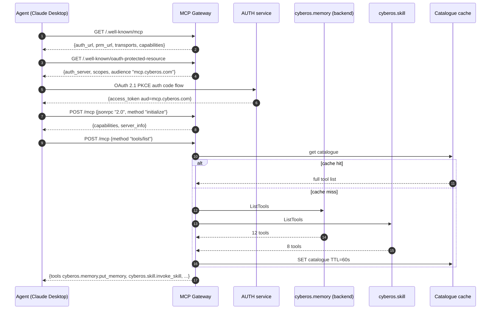

The agent sees one server; under the hood, 22 modules contribute their tools. Caching keeps catalogue assembly < 5 ms p95.

### Flow 2 - tool invocation with OAuth + RBAC

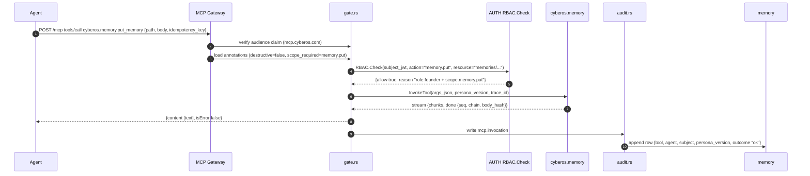

Per-call latency: ~3 ms gateway overhead + backend processing time. The audit write is fire-and-forget; a backlog > 60 s triggers an alert.

### Flow 3 - destructive tool with human-confirm gating

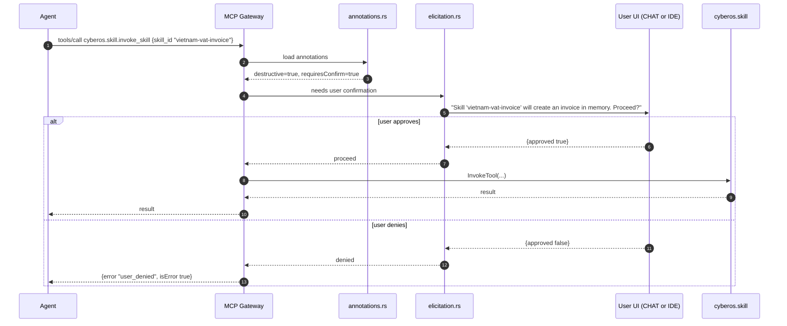

(FR pending): destructive tool calls without confirmation are rejected. The elicitation UI is rendered by the agent client (Claude Desktop, Cursor) - the gateway is content-agnostic.

### Flow 4 - long-running task via the Tasks primitive

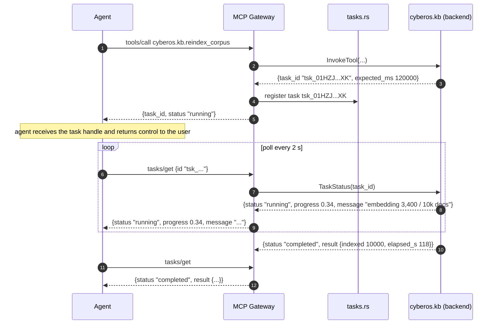

(FR pending): Tasks primitive for long-running tool invocations. The agent can release the call and resume the conversation; polling fetches updates.

### Flow 5 - mid-execution elicitation

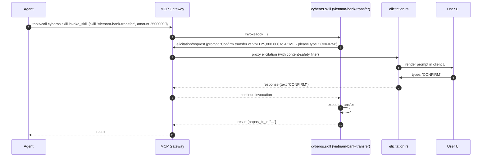

(FR pending): elicitation proxied with a content-safety filter - prevents a compromised backend from injecting prompts that exfiltrate via the user.

## Tool-call lifecycle

A single tool invocation traverses up to nine states. Most calls run synchronously and reach `Completed` in < 1 s; long-running ones go via the Tasks primitive.

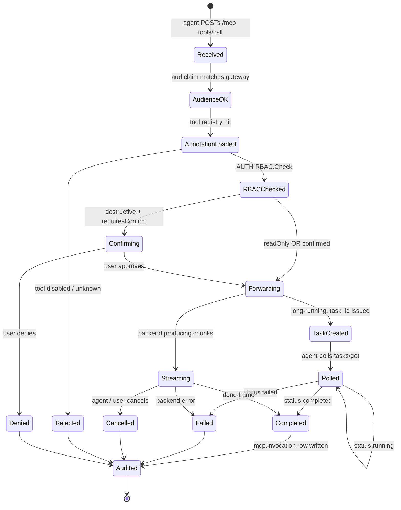

## Functional requirements

The CyberOS FR catalogue is being rebuilt one feature at a time via the open [feature-request-author](https://github.com/cyberskill/cyberos/tree/main/modules/skill/feature-request-author) Agent Skill.

Previous FR enumerations were archived 2026-05-14 and are no longer reflected on this page. Specific FRs land here as they are re-authored.

## Non-functional requirements

Performance + security NFRs that flow through MCP Gateway. Cross-referenced at [nfr-catalog.html#mcp](../../reference/nfr-catalog.html#mcp).

| NFR ID | Concern | Target | Measurement |
|---|---|---|---|
| `N(FR pending)` | MCP read tool p95 | <= 500 ms | k6 load test |
| `N(FR pending)` | MCP write tool p95 | <= 1 s | k6 load test |
| `N(FR pending)` | Gateway overhead per call | <= 5 ms p95 | internal bench |
| `N(FR pending)` | tools/list discovery | <= 100 ms p95 (cache hit) | internal bench |
| `N(FR pending)` | Gateway availability (28-day) | >= 99.95% | SLO monitor |
| `N(FR pending)` | MCP spec conformance | 100% of the conformance suite | CI gate |
| `N(FR pending)` | Audit completeness | 100% (no dropped invocations) | chaos test + memory walk |
| `N(FR pending)` | Destructive without confirm | = 0 events | CI regression + runtime check |
| `N(FR pending)` | Tool name violations | = 0 (rejected at register) | registry validator |
| `N(FR pending)` | Idempotency-key collision rate | = 0 false positives | property-based test |
| `N(FR pending)` | Task status update latency | <= 2 s after backend update | bench/tasks |
| `N(FR pending)` | Per-tool rate-limit enforcement | 100% (no overflow) | load test |
| `N(FR pending)` | OAuth 2.1 conformance | OAuth 2.1 + RFC 9728 PRM | conformance suite |

## Dependencies

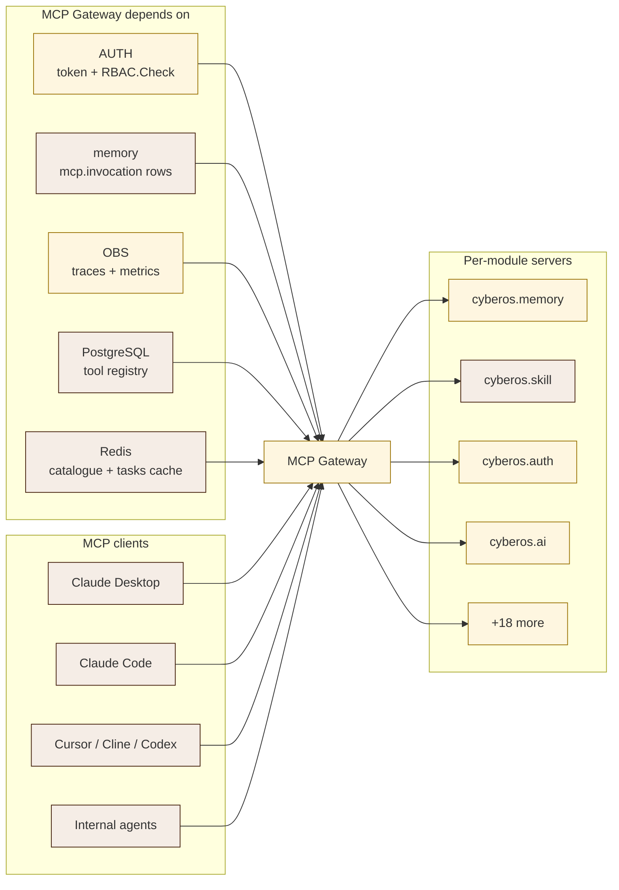

## Compliance scope

| Regulation / standard | Article / clause | MCP Gateway feature |
|---|---|---|
| EU AI Act | Art. 12 - Logging | One `mcp.invocation` row per tool call. |
| EU AI Act | Art. 14 - Human oversight | Destructive tools require human-confirm via elicitation. |
| EU AI Act | Art. 26 - Deployer obligations | Persona-version stamping (FR pending). |
| Vietnam PDPL | Art. 14 - DSAR | Per-subject mcp.invocation export. |
| GDPR | Art. 25 - Privacy by design | Audience-bound tokens; confused-deputy mitigation. |
| GDPR | Art. 32 - Security of processing | OAuth 2.1 PKCE only; mTLS to backends. |
| OWASP Gen AI Top-10 | LLM02: Insecure output handling | Elicitation content-safety filter. |
| OWASP Gen AI Top-10 | LLM07: Insecure plugin design | Tool annotations + RBAC gate; closed catalogue. |
| OWASP Gen AI Top-10 | LLM08: Excessive agency | Audience-bound token + persona scope; can't escalate. |
| RFC 9728 | OAuth 2.0 Protected Resource Metadata | PRM at `/.well-known/oauth-protected-resource`. |
| RFC 7636 | PKCE | PKCE-only - implicit grant disabled. |
| SOC 2 Type II | CC6.7 - Restriction of system access | Tool registry as a closed catalogue; new tool registration requires CTO approval. |

## Risk entries

| ID | Risk | Likelihood | Impact | Owner | Mitigation |
|---|---|---|---|---|---|
| `R-MCP-001` | Spec drift - agent client expects newer features than the gateway provides | Medium | Medium | CTO | Quarterly spec sync; CI gates on the conformance suite; capability negotiation surfaces gaps. |
| `R-MCP-002` | Tool-name squatting - a module registers a tool name belonging to another | Low | High | CTO | Server_id is part of the registry key; cross-module names rejected at register (FR pending). |
| `R-MCP-003` | Confused-deputy attack - a token from one audience used against another module | Medium | High | CSO | Audience claim mandatory + verified at the backend; mTLS pins to the right service. |
| `R-MCP-004` | Destructive tool annotation bypass via a newly-added tool | Medium | High | CSO | Registration requires CTO + CSO approval; the default annotation is destructive=true. |
| `R-MCP-005` | Tasks primitive leak - task_id reused across tenants | Low | High | CTO | task_id is UUIDv7 + tenant_id in the lookup; cross-tenant query property-tested. |
| `R-MCP-006` | Elicitation injection - a backend prompts the user into a harmful action | Medium | High | CSO | Content-safety filter; allow-list of elicitation prompts per tool; CHAT log of all elicitations. |
| `R-MCP-007` | Backend slow -> caller times out -> orphaned audit row | Medium | Low | CTO | Per-tool timeout enforced; audit row written on cancellation; a reconciliation job catches orphans. |
| `R-MCP-008` | OAuth registration scaling - every agent client must register | Low | Low | CTO | Dynamic Client Registration (DCR) per RFC 7591; the tenant admin approves before activation. |
| `R-MCP-009` | Tool catalogue cache staleness after a backend deploy | Medium | Low | CTO | 60 s TTL + register-time invalidation; deploys trigger a cache reset. |
| `R-MCP-010` | Sampling-with-Tools amplification (LLM-driven loop) | Medium | Medium | CSO | (FR pending): per-session sampling rate limit; circuit-breaker on recursion depth. |
| `R-MCP-011` | **External agent token theft (Member's laptop compromised -> Claude Code token grants full CyberOS access)** | Medium | Critical | CSO | Short-lived tokens (1 h default); refresh-token rotation; device-binding via DPoP (P2+); destructive-op confirmation gating even with a valid token; emergency revoke endpoint pages the CSO instantly. |
| `R-MCP-012` | Prompt injection in a tool description (agent reads the description, follows attacker instruction) | Medium | High | CSO | Tool descriptions are protocol-trusted by the gateway, untrusted by agents; CyberOS modules go through CSO review before publishing tool descriptions; agent-side system prompts treat tool descriptions as data, not instructions. |
| `R-MCP-013` | Elicitation fatigue - too many destructive confirms -> the user starts rubber-stamping | High | Medium | CPO | Bundle destructive ops where safe (batch delete with one confirm); show the explicit consequence in the elicitation prompt; rate-limit elicitations per session; never auto-decay to "approve all". |
| `R-MCP-014` | Federation lag - a module deploys a new tool, the agent calls the old name, gets a cryptic error | Medium | Low | CTO | 60 s cache TTL + list_changed push to subscribed clients; deprecation aliases (old name -> new name) supported for 1 minor release; per-tool version field in the tool catalogue. |
| `R-MCP-015` | Task storm - an agent starts 1000s of long-running tasks, exhausts capacity | Low | High | CTO | Per-tenant per-agent task limit (default 50 concurrent); rate limit on tasks/create; auto-cancel tasks older than 24 h; alarm on task backlog > 100. |
| `R-MCP-016` | Resource leak via subscribed list_changed notifications (agent disconnects, gateway keeps emitting) | Medium | Low | CTO | Subscription tied to session lifetime; ping/pong heartbeat 30 s; auto-unsubscribe on missed heartbeats. |
| `R-MCP-017` | Per-module heartbeat false-positive - gateway marks a healthy module as down | Low | Medium | CTO | 3 consecutive heartbeat misses required (not 1); the module health endpoint is independent of the MCP server itself; manual override via `cyberos-mcp servers reactivate`. |
| `R-MCP-018` | OAuth Dynamic Client Registration (DCR) abuse - an attacker registers many clients | Medium | Medium | CSO | Tenant-admin approval gate before activation; rate limit on the DCR endpoint (10/hour per tenant); flag suspicious registrations (unusual redirect URIs). |
| `R-MCP-019` | An older 2024-11-05 client connects, falls back to SSE + bearer token, less secure | Medium | Medium | CSO | Older clients explicitly opted in per tenant (deny by default); the audit row flags "older protocol session"; sunset the older protocol by P3 exit (push all tenants to 2025-11-25). |
| `R-MCP-020` | SEP-986 naming collision (two modules define `delete_thing`) | Low | Medium | CTO | The `cyberos.<module>` prefix is the namespace; cross-module same-noun is allowed; the registration validator rejects exact duplicates within the same prefix. |

## KPIs

| KPI | Formula | Source | Target |
|---|---|---|---|
| **Conformance pass rate** | `passed / total` | MCP conformance suite | 100% |
| **Read-tool p95 latency** | histogram | OBS | <= 500 ms |
| **Write-tool p95 latency** | histogram | OBS | <= 1 s |
| **Gateway overhead p95** | histogram | OBS | <= 5 ms |
| **Audit completeness** | `rows_in_memory / invocations` | chaos test | 100% |
| **Destructive-without-confirm** | count / 28 d | mcp.invocation | = 0 |
| **Tool-name violations** | count | registry validator | = 0 |
| **Active tasks** | count of `status=running` | tasks DB | tracked; alert on backlog > 100 |
| **Backend health** | healthy / registered | `/admin/servers` | >= 95% always |
| **Persona-stamp coverage** | audit rows with persona stamp / total | memory audit replay | = 1.0 (hard floor) |
| **Elicitation acceptance rate** | user-confirmed elicitations / total elicitations | mcp.invocation rows | tracked; a sudden drop = UI confusion alarm |
| **Tasks completion rate** | completed / created | tasks DB | >= 95% (excluding user-cancelled) |
| **Cross-tenant token-replay attempts** | count / 28 d | OAuth + audit cross-check | tracked; spike = active attack |
| **Older-protocol session rate** | 2024-11-05 sessions / total | session init logs | declining trend; = 0 by P3 exit |
| **List_changed push latency p95** | histogram, module deploy -> subscriber notified | OBS | <= 30 s |
| **Destructive-op confirm fatigue** | median elicitations per Member per day | mcp.invocation rows | <= 5; alarm on > 15 (rubber-stamping signal) |
| **External-client tools coverage** | distinct external clients that successfully invoked >= 1 tool / total registered | session logs | >= 0.90 (clients should not register and never call) |
| **SEP-986 compliance** | tools matching the naming pattern / total | registry validator | = 1.0 (CI gate at registration) |

## RACI matrix

| Activity | CEO | CTO | CSO | Module owners | CDO |
|---|---|---|---|---|---|
| Gateway design + implementation | A | R | C | I | I |
| Per-module backend implementation | I | C | C | A/R | I |
| Tool annotations review | I | C | A/R | R | I |
| Spec conformance | I | A/R | C | I | I |
| OAuth + audience design | I | C | A/R | I | I |
| Audit pipeline maintenance | I | R | C | I | A |
| Tool catalog curation | A | C | C | R | C |

## Planned CLI surface

Operator CLI `cyberos-mcp` + ad-hoc `mcp-inspector` for development.

### 1. List registered backends

```
$ cyberos-mcp servers list

SERVER_ID STATUS VERSION TOOLS LAST_SEEN
cyberos.memory active 2.0.0 12 2026-05-14T07:21Z
cyberos.skill active 1.4.0 8 2026-05-14T07:21Z
cyberos.auth active 0.9.0 7 2026-05-14T07:20Z
cyberos.ai active 0.8.0 5 2026-05-14T07:21Z
cyberos.crm draining 0.3.0 11 2026-05-14T07:15Z
```

### 2. Inspect a tool

```
$ cyberos-mcp tool inspect cyberos.memory.delete_memory

name: cyberos.memory.delete_memory
server: cyberos.memory
description: "Delete a memory file (tombstone by default; purge requires DSAR reason)"
scope_required: memory.delete
annotations:
 destructive: true
 readOnly: false
 idempotent: false
 requiresConfirm: true
 openWorld: false
input_schema: {path: string, mode: "tombstone"|"purge", reason: string?}
```

### 3. Replay an invocation (dry-run, read-only)

```
$ cyberos-mcp invocations replay --id inv_01HZJ...XK --dry-run

[replay] invocation inv_01HZJ...XK
 tool: cyberos.memory.search_memory
 agent: Claude Desktop (claude-desktop-v1.0.45)
 args: {query: "Singapore HoldCo"}
 original_outcome: ok (12 hits)
 replay_outcome: ok (12 hits) - identical
[replay] read-only tool only - audit row NOT written
```

### 4. Cancel a stuck task

```
$ cyberos-mcp tasks cancel --id tsk_01HZJ...XK --reason "client disconnected"

[cancel] tsk_01HZJ...XK status: running -> cancelled
[backend] cyberos.kb signalled to abort
[audit] mcp.invocation updated, outcome=cancelled
```

### 5. Conformance test

```
$ cyberos-mcp conformance run

[conformance] MCP 2025-11-25 spec suite, 142 tests
 initialize pass (12 / 12)
 tools/list pass (18 / 18)
 tools/call pass (24 / 24)
 resources/* pass (16 / 16)
 prompts/* pass (14 / 14)
 completion/complete pass (8 / 8)
 tasks/* pass (12 / 12)
 elicitation/* pass (10 / 10)
 sampling/* pass (6 / 6)
 oauth (pkce) pass (14 / 14)
 prm pass (8 / 8)
[result] 142 / 142 PASSED, 0 failed, 0 skipped
```

### 6. Register a new backend (CTO + CSO approval gate)

```
$ cyberos-mcp servers register \
 --id cyberos.crm \
 --endpoint grpc://crm.internal:8081 \
 --version 0.3.0 \
 --manifest crm-tools.json \
 --approval-jira CYB-1234

[validate] manifest: 11 tools, SEP-986 ok, annotations ok
[approve] CTO + CSO approved (per CYB-1234)
[register] cyberos.crm registered
[catalog] cache invalidated
[audit] memory seq=14856
```

## Phase status & estimates

- **Status:** planned - P0, design phase; P0 slice 2
- **Est. LoC (Rust):** ~5,500 - services/mcp-gateway
- **Planned tests:** 142 conformance + 60 unit - MCP spec suite
- **P0 tools (est.):** ~80 - memory, Skill, AUTH, AI
- **P3 tools (est.):** ~300+ - 22 modules x ~15 verbs
- **CLI commands:** ~18 planned - `cyberos-mcp`

| Capability | Status |
|---|---|
| Streamable HTTP transport (RFC 9112) | planned, P0 |
| OAuth 2.1 + PKCE edge handshake | planned, P0 |
| Well-known discovery + PRM | planned, P0 |
| Tool registry (SEP-986 enforced) | planned, P0 |
| tools/list federation | planned, P0 |
| tools/call gating (annotations + RBAC) | planned, P0 |
| Tasks primitive | planned, P0 |
| Elicitation back-channel | planned, P0 |
| Idempotency-Key replay safety | planned, P0 |
| Per-tool rate limit + circuit breaker | planned, P0 |
| mcp.invocation audit row | planned, P0 |
| Conformance suite (142 tests) | planned, P0 |
| Sampling-with-Tools rate limiting | planned, P1 |
| Dynamic Client Registration (RFC 7591) | planned, P1 |
| Multi-region active-active | planned, P3+ |

## References

- **Bigger picture (above):** 3 strategic roles + federation diagram + auto-vs-human matrix.
- **External-client federation (above):** SEP-986 naming + module registration sequence + 6-row client compatibility matrix.
- **Capability broker (above):** 6-row tool-annotation gating + audience-bound OAuth JWT + destructive-op confirmation flow with Elicitation.
- **Tool-discovery surface (above):** 6 discovery endpoints + the Tasks primitive 8-field schema + 5 pre-canned prompt templates.
- **Cross-module page links:** [auth.html](../auth/index.html), [cuo.html](../cuo/index.html), [memory.html](../memory/index.html), [skill.html](../skill/index.html), [ai.html](../ai/index.html), [obs.html](../obs/index.html), [proj.html](../proj/index.html), [chat.html](../chat/index.html)
- **Build-readiness audit:** `archive/2026-05-14/AUDIT_AND_PLAN.md` (archived; see `cyberos/CHANGELOG.md`) - MCP Gateway placed at P0 slice 3 in the P0 sequence (after AI Gateway + AUTH stub).
- **Research review:** `archive/2026-05-14/RESEARCH_REVIEW.md` (archived; see `cyberos/CHANGELOG.md`) - MCP Gateway rated "Strong" (9/10); the reviewer flagged the elicitation-fatigue risk (R-MCP-013) and the older-protocol sunset as the two operational concerns.
- **Memory auto-sync vision:** [MEMORY_AUTOSYNC_DESIGN.md §5](../../docs/MEMORY_AUTOSYNC_DESIGN.md) - MCP tool invocations are one of four canonical capture surfaces for the local memory (every tool call -> audit row); §6 - Lumi exposes cross-tenant MCP federation at P3+ for org-tenant agents.
- **FR authoring discipline:** [modules/skill/feature-request-audit/AUTHORING_DISCIPLINE.md](https://github.com/cyberskill/cyberos/blob/main/modules/skill/feature-request-audit/AUTHORING_DISCIPLINE.md) - MCP Gateway FRs land via the `feature-request-author` Agent Skill.
- **MCP Specification 2025-11-25** - `modelcontextprotocol.io/specification/2025-11-25`.
- **SEP-986** - verbNoun.dotted tool naming convention.
- **RFC 6749 / draft-ietf-oauth-v2-1** - OAuth 2.1.
- **RFC 7591** - Dynamic Client Registration.
- **RFC 7636** - Proof Key for Code Exchange (PKCE).
- **RFC 9112** - HTTP/1.1 (chunked transfer).
- **RFC 9728** - OAuth 2.0 Protected Resource Metadata.
- **DPoP (RFC 9449)** - device-binding tokens at P2+.
- **EU AI Act** - Art. 12 logging, Art. 13 transparency, Art. 14 human oversight, Art. 26 deployer obligations.
- **Vietnam PDPL (Law 91/2025):** Art. 14 (DSAR via mcp.invocation export), Art. 20 (security obligations).
- **OWASP Gen AI Top-10 (2025)** - LLM02, LLM07, LLM08 mitigations.
- **Architecture context:** [infrastructure.html#mcp](../../architecture/infrastructure.html#mcp).

[Previous: AI Gateway](../ai/index.html) | [Next module: Observability](../obs/index.html)

## Changelog

History lives in the [changelog](./changelog.html); this page describes only the current state.
