OBS is the **shared telemetry plane**: logs, metrics, traces, and AI-trace observability for every CyberOS module. Operationally, OpenTelemetry SDKs in every service ship to a single OTel collector that fans out - logs to Loki, metrics to Prometheus, traces to Tempo. Grafana renders dashboards (per-module SLO, per-tenant cost, per-region health). LangSmith captures full LLM call traces independently from the operational pipeline so AI debugging doesn't require correlating across three tools. Alert Manager fans critical alerts to PagerDuty, mid alerts to `#cyberos-alerts`, low signals into the CUO morning digest. The audit chain - owned by memory - is exposed via a separate read-only OBS surface for regulators (PDPL Art. 14, EU AI Act Art. 12). Tenant scoping is enforced at the query proxy so a member of tenant A cannot see tenant B's logs.

- **Strategic role:** observability spine - 3 pillars + AI traces + audit
- **Status:** planned - P0; slice 1 in build
- **Stack:** LGTM + LangSmith - Loki, Grafana, Tempo, Prometheus
- **Trace exporter:** OTel SDK - in every service binary
- **Correlation key:** trace_id x tenant_id - propagated via W3C TraceContext
- **Retention:** 7d / 90d / 1y - hot / warm / cold tiers
- **Tenant isolation:** proxy-enforced - no cross-tenant reads
- **SLO targets:** >= 99.5% - platform composite SLO
- **Auto-runbook coverage:** >= 60% by P1 - alerts -> CUO triage skill
- **Compliance surfaces:** EU AI Act, PDPL, SOC 2 - read-only regulator views
- **Depends on:** memory, plus AUTH (P0 slice 2) and AI Gateway (P0 slice 1)
- **Used by:** all 24 modules - every service emits OTel

## The bigger picture - three strategic roles

OBS is one of the two earliest P0 modules to ship (P0 slice 1, alongside AI Gateway), because _any_ debugging requires it. More than a Grafana install, it is the protocol-level guarantee that any incident - operational, AI-decision, or compliance - has exactly one investigation surface instead of three competing dashboards from three vendors.

### Role 1 - three-pillars unified pane

**Logs + metrics + traces + AI traces, one trace_id.** Every module emits OpenTelemetry. The collector fans out to Loki (logs), Prometheus (metrics), Tempo (operational traces), LangSmith (AI traces). All four are correlated by the W3C TraceContext `trace_id` + `tenant_id`. One click in Grafana takes you from a slow API trace to the LLM call inside it to the memory audit row that recorded the decision. No more "the AI did something weird, but I can only see the HTTP request."

### Role 2 - auto-runbook router

**Alerts route through CUO before paging humans.** An alert fires. Before PagerDuty pages someone, the alert hits CUO's `obs.triage-alert@1` skill. CUO consults the runbook catalogue (in KB), suggests the first step, attaches the relevant traces + dashboard links, and either (a) creates a self-service ticket in CHAT if confidence >= 0.70 OR (b) escalates to PagerDuty with the suggested first step pre-attached. Target: >= 60% of alerts auto-runbookable by P1; the on-call schedule benefits, the runbook catalogue grows, the audit trail is complete.

### Role 3 - compliance evidence surface

**Read-only regulator view of the memory audit chain.** Auditors don't need access to Postgres. They need a scoped, time-bounded, exportable view of the audit chain that proves "the AI made this decision at this time under this persona, and a human confirmed it before it executed." OBS surfaces this via the `/compliance/{regulator}` read-only endpoint per regulator (EU AI Act / PDPL / SOC 2 / ISO 27001). Each regulator sees only the chained audit rows + retention metadata they're entitled to.

### OBS in the runtime - every module emits, OBS correlates

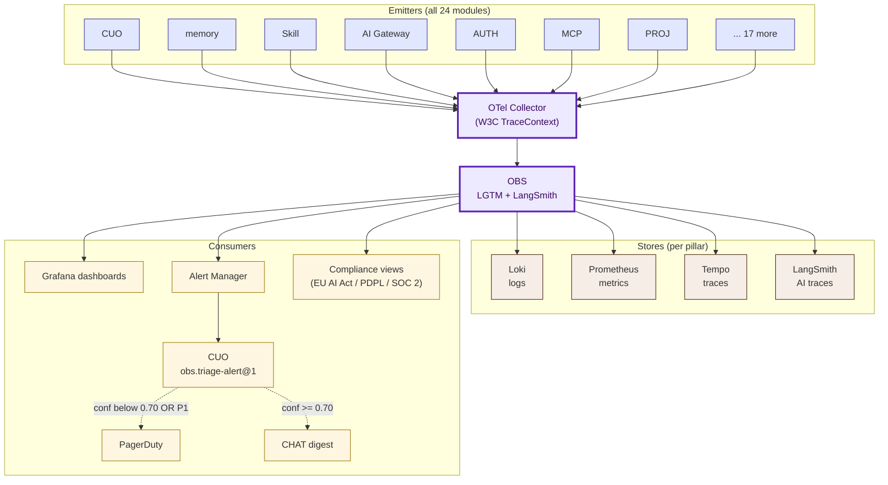

The OTel Collector is the only fan-in; OBS is the only correlation point. Removing OBS means each module re-implements observability - and the implementations diverge on tenant scoping, retention, and trace correlation.

### Auto vs human-in-loop operations matrix

| Operation | How it happens | Why this split |
|---|---|---|
| Log / metric / trace ingestion | **Auto** from every module's OTel SDK | The platform is unobservable without 100% coverage; SDKs are non-optional in every service. |
| Alert evaluation | **Auto** in Prometheus + Alert Manager | Threshold-based; CUO triage layered on top, not instead of. |
| CUO triage skill invocation | **Auto** when an alert fires | The skill is read-only - it cannot fix things, only suggest. Human-in-loop preserved for action. |
| Self-service ticket creation (CHAT) | **Auto** when CUO confidence >= 0.70 AND severity <= P2 | Reduces page fatigue; on-call sees only what triage couldn't handle. |
| PagerDuty escalation | **Auto** for P0/P1 OR CUO confidence < 0.70 | The cases that need human judgment still get human judgment. |
| Runbook execution | **Human** always (runbooks are suggestions, not actions) | Auto-remediation is a separate skill universe (eventually); OBS suggests, humans execute. |
| Regulator view export | **Human request** via compliance ticket -> auto-generated bundle | The bundle is a snapshot of the audit chain + retention metadata; the trigger is always a regulator request, never auto. |
| SLO budget tracking | **Auto** against per-module SLO contracts | Burn rate alerts when budget consumption exceeds projection; surfaces to the CTO weekly. |
| AI persona drift detection | **Auto** via LangSmith -> CUO comparison | If a persona's responses diverge from baseline by > 0.30 cosine, alert. A human confirms whether the drift is intentional. |

## Why OBS exists

Production observability is one of the line items that, if not centralised early, fragments quickly: one team picks Datadog, another picks Honeycomb, the AI team picks LangSmith, the compliance team asks for an audit-log dashboard that nobody owns. Centralise the platform, let every module emit OpenTelemetry, give compliance read-only audit views, and the question "is the platform healthy?" has one answer instead of five.

- **LGTM is enough.** Loki + Grafana + Tempo + Prometheus = the full operational picture. Self-hosted; runs on Fargate + S3.
- **AI traces are different.** LangSmith captures full prompt + completion + tool-call chains. Operational tracing alone won't tell you why an agent made a bad decision.
- **Compliance is a first-class view.** EU AI Act Art. 12 + PDPL Art. 14 demand decision logging that regulators can inspect - OBS owns the read-only audit surface.

The bet: pay the LGTM operational cost once, plug LangSmith in beside it, and you get incident response, SLO tracking, AI debugging, and compliance evidence from one plane. The alternative - three different SaaS tools, each with its own auth and bill - is a money-and-context drain that compounds with every new module.

## What it does - 5W1H2C5M

| Axis | Question | Answer |
|---|---|---|
| **5W - What** | What is OBS? | A self-hosted LGTM stack (Loki, Grafana, Tempo, Prometheus) plus LangSmith for AI-trace observability, plus a small Rust query proxy that enforces tenant scoping on every read, plus Alert Manager for routing. |
| **5W - Who** | Who reads it? | **Operators:** CTO + on-call engineers (dashboards, alerts). **Module owners:** for their SLO dashboards. **Tenant admins:** for their own tenant's cost + usage dashboards. **Compliance:** read-only audit surface. **Auditors:** per-engagement scope. |
| **5W - When** | When does it run? | 24/7. The OTel collector receives spans/logs/metrics in real time; alert evaluation every 30 s; dashboards refresh on user request or 30 s auto-refresh. |
| **5W - Where** | Where does it run? | Self-hosted on AWS in SG-1 (P0). LangSmith is a managed SaaS (zero-retention contract); the audit-log view is served from memory reads via the query proxy. |
| **5W - Why** | Why a separate plane? | So no module has to think about "where do my logs go?" - they emit OTel, the plane handles fan-out, retention, query, and alerting. |
| **1H - How** | How does it work? | Services emit OTel; the collector splits by signal type; Loki / Tempo / Prometheus ingest; Grafana queries via the tenant-aware proxy; LangSmith ingests AI traces over its own SDK; Alert Manager evaluates rules and routes; the audit-log surface reads the memory binlog. |
| **2C - Cost** | Cost? | P0: ~$130/month (S3 hot-tier storage + Fargate for the query proxy + LangSmith starter). 50-tenant: ~$700/month including S3 cold tier + Grafana Enterprise (optional). |
| **2C - Constraints** | Constraints? | (a) PII redaction before log shipping (>= 99.5% recall). (b) Tenant queries cannot bypass scope. (c) EU AI Act Art. 12 decision logs retained >= 6 months. (d) The audit-log surface is read-only for everyone. |
| **5M - Materials** | Stack? | OpenTelemetry SDK (Rust + Python), OTel Collector, Loki 3.x, Tempo 2.x, Prometheus 2.x, Grafana 11.x, LangSmith, Alert Manager, S3 (Loki / Tempo backing). |
| **5M - Methods** | Method choices? | OTel for everything except AI traces (LangSmith). Trace-id propagation via W3C TraceContext. PII redaction at the collector. tenant_id injected as a label by the collector based on JWT inspection. |
| **5M - Machines** | Deployment? | Loki + Tempo on S3-backed object storage; Prometheus on a single Fargate task (P0); Grafana on Fargate; the query proxy on Fargate. |
| **5M - Manpower** | Who maintains? | 0.3 FTE CTO at P0. P1+: dedicated SRE/on-call rotation. |
| **5M - Measurement** | How measured? | N(task pending) (platform availability >= 99.5%), N(task pending) (SLO dashboard <= 60 s freshness), N(task pending) (log PII recall >= 99.5%). |

## Three-pillars unified pane - logs, metrics, traces, AI traces

The naive multi-tool stack - Datadog for metrics + Honeycomb for traces + Sentry for errors + LangSmith for AI - costs $50k/month at small scale and forces engineers to context-switch across vendors during incidents. The CyberOS stack is LGTM + LangSmith, all self-hosted, all correlated by `trace_id x tenant_id x persona_version`. One Grafana, one investigation surface.

### Pillar x signal-type mapping

| Pillar | Store | Signals captured | Cardinality budget | Retention |
|---|---|---|---|---|
| **Logs** | Loki | Structured JSON; req/resp/error/event lines from every service | 1 GB/tenant/day default; per-tenant tunable | 7d hot / 90d S3 warm / 1y Glacier cold |
| **Metrics** | Prometheus + Mimir (P1+) | RED metrics (rate/errors/duration) per service, USE metrics (utilisation/saturation/errors) per host, business KPIs | 1M active series/tenant; LIMIT_EXCEEDED at 1.5M | 15d local Prom / 1y Mimir |
| **Traces (operational)** | Tempo | OpenTelemetry spans; cross-service HTTP/gRPC propagation | 10% head sampling default; per-tenant adjustable; 100% on errors | 14d hot / 90d S3 warm |
| **AI traces** | LangSmith | LLM prompt + completion + tool calls + decision rationale; tied to the operational trace_id | 100% sampling for AI calls (volume is low); cost-bounded by the AI Gateway budget | 90d hot / 1y cold (compliance) |
| **Events (memory audit)** | memory binlog | Decision audit rows, chained, signed | uncapped (append-only) | indefinite (compliance) |

### Cross-pillar correlation example - one investigation, four pillars

An engineer investigates "why did this Member's CHAT message take 8 s?". The investigation path:

1. **Metric** (Prom): `chat_send_p95_ms{tenant=acme} = 8200` at 14:32 - spike confirmed.
2. **Trace** (Tempo): pick a slow trace from the spike window; see the request hit MCP Gateway, then CUO, then AI Gateway; AI Gateway took 7.4 s of the 8.2 s.
3. **AI trace** (LangSmith): click the AI Gateway span; see the LLM call; the primary provider returned 429 (rate limit), failover added 6.8 s.
4. **Log** (Loki): same trace_id; see the structured log `{level: warn, msg: "provider rate limit", provider: bedrock, retry_after_s: 6}`.
5. **Memory audit row**: same trace_id; confirm the `ai.invocation` audit row carries `failover_path: fallback`; root cause identified, the runbook says "increase Bedrock quota for this tenant".

5 minutes from "p95 alert" to "open the quota-increase ticket." Without correlation, the same investigation takes hours across separate tool consoles.

### Tenant query proxy - the isolation guarantee

All four pillars (Loki, Prom, Tempo, LangSmith) are queried through a Rust proxy that:

- Validates the JWT (per AUTH §2.7) and extracts `tenant_id` + `scope_grants`.
- Injects a mandatory `tenant=<id>` label filter into every LogQL / PromQL / TraceQL query.
- Rejects queries that attempt to use the `tenant` label in their own filter (prevents bypass via a crafted query).
- Audits the query itself (compliance evidence that the engineer queried only their authorised tenants).
- Rate-limits at 100 QPS/Member to prevent runaway dashboards from DOS'ing the stack.

Cross-tenant query attempts return `403_TENANT_SCOPE_VIOLATION` + emit an audit row + page the CSO. This is the protocol-level guarantee that an SRE on the engineering team cannot accidentally (or maliciously) see another tenant's logs.

## Auto-runbook router - alerts that don't page humans

The default behaviour of every monitoring tool is "alert fires -> PagerDuty -> human pages." That model assumes the human knows what to do; in practice, 60-80% of alerts are repeats with known remediation. OBS inverts the default: alerts route through CUO's `obs.triage-alert@1` skill _first_, which consults the runbook catalogue (in KB), suggests the first step, and either auto-creates a CHAT ticket OR escalates to PagerDuty. Humans only see the alerts that genuinely need human judgment.

### The 6-step routing sequence

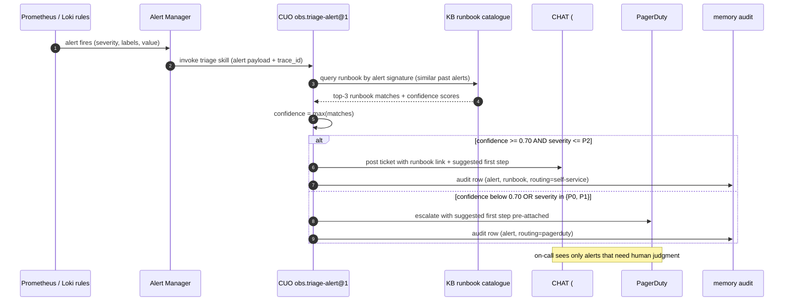

### Alert severity x routing matrix

| Severity | Default routing | Override | Examples |
|---|---|---|---|
| **P0 (down)** | Always PagerDuty + CHAT | Cannot suppress | Platform unreachable, memory write down, tenant data loss |
| **P1 (impaired)** | PagerDuty with runbook attached | Confidence >= 0.90 -> CHAT-only with on-call notified | p95 latency > 3x target, provider down, auth degraded |
| **P2 (warn)** | CUO triage -> CHAT or PagerDuty | Conf >= 0.70 -> CHAT self-service | SLO budget burn rate > 2x, cost cap approaching 80%, cache hit rate dropping |
| **P3 (info)** | Daily CUO digest in CHAT | Conf >= 0.50 -> bundled in digest | Slow query trend, persona-version drift < 0.30, stale memory citations |
| **P4 (dev)** | Slack only (dev-channel) | - | CI flakes, staging warnings, review reminders |

### Runbook catalogue grows by itself

When CUO can't auto-route an alert (confidence < 0.70), the resulting PagerDuty incident becomes a runbook-authoring trigger. Post-incident, the on-call adds a runbook entry; CUO's confidence on similar future alerts rises. The feedback loop:

1. Novel alert -> PagerDuty -> human handles -> resolves -> writes a runbook (or skill-author drafts one from the resolution).
2. Runbook indexed in KB with the alert-signature embedding.
3. Next similar alert -> CUO finds the runbook -> confidence >= 0.70 -> CHAT self-service.
4. On-call load decreases over time; the runbook catalogue grows.

Target: >= 60% of alerts auto-runbookable by P1 exit; >= 80% by P2. The KPI dashboard surfaces "% of alerts that never paged anyone" as the headline metric.

## Compliance evidence surface - read-only regulator views

The standard pattern when an auditor arrives is "let me give you a Postgres readonly account and good luck." It's a security incident waiting to happen. OBS exposes per-regulator scoped read-only views over the memory audit chain so auditors see exactly what they need - chained, exportable, tamper-evident - without touching the underlying operational data.

### Regulator view x audit scope matrix

| Regulator | What they see | Retention requirement | Export format |
|---|---|---|---|
| **EU AI Act (Art. 12)** | All `ai.invocation` rows for EU-residency tenants, persona-version, decision rationale, human-confirm events | >= 6 months active, indefinite cold | Signed JSON bundle + chain-of-custody manifest |
| **PDPL (Art. 14 DSAR)** | Per-subject filtered audit rows; all decision events involving the subject's data | >= 1 year | JSON or CSV per subject; multilingual labels (vi + en) |
| **SOC 2 Type II** | Access events, privilege changes, backup events, incident audit, SLO breaches | >= 1 year per auditor period | CSV bundle + the auditor's quarterly evidence package |
| **ISO 27001:2022** | Information security audit rows, risk register updates, control changes | >= 3 years | JSON + signed manifest |
| **GDPR (Art. 30 RoPA)** | Processing activity audit, cross-border transfer events, data-subject rights events | indefinite while processing | Signed JSON |
| **Vietnam Decree 13/2023 (Art. 17)** | Processing log scoped to Vietnamese data subjects | >= 2 years | JSON or PDF (signed) |

### Per-view scoping mechanism

```yaml
compliance_views:
  eu_ai_act:
    audit_kinds: [ai.invocation, ai.failover_triggered, ai.degraded_mode]
    filter: { tenant.residency: eu-1 }
    fields_visible: [seq, ts_ns, op, extra.tenant_id, extra.agent_persona, extra.module,
                     extra.usage, extra.redaction_applied, extra.failover_path,
                     prev_chain, chain]
    fields_hidden: [extra.prompt_hash, extra.response_hash]   # hashes only proven, not exposed
    retention_min_days: 180
    export_format: signed_json
    auditor_account: requires_csr_signoff
  pdpl_dsar:
    audit_kinds: [*]   # all kinds - DSAR is data-subject-scoped, not kind-scoped
    filter: { subject_in_extra: $subject_id }
    fields_visible: all_except_pii_hashes
    retention_min_days: 365
    export_format: json_or_csv
    auditor_account: tenant_dpo_only
  soc2_cc7_2:
    audit_kinds: [auth.*, access.*, backup.*, incident.*]
    fields_visible: [seq, ts_ns, op, extra.actor, extra.action, extra.target]
    retention_min_days: 365
    export_format: csv_bundle
    auditor_account: external_auditor_only
```

### Chain-of-custody manifest

Every regulator export includes a manifest that proves the export is a faithful slice of the memory chain. The manifest contains:

- **Time window:** ISO 8601 range; rows outside the window are excluded.
- **Filter predicates:** the exact compliance-view filter that was applied.
- **Row count:** N rows exported, sequence numbers N_min..N_max.
- **Chain anchors:** the memory chain hash at the start and end of the window (proves no rows were inserted or removed between those points).
- **Export signer:** Ed25519 signature by OBS with the export-request audit row hash.
- **Auditor identity:** JWT subject of the auditor requesting the export.

An auditor can verify the export independently: recompute the chain hashes from the exported rows + the manifest anchors, and confirm they match. This is the protocol-level guarantee that compliance evidence cannot be tampered with mid-export.

## Architecture

Every CyberOS service ships the OTel SDK in-process. The collector receives all signals, applies PII redaction, tags with tenant_id, and fans out to Loki (logs), Tempo (traces), Prometheus (metrics). LangSmith receives AI-trace data directly from AI Gateway. Grafana renders dashboards via a Rust tenant-aware query proxy. Alert Manager evaluates Prometheus rules and routes.

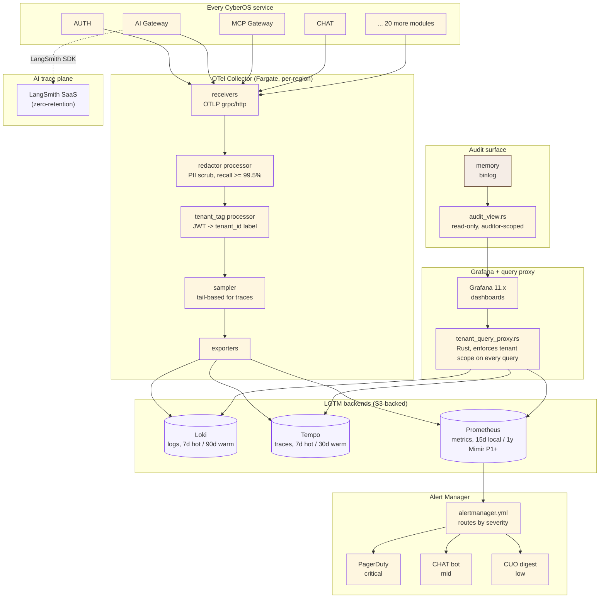

### Internal components

| Component | Where | Responsibility |
|---|---|---|
| `cyberos-obs-collector` | services/obs-collector | Rust supervisor around the upstream `otelcol-contrib` binary (bin `cyberos-obs`). Validates the OTLP -> resource -> attributes/pii_scrub -> batch -> Loki/Prometheus/Tempo pipeline shape, manages the bearer-token file, and exposes `obs_collector_*` self-metrics. TASK-OBS-001. |
| `attributes/pii_scrub` processor | otelcol pipeline (logs + traces) | PII scrubber the collector requires on the logs and traces pipelines; redaction recall target >= 99.5%. Same rule set as the AI Gateway redactor. |
| `resource` / `attributes` processors | otelcol pipeline | Set the `tenant.id` label from incoming resource attributes so every signal is tenant-scoped. Source of truth: the `tenant.id` attribute. |
| tail sampling | otelcol pipeline (planned) | Keep 100% of error + slow traces, sample a fraction of the rest. Slice 1 runs a batch processor; the tail sampler is a later addition. |
| `Loki` | backend | Log storage. S3-backed. Compressed gzip. 7d hot / 90d warm. |
| `Tempo` | backend | Trace storage. S3-backed. 7d hot / 30d warm. |
| `Prometheus` | backend | Metrics. Local 15d. Mimir for 1y at P1+. |
| `cyberos-obs-proxy` | services/obs-proxy | Rust axum proxy between Grafana and the backends. AST-injects a `tenant_id` filter into every LogQL / PromQL / TraceQL query so no tenant can read another's telemetry; cross-tenant queries are rejected with 403. Slice 1 ships the LogQL injector. TASK-OBS-002. |
| `Grafana` | frontend | 11.x. Per-module SLO dashboards + per-tenant cost dashboards + read-only audit-log view (datasource: memory). |
| `cyberos-obs-router` | services/obs-router | Rust service that parses Alertmanager webhooks and routes each alert through CUO's `obs.triage-alert` skill to CHAT or PagerDuty. Severity parsing, confidence-based routing, the P0/P1-always-page rule, deduplication, and ack handling. TASK-OBS-007. |
| `SLO engine` | services/obs-slo (planned) | Sloth-based. SLO definitions in YAML committed to the repo. Burn-rate alerts generated automatically. |
| `cost pipeline` | services/obs-cost (planned) | Daily cost roll-up from AWS Cost Explorer + AI Gateway usage + storage metrics. Per-tenant breakdown. |
| `cyberos-obs-compliance-view` | services/obs-compliance-view | Read-only per-regulator views over the memory audit chain. Per-view audit-kind scoping, time-window validation, PII scan, and an Ed25519-signed manifest with chain proof the auditor verifies independently. Exposed as a Grafana datasource so compliance queries in the same UI as operations. TASK-OBS-008. |
| `LangSmith client` | integrated in AI Gateway | Sends prompt/completion/tool-call traces directly to LangSmith. Zero-retention contract in place. |

## Data model

OBS is mostly streaming - its "data model" is the schema of OTel signals plus SLO and alert configuration. Below are the entity relationships.

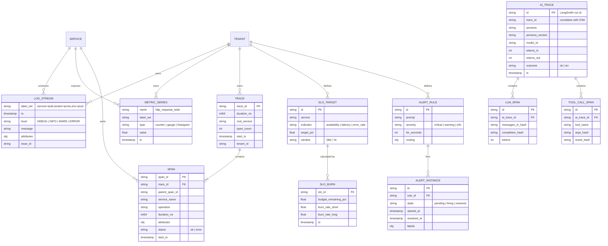

### Canonical OTel attribute schema

| Attribute | Type | Required | Purpose |
|---|---|---|---|
| `tenant.id` | string (UUID) | YES | Tenant scoping - load-bearing for all queries. |
| `tenant.slug` | string | SHOULD | Human-readable label. |
| `actor.id` | string | YES | Subject (user / agent / service). |
| `actor.kind` | "human" / "agent" / "service" | YES | Authentication shape. |
| `persona.version` | string | if agent | e.g. `cuo-v2.3.1`. |
| `module` | string | YES | e.g. `memory`, `auth`, `chat`. |
| `service.name` | string | YES | OTel standard. |
| `service.version` | string | YES | OTel standard. |
| `deployment.environment` | "dev" / "staging" / "prod" | YES | OTel standard. |
| `cyberos.severity_class` | "p0" / "p1" / "p2" / "p3" | SHOULD | For alert routing. |
| `cyberos.cost_usd` | float | if applicable | For per-tenant cost dashboards. |

## API surface

### Query API (Grafana-compatible, tenant-scoped)

All queries flow through `tenant_query_proxy.rs`, which extracts tenant_id from the caller's JWT and rewrites the query to inject a `{tenant_id="..."}` label filter. Cross-tenant queries return 403.

| Method | Path | Purpose |
|---|---|---|
| POST | `/api/v1/loki/query` | LogQL query (Grafana datasource). |
| POST | `/api/v1/loki/query_range` | Range LogQL query. |
| POST | `/api/v1/prom/query` | PromQL query. |
| POST | `/api/v1/prom/query_range` | Range PromQL. |
| POST | `/api/v1/tempo/api/search` | Tempo trace search. |
| GET | `/api/v1/tempo/api/traces/{id}` | Get a full trace by id. |
| POST | `/api/v1/audit/query` | memory audit-log query (read-only). |
| GET | `/api/v1/slo` | List SLO targets for the tenant. |
| GET | `/api/v1/slo/{id}/burn` | Burn-rate for a specific SLO. |
| GET | `/api/v1/cost/mtd` | MTD cost breakdown for the tenant. |
| GET | `/api/v1/alerts/active` | Active alerts for the tenant. |
| POST | `/api/v1/alerts/{id}/silence` | Silence an alert (operator scope). |

### GraphQL subgraph (federated)

```graphql
extend schema
 @link(url: "https://specs.apollo.dev/federation/v2.5", import: ["@key", "@requiresScopes"])

type SLO @key(fields: "id") {
 id: ID!
 service: String!
 indicator: SLOIndicator!
 targetPct: Float!
 window: String!
 currentPct: Float!
 budgetRemainingPct: Float!
 burnRateShort: Float!
 burnRateLong: Float!
}

type Alert @key(fields: "id") {
 id: ID!
 ruleName: String!
 severity: Severity!
 state: AlertState!
 startedAt: DateTime!
 resolvedAt: DateTime
 labels: JSON!
}

type CostReport @key(fields: "tenantId month") {
 tenantId: ID!
 month: String!
 totalUsdCost: Float!
 infraUsdCost: Float!
 aiUsdCost: Float!
 storageUsdCost: Float!
 byService: [ServiceCost!]!
}

type ServiceCost {
 service: String!
 usdCost: Float!
}

enum SLOIndicator { AVAILABILITY LATENCY ERROR_RATE THROUGHPUT }
enum Severity { CRITICAL WARNING INFO }
enum AlertState { PENDING FIRING RESOLVED }

type Query {
 slos(service: String): [SLO!]! @requiresScopes(scopes: [["obs.read"]])
 alertsActive: [Alert!]! @requiresScopes(scopes: [["obs.read"]])
 costMTD: CostReport! @requiresScopes(scopes: [["obs.cost_read"]])
 trace(id: String!): Trace @requiresScopes(scopes: [["obs.read"]])
}
```

### OTel ingest endpoints

| Method | Path | Purpose |
|---|---|---|
| POST | `/v1/logs` | OTLP logs ingest (collector). |
| POST | `/v1/metrics` | OTLP metrics ingest. |
| POST | `/v1/traces` | OTLP traces ingest. |
| GET | `/metrics` | Prometheus scrape endpoint (collector self-telemetry). |
| GET | `/health` | Liveness + signal counts. |

## Key flows

### Flow 1 - log ingestion (PII-scrubbed, tenant-tagged)

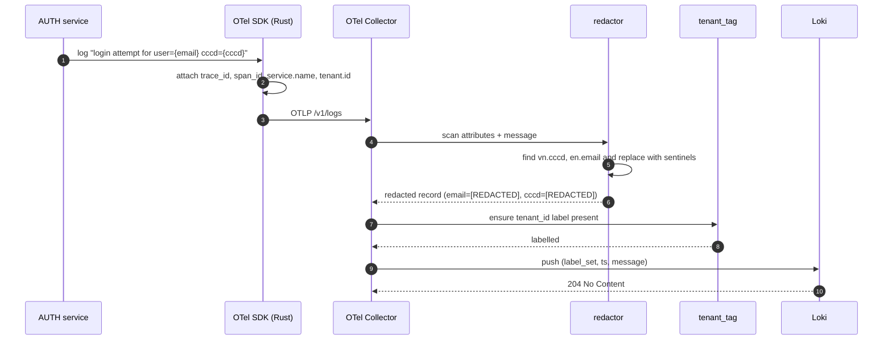

(task pending): PII recall >= 99.5%. Redaction at the collector is the last point at which PII can be stopped before it lands on S3.

### Flow 2 - metric scrape + alert evaluation

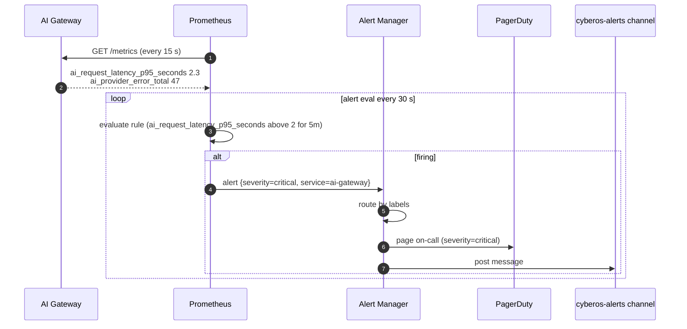

### Flow 3 - trace propagation across modules

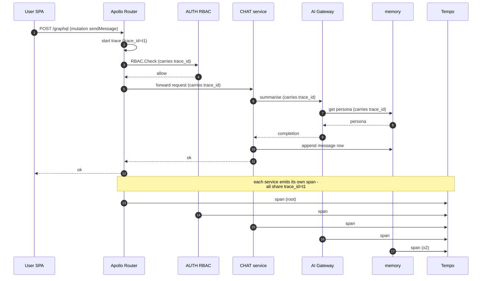

(task pending): end-to-end trace continuity verified. W3C TraceContext propagation through every internal call. One `trace_id` stitches the whole transaction.

### Flow 4 - alert escalation (severity-based routing)

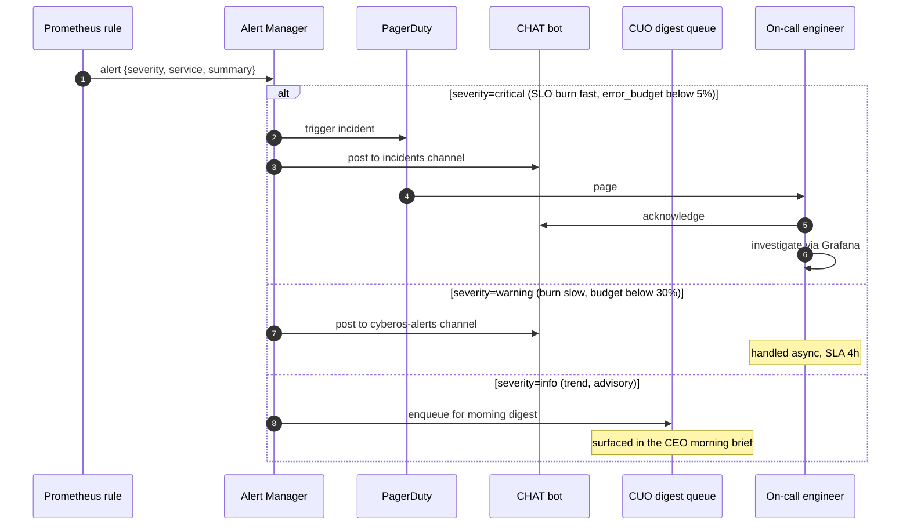

(task pending): PagerDuty for critical, CHAT for low, CUO digest for trends.

### Flow 5 - audit-log query (compliance review)

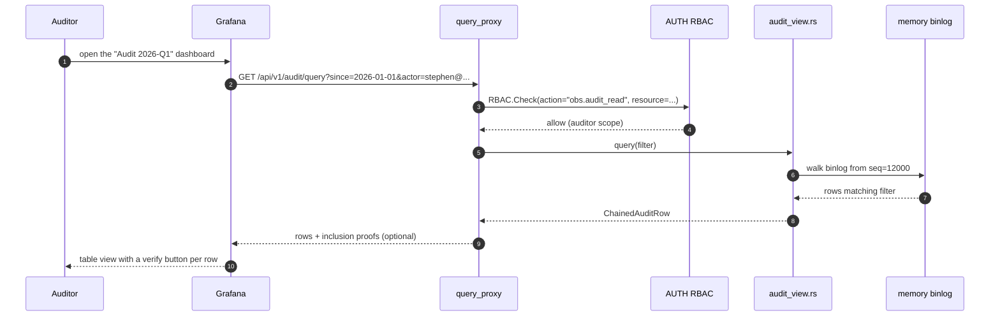

EU AI Act Art. 12: decision logs retained >= 6 months; PDPL Art. 14 DSAR; auditors get read-only access scoped by engagement.

## Alert lifecycle

Alerts traverse a five-state lifecycle. Every state transition emits a metric for SLO compliance tracking.

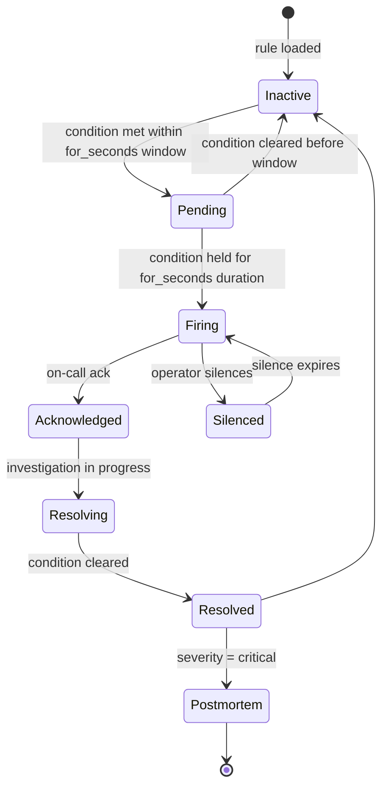

### SLO catalogue (P0)

| Service | Indicator | Target | Window | Owner |
|---|---|---|---|---|
| Platform (aggregate) | availability | >= 99.5% | 28d rolling | CTO |
| CHAT | availability | >= 99.9% | 28d | CTO |
| memory search | availability | >= 99.5% | 28d | CDO |
| AUTH | availability | >= 99.95% | 28d | CSO |
| AI Gateway | availability | >= 99.9% | 28d | CTO |
| AI Gateway | latency p95 | <= 2 s | 28d | CTO |
| MCP Gateway | availability | >= 99.95% | 28d | CTO |
| MCP Gateway | write tool p95 | <= 1 s | 28d | CTO |
| GraphQL Router | latency p95 | <= 400 ms | 28d | CTO |
| Backup RPO | recovery point | <= 1 h | continuous | CTO |
| Backup RTO | recovery time | <= 4 h | continuous | CTO |

## Functional requirements

The CyberOS task catalogue is being rebuilt one feature at a time via the open [task-author](https://github.com/cyberskill/cyberos/tree/main/modules/skill/task-author) Agent Skill.

Previous task enumerations were archived 2026-05-14 and are no longer reflected on this page. Specific tasks land here as they are re-authored.

## Non-functional requirements

| NFR ID | Concern | Target | Measurement |
|---|---|---|---|
| `N(task pending)` | Platform availability (28-day rolling) | >= 99.5% | SLO target, burn-rate alerts |
| `N(task pending)` | CHAT availability | >= 99.9% | SLO |
| `N(task pending)` | memory search availability | >= 99.5% | SLO |
| `N(task pending)` | Backup RPO | <= 1 h | scheduled backup audit |
| `N(task pending)` | Backup RTO | <= 4 h | quarterly restore drill |
| `N(task pending)` | Cross-region failover (P3) | <= 24 h | annual DR drill |
| `N(task pending)` | SLO dashboard refresh latency | <= 60 s | monitor synthetic SLO breach |
| `N(task pending)` | Log ingest end-to-end latency | <= 30 s p95 | synthetic log -> query |
| `N(task pending)` | Trace ingest end-to-end | <= 60 s p95 | synthetic trace |
| `N(task pending)` | Log PII redaction recall | >= 99.5% | test set |
| `N(task pending)` | Log PII redaction precision | >= 95% | test set |
| `N(task pending)` | OBS plane availability | >= 99.5% | SLO (recursive) |
| `N(task pending)` | Decision-log retention | >= 180 d | config audit, S3 lifecycle |
| `N(task pending)` | Cross-tenant query leakage | = 0 | property-based test |
| `N(task pending)` | OBS plane infra cost (P0) | <= $130/month | cost dashboard |

## Dependencies

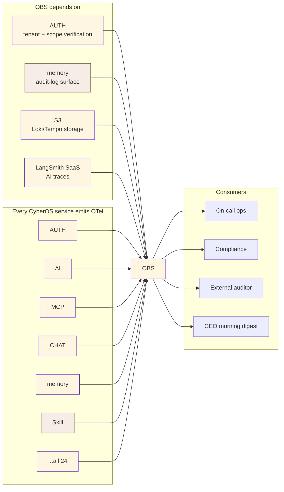

## Compliance scope

| Regulation / standard | Article / clause | OBS feature |
|---|---|---|
| EU AI Act | Art. 12 - Logging | Decision-log retention >= 6 months; a LangSmith trace per AI decision. |
| EU AI Act | Art. 13 - Transparency | Audit-log surface available to deployers (tenant admins). |
| EU AI Act | Art. 14 - Human oversight | Per-tenant alerting flags anomalous agent behaviour. |
| Vietnam PDPL | Art. 14 - DSAR | Per-subject log + decision export via the audit-log surface. |
| Vietnam Decree 13/2023 | Art. 17 - Processing log | The audit-log surface materialises the processing log for the regulator. |
| GDPR | Art. 30 - Records of processing | The memory audit chain + OBS audit-view = records of processing. |
| GDPR | Art. 32 - Security of processing | PII redaction on logs; tenant-scoped queries; mTLS to collectors. |
| GDPR | Art. 33 - Breach notification | Alert routing surfaces breaches; OBS provides the forensic timeline. |
| ISO/IEC 27001:2022 | A.8.15 - Logging | Centralised structured logs; integrity via the memory chain. |
| ISO/IEC 27001:2022 | A.8.16 - Monitoring activities | Per-module SLO + alert pipeline. |
| ISO/IEC 42001 (AIMS) | § 9.1 - Performance evaluation | LangSmith + AI Gateway metrics = AI system performance KPIs. |
| SOC 2 Type II | CC7.2 - Monitoring controls | SLO dashboards, alert routing, audit-log retention. |
| SOC 2 Type II | CC7.3 - Detection | Alert Manager + on-call rotation. |

## Risk entries

| ID | Risk | Likelihood | Impact | Owner | Mitigation |
|---|---|---|---|---|---|
| `R-OBS-001` | PII leaks into Loki/Tempo via a missed redaction rule | Medium | High | CSO | Recall >= 99.5% gated in CI; quarterly red-team; opt-in encryption at rest for sensitive log streams. |
| `R-OBS-002` | Cross-tenant log leakage via a crafted query | Low | Catastrophic | CSO | Query-proxy property-based test gate; tenant_id always injected from JWT, not user input. |
| `R-OBS-003` | LangSmith outage blinds AI debugging | Medium | Medium | CTO | Local OTel trace mirror retained 7 d; LangSmith is for deep analysis, not primary. |
| `R-OBS-004` | Alert fatigue (too many warnings) | High | Medium | CTO | Burn-rate alerting (Sloth) instead of static thresholds; quarterly alert review. |
| `R-OBS-005` | S3 retention misconfig -> decision logs purged early | Low | High | CTO | Lifecycle policy declared in Terraform; a CI gate verifies >= 180 d retention for the decision-log bucket. |
| `R-OBS-006` | Grafana credential leak - broad audit-log access | Low | High | CSO | Grafana auth via OIDC SSO; per-folder scope; auditors get time-bound access. |
| `R-OBS-007` | Trace-id loss across an async boundary -> broken span tree | Medium | Low | CTO | OTel context propagation in every async runtime crate; a CI test verifies multi-hop trace continuity. |
| `R-OBS-008` | Prometheus disk full -> metrics gap | Medium | Medium | CTO | 15-d retention with auto-eviction; alert on free disk < 30%; long-term in Mimir at P1+. |
| `R-OBS-009` | OTel SDK version drift across modules | Medium | Low | CTO | Pin the SDK version in a shared crate / package; Renovate alerts on upstream releases. |
| `R-OBS-010` | Cost pipeline mis-attributes spend to the wrong tenant | Medium | Medium | CFO | tenant_id required in every spend event; monthly reconciliation gate against the AWS bill. |
| `R-OBS-011` | **Auto-runbook router miscategorises P0 as P2 -> critical alert silenced** | Low | Critical | CTO | P0/P1 always escalate to PagerDuty regardless of triage confidence; severity is set by the Prometheus rule, never modifiable by CUO; the routing audit row makes silent suppression detectable. |
| `R-OBS-012` | Compliance export tampering - auditor receives a modified bundle | Low | Critical | DPO | Ed25519 signed manifest with chain anchors + per-row hashes; the auditor verifies independently; a tampering attempt is detected at signature verification. |
| `R-OBS-013` | CUO triage skill goes down -> all alerts fall back to PagerDuty (page storm) | Medium | Medium | CTO | The triage skill has graceful degrade: when unavailable, alerts route via the static severity -> routing table (the pre-CUO behaviour); on-call is notified that triage is offline. |
| `R-OBS-014` | LangSmith data retention violates EU residency (data shipped to US) | Low | High | DPO | EU-residency tenants route AI traces to a self-hosted LangSmith-compatible store in EU-1; ZDR + DPA confirmed before any third-party SaaS is enabled. |
| `R-OBS-015` | Trace sampling drops the wrong tail (errors sampled out) | Medium | Medium | CTO | Tail-based sampling: 100% on errors + slow traces; head-based 10% for normal traffic; a CI test verifies error-trace coverage = 100%. |
| `R-OBS-016` | Persona-drift detector false-positive triggers a Lumi rollback unnecessarily | Medium | Medium | CPO | The drift detector requires 3 consecutive windows above threshold; rollback is a candidate-version proposal, not auto-applied; a human confirms. |
| `R-OBS-017` | Cross-pillar correlation breaks when a service uses an async runtime without OTel context propagation | Medium | Medium | CTO | OTel context-propagation middleware required in every service template; a CI test verifies trace_id continuity across > 2 hops; the PR check blocks merge if missing. |
| `R-OBS-018` | Query proxy DOS via expensive LogQL queries from one Member | Medium | Medium | CTO | Per-Member 100 QPS limit + per-query 30 s timeout + a complexity analyser refuses unbounded scans; cost shown to the user before execution. |
| `R-OBS-019` | Runbook catalogue drift - the runbook says "increase Bedrock quota" but the tenant uses Vertex | Medium | Low | CTO | Runbooks tagged with applicability conditions (provider, region, severity); CUO triage filters runbooks before suggestion; stale runbooks flagged for review quarterly. |
| `R-OBS-020` | SLO budget burn-rate alarm fires during planned maintenance -> noise | Medium | Low | CTO | Maintenance windows declared in OBS (per service); the SLO calc excludes declared windows; undeclared maintenance still alerts (catches "forgot to declare"). |

## KPIs

| KPI | Formula | Source | Target |
|---|---|---|---|
| **Platform availability (28d)** | 1 - error_minutes / total_minutes | Prometheus | >= 99.5% |
| **SLO dashboard freshness** | last_scrape_age | Prometheus | <= 60 s |
| **Log ingest p95 latency** | histogram | collector | <= 30 s |
| **PII redaction recall** | TP / (TP + FN) | CI gate | >= 99.5% |
| **Cross-tenant query rejections** | count | query_proxy | tracked; 0 successful breaches |
| **Alert false-positive rate** | fp / (fp + tp) | weekly review | <= 20% |
| **MTTR (critical)** | resolved_at - fired_at | PagerDuty | <= 60 min |
| **Error-budget remaining (per SLO)** | 1 - burned / budget | SLO engine | > 0 throughout the window |
| **Decision-log retention compliance** | days_retained | S3 lifecycle | >= 180 d |
| **Auto-runbook coverage** | (alerts auto-routed to CHAT) / total alerts | obs.triage-alert@1 audit rows | >= 0.60 by P1 exit; >= 0.80 by P2 |
| **P0/P1 false-suppression rate** | P0/P1 alerts that didn't page | cross-check Prom rules vs PagerDuty events | = 0 (hard floor) |
| **Compliance export verification rate** | exports passing the auditor's manifest re-verification / total exports | auditor reports | = 1.0 (hard floor) |
| **Cross-pillar correlation completeness** | traces with all 4 pillars present / total traces | OBS coverage probe | >= 0.95 |
| **Tail-sampling error coverage** | error traces with the full trace retained / total error traces | Tempo | = 1.0 (hard floor) |
| **Persona-drift detector precision** | true-positive drifts / total flagged | quarterly human review | >= 0.80 (don't cry wolf on personas) |
| **Query proxy violation rejections** | cross-tenant query attempts / total queries | query proxy audit | tracked; spike = active threat |
| **MTTR for self-service tickets (P2/P3)** | resolved_at - ticket_created_at | CHAT ticket events | <= 4 h median |
| **Dogfooding alert acknowledgement (internal)** | internal alerts ACK'd within 5 min | filtered to tenant_id=org:cyberskill | >= 0.90 (we live by this) |

## RACI matrix

| Activity | CEO | CTO | CSO | CDO | CFO | DPO |
|---|---|---|---|---|---|---|
| Stack design + deployment | I | A/R | C | C | I | I |
| SLO definition | A | R | C | C | I | I |
| Alert rule maintenance | I | A/R | C | I | I | I |
| PII redaction rule maintenance | I | C | C | A/R | I | C |
| On-call rotation | I | A/R | C | I | I | I |
| Cost pipeline + reconciliation | I | C | I | I | A/R | I |
| Audit-log surface design | I | C | C | C | I | A/R |
| Compliance review (AI Act, PDPL) | I | C | C | C | I | A/R |

## Planned CLI surface

Operator CLI `cyberos-obs` plus the standard Grafana + Loki + Prometheus CLIs.

### 1. Tail logs for a tenant

```
$ cyberos-obs logs tail --tenant acme --service auth --since 5m

2026-05-14T07:19:02Z INFO auth login_attempt subject=[REDACTED:email] trace=t_3ab9
2026-05-14T07:19:02Z INFO auth login_success aal=aal3 trace=t_3ab9
2026-05-14T07:19:03Z INFO rbac check action=memory.put decision=allow trace=t_3ab9
...
```

### 2. SLO status

```
$ cyberos-obs slo status

SERVICE INDICATOR TARGET CURRENT BUDGET BURN
platform availability 99.5% 99.94% 99% 0.06x (28d)
chat availability 99.9% 99.97% 71% 1.2x (warning)
auth availability 99.95% 100% 100% 0x
ai-gateway latency p95 2 s 1.4 s ok -
memory-search availability 99.5% 99.99% 99% 0x
mcp-gateway write p95 1 s 0.42 s ok -
graphql-router latency p95 400 ms 280 ms ok -
```

### 3. Active alerts

```
$ cyberos-obs alerts active

ALERT SEVERITY STARTED STATUS
ChatErrorBudgetBurnFast warning 5m ago firing
AIProviderLatencyHigh info 12m ago firing
S3LifecycleStaleConfig (cost-bucket) info 2h ago silenced
```

### 4. Per-tenant cost MTD

```
$ cyberos-obs cost mtd --tenant acme

TENANT: acme
MONTH: 2026-05
-------------------------------------
Infra: $182.40
 Fargate (chat) $52.10
 Fargate (auth) $48.20
 RDS Postgres $42.10
 S3 storage $24.00
 Other $16.00
AI: $97.42 (cap $150, 64.9%)
Storage: $24.00
-------------------------------------
TOTAL: $303.82
```

### 5. Trace lookup by id

```
$ cyberos-obs trace get t_3ab9c8d4

trace_id: t_3ab9c8d4
duration: 412 ms
spans:
 apollo-router sendMessage(graphql) 412 ms
 ├─ auth RBAC.Check 8 ms
 ├─ chat CreateMessage 286 ms
 │ ├─ memory put_message 12 ms
 │ └─ ai-gateway summariseSync 260 ms
 │ ├─ tenant_policy 3 ms
 │ ├─ redactor 2 ms
 │ └─ bedrock invoke 254 ms
 └─ chat FanoutMentions 14 ms
```

### 6. Audit-log query (compliance)

```
$ cyberos-obs audit query --since 2026-04-01 --action 'memory.delete' --format jsonl
{"seq":12031,"action":"memory.delete","actor":"stephen@...","mode":"tombstone","path":"memories/...","ts":"..."}
{"seq":12102,"action":"memory.delete","actor":"dpo@...","mode":"purge","reason":"DSAR-2026-014","path":"memories/...","ts":"..."}
...
[query] 47 rows, chain integrity verified
```

### 7. SLO definition (YAML)

```yaml
# cyberos-obs/slo/ai-gateway-latency.yml
slo:
  id: ai-gateway-latency-p95
  service: ai-gateway
  indicator: latency_p95
  target: 2.0 # seconds
  window: 28d
  alerts:
    burn_rate_fast:
      severity: critical
      route: pagerduty
      threshold: 2.0 # 2x burn over 1h
    burn_rate_slow:
      severity: warning
      route: chat
      threshold: 1.0 # 1x burn over 6h
```

## Phase status & estimates

- **Status:** planned - P0; slice 1 in build
- **Est. LoC:** ~3,000 - Rust query proxy + Go collector configs
- **SLOs at P0:** ~11 - platform + per-module
- **P0 budget:** ~$130/mo - LGTM hosting + LangSmith starter
- **Decision-log retention:** >= 180 d - EU AI Act Art. 12
- **PII recall target:** >= 99.5% - (task pending)

| Capability | Status |
|---|---|
| OTel Collector + LGTM backends | planned, P0 |
| PII redaction processor | planned, P0 |
| Tenant-tag processor | planned, P0 |
| tenant_query_proxy (Rust) | planned, P0 |
| Grafana dashboards (per-module SLO) | planned, P0 |
| Per-tenant cost dashboards | planned, P0 |
| Alert Manager + PagerDuty routing | planned, P0 |
| Audit-log surface (read-only) | planned, P0 |
| LangSmith integration | planned, P0 |
| SLO-as-code (Sloth-style) | planned, P0 |
| Auto-pause feature flags on burn | planned, P1 |
| Mimir for 1y metric retention | planned, P1+ |
| Multi-region active-active | planned, P3+ |

## References

- **Bigger picture (above):** 3 strategic roles + emitter/consumer diagram + auto-vs-human matrix.
- **Three-pillars unified pane (above):** pillar x signal-type table + cross-pillar correlation example + the tenant query proxy guarantee.
- **Auto-runbook router (above):** 6-step routing sequence + severity x routing matrix + the runbook-catalogue growth loop.
- **Compliance evidence surface (above):** regulator view x audit scope matrix + per-view scoping YAML + the chain-of-custody manifest.
- **Cross-module page links:** [memory.html](../memory/index.html), [auth.html](../auth/index.html), [ai.html](../ai/index.html), [cuo.html](../cuo/index.html), [mcp.html](../mcp/index.html), [kb.html](../kb/index.html), [chat.html](../chat/index.html), [proj.html](../proj/index.html)
- **Build-readiness audit:** `archive/2026-05-14/AUDIT_AND_PLAN.md` (archived; see `cyberos/CHANGELOG.md`) - OBS placed at P0 slice 1 alongside AI Gateway as the two earliest P0 modules.
- **Research review:** `archive/2026-05-14/RESEARCH_REVIEW.md` (archived; see `cyberos/CHANGELOG.md`) - OBS rated "Strong" (9/10); the auto-runbook-router framing flagged as the most differentiated operational play.
- **Memory auto-sync vision:** [MEMORY_AUTOSYNC_DESIGN.md §8](../../docs/MEMORY_AUTOSYNC_DESIGN.md) - OBS reads from memory's audit chain for compliance exports; it never writes back (memory is upstream).
- **task authoring discipline:** [modules/skill/task-audit/AUTHORING_DISCIPLINE.md](https://github.com/cyberskill/cyberos/blob/main/modules/skill/task-audit/AUTHORING_DISCIPLINE.md).
- **EU AI Act** (Reg. 2024/1689) - Art. 12 logging, Art. 13 transparency, Art. 14 human oversight, Art. 26 deployer obligations.
- **ISO/IEC 27001:2022** - A.8.15 logging, A.8.16 monitoring activities.
- **ISO/IEC 42001 (AIMS)** - § 9.1 performance evaluation.
- **SOC 2 Type II** - CC7.2 monitoring, CC7.3 evaluation, CC7.4 incident response evidence.
- **Vietnam PDPL (Law 91/2025)** - Art. 14 DSAR transparency, Art. 20 security obligations.
- **Vietnam Decree 13/2023** - Art. 17 processing log requirement.
- **GDPR (EU 2016/679)** - Art. 30 Records of Processing Activities.
- **OpenTelemetry** - specification + Rust + Python SDKs; W3C TraceContext propagation.
- **Grafana Loki + Tempo + Mimir** - upstream LGTM stack.
- **LangSmith** - managed AI-trace observability (EU-residency tenants use a self-hosted equivalent).
- **Sloth** - SLO-as-code engine (Prometheus rule generator).
- **Architecture context:** [infrastructure.html#obs](../../architecture/infrastructure.html#obs).

[Previous: MCP Gateway](../mcp/index.html) | [Next module: CHAT](../chat/index.html)

## Changelog

History lives in the [changelog](./changelog.html); this page describes only the current state.
