PROJ is CyberOS's **project tracker, sprint engine, and Engagement billing surface** in one. The data model is Issue -> Cycle -> Project plus Engagement (the contract). Status is a closed enum (`backlog / todo / in-progress / in-review / done / cancelled`) with a configurable per-project workflow on top. Priority is the standard `urgent / high / medium / low / none`. Mutations are optimistic locally, server-canonical eventually; Yjs CRDTs let two Members edit the same description offline and merge without conflict. Every issue can link to memory entries - a memory becomes a citation, a decision-log row becomes a sub-task. AI features are first-class: CUO drafts the cycle review at end-of-cycle; the blocker-detector watches comments for "blocked by"; estimate calibration tracks estimated vs actual hours per Member per task class.

- **Strategic role:** orchestration spine - CRM -> PROJ -> TIME -> INV -> KB -> memory
- **Status:** planned - P1; slice 1 in build, P1 mid in the sequence
- **Primitives:** 4 - Issue, Cycle, Project, Engagement
- **Cross-module joins:** 7 - CRM, TIME, INV, KB, REW, memory, OKR
- **Sync:** optimistic - WebSocket + server-canonical
- **Offline:** Yjs CRDT - offline-edit + merge
- **Memory integration:** bidirectional - Issue <-> memory cite + Layer-3 ingest
- **Engagement model:** 3 modes - T&M, fixed-fee, retainer
- **i18n:** vi + en - status / UI strings / cycle reviews
- **AI features:** 5 - triage, blocker, review, calibration, scope-creep
- **UI surfaces:** 4 - Board, Timeline, Gantt, Brief
- **Depends on:** AUTH, memory, TIME, plus AI, MCP, OBS, NATS
- **Est. LoC:** ~11,000 - Rust + TS SPA + Yjs

## The bigger picture - three strategic roles

PROJ is the **orchestration spine of CyberOS** - the module where every other module's data joins around a unit of work. Reading this page as "yet another Linear clone" misses the point: three distinct roles land in one Postgres schema, and the design treats them as equal-weight requirements.

### Role 1 - orchestration spine

**Every module's join lives here.** CRM creates a deal -> PROJ converts it into an Engagement. TIME logs hours against an Issue, INV pulls those hours via the Engagement rate card. KB archives the cycle review. REW pulls Member calibration. OKR ties to Project status. Memory ingests every state change as a Layer-3 node. PROJ is where the threads of work cross - and where the audit trail of "did we do what we said we'd do" lands.

### Role 2 - memory-anchored decisions

**Issues cite memories, not stale prose.** An Issue is a node that _references_ a memory (the decision that spawned it, the spec it implements, the prior issue it supersedes). Every state change emits a chained audit row to the local memory. When the cycle closes, the review draft cites the actual decisions that drove the work - not "we decided to do X" without a source. This is the difference between a Jira ticket and a verifiable work record.

### Role 3 - Engagement billing surface

**Consultancies need this - product trackers assume it away.** Linear assumes a product team. Jira assumes either. We assume _consultancy delivery_: a Client signs an Engagement at a billing mode (T&M / fixed-fee / retainer) with a localised rate card, time entries are billable-by-default with per-task overrides, and the TIME -> INV chain rides on the Engagement, not the Project. Pure product trackers cannot model this without bolting on a billing add-on; we model it natively.

### The PROJ join surface (every module touches it)

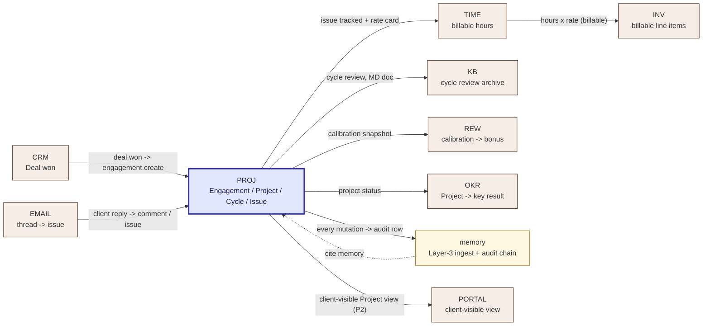

Every arrow is a data dependency. Removing PROJ from the architecture means rebuilding the same join in 8 other places - that's why PROJ is the orchestration spine, not just "the issue tracker."

### Auto vs manual operations matrix

| Operation | How it happens | Why this split |
|---|---|---|
| Issue create | **Manual** - Member-driven in the SPA | Work units must be intentional; auto-creating issues from chatter is noise. |
| Status transition | **Manual** with WF validator + optimistic apply | The Member's act of moving an Issue is itself a meaningful event for the audit trail. |
| Blocker detection | **Auto** - pattern match on comments + dwell time | Members forget to surface blockers; CUO Notify nudges the assigner without forcing a UI change. |
| Auto-roll at cycle close | **Auto** when project config enables it | Default off; teams opt in once they trust the roll behaviour. Saves an evening of dragging. |
| Cycle review draft | **Auto** at cycle close, **manual** review by the AM before send | LLMs hallucinate; the AM is accountable for the prose; the draft saves 1-2 hours per cycle. |
| Memory Layer-3 ingest | **Auto** on every state change | The audit chain must be complete; opt-out is at the privacy class level (sync_class), not per-issue. |
| TIME -> INV roll-up | **Auto** at invoice generation | Billable hours computed from the Engagement rate card automatically; the AM reviews the draft invoice in INV. |
| Calibration snapshot | **Auto** nightly batch | The data is too noisy to update per-issue; nightly aggregation is the cadence dashboards need. |
| Issue <-> memory link | **Manual** in the SPA (with smart suggestions) | The citation is a deliberate authoring act, not an LLM guess; we surface candidates but the Member confirms. |

## Why PROJ exists

Linear's data-model insight was that three primitives - Issue, Cycle, Project - cover almost every workflow that product and services teams actually do, and that a fourth primitive ("Engagement") covers the consultancy case once you add a rate card and a billable / non-billable distinction. The UX insight was the sync-engine: the user never waits for a server round-trip; the server is the eventual authority, but the local copy is the one being typed into. PROJ replicates both insights and adds the CyberOS-specific bindings: every issue links to memories (so a decision-log row can spawn a sub-task), every comment is a candidate for a blocker-detection nudge, every cycle ends with a CUO-drafted review the Account Manager can edit before sending to the Client.

- **Sync-engine feel.** Optimistic local updates, WebSocket fan-out, server-canonical rebase on conflict. No spinners on the hot path; offline edits merge via Yjs CRDT.
- **Engagement primitive.** Where Linear has "Project", we have "Project under Engagement". Rate cards, billable rules, and the TIME -> INV flow ride on the Engagement.
- **Memory-linked work.** Every issue can cite a memory; tasks are ingested into Layer 3; cross-project pattern queries answer "what's the pattern in late tasks?".

The bet is that consultancies do not need a different tracker per client - they need one tracker that understands the consulting shape natively. Linear validated the three-primitive model; CyberOS extends it with the contract layer and the AI-native loop. The sync-engine is the rest of the way to "feels instant" - Linear documented the pattern; we re-implement it because the consulting cycle is two-weeks-anchored to a Client review, and that review needs to be CUO-draftable from the comment stream.

## What it does - 5W1H2C5M

A structured decomposition of PROJ's scope.

| Axis | Question | Answer |
|---|---|---|
| **5W - What** | What is PROJ? | An issue tracker with four primitives (Issue, Cycle, Project, Engagement). Sync-engine for the SPA; Yjs CRDT for offline-edit merges; PGroonga for Vietnamese full-text; memory integration both ways (issues link to memories, completed issues ingested as Layer 3 nodes). |
| **5W - Who** | Who uses it? | **Members:** create / assign / progress issues; review their own cycle queue daily. **Account Managers:** own the Engagement; edit + send CUO-drafted cycle reviews. **Clients:** read-only Project view via PORTAL (P2). **Agents:** CUO Notify on blocker detection; CUO/COO-skill triage suggestions. |
| **5W - When** | When does it run? | Continuous: WebSocket fan-out on every mutation; nightly batch for the estimate-calibration metric refresh; end-of-cycle batch for review draft generation. Auto-roll of incomplete tasks at cycle close (configurable per team). |
| **5W - Where** | Where does it run? | P1: single region (SG-1) with VN-residency S3 for tenant uploads. P3+: multi-region active-active. The sync server is a per-tenant axum binary; the SPA is hosted as static assets. |
| **5W - Why** | Why a separate tracker? | Existing trackers do not natively model the Engagement / rate-card / billable-time loop; sync-engine UX is rare outside Linear; and memory-linked work is a CyberOS-specific need that no off-the-shelf tracker provides. |
| **1H - How** | How does it work? | Mutations: client-side optimistic apply -> JMAP-like RPC over WebSocket -> server validates -> server-canonical state broadcast to all connected SPAs -> conflicts resolved server-side and rebased into the client. CRDT: long-form fields (description, comment body) are Yjs documents; the rest is last-write-wins with a vector clock. |
| **2C - Cost** | Cost budget? | P1: ~$80 / month for the SG-1 single-tenant pilot. 50-tenant: ~$340 / month (RDS + Redis + Fargate + S3). Per-issue write cost ~$0.0000004. |
| **2C - Constraints** | Constraints? | (a) Issues ingested into memory Layer 3 - but body content gates as per (task pending). (b) Per-task ACL - private engagements MUST NOT be visible to non-engaged Members. (c) Vietnamese localisation of status / UI strings - non-negotiable for P1 launch. |
| **5M - Materials** | Stack? | Rust 1.81, axum 0.7, sqlx, PostgreSQL 16 + PGroonga, Redis 7, S3 + KMS, Yjs (server-side ywasm + client TS), TypeScript SPA (React + Zustand), WebSocket fan-out via NATS JetStream, OpenTelemetry SDK. |
| **5M - Methods** | Method choices? | Three-primitive model (Linear). Sync-engine UX (Linear). Yjs for CRDT long-form (because OT is too brittle at scale). Closed status enum + workflow overlay (not free-form labels). PGroonga for VN search. NATS JetStream for fan-out (not Postgres LISTEN/NOTIFY - won't scale past 1k WS connections). |
| **5M - Machines** | Deployment? | Per-tenant Fargate axum binary handling WebSocket + REST. Postgres RDS Multi-AZ. Redis for hot-cache and WS rooms. NATS JetStream cluster (3 nodes P2+). S3 for attachments. |
| **5M - Manpower** | Who maintains? | 0.75 FTE (CTO seat) at P1 launch. By P2+: the COO seat owns product + Account Manager workflow; the CTO owns engine + sync layer. |
| **5M - Measurement** | How measured? | Issue write p95 <= 120 ms; SPA list-view load p95 <= 250 ms; offline-merge correctness >= 99.9% (property tests); memory ingestion p95 <= 5 s; cycle-review draft acceptance rate >= 60% by the Account Manager. |

## Orchestration spine - cross-module join contracts

PROJ is downstream of 2 modules (CRM, EMAIL) and upstream of 6 (TIME, INV, KB, REW, OKR, PORTAL); every other CyberOS module that touches "work" reads from or writes to a PROJ join contract. The contracts are stable interfaces - modules can be re-implemented behind them without breaking PROJ. The table below is the canonical list; every change to PROJ's data model must consider whether it widens a contract or breaks one.

| Counterparty | Direction | Join key | Trigger | Payload shape | Failure mode |
|---|---|---|---|---|---|
| **CRM** | CRM -> PROJ | `crm.deal_id -> engagement.source_deal_id` | `deal.stage = "won"` + AM clicks "Convert to Engagement" | `{deal_id, client_account_id, value_vnd, contract_url, am_id}` | Manual fallback: the AM creates the Engagement directly; the deal link is added retroactively. |
| **EMAIL** | EMAIL -> PROJ | `email.thread_id -> issue.source_thread_id` OR `issue_id` in comment | Member uses "Convert to issue" or replies with a `#PROJ-1234` mention | `{thread_id, from, subject, body, attachments[]}` | A thread reply with no PROJ tag stays in EMAIL; not auto-promoted. |
| **TIME** | TIME -> PROJ | `time_entry.issue_id -> issue.id` | Member logs hours via TIME UI or timer auto-stop | `{issue_id, member_id, minutes, entry_date, billable_override?}` | If `issue_id` is missing or invalid the entry is tagged `unallocated`; the AM triages weekly. |
| **INV** | PROJ -> INV | `engagement.id + cycle.id -> invoice.source_engagement_id` | INV draft invoice generation (monthly) or fixed-fee milestone | `{engagement_id, billable_hours_by_member_by_class, rate_card_snapshot, milestone_id?}` | If the rate card changed mid-cycle, INV uses the snapshot at time of entry - never retroactive. |
| **KB** | PROJ -> KB | `cycle.review.id -> kb_doc.source_id` | AM clicks "Send + archive" on the cycle review | `{cycle_id, project_id, review_markdown_sent, sent_at, sent_to}` | If KB is unavailable, the review stays in PROJ; backfill via `cyberos-kb backfill`. |
| **REW** | PROJ -> REW | `calibration_snapshot.member_id -> rew.calibration_input` | Nightly batch (PROJ side) -> REW reads daily | `{member_id, period, ratio_by_task_class, completion_rate, blocker_authorship_rate}` | REW uses only Member-confirmed calibration signals; raw drift never feeds bonus directly. |
| **OKR** | PROJ -> OKR | `project.id -> okr_kr.project_link` | OKR-side query: "what projects ladder to KR-Q3-rev?" | `{project_id, status, % issues done, cycle_review_links[]}` | The OKR view degrades to status-only if cycle reviews are absent. |
| **PORTAL (P2)** | PROJ -> PORTAL | `project.id -> portal_view.project_id` with `client_visible=true` | Client logs into PORTAL; PORTAL fetches via federated GraphQL | Subset of project: title, status %, public cycles, public comments only | RLS + `client_visible` flag enforced; misconfig = test failure in CI. |
| **memory** | Both directions | `issue.id <-> memory.path` (MEMORY_LINK table) | Mutation (auto-ingest); Member cites a memory (manual link) | Outbound: audit row per mutation. Inbound: `{path, relation: "cites" / "implements" / "supersedes"}` | Memory backlog > 60 s -> PROJ falls back to an in-memory queue + retry; alert on > 5 min. |

### Contract stability policy

Each join contract above is a **versioned interface**. Breaking changes require:

- **ADR** with the counterparty module owner co-signing.
- **Deprecation window:** >= 1 minor release with both old + new shape supported and a deprecation warning on old.
- **Migration test:** an integration test that exercises both versions end-to-end.
- **Memory:** the deprecation itself becomes a decision memory at `memories/decisions/proj-contract-change-<name>.md` for traceability.

This is a deliberate brake: PROJ's data shape is the most expensive thing in CyberOS to mutate, because 8 downstream modules read from it.

## Engagement economics - the consultancy-native primitive

The fourth primitive - Engagement - is where CyberOS earns its "consultancy-native" framing. A pure product tracker has Project but not the contract under which Project runs. A pure ERP has the contract but not the issues. PROJ owns both, joined by `project.engagement_id`. Below is the full economic model: billing modes, rate-card mechanics, and the per-Member, per-task-class billability rules that drive INV.

### Three billing modes

| Mode | How it works | What INV pulls | Risk | Typical use |
|---|---|---|---|---|
| **T&M (Time & Materials)** | Each billable hour x rate-card row -> invoice line. | SUM(time_entries WHERE billable=true) grouped by Member role | Hours underestimated -> invoice surprise -> client disputes. | Staff-aug deals, ongoing platform work, < 6 months |
| **Fixed-fee** | Total fee divided into milestones; INV invoices on milestone completion. | Milestone marker (not time entries); time entries logged for cost analysis only | Scope creep eats the margin - see `R-PROJ-013`. | Discrete deliverables, < 3 months, clear acceptance criteria |
| **Retainer** | Flat monthly fee for capped hours; overage at T&M rate. | Monthly invoice + overage hours if any | Member capacity assumed but not always available -> SLA risk. | Ongoing advisory, maintenance, 6+ months |

### Rate card structure (per Engagement)

Every Engagement has 1..N rate-card rows. A row is `(role x currency)` -> hourly rate + billable default. Currency is fixed per row to avoid FX drift mid-cycle.

```yaml
engagement: acme-q3-platform-build
billing_mode: T_AND_M
currency_primary: VND
rate_cards:
  - role: architect
    rate_vnd_per_hour: 2,500,000
    rate_usd_per_hour: 100
    billable_default: true
  - role: senior_engineer
    rate_vnd_per_hour: 1,800,000
    rate_usd_per_hour: 72
    billable_default: true
  - role: mid_engineer
    rate_vnd_per_hour: 1,200,000
    rate_usd_per_hour: 48
    billable_default: true
  - role: junior_engineer
    rate_vnd_per_hour: 700,000
    rate_usd_per_hour: 28
    billable_default: false  # juniors non-billable on this engagement
non_billable_categories:
  - "internal_meeting"
  - "training"
  - "rework_due_to_our_fault"
```

### Billable / non-billable computation

The default cascade for "is this hour billable?":

1. **Member-level override** on the TIME entry - if the Member set `billable=false` explicitly, that wins.
2. **Task class** - if the Issue is labelled in `non_billable_categories` on the Engagement (e.g. `internal_meeting`, `rework_due_to_our_fault`), it is non-billable.
3. **Role default** - fall back to `rate_card.billable_default` for the Member's role.
4. Otherwise the hour is billable.

The decision is logged as a snapshot in the TIME entry (immutable) so retroactive rate-card changes don't shift past invoices.

### Margin watchdog (planned, P2)

For fixed-fee engagements, the scope-creep risk (`R-PROJ-013`) needs an early warning. PROJ surfaces a per-Engagement margin chart: `(fee x % milestone done) - (hours_burned x cost_per_hour)`. When projected margin drops below 30% of the original budget, CUO Notify pings the AM + CEO. This is a one-screen view in the SPA, not a separate module - because the consultancy founder needs to see it without context switching.

## Memory-anchored decisions - issues cite memories

In a typical tracker, an Issue's _why_ lives in stale prose ("Discussed in 5/14 standup - see Confluence page X" - which has since moved). In PROJ, an Issue's _why_ lives in memory as a memory the Issue `cites`. When memory changes - a decision is superseded, a fact is corrected - the Issue's citation graph updates. This is the difference between a project history that ages well and one that decays.

### Three citation relations

| Relation | Meaning | Example |
|---|---|---|
| `cites` | This Issue is informed by, but doesn't fully implement, the memory. | "Issue: Add OTP rate-limit. Cites: `memories/decisions/auth-flow-hardening.md`." |
| `implements` | This Issue is the implementation of a specific decision in the memory. | "Issue: Replace mocked DB with real Postgres. Implements: `memories/decisions/proj-006-no-mocked-tests.md`." |
| `supersedes` | This Issue replaces work that was previously done; the old work's memory is now historical. | "Issue: Migrate to new auth flow. Supersedes: `memories/decisions/old-jwt-flow.md`." |

### The decision -> sub-task pattern

A common workflow: a decision memory becomes a parent Issue with sub-tasks. The skill that handles this is `cuo.cpo.decision-to-issues@1`:

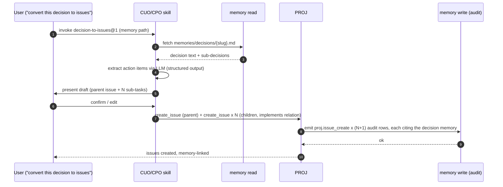

This pattern is how a strategic decision in memory becomes verifiable work in PROJ - with a citation graph that survives leadership changes and tracker migrations.

### Audit chain across PROJ and memory

Every PROJ mutation writes _two_ audit rows: one in PROJ's own `history_event` table (fast, queryable) and one in the local memory (chained, signed, exportable). The memory row carries the same `chain` hash that PROJ's row references via `history_event.memory_chain`. This dual-write is the mechanism behind the "decisions live in memory, not Jira" claim - PROJ's local history is useful for the UI, but the cryptographic provenance lives in memory.

```
-- PROJ history_event row (Postgres, fast queries)
INSERT INTO history_event (id, issue_id, actor_id, kind, from_value, to_value, ts, memory_chain)
VALUES (
  'he_01HZ...',
  'is_01HZ...',
  'sub_stephen@...',
  'status',
  'in-progress',
  'in-review',
  '2026-05-15T08:42:11Z',
  '69e6...488a'   -- <- references the memory audit row's chain hash
);

-- memory audit row (immutable, chained, exportable)
{
  "seq": 18420,
  "ts_ns": 1763112131_000_000_000,
  "op": "put",
  "path": "memories/projects/proj-3110-status-transition.md",
  "actor": "sub_stephen@cyberskill.world",
  "extra": { "issue_code": "PROJ-3110", "from": "in-progress", "to": "in-review" },
  "prev_chain": "...",
  "chain": "69e6...488a"
}
```

## Liquid-Glass UI surfaces - Board / Timeline / Gantt / Brief

PROJ is the design-system exemplar for the rest of CyberOS - every other module's table, timeline, and brief view borrows from PROJ's four canonical UI surfaces. The Liquid-Glass surface treatment (Part 21 of the design system: Umber #45210E base, Ochre #F4BA17 accent, blur backdrop, generous whitespace, Be Vietnam Pro 16px base) lands here first because PROJ is what Members look at all day.

| Surface | Primary use | Default view | Density | Keyboard-first? |
|---|---|---|---|---|
| **Board** (Kanban) | Daily Member workflow - drag issues across columns. | Current cycle, grouped by status, 5 columns | Comfortable (rows ~56 px) | Yes - `j/k` navigate, `e` edit, `1-5` status |
| **Timeline** | Plan view - see what's happening this cycle by day. | Cycle window, grouped by assignee, day columns | Compact (rows ~40 px) | Yes - left/right arrows shift day, up/down arrows shift Member |
| **Gantt** | Multi-cycle planning - see Project-level dependencies. | Project view, 3-month span, dependency arrows | Compact (bars ~28 px) | Partial - `+/-` zoom, click-drag adjusts dates |
| **Brief** | Single-issue deep view - for editing / commenting / linking. | Full-page modal with description (Yjs) + comments + meta sidebar | Spacious (paragraph leading 1.6) | Yes - `c` comment, `l` link memory, `r` review |

### Design tokens (PROJ-specific overlay)

PROJ inherits all tokens from `website/docs/assets/tokens.css` and adds an indigo overlay because the status colour palette is most readable in cool tones (warm anchors would clash with priority colours).

```css
/* tokens.proj.css - PROJ-specific overlay (loaded after tokens.css) */
:root {
  --proj-indigo: #4f46e5;     /* primary action */
  --proj-indigo-bg: #eef2ff;  /* surface tint */
  --proj-indigo-dk: #3730a3;  /* on-hover, text accent */

  /* Status colours - readable on both light + dark surfaces */
  --status-backlog: #94a3b8;   /* slate-400 */
  --status-todo: #3b82f6;      /* blue-500 */
  --status-inprog: #f59e0b;    /* amber-500 */
  --status-inreview: #8b5cf6;  /* violet-500 */
  --status-done: #10b981;      /* emerald-500 */
  --status-cancelled: #64748b; /* slate-500, dimmed */

  /* Priority colours */
  --priority-urgent: #dc2626;  /* red-600 */
  --priority-high: #f97316;    /* orange-500 */
  --priority-medium: #eab308;  /* yellow-500 */
  --priority-low: #22c55e;     /* green-500 */
  --priority-none: transparent;

  /* Liquid-Glass surface (PROJ's primary card treatment) */
  --proj-glass-bg: rgba(248, 250, 252, 0.72);
  --proj-glass-border: rgba(79, 70, 229, 0.12);
  --proj-glass-blur: blur(18px) saturate(180%);
}
```

### Accessibility commitments

- **WCAG 2.1 AA** contrast ratios on every status/priority pill - measured in CI via `axe-core` on the Storybook build.
- **Keyboard-only navigation** for Board + Timeline + Brief - an explicit acceptance criterion in the SPA's e2e suite.
- **Screen-reader labels** on every status transition: "Status changed from In progress to In review" announced via `aria-live=polite`.
- **Focus trap discipline**: the Brief modal traps focus; `Esc` closes without losing the draft (Yjs preserves it).
- **Reduce-motion mode**: `prefers-reduced-motion: reduce` disables drag animations and Yjs presence cursors.
- **Vietnamese diacritic-correct fonts**: Be Vietnam Pro 400/600/800 weights; fallback stack `"Be Vietnam Pro", "Inter", system-ui`.

## Architecture

PROJ is one axum binary with four surfaces (sync-engine WebSocket, REST admin, GraphQL federated subgraph, MCP tool catalogue) and three stores (Postgres for canonical state + Yjs document snapshots, Redis for WS rooms and search cache, S3 for attachments). NATS JetStream fans mutations out to every connected SPA.

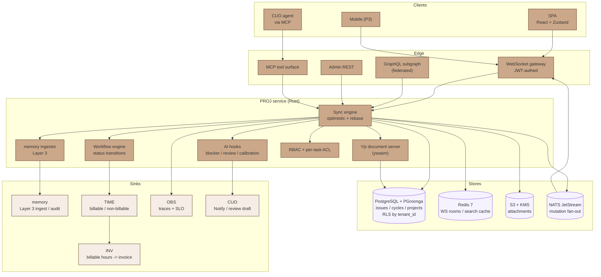

### The four primitives

- **Issue (the atomic unit).** A discrete piece of work. Has title, description (Yjs), status, priority, assignee, estimate, labels, dependencies, parent issue, cycle binding. Comments are sub-resources.
- **Cycle (1-2 week sprint).** A time-boxed bucket of Issues. Has start / end dates, target velocity, retro link. Incomplete Issues auto-roll to the next cycle if the team configures it (task pending).
- **Project (durable container).** A multi-cycle initiative. Has roadmap view, status (planned / active / paused / completed), client visibility flag (visible via PORTAL when the Engagement permits).
- **Engagement (the contract).** The contract under which a Project is delivered for a Client. Carries the rate card, billable / non-billable rules, ACL. TIME -> INV pulls from here. Vietnamese-consultancy-specific.

### Internal components

The `cyberos-proj` crate is building TASK-PROJ-001 slice 1 - Issue / Cycle / Engagement with RLS, the status FSM, and memory-audit emission. The table lists the module's planned file layout; rows marked (task pending) are not yet built.

| Component | Path (planned) | Responsibility |
|---|---|---|
| `sync.rs` | services/proj/src/sync.rs | Sync-engine - optimistic apply, conflict detection, server-canonical broadcast. |
| `crdt.rs` | services/proj/src/crdt.rs | Yjs document server via ywasm. Long-form fields (description, comment body) are Yjs; the rest is LWW with a vector clock. |
| `status_fsm.rs` | services/proj/src/status_fsm.rs | Closed status enum plus the per-project workflow overlay; validates every transition. |
| `blockers.rs` | services/proj/src/blockers.rs | Blocker detection from the comment stream. "blocked by", "waiting on", and dwell-time heuristics -> CUO Notify. |
| `cycle_review.rs` | services/proj/src/cycle_review.rs | End-of-cycle review draft generator. Pulls from issue changelog + comments; CUO-stamped persona; the AM edits before sending. |
| `estimate.rs` | services/proj/src/estimate.rs | Estimate vs actual hours per Member per task class. Surfaces calibration drift to the Member's dashboard. |
| `memory_ingest.rs` | services/proj/src/memory_ingest.rs | Layer 3 ingestion of issues + comments (task pending). Body content gates per ACL. |
| `acl.rs` | services/proj/src/acl.rs | Per-task / per-engagement ACL. Private engagements not visible to non-engaged Members (task pending). |
| `autoroll.rs` | services/proj/src/autoroll.rs | End-of-cycle auto-roll. Incomplete issues move to the next cycle if team config permits (task pending). |
| `nats_fanout.rs` | services/proj/src/nats_fanout.rs | NATS JetStream publisher / subscriber for mutation fan-out. |
| `search.rs` | services/proj/src/search.rs | PGroonga query builder; VN bigram tokenisation. |
| `graphql.rs` | services/proj/src/graphql.rs | Federated subgraph; `@key(fields:"id")` on every primitive. |
| `mcp.rs` | services/proj/src/mcp.rs | MCP tool catalogue exported to CUO. |
| `i18n.rs` | services/proj/src/i18n.rs | vi + en string tables; locale resolved from the JWT claim; status names localised. |
| `migrations/` | services/proj/migrations/ | sqlx migrations with RLS on every table. |

## Data model

The canonical state is PostgreSQL with row-level security by `tenant_id` and, for private engagements, additional ACL enforcement by `engagement_id` membership. Long-form fields are Yjs document snapshots stored as `bytea` blobs; the active CRDT state lives in Redis for the duration of a session.

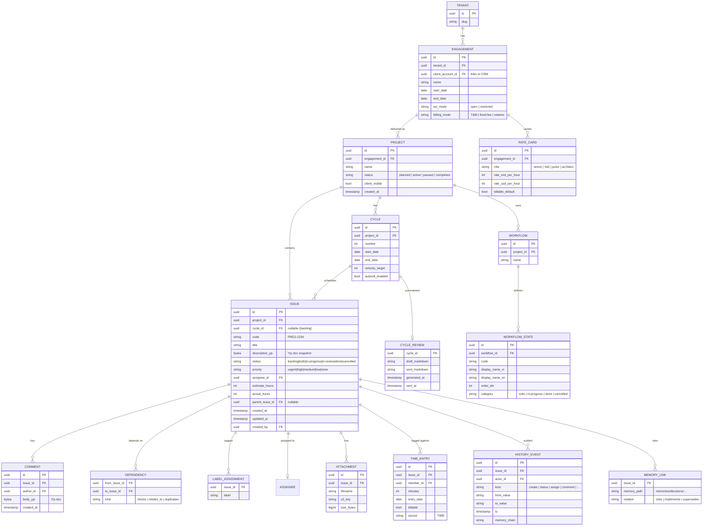

### Status enum + workflow overlay

The status enum is closed (`backlog / todo / in-progress / in-review / done / cancelled`). Per-project workflows can rename and re-order the visible states but always map back to a category in the closed set. The category is what drives velocity calculation, auto-roll, and memory ingestion.

| Status | vi name | en name | Category | Velocity counts? |
|---|---|---|---|---|
| `backlog` | Tồn đọng | Backlog | todo | no |
| `todo` | Cần làm | Todo | todo | no |
| `in-progress` | Đang làm | In progress | in-progress | yes |
| `in-review` | Đang review | In review | in-progress | yes |
| `done` | Hoàn thành | Done | done | yes |
| `cancelled` | Huỷ bỏ | Cancelled | cancelled | no |

## API surface

Four surfaces: a WebSocket sync-engine for the SPA, a GraphQL federated subgraph for cross-module queries, an admin REST for migration and bulk import, and an MCP tool catalogue for CUO. All four share the same RBAC predicate.

### GraphQL subgraph (federated)

```graphql
extend schema
 @link(url: "https://specs.apollo.dev/federation/v2.5", import: ["@key", "@requiresScopes"])

type Engagement @key(fields: "id") {
 id: ID!
 name: String!
 clientAccountId: ID!
 startDate: Date!
 endDate: Date
 billingMode: BillingMode!
 projects: [Project!]!
 rateCards: [RateCard!]!
}

type Project @key(fields: "id") {
 id: ID!
 engagementId: ID!
 name: String!
 status: ProjectStatus!
 clientVisible: Boolean!
 cycles(active: Boolean): [Cycle!]!
 issues(filter: IssueFilter, limit: Int = 50, cursor: String): IssueConnection!
}

type Cycle @key(fields: "id") {
 id: ID!
 projectId: ID!
 number: Int!
 startDate: Date!
 endDate: Date!
 velocityTarget: Int
 issues: [Issue!]!
 review: CycleReview
}

type Issue @key(fields: "id") {
 id: ID!
 code: String!
 title: String!
 description: String! # rendered from Yjs doc
 status: IssueStatus!
 priority: IssuePriority!
 assignee: Subject
 estimateHours: Int
 actualHours: Int
 cycleId: ID
 parent: Issue
 children: [Issue!]!
 dependencies: [Dependency!]!
 comments: [Comment!]!
 labels: [String!]!
 attachments: [Attachment!]!
 memoryLinks: [MemoryLink!]!
 history: [HistoryEvent!]!
}

enum IssueStatus { BACKLOG TODO IN_PROGRESS IN_REVIEW DONE CANCELLED }
enum IssuePriority { URGENT HIGH MEDIUM LOW NONE }
enum ProjectStatus { PLANNED ACTIVE PAUSED COMPLETED }
enum BillingMode { T_AND_M FIXED_FEE RETAINER }

type Mutation {
 createIssue(input: CreateIssueInput!): Issue!
 @requiresScopes(scopes: [["proj.write"]])
 updateIssue(id: ID!, patch: IssuePatch!): Issue!
 assignIssue(id: ID!, assigneeId: ID!): Issue!
 moveIssueToCycle(id: ID!, cycleId: ID): Issue!
 addComment(issueId: ID!, body: String!): Comment!
 closeCycle(cycleId: ID!): CycleReview!
 @requiresScopes(scopes: [["proj.cycle.close"]])
}
```

### Sync-engine WebSocket protocol

```
// Client -> server: optimistic mutation
{
 "op": "issue.update",
 "client_seq": 12834,
 "tenant_id": "01HZ...",
 "issue_id": "01HZ...",
 "patch": { "status": "in-progress", "assignee_id": "01HZ..." },
 "vector_clock": { "spa-stephen-laptop": 47 }
}

// Server -> all room subscribers: canonical state
{
 "op": "issue.state",
 "server_seq": 982341,
 "issue_id": "01HZ...",
 "state": { "status": "in-progress", "assignee_id": "01HZ...", "updated_at": "..." },
 "vector_clock": { "spa-stephen-laptop": 47, "server": 982341 }
}

// Server -> client (conflict, rebase needed)
{
 "op": "rebase",
 "client_seq": 12834,
 "server_state": { ... },
 "reason": "concurrent_modification"
}
```

### MCP tool catalogue

| Tool name | Inputs | Outputs | Annotations |
|---|---|---|---|
| `cyberos.proj.list_issues` | project_id?, cycle_id?, assignee_id?, status? | Issue | readonly, scope=proj.read |
| `cyberos.proj.create_issue` | CreateIssueInput | Issue | scope=proj.write |
| `cyberos.proj.update_issue` | id, patch | Issue | scope=proj.write |
| `cyberos.proj.assign_issue` | id, assignee_id | Issue | scope=proj.write |
| `cyberos.proj.add_comment` | issue_id, body | Comment | scope=proj.write |
| `cyberos.proj.move_to_cycle` | id, cycle_id | Issue | scope=proj.write |
| `cyberos.proj.close_cycle` | cycle_id | CycleReview (draft) | destructive, human-confirm, scope=proj.cycle.close |
| `cyberos.proj.detect_blockers` | project_id? | Issue + reasons | readonly |
| `cyberos.proj.estimate_calibration` | member_id, range | Calibration stats | readonly |

## Key flows

### Flow 1 - create an issue (sync-engine)

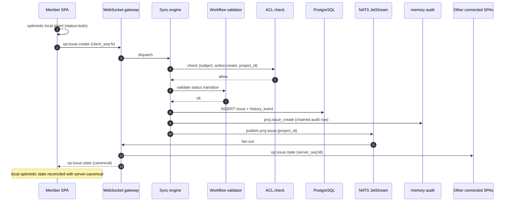

### Flow 2 - concurrent edit + conflict-free merge via Yjs

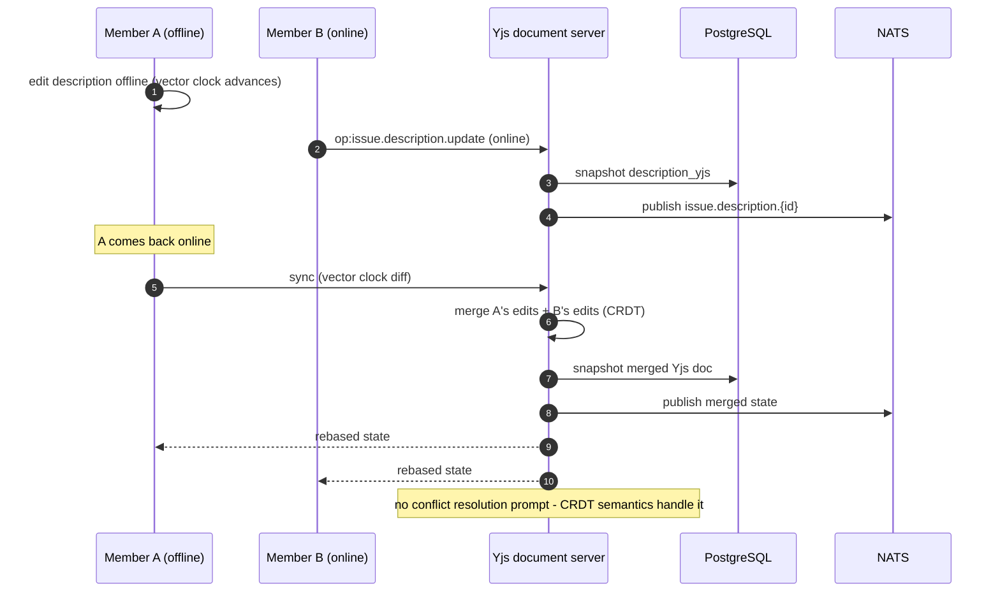

Yjs handles the description / comment-body fields. Scalar fields (status, priority, assignee) use last-write-wins with the server's vector clock as the tiebreaker.

### Flow 3 - AI cycle-review draft at cycle close

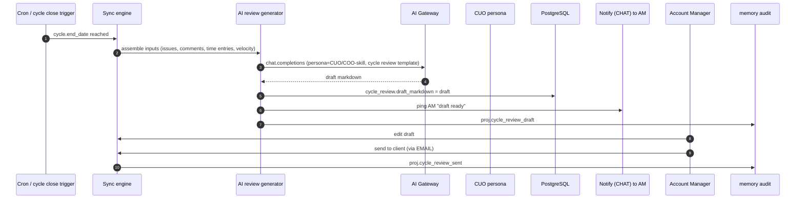

### Flow 4 - blocker detection from comments

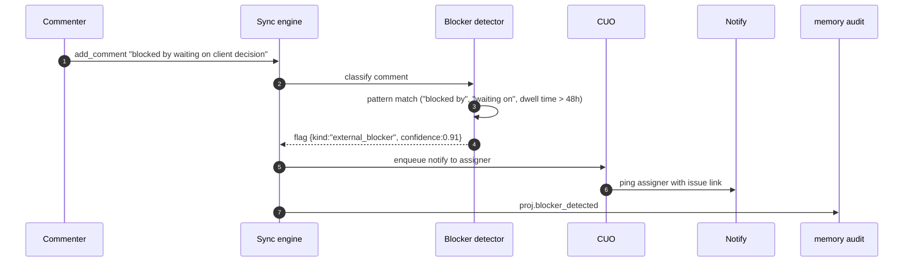

### Flow 5 - estimate calibration nightly batch

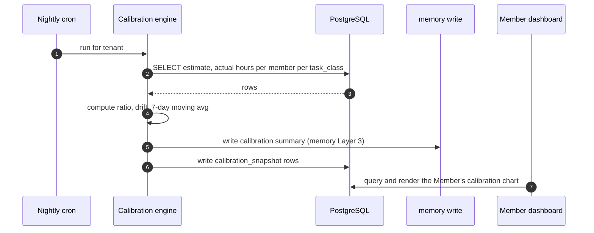

## Issue lifecycle

An issue traverses six canonical states (the closed enum). The per-project workflow overlay may rename or re-order the visible states but the underlying category drives velocity, auto-roll, and memory ingestion.

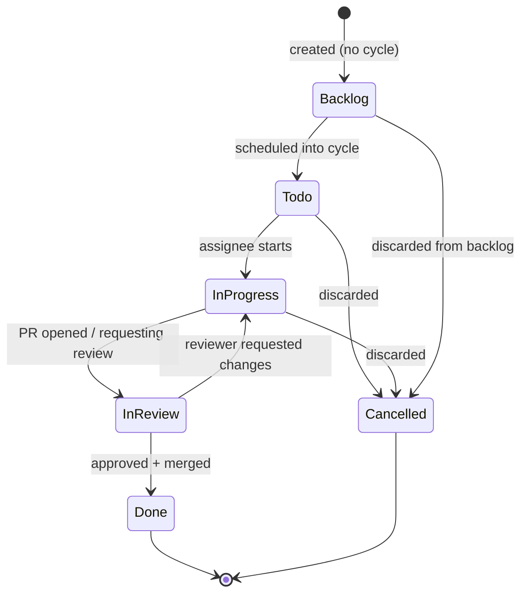

### Auto-roll behaviour at cycle close

| Issue status at cycle close | Auto-roll behaviour | Configurable? |
|---|---|---|
| `todo` | Roll to next cycle | yes (task pending) |
| `in-progress` | Roll to next cycle | yes |
| `in-review` | Roll to next cycle | yes |
| `done` | Stay in original cycle (velocity counts) | no |
| `cancelled` | Stay in original cycle | no |
| `backlog` (unscheduled) | Stay in backlog | n/a |

## Functional requirements

The CyberOS task catalogue is being rebuilt one feature at a time via the open [task-author](https://github.com/cyberskill/cyberos/tree/main/modules/skill/task-author) Agent Skill.

Previous task enumerations were archived 2026-05-14 and are no longer reflected on this page. Specific tasks land here as they are re-authored.

## Non-functional requirements

NFRs that PROJ must satisfy. Cross-referenced at [nfr-catalog.html#proj](../../reference/nfr-catalog.html#proj).

| NFR ID | Concern | Target | Measurement |
|---|---|---|---|
| `N(task pending)` | Issue update mutation | p95 <= 120 ms server-side | histogram via OBS |
| `N(task pending)` | Issue list view (50 issues) | p95 <= 250 ms (network + render) | SPA RUM |
| `N(task pending)` | WebSocket fan-out latency (mutation -> other clients) | p95 <= 200 ms within region | NATS lag metric |
| `N(task pending)` | Memory ingestion (issue create -> indexed) | p95 <= 5 s | memory ingest histogram |
| `N(task pending)` | Offline-edit merge correctness | >= 99.9% | property-based test (10k random workloads) |
| `N(task pending)` | Vietnamese search recall (50-query corpus) | >= 90% | quarterly eval |
| `N(task pending)` | Cycle-review draft acceptance rate | >= 60% by AM | SPA telemetry |
| `N(task pending)` | Service availability (28-day) | >= 99.9% | OBS SLO monitor |
| `N(task pending)` | Private-engagement isolation | = 0 cross-leak | CI test on every PR |
| `N(task pending)` | RLS coverage | 100% of tables | migration-CI gate |
| `N(task pending)` | Mutation durability after WS ack | = 0 dropped under crash | chaos test + memory walk |
| `N(task pending)` | WS connections per tenant per axum task | >= 5k sustained | k6 load test |

## Dependencies

PROJ depends on AUTH for every call, memory for ingestion + audit, TIME for time entries, AI for CUO features, MCP for tool surfacing, and NATS for fan-out. It is depended on by INV (billable hours roll-up), CRM (deal -> engagement link), KB (project docs), and PORTAL (client-visible Project view at P2+).

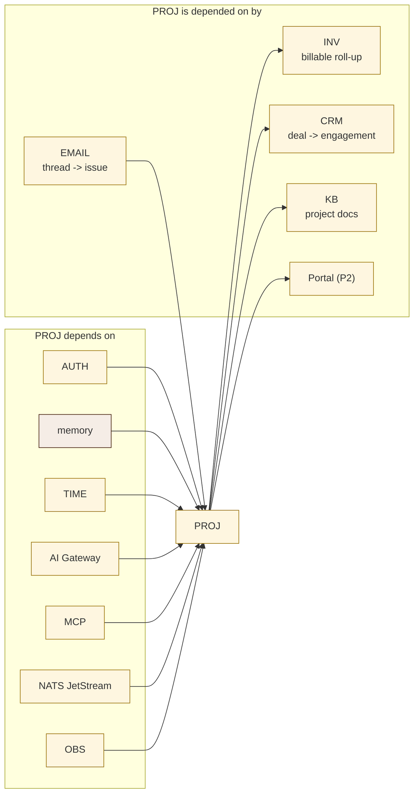

## Compliance scope

PROJ is not a regulator's first stop, but it sits inside the audit trail for delivery work and must satisfy ACL, audit, and DSAR obligations.

| Regulation / standard | Article / clause | PROJ feature that satisfies it |
|---|---|---|
| Vietnam PDPL (Law 91/2025) | Art. 14 - DSAR | DSAR export includes every issue / comment a subject authored. |
| Vietnam Decree 13/2023 | Art. 17 - Processing log | The HISTORY_EVENT table is the processing log; every mutation writes one row. |
| GDPR (EU 2016/679) | Art. 17 - Right to erasure | Soft-tombstone on assignee, then DSAR-driven hard purge via memory. |
| GDPR | Art. 25 - Privacy by design | Private-engagement ACL means non-engaged Members cannot see issue titles. |
| ISO/IEC 27001:2022 | A.8.2 - Privileged access | RBAC + per-engagement ACL gate write operations. |
| ISO/IEC 27001:2022 | A.8.16 - Monitoring | The memory audit chain covers create / status / assign / comment events. |
| SOC 2 Type II | CC6.1 - Logical access | RLS + ACL enforcement at every mutation. |
| SOC 2 Type II | CC7.2 - System monitoring | OBS traces + memory audit cross-correlate. |

## Risk entries

PROJ-specific risks tracked in the [risk register](../../reference/risk-register.html#proj).

| ID | Risk | Likelihood | Impact | Owner | Mitigation |
|---|---|---|---|---|---|
| `R-PROJ-001` | Sync-engine state divergence between SPA and server | Medium | High | CTO | Property-based tests (10k random workloads); server is canonical; client always rebases on conflict. |
| `R-PROJ-002` | Yjs CRDT memory leak on long-running document sessions | Medium | Medium | CTO | Snapshot to Postgres every 60 s; evict in-memory doc after 5 min idle; reload on demand. |
| `R-PROJ-003` | Private-engagement leak via cross-tenant graph query | Low | High | CSO | RLS + ACL CI gates; quarterly red-team review of the GraphQL surface. |
| `R-PROJ-004` | NATS JetStream backlog -> WS clients see stale state | Medium | Medium | CTO | NATS depth alerted at > 1k msgs; SPA reconnect triggers a full state refetch. |
| `R-PROJ-005` | Auto-roll inflates the next cycle and burns out the team | Medium | Medium | COO | Auto-roll opt-in per project; the AM sees the roll-over count in the cycle review draft. |
| `R-PROJ-006` | Cycle-review draft hallucinates events that did not occur | Medium | Medium | COO | The draft is an editable suggestion, never auto-sent; the AM is accountable for content. |
| `R-PROJ-007` | Blocker detector false-positive spam | Medium | Low | COO | Confidence threshold >= 0.85; user "not a blocker" feedback trains down. |
| `R-PROJ-008` | Memory ingestion lag breaks cross-module search | Low | Medium | CDO | p95 <= 5 s SLO; backlog alarm pages CDO + CTO. |
| `R-PROJ-009` | Calibration data weaponised in performance review | Medium | Low | CHRO | Calibration visible only to Member + manager + CHRO; never client-visible; never used as a sole performance signal (HR policy). |
| `R-PROJ-010` | Vietnamese tokenisation regressions on PGroonga upgrade | Low | Low | CTO | 50-query VN test corpus run on every PGroonga upgrade. |
| `R-PROJ-011` | **Orchestration spine becomes a single point of failure** - a PROJ outage cascades to TIME / INV / KB / REW / OKR / PORTAL simultaneously | Low | Critical | CTO | SLO >= 99.9% with multi-AZ Postgres + Redis + NATS; degraded-mode reads from the memory audit chain when the PROJ DB is unreachable; OBS-driven dependency map surfaces the fallout radius; quarterly chaos test cuts PROJ off and verifies downstream module graceful degradation. |
| `R-PROJ-012` | Join-contract breaking change ships without ADR + counterparty co-sign | Medium | High | CTO | CI gate on `services/proj/contracts/*` requires > 1 module owner approval; contract schema versioned + frozen at minor releases; deprecation window enforced via a dual-shape test. |
| `R-PROJ-013` | **Fixed-fee scope creep eats margin** - work delivered exceeds milestone scope, margin drops below 30% before the AM notices | High | High | COO | Margin watchdog at P2: per-Engagement margin chart + CUO Notify when projected margin < 30%; mandatory weekly AM review of fixed-fee deals; a "scope change order" workflow surfaces a billable change. |
| `R-PROJ-014` | Memory citation drift - an Issue cites a memory path that's been moved or tombstoned | Medium | Low | CDO | The `MEMORY_LINK` table stores the chain hash at time of citation; on memory move/tombstone, the citation is flagged stale + the Member sees a UI nudge to update; never auto-broken because memory is append-only at the chain layer. |
| `R-PROJ-015` | AI cycle-review draft cites work that was actually done in another cycle | Medium | Medium | COO | The draft generator is constrained to events with `ts` inside the cycle window; the LLM prompt includes explicit boundary dates; the AM signs off as the human-in-loop; never auto-sent. |
| `R-PROJ-016` | Engagement billing-mode change mid-cycle creates an inconsistent invoice | Low | High | COO | A billing-mode change requires an explicit "effective_from" date + AM sign-off + INV draft preview; time entries before that date use the prior mode's rate-card snapshot (immutable). |
| `R-PROJ-017` | The decision-to-issues skill produces a parent + children that drift from the memory's intent | Medium | Medium | CPO | The skill outputs a confidence score per sub-task; the Member must confirm before issues are created; a CI replay test ensures > 80% of historical decision memories produce semantically aligned issues (LLM-judged on a fixed eval set). |
| `R-PROJ-018` | The Liquid-Glass surface fails accessibility at lower contrast on Members' laptops | Medium | Medium | CDO | axe-core CI gate on the Storybook build; per-pill contrast measured against the worst-case backdrop (busy timeline view); a failing component blocks the PR. |
| `R-PROJ-019` | **SPA cold-load p95 > 5 s on Vietnamese mobile networks** - Members give up and use Excel | Medium | High | CTO | SPA bundle < 220 KB gzipped; route-level code-split; preload the critical font subset (VN diacritics) inline; RUM monitor in OBS targeting Viettel/Mobifone networks specifically. |
| `R-PROJ-020` | NATS JetStream backlog after a multi-AZ failover leaves SPAs displaying stale state for > 30 s | Low | Medium | CTO | NATS depth gauge alerted at > 1k msgs; SPA reconnect after WS close triggers a full state refetch; a degraded-mode banner is shown to the Member. |

## KPIs

PROJ rolls up KPIs covering delivery cadence, sync-engine performance, AI feature efficacy, and Member experience.

| KPI | Formula | Source | Target |
|---|---|---|---|
| **Cycle velocity stability** | stddev(completed_points) / mean | cycle_review | <= 0.25 (steady) |
| **Issue update mutation p95** | histogram | OBS | <= 120 ms |
| **WS fan-out lag p95** | histogram | NATS | <= 200 ms |
| **Auto-rolled issues per cycle** | count | cycle_review | tracked; alert if > 30% |
| **AI cycle-review acceptance** | sent / drafted | SPA telemetry | >= 60% |
| **Blocker-detection precision** | true_positive / flagged | user feedback | >= 80% |
| **Memory ingestion lag p95** | histogram | memory | <= 5 s |
| **Estimate calibration drift** | actual / estimate - 1 | calibration_snapshot | tracked per Member |
| **Offline-merge incidents** | conflicts / month | memory audit | tracked; expect < 5 / mo |
| **Join-contract stability** | breaking changes / quarter, weighted by counterparty count | contract-schema CI gate | <= 1 per quarter (with full ADR + dual-shape window) |
| **Engagement margin (T&M)** | (revenue - cost) / revenue per Engagement | INV + cost ledger | tracked per Engagement; target >= 35% |
| **Engagement margin (fixed-fee)** | (fee - hours_burned x cost_per_hour) / fee | PROJ time entries + INV | >= 30% on close; alert if projection < 30% mid-engagement (`R-PROJ-013`) |
| **Issues with memory citation** | issues_with_memory_link / total issues | MEMORY_LINK table | tracked; expect >= 40% of high-priority issues to cite a memory |
| **Decision-to-issues skill acceptance** | drafts confirmed by Member / drafts generated | cuo.cpo.decision-to-issues@1 telemetry | >= 70% |
| **SPA cold-load p95 (VN mobile)** | RUM Time-to-Interactive on Viettel/Mobifone networks | OBS RUM | <= 3.5 s P50, <= 5 s P95 |
| **Citation-drift rate** | MEMORY_LINKs flagged stale / total MEMORY_LINKs, 28-day window | MEMORY_LINK + memory audit | <= 5% |
| **Cross-tenant ACL rejection rate** | RLS / ACL rejections / total queries | Postgres audit log | tracked; spike = security alert |
| **Dogfooding cycle-review draft acceptance (internal)** | internal team draft accept-rate | SPA telemetry filtered to `tenant_id=org:cyberskill` | >= 70% (the founders use this themselves before selling it) |

## RACI matrix

PROJ is owned by the COO seat. Today (COO vacant), the CEO is interim accountable; the CTO owns engineering; Account Managers own per-engagement workflow configuration.

| Activity | CEO | CTO | COO | CHRO | CDO | AM |
|---|---|---|---|---|---|---|
| Service design + spec | A | R | C | I | C | C |
| Sync-engine implementation | I | A/R | I | I | I | I |
| Engagement / workflow config | I | C | A | I | I | R |
| Cycle review send | I | I | C | I | I | A/R |
| Calibration policy (HR) | C | I | C | A/R | I | I |
| Memory ingestion review | I | C | I | I | A/R | I |
| Private-engagement ACL audit | C | R | A | I | I | I |
| VN localisation review | C | C | A/R | I | I | C |
| Incident response | A | R | R | I | C | I |

**R** Responsible, **A** Accountable, **C** Consulted, **I** Informed.

## Planned CLI surface

A single admin CLI `cyberos-proj` for tenant operators and an SDK for scripted bulk edits.

### 1. Create an Engagement

```
$ cyberos-proj engagement create \
 --tenant cyberskill \
 --client-account acme-vn \
 --name "ACME Q3 platform build" \
 --billing-mode T_AND_M \
 --start 2026-07-01

[engagement created]
 id: 01HZK2...
 client: acme-vn
 billing: T_AND_M
 audit: memory seq=15014 chain=1f2e...3d4c
```

### 2. Create a Cycle and bulk-create Issues

```
$ cyberos-proj cycle create --project pj-acme-platform --number 7 --start 2026-08-04 --weeks 2
[cycle created] id=01HZK3... number=7 dates=2026-08-04 / 2026-08-17

$ cyberos-proj issue bulk-create --cycle 01HZK3... --file backlog.yaml
[bulk-create] parsed 12 issues
[bulk-create] PROJ-1247 "Auth integration" -> assignee=linh@...
[bulk-create] PROJ-1248 "Migration runbook" -> assignee=tu@...
[bulk-create] ... 10 more
[bulk-create] 12 created, 0 errors
[audit] memory seq=15018 chain=...
```

### 3. Close a Cycle (auto-generate review draft)

```
$ cyberos-proj cycle close --id 01HZK3...

[cycle close] 12 issues - 8 done, 3 rolled, 1 cancelled
[review draft] generated via CUO/COO-skill
[review draft] saved to ./cycle-7-review.md (124 lines)
[notify] Account Manager pinged in CHAT
[audit] memory seq=15042 chain=...
```

### 4. Move all in-progress issues to the next cycle

```
$ cyberos-proj cycle rollover --from 01HZK3... --to 01HZK4... --status in-progress

[rollover] 3 issues moved
[rollover] PROJ-1249, PROJ-1251, PROJ-1255
[audit] memory seq=15045 chain=...
```

### 5. Estimate calibration report

```
$ cyberos-proj calibration --member linh@cyberskill.world --range 90d

member: linh@cyberskill.world
task_class estimates actual_avg ratio trend
backend.feature 18 1.18x +18% improving
infra.config 9 0.96x -4% stable
qa.test_plan 12 1.42x +42% widening
overall 39 1.18x +18% improving
```

### 6. Export a DSAR bundle

```
$ cyberos-proj dsar-export --subject linh@cyberskill.world --output linh-proj.zip

[dsar] subject: linh@cyberskill.world
[dsar] issues: 218 (authored), 612 (assigned)
[dsar] comments: 1,894
[dsar] history: 4,217
[dsar] written: linh-proj.zip (38 MB)
```

### 7. Replay a sync-engine conflict for debug

```
$ cyberos-proj sync replay --tenant cyberskill --since 1h --filter "issue.update"

[replay] 47 mutations, 2 rebases, 0 lost
[rebase] PROJ-1247 client_seq=18 server_seq=98234 reason=concurrent_modification
[rebase] PROJ-1255 client_seq=22 server_seq=98241 reason=concurrent_modification
```

## Phase status & estimates

- **Status:** planned - P1; slice 1 in build
- **Est. LoC:** ~11,000 - Rust + TS + Yjs
- **Planned tests:** 140+ - including CRDT property-tests
- **External libs:** ~14 - axum, sqlx, ywasm, NATS
- **CLI subcommands:** ~22 planned - `cyberos-proj`
- **P1 budget:** ~$80/mo - Fargate + RDS + Redis + NATS

| Capability | Status |
|---|---|
| Four primitives (Issue / Cycle / Project / Engagement) | planned, P1 |
| Sync-engine WS + optimistic apply | planned, P1 |
| Yjs CRDT for description / comments | planned, P1 |
| Per-engagement rate cards | planned, P1 |
| TIME <-> PROJ <-> INV chain | planned, P1 |
| Auto-roll at cycle close | planned, P1 |
| AI blocker detection | planned, P1 |
| AI cycle-review draft | planned, P1 |
| Estimate calibration report | planned, P1 |
| Memory Layer 3 ingestion | planned, P1 |
| Per-task / per-engagement ACL | planned, P1 |
| Vietnamese localisation | planned, P1 |
| Dependency graph + cycle detection | planned, P1 |
| Custom workflow per project | planned, P1+ |
| Mobile (offline-first) | planned, P3+ |
| Client-visible PORTAL view | planned, P2+ |

## References

- **Cross-module join contracts:** the "Orchestration spine" section above - the canonical table that every counterparty module reads from.
- **Engagement economic model:** the "Engagement economics" section above - 3 billing modes + rate-card YAML + billable cascade.
- **Memory-anchored decisions:** the "Memory-anchored decisions" section above - citation relations + decision-to-issues sequence + dual-write audit chain.
- **Liquid-Glass UI exemplar:** the "Liquid-Glass UI surfaces" section above - 4 canonical surfaces + tokens.proj.css overlay + accessibility commitments.
- **Memory auto-sync vision:** [MEMORY_AUTOSYNC_DESIGN.md §5 (capture surfaces)](../../docs/MEMORY_AUTOSYNC_DESIGN.md) - PROJ mutations are one of the four canonical capture inputs to the local memory.
- **task authoring discipline:** [modules/skill/task-audit/AUTHORING_DISCIPLINE.md](https://github.com/cyberskill/cyberos/blob/main/modules/skill/task-audit/AUTHORING_DISCIPLINE.md) - PROJ tasks re-authored one-by-one via the `task-author` Agent Skill; "(task pending)" markers are intentional placeholders.
- **Build-readiness audit:** `archive/2026-05-14/AUDIT_AND_PLAN.md` (archived; see `cyberos/CHANGELOG.md`) - PROJ placed at P1 mid in the P1 sequence (after the CHAT decommission gate clears at P0 exit).
- **Research review:** `archive/2026-05-14/RESEARCH_REVIEW.md` (archived; see `cyberos/CHANGELOG.md`) - the reviewer flagged the consultancy-Engagement primitive as the highest-impact differentiator vs Linear/Jira; the orchestration-spine framing addresses §6 "what makes this not a feature?".
- **Cross-module page links:** [memory.html](../memory/index.html), [skill.html](../skill/index.html), [auth.html](../auth/index.html), [chat.html](../chat/index.html), [time.html](../time/index.html), [inv.html](../inv/index.html), [crm.html](../crm/index.html), [kb.html](../kb/index.html), [rew.html](../rew/index.html), [okr.html](../okr/index.html), [portal.html](../portal/index.html)
- **Linear sync-engine:** Tuomas Artman, "Scaling the Linear Sync Engine" (2023 talk) - informs the optimistic / rebase pattern.
- **Yjs CRDT framework:** `github.com/yjs/yjs`; ywasm Rust binding.
- **PGroonga + TinySegmenter:** Postgres full-text search with VN tokenisation; baseline recall >= 90% on a 50-query corpus.
- **NATS JetStream:** message-streaming layer for WebSocket fan-out.
- **Apollo Federation v2.5:** subgraph composition spec; PROJ exposes the federated subgraph that every cross-module GraphQL query goes through.
- **Vietnam PDPL (Law 91/2025):** Art. 7 (data-subject rights), Art. 14 (DSAR), Art. 20 (security obligations).
- **Architecture context:** [infrastructure.html#proj](../../architecture/infrastructure.html#proj).

## Personas & skill bundles that touch PROJ

PROJ is the work-tracking surface most CUO personas read from and write to. The catalog spans 47 personas with 220+ workflows and their paired author/audit skill bundles; the ones below are PROJ-affined in particular.

**Persona affinities (8 of 47):**

- [chief-operating-officer](https://github.com/cyberskill/cyberos/tree/main/modules/cuo/chief-operating-officer/workflows) - weekly cadence + cycle reviews + delivery review
- [chief-product-officer](https://github.com/cyberskill/cyberos/tree/main/modules/cuo/chief-product-officer/workflows) - roadmap-planning + feature-prd-intake
- [chief-technology-officer](https://github.com/cyberskill/cyberos/tree/main/modules/cuo/chief-technology-officer/workflows) - deploy-readiness-review + post-incident-review
- [chief-of-staff](https://github.com/cyberskill/cyberos/tree/main/modules/cuo/chief-of-staff/workflows) - decision-log-keeping + special-project-charter
- [chief-transformation-officer](https://github.com/cyberskill/cyberos/tree/main/modules/cuo/chief-transformation-officer/workflows) - per-program-charter
- [chief-innovation-officer](https://github.com/cyberskill/cyberos/tree/main/modules/cuo/chief-innovation-officer/workflows) - per-innovation-charter
- [chief-automation-officer](https://github.com/cyberskill/cyberos/tree/main/modules/cuo/chief-automation-officer/workflows) - per-automation-charter
- [chief-restructuring-officer](https://github.com/cyberskill/cyberos/tree/main/modules/cuo/chief-restructuring-officer/workflows) - per-turnaround-plan

**Skill-bundle reads & writes:**

- [task-author](https://github.com/cyberskill/cyberos/tree/main/modules/skill/task-author) + audit - drafts a task Markdown that becomes a PROJ Issue on commit
- [implementation-plan-author](https://github.com/cyberskill/cyberos/tree/main/modules/skill/implementation-plan-author) + audit - explodes a task into a child-issue tree
- [project-plan-author](https://github.com/cyberskill/cyberos/tree/main/modules/skill/project-plan-author) + audit - per-program project plan written to PROJ Cycles
- [stage-gate-author](https://github.com/cyberskill/cyberos/tree/main/modules/skill/stage-gate-author) + audit - per-cycle exit-gate adjudication
- [retrospective-author](https://github.com/cyberskill/cyberos/tree/main/modules/skill/retrospective-author) + audit - end-of-cycle retro draft
- [postmortem-author](https://github.com/cyberskill/cyberos/tree/main/modules/skill/postmortem-author) + audit - post-sev1/sev2 blameless post-mortem

[Previous module: EMAIL](../email/index.html) | [Next module: TIME](../time/index.html)

## Changelog

History lives in the [changelog](./changelog.html); this page describes only the current state.
